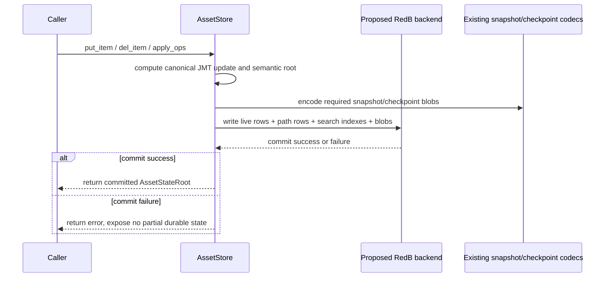

<!-- markdownlint-disable MD001 MD022 MD032 MD033 MD047 -->
# Phase 016: JMT Search And Redb - Context

**Gathered:** 2026-03-23
**Status:** Ready for planning

<domain>
## Phase Boundary

This phase adds a storage-owned search surface for JMT-backed asset state and a
RedB-backed durability path for live storage state. The search scope covers
exact lookup by canonical `AssetPath`, exact lookup by `asset_id`, listing by
`definition_id`, listing by `definition_id + serial_id`, and ordered
prefix/range pagination. The durability scope covers save/load plus synchronous
disk commit for every mutating live storage call. The phase does not change the
canonical consensus path or let secondary indexes affect committed roots.

</domain>

<decisions>
## Implementation Decisions

### Search Contract
- **D-01:** Public search inputs must support exact lookup by canonical
  `AssetPath`.
- **D-02:** Public search inputs must support exact lookup by `asset_id`.
- **D-03:** Public search inputs must support list queries by
  `definition_id`.
- **D-04:** `serial_id` list queries are scoped within one `definition_id`
  only, not global across all definitions.
- **D-05:** The phase includes ordered prefix/range scan and pagination
  support.

### Public API Guarantees
- **D-06:** Only the canonical path remains the guaranteed canonical storage
  contract.
- **D-07:** Secondary indexes and list queries are convenience APIs, not new
  consensus-bound semantics.

### Result Ordering
- **D-08:** All list, prefix, range, and pagination results must use one
  deterministic canonical order: `definition_id`, then `serial_id`, then
  `asset_id`.
- **D-09:** Pagination tokens and replay expectations must derive from that
  canonical order rather than backend iteration order.

### RedB Persistence Model
- **D-10:** The phase must support a RedB-backed durability path for live
  storage state, not just file-backed snapshot/checkpoint artifacts.
- **D-11:** Snapshot and checkpoint artifacts must be serialized with the
  existing canonical storage codecs and persisted as canonical binary blobs in
  RedB.
- **D-12:** RedB keys for persisted artifacts must use the existing
  content-addressed ids such as `PrepSnapshotId`, `CheckpointDraftId`,
  `CheckpointId`, and related execution/link ids.
- **D-13:** Loading durable state must rehydrate a full storage-owned
  `AssetStore` from RedB tables, including live JMT state, roots cache,
  canonical path index, and secondary search indexes.
- **D-14:** Every mutating live-storage API call must commit synchronously to
  RedB before returning.
- **D-15:** Each synchronous write transaction must atomically persist live JMT
  updates together with auto-generated snapshot/checkpoint artifacts rather
  than leaving artifact creation to a later explicit save step.
- **D-16:** Snapshot and checkpoint save/load concerns stay fully
  storage-owned. The RedB implementation for JMT persistence must be designed
  from storage requirements, not by reusing wallet persistence code or schema.
- **D-17:** No existing `redb` dependency, module, or storage backend is
  verified today in `Cargo.toml` or `crates/z00z_storage`, so RedB support must
  be planned as new storage-owned backend work rather than as an extension of
  an already-present adapter.

### Planner Discretion
- Exact table layout, key encoding, and internal adapter boundaries for RedB.
- Whether secondary indexes are materialized eagerly or derived through a
  storage-owned read model, as long as roots remain unchanged.
- Concrete pagination token encoding and helper type names.

### Execution Order And Dependency Gates
1. Freeze the canonical RedB identity contract first: key families, value
   classes, and the rule that snapshot/checkpoint blobs stay byte-compatible
   with existing canonical codecs and ids.
2. Introduce one storage-owned durable backend boundary for live state plus
   artifact persistence before adding public search APIs. Search work must not
   invent a separate persistence path.
3. Implement durable load next, so one RedB-backed load can rebuild a usable
   `AssetStore` with the same canonical root semantics before any new query API
   depends on persisted indexes.
4. Wire synchronous commit at the existing mutation boundary in
   `AssetStore::{put_item, del_item, apply_ops}` so one write path owns both
   JMT updates and artifact persistence.
5. Add public search APIs only after durable write and durable load are stable,
   because pagination tokens and result ordering must be derived from durable
   canonical ordering rather than ad hoc in-memory iteration.
6. Add backend and API tests last, after write/load/query semantics are fixed,
   so tests assert one contract instead of chasing moving internal layouts.

### Blockers And Non-Negotiables
- If one RedB write transaction cannot atomically persist live JMT updates and
  the required snapshot/checkpoint blobs, the phase is blocked and must not
  degrade to background flushing or eventual artifact generation.
- If durable load cannot reconstruct the same canonical root and canonical-path
  lookup semantics as the committed in-memory state, the phase is blocked even
  if raw blobs can be read back.
- Secondary search indexes may be rebuilt or materialized differently
  internally, but they must never become an alternative source of truth for the
  canonical root or canonical-path ownership.
- The phase must not silently fall back to filesystem-only durability for live
  mutation calls. File-backed snapshot/checkpoint stores remain reference
  patterns, not a substitute for the required RedB-backed live-state contract.

### Durable Write Sequence

</decisions>

<specifics>
## Specific Ideas

- Search is needed for these scenarios: find one asset by `asset_id`, find all
  assets by `definition_id`, find all assets by scoped `serial_id`, and expose
  range/prefix queries with pagination.
- Search design must decide up front what is searchable, what is publicly
  guaranteed, what order results use, and whether the surface is canonical or
  convenience-only.
- The RedB persistence path must be defined directly from storage durability,
  serialization, and load requirements.
- The user explicitly wants live in-memory changes committed to disk on each
  mutating call.
- Snapshot/checkpoint persistence is not a separate export-only path: canonical
  encoded blobs must be stored in RedB and generated as part of each committed
  live-state write.
- Durable load must rebuild the in-memory `AssetStore` rather than replaying
  from snapshots lazily.

## Validation Gates

- **Gate V1 - Canonical bytes and ids:** snapshot and checkpoint blobs written
  through RedB must roundtrip through the existing snapshot/checkpoint codecs
  without changing derived ids.
- **Gate V2 - Durable rehydration:** loading from RedB must rebuild an
  `AssetStore` that returns the same canonical `root()` and the same
  `get_item(AssetPath)` results for committed data.
- **Gate V3 - Atomic write boundary:** a failed durable write must not leave a
  state where live JMT rows are visible without their required artifact blobs,
  or artifact blobs are visible for a state root that was not committed.
- **Gate V4 - Search determinism:** definition, scoped-serial, range, prefix,
  and pagination queries must produce stable ordering from canonical path order
  rather than backend iteration order.
- **Gate V5 - Boundary safety:** tests must prove that adding or rebuilding
  secondary indexes does not change committed roots or canonical-path
  ownership.

</specifics>

<canonical_refs>
## Canonical References

**Downstream agents MUST read these before planning or implementing.**

### Existing storage semantics
- `crates/z00z_storage/README.md` — canonical `AssetPath` semantics and the
  rule that side indexes must not change committed roots.
- `crates/z00z_storage/src/assets/README.MD` — typed asset-store boundary,
  proof contract, and storage-owned path semantics used by downstream crates.
- `.planning/phases/015-jmt-serialization-visualization/015-CONTEXT.md` —
  prior storage-owned boundary decisions from Phase 015.
- `crates/z00z_storage/src/assets/store.rs` — current in-memory JMT store,
  canonical path handling, and mutation boundary.

### Existing storage persistence
- `crates/z00z_storage/src/snapshot/store.rs` — current storage-owned save/load
  contract for canonical snapshots.
- `crates/z00z_storage/src/snapshot/codec.rs` — canonical binary snapshot
  encoding and content-id derivation that RedB persistence must preserve.
- `crates/z00z_storage/src/checkpoint/store.rs` — current checkpoint store
  contract and artifact classes that need RedB persistence equivalents.
- `crates/z00z_storage/src/checkpoint/codec.rs` — canonical checkpoint binary
  encoders and decoders for drafts, artifacts, links, and exec inputs.
- `crates/z00z_storage/src/error.rs` — current storage and checkpoint error
  surface that constrains new persistence behavior.

### Required codebase checks during planning
- Confirm and document the crate/dependency change needed to introduce `redb`,
  because no current `redb` usage is verified in `Cargo.toml` or
  `crates/z00z_storage`.
- Verify whether RedB support should extend an existing storage module or live
  behind a new storage-owned backend module. No existing RedB backend file is
  verified in the current codebase.
- Treat any new RedB file path, trait, or adapter name as **proposed** until
  it is confirmed during planning against the live module tree.

</canonical_refs>

<code_context>
## Existing Code Insights

### Reusable Assets
- `AssetStore` in `crates/z00z_storage/src/assets/store.rs`: existing
  storage-owned mutation boundary and canonical path model.
- `PrepFsStore` in `crates/z00z_storage/src/snapshot/store.rs`: existing
  storage-owned save/load facade pattern.
- Existing snapshot/checkpoint codec modules already provide canonical binary
  payloads and stable derived ids suitable for RedB key-value persistence.

### Established Patterns
- Canonical ordering and identity are already tied to the hierarchical
  `AssetPath { definition_id, serial_id, asset_id }` contract.
- Side indexes are explicitly allowed only as non-consensus helpers.
- Storage persistence uses `z00z_utils` I/O and codec abstractions instead of
  ad hoc filesystem logic.
- Snapshot ids and checkpoint ids are already derived from canonical binary
  encodings, so RedB persistence can preserve identity by storing those bytes
  directly instead of inventing a new artifact schema.

### Integration Points
- New search APIs should stay under `z00z_storage` rather than leaking through
  wallet or core crates.
- RedB durability should integrate at the storage boundary, alongside existing
  snapshot/checkpoint persistence surfaces.
- Live load must reconstruct `MemTreeStore`, committed roots, canonical path
  bindings, and secondary search indexes from RedB-backed durable state.
- Pagination and ordering semantics must be testable from storage-level APIs.

### Proposed Integration Targets
- **Existing target:** `crates/z00z_storage/src/assets/store.rs` owns the
  current mutation boundary and is the first place to verify how synchronous
  durable commits can be attached without widening public semantics.
- **Existing targets:** `crates/z00z_storage/src/snapshot/store.rs` and
  `crates/z00z_storage/src/checkpoint/store.rs` own the current artifact
  persistence contracts and should remain the canonical source for artifact
  save/load rules.
- **Proposed targets:** any new RedB backend modules, helpers, or test files
  are planning-time proposals only and must be named as proposals until the
  planner confirms the final module placement.

### Test Planning Anchors
- Extend storage-owned backend tests around snapshot/checkpoint save-load
  roundtrips to prove canonical blob and id stability under RedB.
- Add durable rehydration tests that compare pre-commit and post-load
  `AssetStore::root()` plus canonical `get_item()` results for the same paths.
- Add search API tests that assert deterministic ordering and pagination under
  inserted data that would expose backend-order drift.
- Keep white-box in-memory invariants near existing `assets/store_internal`
  tests, but treat RedB persistence behavior as backend-contract coverage
  rather than as a replacement for current white-box tests.

</code_context>

<deferred>
## Deferred Ideas

- Global `serial_id` search across all definitions.
- Elevating secondary indexes from convenience APIs to canonical public
  contracts.
- Any design where secondary indexes alter committed roots or consensus-facing
  semantics.

</deferred>

---

*Phase: 016-jmt-search-and-redb*
*Context gathered: 2026-03-23*