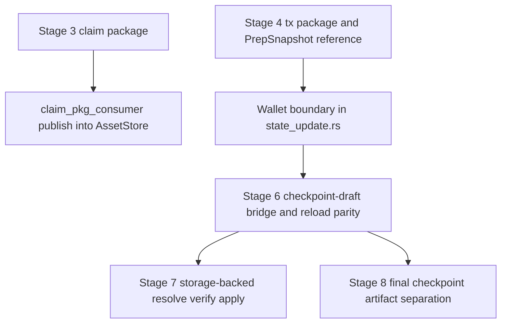

<!-- markdownlint-disable MD001 MD022 MD032 MD033 MD047 -->
# Phase 17: 017-scenario_1 - Context

**Gathered:** 2026-03-24 (assumptions mode)
**Status:** Ready for planning

<domain>
## Phase Boundary

Continue `crates/z00z_simulator/src/scenario_1` so the latest `z00z_storage` work is integrated into the simulator and claim / regular transfer flows are driven by storage-owned JMT state transitions validated against a RedB-backed persistent storage file.

This phase is intentionally ordered:

- Stage 4 prepares the claim/transfer handoff, persists the storage-owned pre-state snapshot, and emits `checkpoint_prep.json` only as a transport reference.
- Stage 5 is the first wallet/storage boundary and must decode and validate canonical storage witness bytes before any downstream application step.
- Stage 6 remains the checkpoint-draft bridge and reload-parity verifier for the Stage 4 transport artifacts; it must stop owning the canonical apply path.
- Stage 7 owns the storage-backed `resolve -> verify -> apply` path for regular Alice -> Bob transfers and replaces `SimState` as the canonical execution owner.
- Stage 8 owns checkpoint finalization and artifact separation so the draft prep data and the canonical executed checkpoint stay distinct.

The phase covers publishing claim outputs into `z00z_storage`, making regular Alice -> Bob transfers resolve canonical pre-state from storage, ensuring transaction inputs and outputs update the JMT storage state on both claim and transfer paths, exercising save/load/search on JMT storage, verifying checkpoints and snapshots after reload, validating canonical inclusion proofs, finishing the remaining TODOs in `scenario_design.yaml`, and extending the scenario with stage 7-8 so storage-backed execution and checkpoint finalization stay separable.

</domain>

<decisions>
## Implementation Decisions

### Storage mutation boundary
- **D-01:** Claim publication and live-state asset updates will route through storage-owned `AssetStore` mutation APIs, with batched `apply_ops` as the canonical write boundary.
- **D-02:** `SimState` remains a simulator orchestration aid only; it must not own the canonical JMT state transition for claim or transfer execution.
- **D-03:** Claim outputs will be published through the storage-owned publish path so the simulator reflects canonical `definition_id -> serial_id -> asset_id` state.
- **D-04:** Claim and Alice -> Bob execution must update JMT storage inputs and outputs directly, not only emit simulator artifacts.

### Canonical proof boundary
- **D-05:** Stage 4, Stage 5, and Stage 6 will use storage-owned `ProofBlob`/`ProofItem`/`chk_blob` validation as the authoritative witness contract.
- **D-06:** Compatibility-root rebinding and demo-specific witness shims will be removed from the canonical execution path.
- **D-07:** The first wallet/storage boundary will validate canonical storage witness bytes and preserve full `AssetPath` binding instead of compact refs alone.

### Stage 7-8 decomposition
- **D-08:** Phase 017 will add stage 7 and stage 8 rather than overloading the existing stage 6 with all remaining storage-backed execution work.
- **D-09:** Stage 7 will own the storage-backed `resolve -> verify -> apply` adapter path for regular transfer execution.
- **D-10:** Stage 8 will own checkpoint finalization and artifact separation, so draft checkpoint data and the canonical executed checkpoint artifact stay distinct.

### Checkpoint and snapshot flow
- **D-11:** Canonical `PrepSnapshot` bytes remain the storage-owned source of pre-state truth for checkpoint execution.
- **D-12:** `checkpoint_prep.json` remains only a thin transport/reference artifact; it is not the canonical snapshot or proof source of truth unless a later planner decision replaces it entirely.
- **D-13:** `checkpoint_s6.json` and related stage outputs must reflect actual storage-backed execution, not placeholder digests or demo aggregation.
- **D-14:** Stage 4 will continue to persist the deterministic pre-state snapshot and tx package artifacts needed by downstream execution, but the canonical pre-state contract lives in storage.

### RedB persistence and search
- **D-15:** RedB-backed JMT persistence is owned by `z00z_storage`; Scenario 1 only orchestrates persistence lifecycle and validation around that storage-owned boundary.
- **D-16:** Phase 017 will exercise the existing storage-owned save/load/search surface as a canonical storage contract, not invent a second scenario-local query model.
- **D-17:** Search verification must cover the canonical path contract and deterministic lookup order already established in Phase 016, including roundtrip behavior after reload.

### Verification and soundness
- **D-18:** Checkpoint and snapshot verification must prove that reloaded storage returns the same canonical root and the same canonical-path lookups as the committed state.
- **D-19:** End-to-end cryptographic correctness must include positive roundtrip checks plus negative tamper checks for witness, snapshot, and checkpoint artifacts so soundness is exercised, not assumed.

### Folded Todos
- **D-20:** The pending todo "Complete scenario_1 storage follow-up" is folded into Phase 017 scope.

### the agent's Discretion
- Exact internal module split for the new storage-backed adapter.
- Exact naming and ordering of the new stage 7 and stage 8 design entries, as long as the execution order and artifact separation above are preserved.
- Exact logging/report format for the scenario artifacts.

</decisions>

<specifics>
## Specific Ideas

- Claim and regular transfer flows should both update JMT storage inputs/outputs, snapshots, checkpoints, and inclusion proofs so the simulator mirrors a real storage-backed transaction lifecycle.
- The latest `z00z_storage` persistence, search, and verification work should be integrated into the simulator rather than treated as a separate storage-only concern.
- Claim and Alice -> Bob transaction paths must update JMT storage inputs and outputs in storage, not just emit simulator-side artifacts.
- `scenario_1` should stop depending on compatibility-style proof rebinding as a source of truth.
- Save/load/search and checkpoint verification should be validated against the same storage-owned contract that owns RedB persistence.
- `scenario_design.yaml` still needs the remaining TODOs finished and should now describe the expanded stage boundary explicitly.
- The current `checkpoint_prep.json` naming is acceptable only as a thin transport bridge if the canonical snapshot stays storage-owned.
- End-to-end soundness should include tamper-resistant negative tests, not only happy-path roundtrips.

## Implementation Order

1. Remove compatibility-root reconstruction from Stage 4 witness preparation and keep Stage 4 on the storage-owned snapshot transport path.
2. Make the first wallet-side witness boundary decode and validate canonical storage witness bytes.
3. Preserve full `AssetPath` binding across the pre-state handoff instead of relying on compact refs alone.
4. Introduce an `AssetStore`-backed adapter for `AssetState` and `MemberIdx`.
5. Move canonical batch-application ownership out of Stage 6 and into the Stage 7 storage-backed adapter.
6. Split checkpoint draft output from the final canonical checkpoint artifact in Stage 8.
7. Update `scenario_design.yaml`, `mod.rs`, and `runner.rs` together so the new stage boundaries remain executable.
8. Add or update tests for Stage 4 transport artifacts, wallet witness validation, Stage 6 reload parity, and tamper-resistant soundness checks.

## File Integration Map

- `crates/z00z_simulator/src/claim_pkg_consumer.rs` is the verified current claim publish entry point and should remain the simulator-to-storage claim handoff.
- `crates/z00z_simulator/src/scenario_1/stage_4.rs` is the verified current Stage 4 transport builder and snapshot-reference writer; extend it rather than creating a parallel prep generator.
- `crates/z00z_wallets/src/core/tx/state_update.rs` is the verified current wallet/storage witness boundary because `MemberWit`, `ResolvedInput`, `resolve_inputs`, and `prepare_tx_sum` already encode the typed pre-state contract.
- `crates/z00z_simulator/src/scenario_1/stage_6.rs` is the verified current checkpoint-draft integration point and should hand off to the Stage 7 storage-backed adapter instead of remaining the execution owner.
- `crates/z00z_storage/src/assets/store.rs` is the verified current owner of `apply_ops`, `proof_blob`, root calculation, and RedB-backed persistence semantics.
- `crates/z00z_storage/src/checkpoint/store.rs` is the current preferred extension point for planning storage-owned checkpoint execution and final artifact creation; if planning disproves that fit, relabel it as proposed before implementation starts.
- `crates/z00z_simulator/src/scenario_1/scenario_design.yaml`, `crates/z00z_simulator/src/scenario_1/mod.rs`, and `crates/z00z_simulator/src/scenario_1/runner.rs` must be updated in the same change set whenever Stage 7 or Stage 8 is introduced.
- If no existing file cleanly hosts the storage-backed adapter, the new module is a proposed target and must be placed next to the existing checkpoint execution path instead of creating a second simulator-local state engine.

## Validation Gates

These are required acceptance gates for the phase plan and implementation, not claims about already-complete behavior.

- **G-01 Stage 4 Transport Gate:** pass only if Stage 4 writes the tx package plus transport reference, persists the canonical `PrepSnapshot`, and proves that the referenced snapshot root matches the transport-declared root.
- **G-02 Wallet Witness Gate:** pass only if the first wallet/storage boundary validates canonical witness bytes through the existing typed path-bound contract before any apply step begins.
- **G-03 Storage Apply Gate:** pass only if Stage 7 regular-transfer execution runs through the storage-backed adapter, updates JMT state for both consumed and created assets, and no canonical state transition is owned by `SimState`.
- **G-04 Reload Parity Gate:** pass only if save/load/search and checkpoint/snapshot reload produce the same canonical root and the same canonical-path lookup results after reopen.
- **G-05 Soundness Gate:** pass only if positive roundtrip tests and negative tamper tests both run for witness bytes, snapshot bytes, and checkpoint artifacts.
- **G-06 Artifact Separation Gate:** pass only if draft prep outputs, executed checkpoint artifacts, and audit-only helper files are distinct and cannot be confused as interchangeable sources of truth.

## Rollback and Blockers

- The phase plan must enforce that any failure before **G-03** fails closed and does not advance the scenario to storage-backed apply or checkpoint finalization.
- The phase plan must enforce that any failure at **G-03** or later prevents publication of a canonical executed checkpoint artifact.
- The planner must rely on the persisted `PrepSnapshot` as the rerun anchor; if atomic rerun from the persisted snapshot cannot be guaranteed with existing storage contracts, that becomes a blocker that must be resolved before Stage 7 or Stage 8 is marked complete.
- If extending `z00z_wallets::core::tx::state_update` cannot preserve the current typed witness contract, that is a blocker; the phase must extend the existing contract rather than introduce a second regular-transfer proof boundary.
- If `z00z_storage` cannot host the storage-backed adapter without duplicating checkpoint/state logic, the planner must treat adapter placement as an open design decision and resolve it before implementation starts.

## Critical Path Sketch

</specifics>

<canonical_refs>
## Canonical References

**Downstream agents MUST read these before planning or implementing.**

### Scenario 1 planning and phase history
- `.planning/ROADMAP.md` — phase 17 boundary and milestone placement.
- `.planning/STATE.md` — current project state and roadmap evolution.
- `.planning/phases/015-jmt-serialization-visualization/015-CONTEXT.md` — prior storage-owned boundary decisions.
- `.planning/phases/016-jmt-search-and-redb/016-CONTEXT.md` — durable storage/search decisions that Scenario 1 must respect.
- `.planning/phases/017-scenario-1/scenario_1_next.md` — current follow-up gap analysis for Stage 4, Stage 6, and wallet/storage boundaries.
- `.planning/todos/pending/2026-03-24-complete-scenario-1-storage-follow-up.md` — folded follow-up todo for this phase.

### Scenario 1 execution design
- `crates/z00z_simulator/src/scenario_1/scenario_design.yaml` — stage plan and executable assertions for the scenario.
- `crates/z00z_simulator/src/scenario_1/mod.rs` — scenario module exports and stage registration surface.
- `crates/z00z_simulator/src/scenario_1/runner.rs` — scenario runner and stage map wiring.
- `crates/z00z_simulator/src/scenario_1/stage_3.rs` — claim genesis flow and claim package generation.
- `crates/z00z_simulator/src/scenario_1/stage_4.rs` — transaction preparation, prep snapshot generation, and checkpoint prep artifact path.
- `crates/z00z_simulator/src/scenario_1/stage_5.rs` — receive / claim-facing follow-through in the simulator pipeline.
- `crates/z00z_simulator/src/scenario_1/stage_6.rs` — checkpoint application path and existing demo-oriented checkpoint artifact flow.
- `crates/z00z_simulator/src/claim_pkg_consumer.rs` — verified claim package publication into `z00z_storage`.

### Storage and wallet boundary contracts
- `crates/z00z_storage/src/assets/README.MD` — canonical asset path, proof, and storage-owned root contract.
- `crates/z00z_storage/src/assets/store.rs` — `AssetStore` mutation boundary and proof access surface.
- `crates/z00z_storage/src/assets/store_internal/redb_backend.rs` — RedB-backed persistence implementation that owns live JMT reload and commit behavior.
- `crates/z00z_storage/src/snapshot/store.rs` — storage-owned `PrepSnapshot` persistence contract.
- `crates/z00z_storage/src/checkpoint/store.rs` — checkpoint artifact creation and execution contract.
- `crates/z00z_storage/tests/assets_suite.rs` — storage save/load/search roundtrip and canonical lookup coverage.
- `crates/z00z_storage/tests/checkpoint/fixtures.rs` — checkpoint verification fixtures and replay helpers.
- `crates/z00z_storage/tests/snapshot_suite.rs` — snapshot persistence and reload validation.
- `crates/z00z_wallets/src/core/tx/state_update.rs` — canonical witness validation boundary for membership and resolved inputs.
- `crates/z00z_wallets/src/core/tx/tx_verifier.rs` — regular transaction wire format and compact input/output contract.

### Scenario 1 source note
- `specs/014-z00z-storage/публикации assets в JMT.md` — current readiness picture and code-backed observations for scenario_1 storage publication.
- `specs/014-z00z-storage/snapshot-storage-spec.md` — pre-state snapshot requirements.
- `specs/014-z00z-storage/checkpoint-storage-spec.md` — checkpoint artifact requirements.
- `specs/014-z00z-storage/jmt-gaps-workflow.md` — broader migration sequence.

No external specs beyond these references are required for this phase context.

</canonical_refs>

<code_context>
## Existing Code Insights

### Reusable Assets
- `AssetStore::apply_ops`, `proof_blob`, and `chk_blob` in `z00z_storage` provide the canonical storage write/proof primitives the phase needs.
- `publish_claims_store` in `crates/z00z_simulator/src/claim_pkg_consumer.rs` already demonstrates storage-owned claim publication.
- `MemberWit` and `ResolvedInput` in `crates/z00z_wallets/src/core/tx/state_update.rs` already encode the canonical witness and resolved-input boundary.
- `PrepSnapshot` and `PrepFsStore` already provide storage-owned pre-state snapshot persistence.

### Established Patterns
- Canonical state identity is path-based, not digest-based.
- Storage proofs are typed and storage-owned; raw backend witness details are not part of the public contract.
- Scenario orchestration uses stage maps and explicit stage registration in the runner.
- The simulator already separates artifact generation, wallet interactions, and checkpoint materialization, even though Stage 6 still over-aggregates some of that work.

### Integration Points
- Stage 3 claim package generation can feed the storage publish path directly.
- Stage 4 tx preparation should be the first place to stop rebinding proof bytes away from canonical storage context.
- Stage 5 is the wallet-facing receive path that must respect the canonical witness boundary.
- Stage 6 must hand off to the storage-backed apply/checkpoint flow rather than continuing to own a demo-oriented SimState path.
- New stage 7/8 entries will require updates to `scenario_design.yaml`, `mod.rs`, and `runner.rs` together so the scenario remains executable.

</code_context>

<deferred>
## Deferred Ideas

- Broader wallet-runtime cleanup outside the scenario_1 storage follow-up.
- General-purpose mempool/WAL/publication-ledger modeling if it becomes a separate simulator capability later.

</deferred>
