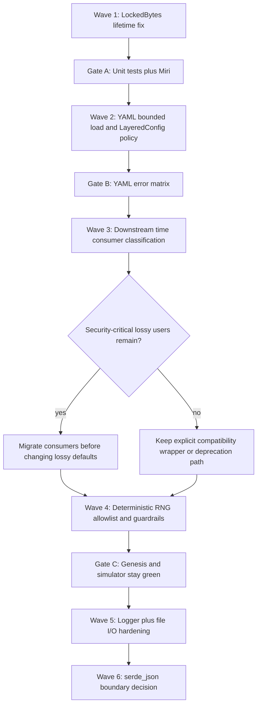

# Phase 027: Crypto Audit Utils - Context

<!-- markdownlint-disable MD001 MD022 MD033 -->

**Gathered:** 2026-03-29
**Status:** Planning baseline captured; phase execution is now in progress
**Source:** PRD Express Path (027-FUSION.md)

<domain>
## Phase Boundary

- This phase turns the fused `z00z_utils` audit into one execution-ready
  remediation phase focused on the shared security boundary, not on new
  primitives.
- The phase covers secret-memory hardening, YAML and layered-config policy,
  fail-soft time defaults, atomic write semantics, logger sanitization and
  rotation fidelity, deterministic RNG misuse resistance, and codec-boundary
  drift.
- Implementation changes stay inside `crates/z00z_utils/src/**`, but acceptance
  is not local-only.
- Time, config, and deterministic-RNG contract changes require mandatory
  downstream consumer audit in `z00z_core`, `z00z_storage`, `z00z_wallets`, and
  `z00z_simulator` before any breaking default or public-surface change is
  considered complete.

</domain>

<decisions>
## Implementation Decisions

### Secret-Memory Boundary

- Treat `LockedBytes` in `os_hardening.rs` as the only confirmed sign-off
  blocker in this phase.
- Replace the current address-only guard with a lifetime-bound
  `LockedBytes<'a>` that encodes ownership with `NonNull<u8>` and
  `PhantomData<&'a mut [u8]>`.
- Keep the existing zeroize-before-unlock order, but remove raw addresses from
  `Debug` output.
- Prove the contract with unit tests and Miri-oriented validation; comments
  alone are not an acceptable fix.

### YAML and Layered Config Policy

- Treat YAML as a local but still attacker-shaped boundary: malformed content,
  oversize files, permission failures, and operator mistakes must not collapse
  into silent defaults.
- Route `YamlConfig::from_file()` through bounded reads in `z00z_utils::io`
  before UTF-8 and YAML parsing.
- Introduce one explicit YAML size limit owned by the config module.
- Allow only `NotFound` to degrade to "no YAML source" in the default layered
  flow; malformed YAML, permission denial, and other I/O failures must surface.
- Split constructors so the permissive path is explicit. The default constructor
  must not silently fail open.
- Treat `LayeredConfig::new()` as a low-blast-radius migration today: the
  verified workspace usage is currently test, doc, or example-level, so
  acceptance must include test and documentation sync instead of assuming a
  wide production migration.

### Time Provider Policy

- Treat `try_unix_timestamp*()` as the production contract for nonce, expiry,
  ordering, anti-replay, or any other security-sensitive flow.
- Keep lossy zero-fallback wrappers only as clearly named compatibility helpers
  or deprecate them if the migration cost is acceptable.
- Preserve the existing fallible capability instead of inventing a second time
  abstraction.
- Audit downstream call sites before any rename, deprecation, or behavior change
  so severity is grounded in usage, not only in utility API shape.

#### Minimum Verified Downstream Time Usage

- The table below is a minimum verified rollout set, not an exhaustive proof
  that no additional production or operational consumers exist.
- Any wave that renames, deprecates, or changes lossy time-helper behavior must
  rerun the workspace usage search before closeout.

| Area | Verified location | Current role | Required rollout action |
| --- | --- | --- | --- |
| Nonce policy | `crates/z00z_core/src/assets/nonce.rs` | already uses `try_unix_timestamp_micros()` on the blessed path | preserve as the canonical production pattern |
| Core operational timing | `crates/z00z_core/src/genesis/genesis.rs`, `crates/z00z_core/src/assets/registry.rs`, `crates/z00z_core/src/assets/snapshot.rs` | operational timestamps, duration markers, and snapshot metadata | classify each call site before deprecating lossy wrappers |
| Storage stamps | `crates/z00z_storage/src/assets/store_internal/redb_backend.rs` | persistence timestamp metadata | decide whether lossy fallback is acceptable or migrate to `try_*` |
| Wallet security-sensitive timing | `crates/z00z_wallets/src/core/address/stealth_request.rs`, `crates/z00z_wallets/src/core/address/rate_limiter.rs`, `crates/z00z_wallets/src/core/address/stealth_card.rs`, `crates/z00z_wallets/src/core/address/stealth_trust.rs` | expiry, replay resistance, and fail-closed trust windows | migrate or preserve only explicit fail-closed behavior; do not treat these as telemetry-only consumers |
| Wallet operational and RPC timing | `crates/z00z_wallets/src/services/wallet_service.rs`, `crates/z00z_wallets/src/services/app_service.rs`, `crates/z00z_wallets/src/core/key/key_manager.rs`, `crates/z00z_wallets/src/core/address/address_manager.rs`, `crates/z00z_wallets/src/db/redb_wallet_store.rs`, `crates/z00z_wallets/src/adapters/rpc/**`, `crates/z00z_wallets/src/core/storage/**`, `crates/z00z_wallets/src/core/backup/**`, `crates/z00z_wallets/src/core/tx/fee_estimator.rs` | cache stamps, session timing, persistence metadata, API envelopes, logging middleware, and operational bookkeeping | split security-sensitive consumers from operational and audit-only consumers before changing defaults |
| Simulator artifacts | `crates/z00z_simulator/src/scenario_1/stage_2_utils/flow.rs`, `crates/z00z_simulator/src/scenario_1/stage_3.rs`, `crates/z00z_simulator/src/scenario_1/stage_3_utils/wallet_flow.rs` | artifact timing and scenario state output | compatibility path is acceptable only if these remain non-security consumers |

### File I/O Durability and Permissions

- Treat `atomic_write_file_private()` as the canonical secret-bearing write
  path.
- Make `write_file()` propagate permission-copy failures instead of silently
  discarding them.
- Keep generic `write_file()` available, but document that it is not the
  strongest durable or secret-safe contract.
- Either harden non-Unix streaming and private atomic writes to the same
  documented durability target or mark them best-effort explicitly.

### Logger Hardening

- Keep the existing newline, carriage-return, and NUL sanitization, but extend
  it to cover ANSI escape sequences and broader control-byte injection.
- Restore log-level prefixes in rotating file output; losing severity on disk is
  an auditability regression.
- Keep the current final-component symlink rejection and document the trusted
  parent-directory assumption unless the team decides to harden the open path
  further with existing low-level dependencies.
- Prefer an in-tree sanitizer first; only add `strip-ansi-escapes` if the team
  explicitly wants full ANSI parsing coverage beyond a focused local filter.

### Deterministic RNG Guardrails

- Treat deterministic RNG separation as a strength, but make misuse resistance
  stronger.
- Reuse the existing `MockRngProvider` compile-time production guard pattern for
  `DeterministicRngProvider`, or gate deterministic providers behind an explicit
  test or genesis capability.
- Treat the current `CryptoRng` trait bound on deterministic providers as a real
  semantics hazard, not only as a documentation concern. The bound reflects PRNG
  quality, but it can still mislead downstream code into treating deterministic
  output as approved production entropy.
- Tighten naming and docs so deterministic output is never confused with
  unpredictable output.
- Consider aligning deterministic backends across helper types if reproducible
  vectors and upgrade stability matter more than preserving the current split.

#### Allowed and Forbidden Deterministic Domains

- Allowed verified domains: deterministic genesis reproducibility in
  `z00z_core`, deterministic simulator reproducibility in `z00z_simulator`, and
  tests or examples behind explicit non-production guardrails.
- Forbidden domains: nonces, ephemeral secrets, salts, live runtime entropy,
  and any production path that claims secure unpredictability.
- Any new production consumer outside the verified allowlist is blocked until a
  phase-level decision expands the approved domain set explicitly.

### Dependency Order

- Wave 1: `LockedBytes` lifetime soundness and Miri proof.
- Wave 2: bounded YAML load plus `LayeredConfig` fail-open removal.
- Wave 3: downstream time-consumer classification and migration policy.
- Wave 4: deterministic-RNG domain policy and build or feature guardrails.
- Wave 5: logger and file-I/O hardening after the blocker waves have frozen the
  public-contract direction.
- Wave 6: architecture-only `serde_json` boundary decision.
- Do not start time-helper rename, deprecation, or removal before Wave 3 is
  closed.
- Do not harden deterministic-provider availability in a way that breaks the
  verified genesis or simulator domains before Wave 4 documents the allowlist.
- Logger and file-I/O tasks may run in parallel only after Waves 1 through 4
  have fixed the release-blocking contract semantics.

### Abstraction-Boundary Drift

- Treat direct `serde_json` macro and `Value` exposure as an architecture
  decision, not as a cryptographic blocker.
- Treat direct `::serde_json::json!()` usage in logger macros as verified drift,
  not as a hypothetical policy concern.
- Make the policy explicit during planning: either keep a narrow documented
  macro-level exception or remove the public re-export pressure and force JSON
  shaping back through owned wrappers.

### the agent's Discretion

- Exact helper names, whether lossy time helpers are renamed or deprecated, and
  whether layered config uses `try_new`, `with_optional_yaml`, or another clear
  constructor split.
- Exact test file placement as long as Miri coverage, malformed-YAML coverage,
  logger injection coverage, and downstream timestamp-call-site coverage are all
  present.
- Whether deterministic-provider gating is implemented with `compile_error!`,
  crate features, or both, as long as production misuse becomes materially
  harder.

</decisions>

<canonical_refs>
## Canonical References

**Downstream agents MUST read these before planning or implementing.**

### Audit Source of Truth

- `.planning/phases/027-crypto-audit-utils/027-FUSION.md` — Canonical fused
  audit findings, solution matrix, and remediation priorities.
- `.planning/phases/027-crypto-audit-utils/027-RESEARCH.md` — Verified
  codebase evidence, downstream usage map, and source provenance captured during
  context review.
- `.planning/phases/027-crypto-audit-utils/FUSION.audit.md` — Source coverage,
  de-duplication, and conflict tracking for the fusion.
- `.planning/ROADMAP.md` — Phase 027 summary and dependency position.
- `.planning/REQUIREMENTS.md` — Current global requirement inventory; Phase 027
  requirements are still to be authored during planning.

### Secret-Memory and Process Hardening

- `crates/z00z_utils/src/os_hardening.rs` — `LockedBytes`,
  `lock_bytes_best_effort`, and process hardening report surface.

### Config and YAML Boundary

- `crates/z00z_utils/src/config/mod.rs` — Public config facade and `YamlValue`
  boundary.
- `crates/z00z_utils/src/config/traits.rs` — `ConfigError` and `ConfigSource`
  contracts.
- `crates/z00z_utils/src/config/yaml.rs` — YAML file load and parse path.
- `crates/z00z_utils/src/config/layered.rs` — Layered constructor and fail-open
  downgrade behavior.
- `crates/z00z_utils/src/io/fs.rs` — `read_file_bounded` and atomic write
  helpers already available for reuse.

### Time and RNG Boundary

- `crates/z00z_utils/src/time/traits.rs` — fallible and lossy timestamp helper
  contracts.
- `crates/z00z_utils/src/time/system.rs` — production `SystemTimeProvider`
  implementation.
- `crates/z00z_utils/src/rng/traits.rs` — `SecureRngProvider` and
  `DeterministicRngProvider` trait semantics, including the current
  `CryptoRng`-bound return type.
- `crates/z00z_utils/src/rng/deterministic.rs` — deterministic provider surface
  and current warnings.
- `crates/z00z_utils/src/rng/mock.rs` — current compile-time production guard
  pattern that can be reused.

### Logger and File Output Boundary

- `crates/z00z_utils/src/logger/mod.rs` — shared `sanitize_message` helper and
  public logger exports.
- `crates/z00z_utils/src/logger/macros.rs` — structured logging macros that
  currently build payloads through direct `::serde_json::json!()`.
- `crates/z00z_utils/src/logger/rotating_file_logger.rs` — rotating logger
  output format, symlink checks, and file mode behavior.
- `crates/z00z_utils/src/io/fs.rs` — `write_file`,
  `atomic_write_file_private`, and `atomic_write_file_streaming` semantics.

</canonical_refs>

<execution>
## Execution Map

</execution>

<provenance>
## Source Provenance and Assumption Ledger

- `LockedBytes` lifetime-unsound blocker was verified in the planning-time code
  review and corroborated by `027-FUSION.md`.
- YAML bounded-read bypass and `.ok()` fail-open downgrade were verified in the
  planning-time code review and corroborated by `027-FUSION.md`.
- Lossy time-wrapper reach into `z00z_core`, `z00z_storage`, `z00z_wallets`,
  and `z00z_simulator` was verified by planning-time workspace usage search and
  captured in `027-RESEARCH.md`.
- `LayeredConfig::new()` currently has verified test usage and no broad
  production call-site footprint was found during review; docs and examples
  remain part of the expected migration surface.
- Deterministic RNG has verified live consumers in genesis and simulator flows.
- Deterministic RNG also carries a verified `CryptoRng`-bound trait surface in
  `rng/traits.rs`, so planning must address semantics confusion as well as build
  gating.
- Direct `::serde_json::json!()` calls in `logger/macros.rs` confirm that JSON
  abstraction drift is already on a live helper path, not only on a theoretical
  future path.
- Whether any additional deterministic production domains are acceptable remains
  an open planning decision.
- The standalone `027-RESEARCH.md` is now the explicit provenance artifact for
  this phase, so the context no longer relies on implicit research state.
- This context records the planning-time review baseline; later plan summaries
  or code changes may supersede specific live-code facts without invalidating
  the phase boundary decisions.

</provenance>

<validation>
## Validation Gates

- Gate A: `LockedBytes` must become lifetime-bound at the type level, pass unit
  tests, and pass Miri-oriented UB validation.
- Gate B: YAML and layered-config changes must pass a matrix for `NotFound`,
  malformed YAML, oversized input, and permission-denied input.
- Gate C: Phase closure must include a downstream consumer table that classifies
  every verified lossy time-wrapper use as security-critical, operational, or
  demo/test-only.
- Gate D: No security-critical consumer may still depend on lossy time helpers
  when the phase closes.
- Gate E: Deterministic-RNG guardrails must preserve the approved genesis and
  simulator domains while blocking unapproved production domains.
- Gate E1: Deterministic-RNG planning must either justify the retained
  `CryptoRng` semantics on deterministic providers or replace them with a less
  approval-sounding contract.
- Gate F: Logger tests must prove ESC and control-byte sanitization plus the
  presence of severity prefixes in rotating log output.
- Gate G: File-I/O tests must prove permission-copy failures are not swallowed
  and must document the durability class on Unix versus non-Unix paths.
- Gate H: The `serde_json` boundary decision must be recorded explicitly as
  either a narrow exception or a removal plan before phase acceptance.

</validation>

<parallelism>
## Parallelization and Rollback Rules

- `os_hardening.rs` and config-module work may be implemented in separate tasks,
  but phase acceptance cannot proceed to consumer migration until both waves are
  stable.
- Time-consumer audit must finish before any public rename, deprecation, or
  removal of lossy timestamp helpers.
- If Wave 3 finds a security-critical consumer that cannot migrate safely in
  this phase, keep the lossy helper as an explicit compatibility path and defer
  removal rather than forcing a speculative breaking change.
- If deterministic-provider gating breaks verified genesis or simulator flows,
  roll back to documentation plus allowlist hardening and defer stronger build
  restrictions until the consumer boundary is narrowed.

</parallelism>

<specifics>
## Specific Ideas

- The fused release block is narrower than the full audit list only if the
  downstream time-consumer classification confirms that no security-critical
  flow still depends on lossy helpers.
- `z00z_utils` already contains most of the primitives needed for the fixes.
  This phase is primarily about contract tightening and policy wiring, not about
  introducing new dependencies.
- The safest migration path is to strengthen defaults while preserving clearly
  named compatibility paths where downstream crates may still need transition
  time.
- Logger hardening and deterministic-RNG gating are not release blockers on the
  same level as `LockedBytes`, but they are high-value misuse-resistance work and
  should be planned in the same phase rather than deferred automatically.
- The `serde_json` question is real but architectural: planning must decide
  whether a narrow exception is intentional or whether `z00z_utils` should
  reassert its one-source-of-truth boundary more strictly, including the live
  logger macro path.

</specifics>

<deferred>
## Deferred Ideas

- Dependency-surface follow-up such as `serde_yml` maintenance tracking,
  `chrono`, and `erased_serde` review is deferred unless implementation work
  shows one of them blocks a required fix.
- LZ4 endianness theory, fixed codec size-limit ergonomics, and other
  lower-priority usability questions are deferred unless they become necessary
  to close a Phase 027 acceptance gate.
- Broad repository-wide replacement of direct `serde_json` usage outside the
  `z00z_utils` abstraction surface is deferred unless the chosen architecture
  decision requires immediate follow-through in consumer crates.

</deferred>

---

*Phase: 027-crypto-audit-utils*
*Context gathered: 2026-03-29 via PRD Express Path*
