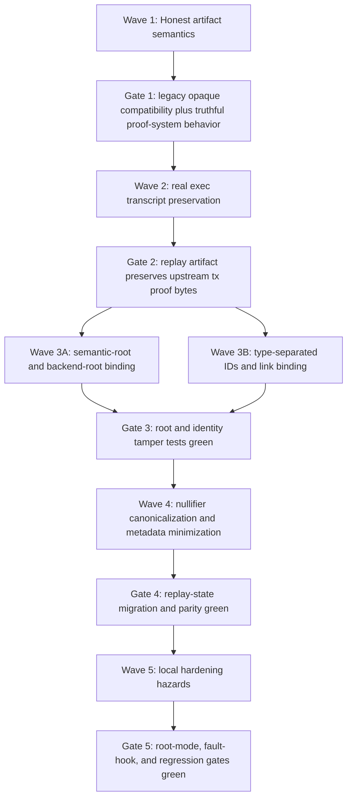

<!-- markdownlint-disable MD001 MD022 MD032 MD033 -->

# Phase 028: Crypto Audit Storage - Context

**Gathered:** 2026-03-30
**Status:** Ready for planning
**Source:** PRD Express Path (`028-FUSION.md`)

<domain>
## Phase Boundary

- This phase turns the fused `z00z_storage` audit into one execution-ready
  remediation phase focused on truthful checkpoint semantics, authoritative
  replay artifacts, explicit root and ID binding, strict trust boundaries, and
  canonical claim-nullifier storage.
- The phase does not add a new proving backend by default. It first fixes the
  storage boundary so artifact names, bytes, and guarantees match what the code
  actually verifies today.
- Implementation changes stay primarily inside `crates/z00z_storage/src/**`,
  but the accepted design may reuse already-existing types and domain helpers
  from `z00z_core`, `z00z_crypto`, and `z00z_wallets`.

</domain>

<decisions>
## Implementation Decisions

### Checkpoint artifact semantics

- Treat `CheckpointProofSystem::OPAQUE` as an attestation or transport class,
  not as a verified finality proof.
- Split proof-system meaning explicitly: opaque payloads may be stored, but any
  proof-system variant that claims verified semantics must have a verifier and a
  load-time or seal-time validation path.
- The final checkpoint statement must be versioned and explicit. Planning
  should introduce one statement surface that binds at least checkpoint version,
  height, `prev_root`, `new_root`, `claim_root`, `spent_delta`,
  `created_delta`, `prep_snapshot_id`, and `exec_input_id`.
- Synthetic proof bytes must not travel through production-looking final
  artifact paths. If test or debug scaffolding still needs synthetic bytes, it
  must use a clearly non-production class or gate.
- Existing serialized `OPAQUE` artifacts are legacy opaque artifacts, not
  grandfathered verified proofs. Planning must preserve explicit backward-read
  behavior or add an explicit migration gate, but it must not silently
  reinterpret historical bytes as verified semantics.

### Execution transcript authenticity

- `CheckpointExecInput` remains an authoritative replay artifact only if it
  preserves the real per-tx proof bytes that upstream validation consumed.
- Placeholder or index-derived `tx_proof` bytes are forbidden for canonical
  persisted execution-input artifacts.
- If the project needs a compact or synthetic planning transcript later, that
  must be a distinct artifact class rather than an overloaded
  `CheckpointExecInput`.
- The concrete placeholder emitter is the current `AssetStore::build_exec(...)`
  path in `crates/z00z_storage/src/assets/store.rs`; planning must replace that
  input source rather than patching around it after serialization.

### Root binding

- `ProofBlob` must carry an explicit domain-separated binding between the
  semantic root and the backend JMT root.
- `chk_blob(...)` must verify that binding before it accepts any branch proof.
- A root-binding mismatch is a first-class verification failure, not a soft or
  derived diagnostic.
- The binding field must be versioned so future proof-format upgrades do not
  silently reuse an old statement domain.

### Artifact identity and link binding

- Content addressing stays, but raw undifferentiated SHA-256 over canonical
  bytes is no longer the target security contract.
- `CheckpointDraftId`, `CheckpointId`, `CheckpointExecInputId`, and any future
  link identifier must move onto one type-separated, domain-separated identity
  helper.
- `CheckpointLink` must not remain a security-meaningful loose tuple. Planning
  should either derive an explicit link commitment over
  `checkpoint_id + prep_snapshot_id + exec_input_id` or fold those fields into
  the final checkpoint statement in a way that makes tampering detectable.
- Audit-only wrappers such as `CheckpointAudit` remain outside canonical bytes.
  They must not become hidden inputs to artifact identity.

### Trust-hook boundary

- `TxProofVerifier` and `SpentIndex` remain the right abstraction seam, but the
  phase must make the trust boundary explicit.
- `z00z_storage` must not present itself as self-sufficiently verifying
  checkpoint validity when permissive or incorrect hook implementations can
  still be injected.
- Planning should introduce one production-approved verifier path or adapter
  policy and keep permissive or test doubles clearly scoped to tests,
  simulation, or explicit opaque-attestation mode.
- The default production write path must not depend on test-only hooks,
  simulator-only permissive hooks, or unchecked trait stubs.

### Claim-nullifier semantics

- Claim replay protection remains a claim-domain anti-replay contract, not a
  generic asset-spend rule.
- Storage-owned nullifier keys must move from `nullifier_hex: String` to a
  validated binary newtype such as `ClaimNullifier([u8; 32])`.
- Uniqueness is global over canonical nullifier bytes. Chain separation is
  already part of the nullifier derivation contract, so storage should not rely
  on raw text or ad hoc string normalization for scope.
- `chain_id` may remain as validated metadata or a consistency check, but not
  as a substitute for canonical binary keying.
- The persisted replay table must keep only the fields required for replay
  defense and operational traceability. It must stop acting as a general
  correlation table for owner, claim, and digest metadata by default.
- This decision assumes all accepted claim publishers use the canonical
  `derive_nullifier(...)` contract that already binds `chain_id` into the
  nullifier bytes. If any upstream publisher can bypass that contract, storage
  must reject non-canonical inputs at the boundary instead of inferring scope
  from metadata.

### Scope and dependency policy

- This phase reuses existing workspace machinery. It must not introduce a new
  Merkle system, new signature stack, or new proof dependency as the default
  solution.
- Reuse the existing domain-separation pattern from `z00z_crypto` and
  `z00z_core`, the existing storage-owned proof surfaces in `z00z_storage`, and
  the existing wallet nullifier types and derivation contract.
- A real external proof backend is explicitly deferred until the storage
  boundary is already semantically honest.

### the agent's Discretion
- Exact type and helper names for root-binding hashes, statement types, and ID
  derivation helpers.
- Whether the final checkpoint statement is modeled as one dedicated struct,
  one canonical byte builder, or one hash helper plus typed fields.
- Exact migration shape for nullifier metadata minimization, as long as the key
  becomes canonical binary state and replay semantics stay claim-specific.

</decisions>

<specifics>
## Specific Ideas

- The blocker is the checkpoint artifact stack, not the semantic asset-root or
  JMT proof core.
- The safe execution order is already implied by the fusion and is now locked:
  first make checkpoint semantics honest, then bind roots and IDs, then
  canonicalize nullifier storage, and only after that consider any external
  proof backend.
- The minimal acceptable outcome for this phase is not “real zk checkpoint
  proving”. The minimal acceptable outcome is that no storage artifact can be
  mistaken for a verified proof or authoritative replay transcript when the code
  only stores opaque or synthetic bytes.
- Nullifier scope is not an open-ended design space here. Prior phases already
  established that claim nullifiers protect repeated claim identity use, and the
  wallet derivation path already binds `chain_id` into the nullifier bytes.

</specifics>

<canonical_refs>
## Canonical References

**Downstream agents MUST read these before planning or implementing.**

### Audit source of truth
- `.planning/phases/028-crypto-audit-storage/028-FUSION.md` — canonical fused
  audit verdict, required fixes, and staged solution architecture.
- `.planning/phases/028-crypto-audit-storage/FUSION.audit.md` — source audit
  traceability and conflict tracking.
- `.planning/ROADMAP.md` — active milestone registration, requirement IDs, and
  phase dependency position.

### Prior phase decisions that constrain 028
- `.planning/phases/000/019-gaps-1/019-CONTEXT.md` — claim-domain nullifier
  ownership and atomic replay-protection contract.
- `.planning/phases/000/025-crypto-audit-crypto/025-CONTEXT.md` — storage-owned
  claim-source proofs, fail-closed crypto boundary, and no-new-proof-stack
  policy.
- `.planning/phases/000/026-crypto-audit-core/026-CONTEXT.md` — canonical
  identity, untrusted-boundary validation, and fail-closed integrity policy.
- `.planning/phases/000/027-crypto-audit-utils/027-CONTEXT.md` — explicit trust
  boundary, fail-closed config policy, and architecture-first hardening order.

### Checkpoint artifact and replay surfaces
- `crates/z00z_storage/src/checkpoint/artifact.rs` — current draft, final proof,
  and checkpoint artifact contracts.
- `crates/z00z_storage/src/checkpoint/build.rs` — `TxProofVerifier`,
  `SpentIndex`, resolved inputs, and checkpoint draft construction.
- `crates/z00z_storage/src/checkpoint/exec_input.rs` — canonical execution-input
  artifact and per-tx `tx_proof` payload contract.
- `crates/z00z_storage/src/checkpoint/store.rs` — checkpoint persistence,
  `check_exec_root`, and link or exec consistency checks.
- `crates/z00z_storage/src/checkpoint/link.rs` — checkpoint-link tuple contract.
- `crates/z00z_storage/src/checkpoint/ids.rs` — current content-addressed ID
  derivation path.
- `crates/z00z_storage/src/checkpoint/audit.rs` — audit-only wrapper fields that
  must remain outside canonical artifact identity.
- `crates/z00z_storage/src/assets/store_internal/redb_backend.rs` — current
  synthetic `cp_proof` construction from `exec_id + state_root` and the
  fault-injection hook that must not remain a production-default hazard.
- `crates/z00z_storage/src/assets/store.rs` — `AssetStore::build_exec(...)`,
  root-mode selection, and claim-nullifier table ownership.

### Storage proof and root surfaces
- `crates/z00z_storage/src/assets/proof.rs` — `ProofBlob`, `chk_blob(...)`, and
  current semantic-root versus backend-root verification path.
- `crates/z00z_storage/src/assets/store_internal/proof_help.rs` — proof blob
  assembly and backend-root capture.
- `crates/z00z_storage/src/assets/root-types.md` — semantic versus physical root
  taxonomy and the existing prohibition on treating `backend_root` as the public
  semantic root.
- `crates/z00z_storage/src/assets/store.rs` — claim-source proof export,
  claim-nullifier storage, and storage-owned root calculation.
- `crates/z00z_storage/src/assets/keys.rs` — current asset-key derivation asymmetry
  relative to definition and serial domain separation.

### Reusable upstream types and patterns
- `crates/z00z_wallets/src/core/claim/nullifier.rs` — canonical nullifier bytes,
  chain-bound derivation, and typed state vocabulary that storage should reuse
  instead of raw strings.
- `crates/z00z_core/src/domains.rs` — workspace-native domain-separation pattern
  for binding statements and IDs.
- `crates/z00z_core/src/hashing.rs` — canonical hashing helpers and framing
  style relevant to artifact and root binding.

</canonical_refs>

<code_context>
## Existing Code Insights

### Reusable Assets
- `TxProofVerifier` and `SpentIndex` already define the correct external trust
  seam for tx-proof and spent-interval validation.
- `AssetStore::claim_source_proof(...)` already exposes a storage-owned proof
  export path and proves that 028 can reuse storage-native proof containers
  instead of inventing a second proof stack.
- `ProofBlob` and `chk_blob(...)` are the natural insertion point for explicit
  root binding because they already carry both semantic and backend-root state.
- Wallet `NullifierBytes` and `derive_nullifier(...)` already provide a typed,
  chain-bound nullifier contract that storage can absorb instead of storing
  lower-hex strings.

### Established Patterns
- The workspace prefers typed wrappers and fail-closed validation over stringly
  typed security state.
- Storage-owned artifacts must stay truthful about what the crate actually
  verifies, even when higher layers add stronger guarantees.
- Audit-only metadata is intentionally kept outside canonical artifact bytes and
  must stay there.
- New crypto or proof dependencies are not the default fix when an existing
  boundary can be made honest and explicit first.

### Integration Points
- `build_cp_draft(...)` is the control point where snapshot replay,
  execution-input bytes, verifier hooks, and final checkpoint drafts converge.
- `CheckpointFsStore::seal_artifact(...)` and the related save or load paths are
  where truthful proof-system semantics and link binding must become visible to
  downstream callers.
- `AssetStore::apply_claim_ops(...)` and the claim-nullifier table are the right
  place to migrate from raw text keys to canonical binary replay state.
- `RedbBackend::write(...)` is the persistence choke point where synthetic proof
  bytes, exec bytes, link bytes, and state-root metadata are committed together;
  any rollout that changes artifact semantics must keep this write boundary
  atomic.

</code_context>

<execution>
## Execution Order And Parallelization Rules

- Wave 1 must land before any ID or root-binding changes. Otherwise planner can
  harden the wrong semantics and preserve misleading proof language.
- Wave 2 must land before Wave 3B. Artifact and link identity must bind the
  canonical replay object that the system actually intends to persist, not a
  placeholder transcript.
- Waves 3A and 3B may run in parallel only after Wave 2 closes, because root
  binding and ID binding touch different contracts but both depend on the final
  execution-artifact shape being frozen.
- Wave 4 must start after Wave 3 gates are green. Nullifier migration must not
  run concurrently with root or ID schema churn in the same release wave.
- Wave 5 is cleanup-only and must not reopen Waves 1 through 4 semantics.

### Rollout and rollback rules

- Do not break backward decode of already-persisted opaque checkpoint artifacts
  unless one explicit migration step rewrites them and proves key stability or
  explicit re-keying semantics.
- Do not change artifact ID derivation and link binding in separate waves. The
  two changes must ship behind one compatibility gate or the store can observe
  mixed-era tuples.
- Do not migrate claim-nullifier keying in place without one parity check that
  proves old rows and new canonical rows describe the same replay set.
- If any wave changes canonical serialized bytes, that wave must define whether
  legacy artifacts remain readable, become explicitly legacy-only, or require a
  one-shot migration.

</execution>

<testing>
## Test And Acceptance Anchors

### Unit and crate-local tests
- `crates/z00z_storage/src/checkpoint/artifact.rs` — extend proof-system,
  finalize, and legacy-opaque behavior tests.
- `crates/z00z_storage/src/checkpoint/exec_input.rs` — add canonical replay
  artifact tests that reject placeholder `tx_proof` sources on the persisted
  path.
- `crates/z00z_storage/src/assets/proof.rs` — add root-binding verification and
  tamper tests at `chk_blob(...)`.
- `crates/z00z_storage/src/assets/store_internal/test_whitebox_proofs.rs` — keep
  proof-blob and branch-proof regression coverage aligned with any new binding
  field.
- `crates/z00z_storage/src/assets/store_internal/test_whitebox_state.rs` — keep
  root-mode parity coverage green when root-binding and root-mode hazard cleanup
  land.

### Integration tests
- `crates/z00z_storage/tests/test_checkpoint_finalization.rs` — prove truthful
  final-artifact semantics on the store-facing finalization path.
- `crates/z00z_storage/tests/test_checkpoint_replay_inputs.rs` — prove replay
  artifact, link, and root checks across persisted execution inputs.
- `crates/z00z_storage/tests/test_checkpoint_ids.rs` — extend identity tests for
  type separation and link or tuple binding.
- `crates/z00z_storage/tests/test_checkpoint_root_binding.rs` — extend root
  binding from current replay checks to explicit semantic/backend-root binding.
- `crates/z00z_storage/tests/test_redb_rehydrate.rs` — prove persisted artifact,
  exec, and link compatibility under redb reload.
- `crates/z00z_storage/tests/test_claim_source_proof.rs` — keep storage-owned
  proof export compatible with any `ProofBlob` format hardening.

### Acceptance outputs
- One explicit compatibility result for legacy `OPAQUE` artifact load behavior.
- One explicit replay-authenticity result showing canonical exec artifacts keep
  upstream proof bytes.
- One explicit migration or parity result for claim-nullifier state.

</testing>

<assumptions>
## Assumptions And Open Decisions

- Assumption: the project will accept an intermediate state where checkpoint
  artifacts are semantically honest but still opaque, without requiring a real
  proving backend in the same phase.
- Assumption: upstream claim publishers can be forced onto the canonical
  nullifier derivation contract, or storage can reject non-canonical
  publishers.
- Open decision: whether legacy opaque artifacts remain readable under the same
  type names with explicit legacy wording, or move behind a dedicated legacy
  decode surface.

</assumptions>

<validation>
## Validation Gates

- **G-01 Artifact Truthfulness Gate:** pass only if opaque checkpoint payloads
  cannot be mistaken for verified proofs by type, rustdoc, or load-time
  behavior.
- **G-01A Compatibility Gate:** pass only if already-persisted `OPAQUE`
  artifacts have one explicit read policy: preserved as legacy opaque,
  migrated, or rejected by versioned design.
- **G-02 Replay Authenticity Gate:** pass only if canonical
  `CheckpointExecInput` artifacts preserve real upstream `tx_proof` bytes.
- **G-03 Root-Binding Gate:** pass only if `chk_blob(...)` rejects any mismatch
  between the semantic root and the backend root commitment.
- **G-04 ID and Link Gate:** pass only if artifact identities are type-separated
  and link tampering is detectable from canonical bytes or a derived link
  commitment.
- **G-05 Nullifier Gate:** pass only if replay protection is keyed by canonical
  binary nullifier state and remains explicitly claim-domain specific.
- **G-05A Migration Gate:** pass only if old replay rows and new canonical
  nullifier rows are proven equivalent or the migration policy is explicit and
  verified.
- **G-06 Scope Gate:** pass only if the phase closes without introducing a new
  proving backend as a prerequisite for honest storage semantics.
- **G-07 Rollback Safety Gate:** pass only if any serialized-byte change has an
  explicit compatibility, migration, or rollback path.

</validation>

<deferred>
## Deferred Ideas

- Adding a real external checkpoint proving backend is deferred until the phase
  has already made opaque versus verified semantics explicit.
- Broader cleanup items from the fusion, such as lower-severity hash-domain
  asymmetries, root-mode environment cleanup, or storage key endianness polish,
  are deferred unless the planner proves they are required to close one of the
  six validation gates above.

</deferred>

---

*Phase: 028-crypto-audit-storage*
*Context gathered: 2026-03-30 via PRD Express Path*
