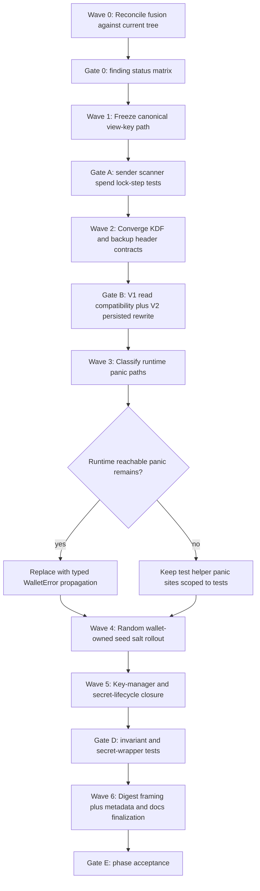

# Phase 029: Crypto Audit Wallets - Context

<!-- markdownlint-disable MD001 MD022 MD033 -->

**Gathered:** 2026-03-30
**Status:** Discuss baseline captured; ready for planning
**Source:** PRD Express Path (`029-FUSION.md`) plus current-tree code reconciliation

<domain>
## Phase Boundary

- This phase turns the fused `z00z_wallets` crypto audit into one execution-ready
  remediation phase focused on truthful wallet crypto contracts, not on replacing
  primitives or redesigning the protocol.
- The phase covers service-layer fail-closed behavior, canonical view-key
  derivation, KDF and encryption-path governance, deterministic seed-salt
  policy, key-manager invariant hardening, secret-lifecycle boundaries, and
  digest framing.
- The phase also owns explicit reconciliation of fused findings that may now be
  partially fixed in the current tree, so planning does not execute stale audit
  work as if it were still fully open.
- Implementation changes stay primarily inside `crates/z00z_wallets/src/**`, but
  acceptance is not local-only.
- Wallet KDF and backup changes must remain aligned with `z00z_crypto`
  interfaces and with the versioned persistence semantics already established by
  the stronger RedB V2 path.
- This phase does not introduce a new proof stack, new curve, new AEAD, or a
  parallel wallet-persistence format. It hardens the existing wallet-owned
  boundary first.

</domain>

<decisions>
## Implementation Decisions

### Audit Reconciliation Policy

- `029-FUSION.md` remains the canonical audit input, but planning must reconcile
  every blocker against the current tree before creating implementation tasks.
- If a fused finding points at a code path that has already moved or is now
  test-only, the phase must preserve the security intent while downgrading or
  re-scoping the implementation target instead of blindly copying the old
  severity.
- Current-tree evidence already shows one such case: `chain_service` still has
  `unwrap()` uses in tests, but the current runtime placeholder path does not
  show the same `await.unwrap()` crash surface described by the older audit.
- Current-tree evidence shows a second reconciliation case in
  `core/key/key_manager.rs`: cache TTL enforcement appears to be implemented on
  cache reads and cache-backed derivation paths, while the gap-limit math still
  uses `saturating_sub(...)` in the BIP-44 allocation path. Planning must split
  already-landed hardening from still-open invariant work instead of treating
  the entire fused key-manager finding set as equally open.

### Canonical View-Key Derivation Policy

- Treat `derive_view_secret_key(receiver_secret)` as the single live protocol
  path for sender, scanner, and spend verification flows.
- Restrict `derive_view_key_versioned(receiver_secret, version)` to explicit
  rotation or historical-recovery use only.
- `ReceiverKeys::rotate_view()` may continue to derive historical or rotated
  view keys, but that path must not leak back into the default sender, scanner,
  or spend hot paths.
- Planning must include a call-graph audit and regression tests that prove the
  sender path, scan path, and spend path remain in lock-step for the same
  `ReceiverSecret`.
- Any historical or rotated-view support must be explicit in API naming or
  module placement so callers cannot mistake it for the default live path.

### KDF and Encryption Contract Policy

- Treat the RedB V2 `KdfParams` contract in
  `db/redb_wallet_crypto.rs` as the canonical wallet KDF baseline.
- Treat the legacy `WalletEncryption` Argon2id plus repetition-padded salt path
  as backward-compatibility only until migration is complete.
- Evolve backup encryption onto a fully self-describing, versioned KDF header
  modeled on the RedB `KdfParams` shape instead of keeping a parallel implicit
  contract.
- Reject unknown wallet or backup KDF versions before any expensive derivation.
- Successful unlock of a V1 wallet must no longer leave migration as a soft side
  effect. Persisted rewrite to the stronger V2 contract is part of the accepted
  unlock or upgrade flow.
- New backup and wallet-encryption changes must preserve legacy read support only
  through explicit compatibility helpers, not through silent fallback drift.
- Do not remove legacy-read compatibility until one accepted reopen gate proves
  that a migrated wallet can be reopened from the rewritten `.wlt` container and
  that the backup importer still rejects unknown versions deterministically.

### Deterministic Seed-Salt Policy

- Treat `compute_seed_salt(wallet_id)` as legacy compatibility fallback only.
- New writes must persist a fresh wallet-owned random 16-byte seed salt in
  wallet metadata instead of deriving it deterministically from `wallet_id`.
- Keep the deterministic function available only as a bounded legacy-read path
  until old wallets are migrated.
- The open question of whether `wallet_id` is publicly derivable no longer blocks
  the mitigation direction: the safe design is to stop using deterministic salt
  generation for new writes regardless.

### Panic Boundary and Error Policy

- Distinguish runtime or operator-reachable service flows from test helpers,
  legacy fixture builders, and invariant-only test scaffolding that happen to
  live in the same file.
- Production or operator-reachable flows must return typed `WalletError` or
  `WalletResult<T>` failures rather than `expect()` or `unwrap()` panics.
- Test-only helpers may keep explicit `expect()` when they are proving fixture
  validity or hard test invariants.
- Planning must therefore classify every panic path before remediation work
  begins so the phase does not waste early waves on non-production helpers.

### Secondary Hardening Policy

- Add `ReceiverSecret::validate_usable()` and call it from creation, load, and
  decrypt boundaries so unusable receiver secrets never survive object
  construction.
- Reconcile the fused key-manager findings against current code before planning:
  keep cache TTL as validation-only work if the current strict-expiry path is
  confirmed sound, but keep gap-limit math open until `saturating_sub(...)` is
  removed from the allocation path or explicitly justified as safe.
- Replace cloneable plaintext password bytes in `FileKeyStore` and related
  wallet-secret persistence surfaces with `SafePassword` or equivalent zeroizing
  wrappers.
- Keep mnemonic text and other secret-bearing text buffers inside wallet-core
  flows as entropy or structured types for as long as possible; only convert to
  text at the outer service boundary.
- Treat plaintext backup metadata as an explicit policy decision that must close
  in planning: either a minimal public header is kept intentionally, or the
  fields move into the encrypted payload. Do not leave this as an implicit UX
  default.
- If entropy-quality warnings still exist only as log or console text, planning
  must surface a warning-capable API result instead of leaving callers with a
  binary valid or invalid outcome only.
- Replace ambiguous transaction digest concatenation with the existing framing
  helpers in `core/hashing.rs`.
- Keep feature-gated debug or verbose surfaces explicitly documented as
  non-production-only if they can expose privacy-sensitive material.

### Dependency Order

- Wave 0: evidence reconciliation and target inventory against the current tree.
- Wave 1: canonical view-key policy and call-graph audit.
- Wave 2: KDF and encryption contract convergence, including backup header
  governance.
- Wave 3: current-tree panic-path classification and runtime error propagation.
- Wave 4: deterministic seed-salt migration policy and wallet metadata rollout.
- Wave 5: key-manager invariant closure, receiver-secret validation, and
  secret-lifecycle cleanup.
- Wave 6: digest framing, backup metadata finalization, and residual docs or
  feature-gate hardening.
- Do not start broad panic cleanup before Waves 1 and 2 freeze the protocol and
  persistence contracts that service code must report.
- Do not remove compatibility KDF or backup-read paths before Wave 2 closes on
  explicit reopen and legacy-read gates.

</decisions>

<specifics>
## Specific Ideas

- Current-tree evidence shows `derive_view_secret_key(...)` is already the live
  path in stealth output verification and spend-rule verification, while
  `derive_view_key_versioned(...)` is currently used in receiver-key rotation.
- This means the highest-value 029 decision is not inventing a new derivation,
  but preventing accidental cross-use of two existing derivation families.
- Current-tree evidence also shows the fused `chain_service` crash finding must
  be revalidated during planning, because the visible runtime placeholder path
  no longer matches the original `await.unwrap()` characterization.
- The strongest current KDF drift is still real: `WalletEncryption` repeats a
  16-byte salt into 32 bytes, while RedB V2 zero-pads and persists versioned KDF
  parameters.
- Backup cryptography still follows the weaker implicit contract: it repeats the
  16-byte salt and does not persist the full Argon2 parameter set in the backup
  container format.
- `core/wallet/snapshot.rs` still carries `WalletExportPack { seed_phrase:
  String }`, so mnemonic-lifetime hardening is not only a service-layer concern;
  it also touches the wallet-export and backup payload boundary.
- `compute_seed_salt(wallet_id)` remains live in current wallet flows, including
  seed-phrase response encryption and wallet-creation paths, so deterministic
  salt is not only a historical note.
- Several `expect()` calls inside `wallet_service.rs` sit in legacy helper or
  fixture-building code near tests rather than in ordinary runtime entrypoints;
  029 should classify these before severity-based rewrites.
- `core/storage/file_key_store.rs` is an immediate concrete target for secret
  wrapper hardening because it still stores encryption passwords as
  `EncryptionScheme::Password(Vec<u8>)` and derives convenience traits on the
  secret-bearing enum and store.
- `core/key/key_manager.rs` already contains strict TTL checks on cache access,
  but its BIP-44 next-index allocation still uses `saturating_sub(...)`; the
  phase must therefore distinguish validation-of-landed-hardening from net-new
  invariant fixes.

</specifics>

<canonical_refs>
## Canonical References

**Downstream agents MUST read these before planning or implementing.**

### Audit Source of Truth

- `.planning/phases/029-crypto-audit-wallets/029-FUSION.md` — canonical fused
  audit verdict, remediation order, open ambiguities, and test plan.
- `.planning/phases/029-crypto-audit-wallets/FUSION.audit.md` — source coverage,
  de-duplication, and augmentation tracking for the fusion.
- `.planning/ROADMAP.md` — active phase registration and dependency position.

### Prior Phase Decisions That Constrain 029

- `.planning/phases/000/027-crypto-audit-utils/027-CONTEXT.md` — fail-closed
  boundary policy, deterministic-RNG governance, and explicit downstream audit
  expectations.
- `.planning/phases/000/028-crypto-audit-storage/028-CONTEXT.md` — truthful
  persistence semantics, explicit trust-boundary policy, and no-new-proof-stack
  rule.

### Wallet Key and Stealth Surfaces

- `crates/z00z_wallets/src/core/key/stealth_keys.rs` — receiver-secret creation,
  live and versioned view-key derivation, identity derivation, and receiver-key
  rotation.
- `crates/z00z_wallets/src/core/stealth/output.rs` — live receive and owner-tag
  verification path.
- `crates/z00z_wallets/src/core/stealth/ephemeral.rs` — hedged ephemeral scalar
  derivation and `R_pub` generation.
- `crates/z00z_wallets/src/core/stealth/encoding.rs` — canonical public-point
  decoding and identity rejection.
- `crates/z00z_wallets/src/core/tx/spending.rs` — spend-rule path that already
  depends on the live unversioned view key.

### Wallet KDF, Backup, and Persistence Surfaces

- `crates/z00z_wallets/src/db/redb_wallet_crypto.rs` — canonical RedB V2 KDF and
  AEAD contract.
- `crates/z00z_wallets/src/db/redb_wallet_store.rs` — wallet open or unlock flow,
  migration hooks, and persistence rewrite seams.
- `crates/z00z_wallets/src/core/security/encryption.rs` — legacy wallet
  encryption contract that still uses repetition-padded salt.
- `crates/z00z_wallets/src/core/backup/wallet_backup.rs` — backup container and
  current implicit backup KDF contract.
- `crates/z00z_wallets/src/core/backup/backup_exporter_impl.rs` — backup header,
  AAD, and export compatibility path.
- `crates/z00z_wallets/src/core/backup/backup_importer_impl.rs` — backup import,
  AAD resolution, and decrypt path.
- `crates/z00z_wallets/src/core/hashing.rs` — `compute_seed_salt(...)` and the
  framing helpers needed for digest hardening.
- `crates/z00z_wallets/src/core/tx/tx_verifier.rs` — `build_tx_package_digest()`
  and the current ambiguous transaction-digest framing path.
- `crates/z00z_wallets/src/core/key/seed.rs` — `CipherSeedContainer` format,
  password-based seed protection, and the open wrapper-governance question.
- `crates/z00z_wallets/src/core/wallet/snapshot.rs` — `WalletExportPack` and the
  current mnemonic-bearing export payload boundary.

### Service and Secret-Lifecycle Surfaces

- `crates/z00z_wallets/src/services/wallet_service.rs` — seed reveal flow,
  wallet creation flow, and mixed runtime or fixture helper panic surfaces.
- `crates/z00z_wallets/src/services/chain_service.rs` — current placeholder
  chain-scan service used to reconcile stale audit evidence.
- `crates/z00z_wallets/src/core/key/key_manager.rs` — BIP-44 gap-limit math,
  derived-key TTL behavior, and cache-spot-check semantics.
- `crates/z00z_wallets/src/core/security/password.rs` — current password and
  validation result surface, and the best current anchor for any warning-capable
  validation upgrade.
- `crates/z00z_wallets/src/adapters/rpc/types/common.rs` — the current
  `RuntimeValidationResult` DTO, which today is binary `valid/error` only and
  would need an explicit extension if warning-capable validation becomes part of
  the accepted 029 scope.
- `crates/z00z_wallets/src/core/storage/file_key_store.rs` — secret-bearing
  password wrapper boundary that still needs zeroizing alignment.
- `crates/z00z_wallets/src/services/seed_phrase.rs` — existing hidden-text
  service boundary that should remain the outermost plaintext conversion seam.

</canonical_refs>

<code_context>
## Existing Code Insights

### Reusable Assets

- RedB V2 already provides the strongest reviewed wallet KDF contract, including
  persisted `KdfParams`, versioning, and untrusted-parameter validation.
- The backup importer and exporter already have compatibility-style AAD helpers,
  so versioned backup-header migration can reuse an existing rollout pattern.
- The wallet hash helpers already provide one-source-of-truth framing utilities,
  so digest hardening does not need local ad hoc encoding helpers.
- `services/seed_phrase.rs` already returns `Hidden<String>`, but
  `WalletExportPack` still holds a plain `String`; the mnemonic boundary is
  therefore partially hardened, not fully closed.
- `tx_verifier.rs` already owns the digest builder, so the correct 029 change is
  to reframe that exact function with existing hashing helpers rather than to
  invent a parallel digest helper elsewhere.

### Established Patterns

- Prior audit phases already prefer truthful boundary semantics, typed wrappers,
  and fail-closed migration over soft implicit fallback.
- The workspace already treats legacy compatibility as explicit and versioned
  rather than as a hidden ambient behavior.
- The strongest reviewed storage path is native `.wlt`, which should become the
  baseline model for backup and auxiliary secret persistence rather than the
  other way around.

### Integration Points

- `ReceiverKeys::from_receiver_secret(...)`, rotation flows, stealth output
  verification, and spend verification together define the canonical view-key
  contract surface.
- Wallet open or unlock and seed-reveal flows are the places where KDF
  governance, deterministic seed salt, and error propagation visibly meet.
- Backup exporter and importer code is the right place to align public header,
  AAD, and versioned KDF semantics without inventing a second persistence stack.
- `core/key/key_manager.rs` is the concrete home for any remaining gap-limit
  invariant fix and for validation that cache TTL enforcement is already closed.

</code_context>

<validation>
## Validation And Rollout Gates

### Gate 0: Reconciliation Matrix

- Before any implementation plan is approved, produce one matrix that maps each
  fused finding to one of: `still_open`, `partially_closed`, `validation_only`,
  or `stale_in_current_tree`.
- At minimum this gate must classify `chain_service` panic claims, key-manager
  TTL enforcement, and any wallet-service panic sites that are actually test or
  fixture helpers.

### Gate A: Canonical View-Key Lock-Step

- Prove that sender, scanner, spend verification, and receiver-card export all
  use the designated live derivation path or an explicitly approved historical
  path.
- Add a regression test that fails if a versioned helper re-enters the default
  spend or scan hot path.

### Gate B: KDF Migration And Backup Governance

- Prove V1 wallet unlock can read legacy state, rewrite to the canonical V2
  contract, flush the rewritten `.wlt`, and reopen it successfully.
- Prove backup import rejects unknown backup-KDF versions before expensive
  derivation.
- Close plaintext backup metadata only after one explicit product-policy choice:
  `minimal public header` or `move metadata inside encrypted payload`.

### Gate C: Panic Classification And Runtime Error Closure

- Produce one inventory separating runtime-reachable panic paths from test-only
  or fixture-only panic paths.
- Only runtime-reachable paths are blocker-grade fixes; test helpers may keep
  explicit `expect()` when they are validating fixtures.

### Gate D: Key-Manager And Secret-Lifecycle Closure

- Prove BIP-44 gap-limit accounting fails loudly on impossible counter order.
- If cache TTL remains in scope after reconciliation, prove that expired cache
  entries are evicted or treated as misses on both read and derive paths.
- Prove `ReceiverSecret::validate_usable()` is enforced on create, load, and
  decrypt boundaries.
- Prove `FileKeyStore` no longer stores cloneable plaintext password bytes.

### Gate E: Final Acceptance

- Prove transaction-digest framing distinguishes ambiguous string concatenation
  cases.
- Prove backup and wallet compatibility helpers remain explicit and bounded.
- Close the phase only when all blocker-class findings are either fixed or
  explicitly downgraded by the reconciliation matrix with current-tree evidence.

</validation>

<parallelization>
## Parallelization Safety

- Wave 1 and Wave 2 are serial and define the live protocol and persistence
  contracts; they must not run in parallel with panic cleanup or deterministic
  seed-salt rollout.
- After Wave 2 closes, panic classification may run in parallel with key-manager
  and secret-wrapper hardening, because they touch adjacent but not identical
  seams.
- Digest framing and feature-gate documentation may run in parallel only after
  the wallet KDF, backup-header, and secret-lifecycle decisions are frozen.

</parallelization>

<execution>
## Execution Map

</execution>

<open_questions>
## Open Questions

- Whether `wallet_id` is publicly derivable still matters for retrospective
  severity, but not for the chosen mitigation direction.
- Whether `CipherSeedContainer` needs a wallet-owned version wrapper remains a
  separate persistence-governance question and must not be silently assumed
  closed.
- Whether backup metadata exposure is a documented UX tradeoff or an accidental
  privacy leak must be fixed during planning.
- Whether any sender-side path outside the currently verified call graph still
  uses a versioned view-key helper must be rechecked before implementation.
- Whether nonce truncation concerns around other wallet-owned cipher containers
  affect an external protocol contract remains a separate manual-review item.

</open_questions>
