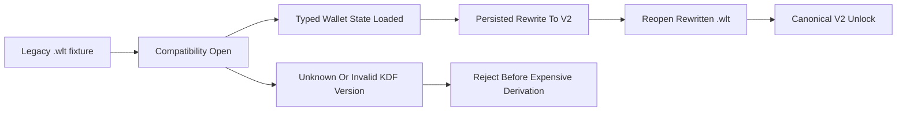
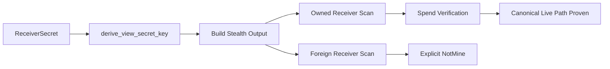

# Phase 029 Test Spec

## Purpose

📌 This document defines the phase-local E2E, integration, and focused
unit coverage required to close Phase 029.

📌 It is intended to be directly usable by another engineer or agent without
guessing scenario boundaries, state transitions, cryptographic invariants,
proof paths, rejection rules, or pass oracles.

📌 Phase 029 coverage is Rust-driven wallet coverage, not browser automation.
The phase must be proven through canonical wallet creation, unlock, backup,
scan, spend, persistence, and validation flows under release-mode tests.

## Workflow Status

✅ Strict fallback conditions no longer apply because this phase directory now
contains summary artifacts for plans `029-01` through `029-06` and a
phase-local `029-VERIFICATION.md` artifact.

📌 This test spec is now verification-backed and uses these inputs as the
current source of truth:

- `.planning/phases/000/029-crypto-audit-wallets/029-CONTEXT.md`
- `.planning/phases/000/029-crypto-audit-wallets/029-FUSION.md`
- `.planning/phases/000/029-crypto-audit-wallets/029-01-PLAN.md`
- `.planning/phases/000/029-crypto-audit-wallets/029-02-PLAN.md`
- `.planning/phases/000/029-crypto-audit-wallets/029-03-PLAN.md`
- `.planning/phases/000/029-crypto-audit-wallets/029-04-PLAN.md`
- `.planning/phases/000/029-crypto-audit-wallets/029-05-PLAN.md`
- `.planning/phases/000/029-crypto-audit-wallets/029-06-PLAN.md`
- `.planning/phases/000/029-crypto-audit-wallets/029-01-SUMMARY.md`
- `.planning/phases/000/029-crypto-audit-wallets/029-02-SUMMARY.md`
- `.planning/phases/000/029-crypto-audit-wallets/029-03-SUMMARY.md`
- `.planning/phases/000/029-crypto-audit-wallets/029-04-SUMMARY.md`
- `.planning/phases/000/029-crypto-audit-wallets/029-05-SUMMARY.md`
- `.planning/phases/000/029-crypto-audit-wallets/029-06-SUMMARY.md`
- `.planning/phases/000/029-crypto-audit-wallets/029-VERIFICATION.md`
- `.planning/REQUIREMENTS.md`
- Existing anchors in `crates/z00z_wallets/tests/` and inline wallet tests.

📌 Because `029-RESEARCH.md` is absent, every scenario in this file is anchored
either to explicit current-tree files or to proposed new test files already
named in the Phase 029 plans.

📌 This document remains the phase-local test contract for Phase 029 and is now
backed by executed verification evidence.

## Classification

### TDD And Integration Targets

- `crates/z00z_wallets/src/core/key/stealth_keys.rs`
  because Phase 029 must prove one canonical live view-key derivation path and
  explicit quarantine of historical or rotated derivation.
- `crates/z00z_wallets/src/core/stealth/output.rs`
  because owned-output detection must stay aligned with the canonical live
  receiver-secret derivation path.
- `crates/z00z_wallets/src/core/tx/spending.rs`
  because spend verification must consume the same live view-key contract as
  the scan path.
- `crates/z00z_wallets/src/core/security/encryption.rs`
  because legacy wallet encryption remains the compatibility boundary that must
  not define new-write policy.
- `crates/z00z_wallets/src/core/backup/wallet_backup.rs`
  because backup KDF, metadata visibility, and import semantics must become
  explicit and self-describing.
- `crates/z00z_wallets/src/core/backup/backup_exporter_impl.rs`
  because export owns the backup header, AAD behavior, and metadata policy.
- `crates/z00z_wallets/src/core/backup/backup_importer_impl.rs`
  because import must reject unknown backup KDF versions before expensive work.
- `crates/z00z_wallets/src/db/redb_wallet_crypto.rs`
  because RedB V2 `KdfParams` is the canonical persisted KDF model.
- `crates/z00z_wallets/src/db/redb_wallet_store.rs`
  because accepted legacy wallet unlock must rewrite persisted state and prove
  reopen on the canonical V2 contract.
- `crates/z00z_wallets/src/services/wallet_service.rs`
  because runtime wallet flows must fail closed with typed errors instead of
  panicking, and seed-reveal or export flows must honor the new seed-salt rule.
- `crates/z00z_wallets/src/services/chain_service.rs`
  because stale crash claims must be either downgraded with evidence or closed
  in code, never left ambiguous.
- `crates/z00z_wallets/src/core/hashing.rs`
  because `compute_seed_salt(...)` and the framing helpers are central to seed
  salt migration and digest hardening.
- `crates/z00z_wallets/src/core/tx/tx_verifier.rs`
  because transaction package digest semantics must become explicitly framed.
- `crates/z00z_wallets/src/core/key/key_manager.rs`
  because impossible BIP-44 state transitions must fail loudly and TTL behavior
  must not regress while invariant work lands.
- `crates/z00z_wallets/src/core/storage/file_key_store.rs`
  because password-bearing persistence must use zeroizing wrappers instead of
  cloneable plaintext bytes.
- `crates/z00z_wallets/src/core/key/seed.rs`
  because validation DTO, seed container, and export-boundary policy converge
  here in the final ambiguity-closure wave.
- `crates/z00z_wallets/src/core/wallet/snapshot.rs`
  because `WalletExportPack` is the concrete mnemonic-bearing export boundary.
- `crates/z00z_wallets/src/adapters/rpc/types/common.rs`
  because runtime validation semantics must stay aligned across core and RPC.
- `crates/z00z_wallets/src/services/seed_phrase.rs`
  because it is the existing outer hidden-text service boundary for mnemonic
  exposure.

### E2E Browser Targets

- None.

📌 End-to-end proof for Phase 029 must be established through Rust integration
tests, realistic service roundtrips, and RPC transport roundtrips where the
public contract materially matters.

### Skip Targets

- The planning markdown files themselves
  because they are specification inputs, not executable logic.
- Vendor Tari code and unrelated crates
  because Phase 029 is a wallet-owned hardening phase, not a primitive swap.
- Pure logging tests
  unless a logging surface is the only observable proof of a required typed
  error or feature-gate policy.

## Existing Test Anchors To Reuse

📌 Reuse and extend these existing files instead of duplicating their seams:

- `crates/z00z_wallets/tests/test_e2e_send_scan.rs`
  for sender-plus-scan owned versus foreign detection using canonical wallet
  primitives.
- `crates/z00z_wallets/tests/test_wallet_persistence_backup_service.rs`
  for wallet create, save, load, export, import, and restore state transitions.
- `crates/z00z_wallets/tests/test_rpc_key_derive_e2e.rs`
  for public RPC derivation flows and session-bound runtime behavior.
- `crates/z00z_wallets/tests/test_key_manager.rs`
  for key-manager concurrency, cache, and signing invariants.
- `crates/z00z_wallets/tests/test_show_seed_phrase_plaintext.rs`
  for seed-phrase reveal behavior, encrypted response payloads, and persistent
  reveal markers.
- `crates/z00z_wallets/tests/test_tx_tamper.rs`
  for tamper rejection and typed wallet-boundary failure behavior.
- `crates/z00z_wallets/tests/test_wlt_validator.rs`
  for `.wlt` validation, malformed container rejection, and structural
  diagnostics.

📌 The following planned files are proposed new files and should be created as
phase-owned integration anchors rather than hidden inside unrelated suites:

- `crates/z00z_wallets/tests/test_view_key_contract.rs`
- `crates/z00z_wallets/tests/test_backup_kdf_contract.rs`
- `crates/z00z_wallets/tests/test_wallet_kdf_migration.rs`
- `crates/z00z_wallets/tests/test_wallet_service_errors.rs`
- `crates/z00z_wallets/tests/test_seed_salt_policy.rs`
- `crates/z00z_wallets/tests/test_receiver_secret_validation.rs`
- `crates/z00z_wallets/tests/test_file_key_store.rs`
- `crates/z00z_wallets/tests/test_tx_digest_framing.rs`
- `crates/z00z_wallets/tests/test_runtime_validation_result.rs`
- `crates/z00z_wallets/tests/test_backup_metadata_policy.rs`
- `crates/z00z_wallets/tests/test_wallet_export_pack_boundary.rs`
- `crates/z00z_wallets/tests/test_backup_restore_identity.rs`

## Canonical Test Commands

📌 The minimum execution anchors for Phase 029 are:

- `./.github/skills/smart-tests-bootstrap/scripts/bootstrap_tests.sh`
- `cargo test -p z00z_wallets --release --test test_view_key_contract -- --nocapture`
- `cargo test -p z00z_wallets --release --test test_backup_kdf_contract -- --nocapture`
- `cargo test -p z00z_wallets --release --test test_wallet_kdf_migration -- --nocapture`
- `cargo test -p z00z_wallets --release --test test_wallet_service_errors -- --nocapture`
- `cargo test -p z00z_wallets --release --test test_seed_salt_policy -- --nocapture`
- `cargo test -p z00z_wallets --release --test test_receiver_secret_validation -- --nocapture`
- `cargo test -p z00z_wallets --release --test test_file_key_store -- --nocapture`
- `cargo test -p z00z_wallets --release --test test_tx_digest_framing -- --nocapture`
- `cargo test -p z00z_wallets --release --test test_runtime_validation_result -- --nocapture`
- `cargo test -p z00z_wallets --release --test test_backup_metadata_policy -- --nocapture`
- `cargo test -p z00z_wallets --release --test test_wallet_export_pack_boundary -- --nocapture`
- `cargo test -p z00z_wallets --release --test test_backup_restore_identity -- --nocapture`
- `cargo test -p z00z_wallets --release --features test-fast --features wallet_debug_dump`

📌 When one scenario reuses an existing file instead of a proposed one, keep
the same release flags and add one focused test case rather than broadening the
file into a phase dump.

## Required End-To-End Behaviors

📌 The following behaviors must be proven explicitly, not inferred from local
unit assertions.

| Behavior | Requirement | Primary Path | Pass Signal | Fail Signal |
| --- | --- | --- | --- | --- |
| Canonical live view-key derivation stays singular across send, scan, and spend | PH29-VIEWKEY | `ReceiverSecret -> derive_view_secret_key -> sender output -> scanner -> spend verify` | owned receiver detects output, foreign receiver does not, spend verification accepts the live path, hot files no longer call `derive_view_key_versioned(...)` | sender and scanner diverge, spend verify depends on versioned helper, or mismatch is silent |
| Legacy wallet unlock becomes persisted V2 rewrite with reopen proof | PH29-KDF | `open legacy .wlt -> explicit compatibility read -> persisted rewrite -> reopen` | legacy wallet opens once, rewrites to canonical V2, rewritten file reopens cleanly | unlock succeeds without rewrite, reopen still depends on V1 semantics, or rewrite corrupts state |
| Backup export and import use one self-describing KDF contract | PH29-KDF, PH29-BACKUP | `export -> versioned header -> import -> restore` | header carries explicit KDF params, unknown versions reject before derivation, fresh import restores valid state, and restore preserves the encrypted source identity | KDF params stay implicit, unknown version reaches decrypt path, restore rebinding is silent, or restore semantics drift |
| Runtime wallet failures are typed and fail closed | PH29-PANIC | `wallet_service` and reconciled `chain_service` flows | service calls return typed wallet errors and leave no partial success artifact | runtime path panics, hangs, or mutates state after reported failure |
| New writes use random wallet-owned seed salt | PH29-SEEDSALT | `create/save/rewrite -> metadata persist -> reveal/export` | persisted salt is random and reused by reveal or export, deterministic helper remains legacy-only | new-write path still recomputes deterministic salt from `wallet_id` |
| Key-manager and receiver-secret boundaries fail loudly | PH29-KEYMGR, PH29-SECRET | `BIP-44 allocation -> receiver load/decrypt -> file key store persist` | impossible state yields typed error, unusable secrets are rejected early, persistence uses zeroizing password wrapper | impossible state collapses to zero gap, invalid secret survives construction, or password bytes are cloneable |
| Digest framing and tamper rejection remain canonical | PH29-DIGEST | `build_tx_package_digest -> tx verify -> tamper guard` | ambiguous tuples hash differently and tampered paths reject at typed boundary | concatenation remains ambiguous or new helper forks the digest rule |
| Validation warnings, metadata visibility, and mnemonic boundary are explicit | PH29-VALIDATION, PH29-BACKUP, PH29-SECRET | `core validation -> RPC DTO -> backup/export boundary` | warning policy, metadata policy, and mnemonic exposure boundary are explicit in code, tests, and docs | DTO remains ambiguous, metadata leaks silently, or plaintext mnemonic boundary is undocumented |

## Plan Traceability

📌 Each scenario below must map to at least one explicit Phase 029 plan wave.

| Scenario | Primary Plans | Existing Anchors That Must Stay Truthful | Proposed New File |
| --- | --- | --- | --- |
| 029-E2E-01 | `029-02-PLAN.md` | `test_e2e_send_scan.rs`, `test_rpc_key_derive_e2e.rs` | `test_view_key_contract.rs` |
| 029-E2E-02 | `029-03-PLAN.md` | `test_wallet_persistence_backup_service.rs`, `test_redb_wlt_open.rs` | `test_wallet_kdf_migration.rs` |
| 029-E2E-03 | `029-03-PLAN.md` | `test_wallet_persistence_backup_service.rs`, `test_wlt_validator.rs` | `test_backup_kdf_contract.rs`, `test_backup_restore_identity.rs` |
| 029-E2E-04 | `029-04-PLAN.md` | none | `test_wallet_service_errors.rs` |
| 029-E2E-05 | `029-04-PLAN.md` | `test_show_seed_phrase_plaintext.rs` | `test_seed_salt_policy.rs` |
| 029-E2E-06 | `029-05-PLAN.md` | `test_key_manager.rs` | `test_receiver_secret_validation.rs`, `test_file_key_store.rs` |
| 029-E2E-07 | `029-06-PLAN.md` | `test_tx_tamper.rs` | `test_tx_digest_framing.rs` |
| 029-E2E-08 | `029-06-PLAN.md` | `test_wlt_validator.rs`, `test_show_seed_phrase_plaintext.rs` | `test_runtime_validation_result.rs`, `test_backup_metadata_policy.rs`, `test_wallet_export_pack_boundary.rs` |

📌 If a scenario depends on one of the existing anchors above, the corresponding
plan wave must treat that file as an extension or validation target, not only
as background context.

## State Transition Maps

📌 These flows define the canonical state transitions another implementer must
prove.

## Scenario Oracle Rules

📌 Each scenario in this file must have a machine-checkable pass or fail oracle.

1. A scenario passes only when it proves both behavior and invariant.
1. A scenario fails if it only observes logs, comments, or debug prints.
1. A rejection scenario passes only when the rejected path is explicit and no
   partial-success artifact remains.
1. A migration scenario passes only when the old representation is accepted
   only through bounded compatibility and the new representation becomes the
   persisted source of truth.
1. A cryptographic scenario passes only when the assertion checks exact output,
   rejection code, DTO field, persisted bytes, or invariant-bearing state.

## Cryptographic And Contract Invariants To Observe

📌 These invariants define the proof burden for Phase 029.

| Invariant | Why It Matters | Assertion Shape |
| --- | --- | --- |
| `derive_view_secret_key(...)` is the only live derivation path | Prevents silent `NotMine` drift and recoverability loss | same `ReceiverSecret` yields the same live key across sender, scanner, and spend flows |
| Versioned or rotated derivation remains explicit and non-default | Preserves historical support without polluting hot paths | rotation path is reachable only through explicit API or test-only historical call sites |
| Unknown KDF versions reject before expensive derivation | Prevents malicious wallet or backup headers from consuming unbounded work | import or open fails before Argon2 or decrypt begins |
| Persisted V1-to-V2 rewrite becomes the source of truth | Prevents indefinite dependence on weaker semantics | reopened `.wlt` validates under V2 after accepted migration |
| New-write seed salt is wallet-owned and random | Removes deterministic salt from the new-write boundary | persisted salt length and randomness are asserted, and reveal or export reuses it |
| Impossible BIP-44 state fails loudly | Prevents silent invariant masking | `checked_sub`-style path returns a typed corruption or gap-limit error |
| Receiver-secret usability is validated at object boundaries | Stops malformed secrets from escaping constructors | invalid secret bytes fail at create, load, or decrypt time |
| Password-bearing persistence uses zeroizing wrappers | Reduces plaintext password copying | persistence APIs accept `SafePassword` or equivalent, not cloneable `Vec<u8>` |
| Digest framing is injective across variable-length tuples | Prevents digest ambiguity | `("AB", "C")` and `("A", "BC")` hash differently |
| Mnemonic plaintext is bounded to the outer service boundary only | Prevents long-lived plaintext secrets inside wallet-core flows | ciphertext and metadata do not contain plaintext seed phrase, and export boundary is explicit |

## Scenario Catalog

### 029-E2E-01 Canonical Live View-Key Lock-Step

📌 Requirement: `PH29-VIEWKEY`

📌 Primary anchors:

- Existing: `crates/z00z_wallets/tests/test_e2e_send_scan.rs`
- Existing: `crates/z00z_wallets/tests/test_rpc_key_derive_e2e.rs`
- Proposed: `crates/z00z_wallets/tests/test_view_key_contract.rs`

📌 This scenario demonstrates that sender, scanner, and spend verification use
one canonical live view key for the same `ReceiverSecret`.

📌 Setup:

- Construct one owned receiver and one foreign receiver from distinct
  `ReceiverSecret` values.
- Build one stealth output for the owned receiver through the canonical sender
  path.
- Keep one explicit rotation or historical path available as the control case.

📌 Assertions:

- Owned receiver scan returns `Mine` or the owned runtime equivalent.
- Foreign receiver scan returns explicit `NotMine`.
- Spend verification accepts the same live path that the scanner used.
- Hot-path files `core/stealth/output.rs` and `core/tx/spending.rs` no longer
  reference `derive_view_key_versioned(...)` directly.

📌 Negative coverage:

- Substituting a versioned helper into a live path must fail detection or spend
  verification explicitly.
- Rotation or historical recovery may remain valid only through an explicit
  non-default path.

📌 Pass oracle:

- The same `ReceiverSecret` produces one live derived key observed across send,
  scan, and spend tests, and the versioned helper is absent from the hot paths.

### 029-E2E-02 Legacy `.wlt` Unlock Rewrites To Canonical V2

📌 Requirement: `PH29-KDF`

📌 Primary anchors:

- Existing: `crates/z00z_wallets/tests/test_wallet_persistence_backup_service.rs`
- Existing: `crates/z00z_wallets/tests/test_redb_wlt_open.rs`
- Proposed: `crates/z00z_wallets/tests/test_wallet_kdf_migration.rs`

📌 This scenario demonstrates that V1 compatibility is bounded and that an
accepted legacy unlock rewrites persisted state to the canonical V2 contract.

📌 Setup:

- Prepare one legacy `.wlt` fixture that still requires explicit compatibility
  handling.
- Open it through the wallet-owned unlock path.
- Persist the post-open state and reopen the rewritten `.wlt`.

📌 Assertions:

- First open succeeds through bounded compatibility logic.
- Accepted migration rewrites the persisted `.wlt` record to V2 semantics.
- Reopen succeeds using the rewritten V2 representation.
- New-write or rewritten records no longer depend on repetition-padded salt.

📌 Negative coverage:

- Unknown wallet KDF versions must reject before expensive derivation.
- Malformed persisted KDF parameter blocks must fail closed.
- Legacy-read helpers must not silently remain the default write path.

📌 Pass oracle:

- One legacy fixture opens once, rewrites once, and reopens cleanly from the
  rewritten file under canonical V2 semantics.

### 029-E2E-03 Backup Export And Import Use One Self-Describing KDF Contract

📌 Requirement: `PH29-KDF`, `PH29-BACKUP`

📌 Primary anchors:

- Existing: `crates/z00z_wallets/tests/test_wallet_persistence_backup_service.rs`
- Existing: `crates/z00z_wallets/tests/test_wlt_validator.rs`
- Proposed: `crates/z00z_wallets/tests/test_backup_kdf_contract.rs`
- Proposed: `crates/z00z_wallets/tests/test_backup_restore_identity.rs`

📌 This scenario demonstrates that backup files carry one explicit KDF contract
and one explicit self-description rule for import compatibility.

📌 Setup:

- Create and unlock one wallet.
- Export one backup under the new contract.
- Parse or inspect the backup header, import into a fresh service instance,
  and restore under a runtime identity that differs from the source backup
  identity.

📌 Assertions:

- Exported header carries version, algorithm, salt, memory cost, time cost,
  parallelism, and salt-normalization semantics.
- Import succeeds for the accepted version and fails early for an unknown
  version.
- Imported wallet state matches the documented restore breadth.
- Restore preserves the encrypted source `network` plus `chain` identity
  instead of silently rebinding the wallet to the current runtime identity.
- Existing validator or roundtrip anchors remain aligned with the new
  self-describing KDF contract instead of silently preserving implicit behavior.

📌 Negative coverage:

- Unknown backup KDF version rejects before Argon2 or decrypt begins.
- Legacy backup reads remain available only through one explicit compatibility
  path.
- Chain-less export-pack restore must reject explicitly instead of guessing or
  rebinding the target identity.
- Backup KDF parsing must not drift between code, test assertions, and the
  accepted import contract.

📌 Pass oracle:

- Fresh export plus fresh import preserves the promised state, malformed or
  unknown KDF contracts reject early and explicitly, and restore re-materializes
  the source backup identity instead of the ambient runtime identity.

### 029-E2E-04 Runtime Wallet Failures Return Typed Errors

📌 Requirement: `PH29-PANIC`

📌 Primary anchors:

- Proposed: `crates/z00z_wallets/tests/test_wallet_service_errors.rs`
- Planning artifact: `.planning/phases/000/029-crypto-audit-wallets/029-PANIC-INVENTORY.md`

📌 This scenario demonstrates that operator-reachable wallet flows fail closed
with typed wallet errors instead of process termination.

📌 Setup:

- Force one wallet-service failure in backup, serialization, decrypt, or load
  flow.
- Where relevant, force one `chain_service` failure or confirm downgrade with
  current-tree evidence.

📌 Assertions:

- Failure returns `WalletError` or `WalletResult<T>`-compatible typed error.
- No partial output file, partial session state, or partial backup artifact
  survives the rejected operation.
- The panic inventory classifies the failing site as runtime-reachable,
  test-only, fixture-only, or downgraded stale claim.

📌 Negative coverage:

- Any remaining runtime `expect()` or `unwrap()` that terminates the process is
  a phase-blocking failure.
- Downgraded `chain_service` claims must cite current-tree evidence and must not
  stay as silent ambiguity.

📌 Pass oracle:

- Faulted runtime calls return typed errors and leave no partial success state.

### 029-E2E-05 New Writes Persist Random Wallet-Owned Seed Salt

📌 Requirement: `PH29-SEEDSALT`

📌 Primary anchors:

- Existing: `crates/z00z_wallets/tests/test_show_seed_phrase_plaintext.rs`
- Proposed: `crates/z00z_wallets/tests/test_seed_salt_policy.rs`

📌 This scenario demonstrates that deterministic `compute_seed_salt(...)`
survives only as bounded legacy compatibility and no longer governs new writes.

📌 Setup:

- Create or rewrite one wallet under the new-write path.
- Persist wallet metadata.
- Exercise one seed-reveal or export flow that depends on seed-salt recovery.

📌 Assertions:

- New or rewritten wallet metadata persists one random 16-byte wallet-owned
  salt.
- Reveal or export reuses the persisted salt instead of recomputing the new
  contract from `wallet_id`.
- Legacy wallets still read through bounded fallback logic only where required.

📌 Negative coverage:

- Two new wallets must not derive identical seed salt through deterministic
  `wallet_id` rules.
- New-write flows must not call `compute_seed_salt(...)` as the governing
  security boundary.

📌 Pass oracle:

- Persisted metadata proves that new writes use random wallet-owned salt and
  that seed-reveal or export consumes that persisted salt.

### 029-E2E-06 Loud Key-Manager And Receiver-Secret Boundaries

📌 Requirement: `PH29-KEYMGR`, `PH29-SECRET`

📌 Primary anchors:

- Existing: `crates/z00z_wallets/tests/test_key_manager.rs`
- Proposed: `crates/z00z_wallets/tests/test_receiver_secret_validation.rs`
- Proposed: `crates/z00z_wallets/tests/test_file_key_store.rs`

📌 This scenario demonstrates that impossible state is not masked and that
secret-bearing persistence uses zeroizing wrappers.

📌 Setup:

- Prepare one impossible BIP-44 state with `last_used_plus1 > next_index`.
- Prepare invalid receiver-secret bytes and one decrypt or load boundary.
- Exercise file-key-store persistence with password-bearing input.

📌 Assertions:

- Impossible BIP-44 state returns typed corruption or gap-limit error.
- `ReceiverSecret::from_bytes(...)`, load, and decrypt boundaries reject
  unusable secrets before an object escapes construction.
- `FileKeyStore` accepts `SafePassword` or equivalent zeroizing wrapper at the
  persistence boundary.

📌 Negative coverage:

- `saturating_sub(...)`-style masking of impossible state is a failure.
- Secret-bearing enums or structs must not keep convenience derives that imply
  plaintext password copying or logging.

📌 Pass oracle:

- Invalid states and invalid secrets fail explicitly, while password-bearing
  persistence uses the same zeroizing wrapper policy as stronger wallet paths.

### 029-E2E-07 Digest Framing And Tamper Rejection Stay Canonical

📌 Requirement: `PH29-DIGEST`

📌 Primary anchors:

- Existing: `crates/z00z_wallets/tests/test_tx_tamper.rs`
- Proposed: `crates/z00z_wallets/tests/test_tx_digest_framing.rs`

📌 This scenario demonstrates that transaction package digests are framed,
unambiguous, and still reject tampered inputs.

📌 Setup:

- Build digest inputs with ambiguous tuple pairs such as `("AB", "C")` and
  `("A", "BC")`.
- Exercise the canonical digest builder and one consumer path.
- Reuse tampered witness or proof paths from the existing tamper suite.

📌 Assertions:

- Ambiguous tuple pairs produce different digests.
- `build_tx_package_digest()` uses existing `frame_*` helpers.
- Consumers remain attached to the canonical digest builder instead of a new
  helper.
- Tampered witness or proof inputs still reject at the typed wallet boundary.

📌 Negative coverage:

- Any local ad hoc concatenation helper is a failure.
- If tampered inputs are reclassified as benign or accepted, the scenario fails.

📌 Pass oracle:

- Framed digests stay injective across the covered tuples and tamper tests stay
  red for mutated proof material.

### 029-E2E-08 Validation DTO, Metadata Policy, And Mnemonic Boundary Are Explicit

📌 Requirement: `PH29-VALIDATION`, `PH29-BACKUP`, `PH29-SECRET`

📌 Primary anchors:

- Existing: `crates/z00z_wallets/tests/test_wlt_validator.rs`
- Existing: `crates/z00z_wallets/tests/test_show_seed_phrase_plaintext.rs`
- Proposed: `crates/z00z_wallets/tests/test_runtime_validation_result.rs`
- Proposed: `crates/z00z_wallets/tests/test_backup_metadata_policy.rs`
- Proposed: `crates/z00z_wallets/tests/test_wallet_export_pack_boundary.rs`

📌 This scenario demonstrates that final ambiguity surfaces close with explicit
data shapes and explicit secrecy boundaries.

📌 Setup:

- Exercise runtime validation over one accepted artifact and one artifact that
  should produce warnings or deterministic rejection.
- Exercise one export or seed-phrase boundary that produces an encrypted
  response or export package.
- Inspect DTO fields and exported data shape.

📌 Assertions:

- If warnings remain in scope, `RuntimeValidationResult` exposes them
  explicitly instead of collapsing everything to binary valid or invalid state.
- Backup metadata policy matches the chosen contract and its tests.
- `WalletExportPack` is either an explicit outer plaintext seam aligned with
  `services/seed_phrase.rs` or replaced with a stronger wallet-owned boundary.
- Ciphertext and metadata do not contain plaintext seed phrase unexpectedly.
- Privacy-sensitive debug or verbose feature-gate policy is explicit in code
  and README.

📌 Negative coverage:

- Plaintext mnemonic material persisting as an undocumented default is a
  failure.
- Core and RPC validation DTOs drifting apart is a failure.
- Feature-gated privacy tradeoffs left undocumented are a failure.

📌 Pass oracle:

- DTO shape, metadata policy, and mnemonic boundary are all explicit and backed
  by assertions in code, tests, and crate docs.

## Minimal Implementation Matrix

📌 Another engineer can use this matrix to decide what to extend versus what to
create.

| Scenario | Extend Existing File | Create Proposed File | Primary Proof |
| --- | --- | --- | --- |
| 029-E2E-01 | `test_e2e_send_scan.rs`, `test_rpc_key_derive_e2e.rs` | `test_view_key_contract.rs` | lock-step live derivation plus hot-path source guard |
| 029-E2E-02 | `test_wallet_persistence_backup_service.rs`, `test_redb_wlt_open.rs` | `test_wallet_kdf_migration.rs` | persisted legacy-to-V2 rewrite plus reopen |
| 029-E2E-03 | `test_wallet_persistence_backup_service.rs`, `test_wlt_validator.rs` | `test_backup_kdf_contract.rs`, `test_backup_restore_identity.rs` | self-describing backup header plus compatibility import and restore-identity assertions |
| 029-E2E-04 | none | `test_wallet_service_errors.rs` | typed runtime failure without partial artifact |
| 029-E2E-05 | `test_show_seed_phrase_plaintext.rs` | `test_seed_salt_policy.rs` | random persisted seed salt and bounded legacy fallback |
| 029-E2E-06 | `test_key_manager.rs` | `test_receiver_secret_validation.rs`, `test_file_key_store.rs` | loud invariants and zeroizing persistence boundary |
| 029-E2E-07 | `test_tx_tamper.rs` | `test_tx_digest_framing.rs` | framed digest injectivity plus tamper rejection |
| 029-E2E-08 | `test_wlt_validator.rs`, `test_show_seed_phrase_plaintext.rs` | `test_runtime_validation_result.rs`, `test_backup_metadata_policy.rs`, `test_wallet_export_pack_boundary.rs` | explicit DTO, metadata, and mnemonic boundary |

## Acceptance Rule For Phase Closure

📌 Phase 029 test coverage is complete only when all eight scenarios above have
one concrete integration anchor, one explicit pass oracle, and one negative or
rejection path that proves fail-closed behavior where the phase requires it.

📌 If any scenario cannot be implemented from the current tree without inventing
an unsupported API or data shape, the implementing engineer must record that as
an explicit open decision in the relevant Phase 029 summary instead of silently
guessing a structure.
