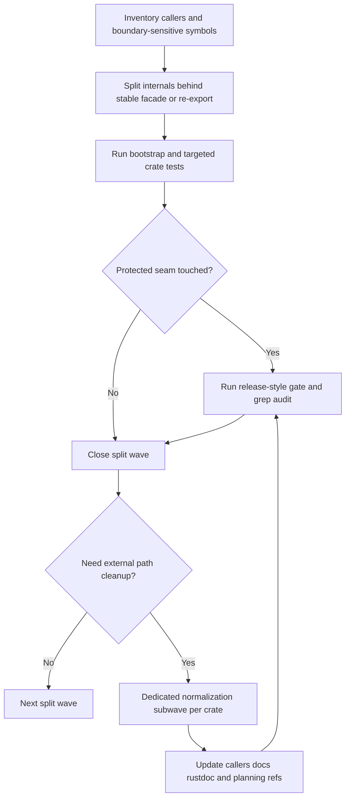

# Phase 030: refactor-long-files - Context

**Gathered:** 2026-03-31
**Status:** Ready for planning

## Phase Boundary

- 📌 Phase 030 delivers a behavior-preserving refactor of the oversized Rust files listed in `030-todo.md`.
- 📌 The phase is about splitting monolithic files into responsibility-focused facades and extracted modules, not about adding new product capabilities.
- 📌 The refactor must preserve crate ownership boundaries, keep the Tari vendor subtree read-only, and keep runtime semantics stable while improving navigability, reviewability, and maintenance cost.
- 📌 Compatibility-sensitive public surfaces are in scope for structural cleanup only when their caller-visible contract remains explicit and measurable throughout the rollout.

## Implementation Decisions

### Split Policy

- **D-01:** Use a soft-but-bounded split policy: the preferred facade band stays near `80-220` lines, and a facade under `300` lines is the normal completion target. A larger facade is still acceptable, including `300+` lines, when it stays cohesive, avoids mixed concerns, and serves mainly as rustdoc surface, re-export surface, orchestration, or another clearly bounded compatibility layer rather than turning into a structural soup.
- **D-02:** A split is still incomplete if extracted responsibilities remain packed together in a mixed-concern root file even when the file is below the original monolith size.
- **D-03:** The planner should still prefer responsibility seams first, then file size, rather than arbitrary line slicing.
- **D-03a:** Size bands and target module counts are planning heuristics, not hard quotas. They guide seam discovery but never justify cutting one homogeneous responsibility into artificial fragments.
- **D-03b:** Structural homogeneity is more important than line-count cosmetics. One cohesive module is preferable to several shard-like files that only exist to satisfy a numeric target.

### Refactor Sequencing

- **D-04:** Execute Phase 030 dependency-first within each crate instead of following the `030-todo.md` list as a globally rigid order.
- **D-05:** Treat the `First Five Candidates` list in `030-todo.md` as the starting backlog, but allow the planner to reorder work inside a crate when a dependency split unlocks a cleaner downstream split.

### Public Path Cleanup

- **D-06:** Internal file and module layout may change freely during split waves, but compatibility-sensitive caller-visible paths must stay stable through existing facades or re-exports while the split is still in flight.
- **D-07:** External path normalization is a dedicated final subwave per crate, not a one-wave mass rename combined with the first structural split. It may proceed only after the planner proves the full caller set through grep-backed inventory and updates code, tests, rustdoc examples, and planning references together.

### Verification Gates

- **D-08:** Every implementation wave must begin with `./.github/skills/smart-tests-bootstrap/scripts/bootstrap_tests.sh` as the fail-fast regression gate.
- **D-09:** After the bootstrap gate passes, run targeted crate tests for the touched area in the same wave.
- **D-10:** Any wave that touches protected seams, crate facades, key-bearing session boundaries, or caller-visible path normalization must also run `./.github/skills/z00z-full-verify-gate/scripts/full_verify.sh --max-safe-run` in the same wave as the release-style gate.
- **D-11:** A grep audit is mandatory before closeout for any protected-seam wave and for any dedicated normalization subwave. The audit must cover legacy deep imports, outdated rustdoc example paths, and stale planning references to renamed modules or files.

### Documentation And YAML Sync

- **D-12:** If a split changes module names, public paths, planning references, or executable or descriptive YAML wiring, the corresponding docs and YAML updates are mandatory in the same wave. YAML scope here means repo YAML that names binaries, stage wiring, module-related paths, or tool-consumed execution references.
- **D-13:** A wave is not complete while structure-changing code has been updated without matching docs, YAML, or planning artifact synchronization.

### Protected Seams

- **D-14:** `z00z_crypto` split waves must preserve one canonical owner for domain-separation helpers, transcript framing helpers, AAD builders, KDF info constants, and public crypto entrypoints. Structural refactor must not create parallel public crypto surfaces.
- **D-15:** `z00z_wallets` split waves must treat `WltSession`, `ScanStatePayload`, lock helpers, session readers, and session-backed store helpers as boundary-sensitive symbols whose caller-visible contract stays stable during the internal split.
- **D-16:** `z00z_core` split waves must normalize consumers to existing shallow aliases such as `z00z_core::genesis::ChainType` before any deep path cleanup around `genesis::genesis` or similar legacy paths. Where legacy deep imports are widespread, that alias rewrite may run as its own prerequisite wave before the final crate-level normalization subwave.

### Test Planning

- **D-17:** Each split wave must name both local verification and cross-crate verification before implementation starts. Local verification means the closest unit or integration tests for the touched crate surface; cross-crate verification means at least one consumer-facing suite when the seam is imported across crate or service boundaries.
- **D-18:** Protected-seam plans must record exact test anchors in the plan itself rather than relying on generic `cargo test` wording. At minimum, wallet store waves should anchor `crates/z00z_wallets/tests/test_redb_wlt_open.rs`, `crates/z00z_wallets/tests/test_open_wallet_source_discovery.rs`, and `crates/z00z_wallets/tests/test_tx_store_integration.rs`; genesis and assets waves should anchor `crates/z00z_core/tests/genesis/test_genesis.rs`, `crates/z00z_core/tests/genesis/test_reproducibility.rs`, `crates/z00z_core/tests/assets/test_assets.rs`, and `crates/z00z_core/tests/assets/test_wire_format_snapshots.rs`; crypto ownership waves should anchor `crates/z00z_crypto/tests/test_hash_policy.rs`, `crates/z00z_crypto/tests/test_domain_separation.rs`, wallet KDF coverage in `crates/z00z_wallets/tests/test_kdf.rs`, and relevant rustdoc or doc-test surfaces such as `crates/z00z_crypto/src/aead.rs`.

### Wave Output Contract

- **D-19:** Every implementation wave must close with explicit outputs: updated facade or re-export surface, extracted modules or alias rewrite, synchronized docs or YAML when affected, named test commands actually run, and the grep-audit scope used for closeout.
- **D-20:** A normalization subwave is incomplete unless it records the caller inventory source, the exact caller updates performed, and the verification evidence that no legacy deep-import or stale rustdoc path survived.

### the agent's Discretion

- 📌 The planner may choose exact helper module names, directory depth, and whether a seam lands as sibling files or a directory facade, as long as the resulting structure stays responsibility-focused and readable.
- 📌 The planner may decide exact wave size per plan as long as the dependency-first rule, verification gates, and same-wave sync rules are preserved.

## Execution Order Sketch

## Canonical References

**Downstream agents MUST read these before planning or implementing.**

### Phase Scope And Workflow

- `.planning/ROADMAP.md` — Defines the Phase 030 goal, dependency on Phase 029, and current roadmap placement.
- `.planning/phases/030-refactor-long-files/030-todo.md` — Canonical split backlog, size guardrails, target seams, rollout rules, and done criteria.
- `.planning/GSD-Workflow.md` — Phase-local workflow intent, expected GSD sequence, and explicit validation expectations for Phase 030.

### Repository Patterns And Constraints

- `.planning/codebase/CONVENTIONS.md` — Naming, module, error-handling, facade, and architectural conventions already used across the workspace.
- `.planning/codebase/STRUCTURE.md` — Current crate boundaries, module ownership, and where refactored code should continue to live.
- `.planning/codebase/TESTING.md` — Existing test organization and the expected relationship between targeted tests and broader verification gates.

### Representative Split Targets

- `crates/z00z_wallets/src/db/redb_wallet_store.rs` — Primary example of a giant persistence monolith with codecs, crypto, session, backup, and query logic co-located.
- `crates/z00z_wallets/src/db/mod.rs` — Wallet DB facade that must keep re-export and module ownership explicit while internal store files move.
- `crates/z00z_wallets/src/services/wallet_service.rs` — Primary example of a giant orchestration file with service state, session logic, address flows, and runtime behavior packed together.
- `crates/z00z_wallets/src/services/mod.rs` — Services facade that must remain coherent if service modules are split into subfiles.
- `crates/z00z_core/src/assets/assets.rs` — Primary example of a large domain file whose target split must preserve protocol semantics while isolating concerns.
- `crates/z00z_core/src/genesis/genesis.rs` — Primary example of a large generation and validation surface whose split must preserve deterministic behavior and network-domain rules.
- `crates/z00z_core/src/genesis/mod.rs` — Existing shallow alias surface whose exports should stabilize callers before any deep-path cleanup.
- `crates/z00z_crypto/src/hash.rs`, `crates/z00z_crypto/src/kdf.rs`, `crates/z00z_crypto/src/aead.rs` — Compatibility-sensitive crypto surfaces whose public entrypoints, framing helpers, and domain-separation ownership must not fragment during the split.
- `crates/z00z_crypto/src/lib.rs` — Stable external crypto facade that must remain the single caller-facing export surface while internals are reorganized.

### Verification Anchors

- `crates/z00z_wallets/tests/test_redb_wlt_open.rs` — Regression anchor for wallet open, migration, and redb-backed store lifecycle.
- `crates/z00z_wallets/tests/test_open_wallet_source_discovery.rs` — Regression anchor for snapshot persistence, wallet-source discovery, and store-to-service integration.
- `crates/z00z_wallets/tests/test_tx_store_integration.rs` — Consumer-facing anchor for transaction storage behavior seen through wallet RPC and service flows.
- `crates/z00z_core/tests/genesis/test_genesis.rs` and `crates/z00z_core/tests/genesis/test_reproducibility.rs` — Deterministic genesis and validation anchors for `genesis.rs` and related alias cleanup.
- `crates/z00z_core/tests/assets/test_assets.rs` and `crates/z00z_core/tests/assets/test_wire_format_snapshots.rs` — Asset protocol and wire-compatibility anchors for asset-domain splits.
- `crates/z00z_crypto/tests/test_hash_policy.rs` and `crates/z00z_crypto/tests/test_domain_separation.rs` — Domain-separation and hash-policy anchors for crypto ownership seams.
- `crates/z00z_wallets/tests/test_kdf.rs` — Cross-crate KDF and domain-separation anchor when crypto splits affect wallet derivation behavior.
- `crates/z00z_simulator/tests/test_genesis_integration.rs` and `crates/z00z_simulator/tests/test_stage4_split.rs` — Cross-crate smoke anchors when path normalization or structural moves affect simulator-facing flows.

### Existing Good Module Shapes

- `crates/z00z_storage/src/serialization/mod.rs` — Example of a clean facade over focused implementation modules.
- `crates/z00z_utils/src/config/mod.rs` — Example of a grouped facade with internal submodules for one responsibility family.
- `crates/z00z_utils/src/logger/mod.rs` — Example of a broad but coherent facade that delegates to focused internals.
- `crates/z00z_simulator/src/scenario_1/stage_4_utils/` — Example of helper code being moved under a dedicated utility subtree instead of bloating the root stage file surface.

## Existing Code Insights

### Reusable Assets

- `crates/z00z_storage/src/serialization/mod.rs`: A live example of the desired facade-plus-submodules pattern for extracted responsibilities.
- `crates/z00z_utils/src/config/mod.rs` and `crates/z00z_utils/src/logger/mod.rs`: Good references for coherent `mod.rs` surfaces over many internal modules.
- `crates/z00z_simulator/src/scenario_1/stage_4_utils/`: A good precedent for moving helper-heavy code under `*_utils/` rather than leaving it in the root file.

### Established Patterns

- The workspace prefers crate-level `lib.rs` facades plus internal `mod.rs` boundaries instead of exposing deep file paths directly.
- Large modules are already documented heavily, so planners must separate true orchestration from stale or misleading header comments instead of assuming size alone defines the seam.
- Tests are predominantly targeted crate tests plus broader release-style gates rather than coverage-percentage goals.

### Integration Points

- `crates/z00z_wallets/src/lib.rs` and crate submodule facades will need careful updates whenever Phase 030 changes public module paths.
- `crates/z00z_core::genesis::genesis::ChainType` is still imported directly by wallet code and tests today, so planner waves must normalize those consumers before or together with any deep-path cleanup.
- `crate::db::redb_wallet_store::*` symbols are consumed from `session_service`, `wlt_store`, `core/address`, and `core/wallet`, so internal splitting must preserve that boundary until consumer updates are explicitly scheduled.
- Planning artifacts that name files directly, especially `030-todo.md` and future plan docs, must move in lockstep with file-system and module-surface changes.
- Any descriptive or executable YAML that references stage or module structure must be updated in the same wave if affected by a split.

## Specific Ideas

- 📌 Separate internal structural split from caller-path normalization on compatibility-sensitive surfaces.
- 📌 Prefer existing shallow aliases and crate facades over introducing compatibility shims or duplicate public APIs.
- 📌 Keep the planner free to choose exact module tree shapes, but require same-wave test and doc synchronization whenever structure changes.
- 📌 Reject shard-style splits that replace one mixed monolith with many tiny files that still need to be read together as one concept.

## Deferred Ideas

- None — discussion stayed within phase scope.

---

*Phase: 030-refactor-long-files*
*Context gathered: 2026-03-31*
