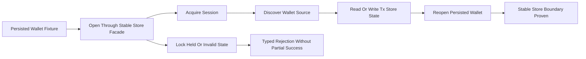
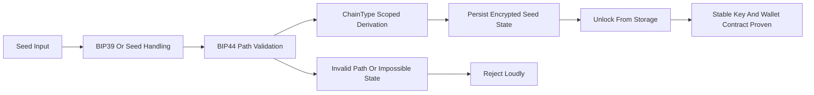
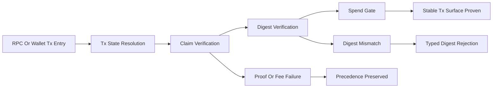

# Phase 030 Test Spec

## Purpose

📌 This document defines the phase-local E2E, integration, source-shape, and
focused unit coverage required to close Phase 030.

📌 It is intended to be directly usable by another engineer or agent without
guessing scenario boundaries, state transitions, proof paths, failure paths,
normalization boundaries, or pass oracles.

📌 Phase 030 is a behavior-preserving structural refactor phase. The tests in
this document must prove that wallet, core, crypto, simulator, and utility
flows continue to behave the same while large files split behind stable
facades and later normalize onto shallow caller-visible paths.

📌 Phase 030 coverage is Rust-driven and grep-audit-backed coverage, not
browser automation. End-to-end proof must be established through release-mode
integration tests, realistic wallet and simulator flows, rustdoc or public
surface checks where required, and explicit grep audits for normalization
closure.

## Workflow Status

📌 Strict `gsd-add-tests` generation was originally blocked when this phase
directory still lacked summary-backed closeout artifacts.

📌 That blocker is now retired for Phase 030 closeout because the directory
contains summary-backed execution artifacts through `030-24-SUMMARY.md` and
`030-25-SUMMARY.md`, and the live residue report in
`.planning/phases/030-refactor-long-files/030-length_stat.md` records the
canonical 2026-04-03 zero-residue and `full_verify --max-safe-run` outcome.

📌 A standalone phase-local `030-VERIFICATION.md` artifact still does not
exist, so this document remains the phase-local test navigation contract while
the authoritative executed-verification evidence lives in:

- `.planning/phases/030-refactor-long-files/030-24-SUMMARY.md`
- `.planning/phases/030-refactor-long-files/030-25-SUMMARY.md`
- `.planning/phases/030-refactor-long-files/030-length_stat.md`

📌 This test spec therefore uses these inputs as the current source of truth:

- `.planning/phases/030-refactor-long-files/030-CONTEXT.md`
- `.planning/phases/030-refactor-long-files/030-todo.md`
- `.planning/phases/030-refactor-long-files/030-01-PLAN.md`
- `.planning/phases/030-refactor-long-files/030-02-PLAN.md`
- `.planning/phases/030-refactor-long-files/030-03-PLAN.md`
- `.planning/phases/030-refactor-long-files/030-04-PLAN.md`
- `.planning/phases/030-refactor-long-files/030-05-PLAN.md`
- `.planning/phases/030-refactor-long-files/030-06-PLAN.md`
- `.planning/phases/030-refactor-long-files/030-07-PLAN.md`
- `.planning/phases/030-refactor-long-files/030-08-PLAN.md`
- `.planning/phases/030-refactor-long-files/030-09-PLAN.md`
- `.planning/phases/030-refactor-long-files/030-10-PLAN.md`
- `.planning/phases/030-refactor-long-files/030-11-PLAN.md`
- `.planning/phases/030-refactor-long-files/030-12-PLAN.md`
- `.planning/phases/030-refactor-long-files/030-13-PLAN.md`
- `.planning/phases/030-refactor-long-files/030-14-PLAN.md`
- `.planning/phases/030-refactor-long-files/030-15-PLAN.md`
- `.planning/phases/030-refactor-long-files/030-16-PLAN.md`
- `.planning/phases/030-refactor-long-files/030-17-PLAN.md`
- `.planning/phases/030-refactor-long-files/030-18-PLAN.md`
- `.planning/phases/030-refactor-long-files/030-19-PLAN.md`
- `.planning/phases/030-refactor-long-files/030-20-PLAN.md`
- `.planning/phases/030-refactor-long-files/030-21-PLAN.md`
- `.planning/phases/030-refactor-long-files/030-22-PLAN.md`
- `.planning/phases/030-refactor-long-files/030-23-PLAN.md`
- `.planning/phases/030-refactor-long-files/030-24-PLAN.md`
- `.planning/phases/030-refactor-long-files/030-25-PLAN.md`
- `.planning/phases/030-refactor-long-files/030-24-SUMMARY.md`
- `.planning/phases/030-refactor-long-files/030-25-SUMMARY.md`
- `.planning/phases/030-refactor-long-files/030-VALIDATION.md`
- `.planning/phases/030-refactor-long-files/030-UAT.md`
- `.planning/REQUIREMENTS.md`
- Existing anchors in `crates/z00z_wallets/tests/`,
  `crates/z00z_core/tests/`, `crates/z00z_crypto/tests/`,
  `crates/z00z_simulator/tests/`, and relevant inline module tests.

📌 `030-todo.md` is retained here as the historical seam map and planning
baseline. It should not be interpreted as a live list of unresolved Phase 030
work after the summary-backed continuation closeout.

📌 Because `030-VERIFICATION.md` is still absent as a standalone artifact, this
document remains the compact scenario map for the phase. The executed
verification record, however, is now summary-backed rather than fallback-only.

📌 This document is the phase-local test contract and coverage index for Phase
030 after closeout; use the summary-backed artifacts above as the execution
record.

## Test Contract

### Test Levels

- `Focused unit` for responsibility seams whose correctness is local to one
  crate file or one internal invariant.
- `Integration` for cross-module behavior inside one crate facade.
- `Cross-crate integration` for wallet, core, crypto, and simulator consumer
  paths that must remain stable across refactor waves.
- `End-to-end` for realistic release-mode workflows that prove preserved user
  behavior across persistence, derivation, validation, and simulator closure.
- `Source-shape and grep-audit` for dedicated normalization waves where the
  proof obligation is path closure, facade stability, stale-reference cleanup,
  and deep-import removal.

### What This Phase Must Prove

- Large-file splits do not change wallet-visible, core-visible, crypto-visible,
  or simulator-visible behavior.
- Protected seams keep one canonical owner surface and do not fork public or
  quasi-public contracts.
- Caller-visible paths stay stable during split waves and normalize only in the
  dedicated closure waves.
- Existing negative outcomes still fail closed with the same effective reject
  semantics, especially around wallet open, derivation, verifier ordering, and
  public path cleanup.
- Docs, rustdoc, YAML, and planning references move in lockstep with path
  normalization waves.

## Classification

### TDD And Integration Targets

- `crates/z00z_wallets/src/db/redb_wallet_store.rs`
  because store splitting must preserve the caller-visible wallet-open,
  snapshot, tx-store, and session-backed boundary.
- `crates/z00z_wallets/src/db/redb_wallet_crypto.rs`
  because it remains the canonical owner of the persisted-wallet KDF, AAD, and
  envelope contract during the store split.
- `crates/z00z_wallets/src/core/address/address_manager.rs`
  and `crates/z00z_wallets/src/core/address/z00z_address.rs`
  because address cache, request scan, Bech32m codec, and validation behavior
  must remain stable while address files split.
- `crates/z00z_wallets/src/core/key/seed.rs`,
  `crates/z00z_wallets/src/core/key/bip32.rs`, and
  `crates/z00z_wallets/src/core/key/key_manager.rs`
  because the seed-to-BIP44-to-ChainType-to-storage contract must remain
  behavior-compatible while the key stack splits.
- `crates/z00z_wallets/src/core/wallet/wallet.rs`
  because wallet identity, chain typing, and record ownership must stay stable
  for service and key consumers.
- `crates/z00z_wallets/src/services/wallet_service.rs` and
  `crates/z00z_wallets/src/services/app_service.rs`
  because orchestration, app lifecycle, and service ownership must not fork or
  move into the UI shell.
- `crates/z00z_core/src/assets/assets.rs`,
  `crates/z00z_core/src/assets/registry.rs`,
  `crates/z00z_core/src/assets/nonce.rs`, and
  `crates/z00z_core/src/assets/definition.rs`
  because asset behavior, wire formats, nonce derivation, and definition
  validation must remain stable while asset files split.
- `crates/z00z_core/src/genesis/genesis.rs` and
  `crates/z00z_core/src/genesis/validator.rs`
  because deterministic genesis behavior and `ChainType` consumer aliases must
  remain stable across alias-first cleanup.
- `crates/z00z_crypto/src/hash.rs`, `crates/z00z_crypto/src/kdf.rs`,
  `crates/z00z_crypto/src/aead.rs`, `crates/z00z_crypto/src/types.rs`, and
  `crates/z00z_crypto/src/backend_tari.rs`
  because crypto ownership seams must not duplicate domain tags, transcript
  framing, KDF constants, or public facade behavior.
- `crates/z00z_wallets/src/adapters/rpc/methods/asset_impl.rs`,
  `crates/z00z_wallets/src/adapters/rpc/methods/tx_impl.rs`,
  `crates/z00z_wallets/src/core/tx/state_update.rs`,
  `crates/z00z_wallets/src/core/tx/claim_tx.rs`,
  `crates/z00z_wallets/src/core/tx/tx_verifier.rs`, and
  `crates/z00z_wallets/src/core/tx/spending.rs`
  because transport, transaction state, claim flow, digest framing, verifier
  ordering, and spend gating must stay stable during refactor.
- `crates/z00z_simulator/src/scenario_1/stage_4_utils/tx_lane_impl.rs`,
  `crates/z00z_simulator/src/scenario_1/stage_6_utils/bundle_lane_impl.rs`,
  and `crates/z00z_utils/src/io/fs.rs`
  because helper splits must not break Scenario 1 stage shape or utility
  facade behavior.

### E2E Browser Targets

- None.

### Skip Targets

- Planning markdown files themselves
  because they are specification inputs, not executable behavior.
- Tari vendor code under `crates/z00z_crypto/tari/`
  because it is explicitly read-only and outside Phase 030 scope.
- Pure logging assertions
  unless a log line is the only observable proof of required fail-closed path
  handling.

## Existing Test Anchors To Reuse

📌 Reuse and extend these existing files instead of duplicating their seams.

### Wallet Store, Service, And Public Path Anchors

- `crates/z00z_wallets/tests/test_redb_wlt_open.rs`
  for wallet-open, migration, and persisted-store lifecycle behavior.
- `crates/z00z_wallets/tests/test_open_wallet_source_discovery.rs`
  for snapshot persistence and store-to-service discovery flow.
- `crates/z00z_wallets/tests/test_tx_store_integration.rs`
  for consumer-facing transaction storage behavior.
- `crates/z00z_wallets/tests/test_app_service_create_wallet.rs`
  for app-service wallet creation and lifecycle entrypoint behavior.
- `crates/z00z_wallets/tests/test_e2e_public_path.rs`
  for wallet shallow-facade usage after normalization closure.

### Address And Key Anchors

- `crates/z00z_wallets/tests/test_addr_rate_limit_integration.rs`
  for address-manager integration, request-scan, and rate-limit behavior.
- `crates/z00z_wallets/tests/test_bip44.rs`
  for BIP-44 path and `ChainType` consumer behavior.
- `crates/z00z_wallets/tests/test_rpc_key_derive_e2e.rs`
  for wallet-facing RPC derivation behavior that must survive alias-first
  `ChainType` normalization.
- `crates/z00z_wallets/tests/test_key_manager.rs`
  for key-manager state, derivation, and cache invariants.
- `crates/z00z_wallets/tests/test_seed_salt_policy.rs`
  for seed and persistence policy regressions relevant to the key split.
- `crates/z00z_wallets/tests/test_wallet_kdf_migration.rs`
  for KDF migration and persisted-wallet compatibility behavior.
- `crates/z00z_wallets/tests/test_key_manager_storage_unlock.rs`
  for unlock-from-storage behavior under the split key stack.

### Core And Crypto Anchors

- `crates/z00z_core/tests/assets/test_assets.rs`
  for asset behavior and protocol-level assertions.
- `crates/z00z_core/tests/assets/test_wire_format_snapshots.rs`
  for asset wire compatibility and serialization proof.
- `crates/z00z_core/tests/genesis/test_genesis.rs`
  and `crates/z00z_core/tests/genesis/test_reproducibility.rs`
  for deterministic genesis behavior.
- `crates/z00z_crypto/tests/test_hash_policy.rs`
  for hash-policy and public hash helper behavior.
- `crates/z00z_crypto/tests/test_domain_separation.rs`
  and `crates/z00z_crypto/tests/domain_separation_tests.rs`
  for domain ownership and framing behavior.
- `crates/z00z_crypto/tests/test_public_surface.rs`
  for the approved public crypto export story.
- `crates/z00z_wallets/tests/test_kdf.rs`
  for wallet-facing KDF consumption across crypto refactors.

### Tx, Claim, And Simulator Anchors

- `crates/z00z_wallets/tests/test_asset_ownership_security.rs`
  for asset-side ownership and RPC transport invariants.
- `crates/z00z_wallets/tests/test_tx_assetpack.rs`
  for wallet tx package behavior visible through transport boundaries.
- `crates/z00z_wallets/tests/test_claim_state_core.rs`
  for claim-state behavior.
- `crates/z00z_wallets/src/core/tx/test_claim_tx.rs`
  for inline claim verifier ordering and precedence behavior.
- `crates/z00z_wallets/tests/test_view_key_contract.rs`
  for wallet tx verification contracts visible to view-key behavior.
- `crates/z00z_wallets/tests/test_tx_spent_gate.rs`
  for spend-gate closure.
- `crates/z00z_wallets/tests/test_tx_digest_framing.rs`
  `crates/z00z_wallets/tests/test_tx_fee.rs`
  `crates/z00z_wallets/tests/test_tx_pass.rs`
  and `crates/z00z_wallets/tests/test_tx_poison.rs`
  for digest framing and reject-order stability.
- `crates/z00z_simulator/tests/test_stage4_split.rs`
  for Stage 4 utility split behavior.
- `crates/z00z_simulator/tests/test_genesis_integration.rs`
  for simulator helper integration against the release-style scenario flow.
- `crates/z00z_simulator/tests/test_scenario1_stage_surface.rs`
  and `crates/z00z_simulator/tests/test_stage4_source_shape.rs`
  for final simulator source-shape and stage-surface closure.

## Canonical Command Set

📌 The minimum command inventory for Phase 030 implementation coverage is:

- `./.github/skills/smart-tests-bootstrap/scripts/bootstrap_tests.sh`
- `cargo test -p z00z_wallets --release --test test_redb_wlt_open -- --nocapture`
- `cargo test -p z00z_wallets --release --test test_open_wallet_source_discovery -- --nocapture`
- `cargo test -p z00z_wallets --release --test test_tx_store_integration -- --nocapture`
- `cargo test -p z00z_wallets --release --test test_addr_rate_limit_integration -- --nocapture`
- `cargo test -p z00z_wallets --release test_address_manager_create_card -- --nocapture`
- `cargo test -p z00z_wallets --release test_address_manager_scan_integration -- --nocapture`
- `cargo test -p z00z_wallets --release dual_new_accepts_many_pairs -- --nocapture`
- `cargo test -p z00z_wallets --release uri_rejects_non_ascii -- --nocapture`
- `cargo test -p z00z_wallets --release bech32m_detects_data_corruption -- --nocapture`
- `cargo test -p z00z_wallets --release --test test_bip44 -- --nocapture`
- `cargo test -p z00z_wallets --release --test test_rpc_key_derive_e2e -- --nocapture`
- `cargo test -p z00z_wallets --release --test test_key_manager -- --nocapture`
- `cargo test -p z00z_wallets --release --test test_seed_salt_policy -- --nocapture`
- `cargo test -p z00z_wallets --release --test test_wallet_kdf_migration -- --nocapture`
- `cargo test -p z00z_wallets --release --test test_key_manager_storage_unlock -- --nocapture`
- `cargo test -p z00z_wallets --release --test test_app_service_create_wallet -- --nocapture`
- `cargo test -p z00z_wallets --release --test test_e2e_public_path -- --nocapture`
- `cargo test -p z00z_core --release --test test_assets -- --nocapture`
- `cargo test -p z00z_core --release --test test_wire_format_snapshots -- --nocapture`
- `cargo test -p z00z_core --release --test test_genesis -- --nocapture`
- `cargo test -p z00z_core --release --test test_reproducibility -- --nocapture`
- `cargo test -p z00z_crypto --release --test test_hash_policy -- --nocapture`
- `cargo test -p z00z_crypto --release --test test_domain_separation -- --nocapture`
- `cargo test -p z00z_crypto --release --test domain_separation_tests -- --nocapture`
- `cargo test -p z00z_crypto --release --test test_public_surface -- --nocapture`
- `cargo test -p z00z_wallets --release --test test_kdf -- --nocapture`
- `cargo test -p z00z_wallets --release --test test_asset_ownership_security -- --nocapture`
- `cargo test -p z00z_wallets --release --test test_tx_assetpack -- --nocapture`
- `cargo test -p z00z_wallets --release --test test_claim_state_core -- --nocapture`
- `cargo test -p z00z_wallets --release test_claim_tx -- --nocapture`
- `cargo test -p z00z_wallets --release --test test_view_key_contract -- --nocapture`
- `cargo test -p z00z_wallets --release --test test_tx_spent_gate -- --nocapture`
- `cargo test -p z00z_wallets --release --test test_tx_digest_framing -- --nocapture`
- `cargo test -p z00z_wallets --release --test test_tx_fee -- --nocapture`
- `cargo test -p z00z_wallets --release --test test_tx_pass -- --nocapture`
- `cargo test -p z00z_wallets --release --test test_tx_poison -- --nocapture`
- `cargo test -p z00z_simulator --release --features test-fast --features wallet_debug_dump --test test_stage4_split -- --nocapture`
- `cargo test -p z00z_simulator --release --features test-fast --features wallet_debug_dump --test test_genesis_integration -- --nocapture`
- `cargo test -p z00z_simulator --release --features test-fast --features wallet_debug_dump --test test_scenario1_stage_surface -- --nocapture`
- `cargo test -p z00z_simulator --release --features test-fast --features wallet_debug_dump --test test_stage4_source_shape -- --nocapture`
- `cargo test -p z00z_wallets --release --features test-fast --features wallet_debug_dump -- --nocapture`
- `cargo test -p z00z_core --release --features test-fast -- --nocapture`
- `cargo test -p z00z_crypto --release --features test-fast -- --nocapture`
- `cargo test -p z00z_utils --release --features test-fast --all-targets -- --nocapture`
- `cargo test -p z00z_simulator --release --features test-fast --features wallet_debug_dump`
- `cargo run --release -p z00z_simulator --bin scenario_1 --features wallet_debug_dump`
- `./.github/skills/z00z-full-verify-gate/scripts/full_verify.sh --max-safe-run`

📌 Dedicated normalization waves must also execute the grep audits named in the
plan package. The grep audit is not optional evidence; it is part of the pass
oracle for those waves.

## Required End-To-End Behaviors

| Behavior | Requirement Focus | Primary Path | Success Condition | Failure Condition |
| --- | --- | --- | --- | --- |
| Wallet store split preserves open, session, and tx-store behavior | PH30-SEAMS, D-15 | `open wallet -> session acquire -> source discovery -> tx store -> reopen` | wallet opens, discovery stays stable, tx-store tests stay green, and no second wallet crypto seam appears | open or reopen semantics drift, source discovery breaks, or crypto ownership forks |
| Address split preserves codec, request scan, and rejection semantics | PH30-SEAMS | `address build -> request scan -> cache or rate-limit -> validation` | valid addresses roundtrip, request scan stays green, and malformed forms reject explicitly | corrupted Bech32m, invalid URI, or pair-shape drift is silently accepted |
| Key split preserves seed-to-storage-to-unlock contract | PH30-SEAMS, D-15 | `seed create -> bip44 path -> ChainType bridge -> persist -> unlock` | derivation and unlock stay green, migration stays compatible, and no wallet-local crypto constants shadow canonical owners | unlock-from-storage breaks, path validation drifts, or KDF ownership forks |
| Service and UI split preserve orchestration ownership | PH30-FACADE | `create wallet -> app service -> wallet service -> persistence or discovery` | service tests stay green and orchestration remains owned by the service layer, not recreated in UI code | UI shell duplicates service logic or service lifecycle behavior drifts |
| Asset and genesis split preserve deterministic and wire behavior | PH30-PROTECTED, D-16 | `asset definition -> registry -> nonce -> wire snapshots` and `genesis build -> validate -> reproduce` | wire snapshots stay green, deterministic genesis stays green, and wallet-facing alias-first `ChainType` consumers stay green before deep-path cleanup | wire format changes, deterministic genesis drifts, or deep imports survive cleanup |
| Crypto split preserves singular public and internal owner surfaces | PH30-PROTECTED, D-14 | `hash or domain helpers -> kdf -> aead -> wallet kdf consumer` | domain, framing, KDF, AEAD, and public facade tests stay green with one approved namespace set | duplicate crypto entrypoints appear, public namespace forks, or wallet kdf behavior drifts |
| Tx and RPC split preserve verifier order and reject behavior | PH30-VERIFY | `transport -> tx state -> claim verify -> digest -> spend gate` | tx and claim tests prove same success and rejection order as before, especially proof or fee precedence over digest mismatch where applicable | verifier order changes, digest framing changes, or transport owns tx-domain logic |
| Simulator and io split preserve Scenario 1 stage and helper behavior | PH30-VERIFY | `stage4 helper split -> stage6 helper split -> scenario_1 release run` | Stage 4 split tests, stage surface tests, source-shape tests, and release scenario run stay green | simulator source shape drifts or helper refactor breaks release execution |
| Final normalization waves close legacy deep paths and stale refs | PH30-NORMALIZE, D-20 | `grep-backed caller inventory -> shallow facades -> docs or rustdoc sync -> grep audit closeout` | no legacy deep imports, stale rustdoc paths, or stale planning refs survive the wave | any deep path, stale ref, or unsynchronized doc remains after claimed closeout |

## Critical Integration Paths

📌 The following paths are critical because they cross facade or ownership
boundaries that Phase 030 must preserve.

| Path ID | Integration Path | Why It Is Critical | Required Observations |
| --- | --- | --- | --- |
| 030-PATH-01 | `redb_wallet_store -> redb_wallet_crypto -> wallet_service -> open_wallet_source_discovery` | proves store split does not break persisted-wallet and session boundaries | stable unlock, stable source discovery, stable tx-store behavior |
| 030-PATH-02 | `z00z_address -> address_manager -> request scan -> wallet_service` | proves address-format and address-manager seams stay aligned | valid address acceptance, malformed address rejection, stable request-scan behavior |
| 030-PATH-03 | `seed -> bip32 -> key_manager -> wallet -> storage unlock` | proves atomic derivation and persistence contract stays intact | stable BIP44 behavior, stable unlock, explicit rejection of invalid states |
| 030-PATH-04 | `assets -> registry -> nonce -> definition -> wire snapshots` | proves asset seams remain behavior-compatible | stable snapshots, stable asset behavior, stable validation |
| 030-PATH-05 | `genesis::mod alias -> wallet and tests -> deterministic genesis` | proves alias-first cleanup before deep-path removal | shallow alias compiles in wallet-facing consumers, RPC derivation stays green, and deep alias can be grepped away only in normalization wave |
| 030-PATH-06 | `z00z_crypto::lib -> hash or kdf or aead -> wallet test_kdf` | proves one canonical crypto facade and preserved consumer behavior | singular public surface, no shadow constants, wallet-facing derivation still green |
| 030-PATH-07 | `asset_rpc or tx_rpc -> tx core -> claim verifier -> spend gate` | proves transport split does not absorb tx ownership or reorder rejection logic | stable tx results, stable claim precedence, stable spend gating |
| 030-PATH-08 | `stage_4_utils -> stage_6_utils -> scenario_1 runner` | proves simulator helper splits preserve public stage shape and runnable flow | source-shape guards green, release scenario run still closes |
| 030-PATH-09 | `crate facades -> rustdoc or README or planning refs -> grep audit` | proves normalization waves are complete, not partial | no stale deep path references remain |

## Scenario Catalogue

### 030-E2E-01 Wallet Store Boundary Preservation

**What it demonstrates**: the store split preserves wallet-open, session,
snapshot, and transaction storage behavior while `redb_wallet_crypto.rs`
remains the sole owner of persisted-wallet crypto semantics.

**Primary anchors**:

- `crates/z00z_wallets/tests/test_redb_wlt_open.rs`
- `crates/z00z_wallets/tests/test_open_wallet_source_discovery.rs`
- `crates/z00z_wallets/tests/test_tx_store_integration.rs`
- `crates/z00z_wallets/tests/test_wallet_kdf_migration.rs`
- `crates/z00z_wallets/tests/test_key_manager_storage_unlock.rs`

**Realistic example**:

1. Open an existing persisted wallet fixture.
2. Acquire the active session and discover the wallet source.
3. Exercise transaction-store read or write behavior visible through the
   current wallet service.
4. Reopen the persisted wallet and prove behavior matches the pre-refactor
   baseline.

**Assertions**:

- Wallet open succeeds without changing the caller-visible service contract.
- Session-bearing helpers still resolve through the stable store boundary.
- Source discovery and tx-store behavior remain green.
- No parallel wallet-store crypto helper surface is introduced.

**Negative scenarios**:

- Existing lock-held conditions still reject safely.
- Invalid or incompatible persisted-wallet state still rejects without partial
  success.

**Pass oracle**:

- All anchors stay green under release mode.
- Grep audits for normalization waves do not report stale deep store paths.

**Fail oracle**:

- Any new caller path bypasses the stable store facade.
- Store open or reopen behavior changes.
- The KDF or AAD owner surface forks away from `redb_wallet_crypto.rs`.

### 030-E2E-02 Address Surface Preservation

**What it demonstrates**: the address split preserves one stable address facade
and does not change address generation, parsing, request scan, or rejection
semantics.

**Primary anchors**:

- `crates/z00z_wallets/tests/test_addr_rate_limit_integration.rs`
- local `test_address_manager_create_card`
- local `test_address_manager_scan_integration`
- local `dual_new_accepts_many_pairs`
- local `uri_rejects_non_ascii`
- local `bech32m_detects_data_corruption`

**Realistic example**:

1. Create a card or request address using the current public facade.
2. Scan the request through the address-manager flow.
3. Roundtrip valid address forms through parser and formatter logic.
4. Feed malformed URI or corrupted Bech32m data and assert explicit rejection.

**Assertions**:

- Valid address forms roundtrip unchanged.
- Rate-limit or request-scan behavior remains stable.
- Non-ASCII URI and corrupted Bech32m payloads reject explicitly.

**Negative scenarios**:

- Invalid pair-count shapes reject.
- Cache or expiry splitting does not turn malformed input into silent fallback.

**Pass oracle**:

- Existing and local test anchors remain green.

**Fail oracle**:

- Any malformed address is accepted silently.
- One half of the address flow uses a different semantic contract from the
  other half.

### 030-E2E-03 Seed, BIP44, And Unlock Chain Preservation

**What it demonstrates**: the split key stack preserves the atomic contract
`seed -> bip44 -> ChainType -> persistence -> unlock-from-storage`.

**Primary anchors**:

- `crates/z00z_wallets/tests/test_bip44.rs`
- `crates/z00z_wallets/tests/test_key_manager.rs`
- `crates/z00z_wallets/tests/test_seed_salt_policy.rs`
- `crates/z00z_wallets/tests/test_wallet_kdf_migration.rs`
- `crates/z00z_wallets/tests/test_key_manager_storage_unlock.rs`

**Realistic example**:

1. Initialize key material from a seed for a concrete `ChainType`.
2. Allocate or validate BIP44 paths.
3. Persist encrypted seed state.
4. Unlock from persisted state and prove the reopened key-manager contract is
   identical to the pre-split baseline.

**Assertions**:

- Valid BIP44 derivation remains stable.
- Unlock-from-storage still works across migrated persisted state.
- No wallet-local crypto constants shadow canonical crypto or store owners.

**Negative scenarios**:

- Impossible BIP44 state transitions reject loudly.
- Invalid unlock state rejects without partial recovery.

**Pass oracle**:

- Key and migration anchors remain green.

**Fail oracle**:

- A previously valid persisted wallet cannot unlock.
- Invalid state collapses to silent fallback.

### 030-E2E-04 Service Ownership And App Lifecycle Preservation

**What it demonstrates**: service and app/UI splits do not duplicate service
ownership or move orchestration semantics into the UI shell.

**Primary anchors**:

- `crates/z00z_wallets/tests/test_wallet_service_errors.rs`
- `crates/z00z_wallets/tests/test_app_service_create_wallet.rs`
- `crates/z00z_wallets/tests/test_tx_store_integration.rs`
- `crates/z00z_wallets/tests/test_open_wallet_source_discovery.rs`

**Realistic example**:

1. Create a wallet through the app-service entrypoint.
2. Use wallet-service methods that require store and session cooperation.
3. Exercise discovery or tx-store paths through the service facade.
4. Confirm UI-shell helpers remain composition-only and do not own business
   logic directly.

**Assertions**:

- Wallet creation and service errors stay typed and stable.
- Service-layer ownership remains explicit.
- UI-layer refactor does not change service behavior.

**Negative scenarios**:

- UI-shell code must not recreate service orchestration.
- Failing service calls must not leave partial state mutation.

**Pass oracle**:

- Existing service anchors remain green.

**Fail oracle**:

- Service lifecycle behavior changes.
- UI-only code becomes the de facto owner of service logic.

### 030-E2E-05 Asset, Registry, Nonce, Definition, And Genesis Stability

**What it demonstrates**: core splits preserve asset wire behavior,
definition validation, nonce behavior, deterministic genesis generation, and
alias-first `ChainType` cleanup.

**Primary anchors**:

- `crates/z00z_core/tests/assets/test_assets.rs`
- `crates/z00z_core/tests/assets/test_wire_format_snapshots.rs`
- `crates/z00z_core/tests/genesis/test_genesis.rs`
- `crates/z00z_core/tests/genesis/test_reproducibility.rs`
- `crates/z00z_wallets/tests/test_rpc_key_derive_e2e.rs`

**Realistic example**:

1. Exercise asset definition and registry behavior.
2. Run wire snapshot tests to prove compatibility.
3. Build deterministic genesis twice and compare outputs.
4. Update consumers from `z00z_core::genesis::genesis::ChainType` to
   `z00z_core::genesis::ChainType` before any deep-path cleanup closes.

**Assertions**:

- Asset snapshots remain byte-compatible.
- Definition and nonce behavior remain unchanged.
- Deterministic genesis stays reproducible.
- Wallet-facing alias consumers remain green while the shallow path replaces the
  deep `ChainType` import.
- Shallow alias consumers are the only remaining supported path at the end of
  normalization.

**Negative scenarios**:

- No deep `ChainType` path may survive after normalization closure.
- Normalization must fail if docs or rustdoc still mention stale deep paths.

**Pass oracle**:

- Core anchors, wallet-facing alias consumer anchors, and grep audits remain
  green.

**Fail oracle**:

- Wire snapshots drift.
- Deterministic genesis differs across runs.
- Deep alias paths survive the closeout audit.

### 030-E2E-06 Crypto Ownership Preservation

**What it demonstrates**: crypto refactor keeps one canonical owner for domain
separation, framing, AAD building, KDF constants, and the approved public
namespace set.

**Primary anchors**:

- `crates/z00z_crypto/tests/test_hash_policy.rs`
- `crates/z00z_crypto/tests/test_domain_separation.rs`
- `crates/z00z_crypto/tests/domain_separation_tests.rs`
- `crates/z00z_crypto/tests/test_public_surface.rs`
- `crates/z00z_wallets/tests/test_kdf.rs`
- rustdoc or doc-test checks on `crates/z00z_crypto/src/aead.rs`

**Realistic example**:

1. Exercise public hash, domain, KDF, and AEAD entrypoints through
   `z00z_crypto::lib.rs` and the approved namespaces.
2. Exercise a wallet-facing KDF path through `test_kdf`.
3. Confirm that rustdoc-visible crypto usage remains truthful.

**Assertions**:

- The only approved public namespace set remains `domains`, `kdf_domains`,
  `aead_transport`, `hash_policy`, `hash_types`, `kdf_consensus`, and
  `kdf_extended`.
- Domain tags, framing helpers, and KDF constants remain singular.
- Wallet-facing derivation behavior stays green.

**Negative scenarios**:

- A duplicate public crypto entrypoint must fail review and test closeout.
- Any new helper that bypasses the canonical facade is a failure.

**Pass oracle**:

- All crypto and wallet-facing anchors remain green.

**Fail oracle**:

- Public namespace drift appears.
- Domain or framing ownership is duplicated.

### 030-E2E-07 Tx, Claim, And Spend Rejection Stability

**What it demonstrates**: tx and RPC splits preserve transaction behavior,
claim verification ordering, digest framing, and spend-gate behavior.

**Primary anchors**:

- `crates/z00z_wallets/tests/test_asset_ownership_security.rs`
- `crates/z00z_wallets/tests/test_tx_assetpack.rs`
- `crates/z00z_wallets/tests/test_claim_state_core.rs`
- `crates/z00z_wallets/src/core/tx/test_claim_tx.rs`
- `crates/z00z_wallets/tests/test_view_key_contract.rs`
- `crates/z00z_wallets/tests/test_tx_spent_gate.rs`
- `crates/z00z_wallets/tests/test_tx_digest_framing.rs`
- `crates/z00z_wallets/tests/test_tx_fee.rs`
- `crates/z00z_wallets/tests/test_tx_pass.rs`
- `crates/z00z_wallets/tests/test_tx_poison.rs`

**Realistic example**:

1. Exercise tx or claim construction through the current facade.
2. Verify a passing path and several failing paths.
3. Confirm proof or fee failures still outrank digest mismatch where that is
   the current semantic contract.
4. Confirm generic tx verification still resolves structure, balance, digest,
   signatures, and range proofs in that order.

**Assertions**:

- Successful transaction behavior remains green.
- Digest framing remains canonical.
- Reject-class or precedence semantics remain stable.
- RPC transport refactor does not absorb tx-domain ownership.

**Negative scenarios**:

- Poison, fee, or digest mismatch cases must reject as expected.
- No second verifier entrypoint may appear.

**Pass oracle**:

- All tx, claim, and spend anchors remain green.

**Fail oracle**:

- Reject order changes.
- Digest framing changes silently.
- Transport layer starts owning tx-domain logic.

### 030-E2E-08 Simulator Helper Split And Release Closure

**What it demonstrates**: simulator and utility helper splits preserve Stage 4,
Stage 6, and Scenario 1 behavior under release-mode execution.

**Primary anchors**:

- `crates/z00z_simulator/tests/test_stage4_split.rs`
- `crates/z00z_simulator/tests/test_genesis_integration.rs`
- `crates/z00z_simulator/tests/test_scenario1_stage_surface.rs`
- `crates/z00z_simulator/tests/test_stage4_source_shape.rs`
- `cargo run --release -p z00z_simulator --bin scenario_1 --features wallet_debug_dump`

**Realistic example**:

1. Run Stage 4 split and simulator integration tests.
2. Run Stage surface guards.
3. Run the release `scenario_1` binary.

**Assertions**:

- Stage utility ownership remains truthful.
- The release runner still closes without structural regression.
- Refactor does not hide stale helper imports behind apparently green unit
  tests.

**Negative scenarios**:

- Stage source shape drift must fail the wave.
- Helper refactors must not leave stale file-specific imports after the
  normalization wave.

**Pass oracle**:

- Simulator split, integration, source-shape, and release runner anchors stay
  green.

**Fail oracle**:

- Scenario 1 cannot run in release mode.
- Stage ownership metadata drifts from the intended utility module surface.

### 030-E2E-09 Final Normalization Closure

**What it demonstrates**: dedicated normalization waves close legacy deep
imports, stale rustdoc paths, stale docs, stale planning refs, and stale YAML
references only after split waves are stable.

**Primary anchors**:

- `crates/z00z_wallets/tests/test_e2e_public_path.rs`
- grep audits named in `030-08-PLAN.md`, `030-10-PLAN.md`, `030-11-PLAN.md`,
  and `030-12-PLAN.md`
- existing core, crypto, wallet, and simulator integration anchors from the
  affected crates

**Realistic example**:

1. Produce a full grep-backed caller inventory.
2. Normalize consumers onto the shallow facade paths.
3. Update README, rustdoc, planning refs, and YAML in the same wave.
4. Run the grep audit and release-style closeout gate.

**Assertions**:

- Caller inventory is recorded.
- Exact caller updates are recorded.
- No stale deep imports remain.
- No stale rustdoc or planning references remain.

**Negative scenarios**:

- A wave that changes paths without same-wave doc or YAML sync must fail.
- A wave that claims normalization complete while deep imports remain must
  fail.

**Pass oracle**:

- Grep audit is clean and crate anchors remain green.

**Fail oracle**:

- Any stale deep path or stale documentation reference survives closeout.

## Plan Traceability

| Scenario | Primary Plans | Must Reuse These Anchors | Main Proof Obligation |
| --- | --- | --- | --- |
| 030-E2E-01 | `030-01-PLAN.md` | `test_redb_wlt_open`, `test_open_wallet_source_discovery`, `test_tx_store_integration`, `test_wallet_kdf_migration`, `test_key_manager_storage_unlock` | wallet store split preserves stable boundary and canonical wallet-store crypto ownership |
| 030-E2E-02 | `030-05-PLAN.md` | `test_addr_rate_limit_integration` plus exact local address and codec tests | address split preserves format, scan, and rejection behavior |
| 030-E2E-03 | `030-06-PLAN.md` | `test_bip44`, `test_key_manager`, `test_seed_salt_policy`, `test_wallet_kdf_migration`, `test_key_manager_storage_unlock` | key stack split preserves seed-to-storage-to-unlock contract |
| 030-E2E-04 | `030-07-PLAN.md` | `test_wallet_service_errors`, `test_app_service_create_wallet`, `test_tx_store_integration`, `test_open_wallet_source_discovery` | service and app split preserve orchestration ownership |
| 030-E2E-05 | `030-02-PLAN.md`, `030-08-PLAN.md` | `test_assets`, `test_wire_format_snapshots`, `test_genesis`, `test_reproducibility`, `test_rpc_key_derive_e2e` | core split preserves wire and deterministic behavior and closes alias-first cleanup |
| 030-E2E-06 | `030-03-PLAN.md`, `030-12-PLAN.md` | `test_hash_policy`, `test_domain_separation`, `domain_separation_tests`, `test_public_surface`, `test_kdf` | crypto split preserves singular owner surfaces and approved public namespaces |
| 030-E2E-07 | `030-09-PLAN.md` | `test_asset_ownership_security`, `test_tx_assetpack`, `test_claim_state_core`, `test_claim_tx`, `test_view_key_contract`, `test_tx_spent_gate`, `test_tx_digest_framing`, `test_tx_fee`, `test_tx_pass`, `test_tx_poison` | tx and RPC split preserves verifier order and rejection behavior |
| 030-E2E-08 | `030-04-PLAN.md`, `030-12-PLAN.md` | `test_stage4_split`, `test_genesis_integration`, `test_scenario1_stage_surface`, `test_stage4_source_shape`, release `scenario_1` run | simulator and utility split preserve runnable stage behavior |
| 030-E2E-09 | `030-08-PLAN.md`, `030-10-PLAN.md`, `030-11-PLAN.md`, `030-12-PLAN.md` | `test_e2e_public_path` for wallet normalization plus per-wave grep audits and affected-crate anchors | normalization waves close deep paths and stale refs completely |

## State Transition Maps

📌 These flows define the canonical state transitions Phase 030 must preserve.

## Scenario Oracle Rules

📌 Each scenario in this file must have a machine-checkable pass or fail
oracle.

1. A scenario passes only when it proves both preserved behavior and preserved
   invariant.
2. A scenario fails if it only observes logs, comments, or debug prints.
3. A normalization scenario fails if grep audits, rustdoc paths, README text,
   YAML references, or planning refs remain stale after the wave claims to be
   complete.
4. A protected-seam scenario fails if a second public or boundary-sensitive
   owner surface appears, even when all tests happen to compile.
5. A simulator scenario fails if release-mode execution cannot prove the same
   stage shape and runnable closure promised by the plans.

## Acceptance Rules For Another Engineer Or Agent

📌 An implementer may treat this spec as complete only when all of the
following are true:

- Every scenario above is mapped to one or more explicit tests or grep audits.
- Every proposed new check is tied to an existing or already-planned file
  target, not an invented seam.
- Every success criterion is machine-checkable.
- Every failure criterion is observable without human interpretation.
- Every normalization wave records caller inventory, exact updates made, and
  grep-audit closeout evidence.
- Every protected-seam wave proves both positive behavior and fail-closed
  rejection behavior where the current code already defines one.

## Open Decisions

📌 No material planning ambiguity remains inside the Phase 030 test contract.

📌 The only fallback limitation is procedural: because summary and verification
artifacts do not yet exist, this document specifies what must be implemented
and proven, but it does not claim that the scenarios have already been run.
