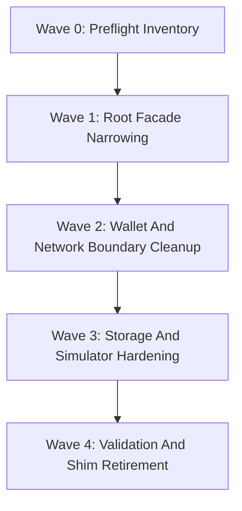

# Phase 31: Refactor Architecture - Context

**Gathered:** 2026-04-04
**Status:** Planning-ready with locked gates

## 🎯 Phase Boundary

Refactor crate-root facades, compatibility surfaces, and internal seams across
`z00z_core`, `z00z_crypto`, `z00z_networks`, `z00z_simulator`,
`z00z_storage`, `z00z_utils`, and `z00z_wallets` so that the public
architecture matches the intended ownership model already described in the
repository rules and Phase 031 review.

This phase hardens exports, compatibility handling, vendor isolation, and
verification rules inside the current repository layout. It does not authorize
crate reshuffles, product redesign, or speculative behavioral changes beyond
explicit fail-closed security tightening already identified in the Phase 031
audits.

## 🔑 Implementation Decisions

### Strict-Criteria Cleanup

- **D-01:** Execute version cleanup in two waves: first remove non-canonical
  implementations and callers, then rename the surviving canonical APIs to
  suffix-free names.
- **D-02:** Stable public facades must not expose `V1..VN`, `v1..vN`,
  `legacy`, `compat`, or `shim` names unless the item is an explicitly
  documented migration-only surface.
- **D-03:** Stable root facades must not use wildcard public re-exports.
  Replace them with curated export lists.
- **D-04:** Legacy decode and migration helpers may remain only behind
  private/internal modules or tightly scoped compatibility namespaces that are
  not default public import surfaces.

### `z00z_core`

- **D-05:** Narrow the root surface; remove the broad `pub use assets::*`
  contract in favor of explicit exports.
- **D-06:** Genesis and configuration loading are higher-level composition
  concerns and must not remain broad root-facade contracts.
- **D-36:** Preserve the `z00z_core` audit as an explicit planning obligation:
  JSON import-facing paths must either inherit documented upstream size caps or
  add local bounded decode, and `AssetPkgWire` plus genesis import flows must
  carry type-specific size ceilings as a validated contract.

### `z00z_crypto`

- **D-07:** Split the crypto root into a stable Z00Z facade, an expert facade,
  and any unavoidable vendor passthrough namespace.
- **D-08:** Remove direct Tari concrete type leakage from the root facade
  wherever a Z00Z-owned alias, wrapper, or stable contract already exists.
- **D-09:** Treat backend substitution as a live design constraint even if it
  is not an immediate product requirement.
- **D-10:** Test-only nonce-controlled AEAD helpers must not be exposed in
  non-test feature profiles.

### `z00z_networks`

- **D-11:** Keep the current repository layout, but define explicit ownership
  rules for what belongs to `rpc` versus future `onionnet` code.
- **D-12:** OnionNet is a node-owned privacy overlay with its own internal peer
  transport, not a separate application service.
- **D-13:** A higher-level network orchestrator owns retry policy,
  observability, and backpressure posture; RPC owns only per-call mechanics.
- **D-14:** Request/response RPC remains valid for MVP wallet calls, but the
  network layer must add peer identity, connection lifecycle, and streaming
  seams before OnionNet work lands.
- **D-42:** OnionNet placeholders must be crate-shaped and aligned to the Phase
  115 module boundary (`config`, `identity`, `bootstrap`, `transport_quic`,
  `link_crypto`, `packet`, `sphinx_path`, `session`, `bridge_api`, `edge`,
  `relay`, `exit`, `telemetry`) so later implementation lands without a
  namespace reshuffle.

### `z00z_simulator`

- **D-15:** `z00z_simulator` is the integration harness and may depend broadly,
  but it should enter crates through stable facades wherever those facades
  exist, and its crate-facing docs must say so explicitly rather than leaving
  the harness role implicit.
- **D-16:** Add architecture rules or tests that fail when new simulator code
  imports known implementation-detail modules.
- **D-17:** Stage-2 plaintext secret artifacts such as
  `wlt_secrets_debug.md` must not remain part of the default simulator
  contract; if retained, they must be explicit debug-only outputs with
  private-permission handling.
- **D-39:** Even when not treated as a top-priority fix, simulator output-dir
  reset remains a hardening obligation: validate that reset/delete behavior is
  sandboxed to an allowed output root before recursive removal is permitted.

### `z00z_storage`

- **D-18:** Keep checkpoint, snapshot, and asset-tree ownership in the same
  crate, but strengthen the internal seam between consensus-root semantics and
  backend mechanics.
- **D-19:** RedB remains an internal backend seam; backend-specific helpers and
  legacy wire upgrades must not leak into stable storage-facing contracts.
- **D-20:** File-store seal/finalization semantics should converge toward the
  same replay-evidence and proof-binding expectations as RedB rehydrate.
- **D-21:** Audit storage tests for wallet-shaped assumptions and keep asset
  identity semantics aligned with canonical definition, serial, and asset rules.
- **D-37:** Retain the storage proof-binding audit explicitly in planning:
  generic artifact/finalization paths must not treat `cp_proof` as semantically
  opaque once an artifact is represented as attested or canonical.
- **D-38:** Keep the `ClaimNullifier` note as a retained non-finding: it stays a
  hardening observation to preserve in planner context, not a storage
  vulnerability to escalate independently.

### `z00z_utils`

- **D-22:** `z00z_utils` remains the cross-cutting policy crate, but new modules
  require explicit admission criteria, and the phase must leave behind a short
  root-level README or equivalent boundary note that states what belongs in
  `z00z_utils` and what does not.
- **D-23:** `os_hardening` stays in `z00z_utils` under stricter review rules.
- **D-24:** Compression may remain only for generic bounded compression and
  streaming primitives; wallet- or storage-specific semantics must move to the
  owning crate if they continue to accumulate.
- **D-25:** Explicit compatibility helpers in time and codec layers are allowed
  only when they remain clearly documented as compatibility-only and stay off
  security-sensitive default paths.

### `z00z_wallets`

- **D-26:** Keep the wallet code in one crate for now, but split the public
  surface conceptually into wallet core, RPC/adapters, and
  persistence/service-assembly boundaries with separate export rules.
- **D-27:** Stub-heavy or provisional services must not appear as default stable
  crate-root contracts.
- **D-28:** Replace `include!`-assembled wallet service composition with
  explicit submodules and one thin facade module.
- **D-29:** Per-wallet identity must resolve from persisted wallet metadata,
  not runtime chain or environment, once a wallet source or wallet id is known.
- **D-30:** Sensitive state transitions such as wallet lock must become
  session-bound or explicitly privileged-admin operations.
- **D-31:** Concrete JSON values belong at RPC and wire edges; core wallet and
  persistence logic should prefer domain types or `z00z_utils` codec
  abstractions.
- **D-32:** Keep current `wallet.key.export_public_material_v2` and
  `ReceiverCardRecordV1` lanes only if they are the canonical live contracts;
  retire non-canonical alternates before the suffix-removal wave.
- **D-40:** Preserve the wallet validation gap as an explicit planning item:
  add transport-level denial checks for unauthenticated `lock_wallet`, and add
  mismatch tests for both `WalletSource::Path` and `WalletSource::Bytes` when
  runtime chain or network drifts from persisted wallet identity.
- **D-41:** Wallet-core transaction assembly must not keep ad hoc non-seeded
  `rand::thread_rng()` fallback once Phase 031 hardens boundary policy; route
  runtime randomness through an explicit repository-approved owner or make the
  entropy requirement explicit at the call boundary.

### Phase Guardrails

- **D-33:** This phase is architecture-hardening, not a product redesign.
  Preserve current behavior unless an identified security finding requires a
  fail-closed change.
- **D-34:** Existing prior-phase compatibility shims can be removed only in the
  same wave that updates public tests, YAML bindings, docs, and planning
  references.
- **D-35:** Any retained compatibility path must be justified as persisted-data
  migration or explicit feature-gated transitional support, not convenience.
  Retained paths must stay off default stable facades, must not survive as
  public convenience re-exports, and must be enumerated explicitly in Wave 4
  retirement evidence.

## 🚦 Locked Execution Waves

The execution order below is mandatory. This phase must not start with suffix
removal, shim retirement, or facade narrowing until the preflight inventory and
caller map exist.

| Wave | Intent | Dependencies | Required Outputs | Parallel Safety |
| --- | --- | --- | --- | --- |
| W0 | Inventory all version-suffixed, compat, shim, wildcard-export, Tari-leak, and `include!` seams before edits. | None | Caller inventory, suffix/shim inventory, root-export inventory, per-crate import-graph audits for the reviewed roots, proposed change list. | Safe to parallelize read-only search, import-graph extraction, and caller mapping only. |
| W1 | Narrow stable root facades in `z00z_core`, `z00z_crypto`, and wallet DTO/export surfaces without removing migration lanes yet. | W0 inventories complete. | Updated curated export lists, explicit vendor-facing namespace plan, no new wildcard root exports. | `z00z_core` and `z00z_crypto` facade cleanup may run in parallel only after W0 proves no shared caller ambiguity. |
| W2 | Demote wallet placeholder seams, replace `include!` assembly, and lock `rpc` versus `onionnet` ownership. | W1 root-facade contracts frozen. | Non-`include!` wallet service structure, explicit wallet boundary split, namespace-level network ownership notes or placeholders. | Wallet service split must not run in parallel with public shim retirement. |
| W3 | Apply retained hardening obligations for storage proof/replay semantics and simulator secret/reset policy. | W2 boundary ownership settled. | Proof-binding plan, replay-evidence gate plan, simulator secret-output policy, output-root sandbox rule, and simulator boundary docs that mark it as an integration harness. | Storage and simulator hardening can run in parallel once wallet/network entrypoints stop moving. |
| W4 | Execute validation gates, then retire shims and suffixes only where caller migration is proven complete. | W1-W3 gates green. | Validation evidence, shim-retirement diff, final suffix-free public surface, explicit list of any surviving migration-only exceptions, rollback notes if any wave aborted, and the `z00z_utils` boundary note or README-level admission summary promised by D-22. | No parallelization across retirement and final validation. |

## 🔐 Crypto Protected-Seam Invariants

These invariants are non-optional during the `z00z_crypto` facade split and
related wallet/storage hardening.

- `z00z_crypto` remains the single canonical owner of public crypto entrypoints,
  domain tags, transcript framing helpers, AAD builders, and KDF info/context
  constants.
- Wallet, storage, simulator, or network crates may consume those entrypoints,
  but must not mint parallel public crypto owners while the root facade is being
  cleaned up.
- Vendor passthroughs, if any remain, must stay in an explicitly named
  non-default namespace and must not be mixed back into the stable root facade.
- Test-only AEAD helpers and any caller-supplied nonce surfaces remain
  hardening blockers for non-test profiles until removed or fully gated.

## 🧪 Required Validation Gates

These gates are mandatory and must not be downgraded to planner discretion.

| Gate | Evidence Type | Exact Anchor Or Command | Pass Condition |
| --- | --- | --- | --- |
| G-00 Import-graph audits | Review evidence | Per-crate import-graph summaries for `z00z_core`, `z00z_crypto`, `z00z_wallets`, `z00z_storage`, `z00z_simulator`, `z00z_utils`, and `z00z_networks` namespaces touched by the phase | Facade narrowing, shim retirement, and ownership notes are backed by explicit caller/import evidence instead of assumption. |
| G-01 Root export inventory | Search | `rg "pub use .*\\*" crates/z00z_core/src/lib.rs crates/z00z_wallets/src/adapters/rpc/types/mod.rs` | No stable wildcard root exports remain. |
| G-02 Tari leakage guard | Search | `rg "tari_crypto::" crates/z00z_crypto/src/lib.rs`; `rg "pub use .*tari" crates/z00z_crypto/src/lib.rs` | No unapproved Tari concrete types leak through the stable root facade. |
| G-03 Wallet service split | Search | `rg "^include!\\(" crates/z00z_wallets/src/services/wallet_service.rs` | `include!`-assembled wallet service surface is removed from the canonical service entrypoint. |
| G-04 Wallet drift coverage | Tests | `cargo test -p z00z_wallets --test test_redb_wlt_open test_open_fails_identity_mismatch -- --exact` and `cargo test -p z00z_wallets --test test_wallet_service_errors derive_public_key_rejects_invalid_chain_config -- --exact` | Persisted wallet identity remains the active source of truth under drift. |
| G-05 Wallet lock denial | Test or transport proof | `cargo test -p z00z_wallets --test test_rpc_wiring_spec_a app_wallet_list_wallets_accepts -- --exact` plus a transport-level denial check for unauthenticated `lock_wallet` | Enumeration may stay visible only if lock mutation is auth-bound; `lock_wallet` must reject unauthenticated transport callers or change signature accordingly. |
| G-06 Storage proof binding | Search and focused tests | `rg "cp_proof" crates/z00z_storage/src crates/z00z_storage/tests`; `rg "seal_artifact" crates/z00z_storage/src crates/z00z_storage/tests`; `rg "test_checkpoint_finalization" crates/z00z_storage/tests`; `rg "test_redb_rehydrate" crates/z00z_storage/tests`; `rg "test_checkpoint_store_api" crates/z00z_storage/tests` | Canonical/attested checkpoint flows do not keep semantically opaque proof bytes and do not allow replay-evidence drift. |
| G-07 Simulator deep-import guard | Search or policy check | `rg "z00z_wallets::.*services" crates/z00z_simulator/src`; `rg "z00z_wallets::.*db" crates/z00z_simulator/src`; `rg "z00z_storage::.*store_internal" crates/z00z_simulator/src` | Simulator enters crates through stable facades only. |
| G-08 Simulator secret-output gate | Tests | `cargo test -p z00z_simulator --release --features test-fast --test test_wallet_integration stage2_rpc_no_secrets -- --exact --nocapture` and `cargo test -p z00z_simulator --release --features test-fast --test test_scenario1_stage_surface test_scenario1_stage_surface -- --exact --nocapture` | Stage-2 plaintext secret artifacts are removed from the default contract or explicitly gated as debug-only private outputs. |
| G-09 Simulator reset sandbox | Search and test | `rg "reset_outputs_dir" crates/z00z_simulator/src crates/z00z_simulator/tests`; `rg "remove_dir_all" crates/z00z_simulator/src crates/z00z_simulator/tests` | Output reset is constrained to an approved sandbox root before recursive deletion. |
| G-10 Planning closeout | Review evidence and search guards | Coverage matrix plus W0-W4 outputs, including the `z00z_utils` boundary note or README-level admission summary and explicit repo-wide grep guards for public compat, legacy, shim, and version-suffixed stable surfaces | Shim retirement and suffix removal happen only after caller migration proof exists, utils admission policy is written down as an executable closeout artifact, and no default-public stable facade still exposes compat, legacy, shim, or version-suffixed contracts except explicitly listed migration-only exceptions. |

## 🛑 Acceptance Blockers And Rollback Rules

| Blocker | Severity | Must Be Green Before | Rollback / Abort Condition |
| --- | --- | --- | --- |
| D-10 test-only AEAD helper still reachable in non-test profiles | Blocking | W4 closeout | Abort root-facade retirement if non-test access remains. |
| D-17 stage-2 plaintext secret artifacts still part of the default simulator contract | Blocking | Simulator hardening closeout | Do not close simulator hardening while `wlt_secrets_debug.md` remains an unconditional default artifact without explicit debug-only/private gating. |
| D-36 upstream-cap or bounded JSON contract unresolved | Blocking | `z00z_core` closeout | Keep current import surface unchanged until cap ownership is explicit. |
| D-37 `cp_proof` remains semantically opaque in canonical flows | Blocking | Storage hardening closeout | Abort checkpoint API normalization if proof-binding rule is not explicit. |
| D-39 simulator output reset not sandboxed | Blocking | Simulator hardening closeout | Do not ship reset-path cleanup if recursive delete can escape the output root. |
| D-40 wallet lock denial and Path/Bytes drift tests unresolved | Blocking | Wallet boundary closeout | Keep existing mutation surface provisional until auth and drift coverage are proven. |
| Default-public stable facades still expose compat, legacy, shim, or version-suffixed names after Wave 4 closeout | Blocking | Phase closeout | Do not close the phase; either retire the surface, demote it behind a non-default migration-only lane, or list it explicitly as a bounded exception in the retirement artifact. |
| Duplicate public entrypoints appear during facade cleanup | Abort | End of any wave | Revert to the last path-preserving seam and repeat with a narrower change set. |
| New Tari root leakage appears while splitting `z00z_crypto` | Abort | End of W1 or W4 | Revert crypto root changes and restore the last verified curated export list. |
| Caller inventory is missing for a shim/suffix being removed | Abort | Before any retirement | Stop retirement and regenerate W0 inventory before continuing. |

### Agent's Discretion

- Exact file-by-file batching inside a locked wave, once that wave's required
  inputs are complete.
- Whether a mandatory gate is first proven by search guard, focused test, or
  both, as long as the gate itself remains mandatory.
- Whether wallet and storage hardening are executed as one integrated plan or
  as sub-plans, provided the W0-W4 ordering and blockers remain unchanged.

## ✅ Implementation Coverage Matrix

This matrix confirms that every actionable provision from
`.planning/phases/031-refactor-architecture/031-TODO.md` that should be
implemented, validated, hardened, or explicitly preserved is retained in this
context for downstream planning.

| ID | Source Obligation From `031-TODO.md` | Context Retention | Planner Expectation |
| --- | --- | --- | --- |
| M-01 | Remove non-canonical versioned APIs first, then strip remaining suffixes. | D-01 | Preserve two-wave cleanup order and avoid suffix removal before caller migration. |
| M-02 | Ban default-public `legacy`, `compat`, `shim`, and version-suffixed stable surfaces. | D-02, D-04, D-35 | Keep compatibility paths internalized or explicitly migration-only. |
| M-03 | Remove wildcard stable root exports. | D-03 | Replace stable wildcard facades with curated export lists. |
| M-04 | Narrow `z00z_core` root exports and keep tooling off the broad facade. | D-05, D-06 | Refactor root-surface ownership before more callers bind to it. |
| M-05 | Validate actual `z00z_core` root usage before trimming exports. | Specific Ideas, Agent's Discretion | Run import-graph and caller-usage audit before final facade narrowing. |
| M-06 | Preserve `z00z_core` JSON import hardening around upstream caps and type-specific ceilings. | D-36 | Keep bounded decode or upstream-cap validation as an explicit planning obligation. |
| M-07 | Split `z00z_crypto` into stable, expert, and vendor-facing surfaces. | D-07, D-08 | Keep vendor passthroughs off the default root facade. |
| M-08 | Clarify one canonical production encryption ownership path. | D-07, D-08 | Resolve stable-vs-compat encryption surface during planning. |
| M-09 | Treat backend substitution as a real architecture constraint, even if aspirational. | D-09 | Do not collapse the facade into Tari-coupled contracts. |
| M-10 | Keep test-only nonce-controlled AEAD helpers out of non-test profiles. | D-10 | Preserve the crypto audit finding as a required hardening item. |
| M-11 | Keep `z00z_networks` in current layout but define `rpc` vs `onionnet` ownership clearly. | D-11, D-12, D-13, D-14 | Prevent `rpc` from becoming the accidental whole-network contract. |
| M-12 | Add network seams for streaming, peer identity, retry, auth, and connection lifecycle. | D-13, D-14 | Plan transport policy above per-call RPC mechanics. |
| M-13 | Treat OnionNet as a node-owned privacy overlay, not a separate application service. | D-12, D-42 | Preserve overlay ownership in namespace and interface design, and add named interface placeholders so future OnionNet code lands behind explicit seams instead of ad hoc modules. |
| M-14 | Document `z00z_simulator` as the integration harness, restrict it to stable facades, and add a reusable scenario contract. | D-15, D-16 | Add a README-level ownership note plus a documented scenario contract, and back them with a persistent failing architecture guard that blocks new implementation-detail imports. |
| M-15 | Preserve simulator stage-2 plaintext-secret finding (`wlt_secrets_debug.md`) as a hardening obligation. | D-17 | Default simulator contract must not normalize plaintext secret artifacts. |
| M-16 | Preserve simulator output-dir reset hardening. | D-39 | Require sandbox validation before recursive delete/reset behavior. |
| M-17 | Keep `z00z_storage` checkpoint, snapshot, and asset ownership in one crate, but strengthen internal seams. | D-18, D-19 | Harden backend boundaries without package reshuffle. |
| M-18 | Converge file-store seal/finalization semantics with replay-evidence expectations. | D-20 | Planning must treat replay evidence as part of canonical checkpoint persistence. |
| M-19 | Preserve `cp_proof` semantic binding as an explicit storage obligation. | D-37 | Do not leave attested/canonical artifact flows with opaque proof semantics. |
| M-20 | Retain `ClaimNullifier` note as a hardening observation, not an escalated finding. | D-38 | Keep this branch visible so planner does not over-correct a non-finding. |
| M-21 | Preserve the storage end-to-end validation map for asset, snapshot, checkpoint, rehydrate, and claim replay flows, and remove wallet-shaped assertions where they are not required to prove storage invariants. | D-20, D-21 | Use these flows as required acceptance coverage when planning storage hardening, and keep storage tests shaped around storage-owned invariants rather than wallet-domain assumptions. |
| M-22 | Protect `z00z_utils` from megacrate drift with README plus explicit admission rules. | D-22, D-23, D-24, D-25 | Keep only real cross-cutting policy and bounded generic helpers, and leave a root boundary note behind as part of phase closeout. |
| M-23 | Keep `os_hardening` under stricter review and limit compression to generic bounded primitives. | D-23, D-24 | Preserve the differentiated utils admission outcome from the review. |
| M-24 | Stop exposing stub-heavy wallet services as stable default root contracts. | D-26, D-27 | Make placeholder lanes non-default and explicitly governed. |
| M-25 | Replace `include!`-assembled wallet services with explicit submodules and retain the resulting review-surface or compile-time impact as planning evidence. | D-28 | Treat service composition cleanup as a core architecture deliverable and keep the light measurement obligation visible in planner context instead of leaving it only in execution summaries. |
| M-26 | Separate wallet core, RPC, and persistence boundaries with distinct export rules. | D-26, D-31 | Keep JSON/wire types at edges, domain types inside wallet core, and codec-owned compatibility decode at explicitly named boundaries instead of verifier/store internals. |
| M-27 | Preserve persisted wallet identity as the single source of truth after discovery. | D-29 | Prevent runtime chain/network drift from redefining wallet identity. |
| M-28 | Make wallet lock session-bound or explicitly privileged-admin. | D-30 | Sensitive wallet state transitions require explicit authorization posture. |
| M-29 | Preserve wallet transport denial for unauthenticated `lock_wallet`. | D-40 | Add transport-level denial coverage or equivalent auth-bound signature change. |
| M-30 | Preserve drift mismatch tests for both `WalletSource::Path` and `WalletSource::Bytes`. | D-40 | Planner must keep both import lanes in acceptance coverage. |
| M-31 | Preserve current canonical wallet compatibility lanes only if they are truly live contracts. | D-32 | Remove non-canonical alternates before suffix-removal wave. |
| M-32 | Keep overall change order: narrow facades first, define network ownership, make placeholders explicit, add simulator checks, harden storage seams, protect utils admission. | D-01, D-11, D-16, D-18, D-22, D-26 | Phase planning should not reorder work in a way that hides unstable public contracts. |
| M-33 | Preserve architectural validation work: import-graph audits, Tari leakage policy checks, simulator import guards, wallet service layout cleanup, and written stable-vs-provisional boundary decisions. | Specific Ideas, D-08, D-16, D-28, D-33, Agent's Discretion | Treat architecture-policy checks as first-class validation, not optional follow-up. |
| M-34 | Preserve crypto/core/storage/wallet/simulator audit follow-ups from the second half of `031-TODO.md`. | D-10, D-17, D-20, D-21, D-36, D-37, D-38, D-39, D-40 | Downstream plan must carry both architecture refactors and explicit security-hardening obligations. |
| M-35 | Preserve the wallet audit follow-up that removes ad hoc `thread_rng()` fallback from wallet-core transaction paths and keeps verifier/store JSON ownership aligned to the edge-only contract. | D-31, D-41 | Downstream wallet planning must give explicit file owners to the non-seeded RNG path in `core/tx/multi_io.rs` and to any concrete-JSON usage that still leaks into verifier or persistence seams. |

## ⭐ Specific Ideas

- Define strict criteria as: no wildcard stable root exports, no default-public
  compat or shim surfaces, no root-level vendor leakage, and no provisional
  service APIs masquerading as stable contracts.
- Use import-graph audits before narrowing facades so only currently consumed
  re-exports get replacement paths.
- Prefer internal compatibility decode helpers over public `legacy_*` or
  `compat_*` API names.
- Keep structural refactors aligned with prior shim-retirement waves so public
  source-shape guards move only when the public bindings actually change.

## 📚 Canonical References

**Downstream agents MUST read these before planning or implementing.**

### Phase Source Of Truth

- `.planning/phases/031-refactor-architecture/031-TODO.md` — Full
  architecture review, embedded open-question answers, recommended change
  order, and crate-specific security audit findings.
- `.planning/phases/115-onionnet/115-OnionSpec.md` — Implementation-grade
  OnionNet boundary and module map that placeholder seams must already match.

### Repository Constraints

- `.github/requirements/Z00Z_DESIGN_FOUNDATION.md` — Canonical architectural
  rules: one source of truth abstractions, vendor isolation, concurrency policy,
  public API design, naming, and split policy.
- `.github/copilot-instructions.md` — Repository operational rules, protected
  directories, documentation requirements, and Rust-specific local deltas.

### Prior Phase Decisions

- `.planning/phases/000/030-refactor-long-files/030-CONTEXT.md` — Split-wave
  sequencing, compatibility-shim retirement timing, and public source-shape
  guard constraints.
- `.planning/phases/000/029-crypto-audit-wallets/029-CONTEXT.md` — Wallet-side
  fail-closed decisions and compatibility-only legacy path expectations.
- `.planning/phases/000/027-crypto-audit-utils/027-CONTEXT.md` — Utils-side
  fail-closed boundary rules and compatibility-surface discipline.

### Codebase Maps

- `.planning/codebase/ARCHITECTURE.md` — Current workspace layering and crate
  role map.
- `.planning/codebase/CONVENTIONS.md` — Current naming, error-handling, and
  module-boundary conventions.
- `.planning/codebase/STRUCTURE.md` — Directory and crate layout reference for
  planning wave boundaries.

## 🔍 Existing Code Insights

### Reusable Assets

- `crates/z00z_core/src/lib.rs` — Shows the exact broad root export that must be
  narrowed.
- `crates/z00z_crypto/src/lib.rs` — Central point for stable-vs-vendor facade
  cleanup; contains direct Tari re-exports and Z00Z aliases side by side.
- `crates/z00z_networks/rpc/src/lib.rs` — Clean minimal request/response
  transport seam that should remain scoped to RPC responsibilities.
- `crates/z00z_wallets/src/core/mod.rs` — Already has partial ownership facades
  (`app_owned`, `wallet_owned`) that can be used as anchors for stricter export
  governance.
- `crates/z00z_utils/src/time/traits.rs` — Example of explicit compatibility
  helpers that are documented as compatibility-only.

### Established Patterns

- `crates/z00z_wallets/src/services/wallet_service.rs` — Current
  `include!`-assembled service composition is the main wallet structural smell
  to replace.
- `crates/z00z_wallets/src/adapters/rpc/types/mod.rs` — DTO facade currently
  uses broad public re-exports; this is a model for planned surface narrowing.
- `crates/z00z_storage/src/checkpoint/artifact_types.rs` and related checkpoint
  modules — Show the current legacy compatibility lane that should stay
  internalized and explicitly justified.

### Integration Points

- `z00z_simulator` should consume crate-root stable facades, not implementation
  detail modules from wallets or storage.
- `z00z_networks/onionnet` must use a crate-shaped placeholder that already
  matches the Phase 115 module map so later implementation fills modules in
  place instead of relocating the namespace.
- Wallet and storage security fixes from the Phase 031 audits should be planned
  together with facade hardening when they affect public contracts.

## ⏸️ Deferred Ideas

- Full crate/package reshuffles are out of scope for this phase.
- Actual backend substitution beyond Tari remains deferred; this phase only
  preserves the architectural ability to do so later.
- Full OnionNet implementation is deferred; this phase only defines its
  ownership and interface seams.
- Splitting `z00z_wallets` into multiple crates is deferred; the current phase
  hardens in-crate boundaries first.

---

*Phase: 031-refactor-architecture*
*Context gathered: 2026-04-04*
