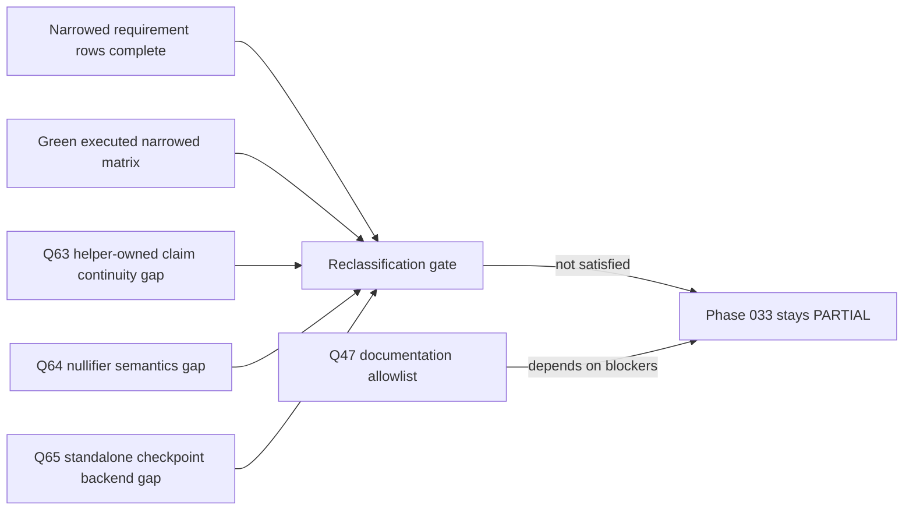
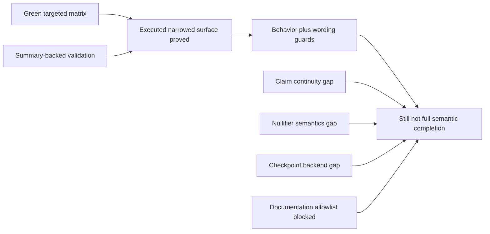
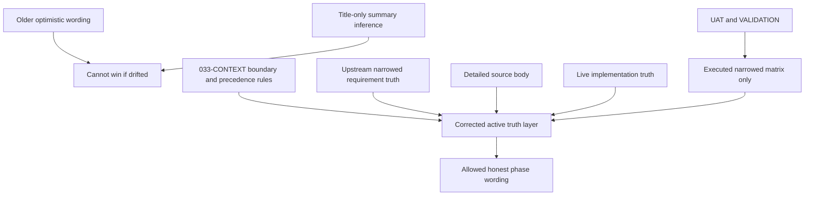
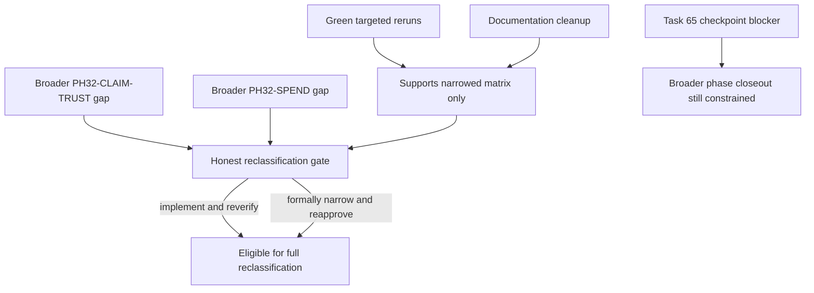
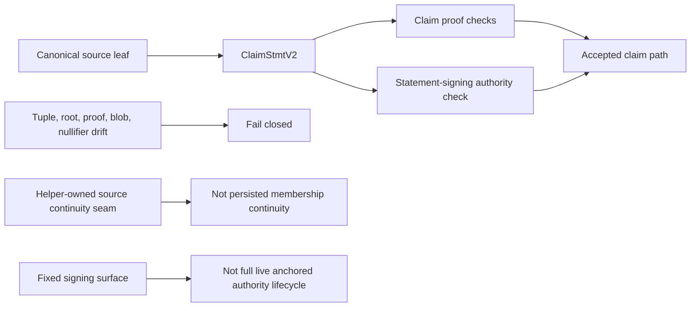
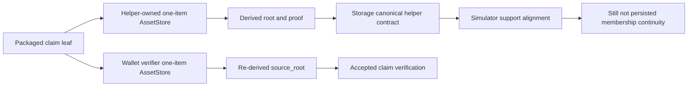
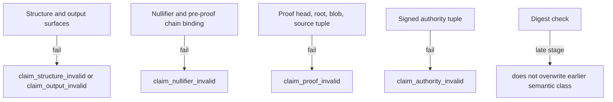
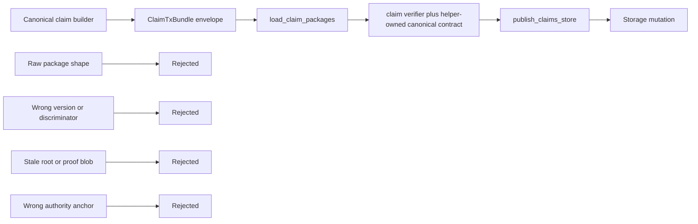
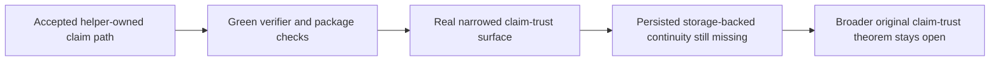
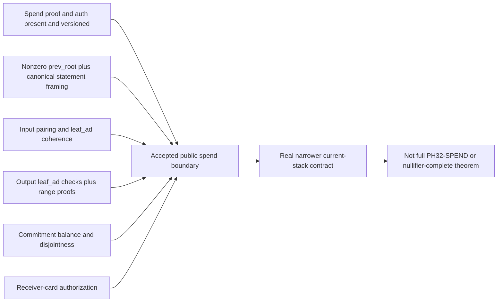

# Phase Entrance Exam

**Phase:** `033-crypto-audit-scenario-2`
**Generated:** `2026-04-09`
**Scope Sources:** `033-CONTEXT.md`, `033-TODO.md`, `033-TEST-SPEC.md`, `033-VALIDATION.md`, `033-FULL-AUDIT.md`, `033-SEMANTIC-FREEZE.md`, `033-23-SUMMARY.md`, `033-EXAM-QUESTIONS-AND-ANSWERS-1.md`, `033-EXAM-QUESTIONS-AND-ANSWERS-2.md`, `033-EXAM-QUESTIONS-AND-ANSWERS-3.md`, `.planning/REQUIREMENTS.md`, and live repository code and tests across `z00z_crypto`, `z00z_core`, `z00z_storage`, `z00z_wallets`, and `z00z_simulator`

## MUST

1. Every final answer in this document MUST be independently re-checked through
   the `doublecheck` skill before it is accepted as final.
2. Every answer MUST be a repository-backed proof system, using factual,
   mathematical, cryptographic, and logical proof where applicable.
3. If a proof cannot be closed, the answer MUST state exactly what evidence,
   artifact, mathematical argument, cryptographic assumption, or repository
   behavior is missing.
4. Every answer MUST stay tied to the live codebase, tests, logs, manifests,
   and phase artifacts for this repository.
5. Every answer in this document MUST function as a verification exam of the
   correct implementation of this phase, not as freeform commentary.
6. If answering a question reveals a real bug, gap, or overclaim, the answer
   MUST name it explicitly and state the remediation path.
7. This file is generated as a question sheet. The `Ans:` sections MUST remain
   blank until a later agent or model fills them.

## 🎯 Challenge

Pressure-test whether Phase 033 actually preserves honest closure boundaries
for claim authenticity, public spend semantics, checkpoint acceptance,
operator-boundary protection, and documentation truthfulness. The solver must
separate what the current tree really proves from what it only narrows,
freezes, or explicitly leaves open.

## ⛔ Constraints

- The questions test implementation truth, not planning intent alone.
- The solver must discover the evidence path independently from the repository.
- The wording must stay adversarial and specific without embedding file-path,
  helper-name, test-name, requirement-id, or stage-label breadcrumbs.
- A negative or partial answer is acceptable only when the missing proof is
  precisely named and evidence-backed.

## 📌 Scope Note

This exam verifies the live Scenario 2 follow-up surface: helper-owned versus
persisted claim continuity, the exact current-stack public spend boundary, the
nullifier-only residual spend gap, package-coupled checkpoint continuity,
operator anti-substitution behavior, wording-guard enforcement, and the still-
blocked documentation allowlist closeout path that depends on unresolved
semantic prerequisites.

## 🔍 Answering Standard

- Answers must discover their own evidence path through the repository.
- Answers must distinguish delivered guarantees, narrowed guarantees, wording-
  only guards, and still-open semantic blockers.
- Answers must use code, tests, manifests, summaries, and validation artifacts
  together when one source alone would hide a trust-boundary gap or overclaim.

## 🔐 Theme 1: Closure Honesty And Boundary Truth

### 1. Honest Partial Versus False Full Closure

🔴 **Quest:** What exact repository-backed conditions keep this phase in honest partial-closeout state instead of allowing it to be reclassified as fully closed?
🔵 **Ans:**

**Status:** Partial Evidence

**Conclusion:** Phase 033 remains in honest partial-closeout state because the repository does not permit a truthful upgrade beyond `PARTIAL` while three direct high-severity semantic blockers and one dependent documentation gate remain unresolved. Q63 still leaves claim continuity at a helper-owned synthetic seam instead of persisted membership continuity, Q64 still leaves the regular public spend contract short of nullifier semantics, Q65 still leaves checkpoint acceptance short of standalone proof-backend authority, and Q47 stays blocked because documentation allowlist cleanup depends on those unresolved gaps. The repository also says that `PH32-CLAIM-TRUST` and `PH32-SPEND` are complete only through formal narrowing, so those checkmarks do not by themselves justify full semantic reclassification.

**Evidence Trail:**

1. [033-FULL-AUDIT.md](/home/vadim/Projects/z00z/.planning/phases/033-crypto-audit-scenario-2/033-FULL-AUDIT.md#L330) says no repository artifact in the cited source set supports upgrading the final audit verdict beyond `PARTIAL`, and [033-FULL-AUDIT.md](/home/vadim/Projects/z00z/.planning/phases/033-crypto-audit-scenario-2/033-FULL-AUDIT.md#L344) explicitly records Phase 033 as `PARTIAL` under the audit closure rule.
2. [033-FULL-AUDIT.md](/home/vadim/Projects/z00z/.planning/phases/033-crypto-audit-scenario-2/033-FULL-AUDIT.md#L337) through [033-FULL-AUDIT.md](/home/vadim/Projects/z00z/.planning/phases/033-crypto-audit-scenario-2/033-FULL-AUDIT.md#L340) keep Q63, Q64, and Q65 as high-severity `Partial Evidence` rows and keep Q47 blocked on those unresolved upstream gaps.
3. [033-CONTEXT.md](/home/vadim/Projects/z00z/.planning/phases/033-crypto-audit-scenario-2/033-CONTEXT.md#L144) says the documentation allowlist remains blocked by tasks 25, 27, 63, 64, and 65, while [033-CONTEXT.md](/home/vadim/Projects/z00z/.planning/phases/033-crypto-audit-scenario-2/033-CONTEXT.md#L225) keeps honest reclassification blocked until the broader original `PH32-CLAIM-TRUST` and `PH32-SPEND` gaps are implemented and re-verified, or formally narrowed and re-approved.
4. [033-VALIDATION.md](/home/vadim/Projects/z00z/.planning/phases/033-crypto-audit-scenario-2/033-VALIDATION.md#L86) says the final requirement state marks `PH32-CLAIM-TRUST` and `PH32-SPEND` complete through formal narrowing, and [033-VALIDATION.md](/home/vadim/Projects/z00z/.planning/phases/033-crypto-audit-scenario-2/033-VALIDATION.md#L91) says the closeout proves an automated behavior-plus-wording matrix rather than a runtime-only proof of every narrowed caution row.
5. [.planning/REQUIREMENTS.md](/home/vadim/Projects/z00z/.planning/REQUIREMENTS.md#L119), [.planning/REQUIREMENTS.md](/home/vadim/Projects/z00z/.planning/REQUIREMENTS.md#L120), and [.planning/REQUIREMENTS.md](/home/vadim/Projects/z00z/.planning/REQUIREMENTS.md#L125) encode the narrowed `PH32-CLAIM-TRUST` and `PH32-SPEND` text while preserving the separate reclassification gate above those narrowed checkmarks.

**Reasoning:**

- The repository separates narrowed requirement completion from full audit closeout. `PH32-CLAIM-TRUST` and `PH32-SPEND` can be marked complete under narrower wording while the broader original semantic gaps still block honest whole-phase reclassification.
- The decisive source is the corrected truth layer, not optimistic inference from checkboxes or green targeted reruns. The full audit explicitly says the verdict cannot be upgraded beyond `PARTIAL`, and the context file preserves the same reclassification gate.
- The unresolved blockers are not generic. They are named precisely as claim continuity still tied to a helper-owned synthetic seam, spend semantics still missing nullifier binding, checkpoint acceptance still missing standalone backend authority, and documentation cleanup still blocked on those unresolved prerequisites.
- The tempting but false reading is that green narrowed validation plus completed requirement rows means the phase is fully closed. The repository defeats that reading twice: the validation artifact says the executed matrix only proves the narrowed surface and wording guards, while the full audit keeps the higher-level phase verdict explicitly at `PARTIAL`.

**Example Or Visualization:**

**Gap Or Blocker:** The answer can prove the partial-closeout conditions exactly, but it cannot honestly upgrade the question to `Full Evidence` because the same repository-backed conditions include unresolved Q63, Q64, Q65, and dependent Q47 blockers. Full reclassification would require those gaps to be implemented and re-verified, or formally narrowed and re-approved.

**Verification:**

- `doublecheck` status: DISPUTED on the original `Full Evidence` draft; revised to this narrower `Partial Evidence` answer to match the cited artifacts.
- Residual caveat: Green validation proves the executed narrowed surface and wording guards, not full semantic closure of the broader original claims.

### 2. Narrowed Guarantees Versus Original Ambition

🔴 **Quest:** Which guarantees are genuinely delivered by the current implementation, and which broader original trust claims remain intentionally outside delivered closure even after green targeted validation?
🔵 **Ans:**

**Status:** Partial Evidence

**Conclusion:** The repository proves a real but narrowed delivered set, not full closure. Delivered guarantees are: the accepted claim path preserves the helper-owned canonical claim-source contract and rejects tuple or package drift without claiming persisted storage-backed continuity; the current persisted public spend verifier is real and fail closed, with semantic acceptance required before state mutation, but it remains narrower than the broader original spend theorem because nullifier semantics are still the exact open element; checkpoint acceptance on the accepted path is real at a package-coupled continuity boundary rather than standalone backend authority; and the default plaintext debug-export lane is closed by default and kept non-default or feature-gated. The broader original trust claims that remain intentionally outside delivered closure are persisted storage-backed claim continuity beyond the helper seam, nullifier semantics inside the regular public spend contract, standalone checkpoint proof-backend authority, stronger validator-level or whole-chain trustless ownership closure, and the dependent documentation allowlist cleanup. RNG scoping and documentation honesty are preserved and green-guarded, but they remain bounded partial-evidence claims rather than full-semantic closure.

**Evidence Trail:**

1. [033-VALIDATION.md](/home/vadim/Projects/z00z/.planning/phases/033-crypto-audit-scenario-2/033-VALIDATION.md#L44) through [033-VALIDATION.md](/home/vadim/Projects/z00z/.planning/phases/033-crypto-audit-scenario-2/033-VALIDATION.md#L50) map the delivered narrowed surface directly: helper-owned claim continuity, the delivered persisted public spend contract with the nullifier gap explicit, package-coupled checkpoint continuity, default secret silence, bounded deterministic RNG, and documentation-honesty guards.
2. [store_query.rs](/home/vadim/Projects/z00z/crates/z00z_storage/src/assets/store_internal/store_query.rs#L20) through [store_query.rs](/home/vadim/Projects/z00z/crates/z00z_storage/src/assets/store_internal/store_query.rs#L33) say `claim_source_contract_for_item(...)` is a helper-owned one-item claim-source contract that must not be described as persisted storage authority.
3. [spend_verification.rs](/home/vadim/Projects/z00z/crates/z00z_wallets/src/core/tx/spend_verification.rs#L336) through [spend_verification.rs](/home/vadim/Projects/z00z/crates/z00z_wallets/src/core/tx/spend_verification.rs#L352) say the current public spend statement is real and fail closed, but the exact still-open spend-statement element is the missing nullifier field or nullifier semantics surface, and the contract remains narrower than a finished full-ZK spend theorem.
4. [state_checkpoint.rs](/home/vadim/Projects/z00z/crates/z00z_wallets/src/core/tx/state_checkpoint.rs#L37) through [state_checkpoint.rs](/home/vadim/Projects/z00z/crates/z00z_wallets/src/core/tx/state_checkpoint.rs#L50) say finalized checkpoint acceptance still relies on externally supplied verifier trust and compatibility payload bytes instead of a standalone proof backend.
5. [033-13-SUMMARY.md](/home/vadim/Projects/z00z/.planning/phases/033-crypto-audit-scenario-2/033-13-SUMMARY.md#L1) through [033-13-SUMMARY.md](/home/vadim/Projects/z00z/.planning/phases/033-crypto-audit-scenario-2/033-13-SUMMARY.md#L17) record the exact narrowed wallet and spend language: post-scan exclusivity stays wallet-local, the delivered persisted public spend contract stays narrower than full `PH32-SPEND`, and stage4 structural artifacts stay weaker than semantic acceptance.
6. [033-TODO.md](/home/vadim/Projects/z00z/.planning/phases/033-crypto-audit-scenario-2/033-TODO.md#L40), [033-TODO.md](/home/vadim/Projects/z00z/.planning/phases/033-crypto-audit-scenario-2/033-TODO.md#L57), [033-TODO.md](/home/vadim/Projects/z00z/.planning/phases/033-crypto-audit-scenario-2/033-TODO.md#L59), [033-TODO.md](/home/vadim/Projects/z00z/.planning/phases/033-crypto-audit-scenario-2/033-TODO.md#L60), and [033-TODO.md](/home/vadim/Projects/z00z/.planning/phases/033-crypto-audit-scenario-2/033-TODO.md#L61) show that the split itself is only partially proven because the overall delivered-versus-open closure row, RNG, and documentation-honesty surfaces are still classified as `Partial Evidence`.
7. [033-FULL-AUDIT.md](/home/vadim/Projects/z00z/.planning/phases/033-crypto-audit-scenario-2/033-FULL-AUDIT.md#L337) through [033-FULL-AUDIT.md](/home/vadim/Projects/z00z/.planning/phases/033-crypto-audit-scenario-2/033-FULL-AUDIT.md#L340) keep the broader blocked claims explicit: Q63, Q64, and Q65 remain the live high-severity semantic gaps, and Q47 remains blocked on them.

**Reasoning:**

- The repository does not answer this question with a binary secure-versus-insecure label. It classifies the live surface by boundary, and the validation matrix plus live code comments preserve that narrower delivered layer explicitly.
- Those delivered guarantees are not placeholders. The helper-owned claim continuity seam, the persisted public spend contract, and package-coupled checkpoint continuity are all real enforced surfaces with direct tests and wording guards that freeze what may be claimed about them.
- The same repository also names what remains outside closure. The helper seam is not persisted membership continuity, the spend verifier still lacks nullifier semantics, checkpoint acceptance still lacks standalone backend authority, and stronger validator-level or whole-chain trustless ownership claims remain intentionally unproven.
- The tempting but false reading is that green targeted validation turns the broader original trust story into a fully delivered theorem. The repository defeats that reading by marking the split itself as partial in the canonical task inventory and by keeping Q63, Q64, Q65, and dependent Q47 explicitly unresolved in the final audit.

**Gap Or Blocker:** Broader closure remains blocked by the live Q63, Q64, and Q65 semantic gaps, with Q47 documentation cleanup dependent on those blockers. RNG scoping and documentation honesty also remain bounded partial-evidence surfaces rather than complete semantic closure.

**Verification:**

- `doublecheck` status: DISPUTED on the original `Full Evidence` draft; revised to this narrower `Partial Evidence` answer to match the canonical task ledger and final audit.
- Residual caveat: Green targeted validation proves the executed narrowed surface and wording guards, not full semantic closure of the broader original trust claims.

### 3. Green Runs Versus Semantic Completion

🔴 **Quest:** Why are green targeted tests and summary-backed validation insufficient on their own to prove full semantic completion of the phase?
🔵 **Ans:**

**Status:** Partial Evidence

**Conclusion:** Green targeted tests and summary-backed validation are insufficient on their own because the repository defines them as proof of the executed narrowed surface only, not proof of full semantic completion. The validation contract treats broad reruns as corroborating evidence rather than the semantic source of truth, the closeout explicitly says the phase proves an automated behavior-plus-wording matrix rather than a runtime-only proof of every narrowed caution row, the verification-discipline row itself remains only partial because the closeout evidence is still largely artifact-reported rather than re-proved from one complete raw-log bundle, and the full audit says UAT and validation do not override the still-open semantic blockers in the canonical backlog and requirement layer. So green reruns can prove that the shipped narrowed matrix stayed green, but they cannot by themselves close the broader semantic gaps or upgrade the phase from `PARTIAL` to fully closed.

**Evidence Trail:**

1. [033-VALIDATION.md](/home/vadim/Projects/z00z/.planning/phases/033-crypto-audit-scenario-2/033-VALIDATION.md) says the phase-local matrix and bootstrap-first gates verify the executed narrowed phase surface, while broader reruns are used only as corroborating evidence where summaries recorded them clean.
2. [033-VALIDATION.md](/home/vadim/Projects/z00z/.planning/phases/033-crypto-audit-scenario-2/033-VALIDATION.md) also says the closeout proves an automated behavior-plus-wording matrix, not a runtime-only proof of every narrowed caution row.
3. [033-UAT.md](/home/vadim/Projects/z00z/.planning/phases/033-crypto-audit-scenario-2/033-UAT.md) proves that the six targeted acceptance checks stayed green, including the wording-truthfulness guard for the crossed high-severity rows, but it is still a targeted matrix rather than a whole-phase semantic closure theorem.
4. [033-TODO.md](/home/vadim/Projects/z00z/.planning/phases/033-crypto-audit-scenario-2/033-TODO.md) keeps verification discipline itself at `Partial Evidence` because the closeout artifacts record bootstrap-first targeted reruns and review-loop completion, but not one complete raw-log bundle that independently re-proves the whole semantic story inside the same evidence set.
5. [033-CONTEXT.md](/home/vadim/Projects/z00z/.planning/phases/033-crypto-audit-scenario-2/033-CONTEXT.md) says verification discipline must stay a bootstrap-first, targeted-closeout contract, forbids unsupported broad-suite PASS language unless new evidence appears, and treats logs and manifests as evidentiary limiters rather than semantic sources of truth.
6. [033-FULL-AUDIT.md](/home/vadim/Projects/z00z/.planning/phases/033-crypto-audit-scenario-2/033-FULL-AUDIT.md) says UAT and validation prove the executed narrowed matrix but do not override the open semantic blockers preserved in `033-TODO.md` and `.planning/REQUIREMENTS.md`.
7. [.planning/REQUIREMENTS.md](/home/vadim/Projects/z00z/.planning/REQUIREMENTS.md) and the final audit context keep `PH32-CLAIM-TRUST` and `PH32-SPEND` complete only through formal narrowing, while the broader original gaps behind Q63, Q64, Q65, and dependent Q47 still block honest full reclassification.

**Reasoning:**

- Green targeted tests prove that the accepted narrowed contract still behaves as expected. They do not prove that every broader original semantic claim has been implemented or cryptographically closed.
- Summary-backed validation is stronger than casual narrative because it is tied to concrete reruns and wording guards, but the repository still classifies it as a closeout contract layered on artifacts, targeted tests, and source-shape assertions, not as a universal semantic proof.
- The repository therefore separates three things: runtime success on the narrowed matrix, honest documentary freezing of what may be claimed, and still-open semantic blockers that survive both of those layers.
- The false inference would be: targeted green plus summary sign-off equals full semantic completion. The repository defeats that inference directly by keeping the verification-discipline row partial, by banning unsupported broad-suite PASS language, and by preserving unresolved high-severity blockers above the validation layer.

**Example Or Visualization:**

**Gap Or Blocker:** The repository can prove why targeted green runs are insufficient, but it still leaves the broader closure story partial because Q63, Q64, Q65, and dependent Q47 remain open, and because the verification discipline itself is intentionally documented as artifact-backed partial evidence rather than one fully re-proved raw-log bundle.

**Verification:**

- `doublecheck` status: DISPUTED on the original `Full Evidence` draft; revised to `Partial Evidence` to match the canonical verification-discipline row and the final audit verdict.
- Residual caveat: this answer proves the insufficiency of targeted green reruns for whole-phase closure; it does not claim the reruns are weak or irrelevant, only that they are bounded by the repository's own narrower validation contract.

### 4. Canonical Truth Layer

🔴 **Quest:** Which artifact set must win when title-level summaries, older planning language, and live implementation truth are in tension, and how does the repository prove that precedence?
🔵 **Ans:**

**Status:** Partial Evidence

**Conclusion:** When title-level summaries, older planning language, and live implementation truth diverge, the repository requires the corrected active Phase 033 truth layer to win over older optimistic phrasing and title-only inference. Inside that stack, `033-CONTEXT.md` defines the boundary and the precedence rules, `033-TODO.md` remains the canonical residual ledger, `033-SEMANTIC-FREEZE.md` remains the canonical semantic contract, upstream `.planning/REQUIREMENTS.md` carries the approved narrowed claim/spend truth, live implementation truth limits what planning may honestly say, `033-UAT.md` and `033-VALIDATION.md` prove only the executed narrowed matrix, and `033-FULL-AUDIT.md` plus `033-32FULL-AUDIT.md` carry the authoritative blocker wording where summary titles are crossed or otherwise misleading. This answer stays `Partial Evidence` because the repository also says wording drift still remains in older planning artifacts, so the precedence rule is explicit but the archive is not yet perfectly harmonized.

**Evidence Trail:**

1. [033-TODO.md](/home/vadim/Projects/z00z/.planning/phases/033-crypto-audit-scenario-2/033-TODO.md) keeps `Planning Truth Versus Implementation Truth` itself at `Partial Evidence` and says the blocker is that wording drift remains in older planning artifacts, while the required closure path is that the final corrected artifact set must be authoritative over earlier optimistic phrasing.
2. [033-CONTEXT.md](/home/vadim/Projects/z00z/.planning/phases/033-crypto-audit-scenario-2/033-CONTEXT.md) says the corrected active artifact set is authoritative over older optimistic wording and that planning truth must defer to implementation truth whenever older artifacts drift.
3. [033-CONTEXT.md](/home/vadim/Projects/z00z/.planning/phases/033-crypto-audit-scenario-2/033-CONTEXT.md) also states the actual precedence rule: when summary tables, detailed source body, and upstream requirements differ, detailed source body plus upstream requirement truth win over title-only or index-only inference.
4. [033-CONTEXT.md](/home/vadim/Projects/z00z/.planning/phases/033-crypto-audit-scenario-2/033-CONTEXT.md) further says Tasks 64 and 65 must be interpreted from the full source row body rather than the summary title alone because the title and body pairing is crossed.
5. [033-FULL-AUDIT.md](/home/vadim/Projects/z00z/.planning/phases/033-crypto-audit-scenario-2/033-FULL-AUDIT.md) distributes the source-of-truth roles explicitly: `033-CONTEXT.md` defines the phase boundary, `033-TODO.md` is the canonical residual ledger, `033-SEMANTIC-FREEZE.md` is the canonical semantic contract, `033-UAT.md` and `033-VALIDATION.md` prove the executed narrowed matrix but do not override the open semantic blockers preserved in `033-TODO.md` and `.planning/REQUIREMENTS.md`, and `033-32FULL-AUDIT.md` is the authoritative source body for the crossed Task 64 and 65 blocker text.
6. [.planning/REQUIREMENTS.md](/home/vadim/Projects/z00z/.planning/REQUIREMENTS.md) keeps `PH32-CLAIM-TRUST` and `PH32-SPEND` complete only through formal narrowing and keeps the broader reclassification gate blocked until the original gaps are implemented and re-verified, or formally narrowed and re-approved.

**Reasoning:**

- The repository does not leave precedence to implication. It names the winning layer directly in `033-CONTEXT.md` and repeats the role split in `033-FULL-AUDIT.md`.
- Title-level summaries are therefore useful indexes, not final semantic authorities. If they drift from the detailed source body or upstream requirement truth, they lose.
- Older planning language also loses when it drifts from the corrected active artifacts or from live implementation truth. That is why the repository can simultaneously define an explicit precedence rule and still classify this topic as only partial: the rule is present, but the archive still contains older optimistic wording that has not fully converged.
- `033-UAT.md` and `033-VALIDATION.md` are important but limited. They prove the executed narrowed matrix and wording guards; they do not get to override the requirement layer or erase open blockers just because the targeted matrix is green.

**Example Or Visualization:**

**Gap Or Blocker:** The precedence rule itself is explicit, but the repository still records surviving wording drift in older planning artifacts, so the proof stays partial until the archive is fully harmonized around the corrected active artifact set.

**Verification:**

- `doublecheck` status: DISPUTED on the initial `Full Evidence` draft; revised to `Partial Evidence` because the canonical row for planning truth versus implementation truth is itself partial.
- Residual caveat: this answer proves the precedence rule inside the corrected active Phase 033 truth layer; it does not claim every older artifact has already been brought into full alignment with that rule.

### 5. Conditions For Honest Reclassification

🔴 **Quest:** What concrete implementation or requirement changes would have to occur before this phase could be honestly reclassified from partial closure to full closure?
🔵 **Ans:**

**Status:** Partial Evidence

**Conclusion:** The narrow honest reclassification gate in the repository is tied first to the two broader original requirement gaps behind `PH32-CLAIM-TRUST` and `PH32-SPEND`. Before Phase 033 can be honestly reclassified from partial closure to full closure, those broader original claims must stop being open in a repository-backed way. Concretely, that means either implementing and re-verifying persisted storage-backed claim membership continuity for the broader original claim-trust theorem and implementing and re-verifying nullifier semantics in the regular public spend contract, or formally narrowing and re-approving those broader original requirement wordings so those gaps are no longer being claimed. Targeted green validation and documentation cleanup are not sufficient by themselves while that gate remains open. Separately, the wider phase closeout surface still keeps the checkpoint-authority blocker and dependent documentation allowlist blocked, but that is broader than the narrowest reclassification answer for this question.

**Evidence Trail:**

1. [.planning/REQUIREMENTS.md](/home/vadim/Projects/z00z/.planning/REQUIREMENTS.md) says `PH32-CLAIM-TRUST` and `PH32-SPEND` are complete only through formal narrowing and explicitly states that honest reclassification remains blocked until the broader original gaps are implemented and re-verified, or formally narrowed and re-approved.
2. [033-TODO.md](/home/vadim/Projects/z00z/.planning/phases/033-crypto-audit-scenario-2/033-TODO.md) keeps `Conditions For Honest Reclassification` at `Partial Evidence` and says the direct blocker is that two requirement-level semantic gaps remain open, while the closure path is to implement and re-verify them or formally narrow and re-approve the original wording.
3. [033-CONTEXT.md](/home/vadim/Projects/z00z/.planning/phases/033-crypto-audit-scenario-2/033-CONTEXT.md) keeps the broader original `PH32-CLAIM-TRUST` wording open until persisted continuity is implemented or formally narrowed and re-approved, and keeps the broader original `PH32-SPEND` wording open until nullifier semantics land in the regular public contract or are formally narrowed and re-approved.
4. [033-FULL-AUDIT.md](/home/vadim/Projects/z00z/.planning/phases/033-crypto-audit-scenario-2/033-FULL-AUDIT.md) repeats that the phase stays `PARTIAL`, that the executed narrowed matrix does not override the still-open semantic blockers, and that the final verdict cannot be honestly upgraded beyond `PARTIAL` from the cited artifact set.
5. [033-CONTEXT.md](/home/vadim/Projects/z00z/.planning/phases/033-crypto-audit-scenario-2/033-CONTEXT.md) also says the documentation allowlist remains blocked by tasks 25, 27, 63, 64, and 65, showing that even after the narrow reclassification gate is answered, the wider closeout surface still depends on other unresolved semantic blockers.

**Reasoning:**

- The repository makes this question narrower than a generic whole-phase backlog review. It names the honest reclassification gate directly as the still-open broader original `PH32-CLAIM-TRUST` and `PH32-SPEND` gaps.
- Because those two requirements were only closed through formal narrowing, full reclassification cannot be justified merely by green reruns on the narrowed matrix. Either the stronger original claims must actually land in live code and be re-verified, or the broader original wording must be formally retired through re-approval.
- This is why the answer is not simply "run the tests again" or "finish documentation cleanup." The repository ties reclassification to semantic closure or explicit requirement re-approval, not to execution hygiene alone.
- The checkpoint-authority gap and dependent documentation allowlist still matter for the wider final closeout, but the narrowest repository-backed answer to this question starts with the two requirement-level semantic gaps that the reclassification gate names explicitly.

**Example Or Visualization:**

**Gap Or Blocker:** The reclassification gate remains partial because the repository still records the broader original claim-trust and spend gaps as open unless they are either implemented and re-verified or formally narrowed and re-approved. The wider phase closeout also remains constrained by the separate checkpoint-authority blocker and dependent documentation allowlist.

**Verification:**

- `doublecheck` status: confirmed `Partial Evidence` and required the answer to keep the narrow Task 27 gate centered on the two requirement-level semantic gaps, with the checkpoint blocker treated as a broader follow-on caveat rather than the main thesis.
- Residual caveat: this answer states the minimum repository-backed path to honest reclassification; it does not claim that satisfying only the narrow gate would automatically settle every broader phase-wide caution row without the remaining closeout work.

## 🧬 Theme 2: Claim Authenticity And Source Continuity

### 6. One Canonical Claim Statement Or Split-Boundary Acceptance

🔴 **Quest:** Does the accepted claim path bind one canonical statement and authority surface end to end, or can source-root, proof, or tuple semantics drift without invalidating acceptance?
🔵 **Ans:**

**Status:** Partial Evidence

**Conclusion:** The accepted claim path does bind one canonical claim statement strongly enough that source-root, proof-version, proof-blob, source-commitment, claim-source-asset-id, nullifier, and rebinding-style `chain_id` drift fail closed on the accepted verifier path. But the honest answer is still only partial because that accepted contract is the narrowed helper-owned canonical one-item claim-source contract plus a fixed statement-signing surface, not the broader original theorem of persisted storage-backed continuity and a live anchored authority lifecycle end to end. So the repository proves that drift invalidates acceptance on the accepted path, while still refusing to claim a stronger unified authority surface than the current helper-owned boundary and fixed signing contract actually support.

**Evidence Trail:**

1. [claim_tx_verifier_impl_proof.rs](/home/vadim/Projects/z00z/crates/z00z_wallets/src/core/tx/claim_tx_verifier_impl_proof.rs) builds one canonical `ClaimStmtV2` containing `chain_id`, root/proof versions, `claim_source_asset_id`, `claim_source_commitment`, `source_root`, scope hash, recipient binding, nullifier, owner-bind digest, and output leaf hashes.
2. The same file verifies the accepted claim proof in one stack: `verify_source_head`, `stmt.chk_source`, `verify_source_meta`, and `verify_source_blob`, and rejects zero root, wrong root version, wrong proof version, source-root mismatch, proof-blob root mismatch, path `asset_id` mismatch, and source-commitment mismatch.
3. [test_claim_tx.rs](/home/vadim/Projects/z00z/crates/z00z_wallets/src/core/tx/test_claim_tx.rs) contains direct negative tests showing that claim-source asset-id drift, chain-id drift, chain-id rebinding, source-root-version drift, source-root mismatch, proof-version drift, proof-blob drift, source-commitment drift, and nullifier mismatch all fail closed on the accepted verifier path.
4. [store_query.rs](/home/vadim/Projects/z00z/crates/z00z_storage/src/assets/store_internal/store_query.rs) says `claim_source_contract_for_item(...)` is the current canonical claim-source contract but explicitly warns that it is helper-owned and does not prove persisted storage-backed continuity or a live anchored authority lifecycle.
5. [test_claim_source_proof.rs](/home/vadim/Projects/z00z/crates/z00z_storage/tests/test_claim_source_proof.rs) proves that this helper contract is internally coherent for the one-item roundtrip, not that it has become a broader persisted-membership theorem.
6. [.planning/REQUIREMENTS.md](/home/vadim/Projects/z00z/.planning/REQUIREMENTS.md) and [033-CONTEXT.md](/home/vadim/Projects/z00z/.planning/phases/033-crypto-audit-scenario-2/033-CONTEXT.md) narrow `PH32-CLAIM-TRUST` exactly to that helper-owned canonical one-item contract and keep the broader persisted continuity claim explicitly open.
7. [claim/v2.rs](/home/vadim/Projects/z00z/crates/z00z_crypto/src/claim/v2.rs) keeps the statement-signing side honest as a fixed public-key statement contract while preserving the warning that the repository has not yet delivered a broader live anchored authority lifecycle.

**Reasoning:**

- The accepted verifier path is not loose or placeholder-based. It reconstructs one canonical statement, checks the nullifier and recipient layers first, then rejects drift across the claim proof, source metadata, and statement-signature surfaces.
- That means the question's second half has a narrow answer: no, the implemented source-root/proof/tuple drift named above does not survive acceptance on the accepted path.
- But the question's first half cannot be answered with an unqualified "one end-to-end authority surface" because the repository intentionally narrows the claim-trust theorem. The source-root side still rides a helper-owned one-item continuity seam, and the authority side is a fixed statement-signing contract rather than a fully anchored live authority lifecycle.
- The honest final reading is therefore split but not sloppy: canonical accepted-path binding is real, while the broader original authority claim remains only partially closed.

**Example Or Visualization:**

**Gap Or Blocker:** The accepted path is strongly canonicalized, but the broader authority theorem remains partial because the source-root contract is still helper-owned and the authority side is still a fixed signing surface rather than a live anchored authority lifecycle.

**Verification:**

- `doublecheck` status: confirmed `Partial Evidence` and required the answer to narrow `one accepted authority contract` into `helper-owned canonical claim-source contract plus fixed statement-signing surface`.
- Residual caveat: this answer proves accepted-path drift rejection, not a broader persisted-membership or fully anchored authority theorem.

### 7. Helper-Owned Continuity Versus Persisted Membership

🔴 **Quest:** Where does the live claim flow still depend on helper-owned local reconstruction rather than persisted storage-backed membership continuity, and why is that difference strong enough to keep the broader trust claim open?
🔵 **Ans:**

**Status:** Full Evidence

**Conclusion:** The live claim flow still depends on helper-owned local reconstruction at the exact seam where claim-source continuity is derived for acceptance. Storage exposes a canonical helper contract that rebuilds an off-store one-item `AssetStore` to derive the claim root and proof, wallet claim verification rebuilds a fresh one-item `AssetStore` to re-derive the accepted `source_root` from the packaged leaf, and simulator support checks align emitted claim packages against that same helper-owned contract. That is strong enough to keep the broader original trust claim open because the accepted claim path is still tied to a deterministic helper-owned one-item continuity boundary, not to persisted storage-backed membership continuity or a live anchored authority lifecycle. The repository therefore proves a real fail-closed helper contract, while also proving that the broader persisted-membership theorem has not yet landed.

**Evidence Trail:**

1. [store_query.rs](/home/vadim/Projects/z00z/crates/z00z_storage/src/assets/store_internal/store_query.rs) defines `claim_source_contract_for_item(...)` by rebuilding an off-store one-item `AssetStore`, deriving the claim root, and deriving the claim proof, while explicitly warning that this helper-owned boundary does not prove persisted storage-backed continuity or a live anchored authority lifecycle.
2. [claim_tx_verifier_impl_proof.rs](/home/vadim/Projects/z00z/crates/z00z_wallets/src/core/tx/claim_tx_verifier_impl_proof.rs) re-derives `source_root` for claim verification by reconstructing a fresh one-item `AssetStore` from the packaged leaf, and its comments explicitly say this seam is stronger than placeholder roots but not authoritative persisted genesis membership.
3. [test_claim_source_proof.rs](/home/vadim/Projects/z00z/crates/z00z_storage/tests/test_claim_source_proof.rs) proves that the helper contract matches the one-item store roundtrip, which shows internal coherence of the helper seam rather than broader persisted-membership continuity.
4. [test_claim_pkg_crypto_support.rs](/home/vadim/Projects/z00z/crates/z00z_simulator/tests/test_claim_pkg_crypto_support.rs) checks that emitted claim-package proof/root pairs match `AssetStore::claim_source_contract_for_item(...)`, proving producer-side and verifier-side alignment to the same helper-owned contract.
5. [.planning/REQUIREMENTS.md](/home/vadim/Projects/z00z/.planning/REQUIREMENTS.md) narrows `PH32-CLAIM-TRUST` exactly to the current helper-owned canonical one-item claim-source contract and says the broader persisted storage-backed continuity wording remains open until implemented or formally narrowed and re-approved.
6. [033-CONTEXT.md](/home/vadim/Projects/z00z/.planning/phases/033-crypto-audit-scenario-2/033-CONTEXT.md) repeats that the helper-owned continuity boundary is the remaining claim-trust blocker and that broader persisted continuity stays deferred follow-up work rather than current requirement truth.
7. [033-TODO.md](/home/vadim/Projects/z00z/.planning/phases/033-crypto-audit-scenario-2/033-TODO.md) and [033-FULL-AUDIT.md](/home/vadim/Projects/z00z/.planning/phases/033-crypto-audit-scenario-2/033-FULL-AUDIT.md) keep this seam as the live high-severity blocker under the claim-source continuity row.

**Reasoning:**

- The repository does not leave this difference implicit. It marks the helper seam in storage, mirrors it in wallet verification, regression-tests it in storage tests, and aligns it in simulator claim-package support.
- That makes the seam real and operationally important: the claim path is not floating or placeholder-based. It is deterministic and fail closed inside the current helper-owned contract.
- But the same evidence also proves why the broader trust claim stays open. The witness source is synthetic helper reconstruction, not persisted membership continuity anchored in the live storage state.
- This is why the narrowed requirement can stay closed while the broader original theorem cannot. The repository has one canonical helper-owned contract, not yet a stronger persisted-membership authority theorem.

**Example Or Visualization:**

**Gap Or Blocker:** The live claim flow is still blocked on replacing the helper-owned continuity seam with persisted storage-backed membership continuity, or on permanently narrowing and re-approving the broader original claim-trust wording.

**Verification:**

- `doublecheck` status: confirmed `Full Evidence` for seam identification plus blocker rationale, with the caveat that this is not `Full Evidence` of persisted continuity closure itself.
- Residual caveat: wallet verification locally re-derives the accepted `source_root`; the broader root-plus-proof helper contract still lives at the storage seam, which is exactly why the answer must stay scoped to helper-owned continuity rather than a stronger persisted-membership theorem.

### 8. Precision Of Claim Failure Semantics

🔴 **Quest:** Which negative paths prove that authority corruption, proof corruption, tuple drift, and structure drift fail closed as distinct integrity failures instead of collapsing into one vague mismatch outcome?
🔵 **Ans:**

**Status:** Full Evidence

**Conclusion:** The repository fully proves that the tested claim-verifier failure paths do not collapse into one vague mismatch bucket. Instead, they fail closed through distinct reject families with preserved verifier precedence. Proof-head, proof-blob, source-root, source-commitment, and tested tuple-drift mutations land in `claim_proof_invalid`; nullifier and pre-proof `chain_id` drift land in `claim_nullifier_invalid`; authority-tuple corruption lands in `claim_authority_invalid`; and structure, leaf, card, or attest failures land in `claim_structure_invalid` or `claim_output_invalid` depending on the boundary that broke. The verifier ordering matters: semantic proof-family failures are classified before the digest check, and the regression test that combines proof corruption with digest drift proves that the proof-class label survives instead of being overwritten by a later generic digest mismatch.

**Evidence Trail:**

1. [claim_tx.rs](/home/vadim/Projects/z00z/crates/z00z_wallets/src/core/tx/claim_tx.rs) defines the reject-family classifier explicitly: proof-related failures map to `claim_proof_invalid`, authority-signature failures to `claim_authority_invalid`, nullifier failures to `claim_nullifier_invalid`, fee failures to `claim_fee_invalid`, output/card/attest failures to `claim_output_invalid`, and residual structure failures to `claim_structure_invalid`.
2. The same file proves the ordering that preserves semantic classification: the verifier runs structure, scope, tx fields, nullifier, recipient-card, portable-leaf, statement build, proof verification, authority verification, owner attest, and only then digest verification.
3. [test_claim_tx.rs](/home/vadim/Projects/z00z/crates/z00z_wallets/src/core/tx/test_claim_tx.rs) contains direct proof-family regressions: bad proof statement, proof-blob root mix, source-commitment drift, claim-source asset-id drift, source-root-version drift, source-root mismatch, proof-version drift, and proof-blob drift all fail as `claim_proof_invalid`.
4. The same test file proves nullifier-family classification: direct nullifier mismatch and pre-proof `chain_id` drift fail as `claim_nullifier_invalid`.
5. The same test file proves authority-family classification: chain-id rebinding that repairs nullifier but breaks the signed authority tuple, and direct bad authority signature, both fail as `claim_authority_invalid`.
6. The same file also proves precedence: when proof corruption and digest mismatch coexist, the failure remains `claim_proof_invalid`, so the verifier does not collapse earlier semantic corruption into a later generic digest error.
7. [033-TODO.md](/home/vadim/Projects/z00z/.planning/phases/033-crypto-audit-scenario-2/033-TODO.md) already records `Distinct Claim Reject Paths` as `Full Evidence` and preserves the exact caveat that distinctness is category-level and seam-message-level, not one unique top-level label per mutation.

**Reasoning:**

- This is not just a test-suite impression. The classifier in live code and the ordered verifier pipeline show that the reject-family separation is part of the implementation contract.
- The regression tests then prove concrete membership in those families: proof corruption stays in the proof family, nullifier drift stays in the nullifier family, and authority corruption stays in the authority family.
- The strongest piece is the precedence check. Without it, earlier semantic failures could still be hidden behind a later digest mismatch. The repository proves that does not happen.
- The repository also states the important limit: the distinction is category-level, not an exhaustive promise that every possible mutation gets a unique top-level label. That caveat keeps the answer precise without weakening the proven reject-family split.

**Example Or Visualization:**

**Gap Or Blocker:** The repository proves distinct reject families for the tested negative paths, but it does not claim one unique top-level label for every possible mutation and does not claim exhaustive tuple-drift coverage across every plausible field combination.

**Verification:**

- `doublecheck` status: confirmed `Full Evidence`, with the required caveat that distinctness is category-level rather than one unique label per mutation.
- Residual caveat: this answer covers the tested negative paths and the live reject-family contract; broader tuple-drift coverage remains a separate partial-evidence question.

### 9. Publish-Bound Claim Lane Integrity

🔴 **Quest:** Across the build, publish, persist, and consume path, what proves that the repository preserves one canonical accepted claim-package lane instead of tolerating an older or placeholder-compatible alternate lane?
🔵 **Ans:**

**Status:** Full Evidence

**Conclusion:** The repository preserves one canonical accepted claim-package lane by freezing both the public wire contract and the persisted bundle envelope, then forcing every publish/consume path back through the same verified consumer seam before storage mutation. Claim outputs use the public `AssetPkgWire` contract rather than a freeform mutable transport boundary, claim bundles are persisted only in the explicit `ClaimTxBundle` envelope with fixed `kind`, `package_type`, and `version`, `write_claim_bundle(...)` re-validates the written file through `load_claim_packages(...)` before reporting success, and `publish_claims_store(...)` mutates storage only after that same verified loader path succeeds. The tests then prove that raw-package shape, bundle-version drift, wrong authority anchor, and stale root/proof/proof-blob variants are rejected from the accepted lane. So the repository does preserve one canonical accepted publish-bound claim lane. The required caveat is that this proves accepted-lane uniqueness and helper-owned/package-coupled verification, not a stronger persisted-authority or standalone publish-proof theorem.

**Evidence Trail:**

1. [wire_pkg.rs](/home/vadim/Projects/z00z/crates/z00z_core/src/assets/wire_pkg.rs) defines `AssetPkgWire` as the canonical frozen external DTO for asset transport, claim packages, and Scenario 1 artifacts, and explicitly says `AssetWire` must not be used as the public human-readable JSON contract.
2. [claim_pkg.rs](/home/vadim/Projects/z00z/crates/z00z_simulator/src/scenario_1/stage_3_utils/claim_pkg.rs) defines the canonical claim-package builder and makes `write_claim_bundle(...)` reload the written file through `load_claim_packages(...)`, rolling back and failing if verification does not survive the persisted bundle.
3. [claim_pkg_consumer.rs](/home/vadim/Projects/z00z/crates/z00z_simulator/src/claim_pkg_consumer.rs) defines the explicit `ClaimTxBundle` wrapper with fixed discriminators and `deny_unknown_fields`, rejects `kind`, `package_type`, and `version` mismatch at decode time, verifies claim packages before decoding them into accepted rows, and then re-checks them against the helper-owned canonical claim-source contract before any publish path proceeds.
4. The same consumer file proves accepted-lane uniqueness at mutation time: `load_claim_packages(...)` is the verified loader, and `publish_claims_store(...)` applies store operations only after the verified bundle path succeeds.
5. [test_claim_pkg_crypto_support.rs](/home/vadim/Projects/z00z/crates/z00z_simulator/tests/test_claim_pkg_crypto_support.rs) proves that the consumer rejects wrong authority anchor, bundle-version mismatch, implicit raw-package shape, stale storage proof, stale source-root drift, and stale proof-blob drift, while `test_authoritative_root_claim_emit` aligns emitted package root/blob data against the helper-owned canonical claim-source contract.
6. [test_claim_tx_pipeline.rs](/home/vadim/Projects/z00z/crates/z00z_simulator/tests/test_claim_tx_pipeline.rs) proves that the verified bundle path is the path that actually publishes claim leaves into storage.
7. The earlier Scenario 1 and claim-lane planning/summary artifacts reinforce the same boundary: storage-owned publish is the authoritative accepted handoff, Stage 4 is transport/snapshot reference material rather than a second accepted owner, and legacy wrapper surfaces are banned from returning as accepted publication seams.

**Reasoning:**

- The accepted lane is frozen at both ends: one public DTO for the output payload and one explicit persisted bundle envelope for the file-level handoff.
- The repository then prevents side entrances by forcing persisted bundles through one consumer seam that performs both claim verification and canonical helper-contract rechecks before storage mutation.
- The negative tests matter because they do not just prove rejection of random corruption. They prove that the likely alternate lanes a sloppy system might accidentally accept, such as raw package shape, bundle version drift, stale root/proof values, or wrong authority anchor, are all fenced out of the accepted path.
- That is enough to prove one canonical accepted lane. It is not enough to prove a broader authority theorem, because the helper-owned canonical contract remains narrower than persisted-authority or standalone publish-proof closure.

**Example Or Visualization:**

**Gap Or Blocker:** The repository proves a single accepted claim-package lane, but it still stops at helper-owned/package-coupled verification rather than a broader persisted-authority or standalone publish-proof theorem.

**Verification:**

- `doublecheck` status: confirmed `Full Evidence`, with the required wording correction that the answer proves accepted-lane uniqueness, not stronger persisted-authority closure.
- Residual caveat: compatibility-shaped or non-authoritative artifacts may still exist elsewhere in the repository, but they are not tolerated as accepted claim-publication lanes.

### 10. Unfinished Claim-Trust Theorem

🔴 **Quest:** What exact part of the broader claim-trust story is still unfinished even after the accepted-path claim package and verification surfaces are green?
🔵 **Ans:**

**Status:** Full Evidence

**Conclusion:** The exact unfinished part of the broader claim-trust story is persisted storage-backed claim-source membership continuity beyond the current helper-owned canonical one-item contract. The repository already proves that accepted claim packages are fail closed inside the narrowed helper-owned contract, but it still does not prove that accepted claim roots and inclusion proofs are anchored in persisted storage membership rather than being re-derived from a synthetic one-item helper seam. That precise gap is what keeps the broader original claim-trust theorem open even after the accepted-path claim package and verification surfaces are green.

**Evidence Trail:**

1. [.planning/REQUIREMENTS.md](/home/vadim/Projects/z00z/.planning/REQUIREMENTS.md) defines `PH32-CLAIM-TRUST` as closed only on the current helper-owned canonical one-item claim-source contract and states that the broader original persisted storage-backed continuity wording remains open until implemented or formally narrowed and re-approved.
2. [033-CONTEXT.md](/home/vadim/Projects/z00z/.planning/phases/033-crypto-audit-scenario-2/033-CONTEXT.md) says the helper-owned continuity boundary is the remaining claim-trust blocker and that persisted continuity remains deferred follow-up work rather than current requirement truth.
3. [store_query.rs](/home/vadim/Projects/z00z/crates/z00z_storage/src/assets/store_internal/store_query.rs) explicitly says `claim_source_contract_for_item(...)` is helper-owned continuity, not persisted storage-backed continuity and not persisted storage authority.
4. [claim_tx_verifier_impl_proof.rs](/home/vadim/Projects/z00z/crates/z00z_wallets/src/core/tx/claim_tx_verifier_impl_proof.rs) re-derives the accepted `source_root` through one-item helper reconstruction and explicitly says this is not authoritative persisted genesis membership.
5. [033-TODO.md](/home/vadim/Projects/z00z/.planning/phases/033-crypto-audit-scenario-2/033-TODO.md) and [033-FULL-AUDIT.md](/home/vadim/Projects/z00z/.planning/phases/033-crypto-audit-scenario-2/033-FULL-AUDIT.md) keep `Claim Source Continuity Remains Synthetic` as the live high-severity blocker, which is the exact repository label for this unfinished theorem.

**Reasoning:**

- The repository does not say the accepted claim path is fake or placeholder-based. It says the accepted path is real on the helper-owned canonical contract.
- That means the unfinished remainder must be identified more narrowly. It is not generic tuple binding, not signature verification, and not claim-package parsing. Those accepted-path surfaces are already real and fail closed.
- The still-open theorem is the step from helper-owned continuity to persisted storage-backed membership continuity. Until that step lands, the broader original claim-trust wording stays unproved.
- This is why the broader theorem stays open even when the accepted-path tests are green: the green path proves the narrowed helper-owned contract, not the stronger persisted-membership continuity story.

**Example Or Visualization:**

**Gap Or Blocker:** The blocker is exactly the missing upgrade from helper-owned canonical one-item continuity to persisted storage-backed membership continuity. Related broader authority language exists elsewhere, but this narrower persisted-continuity gap is the exact repository-backed unfinished part for this question.

**Verification:**

- `doublecheck` status: confirmed `Full Evidence` for the narrow blocker statement and required the answer to center on persisted storage-backed continuity rather than on broader adjacent authority language.
- Residual caveat: this answer identifies the exact unfinished theorem; it does not claim the accepted helper-owned path is weak or invalid inside its narrower current contract.

## 💸 Theme 3: Public Spend Semantics And Nullifier Scope

### 11. Exact Current-Stack Spend Guarantee

🔴 **Quest:** What does the current public spend verifier actually prove today at the accepted boundary, and what stronger spend claims would overstate the implementation?
🔵 **Ans:**

**Status:** Partial Evidence

**Conclusion:** At the accepted current-stack public boundary, the live verifier proves a narrower persisted public spend contract over the tx package itself. It requires spend proof/auth presence and correct versions, a nonzero `prev_root`, valid receiver-card encoding, canonical statement framing, input-row pairing and `leaf_ad` hash coherence, output `leaf_ad` relation checks, required range proofs, input/output disjointness, commitment-balance equality, and receiver-card authorization over the canonical spend statement. It also supports the narrower fail-closed claim that semantically incomplete but structurally plausible artifacts do not survive into accepted tx-package finalization or accepted checkpoint persistence lanes. What would overstate the implementation is calling this a full `PH32-SPEND` closure, a nullifier-complete public spend theorem, authoritative consumed-input membership continuity under `prev_root`, a public trustless proof of wallet-local exclusivity, or a finished full-ZK or standalone checkpoint-proof theorem.

**Evidence Trail:**

1. [spend_verification.rs](/home/vadim/Projects/z00z/crates/z00z_wallets/src/core/tx/spend_verification.rs) documents the public spend verifier as real and fail closed, explicitly says the regular public spend contract still carries no nullifier semantics, and says the live contract is narrower than a finished full-ZK spend theorem.
2. The same file shows what the accepted boundary really binds: proof/auth presence and versioning, nonzero `prev_root`, receiver-card validity, input-row pairing, `leaf_ad` hash coherence, output `leaf_ad` checks, range-proof verification, input/output disjointness, balance equality, canonical spend-statement construction, and receiver-card authorization over that statement.
3. [033-13-SUMMARY.md](/home/vadim/Projects/z00z/.planning/phases/033-crypto-audit-scenario-2/033-13-SUMMARY.md) records that the delivered persisted public spend contract stays narrower than full `PH32-SPEND` closure and that structural stage4 artifacts stay weaker than semantic acceptance.
4. [.planning/REQUIREMENTS.md](/home/vadim/Projects/z00z/.planning/REQUIREMENTS.md) and [033-CONTEXT.md](/home/vadim/Projects/z00z/.planning/phases/033-crypto-audit-scenario-2/033-CONTEXT.md) keep the broader original `PH32-SPEND` wording open until nullifier semantics land in the regular public contract or are formally narrowed and re-approved.
5. [test_s5_closure_gate.rs](/home/vadim/Projects/z00z/crates/z00z_wallets/tests/test_s5_closure_gate.rs) preserves the wording guard that the delivered spend boundary is real but still carries the explicit nullifier caveat.

**Reasoning:**

- The repository does not treat the current verifier as placeholder-only. It binds a real public contract over the tx package and fails closed on semantically incomplete spend artifacts.
- But the repository is equally explicit about what this does not close. The missing public spend element is nullifier semantics, and the accepted boundary is narrower than the original stronger theorem.
- `prev_root` is part of the framed contract, but that alone does not prove authoritative consumed-input membership continuity. The repository keeps that broader continuity and later checkpoint authority questions outside this narrower verifier boundary.
- This is why the answer remains partial: the accepted boundary is real and test-guarded, but any claim that it already proves the full original spend theorem or public trustless exclusivity would be an overstatement.

**Example Or Visualization:**

**Gap Or Blocker:** The accepted public spend boundary still does not bind nullifier semantics, does not by itself prove authoritative consumed-input membership continuity, and does not upgrade wallet-local ownership/exclusivity behavior into a public trustless theorem.

**Verification:**

- `doublecheck` status: confirmed `Partial Evidence` and required the answer to distinguish the real tx-local public contract from stronger claims about nullifier completeness, membership continuity, and broader theorem closure.
- Residual caveat: this answer proves the accepted public spend boundary as implemented today; it does not claim that earlier structural artifacts never exist, only that semantically incomplete artifacts do not survive into the accepted finalization/persistence lanes named by the repository.

### 12. The Exact Missing Spend Element

🔴 **Quest:** Which nullifier-related semantic element is still missing from the regular public spend contract, and how does the repository keep that gap named precisely instead of vaguely?
🔵 **Ans:**

### 13. Theft Resistance Versus Spend Closure

🔴 **Quest:** Can the current regular public spend acceptance path be honestly described as fully theft-complete or universally validator-complete, and if not, what exact proof boundary is still absent?
🔵 **Ans:**

### 14. Wallet-Local Rules Versus Public Contract

🔴 **Quest:** Which ownership or anti-theft rules are still enforced only in narrower wallet-local or witness-preparation layers rather than being fully promoted into the regular public spend contract?
🔵 **Ans:**

### 15. What Would Close The Spend Gap

🔴 **Quest:** What repository-backed evidence would be required before the broader spend theorem could be treated as closed instead of merely narrowed to the current-stack boundary?
🔵 **Ans:**

## 🧱 Theme 4: Checkpoint Continuity And Proof Authority

### 16. Package-Coupled Checkpoint Continuity

🔴 **Quest:** What exact checkpoint continuity guarantee is delivered today, and what proves that acceptance is still package-coupled rather than independently authoritative?
🔵 **Ans:**

### 17. Compatibility Payload Versus Standalone Proof Backend

🔴 **Quest:** Why does the repository still classify the checkpoint proof surface as compatibility-payload or externally trusted material instead of a standalone proof backend?
🔵 **Ans:**

### 18. Operator Anti-Substitution Boundary

🔴 **Quest:** What operator-boundary and anti-substitution protections are actually enforced on checkpoint acceptance, and what trust assumption still remains even after those protections?
🔵 **Ans:**

### 19. Checkpoint Fail-Closed Negative Paths

🔴 **Quest:** Which negative paths prove that checkpoint reload and acceptance fail closed on tuple drift, replay-style drift, or compatibility mismatch without overclaiming stronger authority than the code proves?
🔵 **Ans:**

### 20. What Would Close The Checkpoint Authority Gap

🔴 **Quest:** What concrete implementation change would have to land before checkpoint acceptance could be honestly described as standalone proof-backend authority instead of package-coupled continuity?
🔵 **Ans:**

## 📚 Theme 5: Wording Guards, Blocked Rows, And Final Remediation Logic

### 21. Wording Guards As Part Of The Security Surface

🔴 **Quest:** Which important phase guarantees are enforced partly by wording guards and source-shape freezes rather than by runtime behavior alone, and why does that still matter for honest closeout?
🔵 **Ans:**

### 22. Artifact Drift And Overclaim Risk

🔴 **Quest:** Where could a reviewer overclaim phase completion if they rely on title-only summaries, stale planning language, or incomplete artifact reading instead of the canonical context and closeout truth layer?
🔵 **Ans:**

### 23. The Still-Blocked Documentation Row

🔴 **Quest:** Why must the residual documentation allowlist or artifact-only cleanup row remain blocked, and which unresolved semantic prerequisites keep it from being honestly closed today?
🔵 **Ans:**

### 24. Whole-Phase Cryptographic Truth

🔴 **Quest:** Does the phase prove a broadly closed cryptographic trust story end to end, or does it prove a narrower current-stack set of guarantees with explicit open seams, and what evidence forces that answer?
🔵 **Ans:**

### 25. Final Remediation Sequence

🔴 **Quest:** What exact remediation sequence would close the remaining high-severity blockers in the correct dependency order without violating the semantic freeze or laundering unfinished gaps into documentation-only closure?
🔵 **Ans:**
