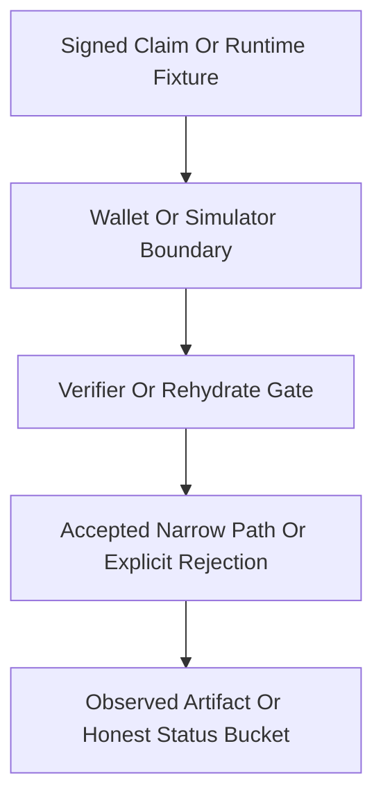

# Phase 033 Test Spec

## 🎯 Purpose

📌 This document defines the executable unit, integration, and scenario-level
coverage required to turn the 65 canonical Phase 033 tasks into a truthful test
surface.

📌 Phase 033 is a crypto-audit follow-up phase. Many rows are executable code
seams, while others are documentation-governance or caution rows that must be
enforced by narrow wording guards attached to the live seams instead of by
invented standalone Rust coverage.

📌 This spec is written so another engineer or agent can add Phase 033 tests
without guessing scenario grouping, open-gap boundaries, pass oracles, fail
signals, or the correct test-file home.

## 📌 Workflow Status

📌 This spec is now synchronized to the executed Phase 033 reuse-first test
surface.

📌 The phase now has phase-local execution artifacts proving closeout state,
including `033-01-SUMMARY.md` through `033-23-SUMMARY.md`, `033-UAT.md`, and
`033-VALIDATION.md`.

📌 The contract below must still stay honest about what is proven by runtime
tests, what is frozen by source-shape wording guards, and what remains an
explicit narrowed or open semantic gap.

📌 Current source artifacts used:

- `.planning/phases/033-crypto-audit-scenario-2/033-CONTEXT.md`
- `.planning/phases/033-crypto-audit-scenario-2/033-TODO.md`
- `.planning/phases/033-crypto-audit-scenario-2/033-01-PLAN.md`
- `.planning/phases/033-crypto-audit-scenario-2/033-02-PLAN.md`
- `.planning/phases/033-crypto-audit-scenario-2/033-03-PLAN.md`
- `.planning/phases/033-crypto-audit-scenario-2/033-04-PLAN.md`
- `.planning/phases/033-crypto-audit-scenario-2/033-05-PLAN.md`
- `.planning/phases/033-crypto-audit-scenario-2/033-06-PLAN.md`
- `.planning/phases/033-crypto-audit-scenario-2/033-07-PLAN.md`
- `.planning/phases/033-crypto-audit-scenario-2/033-08-PLAN.md`
- `.planning/phases/033-crypto-audit-scenario-2/033-09-PLAN.md`
- `.planning/phases/033-crypto-audit-scenario-2/033-10-PLAN.md`
- `.planning/phases/033-crypto-audit-scenario-2/033-11-PLAN.md`
- `.planning/phases/033-crypto-audit-scenario-2/033-12-PLAN.md`
- `.planning/phases/033-crypto-audit-scenario-2/033-13-PLAN.md`
- `.planning/phases/033-crypto-audit-scenario-2/033-14-PLAN.md`
- `.planning/phases/033-crypto-audit-scenario-2/033-15-PLAN.md`
- `.planning/phases/033-crypto-audit-scenario-2/033-16-PLAN.md`
- `.planning/phases/033-crypto-audit-scenario-2/033-17-PLAN.md`
- `.planning/phases/033-crypto-audit-scenario-2/033-18-PLAN.md`
- `.planning/phases/033-crypto-audit-scenario-2/033-19-PLAN.md`
- `.planning/phases/033-crypto-audit-scenario-2/033-20-PLAN.md`
- `.planning/phases/033-crypto-audit-scenario-2/033-21-PLAN.md`
- `.planning/phases/033-crypto-audit-scenario-2/033-22-PLAN.md`
- `.planning/phases/033-crypto-audit-scenario-2/033-23-PLAN.md`
- `.planning/phases/033-crypto-audit-scenario-2/033-EXAM-QUESTIONS-AND-ANSWERS-1.md`
- `.planning/phases/033-crypto-audit-scenario-2/033-EXAM-QUESTIONS-AND-ANSWERS-2.md`
- `.planning/phases/033-crypto-audit-scenario-2/033-EXAM-QUESTIONS-AND-ANSWERS-3.md`
- `.planning/phases/033-crypto-audit-scenario-2/033-32FULL-AUDIT.md`
- `.planning/phases/033-crypto-audit-scenario-2/033-SEMANTIC-FREEZE.md`
- `.planning/phases/033-crypto-audit-scenario-2/033-01-SUMMARY.md` through
  `.planning/phases/033-crypto-audit-scenario-2/033-23-SUMMARY.md`
- `.planning/phases/033-crypto-audit-scenario-2/033-UAT.md`
- `.planning/phases/033-crypto-audit-scenario-2/033-VALIDATION.md`
- `.planning/REQUIREMENTS.md`
- Existing anchors in `crates/z00z_crypto/tests/`, `crates/z00z_storage/tests/`,
  `crates/z00z_simulator/tests/`, and `crates/z00z_wallets/tests/`

📌 Completion artifacts are present for Phase 033. This spec must therefore be
read together with the executed summaries and final validation matrix instead
of being treated as a pre-execution planning-only artifact.

## 🧮 Canonical Traceability Guarantee

📌 `033-TODO.md` is the canonical source inventory, but its raw display rows are
not safe to consume without `033-CONTEXT.md` because the source table contains a
duplicated display number, a mandatory carry-forward caution row, and the known
crossed summary/body pair for tasks 64 and 65.

📌 Phase 033 execution coverage is therefore fixed through `033-CONTEXT.md` with
the following canonical task-to-plan mapping:

- Tasks 1-3 -> `033-01-PLAN.md`
- Tasks 4-6 -> `033-02-PLAN.md`
- Tasks 7-9 -> `033-03-PLAN.md`
- Tasks 10-12 -> `033-04-PLAN.md`
- Tasks 13-15 -> `033-05-PLAN.md`
- Tasks 16-18 -> `033-06-PLAN.md`
- Tasks 19-21 -> `033-07-PLAN.md`
- Tasks 22-24 -> `033-08-PLAN.md`
- Tasks 25-27 -> `033-09-PLAN.md`
- Tasks 28-30 -> `033-10-PLAN.md`
- Tasks 31-33 -> `033-11-PLAN.md`
- Tasks 34-36 -> `033-12-PLAN.md`
- Tasks 37-39 -> `033-13-PLAN.md`
- Tasks 40-42 -> `033-14-PLAN.md`
- Tasks 43-46 -> `033-15-PLAN.md`
- Tasks 47-50 -> `033-16-PLAN.md`
- Tasks 51-53 -> `033-17-PLAN.md`
- Tasks 54-56 -> `033-18-PLAN.md`
- Tasks 57-59 -> `033-19-PLAN.md`
- Tasks 60-62 -> `033-20-PLAN.md`
- Task 63 -> `033-21-PLAN.md`
- Task 64 -> `033-22-PLAN.md`
- Task 65 -> `033-23-PLAN.md`

📌 The carry-forward caution row `Real theft-resistance boundary` is attached to
canonical task 9 and must stay reflected in `033-CONTEXT.md` and
`033-03-PLAN.md`; it is not a standalone 66th execution task.

📌 Task 47 remains artifact-only and blocked by tasks 25, 27, 63, 64, and 65.
No documentation allowlist cleanup may treat that row as independently closed
before the full prerequisite chain is solved or formally narrowed and
re-approved.

## 🧭 Classification

### 🔑 TDD And Integration Targets

- `crates/z00z_crypto/src/claim/v2.rs`
  because claim tuple binding and direct field-drift mutation must be proven at
  the canonical claim statement seam.
- `crates/z00z_wallets/src/core/tx/claim_tx_verifier_impl_proof.rs`
  because Phase 033 must prove precise reject-class behavior for tuple, root,
  and proof drift at the live verifier boundary.
- `crates/z00z_wallets/src/core/tx/test_claim_tx.rs`
  because the existing direct verifier harness is the narrowest and cheapest
  place to add post-sign mutation and exact reject-path assertions.
- `crates/z00z_storage/src/assets/store_internal/store_query.rs`
  because helper-owned claim continuity versus persisted membership continuity
  is the central claim-trust seam.
- `crates/z00z_simulator/src/claim_pkg_consumer.rs`
  because publish-bound claim continuity and stale-proof classifier behavior are
  observed here on the accepted path.
- `crates/z00z_wallets/src/core/tx/witness_gate.rs`
  because `leaf_ad_id`, receiver-secret ownership, and wallet-local anti-theft
  behavior converge here.
- `crates/z00z_wallets/src/services/wallet_service_actions_receive.rs`
  because request-bound versus card-bound route behavior must stay explicit and
  testable.
- `crates/z00z_wallets/src/core/tx/spend_verification.rs`
  because the narrow public spend boundary, semantic acceptance, and nullifier
  gap are all anchored here.
- `crates/z00z_wallets/src/core/tx/state_checkpoint.rs`
  because checkpoint package continuity, operator-boundary anti-substitution,
  and final acceptance semantics converge here.
- `crates/z00z_storage/src/assets/store_internal/redb_backend_validate.rs`
  because persisted checkpoint rehydrate validation is the strongest current
  fail-closed backend seam.
- `crates/z00z_simulator/src/scenario_1/stage_12.rs`
  because accepted-path checkpoint finalization remains package-coupled rather
  than standalone backend authority.
- `crates/z00z_simulator/src/scenario_1/stage_2.rs`
  because default plaintext secret-artifact removal and debug-lane isolation are
  observed here.
- `crates/z00z_simulator/src/rng_mode.rs`
  because deterministic RNG scoping and config-lane consolidation must stay
  simulator-bounded.

### ✅ E2E Targets

- `crates/z00z_wallets/tests/test_e2e_req_flow.rs`
  because request-bound receive flow is the strongest existing privacy-route
  anchor.
- `crates/z00z_simulator/tests/test_claim_pkg_runtime.rs`
  because claim publish, consumer, and stale-proof behavior meet here.
- `crates/z00z_simulator/tests/test_checkpoint_acceptance.rs`
  because accepted-path checkpoint finalization, stage coupling, and operator
  boundary are observable here.
- `cargo run --release -p z00z_simulator --bin scenario_1 --features wallet_debug_dump`
  because Scenario 1 remains the broadest end-to-end runtime proving ground for
  current-stack spend and checkpoint behavior.

### ⛔ Skip Targets

- `.planning/phases/033-crypto-audit-scenario-2/033-32EXAM-QEST-DRAFT.md`
  because it is a draft artifact and not the canonical planning source.
- Standalone markdown-only rows for tasks 23, 24, 26, 27, 46, and 47
  because they are governance and wording gates that must be enforced through
  existing live boundary tests plus artifact review, not by fabricated Rust-only
  seams.
- Caution rows 48-62 as standalone new proof systems
  because those rows explicitly forbid overclaim and must piggyback on existing
  executable claim, spend, checkpoint, request, secret, or RNG seams.
- Vendor Tari sources
  because they are protected and not the ownership boundary for Phase 033.

## ♻️ Existing Test Anchors To Reuse

- `crates/z00z_crypto/tests/test_claim_v2_contract.rs`
  for claim tuple field coverage and canonical signed-frame behavior.
- `crates/z00z_storage/tests/test_claim_source_proof.rs`
  for claim-source root and proof continuity behavior.
- `crates/z00z_simulator/tests/test_claim_pkg_runtime.rs`
  for claim publish, consume, and stale-proof runtime behavior.
- `crates/z00z_simulator/tests/test_claim_persist.rs`
  for publish-bound package shape and continuity persistence.
- `crates/z00z_simulator/tests/test_claim_pkg_crypto_support.rs`
  for simulator-side claim authority anchor, stale-proof, and authority-signature
  negative paths.
- `crates/z00z_wallets/tests/test_spend_witness_gate.rs`
  for `leaf_ad_id` drift, witness gating, and wallet-local ownership paths.
- `crates/z00z_wallets/tests/test_e2e_req_flow.rs`
  for request-bound receive and privacy-route selection.
- `crates/z00z_simulator/tests/test_scenario1_spend_gate.rs`
  for current-stack public spend acceptance and negative-path gating.
- `crates/z00z_simulator/tests/test_checkpoint_acceptance.rs`
  for checkpoint package-coupled acceptance boundaries.
- `crates/z00z_storage/tests/test_checkpoint_replay_inputs.rs`
  for replay and stale-input fail-closed behavior.
- `crates/z00z_storage/tests/test_checkpoint_link_injective.rs`
  for checkpoint identity and injective linkage boundaries.
- `crates/z00z_simulator/tests/test_stage2_secret_artifacts.rs`
  for default plaintext secret-artifact absence.

## 🆕 Proposed New Test Files

- No standalone checkpoint backend boundary file was needed in the executed
  Phase 033 closeout. The reuse-first execution path absorbed that surface into
  `crates/z00z_simulator/tests/test_checkpoint_acceptance.rs` plus the existing
  persisted replay/link suites and late wording guards.
- No standalone RNG scope contract file was needed in the executed Phase 033
  closeout. The reuse-first execution path absorbed that surface into
  `crates/z00z_simulator/tests/test_transport_rng_boundaries.rs`.

## 🗂️ Test File Placement

| Scenario ID | Test File Path | Extend Or Create | Why This Is The Correct Home |
| --- | --- | --- | --- |
| 033-S01 | `crates/z00z_wallets/src/core/tx/test_claim_tx.rs` | Extend | Existing direct verifier harness already exercises `ClaimTxVerifierImpl::verify` with phase-accurate fixtures and is the best home for tasks 1, 3, 28, 29, and 31. |
| 033-S02 | `crates/z00z_storage/tests/test_claim_source_proof.rs` | Extend | Existing storage-owned claim-source proof anchor already carries the correct persisted-versus-helper continuity seam for tasks 2, 30, 32, 58, 59, and 63. |
| 033-S03 | `crates/z00z_simulator/tests/test_claim_pkg_crypto_support.rs` | Extend | Existing simulator crypto-support seam is the right place for stale-proof classifier, authority-anchor, and authority-signature negative behavior. |
| 033-S04 | `crates/z00z_simulator/tests/test_claim_persist.rs` | Extend | Existing claim persistence seam is the natural home for bundle-wrapper version and explicit discriminator-shape tests. |
| 033-S05 | `crates/z00z_wallets/tests/test_spend_witness_gate.rs` | Extend | Existing witness/ownership gate file already owns `leaf_ad_id`, receiver-secret, and wallet-local anti-theft behavior. |
| 033-S06 | `crates/z00z_wallets/tests/test_e2e_req_flow.rs` | Extend | Existing request-bound end-to-end flow is the strongest live privacy-route contract. |
| 033-S07 | `crates/z00z_simulator/tests/test_scenario1_spend_gate.rs` | Extend | Existing spend-gate scenario is the narrow public spend boundary anchor for current-stack acceptance. |
| 033-S08 | `crates/z00z_simulator/tests/test_checkpoint_acceptance.rs` | Extend | Existing accepted-path checkpoint file already owns stage11/stage12 continuity, operator-boundary behavior, and the executed reuse-first backend-boundary assertions. |
| 033-S09 | `crates/z00z_storage/tests/test_checkpoint_replay_inputs.rs` | Extend | Existing storage replay file is the best home for stale tuple, replay, and spent-row rehydrate assertions. |
| 033-S10 | `crates/z00z_storage/tests/test_checkpoint_link_injective.rs` | Extend | Existing link/injective file already anchors raw-versus-persisted checkpoint identity semantics. |
| 033-S11 | `crates/z00z_simulator/tests/test_stage2_secret_artifacts.rs` | Extend | Existing Stage 2 secret-artifact suite already proves default-lane silence and can carry debug-lane boundary assertions. |
| 033-S12 | `crates/z00z_simulator/tests/test_transport_rng_boundaries.rs` | Extend | The executed reuse-first closeout absorbed RNG-scope and config-lane semantics into the existing focused transport boundary suite. |
| 033-S13 | `N/A (artifact-only gate)` | Skip | Tasks 23, 24, 26, 27, 46, and 47 are documentation/governance gates that must reuse live seam evidence and planning review rather than inventing synthetic Rust seams. Task 47 remains blocked by tasks 25, 27, 63, 64, and 65 until those gates close or are formally narrowed and re-approved. |
| 033-S14 | `N/A (caution-language gate)` | Skip | Tasks 48-53 are caution rows whose truth is enforced by keeping existing claim/spend/checkpoint tests narrow. |
| 033-S15 | `N/A (fix-set framing gate)` | Skip | Tasks 54-62 describe fix-set framing over live seams and must ride on the executable files above, not on standalone invented backends. |

## 🔄 Required End-To-End Behaviors

| Behavior | Requirement | Primary Path | Pass Signal | Fail Signal |
| --- | --- | --- | --- | --- |
| Claim tuple drift rejects at the live verifier boundary | PH32-CLAIM-TRUST | `ClaimStmtV2 -> sign -> mutate field -> wallet claim verifier` | post-sign `claim_source_asset_id` or `chain_id` drift rejects with stable fail-closed class | mutation still verifies or fails through an ambiguous generic path |
| Claim continuity stays explicit about helper-owned versus persisted authority | PH32-CLAIM-TRUST | `store_query -> claim_source_contract_for_item -> claim consumer` | helper seam is named explicitly or replaced by persisted continuity | helper reconstruction is silently described as authoritative storage-backed continuity |
| Claim reject taxonomy remains precise | PH32-HONEST | `claim verifier -> consumer stale-proof handling` | root-version and proof-version branches are separately asserted and stale-proof classification is deterministic | tests only accept substring-level drift or collapse distinct categories |
| Publish-bound claim package shape rejects implicit discriminator drift | PH32-CLAIM-TRUST | `claim persist -> claim package load -> consumer` | wrong bundle version or implicit discriminator shape is rejected | defaulted or implicit shapes still load as accepted packages |
| Wallet-local ownership gate stays receiver-secret and `leaf_ad_id` bound | PH32-HONEST | `receive/scan -> witness gate -> spend witness path` | canonical owned path stays mine and drift breaks ownership | broader repository-wide ownership theorem is implied without proof |
| Request-bound route remains distinct from card-bound compatibility | PH32-HONEST | `wallet service receive -> request flow` | request-bound path proves the preferred privacy lane while card path stays compatibility-only | request and card routes are flattened into one privacy statement |
| Public spend boundary stays narrow and fail closed | PH32-SPEND | `scenario_1 spend gate -> spend verification` | current public spend contract accepts complete semantic path and rejects incomplete semantic path | tests imply nullifier semantics or full trustless closure already exist |
| Checkpoint acceptance stays package-coupled, not standalone authoritative | PH32-CHECKPOINT | `stage11/stage12 -> state_checkpoint -> redb validation` | accepted path preserves proof/input/output continuity and rejects compatibility-looking payload-only path | docs or tests imply standalone backend authority already exists |
| Replay and stale artifacts stay fail closed on the persisted path | PH32-CHECKPOINT | `rehydrate -> replay inputs -> spent-row replay` | stale tuples and replayed bundles reject with explicit signals | replay success or overly broad stale-closure claim remains untested |
| Default secret silence and debug-lane isolation remain explicit | PH32-HONEST | `stage_2 -> stage_3_finalize -> debug export lane` | no default plaintext secret artifact is produced and debug export remains the only explicit secret-export lane | docs or tests generalize this into total secret-persistence elimination |
| Deterministic RNG stays simulator-scoped | PH32-HONEST | `rng_mode -> simulator config -> Stage 2 transport` | seeded reproducibility is explicit, bounded, and feature-context aware | deterministic adapter is described as universally safe production entropy |
| Repository-wide status language stays honest | PH32-HONEST | `context/requirements/roadmap wording backed by live tests above` | delivered, partial, and not-proved buckets remain synchronized | broad closure or reclassification is claimed before semantic gaps close |

## 🔗 Critical Integration Paths

1. `ClaimStmtV2 -> wallet claim verifier -> simulator claim package consumer`
2. `AssetStore claim-source query -> persisted membership state or explicit helper seam`
3. `wallet receive request flow -> witness gate -> spend verification`
4. `scenario_1 stage4 package -> stage11 bridge -> stage12 finalize -> redb rehydrate`
5. `stage_2 secret artifact generation -> stage_3 finalize -> debug lane policy`
6. `rng_mode -> simulator config -> transport/provider selection`

## 🧪 Input Fixtures And Preconditions

| Scenario ID | Inputs | Preconditions | Fixture Source |
| --- | --- | --- | --- |
| 033-S01 | signed claim tuple with mutable post-sign fields | canonical signer/verifier helpers are available | existing claim contract helpers plus new focused verifier fixture |
| 033-S02 | persisted claim item versus synthetic helper reconstruction | storage membership fixture is reproducible | `test_claim_source_proof.rs` fixtures |
| 033-S03 | claim package with stale proof, root version drift, proof version drift | consumer seam remains live | `test_claim_pkg_runtime.rs` fixtures |
| 033-S04 | claim package with wrong bundle version or implicit discriminator fields | serializer/parser seam remains reachable | `test_claim_persist.rs` fixtures |
| 033-S05 | owned and foreign spendable outputs with `leaf_ad_id` mutations | receiver-secret and `s_out` paths are canonical | `test_spend_witness_gate.rs` helpers |
| 033-S06 | request-bound and card-bound receive inputs | request-flow helpers are stable | `test_e2e_req_flow.rs` |
| 033-S07 | semantically complete and incomplete spend inputs | Scenario 1 spend-gate fixtures remain available | `test_scenario1_spend_gate.rs` |
| 033-S08 | accepted and compatibility-looking checkpoint payloads | stage11/stage12 package flow remains reproducible | `test_checkpoint_acceptance.rs` helpers |
| 033-S09 | stale tuple, replayed bundle, replayed spent-row state | persisted rehydrate helpers are available | `test_checkpoint_replay_inputs.rs` |
| 033-S10 | Stage 2 secret artifact generation under default and debug modes | simulator config fixtures exist | `test_stage2_secret_artifacts.rs` |
| 033-S11 | seeded and unseeded simulator RNG selections | RNG mode and config parsing are stable | `test_transport_rng_boundaries.rs` fixtures |

## 📦 Expected Outputs And Produced Artifacts

| Scenario ID | Expected Output | Persisted Artifact | Observable Signal |
| --- | --- | --- | --- |
| 033-S01 | precise verifier rejection on tuple drift | none | explicit reject class or fail-closed error path |
| 033-S02 | persisted continuity proof or explicit helper-owned boundary | store-backed claim continuity artifact or narrowed requirement note | storage-owned proof path is explicit |
| 033-S03 | separate root/proof/stale rejection signals | none | stable category-level reject distinction |
| 033-S04 | wrong bundle version and implicit discriminator rejection | canonical serialized claim package only | load fails before accepted continuity path |
| 033-S05 | ownership lost or rejected on identity drift | none | `NotMine`, witness rejection, or ownership failure |
| 033-S06 | request-bound acceptance and card-bound compatibility distinction | request-tagged receive flow state | request path stays preferred and distinct |
| 033-S07 | narrow current-stack public spend acceptance | spend package or verifier result | semantic acceptance before mutation only |
| 033-S08 | package-coupled checkpoint acceptance only | finalized checkpoint accepted on accepted path | compatibility-looking payload-only path rejects |
| 033-S09 | replay and stale artifacts reject | persisted replay attempt rows | fail-closed rehydrate or replay rejection |
| 033-S10 | no default plaintext secret artifact; gated debug export only | default-lane output absent | secret artifact present only in debug lane |
| 033-S11 | deterministic RNG remains simulator-bounded | simulator config and provider selection state | seeded reproducibility explicit, bounded, and non-production |

## 🔐 Cryptographic And Security Invariants To Observe

| Invariant | Why It Matters | Assertion Shape |
| --- | --- | --- |
| Signed claim tuple fields stay bound after signing | prevents silent tuple drift | mutate one field post-sign and assert verifier rejection |
| Persisted claim authority is not silently replaced by helper reconstruction | avoids false authoritative closure | name helper seam explicitly or prove persisted continuity path |
| Reject taxonomy stays precise | prevents generic fail-closed overclaim | assert distinct root/proof/stale categories |
| Bundle version and discriminator fields are explicit | prevents serde-default continuity bypass | reject wrong version and implicit discriminator shapes |
| Receiver-secret plus `s_out` gate remains wallet-local | prevents public-theorem overclaim | assert wallet-local ownership only |
| `leaf_ad_id` stays the canonical decrypt-associated identity | protects asset binding and ownership continuity | drift breaks ownership or witness acceptance |
| Request and card routes are not semantically merged | protects privacy-route honesty | assert route-specific acceptance and compatibility behavior |
| Nullifier semantics remain the exact open spend gap | prevents flattening broader spend closure claims | assert narrow public spend boundary only |
| Checkpoint continuity is package-coupled, not standalone backend authority | prevents publish-proof overclaim | assert accepted path continuity plus backend-gap note |
| Draft and final checkpoint states remain disjoint | protects authoritative-state semantics | draft-only artifacts never load as final state |
| Default secret silence does not imply no secret persistence anywhere | prevents overclaim on wallet persistence | assert only the removed default plaintext artifact lane |
| Deterministic RNG stays simulator-scoped | prevents unsafe production interpretation | assert seeded behavior only under simulator/test selection |
| Documentation buckets track delivered versus partial versus not-proved | prevents governance drift | attach wording guards to the live seams above |

## 📈 Mermaid Flow



## 🧩 Clarifying Code Snippets

```rust
// Canonical Phase 033 pattern: mutate one authenticated field after signing,
// then assert the live verifier rejects through the narrow expected class.
let signed = build_signed_claim_fixture();
let drifted = signed.with_chain_id(mutated_chain_id());
let err = verify_claim(drifted).expect_err("post-sign chain_id drift must fail");
assert_reject_class(err, "SourceRootVer");
```

## 🧮 Scenario Matrix

| Scenario ID | Type | Goal | Positive Example | Negative Example | Main Assertions |
| --- | --- | --- | --- | --- | --- |
| 033-S01 | integration | prove claim tuple binding and reject precision | canonical signed tuple verifies | post-sign tuple field drift rejects | exact reject class, no silent acceptance |
| 033-S02 | integration | keep claim continuity honest | helper seam explicitly named or persisted continuity lands | helper seam described as authoritative continuity | storage-owned versus helper-owned distinction |
| 033-S03 | e2e | prove stale-proof and reject taxonomy stability | clean consumer path accepts | stale proof, root drift, or proof drift reject distinctly | deterministic classifier behavior |
| 033-S04 | integration | enforce publish-bound package shape | explicit canonical package loads | wrong bundle version or implicit discriminator package loads | load-time shape rejection |
| 033-S05 | integration | keep ownership and asset-binding wallet-local | owned path stays mine under canonical flow | `leaf_ad_id` drift or foreign output stays accepted | ownership loss or rejection on drift |
| 033-S06 | e2e | preserve request-bound privacy route | request path accepted as preferred lane | card path treated as equivalent privacy theorem | route distinction remains explicit |
| 033-S07 | e2e | freeze narrow spend boundary | semantically complete spend passes | incomplete semantic spend reaches acceptance | acceptance before mutation only |
| 033-S08 | e2e | freeze checkpoint package continuity boundary | accepted package finalizes and rehydrates | compatibility-looking payload bytes alone finalize | package-coupled continuity only |
| 033-S09 | integration | freeze replay and stale rejection | fresh persisted rehydrate path survives | replayed stale tuple or spent-row path survives | fail-closed replay behavior |
| 033-S10 | integration | keep default secret silence narrow | default lane produces no plaintext secret artifact | debug-only export appears by default | default lane clean, debug lane gated |
| 033-S11 | integration | keep deterministic RNG simulator-scoped | seeded simulator fixture reproduces deterministically | docs or config imply universal production safety | bounded RNG scope only |
| 033-S12 | artifact gate | keep honest status buckets synchronized | delivered/partial/not-proved wording matches live seams | broad end-to-end closure or reclassification appears | wording guard only, no invented Rust seam |

## 🖥️ Canonical Commands

📌 These package-scoped commands are the completion oracles for the executable
Phase 033 seams. Broader workspace-level release gates are smoke-only and must
not replace the targeted package/test proof that a canonical row is closed.

- `./.github/skills/smart-tests-bootstrap/scripts/bootstrap_tests.sh`
- `cargo test -p z00z_crypto --release --test test_claim_v2_contract -- --nocapture`
- `cargo test -p z00z_storage --release --test test_claim_source_proof -- --nocapture`
- `cargo test -p z00z_storage --release --test test_checkpoint_replay_inputs -- --nocapture`
- `cargo test -p z00z_storage --release --test test_checkpoint_link_injective -- --nocapture`
- `cargo test -p z00z_simulator --release --test test_claim_pkg_runtime -- --nocapture`
- `cargo test -p z00z_simulator --release --test test_claim_persist -- --nocapture`
- `cargo test -p z00z_simulator --release --test test_checkpoint_acceptance -- --nocapture`
- `cargo test -p z00z_simulator --release --test test_stage2_secret_artifacts -- --nocapture`
- `cargo test -p z00z_simulator --release --test test_scenario1_spend_gate -- --nocapture`
- `cargo test -p z00z_wallets --release claim_tx_tests -- --nocapture`
- `cargo test -p z00z_wallets --release --test test_e2e_req_flow -- --nocapture`
- `cargo test -p z00z_wallets --release --test test_spend_witness_gate -- --nocapture`
- `cargo run --release -p z00z_simulator --bin scenario_1 --features wallet_debug_dump`
- `cargo test -p z00z_simulator --release --features test-fast --features wallet_debug_dump`

## ⚠️ Open Gaps

- Task 63 remains the authoritative claim-source continuity gate until helper
  reconstruction is replaced or the requirement is formally narrowed.
- Task 64 remains the nullifier-semantics gate on the regular public spend
  contract; no Phase 033 test may imply that this gap is already closed.
- Task 65 remains the checkpoint-backend authority gate; current acceptance is
  package-coupled and must not be restated as a standalone authoritative proof
  backend.
- Task 47 remains blocked by tasks 25, 27, 63, 64, and 65; documentation
  allowlist cleanup must not run ahead of that governance chain.
- Tasks 47-62 remain caution or governance waves whose main executable proof is
  to keep the existing live seams narrow and honest rather than to fabricate new
  closure theorems.
