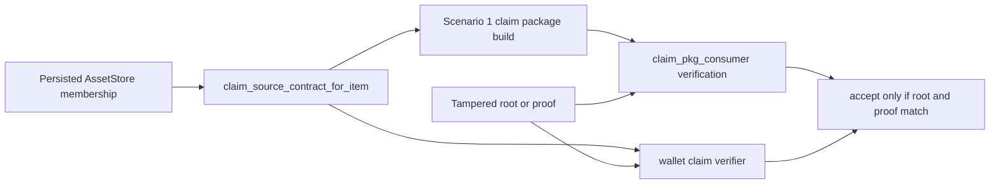
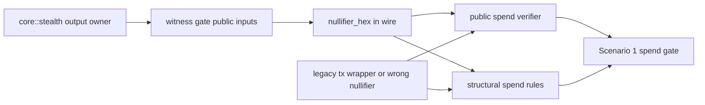
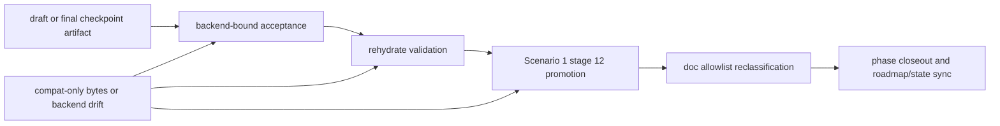

# Phase 034 Test Specification

## 🎯 Objective

Define the phase-local unit and end-to-end test contract for Phase 034 so that
another engineer or agent can implement coverage without guessing scenario
boundaries, proof paths, failure rules, or file placement.

This specification is planning-driven. It is derived from:

- `034-CONTEXT.md`
- `034-TODO.md`
- `034-01-PLAN.md` through `034-09-PLAN.md`

The live repository now has a summary-backed Phase 034 closure package through
`034-08` and a completed post-closure hygiene chain under `034-09`.

This file remains a planning and mapping artifact. Execution truth for the live
tree is tracked by `034-VALIDATION.md`, `034-CLOSEOUT.md`, `034-UAT.md`, and
`034-09-SUMMARY.md` rather than by this specification.

## ✅ Reviewed Status

- [x] Semantic closure chain `034-01` through `034-14` remains the mandatory
  test-planning surface.
- [x] Optional sidecars are `034-15`, `034-16`, `034-17`, and `034-18`, and
  they remain outside Q63, Q64, Q65, and Q47 semantic closure evidence.
- [x] The public spend boundary is the shipped narrow boundary: the public seam
  authenticates one signed nullifier field, while deterministic
  `chain_id || s_in` derivation is enforced by the witness bridge and
  structural spend rules.
- [x] Checkpoint wording stays package-coupled and backend-defined; it does not
  overclaim standalone final proof-backend closure.

## 🔒 Scope Rules

- The semantic closure chain is mandatory: `034-01` through `034-14`.
- Optional sidecars `034-15`, `034-16`, `034-17`, and `034-18` must be
  specified, but they are not semantic closure evidence for Q63, Q64, Q65, or
  Q47.
- No test may normalize a parallel claim verifier, parallel spend-proof layer,
  parallel checkpoint verifier facade, or parallel sender-construction owner.
- Source-text guards are first-class tests in this phase. They are required
  wherever the planning artifacts explicitly freeze ownership or wording.

## 📚 Source Mapping

| Audit gap | Phase task chain | Required proof theme |
| --- | --- | --- |
| Q63 claim continuity | `034-01`, `034-02`, `034-08`, `034-09` | persisted membership becomes the only authoritative claim-source seam |
| Q64 spend nullifier semantics | `034-03`, `034-04`, `034-05`, `034-08`, `034-10` | one deterministic nullifier semantics surface from `chain_id` concatenated with `s_in` exists end to end |
| Q65 checkpoint backend authority | `034-06`, `034-07`, `034-08`, `034-11` | finalize, seal, reload, and simulator promotion consume one backend-bound truth |
| Q47 documentation allowlist | `034-12`, `034-13`, `034-14` | active docs reflect shipped truth only after semantic waves turn green |

## 🧭 Classification Approval Record

Approved workflow gates for this specification:

- Classification gate: approved
- Test-plan gate: approved for artifact generation only
- This deliverable creates planning artifacts, not test code

## 🗂️ Test Home Classification

### ✅ TDD / Unit-Oriented Seams

These targets validate local contract correctness, deterministic transforms,
rejection behavior, and source-text guard expectations.

| Seam | Primary files | Recommended unit anchors |
| --- | --- | --- |
| Claim-source contract seam | `store_query.rs`, `claim_tx_verifier_impl_proof.rs` | `crates/z00z_storage/tests/test_claim_source_proof.rs`, `crates/z00z_wallets/src/core/tx/test_claim_tx.rs` |
| Nullifier domain and structural rules | `domains.rs`, `tx_wire_types.rs`, `spend_rules.rs`, `witness_gate.rs`, `spend_verification.rs` | `crates/z00z_wallets/tests/test_spend_witness_gate.rs`, module-local `spend_rules.rs` and `spend_verification.rs` tests |
| Checkpoint backend contract | `artifact_proof_draft.rs`, `artifact_final.rs`, `codec.rs`, `state_checkpoint.rs`, `redb_backend_validate.rs` | `crates/z00z_storage/tests/test_checkpoint_finalization.rs`, `crates/z00z_storage/tests/test_checkpoint_store_api.rs`, `crates/z00z_storage/tests/test_redb_rehydrate.rs` |
| Search sidecar invariants | `store_query.rs` | `crates/z00z_storage/tests/test_search_api.rs` |
| Rename and suffix sidecar guards | inventory-driven Rust surfaces | targeted crate tests plus grep/source-text guards |

### ✅ End-To-End / Integration-Oriented Seams

These targets must prove cross-module or cross-crate workflows.

| Workflow | Primary files | Recommended E2E anchors |
| --- | --- | --- |
| Scenario 1 claim package flow | `stage_3_utils/claim_pkg.rs`, `claim_pkg_consumer.rs` | `crates/z00z_simulator/tests/test_claim_pkg_crypto_support.rs` |
| Sender-authority migration flow | `core::stealth/output.rs`, `builder.rs`, `output_flow.rs`, stage 4 and stage 6 helpers | `crates/z00z_wallets/tests/test_s5_sender_examples.rs`, `crates/z00z_simulator/tests/test_claim_acceptance.rs`, `crates/z00z_simulator/src/scenario_1/stage_4_utils/tx_lane_runtime_tests.rs` |
| Scenario 1 spend acceptance flow | `witness_gate.rs`, `spend_verification.rs`, simulator spend gate | `crates/z00z_simulator/tests/test_scenario1_spend_gate.rs`, `crates/z00z_wallets/tests/test_scenario1_semantics.rs` |
| Checkpoint finalize/reload/promotion flow | storage checkpoint contract + `stage_12.rs` | `crates/z00z_simulator/tests/test_checkpoint_acceptance.rs`, `crates/z00z_simulator/tests/test_scenario1_stage_surface.rs` |
| Documentation truth flow | active docs + wording surfaces | `crates/z00z_wallets/tests/test_scenario1_semantics.rs`, `crates/z00z_simulator/tests/test_scenario1_stage_surface.rs` |
| Phase closeout truth flow | `034-VALIDATION.md`, `034-CLOSEOUT.md`, `ROADMAP.md`, `STATE.md` | repository-side artifact checks in closeout sweep |

### ✅ Additional Existing Homes

The following plan-named anchors are also already present and may be used
directly instead of being created during test implementation:

- `crates/z00z_wallets/tests/test_phase14_pipeline.rs`
- `crates/z00z_wallets/tests/test_phase15_regress.rs`
- `crates/z00z_wallets/tests/test_tx_serial.rs`
- `crates/z00z_wallets/tests/test_s5_leaf_gate.rs`

## 🌊 End-To-End Behaviors That Must Be Proven

1. A claim package emitted from Scenario 1 derives claim-source proof material
   from persisted membership state rather than helper-owned reconstruction.
2. A wallet-side claim verifier rejects source-root or proof drift after the
   storage-backed claim seam is adopted.
3. The shipped spend closure binds one signed nullifier field on the public
  spend path while the witness and structural layers enforce deterministic
  `chain_id` concatenated with `s_in` derivation, and the required malformed,
  duplicate, signed-drift, and structural-mismatch cases all reject on the
  intended seam.
4. Sender-construction authority moves to `core::stealth` without changing
   accepted spend, serial, receiver-card, or range-proof behavior.
5. Checkpoint finalize, seal, reload, and simulator promotion use one
  backend-defined package-coupled checkpoint contract and reject
  compatibility-only authority.
6. Active docs and stage-surface wording are only reclassified after semantic
   closure is proven and do not rewrite append-only audit history.
7. Phase closeout reconciles every mandatory task `034-01` through `034-14`
   and synchronizes `ROADMAP.md` and `STATE.md`.

## 🔐 Cryptographic And Semantic Invariants

### Q63 Claim Continuity

- `claim_source_contract_for_item(...)` must derive the authoritative root and
  proof from persisted store membership.
- Claim proofs emitted in simulator and verified in wallet code must encode the
  same source root and proof blob bytes as the storage-backed seam.
- Closure requires every live producer, consumer, verifier, and fixture helper
  that reconstructs claim-source material from output-leaf or asset-wire data
  to be migrated to the persisted seam or explicitly treated as
  non-authoritative.
- Missing membership, path drift, source-root drift, or proof drift must reject
  before claim acceptance.

### Q64 Spend Nullifier Semantics

- The deterministic nullifier is derived from one canonical helper that binds
  the exact regular-spend domain symbol, one fixed-width `chain_id` encoding,
  and the approved framing for `s_in`; informal raw concatenation wording is
  not sufficient for closure.
- `SpendInputProofWire.nullifier_hex` is the signed public seam field.
- Witness-gate inputs and structural spend rules must call the same canonical
  helper for deterministic `chain_id || s_in` derivation rather than cloning
  the framing logic.
- The standalone public spend verifier must authenticate the delivered signed
  nullifier field and reject malformed, duplicate, or post-signature drift, but
  it must not be described as an independent deterministic-derivation seam when
  the required private inputs are not public.
- Malformed hex, signed nullifier drift, duplicate nullifier in one public
  contract, and structural deterministic mismatch are mandatory rejection
  cases.
- The sender migration must not preserve hidden authority through legacy
  `core::tx` wrappers.

### Q65 Checkpoint Backend Authority

- The checkpoint acceptance contract must remain explicit through draft,
  final artifact, codec, wallet finalize/load, storage reload, and simulator
  promotion surfaces, and it must bind `proof_sys`, statement shape, exec
  identity, snapshot or link tuple, and payload-shape invariants.
- Compatibility-only payload bytes may remain readable for backward format
  support but must stay classified as non-authoritative compatibility rather
  than as the acceptance theorem itself.
- Backend mismatch and reload drift are mandatory negative cases.

### Q47 Documentation Allowlist

- Active requirement text and stage-surface wording may move to closed wording
  only after Q63, Q64, and Q65 are green.
- Historical audit files remain append-only and must not be rewritten.
- Active code comments, code strings, and source-text guards that still
  advertise helper-owned claim authority or pre-closure checkpoint wording are
  in scope for closure honesty even when future-phase specs remain non-gating.
- No active planning or source-text guard may keep advertising `builder.rs` or
  `output_flow.rs` as canonical sender-construction authority after migration.

## 🧪 Scenario Catalog

### Claim Continuity Scenarios

| ID | Type | Demonstrates | Anchor | Pass conditions | Fail conditions |
| --- | --- | --- | --- | --- | --- |
| `UT-034-CLAIM-01` | Unit | persisted membership roundtrip yields authoritative root and proof | `test_claim_source_proof.rs` | storage root equals proof root; proof blob root bind matches root | any root/proof mismatch |
| `UT-034-CLAIM-02` | Unit | helper-owned reconstruction is no longer authority | `test_claim_source_proof.rs` | helper-only path is absent or non-authoritative; store-backed path is used | helper-only path still drives expected result |
| `IT-034-CLAIM-03` | Integration | Scenario 1 claim package producer uses storage-backed seam | `test_claim_pkg_crypto_support.rs` | emitted package decodes to proof rooted in persisted seam | package still derived from helper fallback |
| `IT-034-CLAIM-04` | Integration | wallet verifier rejects source-root drift | `crates/z00z_wallets/src/core/tx/test_claim_tx.rs` | tampered source root or proof is rejected fail closed | wallet accepts drifted source root or proof |

### Spend Nullifier Scenarios

| ID | Type | Demonstrates | Anchor | Pass conditions | Fail conditions |
| --- | --- | --- | --- | --- | --- |
| `UT-034-SPEND-01` | Unit | deterministic nullifier derivation from `chain_id` concatenated with `s_in` | `test_spend_witness_gate.rs` and internal verifier tests | derived nullifier matches expected wire and rule values | derived values diverge across layers |
| `UT-034-SPEND-02` | Unit | missing or malformed `nullifier_hex` rejects | `test_spend_witness_gate.rs` | missing or malformed hex produces reject result before state mutation | missing or malformed hex passes parsing or acceptance |
| `UT-034-SPEND-03` | Unit | signed nullifier drift and structural deterministic mismatch reject | internal `spend_verification.rs` + `test_spend_witness_gate.rs` | post-signature public drift rejects and structural mismatch rejects | either seam accepts its required mismatch case |
| `UT-034-SPEND-04` | Unit | duplicate nullifier rejects | internal verifier tests and `test_spend_witness_gate.rs` | duplicate within one tx is rejected | duplicate remains accepted |
| `IT-034-SPEND-05` | Integration | Scenario 1 spend gate enforces the shipped nullifier boundary | `test_scenario1_spend_gate.rs` | Scenario 1 spend package passes only when the signed nullifier field stays authenticated and witness-derived semantics stay aligned | missing, malformed, duplicate, signed-drifted, or structural-mismatch values still pass |
| `IT-034-SPEND-06` | Integration | sender-authority migration preserves spend semantics | `test_s5_sender_examples.rs`, `test_claim_acceptance.rs`, `test_scenario1_semantics.rs` | migrated `core::stealth` path still produces accepted spend flow | spend behavior depends on retired legacy wrappers |

### Sender-Authority Migration Scenarios

| ID | Type | Demonstrates | Anchor | Pass conditions | Fail conditions |
| --- | --- | --- | --- | --- | --- |
| `IT-034-SENDER-01` | Integration | canonical sender path comes from `core::stealth` | `test_s5_sender_examples.rs` | public examples construct outputs through `core::stealth` | examples still rely on legacy `core::tx` constructors |
| `IT-034-SENDER-02` | Integration | stage 4 and stage 6 routing no longer treat legacy wrappers as owner surface | `tx_lane_runtime_test_support.rs`, `tx_lane_runtime_tests.rs`, `tx_lane_impl.rs`, `test_claim_acceptance.rs` | runtime helpers, seam-map/source-text guards, and routing notes point to `core::stealth` | runtime still routes through legacy tx wrappers or documents them as canonical owner |
| `UT-034-SENDER-03` | Unit | module-local helpers remain reachable only through new owner | `wallet_service_tests.rs`, `test_output_extra.rs`, `test_s5_spec6_bridge.rs`, `test_adversarial.rs`, `test_phase14_pipeline.rs`, `test_phase15_regress.rs`, `test_tx_serial.rs`, `test_s5_leaf_gate.rs` | service, bridge, adversarial, stealth-local, pipeline, serial, and leaf-gate tests use migrated owner paths and preserve fail-closed behavior | tx-owned helper remains canonical, bridge/adversarial regressions reopen, or serial/leaf constraints drift |
| `UT-034-SENDER-04` | Unit | retired `core::tx` construction entrypoints are not still canonical public APIs | `test_phase15_regress.rs`, `test_s5_sender_examples.rs` | `core::tx` no longer re-exports retired sender constructors, or retained shims fail closed with explicit migration errors | legacy wrappers remain silently callable as public owner surfaces |

### Checkpoint Backend Scenarios

| ID | Type | Demonstrates | Anchor | Pass conditions | Fail conditions |
| --- | --- | --- | --- | --- | --- |
| `UT-034-CKPT-01` | Unit | backend-defined package-coupled checkpoint positive path | `test_checkpoint_finalization.rs` | finalization with the accepted backend-defined package-coupled contract succeeds deterministically | accepted path cannot roundtrip |
| `UT-034-CKPT-02` | Unit | compatibility-only payload is not authority path and invariant mismatches reject | `test_checkpoint_store_api.rs` or `test_checkpoint_finalization.rs` | compatibility bytes may parse but cannot satisfy authoritative acceptance theorem, and proof-system, statement-shape, exec-identity, snapshot/link-tuple, or payload-shape drift reject | compatibility-only bytes still count as authority or invariant drift passes |
| `IT-034-CKPT-03` | Integration | reload drift rejects | `test_redb_rehydrate.rs` | rehydrate path rejects backend/proof drift plus statement, exec-identity, snapshot/link-tuple, and payload-shape drift | reload accepts drifted proof/backend or invariant drift |
| `IT-034-CKPT-04` | Integration | simulator promotion path uses authoritative backend | `test_checkpoint_acceptance.rs`, `test_scenario1_stage_surface.rs` | stage promotion fails on proof-system, statement, exec-identity, snapshot/link, payload-shape, or backend drift and blocks authoritative summary emission | stage 12 accepts compatibility-only or drifted checkpoint data |

### Documentation And Closeout Scenarios

| ID | Type | Demonstrates | Anchor | Pass conditions | Fail conditions |
| --- | --- | --- | --- | --- | --- |
| `DOC-034-01` | Source-text | active requirement, active context, live code wording, and concrete planning docs named by `034-fix-spec-4.md` follow shipped truth | `test_scenario1_semantics.rs` | wording no longer says semantic gaps are open after closure | stale open-gap wording remains canonical |
| `DOC-034-02` | Source-text | stage-surface wording reflects shipped truth only | `test_scenario1_stage_surface.rs` | stage 4/11/12 wording matches active closure boundaries | stale `builder.rs`/`output_flow.rs` or pre-closure checkpoint wording remains |
| `DOC-034-03` | Artifact guard | historical append-only artifacts remain untouched | repository artifact checks | historical audit docs remain unchanged while active docs update | append-only historical files are rewritten |
| `IT-034-CLOSE-01` | Artifact integration | closeout reconciles `034-01` through `034-14` and syncs roadmap/state | `034-VALIDATION.md`, `034-CLOSEOUT.md`, `ROADMAP.md`, `STATE.md` | closure package lists all mandatory tasks and status files agree | task reconciliation is partial or roadmap/state diverge |

### Optional Sidecar Scenarios

| ID | Type | Demonstrates | Anchor | Pass conditions | Fail conditions |
| --- | --- | --- | --- | --- | --- |
| `OPT-034-SEARCH-01` | Integration | `keep_path(...)` refactor preserves observable search semantics | `test_search_api.rs` | same path set, same inclusive bounds, same paging split after refactor | result set, order, range, or paging changes |
| `OPT-034-REN-01` | Guard | non-Tari >5-word inventory is honest and behavior-preserving | targeted crate tests + grep guards | renamed identifiers compile, tests pass, historical refs remain intentional | Tari touched, behavior changes, or stale names remain canonical |
| `OPT-034-SFX-01` | Guard | production-current suffix collapse under `034-18` preserves compatibility semantics | targeted crate tests + grep/source-text guards | `034-suffixes-V1-Vn.md` remains the authoritative rename inventory, any normalized execution list stays subordinate to it, unsuffixed canonical names are advertised, and live compatibility readers remain where required | on-wire semantics change, the authoritative source inventory is bypassed, or live compatibility support is deleted blindly |

## 🧱 Existing Vs Proposed Test Homes

### Existing Verified Homes

- `crates/z00z_storage/tests/test_claim_source_proof.rs`
- `crates/z00z_simulator/tests/test_claim_pkg_crypto_support.rs`
- `crates/z00z_wallets/tests/test_spend_witness_gate.rs`
- `crates/z00z_wallets/tests/test_scenario1_semantics.rs`
- `crates/z00z_simulator/tests/test_scenario1_spend_gate.rs`
- `crates/z00z_storage/tests/test_checkpoint_finalization.rs`
- `crates/z00z_storage/tests/test_checkpoint_store_api.rs`
- `crates/z00z_storage/tests/test_redb_rehydrate.rs`
- `crates/z00z_simulator/tests/test_checkpoint_acceptance.rs`
- `crates/z00z_wallets/tests/test_s5_sender_examples.rs`
- `crates/z00z_simulator/tests/test_claim_acceptance.rs`
- `crates/z00z_simulator/tests/test_scenario1_stage_surface.rs`
- `crates/z00z_storage/tests/test_search_api.rs`
- `crates/z00z_wallets/src/core/tx/test_claim_tx.rs`
- `crates/z00z_wallets/src/services/wallet_service_tests.rs`
- `crates/z00z_wallets/src/core/stealth/test_output_extra.rs`
- `crates/z00z_wallets/tests/test_phase14_pipeline.rs`
- `crates/z00z_wallets/tests/test_phase15_regress.rs`
- `crates/z00z_wallets/tests/test_tx_serial.rs`
- `crates/z00z_wallets/tests/test_s5_leaf_gate.rs`
- `crates/z00z_simulator/src/scenario_1/stage_4_utils/tx_lane_runtime_tests.rs`

### Proposed Only If Needed

- `crates/z00z_wallets/src/core/stealth/output_leaf.rs`-bound tests only if that file is introduced by implementation

## 🔄 Workflow Diagrams

### Claim Continuity

### Spend And Sender Migration

### Checkpoint, Docs, And Closeout

## ✅ Measurable Success Conditions

- Every semantic blocker has at least one positive and one negative scenario.
- Every negative scenario names the exact failure that must be observed.
- Every documentation or source-text guard names the exact stale claim that
  must disappear.
- Existing test homes are preferred over new files whenever truthful.
- Proposed-only homes are labeled as proposed and may not be treated as live
  facts before creation.
- Phase closeout coverage proves reconciliation of `034-01` through `034-14`
  instead of only summarizing Q63/Q64/Q65/Q47 at a high level.

## 🚫 Non-Goals

- This specification does not authorize implementation code changes.
- This specification does not bless optional sidecars as semantic closure
  evidence.
- This specification does not invent new crate boundaries, verifier facades, or
  parallel owner surfaces.

## 📌 Recommended Command Set For Test Implementation

- Bootstrap gate:
  `./.github/skills/smart-tests-bootstrap/scripts/bootstrap_tests.sh`
- Targeted proof commands must use exact named test binaries from
  `034-VALIDATION.md` rather than filter-only invocations that can false-green.
- Targeted simulator smoke gate:
  `cargo test -p z00z_simulator --release --features test-fast --features wallet_debug_dump`
- Scenario binary smoke path when needed:
  `cargo run --release -p z00z_simulator --bin scenario_1 --features wallet_debug_dump`
- Broader release-style workspace gate when cross-crate behavior changes:
  `cargo test --release --features test-fast --features wallet_debug_dump`

The targeted simulator and broader workspace gates are corroborating smoke
checks. They do not replace the exact named-binary proof commands for specific
Phase 034 requirement surfaces.
