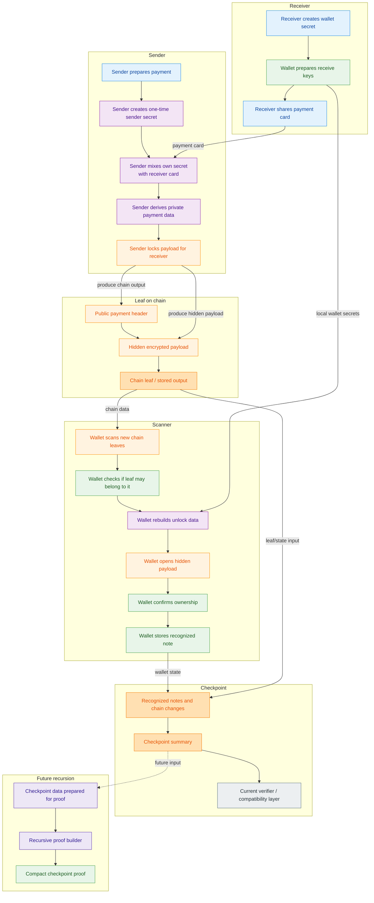

# Fix Spec 3: Stealth Gap Triage And Canonical Additions

**Status:** Draft for implementation  
**Date:** 2026-04-09  
**Scope:** Stealth-address hardening backlog limited to small, repository-backed additions that fit the current wallet and core architecture without importing speculative temp-doc seams.

## 🎯 Objective

Define an implementation-ready, repository-backed plan for the stealth-address gaps that are still worth addressing now.

This document has two jobs:

1. classify which remaining stealth topics are small canonical additions versus larger architecture branches that should not be presented as short-term fixes;
2. specify how to implement the small additions without reintroducing concept drift from `.planning/temp/` documents.

This spec is intentionally anchored to the current codebase. If any historical markdown conflicts with live code, live code wins.

## 🔍 Verified Claim Resolution

The following claim triage is verified against the current repository.

### ✅ Verified short additions worth doing now

1. narrow the receiver-secret exposure boundary around `reveal_receiver_secret(...)`;
2. expand canonical golden-vector coverage beyond `owner_handle` and `view_sk` to additional stealth derivation seams;
3. either implement or explicitly defer the reserved `V2Memo` asset-pack decode path, because the version space already exists and the receive path currently rejects it.

### ⛔ Verified non-short additions

The following topics are real gaps or future branches, but they are not small additions and must not be framed as such:

1. PIR, OPRF, route-key, or bucket-routing inbox layers;
2. full Poseidon2-based or otherwise ZK-native `ZkPack` replacement;
3. a fully proof-native shipped OWF or checkpoint narrative equivalent to the strongest temp-doc language.

These are separate architecture workstreams, not finishing touches.

### 🚨 Corrective note: Poseidon2, 

Current live TODOs reference **Poseidon2**, .Live code:

```rust
//! ZkPack_v1: ChaCha20Poly1305 AEAD.
//! ZK-circuit path is reserved for Phase 2.
// TODO Phase 2: Replace ChaCha20Poly1305 (~50K ZK constraints) with Poseidon2-based AEAD.
// TODO Phase-1-ZK: Replace ChaCha20Poly1305 with Poseidon2 AEAD for OWF circuit parity.
```

Source: `crates/z00z_wallets/src/core/stealth/facade_zkpack.rs`

Коротко и по-junior.

1. Poseidon и Poseidon2 это одна семья идей: arithmetization-friendly hash functions для zero-knowledge circuits. Внешний источник по Poseidon2 прямо называет его “A Faster Version of the Poseidon Hash Function”, то есть это именно развитие Poseidon, а не чужая концепция.
2. Plonky3 это не “Poseidon3”. Это toolkit для proof systems, polynomial IOPs и STARK/PLONK-подобных схем. В нём могут использоваться разные hash primitives, в том числе Poseidon2.
3. Ваш stealth не “существует только на Poseidon2”. В живом коде он уже гибридный: ECDH даёт общий секрет, дальше KDF и теги завязаны на Poseidon2, а упаковка зашифрованного payload сейчас делается через ChaCha20Poly1305. Значит сама stealth-идея не прибита гвоздями к одному Poseidon2.
4. Но для этого репо текущая миграционная линия действительно Poseidon2, а не Poseidon3: live TODO в wallet ZkPack указывает именно на Poseidon2-based AEAD, и зависимости тоже содержат Poseidon2.
5. Поэтому правильная ментальная модель такая:
   stealth = протокол или feature;
   Poseidon2 = один из hash/KDF building blocks;
   Plonky3 = proof engine/toolkit для recursion и proving;
   recursive checkpoint proofs = отдельный верхний proof layer, а не автоматическая замена stealth-hash слоя.


Ниже самая полезная mental model для этого репо: не как для криптографа, а как для junior, который хочет понять, что здесь за что отвечает и как это собирается в одну систему.

**Главная мысль**

В z00z у тебя не “одна магическая криптосистема stealth”. У тебя есть несколько слоёв, и каждый слой решает свою задачу:

1. `stealth` это сам протокол получения и траты скрытого выхода.
2. `ECDH` отвечает за то, чтобы sender и receiver независимо получили один и тот же общий секрет.
3. `Poseidon2` сейчас в основном отвечает за derivation и binding: из общего секрета и контекста получить нужные ключи, теги, идентификаторы и associated data.
4. `ChaCha20Poly1305` сейчас отвечает за шифрование полезной нагрузки, которая лежит внутри stealth output.
5. `Plonky3` или recursion-слой, если он когда-нибудь будет введён, нужен не для “сделать stealth”, а для более верхнего доказательного слоя, например checkpoint или state-transition correctness.

Проще всего думать так: stealth это машина, а Poseidon2, ChaCha20Poly1305 и будущий recursion-layer это разные узлы внутри машины.

**Слои системы**

1. **Слой receiver identity**
   
   Здесь всё начинается с секрета получателя. Из одного `ReceiverSecret` строится bundle ключей: `owner_handle`, `view_sk`, `view_pk`, `identity_sk`, `identity_pk`. Это видно в stealth_keys_receiver.rs.

   Зачем это нужно:
   - `owner_handle` нужен как публичный routing handle.
   - `view_sk/view_pk` нужен, чтобы receiver мог распознавать свои outputs.
   - `identity_sk/identity_pk` нужен для подписи и экспорта `ReceiverCard`.

   Это не proof layer и не encryption layer. Это identity and routing layer.

2. **Слой публикации receiver card**
   
   Receiver не отправляет sender свой секрет. Он экспортирует карточку с публичными данными, которую sender может использовать для построения stealth output. Это делается через `export_receiver_card()` в stealth_keys_receiver.rs.

   Зачем это нужно:
   - sender должен знать, на кого строить stealth output;
   - receiver не должен раскрывать master secret.

3. **Слой общего секрета: ECDH**
   
   Это центральная stealth-идея. Sender генерирует ephemeral scalar `r`, получает `r_pub`, потом считает Diffie-Hellman с `view_pk` receiver’а. Receiver позже, увидев `r_pub` в leaf, делает симметричную операцию со своим `view_sk` и получает тот же shared secret. Это видно в sender/receiver flows в output_build.rs, output.rs и derivation code в ecdh.rs.

   Зачем это нужно:
   - sender и receiver получают одинаковый base secret без прямого обмена секретами;
   - именно это делает output “stealth”, потому что посторонний наблюдатель не может из публичных данных просто понять владельца.

   Это фундамент stealth-протокола. Без этого нет stealth.

4. **Слой derivation и binding: где сейчас живёт Poseidon2**
   
   После ECDH система получает не конечный “ключ на всё”, а промежуточный shared secret. Дальше из него и из контекста строятся конкретные значения:
   - `k_dh`
   - `owner_tag`
   - `asset_id`
   - `leaf_ad`
   - `pack_key`
   - `pack_nonce`
   - `tag16`
   - `s_out`

   Это видно в kdf.rs, facade_kdf.rs и hash_zk.rs.

   Именно здесь Poseidon2 сейчас наиболее важен. Его роль не “зашифровать payload”, а:
   - сделать domain-separated derivation;
   - связать значения с контекстом (`asset_id`, `serial_id`, `r_pub`, `c_amount`);
   - сделать выходы стабильными и проверяемыми;
   - обеспечить circuit-friendly hashing для будущих ZK use cases.

   То есть Poseidon2 здесь это прежде всего KDF and binding engine.

5. **Слой полезной нагрузки: что именно шифруется**
   
   Внутри stealth output есть plaintext-структура `AssetPackPlain`. Сейчас она содержит:
   - `value`
   - `blinding`
   - `s_out`

   Это видно в leaf.rs и build path в output_build.rs.

   Это важный момент: stealth output это не просто “адрес”. Это encrypted package с содержимым, которое receiver потом раскрывает.

6. **Слой payload encryption: где сейчас живёт ChaCha20Poly1305**
   
   После того как сформирован `AssetPackPlain`, он шифруется в `ZkPack`. Сейчас `ZkPack_v1` использует `ChaCha20Poly1305`, а `pack_key` и `nonce` для него выводятся через предыдущий derivation layer. Это видно в facade_zkpack.rs и facade_kdf.rs.

   Зачем это нужно:
   - держать `value`, `blinding`, `s_out` скрытыми;
   - дать receiver возможность их безопасно восстановить;
   - привязать ciphertext к контексту через AAD.

   Это уже encryption layer, а не hash layer.

   Именно поэтому фраза “stealth сидит только на Poseidon2” неверна. В живом коде stealth уже гибридный:
   - shared secret через ECDH;
   - derivation через Poseidon2;
   - encryption через ChaCha20Poly1305.

7. **Слой on-chain output shape**
   
   Итоговый stealth output содержит не весь plaintext, а заголовок и ciphertext. В output.rs это `TxStealthOutput` с полями:
   - `r_pub`
   - `owner_tag`
   - `tag16`
   - `enc_pack`
   - `c_amount`

   Зачем это нужно:
   - `r_pub` нужен receiver’у, чтобы восстановить shared secret;
   - `owner_tag` и `tag16` нужны как быстрые фильтры;
   - `enc_pack` хранит зашифрованный payload;
   - `c_amount` привязывает commitment к данным.

8. **Слой receive/scanning**
   
   Receiver не пытается расшифровать всё подряд вслепую. Сначала идут дешёвые фильтры, потом только более дорогой decode/decrypt path. Это видно в stealth_scanner.rs и stealth_scan_support.rs.

   Как это работает:
   - scanner берёт `r_pub`, `owner_tag`, `tag16`, `enc_pack`;
   - по `view_sk` и `r_pub` восстанавливает shared secret;
   - заново вычисляет нужные derived values;
   - если фильтры сходятся, пытается decrypt;
   - после decrypt проверяет pack и commitment opening.

   Это важно потому, что stealth wallet в реальности должен сканировать много leaves. Поэтому нужны быстрые предфильтры, иначе сканирование было бы слишком дорогим.

9. **Слой wallet-local ownership**
   
   Одного `owner_tag` недостаточно для сильной локальной проверки владения. В коде есть более сильная wallet-local проверка `verify_owner_two_factor(...)`, где одновременно используются:
   - receiver secret path;
   - восстановленный `s_out`.

   Это видно в output.rs.

   Зачем это нужно:
   - `owner_tag` хорош для фильтрации;
   - `s_out` нужен для более сильного факта “это действительно мой output”.

   Иначе говоря:
   - быстрый фильтр ≠ полное доказательство владения;
   - wallet-local acceptance сильнее, чем просто tag match.

10. **Слой state and checkpoints**
    
    После stealth-транзакций есть ещё слой состояния системы: state updates, checkpoints, finalized artifacts. Это уже не про “кто владелец stealth output”, а про “как доказать корректность перехода состояния системы”. Это видно в state_checkpoint.rs.

    Ключевая честная граница в текущем коде:
    - `cp_proof` сейчас это ещё не полноценный standalone authoritative recursive backend;
    - текущий checkpoint acceptance package-coupled;
    - honest closure на будущее прямо говорит, что для реального полного closure нужен отдельный authoritative checkpoint proof backend.

11. **Слой recursion/proving, где обсуждается Plonky3**
    
    Здесь и появляется `Plonky3-recursion`. По локальному README это не “новый stealth hash” и не “замена Poseidon2 внутри wallet”. Это потенциальный proof layer для:
    - checkpoint correctness;
    - state-transition correctness.

    Это видно в README.md и подтверждается текущим статусом в 032-scenario-1-crypto-status.md.

    Очень важно понять:
    - Plonky3 это proof toolkit;
    - Poseidon2 это hash primitive;
    - они не конкуренты одного уровня.

**Как это всё срастается в одну систему**

Если разложить flow по шагам, получается вот так:

```text
ReceiverSecret
  -> ReceiverKeys
  -> ReceiverCard (public data for sender)

SenderWallet + ReceiverCard
  -> generate r, r_pub
  -> ECDH(shared secret)
  -> derive k_dh / owner_tag / leaf_ad / pack_key / nonce / s_out
  -> build AssetPackPlain
  -> encrypt into ZkPack
  -> publish stealth output
```

Потом receiver делает обратную сторону:

```text
On-chain leaf
  -> read r_pub / owner_tag / tag16 / enc_pack / c_amount
  -> scan with ReceiverKeys
  -> recompute DH and derived values
  -> decrypt ZkPack
  -> recover AssetPackPlain
  -> verify commitment + local ownership
```

А уже после этого поверх транзакционного слоя можно строить state/checkpoint layer:

```text
accepted tx effects
  -> state delta
  -> checkpoint artifact
  -> future recursive proof layer
```

Вот это и есть правильная общая картина:
- stealth layer скрывает ownership and payload;
- checkpoint layer агрегирует state transition;
- recursion layer потенциально доказывает корректность checkpoint/state evolution.

**Что несёт каждый layer**

- `ReceiverKeys/ReceiverCard` несёт identity and routing.
- `ECDH` несёт shared secret agreement.
- `Poseidon2 derivation` несёт deterministic binding and context separation.
- `ChaCha20Poly1305` несёт confidentiality and integrity of payload.
- `scanner` несёт wallet-side discovery and decryption.
- `wallet-local ownership checks` несут сильную локальную уверенность, что output действительно твой.
- `checkpoint layer` несёт state transition packaging.
- `future recursion layer` должен нести succinct proof of state correctness, если проект до этого дойдёт.

**Практическая junior-формула**

Думай так:

- `stealth` = бизнес-механика скрытого получения и траты;
- `ECDH` = как sender и receiver договариваются о секрете;
- `Poseidon2` = как из этого секрета и контекста производятся нужные значения;
- `ChaCha20Poly1305` = как зашифровать payload;
- `Plonky3` = как в будущем строить proofs про корректность системы, а не просто про шифрование.

Именно поэтому в этом репо правильнее говорить не “что лучше: Poseidon2 или Poseidon3”, а:

1. какие части stealth stack сейчас завязаны на Poseidon2;
2. какие части вообще не завязаны на него;
3. какой proof layer нужен над checkpoint/state transition;
4. где проходят границы между wallet logic, crypto derivation и proof architecture.

**Source Map**

- Receiver key bundle: stealth_keys_receiver.rs
- Sender build path: output_build.rs
- Output structure and ownership checks: output.rs
- ECDH-derived secret path: ecdh.rs
- KDF and Poseidon2-derived bindings: kdf.rs
- Wallet pack key and nonce derivation: facade_kdf.rs
- Current encrypted pack facade: facade_zkpack.rs
- Scanner runtime path: stealth_scanner.rs
- Version-aware receive boundary: stealth_scan_support.rs
- Plain payload contract: leaf.rs
- Current checkpoint honesty boundary: state_checkpoint.rs
- Recursion design track: README.md
- Honest current status: 032-scenario-1-crypto-status.md

Если хотите, следующий шаг я могу сделать в одном из двух форматов:
1. нарисовать это как одну большую Mermaid-схему “receiver -> sender -> leaf -> scanner -> checkpoint -> recursion”

```mermaid
flowchart LR
  subgraph R[Receiver]
    R0[ReceiverSecret]
    R1[ReceiverKeys]
    R2[ReceiverCard\nview_pk + spend_pk + hints]
    R0 --> R1 --> R2
  end

  subgraph S[Sender]
    S0[Payment intent\nasset + amount + note]
    S1[Ephemeral scalar r]
    S2[ECDH with receiver view_pk]
    S3[Shared secret]
    S4[Poseidon2 derivation\nk_dh + owner_tag + leaf_ad]
    S5[Poseidon2 pack derivation\npack_key + pack_nonce + s_out]
    S6[AssetPackPlain\nprivate payload]
    S7[ZkPack v1\nChaCha20Poly1305 encrypt]
    S0 --> S1 --> S2 --> S3 --> S4 --> S5 --> S6 --> S7
  end

  subgraph L[Leaf / On-chain output]
    L0[TxStealthOutput header\nR + owner_tag + hints + tag16]
    L1[Encrypted pack\nenc_pack]
    L2[Leaf / note commitment input]
    L0 --> L1 --> L2
  end

  subgraph C[Scanner / Wallet receive path]
    C0[Scanner reads chain leaves]
    C1[Rebuild shared secret\nfrom R + receiver view_sk]
    C2[Recompute Poseidon2 tags\nand derive decrypt material]
    C3[Decrypt ZkPack]
    C4[Ownership check\nwallet-local verification]
    C5[Wallet note state\nrecognized output]
    C0 --> C1 --> C2 --> C3 --> C4 --> C5
  end

  subgraph K[Checkpoint layer]
    K0[Collected leaves / state delta]
    K1[Checkpoint bytes / summary]
    K2[Today: compatibility verifier\nno standalone recursive proof claimed]
    K0 --> K1 --> K2
  end

  subgraph P[Future recursion layer]
    P0[Checkpoint witness]
    P1[Plonky3 recursion circuit]
    P2[Recursive checkpoint proof]
    P0 --> P1 --> P2
  end

  R2 -->|public receiver card| S2
  S4 -->|bind owner + leaf context| L0
  S5 -->|encrypt private payload| L1
  S1 -->|publish R| L0
  L2 -->|included in chain| C0
  R1 -->|receiver secret material| C1
  C5 -->|recognized notes feed state| K0
  L2 -->|leaf/state inputs| K0
  K1 -. future proof input .-> P0

  style R0 fill:#E3F2FD,stroke:#1E88E5,stroke-width:1px,color:#0D47A1
  style R1 fill:#EDE7F6,stroke:#5E35B1,stroke-width:1px,color:#311B92
  style R2 fill:#E3F2FD,stroke:#1E88E5,stroke-width:1px,color:#0D47A1
  style S0 fill:#E3F2FD,stroke:#1E88E5,stroke-width:1px,color:#0D47A1
  style S1 fill:#F3E5F5,stroke:#8E24AA,stroke-width:1px,color:#4A148C
  style S2 fill:#EDE7F6,stroke:#5E35B1,stroke-width:1px,color:#311B92
  style S3 fill:#EDE7F6,stroke:#5E35B1,stroke-width:1px,color:#311B92
  style S4 fill:#EDE7F6,stroke:#5E35B1,stroke-width:1px,color:#311B92
  style S5 fill:#EDE7F6,stroke:#5E35B1,stroke-width:1px,color:#311B92
  style S6 fill:#F3E5F5,stroke:#8E24AA,stroke-width:1px,color:#4A148C
  style S7 fill:#FFF3E0,stroke:#FB8C00,stroke-width:1px,color:#E65100
  style L0 fill:#FFF3E0,stroke:#FB8C00,stroke-width:1px,color:#E65100
  style L1 fill:#FFF3E0,stroke:#FB8C00,stroke-width:1px,color:#E65100
  style L2 fill:#FFE0B2,stroke:#F57C00,stroke-width:1px,color:#E65100
  style C0 fill:#FFF3E0,stroke:#FB8C00,stroke-width:1px,color:#E65100
  style C1 fill:#EDE7F6,stroke:#5E35B1,stroke-width:1px,color:#311B92
  style C2 fill:#EDE7F6,stroke:#5E35B1,stroke-width:1px,color:#311B92
  style C3 fill:#FFF3E0,stroke:#FB8C00,stroke-width:1px,color:#E65100
  style C4 fill:#E8F5E9,stroke:#43A047,stroke-width:1px,color:#1B5E20
  style C5 fill:#E8F5E9,stroke:#43A047,stroke-width:1px,color:#1B5E20
  style K0 fill:#FFE0B2,stroke:#F57C00,stroke-width:1px,color:#E65100
  style K1 fill:#FFE0B2,stroke:#F57C00,stroke-width:1px,color:#E65100
  style K2 fill:#ECEFF1,stroke:#546E7A,stroke-width:1px,color:#263238
  style P0 fill:#EDE7F6,stroke:#5E35B1,stroke-width:1px,color:#311B92
  style P1 fill:#EDE7F6,stroke:#5E35B1,stroke-width:1px,color:#311B92
  style P2 fill:#E8F5E9,stroke:#43A047,stroke-width:1px,color:#1B5E20
```






---

### ⛔ Poseidon3-only unification is not part of this spec

The repository does not currently support a short-path rewrite that removes Poseidon2 and re-centers the stealth backlog on Poseidon3 only.

Verified reasons:

1. the live wallet `ZkPack` migration markers point to Poseidon2, not Poseidon3;
2. the shipped hash and KDF surfaces already depend on Poseidon2 across `z00z_crypto`, `z00z_core`, and `z00z_wallets`;
3. the recursive-proof track is documented as a separate checkpoint or state-transition proof layer, not as a drop-in rewrite of the current wallet stealth hash stack;
4. the repository explicitly says that no live recursive checkpoint proof system is currently claimed.

Concrete repository evidence:

```toml
p3-poseidon2 = "0.4.2"
```

Source: `crates/z00z_crypto/Cargo.toml`

```text
Если твой выбор это `Plonky3-recursion`, то от тебя требуется не “подключить библиотеку”, а зафиксировать новый proof layer для `z00z`.
...
скорее всего не приватный spend per tx, а state-transition / checkpoint correctness поверх текущего transaction layer.
```

Source: `crates/z00z_core/src/recursive_proofs/README.md`

```text
2. No recursive checkpoint proof system is claimed.
```

Source: `docs/code-review/032-scenario-1-crypto-status.md`

Therefore this spec must stay anchored to the live Poseidon2 migration notes and the current wallet-core boundaries.

If the project later wants a Poseidon3-only direction, that must open a separate architecture phase with all of the following explicitly approved first:

1. the exact recursive proof statement;
2. the checkpoint or state-transition public input contract;
3. the migration plan for existing Poseidon2 callsites and test vectors;
4. the rule for what remains on the current stack versus what moves into the new recursive layer.

## ✅ Verified Baseline

The following repository facts are the baseline for this spec.

1. The canonical receiver bundle is `ReceiverKeys` in `crates/z00z_wallets/src/core/key/stealth_keys_receiver.rs`.
2. The canonical sender-side stealth builder is already live in `crates/z00z_wallets/src/core/stealth/output_build.rs` and `output.rs`.
3. Request-bound routing and validation are already implemented through `PaymentRequest` and the request-aware sender/receive flow.
4. Drift-guard tests already exist and verify parity for `owner_handle`, `view_sk`, and selected tag behavior.
5. `AssetPackVersion::V2Memo` is already reserved at the `serial_id` version-detection layer, but the receive path currently rejects it.

Relevant live snippets:

```rust
/// Returns the underlying receiver secret for internal wallet flows.
pub fn reveal_receiver_secret(&self) -> &ReceiverSecret {
    self.receiver_secret.reveal()
}
```

Source: `crates/z00z_wallets/src/core/key/stealth_keys_receiver.rs`

```rust
#[test]
fn test_rid_domain_parity() {
    let sec = [0x22u8; 32];
    let recv = ReceiverSecret::from_bytes(sec).expect("receiver secret");
    let wallet_hash = derive_owner_handle(&recv);
    let consensus_hash = hash_zk::<ReceiverIdDomain>("", &[&sec]);
    assert_eq!(wallet_hash, consensus_hash);
}
```

```rust
#[test]
fn test_view_drift_fail() {
    let sec = [0x22u8; 32];
    let recv = ReceiverSecret::from_bytes(sec).expect("receiver secret");
    let wallet = derive_view_secret_key(&recv).expect("wallet sk").to_bytes();

    let good = view_ctx(&sec, "");
    let drift = view_ctx(&sec, "VIEW");

    assert_eq!(wallet, good);
    assert_ne!(wallet, drift);
}
```

Source: `crates/z00z_wallets/tests/test_spec_terms_guard.rs`

```rust
pub enum AssetPackVersion {
    V1Basic,
    V2Memo,
    Unknown,
}

pub fn validate_serial_id_version(serial_id: u32) -> AssetPackVersion {
    match serial_id {
        0..=999_999 => AssetPackVersion::V1Basic,
        1_000_000..=1_999_999 => AssetPackVersion::V2Memo,
        _ => AssetPackVersion::Unknown,
    }
}
```

Source: `crates/z00z_core/src/assets/version.rs`

```rust
AssetPackVersion::V2Memo => {
    // TODO(phase16): implement V2 memo layout decoder when V2 wire format is finalized.
    debug!(serial_id, "scan skip: v2 asset pack unsupported");
    false
}
```

Source: `crates/z00z_wallets/src/core/address/stealth_scan_support.rs`

## 🧭 Anti-Drift Rules

These rules are mandatory while executing this spec.

1. Do not describe PIR, OPRF, route-key, bucket-routing, or private retrieval helpers as if they already have a live crate surface.
2. Do not describe Poseidon2 `ZkPack` as already implemented.
3. Do not describe the current checkpoint path as if a fully authoritative shipped recursive proof backend already exists.
4. Do not describe `reveal_receiver_secret(...)` as public API by design; current code explicitly says it exists for internal wallet flows.
5. Do not invent a new `AssetPackPlainV2` module path unless the implementation actually creates one.
6. Do not move stealth formulas out of current canonical owners such as `z00z_wallets::core::stealth::*` and `z00z_crypto::*` just to satisfy old temp-doc architecture.

## 📌 What Memo Path Means In This Repository

### ✅ Current meaning

`memo path` in the current tree means one specific thing:

- the protocol already reserves a **second encrypted asset-pack format lane** via `AssetPackVersion::V2Memo`;
- this lane is detected from `serial_id` range;
- the receive detector currently refuses to decode it because the concrete wire layout is not finalized.

That means memo is **not** currently a public address feature, and it is **not** the same thing as `PaymentRequest.metadata.memo`.

Current guidance in wallet docs already rejects the idea of putting memo directly into the address layer:

```text
В текущем формате memo не является частью payload. Если нужно — храните метаданные вне адреса (invoice/DB/tx notes).
```

Source: `crates/z00z_wallets/src/core/address/Z00Z-ADDRESS-GUIDE.md`

### 🎯 Why memo path may be needed

Memo path is useful only if the project wants **encrypted per-output user metadata** that travels with the confidential asset pack rather than staying solely in request metadata or local wallet notes.

Concrete use-cases that fit the current architecture:

1. merchant invoice reconciliation when one wallet needs a human-readable or machine-readable note bound to a received output;
2. offline transaction exchange where the receiver wants a private memo to survive package transport and later import;
3. support or enterprise workflows where an internal payment reference must follow the output without becoming public leaf metadata;
4. wallet UI history where decrypted output records need a receiver-visible note not present in the public chain state.

### 👥 Who actually needs it

Memo path is mainly for:

1. wallet UI and wallet history features;
2. invoice and merchant tooling built on `PaymentRequest` flows;
3. offline package exchange or operator-assisted handoff where context may otherwise be lost;
4. enterprise or regulated workflows that need a private reference bound to the receiver-side decrypted payload.

Memo path is **not required** for the minimal confidential-coin send and receive flow.

### ⛔ What memo path must not become

1. It must not turn the address or `ReceiverCard` into a metadata carrier.
2. It must not leak memo into public leaf fields.
3. It must not collapse into wallet-local notes only, if the goal is portable encrypted metadata.
4. It must not bypass the existing `AssetPackPlain` V1 wire contract for current outputs.

## 🏗️ Workstream A: Narrow `reveal_receiver_secret(...)`

### Why Workstream B Matters

`reveal_receiver_secret(...)` is the clearest remaining misuse surface because it exposes the root receiver secret from the aggregated receiver-key bundle as a public method.

Current code:

```rust
/// Returns the underlying receiver secret for internal wallet flows.
pub fn reveal_receiver_secret(&self) -> &ReceiverSecret {
    self.receiver_secret.reveal()
}
```

The doc comment already says the method is for internal wallet flows, but the visibility is wider than that statement implies.

### Why this is not a one-line edit

Current repository usage shows the method is still referenced by integration-style tests and internal rotation logic. A direct change from `pub` to `pub(crate)` would likely break test consumers immediately.

Verified current uses include:

- `crates/z00z_wallets/src/core/key/stealth_keys_receiver.rs`
- `crates/z00z_wallets/tests/test_view_key_contract.rs`
- `crates/z00z_wallets/tests/test_e2e_send_scan.rs`
- `crates/z00z_wallets/tests/test_scenario1_semantics.rs`

### Target state

Final target state:

1. production callers inside the crate can still access the receiver secret where strictly required;
2. external integration tests stop depending on the general public method;
3. the receiver secret is no longer exported as a broad public convenience method.

### Implementation plan

#### Phase A1. Inventory and separate internal from test-only usage

Files to inspect and update:

- `crates/z00z_wallets/src/core/key/stealth_keys_receiver.rs`
- `crates/z00z_wallets/tests/test_view_key_contract.rs`
- `crates/z00z_wallets/tests/test_e2e_send_scan.rs`
- `crates/z00z_wallets/tests/test_scenario1_semantics.rs`

Required output of this step:

1. list every callsite;
2. classify it as production-internal, crate-internal helper, or test-only.

#### Phase A2. Introduce a narrower internal seam

Recommended direction:

```rust
pub(crate) fn reveal_receiver_secret(&self) -> &ReceiverSecret {
    self.receiver_secret.reveal()
}
```

But do **not** apply this until Phase A3 is complete.

If tests still need access after migration, prefer a clearly marked test-only seam rather than keeping a broad public method forever.

Illustrative target:

```rust
#[cfg(any(test, feature = "test-fast"))]
pub fn reveal_receiver_secret_for_tests(&self) -> &ReceiverSecret {
    self.receiver_secret.reveal()
}
```

This snippet is a design direction, not a claim that such a method already exists.

#### Phase A3. Migrate test callers

The preferred migration order is:

1. replace external tests that can derive from a known seed with direct `ReceiverSecret::from_bytes(...)` reconstruction;
2. move truly internal assertions closer to unit tests when practical;
3. only keep an explicit test seam when reconstruction would erase the intent of the test.

#### Phase A4. Tighten visibility and freeze contract comments

After test migration, change the live method visibility and update comments so the contract cannot drift back into a public convenience surface.

### Acceptance Checks For Workstream B

1. no production public API exposes `ReceiverSecret` through `ReceiverKeys` without an explicit narrow justification;
2. integration tests still pass via reconstructed secrets or explicit test-only seams;
3. rustdoc comments no longer conflict with visibility.

## 🧪 Workstream B: Expand Golden Vectors For Stealth Derivations

### Why Workstream C Matters

The repository already uses drift tests successfully. The next step is to extend that same pattern to additional stealth derivation seams that currently rely on implicit stability.

Current baseline examples already exist for:

1. `owner_handle` and `view_sk` parity in `crates/z00z_wallets/tests/test_spec_terms_guard.rs`;
2. `leaf_ad` golden vectors in `crates/z00z_wallets/tests/test_serial_leaf_ad.rs` and `crates/z00z_wallets/tests/fixtures/leaf_ad_vectors.yaml`;
3. drift matrices in `crates/z00z_wallets/tests/test_tx_drift.rs`.

### Target formulas to freeze

This workstream should freeze vectors for:

1. `derive_k_dh(...)`
2. `derive_k_dh_with_req(...)`
3. `derive_s_out(...)`
4. `compute_owner_tag(...)`
5. `compute_tag16(...)`
6. `compute_tag16_with_req(...)`
7. `compute_leaf_ad(...)`

### Files to modify or add

Primary files:

- `crates/z00z_wallets/tests/test_spec_terms_guard.rs`
- `crates/z00z_wallets/tests/test_serial_leaf_ad.rs`
- `crates/z00z_wallets/tests/test_tx_drift.rs`

Recommended new files:

- `crates/z00z_wallets/tests/test_stealth_kdf_vectors.rs`
- `crates/z00z_wallets/tests/fixtures/stealth_kdf_vectors.yaml`

Optional artifact output directory, if you want drift reports similar to existing E2E tests:

- `crates/z00z_wallets/outputs/tests/e2e16/`

### Fixture format recommendation

Reuse the existing fixture style already used by `leaf_ad_vectors.yaml`.

Suggested fixture shape:

```yaml
spec_version: "stealth-kdf-v1"
vectors:
  - label: "base-card"
    dh_hex: "..."
    req_id_hex: null
    k_dh_hex: "..."
    r_pub_hex: "..."
    serial_id: 42
    s_out_hex: "..."
    owner_handle_hex: "..."
    owner_tag_hex: "..."
    leaf_ad_hex: "..."
    tag16: 12345
  - label: "request-bound"
    dh_hex: "..."
    req_id_hex: "..."
    k_dh_hex: "..."
    r_pub_hex: "..."
    serial_id: 42
    s_out_hex: "..."
    owner_handle_hex: "..."
    owner_tag_hex: "..."
    leaf_ad_hex: "..."
    tag16_with_req: 54321
```

### Test shape recommendation

Recommended test responsibilities:

1. parity tests comparing live function output to frozen fixture values;
2. negative drift tests where the domain string or argument order is intentionally wrong;
3. request-bound versus card-bound divergence tests proving that different contexts do not collapse into one result.

Illustrative live pattern to reuse:

```rust
#[test]
fn test_tag_order_gap() {
    let k_dh = [0x44u8; 32];
    let leaf_ad = [0x55u8; 32];
    let norm = compute_tag16(&k_dh, &leaf_ad);
    let swap = compute_tag16(&leaf_ad, &k_dh);
    assert_ne!(norm, swap);
}
```

### Acceptance Checks For Workstream C

1. every canonical stealth derivation listed above has at least one frozen fixture-backed vector;
2. at least one negative drift test exists per formula family;
3. wallet and any future proof implementation now have a frozen reference surface to target.

## 📨 Workstream C: Define And Implement The V2 Memo Decode Boundary

### Why this is worth doing

This is not a greenfield idea. The version lane already exists in `z00z_core`, but the wallet scan boundary still rejects it.

Current split state:

1. `z00z_core` reserves `V2Memo` in `serial_id` space;
2. `z00z_wallets` detects that version and skips it;
3. there is no canonical decoded V2 memo payload contract yet.

That makes V2 memo a legitimate repository gap, not a speculative product request.

### Meaningful target state

The smallest correct target is:

1. define a canonical encrypted plaintext structure for memo-capable packs;
2. add strict decode support for that structure;
3. wire receive detection so V2 memo outputs stop being auto-rejected when the wire format is finalized.

### Files to modify

Core contract files:

- `crates/z00z_core/src/assets/leaf.rs`
- `crates/z00z_core/src/assets/version.rs`
- `crates/z00z_core/src/assets/mod.rs`

Wallet receive files:

- `crates/z00z_wallets/src/core/address/stealth_scan_support.rs`
- `crates/z00z_wallets/src/core/address/stealth_scanner.rs`

Potential new tests:

- `crates/z00z_core/src/assets/test_wire.rs`
- `crates/z00z_wallets/tests/test_asset_pack_v2_memo.rs`

### Recommended implementation shape

#### Phase C1. Keep V1 stable and add V2 side-by-side

Do not mutate `AssetPackPlain` in place. V1 is consensus-critical and already live.

Current V1 baseline:

```rust
pub struct AssetPackPlain {
    pub value: u64,
    pub blinding: [u8; 32],
    pub s_out: [u8; 32],
}
```

Add a separate type for V2 memo-capable payload instead of widening V1.

Recommended direction:

```rust
pub struct AssetPackPlainV2Memo {
    pub value: u64,
    pub blinding: [u8; 32],
    pub s_out: [u8; 32],
    pub memo: Vec<u8>,
}
```

This snippet is proposed target shape, not a claim that the type already exists.

#### Phase C2. Add strict version-aware decode entrypoints

Recommended core API direction:

1. keep existing V1 decode helpers untouched;
2. add version-aware helpers that branch on `AssetPackVersion`;
3. keep malformed or oversized memo payloads fail-closed.

Illustrative target shape:

```rust
pub enum DecodedAssetPack {
    V1Basic(AssetPackPlain),
    V2Memo(AssetPackPlainV2Memo),
}
```

#### Phase C3. Wire wallet receive path to decoded variants

`stealth_scan_support.rs` should stop rejecting V2Memo once a canonical decoder exists.

Current code to replace:

```rust
AssetPackVersion::V2Memo => {
    debug!(serial_id, "scan skip: v2 asset pack unsupported");
    false
}
```

Target behavior:

1. V1Basic continues unchanged;
2. V2Memo is allowed only when the decode and commitment-opening contract are complete;
3. wallet output structures preserve memo as optional decrypted metadata rather than public state.

### Memo payload rules

The canonical V2 memo payload must obey these rules:

1. memo stays encrypted inside `enc_pack`;
2. memo is not copied into public leaf fields;
3. memo parsing is bounded and fail-closed;
4. memo is optional and wallet-facing, not consensus-defining in meaning;
5. V1 outputs remain valid and unchanged.

### Who should consume the memo after decryption

The first consumers should be wallet-local surfaces, not consensus surfaces:

1. receive history and UI;
2. invoice or payment reconciliation;
3. offline package import or support tooling.

### Acceptance checks

1. V2Memo is represented by a concrete decoded type, not a TODO comment;
2. V1 behavior is unchanged;
3. receive path can classify and decode V2Memo without public metadata leakage;
4. malformed memo payloads fail closed.

## ⛔ Explicitly Out Of Scope For This Spec

The following items must not be silently pulled into this spec or its backlog:

1. PIR inbox or private retrieval networks;
2. OPRF-based helper routing;
3. bucket-routing or route-key layers;
4. a full Poseidon2 `ZkPack` migration;
5. a fully shipped proof-native OWF or checkpoint backend.

These are valid future topics, but they are not the small canonical additions covered here.

## ✅ Recommended Execution Order

Execute this spec in the following order:

1. Workstream A: `reveal_receiver_secret(...)` inventory and narrowing plan;
2. Workstream B: freeze missing stealth derivation vectors;
3. Workstream C: define the V2 memo contract and only then enable receive support.

This order is intentional.

1. Workstream A reduces secret-exposure ambiguity.
2. Workstream B freezes canonical derivation truth before more stealth evolution happens.
3. Workstream C extends functionality only after the existing formulas are better frozen.

## 📎 Source Map

Primary live sources for this spec:

- `crates/z00z_wallets/src/core/key/stealth_keys_receiver.rs`
- `crates/z00z_wallets/src/core/address/stealth_scan_support.rs`
- `crates/z00z_wallets/src/core/address/stealth_scanner.rs`
- `crates/z00z_wallets/src/core/stealth/facade_zkpack.rs`
- `crates/z00z_wallets/tests/test_spec_terms_guard.rs`
- `crates/z00z_wallets/tests/test_serial_leaf_ad.rs`
- `crates/z00z_wallets/tests/fixtures/leaf_ad_vectors.yaml`
- `crates/z00z_wallets/tests/test_tx_drift.rs`
- `crates/z00z_core/src/assets/version.rs`
- `crates/z00z_core/src/assets/leaf.rs`
- `crates/z00z_wallets/src/core/address/Z00Z-ADDRESS-GUIDE.md`

## 🔗 TODO One-To-One Mapping

| 035-5 section | Task coverage | Mapping note |
| --- | --- | --- |
| `Objective` | `035-32`; `035-33`; `035-35`; `035-37` | freezes the narrow Phase 035 stealth-additions scope |
| `Verified Claim Resolution` | `035-32`; `035-40` | keeps only the worth-doing-now additions in scope |
| `Verified short additions worth doing now` | `035-33`; `035-35`; `035-37` | maps directly to the three live workstreams |
| `Verified non-short additions` | `035-32`; `035-40` | prevents future-topic creep from entering the backlog |
| `Corrective note: Poseidon2` | `035-32`; `035-40` | keeps Poseidon migration explicitly out of scope |
| `Verified Baseline` | `035-32`; `035-39` | preserves repo-backed starting facts before additions land |
| `Anti-Drift Rules` | `035-32`; `035-39`; `035-40` | blocks memo, secrecy, and proof-scope drift |
| `What Memo Path Means In This Repository` | `035-37`; `035-38`; `035-39` | defines the V2 memo contract before receive-path wiring |
| `Workstream A: Narrow \`reveal_receiver_secret(...)\`` | `035-33`; `035-34`; `035-39`; `035-40` | maps the receiver-secret seam work and acceptance checks |
| `Workstream B: Expand Golden Vectors For Stealth Derivations` | `035-35`; `035-36`; `035-39`; `035-40` | maps the vector-freeze and drift-regression work |
| `Workstream C: Define And Implement The V2 Memo Decode Boundary` | `035-37`; `035-38`; `035-39`; `035-40` | maps contract definition, receive enablement, and validation |
| `Explicitly Out Of Scope For This Spec` | `035-32`; `035-40` | preserves hard boundaries against adjacent future features |
| `Recommended Execution Order` | `035-32`; `035-33`; `035-35`; `035-37`; `035-40` | keeps the intended A -> B -> C ordering explicit |
| `Source Map` | `035-33`; `035-34`; `035-35`; `035-36`; `035-37`; `035-38`; `035-39` | grounds each workstream in live repository artifacts |
