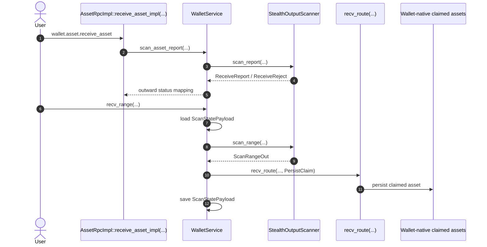
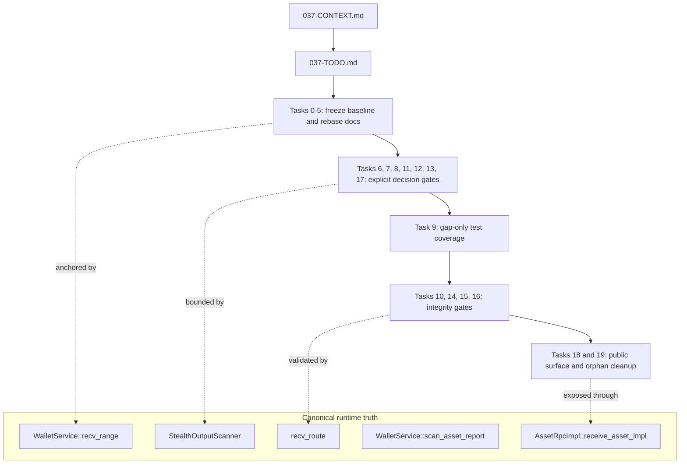
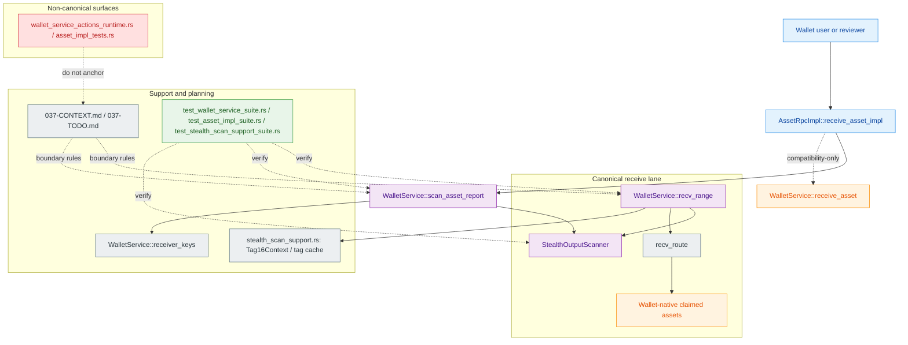

# Phase 037: Output Reception — Technical Story

This document is the narrative companion to the Phase 037 planning set:
[037-CONTEXT.md](037-CONTEXT.md), [037-TODO.md](037-TODO.md),
[037-TEST-SPEC.md](037-TEST-SPEC.md), [037-TEST-PLAN.md](037-TEST-PLAN.md), and
[037-TESTS-TASKS.md](037-TESTS-TASKS.md). It tells the story of how the phase
keeps receive truth singular, prevents architectural drift, and turns missing
coverage into a controlled execution sequence.

Phase 037 is not a new receive architecture. It is a planning-led, review-locked
phase that aligns the live wallet receive seams, the public RPC boundary, and
the future test contract around the same canonical story.

## Glossary

Start here if you are onboarding to the phase or reviewing whether a change is
still inside the canonical receive story. The glossary explains the symbols and
terms in plain language, with a short note about who uses each one and when it
comes into play.

| Term | What it does | Who uses it and when |
| --- | --- | --- |
| `WalletService::recv_range(...)` | The canonical request-aware range receive path. It owns the privacy-lane flow for scanning a range, loading and saving progress, and handing owned outputs to the persistence gate. | Used by the wallet service when a real range receive run should follow the canonical lane, especially after a restart or when the phase needs the single source of truth for receive behavior. |
| `StealthOutputScanner` | The ownership detector. It inspects candidate outputs and decides whether they belong to the wallet or should be rejected as foreign. | Used by both the range lane and the report lane whenever the service needs a structured ownership verdict instead of a raw output list. |
| `recv_route(...)` | The persistence gate between detection and storage. It turns a scan result into either `ReportOnly` or `PersistClaim`. | Used after the scanner has already classified the output, so the phase can keep detection separate from persistence. |
| `WalletService::scan_asset_report(...)` | The report-only single-asset scan path. It returns outward status for the public adapter without becoming the canonical privacy lane. | Used when the public RPC path needs a compatibility-shaped status answer, for example when `wallet.asset.receive_asset` is called. |
| `WalletService::receiver_keys(...)` | The receiver-key boundary shared by service and adapter logic. It supplies the key material and helpers needed for request-aware scanning. | Used whenever scanning needs receiver-side key information before the scanner can decide whether an output matches the wallet. |
| `AssetRpcImpl::receive_asset_impl(...)` | The outward RPC adapter for `wallet.asset.receive_asset`. It exposes the public compatibility surface and forwards status, but it does not own the privacy-lane truth. | Used by external callers that only need the public single-asset API and by review flows that inspect the adapter boundary. |
| `WalletService::receive_asset(...)` | The compatibility-only helper that still exists for reachability and legacy behavior. It is not the canonical privacy-lane implementation. | Used only when the code needs to preserve outward compatibility while keeping the real receive story anchored in `recv_range(...)` and `scan_asset_report(...)`. |
| `ScanStatePayload` | The persisted receive-progress snapshot. It supports load, save, and resume behavior for the canonical range flow. | Used when a receive run must continue after interruption or when the phase needs to prove that state is not lost between scans. |
| `Tag16Context` | The concrete context required for strict tag-based receive to become real. It turns tag metadata from liveness information into actionable matching state. | Used when request tags are registered and the scanner needs a concrete context before it can trust tag-only matching. |
| `OptimizedScanner` | A batching wrapper around the canonical scanner flow. It can accelerate scanning, but it must not silently replace the ownership engine. | Used only if the phase explicitly decides to keep it as an optimization layer behind the canonical receive path. |
| `ScanEngineImpl` | The stub-truth scan engine placeholder. It should not be described as a second authoritative implementation while it still behaves like a placeholder. | Used only as a delegate target or a de-scoped surface until the phase decides whether to wire it back into the canonical path. |
| `ReceiveReport`, `ReceiveReject`, `ScanRangeOut` | The structured results that move between the service, the scanner, and the route. They carry owned, foreign, and range-scan outcomes without collapsing them into one generic status. | Used whenever the service needs to pass a scan verdict forward without losing the reason or the boundary that produced it. |
| `ReportOnly` / `PersistClaim` | The persistence-gate states. They separate “tell the caller what happened” from “write the claim to storage.” | Used after detection, when the phase needs to decide whether an owned output should be persisted or only reported. |
| `InvalidInput`, `InvalidProof`, `RuntimeFail`, `NotMine` | The outcome classes for diagnostics and observability. The first three are operator-facing failures; `NotMine` is the foreign-output case that should stay quiet unless the phase explicitly decides otherwise. | Used when the phase needs to distinguish actionable failures from ordinary foreign outputs. |
| `wallet_service_actions_receive.rs` | The live module that owns the canonical receive behavior. It is the best place for receive-path changes. | Used when behavior must change in the real receive lane instead of in a wrapper or an orphan surface. |
| `wallet_service_actions_reachability.rs` | The module that owns the persistence decision point. | Used when a scan result must be classified as report-only or persistable. |
| `wallet_service_actions_receiver.rs` | The live receiver-key seam shared by the service and adapter flows. | Used when receive logic needs the wallet-side key boundary before it can scan or report. |
| `stealth_scan_support.rs` and `types_tag_cache.rs` | The helper layer for request ordering, tag matching, and low-level candidate selection. | Used when the canonical scanner needs support code rather than new receive policy. |

### Term-based examples

- Public compatibility receive: a wallet client calls `AssetRpcImpl::receive_asset_impl(...)`, the adapter forwards into `WalletService::scan_asset_report(...)`, and the user gets an outward status without the compatibility surface becoming the canonical privacy lane.
- Canonical range receive: the wallet service starts `WalletService::recv_range(...)`, loads `ScanStatePayload`, asks `StealthOutputScanner` to classify candidates, and passes the result through `recv_route(...)` so only owned outputs become persisted claims.
- Resume after interruption: a scan stops halfway through, the saved `ScanStatePayload` is loaded again, and the next run continues from the same request-aware state instead of starting a new interpretation of the wallet state.
- Strict tag-based receive: a request arrives with tag metadata, `Tag16Context` is registered, and the helper layer can now treat the tag as meaningful matching context instead of only liveness noise.
- Review and cleanup scenario: a reviewer sees `wallet_service_actions_runtime.rs` or `asset_impl_tests.rs` referenced in a discussion and checks whether the phase is trying to anchor truth on an orphan surface instead of the canonical lane.

## 1. What this is

Phase 037 is the chapter where the repository stops treating output reception as
an open-ended design discussion and starts treating it as a bounded system with
one accepted path for each job.

The phase answers six practical questions:

| Question | Answer |
| --- | --- |
| Who owns the canonical receive story? | `WalletService::recv_range(...)`, `StealthOutputScanner`, `recv_route(...)`, `WalletService::scan_asset_report(...)`, `WalletService::receiver_keys(...)`, and `AssetRpcImpl::receive_asset_impl(...)`. |
| What is the phase trying to protect? | One canonical range receive lane, one persistence gate, one public single-asset RPC surface, and one truthful test contract. |
| When does this matter? | Before new receive ideas are allowed to drift into duplicate layers, speculative APIs, or orphaned surfaces. |
| Where does the work live? | In `.planning/phases/037-output-reception/` for planning truth and in `crates/z00z_wallets/` for live runtime truth. |
| Why does the phase exist? | To freeze baseline truth, resolve ambiguous boundaries, and keep docs/tests aligned with the code that actually runs. |
| How does it work? | By sequencing mandatory backlog tasks, marking decision gates explicitly, and using the test contract to add only missing coverage. |

The important idea is simple: the phase does not invent a second receive system. It explains and protects the one that already exists.

## 2. Knowledge map

| Concept | Canonical files or symbols | Story role |
| --- | --- | --- |
| Baseline freeze | [037-CONTEXT.md](037-CONTEXT.md), [037-TODO.md](037-TODO.md) | Locks the live receive baseline so planning does not reopen already-implemented surfaces. |
| Range receive | `crates/z00z_wallets/src/services/wallet_service_actions_receive.rs` | The main privacy receive lane: request-aware, range-based, and canonical. |
| Ownership detection | `crates/z00z_wallets/src/core/address/stealth_scanner.rs` | The detector that decides whether an output belongs to the wallet. |
| Persistence gate | `crates/z00z_wallets/src/services/wallet_service_actions_reachability.rs` | The `ReportOnly` versus `PersistClaim` decision point. |
| Receiver-key boundary | `crates/z00z_wallets/src/services/wallet_service_actions_receiver.rs` | The live key-derivation seam shared by service and RPC paths. |
| Public single-asset receive | `crates/z00z_wallets/src/adapters/rpc/methods/asset_impl_server_transfer.rs` | The outward `wallet.asset.receive_asset` surface, kept compatible but not canonical. |
| Request-aware helpers | `crates/z00z_wallets/src/core/address/stealth_scan_support.rs`, `types_tag_cache.rs` | Low-level request and tag matching logic that supports receive decisions. |
| Test anchors | `crates/z00z_wallets/src/services/test_wallet_service_suite.rs`, `crates/z00z_wallets/src/adapters/rpc/methods/test_asset_impl_suite.rs`, `crates/z00z_wallets/src/core/address/test_stealth_scan_support_suite.rs` | The suites that already prove baseline behavior and pin the unresolved gaps. |
| Planning contract | [037-TEST-SPEC.md](037-TEST-SPEC.md), [037-TEST-PLAN.md](037-TEST-PLAN.md), [037-TESTS-TASKS.md](037-TESTS-TASKS.md) | The test-side contract for what can be reused, extended, gated, or skipped. |
| Non-canonical traps | `wallet_service_actions_runtime.rs`, `asset_impl_tests.rs` | Orphan duplicate surfaces that must not become truth anchors. |

## 3. The story of the phase

### Act I: Freeze what already works

The first act is a truth-fixing act.

Phase 037 starts by saying: `WalletService::recv_range(...)` is already the canonical request-aware receive path, `StealthOutputScanner` is already the ownership detector, `recv_route(...)` is already the gate between detection and persistence, and `ScanStatePayload` resume/load/save behavior is already part of the implemented baseline.

This matters because planning can easily drift into pretending a live surface is still greenfield. Phase 037 refuses that drift. It treats the live service path, the scanner boundary, and the persistence gate as the ground beneath the backlog, not as optional ideas.

### Act II: Keep one canonical receive lane

The second act is about narrowing the story to one lane.

The public RPC path enters through `AssetRpcImpl::receive_asset_impl(...)`. That path is compatibility-shaped and exact-`asset_id` only. It reports outward status, but it does not become the privacy-lane source of truth.

The privacy-lane source of truth stays in `WalletService::recv_range(...)` and `WalletService::scan_asset_report(...)`. That is where request-aware range receive and single-asset reporting live. The phase preserves this split so the codebase does not quietly promote a convenience API into the canonical privacy path.

### Act III: Resolve the ambiguous edges explicitly

The third act is where the phase handles the pieces that are present but not yet fully settled.

`Tag16Context` materialization is one example. The docs say that `add_request(...)` is liveness metadata, not ownership proof. Strict tag-only receive only becomes real when a concrete `Tag16Context` is registered.

`OptimizedScanner` is another example. It exists as a batching wrapper, but Phase 037 does not let it become a second ownership engine by accident. The phase must decide whether it remains optional or becomes an explicitly integrated strategy behind the canonical flow.

`ScanEngineImpl` is the same kind of problem in a different costume. Today it is stub-truth, not a parity truth. Phase 037 must either de-scope it from the docs or make it a thin delegate over the canonical receive path. It must not be described as a second implementation authority while it still behaves like a placeholder.

### Act IV: Keep safety, ordering, and observability honest

The fourth act is about guardrails.

Receive detection must stay downstream of proof verification. `Detected` means ownership classification, not a final import verdict. `ReceiveNext::PersistClaim` remains the explicit persistence gate. `NotMine` remains noisy in the logs only if the repository has a specific reason to surface it; otherwise it stays silent.

Request-aware scanning also gets a truth check here. The phase calls out deterministic request ordering, expiry-aware candidate selection, and explicit `req_id = None` fallback behavior. That is the story of making request matching predictable instead of accidental.

Observability follows the same rule: only actionable failures deserve operator-facing hooks. `InvalidInput`, `InvalidProof`, and `RuntimeFail` are the meaningful signals; ordinary foreign outputs are not.

### Act V: Add only the missing tests

The final act is not “test everything again.” It is “test only the gaps that remain.”

The phase already has stable anchors for restart, persistence, exact `asset_id`, and baseline request behavior. The test contract therefore treats new coverage as gap-filling work, not duplication.

`Task 9` is the dependent coverage gate. It exists because test work should wait until the decision-gated tasks have settled. Its job is to extend the existing suites only where real gaps remain, not to clone scenarios already proven by the baseline anchors.

## 4. Flows

### Runtime receive flow

This sequence tells the core story in two halves:

- the public RPC half returns a status from the single-asset report lane
- the canonical range half scans, persists only through the gate, and saves progress

### Phase planning flow

The planning flow is deliberately sequential. The phase does not let the backlog fan out into parallel conceptual layers. It first freezes the truth, then forces yes/no decisions where the docs are ambiguous, then allows the missing tests to land, and only after that does it close the public and orphan surfaces.

### Relationship map

This view makes the structural links explicit. It shows the two receive lanes, the shared scanner and helpers, the public RPC entry point, and the places where tests and planning docs keep the story honest.

### Requirement trace

This view ties the phase's story back to the review contract. It shows which live seams satisfy the main receive requirements and which test suites verify that the relationships stay true.

```mermaid
requirementDiagram

requirement phase_req_1 {
    id: "P037-01"
    text: "Phase 037 shall keep WalletService::recv_range(...) as the canonical range receive lane."
    risk: Medium
    verifymethod: Inspection
}

requirement phase_req_2 {
    id: "P037-02"
    text: "Phase 037 shall keep the public wallet.asset.receive_asset path compatibility-only."
    risk: Medium
    verifymethod: Inspection
}

requirement phase_req_3 {
    id: "P037-03"
    text: "Phase 037 shall treat Task 9 as gap-only coverage after the decision gates settle."
    risk: Medium
    verifymethod: Inspection
}

requirement phase_req_4 {
    id: "P037-04"
    text: "Phase 037 shall keep orphan duplicate receive surfaces non-canonical unless rewired explicitly."
    risk: Medium
    verifymethod: Inspection
}

element runtime_truth {
    type: "WalletService::recv_range(...)\nStealthOutputScanner\nrecv_route(...)"
}

element adapter_truth {
    type: "AssetRpcImpl::receive_asset_impl(...)\nWalletService::scan_asset_report(...)"
}

element planning_truth {
    type: "037-CONTEXT.md\n037-TODO.md\n037-TEST-SPEC.md\n037-TEST-PLAN.md"
}

element test_truth {
    type: "test_wallet_service_suite.rs\ntest_asset_impl_suite.rs\ntest_stealth_scan_support_suite.rs"
}

runtime_truth - satisfies -> phase_req_1
adapter_truth - satisfies -> phase_req_2
planning_truth - satisfies -> phase_req_3
planning_truth - satisfies -> phase_req_4
test_truth - verifies -> phase_req_1
test_truth - verifies -> phase_req_2
test_truth - verifies -> phase_req_3
test_truth - verifies -> phase_req_4

style phase_req_1 fill:#E3F2FD,stroke:#1E88E5,stroke-width:1px,color:#0D47A1
style phase_req_2 fill:#E3F2FD,stroke:#1E88E5,stroke-width:1px,color:#0D47A1
style phase_req_3 fill:#E3F2FD,stroke:#1E88E5,stroke-width:1px,color:#0D47A1
style phase_req_4 fill:#E3F2FD,stroke:#1E88E5,stroke-width:1px,color:#0D47A1
style runtime_truth fill:#F3E5F5,stroke:#8E24AA,stroke-width:1px,color:#4A148C
style adapter_truth fill:#F3E5F5,stroke:#8E24AA,stroke-width:1px,color:#4A148C
style planning_truth fill:#ECEFF1,stroke:#546E7A,stroke-width:1px,color:#263238
style test_truth fill:#E8F5E9,stroke:#43A047,stroke-width:1px,color:#1B5E20
```

## 5. Integration points

### What calls into the phase story

- Planning artifacts and numbered execution plans describe the intended work order.
- The live wallet service and scanner code supply the facts that the docs must not contradict.
- The public RPC adapter is the visible entry point that users touch first.
- The service and scanner tests are the evidence that prevent the phase from overclaiming.

### What the phase must never elevate to canonical truth

- `WalletService::receive_asset(...)`, which remains compatibility-only reachability plumbing.
- `ScanEngineImpl`, while it is still stub-only or explicitly delegated.
- `OptimizedScanner`, unless the phase explicitly decides to promote it and preserves full parity.
- `wallet_service_actions_runtime.rs` and `asset_impl_tests.rs`, which remain orphan duplicate surfaces unless they are explicitly rewired.

### Where safe changes belong

- Add receive behavior in `wallet_service_actions_receive.rs` and keep the persistence decision in `wallet_service_actions_reachability.rs`.
- Add request-ordering logic in `stealth_scan_support.rs` and `types_tag_cache.rs`.
- Add outward API behavior in `asset_impl_server_transfer.rs` and verify it with `test_asset_impl_suite.rs`.
- Add service-boundary behavior in `test_wallet_service_suite.rs`.
- Add deterministic request-order tests in `test_stealth_scan_support_suite.rs`.

## 6. How to work with it

### If you are adding a feature

Start from the live canonical seam, not from an orphan file or a speculative facade. If the feature changes range receive, touch `WalletService::recv_range(...)` and the scanner helpers first. If it changes the public single-asset API, keep the adapter thin and preserve exact `asset_id` semantics.

### If you are refactoring

Refactor one boundary at a time. Keep detection, persistence, and outward reporting separate. If a refactor introduces a new layer, ask whether it is truly canonical or just a convenience wrapper. Phase 037 only accepts the former as truth.

### If you are adding tests

Reuse the existing anchors before inventing new files. Extend the service suite for receive and persistence behavior, the adapter suite for public RPC behavior, and the scanner-support suite for ordering behavior. If the implementation seam does not exist yet, mark the test as conditional instead of pretending the code is already there.

## 7. Scenario examples

Phase 037 is easiest to understand when you read it as a set of concrete situations rather than as a list of abstractions.

- When a reviewer wants to know whether a public API is canonical, they check `AssetRpcImpl::receive_asset_impl(...)` and confirm that it stays compatibility-only while the real privacy lane remains in `WalletService::recv_range(...)` and `WalletService::scan_asset_report(...)`.
- When a wallet is resuming a receive job, it reloads `ScanStatePayload`, reuses the canonical scanner path, and continues from the same request-aware boundary instead of starting a brand-new interpretation of the wallet state.
- When a tag-only request is under discussion, `Tag16Context` is the piece that turns metadata into something actionable; without it, the request is only liveness information and not ownership proof.
- When an output is foreign, the phase prefers quiet classification over noisy error handling. That is why `NotMine` is not treated the same way as `InvalidInput` or `InvalidProof`.
- When a file such as `wallet_service_actions_runtime.rs` appears in a discussion, the reader should ask whether it is a real anchor or just an orphan duplicate that must not be promoted to canonical truth.

## 8. The story this phase tells

Phase 037 tells the story of a system learning to trust its own boundaries.

The wallet already knows how to receive. The phase’s job is to say exactly where that truth lives, which surfaces are only compatibility surfaces, which ambiguous ideas must be decided explicitly, and which tests are still missing before the repository can claim the receive story is complete.

That is why the phase reads like a boundary-repair story rather than a feature-creation story. It protects the real receive path, keeps the public adapter honest, and prevents orphaned or speculative surfaces from becoming the new canonical truth.
