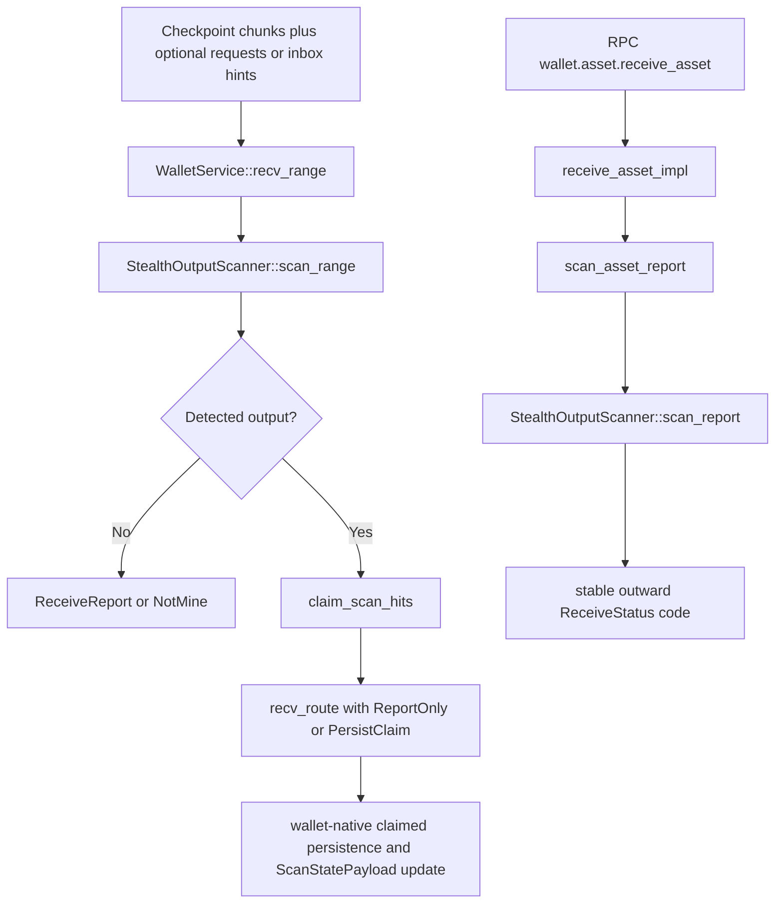

# Phase 037 Test Spec

## Purpose

📌 This document defines the phase-local unit, integration, and end-to-end
coverage required for Phase 037 Output Reception.

📌 It is directly usable by another engineer or agent without guessing
scenario boundaries, invariants, failure paths, pass oracles, or the correct
test-file destination.

## Workflow Status

- Mode: `fallback-ready`, not `verification-backed`.
- Source artifacts used:
  - `037-CONTEXT.md`
  - `037-TODO.md`
  - `037-01-PLAN.md` through `037-10-PLAN.md`
  - live receive-path code and existing receive/scanner/RPC test anchors in
    `crates/z00z_wallets`
- Completion artifacts still missing:
  - no `037-VERIFICATION.md`
  - `037-ARCHITECTURE.md` and `037-02-SUMMARY.md` through `037-10-SUMMARY.md`
    now exist as summary-backed phase evidence, but this test backlog still
    remains broader than the currently landed test slice recorded in
    `037-TEST-EXECUTION-SUMMARY.md`
  - `037-VALIDATION.md` now exists, but it remains partial and explicitly keeps
    the residual Task 9 waves open
- The gap-only add-tests slice remains intentionally deferred to Task 9 inside
  `037-09-PLAN.md`, after Tasks 11, 12, 13, 16, and 17 settle the later
  decision gates.
- Deterministic request-aware candidate selection is now execution-backed
  across the landed low-level anchors: `types_tag_cache.rs` covers active
  request ordering and expiry pruning, while
  `test_stealth_scan_support_suite.rs` covers fallback-last and first-win
  candidate resolution.
- The assisted-receive branch remains blocked by the absence of a concrete live
  inbox or hint source, not by request-ordering drift.

## Classification

### TDD And Integration Targets

- `crates/z00z_wallets/src/services/test_wallet_service_suite.rs`
  Canonical service-boundary seam for restart, persistence, route-gating,
  inbox-assisted receive, mixed-result range assertions, and progress contract
  checks.
- `crates/z00z_wallets/src/adapters/rpc/methods/test_asset_impl_suite.rs`
  Canonical public single-asset receive seam for exact `asset_id`, outward
  status mapping, definition-id rejection, and adapter or service parity.
- `crates/z00z_wallets/src/core/address/test_stealth_scan_support_suite.rs`
  Canonical low-level seam for deterministic request ordering, expiry pruning,
  fallback-last behavior, and first-win short-circuiting.
- `crates/z00z_wallets/src/core/address/stealth_scanner/types_tag_cache.rs`
  Inline unit-test seam for active request ordering and expiry-aware request
  registration.
- `crates/z00z_wallets/src/core/address/optimized_scanner.rs`
  Optional batching-wrapper seam eligible only for parity-style tests.
- `crates/z00z_wallets/tests/test_stealth_scanner_prefilter.rs`
  Reuse seam for strict tag-only request-bound behavior and explicit
  `Tag16Context` requirements.

### E2E Targets

- `WalletService::recv_range(...)` restart and resume flow across persistence
  cursor save and load boundaries.
- public `wallet.asset.receive_asset` path through
  `receive_asset_impl(...) -> scan_asset_report(...) -> StealthOutputScanner`.
- end-to-end receive means realistic Rust integration across wallet service,
  scanner, persistence, and RPC seams, not browser automation.

### Skip Targets

- `WalletService::receive_asset(...)`
  Compatibility-only single-asset reachability surface, not the canonical
  privacy-aware range lane.
- `crates/z00z_wallets/src/core/chain/scan_engine_impl.rs`
  Stub-only seam until a future phase implements a thin delegate.
- `crates/z00z_wallets/src/services/wallet_service_actions_runtime.rs`
  Orphan duplicate surface; non-canonical unless later rewired.
- `crates/z00z_wallets/src/adapters/rpc/methods/asset_impl_tests.rs`
  Orphan duplicate test file; non-canonical unless later rewired.
- speculative `Receiver`, `ReceptionResult`, `ScanConfig`, and
  `DoSMitigationConfig` APIs that do not exist as live authority today.

## Existing Test Anchors To Reuse

- `test_recv_range_restart`
- `test_claimed_asset_restart`
- `test_ex4_restart_resume`
- `test_recv_route_gate`
- `test_claimed_asset_rejects_invalid`
- `test_receiver_keys_*`
- `test_stays_live_post_rotate`
- `test_recv_ver_*`
- `asset_receive_api_sync`
- `asset_receive_path_parity`
- `asset_receive_exact_asset_id_survives_definition_collision`
- `asset_receive_rejects_definition_id_query*`
- `test_phase7_req_flow`
- `test_phase7_fast_reject`
- `test_phase7_collision`
- `test_phase9_bad_rpub`
- `test_phase9_tampered_tag16`
- `test_phase9_missing_fields`
- `test_active_requests_are_sorted_and_skip_expired`
- existing parity or smoke tests inside `optimized_scanner.rs`
- existing stub-truth tests inside `scan_engine_impl.rs`

## Proposed New Test Files

- `crates/z00z_wallets/tests/test_phase037_output_reception.rs`
  Already exists as a narrow source-shape and duplicate-surface quarantine
  guard for the current Phase 037 tree. It does not by itself prove a broader
  Task 9 backlog closure. Extend it only if a late Phase 037 change introduces
  a genuinely new integration seam or additional source-shape invariants that
  cannot truthfully live inside the existing service, RPC, scanner-support, or
  wrapper test anchors.

## Test File Placement

| Scenario ID | Test File Path | Extend Or Create | Why This Is The Correct Home |
| --- | --- | --- | --- |
| R1, R2, R3, N1, N2, N10, N11 | `crates/z00z_wallets/src/services/test_wallet_service_suite.rs` | Extend | Service boundary already owns restart, persistence, route-gate, helper-routing, and progress semantics. |
| R4, N13 | `crates/z00z_wallets/src/adapters/rpc/methods/test_asset_impl_suite.rs` | Extend | Public single-asset receive adapter already owns exact `asset_id` and outward code mapping. |
| N6, N7, N8, N9 | `crates/z00z_wallets/src/core/address/test_stealth_scan_support_suite.rs` and `crates/z00z_wallets/src/core/address/stealth_scanner/types_tag_cache.rs` | Extend | Deterministic request-candidate logic is split between active-request registration and the live scan-support helper seam. |
| P1 | `crates/z00z_wallets/tests/test_stealth_scanner_prefilter.rs` | Extend only if semantics change | Existing prefilter file already proves that `add_request(...)` alone is not enough for strict tag-only scanning. |
| N4 | `crates/z00z_wallets/src/core/address/optimized_scanner.rs` | Extend | Optional batching-wrapper parity belongs next to the wrapper itself. |
| N3 | `crates/z00z_wallets/src/core/chain/scan_engine_impl.rs` | Extend only if implementation changes | Stub truth remains local until a thin delegate exists. |
| C1, N14 | `crates/z00z_wallets/tests/test_phase037_output_reception.rs` | Extend only when needed | Existing phase-local guard already covers duplicate-surface quarantine and source-shape invariants; only extend it for late new seams or additional quarantine checks that cannot truthfully live in existing anchors. |

## Required End-To-End Behaviors

| Behavior | Requirement | Primary Path | Pass Signal | Fail Signal |
| --- | --- | --- | --- | --- |
| Range receive remains canonical | `recv_range(...)` stays the request-aware range authority | `WalletService::recv_range(...)` | restart, resume, and claim results still match canonical service behavior | any new seam bypasses or supersedes `recv_range(...)` |
| Persistence remains gated | only `recv_route(..., ReceiveNext::PersistClaim)` may persist | `recv_range(...) -> recv_route(...)` | `ReportOnly` leaves claimed storage unchanged and `PersistClaim` persists once | detection-only result mutates claimed storage |
| Strict tag-only scanning remains request-bound | `add_tag_context(...)` is required for strict tag-only request-aware scans | `StealthOutputScanner` prefilter path | context-free strict path rejects and explicit context path succeeds | `add_request(...)` alone allows strict tag-only ownership claims |
| Deterministic request ordering closes Task 15 | active requests are ordered, expiry-aware, fallback-last, and first-win | `types_tag_cache.rs` plus `stealth_scan_support.rs` | repeated runs select the same winner and skip expired requests | order flips across runs or expired request can win |
| Public RPC single-asset receive stays exact-asset-id only | outward API still maps to canonical single-asset report lane | `receive_asset_impl(...) -> scan_asset_report(...)` | exact `asset_id` succeeds or rejects with stable outward code | definition-id lookup is silently accepted or remapped |
| Optional wrappers never become a second authority | batching or helper seams remain thin over canonical detection | `OptimizedScanner` and any inbox-assisted service seam | same receive classification or documented parity oracle as canonical detector | extra mines, missing rejects, or separate persistence behavior appears |

## Critical Integration Paths

1. `WalletService::recv_range(...) -> load_scan_state -> StealthOutputScanner::scan_range -> claim_scan_hits -> recv_route(..., PersistClaim) -> save_scan_state`
2. `wallet.asset.receive_asset -> receive_asset_impl(...) -> scan_asset_report(...) -> StealthOutputScanner::scan_report`
3. `StealthOutputScanner::add_request(...) -> add_tag_context(...) -> strict tag-only receive path`
4. `Tag16Cache active requests -> ordered non-expired candidate list -> fallback req_id None last`
5. inbox hint metadata -> service-boundary helper routing -> canonical `recv_range(...)`
6. `OptimizedScanner` batch wrapper -> canonical detector parity only
7. `ReceiveReject` or `ReceiveReport` -> actionable observability hooks only when code exists

## Input Fixtures And Preconditions

| Scenario ID | Inputs | Preconditions | Fixture Source |
| --- | --- | --- | --- |
| R1, R2, N1, N2, N12 | unlocked wallet, `make_recv_chunk(...)`, checkpoints, optional payment requests, optional inbox hints | wallet initialized, canonical receive seams wired, claimed storage empty or known | existing helpers in `test_wallet_service_suite.rs` |
| R3 | wallet plus rotation or reload helpers | persisted wallet and view-version state available | existing receiver-key tests in `test_wallet_service_suite.rs` |
| R4, N13 | exact `asset_id`, optional definition collision fixtures, RPC session token | adapter path wired to service seam | existing helpers in `test_asset_impl_suite.rs` |
| P1 | request, tag16, and explicit `Tag16Context` values | strict tag-only path available | `test_stealth_scanner_prefilter.rs` fixtures |
| N4 | mine, not-mine, malformed, and request-bound leaves | wrapper and canonical detector share same receiver keys | existing `optimized_scanner.rs` test fixtures plus canonical leaf builders |
| N6, N7, N8, N9 | multiple active request ids, one or more expired requests, optional `req_id = None` fallback case | deterministic request-ordering implementation from Task 15 landed | helpers in `test_stealth_scan_support_suite.rs` plus inline coverage in `types_tag_cache.rs` |
| N10, N11 | actionable reject cases or callback or progress hooks | instrumentation or callback seam actually exists | implementation-local fixtures near touched seam |

## Expected Outputs And Produced Artifacts

| Scenario ID | Expected Output | Persisted Artifact | Observable Signal |
| --- | --- | --- | --- |
| R1 | monotonic `ScanRangeOut` with resumed progress | updated `ScanStatePayload`, claimed assets | cursor and claimed-set assertions |
| R2 | `ReportOnly` false persistence and `PersistClaim` true persistence | claimed asset only for persist branch | claimed-list length or lookup assertions |
| P1 | strict tag-only reject without context, positive detect with context | none on reject | receive status or detect-state assertions |
| N1, N2 | inbox hint narrows candidates but does not change ownership authority | identical claimed set and cursor to canonical scan | service-boundary parity assertions |
| N4 | wrapper parity with canonical detector | none unless wrapper becomes service input later | ordered vector or multiset parity assertion |
| N6, N7, N8, N9 | deterministic winner and expiry pruning | none | winner identity, fallback order, and first-win assertions |
| N10 | stable actionable hook or metric only for actionable failures while `NotMine` stays non-alerting | optional log or metric sink output | hook count or log capture assertions |
| N11 | monotonic callback order aligned with progress contract | optional saved cursor snapshots | callback sequence assertions |
| N13 | stable outward RPC status and exact-id lookup behavior | none on invalid proof or definition-id rejection | RPC code and no-persist assertions |

## Cryptographic And Security Invariants To Observe

| Invariant | Why It Matters | Assertion Shape |
| --- | --- | --- |
| `recv_range(...)` remains canonical | prevents second receive architecture from becoming authoritative | service and RPC tests continue to anchor to `recv_range(...)` or `scan_asset_report(...)` only |
| strict tag-only request-bound scanning requires explicit `Tag16Context` | prevents liveness metadata from being mistaken for proof of ownership | no-context strict path rejects; context-registered path succeeds |
| detection is not proof verification | avoids silently moving range-proof validation into ownership detection | invalid-proof and malformed cases never imply inline proof-verification parity |
| persistence remains explicit | keeps detection-only flows non-mutating and replay-safe | no claimed storage mutation without `PersistClaim` |
| deterministic ordered request matching | prevents nondeterministic ownership resolution | repeated runs produce identical winner and skip expired requests |
| after Task 16, `NotMine` remains non-alerting | avoids noisy operational visibility for ordinary foreign outputs | no counter, warning, or alert-oriented hook remains for `NotMine` once Task 16 lands |
| exact `asset_id` remains public RPC lookup rule | preserves public adapter contract and avoids compatibility drift | definition-id queries reject while exact `asset_id` path remains stable |

## Mermaid Flow



## Clarifying Code Snippets

```rust
let mut scanner = StealthOutputScanner::from_keys(&recv_keys);
scanner.add_request(&request);
scanner.add_tag_context(
    tag16,
    Tag16Context {
        k_dh,
        req_id: Some(request.req_id),
    },
);
```

```rust
let recv = rpc.receive_asset(session.clone(), exact_asset_id).await.unwrap();
assert_eq!(recv.status, ReceiveStatus::Detected.rpc_code());
```

## Scenario Matrix

| Scenario ID | Type | Goal | Positive Example | Negative Example | Main Assertions |
| --- | --- | --- | --- | --- | --- |
| R1 | integration `reuse` | range receive persists cursor and resumes after restart | resumed scan continues from saved checkpoint and preserves unique claims | re-run from stale cursor would duplicate claims | monotonic cursor, one-time claim persistence |
| R2 | integration `reuse` | persistence gate remains explicit | `PersistClaim` stores exactly one claim | `ReportOnly` stores none | claimed storage differs only by `ReceiveNext` |
| R3 | integration `reuse` | live receiver-key boundary stays canonical | rotated or reloaded wallet still yields live receiver keys | stale key-version mapping after reload | receiver-key derivation remains stable |
| R4 | integration `reuse` | public RPC receive keeps exact `asset_id` semantics | exact `asset_id` survives definition collision | definition-id query rejected | outward status and lookup contract stay stable |
| P1 | integration `reuse` or `extend` | strict tag-only path requires context | explicit `Tag16Context` enables request-bound strict scan | `add_request(...)` alone still rejects strict path | context requirement stays explicit |
| N1 | integration `extend` | inbox hit, miss, and false-positive hints remain notify-only metadata | canonical range scan with hints yields the same ownership truth as the non-hinted path | hint alone causes detection or persistence | hints narrow candidates only |
| N2 | integration `extend` | hinted and non-hinted scans converge | same checkpoint set yields the same claimed `asset_id` set and cursor | hint path diverges into second receive behavior | parity of claims, cursor, persistence count |
| N3 | unit `blocked` | `ScanEngineImpl` stays truthful | delegate tests only if implementation lands later | parity tests added while stub remains | stub-only or delegate-only truth, never both |
| N4 | unit `extend` | `OptimizedScanner` remains optional parity wrapper | shared leaf batch yields canonical-equivalent classification | wrapper invents new mine or drops reject | parity oracle over wrapper and canonical detector |
| N5 | integration `conditional` | scanner and DoS knobs stay thin over live surface | implemented knob maps directly to existing live strategy input | new facade invents second config stack | one live DoS or config surface only |
| N6 | unit `extend` | expired requests are skipped | active request still wins after expired one removed | expired request can win | expiry pruning before iteration |
| N7 | unit `extend` | request order is deterministic | repeated runs pick same request winner | HashSet-style nondeterminism flips winner | stable winner across runs |
| N8 | unit `extend` | fallback is explicit and last | request-bound candidate wins before fallback | fallback wins while explicit request still valid | request candidates tried before `req_id = None` |
| N9 | unit `extend` | first successful candidate short-circuits | first valid candidate binds receive result | later candidate also observed as winner | first-win termination only |
| N10 | integration `conditional` | actionable observability excludes `NotMine` | invalid proof or runtime fail increments the stable hook while `NotMine` remains non-alerting | `NotMine` triggers operator-facing signal | only actionable reject classes emit hooks |
| N11 | integration `conditional` | callback and progress contract stays singular | callback order matches cursor progression | second event pipeline diverges from `ScanRangeOut` | monotonic callback or progress parity |
| N12 | integration `extend` | partial-success reporting remains canonical | mixed chunk results preserve counters and non-persistence on invalid leaves | invalid leaf persists or counters drift | `ScanRangeOut` and report aggregation stay aligned |
| N13 | integration `extend` | outward RPC boundary remains aligned after refactor | exact-id receive keeps stable outward code and no-cache behavior | definition-id lookup or invalid-proof persistence regresses | adapter or service parity and no-persist invalid failures |
| N14 | unit or docs `conditional` | orphan duplicate files stay non-canonical | explicit marker or docs note exists | duplicate file becomes authority anchor again | canonical source references exclude orphan files |

## Canonical Commands

- `cargo test -p z00z_wallets --release --features test-fast test_recv_range_restart -- --nocapture`
- `cargo test -p z00z_wallets --release --features test-fast test_recv_route_gate -- --nocapture`
- `cargo test -p z00z_wallets --release --features test-fast asset_receive_api_sync -- --nocapture`
- `cargo test -p z00z_wallets --release --features test-fast asset_receive_exact_asset_id_survives_definition_collision -- --nocapture`
- `cargo test -p z00z_wallets --release --features test-fast core::address::stealth_scan_support::tests::ordered_request_candidates_puts_fallback_last --lib -- --exact`
- `cargo test -p z00z_wallets --release --features test-fast core::address::stealth_scan_support::tests::scan_cached_keys_first_win --lib -- --exact`
- `cargo test -p z00z_wallets --release --features test-fast core::address::stealth_scan_support::tests::scan_owned_matches_request_bound_output --lib -- --exact`
- `cargo test -p z00z_wallets --release --features test-fast core::address::stealth_scanner::types::tests::test_active_requests_are_sorted_and_skip_expired --lib -- --exact`
- `cargo test -p z00z_wallets --release --features test-fast test_phase7_req_flow -- --nocapture`
- `cargo test -p z00z_wallets --release --features test-fast optimized_scanner -- --nocapture`
- `cargo test -p z00z_wallets --release --features test-fast --lib --tests -- --nocapture`

## Open Gaps

- `037-ARCHITECTURE.md` and `037-02-SUMMARY.md` through `037-10-SUMMARY.md`
  now exist, but they do not by themselves close this test backlog or prove
  every planned test wave landed.
- `crates/z00z_wallets/tests/test_phase037_output_reception.rs` now exists as
  a narrow duplicate-surface quarantine guard, but it is not evidence that the
  broader Task 9 residual waves landed.
- There is still no `037-VERIFICATION.md` or dedicated full-backlog closeout
  artifact, and `037-VALIDATION.md` remains partial, so this document stays
  `fallback-ready` instead of `verification-backed`. The existing
  `037-TEST-EXECUTION-SUMMARY.md` records only the landed T1 plus narrow current
  T5 slice.
- Task 9 test generation remains gated on the resolution of later decision tasks from the numbered chain, especially Task 11, Task 12, Task 13, Task 16, and Task 17.
- `ScanEngineImpl` remains stub-only, so parity-style scan-engine tests stay blocked unless a future thin delegate lands.
- `OptimizedScanner`, actionable observability hooks, and callback progression tests remain conditional until code, not docs, makes those seams real.
- The current live code now classifies `ReceiveReject::NotMine` as
  non-alerting while `InvalidInput`, `InvalidProof`, and `RuntimeFail` remain
  actionable. Broader observability assertions still stay conditional until a
  dedicated hook or callback seam exists.
