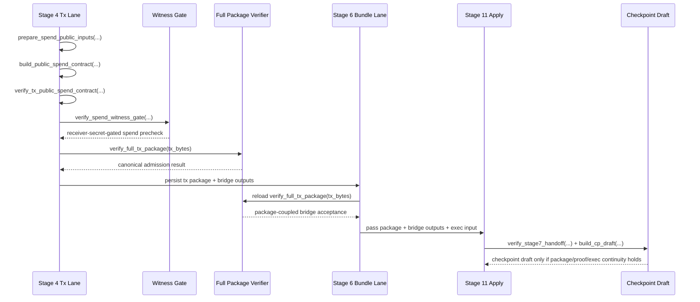

# Phase 040: Spend Proof - Context

**Gathered:** 2026-04-24
**Status:** Internal theorem-relation closure active on 2026-04-28

## Final Authority Reset

`040-09-SUMMARY.md` remains the last historical implementation checkpoint for
Phase 040, but this context file now serves the active `040-10-PLAN.md`
closure sweep. Current-authority language below must freeze the internal
theorem-relation target while keeping public/trustless proof-of-knowledge,
checkpoint theorem finality, and rollup settlement closure open.

## Phase Boundary

Phase 040 schedules and executes the existing spend-proof backlog in
`040-TODO.md`. The phase covers the versioned non-empty proof carrier,
canonical spend statement, producer path, verifier path, explicit regular-spend
nullifier semantics, full regular-package verification reuse, simulator
roundtrip closure, and the bounded follow-up work already enumerated in that
file.

This phase does not create a new spend architecture, duplicate wallet or
checkpoint logic, or introduce a parallel proof layer. Planning must translate
the canonical backlog into sequential execution, one canonical task after
another, without renaming, rewriting, or excluding any task title.

`040-Spend-Proof-Spec.md` is the canonical design authority for Phase 040.
`040-TODO.md` is the canonical execution-order backlog. This context exists to
lock that authority chain before numbered `040-XX-PLAN.md` artifacts begin.
If execution discovers a new design constraint, update the spec first and then
update the backlog.

## Implementation Decisions

### Canonical planning inventory

- **D-01:** `040-TODO.md` is the canonical planning inventory for Phase 040.
- **D-02:** The planner must cover every canonical task already listed in
  `040-TODO.md`.
- **D-03:** Task titles and wording from `040-TODO.md` are locked and must not
  be changed during planning.

### Sequencing and execution shape

- **D-04:** Planning must proceed sequentially in canonical task order, with
  dependency notes from `040-TODO.md` respected explicitly.
- **D-05:** No task may be excluded from the plan set. If a principle blocker
  makes a task impossible to execute honestly, that blocker must be recorded
  explicitly instead of silently skipping the task.

### Architecture and concept-drift guardrails

- **D-06:** Phase 040 must reuse the live spend and checkpoint pipeline rather
  than inventing a second proof object, a shadow verifier, or a duplicate state
  transition lane.
- **D-07:** The current live seams named in `040-TODO.md` stay canonical during
  planning: `TxProofWire`, `build_public_spend_contract(...)`,
  `prepare_spend_public_inputs(...)`, `verify_spend_witness_gate(...)`, and
  `verify_full_tx_package(...)` remain the baseline truth.
- **D-08:** The file-first implementation order in `040-TODO.md` is part of the
  phase contract. Planning must stay subordinate to that order unless the spec
  is updated first.
- **D-09:** Do not pull requirements from the retired `7-Spend-Proof.md` draft
  during planning or implementation.
- **D-10:** Do not split work into speculative new modules such as
  `spend_statement.rs`, `spend_prover.rs`, or `spend_nullifiers.rs`. Keep the
  canonical theorem backend on the existing `spend_proof_backend.rs` seam, and
  do not introduce a second backend or shadow module unless the spec is
  updated first.

### the agent's Discretion

The planner may choose substeps, validation anchors, and exact edit slices
inside each canonical task, but it has no discretion to rename tasks, merge
them into a new conceptual layer, skip mandatory tasks, or invent extra
capabilities outside the existing Phase 040 backlog.

## Specific Ideas

- Keep this context simple: it exists to freeze the planning authority chain,
  not to redesign Phase 040.
- Downstream numbered plans must follow the canonical `040-01` through
  `040-14` task order already locked in `040-TODO.md`.
- The proof producer remains on the wallet or Stage-4 side, and the proof
  consumer remains on the checkpoint-facing verifier side, exactly as the phase
  seed already states.
- Output-constructor unification remains a bounded follow-up topic and must not
  be pulled forward before the proof seams are stable.

## Current Live Transfer Status

- `040-01` is not greenfield work. `TxProofWire` and `TxAuthWire` already carry
  optional spend-related proof/auth payloads on the accepted regular-spend
  path. Phase 040 still must convert that live baseline into an explicit
  versioned non-empty proof-carrier contract with fail-closed behavior once the
  stronger mode is enabled.
- `040-03` is now landed through the existing wallet/Stage-4 lane. The current
  producer emits the canonical spend proof/auth carrier from existing witness
  material through `build_public_spend_contract(...)`, persists it in the Stage
  4 tx package, and fails closed when witness or package data drift from the
  canonical statement contract.
- `040-04` is now landed through the existing checkpoint-facing verifier seam.
  The shared public spend contract is exercised across wallet verifier tests,
  Scenario 1 spend-gate checks, and Stage 11 checkpoint acceptance without
  introducing a standalone `CheckpointProof` object or a parallel verifier lane.
- `040-05` is now landed through the existing spend-rule and checkpoint
  boundary. Deterministic chain-scoped spend nullifier derivation, nullifier
  carriage on the public spend statement, duplicate-within-contract rejection,
  claim-nullifier separation, and post-acceptance replay rejection on the live
  asset-id spent boundary are all exercised by focused wallet and checkpoint
  tests.
- `040-06` is now landed through the canonical full regular package verifier.
  `verify_full_tx_package(...)` remains the one composed admission entry point,
  wallet tests reject structurally valid proofless packages, and Scenario 1 now
  proves that local wire success is insufficient when the public spend contract
  fails.
- `040-07` is now landed through the simulator continuity path. The persisted
  Stage-4 package remains verifiable through Stage 6 and Stage 11, statement-
  bound tamper is rejected before checkpoint acceptance, and stage-surface
  wording stays synchronized with the actual post-`040-05` replay boundary.
- `040-08` is now closed as a bounded no-op follow-up. The current
  `build_tx_stealth_output()` / output-flow surfaces already satisfy the locked
  proof-facing and receiver-facing semantics, so no production builder cleanup
  was required to preserve `leaf_ad`, `tag16`, commitment, and range-proof
  behavior.
- `040-09-SUMMARY.md` remains the historical baseline that records the last
  completed implementation checkpoint without claiming public theorem closure.
- `040-10` is the active numbered continuation and freezes one canonical suite
  `regular_spend_theorem_bpplus`, one theorem contract `T(S, W)`, and one
  grounded witness table `receiver_secret + ordered s_in[i]` plus the explicit
  membership sub-witness required for authoritative `prev_root` composition.
- The approved path is still Option C on the existing spend pipeline: no
  parallel proof architecture, no bridge shadow layer, and no rollup-specific
  theorem contract.
- `040-INTEGRITY-GATES.md` and `040-CLOSEOUT-GATES.md` now record active internal
  closure requirements rather than a residual-handoff boundary.

## Execution Sequence

The live flow is not a single verifier hop. Planning must preserve the current
multi-stage producer and consumer chain and tighten it without creating a
parallel path.

## Checkpoint Acceptance Boundary

- Stage 6 is a bridge and reload-validation seam, not the final authority by
  itself.
- The authoritative package/proof continuity check on the simulator path is the
  Stage 11 acceptance flow that revalidates the Stage-4 package, exec-input
  identity, and Stage-6 bridge outputs before checkpoint draft emission.
- `checkpoint_s7.json` and checkpoint draft persistence must remain blocked when
  package digest drift, proof drift, exec-input drift, or replay-style mismatch
  is detected.
- Phase 040 must not describe the current checkpoint side as a standalone
  cryptographic backend yet. The live shipped boundary is a package-coupled
  acceptance path plus checkpoint hooks, not a finished trustless publish
  theorem.

## Replay And Nullifier Separation

- Regular-spend nullifiers are not claim nullifiers. Do not merge those replay
  semantics into one store or one conceptual lane.
- Deterministic regular-spend nullifier derivation and duplicate detection
  inside one public spend contract are already live.
- Replay closure across accepted checkpoint/state transitions is now enforced
  through the existing asset-id spent boundary exercised on checkpoint
  acceptance; do not imply that `SpentIndex` persists a separate regular-spend
  nullifier store unless that hook is added explicitly later.
- Planning must keep the regular-spend replay boundary explicit: local package
  or public-spend verification is necessary but not sufficient for state replay
  safety, and the current post-acceptance closure remains the live asset-id
  spent model rather than a standalone persisted nullifier registry.

## Temporary Adapter Status

- The current Stage-6/Stage-11 proof-consumption path is an interim
  package-coupled adapter over the existing `TxProofVerifier` and checkpoint
  hooks.
- Compatibility-looking proof bytes are not authoritative by themselves and
  must not be described as sufficient standalone checkpoint authority.
- Phase 040 must not claim full STARK/standalone proof closure until a non-empty
  versioned regular-spend carrier is verified through the shared proof verifier
  seam and the remaining checkpoint replay hooks are closed.
- Once stronger non-empty proof-carrier mode is enabled, empty/placeholder
  paths must reject fail-closed.

## Task Transfer Matrix

This table maps every canonical task from `040-TODO.md` into this context with
explicit live status, remaining delta, and validation target.

| Task ID | Canonical TODO title | Depends On | Live baseline status | Remaining delta to close | Validation target | Handoff |
| --- | --- | --- | --- | --- | --- | --- |
| `040-01` | Proof Carrier Contract | None | Landed via explicit non-empty versioned spend proof/auth carrier in `TxProofWire`/`TxAuthWire` | Keep downstream tasks from weakening the landed carrier contract or reintroducing empty placeholders outside explicit spec updates | `test_spend_proof_wire.rs` plus wallet wire roundtrip tests | unblock `040-02` |
| `040-02` | Canonical Spend Statement | `040-01` | Landed via shared canonical statement builder in `build_public_spend_contract(...)` / `verify_tx_public_spend_contract(...)` | Preserve the landed package-digest root, chain/root scope, canonical input/output binding, and fail-closed rejection surfaces while downstream verifier-path tasks close the remaining checkpoint-facing reuse gates | `test_spend_statement.rs` plus drift checks | unblock `040-03`, `040-04`, `040-09`, `040-10`, `040-11` |
| `040-03` | Producer Path | `040-01`, `040-02` | Landed via the existing wallet/Stage-4 producer seam | Preserve the landed canonical proof/auth emission and fail-closed witness/package mismatch boundary while downstream tasks consume it without drift | `test_spend_prover_contract.rs` plus Stage-4 or Scenario 1 spend-gate checks | unblock `040-04`, `040-06`, `040-07`, `040-13` |
| `040-04` | Verifier Path | `040-01`, `040-02` | Landed via the shared public-spend verifier and checkpoint acceptance seams | Preserve the landed verifier reject matrix and package-coupled Stage-6 adapter truth while downstream tasks close replay and full-verifier follow-ups without inventing a parallel membership model | `test_tx_proof_verifier.rs`, `test_scenario1_spend_gate.rs`, and checkpoint acceptance tests | unblock `040-05`, `040-06`, `040-10`, `040-12`, `040-13` |
| `040-05` | Nullifier Semantics | `040-02`, `040-04` | Landed through deterministic chain-scoped nullifier derivation, statement carriage, and replay rejection on the live asset-id spent boundary | Preserve the landed same-scope determinism, scope drift, claim separation, and post-acceptance replay boundary without overstating a separate persisted nullifier store | `test_spend_nullifier_semantics.rs` and checkpoint acceptance replay checks | unblock `040-07` |
| `040-06` | Full Regular Package Verification Entry Point | `040-03`, `040-04` | Landed via `verify_full_tx_package(...)` and the simulator spend-gate regression surface | Preserve one canonical full-verifier entry point and keep local-only verification shortcuts fail closed across wallet and simulator paths | wallet verifier tests plus scenario spend-gate regression | closes residual simulator admission follow-up before `040-07` |
| `040-07` | End-to-End Roundtrip And Surface Locks | `040-03`, `040-04`, `040-05`, `040-06` | Landed through the Stage-4/6/11 simulator continuity path | Preserve the landed package continuity and honest post-`040-05` stage-surface wording while downstream integrity-gate work audits the same contract | simulator roundtrip tests, stage-surface wording tests, and checkpoint acceptance tests | unblock bounded follow-up and closeout |
| `040-08` | Optional Output-Constructor Follow-Up | `040-07` | Closed as a bounded no-op follow-up | Keep the existing output surfaces semantically frozen unless a later spec update requires real builder cleanup | sender/output tests and send-scan regression coverage | keep post-proof cleanup bounded |
| `040-09` | Proof-Theorem Preservation | `040-02`, `040-03`, `040-04` | Active final-closure authority; one canonical theorem suite, carrier, and witness table are now frozen | Preserve the ordered `verify_spend_rules(...)` theorem shape while converging producer, verifier, checkpoint, and rollup seams on the canonical theorem artifact with no semantic aliases | `test_spend_statement.rs`, `test_spend_prover_contract.rs`, `test_spend_proof_backend.rs`, `test_tx_proof_verifier.rs`, and simulator truth-surface regressions | establishes the canonical theorem freeze for downstream execution |
| `040-10` | Public Input Surface Preservation | `040-02`, `040-04` | Active final-closure authority recorded in `040-INTEGRITY-GATES.md` | Preserve resolved-input ids, output leaf fields, and scope inside the canonical theorem statement with fail-closed recomputation drift rejection and explicit `prev_root` membership composition | `test_spend_statement.rs` and `test_tx_proof_verifier.rs` | keeps the canonical public input surface stable |
| `040-11` | Digest-Root Discipline | `040-02`, `040-06` | Active final-closure authority recorded in `040-INTEGRITY-GATES.md` | Preserve package digest as the only public or persisted proof-binding root for the canonical theorem path and keep wire-digest-only binding invalid | `test_spend_statement.rs` plus full-verifier rejection tests in `test_tx_verifier_suite.rs` | preserves canonical root discipline |
| `040-12` | Checkpoint-Pipeline Reuse | `040-04`, `040-06` | Closeout evidence now records this slice as closed on the existing package-coupled checkpoint hooks | Keep `prev_root`, `TxProofVerifier`, and checkpoint apply hooks as the only checkpoint-facing seam, and keep package admission and checkpoint apply explicit as two separate verification steps without inventing a separate regular-tx proof layer outside the existing checkpoint artifact path | checkpoint acceptance tests and continuity guards | preserves no-parallel-layer checkpoint flow |
| `040-13` | Missing-Code Closure Tasks | `040-01`, `040-03`, `040-04`, `040-06`, `040-08` | Closeout evidence now records the missing-code ledger as closed by landed task owners or explicit bounded follow-up | Keep the stale `2.12` spec-table wording drift fail-closed for separate planning review instead of silently re-scoping the landed closure matrix | closure review against spec/TODO/task outputs plus stage-surface truth locks | preserves honest closure language |
| `040-14` | Prohibited Shortcut Checklist | `040-07` closeout hook | Closeout evidence now records the shortcut checklist as re-run on both the live tx-package surface and the phase text surfaces | Keep the stronger STARK or standalone-proof boundary, the live package shortcut guard, and the completion-gate fail-closed alignment row explicit before any full phase-close claim | final checklist pass plus stage-surface tests | final gate before summary |

## Strict Transfer Supplements

The matrix above is only the compressed map. The following task-local rules are
also mandatory because they are explicitly locked in `040-TODO.md`.

### Mandatory pre-read hooks

- `040-01` through `040-08` each carry their own mandatory spec pre-read
  ranges and those pre-reads remain binding before implementation begins.
- Before closing any of `040-09` through `040-14`, read
  `040-Spend-Proof-Spec.md` lines `585-631` and `657-672` in full, then re-check
  the owning primary tasks named in each subsection.

### Task-local validation and integrity details

- `040-01` must keep `unknown version rejects` and `empty placeholder path
  rejects once non-empty proof-carrier mode is enabled` as explicit wire-level
  assertions.
- `040-02` must keep these explicit statement assertions: same package gives
  same statement, envelope digest drift changes statement, output field drift
  changes statement, and bare wire digest is never accepted as the only public
  root.
- `040-03` must keep these producer assertions: the producer emits a carrier
  with the canonical statement and fails closed on mismatched witness or package
  data.
- `040-04` must keep this verifier reject matrix explicit: suite mismatch,
  statement mismatch, malformed proof bytes, wrong resolved input, wrong root,
  and wrong output statement must each reject.
- `040-05` must keep these nullifier assertions explicit: same input gives same
  nullifier in the same scope, scope drift changes the nullifier, replay in the
  checkpoint path rejects, and claim nullifier semantics remain separate.
- `040-06` must preserve the wallet-side assertion that a structurally valid
  package without spend proof fails the canonical full verifier, and it must
  keep the simulator-side residual follow-up for `package passes local wire
  checks but fails public spend contract` plus `range-proof mode stays explicit
  during backend integration`.
- `040-07` must keep both stage-surface wording assertions explicit: current
  public spend scope wording stays honest and post-`040-05` wording must stay
  synchronized with the actual replay-closure truth rather than preserving a
  stale pre-`040-05` disclaimer.
- `040-08` must extend whichever builder or output tests already lock
  self-decrypt and output-field invariants; builder cleanup is not allowed to
  relax those invariants.

## Canonical References

**Downstream agents MUST read these before planning or implementing.**

### Phase authority

- `.planning/ROADMAP.md` — Phase 040 registration inside the active milestone.
- `.planning/STATE.md` — current milestone truth and the review-locked planning
  state for the pre-existing Phase 040 seed.
- `.planning/phases/040-spend-proof/040-Spend-Proof-Spec.md` — canonical Phase
  040 design authority.
- `.planning/phases/040-spend-proof/040-TODO.md` — canonical Phase 040 backlog;
  every task is mandatory and must be preserved verbatim.
- `.planning/phases/040-spend-proof/040-INTEGRITY-GATES.md` — canonical
  theorem/public-input/digest-root evidence ledger for `040-09` through
  `040-11`.

### Live spend-proof seams

- `crates/z00z_wallets/src/core/tx/tx_wire_types.rs` — current `TxProofWire`,
  `TxAuthWire`, and package wire contract.
- `crates/z00z_wallets/src/core/tx/spend_verification.rs` — current public
  spend statement and producer-side contract seam.
- `crates/z00z_wallets/src/core/tx/prover.rs` — spend authorization signing and
  adjacent producer-side proof inputs.
- `crates/z00z_wallets/src/core/tx/spend_rules.rs` — current spend-rule and
  nullifier-related semantics.
- `crates/z00z_wallets/src/core/tx/state_update.rs` — checkpoint-facing state
  transition boundary for accepted spend effects.
- `crates/z00z_wallets/src/core/tx/tx_verifier.rs` — canonical full package
  admission wrapper via `verify_full_tx_package(...)`.
- `crates/z00z_wallets/src/core/tx/witness_gate.rs` — current witness-derived
  public inputs and spend-gate verification seam.
- `crates/z00z_wallets/src/core/tx/state_checkpoint.rs` — package-coupled
  checkpoint public input contract; detached proof bytes remain
  non-authoritative.
- `crates/z00z_simulator/src/scenario_1/stage_4_utils/tx_lane_runtime_flow.rs`
  — live producer-side Scenario 1 regular transaction flow.
- `crates/z00z_simulator/src/scenario_1/stage_4_utils/tx_validation_gates.rs`
  — Stage-4 canonical full package-verifier gate.
- `crates/z00z_simulator/src/scenario_1/stage_6_utils/bundle_lane_impl.rs` —
  Stage-6 bridge/reload seam for package-coupled proof consumption.
- `crates/z00z_simulator/src/scenario_1/stage_11.rs` and
  `crates/z00z_simulator/src/scenario_1/stage_11_apply.rs` — authoritative
  simulator-side acceptance handoff before checkpoint draft emission.

## Review-Locked Corrections

- `TxProofWire` already exists and already carries optional spend-related proof
  and auth wires for accepted regular spend paths; Phase 040 extends that live
  carrier instead of inventing a second proof envelope.
- `build_public_spend_contract(...)` is the current producer-side public spend
  contract seam and must be reused or narrowed, not shadowed by a duplicate
  planning abstraction.
- `verify_full_tx_package(...)` is the canonical full package-admission wrapper
  and must remain the verification aggregation surface for regular packages.
- `prepare_spend_public_inputs(...)` and `verify_spend_witness_gate(...)`
  remain the live witness/public-input seam; planning must build on those names
  rather than restating them as greenfield ideas.
- Current spend authorization signing remains live in `prover.rs`, and current
  rule/nullifier semantics remain live in `spend_rules.rs`; those surfaces must
  be documented as implemented baseline, not future-only placeholders.
- The current codebase already treats the spend/checkpoint pipeline as a staged
  composition of package verification, witness gate verification, and
  checkpoint-state validation; Phase 040 must tighten that composition rather
  than replace it wholesale.
- Stage 11 currently blocks checkpoint summary emission and checkpoint draft
  persistence on package/proof/exec drift; Phase 040 must preserve that
  rollback behavior instead of weakening it into a best-effort publish flow.

## Sequential Review Gates

1. `040-01` through `040-06` are the mandatory proof-carrier and verification
  core. They must complete in dependency order before closure work starts.
2. `040-07` inherits the roundtrip and stage-surface continuity closure that
  remains after `040-06` closes its residual simulator admission regression;
  it is not optional test polish.
3. `040-08` remains bounded follow-up work and must not be pulled earlier just
  to redesign output construction.
4. `040-09` through `040-14` are integrity gates that preserve theorem shape,
  public-input discipline, digest-root discipline, checkpoint-pipeline reuse,
  missing-code closure, and prohibited shortcuts. They must remain explicit in
  planning and closeout.

## File-First Order Mirror

The canonical edit order must remain visible here, not only delegated by
reference.

1. `crates/z00z_wallets/src/core/tx/tx_wire_types.rs`
2. `crates/z00z_wallets/src/core/tx/mod.rs`
3. `crates/z00z_wallets/src/core/tx/spend_verification.rs`
4. `crates/z00z_wallets/src/core/tx/prover.rs`
5. `crates/z00z_wallets/src/core/tx/spend_rules.rs`
6. `crates/z00z_wallets/src/core/tx/state_update.rs`
7. `crates/z00z_wallets/src/core/tx/tx_verifier.rs`
8. `crates/z00z_wallets/src/core/tx/witness_gate.rs`
9. `crates/z00z_simulator/src/scenario_1/stage_4_utils/tx_validation_gates.rs`
10. `crates/z00z_simulator/src/scenario_1/stage_4_utils/tx_lane_runtime_flow.rs`
11. `crates/z00z_simulator/src/scenario_1/stage_6_utils/bundle_lane_impl.rs`
12. wallet-side tests
13. simulator-side tests
14. only then optional output-builder cleanup in `builder.rs` and
    `output_flow.rs`

## Mandatory Validation Ordering

Run validation in this order and do not collapse later gates into earlier ones:

1. focused wallet unit tests for wire and canonical statement changes;
2. producer/verifier contract tests, including non-empty/placeholder rejection
  behavior when enabled;
3. nullifier/replay tests, keeping regular-spend and claim semantics separate;
4. simulator spend-gate regressions for package-vs-public-contract failure
  coverage;
5. simulator roundtrip and stage-surface wording tests;
6. selected `cargo test -p z00z_wallets --release --features test-fast ...`;
7. selected `cargo test -p z00z_simulator --release --features test-fast ...`.

## Named Mandatory Test Inventory

- landed owning file: `crates/z00z_wallets/tests/test_spend_proof_wire.rs`
- landed owning file: `crates/z00z_wallets/tests/test_spend_statement.rs`
- landed owning file: `crates/z00z_wallets/tests/test_spend_prover_contract.rs`
- landed owning file: `crates/z00z_wallets/tests/test_tx_proof_verifier.rs`
- landed owning file: `crates/z00z_wallets/tests/test_spend_nullifier_semantics.rs`
- landed owning file: `crates/z00z_simulator/tests/test_scenario1_tx_proof_roundtrip.rs`
- extend `crates/z00z_simulator/tests/test_scenario1_stage_surface.rs`
- keep existing fail-closed wallet and simulator tests aligned with those named
  surfaces, even where `040-TODO.md` still records the original create verb
  for backlog traceability

## Mandatory Validation Anchors

- `crates/z00z_wallets/src/core/tx/test_tx_verifier_suite.rs` — canonical
  wallet-side full-verifier contract coverage.
- `crates/z00z_wallets/tests/test_spend_witness_gate.rs` — witness-gate and
  public spend contract fail-closed coverage.
- `crates/z00z_simulator/tests/test_scenario1_spend_gate.rs` — Stage-4/Scenario-1
  spend-gate coverage for malformed/nullifier/auth/proof drift.
- `crates/z00z_simulator/tests/test_checkpoint_acceptance.rs` — Stage-11 reject
  paths that must block checkpoint summary emission and draft persistence.
- `crates/z00z_simulator/tests/test_scenario1_stage_surface.rs` — stage-surface
  wording and package-coupled continuity guards.

## Validation Anchors

- `040-TODO.md` dependency chain is the canonical task-order validator.
- `040-TODO.md` file-first implementation order is the canonical edit-order
  validator.
- `040-Spend-Proof-Spec.md` authority and status-classification sections are the
  canonical design-truth validator.
- Any future Phase 040 implementation slice must validate against the live
  wallet and simulator seams named above rather than against retired drafts or
  speculative replacement modules.

## Completion Gate Mirror

Phase 040 is execution-ready for closeout only when all of the following are
true:

- `040-01` through `040-07` are complete;
- all mandatory tests named by the backlog and validation sections exist and
  are green;
- `040-Spend-Proof-Spec.md`, `040-TODO.md`, and this context still agree on
  authority, sequencing, and no-parallel-layer constraints;
- no remaining implementation step depends on the retired superseded draft;
- the `040-14` prohibited shortcut checklist has been re-run before marking
  `040-07` complete.

## Prohibited Shortcut Mirror

Before marking `040-07` complete, re-check all four shortcut prohibitions:

- do not claim STARK proof support until `TxProofWire` is non-empty and wired through `TxProofVerifier`;
- do not introduce `receiver_cards` into the regular persisted package;
- do not replace fee-as-output semantics with a separate `C_fee` contract unless verifier logic, tests, and spec are migrated together;
- do not mix wallet `compute_leaf_ad()` with crypto `derive_leaf_ad()` in the same runtime path without a documented migration plan.
