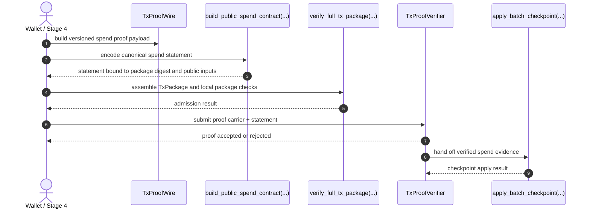
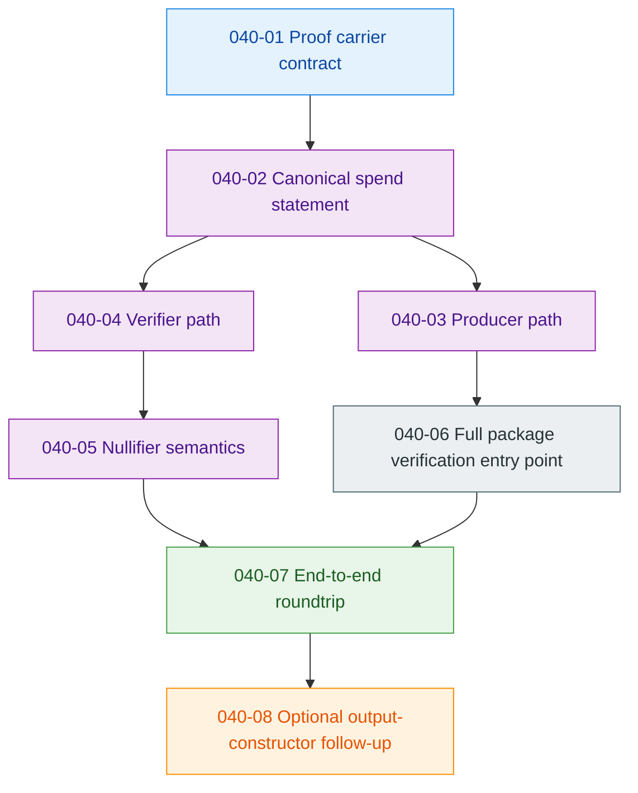

# Phase 040: Spend Proof - Technical Story

This document is the narrative companion to the Phase 040 planning set:
[040-CONTEXT.md](040-CONTEXT.md), [040-TODO.md](040-TODO.md), and
[040-Spend-Proof-Spec.md](040-Spend-Proof-Spec.md). It explains what the phase
is doing, why it exists, and how it fits into the current regular transaction
lane without inventing a second proof architecture.

Phase 040 is a tightening phase. It takes the live spend path that already
exists in the repository and turns it into an explicit, versioned, checkpoint-
aware proof contract. It does not try to replace the current transaction flow.
It makes the flow honest, stable, and ready for a future non-empty proof backend.

## 1. What this is

Phase 040 is the regular spend-proof upgrade for Z00Z. The goal is to make the
regular transaction lane carry a real proof contract instead of relying on
loose local checks and placeholder semantics.

The phase starts from what already exists today:

- `TxProofWire` and `TxAuthWire` already carry optional spend-related payloads;
- `build_public_spend_contract(...)` already builds the live public spend
  contract;
- `verify_tx_public_spend_contract(...)` already verifies the public spend
  contract;
- `verify_full_tx_package(...)` already acts as the canonical package-admission
  wrapper;
- `verify_spend_witness_gate(...)` already enforces the current spend-gate
  checks;
- Stage 4, Stage 6, and Stage 11 already form the simulator-side continuity
  chain.

What changes in Phase 040 is the contract shape. The phase makes the proof
carrier versioned, makes the spend statement canonical, gives the producer and
verifier distinct responsibilities, and adds explicit regular-spend nullifier
semantics at the state boundary.

The spec marks "Concrete regular tx STARK prover/verifier" as **Proposed only**.
In human terms, that phrase means "the future cryptographic engine that will
produce and check the proof for a regular transaction spend". It is not the
current shipped backend. Phase 040 prepares the wire shape, statement shape,
and verification seams so that backend can be plugged in later without changing
what the transaction means.

The same is true for a concrete `CheckpointProof` object: it is still proposed
only, while the current checkpoint path uses typed state update and trait hooks
instead of a standalone proof object.

## 2. Knowledge map

| Concept | Canonical files or symbols | Story role |
| --- | --- | --- |
| Phase authority | [040-Spend-Proof-Spec.md](040-Spend-Proof-Spec.md), [040-TODO.md](040-TODO.md), [040-CONTEXT.md](040-CONTEXT.md) | Define the only normative scope, order, and constraints for the phase. |
| Proof carrier | `crates/z00z_wallets/src/core/tx/tx_wire_types.rs` | Holds the regular-spend proof payload inside the existing tx wire. |
| Canonical statement | `crates/z00z_wallets/src/core/tx/spend_verification.rs` | Builds the statement that both producer and verifier must agree on. |
| Public package verifier | `crates/z00z_wallets/src/core/tx/tx_verifier.rs` | Keeps local package admission separate from checkpoint-facing proof checks. |
| Spend rules and nullifiers | `crates/z00z_wallets/src/core/tx/spend_rules.rs` | Owns the current rule kernel and the replay-related semantics. |
| Checkpoint apply | `crates/z00z_wallets/src/core/tx/state_update.rs` | Consumes proof evidence at the state transition boundary. |
| Producer side | `crates/z00z_wallets/src/core/tx/prover.rs`, `crates/z00z_simulator/src/scenario_1/stage_4_utils/tx_lane_runtime_flow.rs` | Builds the proof carrier on the wallet or Stage 4 side. |
| Verifier side | `crates/z00z_simulator/src/scenario_1/stage_6_utils/bundle_lane_impl.rs` | Revalidates package and proof continuity before checkpoint draft emission. |
| Simulator truth chain | `crates/z00z_simulator/src/scenario_1/stage_4.rs`, Stage 6, Stage 11 flows | Proves that the carrier survives the full runtime path without drift. |
| Regression anchors | `crates/z00z_wallets/tests/test_spend_proof_wire.rs`, `crates/z00z_wallets/tests/test_spend_statement.rs`, `crates/z00z_wallets/tests/test_tx_proof_verifier.rs` | Lock the carrier, statement, and verifier contracts with focused tests. |

## 3. The story of the phase

### Act I: Keep the current lane honest

The current regular transaction flow already has a shape. It builds confidential
outputs, self-validates them, verifies the public package envelope, checks the
spend witness gate, and finally applies the checkpoint state transition.

Phase 040 does not throw that away. It keeps the live path as the baseline truth
and tightens it.

That is why the spec insists on reusing the current package pipeline rather than
inventing a parallel proof object or a shadow verifier. The phase is a bridge,
not a rewrite.

### Act II: Give the proof a real shape

The first real job of the phase is the proof carrier.

`TxProofWire` must stop being just a convenient optional slot and become a
versioned, non-empty proof carrier for regular spends. The point is not to store
more bytes for their own sake. The point is to make the proof material explicit,
versioned, and migration-aware so future verifier code can tell which proof
format it is reading.

That is also why the spec rejects a parallel proof object. If proof bytes lived
in a second container, the codebase would quickly split into "the real proof" and
"the compatibility proof". Phase 040 avoids that drift by upgrading the existing
wire contract in place.

### Act III: Define one canonical statement

A proof is only useful if both sides agree on what is being proven.

Phase 040 makes that agreement explicit through one canonical spend statement.
The statement binds the package digest, the chain or root scope, the resolved
input references, the public output fields, the public commitment aggregates,
and the range-proof semantics that are already part of the live spend rules.

This matters because the prover and the verifier must be talking about the same
transaction object. If one side proves only the raw wire digest while the other
checks the full package envelope, the system can drift into substitution and
replay confusion. The spec prevents that by making `build_tx_package_digest()`
the public root and keeping `compute_tx_digest_from_wire()` as an internal
helper only.

### Act IV: Split producer and verifier responsibilities

Phase 040 wants a clean division of labor.

The producer belongs on the wallet or Stage 4 side. That side already has the
private witness material and already prepares the transaction before persistence.
The verifier belongs on the checkpoint-facing side, where the state transition
can consume proof evidence without needing to reconstruct the secret witness.

This split is important for two reasons. First, it keeps secret material away
from checkpoint apply code. Second, it preserves offline-friendly transaction
construction: the wallet can prepare a proof before the network or checkpoint
layer sees anything.

So when the spec mentions a concrete prover/verifier pair, it is really saying:
"the proof must be produced where the secrets live and checked where the state
changes".

### Act V: Make replay and nullifier semantics explicit

A regular spend is not only about proving knowledge. It is also about proving
that the same spend cannot be replayed in the wrong scope.

That is why Phase 040 gives explicit attention to regular-spend nullifiers.
They are not claim nullifiers, and the spec is very strict about keeping those
semantics separate. The phase wants deterministic derivation, correct scope
binding, and state-enforced replay rejection at checkpoint time.

In plain language: the phase is not only asking "can you spend this asset?" It
is also asking "can this spend be reused after it has already been accepted?"

### Act VI: Close the roundtrip

The final story of the phase is continuity.

The proof carrier must survive the Stage 4 to Stage 6 to Stage 11 path without
statement drift. The package admission check, the proof verifier, and the
checkpoint apply step all need to keep saying the same thing about the same
transaction.

That is why the simulator roundtrip and surface-lock tests are part of the phase.
They prove that the proof contract is not just locally coherent in one module,
but stable across the runtime path that actually matters.

## 4. Flows

### Runtime proof flow

### Short ownership flow

Stage 6 is the bridge that carries the package between those endpoints. The
link is already implemented in the current simulator stack: `tx_verifier.rs`
owns package admission, `state_update.rs` owns the checkpoint-facing
`TxProofVerifier` seam, `stage_6_utils/bundle_lane_impl.rs` implements
`TxProofVerifier` for `CheckpointPackageProofVerifier`, and
`stage_11_apply.rs` passes that verifier into `build_cp_draft(...)`. Phase 040
does not invent a new simulator verifier path; it tightens and reuses this one.

### Phase task flow

## 5. Integration points

### What this phase must touch

- `TxProofWire` and `TxAuthWire` for the proof carrier shape.
- `spend_verification.rs` for the canonical statement and public spend contract.
- `prover.rs` for the wallet or Stage 4 proof producer.
- `spend_rules.rs` for the current spend-rule kernel and nullifier semantics.
- `state_update.rs` for checkpoint-facing proof consumption.
- `tx_verifier.rs` for the canonical full-package admission wrapper.
- Stage 4, Stage 6, and Stage 11 simulator code for roundtrip validation.
- Wallet and simulator tests that lock the behavior in place.

### What this phase must not create

- A second proof object outside `TxProofWire`.
- A parallel membership model.
- A standalone regular-tx `CheckpointProof` object.
- `receiver_cards` inside the regular persisted package.
- A new `spend_statement.rs`, `spend_prover.rs`, `spend_proof_backend.rs`, or
  `spend_nullifiers.rs` module unless the spec is updated first.

### Where safe changes belong

- Wire shape changes belong in `tx_wire_types.rs` and the `core::tx` facade.
- Statement changes belong in `spend_verification.rs`.
- Producer changes belong in `prover.rs` and the Stage 4 runtime flow.
- Verifier changes belong in `state_update.rs`, `tx_verifier.rs`, and the
  checkpoint-facing simulator path.
- Replay semantics belong in `spend_rules.rs` and the state transition layer.

## 6. How to work with it

### If you are adding a feature

Start from the proof carrier and the spend statement together. If one changes,
the other usually has to change too. Then update the producer and verifier in the
same shape, and finally extend the simulator roundtrip tests.

### If you are refactoring

Do not move proof logic into a new conceptual layer unless the spec says the
layer is real. The phase is intentionally conservative: it wants one canonical
statement, one canonical carrier, and one canonical admission path.

### If you are adding tests

Use the focused wire and statement tests first. Then add producer and verifier
coverage. Finish with the simulator roundtrip and wording-lock tests so the
public story stays honest about the current proof scope.

## 7. Glossary

- **Concrete regular tx STARK prover/verifier** - the future proof engine that
  will generate and check a STARK proof for a regular transaction spend. It is
  proposed only in the spec and is not the current implementation.
- **Proof carrier** - the versioned `TxProofWire` payload that carries the proof
  material.
- **Spend statement** - the canonical public data that the proof asserts.
- **Producer path** - the wallet or Stage 4 side that creates the proof carrier.
- **Verifier path** - the checkpoint-facing side that checks the carrier and
  statement.
- **Package digest** - the public binding root for the transaction envelope.
- **Nullifier semantics** - the replay-protection rules for regular spends.
- **Roundtrip closure** - proof continuity across Stage 4, Stage 6, and Stage 11
  without drift.

## 8. The story this phase tells

Phase 040 is the bridge between today's spend checks and tomorrow's proof-backed
regular transaction contract.

It keeps the current live transaction lane intact, makes the proof evidence
explicit, separates producer and verifier responsibilities, defines replay
semantics, and prevents the codebase from drifting into a second proof
architecture. The phase exists so the repository can eventually say, with one
shared contract, what a regular spend proves and where that proof is checked.

The simulator story is also intentionally honest about what is still open:
Stage 11 remains the authoritative package, proof, and exec continuity gate,
and `040-TODO.md` still keeps the residual simulator regression follow-up open
so the roundtrip story is not overstated.
