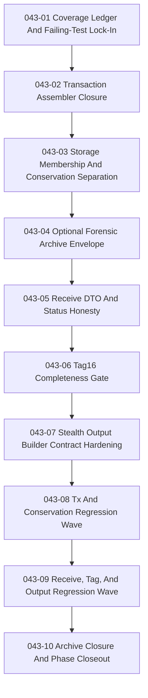

# Phase 043: Gaps Fixes - Context

**Gathered:** 2026-05-06
**Status:** Planning authority locked on 2026-05-06

## Final Authority Reset

Phase 043 already exists as `.planning/phases/043-gaps-fixes/`. This context
does not create a new phase folder and does not redesign the phase. It freezes
the planning authority chain before numbered `043-XX-PLAN.md` artifacts begin.

`043-fixes-spec.md` is the canonical design authority for Phase 043.
`043-TODO.md` is the canonical execution-order backlog. If execution discovers
a new design constraint, update the spec first and then update the backlog.

## Phase Boundary

Phase 043 schedules and executes the existing backlog in `043-TODO.md`. The
phase covers transaction assembler closure, storage-membership versus Pedersen
conservation separation, the explicit operator audit surface, the optional
forensic archive envelope, receive DTO/status honesty, Tag16 completeness, and
validated stealth-output routing.

This phase does not create a second tx or proof architecture, does not widen
into a repository-wide cleanup sweep, does not change canonical `.wlt`
semantics, and does not modify vendored Tari code under
`crates/z00z_crypto/tari/**`.

Planning must translate the canonical backlog into sequential execution, one
canonical task after another, without renaming, rewriting, merging away, or
excluding any backlog task title.

## Implementation Decisions

### Canonical planning inventory

- **D-01:** `043-fixes-spec.md` is the canonical design authority for Phase 043.
- **D-02:** `043-TODO.md` is the canonical planning and execution inventory for
  Phase 043.
- **D-03:** Every canonical task title and wording in `043-TODO.md`, from
  `043-01` through `043-10`, is locked and must not change during planning.

### Sequencing and execution shape

- **D-04:** Planning must execute the backlog sequentially in canonical task
  order. The numbered plan chain is `043-01` -> `043-02` -> `043-03` ->
  `043-04` -> `043-05` -> `043-06` -> `043-07` -> `043-08` -> `043-09` ->
  `043-10`.
- **D-05:** No canonical task may be excluded, silently collapsed, or deferred
  without first updating `043-fixes-spec.md` and then synchronizing
  `043-TODO.md`.

### Validation and review gates

- **D-06:** Every auto task verify block must run the bootstrap gate first via
  `./.github/skills/smart-tests-bootstrap/scripts/bootstrap_tests.sh`.
- **D-07:** After the bootstrap gate, each auto task must run the relevant
  narrow validation gates for its seam and then run
  `cargo test --release --features test-fast --features wallet_debug_dump`
  whenever the task changes Rust behavior, tests, or validation surfaces.
- **D-08:** Every auto task must run
  `@.github/prompts/gsd-review-tasks-execution.prompt.md` in YOLO mode at
  least 3 times and stop only after at least 2 consecutive review runs report
  no significant issues.
- **D-09:** If any task execution requires a commit, it must use the governed
  `z00z-git-versioning` flow rather than raw `git commit`.

### Architecture and concept-drift guardrails

- **D-10:** Keep JMT membership verification, transaction-local commitment
  conservation, and asset-class audit recomputation as separate layers.
- **D-11:** Keep canonical `.wlt` semantics limited to wallet snapshot state;
  the forensic archive remains an explicit optional envelope.
- **D-12:** Keep public receive compatibility stable while improving internal
  failure precision and fail-closed behavior.
- **D-13:** Keep approved sender flows on validated stealth-output builders;
  raw builders remain non-canonical construction seams.
- **D-14:** Do not widen the phase to unrelated fee, prover, generic backup,
  or persistence TODO cleanup outside the Phase 043 source-evidence surface.
- **D-15:** Keep the exact live authority surface from `043-TODO.md` intact:
  `TxAssemblerImpl`, `verify_full_tx_package(...)`,
  `ProofBlob::{decode, chk_item, chk_blob}`, `TxRecord`,
  `WalletExportPack`, `WalletPersistenceState`,
  `ReceiveStatus::InvalidProof`, `Tag16Cache`,
  `ordered_request_candidates(...)`,
  `build_card_stealth_output_validated(...)`, and
  `build_tx_stealth_output_validated(...)` remain the canonical Phase 043
  extension seams unless the spec changes first.
- **D-16:** Optional helper files remain conditional only. `proof_scan.rs`,
  `commit_audit.rs`, `forensic_types.rs`, and `tag_context.rs` may be added
  only if the existing truthful seams cannot carry the behavior honestly, and
  that necessity must be recorded in `043-coverage.md` and, at phase closeout,
  in `043-SUMMARY.md`.
- **D-17:** Forensic archive work must extend the existing encrypted backup
  transport seam (`BackupContainer`, `BackupPayload`, wallet backup crypto,
  exporter/importer, and the existing exporter-side integrity checks included
  by `backup_exporter_verify.rs`) rather than create a second archive stack.
- **D-18:** No plan or closeout artifact may log or copy plaintext seed
  phrases, decrypted tx bytes, or unredacted tx-history payloads; only
  redacted or hash-bound evidence is allowed in summaries and validation
  notes, and final closeout must include an explicit source-shape gate on
  `043-SUMMARY.md` and `043-coverage.md` before phase completion.
- **D-19:** Every numbered `043-XX-PLAN.md` inherits the mandatory TODO
  pre-read gate: before editing, read the exact source-evidence files, live
  seams, and named test homes listed by the matching task block in
  `043-TODO.md`.
- **D-20:** Validated-builder source-shape guards must cover both
  `build_tx_stealth_output(...)` and
  `build_tx_stealth_output_serial(...)` across the live RPC send path and any
  simulator scenario entrypoint that routes through the same approved sender
  policy.
- **D-21:** Every numbered `043-XX-PLAN.md` verify block must carry the exact
  TODO source-shape and security gates relevant to its seam; prose-only
  inheritance is not enough for resolved-input, receive-status, tag-complete,
  or raw-builder controls.
- **D-22:** Phase closeout evidence must stay inside `043-SUMMARY.md` and
  `043-coverage.md`; validation outputs referenced by the summary must be
  copied or hash-bound there rather than linked to an unscanned external
  artifact.
- **D-23:** Coverage ledger Notes must bind risk watchpoints and No Logical
  Weak Spots items to the owning EV, PH43, D-043, or AC rows so anti-drift
  claims remain evidence-backed.

### the agent's Discretion

The planner may choose the exact plan granularity, task-local validation
anchors, and file slices inside each canonical backlog item. The planner has no
discretion to rename canonical tasks, skip mandatory tasks, reorder the backlog
out of sequence, or invent extra features outside the existing Phase 043 spec
and TODO authority chain.

## Specific Ideas

- Keep the planning surface simple: the spec remains the design truth and the
  TODO remains the execution truth.
- Each numbered `043-XX-PLAN.md` should carry exactly one canonical backlog
  task so task wording stays frozen and the execution chain remains explicit.
- The required closeout artifacts are part of the phase contract:
  `043-coverage.md` begins in `043-01`, and `043-SUMMARY.md` closes in `043-10`.
- Archive changes should ride the existing backup transport and validation
  seams instead of introducing a parallel forensic export/import layer.

## Current Live Transfer Status

- Phase 040 already locked the canonical spend-proof suite and package-digest
  discipline. Phase 043 must preserve that truth while closing the remaining
  tx-assembler and conservation-surface gaps.
- Phase 037 already quarantined duplicate receive/runtime surfaces and kept the
  canonical public RPC receive lane explicit. Phase 043 must preserve that
  canonical lane while fixing receive DTO semantics and reject-class honesty.
- Phase 042 already completed the receiver-native wallet refactor and owner-
  handle RPC contract cleanup. Phase 043 works on the refactored live seams;
  it must not revive address-era semantics or duplicate surfaces.

## Execution Sequence

## Transfer Rules

- Do not claim Phase 043 is complete because wording improved. Code, tests,
  docs, and closeout evidence must agree.
- Keep `043-coverage.md` as the execution ledger and `043-SUMMARY.md` as the
  closeout artifact; do not merge their roles.
- If a plan uncovers a blocker that makes a canonical task impossible to land
  honestly, record that blocker explicitly and update the spec before changing
  backlog scope.
