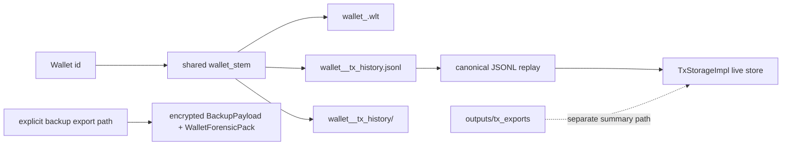

# Phase 043 Test Specification

## 🎯 Scope

This document converts the Phase 043 planning artifacts into a testable contract. The source of truth is `043-fixes-spec.md`, `043-TODO.md`, `043-CONTEXT.md`, `043-coverage.md`, `043-fixes-spec-2.md`, `043-TODO-2.md`, and the numbered `043-XX-PLAN.md` files.

No browser automation is required in this phase. E2E in this repository means live wallet, service, simulator, filesystem, or backup roundtrip coverage.

The phase keeps one live authority surface, one canonical wallet snapshot contract, one receive/status taxonomy, one tag-completeness model, and one approved sender path. The tests below must prove those seams without creating a parallel layer.

The additive spec-2 slice adds a second test focus without adding a second authority surface: public verifier honesty, typed manual asset-class audit outcomes, wallet-stem naming, required canonical JSONL history emission, explicit JSONL replay/import, live tx-store/RPC separation, and redacted closeout evidence.

## 🧭 Classification Summary

| Class | Meaning in this phase | Representative homes | Use when |
| --- | --- | --- | --- |
| TDD / unit | Pure Rust contract or in-process service behavior | [test_tx_balance.rs](../../../crates/z00z_wallets/tests/test_tx_balance.rs), [test_tx_tamper.rs](../../../crates/z00z_wallets/tests/test_tx_tamper.rs), [test_tx_fee.rs](../../../crates/z00z_wallets/tests/test_tx_fee.rs), [test_tx_pedersen.rs](../../../crates/z00z_wallets/tests/test_tx_pedersen.rs), [test_spend_proof_backend.rs](../../../crates/z00z_wallets/tests/test_spend_proof_backend.rs), [test_claim_source_proof.rs](../../../crates/z00z_storage/tests/test_claim_source_proof.rs), [test_stealth_request.rs](../../../crates/z00z_wallets/tests/test_stealth_request.rs), [test_stealth_scanner_flow.rs](../../../crates/z00z_wallets/tests/test_stealth_scanner_flow.rs), [test_runtime_validation_result.rs](../../../crates/z00z_wallets/tests/test_runtime_validation_result.rs), [test_stealth_scanner_cache.rs](../../../crates/z00z_wallets/tests/test_stealth_scanner_cache.rs), [test_stealth_scanner_prefilter.rs](../../../crates/z00z_wallets/tests/test_stealth_scanner_prefilter.rs), [test_stealth_output.rs](../../../crates/z00z_wallets/tests/test_stealth_output.rs) | The test can assert one seam without a live RPC, filesystem roundtrip, or simulator run. |
| E2E / scenario | Live service, RPC, filesystem, backup, or simulator journey | [test_tx_store_integration.rs](../../../crates/z00z_wallets/tests/test_tx_store_integration.rs), [test_wallet_export_pack_boundary.rs](../../../crates/z00z_wallets/tests/test_wallet_export_pack_boundary.rs), [test_redb_wlt_open.rs](../../../crates/z00z_wallets/tests/test_redb_wlt_open.rs), [test_wallet_service_suite.rs](../../../crates/z00z_wallets/src/services/wallet/tests/test_wallet_service_suite.rs), [test_live_path_enforcement.rs](../../../crates/z00z_wallets/tests/test_live_path_enforcement.rs), [test_e2e_send_scan.rs](../../../crates/z00z_wallets/tests/test_e2e_send_scan.rs), `backup_exporter` suite, `backup_importer` suite, `wallet_backup` suite | The behavior must be proven through the real wallet stack or a realistic roundtrip. |
| Skip | Planning-only artifacts or out-of-scope seams | `043-01` planning ledger, `043-coverage.md`, `043-SUMMARY.md`, `crates/z00z_crypto/tari/**`, `test_wallet_json_export.rs`, `test_tx_stealth_flow.rs` unless ownership moves | There is no honest runtime assertion to add in Phase 043. |

## 🔒 Required Invariants

| Invariant | How the tests prove it |
| --- | --- |
| No fake confidential input recovery from public refs | Assembler and balance tests reject public `TxInputWire` bytes, malformed resolved-input bytes, and any path that tries to infer hidden amounts from public refs. |
| JMT membership is not conservation | Storage proof tests prove membership only, and conservation tests require commitment or spend-proof evidence separately. |
| Canonical `.wlt` is wallet-state-only | Archive tests roundtrip the export pack and reject tx-history corruption without mutating wallet restore state. The wallet service restore suite also proves tampered forensic history fails closed without mutating canonical wallet state. |
| Internal receive failures stay precise | Scanner and RPC taxonomy tests keep detector, decrypt, and proof-check failures distinct, even when public compatibility still maps to `ReceiveStatus::InvalidProof`. |
| TagFilterOnly requires completeness | Tag cache and prefilter tests fail closed when only cache size or request liveness is available. |
| Approved sender flows use validated builders | Live-path and scenario tests prove accepted flows route through validated builders and do not silently regress to raw builders. |
| Closeout evidence stays redacted or hash-bound | Archive closeout artifacts do not copy plaintext seed phrases, decrypted tx bytes, or unredacted tx-history payloads. |
| Public conservation claims require an explicit witness | Audit and verifier tests keep public package verification separate from any full conservation proof unless a future protocol-change spec introduces an explicit witness. |
| Manual asset-class audit outcomes are typed | Audit tests prove target, status, outcome, mismatch class, and entry index remain visible on pass and fail-closed paths. |
| Canonical JSONL history is required and wallet-prefixed | Archive and service tests prove `wallet_<wallet_stem_hex>_tx_history.jsonl` is emitted beside `wallet_<wallet_stem_hex>.wlt`, uses the shared stem, and is not optional. |
| JSONL replay preserves the full `TxRecord` view | Import/replay tests prove `tx_hash`, `tx_bytes`, `status`, `timestamp_ms`, and `block_height` remain inspectable after replay into the live tx store. |
| Artifact boundaries do not drift | E2E tests keep the encrypted archive target path, wallet snapshot, canonical JSONL file, live tx-history directory, and `outputs/tx_exports` separate. |

## 🧪 Journey Matrix

### 043-02 Transaction Admission And Balance

| Test home | Class | Required behavior | Positive example | Negative example | Measurable pass signal |
| --- | --- | --- | --- | --- | --- |
| [test_tx_balance.rs](../../../crates/z00z_wallets/tests/test_tx_balance.rs) | TDD / unit | Canonical zero-delta balance must include fee outputs on the output side. | A valid vector of resolved inputs and outputs passes `verify_blind_balance`. | Perturb one output scalar, perturb the fee scalar, or omit the fee blind. | Valid vectors return `true`; tampered vectors return `false`. |
| [test_tx_tamper.rs](../../../crates/z00z_wallets/tests/test_tx_tamper.rs) | TDD / unit | Malformed witness bytes and malformed blobs fail closed before state apply. | Matching root/path with a typed resolver reaches the balance helper. | Tampered witness bytes or a non-empty malformed witness blob. | The failure is typed as `StateError::BadMember`. |
| [test_tx_fee.rs](../../../crates/z00z_wallets/tests/test_tx_fee.rs) | TDD / unit | Fee logic depends on structure, not on scalar value, and wrong fee packages reject. | Equal-value and different-value vectors produce the same fee; canonical package verifies. | A wrong fee output or mutated fee wire. | `verify_balance` accepts the canonical package and rejects the wrong-fee package. |
| [test_stealth_request.rs](../../../crates/z00z_wallets/tests/test_stealth_request.rs) | TDD / unit | Request signing, serialization, expiry, chain binding, and ToFU pinning stay explicit. | Valid request creation, serialization, verification, and repeat validation. | Bad signature, wrong version, wrong chain id, expired request, or identity mismatch. | Validation returns `Approved`, `RequiresUserConfirmation`, `IdentityMismatch`, or a typed `PaymentRequestError` instead of collapsing cases. |

The assembler journey must also prove that a public `TxPackage` by itself does not claim hidden-input conservation. The tests above must only call that claim successful when resolved-input evidence exists.

### 043-03 Storage Membership And Conservation Separation

| Test home | Class | Required behavior | Positive example | Negative example | Measurable pass signal |
| --- | --- | --- | --- | --- | --- |
| [test_claim_source_proof.rs](../../../crates/z00z_storage/tests/test_claim_source_proof.rs) | TDD / unit | Claim-source proofs preserve semantic root, versioning, and proof binding. | A store-backed roundtrip returns matching claim root and proof blob. | Synthetic authority, missing membership, or stale item drift. | The claim root version and proof version match, and missing membership fails with a typed error. |
| [test_tx_pedersen.rs](../../../crates/z00z_wallets/tests/test_tx_pedersen.rs) | TDD / unit | Commitment homomorphism holds and tamper changes fail. | Sets of 1..10 outputs and the 128-output set pass the commitment equality check. | Tamper one commitment or tamper the right-hand side commitment target. | `lhs == rhs_ok` for valid sets, and both tampered checks fail. |
| [test_spend_proof_backend.rs](../../../crates/z00z_wallets/tests/test_spend_proof_backend.rs) | TDD / unit | Backend decode, statement-only artifact, and tamper classes remain distinct. | Backend roundtrip and aligned public inputs decode correctly. | Forged range, balance, overlap, nullifier, or range-relation inputs; wrong prefix; noncanonical artifact. | Each tamper case fails independently instead of collapsing into one generic proof failure. |
| [test_tx_wrong_root.rs](../../../crates/z00z_wallets/tests/test_tx_wrong_root.rs) | TDD / unit | Wrong root and wrong path reject before state apply. | Matching root and path with a valid witness. | Bad root or mixed path witness. | The failure is typed as `StateError::BadMember`. |

This journey must not imply that JMT membership proves Pedersen conservation. The tests must keep storage membership, conservation, and operator-invoked asset-class audit as separate questions.

### 043-04 Optional Forensic Archive And Restore Isolation

| Test home | Class | Required behavior | Positive example | Negative example | Measurable pass signal |
| --- | --- | --- | --- | --- | --- |
| [test_wallet_export_pack_boundary.rs](../../../crates/z00z_wallets/tests/test_wallet_export_pack_boundary.rs) | E2E / scenario | The backup export path must not leak plaintext secret material and the import path must restore the pack. | Export bytes decode to JSON metadata without exposing the seed phrase; import returns the original pack. | Tampered backup bytes, wrong wallet id, or broken checksum. | The serialized backup does not contain the plaintext secret, and import succeeds only on the canonical payload. |
| [test_tx_store_integration.rs](../../../crates/z00z_wallets/tests/test_tx_store_integration.rs) | E2E / scenario | RPC history queries must read from the injected tx store. | Seeded history records and pending records are returned through RPC. | The RPC layer silently bypasses the injected store or returns the wrong records. | The exact seeded record ids are returned and the store call counts match the expected path. |
| [test_redb_wlt_open.rs](../../../crates/z00z_wallets/tests/test_redb_wlt_open.rs) | E2E / scenario | Wallet open, create, and restore paths enforce password and integrity checks. | Correct password opens the wallet and required tables are present. | Wrong password, tampered master, integrity mismatch, unsupported secret version, or unsupported info version. | Success only on the canonical open path; every failure is explicit and typed. |
| `backup_exporter` suite | TDD / unit | Export metadata, checksum binding, and ciphertext roundtrip remain symmetric. | Container roundtrip decrypts the payload and metadata fields match. | Wrong wallet id, container tamper, or checksum mismatch. | Verification succeeds only on the canonical container and fails on tamper. |
| `backup_importer` suite | TDD / unit | Import must return metadata and reject version or checksum drift before state mutation. | Metadata fields and chain identity roundtrip. | Invalid snapshot checksum, corrupted checksum, or backup version mismatch. | Import fails before restore state mutates. |
| `wallet_backup` suite | TDD / unit | Backup crypto helpers bind key derivation, AAD, and checksum to the encrypted payload. | Derive/encrypt/decrypt roundtrip succeeds and bindings remain deterministic. | Wrong-password or checksum mismatch paths. | The roundtrip is deterministic and tamper binding holds. |

The archive journey must keep the canonical `.wlt` state separate from the optional forensic envelope. A failed import must never mutate restored wallet state.

### 043-05 Receive Semantics And Compatibility

| Test home | Class | Required behavior | Positive example | Negative example | Measurable pass signal |
| --- | --- | --- | --- | --- | --- |
| [test_stealth_scanner_flow.rs](../../../crates/z00z_wallets/tests/test_stealth_scanner_flow.rs) | TDD / unit | Owned leaves produce typed opening semantics and foreign leaves are rejected. | A wallet-owned leaf scans as `Mine` with the expected asset id, serial id, amount, tag, and report status. | Wrong KDH, wrong scan, wrong request binding, or a foreign leaf. | Owned outputs return `ReceiveStatus::Detected`; foreign outputs return `NotMine` and `ReceiveReject::NotMine`. |
| [test_import_error_taxonomy.rs](../../../crates/z00z_wallets/tests/test_import_error_taxonomy.rs) | E2E / scenario | Live import failures must keep distinct codes and must not collapse into one generic receive error. | Bad JSON and bad crypto produce different `IMPORT_*` codes. | Generic error collapse or a log/doc path that implies a downstream proof verifier ran when it did not. | Each failure stays on its own typed code path and the outward compatibility mapping stays stable. |
| [test_runtime_validation_result.rs](../../../crates/z00z_wallets/tests/test_runtime_validation_result.rs) | TDD / unit | Validation JSON keeps warnings separate from errors. | Valid-with-warnings serializes warnings only; invalid serializes error only. | Warnings collapse into errors or errors collapse into warnings. | The JSON shape contains the correct field and omits the other one. |

This journey must keep `ReceiveStatus::InvalidProof` as an outward compatibility label only. Internal detector, decrypt, and proof-check failures must stay more precise than the public mapping.

### 043-06 Tag16 Completeness And Fallback

| Test home | Class | Required behavior | Positive example | Negative example | Measurable pass signal |
| --- | --- | --- | --- | --- | --- |
| [test_stealth_scanner_cache.rs](../../../crates/z00z_wallets/tests/test_stealth_scanner_cache.rs) | TDD / unit | Cache insert, collision, clear, stats, and background strategy use proven completeness, not size. | Insert, collision, active-request tracking, stats, and clear all behave as expected. | Cache size alone or request liveness alone is treated as completeness. | `TagFilterOnly` is selected only when concrete contexts are complete; stats remain separate from completeness. |
| [test_stealth_scanner_prefilter.rs](../../../crates/z00z_wallets/tests/test_stealth_scanner_prefilter.rs) | TDD / unit | Request-bound candidates stay ahead of fallback, and direct scan remains available when strict completeness is absent. | Complete contexts allow `scan_leaf_tag_only` to find the owned output; request-bound flow matches before fallback. | Incomplete context, cache-size-only strategy, or a path that removes direct-scan fallback. | The strict path fails closed without completeness, and the fallback path still finds owned outputs when allowed. |

This journey must prove that best-effort scans still fall back to direct scan, and that strict tag-only mode cannot be justified by request metadata or cache size alone.

### 043-07 Approved Sender And Live Path

| Test home | Class | Required behavior | Positive example | Negative example | Measurable pass signal |
| --- | --- | --- | --- | --- | --- |
| [test_stealth_output.rs](../../../crates/z00z_wallets/tests/test_stealth_output.rs) | TDD / unit | Owner tags verify and different outputs stay unlinkable. | Valid owner tag verification and distinct outputs built with different nonce/index values. | Invalid owner tag or two outputs that accidentally link. | `verify` succeeds only for the correct tag, and unlinkability assertions hold. |
| [test_live_path_enforcement.rs](../../../crates/z00z_wallets/tests/test_live_path_enforcement.rs) | E2E / scenario | The live RPC import path uses the validated flow and rejects stubbed or malformed proofs. | A valid owned wire imports successfully and increments the verification-complete counter. | Tampered proof bytes or any raw-builder regression on the live path. | The valid path succeeds, the invalid path returns `IMPORT_CRYPTO_VERIFY_FAILED`, and the verification counter stays at zero on failure. |
| [test_e2e_send_scan.rs](../../../crates/z00z_wallets/tests/test_e2e_send_scan.rs) | E2E / scenario | A sender can build an owned output and the receiver can scan owned versus foreign outputs correctly. | Bob mines the output and Carol does not. | A foreign output mines or the sender flow fails to produce an owned output. | The owned path returns `Mine`; the foreign path returns `NotMine`. |

The approved sender journey must prove that validated builders own the accepted flow, while raw builders remain explicit raw seams.

### 043-08 To 043-10 Regression Waves And Closeout

| Wave | Scope | What must remain true | Evidence update |
| --- | --- | --- | --- |
| 043-08 | Tx and conservation regression wave | Every tx/conservation requirement row points to one decisive regression home, and the typed failure classes remain distinguishable. | Update `043-coverage.md` with the green or failing anchor for each tx/conservation row. |
| 043-09 | Receive, tag, and output regression wave | Every EV-008 through EV-014 row points to one final regression home, and no approved sender or strict-tag regression is left on prose alone. | Update `043-coverage.md` with the final receive/tag/output anchors. |
| 043-10 | Archive closure and phase closeout | The archive envelope stays optional and explicit, and the final simulator gates stay honest. | Update `043-SUMMARY.md` and `043-coverage.md` with decisive evidence and any explicit deferrals. |

### 043-11 To 043-18 Additive Spec-2 E2E Coverage

The following test contract is derived from `043-fixes-spec-2.md`, `043-TODO-2.md`, and plans `043-11` through `043-18`. After the additive 043-17 implementation and 043-18 evidence sync, every scenario below is mapped to landed runtime anchors or closeout evidence in the existing Phase 043 artifacts.

| Scenario ID | Primary homes | Class | Required behavior | Positive example | Negative example | Measurable pass signal |
| --- | --- | --- | --- | --- | --- | --- |
| SPEC2-E2E-01 | [test_tx_pedersen.rs](../../../crates/z00z_wallets/tests/test_tx_pedersen.rs), [test_spend_proof_backend.rs](../../../crates/z00z_wallets/tests/test_spend_proof_backend.rs) | integration | Public verifier wording and manual audit remain separate; typed audit outcome carries target/status/report/mismatch. | Valid asset-class leaves with an expected total produce `AssetClassAuditStatus::Pass` and a report with target and no mismatch. | Missing evidence, wrong root, asset-class mismatch, duplicate entry, commitment mismatch, or target mismatch produce `FailClosed` with the precise `AssetClassAuditMismatchClass`. | Pass and fail-closed outcomes expose target, status, optional mismatch, and entry index where entry-specific. |
| SPEC2-E2E-02 | [test_wallet_service_suite.rs](../../../crates/z00z_wallets/src/services/wallet/tests/test_wallet_service_suite.rs) | integration | One wallet stem drives snapshot, canonical JSONL filename, and live tx-history directory. | One wallet id derives `wallet_<stem>.wlt`, `wallet_<stem>_tx_history.jsonl`, and `wallet_<stem>_tx_history/`. | Legacy `tx_history_<stem>.jsonl` is requested or generated as canonical. | Helpers return only wallet-prefixed canonical names; legacy order is absent from canonical output. |
| SPEC2-E2E-03 | [test_wallet_export_pack_boundary.rs](../../../crates/z00z_wallets/tests/test_wallet_export_pack_boundary.rs), `backup_exporter` suite | E2E / scenario | Forensic export writes both encrypted archive and required canonical JSONL from the same validated record set. | Export with two `TxRecord` entries writes the encrypted archive to the caller path and emits wallet-prefixed JSONL beside the snapshot. | Export skips JSONL, writes JSONL to `outputs/tx_exports`, or emits a record hash mismatch. | Archive validates, JSONL exists beside `.wlt`, every line is hash-bound, and omission is a failure. |
| SPEC2-E2E-04 | [test_wallet_export_pack_boundary.rs](../../../crates/z00z_wallets/tests/test_wallet_export_pack_boundary.rs), [test_redb_wlt_open.rs](../../../crates/z00z_wallets/tests/test_redb_wlt_open.rs) | E2E / scenario | Canonical `.wlt` restore/load remains wallet-state-first while export-time JSONL is required. | `.wlt` restore/load succeeds when restore input lacks plaintext JSONL. | Export path omits required canonical JSONL or tries to absorb tx-history into `.wlt`. | Restore/load remains valid for wallet state; export omission fails on the archive/export seam. |
| SPEC2-E2E-05 | [test_tx_store_integration.rs](../../../crates/z00z_wallets/tests/test_tx_store_integration.rs), [test_wallet_service_suite.rs](../../../crates/z00z_wallets/src/services/wallet/tests/test_wallet_service_suite.rs) | E2E / scenario | Canonical JSONL replay/import hydrates `TxStorageImpl` and preserves the full `TxRecord` view. | A JSONL file containing `tx_hash`, `tx_bytes`, `status`, `timestamp_ms`, and `block_height` replays into the live store. | Malformed line, missing field, duplicate tx hash, mismatched `record_hash`, or mismatched `tx_bytes_hash`. | Live store remains unchanged on failure; after success every `TxRecord` field is inspectable. |
| SPEC2-E2E-06 | [test_backup_importer_suite.rs](../../../crates/z00z_wallets/src/backup/import/test_backup_importer_suite.rs), [test_tx_store_integration.rs](../../../crates/z00z_wallets/tests/test_tx_store_integration.rs) | E2E / scenario | Explicit import mode gates all tx-history mutation. | `WalletOnly`, `TxHistoryOnly`, and `WalletPlusHistory` each mutate only their intended state. | Missing forensic section, malformed archive, or tampered manifest in history modes. | Wallet mutation and live-store writes happen only after validation and only for the selected mode. |
| SPEC2-E2E-07 | [test_tx_store_integration.rs](../../../crates/z00z_wallets/tests/test_tx_store_integration.rs), [test_wallet_service_suite.rs](../../../crates/z00z_wallets/src/services/wallet/tests/test_wallet_service_suite.rs), [tx_rpc_storage.rs](../../../crates/z00z_wallets/src/adapters/rpc/methods/tx_rpc_storage.rs) | E2E / scenario | Encrypted archive, snapshot, canonical JSONL, live tx-history directory, and RPC `outputs/tx_exports` stay distinct. | All artifacts are produced or referenced in one scenario and compared by path and semantic role. | RPC export path is reused as forensic history, live dir is treated as JSONL, or archive path is redirected. | Path assertions prove five distinct artifact roles with no collapse. |
| SPEC2-E2E-08 | [test_wallet_export_pack_boundary.rs](../../../crates/z00z_wallets/tests/test_wallet_export_pack_boundary.rs), [test_wallet_service_suite.rs](../../../crates/z00z_wallets/src/services/wallet/tests/test_wallet_service_suite.rs) | integration + diagnostics | Plaintext operator artifacts stay secret-redacted and hash-bound. | JSONL contains opaque `TxRecord.tx_bytes` and hashes but no sentinel seed phrase, decrypted asset-pack field, or wallet-local secret. | Sentinel secret strings appear in JSONL, summary, coverage, or logs outside the encrypted archive boundary. | Redaction assertions and closeout grep reject `seed_phrase`, `wallet_identity`, `tx_bytes`, `enc_pack`, `asset_secret`, and `blinding` leakage in non-approved evidence. |
| SPEC2-E2E-09 | [test_rpc_types_serialization.rs](../../../crates/z00z_wallets/tests/test_rpc_types_serialization.rs), [test_backup_importer_suite.rs](../../../crates/z00z_wallets/src/backup/import/test_backup_importer_suite.rs) | integration | Forensic enablement is explicit and not persisted through `PersistBackupSettings`. | Export uses `new_with_forensic_history(...)`; import uses `ForensicImportMode`. | A new persisted backup setting silently enables forensic export/import. | Serialization and source-shape checks prove no forensic toggle exists in `PersistBackupSettings`. |
| SPEC2-E2E-10 | [043-coverage.md](./043-coverage.md), [043-SUMMARY.md](./043-SUMMARY.md) | diagnostics | Coverage and summary remain the only closeout evidence carriers for spec-2. | Every spec-2 requirement row has landed evidence in the existing ledger and summary. | `043-coverage-2.md`, `043-SUMMARY-2.md`, or prose-only closure appears. | Ledger and summary contain all final anchors; the no-parallel-artifact gate returned the expected no-match result. |

## 🚫 Skip And Reservation Rules

| Item | Status | Reason |
| --- | --- | --- |
| `043-01` planning artifacts | Skip as runtime test targets | They are planning inputs only; the measurable outcome is ledger completeness, not a runtime assertion. |
| `test_wallet_json_export.rs` | Skip unless archive serialization ownership moves | The archive seam is already owned by the backup/export/import suites. |
| `test_tx_stealth_flow.rs` | Skip unless sender-flow ownership moves | The current seam is truthfully owned by the validated output and live-path tests. |
| `crates/z00z_crypto/tari/**` | Skip forever | Vendor code is read-only in this repository. |
| unrelated fee/prover/repository-wide TODOs | Skip | They are outside Phase 043 unless the spec is updated first. |

## ✅ Completion Criteria

Phase 043 is test-spec complete when all of the following are true:

| Criterion | Pass condition |
| --- | --- |
| Coverage linkage | Every `EV-`, `PH43-`, `D-043-`, and `AC-043-` row in `043-coverage.md` maps to a named test home or an explicit spec-backed deferral. |
| Journey coverage | Transaction admission, conservation, archive, receive, tag, and output journeys each have at least one positive and one negative scenario. |
| Boundary honesty | No scenario depends on a parallel layer, a public JMT conservation claim, a silent `.wlt` expansion, or a raw-builder regression on an approved flow. |
| Evidence discipline | Sensitive archive evidence remains redacted or hash-bound in closeout artifacts. |
| Regression order | The 043-08, 043-09, and 043-10 waves remain anchored to actual commands and named tests, not prose-only claims. |
| Spec-2 E2E addendum | Plans `043-17` and `043-18` implement and verify the spec-2 E2E scenarios above without creating a parallel archive stack, tx-history store, coverage ledger, or summary. |

If a scenario cannot be supported by the current test homes, the gap must be recorded in `043-coverage.md` rather than widened into a new parallel seam.
