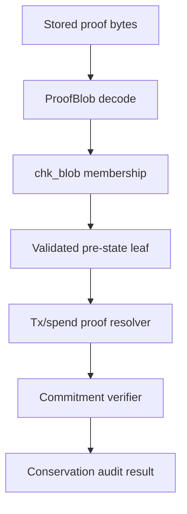
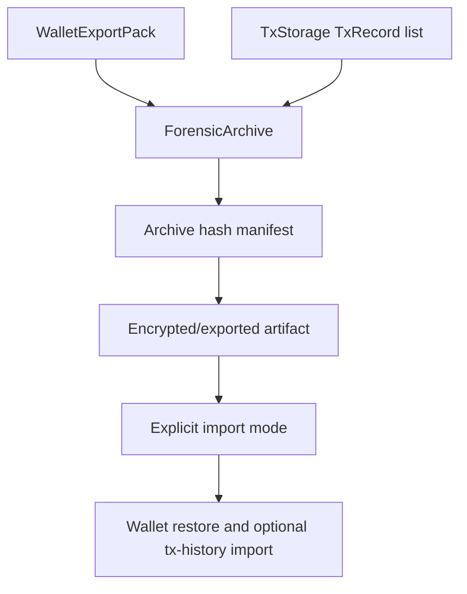

# Phase 043 Gaps Fixes Specification

<!-- markdownlint-disable MD013 MD033 MD041 MD055 MD056 -->

## 🎯 Purpose

This specification converts the specific verified TODO and gap set listed in `Source Evidence`
into an implementation-ready Phase 043 plan. It does not claim to close every wallet or storage
TODO marker in the repository.
It is intentionally narrower than a general wallet cleanup phase: it closes security-relevant and
logic-relevant seams where current source code can be misunderstood as complete, while preserving
the boundaries already established by Phase 042.

The scope of this phase is limited to the verified seams in EV-001 through EV-014 plus the live
call-site and test guards they imply. Unrelated interface TODO blocks in fee estimation, proof
prover internals, generic backup traits, or broad persistence traits are not part of Phase 043
unless they are explicitly named below as part of the forensic-archive slice.

The phase must produce code and tests that make the following truths explicit:

- Transaction assembly must no longer return Phase 1 stub errors on the active trait path.
- Storage JMT proofs prove storage membership, path, leaf, and root binding only.
- Pedersen or commitment conservation must be verified by transaction/proof/conservation logic, not by JMT membership alone.
- Manual asset-class Pedersen total audits are explicit operator-invoked diagnostic services; canonical tx admission verifies only the zero net commitment delta of resolved consumed inputs versus produced outputs, including fee outputs.
- Canonical `.wlt` stays wallet state; full forensic tx-history export is a separate optional archive surface.
- Receiver scan DTOs must not expose placeholder-labeled secrets or imply proof verification that did not run.
- Tag16 cache acceleration must be separated from strict tag-only completeness.
- Raw, compatibility, and validated stealth output builders must be impossible to confuse in accepted sender flows.

## 🔒 Live Authority Surface

Phase 043 extends the existing truthful seams. Unless this spec is updated first, the live
authority surface remains:

- `TxAssemblerImpl`
- `verify_full_tx_package(...)`
- `ProofBlob::{decode, chk_item, chk_blob}`
- `TxRecord`
- `WalletExportPack`
- `WalletPersistenceState`
- `ReceiveStatus::InvalidProof`
- `Tag16Cache`
- `ordered_request_candidates(...)`
- `build_card_stealth_output_validated(...)`
- `build_tx_stealth_output_validated(...)`

Phase 043 must extend these seams rather than introduce a second tx assembler, a second public
proof verifier, a second canonical `.wlt` history layer, a second receive decode path, or a
second approved-sender facade.

## 📌 Source Evidence

The following source facts were verified before this spec was written.

| ID | Evidence | Verified Fact | Phase 043 Consequence |
| --- | --- | --- | --- |
| EV-001 | `crates/z00z_wallets/src/tx/tx_assembler.rs` | `TxAssemblerImpl::{assemble,sum_inputs,sum_tx_outputs,verify_balance}` return `not implemented in Phase 1` errors. | Replace stubs with real decoding, assembly, and honest balance/proof routing. |
| EV-002 | `crates/z00z_wallets/src/tx/verify/tx_wire_types.rs` | `TxInputWire` is reference-only and does not inline consumed leaf value. | Do not fake input amount extraction from public tx bytes. Full conservation needs resolved pre-state or spend proof. |
| EV-003 | `crates/z00z_wallets/src/tx/verify/tx_verifier.rs` | Local verifier checks structure, fee rules, digest, signatures, range proofs, and states that value conservation depends on tx proof or resolved pre-state. | Assembler balance must call the existing verifier and add resolved-input checks only where inputs are available. |
| EV-004 | `crates/z00z_storage/src/assets/proof.rs` | `ProofBlob::chk_blob` verifies typed item, leaf hash, semantic/backend root binding, and JMT existence proofs. | JMT proof scanning is a membership source, not the conservation theorem. |
| EV-005 | `crates/z00z_storage/src/assets/README.MD` | Storage docs separate semantic `AssetStateRoot` from private physical `backend_root`. | New scanner/audit code must keep semantic and physical roots separated. |
| EV-006 | `crates/z00z_wallets/src/persistence/tx/tx_storage.rs` | `TxRecord` stores `tx_hash`, `tx_bytes`, status, timestamp, and optional block height outside the `.wlt` snapshot type. | Forensic history archive can include `TxRecord`; canonical `.wlt` should not become mandatory tx-history storage. |
| EV-007 | `crates/z00z_wallets/src/wallet/snapshot/snapshot_types.rs` | `WalletPersistenceState` stores snapshot state and claimed assets; `WalletExportPack` stores snapshot plus seed phrase and identity. | Add forensic archive as an export/import envelope around existing surfaces, not as a stealth change to `.wlt`. |
| EV-008 | `crates/z00z_wallets/src/receiver/scan/types_receive.rs` | `WalletStealthOutput.asset_secret` and `WalletStealthOutput.blinding` are documented as placeholders. | Replace placeholder semantics with typed opening/redaction semantics. |
| EV-009 | `crates/z00z_wallets/src/receiver/scan/types_receive.rs` | `ReceiveStatus::InvalidProof` is a compatibility label and docs say no downstream proof verifier necessarily ran. | Keep public compatibility only with an explicit internal detector-failure taxonomy. |
| EV-010 | `crates/z00z_wallets/src/receiver/scan/types_tag_cache.rs` | `Tag16Cache` is best-effort; `add_request` records active request id only. | Strict tag-only mode must require complete concrete decrypt contexts and fail closed otherwise. |
| EV-011 | `crates/z00z_wallets/src/receiver/scan/stealth_scanner.rs` | `scan_leaf_tag_only` never falls back to direct scan; `background_scan_strategy` may return `TagFilterOnly` by cache size. | Strategy selection must not choose strict tag-only mode unless context completeness is proven. |
| EV-012 | `crates/z00z_wallets/src/receiver/scan/stealth_scan_support.rs` | `ordered_request_candidates(...)` already keeps request-bound candidates ahead of the request-less fallback. | Phase 043 must preserve this ordering while adding stricter completeness gates. |
| EV-013 | `crates/z00z_wallets/src/stealth/output/output.rs` | Compatibility, stateless, raw, card-validated, and request-validated builders are documented as distinct lanes. | Add source guards and tests so active sender flows use validated builders where approval is required. |
| EV-014 | `crates/z00z_wallets/src/adapters/rpc/methods/asset_impl_server_transfer.rs` | The live RPC asset-send path still calls raw `build_tx_stealth_output(...)`. | Phase 043 must migrate this live call site to a validated builder and guard it against regression. |

## ⚙️ Scope

### ✅ In Scope

- Implement or redesign the active `TxAssembler` path so it no longer ships reachable Phase 1 stubs.
- Add a storage/checkpoint audit surface that uses `ProofBlob` membership verification as input and separate commitment/proof logic for conservation.
- Add an optional forensic archive/export contract that can carry encrypted wallet export data and tx history records without changing canonical `.wlt` semantics.
- Replace placeholder receive DTO fields or make their redaction/availability contract explicit.
- Clarify public receive status compatibility versus internal detector/proof failure causes.
- Make tag16 cache completeness explicit and fail closed for strict tag-only scans.
- Harden stealth output builder contracts with source-shape and behavior tests.
- Update focused docs and tests that teach or validate these boundaries.

### 🚫 Out Of Scope

- Modifying `crates/z00z_crypto/tari/**` vendor code.
- Replacing the current JMT backend or exposing raw `jmt` node/proof types to wallet callers.
- Making `.wlt` a mandatory transaction-history database.
- Claiming a public trustless verifier exists where the current code performs wallet-local or pre-broadcast checks only.
- Broad wallet UI placeholder cleanup unrelated to the verified Phase 043 gaps.
- Repository-wide cleanup of unrelated `# TODO` blocks such as `tx/fees/fee_estimator.rs`,
  `tx/proof/prover.rs`, generic `backup_exporter` or `backup_importer` trait notes, or broad
  persistence-trait placeholder docs that are not required by the explicit forensic archive scope.

## 🔑 Required Design Decisions

These decisions are locked for Phase 043 unless implementation evidence proves them impossible.

| Decision ID | Decision | Rationale | Impact |
| --- | --- | --- | --- |
| D-043-001 | Keep JMT membership and Pedersen conservation as separate verification layers. | Source evidence shows `ProofBlob` verifies storage membership/root binding only. | Prevents false security claims and makes failure classes precise. |
| D-043-002 | Keep canonical `.wlt` as wallet state; add forensic archive as an optional export/import envelope. | `WalletPersistenceState` and `TxStorageImpl` are already separate persistence surfaces. | Avoids silently expanding `.wlt` semantics while still enabling full replay/debug exports. |
| D-043-003 | `TxAssembler::sum_inputs` must not infer hidden amounts from reference-only public inputs. | `TxInputWire` carries `asset_id_hex` and `serial_id`, not an amount or opening. | Implementation must use wallet-local resolved input bytes or fail closed. |
| D-043-004 | Public `RECEIVE_INVALID_PROOF` compatibility may remain, but internal code must distinguish detector failures from proof-verifier failures. | Current docs already say the compatibility label does not imply downstream proof verification. | RPC compatibility stays stable while internal diagnostics become honest. |
| D-043-005 | `TagFilterOnly` can be selected only when concrete tag contexts are complete for the scan domain. | Cache size alone cannot prove ownership-scan completeness. | Prevents missed wallet-owned outputs from best-effort caches. |
| D-043-006 | Approved sender flows must call validated builders, not raw builders. | Raw builders explicitly require caller-side validation. | Source guards catch future regressions in Scenario 1 and RPC send paths. |
| D-043-007 | Expose asset-class Pedersen total recomputation as an explicit operator-invoked local diagnostic surface, not as canonical tx admission. | Full asset-class supply audits and per-tx admission checks answer different questions and require different evidence shape and cost. | Prevents accidental throughput regressions, avoids creating a new remote/network trust boundary inside Phase 043, and keeps no-extra-emission audits separate from canonical zero-delta checks. |

## 📌 Requirements

### PH43-TXASM: Transaction Assembly Closure

- WHEN `TxAssemblerImpl::assemble` receives valid wallet-local resolved inputs and valid output wires, THE SYSTEM SHALL build a canonical regular `TxPackage` payload with a correct digest and no Phase 1 stub error.
- WHEN `TxAssemblerImpl::assemble` receives malformed input bytes, malformed output bytes, duplicate inputs, duplicate outputs, invalid fee output shape, or invalid chain metadata, THE SYSTEM SHALL fail closed with a typed `TxAssemblerError` without producing tx bytes.
- WHEN `sum_inputs` is called, THE SYSTEM SHALL decode only an explicit wallet-local resolved-input wire format that includes the data needed for summing or commitment aggregation.
- IF `sum_inputs` receives public `TxInputWire` bytes or any input that lacks resolved value/opening data, THEN THE SYSTEM SHALL return an error rather than infer a confidential amount.
- WHEN `sum_tx_outputs` is called with canonical `TxOutputWire` bytes, THE SYSTEM SHALL decode `AssetWire` or `AssetPkgWire` through existing typed conversion paths and sum only values that are semantically visible in the decoded asset lane.
- WHEN `verify_balance` receives a serialized public `TxPackage`, THE SYSTEM SHALL route through `TxVerifierImpl` or `verify_full_tx_package` and report only the guarantees that verifier can actually make.
- WHEN canonical tx admission has resolved consumed-input commitments and produced output commitments, THE SYSTEM SHALL verify zero net commitment delta across those inputs and outputs, with fee outputs included on the output side rather than treated as out-of-band metadata.
- IF declared fee differs from the sum of fee outputs or from the fee units required by the active tx schema, THEN THE SYSTEM SHALL fail closed before reporting canonical balance success.
- WHERE full value conservation is required, THE SYSTEM SHALL use a new resolved-pre-state verification path that pairs public input refs with validated pre-state leaves or spend-proof input commitments.

### PH43-CONSERVE: Storage Membership And Conservation Audit

- WHEN storage membership evidence is scanned, THE SYSTEM SHALL use `ProofBlob::decode`, `chk_item`, and `chk_blob` as the storage-owned verification boundary.
- WHEN a proof blob verifies, THE SYSTEM SHALL treat it as evidence that a leaf exists at a path under the expected semantic root and backend root binding.
- THE SYSTEM SHALL NOT treat a JMT proof, `backend_root`, or `AssetStateRoot` as a Pedersen conservation proof.
- WHEN conservation is audited, THE SYSTEM SHALL explicitly join validated storage leaves with tx/proof/commitment evidence and run commitment/proof verification in the wallet or tx layer.
- IF any required membership, root, path, leaf, spend-proof, or commitment evidence is missing, THEN THE SYSTEM SHALL report a distinct fail-closed audit status rather than silently pass.

### PH43-ASSETAUDIT: Manual Asset-Class Pedersen Total Audit

- WHEN a manual asset-class conservation audit is explicitly invoked by an operator or local diagnostic job, THE SYSTEM SHALL gather the validated leaves for exactly one selected asset class under the selected semantic root and aggregate their Pedersen commitments into a single asset-class total.
- WHEN the manual asset-class audit is provided an expected total commitment, checkpoint equation, or issuance/burn delta target, THE SYSTEM SHALL compare the recomputed asset-class total against that target and fail closed on mismatch.
- THE SYSTEM SHALL expose asset-class Pedersen total recomputation as an out-of-band operator-invoked local diagnostic surface, not as an implicit step of canonical tx admission.
- WHEN the manual audit completes, THE SYSTEM SHALL emit a typed report containing the asset class, semantic root, backend root, verified leaf count, recomputed total commitment, and mismatch class.
- IF any required leaf, proof, asset-class discriminator, or audit target is missing or inconsistent, THEN THE SYSTEM SHALL return a typed audit failure rather than downgrade to best-effort output.

### PH43-ARCHIVE: Optional Forensic Archive

- THE SYSTEM SHALL keep canonical `.wlt` semantics limited to wallet snapshot state and claimed assets unless a future spec explicitly changes the format.
- WHEN a full forensic export is requested, THE SYSTEM SHALL produce a separate versioned archive envelope that includes an encrypted `WalletExportPack`, tx-history records, tx-byte hashes, chain identity, schema version, and export metadata.
- WHEN importing a forensic archive, THE SYSTEM SHALL require explicit caller intent before importing tx-history records into `TxStorageImpl`.
- IF the archive contains tx-history entries whose manifest metadata, serialized entry hash, or manifest key versus record `tx_hash` label do not match, THEN THE SYSTEM SHALL reject the tx-history section and leave wallet state unchanged.
- THE SYSTEM SHALL document forensic archive as diagnostic/replay support, not as a replacement for chain truth or checkpoint proof verification.
- THE SYSTEM SHALL anchor forensic archive transport to the existing `BackupContainer`/`BackupPayload` encryption and checksum seam rather than invent a second archive container stack.
- THE SYSTEM SHALL reuse the existing exporter-side integrity verification seam included by `backup_exporter_verify.rs` together with importer verification so archive transport validation stays symmetric and no second verification stack is introduced.
- IF forensic export/import or phase-closeout evidence is generated, THEN THE SYSTEM SHALL NOT log, persist outside the encrypted archive boundary, or copy plaintext seed phrases, decrypted tx bytes, or unredacted tx-history payloads into logs, summaries, or validation notes; only redacted or hash-bound evidence is allowed.

### PH43-RECEIVE: Receive DTO And Status Honesty

- WHEN a wallet-owned output is returned from scanner code, THE SYSTEM SHALL preserve the already-decoded opening bytes sourced from `DetectedAssetPack::{s_out, blinding}` and expose them through a typed contract such as `DetectedAssetPack` or `DetectedOpening`, not through placeholder-labeled wrapper fields.
- IF output secret or blinding data is intentionally unavailable, THEN THE SYSTEM SHALL encode that as an explicit redacted/unavailable state rather than a placeholder field.
- WHEN scanner-side validation fails before proof verification, THE SYSTEM SHALL record an internal rejection reason that names detector or candidate validation failure.
- WHERE public RPC compatibility requires `RECEIVE_INVALID_PROOF`, THE SYSTEM SHALL keep that outward code as a compatibility mapping only.
- THE SYSTEM SHALL include tests proving that detector failures do not claim downstream proof verification in logs, docs, or report metadata.

### PH43-TAG: Tag16 Cache Completeness

- WHEN the scanner uses best-effort tag16 cache acceleration, THE SYSTEM SHALL keep direct scan fallback available unless the caller explicitly requested strict tag-only mode.
- WHEN strict tag-only mode is requested, THE SYSTEM SHALL require a complete set of concrete `Tag16Context` entries for the scan domain.
- IF only `add_request` or active request id metadata is present, THEN THE SYSTEM SHALL NOT classify strict tag-only ownership as complete.
- WHEN `background_scan_strategy` chooses a strategy, THE SYSTEM SHALL NOT return strict `TagFilterOnly` based on cache size alone unless context completeness is proven.
- THE SYSTEM SHALL preserve the existing request-bound candidate ordering where request-specific candidates are tested before the request-less fallback.
- THE SYSTEM SHALL expose cache statistics separately from completeness status.

### PH43-OUTPUT: Stealth Output Builder Contract Hardening

- WHEN an accepted sender flow builds a card-only output, THE SYSTEM SHALL use `build_card_stealth_output_validated` or a stricter successor.
- WHEN an accepted sender flow builds a request-bound output, THE SYSTEM SHALL use `build_tx_stealth_output_validated` or a stricter successor.
- THE SYSTEM SHALL keep raw builders documented as raw construction seams requiring caller-side validation.
- THE SYSTEM SHALL add tests or source-shape guards proving the live RPC send path in `asset_impl_server_transfer.rs`, and any scenario entrypoint that routes through that approved sender policy, do not permit direct `build_tx_stealth_output(...)` or `build_tx_stealth_output_serial(...)` use where receiver approval is required.
- IF a compatibility helper remains public, THEN its Rustdoc shall state the missing policy checks and point to the validated constructor.

## ⚙️ Architecture

### 🔑 Layer Boundaries

| Layer | Owns | Must Not Own |
| --- | --- | --- |
| `z00z_storage::assets::proof` | Storage witness codec, semantic root/path/leaf checks, backend JMT existence proof checks. | Pedersen balance, wallet ownership, tx admission, or public spend theorem claims. |
| `z00z_wallets::core::tx` | Tx package assembly, fee/digest/structure checks, spend-proof routing, wallet-local resolved-input checks. | Raw storage backend details or hidden JMT internals. |
| `z00z_wallets::core::receiver` | Ownership scan reports, tag prefiltering, receive status taxonomy, decoded wallet-local opening DTOs. | Downstream checkpoint proof verification claims unless explicitly invoked. |
| `z00z_wallets::core::stealth` | Sender output construction, raw/validated builder split, card/request approval enforcement. | Persistence archive semantics or chain admission. |
| `z00z_wallets::persistence` | Tx history records and optional forensic import/export targets. | Mandatory chain truth or checkpoint validity. |

### 📌 Conservation Flow



`chk_blob` is necessary but not sufficient for conservation. The conservation audit starts only after
membership succeeds and then validates tx/proof/commitment evidence in the wallet/tx layer.

### 📌 Manual Audit vs Canonical Path

The asset-class Pedersen total audit is an explicit operator-invoked diagnostic surface. It may walk
all validated leaves for one selected asset class and compare their aggregated commitment against an
expected total or checkpoint equation.

Canonical tx admission is narrower. It verifies the zero net commitment delta of the resolved
consumed inputs versus the produced outputs of the candidate transaction, with fee outputs included
on the output side. Canonical admission does not need to rescan the full asset class.

### 🔑 Forensic Archive Flow



The archive is not `.wlt`. It is an explicit diagnostic envelope that can be rejected without touching
the canonical wallet snapshot.

## 🛠️ Implementation Plan

### Phase Gate 0: Inventory And Failing Tests

1. Create a Phase 043 coverage ledger at `.planning/phases/043-gaps-fixes/043-coverage.md` before code edits.
2. Record every requirement in this spec, every risk watchpoint, and every no logical weak spots item in `.planning/phases/043-gaps-fixes/043-coverage.md` with owner file, implementation task, test task, evidence slot, and anti-drift note.
3. Add or identify failing tests for each verified gap before implementing behavior.
4. Confirm no edits target `crates/z00z_crypto/tari/**`.

Required inventory commands:

```bash
rg -n "not implemented in Phase 1|# TODO|placeholder|best-effort only|does not assert that a downstream proof verifier ran here" crates/z00z_wallets/src crates/z00z_storage/src
rg -n "build_tx_stealth_output\(|build_tx_stealth_output_serial\(|build_tx_stealth_output_validated\(|build_card_stealth_output_validated\(" crates/z00z_wallets/src crates/z00z_wallets/tests
rg -n "TxStorageImpl|TxRecord|WalletExportPack|WalletPersistenceState" crates/z00z_wallets/src
```

### Phase Gate 1: Tx Assembler Closure

Primary files:

- `crates/z00z_wallets/src/tx/tx_assembler.rs`
- `crates/z00z_wallets/src/tx/verify/tx_wire_types.rs`
- `crates/z00z_wallets/src/tx/verify/tx_verifier.rs`
- `crates/z00z_wallets/src/tx/balance.rs`
- `crates/z00z_wallets/src/tx/mod.rs`
- `crates/z00z_wallets/tests/**` or module-local tx tests

Implementation steps:

1. Add a wallet-local resolved input DTO for assembler input bytes, for example `AsmInputWire` or `ResolvedTxInput`, with explicit value/opening/commitment fields. Keep identifier names within the five-word rule.
2. Decode `TxAssemblyParams.inputs_bytes` as the resolved input DTO, not as public `TxInputWire`.
3. Decode `TxAssemblyParams.tx_outputs_bytes` as canonical `TxOutputWire` or a strict wrapper that converts to it.
4. Reject empty inputs, empty outputs, malformed bytes, duplicate input refs, duplicate output state keys, duplicate nonces, and invalid fee output shape.
5. Build `TxWire`, compute package digest through `build_tx_package_digest`, then serialize `TxPackage` through `JsonCodec`.
6. Route `verify_balance(tx_bytes)` through `verify_full_tx_package` for public package checks.
7. Add or tighten the canonical resolved-balance helper so it consumes resolved input commitments and produced output commitments explicitly, includes fee outputs on the output side, and fails closed on non-zero net delta.
8. Delete or rewrite stub TODO docs in `tx_assembler.rs` so docs describe actual guarantees and limitations.

Negative rules:

- Do not return `0`, counts, or best-effort values from `sum_inputs` when input amounts are not present.
- Do not claim public `TxPackage` bytes alone prove full conservation of referenced inputs.
- Do not exclude fee outputs from the resolved-input balance equation when claiming canonical zero-delta admission.
- Do not bypass `TxVerifierImpl` for package structure, fee, digest, signatures, or range-proof checks.

### Phase Gate 2: Membership And Conservation Audit

Primary files:

- `crates/z00z_storage/src/assets/proof.rs`
- `crates/z00z_storage/src/assets/store_internal/proof_help.rs`
- `crates/z00z_storage/src/assets/store_internal/store_query.rs`
- `crates/z00z_storage/src/assets/test_*.rs`
- `crates/z00z_wallets/src/tx/spend/**`
- `crates/z00z_wallets/src/tx/verify/**`

Conditional helper files, only if the existing truthful seams cannot hold the implementation:

- `crates/z00z_storage/src/assets/proof_scan.rs`
- `crates/z00z_wallets/src/tx/commit_audit.rs`

Implementation steps:

1. Add a storage-side scanner that iterates proof blobs or proof-capable asset paths and returns typed membership results.
2. Keep `ProofBlob`, `chk_item`, and `chk_blob` as the only proof verification gateway for storage witness bytes.
3. Return a typed result such as `ProofScanOut` containing path, semantic root, backend root, leaf hash, and verified leaf.
4. Add wallet/tx-side conservation audit logic that consumes verified leaves plus tx package/proof evidence.
5. Add an operator-invoked asset-class audit service on the existing truthful wallet/tx seam first, using `commit_audit.rs` or an equivalent helper module only if the current seam cannot carry that behavior honestly.
6. Report separate failure classes: membership failure, root binding failure, leaf mismatch, spend-proof failure, commitment mismatch, missing evidence, and asset-class audit mismatch.
7. Add tests that tamper semantic root, backend root, path, leaf hash, branch proof, output commitment, fee output, and asset-class audit target independently.

Negative rules:

- Do not expose raw `jmt::proof::SparseMerkleProof` in public wallet APIs.
- Do not rename `backend_root` into a public root.
- Do not write docs saying JMT proves conservation.

### Phase Gate 3: Optional Forensic Archive

Primary files:

- `crates/z00z_wallets/src/wallet/snapshot/snapshot_types.rs`
- `crates/z00z_wallets/src/persistence/tx/tx_storage.rs`
- `crates/z00z_wallets/src/persistence/tx/tx_storage_impl.rs`
- `crates/z00z_wallets/src/backup/export/**`
- `crates/z00z_wallets/src/backup/export/backup_exporter_verify.rs`
- `crates/z00z_wallets/src/backup/import/**`
- `crates/z00z_wallets/src/services/wallet/store/**`

Primary transport seam additions:

- `crates/z00z_wallets/src/backup/crypto/backup_wire.rs`
- `crates/z00z_wallets/src/backup/crypto/wallet_backup.rs`

Conditional helper file, only if the existing snapshot/backup seams cannot hold the truthful implementation:

- `crates/z00z_wallets/src/wallet/snapshot/forensic_types.rs`

Implementation steps:

1. Extend the existing `BackupContainer`/`BackupPayload` authenticated-encryption and checksum transport with an optional forensic-history section carrying versioned tx-history metadata, and keep exporter/importer integrity checks on the existing `backup_exporter_verify.rs` plus importer seams. Add `WalletForensicPack` or an equivalent helper type only if the current backup/snapshot seams cannot hold the truthful implementation.
2. Reuse `WalletExportPack` for wallet restore state; do not duplicate seed phrase fields in the forensic envelope.
3. Add bounded verification for each serialized tx-history entry plus its manifest metadata and stored `tx_hash` label without inventing a `tx_hash`-from-`tx_bytes` theorem.
4. Add explicit import mode: wallet-only, tx-history-only, or wallet-plus-history.
5. Ensure failed tx-history validation does not mutate restored wallet state.
6. Document that archive replay is diagnostic and still requires chain/checkpoint verification for truth.

Negative rules:

- Do not silently add tx-history records to `WalletPersistenceState`.
- Do not accept archive tx-history entries when manifest metadata, serialized entry hashes, or manifest key versus record `tx_hash` labels mismatch.
- Do not invent a `tx_hash`-from-`tx_bytes` identity rule inside Phase 043.
- Do not use `std::fs` directly; use `z00z_utils::io` abstractions.
- Do not log or copy plaintext seed phrases, decrypted tx bytes, or unredacted tx-history payloads into closeout evidence, copied validation outputs, or validation notes.

### Phase Gate 4: Receive DTO And Status Closure

Primary files:

- `crates/z00z_wallets/src/receiver/scan/types_receive.rs`
- `crates/z00z_wallets/src/receiver/scan/stealth_scanner.rs`
- `crates/z00z_wallets/src/receiver/scan/stealth_scan_support.rs`
- `crates/z00z_wallets/src/adapters/rpc/methods/asset_impl*.rs`
- `crates/z00z_wallets/src/receiver/scan/stealth_scanner/test_stealth_scanner.rs`

Implementation steps:

1. Replace `asset_secret` placeholder naming with an explicit field such as `s_out` or move opening data into `DetectedAssetPack`/`DetectedOpening`.
2. Replace `blinding` placeholder docs with either `opening_blinding` semantics or an explicit redacted/unavailable state, without introducing a second decode path for bytes that already come from `DetectedAssetPack`.
3. Add `ReceiveReject::CandidateInvalid` or equivalent internal reason, then map it to public `ReceiveStatus::InvalidProof` only at RPC/status boundary if compatibility is required.
4. Update report conversion so detector-side M1 or decrypt failures do not claim a proof verifier ran.
5. Add tests for status mapping, log codes, alerting behavior, malformed leaf input, detector failure, and proof-verifier failure if present.
6. Update docs and source comments to remove placeholder wording while preserving compatibility warnings where needed.

Negative rules:

- Do not remove public `RECEIVE_INVALID_PROOF` without an explicit RPC compatibility decision.
- Do not use `InvalidProof` internally for every unrelated runtime failure if a more precise reason exists.

### Phase Gate 5: Tag16 Completeness Closure

Primary files:

- `crates/z00z_wallets/src/receiver/scan/types_tag_cache.rs`
- `crates/z00z_wallets/src/receiver/scan/stealth_scanner.rs`
- `crates/z00z_wallets/src/receiver/scan/stealth_scan_support.rs`
- `crates/z00z_wallets/src/receiver/scan/stealth_scanner/test_stealth_scanner.rs`
- `crates/z00z_wallets/src/receiver/scan/stealth_scan_support/test_stealth_scan_support_suite.rs`

Conditional helper file, only if the existing scan seams cannot hold the completeness state truthfully:

- `crates/z00z_wallets/src/receiver/scan/tag_context.rs`

Implementation steps:

1. Add a type that represents cache completeness, for example `TagCtxState::{BestEffort, Complete}`.
2. Mark `add_request` as liveness metadata only; do not let it upgrade completeness.
3. Add a context-materialization API that inserts concrete `Tag16Context` values and marks the scan domain complete only when all required contexts are present.
4. Change `background_scan_strategy` so it returns `TagFilterOnly` only when the completeness state is `Complete`.
5. Preserve the existing `ordered_request_candidates(...)` rule where request-bound candidates are evaluated before the request-less fallback.
6. Ensure best-effort scans still fall back to direct scan.
7. Add tests proving active request ids alone do not authorize strict ownership classification, expired requests do not imply completeness, and high cache size alone does not force strict tag-only mode.

Negative rules:

- Do not treat cache hit count or cache size as completeness evidence.
- Do not allow strict tag-only scans to silently miss wallet-owned outputs when context state is incomplete.

### Phase Gate 6: Output Builder Contract Hardening

Primary files:

- `crates/z00z_wallets/src/stealth/output/output.rs`
- `crates/z00z_wallets/src/stealth/output/test_*.rs`
- `crates/z00z_wallets/src/services/wallet/actions/**`
- `crates/z00z_wallets/src/adapters/rpc/methods/**`
- `crates/z00z_wallets/src/adapters/rpc/methods/asset_impl_server_transfer.rs`
- `crates/z00z_wallets/tests/**`

Implementation steps:

1. Audit all call sites of `build_tx_stealth_output` and `build_tx_stealth_output_serial`.
2. Replace active accepted-flow call sites with validated constructors.
3. Keep raw builders only for tests, internal construction seams, or callers that explicitly perform validation first.
4. Add source-shape tests that fail if the live RPC send path, or any scenario entrypoint that routes through it, calls raw builders directly.
5. Add behavior tests proving malformed/unapproved cards and requests fail in validated builders.
6. Update Rustdoc so every compatibility helper names the validated replacement and the missing policy checks.

Negative rules:

- Do not make raw builders perform partial validation in a way that blurs their contract.
- Do not remove compatibility helpers until their call sites and tests are migrated or explicitly documented.

### Phase Gate 7: Documentation And Closeout

1. Update any docs that describe the affected APIs or proof boundaries.
2. Create `.planning/phases/043-gaps-fixes/043-SUMMARY.md` with coverage, decisions, changed files, tests, copied validation outputs, and residual risks.
3. Run the validation commands below in order.
4. Record any tests intentionally skipped with exact reason and next owner.

## ✅ Acceptance Criteria

| AC | Requirement | Acceptance Signal |
| --- | --- | --- |
| AC-043-001 | Tx assembler stubs are closed. | No reachable `TxAssemblerImpl` method returns `not implemented in Phase 1`; tests cover valid and invalid assembly. |
| AC-043-002 | Public tx balance claims are honest. | Tests prove public `TxPackage` verification does not infer hidden input values without resolved pre-state/proof evidence, and canonical resolved-input checks reject non-zero net commitment delta or fee-output mismatch. |
| AC-043-003 | Storage proof boundary is precise. | Tests tamper each `ProofBlob` field and receive distinct storage proof errors. |
| AC-043-004 | Conservation audit is separate from JMT. | Docs and tests show JMT membership success can still fail conservation when commitments/proofs mismatch. |
| AC-043-005 | `.wlt` semantics remain stable. | Wallet snapshot format does not silently absorb tx history; forensic archive tests use a separate envelope. |
| AC-043-006 | Forensic tx history is hash-bound. | Archive import rejects mismatched manifest metadata, serialized tx-history entry hashes, or manifest key versus record `tx_hash` labels without mutating wallet state. |
| AC-043-007 | Receive DTO has no placeholder semantics. | `WalletStealthOutput` fields are either typed openings or explicit redacted/unavailable states; placeholder docs are gone. |
| AC-043-008 | Receive status compatibility is honest. | Internal detector failures map to compatibility RPC codes without claiming proof verification. |
| AC-043-009 | Tag-only scans are complete or fail closed. | Tests prove active request ids and cache size alone cannot enable strict tag-only ownership decisions. |
| AC-043-010 | Sender output builders are guarded. | Active approved sender paths use validated builders; source-shape tests fail on raw-builder or raw-serial-builder regression across the live RPC send path and routed simulator entrypoints. |
| AC-043-011 | Manual asset-class audit is explicit and class-scoped. | Tests and docs show an operator-invoked audit surface aggregates validated commitments for exactly one asset class, compares them against an explicit audit target or checkpoint equation, and is not part of canonical tx admission. |

## 🧪 Validation Strategy

Run narrow gates first, then wider wallet gates. Do not use broad workspace tests until targeted gates are green.

### 🔍 Source-Shape Gates

```bash
rg -n "not implemented in Phase 1" crates/z00z_wallets/src/tx/tx_assembler.rs
rg -n "Asset secret bytes placeholder|Blinding bytes placeholder" crates/z00z_wallets/src/receiver/scan/types_receive.rs
rg -n "TagFilterOnly" crates/z00z_wallets/src/receiver/scan
rg -n "build_tx_stealth_output\(|build_tx_stealth_output_serial\(" crates/z00z_wallets/src crates/z00z_wallets/tests crates/z00z_simulator/src
```

Expected handling:

- The first two commands must return no active production TODO/stub/placeholder hits.
- `TagFilterOnly` hits are allowed only where completeness is checked or tests assert fail-closed behavior.
- Raw-builder and raw-serial-builder hits are allowed only in raw-builder definitions, tests, or call sites with explicit pre-validation evidence.

### ✅ Targeted Rust Gates

```bash
cargo fmt --all
cargo check -p z00z_wallets --all-targets
cargo test -p z00z_wallets tx_assembler --lib -- --nocapture
cargo test -p z00z_wallets tx_verifier --lib -- --nocapture
cargo test -p z00z_wallets stealth_scanner --lib -- --nocapture
cargo test -p z00z_wallets --test test_stealth_request -- --nocapture
cargo test -p z00z_storage assets:: --lib -- --nocapture
```

### 🚀 Scenario Gates

Use simulator gates only after targeted wallet/storage tests pass.

```bash
cargo run --release -p z00z_simulator --bin scenario_1 --features wallet_debug_dump
cargo test -p z00z_simulator --release --features test-fast --features wallet_debug_dump
```

### 🔒 Security And Regression Gates

```bash
rg -n "JMT.*conservation|conservation.*JMT|backend_root.*public" crates docs .planning/phases/043-gaps-fixes
rg -n "std::fs" crates/z00z_wallets/src/backup crates/z00z_wallets/src/persistence
rg -n "RECEIVE_INVALID_PROOF" crates/z00z_wallets/src crates/z00z_wallets/tests
rg -n '"seed_phrase"|"wallet_identity"|"tx_bytes"|"enc_pack"|"asset_secret"|"blinding"' .planning/phases/043-gaps-fixes/043-SUMMARY.md .planning/phases/043-gaps-fixes/043-coverage.md
```

Expected handling:

- No docs or code may say JMT proves Pedersen conservation.
- New backup/persistence work must use `z00z_utils::io` instead of direct `std::fs`.
- `RECEIVE_INVALID_PROOF` may remain only as a public compatibility code with precise internal mapping.
- Closeout artifacts must not embed raw secret or tx-history field payloads; only redacted or hash-bound evidence is allowed.

## ⚠️ Risks And Mitigations

| Risk | Impact | Mitigation |
| --- | --- | --- |
| Implementing fake input sums for confidential references. | False conservation pass. | Require resolved wallet-local input DTO or fail closed. |
| Blending storage membership with commitment conservation. | Overstated proof security. | Separate modules, errors, docs, and tests. |
| Confusing manual asset-class audit with canonical tx admission. | Hidden coupling or performance regressions. | Keep the audit surface explicit and out-of-band; keep canonical balance checks transaction-local. |
| Expanding `.wlt` into tx-history storage silently. | Migration and privacy surprises. | Use separate forensic archive envelope with explicit import mode. |
| Removing public receive compatibility codes too early. | RPC/API breakage. | Keep compatibility code but improve internal taxonomy. |
| Strict tag-only mode misses owned outputs. | Wallet balance loss or delayed detection. | Require complete concrete contexts before strict mode. |
| Raw output builders remain reachable in approved flows. | Sender may skip receiver approval. | Source-shape tests and call-site migration to validated builders. |
| New archive path leaks secrets or tx bytes accidentally. | Privacy/security breach. | Encrypt archive payloads, hash-bind records, avoid logging secrets or unredacted forensic payloads. |

## 🔍 Doublecheck Matrix

| Claim | Status | Evidence | Spec Response |
| --- | --- | --- | --- |
| Tx assembler has active stubs. | VERIFIED | `tx_assembler.rs` returns Phase 1 errors. | PH43-TXASM closes stubs and adds tests. |
| Public inputs do not carry visible amount. | VERIFIED | `TxInputWire` is reference-only. | Spec forbids fake amount extraction. |
| JMT proof validates membership/root, not conservation. | VERIFIED | `proof.rs` and assets README. | PH43-CONSERVE separates layers. |
| `.wlt` and tx history are separate today. | VERIFIED | `WalletPersistenceState`, `WalletExportPack`, `TxStorageImpl`, `TxRecord`. | PH43-ARCHIVE uses optional envelope. |
| Receive DTO has placeholder fields. | VERIFIED | `WalletStealthOutput` docs. | PH43-RECEIVE replaces or types them. |
| InvalidProof is compatibility vocabulary. | VERIFIED | `ReceiveStatus` and `ReceiveReject` docs. | Spec keeps public mapping but requires internal honesty. |
| Tag16 cache is best-effort. | VERIFIED | `Tag16Cache` docs and `add_request`. | PH43-TAG adds completeness state. |
| Background strict tag-only can be selected by cache size. | VERIFIED | `background_scan_strategy`. | Spec forbids strict mode without completeness. |
| Output builders already have split docs but need guards. | VERIFIED | `output.rs` raw/validated docs. | PH43-OUTPUT adds call-site guards and tests. |
| Canonical commitment balance helpers and fee checks already exist. | VERIFIED | `tx/balance.rs`, `tx_assembler.rs`, `tx_verifier.rs`. | Phase 043 elevates them into an explicit canonical zero-delta requirement and keeps full asset-class audits out-of-band. |

## 🛑 No Logical Weak Spots Checklist

- Do not claim confidential input amounts can be recovered from public input refs.
- Do not claim fee metadata alone proves economic conservation.
- Do not use a JMT existence proof as a Pedersen commitment equation.
- Do not turn the manual asset-class total audit into an implicit canonical admission dependency.
- Do not exclude fee outputs from the resolved commitment equation when canonical zero-delta balance is claimed.
- Do not use `backend_root` as a public semantic root.
- Do not make forensic archive import mutate wallet state before all tx-history hashes verify.
- Do not let best-effort tag cache metrics become strict ownership evidence.
- Do not regress the existing request-bound candidate ordering by evaluating the request-less fallback first.
- Do not let public `InvalidProof` compatibility labels erase internal failure precision.
- Do not let raw stealth output builders become accepted approval paths by convention.
- Do not bypass `z00z_utils` abstractions for new file I/O, time, serialization, or RNG boundaries.
- Do not modify Tari vendor code.
- Do not describe Phase 043 as closing unrelated wallet/storage TODO markers outside EV-001 through EV-014 and the explicitly named live call sites above.
- Do not embed raw secret or tx-history payloads in copied validation outputs or closeout notes.

## 📦 Required Outputs

At implementation closeout, Phase 043 must produce:

- `.planning/phases/043-gaps-fixes/043-coverage.md`
- `.planning/phases/043-gaps-fixes/043-SUMMARY.md`
- Focused wallet/storage tests for every acceptance criterion.
- Updated Rustdoc/docs for changed public or crate-visible APIs.
- Validation logs or copied command outputs referenced from the summary.

## ✅ Completion Definition

Phase 043 is complete only when every acceptance criterion has source evidence and test evidence, all
targeted gates pass, and the summary explicitly states any residual non-blocking work. A claim is not
complete because wording was improved; it is complete only when the code path, tests, and docs agree.
<!-- End of Phase 043 specification. -->
