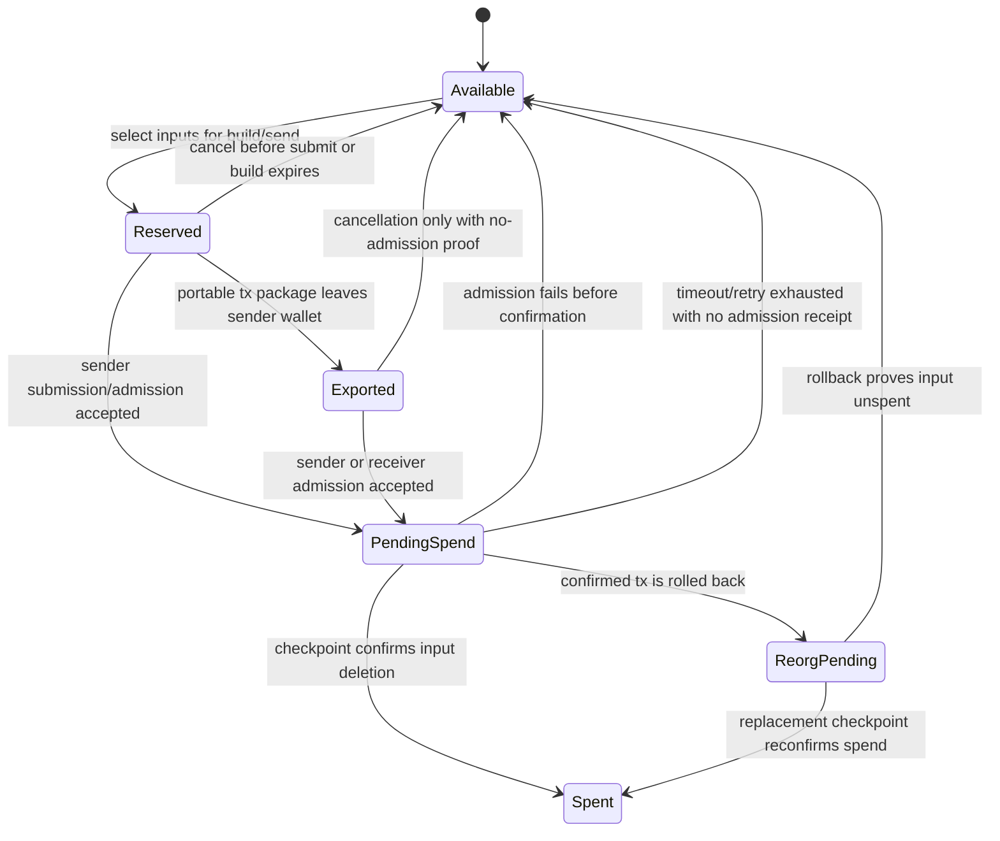
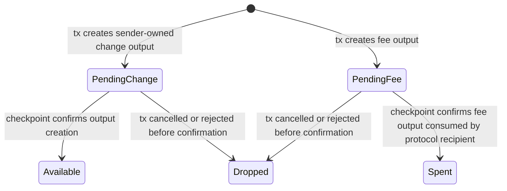
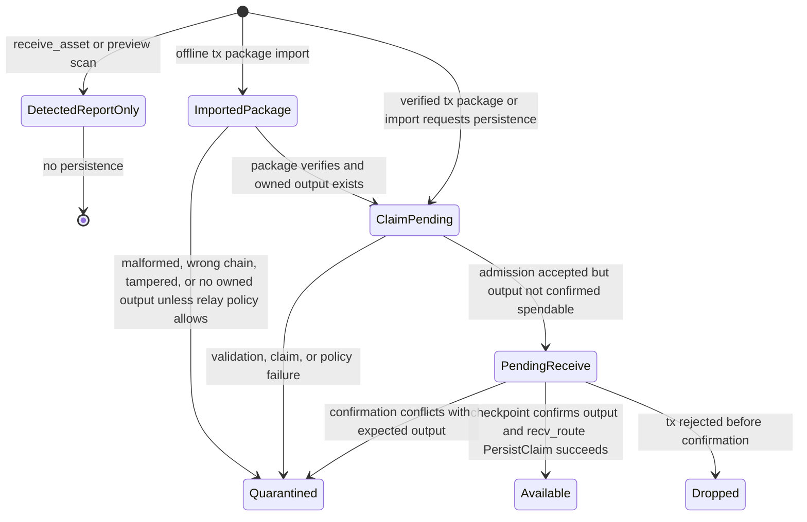
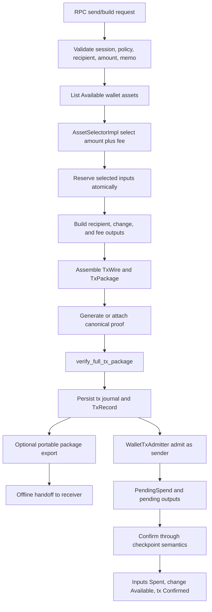
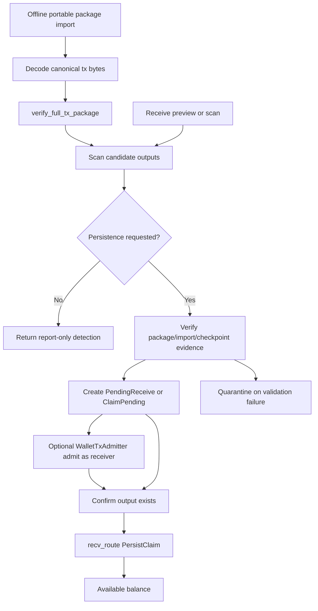
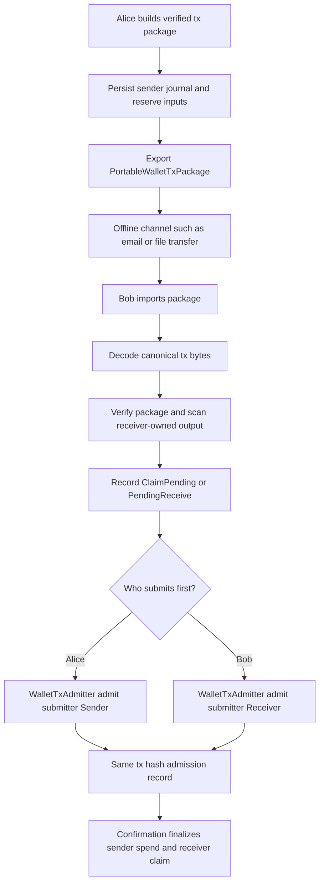
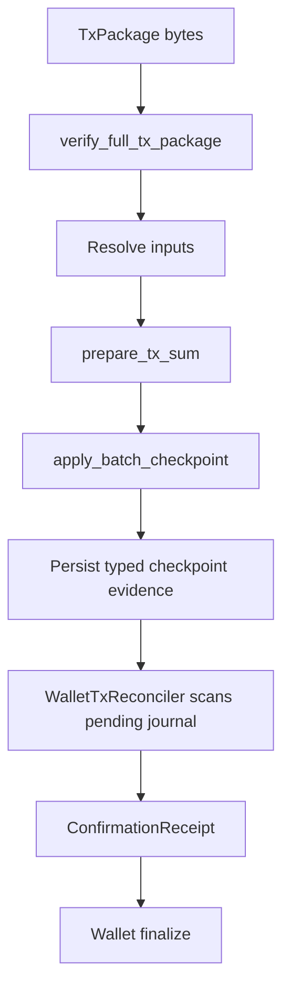

# Phase 044 Wallet Assets And Transaction Lifecycle Specification

<!-- markdownlint-disable MD013 MD033 MD041 MD055 MD056 -->

## 🎯 Purpose

Phase 044 closes the wallet-level asset and transaction lifecycle gaps between the already-present
low-level transaction, proof, receiver, storage, and checkpoint seams and the public wallet RPC
surface. The goal is to make sender and receiver wallet behavior hermetic: assets selected for a
transaction must be reserved, transaction packages must contain real inputs, outputs, change, fees,
and proof material, pending state must be visible and non-spendable, confirmation must atomically
move wallet assets to their final state, and cancellation or failure must release local state without
leaving ghost locks.

This specification is intentionally wallet-centered. Aggregator, validator, and real chain broadcast
components may remain simulated or trait-backed for this phase, but the wallet must interact with
that simulated boundary through an explicit admission contract instead of pretending a transaction
was broadcast or confirmed.

A fully built wallet transaction package is a portable transaction artifact. Alice may send that
artifact to Bob through an offline channel such as email or file transfer, Bob must be able to import
it into his wallet, and either Alice or Bob may submit the same canonical tx bytes to the admission
boundary. Sender status does not grant broadcast priority or a privileged submission path.

Phase 044 must not duplicate Phase 043. Phase 043 owns transaction assembler closure, storage
membership versus conservation separation, receive DTO honesty, tag completeness, and validated
stealth-output routing. Phase 044 consumes those truthful seams and wires them into the sender and
receiver wallet lifecycle. If an implementation discovers a missing prerequisite from Phase 043, the
fix must land on the Phase 043 seam and then be consumed by Phase 044; it must not create a second
assembler, second receive persistence path, second output builder facade, or second verifier.

## 📌 Source Evidence

The following source facts were verified before this specification was written.

| ID | Evidence | Verified Fact | Phase 044 Consequence |
| --- | --- | --- | --- |
| EV-044-001 | `crates/z00z_wallets/src/tx/selection/asset_selector.rs` | `AssetSelectorImpl::select(...)` computes required value as `target_amount + fee` and returns selected inputs plus `change_amount`. | Sender build must reuse the selector and persist the selected-input reservation before tx bytes are exposed or submitted. |
| EV-044-002 | `crates/z00z_wallets/src/tx/verify/tx_wire_types.rs` | `TxInputWire` is reference-only, and `TxOutRole` distinguishes `Recipient`, `Change`, and `Fee`. | Wallet tx records must carry resolved wallet-local input metadata separately from public tx input refs, and output journals must preserve role. |
| EV-044-003 | `crates/z00z_wallets/src/tx/verify/tx_verifier.rs` | `verify_full_tx_package(...)` validates structure, digest, fee rules, range proofs, and proof routing, while full conservation depends on proof or resolved pre-state. | Built wallet packages must pass the existing verifier before reservation advances to submitted state. |
| EV-044-004 | `crates/z00z_wallets/src/tx/verify/tx_verifier_helpers.rs` | Fee outputs must be `AssetClass::Coin`, and declared fee must match fee-output sum. | Sender build must create a real fee output when fee is non-zero and must never model fee only as scalar metadata. |
| EV-044-005 | `crates/z00z_wallets/src/tx/state/lifecycle.rs` | Existing projection helpers already model `pending_spend`, `pending_receive`, `pending_change`, and `pending_fee` rows plus confirmed transitions. | Phase 044 should promote these semantics into wallet runtime state instead of inventing unrelated status names. |
| EV-044-006 | `crates/z00z_wallets/src/tx/state/state_resolved_input.rs` | `ResolvedInput` pairs a path, leaf, and membership witness and validates the witness against the proof root. | Sender-side proof and simulated admission must use resolved inputs for conservation and membership, not public input refs alone. |
| EV-044-007 | `crates/z00z_wallets/src/tx/state/state_update.rs` and `crates/z00z_storage/src/checkpoint/build.rs` | `apply_batch_checkpoint(...)` consumes input leaves and creates output leaves when proof and spent-index checks pass. | Simulated validator/admission must reuse checkpoint semantics for confirmed spend and created-output results. |
| EV-044-008 | `crates/z00z_wallets/src/tx/proof/spend_proof_backend.rs` | `CanonicalSpendProofBackend` validates statement shape, membership, nullifier uniqueness, balance relation, and output range relation before producing or accepting deterministic artifacts. | Wallet build must call the canonical proof backend or the approved assembler/prover seam; it must not invent a separate proof representation. |
| EV-044-009 | `crates/z00z_wallets/src/tx/spend/spend_verification.rs` | The public spend contract is real but narrower than a finished public proof-of-knowledge theorem. | Phase 044 may close wallet-local lifecycle behavior, but it must not claim public or trustless proof-of-knowledge closure. |
| EV-044-010 | `crates/z00z_wallets/src/adapters/rpc/methods/tx_impl_server_send.rs` | `send_transaction_impl(...)` currently validates request metadata, creates a tx id, stores `Pending`, and does not select inputs, create outputs, assemble proofs, reserve assets, or submit tx bytes. | The live send RPC must be rewired to the canonical wallet tx lifecycle engine. |
| EV-044-011 | `crates/z00z_wallets/src/adapters/rpc/methods/tx_impl_server_lifecycle.rs` | `build_transaction_impl(...)` returns `BuiltTxStub`; `broadcast_transaction_impl(...)` simulates success without chain submission; `get_transaction_details_impl(...)` returns empty inputs and outputs. | Build, broadcast, and details RPCs must use real wallet journal records and an explicit simulated admission boundary. |
| EV-044-012 | `crates/z00z_wallets/src/adapters/rpc/methods/tx_rpc_storage.rs` | The current RPC tx store carries tx status, amount, fee, and timestamp metadata only. | Phase 044 must add or connect a richer tx journal for selected inputs, outputs, package bytes, reservation ids, admission receipts, and confirmation data. |
| EV-044-013 | `crates/z00z_wallets/src/persistence/tx/tx_storage.rs` | Persistent `TxRecord` stores tx hash, tx bytes, status, timestamp, and optional block height. | Persistent tx bytes must become the canonical tx-package retention layer, while details/history derive from tx journal metadata. |
| EV-044-014 | `crates/z00z_wallets/src/persistence/assets/asset_storage.rs` | `AssetStorage` has unspent/spent APIs and comments that it is a future-unification seam, not a second receive authority. | Asset reservation must not fork receiver persistence; it must wrap or extend one canonical wallet asset ledger. |
| EV-044-015 | `crates/z00z_wallets/src/persistence/assets/asset_storage_impl.rs` | `AssetRecord` tracks `is_spent` and `spent_at_height`, but no pending or reserved state. | Phase 044 must add pending/reserved state without misusing confirmed spent state. |
| EV-044-016 | `crates/z00z_wallets/src/adapters/rpc/methods/asset_impl_server_catalog.rs` | `get_asset_balance_impl(...)` currently reports `available = total` and `pending = 0`. | Balance RPC must derive available and pending from the wallet asset lifecycle ledger. |
| EV-044-017 | `crates/z00z_wallets/src/adapters/rpc/methods/asset_impl_server_transfer.rs` | `receive_asset_impl(...)` is report-only; `send_asset_impl(...)` builds a stealth output and calls placeholder send logic without consuming or locking an existing asset. | Receive report-only must stay non-persistent, and asset send must route through the same tx lifecycle as regular tx send. |
| EV-044-018 | `crates/z00z_wallets/src/services/wallet/actions/wallet_service_actions_receive.rs` | `recv_range(...)` is the canonical scanner lane that persists hits through `recv_route(..., ReceiveNext::PersistClaim)`. | Receiver confirmation must preserve `recv_range` and `recv_route(PersistClaim)` as the persistence authority. |
| EV-044-019 | `crates/z00z_wallets/src/services/wallet/actions/wallet_service_actions_reachability.rs` | `recv_route(...)` differentiates `ReportOnly` from `PersistClaim`, and `put_claimed_asset(...)` is the wallet-native persistence operation. | Phase 044 must never treat report-only detection as a claim or create a second persistence authority. |
| EV-044-020 | `crates/z00z_wallets/src/stealth/output/output_build.rs` | Sender output construction already derives receiver-bound confidential output state, encrypted pack, owner tag, and tag16. | Recipient and change outputs must use the approved output builder surface instead of local construction. |
| EV-044-021 | `crates/z00z_wallets/src/chain/client/chain_client_impl.rs` and `crates/z00z_wallets/src/chain/broadcast/broadcast_impl.rs` | Chain submission, status, and broadcast paths are still not implemented in Phase 1. | Phase 044 must introduce an explicit simulated submission/admission trait and must not fake chain success inside RPC handlers. |
| EV-044-022 | `crates/z00z_storage/src/assets/store_internal/store_query.rs` and `store_rows.rs` | `apply_ops_with_attest_exec(...)`, `check_exec_ops(...)`, `plan_arts(...)`, and `build_claim_rows(...)` bind storage ops to tx execution rows and claim-nullifier rows. | Wallet confirmation receipts must be compatible with storage checkpoint execution evidence and claim nullifier semantics. |
| EV-044-023 | `crates/z00z_wallets/src/persistence/tx/tx_storage.rs` and `crates/z00z_wallets/src/adapters/rpc/methods/tx_impl_server_lifecycle.rs` | The wallet already has persistent tx bytes and public lifecycle entrypoints, but current broadcast behavior is local stub logic. | Offline package import/export must reuse canonical tx bytes and route sender-side and receiver-side submission through the same admission trait. |
| EV-044-024 | `crates/z00z_wallets/src/persistence/tx/tx_storage.rs` and `crates/z00z_wallets/src/adapters/rpc/types/tx.rs` | Persistent tx status is `Pending`, `Confirmed`, or `Failed`; RPC adds `Cancelled` for public lifecycle compatibility. There is no persisted wallet tx status named `Validated`. | Storage-backed validation must finalize txs as `Confirmed`, not as a new `Validated` tx status. |
| EV-044-025 | `crates/z00z_wallets/src/persistence/assets/asset_storage_impl.rs` | Wallet asset storage currently models final spendability with `is_spent == false` and final spend with `is_spent == true`; it has no persisted pending or validated flag. | Phase 044 pending state must live in a wallet lifecycle ledger, and the final spendable state remains `Available`. |
| EV-044-026 | `crates/z00z_wallets/src/persistence/scans/storage.rs` and `storage_impl.rs` | Existing scan storage persists scan cursor state only: height, hash, timestamp, and `is_scanning`. | A tx-finalization scanner must be a new wallet reconciliation seam; it must not overload block scan cursor state as tx confirmation evidence. |

## 🔒 Live Authority Surface

Unless this specification is updated first, Phase 044 must extend these existing seams:

- `AssetSelectorImpl`
- `TxAssemblerImpl`
- `verify_full_tx_package(...)`
- `CanonicalSpendProofBackend`
- `ResolvedInput`
- `apply_batch_checkpoint(...)`
- `TxRecord`
- `TxStorage::list_by_status(...)` and `TxStorage::update_status(...)`
- `AssetStorage`
- `ScanStorage`
- `CheckpointDraft`, `CheckpointPubIn`, `CreatedEnt`, and `SpentEnt`
- `wallet_claimed_assets` through `put_claimed_asset(...)`
- `recv_route(..., ReceiveNext::PersistClaim)`
- `build_tx_stealth_output_validated(...)`
- `build_card_stealth_output_validated(...)`
- `ChainClient` and `TransactionBroadcast` trait boundaries

Phase 044 must not introduce any of the following parallel authorities:

- a second transaction wire schema;
- a second transaction assembler;
- a second public spend verifier;
- a second receiver scan or claim persistence path;
- a second wallet asset database that competes with claimed assets and asset storage;
- a raw-builder sender path that bypasses validated receiver/card/request checks;
- an RPC-local broadcast simulation that bypasses a trait-backed admission boundary;
- a sender-only submission path that treats the receiver as unable or less authorized to submit the same tx bytes.

## ⚙️ Scope

### ✅ In Scope

- Sender-side asset reservation for selected inputs.
- Sender-side transaction build with recipient, change, and fee outputs.
- Sender-side tx proof and verifier routing through existing canonical seams.
- Wallet tx journal records with inputs, outputs, status, tx bytes, tx hash, fees, timestamps, and confirmation metadata.
- Pending, cancellation, failure, retry, and confirmation transitions for sender assets.
- Receiver-side report-only detection, claim-pending state, confirmation reconciliation, and claim persistence.
- Balance RPC semantics for `total`, `available`, and `pending` values.
- Transaction history, pending list, and details RPC semantics backed by real journal data.
- Portable tx package export for offline transfer and receiver-side import of canonical tx bytes.
- Role-neutral tx submission where sender and receiver use the same admission trait and tx hash idempotency rules.
- A simulated validator/admission adapter that uses existing tx/state/checkpoint semantics until real chain submission exists.
- A wallet tx reconciliation scanner that reads storage/checkpoint evidence and promotes pending wallet rows only after the expected tx effects are found.
- Tests and source-shape guards that prevent wallet-level double spend, phantom confirmation, fake pending balances, report-only persistence, and tx details gaps.

### 🚫 Out Of Scope

- Modifying `crates/z00z_crypto/tari/**`.
- Claiming public or trustless proof-of-knowledge closure.
- Implementing a production consensus validator or networked aggregator.
- Implementing email, messaging, or file-sync transport; Phase 044 only defines the portable package bytes and wallet import/export semantics.
- Replacing storage checkpoint semantics or exposing raw JMT internals to wallet callers.
- Changing canonical `.wlt` semantics unless a future spec explicitly authorizes it.
- Reopening address-era naming or receiver migration decisions from Phase 042.
- Broad UI work or unrelated fee/prover/backup TODO cleanup outside the wallet asset lifecycle.

## 🔑 Required Design Decisions

| Decision ID | Decision | Rationale | Impact |
| --- | --- | --- | --- |
| D-044-001 | A wallet asset can be spendable only in `Available` state. | Selection without reservation enables same-wallet double spend. | All send/build paths must query only available assets and reserve selected inputs atomically. |
| D-044-002 | Pending spend and confirmed spent are different states. | `AssetRecord.is_spent` currently means final spent state only. | Reservation must not call `mark_spent_for_wallet(...)` until confirmation. |
| D-044-003 | Fee is modeled as a `TxOutRole::Fee` output when non-zero. | Existing verifier requires fee-output equality and coin asset class. | Sender build must create and journal fee outputs instead of subtracting scalar metadata only. |
| D-044-004 | Change is a sender-owned output with `TxOutRole::Change`. | `AssetSelection.change_amount` exists and lifecycle projection already distinguishes pending change. | Sender build must produce a confidential change output to a sender-controlled receiver. |
| D-044-005 | `receive_asset_impl(...)` remains report-only unless explicitly changed by a future public API decision. | Existing `ReceiveNext` distinguishes report-only from persist-claim. | Bob's receive preview cannot mutate claimed assets or balances. |
| D-044-006 | The canonical receiver persistence path remains `recv_route(..., PersistClaim)` and `put_claimed_asset(...)`. | Phase 037 and Phase 042 converged receive persistence onto that path. | Pending receive finalization must call existing receiver persistence, not a new store. |
| D-044-007 | Real chain absence is handled through a trait-backed simulated admission service. | Current chain client and broadcast impl are stubs. | RPC handlers must call the same interface real chain submission will later implement. |
| D-044-008 | Tx details and history are views over tx journal plus persisted tx bytes. | Current RPC metadata store is too shallow, while `TxRecord` already stores tx bytes. | Details cannot return empty inputs and outputs for built or submitted txs. |
| D-044-009 | Phase 044 may depend on Phase 043 seams, but it must not duplicate them. | Phase 043 already owns assembler and receive/stealth seam truthfulness. | Missing Phase 043 prerequisites must be fixed on Phase 043 seams and consumed by Phase 044. |
| D-044-010 | Wallet balance keeps current fields but internal state must preserve richer breakdowns. | Public balance DTO currently has `total`, `available`, and `pending`. | RPC can stay compatible while tx details and journal expose reserved/pending components. |
| D-044-011 | A built and verified tx package is portable canonical tx bytes, not a sender-owned broadcast capability. | Offline handoff is required so Bob can import tx bytes received outside the network. | Export/import APIs must preserve tx hash identity and must not create a second tx schema or sender-only authority. |
| D-044-012 | Sender and receiver submission are equal at the wallet admission boundary. | Once Bob has the tx package, either party may submit it to an aggregator, validator, or simulated admission adapter. | Admission requests must carry submitter role for audit, but validation, idempotency, and lifecycle transitions must be identical for sender and receiver submissions. |
| D-044-013 | `Validated` is evidence wording, not a Phase 044 wallet asset state. | Live code exposes persistent tx `Confirmed` and wallet spendability through available/unspent semantics, while lifecycle helpers already use `confirmed_*` rows. | The reconciliation scanner must produce confirmation evidence and then transition assets to `Available` or `Spent`, not to a new spendable `Validated` state. |

## 📚 Definitions

| Term | Definition |
| --- | --- |
| Available | Confirmed wallet-owned asset value that is not reserved and may be selected for spend. |
| Reserved | Confirmed wallet-owned input selected for a local tx build but not yet submitted or externally exported. Reserved assets are not spendable by other local transactions. |
| Exported | Reserved sender input whose canonical tx package has left the sender wallet for offline receiver import. Exported inputs remain non-spendable until admission, safe cancellation proof, or final failure resolves. |
| Pending spend | Reserved input after tx submission/admission but before final checkpoint confirmation. |
| Spent | Input confirmed consumed by checkpoint state transition. |
| Pending change | Sender-owned change output created by a pending tx and not spendable until confirmation. |
| Pending receive | Receiver-owned output detected or imported from a verified package but not yet confirmed into the spendable wallet set. |
| Reorg pending | Previously confirmed wallet row under rollback/reorg reconciliation. It is non-spendable until checkpoint evidence proves either `Available` or `Spent`. |
| Report-only receive | Non-persistent scan or preview result. It must not change balance or claimed assets. |
| Tx journal | Wallet-owned record that links tx id, tx hash, tx bytes, selected inputs, outputs, fee, status, reservation ids, admission receipt, and confirmation metadata. |
| Portable tx package | Canonical tx package bytes plus minimal redacted metadata, checksum, chain id, and version needed for offline wallet import. It must not contain wallet secrets, decrypted asset packs, private blindings, or plaintext seed material. |
| Submission actor | Wallet role that calls admission for canonical tx bytes. Valid Phase 044 actors are sender and receiver; neither actor changes verifier rules or tx hash identity. |
| Admission receipt | Simulated or real chain boundary result proving that tx bytes were accepted for confirmation processing. |
| Confirmation receipt | Simulated or real checkpoint result proving that selected inputs were consumed and outputs were created. |
| Storage reconciliation scan | Wallet-runtime function that scans pending tx journal rows against storage/checkpoint evidence and applies final wallet transitions when expected input deletion and output creation are proven. |
| Validated evidence | Verification result or checkpoint evidence that supports finalization. It is not a persisted wallet asset status in Phase 044. |

## 🧭 Wallet Asset State Machines

### 📌 Sender Input State Machine



Sender rules:

- Only `Available` assets may be selected.
- `Reserved`, `Exported`, and `PendingSpend` assets must be excluded from all selectors.
- `Reserved` assets may be released only before admission acceptance.
- Exported packages are submit-capable artifacts; after an external handoff, local cancellation must not release inputs unless the admission boundary or policy proves the tx cannot be accepted.
- `PendingSpend` assets may be released only if the admission or confirmation boundary proves that no spend was committed.
- `Spent` is final unless a future reorg model explicitly reopens it with checkpoint evidence.

### 📌 Sender Output State Machine



Sender output rules:

- Change is wallet-owned but not spendable until confirmation.
- Fee output is never wallet-spendable after confirmation.
- Fee output must be represented in tx outputs and tx details while pending.

### 📌 Receiver State Machine



Receiver rules:

- `receive_asset_impl(...)` may return detection metadata only.
- A new receiver package-import function, `recv_range(...)`, and future package-finalization flows are the only persistence entry points.
- Imported offline packages must be verified and scanned for receiver ownership before they create `ClaimPending` or `PendingReceive` rows.
- Receiver-side submission of imported tx bytes must call the same admission trait as sender-side submission.
- A receiver output becomes spendable only after validation and persistence through the canonical receive route.
- Quarantined outputs must never affect `available` balance.
- A storage scan that finds validated checkpoint evidence must finalize receiver value as `Available` through `recv_route(..., PersistClaim)` and tx status as `Confirmed`; it must not introduce a separate spendable state named `Validated`.

## 📌 Requirements

### PH44-LEDGER: Wallet Asset Ledger

- WHEN wallet code lists spend candidates, THE SYSTEM SHALL include only assets in `Available` state.
- WHEN a sender build selects inputs, THE SYSTEM SHALL atomically transition those inputs from `Available` to `Reserved` with a tx id and reservation id.
- IF any selected input is already `Reserved`, `Exported`, `PendingSpend`, `Spent`, `Quarantined`, or unknown, THEN THE SYSTEM SHALL fail closed without creating tx bytes.
- WHEN a reserved transaction is cancelled before admission, THE SYSTEM SHALL release all selected inputs back to `Available` and remove pending created outputs.
- WHEN admission is accepted, THE SYSTEM SHALL transition reserved inputs to `PendingSpend` and keep them non-spendable.
- WHEN checkpoint confirmation consumes selected inputs, THE SYSTEM SHALL transition those inputs to `Spent` and record confirmation height and root metadata.
- IF admission or confirmation fails before input deletion, THEN THE SYSTEM SHALL release selected inputs to `Available` and record a typed failure reason in the tx journal.
- THE SYSTEM SHALL NOT use `mark_spent_for_wallet(...)` or equivalent final spent state for mere local reservation.

### PH44-SEND: Sender Build And Send Lifecycle

- WHEN `send_transaction_impl(...)` receives a valid request, THE SYSTEM SHALL perform selection, reservation, output construction, tx package assembly, verification, journal persistence, and admission through the canonical lifecycle engine.
- WHEN `build_transaction_impl(...)` receives a valid request, THE SYSTEM SHALL build and persist a `Reserved` tx package or an explicitly unsigned/unsigned-preview package according to the final API contract; it shall not return `BuiltTxStub`.
- WHEN the selected input total exceeds `amount + fee`, THE SYSTEM SHALL create a `TxOutRole::Change` output for the exact change amount to a sender-controlled receiver.
- WHEN the selected input total equals `amount + fee`, THE SYSTEM SHALL NOT create a zero-valued change output.
- WHEN the declared fee is non-zero, THE SYSTEM SHALL create a `TxOutRole::Fee` output with `AssetClass::Coin` and amount equal to the declared fee.
- IF the fee output sum, declared fee, or verifier-calculated fee units differ, THEN THE SYSTEM SHALL reject the tx before admission.
- WHEN recipient output construction requires receiver approval, THE SYSTEM SHALL use the validated card or request-bound stealth-output builder surface.
- WHEN change output construction needs sender ownership, THE SYSTEM SHALL derive or select a sender-controlled receiver through the existing receiver manager path.
- WHEN tx package assembly succeeds, THE SYSTEM SHALL call `verify_full_tx_package(...)` before moving the tx to admitted or submitted state.
- IF package verification fails, THEN THE SYSTEM SHALL release reservations and store the tx journal as `Failed` with no created spendable outputs.

### PH44-OFFLINE: Portable Package Export, Import, And Role-Neutral Submission

- WHEN a sender builds and verifies tx bytes, THE SYSTEM SHALL be able to export a portable tx package for offline transfer without requiring immediate admission.
- WHEN a portable package is exported, THE SYSTEM SHALL preserve the same tx hash, canonical tx bytes, output roles, fee output semantics, reservation ids, and journal linkage used by online submission.
- WHEN the portable package leaves the sender wallet, THE SYSTEM SHALL treat the package as submit-capable by the receiver and keep selected sender inputs non-spendable until cancellation is proven safe, admission fails, or confirmation resolves.
- WHEN a receiver imports a portable package from an offline channel such as email or file transfer, THE SYSTEM SHALL decode canonical tx bytes, verify the package with `verify_full_tx_package(...)`, validate chain id and package version, and scan outputs for receiver ownership before writing wallet state.
- WHEN an imported package contains a receiver-owned output and is not yet confirmed, THE SYSTEM SHALL store receiver state as `ClaimPending` or `PendingReceive` according to admission evidence, not as `Available`.
- WHEN an imported package is malformed, wrong-chain, tampered, duplicate-with-conflict, or contains no receiver-owned output under current policy, THE SYSTEM SHALL fail closed without changing available balance.
- WHEN either sender or receiver submits the same canonical tx bytes, THE SYSTEM SHALL call the same `WalletTxAdmitter` path and apply identical validation, idempotency, status, and receipt rules.
- IF sender and receiver both submit the same tx hash, THEN THE SYSTEM SHALL treat the second accepted submission as idempotent evidence for the same journal/admission record rather than creating a second spend or second receive.
- THE SYSTEM SHALL NOT give sender-side RPC, local build status, or wallet origin any priority over receiver-side import for admission eligibility.

### PH44-ADMIT: Simulated Admission And Confirmation

- WHEN real chain submission is unavailable, THE SYSTEM SHALL call a trait-backed simulated admission service instead of faking success inside RPC methods.
- WHEN simulated admission accepts tx bytes, THE SYSTEM SHALL return an admission receipt with tx hash, simulated mempool id, chain id, and deterministic validation evidence.
- WHEN admission receives canonical tx bytes from a sender wallet, receiver wallet, or imported offline package, THE SYSTEM SHALL validate tx bytes and tx hash identity without changing behavior based on submitter role.
- WHEN simulated confirmation runs, THE SYSTEM SHALL use existing tx/state/checkpoint semantics to prove input deletion and output creation.
- WHEN simulated confirmation writes or exposes storage evidence, THE SYSTEM SHALL leave wallet rows pending until the wallet reconciliation scanner verifies that evidence against the wallet tx journal.
- IF simulated confirmation cannot resolve an input, validate a proof, or bind created outputs, THEN THE SYSTEM SHALL return a typed rejection and the wallet shall roll back pending state.
- WHERE the real `ChainClient::submit_transaction(...)` later exists, THE SYSTEM SHALL implement the same admission trait without changing wallet lifecycle semantics.
- THE SYSTEM SHALL distinguish `Built`, `Reserved`, `Submitted`, `Admitted`, `Confirmed`, `Failed`, and `Cancelled` internally even if public RPC keeps a smaller compatibility enum.

### PH44-RECONCILE: Storage-Backed Wallet Finalization

- THE SYSTEM SHALL provide a wallet-runtime reconciliation function, such as `WalletTxReconciler::reconcile_pending(...)`, that scans pending or admitted wallet tx journal rows against storage/checkpoint evidence.
- WHEN reconciliation scans storage, THE SYSTEM SHALL use storage/checkpoint APIs and typed artifacts instead of ad hoc filesystem parsing.
- WHEN a pending tx has no matching storage evidence, THE SYSTEM SHALL leave asset rows and tx status unchanged.
- WHEN matching evidence is found, THE SYSTEM SHALL verify tx hash, chain id, checkpoint height, previous root, new root, spent input ids, created output ids, output roles, and tx journal expectations before mutating wallet state.
- WHEN evidence proves selected sender inputs were deleted from checkpoint state, THE SYSTEM SHALL transition those rows from `PendingSpend` to `Spent` and may call `mark_spent_for_wallet(...)` or equivalent final-spent storage only at this point.
- WHEN evidence proves sender-owned change outputs were created, THE SYSTEM SHALL transition those rows from `PendingChange` to `Available` and include them in spend candidate selection only after the transition is durable.
- WHEN evidence proves receiver-owned outputs were created, THE SYSTEM SHALL transition `ClaimPending` or `PendingReceive` to `Available` only through `recv_route(..., ReceiveNext::PersistClaim)`.
- WHEN all required tx effects reconcile successfully, THE SYSTEM SHALL update wallet tx status to `Confirmed`, attach a `ConfirmationReceipt`, and set confirmed block height/root metadata.
- IF evidence is incomplete, conflicting, wrong-chain, wrong-root, duplicate, or missing expected input/output effects, THEN THE SYSTEM SHALL fail closed, leave `available` unchanged, and record a typed reconcile failure or quarantine.
- THE SYSTEM SHALL make reconciliation idempotent: running the scan repeatedly over the same confirmed tx must not create duplicate claimed assets, duplicate available change outputs, or duplicate spend records.

### PH44-RECEIVE: Receiver Persistence And Confirmation

- WHEN `receive_asset_impl(...)` scans one asset, THE SYSTEM SHALL keep the operation report-only unless a future API explicitly requests persistence.
- WHEN report-only detection succeeds, THE SYSTEM SHALL NOT update claimed assets, asset storage, tx journal balances, or pending receive state.
- WHEN a receiver imports a verified asset or scans a confirmed checkpoint range, THE SYSTEM SHALL persist through `recv_route(..., ReceiveNext::PersistClaim)`.
- WHEN a receiver sees a pending tx package before checkpoint confirmation, THE SYSTEM SHALL store it as `PendingReceive` only if the tx package verifies and the output scans as wallet-owned.
- WHEN confirmation proves the output exists in checkpoint state, THE SYSTEM SHALL finalize the receive by calling the canonical persist-claim route.
- IF claim reservation, validation, persistence, or confirmation fails, THEN THE SYSTEM SHALL quarantine or drop the pending receive according to typed failure class and leave `available` unchanged.
- THE SYSTEM SHALL prevent duplicate persistence of the same output by checking claim nullifier, asset id, serial id, and tx output role metadata.

### PH44-BALANCE: Balance Semantics

- WHEN balance is requested, THE SYSTEM SHALL compute `available` from confirmed spendable wallet assets only.
- WHEN balance is requested, THE SYSTEM SHALL compute `pending` from non-spendable wallet-owned value and locally reserved outgoing value: `Reserved + Exported + ClaimPending + PendingSpend + PendingChange + PendingReceive + ReorgPending` for the queried asset class.
- WHEN balance is requested, THE SYSTEM SHALL compute `total = available + pending` for compatibility with the current response shape.
- THE SYSTEM SHALL preserve an internal breakdown for `reserved_spend`, `exported_spend`, `claim_pending`, `pending_spend`, `pending_change`, `pending_receive`, `reorg_pending`, `quarantined`, and `spent` even if the public balance response remains compact.
- IF pending rows cannot be decoded or reconciled with tx journal entries, THEN THE SYSTEM SHALL fail closed for detailed balance and return a typed diagnostic instead of reporting `pending = 0`.
- THE SYSTEM SHALL NOT count `Spent`, `Dropped`, `Failed`, or `Quarantined` value as available.

### PH44-HISTORY: Tx Journal, Details, And Pending Lists

- WHEN a tx is built, THE SYSTEM SHALL persist a tx journal record containing tx id, tx hash if available, tx bytes if available, selected input refs, resolved input metadata hash, outputs by role, amount, fee, status, reservation ids, and timestamp.
- WHEN a tx is exported or imported as a portable package, THE SYSTEM SHALL persist origin, package version, chain id, checksum, submitter role if known, and tx hash idempotency key in the tx journal.
- WHEN a tx is admitted, THE SYSTEM SHALL attach the admission receipt to the journal record.
- WHEN a tx is confirmed, THE SYSTEM SHALL attach confirmation height, checkpoint id, state root, input deletion evidence, and output creation evidence to the journal record.
- WHEN `get_transaction_details_impl(...)` is called for a known tx, THE SYSTEM SHALL return the real input and output rows from the journal and tx bytes, not empty arrays.
- WHEN `list_pending_transactions_impl(...)` is called, THE SYSTEM SHALL include all txs with active reserved, exported, submitted, admitted, pending-spend, pending-change, or pending-receive state.
- WHEN `get_transaction_history_impl(...)` is called, THE SYSTEM SHALL derive stable ordering from journal timestamp plus tx id and preserve existing cursor/filter behavior.
- IF tx bytes exist but journal metadata is incomplete, THEN THE SYSTEM SHALL decode what can be verified and surface a partial-details diagnostic instead of fabricating inputs or outputs.

### PH44-CANCEL: Cancellation, Failure, And Retry

- WHEN a reserved tx is cancelled before admission, THE SYSTEM SHALL release all input reservations and remove pending created outputs.
- WHEN a tx was exported outside the sender wallet before admission, THE SYSTEM SHALL release input reservations only after no-admission evidence is available or a configured fail-closed policy marks the package permanently unadmittable.
- WHEN an admitted tx is cancelled by the user, THE SYSTEM SHALL NOT release inputs unless the admission boundary proves the tx cannot be confirmed.
- WHEN admission fails, THE SYSTEM SHALL release reservations and record `Failed` with failure class `admission_rejected`.
- WHEN confirmation fails after admission, THE SYSTEM SHALL either keep the tx in retryable pending state or release it only after the simulated or real boundary proves no input was consumed.
- WHEN retry creates replacement tx bytes, THE SYSTEM SHALL either reuse the same reservation id or atomically release and reserve under a replacement id; it shall never leave both reservations active.
- IF retry changes amount, fee, selected inputs, or recipient, THEN THE SYSTEM SHALL require a new tx id and new journal record linked by replacement metadata.

### PH44-DRIFT: Anti-Duplication And Concept Drift

- THE SYSTEM SHALL extend existing seams listed in `Live Authority Surface` before adding new modules.
- IF a new helper module is required, THEN THE SYSTEM SHALL document why the existing seam could not carry the behavior and update this spec before execution continues.
- THE SYSTEM SHALL NOT treat report-only receive as claim persistence.
- THE SYSTEM SHALL NOT infer hidden input amounts from public `TxInputWire` refs.
- THE SYSTEM SHALL NOT bypass `z00z_utils` for new file I/O, serialization, time, logging, metrics, config, or RNG boundaries.
- THE SYSTEM SHALL NOT log plaintext seed phrases, decrypted asset packs, receiver secrets, private blindings, or unredacted tx bytes.
- THE SYSTEM SHALL NOT describe simulated admission as real chain broadcast or consensus validation.
- THE SYSTEM SHALL NOT describe sender submission as more authoritative than receiver submission for the same canonical tx bytes.

## 🧱 Data Contracts

### 🔑 Wallet Asset State

Phase 044 must introduce or extend a wallet-owned asset lifecycle record with this minimum semantic
shape. Exact Rust placement may vary, but field meaning must not drift.

```rust
pub enum WalletAssetState {
    Available,
    Reserved,
    Exported,
    ClaimPending,
    PendingSpend,
    Spent,
    PendingChange,
    PendingReceive,
    ReorgPending,
    Quarantined,
    Dropped,
}

pub struct WalletAssetLedgerRow {
    pub wallet_id: String,
    pub asset_id_hex: String,
    pub serial_id: u32,
    pub asset_class: String,
    pub amount: u64,
    pub state: WalletAssetState,
    pub tx_id: Option<String>,
    pub reservation_id: Option<String>,
    pub output_role: Option<TxOutRole>,
    pub block_height: Option<u64>,
    pub state_root_hex: Option<String>,
}
```

Rules:

- `WalletAssetState` names are semantic states, not public RPC enum replacements.
- `Validated` is intentionally absent: checkpoint/storage validation is represented by receipts and final states, not by a spendable `Validated` asset status.
- Storage may encode these states as compact strings or versioned structs, but the mapping must be total and fail closed on unknown values.
- `asset_id_hex + serial_id + wallet_id` must be unique for active wallet rows unless a row is an immutable tx-history snapshot.
- `ClaimPending` is a receiver-import state for verified package ownership before admission or checkpoint evidence makes the output spendable.
- `Exported` is a non-spendable reservation substate used when canonical tx bytes have left the sender wallet through a portable package.
- `ReorgPending` is a non-spendable rollback/reconciliation state and must carry the prior confirmed state plus checkpoint evidence reference in the tx journal.
- `tx_id` and `reservation_id` are required for `Reserved`, `Exported`, `ClaimPending`, `PendingSpend`, `PendingChange`, `PendingReceive`, and `ReorgPending`.

### 🔑 Wallet Tx Status

```rust
pub enum WalletTxStatus {
    Built,
    Reserved,
    Exported,
    Submitted,
    Admitted,
    Confirmed,
    Failed,
    Cancelled,
    ReorgPending,
}
```

Rules:

- `WalletTxStatus` is an internal journal state machine, not a direct replacement for the existing persistent `TxStatus` enum.
- Persistent `TxRecord.status` must continue to map to the existing storage vocabulary: `Pending`, `Confirmed`, or `Failed`.
- Public RPC status may continue to expose `Pending`, `Confirmed`, `Failed`, and `Cancelled` for compatibility.
- Internal states `Built`, `Reserved`, `Exported`, `Submitted`, `Admitted`, and `ReorgPending` must map to persistent `Pending` until final confirmation, cancellation, or failure evidence resolves them.
- Phase 044 must not persist a tx status named `Validated`.

### 🔑 Tx Journal Record

```rust
pub struct WalletTxJournalRecord {
    pub wallet_id: String,
    pub tx_id: String,
    pub tx_hash_hex: Option<String>,
    pub status: WalletTxStatus,
    pub amount: u64,
    pub fee: u64,
    pub inputs: Vec<WalletTxInputRow>,
    pub outputs: Vec<WalletTxOutputRow>,
    pub tx_bytes: Option<Vec<u8>>,
    pub admission: Option<AdmissionReceipt>,
    pub confirmation: Option<ConfirmationReceipt>,
    pub failure: Option<TxFailureClass>,
    pub origin: WalletTxOrigin,
    pub submitter_role: Option<WalletTxSubmitterRole>,
    pub portable_export: Option<PortableTxExportMeta>,
}
```

Minimum required row semantics:

- Input rows include public input ref, resolved-input hash, asset class, amount, reservation id, and state transition.
- Output rows include output role, asset class, amount, asset id, serial id, recipient wallet if known, and ownership classification.
- `tx_bytes` must contain canonical tx package bytes when a package exists.
- Tx bytes may be stored in `TxRecord`, but details must still join them back to journal metadata.
- `origin` must distinguish locally built sender txs from receiver-imported portable packages.
- `submitter_role` is audit metadata only and must not change admission validation rules.
- `portable_export` records redacted package version, chain id, checksum, exported-at metadata, and import/export state without storing wallet secrets.

### 🔑 Portable Tx Package

```rust
pub struct PortableWalletTxPackage {
    pub package_version: u16,
    pub chain_id: String,
    pub tx_hash_hex: String,
    pub tx_bytes: Vec<u8>,
    pub metadata_hash_hex: String,
}
```

Rules:

- `tx_bytes` are the canonical tx package bytes; import must not translate them into a second schema.
- `tx_hash_hex` is the idempotency key for sender and receiver admission attempts.
- `metadata_hash_hex` covers redacted package metadata, not private wallet state.
- The portable package format may be armored for email or file transfer, but transport is outside Phase 044 scope.
- Import must reject plaintext secrets, unexpected private fields, or package metadata that conflicts with tx bytes.

### 🔑 Admission Trait

```rust
pub trait WalletTxAdmitter {
    fn admit(&self, request: WalletTxAdmissionRequest) -> Result<AdmissionReceipt, AdmissionError>;
    fn confirm(&self, receipt: &AdmissionReceipt) -> Result<ConfirmationReceipt, AdmissionError>;
}
```

Rules:

- The simulated implementation may live in wallet tests or wallet runtime support, but production RPC must call the trait boundary.
- The real chain implementation will later call `ChainClient::submit_transaction(...)` through the same trait.
- `WalletTxAdmissionRequest` must include tx hash, canonical tx bytes, chain id, submitter role, and idempotency key; submitter role is `Sender` or `Receiver` audit data only.
- Sender-submitted and receiver-submitted requests for the same tx hash must converge to one admission record.
- Admission failure must include a typed failure class so wallet rollback can be deterministic.

### 🔑 Confirmation Receipt And Reconciler

```rust
pub struct ConfirmationReceipt {
    pub tx_hash_hex: String,
    pub block_height: u64,
    pub checkpoint_id_hex: String,
    pub prev_root_hex: String,
    pub new_root_hex: String,
    pub spent_asset_ids_hex: Vec<String>,
    pub created_asset_ids_hex: Vec<String>,
}

pub trait WalletTxReconciler {
    fn reconcile_pending(
        &self,
        request: WalletReconcileRequest,
    ) -> Result<WalletReconcileReport, ReconcileError>;
}
```

Rules:

- `ConfirmationReceipt` is the bridge between storage validation and wallet finalization.
- Reconciliation must join receipt data with tx journal expectations before applying any asset transition.
- Reconciliation may update `TxRecord.status` from `Pending` to `Confirmed`; if the current storage API cannot update `block_height`, Phase 044 must extend or rewrite the whole record through the existing `TxStorage` trait boundary.
- Reconciliation must not use `ScanStorage` cursor state as proof that a tx was validated.
- A completed reconciliation turns wallet-owned outputs into `Available`; it does not create a public or persisted `Validated` asset status.

## ⚙️ Architecture

### 🔑 Layer Ownership

| Layer | Owns | Must Not Own |
| --- | --- | --- |
| `z00z_wallets::tx::selection` | Candidate selection from available assets and change calculation. | Persistence, broadcast, or receiver claim finalization. |
| `z00z_wallets::tx::verify` | Tx wire/package structure, digest, fee, output proof, and public contract checks. | Wallet reservation or balance UI semantics. |
| `z00z_wallets::tx::state` | Resolved input, membership witness, checkpoint apply, pending/confirmed row projection. | RPC-local fake broadcast success. |
| `z00z_wallets::stealth::output` | Recipient/change output construction through approved builder surfaces. | Wallet journal persistence. |
| `z00z_wallets::services::wallet` | Wallet-owned claimed assets, receive route, session and receiver manager integration. | Raw chain consensus or storage backend internals. |
| `z00z_wallets::adapters::rpc` | Request validation, response mapping, and delegation to lifecycle services. | Core lifecycle decisions or local tx simulation. |
| `z00z_storage` | Checkpoint execution, storage roots, store ops, claim nullifier rows. | Wallet UI pending balances or report-only receive behavior. |

### 📌 Sender Flow



### 📌 Receiver Flow



### 📌 Offline Package Flow



### 📌 Simulated Validator Boundary



The simulated boundary is a deterministic local substitute for unavailable chain infrastructure. It is not
consensus, not a public proof-of-knowledge verifier, and not a permanent replacement for real chain
submission.

## 🛠️ Implementation Guide

### Phase Gate 0: Spec Coverage And No-Duplicate Lock

1. Create `.planning/phases/044-wallet-assets/044-coverage.md` before code edits.
1. Map every EV, D, PH44, and AC identifier to an owner file, test home, and evidence slot.
1. Record whether each Phase 043 prerequisite is already implemented, missing, or in progress.
1. If a Phase 043 seam is missing, update or execute that seam first instead of adding a parallel Phase 044 implementation.
1. Confirm no planned edit touches `crates/z00z_crypto/tari/**`.

Required inventory commands:

```bash
rg -n "BuiltTxStub|pending = 0|inputs: vec!\[\]|outputs: vec!\[\]|simulate|not implemented in Phase 1" crates/z00z_wallets/src
rg -n "AssetSelection|TxOutRole::Change|TxOutRole::Fee|ResolvedInput|apply_batch_checkpoint|CanonicalSpendProofBackend" crates/z00z_wallets/src
rg -n "ReceiveNext::ReportOnly|ReceiveNext::PersistClaim|put_claimed_asset|wallet_claimed_assets" crates/z00z_wallets/src
```

### Phase Gate 1: Asset Ledger And Reservation Layer

Primary files:

- `crates/z00z_wallets/src/persistence/assets/asset_storage.rs`
- `crates/z00z_wallets/src/persistence/assets/asset_storage_impl.rs`
- `crates/z00z_wallets/src/services/wallet/actions/wallet_service_actions_assets.rs`
- `crates/z00z_wallets/src/services/wallet/actions/wallet_service_actions_reachability.rs`
- `crates/z00z_wallets/src/db/redb/store/redb_wallet_store_objects.rs`
- `crates/z00z_wallets/src/wallet/snapshot/snapshot_types.rs` only if snapshot metadata must reference lifecycle rows

Implementation steps:

1. Add a wallet asset ledger abstraction that can store `Available`, `Reserved`, `Exported`, `ClaimPending`, `PendingSpend`, `Spent`, `PendingChange`, `PendingReceive`, `ReorgPending`, `Quarantined`, and `Dropped` semantics.
1. Keep existing claimed-asset persistence as the ownership source. The ledger indexes lifecycle state; it does not replace `wallet_claimed_assets`.
1. Add atomic reserve and release operations for selected input rows.
1. Ensure reservation operations fail if any selected input is unavailable.
1. Add migration or derived-index behavior so existing claimed assets appear as `Available` until explicitly reserved or spent.
1. Add redaction rules for sensitive material in debug exports.

Exit condition:

- Two simultaneous build attempts against the same wallet-owned input cannot both reserve it.

### Phase Gate 2: Sender Build Lifecycle

Primary files:

- `crates/z00z_wallets/src/adapters/rpc/methods/tx_impl_server_send.rs`
- `crates/z00z_wallets/src/adapters/rpc/methods/tx_impl_server_lifecycle.rs`
- `crates/z00z_wallets/src/tx/selection/asset_selector.rs`
- `crates/z00z_wallets/src/tx/tx_assembler.rs`
- `crates/z00z_wallets/src/tx/output/output_flow.rs`
- `crates/z00z_wallets/src/stealth/output/output_build.rs`
- `crates/z00z_wallets/src/stealth/output/output_validator.rs`
- `crates/z00z_wallets/src/tx/proof/spend_proof_backend.rs`

Implementation steps:

1. Replace `BuiltTxStub` with canonical tx package bytes plus journal metadata.
1. Query available wallet assets and call `AssetSelectorImpl::select(...)` with `target_amount` and `fee`.
1. Reserve selected input rows before output construction.
1. Build recipient output through the validated receiver/card/request builder path.
1. If `change_amount > 0`, build a sender-owned change output with `TxOutRole::Change`.
1. If `fee > 0`, build a fee output with `TxOutRole::Fee` and `AssetClass::Coin`.
1. Assemble canonical tx wire/package through `TxAssemblerImpl` or the approved Phase 043 assembler seam.
1. Produce or attach proof material through `CanonicalSpendProofBackend` or its approved wrapper.
1. Call `verify_full_tx_package(...)` before persistence advances past reserved state.
1. On any error, release reservations and journal the failure.

Exit condition:

- A built tx has non-empty inputs and outputs, includes real role-tagged change and fee rows when required, passes verifier checks, and reserves selected inputs.

### Phase Gate 3: Tx Journal And Details

Primary files:

- `crates/z00z_wallets/src/adapters/rpc/methods/tx_rpc_storage.rs`
- `crates/z00z_wallets/src/persistence/tx/tx_storage.rs`
- `crates/z00z_wallets/src/persistence/tx/tx_storage_impl.rs`
- `crates/z00z_wallets/src/adapters/rpc/types/tx.rs`
- `crates/z00z_wallets/src/adapters/rpc/methods/tx_impl_server_history.rs`
- `crates/z00z_wallets/src/adapters/rpc/methods/tx_impl_server_lifecycle.rs`

Implementation steps:

1. Add a versioned tx journal row or extend existing tx metadata without breaking `TxRecord` storage.
1. Persist selected input refs, output refs, roles, amount, fee, and reservation ids.
1. Store tx package bytes in `TxRecord` when bytes exist.
1. Join journal rows and tx bytes for history, pending, and details responses.
1. Replace empty input/output arrays in `get_transaction_details_impl(...)` with decoded and journal-backed rows.
1. Preserve existing pagination and cursor filter behavior.

Exit condition:

- Every tx created by build/send can be inspected with populated details before and after confirmation.

### Phase Gate 3A: Portable Package Export And Import

Primary files:

- `crates/z00z_wallets/src/adapters/rpc/methods/tx_impl_server_lifecycle.rs`
- `crates/z00z_wallets/src/adapters/rpc/methods/tx_impl_server_send.rs`
- `crates/z00z_wallets/src/adapters/rpc/types/tx.rs`
- `crates/z00z_wallets/src/adapters/rpc/methods/asset_impl_server_transfer.rs`
- `crates/z00z_wallets/src/services/wallet/actions/wallet_service_actions_receive.rs`
- `crates/z00z_wallets/src/services/wallet/actions/wallet_service_actions_reachability.rs`
- `crates/z00z_wallets/src/persistence/tx/tx_storage.rs`

Implementation steps:

1. Add a narrow portable tx package export function that returns canonical tx bytes plus redacted metadata, tx hash, chain id, package version, and checksum.
1. Keep sender-selected inputs locked as `Reserved` or `Exported` after export; do not release them merely because local sender RPC has not submitted yet.
1. Add a receiver-side import function that decodes package bytes, verifies `verify_full_tx_package(...)`, checks chain id and package version, and scans outputs for wallet ownership.
1. Store imported receiver-owned packages in the tx journal with origin `Imported`, receiver ownership rows, tx hash idempotency key, and non-spendable pending receive state.
1. Add a receiver-side submit operation that calls `WalletTxAdmitter` with submitter role `Receiver` using the exact imported tx bytes.
1. Ensure sender-side submit and receiver-side submit share the same admission service, duplicate tx-hash handling, and receipt storage.
1. Reject tampered, wrong-chain, malformed, secret-bearing, or no-owned-output packages without mutating available balance.

Exit condition:

- Bob can import a tx package received offline, inspect the owned pending output, and submit the same tx bytes through the same admission path Alice would use.

### Phase Gate 4: Admission And Confirmation Boundary

Primary files:

- `crates/z00z_wallets/src/chain/client/chain_client.rs`
- `crates/z00z_wallets/src/chain/client/chain_client_impl.rs`
- `crates/z00z_wallets/src/chain/broadcast/broadcast.rs`
- `crates/z00z_wallets/src/chain/broadcast/broadcast_impl.rs`
- `crates/z00z_wallets/src/tx/state/state_update.rs`
- `crates/z00z_wallets/src/persistence/tx/tx_storage.rs`
- `crates/z00z_wallets/src/persistence/scans/storage.rs`
- `crates/z00z_storage/src/checkpoint/build.rs`
- `crates/z00z_storage/src/assets/store_internal/store_query.rs`

Implementation steps:

1. Add a `WalletTxAdmitter` trait or equivalent narrow wallet-runtime trait.
1. Implement a simulated adapter that validates package bytes and uses resolved inputs plus checkpoint apply semantics.
1. Make `broadcast_transaction_impl(...)` call the admission trait instead of returning simulated success internally.
1. Store admission receipts in the tx journal.
1. Confirm simulated txs by applying checkpoint semantics and returning confirmation receipts.
1. Persist or expose typed checkpoint evidence that a later wallet reconciliation scan can independently match against tx journal expectations.
1. Finalize wallet state from confirmation receipts only.
1. Keep the real `ChainClient` implementation available as a later trait implementation without changing wallet lifecycle code.

Exit condition:

- RPC broadcast can no longer mark a tx pending without an admission trait result.

### Phase Gate 4A: Storage Reconciliation Simulation

Primary files:

- `crates/z00z_wallets/src/persistence/tx/tx_storage.rs`
- `crates/z00z_wallets/src/persistence/tx/tx_storage_impl.rs`
- `crates/z00z_wallets/src/persistence/assets/asset_storage.rs`
- `crates/z00z_wallets/src/persistence/assets/asset_storage_impl.rs`
- `crates/z00z_wallets/src/persistence/scans/storage.rs`
- `crates/z00z_wallets/src/services/wallet/actions/wallet_service_actions_receive.rs`
- `crates/z00z_wallets/src/services/wallet/actions/wallet_service_actions_reachability.rs`
- `crates/z00z_wallets/src/tx/state/lifecycle.rs`
- `crates/z00z_storage/src/checkpoint/build.rs`
- `crates/z00z_storage/src/checkpoint/exec_input.rs`
- `crates/z00z_storage/src/checkpoint/artifact_types.rs`

Implementation steps:

1. Add a narrow `WalletTxReconciler` or equivalent service that scans `Pending`/admitted tx journal rows and asks storage/checkpoint adapters for typed tx-effect evidence.
1. Match each pending tx by tx hash and expected input/output asset ids before applying lifecycle transitions.
1. Require `SpentEnt` coverage for every selected input before marking sender inputs `Spent`.
1. Require `CreatedEnt` coverage for each sender change and receiver output before moving those rows to `Available`.
1. Route receiver-owned output finalization through `recv_route(..., ReceiveNext::PersistClaim)` and rely on its duplicate handling.
1. Update persistent tx records from `Pending` to `Confirmed` only after all required asset transitions commit.
1. Leave rows pending when evidence is absent, and quarantine or fail the tx only when evidence conflicts with tx journal expectations.
1. Make the scan resumable and idempotent; repeated runs over the same evidence must only report already-applied effects.

Exit condition:

- A simulated storage scan can turn confirmed tx effects into spendable wallet state without inventing `Validated`, without report-only persistence, and without double-applying the same checkpoint evidence.

### Phase Gate 5: Receiver Pending And Finalization

Primary files:

- `crates/z00z_wallets/src/adapters/rpc/methods/asset_impl_server_transfer.rs`
- `crates/z00z_wallets/src/adapters/rpc/methods/asset_impl_server_catalog.rs`
- `crates/z00z_wallets/src/services/wallet/actions/wallet_service_actions_receive.rs`
- `crates/z00z_wallets/src/services/wallet/actions/wallet_service_actions_reachability.rs`
- `crates/z00z_wallets/src/receiver/scan/types_receive.rs`
- `crates/z00z_wallets/src/receiver/scan/stealth_scanner.rs`

Implementation steps:

1. Keep `receive_asset_impl(...)` report-only and make the non-persistence contract explicit in response metadata or docs.
1. Add receiver pending rows for verified tx packages or imports that are not yet spendable.
1. Finalize receiver pending rows only through `recv_route(..., ReceiveNext::PersistClaim)`.
1. Record claim reservation, claim finalize, quarantine, and release evidence.
1. Prevent duplicate finalization for the same output id, serial id, claim nullifier, or tx output row.
1. Update import behavior to classify origin and confirmation source without silently treating arbitrary DTO import as chain-confirmed unless existing policy explicitly allows it.

Exit condition:

- Bob can preview an owned output without persistence, then persist the same output only through the canonical claim route after validation and confirmation evidence.

### Phase Gate 6: Balance And User-Facing Views

Primary files:

- `crates/z00z_wallets/src/adapters/rpc/methods/asset_impl_server_catalog.rs`
- `crates/z00z_wallets/src/adapters/rpc/types/asset.rs`
- `crates/z00z_wallets/src/adapters/rpc/methods/tx_impl_server_history.rs`
- `crates/z00z_wallets/src/adapters/rpc/methods/tx_impl_server_lifecycle.rs`

Implementation steps:

1. Replace `pending = 0` with a ledger-derived pending calculation.
1. Keep `available` spendable-only.
1. Keep `total = available + pending` for compatibility unless a public API decision adds richer fields.
1. Expose breakdown in tx details and internal diagnostics.
1. Add tests for Alice pending outgoing, Alice pending change, Bob pending receive, and final confirmed balances.

Exit condition:

- Alice and Bob balances change predictably at build, submit, confirm, cancel, and fail transitions.

### Phase Gate 7: Regression And Source-Shape Guards

Required test homes:

- `crates/z00z_wallets/src/tx/state/test_state_update_suite.rs`
- `crates/z00z_wallets/src/tx/selection/test_asset_selector_suite.rs`
- `crates/z00z_wallets/src/adapters/rpc/methods/test_tx_send_body.rs`
- `crates/z00z_wallets/src/adapters/rpc/methods/test_tx_broadcast_body.rs`
- `crates/z00z_wallets/src/adapters/rpc/methods/test_tx_pending_body.rs`
- `crates/z00z_wallets/src/adapters/rpc/methods/test_tx_history_body.rs`
- `crates/z00z_wallets/src/adapters/rpc/methods/asset_impl_tests.rs`
- `crates/z00z_wallets/src/services/wallet/tests/test_wallet_service_suite.rs`
- `crates/z00z_wallets/tests/test_tx_balance.rs`
- `crates/z00z_wallets/tests/test_tx_store_integration.rs`
- `crates/z00z_wallets/tests/test_stealth_output.rs`

Required source-shape guards:

```bash
rg -n "BuiltTxStub|pending = 0|inputs: vec!\[\]|outputs: vec!\[\]" crates/z00z_wallets/src/adapters/rpc
rg -n "simulate retry success|status: TxStatus::Pending" crates/z00z_wallets/src/adapters/rpc/methods/tx_impl_server_lifecycle.rs
rg -n "ReceiveNext::ReportOnly" crates/z00z_wallets/src/adapters/rpc/methods crates/z00z_wallets/src/services/wallet/actions
```

Exit condition:

- Guards either return no forbidden live matches or every remaining match is explicitly documented as a test fixture or compatibility-only string.

## ✅ Acceptance Criteria

| ID | Criteria |
| --- | --- |
| AC-044-001 | Given Alice has one available asset, when Alice builds a tx that spends it, then the selected asset becomes `Reserved` and cannot be selected by a second tx. |
| AC-044-002 | Given Alice cancels a tx before admission, when cancellation succeeds, then all reserved inputs return to `Available` and pending outputs are dropped. |
| AC-044-003 | Given Alice submits a verified tx, when admission accepts it, then inputs become `PendingSpend` and tx details show non-empty input and output rows. |
| AC-044-004 | Given Alice submits a tx with change, when the tx is built, then one `TxOutRole::Change` output exists and is sender-owned. |
| AC-044-005 | Given Alice submits a tx with a non-zero fee, when the tx is built, then one or more `TxOutRole::Fee` coin outputs sum to the declared fee. |
| AC-044-006 | Given a fee mismatch exists, when the wallet verifies the package, then the tx is rejected and reservations are released. |
| AC-044-007 | Given simulated confirmation succeeds, when checkpoint semantics consume inputs and create outputs, then Alice inputs become `Spent`, Alice change becomes `Available`, and tx status becomes `Confirmed`. |
| AC-044-008 | Given simulated admission fails before confirmation, when the failure is recorded, then Alice inputs become `Available` and tx status becomes `Failed`. |
| AC-044-009 | Given Bob calls report-only receive, when an owned output is detected, then no claimed asset, balance, or pending receive row is persisted. |
| AC-044-010 | Given Bob imports or scans a confirmed owned output, when `recv_route(..., PersistClaim)` succeeds, then the asset becomes `Available` exactly once. |
| AC-044-011 | Given Bob sees a verified but unconfirmed owned tx output, when the package is accepted but checkpoint confirmation is pending, then the output is `PendingReceive` and not spendable. |
| AC-044-012 | Given a duplicate receiver output is processed twice, when the second finalization runs, then it fails closed without double-counting balance. |
| AC-044-013 | Given balance is requested during Alice pending spend, then `available` excludes reserved inputs and `pending` includes the non-spendable lifecycle value according to PH44-BALANCE. |
| AC-044-014 | Given tx details are requested for a built, submitted, failed, cancelled, or confirmed tx, then details contain the journaled inputs, outputs, amount, fee, status, and evidence fields that exist for that state. |
| AC-044-015 | Given real chain submit remains unimplemented, when wallet send or broadcast runs, then the only acceptance path is the explicit simulated admission adapter. |
| AC-044-016 | Given Alice exports a verified portable tx package before admission, when Bob receives it offline, then Bob can import the package and see the receiver-owned output as non-spendable pending state. |
| AC-044-017 | Given Bob imports Alice's portable tx package, when Bob submits it, then admission uses the same `WalletTxAdmitter` path and tx hash as Alice sender submission. |
| AC-044-018 | Given Alice and Bob both submit the same tx bytes, when the second submission reaches admission, then it is idempotent for the same tx hash and does not duplicate spend or receive state. |
| AC-044-019 | Given Alice exports a tx package and then tries to cancel locally, when no no-admission proof exists, then selected inputs remain non-spendable and cannot be returned to `Available`. |
| AC-044-020 | Given Bob imports a tampered, wrong-chain, malformed, or no-owned-output package, when import validation runs, then the wallet rejects it without changing claimed assets, pending rows, or available balance. |
| AC-044-021 | Given a pending tx has not appeared in storage checkpoint evidence, when reconciliation scans storage, then all wallet asset rows stay pending and tx status remains non-confirmed. |
| AC-044-022 | Given storage evidence proves Alice's selected inputs were spent and change output was created, when reconciliation runs, then Alice inputs become `Spent`, Alice change becomes `Available`, and the tx becomes `Confirmed`. |
| AC-044-023 | Given storage evidence proves Bob's receiver-owned output was created, when reconciliation runs, then Bob's output is persisted through `recv_route(..., PersistClaim)` and becomes `Available` exactly once. |
| AC-044-024 | Given storage evidence conflicts with the tx journal, when reconciliation runs, then the wallet fails closed, records typed failure or quarantine evidence, and does not increase `available`. |

## 🧪 Validation Strategy

Run validation narrow-first. The bootstrap gate remains the first broad gate for any execution plan.

### ✅ Required Commands

```bash
./.github/skills/smart-tests-bootstrap/scripts/bootstrap_tests.sh
cargo fmt -p z00z_wallets
cargo test -p z00z_wallets --features test-fast --test test_tx_balance -- --nocapture
cargo test -p z00z_wallets --features test-fast --test test_tx_store_integration -- --nocapture
cargo test -p z00z_wallets --features test-fast --test test_stealth_output -- --nocapture
cargo test -p z00z_wallets --release --features test-fast --features wallet_debug_dump
cargo run --release -p z00z_simulator --bin scenario_1 --features wallet_debug_dump
cargo test -p z00z_simulator --release --features test-fast --features wallet_debug_dump
```

Add or adjust focused test commands per landed files. If Phase 044 touches `z00z_storage`, add focused
storage tests for checkpoint execution and store-op evidence before the wallet release gate.

### ✅ Required Test Scenarios

| Scenario ID | Scenario | Required Result |
| --- | --- | --- |
| T-044-001 | same input selected by two Alice tx builds | second build fails before tx bytes are exposed |
| T-044-002 | Alice tx build then cancel before admission | reservation releases and balance returns to pre-build state |
| T-044-003 | Alice tx build with exact input | no change output is created |
| T-044-004 | Alice tx build with oversized input | one sender-owned change output is created |
| T-044-005 | Alice tx build with fee | fee output exists, is coin class, and declared fee matches verifier rule |
| T-044-006 | malformed package after reservation | verifier rejects and reservation releases |
| T-044-007 | simulated admission accepted | tx journal records admission receipt and pending spend |
| T-044-008 | simulated confirmation accepted | inputs spent, change available, tx confirmed |
| T-044-009 | simulated confirmation rejected | deterministic rollback or retry state with no double spend |
| T-044-010 | Bob report-only receive | detection returned, no persistence and no balance change |
| T-044-011 | Bob persist claim after confirmation | claimed asset available exactly once |
| T-044-012 | Bob duplicate finalization | duplicate rejected with no double balance |
| T-044-013 | tx details for pending tx | non-empty inputs and outputs with roles |
| T-044-014 | balance during pending outgoing | available excludes reserved; pending reflects lifecycle state |
| T-044-015 | source-shape guard for stubs | no live `BuiltTxStub`, `pending = 0`, empty details, or RPC-local fake success remains |
| T-044-016 | Alice exports portable package and Bob imports offline | Bob records receiver-owned output as pending and non-spendable |
| T-044-017 | Bob submits imported package | same admission trait, tx hash, and receipt path as sender submission |
| T-044-018 | Alice and Bob duplicate-submit same package | second submission is idempotent and cannot duplicate spend or receive rows |
| T-044-019 | sender cancellation after external export | inputs stay locked unless no-admission proof exists |
| T-044-020 | tampered or wrong-chain offline package import | import rejects with no balance or claim mutation |
| T-044-021 | reconciliation scan with no matching storage evidence | pending rows and tx status remain unchanged |
| T-044-022 | reconciliation scan with matching sender spend/change evidence | inputs spent, change available, tx confirmed |
| T-044-023 | reconciliation scan with matching receiver created-output evidence | receiver claim persists through `PersistClaim` and becomes available once |
| T-044-024 | reconciliation scan with wrong root or missing output evidence | typed failure/quarantine with no available balance increase |

## ⚠️ Risk Watchpoints

- Fake public-input amount recovery is a release blocker.
- Calling `mark_spent_for_wallet(...)` before confirmation is a release blocker.
- Any second receive persistence path is a release blocker.
- Any report-only receive path that mutates claimed assets or balance is a release blocker.
- Any accepted sender flow that reaches a raw output builder where a validated builder is required is a release blocker.
- Any tx details response that fabricates rows from incomplete metadata is a release blocker.
- Any RPC method that reports broadcast success without admission trait evidence is a release blocker.
- Any wording that describes simulated admission as real chain consensus is a release blocker.
- Any sender-only broadcast path that gives Alice more submission authority than Bob for the same tx bytes is a release blocker.
- Any offline package export that includes wallet secrets, decrypted packs, private blindings, or plaintext seed material is a release blocker.
- Any local cancellation that unlocks exported inputs without no-admission proof is a release blocker.
- Any duplicate sender/receiver submission that creates two admission records for one tx hash is a release blocker.
- Any scanner that turns pending rows into spendable value without matching checkpoint/storage evidence is a release blocker.
- Any introduction of `Validated` as a spendable wallet asset status is a release blocker for Phase 044.
- Any direct `std::fs`, raw serde, raw time, raw logging, or raw RNG in new business logic is a release blocker unless a documented existing exception applies.

## 🚫 No Logical Weak Spots

- Do not spend from `ClaimPending`, `PendingReceive`, `PendingChange`, `Reserved`, `Exported`, `PendingSpend`, or `ReorgPending`.
- Do not count `Quarantined`, `Dropped`, `Failed`, or `Spent` as available.
- Do not create fee metadata without fee output semantics.
- Do not create change outside sender-owned receiver controls.
- Do not store receiver preview results as claims.
- Do not finalize receiver claims without `recv_route(..., PersistClaim)`.
- Do not use the tx RPC metadata store as the only source for details.
- Do not leave tx bytes unlinked from journal records.
- Do not translate portable package bytes into a second tx schema during import.
- Do not reject receiver-side submission merely because the tx originated from sender build/export.
- Do not release exported sender inputs just because the sender did not submit first.
- Do not rename final spendable wallet value to `Validated`; use `Available` after confirmation evidence is reconciled.
- Do not treat scan cursor progress as proof that a tx effect was validated.
- Do not add a broad wallet database if a narrow lifecycle index over existing claimed assets is sufficient.
- Do not bypass Phase 043 authority seams to make Phase 044 appear complete faster.

## 📦 Required Outputs

- `.planning/phases/044-wallet-assets/044-coverage.md`
- Updated or new focused wallet asset lifecycle tests
- Updated sender RPC build/send/broadcast/details behavior
- Updated receiver report-only versus persist behavior where needed
- Portable tx package export and receiver import behavior
- Role-neutral sender/receiver submission path using `WalletTxAdmitter`
- Updated balance and tx-history semantics
- Simulated admission adapter with explicit receipts
- Storage-backed wallet reconciliation scanner with idempotent pending-to-final transitions
- Source-shape guards for removed stubs and fake success paths
- `.planning/phases/044-wallet-assets/044-SUMMARY.md` after implementation

## ✅ Completion Definition

Phase 044 is complete only when all of the following are true:

1. Alice sender assets have explicit reservation, pending, confirmation, cancellation, failure, and rollback semantics.
1. Bob receiver assets have explicit report-only, pending receive, persist claim, quarantine, duplicate, and confirmation semantics.
1. Public tx build/send/broadcast/details/history no longer use stub tx bytes, empty detail arrays, or RPC-local fake success.
1. Balance RPC no longer reports `pending = 0` when pending lifecycle rows exist.
1. Fee and change outputs are real role-tagged outputs.
1. Simulated validator/admission is explicit, trait-backed, and replaceable by real chain submission later.
1. Alice can export canonical tx bytes offline, Bob can import them, and either side can submit the same tx hash through the same admission path without sender priority.
1. Storage-backed reconciliation can scan pending txs and finalize wallet state as `Available`, `Spent`, and `Confirmed` without using a separate `Validated` asset status.
1. No duplicate tx assembler, receive persistence path, output builder facade, wallet asset authority, or verifier has been introduced.
1. Required tests and source-shape guards pass and are recorded in the phase summary.
1. Documentation and closeout language state wallet-level closure only and keep public/trustless proof-of-knowledge out of scope.
