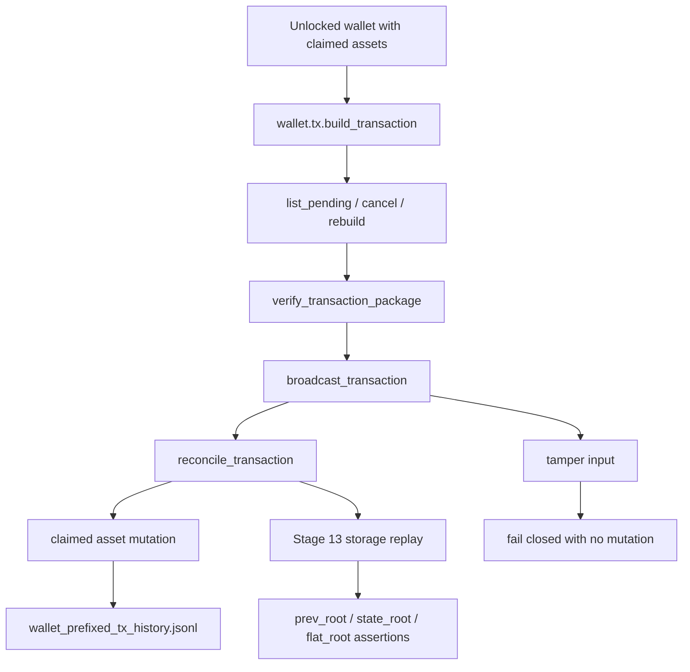

# Phase 046 Test Spec

## Purpose

📌 This document defines the phase-local unit, integration, end-to-end, and
hygiene coverage required for Phase 046 wallet addons.

📌 It is directly usable by another engineer or agent without guessing scenario
boundaries, invariants, failure paths, pass oracles, fixture sources, or test
file placement.

📌 Phase 046 is still planning-active. The homes below therefore mix existing
wallet, backup, history, logging, and RPC tests that must be extended, plus
planned Stage 13 simulator homes that must be created on the exact paths named
in the numbered plans.

📌 No browser automation is required in this phase. End-to-end proof in this
repository means live wallet RPC, wallet service, simulator, filesystem,
backup, restore, or JSONL roundtrip coverage.

📌 The phase keeps one canonical `wallet.tx.*` lifecycle lane, one `.wlt`
claimed-asset persistence plane, one canonical wallet-prefixed JSONL history
artifact, one wallet-side receive authority, and one audited in-memory
`rotate_master_key` boundary. The tests below must prove those seams without
creating a second tx lane, a second claimed-asset store, a second scan
authority, a receiver-only lifecycle fork, or a durable-seed-rotation claim.

## Workflow Status

- Phase 046 is operating in `fallback-ready` mode because the planning packet is
  strong enough to define truthful coverage but the phase does not yet have
  summary-backed execution or verification artifacts.
- The governing source packet is `046-wallet-addon-spec.md`, `046-CONTEXT.md`,
  and `046-01-PLAN.md` through `046-06-PLAN.md`.
- Existing wallet test homes are executable anchors today and must be extended
  instead of duplicated.
- Planned simulator homes under
  `crates/z00z_simulator/src/scenario_1/stage_13_wallet_tx/` do not yet exist
  and must not be described as already-landed evidence.
- Completion artifacts are still missing, so this document defines the test
  contract but does not claim RED-GREEN completion.

## Classification

### Classification Overview

| Class | Meaning in this phase | Representative homes | Use when |
| --- | --- | --- | --- |
| TDD / unit | Pure RPC, service, persistence, or helper behavior that can be asserted in-process without a release simulator run. | `crates/z00z_wallets/src/adapters/rpc/methods/key_impl/tests.rs` (existing), `crates/z00z_wallets/src/services/wallet_service_tests.rs` (existing), `crates/z00z_wallets/src/backup/backup_importer_impl/tests.rs` (existing), `crates/z00z_wallets/src/adapters/rpc/methods/test_tx_pending_body.rs` (existing), `crates/z00z_wallets/src/adapters/rpc/methods/test_tx_history_cursor_filters.rs` (existing), `crates/z00z_wallets/src/adapters/rpc/methods/test_tx_history_receipt_sort.rs` (existing), `crates/z00z_wallets/src/adapters/rpc/methods/tx_impl/tests/mod.rs` (existing), `crates/z00z_wallets/src/adapters/rpc/logging/summarize/tests.rs` (existing) | The seam can be proven through a single module or service boundary without Stage 13 orchestration. |
| E2E / scenario | Live wallet RPC, backup or restore, filesystem JSONL, or Scenario 1 Stage 13 behavior proved through real roundtrips. | `crates/z00z_wallets/tests/test_wallet_export_pack_boundary.rs` (existing), `crates/z00z_wallets/tests/test_tx_store_integration.rs` (existing), `crates/z00z_wallets/src/adapters/rpc/methods/backup_impl/tests.rs` (existing), `crates/z00z_simulator/src/scenario_1/stage_13_wallet_tx/tests.rs` (planned), `crates/z00z_simulator/src/scenario_1/stage_13_wallet_tx/tamper.rs` (planned) | The behavior must be proven through the live wallet stack, a canonical file artifact, or the Stage 13 scenario path. |
| Hygiene / source-shape | Wording and boundary honesty checks that should not invent new runtime semantics. | Focused residue scans over `wallet_service_actions_assets.rs`, `wallet_service_actions_receive.rs`, `wallet_service_actions_reachability.rs`, `wallet_service_actions_backup_rpc.rs`, `wallet_service_actions_rpc.rs`, `scan_engine_impl.rs`, `asset_impl.rs`, and `backup_impl.rs` | The slice is wording-only and the correct proof is a no-residue boundary check rather than a synthetic runtime story. |
| Skip | Planning-only files, vendor code, and duplicate closeout artifacts that would widen the phase dishonestly. | `046-*.md`, `crates/z00z_crypto/tari/**`, any ad hoc `046-TEST-SPEC-2.md`, `046-TESTS-TASKS-2.md`, or parallel coverage ledger | There is no honest runtime assertion to add in Phase 046, or the artifact would create a second interpretation of the phase. |

### TDD And Integration Targets

- `crates/z00z_wallets/src/adapters/rpc/methods/key_impl/tests.rs`
  because payment request validation and `rotate_master_key` authorization must
  stay on the live RPC boundary.
- `crates/z00z_wallets/src/services/wallet_service_tests.rs`
  because restore, restart, unlock throttling, and post-rotate continuity must
  stay wallet-owned and fail closed.
- `crates/z00z_wallets/src/backup/backup_importer_impl/tests.rs`
  because importer mode, checksum, versioning, and chain-preservation behavior
  must reject before wallet mutation.
- `crates/z00z_wallets/src/adapters/rpc/methods/test_tx_pending_body.rs`
  because the canonical wallet.tx lifecycle, receipt evidence, and pending or
  cancel transitions must be proven on the live RPC seam.
- `crates/z00z_wallets/src/adapters/rpc/methods/test_tx_history_cursor_filters.rs`
  because cursor and filter behavior must remain canonical for pending,
  cancelled, confirmed, imported, and exported rows.
- `crates/z00z_wallets/src/adapters/rpc/methods/test_tx_history_receipt_sort.rs`
  because receipt projection and history sort order are explicit Phase 046
  assertions.
- `crates/z00z_wallets/src/adapters/rpc/methods/tx_impl/tests/mod.rs`
  because wallet.tx fixture shape and helper reuse must stay canonical.
- `crates/z00z_wallets/src/adapters/rpc/logging/summarize/tests.rs`
  because redaction for session, tx payload, and rotate-master-key flows is a
  required security oracle.

### E2E Targets

- `crates/z00z_wallets/tests/test_wallet_export_pack_boundary.rs`
  because forensic export, canonical JSONL requirement, and secret-clean
  archive behavior must be observed through real artifact creation.
- `crates/z00z_wallets/tests/test_tx_store_integration.rs`
  because JSONL replay, artifact-path separation, and imported or exported tx
  evidence are cross-module behaviors.
- `crates/z00z_wallets/src/adapters/rpc/methods/backup_impl/tests.rs`
  because backup RPC roundtrip and wrong-password restore rejection are live
  wallet-facing behaviors.
- `crates/z00z_simulator/src/scenario_1/stage_13_wallet_tx/tests.rs` (planned)
  because Stage 13 must prove the canonical simulator lifecycle, storage
  contract, restore, payment, session, rotate, and status-marker behavior.
- `crates/z00z_simulator/src/scenario_1/stage_13_wallet_tx/tamper.rs` (planned)
  because the Stage 13 tamper matrix must fail closed without post-state
  mutation.

### Skip Targets

- `046-*.md`
  because planning documents are source inputs, not executable seams.
- `crates/z00z_crypto/tari/**`
  because vendor code is read-only and outside the Phase 046 ownership surface.
- any second tx-history lane, second claimed-asset store, second scan
  authority, receiver-only lifecycle fork, or alternate root engine
  because Phase 046 explicitly forbids those parallel surfaces.
- wording-only runtime expansion for Plan 05
  because the correct proof is focused residue and source-shape validation, not
  invented runtime behavior.

## Existing Test Anchors To Reuse

- `crates/z00z_wallets/src/adapters/rpc/methods/key_impl/tests.rs`
  already proves request creation, request validation, password rejection, and
  rotation confirmation boundaries.
- `crates/z00z_wallets/src/services/wallet_service_tests.rs`
  already proves `recv_range(...)` restart, unlock prechecks, and
  WalletPlusHistory restore behavior.
- `crates/z00z_wallets/src/adapters/rpc/methods/test_tx_pending_body.rs`
  already proves pending-body, import, export, reconcile, and cancel slices.
- `crates/z00z_wallets/tests/test_tx_store_integration.rs`
  already proves canonical JSONL replay, artifact separation, and tamper
  rejection.
- `crates/z00z_wallets/tests/test_wallet_export_pack_boundary.rs`
  already proves canonical JSONL requirement and encrypted export boundaries.
- `crates/z00z_wallets/src/adapters/rpc/logging/summarize/tests.rs`
  already proves secret-redaction anchors for tx and rotate flows.

## Proposed New Test Files

- `crates/z00z_simulator/src/scenario_1/stage_13_wallet_tx/tests.rs`
  to own the canonical Stage 13 lifecycle, storage contract, restore, payment,
  session, rotation, and status-marker scenarios.
- `crates/z00z_simulator/src/scenario_1/stage_13_wallet_tx/tamper.rs`
  to own the Stage 13 fail-closed tamper matrix without overloading wallet-side
  unit or integration files.

## Test File Placement

| Scenario ID | Test File Path | Extend Or Create | Why This Is The Correct Home |
| --- | --- | --- | --- |
| 046-S01 | `crates/z00z_simulator/src/scenario_1/stage_13_wallet_tx/tests.rs` | Create | Stage 13 contract and dispatch do not have an existing simulator-owned seam yet. |
| 046-S02 | `crates/z00z_wallets/src/adapters/rpc/methods/test_tx_pending_body.rs` | Extend | Live wallet.tx reserve, cancel, reconcile, import, and export behavior already lives here. |
| 046-S03 | `crates/z00z_wallets/src/adapters/rpc/methods/test_tx_history_cursor_filters.rs` | Extend | Cursor and filter traversal remain wallet RPC owned. |
| 046-S04 | `crates/z00z_wallets/src/adapters/rpc/methods/test_tx_history_receipt_sort.rs` | Extend | Receipt projection and sort semantics remain wallet RPC owned. |
| 046-S05 | `crates/z00z_wallets/tests/test_tx_store_integration.rs` | Extend | Canonical JSONL replay and artifact-plane separation are already integration-owned here. |
| 046-S06 | `crates/z00z_wallets/src/services/wallet_service_tests.rs` | Extend | Restore, restart, and session precheck behavior must stay on the wallet-service seam. |
| 046-S07 | `crates/z00z_wallets/src/backup/backup_importer_impl/tests.rs` | Extend | Importer mode, checksum, and fail-closed decode behavior remain importer owned. |
| 046-S08 | `crates/z00z_wallets/tests/test_wallet_export_pack_boundary.rs` | Extend | Forensic export and canonical JSONL archive requirements already belong to the artifact-boundary test. |
| 046-S09 | `crates/z00z_wallets/src/adapters/rpc/methods/key_impl/tests.rs` | Extend | Payment request and rotate-master-key auth flows are live RPC seams. |
| 046-S10 | `crates/z00z_wallets/src/adapters/rpc/logging/summarize/tests.rs` | Extend | Secret-clean logging assertions remain redaction-owned here. |
| 046-S11 | `crates/z00z_simulator/src/scenario_1/stage_13_wallet_tx/tamper.rs` | Create | Stage 13 tamper coverage needs a dedicated planned simulator home to avoid blurring the positive path. |

## Required End-To-End Behaviors

| Behavior | Requirement | Primary Path | Pass Signal | Fail Signal |
| --- | --- | --- | --- | --- |
| Stage 13 joins the canonical Scenario 1 contract | PH46-STAGE13 | Scenario 1 config -> runner -> verifier -> release command | Stage 13 is dispatched and verified as `S13-1` through `S13-15` | Stage 13 is skipped, unsupported, or only reachable through a simulator-only shortcut |
| Canonical wallet.tx lifecycle remains singular | PH46-TX-LANE | unlock -> build -> list_pending -> cancel -> build -> verify -> broadcast -> reconcile -> details -> history | Pending, cancelled, confirmed, imported, and exported evidence all appear on one tx id path | A second tx lane, receiver-only fork, or history-only shortcut is required |
| Claimed assets and tx history remain separate persistence planes | PH46-PERSISTENCE | `.wlt` snapshot + `wallet_<stem>_tx_history.jsonl` restore roundtrip | Claimed assets restore from `.wlt` and history restores from canonical JSONL | Restore succeeds while one plane is missing, tampered, or silently substituted |
| Receive restart stays wallet-side | PH46-RECV | `recv_range(...)` -> `PersistClaim` -> `read_scan_state` / `upsert_scan_state` -> restart | Restart resumes from persisted scan cursor and preserves wallet-owned claim authority | Restart replays from origin, depends on a second scanner, or bypasses `PersistClaim` |
| Payment request, TOFU, and session gates reject before sensitive mutation | PH46-SECURITY | request validate -> TOFU check -> session precheck -> build or rotate | Existing live error boundaries fire before tx construction or rotation | Stale, mismatched, or rate-limited inputs reach sensitive paths |
| Rotation remains in-memory only | PH46-ROTATE | auth -> password -> `ROTATE` literal -> rate limit -> in-memory rederive | Fingerprint, timestamp, and `keys_rederived` are returned with redacted logs | Durable seed rewrite is claimed or secrets leak in logs |

## Critical Integration Paths

1. Logged wallet RPC transport -> `wallet.tx.*` lifecycle -> `TxStorageImpl` JSONL evidence.
2. `WalletService::recv_range(...)` -> `ReceiveNext::PersistClaim` -> `.wlt` snapshot persistence -> restart resume.
3. Backup exporter -> encrypted archive + canonical JSONL -> importer -> `WalletPlusHistory` restore.
4. `TxPackage` -> `asset_wire_to_leaf(...)` -> checkpoint execution rows -> storage replay -> distinct `prev_root`, `state_root`, and `flat_root` assertions.
5. Payment request validation -> TOFU drift handling -> session precheck -> live RPC rejection surface.
6. `wallet.key.rotate_master_key` -> in-memory rederive -> audit/log redaction -> post-rotate wallet continuity.

## Input Fixtures And Preconditions

| Scenario ID | Inputs | Preconditions | Fixture Source |
| --- | --- | --- | --- |
| 046-S01 | Stage 13 scenario config with exact `S13-1` through `S13-15` ids | Scenario 1 stage registry and verifier wiring are editable in the planned Stage 13 slice | `046-01-PLAN.md`, `046-02-PLAN.md` |
| 046-S02 | Unlocked sender wallet, recipient material, and at least one claimed asset | Claimed asset already persisted to `.wlt` and visible to `wallet.tx.build_transaction` | `046-wallet-addon-spec.md`, `wallet_service_tests.rs`, `test_tx_pending_body.rs` |
| 046-S05 | Canonical `wallet_<stem>_tx_history.jsonl` plus tx records with imported or exported evidence | JSONL path follows the wallet-prefixed naming contract | `test_tx_store_integration.rs`, `046-03-PLAN.md` |
| 046-S06 | Backup archive, optional forensic JSONL blob, wallet password, and persisted scan cursor | Wallet state exists before restore and restart paths begin | `wallet_service_tests.rs`, `backup_importer_impl/tests.rs`, `backup_impl/tests.rs` |
| 046-S09 | Payment request payload, receiver card data, session token, password, and literal `ROTATE` confirmation | Session auth and rate-limit boundary are active | `key_impl/tests.rs`, `046-04-PLAN.md` |
| 046-S11 | Tampered tx package fields such as tx id, tx hash, chain id, roots, or claimed asset ids | Positive Stage 13 fixture exists so the tamper delta is isolated | `046-06-PLAN.md`, planned `tamper.rs` |

## Expected Outputs And Produced Artifacts

| Scenario ID | Expected Output | Persisted Artifact | Observable Signal |
| --- | --- | --- | --- |
| 046-S01 | Stage 13 report with distinct root vocabulary and full contract markers | Scenario report or Stage 13 output bundle | Release command and focused Stage 13 test command both pass |
| 046-S02 | Distinct pending, cancelled, confirmed, imported, and exported wallet tx evidence | Canonical wallet-prefixed JSONL rows | Status-specific assertions and receipt evidence stay precise |
| 046-S05 | Replay-safe tx history with preserved `tx_hash`, `tx_bytes`, timestamps, and block heights | `wallet_<stem>_tx_history.jsonl` | Replay preserves canonical record content and artifact planes stay distinct |
| 046-S06 | Restored wallet with unchanged preexisting state on failure and resumed scan cursor on restart | `.wlt` snapshot and canonical JSONL archive | Fail-closed restore leaves state untouched; restart resumes from persisted cursor |
| 046-S09 | Live RPC error or success payload with redacted logging and in-memory-only rotation evidence | Audit log plus unchanged durable seed material | Existing live error names and log-redaction assertions stay green |
| 046-S11 | Rejection without post-state mutation | No new claimed-asset mutation and no fake post-commit artifacts | Roots and claimed assets remain unchanged on tamper |

## Cryptographic And Security Invariants To Observe

| Invariant | Why It Matters | Assertion Shape |
| --- | --- | --- |
| `.wlt` remains the canonical claimed-asset persistence plane | Prevents a second claimed-asset store or side-file drift | Restore and reconcile assertions source claimed assets from `wallet_claimed_assets` and `WalletPersistenceState.claimed_assets` only |
| Canonical tx history stays wallet-prefixed and JSONL-backed | Prevents history drift into `.wlt` or simulator-only helpers | Backup, store, and replay assertions require `wallet_<stem>_tx_history.jsonl` and preserve full `TxRecord` semantics |
| Stage 13 uses one canonical `wallet.tx.*` lifecycle lane | Prevents a simulator-only lifecycle fork | Stage 13 and wallet RPC assertions cover build, list-pending, cancel, verify-package, broadcast, reconcile, details, history, export, and import on the same logged path |
| Pending reservations block double-spend until cancel or reconcile | Proves claimed-asset reservation is real state, not display-only metadata | First build reserves inputs, cancel releases them, and later build succeeds only after the release |
| `prev_root`, `state_root`, and `flat_root` stay distinct | Prevents proof or storage vocabulary collapse | Stage 13 report and storage assertions keep three distinct root fields and reject merged explanations |
| Evidence mismatches fail closed and preserve claimed assets | Prevents post-state mutation on forged or malformed evidence | Tamper cases reject tx-id, tx-hash, chain-id, checkpoint, spent-id, and created-id mismatches before claimed-asset mutation |
| Receive resume authority remains wallet-side | Prevents a second scanner or remote authority drift | `recv_range(...)`, `read_scan_state(...)`, `upsert_scan_state(...)`, and restart assertions stay tied to `PersistClaim` |
| `WalletPlusHistory` restore is all-or-nothing | Prevents partial restore corruption across the two persistence planes | Wrong password, forensic tamper, missing archive, decode drift, or replay failure leave `.wlt` and tx history untouched |
| Imported and exported lifecycle evidence stays canonical | Prevents imported or exported markers from forking into a second history format | `record_imported(...)`, `record_exported(...)`, or canonical JSONL rows remain the only accepted evidence anchors |
| Payment request validation happens before tx construction | Prevents malformed or mismatched request data from reaching spend logic | Signature, expiry, chain binding, and TOFU assertions reject before `wallet.tx.build_transaction` consumes the recipient |
| Session hardening rejects sensitive work without leaking secrets | Prevents state mutation and logging leaks under stale or locked sessions | Session, logging, and Stage 13 negative-path assertions reject sensitive operations with redacted logs |
| `rotate_master_key` remains an audited in-memory rederive flow | Prevents durable seed-rotation overclaim and secret leakage | Auth, confirmation, rate limit, fingerprint, timestamp, `keys_rederived`, and redaction assertions all stay on the live in-memory path |
| `wallet.asset.*` and scanner docs do not overclaim authority | Prevents documentation-induced concept drift | Hygiene scans reject `stub`, `placeholder`, `Phase 1`, `residue`, `JWT`, false ledger-authority, and durable seed-rotation residue |

## Mermaid Flow



## Clarifying Code Snippets

```rust
// Smallest assertion shape needed to keep the root vocabulary unambiguous.
assert_ne!(report.prev_root, report.state_root);
assert_ne!(report.state_root, report.flat_root);

// Reconcile must change claimed assets only on valid evidence.
assert_eq!(before_claimed_assets, after_claimed_assets_on_reject);
assert_ne!(before_claimed_assets, after_claimed_assets_on_success);
```

## Scenario Matrix

### 046-01 Stage 13 Contract And Dispatch

| Test home | Class | Required behavior | Positive example | Negative example | Measurable pass signal |
| --- | --- | --- | --- | --- | --- |
| `crates/z00z_simulator/src/scenario_1/stage_13_wallet_tx/tests.rs` (planned) | E2E / scenario | Scenario 1 recognizes Stage 13 as a first-class wallet.tx lifecycle stage with the exact `S13-1` through `S13-15` contract ids. | The scenario loads the Stage 13 config, dispatches the stage, and verifies it as part of the canonical 13-stage contract. | Missing Stage 13 config, unsupported stage dispatch, or a 12-stage contract mismatch fails closed. | Stage 13 runs through the Scenario 1 dispatcher and verification path without any stage-count drift. |
| Stage 13 release smoke commands | E2E / scenario | Release-style Scenario 1 execution is the final proof that Stage 13 belongs to the canonical simulator lane. | `cargo run --release -p z00z_simulator --bin scenario_1 --features wallet_debug_dump` completes with Stage 13 enabled. | The release scenario skips Stage 13, reports it unsupported, or only passes through a simulator-only shortcut. | The exact release command and the exact simulator release test command both pass on the Stage 13-enabled tree. |

### 046-02 Canonical Wallet.tx Lifecycle, History, And Root Binding

| Test home | Class | Required behavior | Positive example | Negative example | Measurable pass signal |
| --- | --- | --- | --- | --- | --- |
| `crates/z00z_wallets/src/adapters/rpc/methods/test_tx_pending_body.rs` | TDD / unit | Pending reservation, cancel release, portable export or import, and reconcile stay on the canonical wallet.tx path. | `test_tx_import_reconcile_portable`, `test_tx_reconcile_requires_confirmation_evidence`, and `test_tx_list_reflects_cancel` show build, import, cancel, and reconcile through live RPC. | Missing confirmation evidence, mismatched evidence, wrong portable payload, or a cancelled tx still appearing as pending. | Status, receipt, and claimed-asset assertions stay precise and no extra history alias appears. |
| `crates/z00z_wallets/src/adapters/rpc/methods/test_tx_history_cursor_filters.rs` and `crates/z00z_wallets/src/adapters/rpc/methods/test_tx_history_receipt_sort.rs` | TDD / unit | `wallet.tx.get_transaction_history` preserves cursor, filter, sort, and receipt projections on the live RPC contract. | `test_tx_get_paginates_cursor`, `test_tx_get_sorts_timestamp`, and `test_tx_history_includes_receipt` validate history traversal and receipt fields. | Cursor drift, filtered rows leaking through, or receipt projection collapsing into status-only output. | History pagination and receipt assertions hold without simulator-only history helpers. |
| `crates/z00z_wallets/tests/test_tx_store_integration.rs` | E2E / scenario | Imported and exported evidence, JSONL replay, and artifact boundaries stay canonical. | `jsonl_import_is_explicit`, `jsonl_replay_preserves_record`, `artifact_paths_stay_distinct`, and `tx_history_appends_admission_sequence` prove replay and artifact separation. | Tampered `record_hash`, non-canonical history directory use, or imported/exported evidence bypassing `TxStorageImpl`. | Replay preserves `tx_hash`, `tx_bytes`, `status`, `timestamp_ms`, and `block_height`, and path roles remain distinct. |
| `crates/z00z_simulator/src/scenario_1/stage_13_wallet_tx/tests.rs` and `crates/z00z_simulator/src/scenario_1/stage_13_wallet_tx/tamper.rs` (planned) | E2E / scenario | Stage 13 proves the full wallet.tx lifecycle, receiver continuation, root binding, and fail-closed tamper behavior through one logged RPC path. | The first build reserves inputs, cancel releases them, the second build succeeds, broadcast plus reconcile mutate claimed assets, and receiver import continues on the same tx id. | Tx-id, tx-hash, chain-id, checkpoint, spent-id, created-id, or root mismatches succeed, blur statuses, or mutate claimed assets. | Stage 13 emits distinct pending, cancelled, confirmed, imported, and exported evidence and leaves pre or post roots unchanged on tamper. |

### 046-03 Backup, Restore, JSONL Replay, And Scan Resume

| Test home | Class | Required behavior | Positive example | Negative example | Measurable pass signal |
| --- | --- | --- | --- | --- | --- |
| `crates/z00z_wallets/tests/test_wallet_export_pack_boundary.rs` | E2E / scenario | Forensic export requires canonical JSONL and keeps the archive boundary secret-clean. | `test_backup_seed_encrypted` and `test_forensic_export_requires_jsonl` prove the encrypted archive and required JSONL artifact coexist correctly. | Missing JSONL, mismatched live JSONL bytes, or plaintext secret leakage outside the encrypted archive. | Export succeeds only with the canonical JSONL artifact and rejects mismatched live history bytes. |
| `crates/z00z_wallets/src/backup/backup_importer_impl/tests.rs` | TDD / unit | Backup importer modes, version checks, checksum checks, and chain preservation stay explicit. | `test_import_wallet_plus_history_returns_forensic_archive`, `test_import_tx_history_only_returns_transaction_blob`, and `test_import_roundtrip_preserves_chain` verify the importer contract. | Corrupted checksum, rejected backup versions, or a history-only restore mutating wallet state. | Import mode and metadata stay precise before service-level restore touches the live wallet. |
| `crates/z00z_wallets/src/services/wallet_service_tests.rs` | TDD / unit | WalletPlusHistory restore, fail-closed restore, and receive restart follow the wallet-owned persistence boundary. | `test_restore_backup_with_wallet_plus_history_imports_tx_store` and `test_recv_range_restart` prove history replay and cursor resume. | Wrong password, missing forensic archive, tampered forensic archive, or restart scanning from origin instead of the persisted cursor. | Restore mutates state only after successful validation, and restart resumes from persisted `ScanStatePayload`. |
| `crates/z00z_simulator/src/scenario_1/stage_13_wallet_tx/tests.rs` (planned) | E2E / scenario | Stage 13 consumes the same wallet restore and scan-resume boundaries rather than inventing a simulator-only scanner or restore model. | Stage 13 compares claimed assets and JSONL history before and after a restore roundtrip. | Stage 13 proves backup or receive restart with a second asset store, second scanner, or synthetic history path. | Stage 13 restore and restart evidence matches the wallet service contract exactly. |

### 046-04 Payment Requests, TOFU, Session Hardening, And Rotation

| Test home | Class | Required behavior | Positive example | Negative example | Measurable pass signal |
| --- | --- | --- | --- | --- | --- |
| `crates/z00z_wallets/src/adapters/rpc/methods/key_impl/tests.rs` | TDD / unit | Payment request creation, validation, and rotation auth stay on the live RPC contract. | `test_create_payment_request_ok`, `test_validate_req_ok`, and `test_rotate_master_key_stub` prove the happy path. | Malformed compact payload, oversized payload, bad password, or non-literal confirmation. | The RPC layer returns the existing request or rotation error surface instead of simulator aliases. |
| `crates/z00z_wallets/src/adapters/rpc/methods/asset_impl/asset_impl_tests.rs` and `crates/z00z_wallets/src/adapters/rpc/methods/asset_impl_tests.rs` | TDD / unit | TOFU confirmation-required outcomes stay on the existing send boundary. | Existing `SEND_TOFU_CONFIRM_REQUIRED` assertions remain green when TOFU drift requires confirmation. | TOFU drift silently passes or is remapped to a new simulator-only error name. | Confirmation-required behavior remains visible on the live asset or send compatibility surface. |
| `crates/z00z_wallets/src/services/wallet_service_tests.rs` | TDD / unit | Unlock, show-seed, rotation prechecks, and auto-lock behavior stay explicit on the wallet service boundary. | `test_unlock_attempt_precheck_rate`, `test_unlock_attempt_precheck_enforces`, `test_check_auto_lock_no`, and `test_stays_live_post_rotate` prove the live rate-limit and lifecycle behavior. | Stale sessions, lifecycle locks, or rate-limited operations still reaching sensitive wallet actions. | Sensitive actions reject before secret-bearing work starts and the service state stays coherent after rotation. |
| `crates/z00z_wallets/src/adapters/rpc/logging/summarize/tests.rs` | TDD / unit | Rotation, tx data, and secret-bearing RPC logs remain redacted. | `test_secrets_redacted`, `test_tx_data_redacted`, `test_rotate_key_redaction`, `test_rotate_key_top_level`, and `test_rotate_key_confirmation` prove log redaction. | Passwords, seed phrases, raw session tokens, `tx_data`, or key material appear in summarized logs. | Redaction tests stay green for both top-level and nested rotation or tx payload fields. |
| `crates/z00z_simulator/src/scenario_1/stage_13_wallet_tx/tests.rs` (planned) | E2E / scenario | Stage 13 negative-path coverage proves that payment request, TOFU, session, and rotate boundaries remain live in the end-to-end scenario. | Stage 13 rejects stale or mismatched payment requests, stale sessions, and rate-limited rotation attempts without leaking secrets. | The simulator accepts stale payment material, bypasses TOFU confirmation, or claims durable seed rotation. | Stage 13 negative tests surface the same live error names and redaction rules as the wallet RPC layer. |

### 046-05 Wording And Compatibility Boundary Hygiene

| Validation home | Class | Required behavior | Positive example | Negative example | Measurable pass signal |
| --- | --- | --- | --- | --- | --- |
| Focused residue scans over touched wallet, RPC, backup, and scanner files | Hygiene / source-shape | Wording cleanup must describe compatibility, wallet-side authority, canonical wallet.tx lifecycle, and in-memory rederive boundaries exactly. | Touched files say `compatibility`, `wallet-side authority`, `canonical wallet.tx lifecycle`, or `in-memory rederive` where appropriate. | Residue includes `stub`, `placeholder`, `Phase 1`, `residue`, `JWT`, false ledger-authority claims for `wallet.asset.*`, or durable seed-rotation claims. | Focused no-match scans over the forbidden wording return clean results and no runtime logic was added solely for wording validation. |

### 046-06 Tamper, Status Matrix, And Release Validation

| Test home | Class | Required behavior | Positive example | Negative example | Measurable pass signal |
| --- | --- | --- | --- | --- | --- |
| `crates/z00z_simulator/src/scenario_1/stage_13_wallet_tx/tests.rs` and `crates/z00z_simulator/src/scenario_1/stage_13_wallet_tx/tamper.rs` (planned) | E2E / scenario | Stage 13 covers the full tamper matrix and the full history-marker matrix with no blurred statuses. | Pending, cancelled, confirmed, imported, and exported markers all appear once on the expected path. | Tampered history, bad roots, wrong chain id, or asset-id mismatches either mutate claimed assets or still emit post-commit artifacts. | Claimed assets, pre or post roots, and emitted artifacts remain unchanged on tamper, and status markers remain distinct. |
| Focused wallet and simulator commands from `046-06-PLAN.md` | E2E / scenario | Exact release-style commands are the final proof of the Phase 046 story. | The focused wallet tests, focused simulator tests, exact release simulator run, and exact release simulator test command all pass. | The phase closes on prose only, or the exact release commands were never run on the landed tree. | Future closeout records green outputs for the focused commands plus the final `cargo fmt`, `cargo clippy --all-targets --all-features`, and `cargo test --all` gate. |

## Canonical Commands

- `./.github/skills/smart-tests-bootstrap/scripts/bootstrap_tests.sh`
- `cargo test -p z00z_wallets --release --features test-fast -- --nocapture`
- `cargo test -p z00z_simulator --release --features test-fast --features wallet_debug_dump stage13`
- `cargo run --release -p z00z_simulator --bin scenario_1 --features wallet_debug_dump`
- `cargo test -p z00z_simulator --release --features test-fast --features wallet_debug_dump`
- `cargo fmt`
- `cargo clippy --all-targets --all-features`
- `cargo test --all`

## 📋 Required Regression Inventory

The following named regressions are required by `046-06-PLAN.md`. The homes are
the expected landing points unless a later spec update explicitly reassigns
ownership.

| Regression name | Expected home | Primary purpose |
| --- | --- | --- |
| `test_tx_build_reserves_then_cancel_releases` | `crates/z00z_wallets/src/adapters/rpc/methods/test_tx_pending_body.rs` | Prove the first build reserves claimed assets and cancel releases them for a later build. |
| `test_tx_reconcile_updates_claimed_assets` | `crates/z00z_wallets/src/adapters/rpc/methods/test_tx_pending_body.rs` | Prove reconcile removes spent claimed inputs and appends owned outputs. |
| `test_tx_reconcile_rejects_bad_evidence_without_asset_mutation` | `crates/z00z_wallets/src/adapters/rpc/methods/test_tx_pending_body.rs` | Prove bad evidence rejects fail-closed and leaves claimed assets unchanged. |
| `test_tx_import_rejects_wrong_chain_without_history_mutation` | `crates/z00z_wallets/src/adapters/rpc/methods/test_tx_pending_body.rs` | Prove wrong-chain portable import fails without mutating history. |
| `test_tx_history_filters_pending_cancelled_confirmed` | `crates/z00z_wallets/src/adapters/rpc/methods/test_tx_pending_body.rs` | Prove status-filtered history coverage across pending, cancelled, and confirmed paths. |
| `test_tx_history_cursor_filter_sort_roundtrip` | `crates/z00z_wallets/src/adapters/rpc/methods/test_tx_history_cursor_filters.rs` and `crates/z00z_wallets/src/adapters/rpc/methods/test_tx_history_receipt_sort.rs` | Prove history cursor, filter, and sort traversal remain canonical. |
| `test_tx_export_import_detects_receiver_owned_outputs` | `crates/z00z_wallets/src/adapters/rpc/methods/test_tx_pending_body.rs` | Prove export or import keeps receiver-owned-output detection on the canonical tx lane. |
| `test_claimed_assets_restore_from_wlt_snapshot` | `crates/z00z_wallets/src/services/wallet_service_tests.rs` | Prove `.wlt` restore rebuilds claimed assets on the live wallet path. |
| `test_claimed_assets_checksum_tamper_rejected` | `crates/z00z_wallets/src/backup/backup_importer_impl/tests.rs` plus `crates/z00z_wallets/src/services/wallet_service_tests.rs` | Prove checksum or decode tamper rejects before wallet mutation. |
| `test_wallet_plus_history_restore_keeps_tx_jsonl` | `crates/z00z_wallets/src/services/wallet_service_tests.rs` | Prove `WalletPlusHistory` restore rebuilds canonical JSONL history. |
| `test_restore_wrong_password_rejects_without_wallet_mutation` | `crates/z00z_wallets/src/adapters/rpc/methods/backup_impl/tests.rs` plus `crates/z00z_wallets/src/services/wallet_service_tests.rs` | Prove wrong-password restore fails cleanly without wallet mutation. |
| `test_stage13_storage_contract_matches_prev_root_and_post_store` | `crates/z00z_simulator/src/scenario_1/stage_13_wallet_tx/tests.rs` | Prove Stage 13 preserves root vocabulary and storage replay order. |
| `test_stage13_runs_wallet_tx_rpc_lifecycle` | `crates/z00z_simulator/src/scenario_1/stage_13_wallet_tx/tests.rs` | Prove the full logged wallet.tx lifecycle in Scenario 1 Stage 13. |
| `test_stage13_receiver_import_continuation_uses_receiver_path` | `crates/z00z_simulator/src/scenario_1/stage_13_wallet_tx/tests.rs` | Prove sender export and receiver import or broadcast or reconcile remain on one canonical tx id. |
| `test_stage13_rejects_tampered_tx_without_claimed_mutation` | `crates/z00z_simulator/src/scenario_1/stage_13_wallet_tx/tests.rs` and `crates/z00z_simulator/src/scenario_1/stage_13_wallet_tx/tamper.rs` | Prove Stage 13 tamper cases fail closed with no claimed-asset mutation. |
| `test_stage13_backup_restore_compares_claimed_assets_and_history` | `crates/z00z_simulator/src/scenario_1/stage_13_wallet_tx/tests.rs` | Prove Stage 13 restore coverage compares both claimed assets and canonical history. |
| `test_stage13_payment_request_negative_paths` | `crates/z00z_simulator/src/scenario_1/stage_13_wallet_tx/tests.rs` | Prove Stage 13 inherits the live payment request and TOFU failure boundary. |
| `test_stage13_session_hardening_negative_paths` | `crates/z00z_simulator/src/scenario_1/stage_13_wallet_tx/tests.rs` | Prove Stage 13 rejects stale, locked, or over-limit sessions on sensitive wallet.tx operations. |
| `test_stage13_rotate_master_key_auth_rate_limit_and_redaction` | `crates/z00z_simulator/src/scenario_1/stage_13_wallet_tx/tests.rs` | Prove Stage 13 exposes the live rotation auth, rate-limit, audit, and redaction boundary without claiming durable rotation. |
| `test_stage13_history_covers_statuses_and_import_export_markers` | `crates/z00z_simulator/src/scenario_1/stage_13_wallet_tx/tests.rs` | Prove Stage 13 history covers pending, cancelled, confirmed, imported, and exported evidence distinctly. |

## 📦 Exact Per-File Landing Plan

This section decomposes the regression inventory to future test-function-sized
landings. The preferred names below are the exact planned landing names for new
coverage. If an existing nearby anchor already proves the same behavior and a
local rename would create duplication, the engineer may keep the existing name,
but the behavior mapping must remain one-to-one.

The decomposition is intentionally broader than the 20-row top-level inventory
because several rows combine multiple independently debuggable fail-closed
branches. Splitting them here keeps future failures local to one file and one
assertion family.

### Existing Wallet Homes

| File | Status | Preferred future test functions | Backs regression or scenario coverage |
| --- | --- | --- | --- |
| `crates/z00z_wallets/src/adapters/rpc/methods/test_tx_pending_body.rs` | Extend | `test_tx_build_reserves_then_cancel_releases`; `test_tx_reconcile_updates_claimed_assets`; `test_tx_reconcile_rejects_bad_evidence_without_asset_mutation`; `test_tx_import_rejects_wrong_chain_without_history_mutation`; `test_tx_history_filters_pending_cancelled_confirmed`; `test_tx_export_import_detects_receiver_owned_outputs` | `test_tx_build_reserves_then_cancel_releases`; `test_tx_reconcile_updates_claimed_assets`; `test_tx_reconcile_rejects_bad_evidence_without_asset_mutation`; `test_tx_import_rejects_wrong_chain_without_history_mutation`; `test_tx_history_filters_pending_cancelled_confirmed`; `test_tx_export_import_detects_receiver_owned_outputs` |
| `crates/z00z_wallets/src/adapters/rpc/methods/test_tx_history_cursor_filters.rs` | Extend | `test_tx_history_cursor_roundtrip_preserves_status_markers`; `test_tx_history_filter_pending_cancelled_confirmed` | `test_tx_history_cursor_filter_sort_roundtrip` and Scenario `046-02` traversal coverage |
| `crates/z00z_wallets/src/adapters/rpc/methods/test_tx_history_receipt_sort.rs` | Extend | `test_tx_history_sort_roundtrip_keeps_receipt_projection`; `test_tx_history_receipt_projection_survives_sort` | `test_tx_history_cursor_filter_sort_roundtrip` and Scenario `046-02` receipt coverage |
| `crates/z00z_wallets/tests/test_tx_store_integration.rs` | Extend | `test_tx_history_jsonl_replay_preserves_import_export_markers`; `test_tx_history_artifact_paths_stay_distinct_after_reconcile` | Scenario `046-02` imported or exported evidence and artifact-boundary coverage |
| `crates/z00z_wallets/src/services/wallet_service_tests.rs` | Extend | `test_claimed_assets_restore_from_wlt_snapshot`; `test_wallet_plus_history_restore_keeps_tx_jsonl`; `test_restore_wrong_password_rejects_without_wallet_mutation_service_boundary`; `test_recv_range_restart_reuses_persisted_scan_state_after_restore` | `test_claimed_assets_restore_from_wlt_snapshot`; `test_wallet_plus_history_restore_keeps_tx_jsonl`; `test_restore_wrong_password_rejects_without_wallet_mutation`; Scenario `046-03` receive resume |
| `crates/z00z_wallets/src/backup/backup_importer_impl/tests.rs` | Extend | `test_claimed_assets_checksum_tamper_rejected`; `test_wallet_plus_history_import_rejects_corrupt_history_before_restore` | `test_claimed_assets_checksum_tamper_rejected` and Scenario `046-03` fail-closed importer coverage |
| `crates/z00z_wallets/src/adapters/rpc/methods/backup_impl/tests.rs` | Extend | `test_restore_wrong_password_rejects_without_wallet_mutation`; `test_backup_rpc_restore_preserves_wallet_plus_history_boundary` | `test_restore_wrong_password_rejects_without_wallet_mutation` and Scenario `046-03` RPC restore boundary |
| `crates/z00z_wallets/src/adapters/rpc/methods/key_impl/tests.rs` | Extend | `test_payment_request_negative_paths_reject_before_build`; `test_rotate_master_key_rpc_boundary_requires_auth_and_rate_limit` | Scenario `046-04` payment-request negatives and live rotation boundary |
| `crates/z00z_wallets/src/adapters/rpc/methods/asset_impl/asset_impl_tests.rs` | Extend | `test_send_tofu_confirmation_required_for_relabelled_receiver_card` | Scenario `046-04` TOFU drift coverage |
| `crates/z00z_wallets/src/adapters/rpc/methods/asset_impl_tests.rs` | Extend | `test_send_tofu_confirmation_required_for_changed_view_or_identity_material` | Scenario `046-04` TOFU or identity-material drift coverage |
| `crates/z00z_wallets/src/adapters/rpc/logging/summarize/tests.rs` | Extend | `test_rotate_master_key_logs_remain_redacted`; `test_wallet_tx_session_failures_log_without_secrets` | Scenario `046-04` rotation and session-log redaction coverage |

### Planned Stage 13 Homes

| File | Status | Preferred future test functions | Backs regression or scenario coverage |
| --- | --- | --- | --- |
| `crates/z00z_simulator/src/scenario_1/stage_13_wallet_tx/tests.rs` | Create | `test_stage13_contract_declares_exact_s13_step_ids`; `test_stage13_dispatch_is_registered_in_runner_and_verifier`; `test_stage13_runs_wallet_tx_rpc_lifecycle`; `test_stage13_storage_contract_matches_prev_root_and_post_store`; `test_stage13_receiver_import_continuation_uses_receiver_path`; `test_stage13_backup_restore_compares_claimed_assets_and_history`; `test_stage13_payment_request_negative_paths`; `test_stage13_session_hardening_negative_paths`; `test_stage13_rotate_master_key_auth_rate_limit_and_redaction`; `test_stage13_history_covers_statuses_and_import_export_markers` | Scenario `046-01` contract and dispatch coverage plus the inventory rows from `test_stage13_storage_contract_matches_prev_root_and_post_store` through `test_stage13_history_covers_statuses_and_import_export_markers` |
| `crates/z00z_simulator/src/scenario_1/stage_13_wallet_tx/tamper.rs` | Create | `test_stage13_rejects_tampered_tx_id_without_claimed_mutation`; `test_stage13_rejects_tampered_tx_hash_without_claimed_mutation`; `test_stage13_rejects_wrong_chain_id_without_claimed_mutation`; `test_stage13_rejects_zero_verified_block_height_without_claimed_mutation`; `test_stage13_rejects_bad_checkpoint_or_confirmed_root_without_mutation`; `test_stage13_rejects_mismatched_spent_or_created_asset_ids_without_mutation` | `test_stage13_rejects_tampered_tx_without_claimed_mutation` decomposed into exact fail-closed branches from `046-06-PLAN.md` |

## 🚫 Skip And Reservation Rules

| Item | Status | Reason |
| --- | --- | --- |
| Browser or UI automation | Skip | Phase 046 is wallet, backup, RPC, and simulator work; no browser seam is part of the spec. |
| `crates/z00z_crypto/tari/**` | Skip forever | Vendor code is read-only in this repository. |
| A second tx-history lane under simulator-only helpers | Skip | Phase 046 must prove the live `wallet.tx.*` path, not reopen the old simulator-only tx-history lane. |
| A second claimed-asset store, `.bin.enc` asset file, or ad hoc scan authority | Skip | The canonical persistence plane is `.wlt`, and the canonical receive authority is wallet-side `recv_range(...)` plus `PersistClaim`. |
| Standalone runtime tests for wording-only edits | Skip | Plan 05 is a hygiene slice; validate it with focused residue scans and source-shape guards, not a fake runtime story. |
| Duplicate closeout docs such as `046-TEST-SPEC-2.md`, `046-TESTS-TASKS-2.md`, or a parallel coverage ledger | Skip | The phase packet currently calls for one test spec, one task checklist, and future closeout evidence through the existing numbered summary flow. |
| Rewriting existing service-level tests into wrong integration paths | Skip | `wallet_service_tests.rs` and `backup_importer_impl/tests.rs` already own service-level restore coverage and must stay in those homes. |

## ✅ Completion Criteria

Phase 046 is test-spec complete when all of the following are true:

| Criterion | Pass condition |
| --- | --- |
| Plan coverage | Every behavior from `046-01` through `046-06` maps to a named existing home, a named planned home, or an explicit hygiene command. |
| Journey coverage | Stage 13 contract, wallet.tx lifecycle, backup or restore, receive resume, payment request or TOFU, session hardening, rotation, tamper, and release gates each have at least one positive and one negative scenario. |
| Boundary honesty | No scenario depends on a second tx lane, a second claimed-asset store, a second scanner, a receiver-only lifecycle fork, or a durable seed-rotation claim. |
| Status honesty | Pending, cancelled, confirmed, imported, and exported evidence remain distinguishable in wallet history and Stage 13 history assertions. |
| Hygiene honesty | Wording-only validation stays on focused residue scans and does not fabricate new runtime semantics. |
| Release validation | The future execution checklist includes the exact user-facing simulator release commands and the full Rust closeout gate. |
| Planning honesty | Existing homes are marked as existing, planned Stage 13 homes are marked as planned, and the document makes no already-landed claim for coverage that is still to be implemented. |

If a scenario cannot be supported by the current homes, the gap must be recorded
in future Phase 046 summary or validation artifacts instead of widened into a
new parallel seam.

## Open Gaps

- The planned Stage 13 simulator files do not yet exist, so Stage 13 proof is
  specified here but not execution-backed.
- Phase 046 does not yet have summary or verification artifacts, so this spec
  remains `fallback-ready` rather than `verification-backed`.
- Exact focused wallet test commands for each touched home must still be copied
  into the future execution closeout once implementation lands.
