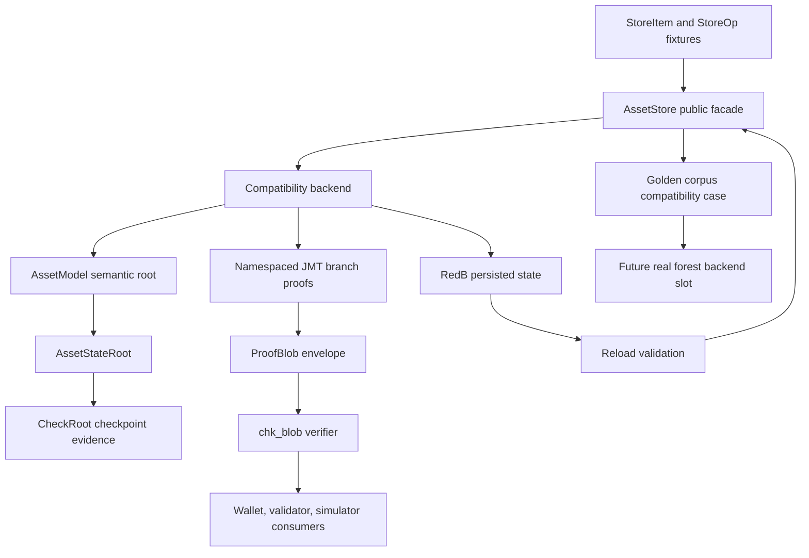

# Phase 051 Test Spec

## 🎯 Purpose

This document defines the phase-local unit, integration, and end-to-end test
contract for Phase 051.

It is directly usable by another engineer or agent without guessing scenario
boundaries, state transitions, proof paths, invariants, failure paths, test
homes, or pass oracles.

For Phase 051, end-to-end means realistic Rust coverage across storage,
checkpoint, validator, wallet, and simulator boundaries. It does not mean
browser automation.

This spec is now implementation-backed for the Phase 051 compatibility path.
It remains the phase-local test contract and records the future forest backend
as a non-executable handoff slot, not as shipped Phase 051 behavior.

## 📌 Workflow Status

- Mode: `implemented-and-validated`.
- Source artifacts used:
  - `.planning/phases/051-HJMT-Facade/051-CONTEXT.md`
  - `.planning/phases/051-HJMT-Facade/051-TODO.md`
  - `.planning/phases/051-HJMT-Facade/051-01-PLAN.md`
  - `.planning/phases/051-HJMT-Facade/051-02-PLAN.md`
  - `.planning/phases/051-HJMT-Facade/051-03-PLAN.md`
  - `.planning/phases/051-HJMT-Facade/051-04-PLAN.md`
  - `.planning/phases/051-HJMT-Facade/051-05-PLAN.md`
  - `docs/Z00Z-JMT-Design.md`
  - `.planning/phases/055-State Management-1/045-NEW-State-Management-Spec.md`
  - `.planning/phases/055-State Management-1/045-TODO.md`
  - live storage, checkpoint, validator, wallet, and simulator test anchors
- Completion artifacts:
  - `051-01-SUMMARY.md` through `051-06-SUMMARY.md`
  - `051-SUMMARY.md`
  - release-mode focused and broad validation evidence
- Testing posture:
  - Tests extend existing anchors first and add phase-owned files only where
    they clarify guardrail or golden-corpus boundaries.
  - New test files do not duplicate storage, checkpoint, wallet, validator, or
    simulator authority.
  - Broad workspace validation is release-mode only for Phase 051 evidence.

## ⚙️ Classification

### TDD And Integration Targets

| Seam | Class | Why It Matters |
| --- | --- | --- |
| `crates/z00z_storage/src/assets/store.rs` and `store_internal/*` | unit / integration | Own the facade, compatibility backend, rollback, path index, root history, and RedB rehydrate behavior. |
| `crates/z00z_storage/src/assets/types_identity.rs` and `types_record.rs` | unit / source-shape | Own `AssetStateRoot`, `CheckRoot`, `TxDigest`, `AssetPath`, `ProofItem`, and the no-substitution root contract. |
| `crates/z00z_storage/src/assets/proof.rs` and `store_internal/proof_help.rs` | unit / integration | Own `ProofBlob`, `ProofScanOut`, `chk_blob`, root-bind validation, branch proof validation, and fail-closed proof rejection. |
| `crates/z00z_storage/src/checkpoint/*` | integration | Own checkpoint draft/artifact/statement identity and persisted reload authority. |
| `crates/z00z_storage/src/assets/store_internal/redb_backend_validate.rs` | integration | Own reload validation and fail-closed checkpoint metadata acceptance. |
| `crates/z00z_runtime/validators/src/checkpoint_flow.rs`, `verdicts.rs`, `val_engine.rs` | source-shape / integration | Must consume storage-owned checkpoint contracts and existing verdict or reject vocabulary instead of defining a second verifier. |
| `crates/z00z_wallets/src/tx/state_witness.rs`, `commit_audit.rs`, `claim/claim_tx_verifier_impl_proof.rs` | unit / integration | Must consume storage-owned proof summaries and `ProofBlob` verification without treating backend roots as authority. |
| `crates/z00z_simulator/src/scenario_1/stage_11_utils/jmt_wallet_scan.rs` and Stage 4/13 storage helpers | integration / E2E | Must validate committed-state JMT proofs before ownership detection and must not replace storage, wallet, or checkpoint authority. |

### E2E Targets

| Home | Class | Why It Matters |
| --- | --- | --- |
| `crates/z00z_storage/tests/test_assets_suite.rs` through `tests/assets/test_store_api.rs` | E2E / storage scenario | Proves public `AssetStore` behavior, compatibility semantic operations, proof scans, and root contracts through the public storage facade. |
| `crates/z00z_storage/tests/test_checkpoint_root_binding.rs` | E2E / proof scenario | Proves semantic-root, backend-root, branch proof, and root-bind rejection before checkpoint-facing acceptance. |
| `crates/z00z_storage/tests/test_redb_rehydrate.rs` | E2E / persistence scenario | Proves reload, checkpoint metadata validation, state-root drift rejection, and checkpoint artifact binding over durable RedB rows. |
| `crates/z00z_storage/tests/test_search_api.rs` | E2E / path-index scenario | Proves deterministic lookup, pagination, scope filtering, and path-index rebuild expectations. |
| `crates/z00z_storage/tests/test_checkpoint_finalization.rs` | E2E / checkpoint scenario | Proves checkpoint seal/finalization behavior and wrong-statement failure handling. |
| `crates/z00z_storage/tests/test_claim_source_proof.rs` | E2E / claim-source proof scenario | Proves storage-owned claim-source roots and proof blobs remain tied to persisted membership, not synthetic authority. |
| `crates/z00z_wallets/tests/test_tx_tamper.rs` and `test_spend_proof_backend.rs` | E2E / wallet proof scenario | Proves wallet proof consumers reject tampered storage witnesses and treat backend-root/root-bind evidence as diagnostic. |
| `crates/z00z_simulator/tests/test_stage7_jmt_wallet_scan.rs` and `crates/z00z_simulator/tests/test_scenario1_unified_gate.rs` | E2E / simulator scenario | Proves simulator committed-state scan validates `proof_blob+chk_blob` before ownership detection and emits truthful artifacts. |

### Skip Targets

| Item | Why It Is Skipped |
| --- | --- |
| `crates/z00z_crypto/tari/**` | Vendor code is read-only in this repository. |
| `.planning/phases/051-HJMT-Facade/*.md` | Planning artifacts are specification inputs, not runtime test seams. |
| `docs/Z00Z-JMT-Design.md` | Design source for coverage and docs closeout, not an executable seam. |
| A dummy forest backend | Phase 051 must not implement a fake second backend only to make dual-backend tests appear complete. |
| Parallel checkpoint, proof, wallet scan, or simulator verifier modules | Phase 051 explicitly forbids duplicate authority layers. |

## 🔑 Existing Test Anchors To Reuse

| Anchor | What It Already Proves | Phase 051 Extension |
| --- | --- | --- |
| `crates/z00z_storage/tests/assets/test_store_api.rs` | Public `AssetStore` roundtrip, path contract, namespace separation, duplicate rejection, proof replay rejection, delete/no-op/reorder roots. | Add facade/compatibility naming, trait delegation, future-backend extension-point, and wider golden workloads. |
| `crates/z00z_storage/src/assets/store_internal/test_whitebox_state.rs` | Internal root parity, version history, rollback, path conflicts, namespace state, and batch behavior. | Add facade-backed rollback and compatibility backend invariants without exposing physical layout publicly. |
| `crates/z00z_storage/src/assets/store_internal/test_whitebox_proofs.rs` | `ProofBlob` codec, `chk_item`, `chk_blob`, parent/root/leaf/branch rejection. | Add explicit envelope version, unsupported proof-family, bucket metadata, detached payload, and no-placeholder coverage. |
| `crates/z00z_storage/tests/test_checkpoint_root_binding.rs` | Root-bind, wrong semantic root, wrong backend root, bind-version rejection. | Add CheckRoot-context and proof-envelope matrix coverage. |
| `crates/z00z_storage/tests/test_redb_rehydrate.rs` | RedB reload, checkpoint row identity, checkpoint proof/draft/exec drift rejection. | Add facade reload path and persisted path-index rebuild coverage. |
| `crates/z00z_storage/tests/test_search_api.rs` | Deterministic lookup, ordering, scope, pagination, and reload-stable search. | Add path-index rebuild as internal lookup state, not public root truth. |
| `crates/z00z_storage/tests/test_claim_source_proof.rs` | Storage-backed claim-source root/proof roundtrip and synthetic-item rejection. | Keep claim-source proof under the facade and block synthetic authority. |
| `crates/z00z_wallets/tests/test_tx_tamper.rs` | Wallet `MemberWit` rejects tampered proof bytes. | Prove wallet membership witnesses stay storage-owned after facade introduction. |
| `crates/z00z_wallets/tests/test_spend_proof_backend.rs` | Manual audit rejects root-bind drift and preserves diagnostic status. | Prove backend-root/root-bind equality is diagnostic only and paired with semantic root. |
| `crates/z00z_simulator/tests/test_stage7_jmt_wallet_scan.rs` | JMT committed-state scan validates proofs before wallet ownership detection. | Prove simulator remains a consumer of storage proofs, not a proof authority. |

## 🧩 Proposed New Test Files

These are proposed homes when existing files become too broad. Prefer extending
the existing anchors above when the seam is already present.

| Proposed File | Create Or Extend | Purpose |
| --- | --- | --- |
| `crates/z00z_storage/tests/assets/test_backend_facade_contract.rs` | Create, then wire through `crates/z00z_storage/tests/assets/test_assets.rs` | Focused facade contract and compatibility backend naming tests. |
| `crates/z00z_storage/tests/assets/test_proof_envelope_contract.rs` | Create, then wire through `crates/z00z_storage/tests/assets/test_assets.rs` | Dedicated Phase 051 proof-envelope version and reject matrix if `test_store_api.rs` becomes overloaded. |
| `crates/z00z_storage/tests/test_phase051_guardrails.rs` | Create | Source-shape guards for public exports, downstream imports, no dummy forest backend, no duplicate checkpoint verifier, and no backend-root authority decisions. |
| `crates/z00z_storage/tests/test_phase051_golden_corpus.rs` | Create | Golden compatibility corpus over facade workloads and future real-backend extension point. |
| `crates/z00z_storage/tests/test_phase051_recovery_contract.rs` | Create only if reload corpus outgrows `test_redb_rehydrate.rs` | Reload, checkpoint seal/reload, path-index rebuild, and persisted drift rejection under the facade. |

## 📍 Test File Placement

| Scenario ID | Test File Path | Extend Or Create | Why This Is The Correct Home |
| --- | --- | --- | --- |
| `051-SC-01` | `crates/z00z_storage/tests/assets/test_backend_facade_contract.rs` | Create | The facade boundary is a storage public-contract seam and should be wired into the existing assets suite. |
| `051-SC-02` | `crates/z00z_storage/tests/assets/test_store_api.rs` plus `crates/z00z_storage/tests/assets/test_backend_facade_contract.rs` | Extend / create | Compatibility backend behavior must preserve the public `AssetStore` API and avoid duplicated implementation paths. |
| `051-SC-03` | `crates/z00z_storage/tests/test_phase051_guardrails.rs`, `crates/z00z_storage/tests/test_checkpoint_root_binding.rs` | Create / extend | Root taxonomy combines source-shape guards and typed runtime root conversion assertions. |
| `051-SC-04` | `crates/z00z_storage/tests/assets/test_proof_envelope_contract.rs`, `crates/z00z_storage/src/assets/store_internal/test_whitebox_proofs.rs` | Create / extend | Valid proof-envelope acceptance requires both public witness checks and internal branch-proof assertions. |
| `051-SC-05` | `crates/z00z_storage/tests/assets/test_proof_envelope_contract.rs`, `crates/z00z_storage/tests/test_checkpoint_root_binding.rs` | Create / extend | The mismatch matrix is storage proof behavior and checkpoint-facing root binding. |
| `051-SC-06` | `crates/z00z_storage/tests/test_phase051_guardrails.rs` | Create | Public-surface and downstream source-shape checks belong in one explicit drift guard. |
| `051-SC-07` | `crates/z00z_storage/tests/test_phase051_guardrails.rs`, future validator tests only if validator behavior grows | Create / extend | Validator code is currently thin; source-shape guards should prevent a second checkpoint formula before behavior is added. |
| `051-SC-08` | `crates/z00z_wallets/tests/test_tx_tamper.rs`, `crates/z00z_wallets/tests/test_spend_proof_backend.rs`, `crates/z00z_storage/tests/test_claim_source_proof.rs` | Extend | Wallet proof consumers already have tamper and diagnostic audit homes. |
| `051-SC-09` | `crates/z00z_simulator/tests/test_stage7_jmt_wallet_scan.rs`, `crates/z00z_simulator/tests/test_scenario1_unified_gate.rs` | Extend | Simulator proof-before-ownership behavior already lives in the Stage 7 JMT scan tests. |
| `051-SC-10` | `crates/z00z_storage/tests/test_phase051_golden_corpus.rs` | Create | Golden workloads need a reusable matrix that a future real forest backend can join. |
| `051-SC-11` | `crates/z00z_storage/tests/test_phase051_golden_corpus.rs`, `crates/z00z_storage/src/assets/store_internal/test_whitebox_state.rs` | Create / extend | Reject-without-mutation behavior needs both public corpus and internal rollback checks. |
| `051-SC-12` | `crates/z00z_storage/tests/test_redb_rehydrate.rs`, `crates/z00z_storage/tests/test_search_api.rs`, optional `crates/z00z_storage/tests/test_phase051_recovery_contract.rs` | Extend / create | Reload and path-index rebuild are persistence/search seams, not proof-envelope seams. |
| `051-SC-13` | `crates/z00z_storage/tests/test_checkpoint_finalization.rs`, `crates/z00z_storage/tests/test_checkpoint_root_binding.rs`, `crates/z00z_storage/tests/test_redb_rehydrate.rs` | Extend | Checkpoint seal/reload and wrong statement binding are checkpoint-owned authority checks. |
| `051-SC-14` | `crates/z00z_storage/tests/test_phase051_golden_corpus.rs`, `crates/z00z_storage/tests/test_phase051_guardrails.rs` | Create | Future backend readiness must be explicit without shipping a fake forest backend. |
| `051-SC-15` | `.planning/phases/051-HJMT-Facade/051-SUMMARY.md`, `.planning/ROADMAP.md`, `.planning/STATE.md` | Extend after execution | Closeout evidence is a planning/doc synchronization seam after tests and implementation pass. |

## ✅ Required End-To-End Behaviors

| Behavior | Requirement | Primary Path | Pass Signal | Fail Signal |
| --- | --- | --- | --- | --- |
| One semantic storage facade exists | `PH51-BACKEND-FACADE` | `AssetStore` -> facade trait or equivalent -> compatibility backend | Callers can run root, lookup, batch mutation, proof, checkpoint-facing, and reload flows without passing physical layout inputs. | Public APIs accept `TreeId`, namespace bytes, branch order, raw physical keys, or raw backend roots as authority. |
| Compatibility backend preserves current semantics | `PH51-COMPAT-BACKEND`, `JMT-REQ-010` | current shared namespaced JMT -> explicit compatibility backend -> `AssetStore` facade | Existing store API tests and golden corpus roots remain identical. | Refactor copies logic into a parallel backend or changes roots, rollback, path index, claim nullifier, or checkpoint behavior. |
| Root taxonomy is non-interchangeable | `PH51-ROOT-TAXONOMY`, `JMT-REQ-001`, `JMT-REQ-012` | `AssetStateRoot` -> `CheckRoot`; `TxDigest::to_check()`; proof diagnostics | `AssetStateRoot` is the live public state root, `CheckRoot` is checkpoint evidence, and `TxDigest` cannot become a checkpoint root. | `backend_root`, `TxDigest`, or future `SettlementStateRoot` can substitute for authority roots. |
| Proof envelope accepts only fully bound witnesses | `PH51-PROOF-ENVELOPE`, `JMT-REQ-008` | `ProofBlob::encode` -> `chk_blob` -> branch proof validation | A valid witness binds semantic root, path, parent-root leaves, terminal leaf, leaf hash, backend root, root-bind version, root-bind bytes, and all branch proofs. | A detached payload, wrong root, wrong path, wrong leaves, wrong hash, wrong binding, or wrong branch proof validates. |
| Proof envelope rejects the full mismatch matrix | `PH51-PROOF-ENVELOPE`, `JMT-REQ-011` | malformed/tampered envelope -> `chk_blob` or storage-owned verifier | Unsupported version, malformed bytes, wrong semantic root, wrong path, wrong checkpoint context, wrong bucket metadata, wrong branch proof, and detached payloads reject fail-closed. | Any mismatch returns success, gets ignored, or degrades into a broad opaque error that cannot be asserted. |
| Unsupported proof families do not pass as placeholders | `JMT-REQ-008`, `JMT-REQ-011` | deletion/non-existence envelope form -> storage-owned verifier | If real deletion or non-existence semantics are absent, tests assert explicit unsupported-family rejection. | Placeholder proof bytes, fake deletes, or unsupported families validate as if implemented. |
| Downstream crates cannot bind to physical layout | `PH51-GUARDRAILS` | validator/wallet/simulator imports and proof paths | Source-shape tests block external `TreeId`, `ns_key`, namespace tags, branch layout, and raw backend-root authority decisions. | Downstream code reconstructs branch semantics or accepts backend-root equality as state authority. |
| Validator checkpoint flow consumes storage authority | `PH51-CHECKPOINT-RELOAD` | storage checkpoint artifact -> validator verdict/reject vocabulary | Validators use storage-owned checkpoint artifacts and existing `RejectClass` values. | Validator code defines a second checkpoint proof formula, artifact schema, or verdict vocabulary. |
| Wallet membership remains storage-owned | `PH51-GUARDRAILS` | `ProofBlob` -> `MemberWit` / claim-source proof / audit entries | Wallet tests reject tampered proof bytes and pair backend-root/root-bind diagnostics with semantic root checks. | Wallet code reconstructs raw branch proofs or treats backend-root equality as acceptance. |
| Simulator validates committed-state proofs first | `PH51-GUARDRAILS`, `PH51-EQUIVALENCE` | post-tx store -> `proof_blob` -> `chk_blob` -> ownership detection | `proof_validated_count == candidate_count`, empty/tampered proof bytes reject before ownership scanning. | Simulator scans detached leaves without proof validation or emits proof-success artifacts from unverified rows. |
| Golden corpus captures semantic workloads | `PH51-EQUIVALENCE` | facade workloads -> compatibility backend oracle | Insert-many, delete-many, hot-serial, cross-definition, reorder-stable, no-op, lookup, pagination, replay, and proof outcomes are deterministic. | Root or item outcome changes silently, or corpus compares compatibility to copied compatibility logic. |
| Rejection workloads preserve state | `PH51-EQUIVALENCE` | duplicate path, delete missing, path conflict, wrong proof -> facade | Root, version history, path index, and stored rows remain unchanged after rejection. | Failed operations partially mutate store state, version history, path index, or RedB rows. |
| Reload and path-index rebuild are storage-owned | `PH51-CHECKPOINT-RELOAD`, `JMT-REQ-009` | RedB commit -> load -> root/items/find/list | Reloaded store returns persisted `AssetStateRoot`, items, deterministic pages, and rebuilt `AssetId` lookup. | Path index becomes public root truth or reload accepts root/flat/checkpoint drift. |
| Checkpoint seal/reload stays fail-closed | `PH51-CHECKPOINT-RELOAD` | `apply_ops_with_attest_exec` -> checkpoint artifact -> reload validation | Checkpoint ids, exec ids, draft ids, statement roots, proof bytes, and stored rows agree after reload. | Wrong proof, wrong statement binding, missing rows, or mixed-era ids are accepted. |
| Future forest backend handoff is test-ready but not fake | `PH51-ROLLOUT-HANDOFF`, `JMT-REQ-003` through `JMT-REQ-008` | golden corpus harness -> compatibility case + future real-backend slot | Harness names compatibility as the only executable backend and documents a real future insertion point. | A dummy forest backend is introduced, fixed bucket policy is overclaimed, or Phase 051 claims commit journal/crash recovery shipped. |
| Closeout truth stays bounded | `PH51-ROLLOUT-HANDOFF` | docs + summary + roadmap/state | Closeout lists shipped tests, known deferred forest work, and no-parallel-layer guardrails. | Docs claim production forest, deletion/non-existence proofs, `RightLeaf`, `FeeEnvelope`, or generalized settlement root shipped without evidence. |

## 🔗 Critical Integration Paths

1. `AssetStore` public methods -> storage-owned facade -> compatibility backend -> existing `AssetModel`, `TreeStore`, `RedbBackend`, path-index, and checkpoint validation paths.
2. `AssetPath` / `StoreItem` / `StoreOp` -> batch mutation -> `AssetStateRoot` -> `CheckRoot` projection.
3. `ProofBlob` -> `chk_blob` -> root/path/leaf/leaf-hash checks -> root-bind check -> definition, serial, and asset branch proofs.
4. RedB durable rows -> `AssetStore::load` -> checkpoint metadata validation -> root/items/find/list behavior.
5. Checkpoint exec input -> draft/artifact/link ids -> checkpoint reload validation -> validator verdict vocabulary.
6. Storage proof scan -> wallet `MemberWit`, claim-source verifier, and asset-class audit diagnostics.
7. Committed post-tx store -> simulator `jmt_wallet_scan` -> proof validation -> receiver ownership detection -> JSON report artifact.
8. Golden corpus harness -> compatibility backend case now -> future real forest backend case later, without changing expected semantic outcomes.

## Realistic Examples To Implement

These examples are the concrete user journeys that the Phase 051 tests must
exercise. They are intentionally written as implementation-facing examples,
not as abstract requirements.

| Example ID | Scenario IDs | Test Home | Journey | Pass Condition | Failure Condition |
| --- | --- | --- | --- | --- | --- |
| `051-EX-01` | `051-SC-01`, `051-SC-02`, `051-SC-10` | `crates/z00z_storage/tests/assets/test_backend_facade_contract.rs`, `crates/z00z_storage/tests/test_phase051_golden_corpus.rs` | Seed multiple definitions and serials, run `put_item`, batch `apply_ops`, delete one committed item, reload through the public `AssetStore` facade, and compare root, item set, lookup, list pages, proof item/blob, and claim-source contract through the named `compatibility` case. | The same `AssetStateRoot`, `CheckRoot`, stored rows, path lookup, pagination order, proof verification outcome, and claim-source result are observed before and after reload. | Any public call needs `TreeId`, namespace bytes, raw backend roots, branch ordering, copied compatibility logic, or a non-facade authority path. |
| `051-EX-02` | `051-SC-03`, `051-SC-04` | `crates/z00z_storage/tests/assets/test_proof_envelope_contract.rs`, `crates/z00z_storage/tests/test_checkpoint_root_binding.rs` | Commit one item, fetch `ProofBlob`, decode the current compatibility envelope version, pass it through `chk_blob`, and project `AssetStateRoot` to `CheckRoot` only through the typed conversion path. | The verifier accepts only when semantic root, path, definition-root leaf, serial-root leaf, terminal leaf, leaf hash, backend root, root-bind version, root-bind bytes, and all branch proofs match the committed item. | `TxDigest::to_check()` succeeds, `backend_root` substitutes for authority, or a live `SettlementStateRoot`, `RightLeaf`, or `FeeEnvelope` export appears. |
| `051-EX-03` | `051-SC-05`, `051-SC-11` | `crates/z00z_storage/tests/assets/test_proof_envelope_contract.rs`, `crates/z00z_storage/src/assets/store_internal/test_whitebox_proofs.rs`, `crates/z00z_storage/tests/test_phase051_golden_corpus.rs` | Start from the valid proof in `051-EX-02`, then mutate one field at a time: envelope version, semantic root, path, parent leaves, terminal leaf, leaf hash, backend-root binding, root-bind bytes, checkpoint context, bucket metadata, branch bytes, deletion family, and non-existence family. | Every mutation returns the expected typed `ProofChkErr` or explicit unsupported-proof-family error, and before/after root, version history, item set, path index, and persisted rows are unchanged. | A mutation validates, falls through to a vague success path, silently ignores bucket metadata, accepts placeholder deletion/non-existence proof bytes, or partially mutates state. |
| `051-EX-04` | `051-SC-12`, `051-SC-13` | `crates/z00z_storage/tests/test_redb_rehydrate.rs`, `crates/z00z_storage/tests/test_checkpoint_finalization.rs`, `crates/z00z_storage/tests/test_search_api.rs` | Run `apply_ops_with_attest_exec`, persist checkpoint draft/artifact/link rows, close and reload RedB, rebuild path lookup, then run root/items/find/list and checkpoint validation through storage-owned code. | Reloaded `AssetStateRoot`, `CheckRoot`, checkpoint ids, exec ids, draft ids, statement roots, proof bytes, item rows, `find_asset`, and list pages match the pre-reload expectations. | Root drift, flat-root drift, missing snapshot, missing exec, proof-byte drift, draft drift, checkpoint-id drift, statement mismatch, or stale path-index state is accepted. |
| `051-EX-05` | `051-SC-07`, `051-SC-08`, `051-SC-09` | `crates/z00z_storage/tests/test_phase051_guardrails.rs`, `crates/z00z_wallets/tests/test_tx_tamper.rs`, `crates/z00z_wallets/tests/test_spend_proof_backend.rs`, `crates/z00z_simulator/tests/test_stage7_jmt_wallet_scan.rs` | Feed storage-owned proof and checkpoint artifacts into validator, wallet, and simulator consumers. For the simulator path, run Scenario 1 stages 7 through 11 so `jmt_wallet_scan` validates committed-state proofs before ownership detection. | Validators use existing `RejectClass` vocabulary, wallet witnesses reject tampered storage evidence, and simulator artifacts show `proof_validated_count == candidate_count` with proof-validated rows before owned rows are reported. | A downstream crate imports `TreeId`, calls `ns_key`, reconstructs branch proof semantics, defines a second checkpoint verifier, treats backend-root equality as authority, or emits owned scan rows from missing/tampered proof bytes. |
| `051-EX-06` | `051-SC-14`, `051-SC-15` | `crates/z00z_storage/tests/test_phase051_golden_corpus.rs`, `.planning/phases/051-HJMT-Facade/051-SUMMARY.md` | Run the golden corpus with one executable `compatibility` backend case and one documented future real-forest backend slot. Close the phase only after focused gates, broad gate, and review-loop evidence exist. | The compatibility case passes every semantic workload, the future backend slot is explicit pending/unsupported, and closeout records shipped tests plus deferred fixed buckets, forest backend, commit journal, recovery, deletion proofs, and non-existence proofs. | A dummy forest backend is added, compatibility is compared against copied compatibility logic, or closeout claims production forest, `RightLeaf`, `FeeEnvelope`, generalized settlement root, deletion proofs, or non-existence proofs shipped without evidence. |

## 🧪 Input Fixtures And Preconditions

| Scenario ID | Inputs | Preconditions | Fixture Source |
| --- | --- | --- | --- |
| `051-SC-01` | Public `AssetStore` operations and future facade trait object or equivalent wrapper. | Phase 051 facade implementation exists. | Existing `test_store_api.rs` helpers plus new facade helper. |
| `051-SC-02` | Current shared namespaced JMT workloads: put, delete, apply ops, proof item/blob/scan, claim-source proof. | Compatibility backend is named in source and delegated by `AssetStore`. | `AssetStore::new`, `AssetStore::load`, `StoreOp`, `ProofBlob`. |
| `051-SC-03` | `AssetStateRoot`, `CheckRoot`, `TxDigest`, future-only names. | Root taxonomy code is updated. | `types_identity.rs`, `mod.rs`, source-shape `include_str!` guards. |
| `051-SC-04` | Valid `ProofBlob` bytes from a committed item. | Store has one or more committed leaves. | Existing `test_blob_case()` style fixtures. |
| `051-SC-05` | Tampered proof bytes, wrong root/path/leaves/hash/binding/branch proof, unsupported version/family forms. | Proof envelope exposes explicit version/family boundary or explicit unsupported errors. | `ProofBlob::with_root_bind`, manual wire structs, malformed bytes. |
| `051-SC-06` | Source scans for exports/imports of `TreeId`, `ns_key`, backend-root authority, duplicate verifier modules. | Public API and downstream code are available. | `include_str!` over listed source files plus `rg` guard commands. |
| `051-SC-07` | Checkpoint artifact and validator `Verdict` / `RejectClass`. | Validator remains consumer of storage checkpoint authority. | `verdicts.rs`, `checkpoint_flow.rs`, storage checkpoint tests. |
| `051-SC-08` | Wallet proof witness, claim-source proof, audit entry, spend proof statement. | Wallet proof consumers use storage proof APIs. | `proof_blob_fix.rs`, `test_tx_tamper.rs`, `test_spend_proof_backend.rs`. |
| `051-SC-09` | Scenario 1 post-tx store and actors. | Scenario 1 stages 7 through 11 can produce committed post-tx rows under `test-fast`. | `test_stage7_jmt_wallet_scan.rs`. |
| `051-SC-10` | Workload vectors for insert-many, delete-many, hot-serial, cross-definition, reorder/no-op, lookup/list. | Facade and compatibility backend are implemented. | New golden corpus helper. |
| `051-SC-11` | Duplicate path, delete missing, path conflict, wrong proof and replay workloads. | Rollback behavior is preserved. | Existing whitebox rollback tests plus new public corpus. |
| `051-SC-12` | RedB tempdir, env lock, committed rows, lookup/list after reload. | Durable storage can be opened through `AssetStore::load`. | `test_redb_rehydrate.rs`, `test_search_api.rs`. |
| `051-SC-13` | Checkpoint exec tx, draft/artifact/link rows, wrong statement/proof bytes. | Checkpoint proof authority stays in `z00z_storage::checkpoint`. | `test_checkpoint_finalization.rs`, `test_redb_rehydrate.rs`. |
| `051-SC-14` | Backend-case registry with compatibility case and documented future real-backend slot. | No production forest backend exists in Phase 051. | New `test_phase051_golden_corpus.rs`. |
| `051-SC-15` | Plan summaries, test evidence, docs, roadmap/state. | Implementation and validation have completed. | `051-SUMMARY.md`, `ROADMAP.md`, `STATE.md`. |

## 📦 Expected Outputs And Produced Artifacts

| Scenario ID | Expected Output | Persisted Artifact | Observable Signal |
| --- | --- | --- | --- |
| `051-SC-01` | Public behavior works through facade and never exposes physical layout inputs. | None required. | Trait/facade tests compile and pass; source-shape guards reject leaks. |
| `051-SC-02` | Same roots, items, proofs, claim-source contract, and rollback semantics as current backend. | Optional RedB state when loaded from tempdir. | Existing store API tests remain green plus compatibility case name appears in golden harness. |
| `051-SC-03` | Root conversions and future-only names are bounded. | None. | `TxDigest::to_check()` returns `RootErr::TxRootMix`; no public `SettlementStateRoot`, `RightLeaf`, or `FeeEnvelope` export. |
| `051-SC-04` | Valid proof envelope returns success and decoded fields match committed item. | None. | `chk_blob` returns `Ok(ProofBlob)` and branch proof assertions pass. |
| `051-SC-05` | Every tamper class returns typed reject. | None. | Exact `ProofChkErr` or explicit unsupported-family error is asserted. |
| `051-SC-06` | Forbidden physical-layout imports or authority checks are absent. | None. | Source-shape test fails if forbidden imports/patterns reappear outside storage-owned internals. |
| `051-SC-07` | Validator emits existing reject vocabulary from storage-owned evidence. | Checkpoint artifact rows when behavior test exists. | No second formula/schema source hits; validator tests assert `RejectClass` rather than ad hoc strings. |
| `051-SC-08` | Wallet proof consumers reject tampered storage evidence. | None. | `StateError::BadMember`, claim-source proof mismatch, or audit root mismatch appears as expected. |
| `051-SC-09` | Simulator proof-first scan artifact is truthful. | `transactions/charlie_jmt_scan.json` and related Scenario 1 outputs. | `proof_validated_count == candidate_count`, rows are proof-validated, missing proof rejects. |
| `051-SC-10` | Golden corpus produces deterministic semantic expectations. | Optional corpus vector file only if implementation chooses checked-in vectors. | Compatibility backend case passes all workload expectations. |
| `051-SC-11` | Rejected workloads do not mutate root, version, rows, or path index. | Optional RedB state for durable rejection tests. | Before/after root and item snapshots are identical. |
| `051-SC-12` | Reloaded state matches committed state and path-index lookup rebuilds. | `asset_state.redb` under tempdir. | Root/items/list/find match pre-reload expectations; drift rows reject. |
| `051-SC-13` | Checkpoint seal/reload is statement-bound and fail-closed. | RedB checkpoint tables and filesystem checkpoint artifacts when used. | Checkpoint ids derive from current bytes; tampered proof/statement rows reject. |
| `051-SC-14` | Future backend slot is documented but not executable. | None. | Harness skips or marks future backend as pending with an explicit reason, not success. |
| `051-SC-15` | Closeout docs truthfully record shipped and deferred work. | `051-SUMMARY.md`, `ROADMAP.md`, `STATE.md`. | Docs list validation evidence and future forest handoff without overclaiming. |

## 🛡️ Cryptographic And Security Invariants To Observe

| Invariant | Why It Matters | Assertion Shape |
| --- | --- | --- |
| `AssetStateRoot` is the only live public asset-state root. | Prevents physical backend roots or future generalized roots from becoming current authority. | Public API/source-shape tests assert no root substitution path and no live `SettlementStateRoot` export. |
| `CheckRoot` is checkpoint-facing evidence derived from `AssetStateRoot`. | Keeps checkpoint APIs typed without widening state-root semantics. | Assert `CheckRoot::from(asset_root)` works and `TxDigest::to_check()` rejects with `RootErr::TxRootMix`. |
| `backend_root` is proof-local or diagnostic. | Prevents physical shared-JMT root equality from becoming semantic state authority. | Tests assert audit/report use pairs backend-root with semantic root and root-bind checks; no public method accepts raw backend root as authority. |
| `ProofBlob` root-bind version and bytes bind semantic root to backend root. | Prevents detached branch proofs from validating under the wrong semantic context. | Tamper `root_bind_ver`, `root_bind`, semantic root, or backend root and assert fail-closed rejection. |
| Leaf hash binds terminal `AssetLeaf` bytes. | Prevents valid branch proof bytes from being replayed over a different payload. | Tamper `asset_leaf_hash` or `AssetLeaf` fields and assert `LeafHashMix` or `LeafMix`. |
| Branch proofs bind definition, serial, and asset path segments. | Prevents cross-definition, cross-serial, and cross-asset proof replay. | Tamper each branch proof or parent-root leaf and assert the matching proof/leaf mismatch. |
| Compatibility mode rejects unexpected bucket metadata. | Keeps future forest bucket policy from being silently ignored by compatibility mode. | Add bucket metadata to compatibility envelope and assert explicit reject. |
| Unsupported deletion and non-existence families fail closed. | Avoids fake coverage before real forest semantics exist. | Submit unsupported family markers or placeholder bytes and assert explicit unsupported-family rejection. |
| Checkpoint reload validates persisted row identity. | Prevents stale or mixed-era checkpoint metadata from becoming accepted state. | Tamper checkpoint, draft, exec, snapshot, proof bytes, or metadata ids and assert `AssetStore::load` rejects. |
| Path index remains rebuildable internal lookup state. | Prevents secondary lookup state from becoming a public root authority. | Reload and `find_asset` succeed from committed rows, while source-shape guards prevent public path-index root exports. |

## 🔄 Mermaid Flow



## 🧱 Clarifying Code Snippets

The exact helper names may change during implementation, but the assertion
shape must stay this explicit.

```rust
let root = store.put_item(item.clone()).expect("put item");
let blob = store.proof_blob(&item.path()).expect("proof blob");
let proof = blob.item().clone();

chk_blob(
    &blob.encode().expect("encode blob"),
    root,
    &item.path(),
    proof.def_leaf(),
    proof.ser_leaf(),
    item.leaf(),
)
.expect("valid compatibility proof must verify");
```

```rust
let err = chk_blob(
    &tampered_bytes,
    expected_root,
    &expected_path,
    expected_def_leaf,
    expected_ser_leaf,
    expected_leaf,
)
.expect_err("tampered compatibility proof must reject");

assert_eq!(err, ProofChkErr::RootBindMix);
```

```rust
assert!(
    !ASSETS_MOD_RS.contains("pub use self::store::tree_id::TreeId"),
    "TreeId must remain storage-internal"
);
assert!(
    !DOWNSTREAM_RS.contains("ns_key("),
    "downstream crates must not reconstruct storage namespace keys"
);
```

## 📊 Scenario Matrix

| Scenario ID | Type | Goal | Positive Example | Negative Example | Main Assertions |
| --- | --- | --- | --- | --- | --- |
| `051-SC-01` | unit / integration | Prove one storage-owned facade boundary. | Public root, lookup, batch, proof, checkpoint, reload methods delegate through the facade. | Facade accepts raw `TreeId`, namespace bytes, raw backend root, or branch order inputs. | Facade covers required methods; public API stays source-compatible; physical layout is not public. |
| `051-SC-02` | integration | Prove compatibility backend preserves current behavior. | Current store workloads produce the same roots and items after wrapping. | Refactor copies old logic into a second path or changes rollback/path-index behavior. | Root/item/proof/claim-source/checkpoint behavior remains identical through the compatibility case. |
| `051-SC-03` | unit / source-shape | Prove root taxonomy. | `AssetStateRoot -> CheckRoot` is accepted; `TxDigest::to_check()` rejects. | `SettlementStateRoot`, `RightLeaf`, `FeeEnvelope`, or raw backend roots become live public exports. | Typed conversion/rejection plus source-shape guards. |
| `051-SC-04` | integration | Prove valid proof envelope. | A committed item's `ProofBlob` validates through `chk_blob`. | Valid branch bytes are detached from semantic root/path/leaves. | Semantic root, path, parent leaves, terminal leaf, leaf hash, root bind, and branch proofs match. |
| `051-SC-05` | negative / integration | Prove proof reject matrix. | None; this is rejection coverage. | Unsupported version, malformed bytes, wrong root/path/checkpoint/bucket metadata/branch/detached payload. | Each mismatch returns an asserted typed error or explicit unsupported-family error. |
| `051-SC-06` | source-shape | Prove public-surface guardrails. | `TreeId` and `ns_key` stay inside storage internals; backend-root docs say diagnostic. | Downstream imports storage layout or accepts raw backend roots as authority. | `include_str!` or `rg` guards fail on forbidden source shapes. |
| `051-SC-07` | source-shape / integration | Prove validator checkpoint consumption. | Validator uses storage checkpoint artifacts and `RejectClass`. | Validator defines a second proof formula, artifact schema, or verdict vocabulary. | No duplicate schema/formula source hits; behavior tests assert existing reject classes if added. |
| `051-SC-08` | integration | Prove wallet proof consumption. | `MemberWit` and claim-source verifier accept storage-owned valid proof bytes. | Tampered proof bytes, root-bind drift, or synthetic claim-source items pass. | `BadMember`, source-proof mismatch, or audit root mismatch rejects. |
| `051-SC-09` | E2E / simulator | Prove proof-before-ownership scan. | Post-tx JMT candidates validate before receiver ownership detection. | Empty/tampered proof bytes still produce owned scan rows. | Scan rows are proof-validated; missing proof rejects; artifact wording remains truthful. |
| `051-SC-10` | golden corpus | Prove semantic workloads. | Insert-many, delete-many, hot-serial, cross-definition, reorder, no-op, lookup/list all match expectations. | Compatibility case drifts or root changes silently. | Exact `AssetStateRoot`, item set, lookup, pagination, and proof outcomes. |
| `051-SC-11` | negative / golden corpus | Prove reject-without-mutation. | Duplicate path, delete missing, path conflict, wrong proof all reject. | Failed operation mutates root, version, item set, path index, or RedB row. | Before/after root/items/version/path index are unchanged. |
| `051-SC-12` | persistence / E2E | Prove reload and path-index rebuild. | Reloaded store returns same root, items, `find_asset`, and pages. | Root drift, flat-root drift, missing rows, or stale path index accepted. | Durable reload matches semantic rows; drift tests reject. |
| `051-SC-13` | checkpoint / E2E | Prove checkpoint seal/reload. | Valid exec/draft/artifact/link rows derive expected ids and reload. | Wrong statement root, checkpoint proof bytes, missing exec/snapshot row, mixed-era id. | Storage-owned checkpoint validation rejects before metadata acceptance. |
| `051-SC-14` | harness | Prove future backend readiness without fakes. | Harness runs `compatibility` case and names a future real forest case as pending. | Dummy forest backend copies compatibility behavior or claims fixed buckets/journal shipped. | Compatibility is the only executable case; future case is explicit pending/unsupported. |
| `051-SC-15` | docs / closeout | Prove truthful closure. | Summary lists changed files, tests, review evidence, and deferred forest work. | Docs overclaim forest backend, deletion/non-existence proofs, `RightLeaf`, or `FeeEnvelope`. | Closeout and roadmap/state match implementation evidence only. |

## 🧪 Canonical Commands

Every Rust or test-affecting implementation wave must run the fail-fast gate
first:

```bash
./.github/skills/smart-tests-bootstrap/scripts/bootstrap_tests.sh
```

Focused commands for Phase 051 test implementation:

```bash
cargo test -p z00z_storage --release --features test-fast --features wallet_debug_dump --test test_phase051_guardrails -- --nocapture
cargo test -p z00z_storage --release --features test-fast --features wallet_debug_dump --test test_assets_suite -- --nocapture
cargo test -p z00z_storage --release --features test-fast --features wallet_debug_dump --test test_checkpoint_root_binding -- --nocapture
cargo test -p z00z_storage --release --features test-fast --features wallet_debug_dump --test test_redb_rehydrate -- --nocapture
cargo test -p z00z_storage --release --features test-fast --features wallet_debug_dump --test test_search_api -- --nocapture
cargo test -p z00z_storage --release --features test-fast --features wallet_debug_dump --test test_claim_source_proof -- --nocapture
cargo test -p z00z_storage --release --features test-fast --features wallet_debug_dump --test test_checkpoint_finalization -- --nocapture
cargo test -p z00z_storage --release --features test-fast --features wallet_debug_dump --test test_phase051_golden_corpus -- --nocapture
cargo test -p z00z_storage --release --features test-fast --features wallet_debug_dump --test test_phase051_recovery_contract -- --nocapture
cargo test -p z00z_wallets --release --features test-fast --features wallet_debug_dump --test test_tx_tamper -- --nocapture
cargo test -p z00z_wallets --release --features test-fast --features wallet_debug_dump --test test_spend_proof_backend -- --nocapture
cargo test -p z00z_simulator --release --features test-fast --features wallet_debug_dump --test test_stage7_jmt_wallet_scan -- --nocapture
cargo test -p z00z_simulator --release --features test-fast --features wallet_debug_dump --test test_scenario1_unified_gate -- --nocapture
```

Run `test_phase051_recovery_contract` only if that optional file is created;
otherwise the reload and path-index checks stay in `test_redb_rehydrate`,
`test_search_api`, and `test_checkpoint_finalization`.

Broad validation command required by the Phase 051 plans whenever relevant:

```bash
cargo test --release --features test-fast --features wallet_debug_dump
```

Review loop required by the Phase 051 plans for every auto task:

```text
/GSD-Review-Tasks-Execution current_spec=.planning/phases/051-HJMT-Facade/051-TEST-SPEC.md current_task=<scenario-or-wave>
```

This command must run `.github/prompts/gsd-review-tasks-execution.prompt.md`.
Run it at least 3 times in YOLO mode, fix all issues and warnings, and stop
only after at least 2 consecutive runs show no significant issues in the code.

## 🚩 Open Gaps

- Phase 051 compatibility-path execution is complete and green; future forest
  backend execution remains Phase 052 work behind the same facade.
- The production forest backend, fixed bucket policy, commit journal,
  crash-safe child-before-parent publication, configuration rollout, deletion
  proofs, and non-existence proofs are future work unless Phase 051 context is
  explicitly updated before implementation.
- Compatibility mode must reject unexpected bucket metadata and unsupported
  proof families; it must not silently ignore them or fake support.
- Validator behavior is currently thin. Until real validator checkpoint logic
  grows, source-shape guards are the correct first test home.
- New test files under `crates/z00z_storage/tests/assets/` must be wired
  through `crates/z00z_storage/tests/assets/test_assets.rs` and
  `crates/z00z_storage/tests/test_assets_suite.rs` so Cargo actually runs them.
