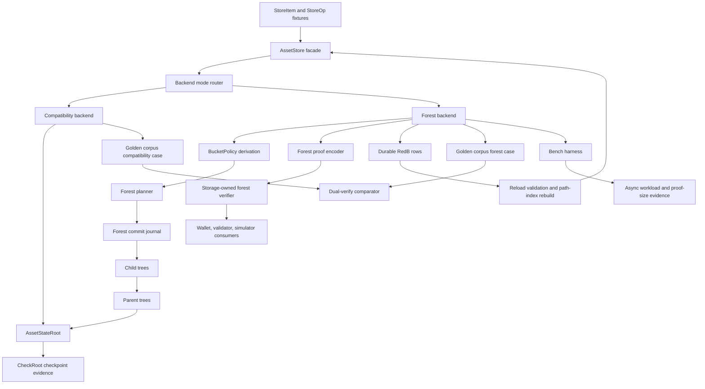

<!-- markdownlint-disable MD060 -->

# Phase 052 Test Spec

## 🎯 Purpose

This document defines the phase-local unit, integration, Rust end-to-end, and
benchmark validation contract for Phase 052.

It is directly usable by another engineer or agent without guessing scenario
boundaries, proof paths, state transitions, failure paths, test homes, pass
oracles, benchmark obligations, or simulator anchors.

For Phase 052, end-to-end means realistic Rust coverage across storage,
checkpoint, validator, wallet, simulator, and benchmark boundaries. It does
not mean browser automation.

The phase goal is not only to prove that the real HJMT forest backend works,
but also to prove that it stays behind the Phase 051 facade, preserves the
Phase 051 semantic contract, rejects every unsupported or malformed proof
path fail-closed, and keeps `scenario_1` on storage-owned semantic authority.

## 📌 Workflow Status

- Mode: `implemented-and-validated`.
- Source artifacts used:
  - `.planning/phases/052-HJMT-Backend/052-CONTEXT.md`
  - `.planning/phases/052-HJMT-Backend/052-TODO.md`
  - `.planning/phases/052-HJMT-Backend/052-01-PLAN.md`
  - `.planning/phases/052-HJMT-Backend/052-02-PLAN.md`
  - `.planning/phases/052-HJMT-Backend/052-03-PLAN.md`
  - `.planning/phases/052-HJMT-Backend/052-04-PLAN.md`
  - `.planning/phases/052-HJMT-Backend/052-05-PLAN.md`
  - `.planning/phases/052-HJMT-Backend/052-06-PLAN.md`
  - `.planning/phases/052-HJMT-Backend/052-07-PLAN.md`
  - `.planning/phases/052-HJMT-Backend/052-08-PLAN.md`
  - `.planning/phases/052-HJMT-Backend/052-09-PLAN.md`
  - `.planning/phases/052-HJMT-Backend/052-10-PLAN.md`
  - `.planning/phases/052-HJMT-Backend/052-11-PLAN.md`
  - `.planning/phases/000/051-HJMT-Facade/051-TEST-SPEC.md`
  - `docs/Z00Z-JMT-Design.md`
  - live storage, checkpoint, wallet, validator, simulator, and bench anchors
- Testing posture:
  - Extend the landed Phase 051 anchors first and add phase-owned files only
    where a new forest seam would otherwise blur into older coverage.
  - Do not add a fake forest backend, copied compatibility logic, second proof
    decoder, second checkpoint verifier, or any parallel authority lane.
  - Benchmarks are first-class validation artifacts for Phase 052 because the
    design explicitly requires async workload and proof-size evidence.
  - New files under `crates/z00z_storage/tests/assets/` must be wired through
    `crates/z00z_storage/tests/assets/test_assets.rs` and
    `crates/z00z_storage/tests/test_assets_suite.rs` so Cargo actually runs
    them.

## 🧭 Coverage Ledger Against The Phase Packet

This ledger is the phase-local guarantee surface: every numbered task in
`052-TODO.md` and every execution plan slice is mapped to concrete test
scenarios here.

Numbering note: coverage rows named `052-01` through `052-17` are TODO task
ids. Their packet-source column names the plan file that implements or audits
that TODO task. This disambiguates TODO task `052-07` from
`052-07-PLAN.md`.

| Coverage Slice | Packet Source | Test Scenarios | Main Proof Obligation |
| --- | --- | --- | --- |
| `052-01` backend selection and forest skeleton | `052-TODO.md`, `052-01-PLAN.md`, `PH52-BACKEND-MODE` | `052-SC-01`, `052-SC-17` | Compatibility stays default, forest and dual-verify stay configuration-gated, and unknown mode values reject. |
| `052-02` fixed bucket policy and root leaf types | `052-TODO.md`, `052-01-PLAN.md`, `PH52-BUCKET-POLICY` | `052-SC-02`, `052-SC-03` | Bucket derivation, bucket policy encoding, and `BucketRootLeaf` are deterministic and verifier-visible without becoming public write authority. |
| `052-03` forest tree store and physical key layout | `052-TODO.md`, `052-02-PLAN.md`, `PH52-FOREST-LAYOUT` | `052-SC-03`, `052-SC-04` | Real definition, serial, bucket, and terminal tree ownership exists and stays storage-private. |
| `052-04` forest batch planner for inserts and deletes | `052-TODO.md`, `052-02-PLAN.md`, `PH52-BATCH-PLANNER` | `052-SC-04`, `052-SC-05` | Physical mutation is real forest work, not copied compatibility logic, and reject paths preserve state. |
| `052-05` forest commit journal and recovery state | `052-TODO.md`, `052-03-PLAN.md`, `PH52-JOURNAL-RECOVERY` | `052-SC-06`, `052-SC-07` | Child roots become durable before parent publication, recovery handles every interruption point, and digest drift rejects. |
| `052-06` forest proof envelope and verifier checks | `052-TODO.md`, `052-04-PLAN.md`, `PH52-PROOF-ENVELOPE` | `052-SC-08`, `052-SC-09` | One storage-owned forest proof decoder verifies chained semantic segments and rejects every tamper class fail-closed. |
| `052-07` deletion and non-existence proof semantics | `052-TODO.md`, `052-04-PLAN.md`, `PH52-ABSENCE-PROOFS` | `052-SC-10`, `052-SC-11` | Deletion and absence proofs are real and fail-closed or remain explicitly unsupported; compatibility mode does not fake them. |
| `052-08` reload validation and path-index rebuild | `052-TODO.md`, `052-03-PLAN.md`, `PH52-RELOAD-INDEX` | `052-SC-07` | Reload reconstructs semantic state from committed leaves, rebuilds path-index internally, and rejects drift. |
| `052-09` dual-backend equivalence corpus | `052-TODO.md`, `052-05-PLAN.md`, `PH52-EQUIVALENCE` | `052-SC-12`, `052-SC-17` | Compatibility and forest produce identical semantic outcomes across the golden corpus, and dual-verify drift becomes a hard failure. |
| `052-10` checkpoint and downstream guardrail closure | `052-TODO.md`, `052-05-PLAN.md`, `PH52-CHECKPOINT-GUARDRAILS` | `052-SC-13`, `052-SC-14`, `052-SC-15` | Checkpoint, wallet, validator, runtime, and simulator remain semantic-root consumers only. |
| `052-11` rollout configuration and benchmark evidence | `052-TODO.md`, `052-06-PLAN.md`, `PH52-ROLLOUT-BENCHMARKS` | `052-SC-16`, `052-SC-17` | Compatibility remains the default while async workloads, recovery, and proof-size evidence are measured in the landed harness. |
| `052-12` verification closeout | `052-TODO.md`, `052-06-PLAN.md`, `PH52-CLOSEOUT` | `052-SC-15`, `052-SC-16`, `052-SC-17` | Bootstrap-first validation, focused tests, broad cargo, repeated review loops, and cross-mode `scenario_1` runs are recorded honestly. |
| `052-13` green-state audit | `052-TODO.md`, `052-07-PLAN.md`, `PH52-GREEN-AUDIT` | `052-SC-18` | Plans `052-01` through `052-06` are green by executed evidence before deferred candidates are promoted. |
| `052-14` adaptive bucket migration candidate | `052-TODO.md`, `052-08-PLAN.md`, `PH52-ADAPTIVE-BUCKETS-FOLLOWUP` | `052-SC-19` | Split, merge, migration proof, epoch, stale-proof, replay, recovery, benchmark, and simulator duties are future-planned, not live-shipped. |
| `052-15` bucket occupancy metadata privacy candidate | `052-TODO.md`, `052-09-PLAN.md`, `PH52-OCCUPANCY-METADATA-FOLLOWUP` | `052-SC-20` | Proof-visible occupancy counters remain blocked until design update, privacy review, and fail-closed tests exist. |
| `052-16` generalized settlement-root migration candidate | `052-TODO.md`, `052-10-PLAN.md`, `PH52-GENERALIZED-ROOT-FOLLOWUP` | `052-SC-21` | `AssetStateRoot` remains the Phase 052 oracle while `SettlementStateRoot` migration is planned separately with generation and rollback rules. |
| `052-17` `RightLeaf` and `FeeEnvelope` protocol candidate | `052-TODO.md`, `052-11-PLAN.md`, `PH52-RIGHTLEAF-FEEENVELOPE-FOLLOWUP` | `052-SC-22` | `RightLeaf` and `FeeEnvelope` remain separate future contracts with schema, proof, fee, and state-preservation test duties. |
| Design sections `5.1.1`, `6.3`, `9.2`, and `13.4` | `052-CONTEXT.md` design-coverage tables | `052-SC-08`, `052-SC-11`, `052-SC-16` | Inclusion proof-size evidence is collected from real encodings, realistic async workload measurement comes from the landed harness, and absence proof-size status is recorded as unsupported fail-closed until absent-key proofs are live. |
| Simulator matrix Stage 4/6/7/11/12/13 plus `runner_verify` | `052-TODO.md` scenario matrix, `052-CONTEXT.md` scenario coverage | `052-SC-15`, `052-SC-17` | `scenario_1` remains a storage-semantics consumer in compatibility, forest, and dual-verify modes. |

## ⚙️ Classification

Source-target note: `store_internal/forest_*.rs` and `test_phase052_*.rs`
entries are proposed Phase 052 homes unless the checkout already contains
them. Existing anchors listed below must be extended first, and new files must
reuse the current `store_internal`, `tx_plan*`, `proof.rs`, `store_query.rs`,
checkpoint, wallet, validator, and simulator facade contracts instead of
introducing duplicate storage, proof, checkpoint, or downstream authority
logic.

### TDD And Integration Targets

| Seam | Class | Why It Matters |
| --- | --- | --- |
| `crates/z00z_storage/src/assets/store.rs`, `mod.rs`, `store_internal/forest_config.rs` | unit / integration | Own backend-mode routing, compatibility default, dual-verify selection, and unknown-mode rejection. |
| `crates/z00z_storage/src/assets/types.rs`, `types_identity.rs`, `types_record.rs`, `store_internal/forest_policy.rs` | unit / source-shape | Own `BucketId`, `BucketPolicy`, `BucketRootLeaf`, root taxonomy, and the no-public-bucket-authority boundary. |
| `crates/z00z_storage/src/assets/store_internal/tree_id.rs`, `tree_store.rs`, `forest_store.rs`, `forest_commit.rs`, `forest_plan.rs`, `tx_plan*.rs` | integration | Own real physical forest layout, planner grouping, deterministic ordering, and child-before-parent mutation semantics. |
| `crates/z00z_storage/src/assets/store_internal/forest_journal.rs`, `redb_backend*.rs`, `store_rows.rs` | integration | Own durable journal lifecycle, crash recovery, reload validation, and path-index rebuild. |
| `crates/z00z_storage/src/assets/proof.rs`, `store_internal/forest_proof.rs`, `proof_help.rs`, `store_query.rs` | unit / integration | Own forest proof encoding, proof verification, deletion and non-existence proof families, and reject classes. |
| `crates/z00z_storage/src/checkpoint/*` plus `tests/test_checkpoint_root_binding.rs` | integration | Own checkpoint-facing semantic-root binding, checkpoint reload, and fail-closed statement acceptance. |
| `crates/z00z_runtime/validators/src/checkpoint_flow.rs`, `verdicts.rs`, `val_engine.rs` | source-shape / integration | Must consume storage-owned checkpoint evidence without defining a second verifier or widening verdict vocabulary. |
| `crates/z00z_wallets/src/tx/claim/claim_tx_verifier_impl_proof.rs`, `commit_audit.rs` | integration | Must consume storage-owned proof and audit data while keeping backend-root fields diagnostic only. |
| `crates/z00z_simulator/src/scenario_1/stage_4_utils/storage_view.rs`, `tx_preparation_core.rs`, `stage_7.rs`, `stage_12.rs`, `stage_11_utils/jmt_wallet_scan.rs`, `stage_13_utils/storage.rs`, `runner_verify.rs` | integration / E2E | Must keep `scenario_1` on semantic-root and storage-owned proof authority across the required stages. |

### E2E Targets

| Home | Class | Why It Matters |
| --- | --- | --- |
| `crates/z00z_storage/tests/assets/test_backend_facade_contract.rs` | E2E / storage contract | Proves backend modes and bucket policy stay behind the existing facade. |
| `crates/z00z_storage/tests/assets/test_store_api.rs` | E2E / storage scenario | Proves public `AssetStore` behavior, lookup/list semantics, reject paths, and proof API behavior remain stable across modes. |
| `crates/z00z_storage/tests/test_phase051_golden_corpus.rs` | E2E / equivalence corpus | Proves compatibility, forest, and dual-verify produce the same semantic outcomes for the required workloads. |
| `crates/z00z_storage/tests/test_redb_rehydrate.rs` and `test_search_api.rs` | E2E / persistence scenario | Prove reload, checkpoint metadata validation, path-index rebuild, and claim replay rows under forest mode. |
| `crates/z00z_storage/tests/test_checkpoint_root_binding.rs` | E2E / checkpoint and proof scenario | Proves semantic-root binding, checkpoint-context rejection, and no backend-root authority widening. |
| `crates/z00z_wallets/tests/test_tx_tamper.rs` and `test_spend_proof_backend.rs` | E2E / wallet proof scenario | Prove wallet proof consumers reject tampered forest witnesses and still treat backend-root evidence as diagnostic only. |
| `crates/z00z_simulator/tests/test_stage7_jmt_wallet_scan.rs`, `test_scenario1_unified_gate.rs`, `test_stage6_checkpoint_final_gate.rs`, `test_checkpoint_acceptance.rs` | E2E / simulator scenario | Prove `scenario_1` keeps proof-first scanning, checkpoint finalization, and replay/report validation across the required stages. |
| `crates/z00z_simulator/tests/test_stage4_tamper.rs`, `test_scenario1_tx_proof_roundtrip.rs`, and wallet tamper tests | E2E / signature and package integrity scenario | Prove the forest backend swap does not weaken transaction package, proof-package, signature, or digest rejection already enforced by wallet and simulator flows. |

### Benchmark Targets

| Home | Class | Why It Matters |
| --- | --- | --- |
| `crates/z00z_storage/benches/assets/shard.rs` | benchmark | Already owns the shard-oriented asset bench lane and should extend to forest, bucket-width, async multi-insert or multi-delete, and proof-size measurement. |
| `crates/z00z_storage/benches/assets/nested.rs` | benchmark | Already owns the nested workload lane and should extend to realistic cross-definition, hot-serial, proof-heavy, and recovery workloads. |
| `crates/z00z_storage/benches/assets/assets_benches.md` | benchmark evidence | Preferred evidence file when present; records measured evidence so Phase 052 does not make public performance claims from ad hoc notes or memory. |

### Skip Targets

| Item | Why It Is Skipped |
| --- | --- |
| `crates/z00z_crypto/tari/**` | Vendor code is read-only in this repository. |
| `.planning/phases/052-HJMT-Backend/*.md` | Planning docs are specification inputs, not runtime test seams. |
| `docs/Z00Z-JMT-Design.md` | Normative design source for coverage, not an executable seam. |
| A fake forest backend or definition-sharded-only runtime lane | Phase 052 must not duplicate compatibility logic or introduce a second public authority path. |
| Parallel proof decoders, checkpoint verifiers, or simulator-owned storage validators | Phase 052 explicitly forbids duplicate authority layers. |

## 🔑 Existing Test Anchors To Reuse

| Anchor | What It Already Proves | Phase 052 Extension |
| --- | --- | --- |
| `crates/z00z_storage/tests/assets/test_backend_facade_contract.rs` | Phase 051 facade contract and compatibility routing. | Add backend-mode default, unknown-mode reject, and backend-name diagnostic tests for compatibility, forest, and dual-verify. |
| `crates/z00z_storage/tests/assets/test_store_api.rs` | Public `AssetStore` roundtrip, duplicate rejection, proof replay rejection, delete/no-op/reorder roots, compatibility absence unsupported, and bucket-metadata fail-closed checks. | Extend to real forest mode, planner workloads, valid forest proofs, and absence family behavior. |
| `crates/z00z_storage/src/assets/store_internal/test_whitebox_state.rs` | Root parity, version history, rollback, batch behavior, and internal mutation invariants. | Extend reject-without-mutation, planner parity, and semantic stability assertions for forest mode. |
| `crates/z00z_storage/src/assets/store_internal/test_whitebox_proofs.rs` | `ProofBlob` codec and fail-closed compatibility proof rejection. | Extend to forest envelope roundtrip, reject matrix, and state-preservation checks. |
| `crates/z00z_storage/tests/test_phase051_golden_corpus.rs` | Compatibility golden workloads and future forest slot. | Replace the placeholder slot with the real forest backend and dual-verify mismatch reporting. |
| `crates/z00z_storage/tests/test_phase051_guardrails.rs` | Downstream source-shape guardrails, no public `TreeId`, no second verifier, no backend-root authority widening. | Keep as the cross-phase oracle and add Phase 052-specific guardrails in a dedicated companion file. |
| `crates/z00z_storage/tests/test_redb_rehydrate.rs` | RedB reload, checkpoint row identity, and drift rejection. | Extend to forest journal reload, path-index rebuild, and claim replay rows. |
| `crates/z00z_storage/tests/test_search_api.rs` | Deterministic lookup, ordering, scope, pagination, and reload-stable search. | Extend to rebuilt path-index validation under forest mode. |
| `crates/z00z_storage/tests/test_checkpoint_root_binding.rs` | Semantic root, backend-root, bind-version, and checkpoint-context rejection. | Extend to compatibility and forest checkpoint equivalence plus bucketed proof families. |
| `crates/z00z_wallets/tests/test_tx_tamper.rs` and `test_spend_proof_backend.rs` | Wallet rejection of tampered proofs and diagnostic backend-root handling. | Extend to forest proof bytes and semantic-root-first verification. |
| `crates/z00z_simulator/tests/test_stage7_jmt_wallet_scan.rs` | Proof-first committed-state wallet scan. | Extend to real forest mode and cross-mode proof validation. |
| `crates/z00z_simulator/tests/test_scenario1_unified_gate.rs` | Stages 4, 7, 8, 9, 10, 11, and 12 succeed together with truthful artifacts. | Use as the main cross-mode `scenario_1` E2E lane. |
| `crates/z00z_simulator/tests/test_stage6_checkpoint_final_gate.rs` and `test_checkpoint_acceptance.rs` | Stage 12 checkpoint finalization and storage/checkpoint acceptance invariants. | Extend to forest or dual-verify mode and semantic-root-only checkpoint evidence. |

## 🧩 Proposed New Test Files

Prefer extending the existing anchors above when the seam is already present.
Create the phase-owned files below only where a new forest seam would otherwise
become hidden inside unrelated older tests.

| Proposed File | Create Or Extend | Purpose |
| --- | --- | --- |
| `crates/z00z_storage/tests/test_phase052_forest_backend.rs` | Create | Phase-owned storage contract for bucket policy, private layout, planner workloads, reject-without-mutation, mode gating, and dual-verify hard-fail checks. |
| `crates/z00z_storage/tests/test_phase052_recovery.rs` | Create | Phase-owned journal lifecycle, interruption matrix, recovery, reload, and path-index rebuild coverage. |
| `crates/z00z_storage/tests/test_phase052_forest_proofs.rs` | Create | Phase-owned forest proof, deletion proof, and non-existence proof matrix, including proof-size and absence replay assertions. |
| `crates/z00z_storage/tests/test_phase052_guardrails.rs` | Create | Phase-owned guardrails for no public bucket authority, no public forest layout, no backend-root checkpoint authority, and no downstream physical-layout imports. |
| `crates/z00z_storage/tests/test_phase052_followup_guardrails.rs` | Create only if runtime guardrails are needed | Optional source-shape guardrails proving adaptive buckets, proof-visible occupancy counters, `SettlementStateRoot`, `RightLeaf`, and `FeeEnvelope` are not live exports in Phase 052. |
| `crates/z00z_storage/tests/assets/test_backend_facade_contract.rs` | Extend | Keep backend-mode and facade assertions in the existing public storage contract home. |
| `crates/z00z_storage/tests/assets/test_store_api.rs` | Extend | Keep public store semantics, proof API behavior, and compatibility-or-forest scenario checks in the public storage API home. |
| `crates/z00z_storage/tests/assets/test_assets.rs` and `test_assets_suite.rs` | Extend when new assets submodules land | Wire new asset-facing tests so Cargo executes them. |

## 📍 Test File Placement

| Scenario ID | Test File Path | Extend Or Create | Why This Is The Correct Home |
| --- | --- | --- | --- |
| `052-SC-01` | `crates/z00z_storage/tests/assets/test_backend_facade_contract.rs`, `crates/z00z_storage/tests/test_phase051_guardrails.rs` | Extend | Backend-mode routing is a public facade seam and a no-parallel-layer seam. |
| `052-SC-02` | `crates/z00z_storage/tests/test_phase052_forest_backend.rs`, `crates/z00z_storage/tests/assets/test_backend_facade_contract.rs` | Create / extend | Bucket policy and root-leaf encoding must be proven both as internal logic and as public non-authority surface. |
| `052-SC-03` | `crates/z00z_storage/tests/test_phase052_forest_backend.rs`, `crates/z00z_storage/tests/test_phase052_guardrails.rs` | Create | Private layout, private tree ids, and no public bucket authority are new forest-specific seams. |
| `052-SC-04` | `crates/z00z_storage/tests/test_phase052_forest_backend.rs`, `crates/z00z_storage/tests/assets/test_store_api.rs`, `crates/z00z_storage/tests/test_phase051_golden_corpus.rs` | Create / extend | Positive planner workloads must be visible both in focused backend tests and in the golden semantic corpus. |
| `052-SC-05` | `crates/z00z_storage/tests/test_phase052_forest_backend.rs`, `crates/z00z_storage/tests/test_phase051_golden_corpus.rs`, `crates/z00z_storage/src/assets/store_internal/test_whitebox_state.rs` | Create / extend | Reject-without-mutation needs both public corpus and internal state assertions. |
| `052-SC-06` | `crates/z00z_storage/tests/test_phase052_recovery.rs` | Create | Journal lifecycle and interruption points are a new forest-only persistence seam. |
| `052-SC-07` | `crates/z00z_storage/tests/test_phase052_recovery.rs`, `crates/z00z_storage/tests/test_redb_rehydrate.rs`, `crates/z00z_storage/tests/test_search_api.rs`, `crates/z00z_storage/tests/test_checkpoint_root_binding.rs` | Create / extend | Reload, path-index rebuild, claim replay rows, and checkpoint drift span persistence, search, and checkpoint seams. |
| `052-SC-08` | `crates/z00z_storage/tests/test_phase052_forest_proofs.rs`, `crates/z00z_storage/tests/assets/test_store_api.rs`, `crates/z00z_storage/src/assets/store_internal/test_whitebox_proofs.rs` | Create / extend | Valid forest proof acceptance needs both public witness assertions and internal branch-proof coverage. |
| `052-SC-09` | `crates/z00z_storage/tests/test_phase052_forest_proofs.rs`, `crates/z00z_storage/tests/test_checkpoint_root_binding.rs`, `crates/z00z_storage/tests/assets/test_store_api.rs` | Create / extend | The reject matrix crosses proof decoding, checkpoint context, and public proof APIs. |
| `052-SC-10` | `crates/z00z_storage/tests/test_phase052_forest_proofs.rs` | Create | Deletion-proof semantics and wrong-deletion-proof rejection are new Phase 052 proof-family seams and deserve a phase-owned home. |
| `052-SC-11` | `crates/z00z_storage/tests/test_phase052_forest_proofs.rs`, `crates/z00z_storage/benches/assets/shard.rs`, `crates/z00z_storage/benches/assets/nested.rs` | Create / extend | Non-existence behavior needs explicit unsupported-family rejection now, plus future measurement lanes for absence costs and proof sizes once absent-key proofs are live. |
| `052-SC-12` | `crates/z00z_storage/tests/test_phase051_golden_corpus.rs`, `crates/z00z_storage/tests/test_phase052_forest_backend.rs` | Extend / create | Equivalence and dual-verify must stay tied to the golden corpus while keeping explicit focused drift checks. |
| `052-SC-13` | `crates/z00z_storage/tests/test_checkpoint_root_binding.rs`, `crates/z00z_simulator/tests/test_checkpoint_acceptance.rs`, `crates/z00z_simulator/tests/test_stage6_checkpoint_final_gate.rs` | Extend | Checkpoint semantic-root binding is already exercised by storage and simulator checkpoint tests. |
| `052-SC-14` | `crates/z00z_storage/tests/test_phase051_guardrails.rs`, `crates/z00z_storage/tests/test_phase052_guardrails.rs`, `crates/z00z_wallets/tests/test_tx_tamper.rs`, `crates/z00z_wallets/tests/test_spend_proof_backend.rs` | Extend / create | Downstream no-layout-authority rules and wallet proof consumption already have strong homes. |
| `052-SC-15` | `crates/z00z_simulator/tests/test_stage7_jmt_wallet_scan.rs`, `crates/z00z_simulator/tests/test_scenario1_unified_gate.rs`, `crates/z00z_simulator/tests/test_stage6_checkpoint_final_gate.rs`, `crates/z00z_simulator/tests/test_checkpoint_acceptance.rs`, `crates/z00z_simulator/tests/test_stage4_source_shape.rs`, `crates/z00z_simulator/tests/test_scenario1_stage_surface.rs` | Extend | The required Stage 4, 6, 7, 11, 12, 13, and `runner_verify` surfaces already live across these scenario tests. |
| `052-SC-16` | `crates/z00z_storage/benches/assets/shard.rs`, `crates/z00z_storage/benches/assets/nested.rs`, `crates/z00z_storage/benches/assets/assets_benches.md` | Extend / create equivalent evidence file only if absent | Async workload, proof-size, recovery, and bucket-width evidence must come from the landed harness and its recorded evidence home. |
| `052-SC-17` | `crates/z00z_storage/tests/test_phase052_forest_backend.rs`, `crates/z00z_storage/tests/test_phase052_guardrails.rs`, `.planning/phases/052-HJMT-Backend/052-06-SUMMARY.md`, `.planning/phases/052-HJMT-Backend/052-SUMMARY.md` | Create / extend after execution | Rollout gating and final validation need code-level mode checks plus truthful recorded evidence. |
| `052-SC-18` | `.planning/phases/052-HJMT-Backend/052-07-PLAN.md`, `.planning/phases/052-HJMT-Backend/052-SUMMARY.md`, `.planning/STATE.md` | Create / extend after execution | Green-state audit proves 052-01 through 052-06 are actually complete before future work is promoted. |
| `052-SC-19` | `.planning/phases/052-HJMT-Backend/052-08-PLAN.md`, future adaptive bucket phase artifacts if promoted | Planning-only unless promoted | Adaptive split, merge, migration, epoch, stale-proof, recovery, and benchmark tests must be defined before adaptive runtime work starts. |
| `052-SC-20` | `.planning/phases/052-HJMT-Backend/052-09-PLAN.md`, optional `crates/z00z_storage/tests/test_phase052_followup_guardrails.rs` | Planning / create only if runtime guardrail needed | Proof-visible occupancy counters stay blocked until design update and privacy tests exist. |
| `052-SC-21` | `.planning/phases/052-HJMT-Backend/052-10-PLAN.md`, future generalized root phase artifacts if promoted | Planning-only unless promoted | `SettlementStateRoot` migration has generation, proof, checkpoint, rollback, and simulator duties before live export. |
| `052-SC-22` | `.planning/phases/052-HJMT-Backend/052-11-PLAN.md`, future rights protocol phase artifacts if promoted | Planning-only unless promoted | `RightLeaf` and `FeeEnvelope` stay separate future contracts with schema, fee, proof, and state-preservation duties. |

## ✅ Required End-To-End Behaviors

| Behavior | Requirement | Primary Path | Pass Signal | Fail Signal |
| --- | --- | --- | --- | --- |
| One semantic storage facade still exists | `PH52-BACKEND-MODE`, `JMT-REQ-001` | `AssetStore` -> backend-mode router -> compatibility or forest | Root, lookup, batch mutation, proof, checkpoint, and reload flows stay on the existing public semantic API. | Public APIs accept bucket ids, `TreeId`, namespace bytes, branch order, raw backend roots, or other physical-layout authority inputs. |
| Fixed bucket policy is deterministic and bounded | `PH52-BUCKET-POLICY`, `JMT-REQ-003`, `JMT-REQ-004` | `AssetPath` -> bucket derivation -> `BucketRootLeaf` | Same path plus policy derive the same bucket id; changed policy or path segment changes the bucket id; invalid bounds reject. | Bucket derivation is unstable, a single-bucket policy passes when forbidden, or bucket ids become caller authority. |
| Physical forest layout is real and private | `PH52-FOREST-LAYOUT`, `JMT-REQ-004` | tree identities -> child stores -> parent stores | Definition, serial, bucket, and terminal trees are distinct internally and invisible publicly. | Compatibility shared root is reused as the forest authority path or tree ids leak publicly. |
| Planner workloads preserve compatibility semantics | `PH52-BATCH-PLANNER`, `JMT-REQ-005` | `StoreOp` stream -> planner -> forest mutation -> `AssetStateRoot` | Insert-many, delete-many, hot-serial, cross-definition, reorder-stable, and no-op workloads match compatibility semantic outcomes. | Forest mode drifts from compatibility or planner code is just copied compatibility logic under a new name. |
| Reject paths preserve state | `PH52-BATCH-PLANNER`, `PH52-EQUIVALENCE`, `JMT-REQ-011` | duplicate path, delete missing, malformed proof workloads | Before/after root, version history, item set, path-index state, and durable rows stay identical. | Any rejecting workload partially mutates state. |
| Child roots are durable before parent publication | `PH52-JOURNAL-RECOVERY`, `JMT-REQ-006`, `JMT-REQ-007` | planner -> journal -> child commit -> parent commit -> publish | Recovery across every interruption point produces either the last published root or a valid completed root. | Parent publication can survive missing or mismatched child state, or repeated recovery republishes divergent roots. |
| Reload rebuilds internal lookup state from durable leaves | `PH52-RELOAD-INDEX`, `JMT-REQ-009` | committed rows -> reload -> path-index rebuild -> lookup/list | Reloaded `AssetStateRoot`, items, and `asset_id -> AssetPath` lookups match committed forest rows. | Path-index drift, journal drift, checkpoint drift, or root drift is accepted. |
| Forest inclusion proofs validate only when fully bound | `PH52-PROOF-ENVELOPE`, `JMT-REQ-008` | `ProofBlob` or successor -> bucket recompute -> chained root verification | Proof verification binds semantic root, path, bucket policy, definition leaf, serial leaf, bucket leaf, terminal leaf, leaf hash, root bind, and branch proofs. | Any detached or mismatched component validates, or compatibility proofs are silently accepted as forest proofs. |
| Proof reject matrix is exhaustive and typed | `PH52-PROOF-ENVELOPE`, `JMT-REQ-011` | malformed/tampered envelope -> storage verifier | Malformed bytes, wrong path, wrong policy, wrong bucket id, wrong bucket root, wrong terminal leaf, wrong leaf hash, wrong branch, wrong semantic root, wrong root bind, wrong backend-root diagnostic bind, wrong checkpoint context, and unsupported version reject fail-closed. | A mismatch returns success, degrades to an unassertable generic path, or mutates state. |
| Deletion and non-existence proofs are honest | `PH52-ABSENCE-PROOFS`, `JMT-REQ-008` | deletion/absence proof family -> storage verifier | Deletion proofs validate prior-root to next-root transitions; wrong deletion proofs reject; absence proofs validate canonical defaults, replay consistency, and present-key rejection; wrong non-existence proofs reject. Unsupported families stay explicitly unsupported. | Placeholder bytes, tampered deletion proofs, tampered non-existence proofs, node-local `not found`, or compatibility-mode fake support passes as real proof coverage. |
| Compatibility remains the semantic oracle | `PH52-EQUIVALENCE`, `JMT-REQ-010` | compatibility case + forest case + dual-verify | Golden corpus shows identical semantic outcomes; dual-verify turns any drift into a hard failure. | Forest is treated as authoritative before equivalence is proven, or mismatches are logged but not fatal. |
| Checkpoint evidence stays semantic-root bound | `PH52-CHECKPOINT-GUARDRAILS`, `JMT-REQ-012` | `AssetStateRoot` -> `CheckRoot` -> checkpoint artifact/reload | Compatibility and forest modes seal and reload through the same semantic-root contract. | Backend roots appear as public checkpoint authority or `CheckRoot` becomes a backend-root alias. |
| Downstream crates remain semantic consumers | `PH52-CHECKPOINT-GUARDRAILS`, `JMT-REQ-014` | storage proofs/checkpoints -> validator, wallet, simulator | Validators use storage checkpoint contracts, wallets use storage proofs, and simulator stages stay proof-first and semantic-root bound. | Any downstream crate imports physical tree ids, namespace helpers, bucket ids, branch-order logic, or new copied proof verifiers. |
| `scenario_1` remains a storage-semantics consumer | simulator matrix in `052-TODO.md` | Stage 4, 6, 7, 11, 12, 13, and `runner_verify` | Compatibility, forest, and dual-verify modes preserve proof-first scan behavior, checkpoint finalization, replay reports, and root-binding validation. | Storage-view, checkpoint, or wallet scan logic learns forest layout details or bypasses storage-owned proof checks. |
| Rollout and benchmark evidence are honest | `PH52-ROLLOUT-BENCHMARKS`, `PH52-CLOSEOUT` | forest config + bench harness + summaries | Compatibility stays default until all gates are green, and real async multi-insert or multi-delete plus proof-size evidence is recorded. | A non-default forest rollout or public performance claim ships without executed evidence from the landed harness. |
| Green-state audit blocks premature follow-up promotion | `PH52-GREEN-AUDIT` | plans 052-01 through 052-06 -> summary evidence -> state | Deferred candidates are promoted only after fixed-bucket backend evidence is green and no placeholder forest behavior remains. | Future work starts while in-scope forest behavior is still skeleton, copied compatibility, or unverified. |
| Adaptive bucket work remains future protocol scope | `PH52-ADAPTIVE-BUCKETS-FOLLOWUP` | fixed-bucket evidence -> future split/merge/migration design | Split, merge, migration, epoch, replay, historical proof, recovery, and benchmark duties are defined before adaptive runtime work. | Adaptive bucket code or migration-proof placeholders ship inside Phase 052. |
| Occupancy metadata remains privacy-gated | `PH52-OCCUPANCY-METADATA-FOLLOWUP` | proof metadata review -> design update -> future tests | Proof-visible counters stay absent unless future design and privacy gates pass. | `leaf_count`, `bucket_occupancy`, or equivalent counters become verifier-visible by default. |
| Generalized root migration stays separate | `PH52-GENERALIZED-ROOT-FOLLOWUP` | `AssetStateRoot` oracle -> future `SettlementStateRoot` generation rules | Phase 052 keeps `AssetStateRoot`; future root migration has generation, checkpoint, proof, rollback, and simulator duties. | `SettlementStateRoot` replaces the oracle during backend swap. |
| `RightLeaf` and `FeeEnvelope` stay separate future contracts | `PH52-RIGHTLEAF-FEEENVELOPE-FOLLOWUP` | future right leaf schema + future fee support | Terminal right semantics and fee or processing support have separate schemas, proofs, and reject tests. | Fee semantics are embedded in terminal rights or either object becomes live Phase 052 export. |

## 🔗 Critical Integration Paths

1. `AssetStore` public methods -> backend-mode router -> compatibility or
   forest backend -> `AssetStateRoot`.
2. `AssetPath` -> `BucketPolicy` derivation -> internal `BucketId` ->
   `BucketRootLeaf`.
3. `StoreOp` stream -> planner grouping by definition, serial, and derived
   bucket -> child-tree commits.
4. Child-tree commits -> journal durability -> parent-tree commits ->
   semantic-root publication.
5. RedB durable rows -> reload validator -> path-index rebuild -> `find_asset`
   and list pagination.
6. Forest proof encoding -> proof decode -> bucket recomputation -> chained
   definition, serial, bucket, and terminal verification.
7. Prior root + delete path -> deletion proof verification -> next root.
8. Empty or populated forest root -> non-existence proof verification ->
   canonical default commitments.
9. Compatibility golden corpus case -> forest golden corpus case ->
   dual-verify mismatch gate.
10. Semantic roots -> `CheckRoot` -> checkpoint draft, artifact, link, and
    audit reload validation.
11. Storage proof and checkpoint data -> wallet, validator, and simulator
    consumers.
12. Green fixed-bucket evidence -> deferred candidate promotion decision.
13. Fixed-bucket benchmark evidence -> future adaptive bucket migration
    design.
14. Bucket proof metadata -> privacy review -> future occupancy counter
    design.
15. `AssetStateRoot` oracle -> future `SettlementStateRoot` generation
    migration.
16. Future `RightLeaf` terminal semantics -> future `FeeEnvelope` processing
    support without contract-family merge.
12. Storage bench harness -> compatibility baseline, bucket-width variants,
    forest mode, async workload lanes, recovery lane, and proof-size evidence.
13. Signature-bearing transaction packages -> wallet or simulator verification
    gates -> storage state transition rejection before forest mutation.

## Realistic Examples To Implement

These are concrete implementation-facing journeys. Each one demonstrates a
particular workflow, invariant, or failure mode that Phase 052 must prove.

| Example ID | Scenario IDs | Test Home | Journey | Pass Condition | Failure Condition |
| --- | --- | --- | --- | --- | --- |
| `052-EX-01` | `052-SC-01`, `052-SC-02`, `052-SC-17` | `crates/z00z_storage/tests/assets/test_backend_facade_contract.rs`, `crates/z00z_storage/tests/test_phase052_forest_backend.rs` | Create stores in default, explicit compatibility, explicit forest, and dual-verify modes; assert compatibility remains default; then derive bucket ids and `BucketRootLeaf` bytes for fixed fixture paths under one policy and a changed policy. | Default mode stays compatibility, unknown modes reject, same path plus policy derive identical bucket ids, and changed policy or path inputs change the result deterministically. | Forest becomes default silently, unknown modes fall back, or bucket derivation is unstable or publicly caller-controlled. |
| `052-EX-02` | `052-SC-03`, `052-SC-04`, `052-SC-05`, `052-SC-12` | `crates/z00z_storage/tests/test_phase052_forest_backend.rs`, `crates/z00z_storage/tests/test_phase051_golden_corpus.rs`, `crates/z00z_storage/tests/assets/test_store_api.rs` | Seed multiple definitions, serials, and assets that distribute across fixed buckets; run insert-many, delete-many, hot-serial, cross-definition, reorder-stable, and no-op workloads through compatibility, forest, and dual-verify. Then run duplicate-path and delete-missing rejects. | Forest and compatibility produce the same semantic root, item set, lookup/list behavior, and proof result class; reject paths preserve state in both modes. | Forest drifts semantically, dual-verify only logs drift, or any reject path mutates root, rows, or path-index state. |
| `052-EX-03` | `052-SC-06`, `052-SC-07` | `crates/z00z_storage/tests/test_phase052_recovery.rs`, `crates/z00z_storage/tests/test_redb_rehydrate.rs` | Run a planned mutation and interrupt it before child commit, during child commit, after children before parents, after parents before publish, and after publish. Reload from RedB each time and force recovery. | Recovery either resumes to the intended published root or returns the last published root while rejecting digest, status, or replay drift fail-closed. | Parent publication survives stale children, repeated recovery republishes divergent roots, or reload accepts drifted journal rows. |
| `052-EX-04` | `052-SC-07`, `052-SC-13` | `crates/z00z_storage/tests/test_redb_rehydrate.rs`, `crates/z00z_storage/tests/test_search_api.rs`, `crates/z00z_storage/tests/test_checkpoint_root_binding.rs` | Persist forest rows, checkpoint rows, and claim replay rows; close RedB; reload under forest mode; rebuild `asset_id -> AssetPath`; then run root, get, lookup, list, checkpoint reload, and claim replay validation. | Reloaded semantic root, lookup results, list ordering, checkpoint state, and replay rows match committed data exactly. | Path-index drift, checkpoint-root drift, claim replay drift, or root drift is accepted. |
| `052-EX-05` | `052-SC-08`, `052-SC-16` | `crates/z00z_storage/tests/test_phase052_forest_proofs.rs`, `crates/z00z_storage/src/assets/store_internal/test_whitebox_proofs.rs`, `crates/z00z_storage/benches/assets/shard.rs`, `crates/z00z_storage/benches/assets/nested.rs` | Commit one item and one shared-parent multi-item batch, emit forest inclusion proofs, verify them through the storage-owned verifier, and record serialized proof size for the single-leaf and shared-parent cases. | The valid forest proof verifies only when every committed field matches, and the recorded proof-size evidence comes from real encodings and stays marked as measurement only. | Compatibility proof bytes are accepted as forest proofs, bucket recomputation is skipped, or measured byte counts are treated as protocol constants. |
| `052-EX-06` | `052-SC-09` | `crates/z00z_storage/tests/test_phase052_forest_proofs.rs`, `crates/z00z_storage/tests/test_checkpoint_root_binding.rs` | Starting from a valid forest proof, mutate one field at a time: version, semantic root, path, policy, bucket id, bucket leaf, definition branch, serial branch, terminal branch, terminal leaf, leaf hash, root bind, backend-root diagnostic bind, and checkpoint context. | Every mutation returns the asserted reject class and leaves state unchanged before and after verification. | Any tamper validates, falls through to a vague success path, or mutates state. |
| `052-EX-07` | `052-SC-10`, `052-SC-11` | `crates/z00z_storage/tests/test_phase052_forest_proofs.rs`, `crates/z00z_storage/benches/assets/shard.rs`, `crates/z00z_storage/benches/assets/nested.rs` | Attempt deletion proof and absence proof families for committed, empty-tree, absent-key, present-key, replay, and tamper cases. If the families are live, measure absence prove/verify time, serialized proof size, and aggregation throughput. If they are not live, record explicit unsupported fail-closed status. | Deletion and non-existence proofs either verify fail-closed with canonical default commitments or remain explicitly unsupported; no placeholder deletion or absence payload validates. | Node-local `not found` answers pass as absence proofs, present-key absence passes, tampered deletion or absence proofs validate, compatibility mode pretends to support absence, or unsupported proof-size status is missing. |
| `052-EX-08` | `052-SC-13`, `052-SC-14`, `052-SC-15`, `052-SC-17` | `crates/z00z_storage/tests/test_phase052_guardrails.rs`, `crates/z00z_wallets/tests/test_tx_tamper.rs`, `crates/z00z_wallets/tests/test_spend_proof_backend.rs`, `crates/z00z_simulator/tests/test_stage7_jmt_wallet_scan.rs`, `crates/z00z_simulator/tests/test_scenario1_unified_gate.rs`, `crates/z00z_simulator/tests/test_stage6_checkpoint_final_gate.rs`, `crates/z00z_simulator/tests/test_checkpoint_acceptance.rs`, `crates/z00z_simulator/tests/test_stage4_source_shape.rs`, `crates/z00z_simulator/tests/test_scenario1_stage_surface.rs` | Feed storage-owned proof and checkpoint artifacts into wallet, validator, and simulator consumers; run `scenario_1` through compatibility, forest, and dual-verify once those modes exist. | Stage 4, 6, 7, 11, 12, 13, and `runner_verify` remain semantic-root and proof-first; wallet and validator tests reject tampered or layout-dependent evidence. | Downstream code imports bucket ids or tree ids, reconstructs branch semantics, or treats backend-root equality as public authority. |
| `052-EX-09` | `052-SC-16`, `052-SC-17` | `crates/z00z_storage/benches/assets/shard.rs`, `crates/z00z_storage/benches/assets/nested.rs`, `.planning/phases/052-HJMT-Backend/052-SUMMARY.md` | Run the landed bench harness on compatibility baseline, bucket-width variants, and forest mode for random, broad, hot-definition, hot-serial, delete-heavy, proof-heavy, recovery, async multi-insert, async multi-delete, and proof-size lanes; then record exact commands and outputs. | Measured results exist in the checked-in evidence home and rollout remains compatibility-default until the required gates are green. | Public claims are made from ad hoc notes, no async lane is recorded, or forest rollout becomes default before full evidence exists. |
| `052-EX-10` | `052-SC-14`, `052-SC-15` | `crates/z00z_wallets/tests/test_tx_tamper.rs`, `crates/z00z_wallets/tests/test_spend_proof_backend.rs`, `crates/z00z_simulator/tests/test_stage4_tamper.rs`, `crates/z00z_simulator/tests/test_scenario1_tx_proof_roundtrip.rs` | Tamper signature-bearing or digest-bound transaction/proof packages before the storage state transition in compatibility, forest, and dual-verify modes. | Verification rejects before forest mutation, and before/after `AssetStateRoot`, checkpoint rows, item set, path index, and wallet-visible state remain unchanged. | A tampered signature, digest, or package proof reaches forest mutation, mutates storage state, or changes the rejection class into an unassertable generic failure. |
| `052-EX-11` | `052-SC-18`, `052-SC-19`, `052-SC-20`, `052-SC-21`, `052-SC-22` | `.planning/phases/052-HJMT-Backend/052-07-PLAN.md` through `052-11-PLAN.md` plus optional follow-up guardrails | After fixed-bucket backend evidence is green, review each deferred candidate and prove it has entry conditions, blocked live exports, future test duties, and source-backed scope. | Adaptive buckets, occupancy metadata, generalized root migration, `RightLeaf`, and `FeeEnvelope` are visible future work but not live Phase 052 exports. | Future candidates are missing, unordered, promoted without evidence, or implied shipped by Phase 052 closeout. |

## 🧪 Input Fixtures And Preconditions

| Scenario ID | Inputs | Preconditions | Fixture Source |
| --- | --- | --- | --- |
| `052-SC-01` | Backend mode selectors and facade construction paths. | Phase 051 facade seam exists. | `AssetStore::new`, `AssetStore::load`, facade contract helpers. |
| `052-SC-02` | Deterministic `AssetPath` fixtures and candidate `BucketPolicy` fixtures. | Bucket policy types and encoding land in storage. | Fixed path helpers plus policy builders in storage tests. |
| `052-SC-03` | Source scans for tree ids, namespace helpers, bucket ids, and backend-root authority strings. | Forest layout modules exist. | `include_str!` guards plus focused source-shape assertions. |
| `052-SC-04` | Insert-many, delete-many, hot-serial, cross-definition, reorder, and no-op workload vectors. | Forest planner and mutation path exist. | Golden corpus helpers plus focused backend fixtures. |
| `052-SC-05` | Duplicate path, delete missing, and reject-after-proof-mismatch vectors. | Reject-before-mutation behavior is implemented. | Golden corpus helpers and whitebox snapshots. |
| `052-SC-06` | Journal interruption points and digest mismatch fixtures. | Durable journal rows exist. | New recovery helper and tempdir-backed RedB stores. |
| `052-SC-07` | RedB tempdir, committed rows, checkpoint rows, and claim replay rows. | Forest reload path exists. | `test_redb_rehydrate.rs`, `test_search_api.rs`, recovery helpers. |
| `052-SC-08` | Valid committed forest proof bytes for single-leaf and shared-parent cases. | Forest proof encoder and verifier exist. | Proof helpers emitted from committed forest stores. |
| `052-SC-09` | Mutated proof bytes for every reject class. | Explicit proof field boundaries exist. | Manual tamper helpers and proof builders. |
| `052-SC-10` | Committed asset slated for deletion plus prior and next roots, plus tampered deletion-proof variants. | Deletion proof support exists or explicit unsupported path is defined. | Focused proof helpers in `test_phase052_forest_proofs.rs`. |
| `052-SC-11` | Empty-tree absent key, absent key after inserts, present-key absence cases, and tampered non-existence-proof variants. | Absence proof support exists or explicit unsupported path is defined. | Focused proof helpers and benchmark fixtures. |
| `052-SC-12` | Golden corpus backend-case registry with compatibility, forest, and dual-verify. | Real forest backend exists. | `test_phase051_golden_corpus.rs` harness. |
| `052-SC-13` | Checkpoint draft, exec, artifact, link, and audit rows under compatibility and forest. | Checkpoint reload logic is mode-aware without widening semantics. | Storage checkpoint tests and simulator checkpoint helpers. |
| `052-SC-14` | Wallet witnesses, claim-source proofs, audit diagnostics, validator verdict flows, and source text. | Downstream code still depends on storage-owned evidence. | Existing wallet tests, validator sources, and guardrail scans. |
| `052-SC-15` | `scenario_1` configs, stage fixtures, tampered signature or digest packages, and output directories. | Compatibility mode works now; forest and dual-verify are added by Phase 052. | Existing simulator support helpers, wallet tamper helpers, and `ScenarioCfg` patching. |
| `052-SC-16` | Bench fixtures for random, broad, hot-definition, hot-serial, delete-heavy, proof-heavy, recovery, and absent-key workloads. | Forest mode and proof families exist far enough to measure. | Existing `BenchFx` plus new forest or absence extensions. |
| `052-SC-17` | Mode-selection inputs, bench evidence paths, validation command log, and phase summaries. | Previous scenarios are green. | `forest_config.rs`, phase summary artifacts, and recorded command outputs. |
| `052-SC-18` | Plan summaries, command logs, review-loop evidence, and state entries. | Plans 052-01 through 052-06 have been executed or explicitly blocked. | `052-06-SUMMARY.md`, `052-SUMMARY.md`, and `STATE.md`. |
| `052-SC-19` | Fixed-bucket benchmark evidence, hot-bucket observations, proof-size evidence, and recovery evidence. | Adaptive bucket runtime is not implemented in Phase 052. | `052-08-PLAN.md` and future promoted phase artifacts. |
| `052-SC-20` | Candidate proof metadata fields and privacy review checklist. | Proof-visible occupancy counters are not live Phase 052 fields. | `052-09-PLAN.md` and optional guardrail scans. |
| `052-SC-21` | Old-root, new-root, generation, checkpoint, proof, wallet, validator, and simulator migration surfaces. | `AssetStateRoot` remains the live Phase 052 root. | `052-10-PLAN.md` and future promoted phase artifacts. |
| `052-SC-22` | Candidate terminal right schemas, fee support schemas, tamper cases, replay cases, and state-preservation cases. | `RightLeaf` and `FeeEnvelope` are not live Phase 052 exports. | `052-11-PLAN.md` and future promoted phase artifacts. |

## 📦 Expected Outputs And Produced Artifacts

| Scenario ID | Expected Output | Persisted Artifact | Observable Signal |
| --- | --- | --- | --- |
| `052-SC-01` | Compatibility remains default and unknown modes reject. | None required. | Facade tests pass; invalid-mode tests assert fail-closed rejection. |
| `052-SC-02` | Stable bucket ids and stable `BucketRootLeaf` bytes. | Optional snapshot bytes if tests choose to store them. | Deterministic equality and inequality assertions pass. |
| `052-SC-03` | No public bucket or tree-id authority leakage. | None. | Source-shape tests fail on forbidden imports or exports. |
| `052-SC-04` | Forest planner matches compatibility semantic outcomes on positive workloads. | Optional tempdir RedB state. | Exact semantic root, item set, get, lookup, list, and proof class assertions pass across modes. |
| `052-SC-05` | Rejecting workloads preserve root, rows, and indexes. | Optional before/after snapshots. | Before/after snapshots are byte-for-byte equivalent at the asserted semantic surface. |
| `052-SC-06` | Recovery handles every interruption point and digest drift reject. | Journal rows and tempdir RedB state. | Recovery either resumes or rejects with the expected typed failure. |
| `052-SC-07` | Reloaded store rebuilds path-index and validates checkpoint state from durable rows. | `asset_state.redb`, checkpoint rows, and replay rows under tempdir. | Post-reload root, lookup, list, checkpoint, and replay assertions match pre-reload expectations. |
| `052-SC-08` | Valid forest proofs verify and measured proof sizes are recorded from real encodings. | Optional recorded proof-size evidence. | `chk_blob` or the forest verifier returns success only for exact committed data. |
| `052-SC-09` | Every tamper class returns a typed reject and leaves state unchanged. | None. | Exact reject class assertions pass and state snapshots remain unchanged. |
| `052-SC-10` | Deletion proof validates the prior-root to next-root transition or stays explicitly unsupported, and tampered deletion proofs reject. | Optional recorded deletion-proof evidence. | Success path, reject path, or explicit unsupported path is asserted without ambiguity. |
| `052-SC-11` | Absence proof validates canonical default commitments or stays explicitly unsupported; tampered non-existence proofs reject before acceptance. | Optional proof-size and throughput evidence when live; unsupported fail-closed status when not live. | Empty-tree absence, random absence, replay consistency, tampered absence rejection, and present-key reject assertions pass when live; otherwise unsupported-family rejection is asserted without accepting placeholders. |
| `052-SC-12` | Compatibility, forest, and dual-verify corpus results are semantically identical or dual-verify fails hard with typed drift. | Optional mismatch diagnostics for failed runs only. | Golden corpus passes in compatibility and forest, and dual-verify is green or explicitly hard-fails on drift. |
| `052-SC-13` | Checkpoint evidence stays semantic-root bound in compatibility and forest modes. | Checkpoint draft, exec, artifact, link, and audit rows. | Storage and simulator checkpoint tests prove no backend-root authority widening. |
| `052-SC-14` | Wallet, validator, and storage guardrail tests block physical-layout authority leaks. | None. | Wallet tamper tests reject, guardrail scans stay green, and validator source-shape tests do not find parallel verifier logic. |
| `052-SC-15` | `scenario_1` passes through the storage facade in compatibility, forest, and dual-verify modes, and tampered signature or digest packages reject before mutation. | Scenario outputs under `crates/z00z_simulator/outputs/scenario_1`. | Stage outputs, checkpoint artifacts, replay reports, proof-first scan artifacts, and tamper rejection artifacts remain truthful and semantic-root based. |
| `052-SC-16` | Async workload and proof-size evidence is recorded from the landed bench harness. | `assets_benches.md` evidence file or active equivalent plus benchmark output files if the harness writes them. | Bench output covers compatibility baseline, bucket-width variants, forest mode, async multi-insert, async multi-delete, and proof-size lanes. |
| `052-SC-17` | Final validation evidence records exact commands, modes, review loops, and honest deferred follow-ups. | `052-06-SUMMARY.md`, `052-SUMMARY.md`, and `STATE.md`. | Closeout names exact executed commands and does not overclaim shipped semantics. |
| `052-SC-18` | Green-state audit records whether plans 052-01 through 052-06 are complete by evidence. | `052-07` audit notes or phase summary. | Audit blocks promotion if placeholder forest behavior, copied compatibility logic, or missing evidence remains. |
| `052-SC-19` | Adaptive bucket candidate records entry conditions and future split, merge, migration, epoch, recovery, benchmark, and simulator tests. | `052-08-PLAN.md` and future phase candidate notes. | No adaptive runtime work is claimed shipped in Phase 052. |
| `052-SC-20` | Occupancy metadata candidate records privacy gate, design-update requirement, and future fail-closed tests. | `052-09-PLAN.md` and optional guardrail evidence. | Proof-visible counters stay absent from Phase 052 proof metadata. |
| `052-SC-21` | Generalized-root candidate records generation, proof, checkpoint, rollback, and simulator migration duties. | `052-10-PLAN.md` and future phase candidate notes. | `AssetStateRoot` remains the live Phase 052 root oracle. |
| `052-SC-22` | `RightLeaf` and `FeeEnvelope` candidate records separate schema, proof, fee, tamper, replay, and state-preservation duties. | `052-11-PLAN.md` and future phase candidate notes. | Neither object becomes a live Phase 052 storage export. |

## 🛡️ Cryptographic And Security Invariants To Observe

| Invariant | Why It Matters | Assertion Shape |
| --- | --- | --- |
| `AssetStateRoot` is still the only live public asset-state root. | Prevents backend roots or future generalized roots from becoming current authority. | Public API and source-shape tests assert no public root substitution path. |
| `CheckRoot` is checkpoint evidence, not backend-root authority. | Keeps checkpoint semantics typed without widening forest internals. | Compatibility and forest checkpoint tests assert semantic-root binding only. |
| `BucketPolicy` bytes are canonical and versioned. | Prevents unverifiable bucket recomputation and policy drift. | Stable byte encoding, deny-unknown-fields where possible, and invalid-bound rejection tests. |
| `BucketRootLeaf` binds definition, serial, bucket id, child root, and policy id deterministically. | Prevents bucket drift and cross-parent replay. | Stable encoding and cross-input mismatch tests. |
| Derived bucket ids are recomputed from path and committed policy during proof verification. | Prevents caller-chosen or replayed bucket proofs from validating. | Tamper path or policy and assert bucket mismatch rejection. |
| Child commits become durable before parent publication. | Prevents published semantic roots from pointing at missing or stale child state. | Recovery tests cover every interruption point and reject digest drift. |
| Path index is internal rebuildable lookup state only. | Prevents a second root of truth from appearing. | Reload tests rebuild from leaves; source-shape tests block public path-index authority exports. |
| Proof root-bind still binds semantic root to backend diagnostics. | Prevents detached proof bytes from validating in a different semantic context. | Tamper `root_bind_ver`, `root_bind`, semantic root, or backend-root diagnostic bind and assert fail-closed rejection. |
| Leaf hash still binds the terminal `AssetLeaf`. | Prevents branch proofs from being replayed over a different payload. | Tamper `asset_leaf_hash` or terminal leaf bytes and assert typed reject. |
| Canonical default commitments are required for absence. | Prevents node-local `not found` behavior from masquerading as cryptographic absence. | Use `DEFAULT_VALUE_COMMITMENT` and `DEFAULT_CHILD_COMMITMENT`; tamper either and assert reject. |
| Compatibility mode must not pretend to support forest-only proof families. | Prevents fake coverage and silent semantic widening. | Compatibility-mode deletion or non-existence requests assert explicit unsupported-family behavior unless later upgraded. |
| Dual-verify mismatches are hard failures. | Prevents rollout on silent drift. | Compare roots, get, lookup, list, proof class, reload, checkpoint, and reject-state preservation; any mismatch fails the test. |
| Downstream crates never decode physical forest layout as authority. | Prevents concept drift and a second proof or checkpoint lane. | Guardrail scans fail on tree-id, namespace helper, bucket id, branch-order, or raw backend-root authority usage. |
| Signature and digest verification happens before storage mutation. | Prevents a valid forest backend from becoming a sink for invalid transaction packages. | Tamper signed or digest-bound packages in wallet or simulator tests and assert rejection before root, item, checkpoint, or path-index mutation. |
| Measured proof sizes and benchmark timings are evidence only. | Prevents implementation measurements from becoming protocol constants. | Bench and proof-size assertions check that evidence exists and is recorded, not that a hardcoded byte count or time target is universally true. |
| Fixed-bucket evidence precedes adaptive bucket migration. | Prevents split or merge complexity from masking backend correctness bugs. | Green-state audit must pass before adaptive bucket candidate promotion. |
| Proof-visible occupancy metadata is privacy-gated. | Prevents bucket counters from becoming an activity or scale leak by default. | Guardrails assert counters are absent unless design update and privacy review exist. |
| `SettlementStateRoot` is future migration vocabulary only. | Prevents root-vocabulary drift from destroying the Phase 052 oracle. | Source-shape and planning checks keep `AssetStateRoot` live until a separate migration phase lands. |
| `RightLeaf` and `FeeEnvelope` are separate future contract families. | Prevents terminal right meaning from absorbing fee or processing-support semantics. | Follow-up tests require separate schemas, tamper cases, and state-preservation rules. |

## 🔄 Mermaid Flow



## 🧪 Canonical Commands

Every Rust or test-affecting implementation slice must run the fail-fast gate
first:

```bash
./.github/skills/smart-tests-bootstrap/scripts/bootstrap_tests.sh
```

Focused Phase 052 commands:

```bash
cargo test -p z00z_storage --release --features test-fast --features wallet_debug_dump --test test_assets_suite -- --nocapture
cargo test -p z00z_storage --release --features test-fast --features wallet_debug_dump --test test_phase051_golden_corpus -- --nocapture
cargo test -p z00z_storage --release --features test-fast --features wallet_debug_dump --test test_phase052_forest_backend -- --nocapture
cargo test -p z00z_storage --release --features test-fast --features wallet_debug_dump --test test_phase052_recovery -- --nocapture
cargo test -p z00z_storage --release --features test-fast --features wallet_debug_dump --test test_phase052_forest_proofs -- --nocapture
cargo test -p z00z_storage --release --features test-fast --features wallet_debug_dump --test test_phase052_guardrails -- --nocapture
cargo test -p z00z_storage --release --features test-fast --features wallet_debug_dump --test test_checkpoint_root_binding -- --nocapture
cargo test -p z00z_storage --release --features test-fast --features wallet_debug_dump --test test_redb_rehydrate -- --nocapture
cargo test -p z00z_storage --release --features test-fast --features wallet_debug_dump --test test_search_api -- --nocapture
cargo test -p z00z_wallets --release --features test-fast --features wallet_debug_dump --test test_tx_tamper -- --nocapture
cargo test -p z00z_wallets --release --features test-fast --features wallet_debug_dump --test test_spend_proof_backend -- --nocapture
cargo test -p z00z_simulator --release --features test-fast --features wallet_debug_dump --test test_stage7_jmt_wallet_scan -- --nocapture
cargo test -p z00z_simulator --release --features test-fast --features wallet_debug_dump --test test_scenario1_unified_gate -- --nocapture
cargo test -p z00z_simulator --release --features test-fast --features wallet_debug_dump --test test_stage6_checkpoint_final_gate -- --nocapture
cargo test -p z00z_simulator --release --features test-fast --features wallet_debug_dump --test test_checkpoint_acceptance -- --nocapture
cargo test -p z00z_simulator --release --features test-fast --features wallet_debug_dump --test test_stage4_tamper -- --nocapture
cargo test -p z00z_simulator --release --features test-fast --features wallet_debug_dump --test test_scenario1_tx_proof_roundtrip -- --nocapture
cargo test -p z00z_simulator --release --features test-fast --features wallet_debug_dump scenario_1
cargo run --release -p z00z_simulator --bin scenario_1 --features wallet_debug_dump
cargo bench -p z00z_storage --bench assets_shard
cargo bench -p z00z_storage --bench assets_nested
```

Broad validation command required whenever Phase 052 changes make it relevant:

```bash
cargo test --release --features test-fast --features wallet_debug_dump
```

Review loop required by every `052-*-PLAN.md` auto task:

```text
/GSD-Review-Tasks-Execution current_spec=.planning/phases/052-HJMT-Backend/<plan-or-test-spec> current_task=<scenario-or-wave>
```

Run it at least 3 times in YOLO mode, fix all issues and warnings, and stop
only after at least 2 consecutive runs show no significant issues in the
code. If commits are needed during execution, use `/z00z-git-versioning`.

## ✅ Implementation Evidence

- `test_phase052_guardrails.rs` now includes live source-shape checks for
  future-only exports, proof-visible occupancy metadata, test harness wiring,
  and the `052-SC-01` through `052-SC-22` scenario ledger.
- `test_search_api.rs` now includes a forest-mode durable reload scenario that
  validates path-index rebuild, root validation, path lookup, asset lookup,
  and scoped pagination after put-delete-put cycles.
- `test_spend_proof_backend.rs` now includes a forest proof-scan audit case
  that accepts a valid forest scan and rejects root-bind drift.
- Bootstrap-first validation was run before broader validation. Focused Phase
  052 storage, wallet, and simulator anchors passed. The `scenario_1` test
  filter passed, the `scenario_1` binary completed with `stage_count=13`, and
  `cargo test --release --features test-fast --features wallet_debug_dump`
  passed.
- `/GSD-Review-Tasks-Execution` was applied in three YOLO review passes over
  the test-spec implementation evidence; the final two passes found no
  significant implementation, boundary, or validation issues.

## 🚩 Open Gaps And Phase Boundary

- Phase 052 must not add adaptive bucket split or merge, migration proofs,
  public bucket occupancy semantics, or public path-index authority.
- `RightLeaf`, generalized-rights runtime work, widened legal or governance
  semantics, and other design open questions remain future work unless the
  design source changes first.
- Plans `052-07` through `052-11` make those future items first-class without
  turning them into live Phase 052 exports.
- Compatibility mode must not silently accept forest-only proof families or
  bucket metadata.
- Definition-sharded-only performance comparisons are allowed only as
  benchmark lanes, never as a second production backend.
- The closeout artifact may record deferred proof families or benchmark
  follow-ups, but it must not imply they shipped if executed evidence is
  missing.
