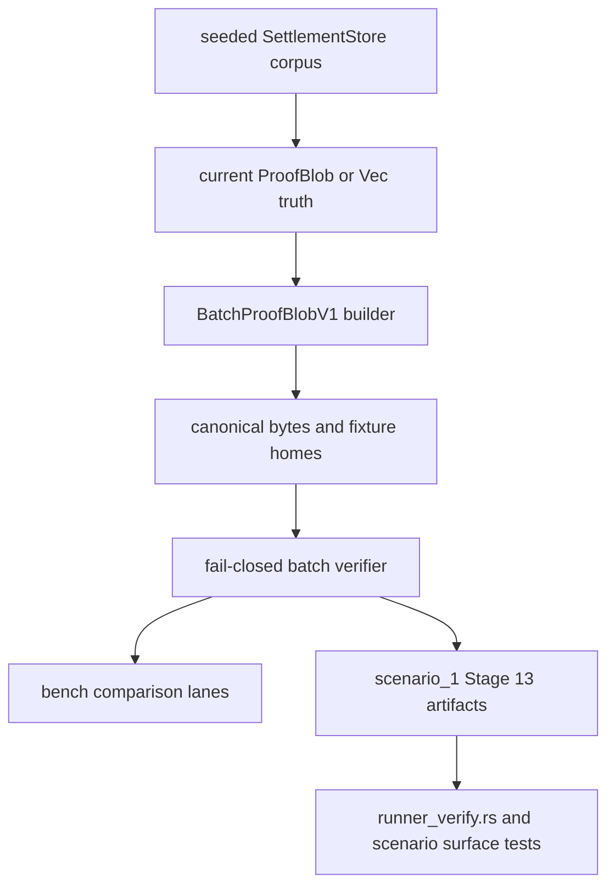

<!-- markdownlint-disable MD060 -->

# Phase 055 Test Specification: HJMT Boundary

**Phase:** `055-HJMT-boundary`
**Status:** execution-backed
**Authority:** `055-TODO.md`, `055-CONTEXT.md`, the HJMT upgrade paper, the
fixture checklist, and the live test/bench homes listed below

## Purpose

This spec freezes the test, fixture, benchmark, and scenario evidence required
to claim that the Phase 055 batch-proof boundary is implemented as production
live code rather than as a scaffold.

Phase 055 has a narrow live-code center of gravity:

- public batch-proof wire contract;
- parser limits and fail-closed verifier;
- storage-owned builder derived from current `ProofBlob` truth;
- deterministic positive and negative fixtures;
- benchmark evidence against the current independent `Vec<ProofBlob>` baseline;
- strengthened Stage 13 scenario evidence.

Everything else named in Phase 1 of `055-TODO.md` is frozen here as an owner
home and a future gate, not as permission to land empty files.

## Workflow Status

- **Operating mode:** execution-backed.
- **Phase 1 status:** satisfied by packet artifacts
  `055-CONTEXT.md`, `055-SOURCE-AUDIT.md`, and `055-TEST-SPEC.md`.
- **Phase 2 status:** split across `055-01` through `055-04`.
- **Interpretation rule:** when a paper-friendly path or benchmark name differs
  from the live repository shape, the live repository owner home wins.
- **Completion artifacts now present:** `055-01-SUMMARY.md`,
  `055-02-SUMMARY.md`, `055-03-SUMMARY.md`, `055-04-SUMMARY.md`, and the
  phase-level `055-SUMMARY.md` now record execution-backed verification for the
  batch-proof seam.
- **Truthfulness rule:** this packet remains the planning/coverage artifact,
  while live Phase 055 completion is proven by the numbered summaries, the
  phase summary, and their recorded release validation evidence.

## Mandatory Source Cross-Read

Before implementing, verifying, reviewing, or summarizing any Phase 055 slice,
read the exact `Mandatory Global Cross-Read Before Implementation` and
`Mandatory Phase 2 Cross-Read For Every Numbered Plan` sections in
`055-CONTEXT.md`. They are normative and prevent local test work from drifting
away from the source docs.

## Non-Negotiable Test Rules

- Tests must call production storage APIs, production proof encoders, and
  production proof verifiers.
- Positive fixtures must be generated from live code and then re-encoded
  deterministically. They must not be handwritten byte blobs with no
  regeneration path.
- Negative fixtures should mutate canonical positive bytes whenever possible so
  the reject surface is attributable to one exact mutation.
- `ProofBlob` compatibility is part of the contract. Any batch-proof work that
  silently breaks single-path proof behavior fails the phase.
- `Vec<ProofBlob>` remains the baseline comparator and must stay benchmarkable.
- Stage 13 evidence must extend the existing artifact pack instead of creating
  a separate simulator lane.
- Do not create empty placeholder tests or benches for Phase 1 inventory items
  that are not promoted into Phase 2 live code.

## Mandatory Verification Order

Every Rust or test-affecting change that touches this packet must verify in
this order:

```bash
./.github/skills/smart-tests-bootstrap/scripts/bootstrap_tests.sh
cargo test --release
cargo test -p z00z_storage --release --features test-params-fast --test test_hjmt_batch_proof -- --nocapture
cargo test -p z00z_storage --release --features test-params-fast --test test_hjmt_batch_proof_negative -- --nocapture
cargo test -p z00z_storage --release --features test-params-fast --test test_bench_lanes -- --nocapture
cargo test -p z00z_simulator --release --features test-params-fast --features wallet_debug_tools --test test_scenario_settlement -- --nocapture
cargo test -p z00z_simulator --release --features test-params-fast --features wallet_debug_tools --test test_scenario1_stage_surface -- --nocapture
cargo bench -p z00z_storage --bench settlement_proofs --no-run
cargo bench -p z00z_storage --bench settlement_hjmt --no-run
```

When a slice changes Stage 13 artifacts or the measured lane logic, also run:

```bash
cargo run --release -p z00z_simulator --bin scenario_1 --features test-params-fast --features wallet_debug_tools
./crates/z00z_storage/scripts/run_storage_settlement_bench.py --bench settlement_proofs -- --sample-size 10 --warm-up-time 0.01 --measurement-time 0.02
./crates/z00z_storage/scripts/run_storage_settlement_bench.py --bench scenario_1
```

Every execution slice must also run
`/.github/prompts/gsd-review-tasks-execution.prompt.md`
(`/GSD-Review-Tasks-Execution`) in YOLO mode at least three times and continue
until at least two consecutive runs report no significant issues.

## Classification

### TDD And Integration Targets

- `crates/z00z_storage/src/settlement/proof_batch.rs` and
  `proof_batch_verify.rs` as the exact codec and verifier seam.
- `crates/z00z_storage/src/settlement/hjmt_batch_proof.rs` as the
  additive builder and store-integration seam.
- `crates/z00z_storage/tests/test_live_guardrails.rs` as the additive-surface
  guardrail seam.
- `crates/z00z_storage/tests/test_hjmt_live_proof_families.rs` and
  `test_hjmt_proofs.rs` as the current live proof-family and baseline
  compatibility anchors.
- `crates/z00z_storage/tests/test_bench_lanes.rs` as the existing bench wiring
  and source-shape guard seam.

### End-To-End Targets

- `crates/z00z_simulator/tests/test_scenario_settlement.rs` for release-style
  Stage 13 output generation.
- `crates/z00z_simulator/tests/test_scenario1_stage_surface.rs` for Stage 13
  artifact contract, schema, redaction, and runner-reject behavior.
- `crates/z00z_simulator/src/scenario_1/runner_verify.rs` as the executable
  closeout gate for scenario evidence drift.

### Skip Targets

- authority inventory names listed later in this file when materializing them
  would require placeholder tests instead of extending the live owner seams;
- any standalone bench file named after paper-friendly logical lanes such as
  `hjmt_batch_proof_bytes.rs` or `hjmt_batch_verify.rs`;
- any second simulator lane, second artifact family, or second proof engine.

## Live Test Homes

At phase closeout, the Phase 055-specific homes
`test_hjmt_batch_proof.rs`, `test_hjmt_batch_proof_negative.rs`,
`batch_proof_v1_positive/`, `batch_proof_v1_negative/`, and
`root_generation_migration/` are live implementation-backed artifacts. The
create/extend labels below preserve the original planning intent only; they no
longer imply that these homes are absent from the repository.

| Area | Live owner homes | What they must prove |
| --- | --- | --- |
| Public batch-proof contract | `crates/z00z_storage/tests/test_hjmt_batch_proof.rs` | Deterministic `BatchProofBlobV1` encoding, decode or re-encode stability, positive verification, `ProofBlob` compatibility preservation, and generation/family binding on accepted batches. |
| Negative verifier and tamper matrix | `crates/z00z_storage/tests/test_hjmt_batch_proof_negative.rs` | Parser size limits, canonical ordering reject, duplicate-path reject, mixed family reject, opening mismatch reject, witness reference bound reject, header/path/opening/witness mutation rejects, and atomic failure behavior. |
| Compatibility and guardrails | `crates/z00z_storage/tests/test_live_guardrails.rs`, `crates/z00z_storage/tests/test_hjmt_live_proof_families.rs`, `crates/z00z_storage/tests/test_hjmt_proofs.rs` | `ProofBlob` remains unchanged, batch-proof exports are present, current live proof families still verify, and the old independent batch baseline still works. |
| Bench source-shape guard | `crates/z00z_storage/tests/test_bench_lanes.rs` | The new logical lanes `hjmt_batch_proof_bytes` and `hjmt_batch_verify` are wired into the real bench homes and docs. |
| Scenario evidence | `crates/z00z_simulator/tests/test_scenario_settlement.rs`, `crates/z00z_simulator/tests/test_scenario1_stage_surface.rs` | Stage 13 emits refreshed batch-proof evidence, tamper cases, comparison rows, and schema-bound scenario truth without changing the scenario contract shape unexpectedly. |
| Fixture homes | `crates/z00z_storage/tests/fixtures/hjmt_upgrade/batch_proof_v1_positive/`, `crates/z00z_storage/tests/fixtures/hjmt_upgrade/batch_proof_v1_negative/`, `crates/z00z_storage/tests/fixtures/hjmt_upgrade/root_generation_migration/` | Canonical bytes, expected roots or verdicts, regeneration commands, and exact mutation metadata. |

## Existing Test Anchors To Reuse

- `crates/z00z_storage/tests/test_hjmt_live_proof_families.rs`
  already proves live inclusion, deletion, and non-existence semantics,
  default-commitment checks, and historical prior-context rejection patterns.
- `crates/z00z_storage/tests/test_hjmt_proofs.rs`
  already proves the independent `Vec<ProofBlob>` baseline and malformed or
  historical proof rejects that Phase 055 must preserve.
- `crates/z00z_storage/tests/test_live_guardrails.rs`
  already owns source-shape and contract-surface drift detection.
- `crates/z00z_storage/tests/test_bench_lanes.rs`
  already owns bench-lane presence and bench-doc synchronization.
- `crates/z00z_simulator/tests/test_scenario_settlement.rs`
  already proves Stage 13 runs to completion and emits the live artifact pack.
- `crates/z00z_simulator/tests/test_scenario1_stage_surface.rs`
  already proves Stage 13 JSON schema, redaction rules, and artifact-drift
  rejects.
- `crates/z00z_simulator/src/scenario_1/runner_verify.rs`
  already acts as the executable closeout guard for Stage 13 artifact truth.

## Proposed New Test Files

- `crates/z00z_storage/tests/test_hjmt_batch_proof.rs`
  for exact batch-proof contract, positive vectors, and compatibility
  comparisons.
- `crates/z00z_storage/tests/test_hjmt_batch_proof_negative.rs`
  for parser-limit, table-bound, and tamper-driven reject coverage.
- `crates/z00z_storage/tests/fixtures/hjmt_upgrade/batch_proof_v1_positive/`
  for `BPB-G-*` live generated vectors.
- `crates/z00z_storage/tests/fixtures/hjmt_upgrade/batch_proof_v1_negative/`
  for `BPB-T-*` mutated vectors.
- `crates/z00z_storage/tests/fixtures/hjmt_upgrade/root_generation_migration/`
  for current-generation accept and future-generation reject vectors.

These Phase 055 targets are now verified live facts. The create/extend labels
below remain as historical planning instructions only.

## Test File Placement

| Scenario ID | Test File Path | Extend Or Create | Why This Is The Correct Home |
| --- | --- | --- | --- |
| `SC-01` | `crates/z00z_storage/tests/test_hjmt_batch_proof.rs` | create | It is the narrow canonical owner for exact `BatchProofBlobV1` bytes and positive contract vectors. |
| `SC-02` | `crates/z00z_storage/tests/test_hjmt_batch_proof.rs` and `crates/z00z_storage/tests/test_live_guardrails.rs` | create and extend | The additive export path and `ProofBlob` preservation need both direct batch assertions and repo-wide guardrails. |
| `SC-03` | `crates/z00z_storage/tests/test_hjmt_batch_proof_negative.rs` | create | Parser-limit and table-bound failures are batch-specific and should not dilute existing proof-family suites. |
| `SC-04` | `crates/z00z_storage/tests/test_hjmt_batch_proof_negative.rs` | create | Canonical ordering, duplicate-path, and mixed-family rejects belong to the batch verifier seam. |
| `SC-05` | `crates/z00z_storage/tests/test_hjmt_batch_proof_negative.rs` plus negative fixture homes | create | The tamper corpus needs a dedicated owner that ties bytes, mutation metadata, and reject stage together. |
| `SC-06` | `crates/z00z_storage/tests/test_hjmt_batch_proof.rs`, `test_hjmt_live_proof_families.rs`, `test_hjmt_proofs.rs` | create and extend | Compatibility must stay visible beside the existing proof-family and baseline suites. |
| `SC-07` | `crates/z00z_storage/tests/test_hjmt_batch_proof.rs` plus positive and migration fixture homes | create | Positive vector determinism and root-generation migration are part of the batch-proof contract, not generic storage behavior. |
| `SC-08` | `crates/z00z_storage/tests/test_bench_lanes.rs` | extend | Bench lane presence already has a narrow guard owner and must stay there. |
| `SC-09` | `crates/z00z_simulator/tests/test_scenario_settlement.rs` and `test_scenario1_stage_surface.rs` | extend | Stage 13 output generation and Stage 13 schema truth are already split correctly across these two suites. |
| `SC-10` | `crates/z00z_simulator/src/scenario_1/runner_verify.rs` and `crates/z00z_simulator/tests/test_scenario1_stage_surface.rs` | extend | The runner owns batch evidence rejection, while the scenario surface suite owns observable drift tests. |
| `SC-11` | `crates/z00z_storage/tests/test_live_guardrails.rs`, `test_bench_lanes.rs`, and `crates/z00z_simulator/tests/test_scenario1_stage_surface.rs` | extend | Source-shape and authority-layer drift must be guarded in the seams that already police those contracts. |

## Benchmark Owner Homes

| Logical lane | Live owner home | Required evidence |
| --- | --- | --- |
| `hjmt_batch_proof_bytes` | `crates/z00z_storage/benches/settlement_proofs.rs` | Total bytes and bytes per path for one `ProofBlob`, current `Vec<ProofBlob>`, and `BatchProofBlobV1` across clustered and scattered path sets. |
| `hjmt_batch_verify` | `crates/z00z_storage/benches/settlement_proofs.rs` | Verify time for the same three proof surfaces, including reject lanes for malformed or mixed-family batches. |
| clustered/scattered locality support | `crates/z00z_storage/benches/settlement_hjmt.rs` | Cache-state and scheduler-adjacent locality comparisons that support the batch benchmark story without moving ownership out of storage benches. |
| measured report plumbing | `crates/z00z_storage/benches/settlement_benches.md`, `crates/z00z_storage/scripts/run_storage_settlement_bench.py` | Durable commands, output doc ownership, and Stage 13 workload integration. |

## Requirement Coverage Map

| Requirement | Primary proof homes |
| --- | --- |
| `PH55-01` exact `BatchProofBlobV1` wire contract, limits, and export surface | `test_hjmt_batch_proof.rs`, `test_live_guardrails.rs` |
| `PH55-02` fail-closed parser and atomic verifier | `test_hjmt_batch_proof_negative.rs`, `test_hjmt_batch_proof.rs` |
| `PH55-03` builder derived from current `ProofBlob` truth and positive fixtures | `test_hjmt_batch_proof.rs`, `test_hjmt_live_proof_families.rs`, `test_hjmt_proofs.rs` |
| `PH55-04` benchmark evidence, Stage 13 evidence, and docs or guardrails | `test_bench_lanes.rs`, `test_scenario_settlement.rs`, `test_scenario1_stage_surface.rs` |

## Test Classification

| Class | Primary owner homes | What it must prove | Must not drift into |
| --- | --- | --- | --- |
| Contract and codec | `test_hjmt_batch_proof.rs`, `test_live_guardrails.rs` | Exact byte layout, deterministic re-encode, additive exports, and live-generation-only acceptance. | A rename or replacement of `ProofBlob`. |
| Negative verifier | `test_hjmt_batch_proof_negative.rs` | Parser limits, canonical ordering reject, duplicate-path reject, family mismatch reject, and atomic fail-closed behavior. | A shadow decoder or partial-acceptance API. |
| Builder and compatibility | `test_hjmt_batch_proof.rs`, `test_hjmt_live_proof_families.rs`, `test_hjmt_proofs.rs` | The batch builder derives from current storage proof truth and reconstructs the same accepted root as the single and independent baseline surfaces. | A second proof engine or overloaded `settlement_proof_blobs` return type. |
| Fixture regeneration | `batch_proof_v1_positive/`, `batch_proof_v1_negative/`, `root_generation_migration/` | Canonical bytes, exact mutation metadata, deterministic regeneration, and release-gate provenance. | Handwritten opaque blobs with no regeneration path. |
| Bench guardrails | `test_bench_lanes.rs`, `settlement_proofs.rs`, `settlement_hjmt.rs`, `settlement_benches.md`, `run_storage_settlement_bench.py` | The logical lanes `hjmt_batch_proof_bytes` and `hjmt_batch_verify` stay wired into the existing consolidated bench harness. | Standalone fake bench crates that duplicate the live bench homes. |
| Scenario E2E evidence | `test_scenario_settlement.rs`, `test_scenario1_stage_surface.rs`, `runner_verify.rs` | Stage 13 artifacts compare `ProofBlob`, `Vec<ProofBlob>`, and `BatchProofBlobV1`, carry batch-specific tamper evidence, and fail when required evidence is missing. | A second simulator lane, second artifact family, or Stage 13 fork. |
| Inventory-only guards | `test_live_guardrails.rs`, `test_bench_lanes.rs` | Future suites remain frozen as names and owner homes only. | Empty placeholder test files or dummy benches. |

## Critical Integration Paths

| Path ID | Flow | Required proof |
| --- | --- | --- |
| `IP-01` | `SettlementStore` -> current single-path proof context -> `BatchProofBlobV1` builder -> batch verifier | The first builder reuses already-live proof truth and reconstructs the same accepted `SettlementStateRoot`. |
| `IP-02` | live builder -> positive fixture bytes -> decode -> re-encode -> verify | Accepted batch vectors are canonical, deterministic, and reproducible from live code. |
| `IP-03` | positive canonical bytes -> one-field mutation -> parser or verifier reject | Every structural or semantic tamper rejects the whole batch with one exact failure stage. |
| `IP-04` | storage bench lanes -> benchmark docs -> `run_storage_settlement_bench.py` | Batch logical lanes stay attached to the real bench harness and command surface. |
| `IP-05` | `scenario_1` Stage 13 generation -> JSON artifacts -> `runner_verify.rs` -> scenario tests | Scenario evidence stays batch-aware, baseline-aware, and fail-closed without introducing a new authority lane. |

## Expected Outputs And Produced Artifacts

| Scenario ID | Expected Output | Persisted Artifact | Observable Signal |
| --- | --- | --- | --- |
| `SC-01` | accepted `BatchProofBlobV1` round-trip | positive fixture bytes or inline canonical bytes | `encode(decode(bytes)) == bytes` and verification succeeds |
| `SC-02` | additive export path and live-generation-only reject behavior | none beyond test output | `ProofBlob` still verifies unchanged; unsupported generation rejects |
| `SC-03` | parser or bounds rejection | negative fixture metadata | oversize or out-of-range input never reaches success |
| `SC-04` | atomic verifier rejection | negative fixture metadata | no per-path success leaks out of a failed batch |
| `SC-05` | full tamper corpus exercised | `batch_proof_v1_negative/` fixture entries | exact reject stage and verdict match metadata |
| `SC-06` | root-equivalent proof results across three proof surfaces | optional refreshed positive fixture metadata | all three surfaces reconstruct the same accepted root |
| `SC-07` | deterministic positive and migration vectors | `batch_proof_v1_positive/` and `root_generation_migration/` | current generation accepts; future generation rejects |
| `SC-08` | bench lanes compiled and documented | bench docs and runner command surface | lane guards pass and `cargo bench --no-run` succeeds |
| `SC-09` | batch-aware Stage 13 JSON output | `hjmt_settlement_examples.json`, `hjmt_proof_size_report.json`, `hjmt_tamper_report.json` | required rows and fields are present |
| `SC-10` | Stage 13 drift rejection | failing `runner_verify.rs` path | removing one required field or case forces failure |
| `SC-11` | no duplicate authority layer introduced | source-shape test output | guardrails fail on a second bench lane, second Stage 13 lane, or placeholder suite |

## Realistic Examples To Implement

| Example ID | Planned owner homes | What it demonstrates | Required assertions |
| --- | --- | --- | --- |
| `EX-01` / `BPB-G-001` | `test_hjmt_batch_proof.rs`, `batch_proof_v1_positive/` | Two-path clustered asset inclusion batch under one live root. | Canonical bytes are stable, decode or re-encode is byte-identical, and batch verification returns the expected accepted root. |
| `EX-02` / `BPB-G-002` | `test_hjmt_batch_proof.rs`, `batch_proof_v1_positive/` | Right-family non-existence batch using the live marker-leaf and default-commitment contract. | Marker leaf bytes match the canonical path-derived marker, default commitments equal live HJMT commitments, and acceptance stays root-bound. |
| `EX-03` / `BPB-G-003` | `test_hjmt_batch_proof.rs`, `batch_proof_v1_positive/`, `root_generation_migration/` | Deletion-family batch carrying prior proof context after a live delete. | Prior context binds the prior root, backend root, journal digest, and checkpoint; current-root non-existence and prior-root existence both verify. |
| `EX-04` / `BPB-G-004` | `test_hjmt_batch_proof.rs`, `batch_proof_v1_positive/` | Eight clustered paths sharing upper witness context. | Witness reuse is byte-stable, reference ordering is deterministic, and batch bytes stay reproducible across two independent regeneration runs. |
| `EX-05` / `BPB-G-005` | `test_hjmt_batch_proof.rs`, `batch_proof_v1_positive/` | Eight scattered paths spanning multiple definitions or serial groups. | Reference indexes remain stable, no out-of-bounds reuse occurs, and the batch still reconstructs the same accepted root. |
| `EX-06` | `test_hjmt_batch_proof.rs`, `test_hjmt_live_proof_families.rs`, `test_hjmt_proofs.rs` | Baseline equivalence for the same logical path set across `ProofBlob`, `Vec<ProofBlob>`, and `BatchProofBlobV1`. | All three surfaces reconstruct the same live root and keep proof-family semantics intact. |
| `EX-07` | `test_scenario_settlement.rs`, `test_scenario1_stage_surface.rs` | Representative Stage 13 batch evidence for clustered and scattered path sets at counts `2`, `8`, and `32`. | The scenario artifacts expose the exact comparison rows and fail if any required batch evidence row is absent. |

## Input Fixtures And Preconditions

- Reuse `z00z_storage::test_support::settlement_corpus` helpers for seeded assets, rights, split-ready fixtures, policy-transition fixtures, RedB reload fixtures, and deterministic HJMT env guards.
- Reuse the same-bucket sibling-path construction patterns already present in `test_hjmt_live_proof_families.rs` so clustered inclusion and non-existence vectors share real upper witness context.
- Build deletion vectors by inserting a live item, capturing its prior proof context, deleting it, and then generating the batch proof from the current store state. Do not synthesize prior context in tests.
- Use the live `SettlementStore` APIs to construct the independent `ProofBlob` and `Vec<ProofBlob>` baselines before comparing them to `BatchProofBlobV1`.
- Reuse `fixture_cache::ensure_shared_case` and `stage4_support::make_cfg_in` for deterministic `scenario_1` outputs instead of inventing a second simulator harness.
- Keep bench inputs inside `settlement_proofs.rs`, `settlement_hjmt.rs`, and `run_storage_settlement_bench.py`; do not add a second proof-bench runner just for Phase 055.

## Scenario Ledger

| Scenario ID | Class | Planned owner homes | What it proves | Pass condition |
| --- | --- | --- | --- | --- |
| `SC-01` | unit and integration | `test_hjmt_batch_proof.rs` | Deterministic `BatchProofBlobV1` encoding, decode, and re-encode for accepted positive vectors. | Accepted fixtures round-trip byte-identically and verify against the expected root. |
| `SC-02` | guardrail and contract | `test_hjmt_batch_proof.rs`, `test_live_guardrails.rs` | The batch surface is additive and live-generation-only. | `ProofBlob` behavior stays unchanged, unsupported generation rejects, and current-generation batches carry no shard context. |
| `SC-03` | negative parser | `test_hjmt_batch_proof_negative.rs` | Parser limits and table-bound checks stop malformed batches before success. | Oversize counts, oversize total bytes, or out-of-range indexes never reach accepted verification. |
| `SC-04` | negative semantic | `test_hjmt_batch_proof_negative.rs` | Canonical ordering, duplicate-path, mixed-family, and opening-family rules reject fail-closed. | The whole batch rejects and no per-path success list or partial acceptance leaks out. |
| `SC-05` | negative integrity | `test_hjmt_batch_proof_negative.rs`, `batch_proof_v1_negative/` | The full `BPB-T-*` corpus plus exact reject-stage metadata stays live. | Every negative fixture records canonical source bytes, mutation point, reject stage, and expected verdict. |
| `SC-06` | integration and compatibility | `test_hjmt_batch_proof.rs`, `test_hjmt_live_proof_families.rs`, `test_hjmt_proofs.rs` | The first batch builder derives from current `ProofBlob` truth and preserves baseline semantics. | The same logical path set yields the same accepted root under the single, independent, and batch proof surfaces. |
| `SC-07` | fixture and migration | `test_hjmt_batch_proof.rs`, `root_generation_migration/` | Positive fixtures and root-generation migration vectors are deterministic and rooted in live code. | Current generation accepts, unsupported future generation rejects, and all positive vectors re-encode identically. |
| `SC-08` | bench guard | `test_bench_lanes.rs`, `settlement_proofs.rs`, `settlement_hjmt.rs`, `settlement_benches.md`, `run_storage_settlement_bench.py` | Batch logical lanes remain wired into the consolidated bench harness and docs. | Source-shape guards pass, bench homes compile with `--no-run`, and docs or runner commands stay synchronized. |
| `SC-09` | scenario E2E | `test_scenario_settlement.rs`, `test_scenario1_stage_surface.rs` | Stage 13 artifacts publish batch-aware examples, proof-size rows, and tamper rows without changing the existing scenario identity set. | `E1` through `E8` remain stable and every required batch field or row is present in the JSON artifacts. |
| `SC-10` | runner reject | `runner_verify.rs`, `test_scenario1_stage_surface.rs` | Stage 13 verification fails when required batch evidence drifts or disappears. | Missing `proof_surface` rows, missing clustered or scattered cases, missing atomic verdict metadata, or missing tamper cases all force rejection. |
| `SC-11` | source-shape guardrail | `test_live_guardrails.rs`, `test_bench_lanes.rs`, `test_scenario1_stage_surface.rs` | Phase 055 extends live seams in place instead of creating a duplicate bench crate, simulator lane, or placeholder suite. | Source-shape guards reject standalone bench files, `Stage 13B`-style artifacts, or empty inventory-only suites. |

## Rejection Matrix

| Reject ID | Mutation target | Required verdict | Required reject stage |
| --- | --- | --- | --- |
| `BPB-T-001` | outer header field | `parser_reject` or `verifier_reject` | decode or header validation before root fold |
| `BPB-T-002` | one `BatchPathEntryV1` field | `verifier_reject` | canonical-order or path-binding validation |
| `BPB-T-003` | one `OpeningEntryV1` field | `verifier_reject` | opening-family or payload validation |
| `BPB-T-004` | one `WitnessNodeV1` field | `verifier_reject` | witness-domain or root-fold validation |
| `BPB-T-005` | one witness reference index | `verifier_reject` | reference-bound validation |
| `BPB-T-006` | `(proof_family_tag, opening_kind_tag)` mismatch | `verifier_reject` | family-selection validation before hashing success |
| `BPB-T-007` | `leaf_family_tag` mismatch | `verifier_reject` | opening-family or leaf decoding validation |
| `BPB-T-008` | `hash_material_count != 1` | `parser_reject` or `verifier_reject` | witness-structure validation |
| `RG-T-001` | unsupported or wrong `root_generation_tag` | `verifier_reject` | generation support check before root fold |
| `CTX-T-001` | shard context present for current live generation | `verifier_reject` | path-entry generation or shard-context validation |

## Cryptographic And Soundness Invariants

- The required in-test coverage from `055-TODO.md` is literal here:
  deterministic encoding, parser size limits, canonical ordering reject,
  duplicate-path reject, mixed proof-family reject, opening family mismatch
  reject, and witness reference bound checks.
- `ProofBlob` remains the unchanged single-path compatibility contract; any change to its bytes, decode rules, or verification semantics is a Phase 055 failure.
- `BatchProofBlobV1` acceptance is bound to the exact encoded bytes. `encode(decode(bytes)) == bytes` is mandatory for every accepted positive fixture.
- Accepted batches reconstruct exactly one live `SettlementStateRoot`; the verifier must never return a partially accepted path subset.
- One envelope carries one `HjmtProofFamily` only. Mixed inclusion, deletion, and non-existence semantics are reject-only.
- `leaf_family_tag`, opening payload family, and canonical `SettlementLeaf` bytes must agree for every path.
- Non-existence openings must bind the live `hjmt_default_value_commitment()` and `hjmt_default_child_commitment()` values, not test-local substitutes.
- Deletion openings must bind prior-root context through prior root bind, prior backend root, prior journal digest, prior checkpoint bind, and prior proof bytes.
- Witness reuse is lawful only when reference indexes are in bounds, unique per path, and semantically compatible with level, domain, family, generation, and policy bindings.
- Every comparison surface must keep `ProofBlob`, `Vec<ProofBlob>`, and `BatchProofBlobV1` visible together so regressions stay attributable.

## Mermaid Flow



## Clarifying Code Snippets

```rust
let batch = store.settlement_batch_proof_blob(&paths).expect("batch proof");
let bytes = batch.encode().expect("encode");
let decoded = BatchProofBlobV1::decode(&bytes).expect("decode");
assert_eq!(decoded.encode().expect("re-encode"), bytes);
assert_eq!(verify_batch_proof(&bytes).expect("verify").settlement_root, expected_root);
```

The method and verifier names above are illustrative assertion-shape anchors.
Phase 055 implementation may pick different final helper names, but the test
shape must stay equivalent.

## Fixture Matrix

| Fixture ID | Owner home | Required proof |
| --- | --- | --- |
| `BPB-G-001` | `test_hjmt_batch_proof.rs` plus `batch_proof_v1_positive/` | Inclusion-family canonical bytes and one accepted root. |
| `BPB-G-002` | `test_hjmt_batch_proof.rs` plus `batch_proof_v1_positive/` | Non-existence-family canonical bytes and one accepted root. |
| `BPB-G-003` | `test_hjmt_batch_proof.rs` plus `batch_proof_v1_positive/` | Deletion-family canonical bytes and one accepted root. |
| `BPB-G-004` | `test_hjmt_batch_proof.rs` plus `batch_proof_v1_positive/` | Clustered witness reuse stays byte-stable. |
| `BPB-G-005` | `test_hjmt_batch_proof.rs` plus `batch_proof_v1_positive/` | Scattered reference indexing stays stable. |
| `BPB-T-001` | `test_hjmt_batch_proof_negative.rs` plus `batch_proof_v1_negative/` | Outer header mutations reject. |
| `BPB-T-002` | `test_hjmt_batch_proof_negative.rs` plus `batch_proof_v1_negative/` | Path-entry mutations reject. |
| `BPB-T-003` | `test_hjmt_batch_proof_negative.rs` plus `batch_proof_v1_negative/` | Opening-entry mutations reject. |
| `BPB-T-004` | `test_hjmt_batch_proof_negative.rs` plus `batch_proof_v1_negative/` | Witness-node mutations reject. |
| `BPB-T-005` | `test_hjmt_batch_proof_negative.rs` plus `batch_proof_v1_negative/` | Reference-index mutations reject. |
| `BPB-T-006` | `test_hjmt_batch_proof_negative.rs` plus `batch_proof_v1_negative/` | Mixed `proof_family_tag` and `opening_kind_tag` rejects. |
| `BPB-T-007` | `test_hjmt_batch_proof_negative.rs` plus `batch_proof_v1_negative/` | `leaf_family_tag` mismatch rejects. |
| `BPB-T-008` | `test_hjmt_batch_proof_negative.rs` plus `batch_proof_v1_negative/` | `hash_material_count != 1` rejects. |

## Completion Contract

Every Phase 055 fixture or scenario-evidence artifact is complete only when it
includes:

- exact input description and preconditions;
- canonical bytes or canonical JSON rows emitted by live code;
- expected root or expected verdict;
- one regeneration command;
- one evidence pointer to the owning test or scenario suite.

Every tamper fixture additionally records one exact mutation point and one
exact reject stage.

## Release Gate

Phase 055 test coverage is release-ready only when all of the following are
true:

- `BPB-G-001` through `BPB-G-005` and `BPB-T-001` through `BPB-T-008` exist as
  live exercised artifacts.
- Deterministic re-encode checks exist for accepted `BatchProofBlobV1`
  positives and for root-generation migration vectors.
- `ProofBlob`, current `Vec<ProofBlob>`, and `BatchProofBlobV1` are all visible
  in tests, Stage 13 evidence, and benchmark comparison surfaces.
- Stage 13 verifies the exact batch-proof fields, comparison rows, and tamper
  case IDs defined in this packet.
- Bench logical lanes compile in the existing consolidated bench homes instead
  of in standalone fake benches.

## Scenario 1 Additional Checks

Stage 13 must remain the simulator authority, but its evidence must become
batch-proof aware without turning the simulator into the primary benchmark
harness.

### `hjmt_settlement_examples.json`

Batch-aware Stage 13 rows must use the exact `proof_surface` values
`proof_blob_single`, `proof_blob_vec`, and `batch_proof_v1`.

Every accepted `batch_proof_v1` row must prove:

- `path_count` is populated and greater than `1`;
- `path_shape` is exactly `clustered` or `scattered`;
- `canonical_order` is `true`;
- `atomic_verdict` is exactly `accepted`;
- `shard_context_mode` is exactly `none`;
- `root_generation` equals the current live settlement generation tag;
- `settlement_state_root_hex` matches the paired baseline rows for the same
  logical path set.

Across the file, Stage 13 must contain:

- at least one clustered and one scattered batch row;
- at least one inclusion, one non-existence, and one deletion batch row;
- representative batch counts `2`, `8`, and `32`;
- the existing `E1` through `E8` example identities without a new parallel
  lane.

Pass condition: `runner_verify.rs` and `test_scenario1_stage_surface.rs` both
reject missing fields, missing `proof_surface` values, missing path-shape
coverage, or any `batch_proof_v1` row whose metadata does not match the live
root and live-generation-only contract.

### `hjmt_proof_size_report.json`

Extend the report so it carries:

- at least one `proof_blob_single` reference row per proof family exercised by
  Stage 13;
- grouped `proof_blob_vec` and `batch_proof_v1` rows for path counts `2`, `8`,
  and `32`;
- both `clustered` and `scattered` `path_shape` values;
- non-zero `proof_size_bytes` and `verify_time_us` for every comparison row.

The larger `128` and `1024` matrix stays in the measured bench harness, not in
every simulator run.

Pass condition: Stage 13 proves the representative comparison rows exist and
are non-zero; final score or performance claims still belong to the measured
bench reports in the storage harness.

### `hjmt_tamper_report.json`

Add the exact batch-specific case IDs:

- `batch_wrong_root_generation`
- `batch_reordered_paths`
- `batch_duplicate_path`
- `batch_mixed_proof_family`
- `batch_opening_kind_mismatch`
- `batch_leaf_family_mismatch`
- `batch_witness_ref_out_of_range`
- `batch_wrong_default_commitment`
- `batch_wrong_witness_domain`
- `batch_hash_material_count`

Every batch tamper row must also record:

- `proof_surface = batch_proof_v1`;
- `verifier_status = rejected`;
- the redacted typed error;
- the current live `root_generation`.

Pass condition: the exact case-id set is present, every case stays rejected,
and no case leaks unredacted witness or payload material.

### `runner_verify.rs`

Strengthen Stage 13 verification so it rejects outputs that lack:

- the exact `proof_surface` set `proof_blob_single`, `proof_blob_vec`, and
  `batch_proof_v1`;
- batch-proof comparison evidence against current `Vec<ProofBlob>`;
- at least one clustered and one scattered representative batch case;
- representative `path_count` values `2`, `8`, and `32`;
- atomic-verdict metadata fixed to `accepted` on verified batch rows;
- `shard_context_mode = none` for the current live generation;
- the exact batch-specific tamper cases listed above;
- stable `E1` through `E8` identities with no new `Stage 13B`-style lane.

Pass condition: dedicated runner-verification tests prove every one of the
drift cases above fails the Stage 13 contract.

## Authority Inventory And Canonical Owner Homes

The following names are frozen by Phase 1 as live authority anchors, but they
must not be scaffolded as empty files in Phase 055:

| Inventory name | Canonical owner home | Current validation anchor |
| --- | --- | --- |
| `test_hjmt_batch_commit.rs` | storage test suite near `hjmt_commit.rs` | `hjmt_commit.rs`, `test_redb_reload.rs` |
| `test_hjmt_batch_recovery.rs` | storage test suite near `hjmt_journal.rs` | `hjmt_journal.rs`, `test_redb_reload.rs` |
| `test_hjmt_storage_boundary.rs` | storage boundary suite | `backend/mod.rs`, `test_downstream_guardrails.rs` |
| `test_hjmt_backend_conformance.rs` | backend conformance suite | `backend/mod.rs`, `memory.rs`, `redb/mod.rs` |
| `test_hjmt_shard_routing.rs` | routing-vector suite | `batch_planner.rs`, `types.rs` |
| `test_hjmt_failover_same_lineage.rs` | failover suite | `placement.rs`, `shard_exec.rs`, node runtime integration |
| `test_hjmt_split_brain_fencing.rs` | failover suite | runtime placement and journal lineage rules |
| `test_hjmt_multi_aggregator_sim.rs` | one-machine multi-aggregator harness | `z00z_rollup_node` orchestration |
| `test_hjmt_root_generation.rs` | migration-vector suite | current batch-proof generation checks |
| `test_hjmt_historical_proofs.rs` | historical-proof suite | `test_hjmt_proofs.rs` |
| `test_hjmt_transition_proofs.rs` | transition suite | `test_hjmt_live_proof_families.rs` |
| `test_hjmt_privacy_regression.rs` | privacy suite | `test_occupancy_privacy.rs` |

## Canonical Bench Home Mapping

The following benchmark-home names are also frozen by Phase 1 as live owner
targets and must not be materialized as standalone bench files in Phase 055:

| Inventory name | Canonical owner home | Current validation anchor |
| --- | --- | --- |
| `hjmt_batch_proof_bytes.rs` | logical lane in `settlement_proofs.rs` | `settlement_proofs.rs`, `settlement_benches.md`, `test_bench_lanes.rs` |
| `hjmt_batch_verify.rs` | logical lane in `settlement_proofs.rs` | `settlement_proofs.rs`, `settlement_benches.md`, `test_bench_lanes.rs` |
| `hjmt_bucket_delta_commit.rs` | logical lane in `settlement_hjmt.rs` | `hjmt_commit.rs`, `settlement_hjmt.rs`, `settlement_benches.md` |
| `hjmt_backend_boundary.rs` | cross-backend comparison lane in `settlement_hjmt.rs` plus `run_storage_settlement_bench.py` | `backend/mod.rs`, `memory.rs`, `redb/mod.rs`, `settlement_benches.md`, `run_storage_settlement_bench.py` |
| `hjmt_shard_parallel_commit.rs` | logical lane in `settlement_shard.rs` | `settlement_shard.rs`, `settlement_benches.md` |
| `hjmt_root_of_roots_publish.rs` | logical lane in `settlement_shard.rs` | `settlement_shard.rs`, `settlement_benches.md` |
| `hjmt_transition_locality.rs` | logical lane in `adaptive_policy_bench.rs` | `adaptive_policy_bench.rs`, `settlement_benches.md` |

## Benchmark Report Template

Every durable batch-proof benchmark report must include these columns:

- `proof_surface`
- `path_count`
- `path_shape`
- `proof_family`
- `cache_mode`
- `persistence_mode`
- `serialized_bytes`
- `bytes_per_path`
- `prove_time_us`
- `verify_time_us`
- `peak_memory_bytes`

When the report is scenario-derived, also include:

- `scenario_id`
- `artifact_freshness`
- `settlement_state_root_hex`
- `stage13_report_file`

## Packet Sync Rules

- Do not create fake standalone bench files named `hjmt_batch_proof_bytes.rs`
  or `hjmt_batch_verify.rs`; add those logical lanes to the live consolidated
  bench homes instead.
- Do not materialize `hjmt_bucket_delta_commit.rs`,
  `hjmt_backend_boundary.rs`, `hjmt_shard_parallel_commit.rs`,
  `hjmt_root_of_roots_publish.rs`, or `hjmt_transition_locality.rs` as new
  standalone bench files in Phase 055; keep them attached to the existing bench
  harness as canonical logical lanes.
- Do not create empty versions of the authority inventory suites.
- Keep `ProofBlob`, `Vec<ProofBlob>`, and `BatchProofBlobV1` visible together
  in every comparison surface so regressions stay attributable.
- Prefer extending current Stage 13 JSON schemas over multiplying top-level
  artifacts.

## Closeout Status

- `crates/z00z_storage/src/settlement/proof_batch.rs`,
  `proof_batch_verify.rs`, and `hjmt_batch_proof.rs` are live owner homes
  in the repository and remain the canonical Phase 055 batch-proof seams.
- `crates/z00z_storage/tests/test_hjmt_batch_proof.rs`,
  `test_hjmt_batch_proof_negative.rs`, `test_hjmt_live_proof_families.rs`, and
  `test_bench_lanes.rs` now carry the phase-specific contract, reject, and
  bench guard coverage described in this packet.
- The positive and negative batch fixture homes plus
  `root_generation_migration/` exist in the live tree and remain generation- and
  mutation-backed evidence rather than placeholder artifacts.
- `055-01-SUMMARY.md` through `055-04-SUMMARY.md` and `055-SUMMARY.md` are now
  present, so the phase is execution-backed rather than planning-only.
- Runnable Phase 055 verification no longer depends on hypothetical APIs or
  placeholder suites; it executes against the live repository seams and release
  validation commands listed above.
