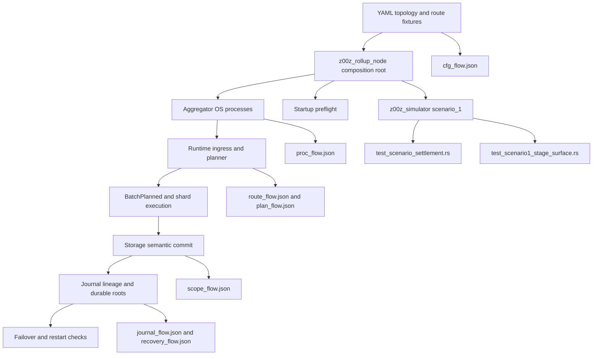

<!-- markdownlint-disable MD060 -->

# Phase 056 Test Specification: HJMT Storage Aggregator

## 🎯 Purpose

This document defines the phase-local unit, integration, fixture, benchmark,
and Rust end-to-end test contract for Phase 056.

It is directly usable by another engineer or agent without guessing scenario
boundaries, state transitions, route or lineage invariants, success criteria,
failure or reject paths, evidence artifacts, test homes, or pass oracles.

For Phase 056, end-to-end means realistic Rust coverage across
`z00z_rollup_node`, `z00z_runtime/aggregators`, `z00z_storage`, and
`z00z_simulator`. It does not mean browser automation.

This packet is now execution-backed. `056-01-SUMMARY.md` through
`056-07-SUMMARY.md`, plus the phase-local validation, security, and
evaluation artifacts, record the landed file homes and verification evidence.
The tables below remain the normative coverage map, while the live repository
owner homes win over any earlier create-or-extend intent.

## 📌 Workflow Status

- Mode: `execution-backed`.
- Source artifacts used:
  - `.planning/phases/056-HJMT-storage- aggregator/056-TODO.md`
  - `.planning/phases/056-HJMT-storage- aggregator/056-CONTEXT.md`
  - `.planning/phases/056-HJMT-storage- aggregator/056-SOURCE-AUDIT.md`
  - `.planning/phases/056-HJMT-storage- aggregator/056-01-PLAN.md`
  - `.planning/phases/056-HJMT-storage- aggregator/056-02-PLAN.md`
  - `.planning/phases/056-HJMT-storage- aggregator/056-03-PLAN.md`
  - `.planning/phases/056-HJMT-storage- aggregator/056-04-PLAN.md`
  - `.planning/phases/056-HJMT-storage- aggregator/056-05-PLAN.md`
  - `.planning/phases/056-HJMT-storage- aggregator/056-06-PLAN.md`
  - `.planning/phases/056-HJMT-storage- aggregator/056-07-PLAN.md`
  - `docs/tech-papers/Z00Z-HJMT-Upgrade.md`
  - `docs/tech-papers/Z00Z-HJMT-Fixture-Checklist.md`
  - `docs/tech-papers/Z00Z-HJMT-Design.md`
- Completion artifacts now present:
  - `.planning/phases/056-HJMT-storage- aggregator/056-01-SUMMARY.md`
  - `.planning/phases/056-HJMT-storage- aggregator/056-02-SUMMARY.md`
  - `.planning/phases/056-HJMT-storage- aggregator/056-03-SUMMARY.md`
  - `.planning/phases/056-HJMT-storage- aggregator/056-04-SUMMARY.md`
  - `.planning/phases/056-HJMT-storage- aggregator/056-05-SUMMARY.md`
  - `.planning/phases/056-HJMT-storage- aggregator/056-06-SUMMARY.md`
  - `.planning/phases/056-HJMT-storage- aggregator/056-07-SUMMARY.md`
  - `.planning/phases/056-HJMT-storage- aggregator/056-VALIDATION.md`
  - `.planning/phases/056-HJMT-storage- aggregator/056-SECURITY.md`
  - `.planning/phases/056-HJMT-storage- aggregator/056-EVAL-REVIEW.md`
- Testing posture:
  - Extend existing anchors first.
  - Add new test files only where they clarify authority boundaries or prevent
    overloaded mixed-purpose suites.
  - Keep runtime planner truth in `z00z_runtime/aggregators`.
  - Keep semantic settlement and proof truth in `z00z_storage`.
  - Keep composition-root behavior in `z00z_rollup_node`.
  - Keep runtime observability and trace verification in `z00z_simulator`.
  - Do not create a second planner, storage, failover, or simulator authority
    layer in tests.

## 🔗 Mandatory Source Cross-Read

Before implementing, reviewing, or summarizing any test from this packet, read:

1. `056-CONTEXT.md` sections `Implementation Decisions`,
   `Cross-Crate Ownership Map`, `TODO Coverage Contract`, and
   `Literal bullet preservation map`.
2. `056-TODO.md` sections:
   `Canonical SIM-5A7S runtime profile`,
   `Process and config contract`,
   `Journal and WAL decision captured by this phase`,
   `Startup self-test gate owned by this phase`,
   `Mandatory implementation gates`,
   `Required tests and benchmark slices`,
   `Required execution profiles`,
   `Required scenario coverage`,
   `Required artifacts`,
   `Fixture ownership`,
   and `Exit criteria`.
3. The exact `coverage_contract` section of every `056-0X-PLAN.md` that a test
   file closes.

## 🚫 Non-Negotiable Test Rules

- Tests must call production route, planner, storage, journal, config, runner,
  and verification APIs. They must not prove the phase through mocks that
  bypass live owner seams.
- `SIM-5A7S` is an acceptance fixture only. Tests must also prove that runtime
  topology remains generic for any positive `aggregator_count > 0` and
  `shard_count > 0` allowed by invariants.
- Aggregator multi-node behavior must be modeled as separate OS processes.
  Tests must not accept an in-process thread, task, actor, or shared-memory
  mesh as the canonical runtime shape.
- Route truth is runtime-owned. Storage, simulator, and validator tests must
  not recompute route authority as a second planner lane.
- Runtime-to-storage handoff must stay semantic-only. Tests must reject any
  design where runtime asserts subtree inventory, proof truth, or storage tree
  registry authority.
- Same-lineage failover is the only legal acceptance path. Silent reroute,
  stale restart, wrong generation, wrong lineage, and split-brain states must
  reject fail-closed.
- `scope_flow.json`, `cfg_flow.json`, `route_flow.json`, `plan_flow.json`,
  `journal_flow.json`, `proc_flow.json`, and `recovery_flow.json` are evidence,
  not truth sources. Tests must link them back to config digests,
  `route_table_digest`, lineage, and process topology.
- The runtime YAML contract must stay explicit in tests:
  `aggregator-config.yaml`, `planner-config.yaml`, `storage-config.yaml`, and
  the live `scenario_config.yaml` surface must all be loaded from disk and must
  materially change runtime behavior when their values change.
- Any YAML home not yet present in the repository must stay labeled as
  `proposed` in planning artifacts until execution lands it.
- Phase 055 proof-family authority remains frozen. Phase 056 may consume
  `BatchProofBlobV1` vectors for startup/preflight and evidence, but must not
  reopen proof semantics or duplicate proof ownership.

## ✅ Mandatory Verification Order

Every Rust or test-affecting change that touches this packet must verify in
this order:

```bash
./.github/skills/smart-tests-bootstrap/scripts/bootstrap_tests.sh
cargo test -p z00z_aggregators --release --features test-params-fast --test test_live_guardrails -- --nocapture
cargo test -p z00z_rollup_node --release --features test-params-fast
cargo test -p z00z_storage --release --features test-params-fast
cargo test -p z00z_simulator --release --features test-params-fast --features wallet_debug_tools --test test_scenario_settlement -- --nocapture
cargo test -p z00z_simulator --release --features test-params-fast --features wallet_debug_tools --test test_scenario1_stage_surface -- --nocapture
cargo bench -p z00z_storage --bench settlement_shard --no-run
cargo bench -p z00z_storage --bench settlement_hjmt --no-run
cargo test --release
```

When a slice lands real process orchestration, preflight, or trace output, also
run:

```bash
cargo test -p z00z_rollup_node --release --features test-params-fast --test test_hjmt_topology -- --nocapture
cargo test -p z00z_rollup_node --release --features test-params-fast --test test_hjmt_process -- --nocapture
cargo test -p z00z_aggregators --release --features test-params-fast --test test_hjmt_shard_routing -- --nocapture
cargo test -p z00z_aggregators --release --features test-params-fast --test test_hjmt_planner -- --nocapture
cargo test -p z00z_aggregators --release --features test-params-fast --test test_hjmt_failover_same_lineage -- --nocapture
cargo test -p z00z_aggregators --release --features test-params-fast --test test_hjmt_split_brain_fencing -- --nocapture
cargo test -p z00z_rollup_node --release --features test-params-fast --test test_hjmt_node_lifecycle -- --nocapture
cargo test -p z00z_rollup_node --release --features test-params-fast --test test_hjmt_preflight -- --nocapture
cargo test -p z00z_storage --release --features test-params-fast --test test_hjmt_scope_birth -- --nocapture
```

Every execution slice must also run
`/.github/prompts/gsd-review-tasks-execution.prompt.md`
(` /GSD-Review-Tasks-Execution `) in YOLO mode at least three times and must
continue until at least two consecutive runs report no significant issues.

## ⚙️ Classification

### 🧩 TDD And Integration Targets

| Seam | Class | Why It Matters |
| --- | --- | --- |
| `crates/z00z_runtime/aggregators/src/types.rs`, `batch_planner.rs`, `placement.rs`, `scheduler.rs` | unit / integration | Own route-table bytes, digest, routing generation, planner-mode equivalence, placement invariants, and cross-shard reject semantics. |
| `crates/z00z_runtime/aggregators/src/ingress.rs`, `service.rs`, `shard_exec.rs` | integration | Own semantic admission, route-bound execution, reject vocabulary, and runtime-to-storage handoff inputs. |
| `crates/z00z_runtime/aggregators/src/recovery.rs` | integration | Own same-lineage resume, reject classes, and recovery evidence boundaries. |
| `crates/z00z_storage/src/settlement/store.rs`, `hjmt_store.rs`, `hjmt_commit.rs`, `hjmt_plan.rs`, `hjmt_journal.rs` | integration | Own semantic settlement truth, scope birth, durable commit, journal lineage, and restart behavior. |
| `crates/z00z_storage/src/backend/mod.rs` and `JournalBackend` seam | integration / source-shape | Must remain the only durability seam and must not grow a shared WAL truth plane. |
| `crates/z00z_rollup_node/src/config.rs`, `runtime.rs`, `status.rs` | integration | Must remain the composition root and startup-preflight owner instead of delegating process authority to storage or simulator layers. |
| `crates/z00z_simulator/src/config.rs`, `scenario_1/runner.rs`, `runner_verify.rs`, `stage_13_utils/flow.rs` | integration / E2E | Must prove the runtime plane through real config loading, trace linkage, and fail-closed artifact verification. |

### 🌐 End-To-End Targets

| Home | Class | Why It Matters |
| --- | --- | --- |
| `crates/z00z_rollup_node/tests/test_hjmt_topology.rs` | E2E / topology contract | Proves `SIM-5A7S`, positive non-`5x7` topology acceptance, and no hard-coded topology constants at the live node integration home. |
| `crates/z00z_rollup_node/tests/test_hjmt_process.rs` | E2E / process contract | Proves per-aggregator PID, data dir, journal path, port, startup, kill, restart, and no shared-memory dependence from the composition-root integration lane. |
| `crates/z00z_rollup_node/tests/test_hjmt_node_lifecycle.rs` | E2E / composition root | Proves node-owned service attachment and process lifecycle orchestration. |
| `crates/z00z_runtime/aggregators/tests/test_hjmt_shard_routing.rs` | E2E / route truth | Proves canonical route bytes, digest, full-range coverage, generation binding, and cross-shard reject. |
| `crates/z00z_runtime/aggregators/tests/test_hjmt_planner.rs` | E2E / planner equivalence | Proves central and per-aggregator planner modes produce identical accepted digests and reject verdicts. |
| `crates/z00z_storage/tests/test_hjmt_scope_birth.rs` | E2E / semantic handoff | Proves first-seen scope birth, mixed scope batches, restart replay, and `scope_flow.json` evidence on the live storage seam. |
| `crates/z00z_runtime/aggregators/tests/test_hjmt_failover_same_lineage.rs` | E2E / positive failover | Proves the only legal takeover path. |
| `crates/z00z_runtime/aggregators/tests/test_hjmt_split_brain_fencing.rs` | E2E / negative failover | Proves wrong-lineage, wrong-generation, stale-root, stale-restart, and split-brain rejection. |
| `crates/z00z_rollup_node/tests/test_hjmt_preflight.rs` | E2E / startup gate | Proves fail-closed startup rejects all required error classes before live work is accepted. |
| `crates/z00z_simulator/tests/test_scenario_settlement.rs` and `test_scenario1_stage_surface.rs` | E2E / runtime observability | Prove real config-driven runtime execution, trace pack completeness, design sync, and artifact drift rejection. |

### ⏭️ Skip Targets

| Item | Why It Is Skipped |
| --- | --- |
| `.planning/phases/056-HJMT-storage- aggregator/*.md` | Planning artifacts are inputs, not runtime test seams. |
| Public publication types such as `ShardRootLeafV1` as protocol truth | Phase 056 only prepares runtime lineage; publication truth belongs to Phase 057. |
| Final readiness score or benchmark verdict claims | Final scoring belongs to Phase 058. |
| Vendor code under `crates/z00z_crypto/tari/**` | Read-only vendor area. |
| Any second simulator lane, second planner lane, second WAL truth layer, or second proof-authority harness | Explicitly forbidden by the phase boundary. |

## 📍 Live Test Homes

| Area | Live owner homes | What they must prove |
| --- | --- | --- |
| Runtime guardrails | `crates/z00z_runtime/aggregators/tests/test_live_guardrails.rs` | No planner-ready payload bypass, no caller-supplied digest authority, and source-shape drift detection for runtime-owned planner truth. |
| Storage guardrails | `crates/z00z_storage/tests/test_live_guardrails.rs` | Storage exports, backend seams, proof-family expectations, and no semantic leakage across crate boundaries. |
| Storage bench guardrails | `crates/z00z_storage/tests/test_bench_lanes.rs` | Existing bench homes remain authoritative and receive new shard-parallel and shard-scaling evidence instead of a second bench harness. |
| Simulator runtime evidence | `crates/z00z_simulator/tests/test_scenario_settlement.rs`, `crates/z00z_simulator/tests/test_scenario1_stage_surface.rs` | Scenario-stage truth, Stage 13 artifact schema, and runtime evidence linkage remain fail-closed. |
| Node tests | `crates/z00z_rollup_node/tests/` | Current node test home; Phase 056 should add lifecycle and preflight coverage here instead of inventing a second integration harness. |
| Settlement recovery seam | `crates/z00z_storage/src/settlement/test_live_recovery.rs` | Existing durable restart and journal-oriented recovery checks can be extended where the seam is already local to settlement internals. |

## 🔑 Existing Test Anchors To Reuse

| Anchor | What It Already Proves | Phase 056 Extension |
| --- | --- | --- |
| `crates/z00z_runtime/aggregators/tests/test_live_guardrails.rs` | Runtime planner input normalization, planner-owned route key usage, and no raw caller digest authority. | Add route-table source-shape guards, no shared-memory process shortcuts, and no second planner authority patterns. |
| `crates/z00z_storage/tests/test_live_guardrails.rs` | Storage seam and proof-family surface integrity. | Add no second semantic ownership, no shared WAL truth, and no runtime-owned subtree authority checks. |
| `crates/z00z_storage/src/settlement/test_live_recovery.rs` | Durable commit, journal rows, RedB-backed persistence, and restart-oriented storage checks. | Add lineage, routing-generation, first-scope replay, and import/export roundtrip checks. |
| `crates/z00z_storage/tests/test_bench_lanes.rs` | Bench lane presence and bench-home synchronization. | Add shard-parallel commit and initial shard-scaling lane assertions in existing bench homes only. |
| `crates/z00z_simulator/tests/test_scenario_settlement.rs` | Stage 13 generalized settlement evidence generation. | Add runtime trace-pack completeness, non-`5x7` profile evidence, and process-topology references. |
| `crates/z00z_simulator/tests/test_scenario1_stage_surface.rs` | Stage layout, design-sync truth, and artifact drift rejection. | Add Phase 056 trace schema, config-digest linkage, route digest linkage, and runtime-plane sync rejects. |
| `crates/z00z_rollup_node/tests/test_settlement_theorem.rs` | Current node-level integration style and release-mode test home. | Follow its style for new lifecycle and preflight end-to-end coverage. |

## 🆕 Landed Phase 056 Test Files

| Live File | Execution Status | Purpose |
| --- | --- | --- |
| `crates/z00z_rollup_node/tests/test_hjmt_topology.rs` | landed | Canonical `SIM-5A7S`, positive non-`5x7` topology, placement invariants, and no hard-coded topology. |
| `crates/z00z_rollup_node/tests/test_hjmt_process.rs` | landed | Separate OS process proof, PID/port/data-dir/journal-path ownership, kill and restart behavior. |
| `crates/z00z_runtime/aggregators/tests/test_hjmt_shard_routing.rs` | landed | `ShardRouteTableV1` codec, golden/tamper vectors, digest stability, and cross-shard reject. |
| `crates/z00z_runtime/aggregators/tests/test_hjmt_planner.rs` | landed | Planner-mode equivalence, accepted digest parity, and reject matrix parity. |
| `crates/z00z_storage/tests/test_hjmt_scope_birth.rs` | landed | Semantic-only handoff, first-seen scope birth, mixed batches, duplicate terminal reject, and `scope_flow.json`. |
| `crates/z00z_runtime/aggregators/tests/test_hjmt_failover_same_lineage.rs` | landed | Positive takeover path only. |
| `crates/z00z_runtime/aggregators/tests/test_hjmt_split_brain_fencing.rs` | landed | Wrong-lineage, wrong-generation, stale-root, stale-restart, route-migration, and split-brain rejects. |
| `crates/z00z_rollup_node/tests/test_hjmt_node_lifecycle.rs` | landed | Composition-root orchestration and one-machine multi-process lifecycle. |
| `crates/z00z_rollup_node/tests/test_hjmt_preflight.rs` | landed | Startup reject matrix and config-driven behavior-change evidence. |
| `crates/z00z_storage/tests/fixtures/hjmt_upgrade/shard_route_table_v1/` | landed | Golden and tamper route-table vectors `SRT-G-*` and `SRT-T-*`. |
| `crates/z00z_runtime/aggregators/tests/fixtures/failover_v1/` | landed | Failover vectors `FOV-001`, `FOV-T-001`, `FOV-T-002`, plus route-migration and crash rows. |

## 🧾 Config Artifact Homes

| Contract Surface | Home Status | Test Responsibility |
| --- | --- | --- |
| `config/hjmt_runtime/sim_5a7s/aggregators/agg-*/aggregator-config.yaml` | verified live | Tests must prove per-aggregator id, route source, placement, ports, data dir, journal path, log path, startup checks, and evidence output settings materially change runtime behavior. |
| `config/hjmt_runtime/sim_5a7s/planner/planner-config.yaml` | verified live | Tests must prove planner mode, route source, batch limits, shard-local policy, cross-shard reject policy, cadence, and output settings materially change planning behavior. |
| `config/hjmt_runtime/sim_5a7s/storage/storage-config.yaml` | verified live | Tests must prove backend selection, path/cache/flush/sync/lock/generation/compression/journal/import-export settings materially change startup and persistence behavior. |
| `crates/z00z_simulator/src/scenario_1/scenario_config.yaml` | verified live | Tests must prove scenario profile selection and runtime-plane shape are loaded from disk and linked into the evidence pack. |
| `crates/z00z_simulator/src/scenario_1/scenario_design.yaml` | verified live | Tests must prove executable stage/runtime behavior and design documentation remain synchronized. |

## 🗺️ Test File Placement

| Scenario ID | Test File Path | Execution Status | Why This Is The Correct Home |
| --- | --- | --- | --- |
| `056-SC-01` | `crates/z00z_rollup_node/tests/test_hjmt_topology.rs` | landed | The live node integration home is the exercised runtime entrypoint for topology shape, placement invariants, and config-backed acceptance. |
| `056-SC-02` | `crates/z00z_rollup_node/tests/test_hjmt_process.rs` and `crates/z00z_rollup_node/tests/test_hjmt_node_lifecycle.rs` | landed | Process isolation and orchestration are both proven at the node composition root where live service attachment and process control actually occur. |
| `056-SC-03` | `crates/z00z_runtime/aggregators/tests/test_hjmt_shard_routing.rs` | landed | Exact route bytes, digest, generation, and reject behavior are planner/runtime authority. |
| `056-SC-04` | `crates/z00z_runtime/aggregators/tests/test_hjmt_planner.rs` | landed | Planner-mode equivalence must stay isolated from storage and simulator assertions. |
| `056-SC-05` | `crates/z00z_storage/tests/test_hjmt_scope_birth.rs` and `crates/z00z_storage/tests/test_live_guardrails.rs` | landed and extended | Semantic handoff and scope birth belong to storage truth plus guardrails against runtime drift. |
| `056-SC-06` | `crates/z00z_runtime/aggregators/tests/test_hjmt_failover_same_lineage.rs` | landed | Positive failover belongs to runtime placement and recovery ownership. |
| `056-SC-07` | `crates/z00z_runtime/aggregators/tests/test_hjmt_split_brain_fencing.rs` and `crates/z00z_storage/src/settlement/test_live_recovery.rs` | landed and extended | Reject matrix needs both runtime placement checks and durable restart lineage evidence. |
| `056-SC-08` | `crates/z00z_rollup_node/tests/test_hjmt_preflight.rs` | landed | Startup gating belongs to the composition root and config-loading boundary for `aggregator-config.yaml`, `planner-config.yaml`, `storage-config.yaml`, route bytes, lineage, proof bytes, and handoff metadata. When supplied, `scenario_config.yaml` contributes digest evidence here, but live scenario-structure validation remains owned by `056-SC-09`. |
| `056-SC-09` | `crates/z00z_simulator/tests/test_scenario_settlement.rs` and `crates/z00z_simulator/tests/test_scenario1_stage_surface.rs` | extended | Scenario execution and scenario-surface truth are already split correctly here. |
| `056-SC-10` | `crates/z00z_storage/tests/test_bench_lanes.rs` | extended | Bench-home drift and logical lane registration already live here. |
| `056-SC-11` | `crates/z00z_runtime/aggregators/tests/test_live_guardrails.rs`, `crates/z00z_storage/tests/test_live_guardrails.rs`, and `crates/z00z_simulator/tests/test_scenario1_stage_surface.rs` | extended | Anti-drift source-shape assertions belong in the seams that already police them. |

## 📋 Gate Coverage Map

| Gate | Primary proof homes |
| --- | --- |
| `056-G1` Canonical `SIM-5A7S` | `test_hjmt_topology.rs`, fixture manifest, simulator profile evidence |
| `056-G2` Separate OS process aggregators | `test_hjmt_process.rs`, `test_hjmt_node_lifecycle.rs`, process trace pack |
| `056-G3` YAML-driven runtime configuration | `test_hjmt_preflight.rs`, simulator config tests, config digests |
| `056-G4` Planner truth and equivalence | `test_hjmt_shard_routing.rs`, `test_hjmt_planner.rs` |
| `056-G5` Semantic runtime-to-storage handoff | `test_hjmt_scope_birth.rs`, storage guardrails |
| `056-G6` Dynamic scope birth | `test_hjmt_scope_birth.rs`, replay/restart coverage |
| `056-G7` Journal/WAL baseline and persistence | `test_live_recovery.rs`, failover tests, import/export evidence |
| `056-G8` Lawful failover and split-brain fencing | `test_hjmt_failover_same_lineage.rs`, `test_hjmt_split_brain_fencing.rs` |
| `056-G9` Startup fail-closed preflight | `test_hjmt_preflight.rs` |
| `056-G10` Simulator as runtime observability lane | `test_scenario_settlement.rs`, `test_scenario1_stage_surface.rs` |

## ✅ Required End-To-End Behaviors

| Behavior | Requirement | Primary Path | Pass Signal | Fail Signal |
| --- | --- | --- | --- | --- |
| One lawful topology fixture exists without freezing the runtime to `5x7` only | `056-G1`, `056-G2` | YAML topology -> runtime placement -> process launch -> simulator evidence | `SIM-5A7S` fixture exists, is reproducible, and a second positive topology runs without code edits. | The runtime accepts only `5x7`, or tests require hard-coded topology constants. |
| Aggregators are real independent OS processes | `056-G2` | node lifecycle -> runtime service launch -> process metadata -> shutdown/restart | Every aggregator has independent PID, port, data dir, journal path, log path, startup and restart evidence. | Canonical runtime shape depends on in-process threads/tasks or shared mutable state. |
| Route-table bytes are canonical and digest-bound | `056-G4` | fixture bytes -> decode -> canonical re-encode -> digest -> planner lookup | Golden vectors preserve bytes and digest; tamper vectors reject; full route coverage holds. | Digest changes after canonical re-encode, route ranges overlap or gap, or tampered bytes are accepted. |
| Planner truth stays runtime-owned | `056-G4` | ingress -> route lookup -> planner mode -> `BatchPlanned` -> reject or accept | Central and per-aggregator planner modes emit identical accepted digests and reject verdicts. | Storage, simulator, or validator logic recomputes route authority or planner placement. |
| Cross-shard work rejects before semantic execution | `056-G4`, `056-G5` | ingress normalization -> planner admission -> reject surface | Mixed-shard batches reject with explicit reason before storage commit begins. | Storage receives or commits a mixed-shard batch after runtime rejection should have happened. |
| Runtime-to-storage handoff stays semantic-only | `056-G5` | route-bound semantic work -> storage commit -> root progression | Runtime passes semantic items plus committed routing context; storage remains sole subtree/proof authority. | Runtime owns subtree registry, backend tree ids, or proof-authority objects. |
| Dynamic scope birth is a normal runtime case | `056-G6` | first-seen `definition_id` / `serial_id` -> semantic handoff -> commit -> trace | First-seen scope creation succeeds, emits `scope_flow.json`, and survives replay/restart. | First-scope creation is treated as unsupported, silently dropped, or reinterpreted by a second authority lane. |
| Same-lineage failover is accepted and only same-lineage failover is accepted | `056-G7`, `056-G8` | primary failure -> standby takeover -> lineage checks -> replay/restart | Same `ShardId`, same `routing_generation`, same journal lineage, and coherent root/generation state lead to acceptance. | Wrong lineage, wrong generation, stale restart, stale root, or split-brain passes. |
| Startup fails closed before live work begins | `056-G3`, `056-G9` | config load -> route digest check -> placement check -> lineage check -> proof/config/hash checks | Missing, inconsistent, unsupported, or stale startup state rejects before any live work is admitted. | Invalid topology, route, lineage, or proof state starts runtime anyway. |
| Simulator proves the runtime plane rather than a side model | `056-G10` | real config -> real runtime -> trace pack -> stage-surface verification | Trace set is complete, linked to config digests and route digest, and `scenario_design.yaml` remains truthful. | Simulator uses hidden scaffolding, stale traces, or design/runtime drift. |
| Bench and validation closeout stay on existing owner homes | `056-G1`..`056-G10` | storage benches -> guardrails -> scenario evidence -> planning sync | `settlement_shard.rs` and `settlement_hjmt.rs` receive required lanes without a second bench harness. | Bench evidence migrates into a new fake bench home or bypasses existing guardrails. |

## 🔄 Critical Integration Paths

1. `z00z_rollup_node` config/runtime composition -> aggregator process launch ->
   runtime placement metadata -> process evidence pack.
2. `WorkPayload` -> ingress normalization -> route-table lookup ->
   `BatchPlanned` -> shard-local execution ticket.
3. `BatchPlanned` with committed routing context -> storage semantic commit ->
   durable root progression -> `scope_flow.json`.
4. RedB local journal rows -> restart/load -> lineage comparison ->
   same-lineage failover accept or reject.
5. YAML config surfaces -> startup preflight ->
   route digest / placement / lineage / proof / handoff checks.
6. `scenario_1` runtime config -> live runtime execution ->
   trace pack -> `runner_verify.rs` and stage-surface assertions.
7. Existing storage bench homes -> shard-parallel and shard-scaling lanes ->
   bench-lane guard tests and docs.

## 🌐 Realistic Examples To Implement

| Example ID | Scenario IDs | Test Home | Journey | Pass Condition | Failure Condition |
| --- | --- | --- | --- | --- | --- |
| `056-EX-01` | `056-SC-01`, `056-SC-02` | `test_hjmt_topology.rs`, `test_hjmt_process.rs`, `test_hjmt_node_lifecycle.rs` | Materialize `SIM-5A7S`, start five aggregators as separate OS processes, record PID/port/data-dir/journal-path/log-path evidence, stop one process, restart it, then run a second positive non-`5x7` topology from YAML without code edits. | `SIM-5A7S` and a second positive topology both pass, process evidence is explicit, and no thread/task mesh is accepted as the runtime model. | Topology is hard-coded to `5x7`, process identity is not observable, or the canonical runtime path shares memory. |
| `056-EX-02` | `056-SC-03`, `056-SC-04` | `test_hjmt_shard_routing.rs`, `test_hjmt_planner.rs` | Load `SRT-G-*` route fixtures, canonicalize bytes, recompute `route_table_digest`, submit hot-shard, hot-serial, broad, delete-heavy, search-heavy, proof-heavy, mixed-scope, and cross-shard workloads through central and per-aggregator planners. | Accepted batches produce identical digests across planner modes; cross-shard and wrong-generation rows reject; tamper vectors `SRT-T-*` reject. | Any planner mode diverges on digest or reject verdict, or a tampered route fixture is accepted. |
| `056-EX-03` | `056-SC-05` | `test_hjmt_scope_birth.rs` | Submit a routed batch that creates the first `definition_id`, the first `serial_id`, and the first terminal/right objects, then follow with a mixed existing/new scope batch and a replay after restart. | Storage commits lawful new scopes, `scope_flow.json` records first-seen state and root progression, and replay after restart remains coherent. | Runtime submits tree inventory, `scope_flow.json` leaks storage-private tree ids, or first-scope replay corrupts root progression. |
| `056-EX-04` | `056-SC-06`, `056-SC-07` | `test_hjmt_failover_same_lineage.rs`, `test_hjmt_split_brain_fencing.rs`, `test_live_recovery.rs` | Advance one shard, crash the primary after durable journal advance but before runtime ack, restart a same-lineage standby, then attempt wrong-lineage, wrong-generation, stale-root, stale-restart, dual-owner, and route-migration-during-crash rows. | Same-lineage takeover succeeds exactly once; all illegal rows reject with explicit class and no silent reroute. | Any illegal row resumes live work or mutates durable state as if failover were lawful. |
| `056-EX-05` | `056-SC-08` | `test_hjmt_preflight.rs` | Vary config digests, route digests, shard ownership, persisted lineage, backend generation, proof fixture bytes, and publication-handoff metadata before startup. | Startup rejects every bad row before live work and accepts only internally consistent rows. | Startup begins service attachment on invalid config, route, lineage, generation, or proof state. |
| `056-EX-06` | `056-SC-09`, `056-SC-10`, `056-SC-11` | `test_scenario_settlement.rs`, `test_scenario1_stage_surface.rs`, `test_bench_lanes.rs`, guardrails | Run `SIM-SMALL`, `SIM-MEDIUM`, and `SIM-CACHE-EDGE` through `scenario_1`, collect the full trace pack, verify config-digest and route-digest linkage, and confirm shard bench lanes remain in existing bench homes. | Trace pack is complete and truthful, design/runtime stay synchronized, and bench-lane tests confirm no second harness. | Traces are stale or detached, scenario stages drift from `scenario_design.yaml`, or bench evidence moves to a new harness. |

## 🧪 Input Fixtures And Preconditions

| Scenario ID | Inputs | Preconditions | Fixture Source |
| --- | --- | --- | --- |
| `056-SC-01` | topology YAMLs, placement map, route-table bytes | runtime config surface exists on the live HJMT runtime home | live `config/hjmt_runtime/sim_5a7s/**` plus `scenario_config.yaml` |
| `056-SC-02` | executable node/runtime config, temp dirs, process launcher | one-machine multi-process orchestration can launch independent runtimes | node/runtime config plus tempdir helpers |
| `056-SC-03` | route fixture bytes and tamper mutations | route codec types exist on the runtime seam | `shard_route_table_v1/` fixture home |
| `056-SC-04` | accepted and rejected workload sets across planner modes | planner surfaces accept identical workload envelopes | runtime test helpers in `z00z_runtime/aggregators` |
| `056-SC-05` | first-seen and already-live scope semantic items | storage semantic commit path accepts routed work items | storage fixture helpers and runtime ingress helpers |
| `056-SC-06` | primary/standby process set plus committed lineage | journal baseline and placement metadata are persisted | failover fixture home and local RedB state |
| `056-SC-07` | wrong-lineage, wrong-generation, stale-root, stale-restart, split-brain rows | same-lineage success case exists for contrast | failover fixtures and mutation helpers |
| `056-SC-08` | config-drift rows for `aggregator-config.yaml`, `planner-config.yaml`, and `storage-config.yaml`, plus bad route digest rows, bad proof rows, stale metadata rows, and optional `scenario_config.yaml` digest-evidence input | startup preflight code exists on the node/runtime seam | config fixtures, Phase 055 batch-proof vectors |
| `056-SC-09` | scenario config, design file, runtime traces | scenario runner launches real runtime plane | `scenario_config.yaml`, `scenario_design.yaml` |
| `056-SC-10` | shard-parallel and shard-scaling workloads | storage bench homes compile and accept new lanes | `settlement_shard.rs`, `settlement_hjmt.rs` |
| `056-SC-11` | source-shape strings and cargo-visible exports | repo source is present locally | `include_str!` guard tests and `rg` checks |

## 📦 Expected Outputs And Produced Artifacts

| Scenario ID | Expected Output | Persisted Artifact | Observable Signal |
| --- | --- | --- | --- |
| `056-SC-01` | topology passes with explicit placement and standby map | `SIM-5A7S` fixture manifest | route digest, placement map, regeneration command, verdict |
| `056-SC-02` | independent process lifecycle evidence | PID map, ports, data dirs, journal paths, logs, restart commands | no shared-memory dependence and all processes independently controllable |
| `056-SC-03` | canonical route-table proof | `SRT-G-*` and `SRT-T-*` vectors | exact digest parity and tamper rejects |
| `056-SC-04` | planner equivalence proof | accepted/rejected comparison report | identical digests and reject classes across planner modes |
| `056-SC-05` | semantic handoff and first-scope evidence | `scope_flow.json` | first-seen markers, shard id, routing generation, root progression |
| `056-SC-06` | lawful same-lineage takeover proof | `FOV-001` evidence row | takeover succeeds only under lawful lineage |
| `056-SC-07` | reject matrix proof | `FOV-T-*`, route-migration, and crash evidence rows | explicit reject class per illegal row |
| `056-SC-08` | preflight reject matrix proof | preflight report plus config digests for `aggregator-config.yaml`, `planner-config.yaml`, `storage-config.yaml`, route-source evidence, and optional `scenario_config.yaml` digest evidence | startup stops before live work on every invalid node-owned row |
| `056-SC-09` | truthful runtime observability pack | `cfg_flow.json`, `tx_flow.json`, `route_flow.json`, `plan_flow.json`, `journal_flow.json`, `scope_flow.json`, `proc_flow.json`, `recovery_flow.json` | every trace links to one config-digest set, one route digest, one lineage view, and one process-topology view |
| `056-SC-10` | bench-lane evidence on existing homes | bench compile outputs and measured reports when executed | shard-parallel and shard-scaling lanes exist without new bench harness |
| `056-SC-11` | anti-drift guard proof | none required | source-shape test fails if duplicate authority patterns appear |

## 🛡️ Cryptographic And Security Invariants To Observe

| Invariant | Why It Matters | Assertion Shape |
| --- | --- | --- |
| `route_table_digest` is stable under canonical re-encode | Prevents silent route-authority drift | Decode -> canonical re-encode -> digest must be byte-stable for `SRT-G-*`; any mutation must reject or alter digest as expected. |
| `routing_generation` binds planner decisions and failover legality | Prevents stale placement or stale route reuse | Accepted planning and takeover rows must match generation exactly; wrong-generation rows must reject. |
| Planner truth stays runtime-owned | Prevents storage or simulator from becoming alternate route authority | Source-shape tests and integration tests must prove storage/simulator never recompute planner truth. |
| Runtime handoff is semantic-only | Prevents runtime from asserting subtree or proof truth | Test inputs must contain semantic work and committed routing context only; any runtime-owned tree inventory path must be absent or rejected. |
| Phase 055 proof vectors remain startup-preflight inputs, not reopened proof logic | Prevents Phase 056 from duplicating proof authority | Preflight may verify `BatchProofBlobV1` vector validity, but tests must not build a second proof-verifier layer. |
| Same-lineage takeover requires same `ShardId`, `routing_generation`, journal lineage, and coherent root/generation state | Prevents silent reroute and split-brain | Positive failover must satisfy all four checks; any mismatch must reject fail-closed. |
| Startup proof, hash-domain, and root-generation tags must match compiled expectations | Prevents stale or mixed-era runtime startup | Bad codec, bad tag, or unsupported backend-generation rows must reject before live work. |
| Trace artifacts are evidence only | Prevents log files from becoming semantic truth | Each trace must be cross-checked against config digests, route digest, lineage, and process topology, not used standalone. |
| `scope_flow.json` must not expose storage-private `HjmtTreeId` internals as protocol truth | Prevents evidence-layer leakage of storage-only authority | Schema assertions must allow semantic identifiers and progression data but reject tree-private authority exports. |

## 📈 Benchmark Owner Homes

| Logical lane | Live owner home | Required evidence |
| --- | --- | --- |
| shard-parallel commit lane | `crates/z00z_storage/benches/settlement_shard.rs` | Parallel routed commit evidence across multiple shards using runtime-owned route truth. |
| initial shard-scaling lane | `crates/z00z_storage/benches/settlement_shard.rs` | Scaling evidence for positive shard counts without freezing topology constants. |
| cache-relative workload support | `crates/z00z_storage/benches/settlement_hjmt.rs` | `SIM-CACHE-EDGE` support around configured cache capacity on current bench homes. |
| bench-lane drift guard | `crates/z00z_storage/tests/test_bench_lanes.rs` | Lane registration, docs linkage, and no-second-harness protection. |

## 🔒 Anti-Drift Guardrails

- Do not place planner-equivalence assertions in storage tests unless they are
  consuming runtime-emitted planner artifacts.
- Do not place storage semantic truth assertions in runtime tests unless they
  are verifying that runtime does not overreach into storage ownership.
- Do not place simulator truth claims in runtime or storage tests unless they
  are checking trace linkage or artifact drift.
- Do not add an in-process test-only mesh and call it end-to-end coverage for
  the canonical multi-aggregator runtime.
- Do not add placeholder publication tests that claim Phase 057 work is done in
  Phase 056.
- Do not add fake benchmark homes for shard lanes or fake WAL adapters just to
  make coverage look broader.

## 🔄 Mermaid Flow


