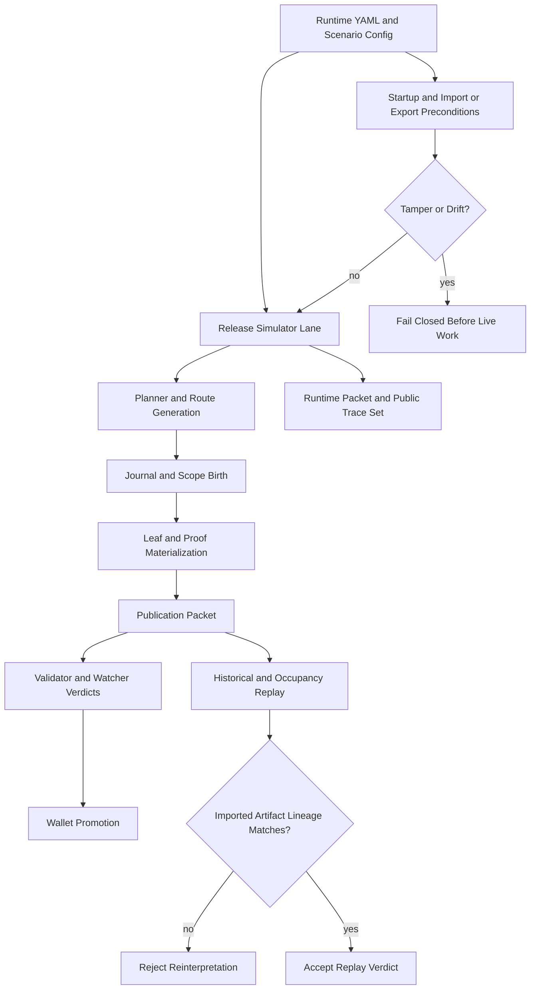

<!-- markdownlint-disable MD060 -->

# Phase 058 Test Specification: HJMT Benchmarks

**Phase:** `058-HJMT-benchmarks`
**Status:** fallback-ready
**Authority:** `058-TODO.md`, `058-CONTEXT.md`, `058-SOURCE-AUDIT.md`, the
numbered plan packet, the HJMT upgrade paper, the fixture checklist, the HJMT
design paper, and the live or explicitly-proposed test and bench homes listed
below

## Purpose

This document defines the phase-local unit, integration, release-lane,
benchmark, fixture, and Rust end-to-end test contract for Phase 058.

For Phase 058, end-to-end means realistic Rust coverage across
`z00z_storage`, `z00z_runtime/aggregators`, `z00z_rollup_node`,
`z00z_runtime/validators`, `z00z_runtime/watchers`, and `z00z_simulator`.
It does not mean browser automation.

This packet is fallback-ready. It freezes the owner homes, scenario ledger,
verification order, and live-versus-successor-versus-proposed test mapping that
execution must satisfy without pretending the missing exact homes already land.

## Workflow Status

- Mode: `fallback-ready`.
- Source artifacts used:
  - `.planning/phases/058-HJMT-benchmarks/058-TODO.md`
  - `.planning/phases/058-HJMT-benchmarks/058-CONTEXT.md`
  - `.planning/phases/058-HJMT-benchmarks/058-SOURCE-AUDIT.md`
  - `.planning/phases/058-HJMT-benchmarks/058-01-PLAN.md` through
    `058-07-PLAN.md`
  - `docs/tech-papers/Z00Z-HJMT-Upgrade.md`
  - `docs/tech-papers/Z00Z-HJMT-Fixture-Checklist.md`
  - `docs/tech-papers/Z00Z-HJMT-Design.md`
- Testing posture:
  - Reuse exact live owner homes first.
  - Treat successor live homes honestly where the exact TODO filename does not
    yet exist.
  - Keep proposed homes labeled proposed until the repository actually lands
    them.
  - Do not create duplicate route, proof, publication, validator, watcher, or
    benchmark authority lanes in tests.
  - Classification gate for this planning artifact is frozen here: Phase 058
    uses Rust TDD/integration/release-lane E2E/benchmark coverage only; it
    does not introduce browser automation.
  - Test-plan gate for this planning artifact is frozen here together with
    `058-TESTS-TASKS.md`; another engineer or agent should be able to
    implement without guessing scenario boundaries or ownership.

## Mandatory Source Cross-Read

Before implementing, reviewing, or summarizing any Phase 058 test from this
packet, read:

1. `058-CONTEXT.md` sections `Implementation Decisions`, `Canonical
   References`, `Cross-Crate Ownership Map`, and `TODO Coverage Contract`.
2. `058-TODO.md` sections:
   `Mandatory implementation gates`,
   `Workstream 1` through `Workstream 5`,
   `Required tests and benchmarks`,
   `Required execution profiles`,
   `Required scenario coverage`,
   `Required artifacts`,
   `Fixture closure`,
   and `Exit criteria`.
3. The exact `coverage_contract` section of every `058-0X-PLAN.md` that a test
   or bench lane closes.

## Non-Negotiable Test Rules

- Tests must call production route, proof, publication, validator, watcher,
  config, runner, and verification APIs.
- The public end-to-end readiness lane must run in `--release`.
- `SIM-BATCH-1000` is heavy evidence only and must not replace smaller
  deterministic correctness profiles.
- `SIM-5A7S` and `SIM-5A7S-PUB` are canonical acceptance fixtures only. Tests
  must also prove at least one additional positive topology change loaded from
  YAML.
- `cfg_flow.json` through `watch_flow.json` remain inherited trace authority.
  `run_meta.json`, `wallet_scan.json`, `sim_summary.md`, `hist_flow.json`, and
  `occ_flow.json` are now verified live exact homes on the `scenario_1` public
  release packet. `asset_flow.json` and `right_flow.json` remain inherited
  trace-pack inventory aliases only and must not be treated as second
  authority paths or readiness gates.
- Score and compression claims require measured reports and explicit verdicts.
- Wallet state must become spendable or confirmed only after proof-before-
  ownership is satisfied.
- Historical, route, and policy replay must reject reinterpretation drift under
  current config.
- Any YAML, fixture, trace, or report home not yet present in the repository
  must stay labeled `proposed`.

## Mandatory Verification Order

Every Rust or test-affecting change that touches this packet must verify in
this order:

```bash
./.github/skills/smart-tests-bootstrap/scripts/bootstrap_tests.sh
cargo test -p z00z_storage --release --features test-params-fast --test test_hjmt_batch_proof -- --nocapture
cargo test -p z00z_storage --release --features test-params-fast --test test_hjmt_batch_proof_negative -- --nocapture
cargo test -p z00z_storage --release --features test-params-fast --test test_hjmt_root_generation -- --nocapture
cargo test -p z00z_aggregators --release --features test-params-fast --test test_hjmt_shard_routing -- --nocapture
cargo test -p z00z_aggregators --release --features test-params-fast --test test_hjmt_planner -- --nocapture
cargo test -p z00z_aggregators --release --features test-params-fast --test test_hjmt_publish -- --nocapture
cargo test -p z00z_aggregators --release --features test-params-fast --test test_hjmt_join -- --nocapture
cargo test -p z00z_aggregators --release --features test-params-fast --test test_hjmt_migrate -- --nocapture
cargo test -p z00z_aggregators --release --features test-params-fast --test test_hjmt_failover_same_lineage -- --nocapture
cargo test -p z00z_aggregators --release --features test-params-fast --test test_hjmt_split_brain_fencing -- --nocapture
cargo test -p z00z_rollup_node --release --features test-params-fast --test test_hjmt_topology -- --nocapture
cargo test -p z00z_rollup_node --release --features test-params-fast --test test_hjmt_process -- --nocapture
cargo test -p z00z_rollup_node --release --features test-params-fast --test test_hjmt_preflight -- --nocapture
cargo test -p z00z_simulator --release --features test-params-fast --test test_hjmt_runtime_config -- --nocapture
cargo test -p z00z_simulator --release --features test-params-fast --test test_scenario_settlement -- --nocapture
cargo test -p z00z_simulator --release --features test-params-fast --test test_scenario1_stage_surface -- --nocapture
cargo test -p z00z_simulator --release --features test-params-fast --test test_stage7_jmt_wallet_scan -- --nocapture
cargo test -p z00z_storage --release --features test-params-fast --test test_hjmt_scope_birth -- --nocapture
cargo test -p z00z_storage --release --features test-params-fast --test test_hjmt_historical_proofs -- --nocapture
cargo test -p z00z_storage --release --features test-params-fast --test test_hjmt_adaptive_policy_proofs -- --nocapture
cargo test -p z00z_storage --release --features test-params-fast --test test_occupancy_privacy -- --nocapture
cargo test -p z00z_storage --release --features test-params-fast --test test_occupancy_evidence -- --nocapture
cargo test -p z00z_storage --release --features test-params-fast --test test_bench_lanes -- --nocapture
cargo test -p z00z_storage --release --features test-params-fast --test test_hjmt_import_export -- --nocapture
cargo test -p z00z_storage --release --features test-params-fast --test test_hjmt_storage_boundary -- --nocapture
cargo test -p z00z_storage --release --features test-params-fast --test test_hjmt_backend_conformance -- --nocapture
cargo bench -p z00z_storage --bench settlement_proofs --no-run
cargo bench -p z00z_storage --bench settlement_hjmt --no-run
cargo bench -p z00z_storage --bench settlement_shard --no-run
cargo bench -p z00z_storage --bench settlement_nested --no-run
cargo bench -p z00z_storage --bench adaptive_policy_bench --no-run
cargo test --release
```

The targeted wave now includes the exact acceptance homes that landed during
Phase 058 before the broad `cargo test --release` gate:

- `crates/z00z_storage/tests/test_hjmt_batch_commit.rs`
- `crates/z00z_storage/tests/test_hjmt_batch_recovery.rs`
- `crates/z00z_storage/tests/test_hjmt_transition_proofs.rs`
- `crates/z00z_storage/tests/test_hjmt_privacy_regression.rs`
- `crates/z00z_simulator/tests/test_hjmt_e2e.rs`

Every execution slice must also run
`/.github/prompts/gsd-review-tasks-execution.prompt.md`
(` /GSD-Review-Tasks-Execution `) in YOLO mode at least three times and must
continue until at least two consecutive runs report no significant issues.

If a slice needs a versioning or release-flow commit, route it through
`/z00z-git-versioning`.

## Scenario Ledger

| Scenario ID | Goal |
| --- | --- |
| `058-SC-01` | Claim ledger maps every readiness row to commands, artifacts, digests, and verdicts. |
| `058-SC-02` | Release-mode simulator emits the public trace packet and stays in sync with `scenario_design.yaml`. |
| `058-SC-03` | YAML changes alter live topology, planner, process, and startup behavior. |
| `058-SC-04` | Import/export, restart, and startup fail closed on tamper, drift, and corruption. |
| `058-SC-05` | Final `SIM-5A7S` runtime packet closes on the public release lane. |
| `058-SC-06` | Final `SIM-5A7S-PUB` publication packet closes on the same lineage and digest story. |
| `058-SC-07` | `SIM-BATCH-1000` closes as heavy-only readiness evidence. |
| `058-SC-08` | Query/search/shard-scaling/proof-byte or verify-time reports exist and are classified honestly. |
| `058-SC-09` | Compression status is explicit, versioned, and not overclaimed. |
| `058-SC-10` | Dynamic scope birth and wallet proof-before-ownership close on the release lane. |
| `058-SC-11` | Historical playback and occupancy privacy stay bound to imported artifacts and reject reinterpretation drift. |
| `058-SC-12` | Full fixture-family and `12.1` evidence-gap closure matrix is explicit. |
| `058-SC-13` | Final repository verdict is synchronized across phase docs, roadmap, and state. |

## Live Test Homes To Reuse First

| Area | Home status | Owner homes |
| --- | --- | --- |
| Batch-proof contract | verified live | `crates/z00z_storage/tests/test_hjmt_batch_proof.rs`, `crates/z00z_storage/tests/test_hjmt_batch_proof_negative.rs` |
| Root-generation and publication fixtures | verified live | `crates/z00z_storage/tests/test_hjmt_root_generation.rs` |
| Route and planner semantics | verified live | `crates/z00z_runtime/aggregators/tests/test_hjmt_shard_routing.rs`, `crates/z00z_runtime/aggregators/tests/test_hjmt_planner.rs` |
| Publication, join, migrate, failover, split-brain | verified live | `crates/z00z_runtime/aggregators/tests/test_hjmt_publish.rs`, `crates/z00z_runtime/aggregators/tests/test_hjmt_join.rs`, `crates/z00z_runtime/aggregators/tests/test_hjmt_migrate.rs`, `crates/z00z_runtime/aggregators/tests/test_hjmt_failover_same_lineage.rs`, `crates/z00z_runtime/aggregators/tests/test_hjmt_split_brain_fencing.rs` |
| Runtime topology, process, and preflight | verified live | `crates/z00z_rollup_node/tests/test_hjmt_topology.rs`, `crates/z00z_rollup_node/tests/test_hjmt_process.rs`, `crates/z00z_rollup_node/tests/test_hjmt_preflight.rs` |
| Release simulator and stage sync | verified live | `crates/z00z_simulator/tests/test_hjmt_runtime_config.rs`, `crates/z00z_simulator/tests/test_scenario_settlement.rs`, `crates/z00z_simulator/tests/test_scenario1_stage_surface.rs`, `crates/z00z_simulator/tests/test_hjmt_e2e.rs` |
| Scope birth and historical replay | verified live | `crates/z00z_storage/tests/test_hjmt_scope_birth.rs`, `crates/z00z_storage/tests/test_hjmt_historical_proofs.rs` |
| Adaptive transition, privacy, and occupancy | verified live | `crates/z00z_storage/tests/test_hjmt_adaptive_policy_proofs.rs`, `crates/z00z_storage/tests/test_hjmt_transition_proofs.rs`, `crates/z00z_storage/tests/test_hjmt_privacy_regression.rs`, `crates/z00z_storage/tests/test_occupancy_privacy.rs`, `crates/z00z_storage/tests/test_occupancy_evidence.rs` |
| Wallet proof-before-ownership | verified live | `crates/z00z_simulator/tests/test_stage7_jmt_wallet_scan.rs` |
| Bench harness and bench guards | verified live | `crates/z00z_storage/benches/*.rs`, `crates/z00z_storage/tests/test_bench_lanes.rs`, `crates/z00z_storage/benches/settlement_benches.md` |

## Exact Live, Successor Live, And Proposed File Map

| Exact file or lane | Status | Notes |
| --- | --- | --- |
| `crates/z00z_storage/tests/test_hjmt_batch_proof.rs` | verified live | Exact file exists. |
| `crates/z00z_storage/tests/test_hjmt_batch_proof_negative.rs` | verified live | Exact file exists. |
| `crates/z00z_storage/tests/test_hjmt_batch_commit.rs` | verified live | Exact acceptance home now proves batch root and oracle convergence. |
| `crates/z00z_storage/tests/test_hjmt_batch_recovery.rs` | verified live | Exact acceptance home now proves injected-recovery continuity. |
| `crates/z00z_storage/tests/test_hjmt_storage_boundary.rs` | verified live | Exact file now freezes the storage-boundary guardrail seam. |
| `crates/z00z_storage/tests/test_hjmt_backend_conformance.rs` | verified live | Exact file now freezes backend-trait and startup-contract conformance. |
| `crates/z00z_storage/tests/test_hjmt_import_export.rs` | verified live | Exact file now freezes route/publication/proof/recovery artifact roundtrips and tamper rejects. |
| `crates/z00z_runtime/aggregators/tests/test_hjmt_shard_routing.rs` | verified live | Exact file exists. |
| `crates/z00z_rollup_node/tests/test_hjmt_topology.rs` | verified live | Exact file exists. |
| `crates/z00z_rollup_node/tests/test_hjmt_process.rs` | verified live | Exact file exists. |
| `crates/z00z_runtime/aggregators/tests/test_hjmt_planner.rs` | verified live | Exact file exists. |
| `crates/z00z_rollup_node/tests/test_hjmt_preflight.rs` | verified live | Exact file exists. |
| `crates/z00z_runtime/aggregators/tests/test_hjmt_failover_same_lineage.rs` | verified live | Exact file exists. |
| `crates/z00z_runtime/aggregators/tests/test_hjmt_split_brain_fencing.rs` | verified live | Exact inherited multi-aggregator guard remains reusable for Phase 058 publication-lineage fencing. |
| `crates/z00z_storage/tests/test_hjmt_root_generation.rs` | verified live | Exact file exists. |
| `crates/z00z_runtime/aggregators/tests/test_hjmt_join.rs` | verified live | Exact file exists. |
| `crates/z00z_runtime/aggregators/tests/test_hjmt_publish.rs` | verified live | Exact file exists. |
| `crates/z00z_runtime/aggregators/tests/test_hjmt_migrate.rs` | verified live | Exact file exists. |
| `crates/z00z_storage/tests/test_hjmt_historical_proofs.rs` | verified live | Exact file exists. |
| `crates/z00z_storage/tests/test_hjmt_transition_proofs.rs` | verified live | Exact acceptance home now proves split or merge transition closure plus policy-drift rejection. |
| `crates/z00z_storage/tests/test_hjmt_privacy_regression.rs` | verified live | Exact acceptance home now proves occupancy privacy binding and tamper rejection. |
| `crates/z00z_simulator/tests/test_hjmt_e2e.rs` | verified live | Exact acceptance home now proves the release-lane end-to-end digest story on the simulator seam. |
| `crates/z00z_simulator/tests/test_scenario1_stage_surface.rs` | verified live | Exact file exists and remains the sync gate unless a documented successor lands. |

## Config And Artifact Homes

| Surface | Home status | Test responsibility |
| --- | --- | --- |
| `config/hjmt_runtime/sim_5a7s/manifest.json` | verified live | Must stay the canonical runtime home. |
| `config/hjmt_runtime/sim_5a7s/aggregators/agg-0/aggregator-config.yaml`, `config/hjmt_runtime/sim_5a7s/aggregators/agg-1/aggregator-config.yaml`, `config/hjmt_runtime/sim_5a7s/aggregators/agg-2/aggregator-config.yaml`, `config/hjmt_runtime/sim_5a7s/aggregators/agg-3/aggregator-config.yaml`, `config/hjmt_runtime/sim_5a7s/aggregators/agg-4/aggregator-config.yaml` | verified live | Prove owner, standby, endpoint, and role fields change live behavior. |
| `config/hjmt_runtime/sim_5a7s/planner/planner-config.yaml` | verified live | Prove route source, cadence, and activation behavior change live behavior. |
| `config/hjmt_runtime/sim_5a7s/storage/storage-config.yaml` | verified live | Prove backend, journal, cache, and startup settings change live behavior. |
| `crates/z00z_simulator/src/scenario_1/scenario_config.yaml` | verified live | Prove active profile, supported profiles, reserved profiles, and positive topology examples are loaded from disk. |
| `crates/z00z_simulator/src/scenario_1/scenario_design.yaml` | verified live | Prove stage and artifact drift reject. |
| `cfg_flow.json`, `tx_flow.json`, `route_flow.json`, `plan_flow.json`, `journal_flow.json`, `scope_flow.json`, `leaf_flow.json`, `proof_flow.json`, `pub_flow.json`, `val_flow.json`, `watch_flow.json` | inherited / mandatory | Keep the public release trace inventory literal instead of implying middle stages. |
| `proc_flow.json`, `recovery_flow.json` | inherited / mandatory | Keep inherited process and recovery lineage attached to the same release packet. |
| `run_meta.json`, `wallet_scan.json`, `sim_summary.md` | verified live | Canonical public release-packet homes emitted by `scenario_1` and validated by the simulator release-lane suites. |
| `hist_flow.json`, `occ_flow.json` | verified live on live packet | Historical and occupancy replay now emit exact public packet homes and stay bound to imported-artifact lineage checks. |
| `asset_flow.json`, `right_flow.json` | inherited inventory aliases only | Keep them explicit in packet inventory, but do not treat them as separate readiness gates or second authority paths. |
| `crates/z00z_storage/outputs/settlement/` | verified live | Current measured-report home. |
| `crates/z00z_storage/outputs/assets/` | retired alias | Not a live home; keep `outputs/settlement/` canonical. |

## Fixture And Report Requirements

- Every fixture row must satisfy the checklist `Completion Contract`.
- Every benchmark or readiness report must record the exact command used.
- Every score or compression claim must cite a measured report and one verdict
  row.
- The final evidence packet must keep unsupported claims explicit.

## Classification

### TDD And Integration Targets

| Home or lane | Class | Why It Matters |
| --- | --- | --- |
| `crates/z00z_storage/tests/test_hjmt_batch_proof.rs` and `crates/z00z_storage/tests/test_hjmt_batch_proof_negative.rs` | TDD / contract | Prove canonical `BatchProofBlobV1` bytes, reject mutations, and close proof-family baseline before any compression claim. |
| `crates/z00z_storage/tests/test_hjmt_root_generation.rs` | TDD / contract | Proves canonical committed-root and shard-root artifact behavior that every later readiness claim depends on. |
| `crates/z00z_runtime/aggregators/tests/test_hjmt_shard_routing.rs` and `crates/z00z_runtime/aggregators/tests/test_hjmt_planner.rs` | Integration | Prove route, planner, and planner-equivalence behavior without inventing a second authority path. |
| `crates/z00z_rollup_node/tests/test_hjmt_preflight.rs`, `crates/z00z_rollup_node/tests/test_hjmt_process.rs`, and `crates/z00z_rollup_node/tests/test_hjmt_topology.rs` | Integration | Prove startup fail-closed, topology loading, runtime process wiring, and bad-state rejection. |
| `crates/z00z_storage/tests/test_bench_lanes.rs` plus the five accepted bench homes | Integration / benchmark guard | Prove benchmark lane ownership, heavy-profile routing, and no second harness drift. |
| `crates/z00z_storage/tests/test_hjmt_import_export.rs`, `crates/z00z_storage/tests/test_hjmt_storage_boundary.rs`, `crates/z00z_storage/tests/test_hjmt_backend_conformance.rs`, `crates/z00z_storage/tests/test_hjmt_batch_commit.rs`, and `crates/z00z_storage/tests/test_hjmt_batch_recovery.rs` | Integration / readiness homes | Freeze exact acceptance anchors for restart, journal, import/export, backend-boundary readiness, batch commit, and injected recovery without guessing where they belong. |

### End-To-End Targets

| Home or lane | Class | Why It Matters |
| --- | --- | --- |
| `crates/z00z_simulator/tests/test_hjmt_runtime_config.rs`, `crates/z00z_simulator/tests/test_scenario_settlement.rs`, and `crates/z00z_simulator/tests/test_scenario1_stage_surface.rs` | E2E / release lane | Prove the public `--release` simulator path, config digests, process map, trace set, stage sync, and redaction-safe evidence packet. |
| `crates/z00z_runtime/aggregators/tests/test_hjmt_publish.rs`, `crates/z00z_runtime/aggregators/tests/test_hjmt_join.rs`, `crates/z00z_runtime/aggregators/tests/test_hjmt_migrate.rs`, `crates/z00z_runtime/aggregators/tests/test_hjmt_failover_same_lineage.rs`, and `crates/z00z_runtime/aggregators/tests/test_hjmt_split_brain_fencing.rs` | E2E / runtime and publication | Prove deterministic re-encoding, independent process topology, join roles, transfer, carry-forward, split-brain fencing, and crash-recovery continuity. |
| `crates/z00z_runtime/validators/tests/test_hjmt_publication_contract.rs` and `crates/z00z_runtime/watchers/tests/test_hjmt_publication_contract.rs` | E2E / downstream acceptance | Prove one shared publication digest and one verdict map across validator and watcher consumers. |
| `crates/z00z_storage/tests/test_hjmt_scope_birth.rs`, `crates/z00z_storage/tests/test_hjmt_historical_proofs.rs`, `crates/z00z_storage/tests/test_hjmt_adaptive_policy_proofs.rs`, `crates/z00z_storage/tests/test_occupancy_privacy.rs`, `crates/z00z_storage/tests/test_occupancy_evidence.rs`, and `crates/z00z_simulator/tests/test_stage7_jmt_wallet_scan.rs` | E2E / user-visible readiness | Prove first-seen scope birth, proof-before-ownership, historical replay, occupancy privacy, and final wallet promotion. |
| `crates/z00z_storage/tests/test_hjmt_transition_proofs.rs`, `crates/z00z_storage/tests/test_hjmt_privacy_regression.rs`, and `crates/z00z_simulator/tests/test_hjmt_e2e.rs` | E2E / exact homes | Freeze exact anchors for proof-transition, privacy-regression, and end-to-end closure without guessing scenario boundaries later. |

### Skip Targets

| Item | Why It Is Skipped |
| --- | --- |
| `.planning/phases/058-HJMT-benchmarks/*.md` | Planning artifacts are authorities for execution, not runtime test seams. |
| Any second route, planner, proof, validator, watcher, simulator, or benchmark truth lane | Explicitly forbidden by the phase boundary and anti-drift rules. |
| Vendor code under `crates/z00z_crypto/tari/**` | Read-only vendor area. |
| Unevidenced compression or score marketing claims | Must stay verdict rows in reports, not synthetic test surfaces. |

## Test File Placement

| Scenario ID | Test file path or lane | Status | Why This Is The Correct Home |
| --- | --- | --- | --- |
| `058-SC-01` | `.planning/phases/058-HJMT-benchmarks/058-EVIDENCE-LEDGER.md`, `.planning/phases/058-HJMT-benchmarks/058-SOURCE-AUDIT.md`, `crates/z00z_storage/tests/fixtures/hjmt_upgrade/batch_proof_v1_positive/manifest.json`, `crates/z00z_storage/tests/fixtures/hjmt_upgrade/batch_proof_v1_negative/manifest.json`, `crates/z00z_storage/tests/fixtures/hjmt_upgrade/root_generation_migration/manifest.json`, `crates/z00z_storage/tests/fixtures/hjmt_upgrade/shard_route_table_v1/manifest.json`, `crates/z00z_storage/tests/fixtures/hjmt_upgrade/shard_root_leaf_v1/manifest.json`, `crates/z00z_storage/tests/fixtures/hjmt_upgrade/checkpoint_publication_v1/manifest.json`, `crates/z00z_runtime/aggregators/tests/fixtures/failover_v1/manifest.json`, and `crates/z00z_storage/benches/settlement_benches.md` | planned / mixed | The evidence ledger is a fallback-ready planning artifact, but its anchor rows must resolve to exact live fixture and bench homes. |
| `058-SC-02` | `crates/z00z_simulator/tests/test_hjmt_runtime_config.rs`, `crates/z00z_simulator/tests/test_scenario_settlement.rs`, and `crates/z00z_simulator/tests/test_scenario1_stage_surface.rs` | verified live | Release-mode simulator continuity, trace packet, stage sync, and redaction checks already belong to the simulator seams. |
| `058-SC-03` and `058-SC-04` | `crates/z00z_rollup_node/tests/test_hjmt_preflight.rs`, `crates/z00z_rollup_node/tests/test_hjmt_process.rs`, `crates/z00z_rollup_node/tests/test_hjmt_topology.rs`, `crates/z00z_storage/tests/test_hjmt_import_export.rs`, `crates/z00z_storage/tests/test_hjmt_storage_boundary.rs`, `crates/z00z_storage/tests/test_hjmt_backend_conformance.rs`, `crates/z00z_storage/tests/test_hjmt_batch_commit.rs`, and `crates/z00z_storage/tests/test_hjmt_batch_recovery.rs` | verified live | Config realism, extra topology, startup reject, import/export, batch commit, injected recovery, and journal baseline are one operational-readiness seam. |
| `058-SC-05` and `058-SC-06` | `crates/z00z_runtime/aggregators/tests/test_hjmt_planner.rs`, `crates/z00z_runtime/aggregators/tests/test_hjmt_publish.rs`, `crates/z00z_runtime/aggregators/tests/test_hjmt_join.rs`, `crates/z00z_runtime/aggregators/tests/test_hjmt_migrate.rs`, `crates/z00z_runtime/aggregators/tests/test_hjmt_failover_same_lineage.rs`, `crates/z00z_runtime/aggregators/tests/test_hjmt_split_brain_fencing.rs`, `crates/z00z_runtime/validators/tests/test_hjmt_publication_contract.rs`, `crates/z00z_runtime/watchers/tests/test_hjmt_publication_contract.rs`, `crates/z00z_simulator/tests/test_scenario_settlement.rs`, and `crates/z00z_simulator/tests/test_scenario1_stage_surface.rs` | verified live | Final runtime and publication packets must close on the same lineage without spawning a second packet owner, and planner equivalence plus publication-lineage fencing must stay explicit on the same packet family. |
| `058-SC-07`, `058-SC-08`, and `058-SC-09` | `crates/z00z_storage/tests/test_bench_lanes.rs`, `crates/z00z_storage/benches/settlement_proofs.rs`, `crates/z00z_storage/benches/settlement_hjmt.rs`, `crates/z00z_storage/benches/settlement_shard.rs`, `crates/z00z_storage/benches/settlement_nested.rs`, `crates/z00z_storage/benches/adaptive_policy_bench.rs`, `crates/z00z_storage/scripts/run_storage_settlement_bench.py`, `crates/z00z_storage/benches/settlement_benches.md`, and `crates/z00z_storage/outputs/settlement/` | verified live | Heavy profile, measurement matrix, and compression verdict belong to the existing storage bench authority only. |
| `058-SC-10` and `058-SC-11` | `crates/z00z_storage/tests/test_hjmt_scope_birth.rs`, `crates/z00z_storage/tests/test_hjmt_historical_proofs.rs`, `crates/z00z_storage/tests/test_hjmt_adaptive_policy_proofs.rs`, `crates/z00z_storage/tests/test_hjmt_transition_proofs.rs`, `crates/z00z_storage/tests/test_hjmt_privacy_regression.rs`, `crates/z00z_storage/tests/test_occupancy_privacy.rs`, `crates/z00z_storage/tests/test_occupancy_evidence.rs`, `crates/z00z_simulator/tests/test_stage7_jmt_wallet_scan.rs`, and `crates/z00z_simulator/tests/test_hjmt_e2e.rs` | verified live | Scope birth, proof-before-ownership, historical replay, transition closure, occupancy privacy, and end-to-end release closure are one proof-boundary/user-visible slice. |
| `058-SC-12` and `058-SC-13` | `crates/z00z_storage/tests/fixtures/hjmt_upgrade/batch_proof_v1_positive/manifest.json`, `crates/z00z_storage/tests/fixtures/hjmt_upgrade/batch_proof_v1_positive/README.md`, `crates/z00z_storage/tests/fixtures/hjmt_upgrade/batch_proof_v1_negative/manifest.json`, `crates/z00z_storage/tests/fixtures/hjmt_upgrade/batch_proof_v1_negative/README.md`, `crates/z00z_storage/tests/fixtures/hjmt_upgrade/root_generation_migration/manifest.json`, `crates/z00z_storage/tests/fixtures/hjmt_upgrade/root_generation_migration/README.md`, `crates/z00z_storage/tests/fixtures/hjmt_upgrade/shard_route_table_v1/manifest.json`, `crates/z00z_storage/tests/fixtures/hjmt_upgrade/shard_route_table_v1/README.md`, `crates/z00z_storage/tests/fixtures/hjmt_upgrade/shard_root_leaf_v1/manifest.json`, `crates/z00z_storage/tests/fixtures/hjmt_upgrade/shard_root_leaf_v1/README.md`, `crates/z00z_storage/tests/fixtures/hjmt_upgrade/checkpoint_publication_v1/manifest.json`, `crates/z00z_storage/tests/fixtures/hjmt_upgrade/checkpoint_publication_v1/README.md`, `crates/z00z_runtime/aggregators/tests/fixtures/failover_v1/manifest.json`, `crates/z00z_runtime/aggregators/tests/fixtures/failover_v1/README.md`, `.planning/phases/058-HJMT-benchmarks/058-EVIDENCE-LEDGER.md`, `.planning/phases/058-HJMT-benchmarks/058-VALIDATION.md`, `.planning/phases/058-HJMT-benchmarks/058-SUMMARY.md`, `ROADMAP.md`, and `STATE.md` | planned / mixed | Final fixture closure and final verdict are documentation-backed but must cite exact runtime, proof, and report artifacts. |

## Gate Coverage Map

| Gate | Primary proof homes |
| --- | --- |
| `058-G1` | `058-SC-01`, `.planning/phases/058-HJMT-benchmarks/058-EVIDENCE-LEDGER.md`, `.planning/phases/058-HJMT-benchmarks/058-SOURCE-AUDIT.md`, the exact fixture manifests listed under `058-SC-01`, and `crates/z00z_storage/benches/settlement_benches.md` |
| `058-G2` | `058-SC-02`, `crates/z00z_simulator/tests/test_hjmt_runtime_config.rs`, `crates/z00z_simulator/tests/test_scenario_settlement.rs`, and `crates/z00z_simulator/src/scenario_1/runtime_observability.rs` |
| `058-G3` | `058-SC-02`, `crates/z00z_simulator/src/scenario_1/scenario_design.yaml`, and `crates/z00z_simulator/tests/test_scenario1_stage_surface.rs` |
| `058-G4` | `058-SC-03`, `config/hjmt_runtime/sim_5a7s/manifest.json`, `config/hjmt_runtime/sim_5a7s/aggregators/agg-0/aggregator-config.yaml`, `config/hjmt_runtime/sim_5a7s/aggregators/agg-1/aggregator-config.yaml`, `config/hjmt_runtime/sim_5a7s/aggregators/agg-2/aggregator-config.yaml`, `config/hjmt_runtime/sim_5a7s/aggregators/agg-3/aggregator-config.yaml`, `config/hjmt_runtime/sim_5a7s/aggregators/agg-4/aggregator-config.yaml`, `config/hjmt_runtime/sim_5a7s/planner/planner-config.yaml`, `config/hjmt_runtime/sim_5a7s/storage/storage-config.yaml`, and `crates/z00z_rollup_node/tests/test_hjmt_topology.rs`, `crates/z00z_rollup_node/tests/test_hjmt_process.rs`, `crates/z00z_rollup_node/tests/test_hjmt_preflight.rs` |
| `058-G5` | `058-SC-05`, final `SIM-5A7S` runtime packet |
| `058-G6` | `058-SC-06`, final `SIM-5A7S-PUB` packet plus `crates/z00z_runtime/aggregators/tests/test_hjmt_split_brain_fencing.rs`, `crates/z00z_runtime/validators/tests/test_hjmt_publication_contract.rs`, and `crates/z00z_runtime/watchers/tests/test_hjmt_publication_contract.rs` |
| `058-G7` | `058-SC-07`, `crates/z00z_storage/tests/test_bench_lanes.rs`, `crates/z00z_storage/benches/settlement_proofs.rs`, `crates/z00z_storage/benches/settlement_hjmt.rs`, `crates/z00z_storage/benches/settlement_shard.rs`, `crates/z00z_storage/benches/settlement_nested.rs`, `crates/z00z_storage/benches/adaptive_policy_bench.rs`, and heavy-profile reports under `crates/z00z_storage/outputs/settlement/` |
| `058-G8` | `058-SC-08`, `crates/z00z_storage/benches/settlement_proofs.rs`, `crates/z00z_storage/benches/settlement_hjmt.rs`, `crates/z00z_storage/benches/settlement_shard.rs`, `crates/z00z_storage/benches/settlement_nested.rs`, `crates/z00z_storage/benches/adaptive_policy_bench.rs`, `crates/z00z_storage/scripts/run_storage_settlement_bench.py`, and measured reports under `crates/z00z_storage/outputs/settlement/` |
| `058-G9` | `058-SC-04`, `crates/z00z_storage/tests/test_hjmt_import_export.rs`, `crates/z00z_storage/tests/test_hjmt_storage_boundary.rs`, `crates/z00z_storage/tests/test_hjmt_backend_conformance.rs`, `crates/z00z_storage/tests/test_hjmt_batch_commit.rs`, and `crates/z00z_storage/tests/test_hjmt_batch_recovery.rs` |
| `058-G10` | `058-SC-04`, `crates/z00z_rollup_node/tests/test_hjmt_preflight.rs`, `crates/z00z_rollup_node/tests/test_hjmt_process.rs`, and corrupted-state rejects on the same readiness slice |
| `058-G11` | `058-SC-10`, `058-SC-11`, `crates/z00z_storage/tests/test_hjmt_scope_birth.rs`, `crates/z00z_storage/tests/test_hjmt_transition_proofs.rs`, `crates/z00z_storage/tests/test_hjmt_privacy_regression.rs`, `crates/z00z_storage/tests/test_occupancy_privacy.rs`, `crates/z00z_storage/tests/test_occupancy_evidence.rs`, `crates/z00z_simulator/tests/test_stage7_jmt_wallet_scan.rs`, and `crates/z00z_simulator/tests/test_hjmt_e2e.rs` |
| `058-G12` | `058-SC-09`, `crates/z00z_storage/tests/test_hjmt_batch_proof.rs`, `crates/z00z_storage/tests/test_hjmt_batch_proof_negative.rs`, and explicit compression verdict rows in `crates/z00z_storage/benches/settlement_benches.md` |
| `058-G13` | `058-SC-12`, `058-SC-13`, the exact fixture manifest and README homes listed under `058-SC-12` / `058-SC-13`, `.planning/phases/058-HJMT-benchmarks/058-VALIDATION.md`, `.planning/phases/058-HJMT-benchmarks/058-SUMMARY.md`, `ROADMAP.md`, and `STATE.md` |

## TODO Scenario Coverage Crosswalk

| TODO or doc-corpus requirement | Scenario IDs | Primary proof homes |
| --- | --- | --- |
| every claim maps to command, artifact, digest, and verdict | `058-SC-01` | `.planning/phases/058-HJMT-benchmarks/058-EVIDENCE-LEDGER.md`, `.planning/phases/058-HJMT-benchmarks/058-SOURCE-AUDIT.md`, exact fixture manifests, and `crates/z00z_storage/benches/settlement_benches.md` |
| release-mode simulator is canonical and debug-only lanes stay non-gating | `058-SC-02` | `crates/z00z_simulator/tests/test_hjmt_runtime_config.rs`, `crates/z00z_simulator/tests/test_scenario_settlement.rs`, `crates/z00z_simulator/tests/test_scenario1_stage_surface.rs`, and `crates/z00z_simulator/src/scenario_1/runtime_observability.rs` |
| YAML surfaces are real and behavior-changing | `058-SC-03` | `config/hjmt_runtime/sim_5a7s/manifest.json`, `config/hjmt_runtime/sim_5a7s/aggregators/agg-0/aggregator-config.yaml`, `config/hjmt_runtime/sim_5a7s/aggregators/agg-1/aggregator-config.yaml`, `config/hjmt_runtime/sim_5a7s/aggregators/agg-2/aggregator-config.yaml`, `config/hjmt_runtime/sim_5a7s/aggregators/agg-3/aggregator-config.yaml`, `config/hjmt_runtime/sim_5a7s/aggregators/agg-4/aggregator-config.yaml`, `config/hjmt_runtime/sim_5a7s/planner/planner-config.yaml`, `config/hjmt_runtime/sim_5a7s/storage/storage-config.yaml`, and the rollup-node topology/process/preflight suites |
| extra positive non-`5x7` topology loaded from YAML | `058-SC-03` | `crates/z00z_simulator/src/scenario_1/scenario_config.yaml` plus `crates/z00z_rollup_node/tests/test_hjmt_topology.rs` |
| import/export, restart, and fail-closed startup | `058-SC-04` | `crates/z00z_storage/tests/test_hjmt_import_export.rs`, `crates/z00z_storage/tests/test_hjmt_storage_boundary.rs`, `crates/z00z_storage/tests/test_hjmt_backend_conformance.rs`, `crates/z00z_storage/tests/test_hjmt_batch_commit.rs`, `crates/z00z_storage/tests/test_hjmt_batch_recovery.rs`, `crates/z00z_rollup_node/tests/test_hjmt_preflight.rs`, `crates/z00z_rollup_node/tests/test_hjmt_process.rs`, and `crates/z00z_rollup_node/tests/test_hjmt_topology.rs` |
| final `SIM-5A7S` runtime packet | `058-SC-05` | `crates/z00z_runtime/aggregators/tests/test_hjmt_publish.rs`, `crates/z00z_runtime/aggregators/tests/test_hjmt_join.rs`, `crates/z00z_runtime/aggregators/tests/test_hjmt_migrate.rs`, `crates/z00z_runtime/aggregators/tests/test_hjmt_failover_same_lineage.rs`, `crates/z00z_runtime/aggregators/tests/test_hjmt_split_brain_fencing.rs`, and `crates/z00z_simulator/tests/test_scenario_settlement.rs` |
| final `SIM-5A7S-PUB` publication packet | `058-SC-06` | `crates/z00z_runtime/aggregators/tests/test_hjmt_publish.rs`, `crates/z00z_runtime/aggregators/tests/test_hjmt_split_brain_fencing.rs`, `crates/z00z_runtime/validators/tests/test_hjmt_publication_contract.rs`, `crates/z00z_runtime/watchers/tests/test_hjmt_publication_contract.rs`, and `crates/z00z_simulator/tests/test_scenario_settlement.rs` |
| `SIM-BATCH-1000` heavy-only readiness evidence, including explicit cross-shard batch reject coverage | `058-SC-07` | `crates/z00z_storage/tests/test_bench_lanes.rs`, `crates/z00z_storage/benches/settlement_proofs.rs`, `crates/z00z_storage/benches/settlement_hjmt.rs`, `crates/z00z_storage/benches/settlement_shard.rs`, `crates/z00z_storage/benches/settlement_nested.rs`, `crates/z00z_storage/benches/adaptive_policy_bench.rs`, and measured reports under `crates/z00z_storage/outputs/settlement/` |
| query/search/lookups/shard scaling and `128/1000/1024` proof-size rows | `058-SC-08` | `crates/z00z_storage/benches/settlement_proofs.rs`, `crates/z00z_storage/benches/settlement_hjmt.rs`, `crates/z00z_storage/benches/settlement_shard.rs`, `crates/z00z_storage/benches/settlement_nested.rs`, `crates/z00z_storage/benches/adaptive_policy_bench.rs`, `crates/z00z_storage/scripts/run_storage_settlement_bench.py`, and report archives under `crates/z00z_storage/outputs/settlement/` |
| raw timing slices for planning, child commit, parent commit, journal sync, recovery replay, search/query, and proof time | `058-SC-08` | `crates/z00z_storage/scripts/run_storage_settlement_bench.py`, `crates/z00z_storage/benches/settlement_benches.md`, and report archives under `crates/z00z_storage/outputs/settlement/` |
| honest compression verdict only after `BatchProofBlobV1` closure | `058-SC-09` | `crates/z00z_storage/tests/test_hjmt_batch_proof.rs`, `crates/z00z_storage/tests/test_hjmt_batch_proof_negative.rs`, measured proof reports, and explicit compression verdict rows |
| first-seen `definition_id` and `serial_id` births plus proof-before-ownership | `058-SC-10` | `crates/z00z_storage/tests/test_hjmt_scope_birth.rs`, `crates/z00z_simulator/tests/test_stage7_jmt_wallet_scan.rs`, `crates/z00z_simulator/tests/test_hjmt_e2e.rs`, and `crates/z00z_storage/tests/test_hjmt_transition_proofs.rs` |
| historical playback, split/merge transitions, occupancy privacy, and route migration near a scope-creating batch reject reinterpretation drift | `058-SC-11` | `crates/z00z_storage/tests/test_hjmt_historical_proofs.rs`, `crates/z00z_storage/tests/test_hjmt_adaptive_policy_proofs.rs`, `crates/z00z_storage/tests/test_hjmt_transition_proofs.rs`, `crates/z00z_storage/tests/test_hjmt_privacy_regression.rs`, `crates/z00z_storage/tests/test_occupancy_privacy.rs`, and `crates/z00z_storage/tests/test_occupancy_evidence.rs` |
| full fixture-family and `12.1` evidence-gap closure | `058-SC-12` | the exact fixture manifest and README homes listed under `058-SC-12` / `058-SC-13`, `.planning/phases/058-HJMT-benchmarks/058-EVIDENCE-LEDGER.md`, and `.planning/phases/058-HJMT-benchmarks/058-VALIDATION.md` |
| final verdict synchronized across packet, roadmap, and state | `058-SC-13` | `.planning/phases/058-HJMT-benchmarks/058-SUMMARY.md`, `.planning/phases/058-HJMT-benchmarks/058-VALIDATION.md`, `ROADMAP.md`, and `STATE.md` |

## Required End-To-End Behaviors

| Behavior | Requirement | Primary path | Assertions that prove correctness | Pass signal | Failure signal |
| --- | --- | --- | --- | --- | --- |
| Claim discipline is auditable | `058-G1` | source rule -> command -> artifact -> verdict | Every readiness row has exact owner home, exact command, exact artifact, exact verdict, and honest live/successor/proposed status. | No uncovered row remains in the ledger. | A readiness claim depends on prose or implied behavior only. |
| Public release lane is one trace story | `058-G2`, `058-G3` | ingress -> planner -> journal -> scope -> leaf -> proof -> publication -> validator -> watcher -> wallet | `cfg_flow.json` through `watch_flow.json` remain one lineage packet; `proc_flow.json` and `recovery_flow.json` stay attached; stage sync rejects drift; public artifacts satisfy redaction rules. | One release-mode packet exists with config digests, process map, trace set, and summary report. | Missing, stale, redaction-violating, or disconnected artifacts are accepted. |
| Config realism is parameterized, not fixture-bound | `058-G4` | YAML load -> runtime roles -> topology/process/publication behavior | Port, role, planner mode, journal path, workload, failover, shard count, publication leaf-set, and route-generation activation all change behavior from disk only. | At least one non-`5x7` positive topology changes runtime and publication behavior without code edits. | `5x7` is effectively hard-coded or YAML changes do not alter behavior. |
| Startup and portability fail closed | `058-G9`, `058-G10` | import/export -> restart -> startup preflight | Wrong route digest, stale route, wrong lineage, wrong codec, unsupported generation, wrong proof-family tag, tampered import, and corrupted persisted state all reject before live work. | Every bad-state row rejects at the intended stage. | Any bad-state row boots or replays successfully. |
| Final runtime packet is real | `058-G5` | checked runtime home -> release simulator -> runtime packet | Deterministic re-encoding, five independent processes, planner equivalence, join roles, failover, restart, and scope-birth linkage all appear in one packet. | One final `SIM-5A7S` packet proves the canonical runtime topology. | Runtime evidence is split across detached packets or depends on shared-memory shortcuts. |
| Final publication packet is one digest story | `058-G6` | runtime publication -> split-brain fencing -> validator verdict -> watcher verdict | Seven leaves, publication digest, carry-forward, transfer, split-brain fencing, validator, and watcher all bind to the same lineage and verdict story. | One final `SIM-5A7S-PUB` packet closes on the same lineage as the runtime packet. | Validator/watcher digest drift, split-brain leakage, or alternate digest paths appear. |
| Heavy profile stays heavy-only | `058-G7` | `SIM-BATCH-1000` -> measured reports -> score rows | Heavy profile covers stress lanes and first-seen semantic-scope mixes, while `SIM-SMALL`, `SIM-MEDIUM`, and `SIM-CACHE-EDGE` remain correctness lanes. | Heavy profile is explicit and does not replace smaller deterministic profiles. | Readiness depends only on the 1000-op path. |
| Measurement claims are explicit | `058-G8` | bench homes -> measured reports -> score ledger | Query/search/path/terminal/proof/absent/post-reload rows exist; shard scaling records hot-shard ratio, cadence, shard TPS, global TPS, blocked time; Design baseline lanes map to reports or rejected/unsupported rows. | Each score row cites one measured report and one verdict. | Numbers are inferred, cherry-picked, or missing required fields. |
| Compression status is honest | `058-G12` | `BatchProofBlobV1` closure -> optional compression lane -> verdict row | Compression claims remain non-release-gating until a versioned lane exists and is evidenced. | Compression row is explicit and conservative. | Repository claims a compression win without a versioned evidence lane. |
| Wallet state obeys proof boundary | `058-G11` | scope birth -> proof -> wallet scan -> final promotion | Positive and negative proof-before-ownership cases both run; spendable or confirmed-right state appears only after proof success. | Wallet promotion always follows proof acceptance. | Wallet state advances before proof or without proof lineage. |
| Historical replay stays honest | `058-G11` | imported route/publication artifacts -> historical proof -> occupancy replay | `hist_flow.json` and `occ_flow.json` record old/new route generations, old/new root generations, proof verdicts, occupancy verdicts, and imported-artifact validation verdicts; current-config/route/policy reinterpretation rejects. | Historical and occupancy rows replay only against imported artifacts. | Synthetic roots or current-policy reinterpretation succeed. |
| Final verdict does not outrun evidence | `058-G13` | fixture matrix -> validation packet -> roadmap/state sync | Every fixture family and `12.1` evidence-gap class is closed or explicit open; final verdict uses only allowed vocabulary; planning state matches packet state. | One synchronized final closeout story exists. | Roadmap/state/validation disagree or verdict exceeds the evidence matrix. |

## Critical Integration Paths

1. `config/hjmt_runtime/sim_5a7s/**` and
   `crates/z00z_simulator/src/scenario_1/scenario_config.yaml` ->
   runtime process topology ->
   planner and route generation ->
   publication and release traces.
2. `z00z_storage` proof and root truth ->
   `z00z_runtime/aggregators` publish/join/migrate/failover ->
   `z00z_rollup_node` preflight/process/topology checks ->
   validator and watcher acceptance.
3. phase-owned import/export and restart artifacts ->
   startup preflight ->
   route/journal/proof-family validation ->
   one lawful live startup outcome.
4. `SIM-BATCH-1000`, `SIM-SMALL`, `SIM-MEDIUM`, and `SIM-CACHE-EDGE` ->
   `crates/z00z_storage/benches/settlement_proofs.rs`,
   `crates/z00z_storage/benches/settlement_hjmt.rs`,
   `crates/z00z_storage/benches/settlement_shard.rs`,
   `crates/z00z_storage/benches/settlement_nested.rs`, and
   `crates/z00z_storage/benches/adaptive_policy_bench.rs` ->
   score ledger and compression verdict.
5. first-seen semantic scope birth ->
   touched root ->
   touched leaf ->
   proof verification ->
   wallet scan ->
   final spendable or confirmed-right state.
6. imported historical route/publication artifacts ->
   historical proof verification ->
   occupancy privacy replay ->
   reinterpretation rejects.

## State Transition And Proof Path Matrix

| Transition or proof path | Starting state | Trigger | Ending state | Assertions |
| --- | --- | --- | --- | --- |
| Config-driven topology transition | canonical `5x7` runtime home | YAML-only role/topology change | lawful non-`5x7` runtime and publication behavior | Aggregator count, shard count, owner/standby roles, publication leaf-set size, and route-generation activation change without code edits. |
| Standby join to owner activation | standby-only joined node | route generation `N+1` and activation checkpoint | lawful owner role | Pre-activation owner publication rejects; post-activation owner publication succeeds on the intended checkpoint only. |
| Route migration with crash recovery | old route table and active owner | transfer plus mid-window interruption | one lawful resumed publication outcome | Old/new route tables are explicit, same-lineage continuity holds, and carry-forward bytes stay identical for unchanged shards. |
| Proof-before-ownership | new scope birth visible in traces | proof verification succeeds | wallet state becomes spendable or confirmed | Negative proof case keeps wallet state non-spendable and non-confirmed. |
| Historical proof replay | imported old route/publication artifacts | historical verification request | accepted or rejected replay verdict | Old route/root generations are used; current config/route/policy reinterpretation rejects. |
| Compression verdict path | canonical `BatchProofBlobV1` lane only | optional versioned compression experiment | explicit verdict row | No release-ready compression claim is allowed without a versioned measured lane. |

## Realistic Examples To Implement

| Example ID | Scenario IDs | Test home | What it demonstrates | Measurable pass condition | Measurable fail condition |
| --- | --- | --- | --- | --- | --- |
| `058-EX-01` | `058-SC-01` | `.planning/phases/058-HJMT-benchmarks/058-EVIDENCE-LEDGER.md`, `.planning/phases/058-HJMT-benchmarks/058-SOURCE-AUDIT.md`, the exact fixture manifest homes listed under `058-SC-01`, and `crates/z00z_storage/benches/settlement_benches.md` | One packet can explain every readiness claim without hand-waving. | Every gate and verdict row has a command, artifact, digest/result, and verdict. | Any row remains implied or unowned. |
| `058-EX-02` | `058-SC-02` | `crates/z00z_simulator/tests/test_hjmt_runtime_config.rs`, `crates/z00z_simulator/tests/test_scenario_settlement.rs`, `crates/z00z_simulator/tests/test_scenario1_stage_surface.rs`, and `crates/z00z_simulator/src/scenario_1/runtime_observability.rs` | The repository has one canonical public release lane from ingress to final promotion. | `--release` run emits the required trace set, config digests, process map, and stage-sync evidence. | The lane needs debug-only artifacts or emits detached/stale traces. |
| `058-EX-03` | `058-SC-03`, `058-SC-04` | `config/hjmt_runtime/sim_5a7s/manifest.json`, `config/hjmt_runtime/sim_5a7s/aggregators/agg-0/aggregator-config.yaml`, `config/hjmt_runtime/sim_5a7s/aggregators/agg-1/aggregator-config.yaml`, `config/hjmt_runtime/sim_5a7s/aggregators/agg-2/aggregator-config.yaml`, `config/hjmt_runtime/sim_5a7s/aggregators/agg-3/aggregator-config.yaml`, `config/hjmt_runtime/sim_5a7s/aggregators/agg-4/aggregator-config.yaml`, `config/hjmt_runtime/sim_5a7s/planner/planner-config.yaml`, `config/hjmt_runtime/sim_5a7s/storage/storage-config.yaml`, `crates/z00z_rollup_node/tests/test_hjmt_preflight.rs`, `crates/z00z_rollup_node/tests/test_hjmt_process.rs`, `crates/z00z_rollup_node/tests/test_hjmt_topology.rs`, `crates/z00z_storage/tests/test_hjmt_import_export.rs`, `crates/z00z_storage/tests/test_hjmt_storage_boundary.rs`, `crates/z00z_storage/tests/test_hjmt_backend_conformance.rs`, `crates/z00z_storage/tests/test_hjmt_batch_commit.rs`, and `crates/z00z_storage/tests/test_hjmt_batch_recovery.rs` | YAML control is real and unsafe startup is impossible. | Non-`5x7` topology changes behavior from disk only; all bad startup/import rows reject at the expected stage. | YAML changes are inert or a bad-state row reaches live work. |
| `058-EX-04` | `058-SC-05`, `058-SC-06` | `crates/z00z_runtime/aggregators/tests/test_hjmt_planner.rs`, `crates/z00z_runtime/aggregators/tests/test_hjmt_publish.rs`, `crates/z00z_runtime/aggregators/tests/test_hjmt_join.rs`, `crates/z00z_runtime/aggregators/tests/test_hjmt_migrate.rs`, `crates/z00z_runtime/aggregators/tests/test_hjmt_failover_same_lineage.rs`, `crates/z00z_runtime/aggregators/tests/test_hjmt_split_brain_fencing.rs`, `crates/z00z_runtime/validators/tests/test_hjmt_publication_contract.rs`, `crates/z00z_runtime/watchers/tests/test_hjmt_publication_contract.rs`, and `crates/z00z_simulator/tests/test_scenario_settlement.rs` | Runtime and publication close on one lineage and one digest story. | Deterministic re-encoding, five processes, planner equivalence, split-brain fencing, carry-forward, validator/watcher sameness, and packet closure all pass. | Shared-memory dependence, planner divergence, split-brain leakage, or digest drift appears. |
| `058-EX-05` | `058-SC-07`, `058-SC-08`, `058-SC-09` | `crates/z00z_storage/tests/test_bench_lanes.rs`, `crates/z00z_storage/benches/settlement_proofs.rs`, `crates/z00z_storage/benches/settlement_hjmt.rs`, `crates/z00z_storage/benches/settlement_shard.rs`, `crates/z00z_storage/benches/settlement_nested.rs`, `crates/z00z_storage/benches/adaptive_policy_bench.rs`, `crates/z00z_storage/scripts/run_storage_settlement_bench.py`, `crates/z00z_storage/benches/settlement_benches.md`, and `crates/z00z_storage/outputs/settlement/` | Heavy profile, measurement matrix, and compression verdict are honest and reproducible. | Reports exist for lookup/scaling/proof-size rows; heavy profile stays heavy-only; score/compression rows are explicit verdicts. | Readiness is inferred from partial metrics or compression is overclaimed. |
| `058-EX-06` | `058-SC-10`, `058-SC-11` | `crates/z00z_storage/tests/test_hjmt_scope_birth.rs`, `crates/z00z_storage/tests/test_hjmt_historical_proofs.rs`, `crates/z00z_storage/tests/test_hjmt_adaptive_policy_proofs.rs`, `crates/z00z_storage/tests/test_hjmt_transition_proofs.rs`, `crates/z00z_storage/tests/test_hjmt_privacy_regression.rs`, `crates/z00z_storage/tests/test_occupancy_privacy.rs`, `crates/z00z_storage/tests/test_occupancy_evidence.rs`, `crates/z00z_simulator/tests/test_stage7_jmt_wallet_scan.rs`, and `crates/z00z_simulator/tests/test_hjmt_e2e.rs` | User-visible readiness is real: new scope, proof boundary, replay, and privacy all hold. | Positive and negative proof-before-ownership cases pass; historical replay binds to imported artifacts; occupancy disclosure verdicts are explicit. | Wallet state advances before proof, or current-policy reinterpretation succeeds. |
| `058-EX-07` | `058-SC-12`, `058-SC-13` | the exact fixture manifest and README homes listed under `058-SC-12` / `058-SC-13`, `.planning/phases/058-HJMT-benchmarks/058-EVIDENCE-LEDGER.md`, `.planning/phases/058-HJMT-benchmarks/058-VALIDATION.md`, `.planning/phases/058-HJMT-benchmarks/058-SUMMARY.md`, `ROADMAP.md`, and `STATE.md` | Final verdict is evidence-backed and synchronized everywhere. | Every fixture family and evidence-gap class is closed or explicit open; verdict vocabulary is constrained; docs agree. | Final state drifts across packet, roadmap, and state. |

## Negative Scenario Matrix

| Negative scenario | Primary home | What must reject | Proof of correct failure |
| --- | --- | --- | --- |
| Wrong route digest | startup/preflight/import-export lanes | startup or import | Exact reject stage and no live work begins. |
| Stale route | startup plus historical replay lanes | startup or replay | Reject verdict references stale route generation, not a generic error. |
| Wrong journal lineage | startup/import-export lanes | startup | Reject occurs before runtime activation. |
| Wrong codec bytes | import/export and fixture lanes | decode or preflight | Decode or preflight reject is explicit. |
| Unsupported root or backend generation | startup/preflight/backend-conformance lanes | startup | Unsupported generation reject is explicit and fail-closed. |
| Wrong proof-family tag | startup and proof-boundary lanes | startup or proof decode | Wrong family tag cannot silently downgrade to another verifier. |
| Tampered import | import/export lanes | import | Tamper point and reject stage are explicit. |
| Corrupted persisted state | restart/startup lanes | restart bootstrap | Corruption is detected before live work starts. |
| Cross-shard batch | proof and simulator scenario lanes | proof or planner | Cross-shard row rejects and never becomes a valid publication. |
| Wrong-lineage failover | failover/migration lanes | publication continuation | No alternate lawful publication packet is produced. |
| Pre-activation owner publication | join/planner/topology lanes | publication | Owner path rejects until route generation `N+1`. |
| Wallet promotion before proof | wallet scan lane | final wallet state | Negative proof case keeps state non-spendable and non-confirmed. |
| Current-config/route/policy reinterpretation | historical/occupancy lanes | replay verifier | Historical replay reject is explicit and artifact-bound. |
| Lineage disagreement across flow files | simulator release lane plus wallet closure | closeout verification | Any disagreement across `scope_flow.json`, `plan_flow.json`, `journal_flow.json`, `leaf_flow.json`, `pub_flow.json`, or `wallet_scan.json` fails the scenario. |
| Redaction violation in public evidence | simulator release lane and final closeout | packet publication | Public packet is rejected as incomplete/unsafe. |
| Second harness or second truth lane | guardrails and closeout matrix | source-shape guard | Guardrail test fails immediately on duplicate authority patterns. |

## Input Fixtures And Preconditions

| Scenario ID | Inputs | Preconditions | Fixture or artifact source |
| --- | --- | --- | --- |
| `058-SC-01` | TODO gates, exact fixture manifest homes, bench report homes, and design-artifact rows | 058 context and plans are frozen | `.planning/phases/058-HJMT-benchmarks/058-TODO.md`, `.planning/phases/058-HJMT-benchmarks/058-CONTEXT.md`, `.planning/phases/058-HJMT-benchmarks/058-SOURCE-AUDIT.md`, `crates/z00z_storage/tests/fixtures/hjmt_upgrade/batch_proof_v1_positive/manifest.json`, `crates/z00z_storage/tests/fixtures/hjmt_upgrade/batch_proof_v1_negative/manifest.json`, `crates/z00z_storage/tests/fixtures/hjmt_upgrade/root_generation_migration/manifest.json`, `crates/z00z_storage/tests/fixtures/hjmt_upgrade/shard_route_table_v1/manifest.json`, `crates/z00z_storage/tests/fixtures/hjmt_upgrade/shard_root_leaf_v1/manifest.json`, `crates/z00z_storage/tests/fixtures/hjmt_upgrade/checkpoint_publication_v1/manifest.json`, `crates/z00z_runtime/aggregators/tests/fixtures/failover_v1/manifest.json`, and `crates/z00z_storage/benches/settlement_benches.md` |
| `058-SC-02` | runtime YAML, `crates/z00z_simulator/src/scenario_1/scenario_config.yaml`, `crates/z00z_simulator/src/scenario_1/scenario_design.yaml`, and the inherited flow packet | simulator and runtime seams compile | Phase 056/057 lineage plus `crates/z00z_simulator/src/scenario_1/scenario_config.yaml`, `crates/z00z_simulator/src/scenario_1/scenario_design.yaml`, and `crates/z00z_simulator/src/scenario_1/runtime_observability.rs` |
| `058-SC-03` | canonical `5x7` runtime home plus one additional positive topology | YAML surfaces are readable from disk | `config/hjmt_runtime/sim_5a7s/manifest.json`, `config/hjmt_runtime/sim_5a7s/aggregators/agg-0/aggregator-config.yaml`, `config/hjmt_runtime/sim_5a7s/aggregators/agg-1/aggregator-config.yaml`, `config/hjmt_runtime/sim_5a7s/aggregators/agg-2/aggregator-config.yaml`, `config/hjmt_runtime/sim_5a7s/aggregators/agg-3/aggregator-config.yaml`, `config/hjmt_runtime/sim_5a7s/aggregators/agg-4/aggregator-config.yaml`, `config/hjmt_runtime/sim_5a7s/planner/planner-config.yaml`, and `config/hjmt_runtime/sim_5a7s/storage/storage-config.yaml` |
| `058-SC-04` | route/publication/proof/journal artifacts plus corrupted/tampered variants | import/export and startup seams exist | `crates/z00z_storage/tests/test_hjmt_import_export.rs`, `crates/z00z_storage/tests/test_hjmt_storage_boundary.rs`, `crates/z00z_storage/tests/test_hjmt_backend_conformance.rs`, `crates/z00z_storage/tests/test_hjmt_batch_commit.rs`, and `crates/z00z_storage/tests/test_hjmt_batch_recovery.rs` |
| `058-SC-05` and `058-SC-06` | final runtime and publication packet inputs plus join/transfer/failover settings | release lane and runtime publication seams are live | `crates/z00z_runtime/aggregators/tests/test_hjmt_planner.rs`, `crates/z00z_runtime/aggregators/tests/test_hjmt_publish.rs`, `crates/z00z_runtime/aggregators/tests/test_hjmt_join.rs`, `crates/z00z_runtime/aggregators/tests/test_hjmt_migrate.rs`, `crates/z00z_runtime/aggregators/tests/test_hjmt_failover_same_lineage.rs`, `crates/z00z_runtime/aggregators/tests/test_hjmt_split_brain_fencing.rs`, `crates/z00z_runtime/validators/tests/test_hjmt_publication_contract.rs`, `crates/z00z_runtime/watchers/tests/test_hjmt_publication_contract.rs`, and `crates/z00z_simulator/tests/test_scenario_settlement.rs` |
| `058-SC-07` through `058-SC-09` | bench profiles, report archives, proof-size targets, and heavy-profile workloads | bench homes compile and remain the only harness | `crates/z00z_storage/benches/settlement_proofs.rs`, `crates/z00z_storage/benches/settlement_hjmt.rs`, `crates/z00z_storage/benches/settlement_shard.rs`, `crates/z00z_storage/benches/settlement_nested.rs`, `crates/z00z_storage/benches/adaptive_policy_bench.rs`, `crates/z00z_storage/scripts/run_storage_settlement_bench.py`, and `crates/z00z_storage/outputs/settlement/` |
| `058-SC-10` and `058-SC-11` | first-seen scope batches, imported route/publication artifacts, and wallet scan inputs | proof, historical, occupancy, and wallet seams are live | `crates/z00z_storage/tests/test_hjmt_scope_birth.rs`, `crates/z00z_storage/tests/test_hjmt_historical_proofs.rs`, `crates/z00z_storage/tests/test_hjmt_adaptive_policy_proofs.rs`, `crates/z00z_storage/tests/test_hjmt_transition_proofs.rs`, `crates/z00z_storage/tests/test_hjmt_privacy_regression.rs`, `crates/z00z_storage/tests/test_occupancy_privacy.rs`, `crates/z00z_storage/tests/test_occupancy_evidence.rs`, `crates/z00z_simulator/tests/test_stage7_jmt_wallet_scan.rs`, and `crates/z00z_simulator/tests/test_hjmt_e2e.rs` |
| `058-SC-12` and `058-SC-13` | fixture-family ids, evidence-gap classes, verdict vocabulary, and planning state | earlier scenario outputs exist | the exact fixture manifest and README homes listed under `058-SC-12` / `058-SC-13`, `.planning/phases/058-HJMT-benchmarks/058-EVIDENCE-LEDGER.md`, `.planning/phases/058-HJMT-benchmarks/058-VALIDATION.md`, `.planning/phases/058-HJMT-benchmarks/058-SUMMARY.md`, `ROADMAP.md`, and `STATE.md` |

## Expected Outputs And Produced Artifacts

| Scenario ID | Expected output | Persisted artifact | Observable signal |
| --- | --- | --- | --- |
| `058-SC-01` | complete claim ledger | `.planning/phases/058-HJMT-benchmarks/058-EVIDENCE-LEDGER.md` | every row resolves to exact command/artifact/verdict |
| `058-SC-02` | release-mode simulator packet | public trace files plus exact `run_meta.json`, `wallet_scan.json`, and `sim_summary.md` homes | trace packet, config digests, process map, summary report |
| `058-SC-03` | behavior-changing config evidence | config digests, topology-specific reports | runtime/publication behavior changes without code edits |
| `058-SC-04` | fail-closed startup and portability evidence | import/export reports, reject rows, restart evidence | tampered or corrupted rows reject before live work |
| `058-SC-05` | final runtime packet | final `SIM-5A7S` evidence packet | process ids, ports, roles, routes, restart/failover verdicts, and split-brain guard verdicts |
| `058-SC-06` | final publication packet | final `SIM-5A7S-PUB` evidence packet | seven leaves, publication digest, split-brain fencing, and validator/watcher continuity |
| `058-SC-07` | heavy-only readiness packet | `SIM-BATCH-1000` report packet | heavy workloads are explicit and separate from correctness profiles |
| `058-SC-08` | measurement matrix | archived measured reports | lookup/scaling/proof-size fields and verdict classification exist |
| `058-SC-08` | score timing detail | score packet or report slices | planning, child commit, parent commit, journal sync, recovery replay, search/query, and proof timing slices are explicit |
| `058-SC-09` | explicit compression status | score ledger and report row | one versioned verdict or explicit non-gating status |
| `058-SC-10` | user-visible scope and wallet closure | wallet scan evidence and release traces | proof-before-ownership and final promotion ordering is explicit |
| `058-SC-11` | historical and occupancy replay closure | `hist_flow.json` and `occ_flow.json` as verified live exact homes | old/new generations and replay verdicts are explicit |
| `058-SC-12` | full fixture closure matrix | `.planning/phases/058-HJMT-benchmarks/058-VALIDATION.md` plus the exact fixture manifest and README homes listed under `058-SC-12` | each fixture family has regeneration instructions and verdicts |
| `058-SC-13` | synchronized repository verdict | `.planning/phases/058-HJMT-benchmarks/058-SUMMARY.md`, `.planning/phases/058-HJMT-benchmarks/058-VALIDATION.md`, `ROADMAP.md`, and `STATE.md` | one consistent final state |

## Cryptographic And Security Invariants To Observe

| Invariant | Why It Matters | Assertion shape |
| --- | --- | --- |
| `BatchProofBlobV1` closure comes before any compression claim | Prevents compression marketing from outrunning proof truth | Canonical proof bytes and negative tamper rows pass first; compression rows stay non-gating until versioned evidence exists. |
| Route, publication, and proof lineage stay bound | Prevents synthetic or detached verification stories | Route digests, route generations, root generations, publication digests, and proof verdicts remain attached across the full scenario. |
| Canonical re-encoding is stable | Prevents alternate packet encodings from becoming second truth lanes | Decode -> re-encode -> bytes remain identical for canonical artifacts; wrong-lineage and tampered rows reject. |
| Carry-forward bytes are identical for unchanged shards | Prevents failure containment from mutating unchanged truth | Unchanged shard leaf bytes match the last lawful publication exactly. |
| Proof-before-ownership is strict | Prevents wallet state from outrunning proof truth | Negative proof cases keep the wallet non-spendable/non-confirmed; positive proof cases unlock state only afterward. |
| Historical proofs bind to imported old artifacts, not current policy | Prevents reinterpretation drift and synthetic roots | Old route/root generations are explicit inputs and current config/route/policy replay attempts reject. |
| Validator and watcher digest sameness is mandatory | Prevents downstream local truth layers | Shared publication packet yields one digest and one verdict meaning across both consumers. |
| Public evidence is redaction-safe | Prevents secret-bearing debug artifacts from becoming the release lane | Public packet excludes private debug outputs and fails if redaction rules are violated. |

## Mermaid Flow



## Clarifying Code Snippets

```rust
// Canonical packet bytes must survive decode -> re-encode without drift.
let decoded = decode_publication_fixture(&fixture_bytes)?;
let reencoded = decoded.encode_canonical()?;
assert_eq!(reencoded, fixture_bytes, "canonical bytes drifted");
```

```rust
// Wallet state must not promote before proof acceptance.
let negative = run_wallet_scan_case(/* proof_valid = */ false)?;
assert!(!negative.is_spendable);
assert!(!negative.is_confirmed_right);

let positive = run_wallet_scan_case(/* proof_valid = */ true)?;
assert!(positive.is_spendable || positive.is_confirmed_right);
assert!(positive.proof_accepted);
```

```rust
// Historical replay must bind to imported old artifacts, not current policy.
let replay = replay_historical_case(&imported_route, &imported_publication, &old_root)?;
assert!(replay.accepted);

let drift = replay_with_current_policy(&imported_route, &current_policy, &old_root)?;
assert!(drift.rejected);
assert_eq!(drift.reject_class, RejectClass::PolicyDrift);
```

## Benchmark Owner Homes

| Logical lane | Live owner home | Required evidence |
| --- | --- | --- |
| proof bytes and verify time | `crates/z00z_storage/benches/settlement_proofs.rs` | `128/1000/1024` profile rows with report path and verdict |
| mutation, query, search, scheduler, cache | `crates/z00z_storage/benches/settlement_hjmt.rs` | lookup/search/mutation report rows plus correctness-profile separation |
| shard-parallel commit and scaling | `crates/z00z_storage/benches/settlement_shard.rs` | `1/2/4/8/16` worker matrix with hot-shard ratio, cadence, TPS, blocked time |
| recovery and nested history | `crates/z00z_storage/benches/settlement_nested.rs` | replay/recovery rows tied back to readiness claims |
| adaptive split/merge and occupancy | `crates/z00z_storage/benches/adaptive_policy_bench.rs` | transition and occupancy rows tied back to proof-boundary scenarios |
| bench report authority | `crates/z00z_storage/benches/settlement_benches.md` and `run_storage_settlement_bench.py` | one authoritative report ledger, one runner, and no second harness |

## Execution Profile Requirements

- `SIM-SMALL` remains the deterministic correctness profile for the `16-64`
  operation range.
- `SIM-MEDIUM` remains the integration-correctness profile for the `128-256`
  operation range.
- `SIM-CACHE-EDGE` remains the cache-boundary profile using `cap - 1`, `cap`,
  `cap + 1`, and `2 * cap`.
- `SIM-BATCH-1000` remains heavy-only readiness and benchmark evidence and must
  not replace the smaller correctness profiles.

## Raw Timing Slice Requirements

- Preserve planning time, child commit time, parent commit time, journal sync
  time, recovery replay time, search or query time, and proof time as separate
  report fields.
- Do not collapse the benchmark score story into one aggregate median when the
  TODO requires per-slice timing evidence.

## Anti-Drift Guardrails

- Do not add a second release-lane simulator, second benchmark harness, second
  route truth lane, second planner truth lane, second publication digest lane,
  second proof truth lane, or second validator/watcher authority lane.
- Keep `outputs/settlement/` canonical and keep `outputs/assets/` retired
  rather than letting both become silent authorities.
- Keep proposed homes labeled proposed until exact files exist.
- Keep `SIM-BATCH-1000` heavy-only and keep `SIM-SMALL`, `SIM-MEDIUM`, and
  `SIM-CACHE-EDGE` as correctness profiles.
- Keep RedB-backed local journal as the active baseline; ordered WAL and
  replicated-log directions remain future adapters behind `JournalBackend`
  conformance and equal-durability gates.

## Ongoing Seam Notes

- `test_hjmt_batch_commit.rs` and `test_hjmt_batch_recovery.rs` are now exact
  live operational-readiness homes and must stay synchronized with the same
  restart, journal, and import/export slice.
- `test_hjmt_storage_boundary.rs`, `test_hjmt_backend_conformance.rs`, and
  `test_hjmt_import_export.rs` are now exact live readiness homes and must
  stay synchronized with the same operational-readiness slice.
- `test_hjmt_transition_proofs.rs`,
  `test_hjmt_privacy_regression.rs`, and `test_hjmt_e2e.rs` are now exact live
  proof-boundary acceptance homes and must stay on their storage or simulator
  canonical seams.
- `run_meta.json`, `wallet_scan.json`, `sim_summary.md`, `hist_flow.json`, and
  `occ_flow.json` are now emitted and verified under stable exact public
  packet paths on the `scenario_1` release lane.
- `asset_flow.json` and `right_flow.json` remain inherited packet inventory
  aliases only and do not define separate closeout requirements for Phase 058.
- `crates/z00z_storage/outputs/assets/` is retired TODO-level wording. The
  current live report authority remains
  `crates/z00z_storage/outputs/settlement/`.
- This packet is fallback-ready. It defines exact scenario boundaries and owner
  homes, and any still-missing optional surface stays labeled explicitly rather
  than becoming a hidden second code path.

## Definition Of Done

Phase 058 test implementation is not done until all of the following are true:

1. Every gate `058-G1` through `058-G13` has at least one primary passing test
   or artifact owner and one explicit evidence pointer.
2. `058-TEST-SPEC.md` and `058-TESTS-TASKS.md` describe the same live,
   successor, and proposed test homes with no speculative drift.
3. The public release lane proves config digests, process map, trace packet,
   stage sync, and redaction-safe artifacts under `--release`.
4. YAML realism, extra topology, import/export, restart, journal baseline,
   fail-closed startup, and corrupted-state rejection all have exact live or
   exact proposed owner homes.
5. Final `SIM-5A7S`, final `SIM-5A7S-PUB`, `SIM-BATCH-1000`, historical
   replay, occupancy replay, and final fixture closure packets all exist with
   measurable pass/fail conditions.
6. Score and compression claims are verdict rows backed by measured reports,
   not prose-only claims.
7. The final repository verdict is synchronized across phase-local closeout
   artifacts, `ROADMAP.md`, and `STATE.md`, and it does not outrun the evidence
   matrix.
