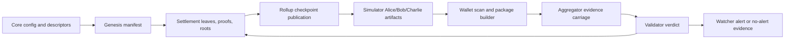

# Phase 059 Test Specification

**Phase:** 059-Core-Upgrade
**Date:** 2026-06-16
**Inputs:** `059-TODO.md`, `059-CONTEXT.md`, `059-SOURCE-AUDIT.md`,
`059-01-PLAN.md` through `059-10-PLAN.md`

## Workflow Status

Phase 059 is in `evidence-backed-closeout` mode. `059-01-SUMMARY.md` through
`059-09-SUMMARY.md` record implemented waves across core, storage, runtime,
wallet, and simulator seams. This document now remains the canonical test
contract and closeout index for the final Phase 059 verification wave.

Future/target wording from `059-TODO.md` and the referenced corpus remains
mandatory live Phase 059 scope. In the final packet, `target` only means a
named architecture concept whose implementation must stay explicitly marked as
deferred or non-goal when it is not part of the landed repository behavior.

## Closeout Snapshot

Implementation-backed evidence already exists for:

- canonical `z00z_core::{actions,policies,rights,vauchers}` vocabulary roots;
- additive genesis `policies` and `vouchers`;
- storage `VoucherLeaf` plus typed deltas and fee-support boundaries;
- runtime validator verdicts and watcher alerts for typed object packages;
- wallet typed object inventory, `wallet.object.*` RPC, and backup/import
  typed-object roundtrip;
- simulator `scenario_1` object-flow matrix with Alice/Bob/Charlie positive and
  negative evidence.

The final closeout wave must freeze exact command results, docs, UAT evidence,
and explicit deferrals in `059-EVIDENCE-LEDGER.md`, `059-UAT.md`,
`059-10-SUMMARY.md`, and `059-SUMMARY.md`.

## Test Strategy

Phase 059 changes the object model. Tests must cover object classes and object
interactions, not only new structs. Each implementation slice must add positive
and negative coverage for Assets, Vouchers, Rights, policy descriptors,
FeeEnvelope separation, storage roots/proofs, wallet projections, validator
verdicts, watcher alerts, and simulator evidence.

This file is the phase-local executable test contract. It is not a prose-only
checklist: every test below must either be implemented, explicitly linked to an
existing equivalent test, or recorded as a deliberate deferral in
`059-EVIDENCE-LEDGER.md`.

## Classification And Live Anchors

This classification is based on the current repository layout and must be
rechecked before implementation, because Phase 059 code may land in the same
files that currently provide only pre-059 anchors.

### TDD And Integration Targets

| Target | Existing anchor | Why it matters |
|---|---|---|
| Core asset/right/genesis validation. | `crates/z00z_core/src/assets/{test_policy_descriptor.rs,test_voucher_config.rs}`, `crates/z00z_core/src/rights/test_rights_config.rs`, `crates/z00z_core/tests/assets/test_rights_config.rs`, `crates/z00z_core/tests/genesis/test_*`. | Voucher and policy tests must extend current asset/right semantics through one canonical owner path instead of creating a second object model. |
| Storage settlement leaf/proof/root behavior. | `crates/z00z_storage/src/settlement/test_model.rs`, `test_live_recovery.rs`, `crates/z00z_storage/tests/test_right_leaf.rs`, `test_settlement_leaf.rs`, `test_batch_proof_support.rs`. | Voucher leaves and mixed deltas must share the existing `SettlementStateRoot` and proof path contracts. |
| Wallet persistence, scan, receive, RPC, backup. | `crates/z00z_wallets/src/db/redb_wallet_store/test_mod.rs`, `src/services/test_wallet_service.rs`, RPC method tests, backup importer/exporter tests. | Asset-only cash projection must survive typed object inventory expansion. |
| Runtime validator/watcher/rollup publication. | `crates/z00z_runtime/validators/tests/test_object_policy_verdicts.rs`, `crates/z00z_runtime/watchers/tests/test_object_alerts.rs`, aggregator tests, `crates/z00z_rollup_node/tests/test_settlement_theorem.rs`. | Validator verdicts, watcher alerts, and checkpoint publication must expose object-family evidence without secrets. |

### E2E Targets

| Target | Existing anchor | Why it matters |
|---|---|---|
| Simulator `scenario_1` staged flow. | `crates/z00z_simulator/src/scenario_1/stage_{1,4,5,6,11,13}.rs` and matching tests. | Alice/Bob/Charlie flows must validate object transfer, proof, wallet projection, root, verdict, alert, and checkpoint evidence. |
| Simulator artifact verification. | `crates/z00z_simulator/tests/test_scenario1_object_flows.rs`, `test_scenario1_stage_surface.rs`, `test_e2e_stage4.rs`, `test_stage6_checkpoint.rs`, `test_hjmt_e2e.rs`. | Negative and positive object flows must produce persisted, auditable artifacts rather than success logs only. |

### Skip Targets

| Target | Reason |
|---|---|
| Historical placeholder-directory rule for `crates/z00z_core/src/{actions,policies,rights,vauchers}`. | This closeout packet keeps the migration rule only as historical context: if a future rerun ever encounters an empty canonical directory again, tests must stay on the current live anchors until one canonical implementation home lands. On the current Phase 059 tree these directories are no longer empty. |
| Documentation-only edits in Phase 059. | They require traceability checks and review, not Rust unit tests. |
| Universal VM/oracle-heavy policy behavior. | Explicitly out of scope for Phase 059 MVP unless needed as a rejection/non-goal test. |

### Canonical Core Module Rule

- `assets` owns asset-specific behavior and may act as a compatibility facade.
- `actions` owns action ids, action descriptors, and action-pool semantics.
- `policies` owns policy ids, policy descriptors, condition descriptors, and canonical bytes or hashes.
- `rights` owns right-specific authority semantics.
- `vauchers` owns voucher config, backing, and lifecycle semantics.
- Compatibility re-exports are allowed, but tests must not treat the same semantic owner as canonical under two module trees.

## Mandatory Validation Order

Every Rust/test-affecting task must validate in this order:

1. Run `./.github/skills/smart-tests-bootstrap/scripts/bootstrap_tests.sh`
   first as a mandatory fail-fast gate.
2. If the bootstrap gate fails, stop, fix the issue, and rerun it before any
   broader validation.
3. Run targeted crate/scenario tests relevant to the slice.
4. Run `cargo test --release` when the slice affects Rust code, tests, public
   APIs, serialization, simulator behavior, or cross-crate contracts.
5. Run `./.github/prompts/gsd-review-tasks-execution.prompt.md`
   (`/GSD-Review-Tasks-Execution`) in YOLO mode at least 3 times and fix all
   issues and warnings. Stop only after at least 2 consecutive runs show no
   significant code issues.
6. If a git commit is needed after validation, use `/z00z-git-versioning`.

## Layer Coverage Matrix

| Layer | Positive coverage | Negative coverage |
|---|---|---|
| Core config | Parse assets, rights, policies, vouchers, descriptor ids, action ids, and condition descriptors. | Reject malformed sections, duplicate ids, value-bearing rights, unbacked vouchers, missing backing, overflow, and unknown condition classes. |
| Core genesis | Deterministic assets, rights, vouchers, policies, manifest entries, domain separation, and collision-free ids. | Derivation label reuse, terminal collision, wrong root generation, weak seed, missing backing, and invalid voucher lifecycle. |
| Policy/action descriptors | Stable canonical bytes and hashes for policy/action pools and deterministic condition descriptors. | Mutable descriptor bytes, unknown policy, action not in pool, unsupported condition tier, and descriptor hash mismatch. |
| Storage leaf codec | Terminal, Right, and Voucher serde/bincode roundtrip with stable family tags. | Unknown tags, cross-family decode, path mismatch, malformed voucher value/lifecycle fields, and old tag regression. |
| Storage proofs | Inclusion, deletion, nonexistence, and batch proof validation for all families. | Wrong family proof, stale root, wrong marker, wrong batch tag, missing deletion fact, and malformed nonexistence proof. |
| Storage deltas | Apply mixed typed deltas with deleted inputs, created outputs, updated residual vouchers, fees, policy hashes, prior root, and expected new root. | Conservation mismatch, right value contribution, double redeem, residual mismatch, voucher used as cash, and fee boundary confusion. |
| Wallet DB | Persist, list, restore, migrate, and index asset, voucher, and right payloads behind one inventory facade. | Old payload breakage, checksum mismatch, unknown descriptor spendability, illegal status transition, and quarantine bypass. |
| Wallet services | Scan classify, quarantine, reserve, package, confirm typed actions, and preserve asset-only balance. | Voucher counted as cash, right counted as value, expired/revoked/missing right, unknown policy, forced voucher acceptance, and stale descriptor. |
| Wallet RPC | Existing asset RPC remains cash-only; typed object/voucher/right RPC exposes lifecycle and quarantine state. | Asset RPC accepting voucher/right ids, object RPC bypassing policy, forced acceptance, and in-memory-only quarantine. |
| Runtime validators | Verify presence, policy match, action membership, required rights, signatures, attestations, lifecycle, conservation, and fee separation. | Unbacked issue, double redeem, replay, wrong scope, consumed right, mutable descriptor, stale root, and invalid lifecycle. |
| Watchers | Emit alerts for invalid backing, unknown policy, wrong family proof, replay, double redeem, forced acceptance, and value-bearing rights. | Silent invalid packages, stale root acceptance, duplicate redemption not reported, and expired object use not alerted. |
| Simulator | Alice/Bob/Charlie positive paths for asset transfer, voucher issue/accept/redeem/transfer/refund/expiry, right grant/delegate/consume/revoke/expiry/challenge, fee support. | Unbacked voucher, non-transferable voucher transfer, missing/expired/revoked right, replay, double redeem, wrong-family proof, forced acceptance, and voucher-as-cash. |
| Fuzz/property | Leaf codec, proof envelopes, amount/residual conservation, descriptor hashes, and wallet status transitions. | Malformed inputs must fail closed and never panic. |

## Test ID Taxonomy

Use these IDs in test names, simulator artifact names, and
`059-EVIDENCE-LEDGER.md`:

| Prefix | Test class | Expected home |
|---|---|---|
| `059-UT-CORE-*` | Core unit tests for object vocabulary, policy descriptors, config, genesis. | `crates/z00z_core/src/{assets,actions,policies,rights,vauchers}/test_*.rs` or `crates/z00z_core/tests/**/test_*.rs` |
| `059-UT-STOR-*` | Storage unit tests for leaves, tags, proofs, deltas, recovery. | `crates/z00z_storage/src/settlement/test_*.rs` or `crates/z00z_storage/tests/test_*settlement*.rs` |
| `059-UT-WAL-*` | Wallet DB/service/RPC unit and integration tests. | `crates/z00z_wallets/src/**/test_*.rs` or `crates/z00z_wallets/tests/test_*.rs` |
| `059-UT-RUN-*` | Runtime validator, aggregator, watcher, rollup tests. | `crates/z00z_runtime/*/tests/test_*.rs`, `crates/z00z_rollup_node/tests/test_*.rs` |
| `059-E2E-SIM-*` | Simulator Alice/Bob/Charlie E2E flows and examples. | `crates/z00z_simulator/tests/test_scenario1_object_flows.rs`, related `test_scenario1_*` integration files, and `crates/z00z_simulator/src/scenario_1/*` |
| `059-PROP-*` | Property/fuzz tests for encodings, proof envelopes, conservation, status transitions. | crate-local fuzz/property targets or release-gated property tests |
| `059-REG-*` | Regression/backcompat tests for old assets, rights, terminal/right leaves, wallet rows. | same crate as the affected compatibility seam |

Closeout note: early planning aliases such as `test_phase059_*` and
single-purpose `test_*` placeholders were resolved onto existing canonical test
homes on the live tree. The file anchors below therefore name the landed homes,
not the earlier placeholder filenames.

## Shared Fixtures And Actors

All E2E and cross-crate integration tests must use deterministic fixtures so
failures are reproducible:

| Fixture | Required contents | Used by |
|---|---|---|
| `phase059_clean_asset_fixture` | Alice owns one final spendable asset, fixed cash policy, known membership proof, valid owner signature material. | Asset transfer, voucher backing, fee support. |
| `phase059_backed_voucher_fixture` | Voucher policy, action pool, issuer/holder/beneficiary commitments, face value, remaining value, reserve/backing commitment, expiry, replay nonce. | Voucher accept/redeem/refund/expiry tests. |
| `phase059_transferable_voucher_fixture` | Same as backed voucher plus transfer action and holder-change rule that preserves beneficiary/refund authority. | Voucher transfer to Charlie. |
| `phase059_non_transferable_voucher_fixture` | Voucher policy without transfer action. | Transfer rejection tests. |
| `phase059_right_fixture` | Right class, scope, holder/control/beneficiary commitments, validity window, use nonce, zero-value committed state. | Right-gated redeem, delegation, consume, revoke. |
| `phase059_fee_envelope_fixture` | Payer/sponsor commitment, budget units, expiry, transition id, replay key, no object value semantics. | Fee separation tests. |
| `phase059_unknown_policy_fixture` | Object leaf with missing or unavailable descriptor preimage. | Wallet quarantine and validator fail-closed tests. |

Actor roles:

| Actor | Must exercise |
|---|---|
| Alice | Initial asset owner, voucher issuer, right issuer, refund target, revocation authority where policy permits. |
| Bob | Cash receiver, voucher receiver/holder, right holder, redeemer, rejecting receiver. |
| Charlie | Downstream cash receiver, delegated-right holder, voucher transferee, replay/late-action negative actor. |

## Canonical Example Values

Tests may use equivalent domain types, but these relationships must hold so
examples stay realistic, measurable, and comparable across crates:

| Symbol | Example value | Required relationship |
|---|---:|---|
| `ASSET_FACE_VALUE` | `1000` | Alice starts with enough final cash to fund voucher, transfer, and fee examples. |
| `VOUCHER_FACE_VALUE` | `600` | Backed by consumed or reserved source value; never mints new value. |
| `PARTIAL_REDEEM_VALUE` | `250` | Less than voucher remaining value and inside the policy cap. |
| `VOUCHER_RESIDUAL_VALUE` | `350` | Equals `VOUCHER_FACE_VALUE - PARTIAL_REDEEM_VALUE`. |
| `FEE_BUDGET_UNITS` | `10` | Attached through `FeeEnvelope` only, not voucher backing or right value. |
| `RIGHT_USE_LIMIT` | `1` | One successful use consumes the right or nonce; replay fails. |
| `EXPIRY_EPOCH` | `42` | Voucher or right becomes expired after this epoch/root boundary. |
| `LATE_REDEEM_EPOCH` | `43` | Must reject late redeem or late right use. |
| `BOB_ACCEPTANCE_REQUIRED` | `true` | Voucher receipt is not cash receipt; receiver must accept or reject explicitly. |

Every scenario using different numbers must still assert the same
conservation, residual, replay, and expiry equations.

## Critical Integration Path Contracts

These contracts define the cross-crate paths that must be proven end to end.
They prevent a parallel object layer by requiring each implementation to extend
the existing core, storage, wallet, runtime, and simulator seams.

| ID | Integration path | Required proof | Pass/fail condition |
|---|---|---|---|
| `059-PATH-001` | Core config to genesis to manifest. | Assets, Rights, Vouchers, policies, action pools, and descriptors parse from one config model; deterministic descriptor hashes and bootstrap voucher backing are exported in the genesis manifest. | Pass when one manifest references every object artifact with deterministic ids; fail on missing object class, duplicate id, unbacked voucher, or descriptor hash drift. |
| `059-PATH-002` | Genesis manifest to storage settlement state. | Manifest creates Terminal, Right, and Voucher leaves under one `SettlementStateRoot` and one `SettlementPath` scheme; old Terminal/Right tags remain stable. | Pass when mixed-family roots and inclusion/nonexistence proofs verify; fail if vouchers require a separate settlement tree or reinterpret old tags. |
| `059-PATH-003` | Wallet scan to inventory to projections. | Wallet classifies leaf family first, persists typed object payloads behind the existing inventory facade, and exposes separate cash, voucher, right, and quarantine projections. | Pass when Assets alone affect spendable cash; fail if Voucher or Right appears in spendable balance or unknown policy bypasses quarantine. |
| `059-PATH-004` | Wallet package builder to aggregator to validator. | Package binds live inputs, typed outputs, selected action, descriptor hash, required rights, signatures, roots, and fee support; aggregator carries evidence without becoming semantic policy authority. | Pass when validator can independently accept or reject from package evidence; fail if aggregator-local interpretation is required for correctness. |
| `059-PATH-005` | Validator to typed storage delta to watcher. | Accepted transitions apply exact typed delta and expected root; rejected transitions leave root unchanged; watcher records precise object-family alerts. | Pass when verdict, root behavior, and alert evidence match for each positive and negative case; fail on silent mutation or generic rejection. |
| `059-PATH-006` | Simulator stage contract. | Stage 1 covers genesis/config, Stage 4 typed packages and witnesses, Stage 5 object-family receiver behavior, Stage 6 bundle/checkpoint, Stage 11 scan/apply/Charlie handoff, and Stage 13 HJMT/proof examples. | Pass when Alice/Bob/Charlie artifacts prove each stage transition; fail if a stage only logs success without wallet, root, verdict, and proof assertions. |
| `059-PATH-007` | Backup/restore to wallet projections. | Typed payloads, descriptor references, private openings, lifecycle state, and quarantine records restore through existing wallet backup seams. | Pass when restored wallet projections match pre-backup state without leaking secrets; fail if restore drops voucher/right/quarantine state or converts claims to cash. |
| `059-PATH-008` | Rollup/checkpoint publication evidence. | Object-family verdict and publication evidence are exposed without wallet secrets; soft admission is distinguishable from final settlement. | Pass when final user-visible settlement waits for checkpoint/publication proof; fail if soft acceptance is treated as finality. |

## Mermaid Flow



The flow passes only when every boundary preserves typed object semantics:
Assets remain final cash, Vouchers remain conditional value, Rights remain
zero-value authority, and FeeEnvelope remains support-only.

## Critical E2E Scenario Catalog

The simulator release lane must produce persisted artifacts for:

| ID | Behavior proven | Path and setup | Required assertions | Pass/fail condition |
|---|---|---|---|---|
| `059-E2E-SIM-001` | Clean cash remains one-sided final value. | Alice sends Asset to Bob; Bob sends Asset to Charlie through existing `scenario_1` stages. | Asset proofs verify under `SettlementStateRoot`; wallet spendable balance changes only for Assets; no voucher/right state appears; checkpoint finality is required before final settlement claim. | Pass when Bob/Charlie wallet projections show only clean cash and storage root reflects accepted asset delta; fail if receiver acceptance policy or voucher/right semantics are required. |
| `059-E2E-SIM-002` | Fully backed voucher issue, accept, and full redeem produce clean asset output. | Alice reserves/consumes Asset value, issues Voucher to Bob, Bob explicitly accepts, Bob redeems fully. | Policy/action descriptor hash matches; backing proof is bound; voucher is deleted; asset output equals remaining voucher value; right value is not counted; root update is deterministic. | Pass when voucher is no longer live, Bob receives clean Asset, and conservation holds; fail on missing backing, descriptor mismatch, or residual voucher left unintentionally. |
| `059-E2E-SIM-003` | Partial redeem preserves exact residual voucher accounting. | Alice issues backed Voucher to Bob; Bob redeems a valid partial amount. | Redeemed amount is within policy cap; asset output equals redeemed amount; residual Voucher remaining value equals prior remaining minus redeemed amount; replay nonce changes or consumed nonce is recorded. | Pass when asset output plus residual voucher equals original conditional value; fail on rounding, overflow, residual mismatch, or double redeem. |
| `059-E2E-SIM-004` | Voucher reject/refund is bounded and not arbitrary clawback. | Alice offers Voucher to Bob; Bob rejects; refund routes to declared refund target. | Receiver rejection witness exists; refund precondition is policy-declared; already-redeemed value cannot be clawed back; root update deletes or closes the voucher. | Pass when refund path matches policy and no hidden sender take-back exists; fail if issuer can refund without rejection/expiry/unmet-redeem condition. |
| `059-E2E-SIM-005` | Voucher expiry prevents late redeem and preserves declared outcome. | Alice offers Voucher to Bob; Bob does not accept/redeem; expiry transition executes; Bob attempts late redeem. | Expiry proof or epoch/root witness is bound; late redeem rejected with precise verdict; watcher emits expired-use alert where applicable. | Pass when expiry state is recorded and late redeem produces no storage root update; fail if late redeem succeeds or rejection lacks evidence. |
| `059-E2E-SIM-006` | Transferable voucher can move holder without silently changing beneficiary/refund authority. | Alice issues transferable Voucher to Bob; Bob transfers to Charlie; Charlie accepts/redeems if policy permits. | Transfer action is in action pool; holder changes; beneficiary/refund authority stays policy-bound; signatures bind old and new holder. | Pass when Charlie's wallet sees conditional claim and redeem succeeds only under policy; fail if transfer changes beneficiary/refund authority implicitly. |
| `059-E2E-SIM-007` | Non-transferable voucher transfer is rejected. | Alice issues non-transferable Voucher to Bob; Bob attempts transfer to Charlie. | Action membership check fails; validator verdict names disallowed action; storage root remains unchanged; Bob's wallet state records failed action/quarantine as appropriate. | Pass when transfer is rejected without state mutation; fail if Charlie receives usable claim. |
| `059-E2E-SIM-008` | Right-gated redeem uses authority without value. | Alice grants Right to Bob; Bob redeems a right-gated Voucher. | Right proof is present, in scope, unexpired, unrevoked, and action-bound; right contributes zero to conservation; voucher backing funds redemption. | Pass when redemption succeeds and right state is consumed/updated according to policy; fail if redemption succeeds without right or if right contributes value. |
| `059-E2E-SIM-009` | Delegated right narrows authority and blocks replay. | Alice grants delegable Right to Bob; Bob delegates narrower Right to Charlie; Charlie uses once; replay repeats same use. | Child scope is subset of parent; lifetime is shorter/equal; nonce consumed on first use; second use rejected with replay verdict and watcher alert. | Pass when first use succeeds and replay fails without root mutation; fail if child right widens authority or replay succeeds. |
| `059-E2E-SIM-010` | Revoked or expired right blocks downstream action. | Alice grants Right to Bob, then revokes it or waits past expiry; Bob/Charlie attempts right-gated action. | Revocation/expiry evidence is committed; action verifier checks latest right state; rejection is precise. | Pass when action fails and watcher records revoked/expired-right evidence; fail if stale right authorizes action. |
| `059-E2E-SIM-011` | Unbacked voucher issuance fails closed. | Alice attempts Voucher issue without reserve/backing evidence. | Validator rejects missing backing; wallet must not show spendable cash or accepted voucher; storage root unchanged. | Pass when no live voucher is created and verdict is `invalid_backing` or equivalent; fail if object enters live state. |
| `059-E2E-SIM-012` | Voucher-as-cash and right-as-value are blocked. | Bob attempts to use Voucher as cash input; Bob attempts to use Right as value input. | Wallet builder rejects before submission where possible; validator rejects if submitted; value totals exclude rights and only include Assets/Vouchers according to action. | Pass when both misuse attempts fail with no storage root update; fail if spendable balance includes Voucher/Right. |
| `059-E2E-SIM-013` | Wrong-family proof cannot validate another object family. | Submit asset proof for Voucher, right proof for Asset, voucher proof for Right. | Family tag, path, marker leaf, and proof verifier reject cross-family substitution; root unchanged. | Pass when all cross-family combinations reject; fail if any family proof is accepted for another family. |
| `059-E2E-SIM-014` | FeeEnvelope is support-only. | Attach fee envelope to voucher/right flow and execute accepted action. | Fee envelope pays publication/verification support only; it is not voucher backing and not right authority; replay key and expiry checked. | Pass when valid fee support succeeds separately and invalid fee-as-value/authority fails; fail if fee envelope can satisfy backing or rights. |
| `059-E2E-SIM-015` | Unknown policy fails closed and quarantines. | Wallet scans object with unavailable descriptor; validator receives package with unknown policy hash. | Wallet records durable quarantine and excludes from spendable balance; validator rejects unknown policy; watcher may alert. | Pass when object cannot be spent/redeemed/used until descriptor is available; fail if wallet-local policy text alone authorizes action. |

Each E2E scenario must persist:

- input fixture manifest;
- selected policy/action descriptor hashes;
- prior root and expected root;
- validator verdict;
- watcher alert or explicit "no alert expected" record;
- wallet projection before and after;
- simulator report with detected problem and proposed fix for negative cases.

## Unit And Integration Test Catalog

| ID | Test target | Canonical live home or extension seam | Assertions |
|---|---|---|---|
| `059-UT-CORE-001` | Object-family vocabulary. | Extend `crates/z00z_core/src/assets/test_policy_descriptor.rs`; keep `crates/z00z_core/src/assets/object_family.rs` as the one semantic owner surface. | Asset, Voucher, Right, and FeeEnvelope roles are distinct; `assets` stays a facade rather than a duplicate semantic owner; native Asset cannot carry arbitrary action pool; target-only names are not exposed as live behavior before implementation. |
| `059-UT-CORE-002` | Policy/action descriptor canonicalization. | Extend `crates/z00z_core/src/assets/test_policy_descriptor.rs`; descriptor implementations stay under `crates/z00z_core/src/{actions,policies}/`. | Canonical bytes are stable; descriptor hash changes on semantic change; action ordering is deterministic; mutable-by-name policy changes are rejected. |
| `059-UT-CORE-003` | Voucher config validation. | Extend `crates/z00z_core/src/assets/test_voucher_config.rs`; canonical voucher types stay under `crates/z00z_core/src/vauchers/`. | Requires issuer/holder/beneficiary, backing/reserve, face/remaining value, lifecycle, policy id, action pool id, validity, replay nonce; rejects unbacked and overflow values. |
| `059-UT-CORE-004` | Right zero-value validation. | Extend `crates/z00z_core/src/rights/test_rights_config.rs`; keep `crates/z00z_core/tests/assets/test_rights_config.rs` only as a compatibility harness while migration is in flight. | Rejects budget, fee, payer, sponsor, reserve, amount, nominal, backing, and support fields when they affect value. |
| `059-UT-CORE-005` | Genesis compatibility. | Extend `crates/z00z_core/tests/genesis/test_config.rs` and `test_validation.rs`. | Existing asset/right configs remain valid or have explicit migration errors; missing optional vouchers/policies do not break legacy fixtures unless policy decides otherwise. |
| `059-UT-CORE-006` | Genesis policies and vouchers. | Extend `crates/z00z_core/tests/genesis/test_genesis_vouchers.rs` and `test_genesis_policies.rs`. | Deterministic output, no id collisions, voucher backing binds to reserve source, genesis voucher is marked bootstrap-only. |
| `059-UT-CORE-007` | Domain separation. | Extend `crates/z00z_core/tests/genesis/test_cross_network_isolation.rs`. | Derivation binds network, chain id, object class, object id, index, root generation, descriptor hash; voucher labels do not reuse right labels. |
| `059-UT-STOR-001` | Voucher leaf codec. | Extend `crates/z00z_storage/tests/test_settlement_leaf.rs` and family-shape coverage in `crates/z00z_storage/src/settlement/test_model.rs`. | Human-readable serde tag and binary tag are stable; unknown tag rejects; old Terminal/Right tags remain unchanged. |
| `059-UT-STOR-002` | Settlement leaf family proof checks. | Extend `crates/z00z_storage/src/settlement/test_model.rs` and proof tests. | Terminal, Right, Voucher inclusion/deletion/nonexistence proofs are family-specific. |
| `059-UT-STOR-003` | Batch proof compatibility. | Extend `crates/z00z_storage/tests/test_batch_proof_support.rs`. | Voucher batch tag does not reuse existing tags; wrong marker and wrong batch tag reject. |
| `059-UT-STOR-004` | Typed deltas and conservation. | Extend `crates/z00z_storage/tests/test_store_api.rs` and supporting model/recovery coverage instead of creating a parallel Phase-059-only delta file. | Deleted inputs, created outputs, residual vouchers, fee envelope, selected action, descriptor hash, prior root, and expected root are bound; Assets plus Vouchers conserve value; Rights contribute zero. |
| `059-UT-STOR-005` | Recovery/journal/cache compatibility. | Extend `crates/z00z_storage/src/settlement/test_live_recovery.rs`. | Old Terminal/Right rows decode; Voucher rows recover; cache family code migration is deterministic. |
| `059-UT-WAL-001` | Wallet owned-object persistence. | Extend inline tests in `crates/z00z_wallets/src/db/redb_wallet_store/owned_objects.rs` and shared DB coverage in `crates/z00z_wallets/src/db/redb_wallet_store/test_mod.rs`. | Asset, Voucher, and Right payloads persist behind one inventory facade; existing `OwnedAssetPayload` version remains readable. |
| `059-UT-WAL-002` | Wallet projections. | Extend wallet service tests. | Spendable cash includes Assets only; voucher claims and right inventory are separate projections; quarantined objects are excluded. |
| `059-UT-WAL-003` | Scan/receive classification. | Extend receive action tests. | Wallet classifies leaf family before payload recovery; voucher/right recovery does not use asset-only stealth assumptions. |
| `059-UT-WAL-004` | Package builder rejection. | Extend wallet package builder tests in `crates/z00z_wallets/src/adapters/rpc/methods/asset_impl/test_asset_impl.rs` and wallet service coverage. | Rejects voucher-as-cash, right-as-value, missing/expired/revoked/consumed/out-of-scope right, stale descriptor, forced acceptance, and fee-boundary confusion. |
| `059-UT-WAL-005` | RPC and backup. | Extend `crates/z00z_wallets/src/adapters/rpc/methods/test_*` and backup tests. | `asset.send`/`asset.receive` remain cash-only; typed object RPC exposes lifecycle/quarantine; backup restores descriptor refs and quarantine without leaking secrets. |
| `059-UT-RUN-001` | Validator verdicts. | Extend `crates/z00z_runtime/validators/tests/test_object_policy_verdicts.rs`. | Verdicts distinguish unknown policy, invalid backing, wrong family proof, missing/expired/revoked/consumed right, replay, double redeem, forced acceptance, stale root, and fee boundary. |
| `059-UT-RUN-002` | Aggregator carriage. | Extend aggregator ingress/planner tests. | Aggregator carries typed package evidence and route-bound deltas but does not decide policy semantics. |
| `059-UT-RUN-003` | Watcher alerts. | Extend `crates/z00z_runtime/watchers/tests/test_object_alerts.rs`. | Alerts exist for invalid backing, unknown policy, wrong family proof, replay, double redemption, expired use, forced acceptance, value-bearing right, and stale roots. |
| `059-UT-RUN-004` | Rollup publication evidence. | Extend `crates/z00z_rollup_node/tests/test_settlement_theorem.rs`. | Object-family verdict/publication fields are visible without exposing wallet secrets. |
| `059-PROP-001` | Descriptor hash stability. | Resolve to crate-local descriptor canonical-byte property coverage. | Equivalent descriptor encodings hash identically; semantic differences hash differently; malformed descriptor rejects without panic. |
| `059-PROP-002` | Leaf/proof envelopes. | Resolve to storage fuzz/property coverage such as family-envelope and malformed-input guards. | Arbitrary bytes never panic; only canonical encodings accept; wrong family never verifies. |
| `059-PROP-003` | Conservation and residual arithmetic. | Resolve to core/storage property coverage for voucher residual and conservation paths. | For valid partial redeem, input voucher amount equals asset output plus residual; overflow and negative residual reject. |
| `059-PROP-004` | Wallet status transitions. | Resolve to wallet property or regression coverage for illegal typed-object state transitions. | Illegal transitions such as redeemed to offered, revoked to active, quarantined to spendable without descriptor, and consumed right reuse reject. |

## Regression Test Catalog

| ID | Regression protected | Required assertion |
|---|---|---|
| `059-REG-001` | Existing asset transfer tests still represent clean cash. | Existing asset transfer, split, merge, fee, and receive tests pass without voucher/right acceptance requirements. |
| `059-REG-002` | Existing rights genesis remains compatible. | Current rights configs still generate deterministic right artifacts and gain zero-value/forbidden-field coverage without deleting existing semantics. |
| `059-REG-003` | Existing Terminal/Right storage rows and proofs remain decodable. | Existing binary tags, human-readable tags, proof markers, batch tags, and cache codes are unchanged. |
| `059-REG-004` | Existing wallet asset rows remain readable. | `PAYLOAD_VERSION_OWNED_ASSET = 1` rows restore, list, reserve, and spend as before. |
| `059-REG-005` | Existing `scenario_1` stage order remains stable. | Stage 1, 4, 5, 6, 11, and 13 keep runner contract compatibility while gaining object-family lanes. |
| `059-REG-006` | Existing checkpoint/publication finality semantics remain intact. | Soft confirmation is never reported as final settlement; checkpoint evidence is required for final state. |

## Cryptographic And Settlement Invariants

Every test that builds or verifies a package must assert the relevant invariant:

| Invariant | Required observation |
|---|---|
| Canonical descriptor binding | Hash is computed from canonical bytes; package binds descriptor hash and action id. |
| Domain separation | Genesis and package derivations include network, chain id, object family, object id, index or nonce, root generation, and descriptor hash where applicable. |
| Signature binding | Signatures bind object family, selected action, live inputs, intended outputs, prior root, descriptor hash, and fee support reference when present. |
| Proof statement completeness | Proofs bind `SettlementPath`, leaf family, prior state, action, typed delta, and expected root. |
| Conservation | Assets plus Vouchers conserve value across issue/redeem/refund/partial redeem; Rights always contribute zero. |
| Root continuity | Accepted transition changes root exactly as expected; rejected transition leaves root unchanged. |
| Replay resistance | Use nonce, redemption nonce, package id, or equivalent replay key is consumed or rejected on reuse. |
| Wallet-local privacy split | Storage sees commitments/proofs/descriptors only; wallet-local secrets/openings do not enter storage state or watcher reports. |
| Fee boundary | FeeEnvelope cannot become voucher backing, right authority, or object value. |
| Checkpoint finality | Soft admission is not final settlement; final user-visible settlement requires checkpoint/publication evidence. |

## Clarifying Assertion Snippets

These snippets are assertion shapes, not final APIs. Replace placeholder names
with the concrete Phase 059 implementation types in the owning wave.

```rust
// Voucher partial redeem must conserve conditional value exactly.
assert_eq!(asset_output_value + residual_voucher_value, prior_voucher_value);
assert_eq!(asset_output_value, PARTIAL_REDEEM_VALUE);
assert_eq!(residual_voucher_value, VOUCHER_RESIDUAL_VALUE);
assert!(right_value_contribution.is_zero());
```

```rust
// Rejected transitions must not mutate the settlement root.
let prior_root = state.root();
let verdict = validator.verify(package);
assert!(verdict.is_rejected());
assert_eq!(state.root(), prior_root);
assert_eq!(watcher.last_alert().object_family(), expected_family);
```

```rust
// Wallet cash projection must remain asset-only.
assert_eq!(wallet.spendable_cash_total(), asset_total);
assert!(!wallet.spendable_cash_ids().contains(&voucher_id));
assert!(!wallet.spendable_cash_ids().contains(&right_id));
assert!(wallet.quarantine().contains_policy_hash(unknown_policy_hash));
```

## Negative Rejection Matrix

| ID | Rejection case | Must reject at | Required evidence |
|---|---|---|---|
| `059-NEG-001` | Native Asset has arbitrary per-instance action pool. | Core validation and validator. | `cash_policy_only` or equivalent error; no accepted package. |
| `059-NEG-002` | Voucher has no backing/reserve. | Core config/genesis and validator. | Invalid backing verdict; root unchanged. |
| `059-NEG-003` | Voucher partial redeem residual is wrong. | Storage delta and validator. | Residual mismatch verdict; no created residual accepted. |
| `059-NEG-004` | Voucher double redeem. | Validator, storage model, watcher. | Replay/double-redeem verdict and watcher alert; root unchanged. |
| `059-NEG-005` | Unknown policy descriptor. | Wallet and validator. | Durable quarantine plus fail-closed verdict. |
| `059-NEG-006` | Right carries value or fee semantics. | Core validation, storage, wallet, validator. | Value-bearing-right rejection; conservation excludes right. |
| `059-NEG-007` | Right out of scope, expired, revoked, consumed, or missing. | Wallet package builder and validator. | Precise right failure verdict; action rejected. |
| `059-NEG-008` | Delegated Right widens authority. | Core/right policy validator. | Monotonic attenuation rejection. |
| `059-NEG-009` | Wrong-family proof. | Storage proof verifier and validator. | Family mismatch verdict; root unchanged. |
| `059-NEG-010` | FeeEnvelope used as backing or authority. | Validator and storage delta. | Fee boundary violation; no object state mutation. |
| `059-NEG-011` | Wallet counts Voucher or Right as spendable cash. | Wallet DB/service/RPC tests. | Spendable balance assertion fails in test; implementation must exclude object. |
| `059-NEG-012` | Forced voucher acceptance via asset RPC or cash lane. | Wallet RPC/service and simulator. | Receiver sees offer/quarantine, not spendable cash. |
| `059-NEG-013` | Mutable descriptor changes semantics after issuance. | Core descriptor and validator. | Descriptor hash mismatch or policy mismatch verdict. |
| `059-NEG-014` | Aggregator treats soft confirmation as finality. | Runtime/simulator. | Soft admission remains non-final; final settlement waits for checkpoint. |

## Examples Required In Documentation And Simulator Reports

The implementation must include realistic examples that demonstrate:

- clean cash payment remains simple and one-sided;
- backed voucher offer/accept/redeem produces clean cash;
- partial voucher redeem produces exact residual claim;
- refund after rejection or expiry is bounded and not clawback;
- right-gated voucher redeem uses authority without value;
- delegated right can authorize Charlie once and replay fails;
- unknown-policy object is quarantined and fail-closed;
- wrong-family proof and fee-boundary violations are rejected.

Examples pass only when they include setup, action, expected state transition,
expected evidence artifacts, and expected rejection reason for negative cases.

## Acceptance Gates

- Each implementation plan adds tests in the same slice as the behavior change.
- Storage proof tests cover Terminal, Right, and Voucher families in both
  inclusion and nonexistence paths.
- Wallet tests prove spendable cash excludes Vouchers and Rights.
- Validator and watcher tests include exact rejection reasons, not only boolean
  failure.
- Simulator failure artifacts name the detected problem and proposed fix.
- `cargo test --release` is required before implementation closeout unless the
  slice is explicitly docs-only and records that fact.
- `059-EVIDENCE-LEDGER.md` links each test ID above to implementation test
  files, commands, simulator artifacts, or explicit deferrals.
- No E2E scenario passes on a success log alone; it must assert wallet state,
  validator verdict, storage root behavior, watcher/report evidence, and
  checkpoint/finality status where applicable.
