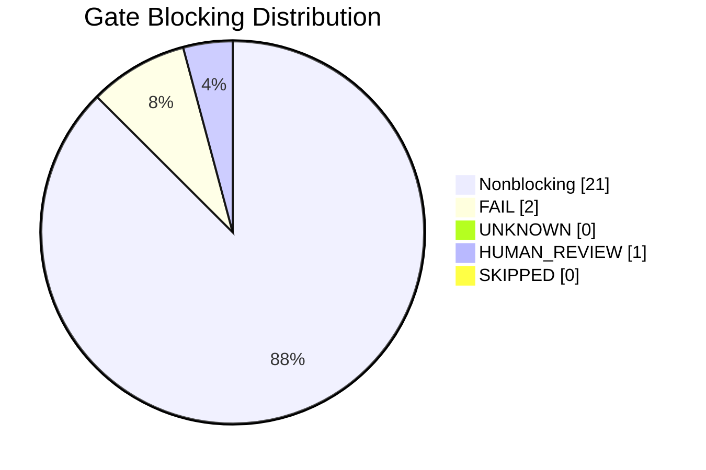
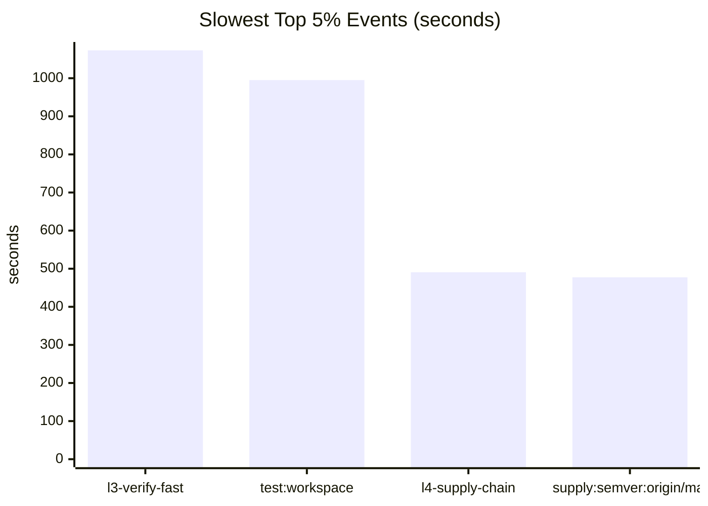

<!-- z00z-orchestrator-report
scope=project
target=project
levels=l0,l1,l2,l3,l4
mode=report
format=.github/skills/z00z-verification-orchestrator/FORMAT.md
-->
# Z00Z Verification Orchestrator Report

[TOC]

## 🎯 Executive Verdict

- Overall status: `FAIL`
- Scope: `project`
- Mode: `report`
- Levels: `l0,l1,l2,l3,l4`
- Run root: `reports/z00z-verification-orchestrator-20260618-170025`
- Evidence basis: `24` gates, `80` profiling events, `5689` tracked files inventoried
- Blocking counts: fail `2`, unknown `0`, human-review `1`, skipped `0`
- Integration contract: leaked output gates `0`; crate-unmapped files `0`

## 📦 Evidence Provenance

- Generated UTC: `2026-06-18T17:39:51Z`
- Run root: `reports/z00z-verification-orchestrator-20260618-170025`
- Timestamp stamp: `20260618-170025`
- Report format: `.github/skills/z00z-verification-orchestrator/FORMAT.md`
- Stale verifier run roots trashed before start: `1`
- External interferer processes killed: `0`
- Mode: `report`
- Scope: `project`
- Target: `project`
- Levels: `l0,l1,l2,l3,l4`
- Release profile args: `--release`
- Cache root: `reports/z00z-verification-orchestrator-20260618-170025/cache`
- Cargo home: `reports/z00z-verification-orchestrator-20260618-170025/cache/cargo-home`
- Cargo install root: `reports/z00z-verification-orchestrator-20260618-170025/cache/cargo-install`
- Canonical tmp root: `reports/z00z-verification-orchestrator-20260618-170025/tmp20260618-170025`
- Specs runtime root: `reports/z00z-verification-orchestrator-20260618-170025/specs20260618-170025`
- Verification runtime root: `reports/z00z-verification-orchestrator-20260618-170025/verification20260618-170025`
- Fuzz runtime root: `reports/z00z-verification-orchestrator-20260618-170025/fuzz20260618-170025`
- Cargo target dir: `reports/z00z-verification-orchestrator-20260618-170025/target`
- Python bytecode writes disabled: `1`
- Protected vendor path touched: `0`
- Core evidence paths: `reports/z00z-verification-orchestrator-20260618-170025/logs`, `reports/z00z-verification-orchestrator-20260618-170025/profiling/events.tsv`, `reports/z00z-verification-orchestrator-20260618-170025/profiling/summary.json`, `reports/z00z-verification-orchestrator-20260618-170025/profiling/tool-availability.json`, `reports/z00z-verification-orchestrator-20260618-170025/profiling/resources-summary.json`, `reports/z00z-verification-orchestrator-20260618-170025/profiling/run-footprint.json`, `reports/z00z-verification-orchestrator-20260618-170025/profiling/hjmt-summary.json`, `reports/z00z-verification-orchestrator-20260618-170025/security/adversarial-summary.json`
- Coverage evidence paths: `reports/z00z-verification-orchestrator-20260618-170025/coverage/manifest.tsv`, `reports/z00z-verification-orchestrator-20260618-170025/coverage/summary.json`
- Runtime bootstrap summary path: `reports/z00z-verification-orchestrator-20260618-170025/runtime-bootstrap-summary.json`
- Report validation summary: `reports/z00z-verification-orchestrator-20260618-170025/report-validation.json`

## 🚦 Gate Matrix

| Gate | Checker module | Status | Elapsed (s) | Log | Primary artifacts |
| --- | --- | --- | --- | --- | --- |
| `l0-docs` | `.github/skills/z00z-l0-spec-gate/scripts/check-docs.sh` | `FAIL` | `2.067` | `reports/z00z-verification-orchestrator-20260618-170025/logs/l0-docs.log` | `reports/z00z-verification-orchestrator-20260618-170025/logs/l0-docs.log; reports/z00z-verification-orchestrator-20260618-170025/profiling/resources/l0-docs.time` |
| `l1-alloy` | `.github/skills/z00z-l1-protocol-model-gate/scripts/run-alloy.sh` | `MODEL_CHECKED` | `0.451` | `reports/z00z-verification-orchestrator-20260618-170025/logs/l1-alloy.log` | `reports/z00z-verification-orchestrator-20260618-170025/specs20260618-170025/alloy; reports/z00z-verification-orchestrator-20260618-170025/profiling/resources/l1-alloy.time` |
| `l1-apalache` | `.github/skills/z00z-l1-protocol-model-gate/scripts/run-apalache.sh` | `MODEL_CHECKED` | `11.395` | `reports/z00z-verification-orchestrator-20260618-170025/logs/l1-apalache.log` | `reports/z00z-verification-orchestrator-20260618-170025/verification20260618-170025/l1/apalache; reports/z00z-verification-orchestrator-20260618-170025/profiling/resources/l1-apalache.time` |
| `l1-tla` | `.github/skills/z00z-l1-protocol-model-gate/scripts/run-tla.sh` | `MODEL_CHECKED` | `1.341` | `reports/z00z-verification-orchestrator-20260618-170025/logs/l1-tla.log` | `reports/z00z-verification-orchestrator-20260618-170025/verification20260618-170025/l1/tla-states; reports/z00z-verification-orchestrator-20260618-170025/verification20260618-170025/l1/tla-user; reports/z00z-verification-orchestrator-20260618-170025/profiling/resources/l1-tla.time` |
| `l2-aeneas` | `.github/skills/z00z-code-to-logic-gate/scripts/run-aeneas.sh` | `TESTED` | `0.999` | `reports/z00z-verification-orchestrator-20260618-170025/logs/l2-aeneas.log` | `reports/z00z-verification-orchestrator-20260618-170025/verification20260618-170025/code-to-logic; reports/z00z-verification-orchestrator-20260618-170025/profiling/resources/l2-aeneas.time` |
| `l2-charon` | `.github/skills/z00z-code-to-logic-gate/scripts/run-charon.sh` | `TESTED` | `3.210` | `reports/z00z-verification-orchestrator-20260618-170025/logs/l2-charon.log` | `reports/z00z-verification-orchestrator-20260618-170025/verification20260618-170025/code-to-logic; reports/z00z-verification-orchestrator-20260618-170025/profiling/resources/l2-charon.time` |
| `l2-crux-mir` | `.github/skills/z00z-code-to-logic-gate/scripts/run-crux-mir.sh` | `BOUNDED_VERIFIED` | `13.188` | `reports/z00z-verification-orchestrator-20260618-170025/logs/l2-crux-mir.log` | `reports/z00z-verification-orchestrator-20260618-170025/verification20260618-170025/code-to-logic; reports/z00z-verification-orchestrator-20260618-170025/profiling/resources/l2-crux-mir.time` |
| `l2-cryptol` | `.github/skills/z00z-code-to-logic-gate/scripts/run-cryptol.sh` | `TESTED` | `0.476` | `reports/z00z-verification-orchestrator-20260618-170025/logs/l2-cryptol.log` | `reports/z00z-verification-orchestrator-20260618-170025/verification20260618-170025/code-to-logic; reports/z00z-verification-orchestrator-20260618-170025/profiling/resources/l2-cryptol.time` |
| `l2-domain` | `.github/skills/z00z-l2-crypto-protocol-gate/scripts/check-domain-separation.py` | `PASS` | `0.403` | `reports/z00z-verification-orchestrator-20260618-170025/logs/l2-domain.log` | `reports/z00z-verification-orchestrator-20260618-170025/specs20260618-170025/crypto; reports/z00z-verification-orchestrator-20260618-170025/profiling/resources/l2-domain.time` |
| `l2-hax` | `.github/skills/z00z-l2-crypto-protocol-gate/scripts/run-hax.sh` | `TESTED` | `83.307` | `reports/z00z-verification-orchestrator-20260618-170025/logs/l2-hax.log` | `reports/z00z-verification-orchestrator-20260618-170025/verification20260618-170025/l2/hax; reports/z00z-verification-orchestrator-20260618-170025/profiling/resources/l2-hax.time` |
| `l2-proverif` | `.github/skills/z00z-l2-crypto-protocol-gate/scripts/run-proverif.sh` | `SECURITY_PROTOCOL_PROVED` | `0.271` | `reports/z00z-verification-orchestrator-20260618-170025/logs/l2-proverif.log` | `reports/z00z-verification-orchestrator-20260618-170025/specs20260618-170025/proverif; reports/z00z-verification-orchestrator-20260618-170025/profiling/resources/l2-proverif.time` |
| `l2-refinement-map` | `.github/skills/z00z-code-to-logic-gate/scripts/check-refinement-map.py` | `TESTED` | `0.493` | `reports/z00z-verification-orchestrator-20260618-170025/logs/l2-refinement-map.log` | `reports/z00z-verification-orchestrator-20260618-170025/verification20260618-170025/code-to-logic; reports/z00z-verification-orchestrator-20260618-170025/profiling/resources/l2-refinement-map.time` |
| `l2-saw` | `.github/skills/z00z-code-to-logic-gate/scripts/run-saw.sh` | `FORMALLY_PROVED` | `3.561` | `reports/z00z-verification-orchestrator-20260618-170025/logs/l2-saw.log` | `reports/z00z-verification-orchestrator-20260618-170025/verification20260618-170025/code-to-logic; reports/z00z-verification-orchestrator-20260618-170025/profiling/resources/l2-saw.time` |
| `l2-tamarin` | `.github/skills/z00z-l2-crypto-protocol-gate/scripts/run-tamarin.sh` | `SECURITY_PROTOCOL_PROVED` | `0.634` | `reports/z00z-verification-orchestrator-20260618-170025/logs/l2-tamarin.log` | `reports/z00z-verification-orchestrator-20260618-170025/specs20260618-170025/tamarin; reports/z00z-verification-orchestrator-20260618-170025/tmp20260618-170025/tamarin; reports/z00z-verification-orchestrator-20260618-170025/profiling/resources/l2-tamarin.time` |
| `l2-transcript` | `.github/skills/z00z-l2-crypto-protocol-gate/scripts/check-transcript-binding.py` | `PASS` | `0.311` | `reports/z00z-verification-orchestrator-20260618-170025/logs/l2-transcript.log` | `reports/z00z-verification-orchestrator-20260618-170025/specs20260618-170025/crypto; reports/z00z-verification-orchestrator-20260618-170025/profiling/resources/l2-transcript.time` |
| `l3-kani` | `.github/skills/z00z-l3-rust-implementation-gate/scripts/verify-kani.sh` | `BOUNDED_VERIFIED` | `75.066` | `reports/z00z-verification-orchestrator-20260618-170025/logs/l3-kani.log` | `reports/z00z-verification-orchestrator-20260618-170025/target; reports/z00z-verification-orchestrator-20260618-170025/profiling/resources/l3-kani.time` |
| `l3-miri` | `.github/skills/z00z-l3-rust-implementation-gate/scripts/verify-miri.sh` | `TESTED` | `9.206` | `reports/z00z-verification-orchestrator-20260618-170025/logs/l3-miri.log` | `reports/z00z-verification-orchestrator-20260618-170025/target; reports/z00z-verification-orchestrator-20260618-170025/profiling/resources/l3-miri.time` |
| `l3-verify-fast` | `.github/skills/z00z-l3-rust-implementation-gate/scripts/verify-fast.sh` | `PASS` | `1073.121` | `reports/z00z-verification-orchestrator-20260618-170025/logs/l3-verify-fast.log` | `reports/z00z-verification-orchestrator-20260618-170025/target; reports/z00z-verification-orchestrator-20260618-170025/profiling/resources/l3-verify-fast.time` |
| `l3-verus` | `.github/skills/z00z-l3-rust-implementation-gate/scripts/verify-verus.sh` | `FORMALLY_PROVED` | `1.372` | `reports/z00z-verification-orchestrator-20260618-170025/logs/l3-verus.log` | `reports/z00z-verification-orchestrator-20260618-170025/target; reports/z00z-verification-orchestrator-20260618-170025/profiling/resources/l3-verus.time` |
| `l4-adversarial-review` | `.github/skills/z00z-verification-orchestrator/scripts/run-security-brainstorm.py` | `NEEDS_HUMAN_CRYPTO_REVIEW` | `1.022` | `reports/z00z-verification-orchestrator-20260618-170025/logs/l4-adversarial-review.log` | `reports/z00z-verification-orchestrator-20260618-170025/security/adversarial-summary.json; reports/z00z-verification-orchestrator-20260618-170025/security/adversarial-review.md; reports/z00z-verification-orchestrator-20260618-170025/profiling/resources/l4-adversarial-review.time` |
| `l4-constant-time` | `.github/skills/z00z-l4-security-engineering-gate/scripts/run-constant-time.sh` | `TESTED` | `41.542` | `reports/z00z-verification-orchestrator-20260618-170025/logs/l4-constant-time.log` | `reports/z00z-verification-orchestrator-20260618-170025/target/release; reports/z00z-verification-orchestrator-20260618-170025/profiling/resources/l4-constant-time.time` |
| `l4-fuzz` | `.github/skills/z00z-l4-security-engineering-gate/scripts/run-fuzz-short.sh` | `TESTED` | `452.426` | `reports/z00z-verification-orchestrator-20260618-170025/logs/l4-fuzz.log` | `reports/z00z-verification-orchestrator-20260618-170025/fuzz20260618-170025; reports/z00z-verification-orchestrator-20260618-170025/profiling/resources/l4-fuzz.time` |
| `l4-supply-chain` | `.github/skills/z00z-l4-security-engineering-gate/scripts/audit-supply-chain.sh` | `FAIL` | `490.596` | `reports/z00z-verification-orchestrator-20260618-170025/logs/l4-supply-chain.log` | `reports/z00z-verification-orchestrator-20260618-170025/supply-chain; reports/z00z-verification-orchestrator-20260618-170025/profiling/resources/l4-supply-chain.time` |
| `l4-unsafe` | `.github/skills/z00z-l4-security-engineering-gate/scripts/unsafe-report.sh` | `TESTED` | `91.548` | `reports/z00z-verification-orchestrator-20260618-170025/logs/l4-unsafe.log` | `reports/z00z-verification-orchestrator-20260618-170025/vendor/vendor-unsafe.md; reports/z00z-verification-orchestrator-20260618-170025/geiger; reports/z00z-verification-orchestrator-20260618-170025/profiling/resources/l4-unsafe.time` |

## 🧪 Conclusion Ledger

| Gate | Checker module | Machine conclusion | Validity ceiling | Anchoring artifact |
| --- | --- | --- | --- | --- |
| `l0-docs` | `.github/skills/z00z-l0-spec-gate/scripts/check-docs.sh` | `FAIL` | checker failed or the artifact confinement contract was violated, so the claimed property is not established | `reports/z00z-verification-orchestrator-20260618-170025/logs/l0-docs.log` |
| `l1-alloy` | `.github/skills/z00z-l1-protocol-model-gate/scripts/run-alloy.sh` | `MODEL_CHECKED` | model checker found no counterexample in the configured abstract model and scope | `reports/z00z-verification-orchestrator-20260618-170025/logs/l1-alloy.log` |
| `l1-apalache` | `.github/skills/z00z-l1-protocol-model-gate/scripts/run-apalache.sh` | `MODEL_CHECKED` | model checker found no counterexample in the configured abstract model and scope | `reports/z00z-verification-orchestrator-20260618-170025/logs/l1-apalache.log` |
| `l1-tla` | `.github/skills/z00z-l1-protocol-model-gate/scripts/run-tla.sh` | `MODEL_CHECKED` | model checker found no counterexample in the configured abstract model and scope | `reports/z00z-verification-orchestrator-20260618-170025/logs/l1-tla.log` |
| `l2-aeneas` | `.github/skills/z00z-code-to-logic-gate/scripts/run-aeneas.sh` | `TESTED` | runtime or executable check passed for the configured artifact; this is not a proof | `reports/z00z-verification-orchestrator-20260618-170025/logs/l2-aeneas.log` |
| `l2-charon` | `.github/skills/z00z-code-to-logic-gate/scripts/run-charon.sh` | `TESTED` | runtime or executable check passed for the configured artifact; this is not a proof | `reports/z00z-verification-orchestrator-20260618-170025/logs/l2-charon.log` |
| `l2-crux-mir` | `.github/skills/z00z-code-to-logic-gate/scripts/run-crux-mir.sh` | `BOUNDED_VERIFIED` | bounded symbolic/model search completed successfully for the configured harness bounds | `reports/z00z-verification-orchestrator-20260618-170025/logs/l2-crux-mir.log` |
| `l2-cryptol` | `.github/skills/z00z-code-to-logic-gate/scripts/run-cryptol.sh` | `TESTED` | runtime or executable check passed for the configured artifact; this is not a proof | `reports/z00z-verification-orchestrator-20260618-170025/logs/l2-cryptol.log` |
| `l2-domain` | `.github/skills/z00z-l2-crypto-protocol-gate/scripts/check-domain-separation.py` | `PASS` | checker ran successfully but did not emit a stronger proof-grade classification | `reports/z00z-verification-orchestrator-20260618-170025/logs/l2-domain.log` |
| `l2-hax` | `.github/skills/z00z-l2-crypto-protocol-gate/scripts/run-hax.sh` | `TESTED` | runtime or executable check passed for the configured artifact; this is not a proof | `reports/z00z-verification-orchestrator-20260618-170025/logs/l2-hax.log` |
| `l2-proverif` | `.github/skills/z00z-l2-crypto-protocol-gate/scripts/run-proverif.sh` | `SECURITY_PROTOCOL_PROVED` | symbolic protocol proof completed for the configured model and claims | `reports/z00z-verification-orchestrator-20260618-170025/logs/l2-proverif.log` |
| `l2-refinement-map` | `.github/skills/z00z-code-to-logic-gate/scripts/check-refinement-map.py` | `TESTED` | runtime or executable check passed for the configured artifact; this is not a proof | `reports/z00z-verification-orchestrator-20260618-170025/logs/l2-refinement-map.log` |
| `l2-saw` | `.github/skills/z00z-code-to-logic-gate/scripts/run-saw.sh` | `FORMALLY_PROVED` | proof-oriented checker discharged the configured artifact, not an unstated larger surface | `reports/z00z-verification-orchestrator-20260618-170025/logs/l2-saw.log` |
| `l2-tamarin` | `.github/skills/z00z-l2-crypto-protocol-gate/scripts/run-tamarin.sh` | `SECURITY_PROTOCOL_PROVED` | symbolic protocol proof completed for the configured model and claims | `reports/z00z-verification-orchestrator-20260618-170025/logs/l2-tamarin.log` |
| `l2-transcript` | `.github/skills/z00z-l2-crypto-protocol-gate/scripts/check-transcript-binding.py` | `PASS` | checker ran successfully but did not emit a stronger proof-grade classification | `reports/z00z-verification-orchestrator-20260618-170025/logs/l2-transcript.log` |
| `l3-kani` | `.github/skills/z00z-l3-rust-implementation-gate/scripts/verify-kani.sh` | `BOUNDED_VERIFIED` | bounded symbolic/model search completed successfully for the configured harness bounds | `reports/z00z-verification-orchestrator-20260618-170025/logs/l3-kani.log` |
| `l3-miri` | `.github/skills/z00z-l3-rust-implementation-gate/scripts/verify-miri.sh` | `TESTED` | runtime or executable check passed for the configured artifact; this is not a proof | `reports/z00z-verification-orchestrator-20260618-170025/logs/l3-miri.log` |
| `l3-verify-fast` | `.github/skills/z00z-l3-rust-implementation-gate/scripts/verify-fast.sh` | `PASS` | checker ran successfully but did not emit a stronger proof-grade classification | `reports/z00z-verification-orchestrator-20260618-170025/logs/l3-verify-fast.log` |
| `l3-verus` | `.github/skills/z00z-l3-rust-implementation-gate/scripts/verify-verus.sh` | `FORMALLY_PROVED` | proof-oriented checker discharged the configured artifact, not an unstated larger surface | `reports/z00z-verification-orchestrator-20260618-170025/logs/l3-verus.log` |
| `l4-adversarial-review` | `.github/skills/z00z-verification-orchestrator/scripts/run-security-brainstorm.py` | `NEEDS_HUMAN_CRYPTO_REVIEW` | machine heuristics found risk hypotheses that remain unproven and require expert cryptographic review | `reports/z00z-verification-orchestrator-20260618-170025/logs/l4-adversarial-review.log` |
| `l4-constant-time` | `.github/skills/z00z-l4-security-engineering-gate/scripts/run-constant-time.sh` | `TESTED` | runtime or executable check passed for the configured artifact; this is not a proof | `reports/z00z-verification-orchestrator-20260618-170025/logs/l4-constant-time.log` |
| `l4-fuzz` | `.github/skills/z00z-l4-security-engineering-gate/scripts/run-fuzz-short.sh` | `TESTED` | runtime or executable check passed for the configured artifact; this is not a proof | `reports/z00z-verification-orchestrator-20260618-170025/logs/l4-fuzz.log` |
| `l4-supply-chain` | `.github/skills/z00z-l4-security-engineering-gate/scripts/audit-supply-chain.sh` | `FAIL` | checker failed or the artifact confinement contract was violated, so the claimed property is not established | `reports/z00z-verification-orchestrator-20260618-170025/logs/l4-supply-chain.log` |
| `l4-unsafe` | `.github/skills/z00z-l4-security-engineering-gate/scripts/unsafe-report.sh` | `TESTED` | runtime or executable check passed for the configured artifact; this is not a proof | `reports/z00z-verification-orchestrator-20260618-170025/logs/l4-unsafe.log` |

## 🔍 Validity And Doublecheck

- The orchestrator does not upgrade conclusions above raw tool evidence. A gate is only stronger than `PASS` when the underlying log emitted `TESTED`, `BOUNDED_VERIFIED`, `MODEL_CHECKED`, `FORMALLY_PROVED`, or `SECURITY_PROTOCOL_PROVED`.
- Missing tools, missing models, missing specs, and non-closed semantic gaps stay `UNKNOWN`.
- High-risk adversarial hypotheses stay `NEEDS_HUMAN_CRYPTO_REVIEW`; they are not treated as proven exploits.
- Artifact traceability lives in this run root only: logs in `logs/`, gate state under `specs*`, `verification*`, `fuzz*`, temp state under `tmp*`, profiling in `profiling/`.
- Canonical artifact contract check: no unauthorized root/runtime leak was detected.
- Production/dev cache observation: no `repo/.cache` mutation manifest was captured during this run.
- Kani validity note: this run requested `--release`, but `cargo-kani` executed in its supported test-profile flow; treat `l3-kani` as bounded harness evidence, not release-codegen equivalence.
- Kani validity note: unsupported or reduced-fidelity constructs were present in the analyzed harnesses (`caller_location, foreign function, atomic_singlethreadfence`); atomics/concurrency were not modeled with full runtime semantics.
- Miri validity note: `l3-miri` ran under a release-selected profile, but Miri ignored optimization level; use it as UB/interpreter evidence, not optimized-machine-code equivalence.
- Doublecheck inputs: `reports/z00z-verification-orchestrator-20260618-170025/logs`, `reports/z00z-verification-orchestrator-20260618-170025/profiling/summary.json`, `-`, `reports/z00z-verification-orchestrator-20260618-170025/runtime-bootstrap-summary.json`, `reports/z00z-verification-orchestrator-20260618-170025/security/adversarial-summary.json`.

## 🏗️ Bootstrap Artifact Provenance

- Report mode did not edit repo-owned verification artifacts.
- Report-local runtime verifier assets may be staged under the active run root.
- Runtime bootstrap summary: `reports/z00z-verification-orchestrator-20260618-170025/runtime-bootstrap-summary.json`

## 📊 Performance And Resource Profiling

- Profiler tool inventory: `reports/z00z-verification-orchestrator-20260618-170025/profiling/tool-availability.json`

| Tool | Available | Path | Version |
| --- | --- | --- | --- |
| `gnu_time` | `yes` | `/usr/bin/time` | `time (GNU Time) UNKNOWN` |
| `perf` | `yes` | `/usr/bin/perf` | `perf version 6.8.12` |
| `strace` | `yes` | `/usr/bin/strace` | `strace -- version 6.8` |
| `valgrind` | `yes` | `/usr/bin/valgrind` | `valgrind-3.22.0` |
| `flamegraph` | `yes` | `/home/vadim/.cargo/bin/flamegraph` | `flamegraph 0.6.8` |
| `cargo-flamegraph` | `yes` | `/home/vadim/.cargo/bin/cargo-flamegraph` | `Usage: cargo <COMMAND>` |
| `hyperfine` | `no` | `-` | `-` |
| `heaptrack` | `no` | `-` | `-` |

- Profiling events: `reports/z00z-verification-orchestrator-20260618-170025/profiling/events.tsv`
- Profiling summary: `reports/z00z-verification-orchestrator-20260618-170025/profiling/summary.json`
- Resource profiles: `reports/z00z-verification-orchestrator-20260618-170025/profiling/resources`
- Resource summary: `reports/z00z-verification-orchestrator-20260618-170025/profiling/resources-summary.json`
- Run-footprint summary: `reports/z00z-verification-orchestrator-20260618-170025/profiling/run-footprint.json`
- Profiled events: `80` total, `24` gate-level, `56` command-level
- Slowest slice reported: top `5%` => `4` events consuming `3036.124`s / `4705.708`s total (`64.52%`)

| Kind | Label | Status | Elapsed (s) | Command | Recommendation |
| --- | --- | --- | --- | --- | --- |
| `gate` | `l3-verify-fast` | `PASS` | `1073.121` | `/home/vadim/Projects/z00z/.github/skills/z00z-l3-rust-implementation-gate/scripts/verify-fast.sh` | `Keep one stable release feature set so Cargo can reuse compiled artifacts across gates.; Prebuild shared test binaries once and prefer reuse over repeating c...` |
| `command` | `test:workspace` | `exit:0` | `995.056` | `env CARGO_TARGET_DIR=/home/vadim/Projects/z00z/reports/z00z-verification-orchestrator-20260618-170025/target TMPDIR=/...` | `Keep one stable release feature set so Cargo can reuse compiled artifacts across gates.; Prebuild shared test binaries once and prefer reuse over repeating c...` |
| `gate` | `l4-supply-chain` | `FAIL` | `490.596` | `env Z00Z_SUPPLY_CHAIN_REPORT_PREFIX=/home/vadim/Projects/z00z/reports/z00z-verification-orchestrator-20260618-170025/...` | `Batch dependency and unsafe scans after one metadata resolution pass so the same workspace graph is not recomputed repeatedly.; Prefer memory-first handoff f...` |
| `command` | `supply:semver:origin/main` | `exit:0` | `477.351` | `env CARGO_HTTP_MULTIPLEXING=false CARGO_NET_RETRY=10 CARGO_REGISTRIES_CRATES_IO_PROTOCOL=sparse cargo semver-checks c...` | `Keep one stable release feature set so Cargo can reuse compiled artifacts across gates.; Prebuild shared test binaries once and prefer reuse over repeating c...` |

Aggregate acceleration candidates:
- Keep one stable release feature set so Cargo can reuse compiled artifacts across gates.
- Prebuild shared test binaries once and prefer reuse over repeating compile+run cycles.
- Split compile-heavy Rust gates from execution-heavy Rust gates so repeated analysis does not rebuild unchanged crates.
- Batch dependency and unsafe scans after one metadata resolution pass so the same workspace graph is not recomputed repeatedly.
- Prefer memory-first handoff for intermediate state and checkpoint to disk only for final evidence artifacts.

- Profiling guidance source: `.planning/phases/profiling-comprehensive.md`

Top CPU-total gates:

| Gate | Wall (s) | CPU total (s) | CPU % | Max RSS (KB) | Exit |
| --- | --- | --- | --- | --- | --- |
| `l3-verify-fast` | `1072.94` | `6101.64` | `568.0` | `3544580` | `0` |
| `l4-unsafe` | `91.37` | `1117.33` | `1222.0` | `3050352` | `0` |
| `l4-fuzz` | `452.24` | `1057.58` | `233.0` | `3618468` | `0` |
| `l4-supply-chain` | `490.48` | `405.56` | `82.0` | `1703628` | `1` |
| `l4-constant-time` | `41.34` | `339.19` | `820.0` | `2285036` | `0` |

Top memory-RSS gates:

| Gate | Max RSS (KB) | Wall (s) | CPU total (s) | FS in | FS out |
| --- | --- | --- | --- | --- | --- |
| `l4-fuzz` | `3618468` | `452.24` | `1057.58` | `0` | `8208648` |
| `l3-verify-fast` | `3544580` | `1072.94` | `6101.64` | `0` | `64464048` |
| `l4-unsafe` | `3050352` | `91.37` | `1117.33` | `8` | `10115576` |
| `l4-constant-time` | `2285036` | `41.34` | `339.19` | `4088` | `1384480` |
| `l4-supply-chain` | `1703628` | `490.48` | `405.56` | `248` | `11066920` |

Top filesystem-I/O gates:

| Gate | FS in | FS out | Wall (s) | CPU total (s) | Max RSS (KB) |
| --- | --- | --- | --- | --- | --- |
| `l3-verify-fast` | `0` | `64464048` | `1072.94` | `6101.64` | `3544580` |
| `l4-supply-chain` | `248` | `11066920` | `490.48` | `405.56` | `1703628` |
| `l4-unsafe` | `8` | `10115576` | `91.37` | `1117.33` | `3050352` |
| `l4-fuzz` | `0` | `8208648` | `452.24` | `1057.58` | `3618468` |
| `l3-kani` | `144` | `7008824` | `74.88` | `272.01` | `1535304` |

- Active run-root disk footprint: `26.66 GiB`

| Top-level path | Kind | Size |
| --- | --- | --- |
| `target` | `dir` | `13.40 GiB` |
| `cache` | `dir` | `5.16 GiB` |
| `geiger` | `dir` | `4.95 GiB` |
| `fuzz20260618-170025` | `dir` | `2.93 GiB` |
| `tmp20260618-170025` | `dir` | `134.68 MiB` |
| `verification20260618-170025` | `dir` | `86.89 MiB` |
| `logs` | `dir` | `728.58 KiB` |
| `security` | `dir` | `428.62 KiB` |

Largest files:
- `fuzz20260618-170025/target/x86_64-unknown-linux-gnu/release/deps/libz00z_wallets.rlib` => `198.28 MiB`
- `target/kani/x86_64-unknown-linux-gnu/debug/incremental/z00z_wallets-00b2h95swm0nh/s-hjlh4udanh-0tuc6uy-1angxbwioxc4rw88j5k0eux7p/dep-graph.bin` => `162.57 MiB`
- `fuzz20260618-170025/target/x86_64-unknown-linux-gnu/release/receiver_card_record` => `126.57 MiB`
- `fuzz20260618-170025/target/x86_64-unknown-linux-gnu/release/deps/receiver_card_record-fb6de4b825e21d21` => `126.57 MiB`
- `fuzz20260618-170025/target/x86_64-unknown-linux-gnu/release/payment_request_compact` => `125.98 MiB`

## 🌲 HJMT Runtime Evidence

- HJMT summary: `reports/z00z-verification-orchestrator-20260618-170025/profiling/hjmt-summary.json`
- Primary metrics artifact: `cache/scenario_1/shared_precise/runner_verify_stage13_contract_v1/outputs/hjmt/hjmt_cache_scheduler_metrics.json`
- Primary proof-size artifact: `cache/scenario_1/shared_precise/runner_verify_stage13_contract_v1/outputs/hjmt/hjmt_proof_size_report.json`
- Cache metrics: hits `19878`, misses `916`, hit ratio `0.955949`, invalidations `1563`, root reuse `0.8345991561181435`, proof-segment reuse `0.8159041394335512`
- Scheduler metrics: queue depth `103`, max queued `103`, max active `1`, backpressure `0`, reject `0`, cancel `0`, deterministic ordering `True`, last blocking wait us `5429`
- Proof examples: `7` entries; proof bytes min/median/max = `231/1635.0/2389`; verify us min/median/max = `51/164.0/89779`

| Slowest examples | Backend | Verify us | Proof bytes |
| --- | --- | --- | --- |
| `E6_adaptive_split` | `adaptive` | `89779` | `295` |
| `E7_policy_transition` | `adaptive` | `86468` | `231` |
| `E4_right_deletion` | `generalized` | `4193` | `2389` |
| `E5_right_nonexistence` | `generalized` | `164` | `1663` |
| `E3_fee_transition` | `generalized` | `84` | `1635` |

| Largest examples | Backend | Proof bytes | Verify us |
| --- | --- | --- | --- |
| `E4_right_deletion` | `generalized` | `2389` | `4193` |
| `E5_right_nonexistence` | `generalized` | `1663` | `164` |
| `E2_right_inclusion` | `generalized` | `1635` | `51` |
| `E3_fee_transition` | `generalized` | `1635` | `84` |
| `E1_asset_inclusion` | `generalized` | `1289` | `67` |

- TPS status: not measured in this run. No run-root settlement throughput artifact was produced; do not infer TPS from proof-size or one-shot verify-time samples.

## 🗺️ Coverage Inventory

- Tracked files inventoried: `5689`
- Coverage manifest: `reports/z00z-verification-orchestrator-20260618-170025/coverage/manifest.tsv`
- Coverage summary: `reports/z00z-verification-orchestrator-20260618-170025/coverage/summary.json`
- Coverage status counts: fail `285`, skipped `0`, unknown `0`, unmapped `3716`
- Crate-unmapped tracked files: `0`

## 🐞-TODO:  FIX🚨 Risk Register

- Severity below is orchestrator triage severity, not exploit-proof severity.

| Class | Source | Severity | Rationale | Anchor |
| --- | --- | --- | --- | --- |
| `gate-blocker` | `l0-docs` | `high` | gate failed or artifact-confinement contract broke | `reports/z00z-verification-orchestrator-20260618-170025/logs/l0-docs.log` |
| `expert-review` | `l4-adversarial-review` | `high` | machine review raised crypto/security hypotheses that remain open | `reports/z00z-verification-orchestrator-20260618-170025/logs/l4-adversarial-review.log` |
| `gate-blocker` | `l4-supply-chain` | `high` | gate failed or artifact-confinement contract broke | `reports/z00z-verification-orchestrator-20260618-170025/logs/l4-supply-chain.log` |
| `adversarial` | `cross-crate` | `high` | Checkpoint lineage and delta integrity | `crates/z00z_runtime/aggregators/src/batch_planner.rs, crates/z00z_runtime/aggregators/src/placement.rs` |
| `adversarial` | `cross-crate` | `high` | PaymentRequest replay and compact-request rebinding | `crates/z00z_crypto/src/domains.rs, crates/z00z_crypto/src/error.rs` |
| `adversarial` | `cross-crate` | `high` | Stealth delivery and inbox notification confusion | `crates/z00z_crypto/src/claim/claim_contract.rs, crates/z00z_crypto/src/domains.rs` |
| `adversarial` | `crate` | `high` | Crate-level concentration of adversarial signals in crates/z00z_crypto/tari/crypto | `crates/z00z_crypto/tari/crypto/src/compressed_key.rs, crates/z00z_crypto/tari/crypto/src/lib.rs` |
| `adversarial` | `crate` | `high` | Crate-level concentration of adversarial signals in crates/z00z_storage | `crates/z00z_storage/src/backend/common/query.rs, crates/z00z_storage/src/backend/redb/helpers.rs` |

### Gate Evidence Highlights

### l0-docs

- Status: `FAIL`
- Checker module: `.github/skills/z00z-l0-spec-gate/scripts/check-docs.sh`
- Log: `reports/z00z-verification-orchestrator-20260618-170025/logs/l0-docs.log`
- Primary artifacts: `reports/z00z-verification-orchestrator-20260618-170025/logs/l0-docs.log,reports/z00z-verification-orchestrator-20260618-170025/profiling/resources/l0-docs.time`
- Evidence: `ERROR: no mdBook book.toml found`
- Evidence: `Summary: 97 error(s)`
- Evidence: `ERROR: repository Markdown has style-lint backlog`
- Evidence: `ERROR: Summary: 97 error(s)`

### l4-adversarial-review

- Status: `NEEDS_HUMAN_CRYPTO_REVIEW`
- Checker module: `.github/skills/z00z-verification-orchestrator/scripts/run-security-brainstorm.py`
- Log: `reports/z00z-verification-orchestrator-20260618-170025/logs/l4-adversarial-review.log`
- Primary artifacts: `reports/z00z-verification-orchestrator-20260618-170025/security/adversarial-summary.json,reports/z00z-verification-orchestrator-20260618-170025/security/adversarial-review.md,reports/z00z-verification-orchestrator-20260618-170025/profiling/resources/l4-adversarial-review.time`
- Evidence: `NEEDS_HUMAN_CRYPTO_REVIEW: 11 high-risk adversarial security scenarios need human crypto review`

### l4-supply-chain

- Status: `FAIL`
- Checker module: `.github/skills/z00z-l4-security-engineering-gate/scripts/audit-supply-chain.sh`
- Log: `reports/z00z-verification-orchestrator-20260618-170025/logs/l4-supply-chain.log`
- Primary artifacts: `reports/z00z-verification-orchestrator-20260618-170025/supply-chain,reports/z00z-verification-orchestrator-20260618-170025/profiling/resources/l4-supply-chain.time`
- Evidence: `ERROR: unresolved project-owned supply-chain advisories remain; see reports/z00z-verification-orchestrator-20260618-170025/supply-chain/supply-chain-project.md`
- Evidence: `[z00z-l4:supply] NEEDS_HUMAN_CRYPTO_REVIEW: reviewed or vendor-scoped supply-chain exceptions remain; see reports/z00z-verification-orchestrator-20260618-170025/supply-chain/supply-chain-project.md and reports/z00z-verification-orchestrator-20260618-170025/supply-chain/supply-chain-vendor.md`
- Evidence: `[z00z-l4:supply] NEEDS_HUMAN_CRYPTO_REVIEW: cargo-vet bootstrap exemptions are active at reports/z00z-verification-orchestrator-20260618-170025/supply-chain/cargo-vet; review and shrink them before treating vet coverage as trusted`

## 🔗 Supply-Chain Highlights

- Summary JSON: `reports/z00z-verification-orchestrator-20260618-170025/supply-chain/supply-chain-summary.json`
- Project report: `reports/z00z-verification-orchestrator-20260618-170025/supply-chain/supply-chain-project.md`
- Vendor report: `reports/z00z-verification-orchestrator-20260618-170025/supply-chain/supply-chain-vendor.md`
- Counts: project unreviewed `4`, project reviewed `0`, vendor unreviewed `1`, vendor reviewed `0`, mixed unreviewed `0`
- Project advisory: `bincode 2.0.1 / RUSTSEC-2025-0141`
- Project advisory: `derivative 2.2.0 / RUSTSEC-2024-0388`
- Project advisory: `instant 0.1.13 / RUSTSEC-2024-0384`
- Project advisory: `paste 1.0.15 / RUSTSEC-2024-0436`
- Vendor advisory: `bincode 1.3.3 / RUSTSEC-2025-0141`

## 🐞-TODO: 🛡️ Adversarial Security Review

- Summary JSON: `reports/z00z-verification-orchestrator-20260618-170025/security/adversarial-summary.json`
- Code files scanned: `1094`
- Prompt sources scanned under `.github/`: `1354` with `1191` security-relevant
- Findings: `392` total; high `11`, medium `381`, low `0`
- Prompt corpus kinds: agent `36`, instruction `43`, instructions `1`, other `461`, prompt `6`, requirement `3`, script `78`, skill `338`, template `127`, workflow `98`
- Classes: file `385`, module `2`, crate `2`, cross-crate `3`
- Ownership: project-owned `357`, protected-vendor `35`, mixed `0`
- Prompt corpus JSON: `reports/z00z-verification-orchestrator-20260618-170025/verification20260618-170025/security/prompt_corpus.json`
- Attack-surface registry JSON: `reports/z00z-verification-orchestrator-20260618-170025/verification20260618-170025/security/attack_surface_registry.json`
- Detailed report: `reports/z00z-verification-orchestrator-20260618-170025/security/adversarial-review.md`
- Summary JSON: `reports/z00z-verification-orchestrator-20260618-170025/security/adversarial-summary.json`

| Severity | Class | Ownership | Hypothesis | Evidence anchors |
| --- | --- | --- | --- | --- |
| `high` | `cross-crate` | `project-owned` | Checkpoint lineage and delta integrity | `crates/z00z_runtime/aggregators/src/batch_planner.rs`, `crates/z00z_runtime/aggregators/src/placement.rs`, `crates/z00z_runtime/aggregators/src/recovery.rs` |
| `high` | `cross-crate` | `project-owned` | PaymentRequest replay and compact-request rebinding | `crates/z00z_crypto/src/domains.rs`, `crates/z00z_crypto/src/error.rs`, `crates/z00z_crypto/src/hash/hash_policy.rs` |
| `high` | `cross-crate` | `project-owned` | Stealth delivery and inbox notification confusion | `crates/z00z_crypto/src/claim/claim_contract.rs`, `crates/z00z_crypto/src/domains.rs`, `crates/z00z_crypto/src/error.rs` |
| `high` | `crate` | `protected-vendor` | Crate-level concentration of adversarial signals in crates/z00z_crypto/tari/crypto | `crates/z00z_crypto/tari/crypto/src/compressed_key.rs`, `crates/z00z_crypto/tari/crypto/src/lib.rs`, `crates/z00z_crypto/tari/crypto/src/ristretto/bulletproofs_plus.rs` |
| `high` | `crate` | `project-owned` | Crate-level concentration of adversarial signals in crates/z00z_storage | `crates/z00z_storage/src/backend/common/query.rs`, `crates/z00z_storage/src/backend/redb/helpers.rs`, `crates/z00z_storage/src/checkpoint/audit.rs` |
| `high` | `module` | `protected-vendor` | Concentrated adversarial surface in module crates/z00z_crypto/tari/crypto/src/ristretto | `crates/z00z_crypto/tari/crypto/src/ristretto/bulletproofs_plus.rs`, `crates/z00z_crypto/tari/crypto/src/ristretto/constants.rs`, `crates/z00z_crypto/tari/crypto/src/ristretto/mod.rs` |
| `high` | `module` | `project-owned` | Concentrated adversarial surface in module crates/z00z_storage/src/settlement | `crates/z00z_storage/src/settlement/fee_envelope.rs`, `crates/z00z_storage/src/settlement/hjmt_batch_proof.rs`, `crates/z00z_storage/src/settlement/hjmt_journal.rs` |
| `high` | `file` | `project-owned` | Nondeterministic source in validator-like surface crates/z00z_storage/src/settlement/hjmt_scheduler.rs | `crates/z00z_storage/src/settlement/hjmt_scheduler.rs` |
| `high` | `file` | `project-owned` | Nondeterministic source in validator-like surface crates/z00z_storage/src/settlement/timing.rs | `crates/z00z_storage/src/settlement/timing.rs` |
| `high` | `file` | `protected-vendor` | Potential secret or proof-adjacent logging in crates/z00z_crypto/tari/crypto/src/ristretto/ristretto_keys.rs | `crates/z00z_crypto/tari/crypto/src/ristretto/ristretto_keys.rs` |

- Highest-signal `.github/` prompt sources:
  - `agent` `.github/agents/gsd-debugger.agent.md` (categories: adversarial-review, attack-surface, crypto-review, fuzz-parser; excerpts: `8`)
  - `agent` `.github/agents/gsd-planner.agent.md` (categories: adversarial-review, attack-surface, crypto-review, fuzz-parser; excerpts: `8`)
  - `other` `.github/gsd-core/CHANGELOG.md` (categories: adversarial-review, attack-surface, crypto-review, fuzz-parser; excerpts: `8`)
  - `workflow` `.github/gsd-core/workflows/help/modes/full.md` (categories: adversarial-review, attack-surface, crypto-review, fuzz-parser; excerpts: `8`)
  - `workflow` `.github/gsd-core/workflows/plan-phase.md` (categories: adversarial-review, attack-surface, crypto-review, fuzz-parser; excerpts: `8`)
  - `other` `.github/gsd-local-patches/20260503T144940Z/.github/agents/gsd-debugger.agent.md` (categories: adversarial-review, attack-surface, crypto-review, fuzz-parser; excerpts: `8`)

Top hypotheses:
- `HIGH` `cross-crate` Checkpoint lineage and delta integrity -- evidence: `crates/z00z_runtime/aggregators/src/batch_planner.rs`, `crates/z00z_runtime/aggregators/src/placement.rs`, `crates/z00z_runtime/aggregators/src/recovery.rs`
- `HIGH` `cross-crate` PaymentRequest replay and compact-request rebinding -- evidence: `crates/z00z_crypto/src/domains.rs`, `crates/z00z_crypto/src/error.rs`, `crates/z00z_crypto/src/hash/hash_policy.rs`
- `HIGH` `cross-crate` Stealth delivery and inbox notification confusion -- evidence: `crates/z00z_crypto/src/claim/claim_contract.rs`, `crates/z00z_crypto/src/domains.rs`, `crates/z00z_crypto/src/error.rs`
- `HIGH` `crate` Crate-level concentration of adversarial signals in crates/z00z_crypto/tari/crypto -- evidence: `crates/z00z_crypto/tari/crypto/src/compressed_key.rs`, `crates/z00z_crypto/tari/crypto/src/lib.rs`, `crates/z00z_crypto/tari/crypto/src/ristretto/bulletproofs_plus.rs`
- `HIGH` `crate` Crate-level concentration of adversarial signals in crates/z00z_storage -- evidence: `crates/z00z_storage/src/backend/common/query.rs`, `crates/z00z_storage/src/backend/redb/helpers.rs`, `crates/z00z_storage/src/checkpoint/audit.rs`
- `HIGH` `module` Concentrated adversarial surface in module crates/z00z_crypto/tari/crypto/src/ristretto -- evidence: `crates/z00z_crypto/tari/crypto/src/ristretto/bulletproofs_plus.rs`, `crates/z00z_crypto/tari/crypto/src/ristretto/constants.rs`, `crates/z00z_crypto/tari/crypto/src/ristretto/mod.rs`

##  🐞-TODO: 🧰 Project-Owned Fixable Findings

- `l0-docs` via `.github/skills/z00z-l0-spec-gate/scripts/check-docs.sh` => `FAIL`; log `reports/z00z-verification-orchestrator-20260618-170025/logs/l0-docs.log`
- `l4-adversarial-review` via `.github/skills/z00z-verification-orchestrator/scripts/run-security-brainstorm.py` => `NEEDS_HUMAN_CRYPTO_REVIEW`; log `reports/z00z-verification-orchestrator-20260618-170025/logs/l4-adversarial-review.log`
- `l4-supply-chain` via `.github/skills/z00z-l4-security-engineering-gate/scripts/audit-supply-chain.sh` => `FAIL`; log `reports/z00z-verification-orchestrator-20260618-170025/logs/l4-supply-chain.log`

## 📚 Protected Vendor Findings

- Vendor unsafe facts found: `1`
- Vendor unsafe report: `reports/z00z-verification-orchestrator-20260618-170025/vendor/vendor-unsafe.md`
- Vendor supply-chain report: `reports/z00z-verification-orchestrator-20260618-170025/supply-chain/supply-chain-vendor.md`
- Policy: do not auto-edit protected vendor code; only report, wrap, pin, upstream, or isolate.

## 🧩 Missing Evidence Or Missing Models

- No machine-visible missing-model or missing-tool gaps were left in this pass.

##  🐞-TODO: ✅ Recommended Actions

### l0-docs

- Checker module: `.github/skills/z00z-l0-spec-gate/scripts/check-docs.sh`
- Status: `FAIL`
- Validity ceiling: checker failed or the artifact confinement contract was violated, so the claimed property is not established
- Anchor log: `reports/z00z-verification-orchestrator-20260618-170025/logs/l0-docs.log`
- Anchor artifacts: `reports/z00z-verification-orchestrator-20260618-170025/logs/l0-docs.log,reports/z00z-verification-orchestrator-20260618-170025/profiling/resources/l0-docs.time`
- Recommendation: format `deny.toml` with `taplo format deny.toml` and rerun the L0 gate so TOML drift stops hiding real semantic doc issues.
- Recommendation: close the current Markdown lint backlog of `97` errors before treating docs/spec traceability as release-grade.
- Recommendation: current traceability output reports `0` `ZINV` references in the scanned spec roots; add explicit invariant anchors where security-critical docs are meant to justify code claims.
- Recommendation: if the repository intentionally has no canonical mdBook, scope that expectation explicitly in the L0 gate; otherwise add the missing book root so strict L0 runs do not fail on absent doc topology.

### l4-adversarial-review

- Checker module: `.github/skills/z00z-verification-orchestrator/scripts/run-security-brainstorm.py`
- Status: `NEEDS_HUMAN_CRYPTO_REVIEW`
- Validity ceiling: machine heuristics found risk hypotheses that remain unproven and require expert cryptographic review
- Anchor log: `reports/z00z-verification-orchestrator-20260618-170025/logs/l4-adversarial-review.log`
- Anchor artifacts: `reports/z00z-verification-orchestrator-20260618-170025/security/adversarial-summary.json,reports/z00z-verification-orchestrator-20260618-170025/security/adversarial-review.md,reports/z00z-verification-orchestrator-20260618-170025/profiling/resources/l4-adversarial-review.time`
- Recommendation: route `11` high-risk hypotheses into manual crypto review, starting from the top cross-crate scenarios listed below.
- Recommendation: review `Checkpoint lineage and delta integrity` against `crates/z00z_runtime/aggregators/src/batch_planner.rs, crates/z00z_runtime/aggregators/src/placement.rs, crates/z00z_runtime/aggregators/src/recovery.rs` and either add a formal claim/harness or document why the scenario is impossible.
- Recommendation: review `PaymentRequest replay and compact-request rebinding` against `crates/z00z_crypto/src/domains.rs, crates/z00z_crypto/src/error.rs, crates/z00z_crypto/src/hash/hash_policy.rs` and either add a formal claim/harness or document why the scenario is impossible.
- Recommendation: review `Stealth delivery and inbox notification confusion` against `crates/z00z_crypto/src/claim/claim_contract.rs, crates/z00z_crypto/src/domains.rs, crates/z00z_crypto/src/error.rs` and either add a formal claim/harness or document why the scenario is impossible.
- Recommendation: treat this gate as attack-surface generation, not exploit proof; only promote a scenario after a follow-up artifact closes the gap with a concrete claim, harness, or proof.

### l4-supply-chain

- Checker module: `.github/skills/z00z-l4-security-engineering-gate/scripts/audit-supply-chain.sh`
- Status: `FAIL`
- Validity ceiling: checker failed or the artifact confinement contract was violated, so the claimed property is not established
- Anchor log: `reports/z00z-verification-orchestrator-20260618-170025/logs/l4-supply-chain.log`
- Anchor artifacts: `reports/z00z-verification-orchestrator-20260618-170025/supply-chain,reports/z00z-verification-orchestrator-20260618-170025/profiling/resources/l4-supply-chain.time`
- Recommendation: close `4` project-owned unresolved advisories before treating supply-chain review as attestable.
- Recommendation: separately review `1` vendor and `0` mixed advisories; wrapper, pin, or upstream actions are acceptable, direct vendor edits are not.
- Recommendation: shrink or justify every cargo-vet bootstrap exemption in `supply-chain/cargo-vet` because the gate log shows vet trust is not yet mature enough to treat as settled.

### Global Actions

- Reproduce and close each `FAIL` gate using its checker module row and problem-evidence section before treating this pass as attestable.
- Route all `NEEDS_HUMAN_CRYPTO_REVIEW` findings to manual cryptographic review with the referenced adversarial evidence files, not just reruns.
- Treat protected vendor findings as wrapper/upstream remediation items only; do not auto-edit vendor code.
- Profiling shows the slowest top 5% of events consume `64.52%` of measured runtime; prioritize these acceleration steps:
  - Keep one stable release feature set so Cargo can reuse compiled artifacts across gates.
  - Prebuild shared test binaries once and prefer reuse over repeating compile+run cycles.
  - Split compile-heavy Rust gates from execution-heavy Rust gates so repeated analysis does not rebuild unchanged crates.
  - Batch dependency and unsafe scans after one metadata resolution pass so the same workspace graph is not recomputed repeatedly.

## 📝 Execution Notes

- This mode did not apply code edits.
- Report contract validation summary: `reports/z00z-verification-orchestrator-20260618-170025/report-validation.json`
