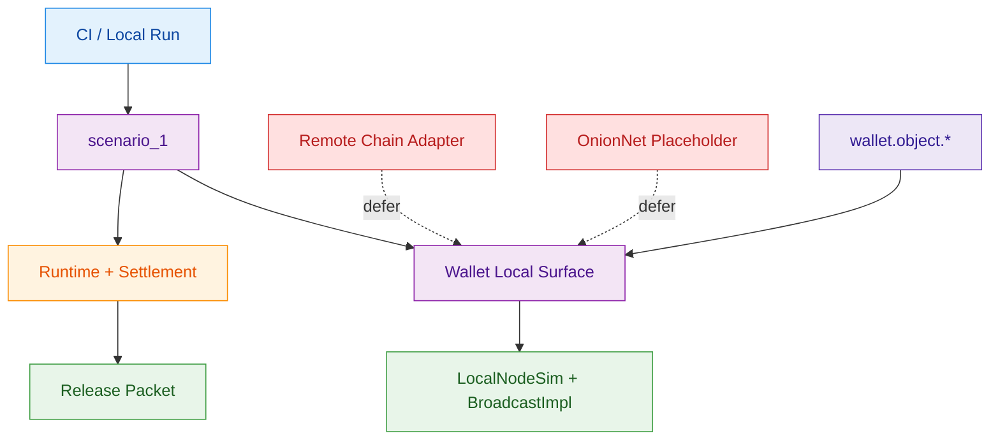
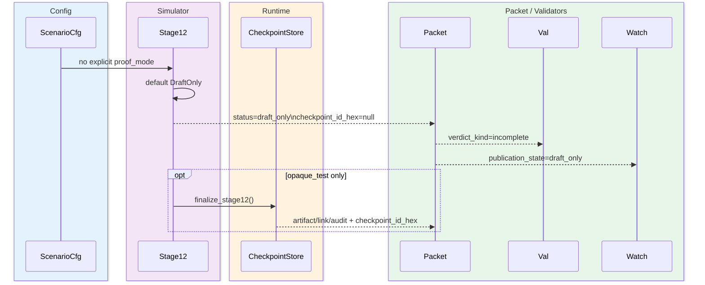
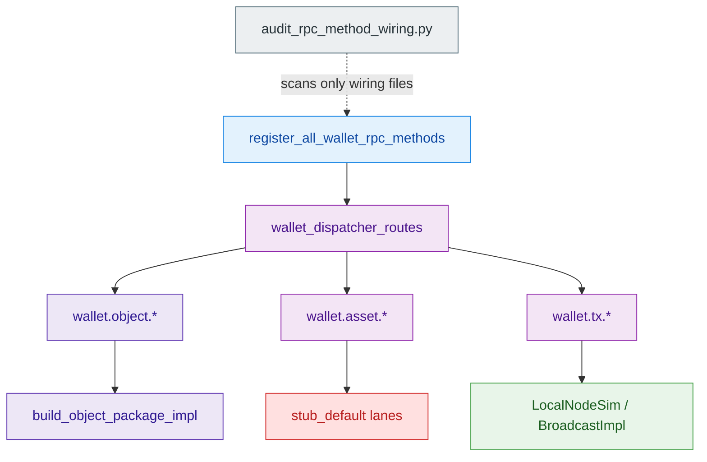
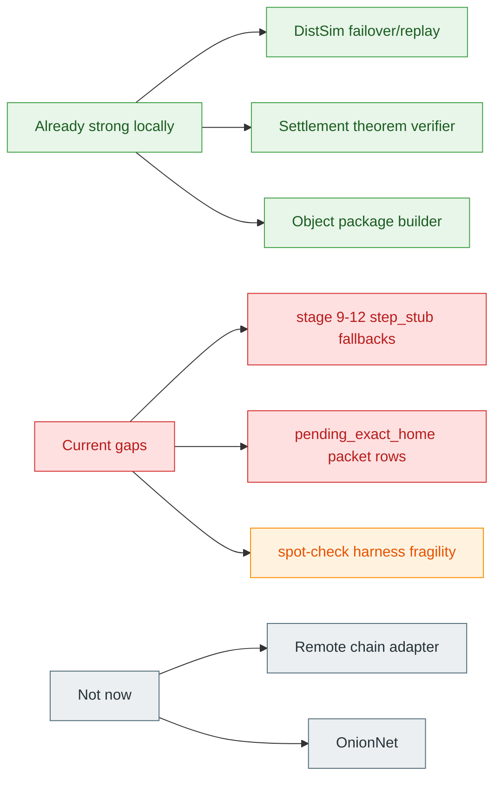
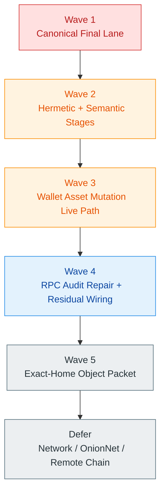
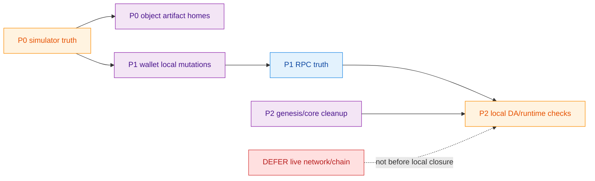
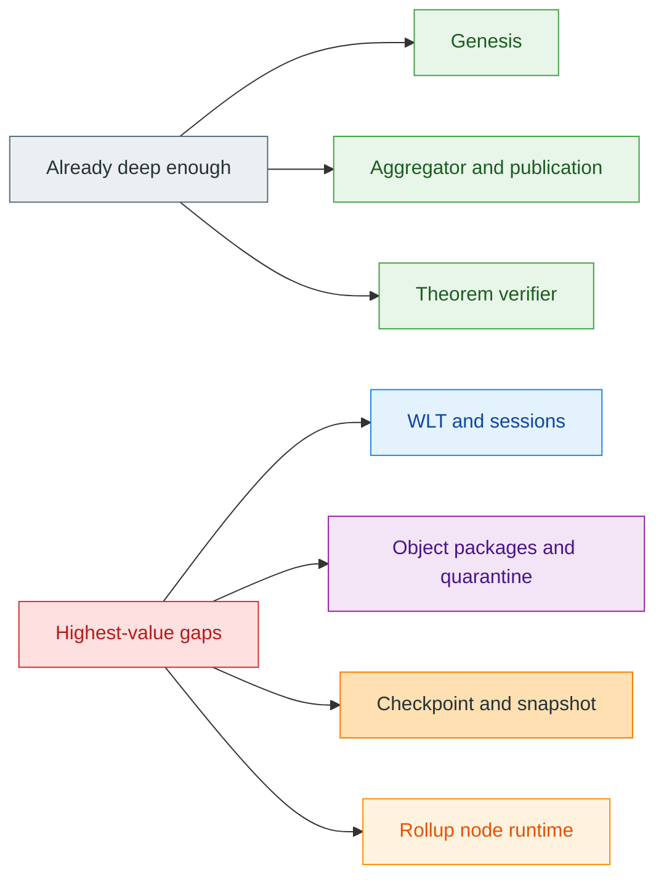

Главная рекомендация: сначала закрыть `canonical simulator truth gap`. Пока `scenario_1` считается каноническим интеграционным harness, но его default release lane заканчивается `draft_only` и публикует `incomplete` verdict вместо финального checkpoint-артефакта; из-за этого любые следующие локальные проверки опираются на неполную публичную историю, хотя полный finalize-path уже существует локально `(crates/z00z_simulator/README.md:64) (crates/z00z_simulator/src/config.rs:327) (crates/z00z_simulator/src/scenario_1/stage_12/mod.rs:154) (crates/z00z_simulator/src/scenario_1/stage_12/finalize_flow.rs:18)`.

**Итерация 1: Структура**

<!-- Sources: crates/z00z_simulator/README.md:64-89; crates/z00z_wallets/src/chain/local_node_sim.rs:28-34; crates/z00z_wallets/src/chain/chain_client_impl.rs:3-6; crates/z00z_wallets/src/chain/broadcast_impl.rs:15-22; crates/z00z_wallets/src/rpc/wallet_dispatcher_routes.rs:301-411; crates/z00z_networks/onionnet/README.md:9-30 -->

| Surface                 | Факт                                                         | Вывод                                                 |
| ----------------------- | ------------------------------------------------------------ | ----------------------------------------------------- |
| `scenario_1`            | Это канонический executable home для object model и release packet `(crates/z00z_simulator/README.md:64-89)` | Основной proving surface уже локальный                |
| Wallet local chain      | `LocalNodeSim` и `BroadcastImpl` уже live; remote adapter explicit seam only `(crates/z00z_wallets/src/chain/local_node_sim.rs:28-34) (crates/z00z_wallets/src/chain/chain_client_impl.rs:39-50) (crates/z00z_wallets/src/chain/broadcast_impl.rs:17-22)` | Много wallet/tx gap’ов можно закрывать без real chain |
| `wallet.object.*`       | Методы зарегистрированы, build/preview path реально валидирует package, roots и reject codes `(crates/z00z_wallets/src/rpc/wallet_dispatcher_routes.rs:301-407) (crates/z00z_wallets/src/rpc/object_rpc_impl.rs:750-853)` | Post-genesis typed objects уже существуют локально    |
| OnionNet / remote chain | Placeholder / adapter-only `(crates/z00z_networks/onionnet/README.md:9-30) (crates/z00z_wallets/src/chain/chain_client_impl.rs:46-50)` | Это не первые gap’ы                                   |

**Итерация 2: Данные и состояние**

<!-- Sources: crates/z00z_simulator/src/config.rs:327-334; crates/z00z_simulator/src/config/config_accessors.rs:122-127; crates/z00z_simulator/src/scenario_1/stage_12/mod.rs:145-165; crates/z00z_simulator/src/scenario_1/stage_12/finalize_flow.rs:18-60; crates/z00z_simulator/tests/scenario_1/test_scenario1_stage_surface.rs:1166-1219; crates/z00z_simulator/tests/scenario_1/test_scenario_settlement.rs:638-646 -->

| Finding                               | Evidence                                                     | Implication                            | Confidence |
| ------------------------------------- | ------------------------------------------------------------ | -------------------------------------- | ---------- |
| Default release lane неполный         | `Stage6ProofMode` default = `DraftOnly`; accessor тоже default; `checkpoint_id_hex` и artifact/link/audit остаются `null`; validator/watch verdict = `incomplete` `(crates/z00z_simulator/src/config.rs:327-334) (crates/z00z_simulator/src/config/config_accessors.rs:122-127) (crates/z00z_simulator/tests/scenario_1/test_scenario1_stage_surface.rs:1166-1174)` | Это gap №1                             | HIGH       |
| Полный finalize-path уже есть         | `finalize_stage12()` грузит draft/exec/snapshot, seal’ит artifact, пишет audit и экспортирует final view `(crates/z00z_simulator/src/scenario_1/stage_12/finalize_flow.rs:25-60)` | Gap закрывается чисто локально         | HIGH       |
| Public object anchors ещё не promoted | `asset_flow.json` / `voucher_flow.json` / `right_flow.json` числятся `pending_exact_home` `(crates/z00z_simulator/README.md:86-89) (crates/z00z_simulator/src/scenario_1/runtime_observability.rs:4253-4260)` | Пакет знаний отстаёт от live semantics | HIGH       |

**Итерация 3: Интеграция и wiring**

<!-- Sources: crates/z00z_wallets/src/rpc/mod.rs:43-71; crates/z00z_wallets/src/rpc/wallet_dispatcher_wiring.rs:357-388; crates/z00z_wallets/src/rpc/wallet_dispatcher_routes.rs:195-411; crates/z00z_wallets/scripts/audit_rpc_method_wiring.py:349-366; crates/z00z_wallets/src/rpc/object_rpc_impl.rs:750-853; crates/z00z_wallets/src/rpc/asset_rpc_server_ops.rs:68-84,126-138,198-212,255-266; crates/z00z_wallets/src/rpc/asset_rpc_server_catalog.rs:406-416 -->

| Finding                                          | Evidence                                                     | Implication                                                  | Confidence |
| ------------------------------------------------ | ------------------------------------------------------------ | ------------------------------------------------------------ | ---------- |
| RPC audit tool сейчас врёт о dispatcher coverage | Скрипт ищет только `*_dispatcher_wiring.rs`, а реальные asset/object/tx registrations живут в `wallet_dispatcher_routes.rs` и вызываются из composite wiring `(crates/z00z_wallets/scripts/audit_rpc_method_wiring.py:349-366) (crates/z00z_wallets/src/rpc/wallet_dispatcher_wiring.rs:357-388) (crates/z00z_wallets/src/rpc/wallet_dispatcher_routes.rs:195-411)` | Сырые числа audit нельзя использовать как roadmap            | HIGH       |
| `wallet.object.*` уже live, не stub              | Routes зарегистрированы; build path делает session check, target resolution, package build, policy/root/reject validation `(crates/z00z_wallets/src/rpc/wallet_dispatcher_routes.rs:301-407) (crates/z00z_wallets/src/rpc/object_rpc_impl.rs:750-853)` | Не тратить следующую волну на “доказать существование post-genesis objects” | HIGH       |
| Настоящий wallet gap — asset mutation lanes      | `split/stake/swap/unstake/merge` всё ещё возвращают `stub_default()` / `stub_tx_*` `(crates/z00z_wallets/src/rpc/asset_rpc_server_ops.rs:68-84) (crates/z00z_wallets/src/rpc/asset_rpc_server_ops.rs:126-138) (crates/z00z_wallets/src/rpc/asset_rpc_server_ops.rs:198-212) (crates/z00z_wallets/src/rpc/asset_rpc_server_catalog.rs:406-416)` | Следующий большой wallet wave должен идти сюда               | HIGH       |
| Один реальный wiring gap я подтвердил            | `app.wallet.open_wallet_source` есть в impl/service, но не зарегистрирован в `register_app_methods` `(crates/z00z_wallets/src/rpc/app_rpc_impl.rs:98-103) (crates/z00z_wallets/src/rpc/app_dispatcher_wiring.rs:53-110)` | Это мелкий, но реальный integration gap                      | HIGH       |

**Итерация 4: Паттерны и anti-patterns**

<!-- Sources: crates/z00z_simulator/src/scenario_1/stage_9/bundle_lane_impl.rs:315-333; crates/z00z_simulator/src/scenario_1/stage_10/publish_support.rs:39-57; crates/z00z_simulator/src/scenario_1/stage_11/finish.rs:32-49; crates/z00z_simulator/src/scenario_1/stage_12/mod.rs:184-201; crates/z00z_runtime/aggregators/src/dist_sim.rs:103-259; crates/z00z_rollup_node/src/lib.rs:97-139; crates/z00z_simulator/src/scenario_1/runtime_observability.rs:80-82,4253-4260; crates/z00z_simulator/src/scenario_1/support/fixture_cache.rs:815-820; crates/z00z_simulator/src/scenario_1/support/stage_runner_support.rs:205-218 -->

| Pattern                                             | Evidence                                                     | Priority signal                            | Confidence |
| --------------------------------------------------- | ------------------------------------------------------------ | ------------------------------------------ | ---------- |
| Synthetic coverage still exists in canonical stages | stages 9-12 auto-fill uncovered steps with `step_stub` / `covered by stage fallback` | Закрыть после final-lane gap               | HIGH       |
| Runtime/storage proving already strong locally      | `DistSim` моделирует partition/heal/replay/deferred delivery; theorem verifier проверяет public settlement bundle `(crates/z00z_runtime/aggregators/src/dist_sim.rs:103-259) (crates/z00z_rollup_node/src/lib.rs:97-139)` | Не это следующий bottleneck                | HIGH       |
| Object packet promotion отстаёт от semantics        | required pending files жёстко зашиты и inventory маркирует их `pending_exact_home` `(crates/z00z_simulator/src/scenario_1/runtime_observability.rs:80-82,4253-4260)` | Средний приоритет, но закрывается локально | HIGH       |
| Spot-check harness неидеально герметичен            | При моих точечных прогонах failures ушли в stage-setup/fixture-cache paths; корень не трассировал полностью `(crates/z00z_simulator/src/scenario_1/support/stage_runner_support.rs:205-218) (crates/z00z_simulator/src/scenario_1/support/fixture_cache.rs:815-820)` | Нужен отдельный hermeticity pass           | MEDIUM     |

**Итерация 5: Что закрывать и в каком порядке**

<!-- Sources: all citations above -->

| Priority   | Gap                                                          | Почему сейчас                                                | Чем доказать локально                                        |
| ---------- | ------------------------------------------------------------ | ------------------------------------------------------------ | ------------------------------------------------------------ |
| `CRITICAL` | Сделать canonical release lane финальным, а не `draft_only`  | Сейчас основной публичный simulator story сам говорит `incomplete` `(crates/z00z_simulator/tests/scenario_1/test_scenario_settlement.rs:638-646)` | `scenario_1` checkpoint/finalization tests + packet assertions |
| `HIGH`     | Убрать `step_stub` и довести filtered scenario runs до hermetic behavior | Иначе 13-stage contract остаётся частично синтетическим, а локальный proving harness хрупок `(crates/z00z_simulator/src/scenario_1/stage_9/bundle_lane_impl.rs:315-333) (crates/z00z_simulator/src/scenario_1/support/fixture_cache.rs:815-820)` | scenario filtered runs without fallback events               |
| `HIGH`     | Перевести `wallet.asset.*` mutation lanes со `stub_default()` на `LocalNodeSim`/`BroadcastImpl`/`TxStorage` | Это самый ценный user-facing gap, который уже можно закрыть без real chain `(crates/z00z_wallets/src/chain/broadcast_impl.rs:17-22) (crates/z00z_wallets/src/rpc/asset_rpc_server_ops.rs:68-84)` | wallet chain/broadcast tests + new asset mutation tests      |
| `HIGH`     | Починить `audit_rpc_method_wiring.py`, затем закрыть реальные residual wiring gaps | Иначе roadmap будет строиться на ложной картине coverage; первым делом добить `app.wallet.open_wallet_source` `(crates/z00z_wallets/scripts/audit_rpc_method_wiring.py:349-366) (crates/z00z_wallets/src/rpc/app_rpc_impl.rs:98-103)` | audit script exit 0 + explicit route checks                  |
| `MEDIUM`   | Promote `asset_flow.json` / `voucher_flow.json` / `right_flow.json` в emitted exact-home packet artifacts | Семантика уже live, но public packet ещё отстаёт `(crates/z00z_simulator/README.md:86-89) (crates/z00z_simulator/tests/scenario_1/test_scenario1_object_flows.rs:821-979)` | stage surface + settlement packet tests                      |
| `DEFER`    | OnionNet, remote-node adapter, app-network stubs             | Это placeholder/adapter-only seams, не лучший ROI сейчас `(crates/z00z_networks/onionnet/README.md:9-30) (crates/z00z_wallets/src/app/app_kernel.rs:115-147)` | Не трогать до появления real network/chain                   |

Проверка, которую я успел сделать: `python3 crates/z00z_wallets/scripts/audit_rpc_method_wiring.py` сейчас выходит с `2` и выдаёт ложный undercount dispatcher coverage; `cargo test -p z00z_wallets --test test_chain_client_sim` прошёл `4/4`; точечные spot-check прогоны `scenario_1` у меня вскрыли отдельную harness fragility, что только усиливает приоритет hermeticity wave.

Если сжать до одного решения: не идти сейчас в network/onion/remote-chain; сначала сделать так, чтобы `scenario_1` выдавал честный финальный local proof, потом убрать synthetic stage coverage, потом добить live wallet mutation paths на уже существующих local backends.

---

---

Да. Но в прошлом ответе это было включено слишком слабо: как два пункта, а не как центральная последовательность. Исправленная карта такая: сначала убрать synthetic stage coverage, затем добить live wallet mutation paths на существующих local backends.

**Приоритетная карта gaps**

| Priority | Gap                                                          | Почему закрывать сейчас                                      |
| -------- | ------------------------------------------------------------ | ------------------------------------------------------------ |
| P0       | Убрать `step_stub` synthetic coverage в stages 9-12          | Сейчас fallback пишет `step_stub` как `ok`, поэтому stage contract может выглядеть закрытым без реальной semantic coverage `(crates/z00z_simulator/src/scenario_1/stage_9/bundle_lane_impl.rs:315)`, `(crates/z00z_simulator/src/scenario_1/stage_12/mod.rs:184)`. |
| P0       | Перевести default scenario publication из `draft_only/incomplete` в real local-final path | Finalizer уже есть, но gated by `Stage6ProofMode::OpaqueTest`; default `DraftOnly` даёт null checkpoint и incomplete verdict `(crates/z00z_simulator/src/config.rs:327)`, `(crates/z00z_simulator/src/scenario_1/stage_12/finalize_flow.rs:18)`, `(crates/z00z_simulator/tests/scenario_1/test_scenario1_stage_surface.rs:1166)`. |
| P0       | Закрыть `pending_exact_home` для `asset_flow.json`, `voucher_flow.json`, `right_flow.json` | Matrix уже требует 18 positive / 15 negative object flows, но публичные anchors ещё pending `(wiki/06-simulator-and-quality/scenario1-object-artifacts.md:85)`, `(crates/z00z_simulator/tests/scenario_1/test_scenario1_object_flows.rs:811)`. |
| P1       | Добить `wallet.asset.*` mutation paths на `LocalNodeSim + ChainClientImpl + BroadcastImpl` | Local backend live, remote adapter-only; но split/stake/swap/unstake/merge ещё возвращают `stub_default`/`stub_tx_*` `(crates/z00z_wallets/src/chain/local_node_sim.rs:28)`, `(crates/z00z_wallets/src/chain/broadcast_impl.rs:15)`, `(crates/z00z_wallets/src/rpc/asset_rpc_server_ops.rs:68)`, `(crates/z00z_wallets/src/rpc/asset_rpc_server_catalog.rs:406)`. |
| P1       | Не трогать `wallet.object.*` как будто это stub              | Это уже правильный post-genesis typed-object path: wallet builds package, storage owns admission truth `(wiki/04-wallet-and-rpc/wallet-object-packages.md:6)`, `(crates/z00z_wallets/src/rpc/object_rpc_impl.rs:750)`, `(crates/z00z_storage/src/settlement/object_package_contract.rs:215)`. |
| P1       | Исправить RPC truth tooling и route gap                      | Audit script не видит `include!("wallet_dispatcher_routes.rs")`; реальный missing route: `app.wallet.open_wallet_source` declared+implemented, но не registered `(crates/z00z_wallets/src/rpc/app_rpc.rs:73)`, `(crates/z00z_wallets/src/rpc/app_dispatcher_wiring.rs:52)`, `(crates/z00z_wallets/scripts/audit_rpc_method_wiring.py:238)`. |
| P2       | Свести placeholder services к live owners                    | `BackupService/KeyService/NetworkService/StorageService` placeholder-only; restore реально живёт в `WalletService`, network нужно defer до overlay `(wiki/04-wallet-and-rpc/wallet-stub-surface.md:118)`. |
| P2       | Расширить local DA/runtime simulation, не real DA            | `LocalDaAdapter` уже проверяет replay/metadata drift, planner пока fail-closed на multi-shard batch `(crates/z00z_rollup_node/src/da.rs:67)`, `(crates/z00z_runtime/aggregators/src/batch_planner.rs:346)`. |
| P2       | Core/genesis cleanup только после simulator/wallet           | `performance.num_threads` уже применён через dedicated Rayon pool, поэтому это не P0; остаются composition/naming clarity и bootstrap wording `(wiki/03-core-protocol/genesis-caveats.md:6)`, `(crates/z00z_core/src/vauchers/voucher_bootstrap.rs:47)`. |
| DEFER    | OnionNet, real remote chain, real DA, slashing/fraud engine  | Docs прямо говорят: transport anonymity not shipped, OnionNet placeholder, remote chain/scan incomplete `(docs/Z00Z-Main-Whitepaper.md:864)`, `(docs/Z00Z-Main-Whitepaper.md:1431)`, `(docs/tech-papers/Z00Z-Roadmap-Blueprint.md:858)`. |

**Рекомендуемая последовательность**

1. `simulator`: убрать `step_stub`, включить local finalization profile, закрыть `pending_exact_home`.
2. `wallet`: реализовать asset mutation semantics через local chain/broadcast/tx store, без fake tx ids.
3. `rpc`: поправить audit script на `include!`, зарегистрировать `app.wallet.open_wallet_source`, добавить route coverage.
4. `wallet services`: переносить только live-backed placeholders; network placeholders оставить честно deferred.
5. `runtime/rollup`: усилить local DA publish/resolve и multi-shard simulation tests без claims про live network.

---

---

Есть. Ниже только новые пункты, без повторов уже названных simulator/wallet-asset/RPC/genesis/local-DA тем.

**P0**

1. **Wallet restore fault-injection.** `restore_wallet_pack_atomic()` уже делает staging/rollback для `.wlt` и history, но это нужно закрыть тестами на сбой между history commit, `.wlt` commit и publish в memory. Смотри `crates/z00z_wallets/src/services/wallet_actions_backup.rs:729`, `:810`, `:838`, `:875`.
2. **Sensitive RPC session coverage.** Есть контракт “все sensitive operations через session manager”, но нужен static/dynamic guard: каждый seed/key/backup/restore-sensitive RPC обязан вызывать `verify_session()` или `verify_session_no_touch()`. Смотри `crates/z00z_wallets/src/services/wallet_session_manager.rs:89`, `crates/z00z_wallets/src/services/wallet_session_runtime_limits.rs:188`.
3. **Receiver/PaymentRequest raw-builder guard.** `PaymentRequest::validate_all()` проверяет chain/expiry/signature/TOFU, а raw `build_tx_stealth_output()` сам это не делает. Нужно запретить raw path в app/RPC production flows, кроме явно allowlisted test/scanner fixtures. Смотри `crates/z00z_wallets/src/receiver/request.rs:93`, `crates/z00z_wallets/src/stealth/output.rs:966`, `:1102`.
4. **Native vs wasm wallet capability matrix.** Sessions, TOFU, inbox receive и `.wlt` persistence не эквивалентны wasm. Нужно compile/doc/test guard, чтобы browser surface не рекламировал native guarantees. Смотри `crates/z00z_wallets/src/services/wallet_store_restore.rs:43`, `crates/z00z_wallets/src/services/wallet_session_runtime_limits.rs:204`, `wiki/04-wallet-and-rpc/receiver-request-flow.md:137`.
5. **Default release-packet secret leak guard.** Simulator docs уже говорят, что plaintext wallet-secret artifacts debug-only. Нужен packet validator/grep-test: default packet не содержит seed/private key/raw receiver secret/lock bytes. Смотри `wiki/06-simulator-and-quality/scenario-pipeline.md:84`.

**P1**

6. **Quarantine roundtrip/promotion contract.** Quarantined rights/vouchers сохраняются в inventory, но нужен restore/export/import roundtrip и явный promotion/no-promotion path при появлении policy. Смотри `crates/z00z_wallets/src/redb_store/owned_objects.rs:175`, `crates/z00z_wallets/src/redb_store/object_queries.rs:137`, `wiki/04-wallet-and-rpc/wallet-object-quarantine.md:115`.

1. **ObjectRejectCode exhaustiveness.** Enum и RPC mapping есть, но нужен тест: каждый `ObjectRejectCode` имеет stable RPC code, validator class и coverage marker. Смотри `crates/z00z_storage/src/settlement/object_package_contract.rs:71`, `crates/z00z_wallets/src/rpc/object_rpc_impl.rs:156`.
2. **Checkpoint raw save vs canonical seal.** `save_artifact()` прямо описан как raw lane, `seal_artifact()` как canonical statement-bound path. Нужен allowlist/guard, чтобы runtime/simulator не обходили seal там, где нужен canonical checkpoint. Смотри `crates/z00z_storage/src/checkpoint/store.rs:208`, `:223`, `crates/z00z_simulator/src/scenario_1/stage_4/storage_view.rs:165`.
3. **PrepSnapshot adversarial matrix.** Уже есть checks для duplicate path, duplicate terminal, witness/path/leaf/root/id mix. Нужно покрыть каждую error lane deterministic negative/property tests. Смотри `crates/z00z_storage/src/snapshot/store.rs:66`, `:156`, `:216`, `wiki/05-storage-runtime/prep-snapshot-replay.md:55`.
4. **Settlement proof boundary guard.** Запретить downstream conflation: `backend_root` не public `SettlementStateRoot`, flat terminal id не заменяет full path, raw JMT proof types не выходят выше storage. Смотри `crates/z00z_storage/src/settlement/README.md:8`, `:104`, `:119`.
5. **Rollup theorem negative tests.** Verifier уже не rebuild private witnesses и проверяет public artifact/link/exec/tx. Нужна negative matrix на detached statement, wrong proof payload, wrong exec id, wrong prep id, wrong link root. Смотри `crates/z00z_rollup_node/src/lib.rs:97`.
6. **Recovery failover adversarial matrix.** Уже есть fail-closed branches для lineage/generation/root/version/split-brain/standby. Нужно тестами закрыть каждую ветку. Смотри `crates/z00z_runtime/aggregators/src/recovery.rs:63`, `:94`, `:148`, `:173`.
7. **PublicationBinding anti-fork audit expansion.** Guardrails надо распространить на simulator/rollup/docs examples: no second binding digest, no local route acceptance clone. Смотри `crates/z00z_runtime/aggregators/README.md:18`, `:28`, `crates/z00z_runtime/aggregators/src/types.rs:272`.

**P2**

14. **`z00z_utils` boundary CI.** Добавить audit script с allowlist: direct `std::fs`, `serde_json`, `serde_yaml`, `SystemTime::now`, RNG допустимы в `z00z_utils`, tests, benches, explicit low-level owner modules, но не должны расползаться по business crates. Смотри `crates/z00z_utils/README.md:5`, `:20`, `:53`.

1. **Crypto facade/domain CI.** Закрепить, что workspace идет через `z00z_crypto` facade, а direct `tari_crypto::*` живет только внутри `z00z_crypto`/tests/vendor internals. Смотри `crates/z00z_crypto/README.md:7`, `crates/z00z_crypto/src/lib.rs:31`, `:71`.
2. **Simulator stable-facade import guard.** Отдельно от artifact gaps: scenario harness не должен deep-import internals ради удобства. Если нужен entrypoint, он добавляется в owner crate facade. Смотри `wiki/06-simulator-and-quality/scenario-pipeline.md:88`.
3. **`z00z_extensions` anti-dumping guard.** Сейчас boundary маленький; можно дешево поставить CI/check, что crate не начинает тянуть core semantics без explicit extension plan. Смотри `crates/z00z_extensions/README.md:3`.
4. **Wiki local-only citation hygiene.** В новых wiki ещё встречаются GitHub links, хотя repo работает local-only. Нужно script/check, который переводит internal source refs в local path refs и не ломается при offline use. Смотри пример `wiki/06-simulator-and-quality/scenario-pipeline.md:80`.

Порядок закрытия: сначала `1-5`, потом `6-13`, потом `14-18`. Это всё можно делать сейчас локальными tests/scripts/CI guardrails, без реальной сети, chain, DA или OnionNet.

Doublecheck: проверено по локальным `wiki/`, `crates/` и grep; graphify не использовался как источник фактов. Код не менял, тесты не запускал.

---

