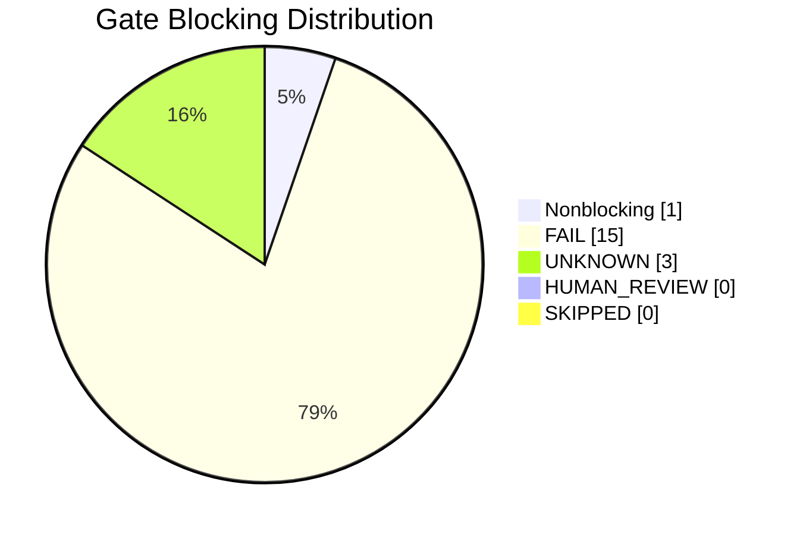
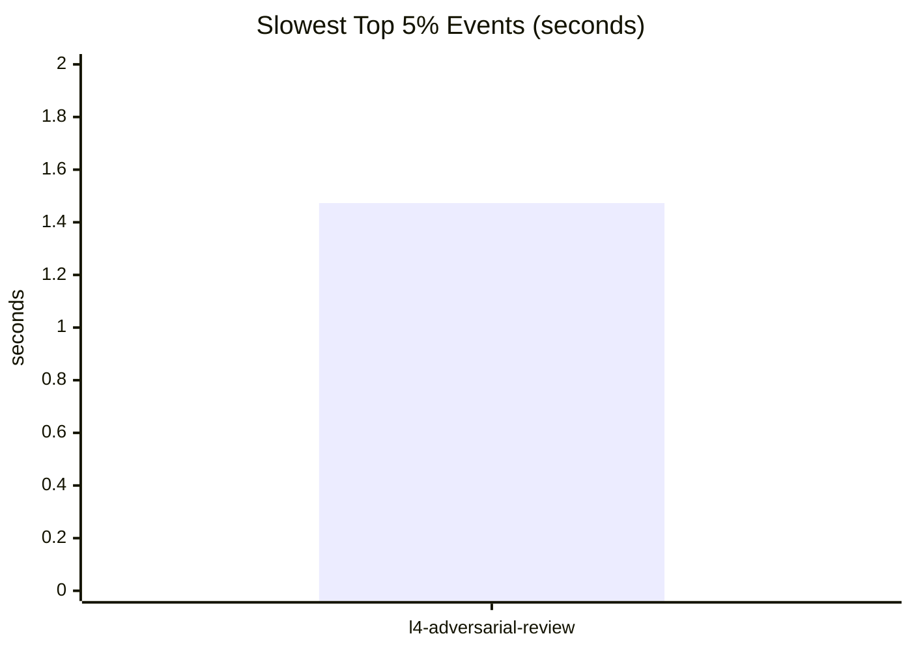

<!-- z00z-orchestrator-report
scope=project
target=project
levels=l0,l1,l2,l3,l4
mode=report
format=.github/skills/z00z-verification-orchestrator/FORMAT.md
-->
# Z00Z Verification Orchestrator Report

## 🎯 Executive Verdict

- Overall status: `FAIL`
- Scope: `project`
- Mode: `report`
- Levels: `l0,l1,l2,l3,l4`
- Run root: `reports/z00z-verification-orchestrator-20260630-132022`
- Evidence basis: `19` gates, `20` profiling events, `8761` tracked files inventoried
- Blocking counts: fail `15`, unknown `3`, human-review `0`, skipped `0`
- Integration contract: leaked output gates `0`; crate-unmapped files `0`

## 📦 Evidence Provenance

- Generated UTC: `2026-06-30T13:20:31Z`
- Run root: `reports/z00z-verification-orchestrator-20260630-132022`
- Timestamp stamp: `20260630-132022`
- Report format: `.github/skills/z00z-verification-orchestrator/FORMAT.md`
- Stale verifier run roots compacted before start: `1`
- External interferer processes killed: `0`
- Mode: `report`
- Scope: `project`
- Target: `project`
- Levels: `l0,l1,l2,l3,l4`
- Release profile args: `--release`
- Cache root: `reports/z00z-verification-orchestrator-20260630-132022/.cache`
- Cargo home: `tools/formal_verification/cargo`
- Cargo install root: `reports/z00z-verification-orchestrator-20260630-132022/.cache/cargo-install`
- Canonical tmp root: `reports/z00z-verification-orchestrator-20260630-132022/tmp20260630-132022`
- Specs runtime root: `reports/z00z-verification-orchestrator-20260630-132022/specs20260630-132022`
- Verification runtime root: `reports/z00z-verification-orchestrator-20260630-132022/verification20260630-132022`
- Fuzz runtime root: `reports/z00z-verification-orchestrator-20260630-132022/fuzz20260630-132022`
- Cargo target dir: `reports/z00z-verification-orchestrator-20260630-132022/target`
- Python bytecode writes disabled: `1`
- Protected vendor path touched: `0`
- Core evidence paths: `reports/z00z-verification-orchestrator-20260630-132022/logs`, `reports/z00z-verification-orchestrator-20260630-132022/profiling/events.tsv`, `reports/z00z-verification-orchestrator-20260630-132022/profiling/summary.json`, `reports/z00z-verification-orchestrator-20260630-132022/profiling/tool-availability.json`, `reports/z00z-verification-orchestrator-20260630-132022/profiling/resources-summary.json`, `reports/z00z-verification-orchestrator-20260630-132022/profiling/run-footprint.json`, `reports/z00z-verification-orchestrator-20260630-132022/profiling/hjmt-summary.json`, `reports/z00z-verification-orchestrator-20260630-132022/security/adversarial-summary.json`
- Coverage evidence paths: `reports/z00z-verification-orchestrator-20260630-132022/coverage/manifest.tsv`, `reports/z00z-verification-orchestrator-20260630-132022/coverage/summary.json`
- Report validation summary: `reports/z00z-verification-orchestrator-20260630-132022/report-validation.json`

## 🚦 Gate Matrix

| Gate | Checker module | Status | Elapsed (s) | Log | Primary artifacts |
| --- | --- | --- | --- | --- | --- |
| `l0-docs` | `.github/skills/z00z-l0-spec-gate/scripts/check-docs.sh` | `FAIL` | `0.141` | `reports/z00z-verification-orchestrator-20260630-132022/logs/l0-docs.log` | `reports/z00z-verification-orchestrator-20260630-132022/logs/l0-docs.log; reports/z00z-verification-orchestrator-20260630-132022/profiling/resources/l0-docs.time` |
| `l1-alloy` | `.github/skills/z00z-l1-protocol-model-gate/scripts/run-alloy.sh` | `FAIL` | `0.149` | `reports/z00z-verification-orchestrator-20260630-132022/logs/l1-alloy.log` | `reports/z00z-verification-orchestrator-20260630-132022/logs/l1-alloy.log; reports/z00z-verification-orchestrator-20260630-132022/profiling/resources/l1-alloy.time` |
| `l1-apalache` | `.github/skills/z00z-l1-protocol-model-gate/scripts/run-apalache.sh` | `FAIL` | `0.158` | `reports/z00z-verification-orchestrator-20260630-132022/logs/l1-apalache.log` | `reports/z00z-verification-orchestrator-20260630-132022/profiling/resources/l1-apalache.time` |
| `l1-tla` | `.github/skills/z00z-l1-protocol-model-gate/scripts/run-tla.sh` | `FAIL` | `0.153` | `reports/z00z-verification-orchestrator-20260630-132022/logs/l1-tla.log` | `reports/z00z-verification-orchestrator-20260630-132022/profiling/resources/l1-tla.time` |
| `l2-cryptol` | `.github/skills/z00z-code-to-logic-gate/scripts/run-cryptol.sh` | `FAIL` | `0.163` | `reports/z00z-verification-orchestrator-20260630-132022/logs/l2-cryptol.log` | `reports/z00z-verification-orchestrator-20260630-132022/profiling/resources/l2-cryptol.time` |
| `l2-domain` | `.github/skills/z00z-l2-crypto-protocol-gate/scripts/check-domain-separation.py` | `PASS` | `0.350` | `reports/z00z-verification-orchestrator-20260630-132022/logs/l2-domain.log` | `reports/z00z-verification-orchestrator-20260630-132022/profiling/resources/l2-domain.time` |
| `l2-proverif` | `.github/skills/z00z-l2-crypto-protocol-gate/scripts/run-proverif.sh` | `FAIL` | `0.149` | `reports/z00z-verification-orchestrator-20260630-132022/logs/l2-proverif.log` | `reports/z00z-verification-orchestrator-20260630-132022/profiling/resources/l2-proverif.time` |
| `l2-refinement-map` | `.github/skills/z00z-code-to-logic-gate/scripts/check-refinement-map.py` | `UNKNOWN` | `0.277` | `reports/z00z-verification-orchestrator-20260630-132022/logs/l2-refinement-map.log` | `reports/z00z-verification-orchestrator-20260630-132022/profiling/resources/l2-refinement-map.time` |
| `l2-saw` | `.github/skills/z00z-code-to-logic-gate/scripts/run-saw.sh` | `FAIL` | `0.146` | `reports/z00z-verification-orchestrator-20260630-132022/logs/l2-saw.log` | `reports/z00z-verification-orchestrator-20260630-132022/profiling/resources/l2-saw.time` |
| `l2-tamarin` | `.github/skills/z00z-l2-crypto-protocol-gate/scripts/run-tamarin.sh` | `FAIL` | `0.156` | `reports/z00z-verification-orchestrator-20260630-132022/logs/l2-tamarin.log` | `reports/z00z-verification-orchestrator-20260630-132022/profiling/resources/l2-tamarin.time` |
| `l2-transcript` | `.github/skills/z00z-l2-crypto-protocol-gate/scripts/check-transcript-binding.py` | `UNKNOWN` | `0.290` | `reports/z00z-verification-orchestrator-20260630-132022/logs/l2-transcript.log` | `reports/z00z-verification-orchestrator-20260630-132022/profiling/resources/l2-transcript.time` |
| `l3-kani` | `.github/skills/z00z-l3-rust-implementation-gate/scripts/verify-kani.sh` | `FAIL` | `0.161` | `reports/z00z-verification-orchestrator-20260630-132022/logs/l3-kani.log` | `reports/z00z-verification-orchestrator-20260630-132022/target; reports/z00z-verification-orchestrator-20260630-132022/profiling/resources/l3-kani.time` |
| `l3-miri` | `.github/skills/z00z-l3-rust-implementation-gate/scripts/verify-miri.sh` | `FAIL` | `0.169` | `reports/z00z-verification-orchestrator-20260630-132022/logs/l3-miri.log` | `reports/z00z-verification-orchestrator-20260630-132022/target; reports/z00z-verification-orchestrator-20260630-132022/profiling/resources/l3-miri.time` |
| `l3-verify-fast` | `.github/skills/z00z-l3-rust-implementation-gate/scripts/verify-fast.sh` | `FAIL` | `0.124` | `reports/z00z-verification-orchestrator-20260630-132022/logs/l3-verify-fast.log` | `reports/z00z-verification-orchestrator-20260630-132022/target; reports/z00z-verification-orchestrator-20260630-132022/profiling/resources/l3-verify-fast.time` |
| `l4-adversarial-review` | `.github/skills/z00z-verification-orchestrator/scripts/run-security-brainstorm.py` | `FAIL` | `1.473` | `reports/z00z-verification-orchestrator-20260630-132022/logs/l4-adversarial-review.log` | `reports/z00z-verification-orchestrator-20260630-132022/profiling/resources/l4-adversarial-review.time` |
| `l4-constant-time` | `.github/skills/z00z-l4-security-engineering-gate/scripts/run-constant-time.sh` | `FAIL` | `0.438` | `reports/z00z-verification-orchestrator-20260630-132022/logs/l4-constant-time.log` | `reports/z00z-verification-orchestrator-20260630-132022/logs/l4-constant-time.log; reports/z00z-verification-orchestrator-20260630-132022/profiling/resources/l4-constant-time.time` |
| `l4-fuzz` | `.github/skills/z00z-l4-security-engineering-gate/scripts/run-fuzz-short.sh` | `FAIL` | `0.157` | `reports/z00z-verification-orchestrator-20260630-132022/logs/l4-fuzz.log` | `reports/z00z-verification-orchestrator-20260630-132022/fuzz20260630-132022; reports/z00z-verification-orchestrator-20260630-132022/profiling/resources/l4-fuzz.time` |
| `l4-supply-chain` | `.github/skills/z00z-l4-security-engineering-gate/scripts/audit-supply-chain.sh` | `FAIL` | `0.126` | `reports/z00z-verification-orchestrator-20260630-132022/logs/l4-supply-chain.log` | `reports/z00z-verification-orchestrator-20260630-132022/profiling/resources/l4-supply-chain.time` |
| `l4-unsafe` | `.github/skills/z00z-l4-security-engineering-gate/scripts/unsafe-report.sh` | `UNKNOWN` | `0.666` | `reports/z00z-verification-orchestrator-20260630-132022/logs/l4-unsafe.log` | `reports/z00z-verification-orchestrator-20260630-132022/vendor/vendor-unsafe.md; reports/z00z-verification-orchestrator-20260630-132022/geiger; reports/z00z-verification-orchestrator-20260630-132022/profiling/resources/l4-unsafe.time` |

## 🧪 Conclusion Ledger

| Gate | Checker module | Machine conclusion | Validity ceiling | Anchoring artifact |
| --- | --- | --- | --- | --- |
| `l0-docs` | `.github/skills/z00z-l0-spec-gate/scripts/check-docs.sh` | `FAIL` | checker failed or the artifact confinement contract was violated, so the claimed property is not established | `reports/z00z-verification-orchestrator-20260630-132022/logs/l0-docs.log` |
| `l1-alloy` | `.github/skills/z00z-l1-protocol-model-gate/scripts/run-alloy.sh` | `FAIL` | checker failed or the artifact confinement contract was violated, so the claimed property is not established | `reports/z00z-verification-orchestrator-20260630-132022/logs/l1-alloy.log` |
| `l1-apalache` | `.github/skills/z00z-l1-protocol-model-gate/scripts/run-apalache.sh` | `FAIL` | checker failed or the artifact confinement contract was violated, so the claimed property is not established | `reports/z00z-verification-orchestrator-20260630-132022/logs/l1-apalache.log` |
| `l1-tla` | `.github/skills/z00z-l1-protocol-model-gate/scripts/run-tla.sh` | `FAIL` | checker failed or the artifact confinement contract was violated, so the claimed property is not established | `reports/z00z-verification-orchestrator-20260630-132022/logs/l1-tla.log` |
| `l2-cryptol` | `.github/skills/z00z-code-to-logic-gate/scripts/run-cryptol.sh` | `FAIL` | checker failed or the artifact confinement contract was violated, so the claimed property is not established | `reports/z00z-verification-orchestrator-20260630-132022/logs/l2-cryptol.log` |
| `l2-domain` | `.github/skills/z00z-l2-crypto-protocol-gate/scripts/check-domain-separation.py` | `PASS` | checker ran successfully but did not emit a stronger proof-grade classification | `reports/z00z-verification-orchestrator-20260630-132022/logs/l2-domain.log` |
| `l2-proverif` | `.github/skills/z00z-l2-crypto-protocol-gate/scripts/run-proverif.sh` | `FAIL` | checker failed or the artifact confinement contract was violated, so the claimed property is not established | `reports/z00z-verification-orchestrator-20260630-132022/logs/l2-proverif.log` |
| `l2-refinement-map` | `.github/skills/z00z-code-to-logic-gate/scripts/check-refinement-map.py` | `UNKNOWN` | tool, model, harness, or semantic closure is missing, so no stronger conclusion is valid | `reports/z00z-verification-orchestrator-20260630-132022/logs/l2-refinement-map.log` |
| `l2-saw` | `.github/skills/z00z-code-to-logic-gate/scripts/run-saw.sh` | `FAIL` | checker failed or the artifact confinement contract was violated, so the claimed property is not established | `reports/z00z-verification-orchestrator-20260630-132022/logs/l2-saw.log` |
| `l2-tamarin` | `.github/skills/z00z-l2-crypto-protocol-gate/scripts/run-tamarin.sh` | `FAIL` | checker failed or the artifact confinement contract was violated, so the claimed property is not established | `reports/z00z-verification-orchestrator-20260630-132022/logs/l2-tamarin.log` |
| `l2-transcript` | `.github/skills/z00z-l2-crypto-protocol-gate/scripts/check-transcript-binding.py` | `UNKNOWN` | tool, model, harness, or semantic closure is missing, so no stronger conclusion is valid | `reports/z00z-verification-orchestrator-20260630-132022/logs/l2-transcript.log` |
| `l3-kani` | `.github/skills/z00z-l3-rust-implementation-gate/scripts/verify-kani.sh` | `FAIL` | checker failed or the artifact confinement contract was violated, so the claimed property is not established | `reports/z00z-verification-orchestrator-20260630-132022/logs/l3-kani.log` |
| `l3-miri` | `.github/skills/z00z-l3-rust-implementation-gate/scripts/verify-miri.sh` | `FAIL` | checker failed or the artifact confinement contract was violated, so the claimed property is not established | `reports/z00z-verification-orchestrator-20260630-132022/logs/l3-miri.log` |
| `l3-verify-fast` | `.github/skills/z00z-l3-rust-implementation-gate/scripts/verify-fast.sh` | `FAIL` | checker failed or the artifact confinement contract was violated, so the claimed property is not established | `reports/z00z-verification-orchestrator-20260630-132022/logs/l3-verify-fast.log` |
| `l4-adversarial-review` | `.github/skills/z00z-verification-orchestrator/scripts/run-security-brainstorm.py` | `FAIL` | checker failed or the artifact confinement contract was violated, so the claimed property is not established | `reports/z00z-verification-orchestrator-20260630-132022/logs/l4-adversarial-review.log` |
| `l4-constant-time` | `.github/skills/z00z-l4-security-engineering-gate/scripts/run-constant-time.sh` | `FAIL` | checker failed or the artifact confinement contract was violated, so the claimed property is not established | `reports/z00z-verification-orchestrator-20260630-132022/logs/l4-constant-time.log` |
| `l4-fuzz` | `.github/skills/z00z-l4-security-engineering-gate/scripts/run-fuzz-short.sh` | `FAIL` | checker failed or the artifact confinement contract was violated, so the claimed property is not established | `reports/z00z-verification-orchestrator-20260630-132022/logs/l4-fuzz.log` |
| `l4-supply-chain` | `.github/skills/z00z-l4-security-engineering-gate/scripts/audit-supply-chain.sh` | `FAIL` | checker failed or the artifact confinement contract was violated, so the claimed property is not established | `reports/z00z-verification-orchestrator-20260630-132022/logs/l4-supply-chain.log` |
| `l4-unsafe` | `.github/skills/z00z-l4-security-engineering-gate/scripts/unsafe-report.sh` | `UNKNOWN` | tool, model, harness, or semantic closure is missing, so no stronger conclusion is valid | `reports/z00z-verification-orchestrator-20260630-132022/logs/l4-unsafe.log` |

## 🔍 Validity And Doublecheck

- The orchestrator does not upgrade conclusions above raw tool evidence. A gate is only stronger than `PASS` when the underlying log emitted `TESTED`, `BOUNDED_VERIFIED`, `MODEL_CHECKED`, `FORMALLY_PROVED`, or `SECURITY_PROTOCOL_PROVED`.
- Missing tools, missing models, missing specs, and non-closed semantic gaps stay `UNKNOWN`.
- High-risk adversarial hypotheses stay `NEEDS_HUMAN_CRYPTO_REVIEW`; they are not treated as proven exploits.
- Artifact traceability lives in this run root only: logs in `logs/`, gate state under `specs*`, `verification*`, `fuzz*`, temp state under `tmp*`, profiling in `profiling/`.
- Canonical artifact contract check: no unauthorized root/runtime leak was detected.
- Production/dev cache observation: no `repo/.cache` mutation manifest was captured during this run.
- Doublecheck inputs: `reports/z00z-verification-orchestrator-20260630-132022/logs`, `reports/z00z-verification-orchestrator-20260630-132022/profiling/summary.json`, `-`, `reports/z00z-verification-orchestrator-20260630-132022/runtime-bootstrap-summary.json`, `reports/z00z-verification-orchestrator-20260630-132022/security/adversarial-summary.json`.

## 🏗️ Bootstrap Artifact Provenance

- Report mode did not edit repo-owned verification artifacts.
- Report-local runtime verifier assets may be staged under the active run root.

## 📊 Performance And Resource Profiling

- Profiler tool inventory: `reports/z00z-verification-orchestrator-20260630-132022/profiling/tool-availability.json`

| Tool | Available | Path | Version |
| --- | --- | --- | --- |
| `gnu_time` | `yes` | `/usr/bin/time` | `time (GNU Time) UNKNOWN` |
| `perf` | `yes` | `/usr/bin/perf` | `perf version 6.8.12` |
| `strace` | `yes` | `/usr/bin/strace` | `strace -- version 6.8` |
| `valgrind` | `yes` | `/usr/bin/valgrind` | `valgrind-3.22.0` |
| `flamegraph` | `yes` | `/home/vadim/.cargo/bin/flamegraph` | `flamegraph 0.6.8` |
| `cargo-flamegraph` | `yes` | `/home/vadim/.cargo/bin/cargo-flamegraph` | `Usage: cargo <COMMAND>` |
| `hyperfine` | `no` | `-` | `-` |
| `heaptrack` | `no` | `-` | `-` |

- Profiling events: `reports/z00z-verification-orchestrator-20260630-132022/profiling/events.tsv`
- Profiling summary: `reports/z00z-verification-orchestrator-20260630-132022/profiling/summary.json`
- Resource profiles: `reports/z00z-verification-orchestrator-20260630-132022/profiling/resources`
- Resource summary: `reports/z00z-verification-orchestrator-20260630-132022/profiling/resources-summary.json`
- Run-footprint summary: `reports/z00z-verification-orchestrator-20260630-132022/profiling/run-footprint.json`
- Profiled events: `20` total, `19` gate-level, `1` command-level
- Slowest slice reported: top `5%` => `1` events consuming `1.473`s / `5.59`s total (`26.35%`)

| Kind | Label | Status | Elapsed (s) | Command | Recommendation |
| --- | --- | --- | --- | --- | --- |
| `gate` | `l4-adversarial-review` | `FAIL` | `1.473` | `python3 /home/vadim/Projects/z00z/.github/skills/z00z-verification-orchestrator/scripts/run-security-brainstorm.py --...` | `Prefer memory-first handoff for intermediate state and checkpoint to disk only for final evidence artifacts.` |

Aggregate acceleration candidates:
- Prefer memory-first handoff for intermediate state and checkpoint to disk only for final evidence artifacts.

- Profiling guidance source: `.planning/phases/profiling-comprehensive.md`

Top CPU-total profiles:

| Profile | Kind | Mode | Wall (s) | CPU total (s) | CPU % | Max RSS (KB) | Exit |
| --- | --- | --- | --- | --- | --- | --- | --- |
| `l4-adversarial-review` | `gate` | `unknown` | `1.34` | `1.33` | `99.0` | `46596` | `1` |
| `l4-unsafe` | `gate` | `unknown` | `0.47` | `0.49` | `105.0` | `37012` | `0` |
| `l4-constant-time` | `gate` | `unknown` | `0.3` | `0.31` | `102.0` | `36704` | `1` |
| `l2-domain` | `gate` | `unknown` | `0.15` | `0.14` | `100.0` | `23844` | `0` |
| `vendor-unsafe-report` | `command` | `analyze-only` | `0.12` | `0.12` | `99.0` | `21012` | `0` |

Top memory-RSS profiles:

| Profile | Max RSS (KB) | Wall (s) | CPU total (s) | FS in | FS out |
| --- | --- | --- | --- | --- | --- |
| `l4-adversarial-review` | `46596` | `1.34` | `1.33` | `0` | `8` |
| `l4-unsafe` | `37012` | `0.47` | `0.49` | `0` | `40` |
| `l4-constant-time` | `36704` | `0.3` | `0.31` | `0` | `16` |
| `l3-miri` | `31048` | `0.03` | `0.03` | `0` | `16` |
| `l2-domain` | `23844` | `0.15` | `0.14` | `0` | `8` |

Top filesystem-I/O profiles:

| Profile | FS in | FS out | Wall (s) | CPU total (s) | Max RSS (KB) |
| --- | --- | --- | --- | --- | --- |
| `l4-unsafe` | `0` | `40` | `0.47` | `0.49` | `37012` |
| `l4-fuzz` | `0` | `16` | `0.02` | `0.02` | `11836` |
| `l4-constant-time` | `0` | `16` | `0.3` | `0.31` | `36704` |
| `l3-miri` | `0` | `16` | `0.03` | `0.03` | `31048` |
| `l3-kani` | `0` | `16` | `0.02` | `0.02` | `11832` |

Performance inventory snapshots:

| Profile | Kind | Mode | Targets | Caches | Cleanup (ms) | Reclaimed bytes |
| --- | --- | --- | --- | --- | --- | --- |
| `l4-adversarial-review` | `gate` | `unknown` | - | - | `0` | `0` |
| `l4-unsafe` | `gate` | `unknown` | - | - | `0` | `0` |
| `l4-constant-time` | `gate` | `unknown` | - | - | `0` | `0` |
| `l2-domain` | `gate` | `unknown` | - | - | `0` | `0` |
| `vendor-unsafe-report` | `command` | `analyze-only` | `/home/vadim/Projects/z00z/reports/z00z-verification-orchestrator-20260630-132022/target` `/home/vadim/Projects/z00z/reports/z00z-verification-orchestrator-20260630-132022/geiger/target` | `/home/vadim/Projects/z00z/reports/z00z-verification-orchestrator-20260630-132022/.cache` `/home/vadim/Projects/z00z/reports/z00z-verification-orchestrator-20260630-132022/.cache/scenario_1` | `0` | `0` |

- Active run-root disk footprint: `9.26 MiB`

| Top-level path | Kind | Size |
| --- | --- | --- |
| `tmp20260630-132022` | `dir` | `9.16 MiB` |
| `profiling` | `dir` | `93.29 KiB` |
| `logs` | `dir` | `6.75 KiB` |
| `vendor` | `dir` | `2.22 KiB` |
| `workdir` | `dir` | `0.00 B` |
| `verification20260630-132022` | `dir` | `0.00 B` |
| `target` | `dir` | `0.00 B` |
| `specs20260630-132022` | `dir` | `0.00 B` |

Largest files:
- `tmp20260630-132022/root-production-cache-l4-unsafe-before.tsv` => `493.75 KiB`
- `tmp20260630-132022/root-production-cache-l4-supply-chain-before.tsv` => `493.75 KiB`
- `tmp20260630-132022/root-production-cache-l4-fuzz-before.tsv` => `493.75 KiB`
- `tmp20260630-132022/root-production-cache-l4-constant-time-before.tsv` => `493.75 KiB`
- `tmp20260630-132022/root-production-cache-l4-adversarial-review-before.tsv` => `493.75 KiB`

## 🌲 HJMT Runtime Evidence

- HJMT summary: `reports/z00z-verification-orchestrator-20260630-132022/profiling/hjmt-summary.json`
- No HJMT artifact pair was found under the active run root.
- TPS status: not measured in this run because no active-run HJMT or throughput artifact was produced.

## 🗺️ Coverage Inventory

- Tracked files inventoried: `8761`
- Coverage manifest: `reports/z00z-verification-orchestrator-20260630-132022/coverage/manifest.tsv`
- Coverage summary: `reports/z00z-verification-orchestrator-20260630-132022/coverage/summary.json`
- Coverage status counts: fail `1814`, skipped `0`, unknown `8`, unmapped `6939`
- Crate-unmapped tracked files: `0`

## 🚨 Risk Register

- Severity below is orchestrator triage severity, not exploit-proof severity.

| Class | Source | Severity | Rationale | Anchor |
| --- | --- | --- | --- | --- |
| `gate-blocker` | `l0-docs` | `high` | gate failed or artifact-confinement contract broke | `reports/z00z-verification-orchestrator-20260630-132022/logs/l0-docs.log` |
| `gate-blocker` | `l1-alloy` | `high` | gate failed or artifact-confinement contract broke | `reports/z00z-verification-orchestrator-20260630-132022/logs/l1-alloy.log` |
| `gate-blocker` | `l1-apalache` | `high` | gate failed or artifact-confinement contract broke | `reports/z00z-verification-orchestrator-20260630-132022/logs/l1-apalache.log` |
| `gate-blocker` | `l1-tla` | `high` | gate failed or artifact-confinement contract broke | `reports/z00z-verification-orchestrator-20260630-132022/logs/l1-tla.log` |
| `gate-blocker` | `l2-cryptol` | `high` | gate failed or artifact-confinement contract broke | `reports/z00z-verification-orchestrator-20260630-132022/logs/l2-cryptol.log` |
| `gate-blocker` | `l2-proverif` | `high` | gate failed or artifact-confinement contract broke | `reports/z00z-verification-orchestrator-20260630-132022/logs/l2-proverif.log` |
| `evidence-gap` | `l2-refinement-map` | `medium` | tool/model/spec closure is missing, so assurance is incomplete | `reports/z00z-verification-orchestrator-20260630-132022/logs/l2-refinement-map.log` |
| `gate-blocker` | `l2-saw` | `high` | gate failed or artifact-confinement contract broke | `reports/z00z-verification-orchestrator-20260630-132022/logs/l2-saw.log` |
| `gate-blocker` | `l2-tamarin` | `high` | gate failed or artifact-confinement contract broke | `reports/z00z-verification-orchestrator-20260630-132022/logs/l2-tamarin.log` |
| `evidence-gap` | `l2-transcript` | `medium` | tool/model/spec closure is missing, so assurance is incomplete | `reports/z00z-verification-orchestrator-20260630-132022/logs/l2-transcript.log` |
| `gate-blocker` | `l3-kani` | `high` | gate failed or artifact-confinement contract broke | `reports/z00z-verification-orchestrator-20260630-132022/logs/l3-kani.log` |
| `gate-blocker` | `l3-miri` | `high` | gate failed or artifact-confinement contract broke | `reports/z00z-verification-orchestrator-20260630-132022/logs/l3-miri.log` |
| `gate-blocker` | `l3-verify-fast` | `high` | gate failed or artifact-confinement contract broke | `reports/z00z-verification-orchestrator-20260630-132022/logs/l3-verify-fast.log` |
| `gate-blocker` | `l4-adversarial-review` | `high` | gate failed or artifact-confinement contract broke | `reports/z00z-verification-orchestrator-20260630-132022/logs/l4-adversarial-review.log` |
| `gate-blocker` | `l4-constant-time` | `high` | gate failed or artifact-confinement contract broke | `reports/z00z-verification-orchestrator-20260630-132022/logs/l4-constant-time.log` |
| `gate-blocker` | `l4-fuzz` | `high` | gate failed or artifact-confinement contract broke | `reports/z00z-verification-orchestrator-20260630-132022/logs/l4-fuzz.log` |
| `gate-blocker` | `l4-supply-chain` | `high` | gate failed or artifact-confinement contract broke | `reports/z00z-verification-orchestrator-20260630-132022/logs/l4-supply-chain.log` |
| `evidence-gap` | `l4-unsafe` | `medium` | tool/model/spec closure is missing, so assurance is incomplete | `reports/z00z-verification-orchestrator-20260630-132022/logs/l4-unsafe.log` |

### Gate Evidence Highlights

### l0-docs

- Status: `FAIL`
- Checker module: `.github/skills/z00z-l0-spec-gate/scripts/check-docs.sh`
- Log: `reports/z00z-verification-orchestrator-20260630-132022/logs/l0-docs.log`
- Primary artifacts: `reports/z00z-verification-orchestrator-20260630-132022/logs/l0-docs.log,reports/z00z-verification-orchestrator-20260630-132022/profiling/resources/l0-docs.time`
- Tail: `env: ‘/home/vadim/Projects/z00z/.github/skills/z00z-verification-orchestrator/scripts/check-docs.sh’: No such file or directory`

### l1-alloy

- Status: `FAIL`
- Checker module: `.github/skills/z00z-l1-protocol-model-gate/scripts/run-alloy.sh`
- Log: `reports/z00z-verification-orchestrator-20260630-132022/logs/l1-alloy.log`
- Primary artifacts: `reports/z00z-verification-orchestrator-20260630-132022/logs/l1-alloy.log,reports/z00z-verification-orchestrator-20260630-132022/profiling/resources/l1-alloy.time`
- Evidence: `ERROR: no Alloy models found under /home/vadim/Projects/z00z/reports/z00z-verification-orchestrator-20260630-132022/specs20260630-132022/alloy`

### l1-apalache

- Status: `FAIL`
- Checker module: `.github/skills/z00z-l1-protocol-model-gate/scripts/run-apalache.sh`
- Log: `reports/z00z-verification-orchestrator-20260630-132022/logs/l1-apalache.log`
- Primary artifacts: `reports/z00z-verification-orchestrator-20260630-132022/profiling/resources/l1-apalache.time`
- Evidence: `ERROR: no TLA models found under /home/vadim/Projects/z00z/reports/z00z-verification-orchestrator-20260630-132022/specs20260630-132022/tla`

### l1-tla

- Status: `FAIL`
- Checker module: `.github/skills/z00z-l1-protocol-model-gate/scripts/run-tla.sh`
- Log: `reports/z00z-verification-orchestrator-20260630-132022/logs/l1-tla.log`
- Primary artifacts: `reports/z00z-verification-orchestrator-20260630-132022/profiling/resources/l1-tla.time`
- Evidence: `ERROR: no TLA models found under /home/vadim/Projects/z00z/reports/z00z-verification-orchestrator-20260630-132022/specs20260630-132022/tla`

### l2-cryptol

- Status: `FAIL`
- Checker module: `.github/skills/z00z-code-to-logic-gate/scripts/run-cryptol.sh`
- Log: `reports/z00z-verification-orchestrator-20260630-132022/logs/l2-cryptol.log`
- Primary artifacts: `reports/z00z-verification-orchestrator-20260630-132022/profiling/resources/l2-cryptol.time`
- Evidence: `ERROR: no Cryptol specs found`

### l2-proverif

- Status: `FAIL`
- Checker module: `.github/skills/z00z-l2-crypto-protocol-gate/scripts/run-proverif.sh`
- Log: `reports/z00z-verification-orchestrator-20260630-132022/logs/l2-proverif.log`
- Primary artifacts: `reports/z00z-verification-orchestrator-20260630-132022/profiling/resources/l2-proverif.time`
- Evidence: `ERROR: no ProVerif models found under /home/vadim/Projects/z00z/reports/z00z-verification-orchestrator-20260630-132022/specs20260630-132022/proverif`

### l2-refinement-map

- Status: `UNKNOWN`
- Checker module: `.github/skills/z00z-code-to-logic-gate/scripts/check-refinement-map.py`
- Log: `reports/z00z-verification-orchestrator-20260630-132022/logs/l2-refinement-map.log`
- Primary artifacts: `reports/z00z-verification-orchestrator-20260630-132022/profiling/resources/l2-refinement-map.time`
- Evidence: `UNKNOWN: targets file not found: /home/vadim/Projects/z00z/reports/z00z-verification-orchestrator-20260630-132022/verification20260630-132022/code-to-logic/targets.yaml`

### l2-saw

- Status: `FAIL`
- Checker module: `.github/skills/z00z-code-to-logic-gate/scripts/run-saw.sh`
- Log: `reports/z00z-verification-orchestrator-20260630-132022/logs/l2-saw.log`
- Primary artifacts: `reports/z00z-verification-orchestrator-20260630-132022/profiling/resources/l2-saw.time`
- Evidence: `ERROR: targets file not found: /home/vadim/Projects/z00z/reports/z00z-verification-orchestrator-20260630-132022/verification20260630-132022/code-to-logic/targets.yaml`

### l2-tamarin

- Status: `FAIL`
- Checker module: `.github/skills/z00z-l2-crypto-protocol-gate/scripts/run-tamarin.sh`
- Log: `reports/z00z-verification-orchestrator-20260630-132022/logs/l2-tamarin.log`
- Primary artifacts: `reports/z00z-verification-orchestrator-20260630-132022/profiling/resources/l2-tamarin.time`
- Evidence: `ERROR: no Tamarin models found under /home/vadim/Projects/z00z/reports/z00z-verification-orchestrator-20260630-132022/specs20260630-132022/tamarin`

### l2-transcript

- Status: `UNKNOWN`
- Checker module: `.github/skills/z00z-l2-crypto-protocol-gate/scripts/check-transcript-binding.py`
- Log: `reports/z00z-verification-orchestrator-20260630-132022/logs/l2-transcript.log`
- Primary artifacts: `reports/z00z-verification-orchestrator-20260630-132022/profiling/resources/l2-transcript.time`
- Evidence: `[z00z-l2] UNKNOWN: no specs/crypto transcript binding files found`

### l3-kani

- Status: `FAIL`
- Checker module: `.github/skills/z00z-l3-rust-implementation-gate/scripts/verify-kani.sh`
- Log: `reports/z00z-verification-orchestrator-20260630-132022/logs/l3-kani.log`
- Primary artifacts: `reports/z00z-verification-orchestrator-20260630-132022/target,reports/z00z-verification-orchestrator-20260630-132022/profiling/resources/l3-kani.time`
- Evidence: `ERROR: cargo-kani is not installed`

### l3-miri

- Status: `FAIL`
- Checker module: `.github/skills/z00z-l3-rust-implementation-gate/scripts/verify-miri.sh`
- Log: `reports/z00z-verification-orchestrator-20260630-132022/logs/l3-miri.log`
- Primary artifacts: `reports/z00z-verification-orchestrator-20260630-132022/target,reports/z00z-verification-orchestrator-20260630-132022/profiling/resources/l3-miri.time`
- Evidence: `ERROR: Miri is not installed`

### l3-verify-fast

- Status: `FAIL`
- Checker module: `.github/skills/z00z-l3-rust-implementation-gate/scripts/verify-fast.sh`
- Log: `reports/z00z-verification-orchestrator-20260630-132022/logs/l3-verify-fast.log`
- Primary artifacts: `reports/z00z-verification-orchestrator-20260630-132022/target,reports/z00z-verification-orchestrator-20260630-132022/profiling/resources/l3-verify-fast.time`
- Tail: `env: ‘/home/vadim/Projects/z00z/.github/skills/z00z-verification-orchestrator/scripts/verify-fast.sh’: No such file or directory`

### l4-adversarial-review

- Status: `FAIL`
- Checker module: `.github/skills/z00z-verification-orchestrator/scripts/run-security-brainstorm.py`
- Log: `reports/z00z-verification-orchestrator-20260630-132022/logs/l4-adversarial-review.log`
- Primary artifacts: `reports/z00z-verification-orchestrator-20260630-132022/profiling/resources/l4-adversarial-review.time`
- Tail: `result = subprocess.run(`
- Tail: `^^^^^^^^^^^^^^^`
- Tail: `File "/usr/lib/python3.12/subprocess.py", line 571, in run`
- Tail: `raise CalledProcessError(retcode, process.args,`
- Tail: `subprocess.CalledProcessError: Command '['cargo', 'metadata', '--no-deps', '--format-version', '1']' returned non-zero exit status 1.`

### l4-constant-time

- Status: `FAIL`
- Checker module: `.github/skills/z00z-l4-security-engineering-gate/scripts/run-constant-time.sh`
- Log: `reports/z00z-verification-orchestrator-20260630-132022/logs/l4-constant-time.log`
- Primary artifacts: `reports/z00z-verification-orchestrator-20260630-132022/logs/l4-constant-time.log,reports/z00z-verification-orchestrator-20260630-132022/profiling/resources/l4-constant-time.time`
- Evidence: `ERROR: no configured constant-time harnesses ran`

### l4-fuzz

- Status: `FAIL`
- Checker module: `.github/skills/z00z-l4-security-engineering-gate/scripts/run-fuzz-short.sh`
- Log: `reports/z00z-verification-orchestrator-20260630-132022/logs/l4-fuzz.log`
- Primary artifacts: `reports/z00z-verification-orchestrator-20260630-132022/fuzz20260630-132022,reports/z00z-verification-orchestrator-20260630-132022/profiling/resources/l4-fuzz.time`
- Evidence: `ERROR: cargo-fuzz is not installed`

### l4-supply-chain

- Status: `FAIL`
- Checker module: `.github/skills/z00z-l4-security-engineering-gate/scripts/audit-supply-chain.sh`
- Log: `reports/z00z-verification-orchestrator-20260630-132022/logs/l4-supply-chain.log`
- Primary artifacts: `reports/z00z-verification-orchestrator-20260630-132022/profiling/resources/l4-supply-chain.time`
- Tail: `env: ‘/home/vadim/Projects/z00z/.github/skills/z00z-verification-orchestrator/scripts/audit-supply-chain.sh’: No such file or directory`

### l4-unsafe

- Status: `UNKNOWN`
- Checker module: `.github/skills/z00z-l4-security-engineering-gate/scripts/unsafe-report.sh`
- Log: `reports/z00z-verification-orchestrator-20260630-132022/logs/l4-unsafe.log`
- Primary artifacts: `reports/z00z-verification-orchestrator-20260630-132022/vendor/vendor-unsafe.md,reports/z00z-verification-orchestrator-20260630-132022/geiger,reports/z00z-verification-orchestrator-20260630-132022/profiling/resources/l4-unsafe.time`
- Evidence: `[z00z-l4:unsafe] UNKNOWN: no workspace packages resolved for cargo geiger`

## 🔗 Supply-Chain Highlights

- No supply-chain summary artifact was produced in this pass.

## 🛡️ Adversarial Security Review

- No adversarial brainstorming summary artifact was produced in this pass.

## 🧰 Project-Owned Fixable Findings

- `l0-docs` via `.github/skills/z00z-l0-spec-gate/scripts/check-docs.sh` => `FAIL`; log `reports/z00z-verification-orchestrator-20260630-132022/logs/l0-docs.log`
- `l1-alloy` via `.github/skills/z00z-l1-protocol-model-gate/scripts/run-alloy.sh` => `FAIL`; log `reports/z00z-verification-orchestrator-20260630-132022/logs/l1-alloy.log`
- `l1-apalache` via `.github/skills/z00z-l1-protocol-model-gate/scripts/run-apalache.sh` => `FAIL`; log `reports/z00z-verification-orchestrator-20260630-132022/logs/l1-apalache.log`
- `l1-tla` via `.github/skills/z00z-l1-protocol-model-gate/scripts/run-tla.sh` => `FAIL`; log `reports/z00z-verification-orchestrator-20260630-132022/logs/l1-tla.log`
- `l2-cryptol` via `.github/skills/z00z-code-to-logic-gate/scripts/run-cryptol.sh` => `FAIL`; log `reports/z00z-verification-orchestrator-20260630-132022/logs/l2-cryptol.log`
- `l2-proverif` via `.github/skills/z00z-l2-crypto-protocol-gate/scripts/run-proverif.sh` => `FAIL`; log `reports/z00z-verification-orchestrator-20260630-132022/logs/l2-proverif.log`
- `l2-refinement-map` via `.github/skills/z00z-code-to-logic-gate/scripts/check-refinement-map.py` => `UNKNOWN`; log `reports/z00z-verification-orchestrator-20260630-132022/logs/l2-refinement-map.log`
- `l2-saw` via `.github/skills/z00z-code-to-logic-gate/scripts/run-saw.sh` => `FAIL`; log `reports/z00z-verification-orchestrator-20260630-132022/logs/l2-saw.log`
- `l2-tamarin` via `.github/skills/z00z-l2-crypto-protocol-gate/scripts/run-tamarin.sh` => `FAIL`; log `reports/z00z-verification-orchestrator-20260630-132022/logs/l2-tamarin.log`
- `l2-transcript` via `.github/skills/z00z-l2-crypto-protocol-gate/scripts/check-transcript-binding.py` => `UNKNOWN`; log `reports/z00z-verification-orchestrator-20260630-132022/logs/l2-transcript.log`
- `l3-kani` via `.github/skills/z00z-l3-rust-implementation-gate/scripts/verify-kani.sh` => `FAIL`; log `reports/z00z-verification-orchestrator-20260630-132022/logs/l3-kani.log`
- `l3-miri` via `.github/skills/z00z-l3-rust-implementation-gate/scripts/verify-miri.sh` => `FAIL`; log `reports/z00z-verification-orchestrator-20260630-132022/logs/l3-miri.log`
- `l3-verify-fast` via `.github/skills/z00z-l3-rust-implementation-gate/scripts/verify-fast.sh` => `FAIL`; log `reports/z00z-verification-orchestrator-20260630-132022/logs/l3-verify-fast.log`
- `l4-adversarial-review` via `.github/skills/z00z-verification-orchestrator/scripts/run-security-brainstorm.py` => `FAIL`; log `reports/z00z-verification-orchestrator-20260630-132022/logs/l4-adversarial-review.log`
- `l4-constant-time` via `.github/skills/z00z-l4-security-engineering-gate/scripts/run-constant-time.sh` => `FAIL`; log `reports/z00z-verification-orchestrator-20260630-132022/logs/l4-constant-time.log`
- `l4-fuzz` via `.github/skills/z00z-l4-security-engineering-gate/scripts/run-fuzz-short.sh` => `FAIL`; log `reports/z00z-verification-orchestrator-20260630-132022/logs/l4-fuzz.log`
- `l4-supply-chain` via `.github/skills/z00z-l4-security-engineering-gate/scripts/audit-supply-chain.sh` => `FAIL`; log `reports/z00z-verification-orchestrator-20260630-132022/logs/l4-supply-chain.log`
- `l4-unsafe` via `.github/skills/z00z-l4-security-engineering-gate/scripts/unsafe-report.sh` => `UNKNOWN`; log `reports/z00z-verification-orchestrator-20260630-132022/logs/l4-unsafe.log`

## 📚 Protected Vendor Findings

- Vendor unsafe facts found: `1`
- Vendor unsafe report: `reports/z00z-verification-orchestrator-20260630-132022/vendor/vendor-unsafe.md`
- Policy: do not auto-edit protected vendor code; only report, wrap, pin, upstream, or isolate.

## 🧩 Missing Evidence Or Missing Models

- `l2-refinement-map` => `UNKNOWN`; inspect `reports/z00z-verification-orchestrator-20260630-132022/logs/l2-refinement-map.log`
- `l2-transcript` => `UNKNOWN`; inspect `reports/z00z-verification-orchestrator-20260630-132022/logs/l2-transcript.log`
- `l4-unsafe` => `UNKNOWN`; inspect `reports/z00z-verification-orchestrator-20260630-132022/logs/l4-unsafe.log`

## ✅ Recommended Actions

### l0-docs

- Checker module: `.github/skills/z00z-l0-spec-gate/scripts/check-docs.sh`
- Status: `FAIL`
- Validity ceiling: checker failed or the artifact confinement contract was violated, so the claimed property is not established
- Anchor log: `reports/z00z-verification-orchestrator-20260630-132022/logs/l0-docs.log`
- Anchor artifacts: `reports/z00z-verification-orchestrator-20260630-132022/logs/l0-docs.log,reports/z00z-verification-orchestrator-20260630-132022/profiling/resources/l0-docs.time`
- Recommendation: format `deny.toml` with `taplo format deny.toml` and rerun the L0 gate so TOML drift stops hiding real semantic doc issues.
- Recommendation: if the repository intentionally has no canonical mdBook, scope that expectation explicitly in the L0 gate; otherwise add the missing book root so strict L0 runs do not fail on absent doc topology.

### l1-alloy

- Checker module: `.github/skills/z00z-l1-protocol-model-gate/scripts/run-alloy.sh`
- Status: `FAIL`
- Validity ceiling: checker failed or the artifact confinement contract was violated, so the claimed property is not established
- Anchor log: `reports/z00z-verification-orchestrator-20260630-132022/logs/l1-alloy.log`
- Anchor artifacts: `reports/z00z-verification-orchestrator-20260630-132022/logs/l1-alloy.log,reports/z00z-verification-orchestrator-20260630-132022/profiling/resources/l1-alloy.time`
- Recommendation: use the anchor log and artifacts above to close the exact blocker before rerunning the full project pipeline.

### l1-apalache

- Checker module: `.github/skills/z00z-l1-protocol-model-gate/scripts/run-apalache.sh`
- Status: `FAIL`
- Validity ceiling: checker failed or the artifact confinement contract was violated, so the claimed property is not established
- Anchor log: `reports/z00z-verification-orchestrator-20260630-132022/logs/l1-apalache.log`
- Anchor artifacts: `reports/z00z-verification-orchestrator-20260630-132022/profiling/resources/l1-apalache.time`
- Recommendation: use the anchor log and artifacts above to close the exact blocker before rerunning the full project pipeline.

### l1-tla

- Checker module: `.github/skills/z00z-l1-protocol-model-gate/scripts/run-tla.sh`
- Status: `FAIL`
- Validity ceiling: checker failed or the artifact confinement contract was violated, so the claimed property is not established
- Anchor log: `reports/z00z-verification-orchestrator-20260630-132022/logs/l1-tla.log`
- Anchor artifacts: `reports/z00z-verification-orchestrator-20260630-132022/profiling/resources/l1-tla.time`
- Recommendation: use the anchor log and artifacts above to close the exact blocker before rerunning the full project pipeline.

### l2-cryptol

- Checker module: `.github/skills/z00z-code-to-logic-gate/scripts/run-cryptol.sh`
- Status: `FAIL`
- Validity ceiling: checker failed or the artifact confinement contract was violated, so the claimed property is not established
- Anchor log: `reports/z00z-verification-orchestrator-20260630-132022/logs/l2-cryptol.log`
- Anchor artifacts: `reports/z00z-verification-orchestrator-20260630-132022/profiling/resources/l2-cryptol.time`
- Recommendation: use the anchor log and artifacts above to close the exact blocker before rerunning the full project pipeline.

### l2-proverif

- Checker module: `.github/skills/z00z-l2-crypto-protocol-gate/scripts/run-proverif.sh`
- Status: `FAIL`
- Validity ceiling: checker failed or the artifact confinement contract was violated, so the claimed property is not established
- Anchor log: `reports/z00z-verification-orchestrator-20260630-132022/logs/l2-proverif.log`
- Anchor artifacts: `reports/z00z-verification-orchestrator-20260630-132022/profiling/resources/l2-proverif.time`
- Recommendation: use the anchor log and artifacts above to close the exact blocker before rerunning the full project pipeline.

### l2-refinement-map

- Checker module: `.github/skills/z00z-code-to-logic-gate/scripts/check-refinement-map.py`
- Status: `UNKNOWN`
- Validity ceiling: tool, model, harness, or semantic closure is missing, so no stronger conclusion is valid
- Anchor log: `reports/z00z-verification-orchestrator-20260630-132022/logs/l2-refinement-map.log`
- Anchor artifacts: `reports/z00z-verification-orchestrator-20260630-132022/profiling/resources/l2-refinement-map.time`
- Recommendation: convert this gate from `UNKNOWN` to evidence by installing the missing tool or adding the missing model/harness/spec referenced by the anchor log.

### l2-saw

- Checker module: `.github/skills/z00z-code-to-logic-gate/scripts/run-saw.sh`
- Status: `FAIL`
- Validity ceiling: checker failed or the artifact confinement contract was violated, so the claimed property is not established
- Anchor log: `reports/z00z-verification-orchestrator-20260630-132022/logs/l2-saw.log`
- Anchor artifacts: `reports/z00z-verification-orchestrator-20260630-132022/profiling/resources/l2-saw.time`
- Recommendation: use the anchor log and artifacts above to close the exact blocker before rerunning the full project pipeline.

### l2-tamarin

- Checker module: `.github/skills/z00z-l2-crypto-protocol-gate/scripts/run-tamarin.sh`
- Status: `FAIL`
- Validity ceiling: checker failed or the artifact confinement contract was violated, so the claimed property is not established
- Anchor log: `reports/z00z-verification-orchestrator-20260630-132022/logs/l2-tamarin.log`
- Anchor artifacts: `reports/z00z-verification-orchestrator-20260630-132022/profiling/resources/l2-tamarin.time`
- Recommendation: use the anchor log and artifacts above to close the exact blocker before rerunning the full project pipeline.

### l2-transcript

- Checker module: `.github/skills/z00z-l2-crypto-protocol-gate/scripts/check-transcript-binding.py`
- Status: `UNKNOWN`
- Validity ceiling: tool, model, harness, or semantic closure is missing, so no stronger conclusion is valid
- Anchor log: `reports/z00z-verification-orchestrator-20260630-132022/logs/l2-transcript.log`
- Anchor artifacts: `reports/z00z-verification-orchestrator-20260630-132022/profiling/resources/l2-transcript.time`
- Recommendation: convert this gate from `UNKNOWN` to evidence by installing the missing tool or adding the missing model/harness/spec referenced by the anchor log.

### l3-kani

- Checker module: `.github/skills/z00z-l3-rust-implementation-gate/scripts/verify-kani.sh`
- Status: `FAIL`
- Validity ceiling: checker failed or the artifact confinement contract was violated, so the claimed property is not established
- Anchor log: `reports/z00z-verification-orchestrator-20260630-132022/logs/l3-kani.log`
- Anchor artifacts: `reports/z00z-verification-orchestrator-20260630-132022/target,reports/z00z-verification-orchestrator-20260630-132022/profiling/resources/l3-kani.time`
- Recommendation: use the anchor log and artifacts above to close the exact blocker before rerunning the full project pipeline.

### l3-miri

- Checker module: `.github/skills/z00z-l3-rust-implementation-gate/scripts/verify-miri.sh`
- Status: `FAIL`
- Validity ceiling: checker failed or the artifact confinement contract was violated, so the claimed property is not established
- Anchor log: `reports/z00z-verification-orchestrator-20260630-132022/logs/l3-miri.log`
- Anchor artifacts: `reports/z00z-verification-orchestrator-20260630-132022/target,reports/z00z-verification-orchestrator-20260630-132022/profiling/resources/l3-miri.time`
- Recommendation: use the anchor log and artifacts above to close the exact blocker before rerunning the full project pipeline.

### l3-verify-fast

- Checker module: `.github/skills/z00z-l3-rust-implementation-gate/scripts/verify-fast.sh`
- Status: `FAIL`
- Validity ceiling: checker failed or the artifact confinement contract was violated, so the claimed property is not established
- Anchor log: `reports/z00z-verification-orchestrator-20260630-132022/logs/l3-verify-fast.log`
- Anchor artifacts: `reports/z00z-verification-orchestrator-20260630-132022/target,reports/z00z-verification-orchestrator-20260630-132022/profiling/resources/l3-verify-fast.time`
- Recommendation: rerun the exact failing ignored test and fix its statistical assumption before any broader rerun: `cargo test -p z00z_crypto --release --test test_h2scalar -- --ignored --exact test_h2scalar_distribution`.
- Recommendation: inspect `crates/z00z_crypto/tests/test_h2scalar.rs:119` and the associated bucket-threshold math; the current report proves the failure is concrete, not a reporting artifact.

### l4-adversarial-review

- Checker module: `.github/skills/z00z-verification-orchestrator/scripts/run-security-brainstorm.py`
- Status: `FAIL`
- Validity ceiling: checker failed or the artifact confinement contract was violated, so the claimed property is not established
- Anchor log: `reports/z00z-verification-orchestrator-20260630-132022/logs/l4-adversarial-review.log`
- Anchor artifacts: `reports/z00z-verification-orchestrator-20260630-132022/profiling/resources/l4-adversarial-review.time`
- Recommendation: treat this gate as attack-surface generation, not exploit proof; only promote a scenario after a follow-up artifact closes the gap with a concrete claim, harness, or proof.

### l4-constant-time

- Checker module: `.github/skills/z00z-l4-security-engineering-gate/scripts/run-constant-time.sh`
- Status: `FAIL`
- Validity ceiling: checker failed or the artifact confinement contract was violated, so the claimed property is not established
- Anchor log: `reports/z00z-verification-orchestrator-20260630-132022/logs/l4-constant-time.log`
- Anchor artifacts: `reports/z00z-verification-orchestrator-20260630-132022/logs/l4-constant-time.log,reports/z00z-verification-orchestrator-20260630-132022/profiling/resources/l4-constant-time.time`
- Recommendation: use the anchor log and artifacts above to close the exact blocker before rerunning the full project pipeline.

### l4-fuzz

- Checker module: `.github/skills/z00z-l4-security-engineering-gate/scripts/run-fuzz-short.sh`
- Status: `FAIL`
- Validity ceiling: checker failed or the artifact confinement contract was violated, so the claimed property is not established
- Anchor log: `reports/z00z-verification-orchestrator-20260630-132022/logs/l4-fuzz.log`
- Anchor artifacts: `reports/z00z-verification-orchestrator-20260630-132022/fuzz20260630-132022,reports/z00z-verification-orchestrator-20260630-132022/profiling/resources/l4-fuzz.time`
- Recommendation: use the anchor log and artifacts above to close the exact blocker before rerunning the full project pipeline.

### l4-supply-chain

- Checker module: `.github/skills/z00z-l4-security-engineering-gate/scripts/audit-supply-chain.sh`
- Status: `FAIL`
- Validity ceiling: checker failed or the artifact confinement contract was violated, so the claimed property is not established
- Anchor log: `reports/z00z-verification-orchestrator-20260630-132022/logs/l4-supply-chain.log`
- Anchor artifacts: `reports/z00z-verification-orchestrator-20260630-132022/profiling/resources/l4-supply-chain.time`
- Recommendation: shrink or justify every cargo-vet bootstrap exemption in `reports/z00z-verification-orchestrator-20260630-132022/.cache/supply-chain/cargo-vet` because the gate log shows vet trust is not yet mature enough to treat as settled.

### l4-unsafe

- Checker module: `.github/skills/z00z-l4-security-engineering-gate/scripts/unsafe-report.sh`
- Status: `UNKNOWN`
- Validity ceiling: tool, model, harness, or semantic closure is missing, so no stronger conclusion is valid
- Anchor log: `reports/z00z-verification-orchestrator-20260630-132022/logs/l4-unsafe.log`
- Anchor artifacts: `reports/z00z-verification-orchestrator-20260630-132022/vendor/vendor-unsafe.md,reports/z00z-verification-orchestrator-20260630-132022/geiger,reports/z00z-verification-orchestrator-20260630-132022/profiling/resources/l4-unsafe.time`
- Recommendation: convert this gate from `UNKNOWN` to evidence by installing the missing tool or adding the missing model/harness/spec referenced by the anchor log.

### Global Actions

- Reproduce and close each `FAIL` gate using its checker module row and problem-evidence section before treating this pass as attestable.
- Convert each `UNKNOWN` gate into evidence by installing the missing tool, adding the missing model/harness/spec, or explicitly narrowing scope when the gate is not semantically applicable.
- Treat protected vendor findings as wrapper/upstream remediation items only; do not auto-edit vendor code.
- Profiling shows the slowest top 5% of events consume `26.35%` of measured runtime; prioritize these acceleration steps:
  - Prefer memory-first handoff for intermediate state and checkpoint to disk only for final evidence artifacts.

## 📝 Execution Notes

- This mode did not apply code edits.
- Report contract validation summary: `reports/z00z-verification-orchestrator-20260630-132022/report-validation.json`
