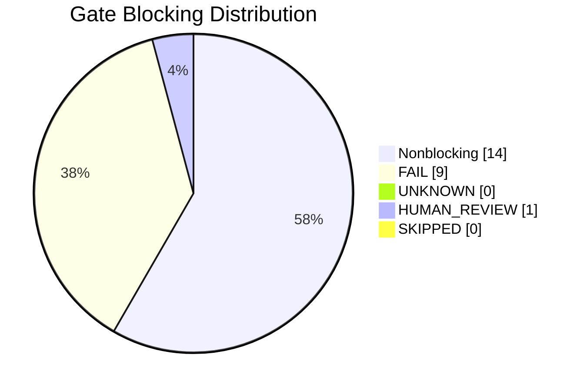
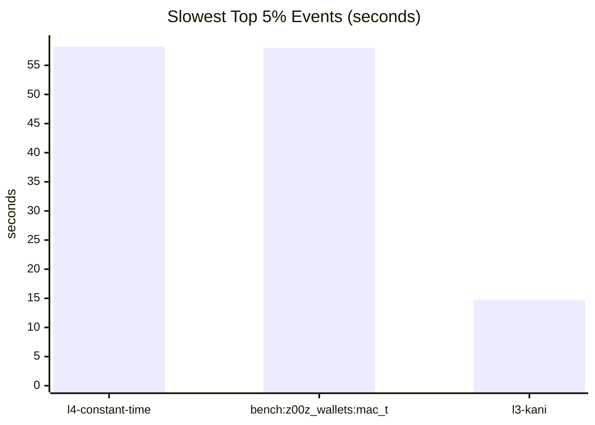

<!-- z00z-orchestrator-report
scope=project
target=project
levels=l0,l1,l2,l3,l4
mode=report
format=.github/skills/z00z-verification-orchestrator/FORMAT.md
-->
# Z00Z Verification Orchestrator Report

## 🎯 Executive Verdict

- Overall status: `FAIL`
- Scope: `project`
- Mode: `report`
- Levels: `l0,l1,l2,l3,l4`
- Run root: `reports/z00z-verification-orchestrator-20260701-155618`
- Evidence basis: `24` gates, `55` profiling events, `7723` tracked files inventoried
- Blocking counts: fail `9`, unknown `0`, human-review `1`, skipped `0`
- Integration contract: leaked output gates `0`; crate-unmapped files `0`

## 📦 Evidence Provenance

- Generated UTC: `2026-07-01T15:58:18Z`
- Run root: `reports/z00z-verification-orchestrator-20260701-155618`
- Timestamp stamp: `20260701-155618`
- Report format: `.github/skills/z00z-verification-orchestrator/FORMAT.md`
- Stale verifier run roots compacted before start: `0`
- External interferer processes killed: `0`
- Mode: `report`
- Scope: `project`
- Target: `project`
- Levels: `l0,l1,l2,l3,l4`
- Release profile args: `--release`
- Cache root: `reports/z00z-verification-orchestrator-20260701-155618/.cache`
- Cargo home: `tools/formal_verification/cargo`
- Cargo install root: `reports/z00z-verification-orchestrator-20260701-155618/.cache/cargo-install`
- Canonical tmp root: `reports/z00z-verification-orchestrator-20260701-155618/tmp20260701-155618`
- Specs runtime root: `reports/z00z-verification-orchestrator-20260701-155618/specs20260701-155618`
- Verification runtime root: `reports/z00z-verification-orchestrator-20260701-155618/verification20260701-155618`
- Fuzz runtime root: `reports/z00z-verification-orchestrator-20260701-155618/fuzz20260701-155618`
- Cargo target dir: `reports/z00z-verification-orchestrator-20260701-155618/target`
- Python bytecode writes disabled: `1`
- Protected vendor path touched: `0`
- Core evidence paths: `reports/z00z-verification-orchestrator-20260701-155618/logs`, `reports/z00z-verification-orchestrator-20260701-155618/profiling/events.tsv`, `reports/z00z-verification-orchestrator-20260701-155618/profiling/summary.json`, `reports/z00z-verification-orchestrator-20260701-155618/profiling/tool-availability.json`, `reports/z00z-verification-orchestrator-20260701-155618/profiling/resources-summary.json`, `reports/z00z-verification-orchestrator-20260701-155618/profiling/run-footprint.json`, `reports/z00z-verification-orchestrator-20260701-155618/profiling/hjmt-summary.json`, `reports/z00z-verification-orchestrator-20260701-155618/security/adversarial-summary.json`
- Coverage evidence paths: `reports/z00z-verification-orchestrator-20260701-155618/coverage/manifest.tsv`, `reports/z00z-verification-orchestrator-20260701-155618/coverage/summary.json`
- Runtime bootstrap summary path: `reports/z00z-verification-orchestrator-20260701-155618/runtime-bootstrap-summary.json`
- Report validation summary: `reports/z00z-verification-orchestrator-20260701-155618/report-validation.json`

## 🚦 Gate Matrix

| Gate | Checker module | Status | Elapsed (s) | Log | Primary artifacts |
| --- | --- | --- | --- | --- | --- |
| `l0-docs` | `.github/skills/z00z-l0-spec-gate/scripts/check-docs.sh` | `FAIL` | `0.083` | `reports/z00z-verification-orchestrator-20260701-155618/logs/l0-docs.log` | `reports/z00z-verification-orchestrator-20260701-155618/logs/l0-docs.log` |
| `l1-alloy` | `.github/skills/z00z-l1-protocol-model-gate/scripts/run-alloy.sh` | `MODEL_CHECKED` | `0.411` | `reports/z00z-verification-orchestrator-20260701-155618/logs/l1-alloy.log` | `reports/z00z-verification-orchestrator-20260701-155618/specs20260701-155618/alloy` |
| `l1-apalache` | `.github/skills/z00z-l1-protocol-model-gate/scripts/run-apalache.sh` | `MODEL_CHECKED` | `11.320` | `reports/z00z-verification-orchestrator-20260701-155618/logs/l1-apalache.log` | `reports/z00z-verification-orchestrator-20260701-155618/verification20260701-155618/l1/apalache` |
| `l1-tla` | `.github/skills/z00z-l1-protocol-model-gate/scripts/run-tla.sh` | `MODEL_CHECKED` | `1.365` | `reports/z00z-verification-orchestrator-20260701-155618/logs/l1-tla.log` | `reports/z00z-verification-orchestrator-20260701-155618/verification20260701-155618/l1/tla-states; reports/z00z-verification-orchestrator-20260701-155618/verification20260701-155618/l1/tla-user` |
| `l2-aeneas` | `.github/skills/z00z-code-to-logic-gate/scripts/run-aeneas.sh` | `TESTED` | `1.066` | `reports/z00z-verification-orchestrator-20260701-155618/logs/l2-aeneas.log` | `reports/z00z-verification-orchestrator-20260701-155618/verification20260701-155618/code-to-logic` |
| `l2-charon` | `.github/skills/z00z-code-to-logic-gate/scripts/run-charon.sh` | `TESTED` | `3.451` | `reports/z00z-verification-orchestrator-20260701-155618/logs/l2-charon.log` | `reports/z00z-verification-orchestrator-20260701-155618/verification20260701-155618/code-to-logic` |
| `l2-crux-mir` | `.github/skills/z00z-code-to-logic-gate/scripts/run-crux-mir.sh` | `BOUNDED_VERIFIED` | `6.589` | `reports/z00z-verification-orchestrator-20260701-155618/logs/l2-crux-mir.log` | `reports/z00z-verification-orchestrator-20260701-155618/verification20260701-155618/code-to-logic` |
| `l2-cryptol` | `.github/skills/z00z-code-to-logic-gate/scripts/run-cryptol.sh` | `TESTED` | `0.338` | `reports/z00z-verification-orchestrator-20260701-155618/logs/l2-cryptol.log` | `reports/z00z-verification-orchestrator-20260701-155618/verification20260701-155618/code-to-logic` |
| `l2-domain` | `.github/skills/z00z-l2-crypto-protocol-gate/scripts/check-domain-separation.py` | `PASS` | `0.300` | `reports/z00z-verification-orchestrator-20260701-155618/logs/l2-domain.log` | `reports/z00z-verification-orchestrator-20260701-155618/specs20260701-155618/crypto` |
| `l2-hax` | `.github/skills/z00z-l2-crypto-protocol-gate/scripts/run-hax.sh` | `FAIL` | `0.388` | `reports/z00z-verification-orchestrator-20260701-155618/logs/l2-hax.log` | `reports/z00z-verification-orchestrator-20260701-155618/verification20260701-155618/l2/hax` |
| `l2-proverif` | `.github/skills/z00z-l2-crypto-protocol-gate/scripts/run-proverif.sh` | `SECURITY_PROTOCOL_PROVED` | `0.253` | `reports/z00z-verification-orchestrator-20260701-155618/logs/l2-proverif.log` | `reports/z00z-verification-orchestrator-20260701-155618/specs20260701-155618/proverif` |
| `l2-refinement-map` | `.github/skills/z00z-code-to-logic-gate/scripts/check-refinement-map.py` | `TESTED` | `0.262` | `reports/z00z-verification-orchestrator-20260701-155618/logs/l2-refinement-map.log` | `reports/z00z-verification-orchestrator-20260701-155618/verification20260701-155618/code-to-logic` |
| `l2-saw` | `.github/skills/z00z-code-to-logic-gate/scripts/run-saw.sh` | `FORMALLY_PROVED` | `12.298` | `reports/z00z-verification-orchestrator-20260701-155618/logs/l2-saw.log` | `reports/z00z-verification-orchestrator-20260701-155618/verification20260701-155618/code-to-logic` |
| `l2-tamarin` | `.github/skills/z00z-l2-crypto-protocol-gate/scripts/run-tamarin.sh` | `FAIL` | `0.220` | `reports/z00z-verification-orchestrator-20260701-155618/logs/l2-tamarin.log` | `reports/z00z-verification-orchestrator-20260701-155618/specs20260701-155618/tamarin; reports/z00z-verification-orchestrator-20260701-155618/tmp20260701-155618/tamarin` |
| `l2-transcript` | `.github/skills/z00z-l2-crypto-protocol-gate/scripts/check-transcript-binding.py` | `PASS` | `0.264` | `reports/z00z-verification-orchestrator-20260701-155618/logs/l2-transcript.log` | `reports/z00z-verification-orchestrator-20260701-155618/specs20260701-155618/crypto` |
| `l3-kani` | `.github/skills/z00z-l3-rust-implementation-gate/scripts/verify-kani.sh` | `FAIL` | `14.734` | `reports/z00z-verification-orchestrator-20260701-155618/logs/l3-kani.log` | `reports/z00z-verification-orchestrator-20260701-155618/target` |
| `l3-miri` | `.github/skills/z00z-l3-rust-implementation-gate/scripts/verify-miri.sh` | `FAIL` | `0.362` | `reports/z00z-verification-orchestrator-20260701-155618/logs/l3-miri.log` | `reports/z00z-verification-orchestrator-20260701-155618/target` |
| `l3-verify-fast` | `.github/skills/z00z-l3-rust-implementation-gate/scripts/verify-fast.sh` | `FAIL` | `0.088` | `reports/z00z-verification-orchestrator-20260701-155618/logs/l3-verify-fast.log` | `reports/z00z-verification-orchestrator-20260701-155618/target` |
| `l3-verus` | `.github/skills/z00z-l3-rust-implementation-gate/scripts/verify-verus.sh` | `FAIL` | `0.125` | `reports/z00z-verification-orchestrator-20260701-155618/logs/l3-verus.log` | `reports/z00z-verification-orchestrator-20260701-155618/target` |
| `l4-adversarial-review` | `.github/skills/z00z-verification-orchestrator/scripts/run-security-brainstorm.py` | `NEEDS_HUMAN_CRYPTO_REVIEW` | `0.971` | `reports/z00z-verification-orchestrator-20260701-155618/logs/l4-adversarial-review.log` | `reports/z00z-verification-orchestrator-20260701-155618/security/adversarial-summary.json; reports/z00z-verification-orchestrator-20260701-155618/security/adversarial-review.md` |
| `l4-constant-time` | `.github/skills/z00z-l4-security-engineering-gate/scripts/run-constant-time.sh` | `TESTED` | `58.218` | `reports/z00z-verification-orchestrator-20260701-155618/logs/l4-constant-time.log` | `reports/z00z-verification-orchestrator-20260701-155618/target/release` |
| `l4-fuzz` | `.github/skills/z00z-l4-security-engineering-gate/scripts/run-fuzz-short.sh` | `FAIL` | `0.278` | `reports/z00z-verification-orchestrator-20260701-155618/logs/l4-fuzz.log` | `reports/z00z-verification-orchestrator-20260701-155618/fuzz20260701-155618` |
| `l4-supply-chain` | `.github/skills/z00z-l4-security-engineering-gate/scripts/audit-supply-chain.sh` | `FAIL` | `0.090` | `reports/z00z-verification-orchestrator-20260701-155618/logs/l4-supply-chain.log` | `-` |
| `l4-unsafe` | `.github/skills/z00z-l4-security-engineering-gate/scripts/unsafe-report.sh` | `TESTED` | `1.237` | `reports/z00z-verification-orchestrator-20260701-155618/logs/l4-unsafe.log` | `reports/z00z-verification-orchestrator-20260701-155618/vendor/vendor-unsafe.md; reports/z00z-verification-orchestrator-20260701-155618/geiger` |

## 🧪 Conclusion Ledger

| Gate | Checker module | Machine conclusion | Validity ceiling | Anchoring artifact |
| --- | --- | --- | --- | --- |
| `l0-docs` | `.github/skills/z00z-l0-spec-gate/scripts/check-docs.sh` | `FAIL` | checker failed or the artifact confinement contract was violated, so the claimed property is not established | `reports/z00z-verification-orchestrator-20260701-155618/logs/l0-docs.log` |
| `l1-alloy` | `.github/skills/z00z-l1-protocol-model-gate/scripts/run-alloy.sh` | `MODEL_CHECKED` | model checker found no counterexample in the configured abstract model and scope | `reports/z00z-verification-orchestrator-20260701-155618/logs/l1-alloy.log` |
| `l1-apalache` | `.github/skills/z00z-l1-protocol-model-gate/scripts/run-apalache.sh` | `MODEL_CHECKED` | model checker found no counterexample in the configured abstract model and scope | `reports/z00z-verification-orchestrator-20260701-155618/logs/l1-apalache.log` |
| `l1-tla` | `.github/skills/z00z-l1-protocol-model-gate/scripts/run-tla.sh` | `MODEL_CHECKED` | model checker found no counterexample in the configured abstract model and scope | `reports/z00z-verification-orchestrator-20260701-155618/logs/l1-tla.log` |
| `l2-aeneas` | `.github/skills/z00z-code-to-logic-gate/scripts/run-aeneas.sh` | `TESTED` | runtime or executable check passed for the configured artifact; this is not a proof | `reports/z00z-verification-orchestrator-20260701-155618/logs/l2-aeneas.log` |
| `l2-charon` | `.github/skills/z00z-code-to-logic-gate/scripts/run-charon.sh` | `TESTED` | runtime or executable check passed for the configured artifact; this is not a proof | `reports/z00z-verification-orchestrator-20260701-155618/logs/l2-charon.log` |
| `l2-crux-mir` | `.github/skills/z00z-code-to-logic-gate/scripts/run-crux-mir.sh` | `BOUNDED_VERIFIED` | bounded symbolic/model search completed successfully for the configured harness bounds | `reports/z00z-verification-orchestrator-20260701-155618/logs/l2-crux-mir.log` |
| `l2-cryptol` | `.github/skills/z00z-code-to-logic-gate/scripts/run-cryptol.sh` | `TESTED` | runtime or executable check passed for the configured artifact; this is not a proof | `reports/z00z-verification-orchestrator-20260701-155618/logs/l2-cryptol.log` |
| `l2-domain` | `.github/skills/z00z-l2-crypto-protocol-gate/scripts/check-domain-separation.py` | `PASS` | checker ran successfully but did not emit a stronger proof-grade classification | `reports/z00z-verification-orchestrator-20260701-155618/logs/l2-domain.log` |
| `l2-hax` | `.github/skills/z00z-l2-crypto-protocol-gate/scripts/run-hax.sh` | `FAIL` | checker failed or the artifact confinement contract was violated, so the claimed property is not established | `reports/z00z-verification-orchestrator-20260701-155618/logs/l2-hax.log` |
| `l2-proverif` | `.github/skills/z00z-l2-crypto-protocol-gate/scripts/run-proverif.sh` | `SECURITY_PROTOCOL_PROVED` | symbolic protocol proof completed for the configured model and claims | `reports/z00z-verification-orchestrator-20260701-155618/logs/l2-proverif.log` |
| `l2-refinement-map` | `.github/skills/z00z-code-to-logic-gate/scripts/check-refinement-map.py` | `TESTED` | runtime or executable check passed for the configured artifact; this is not a proof | `reports/z00z-verification-orchestrator-20260701-155618/logs/l2-refinement-map.log` |
| `l2-saw` | `.github/skills/z00z-code-to-logic-gate/scripts/run-saw.sh` | `FORMALLY_PROVED` | proof-oriented checker discharged the configured artifact, not an unstated larger surface | `reports/z00z-verification-orchestrator-20260701-155618/logs/l2-saw.log` |
| `l2-tamarin` | `.github/skills/z00z-l2-crypto-protocol-gate/scripts/run-tamarin.sh` | `FAIL` | checker failed or the artifact confinement contract was violated, so the claimed property is not established | `reports/z00z-verification-orchestrator-20260701-155618/logs/l2-tamarin.log` |
| `l2-transcript` | `.github/skills/z00z-l2-crypto-protocol-gate/scripts/check-transcript-binding.py` | `PASS` | checker ran successfully but did not emit a stronger proof-grade classification | `reports/z00z-verification-orchestrator-20260701-155618/logs/l2-transcript.log` |
| `l3-kani` | `.github/skills/z00z-l3-rust-implementation-gate/scripts/verify-kani.sh` | `FAIL` | checker failed or the artifact confinement contract was violated, so the claimed property is not established | `reports/z00z-verification-orchestrator-20260701-155618/logs/l3-kani.log` |
| `l3-miri` | `.github/skills/z00z-l3-rust-implementation-gate/scripts/verify-miri.sh` | `FAIL` | checker failed or the artifact confinement contract was violated, so the claimed property is not established | `reports/z00z-verification-orchestrator-20260701-155618/logs/l3-miri.log` |
| `l3-verify-fast` | `.github/skills/z00z-l3-rust-implementation-gate/scripts/verify-fast.sh` | `FAIL` | checker failed or the artifact confinement contract was violated, so the claimed property is not established | `reports/z00z-verification-orchestrator-20260701-155618/logs/l3-verify-fast.log` |
| `l3-verus` | `.github/skills/z00z-l3-rust-implementation-gate/scripts/verify-verus.sh` | `FAIL` | checker failed or the artifact confinement contract was violated, so the claimed property is not established | `reports/z00z-verification-orchestrator-20260701-155618/logs/l3-verus.log` |
| `l4-adversarial-review` | `.github/skills/z00z-verification-orchestrator/scripts/run-security-brainstorm.py` | `NEEDS_HUMAN_CRYPTO_REVIEW` | machine heuristics found risk hypotheses that remain unproven and require expert cryptographic review | `reports/z00z-verification-orchestrator-20260701-155618/logs/l4-adversarial-review.log` |
| `l4-constant-time` | `.github/skills/z00z-l4-security-engineering-gate/scripts/run-constant-time.sh` | `TESTED` | runtime or executable check passed for the configured artifact; this is not a proof | `reports/z00z-verification-orchestrator-20260701-155618/logs/l4-constant-time.log` |
| `l4-fuzz` | `.github/skills/z00z-l4-security-engineering-gate/scripts/run-fuzz-short.sh` | `FAIL` | checker failed or the artifact confinement contract was violated, so the claimed property is not established | `reports/z00z-verification-orchestrator-20260701-155618/logs/l4-fuzz.log` |
| `l4-supply-chain` | `.github/skills/z00z-l4-security-engineering-gate/scripts/audit-supply-chain.sh` | `FAIL` | checker failed or the artifact confinement contract was violated, so the claimed property is not established | `reports/z00z-verification-orchestrator-20260701-155618/logs/l4-supply-chain.log` |
| `l4-unsafe` | `.github/skills/z00z-l4-security-engineering-gate/scripts/unsafe-report.sh` | `TESTED` | runtime or executable check passed for the configured artifact; this is not a proof | `reports/z00z-verification-orchestrator-20260701-155618/logs/l4-unsafe.log` |

## 🔍 Validity And Doublecheck

- The orchestrator does not upgrade conclusions above raw tool evidence. A gate is only stronger than `PASS` when the underlying log emitted `TESTED`, `BOUNDED_VERIFIED`, `MODEL_CHECKED`, `FORMALLY_PROVED`, or `SECURITY_PROTOCOL_PROVED`.
- Missing tools, missing models, missing specs, and non-closed semantic gaps stay `UNKNOWN`.
- High-risk adversarial hypotheses stay `NEEDS_HUMAN_CRYPTO_REVIEW`; they are not treated as proven exploits.
- Artifact traceability lives in this run root only: logs in `logs/`, gate state under `specs*`, `verification*`, `fuzz*`, temp state under `tmp*`, profiling in `profiling/`.
- Canonical artifact contract check: no unauthorized root/runtime leak was detected.
- Production/dev cache observation: no `repo/.cache` mutation manifest was captured during this run.
- Kani validity note: this run requested `--release`, but `cargo-kani` executed in its supported test-profile flow; treat `l3-kani` as bounded harness evidence, not release-codegen equivalence.
- Doublecheck inputs: `reports/z00z-verification-orchestrator-20260701-155618/logs`, `reports/z00z-verification-orchestrator-20260701-155618/profiling/summary.json`, `-`, `reports/z00z-verification-orchestrator-20260701-155618/runtime-bootstrap-summary.json`, `reports/z00z-verification-orchestrator-20260701-155618/security/adversarial-summary.json`.

## 🏗️ Bootstrap Artifact Provenance

- Report mode did not edit repo-owned verification artifacts.
- Report-local runtime verifier assets may be staged under the active run root.
- Runtime bootstrap summary: `reports/z00z-verification-orchestrator-20260701-155618/runtime-bootstrap-summary.json`

## 📊 Performance And Resource Profiling

- Profiler tool inventory: `reports/z00z-verification-orchestrator-20260701-155618/profiling/tool-availability.json`

| Tool | Available | Path | Version |
| --- | --- | --- | --- |
| `gnu_time` | `no` | `-` | `-` |
| `perf` | `no` | `-` | `-` |
| `strace` | `no` | `-` | `-` |
| `valgrind` | `no` | `-` | `-` |
| `flamegraph` | `no` | `-` | `-` |
| `cargo-flamegraph` | `no` | `-` | `-` |
| `hyperfine` | `no` | `-` | `-` |
| `heaptrack` | `no` | `-` | `-` |

- Profiling events: `reports/z00z-verification-orchestrator-20260701-155618/profiling/events.tsv`
- Profiling summary: `reports/z00z-verification-orchestrator-20260701-155618/profiling/summary.json`
- Resource profiles: `reports/z00z-verification-orchestrator-20260701-155618/profiling/resources`
- Resource summary: `reports/z00z-verification-orchestrator-20260701-155618/profiling/resources-summary.json`
- Run-footprint summary: `reports/z00z-verification-orchestrator-20260701-155618/profiling/run-footprint.json`
- Profiled events: `55` total, `24` gate-level, `31` command-level
- Slowest slice reported: top `5%` => `3` events consuming `130.943`s / `209.11`s total (`62.62%`)

| Kind | Label | Status | Elapsed (s) | Command | Recommendation |
| --- | --- | --- | --- | --- | --- |
| `gate` | `l4-constant-time` | `TESTED` | `58.218` | `env Z00Z_DUDECT_ROOT=/workspace/z00z/reports/z00z-verification-orchestrator-20260701-155618/verification20260701-1556...` | `Reuse built constant-time benches and separate leak-detection smoke from longer statistical campaigns.; Prefer memory-first handoff for intermediate state an...` |
| `command` | `bench:z00z_wallets:mac_timing` | `exit:0` | `57.991` | `cargo bench -p z00z_wallets --bench mac_timing -- --test` | `Keep one stable release feature set so Cargo can reuse compiled artifacts across gates.; Prebuild shared test binaries once and prefer reuse over repeating c...` |
| `gate` | `l3-kani` | `FAIL` | `14.734` | `/workspace/z00z/.github/skills/z00z-l3-rust-implementation-gate/scripts/verify-kani.sh` | `Keep one stable release feature set so Cargo can reuse compiled artifacts across gates.; Prebuild shared test binaries once and prefer reuse over repeating c...` |

Aggregate acceleration candidates:
- Reuse built constant-time benches and separate leak-detection smoke from longer statistical campaigns.
- Prefer memory-first handoff for intermediate state and checkpoint to disk only for final evidence artifacts.
- Keep one stable release feature set so Cargo can reuse compiled artifacts across gates.
- Prebuild shared test binaries once and prefer reuse over repeating compile+run cycles.
- Narrow proof/interpreter targets to the smallest crate or harness set that still covers the intended invariant.

- Profiling guidance source: `.planning/phases/profiling-comprehensive.md`

- GNU time resource profiles were not captured.

- Active run-root disk footprint: `1.10 GiB`
- Stale verifier run-root cleanup: `9` invocation(s), `0` trashed run root(s), `0.00 B` reclaimed, `0.001`s total overhead.

| Top-level path | Kind | Size |
| --- | --- | --- |
| `target` | `dir` | `1021.78 MiB` |
| `verification20260701-155618` | `dir` | `87.34 MiB` |
| `tmp20260701-155618` | `dir` | `20.73 MiB` |
| `security` | `dir` | `441.31 KiB` |
| `logs` | `dir` | `77.84 KiB` |
| `specs20260701-155618` | `dir` | `43.81 KiB` |
| `profiling` | `dir` | `33.80 KiB` |
| `runtime-bootstrap-summary.json` | `file` | `7.54 KiB` |

Largest files:
- `target/release/deps/libz00z_wallets.rlib` => `70.43 MiB`
- `target/release/deps/libz00z_storage-dd1c1927bfcd9e33.rlib` => `20.36 MiB`
- `target/release/deps/libzerocopy-048f41b796292fb8.rlib` => `14.72 MiB`
- `target/release/deps/libzerocopy-048f41b796292fb8.rmeta` => `14.72 MiB`
- `target/release/deps/libz00z_core-44db79d4ec087b6f.rlib` => `13.32 MiB`

## 🌲 HJMT Runtime Evidence

- HJMT summary: `reports/z00z-verification-orchestrator-20260701-155618/profiling/hjmt-summary.json`
- No HJMT artifact pair was found under the active run root.
- TPS status: not measured in this run because no active-run HJMT or throughput artifact was produced.

## 🗺️ Coverage Inventory

- Tracked files inventoried: `7723`
- Coverage manifest: `reports/z00z-verification-orchestrator-20260701-155618/coverage/manifest.tsv`
- Coverage summary: `reports/z00z-verification-orchestrator-20260701-155618/coverage/summary.json`
- Coverage status counts: fail `1761`, skipped `0`, unknown `0`, unmapped `5878`
- Crate-unmapped tracked files: `0`

## 🚨 Risk Register

- Severity below is orchestrator triage severity, not exploit-proof severity.

| Class | Source | Severity | Rationale | Anchor |
| --- | --- | --- | --- | --- |
| `gate-blocker` | `l0-docs` | `high` | gate failed or artifact-confinement contract broke | `reports/z00z-verification-orchestrator-20260701-155618/logs/l0-docs.log` |
| `gate-blocker` | `l2-hax` | `high` | gate failed or artifact-confinement contract broke | `reports/z00z-verification-orchestrator-20260701-155618/logs/l2-hax.log` |
| `gate-blocker` | `l2-tamarin` | `high` | gate failed or artifact-confinement contract broke | `reports/z00z-verification-orchestrator-20260701-155618/logs/l2-tamarin.log` |
| `gate-blocker` | `l3-kani` | `high` | gate failed or artifact-confinement contract broke | `reports/z00z-verification-orchestrator-20260701-155618/logs/l3-kani.log` |
| `gate-blocker` | `l3-miri` | `high` | gate failed or artifact-confinement contract broke | `reports/z00z-verification-orchestrator-20260701-155618/logs/l3-miri.log` |
| `gate-blocker` | `l3-verify-fast` | `high` | gate failed or artifact-confinement contract broke | `reports/z00z-verification-orchestrator-20260701-155618/logs/l3-verify-fast.log` |
| `gate-blocker` | `l3-verus` | `high` | gate failed or artifact-confinement contract broke | `reports/z00z-verification-orchestrator-20260701-155618/logs/l3-verus.log` |
| `expert-review` | `l4-adversarial-review` | `high` | machine review raised crypto/security hypotheses that remain open | `reports/z00z-verification-orchestrator-20260701-155618/logs/l4-adversarial-review.log` |
| `gate-blocker` | `l4-fuzz` | `high` | gate failed or artifact-confinement contract broke | `reports/z00z-verification-orchestrator-20260701-155618/logs/l4-fuzz.log` |
| `gate-blocker` | `l4-supply-chain` | `high` | gate failed or artifact-confinement contract broke | `reports/z00z-verification-orchestrator-20260701-155618/logs/l4-supply-chain.log` |
| `adversarial` | `cross-crate` | `high` | Checkpoint lineage and delta integrity | `crates/z00z_runtime/aggregators/src/batch_planner.rs, crates/z00z_runtime/aggregators/src/consensus_adapter.rs` |
| `adversarial` | `cross-crate` | `high` | PaymentRequest replay and compact-request rebinding | `crates/z00z_crypto/src/domains.rs, crates/z00z_crypto/src/error.rs` |
| `adversarial` | `cross-crate` | `high` | Stealth delivery and inbox notification confusion | `crates/z00z_crypto/src/claim.rs, crates/z00z_crypto/src/domains.rs` |
| `adversarial` | `crate` | `high` | Crate-level concentration of adversarial signals in crates/z00z_crypto/tari/crypto | `crates/z00z_crypto/tari/crypto/src/compressed_key.rs, crates/z00z_crypto/tari/crypto/src/lib.rs` |
| `adversarial` | `crate` | `high` | Crate-level concentration of adversarial signals in crates/z00z_storage | `crates/z00z_storage/src/backend/query.rs, crates/z00z_storage/src/backend/redb/helpers.rs` |

### Gate Evidence Highlights

### l0-docs

- Status: `FAIL`
- Checker module: `.github/skills/z00z-l0-spec-gate/scripts/check-docs.sh`
- Log: `reports/z00z-verification-orchestrator-20260701-155618/logs/l0-docs.log`
- Primary artifacts: `reports/z00z-verification-orchestrator-20260701-155618/logs/l0-docs.log`
- Tail: `env: '/workspace/z00z/.github/skills/z00z-verification-orchestrator/scripts/check-docs.sh': No such file or directory`

### l2-hax

- Status: `FAIL`
- Checker module: `.github/skills/z00z-l2-crypto-protocol-gate/scripts/run-hax.sh`
- Log: `reports/z00z-verification-orchestrator-20260701-155618/logs/l2-hax.log`
- Primary artifacts: `reports/z00z-verification-orchestrator-20260701-155618/verification20260701-155618/l2/hax`
- Evidence: `thread 'main' (1396) panicked at cli/subcommands/src/cargo_hax.rs:389:66:`

### l2-tamarin

- Status: `FAIL`
- Checker module: `.github/skills/z00z-l2-crypto-protocol-gate/scripts/run-tamarin.sh`
- Log: `reports/z00z-verification-orchestrator-20260701-155618/logs/l2-tamarin.log`
- Primary artifacts: `reports/z00z-verification-orchestrator-20260701-155618/specs20260701-155618/tamarin,reports/z00z-verification-orchestrator-20260701-155618/tmp20260701-155618/tamarin`
- Tail: `[ ]`
- Tail: `/* has exactly the trivial AC variant */`
- Tail: `lemma observe_implies_publish:`
- Tail: `all-traces`
- Tail: `"tamarin-prover: <stdout>: commitBuffer: invalid argument (cannot encode character '\8704')`

### l3-kani

- Status: `FAIL`
- Checker module: `.github/skills/z00z-l3-rust-implementation-gate/scripts/verify-kani.sh`
- Log: `reports/z00z-verification-orchestrator-20260701-155618/logs/l3-kani.log`
- Primary artifacts: `reports/z00z-verification-orchestrator-20260701-155618/target`
- Tail: `[z00z-l3:kani] cargo kani  -p z00z_core --tests --all-features --exact --harness test_version_partition_total --output-format terse`
- Tail: `Kani Rust Verifier 0.67.0 (cargo plugin)`
- Tail: `error: Failed to get cargo metadata.: `cargo metadata` exited with an error: error: failed to download `ab_glyph v0.2.32``
- Tail: `Caused by:`
- Tail: `attempting to make an HTTP request, but --offline was specified`

### l3-miri

- Status: `FAIL`
- Checker module: `.github/skills/z00z-l3-rust-implementation-gate/scripts/verify-miri.sh`
- Log: `reports/z00z-verification-orchestrator-20260701-155618/logs/l3-miri.log`
- Primary artifacts: `reports/z00z-verification-orchestrator-20260701-155618/target`
- Tail: `[z00z-l3:miri] cargo +nightly miri test --manifest-path /workspace/z00z/Cargo.toml --release -p z00z_utils --lib os_hardening:: --all-features (MIRIFLAGS=-Zmiri-disable-isolation, MIRI_SYSROOT=tools/formal_verification/miri/sysroot)`
- Tail: `error: failed to download `prometheus v0.14.0``
- Tail: `Caused by:`
- Tail: `attempting to make an HTTP request, but --offline was specified`

### l3-verify-fast

- Status: `FAIL`
- Checker module: `.github/skills/z00z-l3-rust-implementation-gate/scripts/verify-fast.sh`
- Log: `reports/z00z-verification-orchestrator-20260701-155618/logs/l3-verify-fast.log`
- Primary artifacts: `reports/z00z-verification-orchestrator-20260701-155618/target`
- Tail: `env: '/workspace/z00z/.github/skills/z00z-verification-orchestrator/scripts/verify-fast.sh': No such file or directory`

### l3-verus

- Status: `FAIL`
- Checker module: `.github/skills/z00z-l3-rust-implementation-gate/scripts/verify-verus.sh`
- Log: `reports/z00z-verification-orchestrator-20260701-155618/logs/l3-verus.log`
- Primary artifacts: `reports/z00z-verification-orchestrator-20260701-155618/target`
- Tail: `verus: required rust toolchain 1.96.0-x86_64-unknown-linux-gnu not found`
- Tail: `run the following command (in a bash-compatible shell) to install the necessary toolchain:`
- Tail: `rustup install 1.96.0-x86_64-unknown-linux-gnu`
- Tail: `error: toolchain '1.96.0-x86_64-unknown-linux-gnu' is not installed`
- Tail: `help: run `rustup toolchain install 1.96.0-x86_64-unknown-linux-gnu` to install it`

### l4-adversarial-review

- Status: `NEEDS_HUMAN_CRYPTO_REVIEW`
- Checker module: `.github/skills/z00z-verification-orchestrator/scripts/run-security-brainstorm.py`
- Log: `reports/z00z-verification-orchestrator-20260701-155618/logs/l4-adversarial-review.log`
- Primary artifacts: `reports/z00z-verification-orchestrator-20260701-155618/security/adversarial-summary.json,reports/z00z-verification-orchestrator-20260701-155618/security/adversarial-review.md`
- Evidence: `NEEDS_HUMAN_CRYPTO_REVIEW: 13 high-risk adversarial security scenarios need human crypto review`

### l4-fuzz

- Status: `FAIL`
- Checker module: `.github/skills/z00z-l4-security-engineering-gate/scripts/run-fuzz-short.sh`
- Log: `reports/z00z-verification-orchestrator-20260701-155618/logs/l4-fuzz.log`
- Primary artifacts: `reports/z00z-verification-orchestrator-20260701-155618/fuzz20260701-155618`
- Tail: `location searched: crates.io index`
- Tail: `required by package `z00z-fuzz v0.0.0 (/workspace/z00z/reports/z00z-verification-orchestrator-20260701-155618/fuzz20260701-155618)``
- Tail: `note: offline mode (via `--offline`) can sometimes cause surprising resolution failures`
- Tail: `help: if this error is too confusing you may wish to retry without `--offline``
- Tail: `Error: failed to build fuzz script: ASAN_OPTIONS="detect_odr_violation=0" RUSTFLAGS=" -Cpasses=sancov-module -Cllvm-args=-sanitizer-coverage-level=4 -Cllvm-args=-sanitizer-coverage-inline-8bit-counters -Cllvm-args=-sanitizer-coverage-pc-table -Cllvm-args=-sanitizer-coverage-trace-compares --cfg fuzzing -Cllvm-args=-simplifycfg-branch-fold-threshold=0 -Zsanitizer=address -Cllvm-args=-sanitizer-coverage-stack-depth -Ccodegen-units=1" "cargo" "build" "--manifest-path" "/workspace/z00z/reports/z00z-verification-orchestrator-20260701-155618/fuzz20260701-155618/Cargo.toml" "--target" "x86_64-unknown-linux-gnu" "--release" "--config" "profile.release.debug=\"line-tables-only\"" "--bin" "payment_request_compact" "--target-dir" "/workspace/z00z/reports/z00z-verification-orchestrator-20260701-155618/fuzz20260701-155618/target"`

### l4-supply-chain

- Status: `FAIL`
- Checker module: `.github/skills/z00z-l4-security-engineering-gate/scripts/audit-supply-chain.sh`
- Log: `reports/z00z-verification-orchestrator-20260701-155618/logs/l4-supply-chain.log`
- Primary artifacts: `-`
- Tail: `env: '/workspace/z00z/.github/skills/z00z-verification-orchestrator/scripts/audit-supply-chain.sh': No such file or directory`

## 🔗 Supply-Chain Highlights

- No supply-chain summary artifact was produced in this pass.

## 🛡️ Adversarial Security Review

- Summary JSON: `reports/z00z-verification-orchestrator-20260701-155618/security/adversarial-summary.json`
- Code files scanned: `1055`
- Prompt sources scanned under `.github/`: `3126` with `2341` security-relevant
- Findings: `400` total; high `13`, medium `387`, low `0`
- Prompt corpus kinds: agent `43`, instruction `43`, instructions `1`, other `1478`, prompt `18`, requirement `3`, script `97`, skill `352`, template `207`, workflow `99`
- Classes: file `392`, module `3`, crate `2`, cross-crate `3`
- Ownership: project-owned `365`, protected-vendor `35`, mixed `0`
- Prompt corpus JSON: `reports/z00z-verification-orchestrator-20260701-155618/verification20260701-155618/security/prompt_corpus.json`
- Attack-surface registry JSON: `reports/z00z-verification-orchestrator-20260701-155618/verification20260701-155618/security/attack_surface_registry.json`
- Detailed report: `reports/z00z-verification-orchestrator-20260701-155618/security/adversarial-review.md`
- Summary JSON: `reports/z00z-verification-orchestrator-20260701-155618/security/adversarial-summary.json`

| Severity | Class | Ownership | Hypothesis | Evidence anchors |
| --- | --- | --- | --- | --- |
| `high` | `cross-crate` | `project-owned` | Checkpoint lineage and delta integrity | `crates/z00z_runtime/aggregators/src/batch_planner.rs`, `crates/z00z_runtime/aggregators/src/consensus_adapter.rs`, `crates/z00z_runtime/aggregators/src/dist_dispatch.rs` |
| `high` | `cross-crate` | `project-owned` | PaymentRequest replay and compact-request rebinding | `crates/z00z_crypto/src/domains.rs`, `crates/z00z_crypto/src/error.rs`, `crates/z00z_crypto/src/hash/policy.rs` |
| `high` | `cross-crate` | `project-owned` | Stealth delivery and inbox notification confusion | `crates/z00z_crypto/src/claim.rs`, `crates/z00z_crypto/src/domains.rs`, `crates/z00z_crypto/src/error.rs` |
| `high` | `crate` | `protected-vendor` | Crate-level concentration of adversarial signals in crates/z00z_crypto/tari/crypto | `crates/z00z_crypto/tari/crypto/src/compressed_key.rs`, `crates/z00z_crypto/tari/crypto/src/lib.rs`, `crates/z00z_crypto/tari/crypto/src/ristretto/bulletproofs_plus.rs` |
| `high` | `crate` | `project-owned` | Crate-level concentration of adversarial signals in crates/z00z_storage | `crates/z00z_storage/src/backend/query.rs`, `crates/z00z_storage/src/backend/redb/helpers.rs`, `crates/z00z_storage/src/checkpoint/audit.rs` |
| `high` | `module` | `protected-vendor` | Concentrated adversarial surface in module crates/z00z_crypto/tari/crypto/src/ristretto | `crates/z00z_crypto/tari/crypto/src/ristretto/bulletproofs_plus.rs`, `crates/z00z_crypto/tari/crypto/src/ristretto/constants.rs`, `crates/z00z_crypto/tari/crypto/src/ristretto/mod.rs` |
| `high` | `module` | `project-owned` | Concentrated adversarial surface in module crates/z00z_storage/src/settlement | `crates/z00z_storage/src/settlement/fee_envelope.rs`, `crates/z00z_storage/src/settlement/hjmt_batch_proof.rs`, `crates/z00z_storage/src/settlement/hjmt_journal.rs` |
| `high` | `module` | `project-owned` | Concentrated adversarial surface in module crates/z00z_wallets/src/rpc | `crates/z00z_wallets/src/rpc/app_types.rs`, `crates/z00z_wallets/src/rpc/asset_ownership_check.rs`, `crates/z00z_wallets/src/rpc/asset_rpc_impl.rs` |
| `high` | `file` | `project-owned` | Nondeterministic source in validator-like surface crates/z00z_storage/src/settlement/hjmt_scheduler.rs | `crates/z00z_storage/src/settlement/hjmt_scheduler.rs` |
| `high` | `file` | `project-owned` | Nondeterministic source in validator-like surface crates/z00z_storage/src/settlement/timing.rs | `crates/z00z_storage/src/settlement/timing.rs` |

- Highest-signal `.github/` prompt sources:
  - `agent` `.github/agents/gsd-debugger.agent.md` (categories: adversarial-review, attack-surface, crypto-review, fuzz-parser; excerpts: `8`)
  - `agent` `.github/agents/gsd-planner.agent.md` (categories: adversarial-review, attack-surface, crypto-review, fuzz-parser; excerpts: `8`)
  - `workflow` `.github/gsd-core/workflows/execute-phase.md` (categories: adversarial-review, attack-surface, crypto-review, fuzz-parser; excerpts: `8`)
  - `workflow` `.github/gsd-core/workflows/help/modes/full.md` (categories: adversarial-review, attack-surface, crypto-review, fuzz-parser; excerpts: `8`)
  - `workflow` `.github/gsd-core/workflows/plan-phase.md` (categories: adversarial-review, attack-surface, crypto-review, fuzz-parser; excerpts: `8`)
  - `other` `.github/gsd-local-patches/20260503T144940Z/.github/agents/gsd-debugger.agent.md` (categories: adversarial-review, attack-surface, crypto-review, fuzz-parser; excerpts: `8`)

Top hypotheses:
- `HIGH` `cross-crate` Checkpoint lineage and delta integrity -- evidence: `crates/z00z_runtime/aggregators/src/batch_planner.rs`, `crates/z00z_runtime/aggregators/src/consensus_adapter.rs`, `crates/z00z_runtime/aggregators/src/dist_dispatch.rs`
- `HIGH` `cross-crate` PaymentRequest replay and compact-request rebinding -- evidence: `crates/z00z_crypto/src/domains.rs`, `crates/z00z_crypto/src/error.rs`, `crates/z00z_crypto/src/hash/policy.rs`
- `HIGH` `cross-crate` Stealth delivery and inbox notification confusion -- evidence: `crates/z00z_crypto/src/claim.rs`, `crates/z00z_crypto/src/domains.rs`, `crates/z00z_crypto/src/error.rs`
- `HIGH` `crate` Crate-level concentration of adversarial signals in crates/z00z_crypto/tari/crypto -- evidence: `crates/z00z_crypto/tari/crypto/src/compressed_key.rs`, `crates/z00z_crypto/tari/crypto/src/lib.rs`, `crates/z00z_crypto/tari/crypto/src/ristretto/bulletproofs_plus.rs`
- `HIGH` `crate` Crate-level concentration of adversarial signals in crates/z00z_storage -- evidence: `crates/z00z_storage/src/backend/query.rs`, `crates/z00z_storage/src/backend/redb/helpers.rs`, `crates/z00z_storage/src/checkpoint/audit.rs`
- `HIGH` `module` Concentrated adversarial surface in module crates/z00z_crypto/tari/crypto/src/ristretto -- evidence: `crates/z00z_crypto/tari/crypto/src/ristretto/bulletproofs_plus.rs`, `crates/z00z_crypto/tari/crypto/src/ristretto/constants.rs`, `crates/z00z_crypto/tari/crypto/src/ristretto/mod.rs`

## 🧰 Project-Owned Fixable Findings

- `l0-docs` via `.github/skills/z00z-l0-spec-gate/scripts/check-docs.sh` => `FAIL`; log `reports/z00z-verification-orchestrator-20260701-155618/logs/l0-docs.log`
- `l2-hax` via `.github/skills/z00z-l2-crypto-protocol-gate/scripts/run-hax.sh` => `FAIL`; log `reports/z00z-verification-orchestrator-20260701-155618/logs/l2-hax.log`
- `l2-tamarin` via `.github/skills/z00z-l2-crypto-protocol-gate/scripts/run-tamarin.sh` => `FAIL`; log `reports/z00z-verification-orchestrator-20260701-155618/logs/l2-tamarin.log`
- `l3-kani` via `.github/skills/z00z-l3-rust-implementation-gate/scripts/verify-kani.sh` => `FAIL`; log `reports/z00z-verification-orchestrator-20260701-155618/logs/l3-kani.log`
- `l3-miri` via `.github/skills/z00z-l3-rust-implementation-gate/scripts/verify-miri.sh` => `FAIL`; log `reports/z00z-verification-orchestrator-20260701-155618/logs/l3-miri.log`
- `l3-verify-fast` via `.github/skills/z00z-l3-rust-implementation-gate/scripts/verify-fast.sh` => `FAIL`; log `reports/z00z-verification-orchestrator-20260701-155618/logs/l3-verify-fast.log`
- `l3-verus` via `.github/skills/z00z-l3-rust-implementation-gate/scripts/verify-verus.sh` => `FAIL`; log `reports/z00z-verification-orchestrator-20260701-155618/logs/l3-verus.log`
- `l4-adversarial-review` via `.github/skills/z00z-verification-orchestrator/scripts/run-security-brainstorm.py` => `NEEDS_HUMAN_CRYPTO_REVIEW`; log `reports/z00z-verification-orchestrator-20260701-155618/logs/l4-adversarial-review.log`
- `l4-fuzz` via `.github/skills/z00z-l4-security-engineering-gate/scripts/run-fuzz-short.sh` => `FAIL`; log `reports/z00z-verification-orchestrator-20260701-155618/logs/l4-fuzz.log`
- `l4-supply-chain` via `.github/skills/z00z-l4-security-engineering-gate/scripts/audit-supply-chain.sh` => `FAIL`; log `reports/z00z-verification-orchestrator-20260701-155618/logs/l4-supply-chain.log`

## 📚 Protected Vendor Findings

- Vendor unsafe facts found: `1`
- Vendor unsafe report: `reports/z00z-verification-orchestrator-20260701-155618/vendor/vendor-unsafe.md`
- Policy: do not auto-edit protected vendor code; only report, wrap, pin, upstream, or isolate.

## 🧩 Missing Evidence Or Missing Models

- No machine-visible missing-model or missing-tool gaps were left in this pass.

## ✅ Recommended Actions

### l0-docs

- Checker module: `.github/skills/z00z-l0-spec-gate/scripts/check-docs.sh`
- Status: `FAIL`
- Validity ceiling: checker failed or the artifact confinement contract was violated, so the claimed property is not established
- Anchor log: `reports/z00z-verification-orchestrator-20260701-155618/logs/l0-docs.log`
- Anchor artifacts: `reports/z00z-verification-orchestrator-20260701-155618/logs/l0-docs.log`
- Recommendation: format `deny.toml` with `taplo format deny.toml` and rerun the L0 gate so TOML drift stops hiding real semantic doc issues.
- Recommendation: if the repository intentionally has no canonical mdBook, scope that expectation explicitly in the L0 gate; otherwise add the missing book root so strict L0 runs do not fail on absent doc topology.

### l2-hax

- Checker module: `.github/skills/z00z-l2-crypto-protocol-gate/scripts/run-hax.sh`
- Status: `FAIL`
- Validity ceiling: checker failed or the artifact confinement contract was violated, so the claimed property is not established
- Anchor log: `reports/z00z-verification-orchestrator-20260701-155618/logs/l2-hax.log`
- Anchor artifacts: `reports/z00z-verification-orchestrator-20260701-155618/verification20260701-155618/l2/hax`
- Recommendation: use the anchor log and artifacts above to close the exact blocker before rerunning the full project pipeline.

### l2-tamarin

- Checker module: `.github/skills/z00z-l2-crypto-protocol-gate/scripts/run-tamarin.sh`
- Status: `FAIL`
- Validity ceiling: checker failed or the artifact confinement contract was violated, so the claimed property is not established
- Anchor log: `reports/z00z-verification-orchestrator-20260701-155618/logs/l2-tamarin.log`
- Anchor artifacts: `reports/z00z-verification-orchestrator-20260701-155618/specs20260701-155618/tamarin,reports/z00z-verification-orchestrator-20260701-155618/tmp20260701-155618/tamarin`
- Recommendation: use the anchor log and artifacts above to close the exact blocker before rerunning the full project pipeline.

### l3-kani

- Checker module: `.github/skills/z00z-l3-rust-implementation-gate/scripts/verify-kani.sh`
- Status: `FAIL`
- Validity ceiling: checker failed or the artifact confinement contract was violated, so the claimed property is not established
- Anchor log: `reports/z00z-verification-orchestrator-20260701-155618/logs/l3-kani.log`
- Anchor artifacts: `reports/z00z-verification-orchestrator-20260701-155618/target`
- Recommendation: use the anchor log and artifacts above to close the exact blocker before rerunning the full project pipeline.

### l3-miri

- Checker module: `.github/skills/z00z-l3-rust-implementation-gate/scripts/verify-miri.sh`
- Status: `FAIL`
- Validity ceiling: checker failed or the artifact confinement contract was violated, so the claimed property is not established
- Anchor log: `reports/z00z-verification-orchestrator-20260701-155618/logs/l3-miri.log`
- Anchor artifacts: `reports/z00z-verification-orchestrator-20260701-155618/target`
- Recommendation: use the anchor log and artifacts above to close the exact blocker before rerunning the full project pipeline.

### l3-verify-fast

- Checker module: `.github/skills/z00z-l3-rust-implementation-gate/scripts/verify-fast.sh`
- Status: `FAIL`
- Validity ceiling: checker failed or the artifact confinement contract was violated, so the claimed property is not established
- Anchor log: `reports/z00z-verification-orchestrator-20260701-155618/logs/l3-verify-fast.log`
- Anchor artifacts: `reports/z00z-verification-orchestrator-20260701-155618/target`
- Recommendation: rerun the exact failing ignored test and fix its statistical assumption before any broader rerun: `cargo test -p z00z_crypto --release --test test_h2scalar -- --ignored --exact test_h2scalar_distribution`.
- Recommendation: inspect `crates/z00z_crypto/tests/test_h2scalar.rs:119` and the associated bucket-threshold math; the current report proves the failure is concrete, not a reporting artifact.

### l3-verus

- Checker module: `.github/skills/z00z-l3-rust-implementation-gate/scripts/verify-verus.sh`
- Status: `FAIL`
- Validity ceiling: checker failed or the artifact confinement contract was violated, so the claimed property is not established
- Anchor log: `reports/z00z-verification-orchestrator-20260701-155618/logs/l3-verus.log`
- Anchor artifacts: `reports/z00z-verification-orchestrator-20260701-155618/target`
- Recommendation: use the anchor log and artifacts above to close the exact blocker before rerunning the full project pipeline.

### l4-adversarial-review

- Checker module: `.github/skills/z00z-verification-orchestrator/scripts/run-security-brainstorm.py`
- Status: `NEEDS_HUMAN_CRYPTO_REVIEW`
- Validity ceiling: machine heuristics found risk hypotheses that remain unproven and require expert cryptographic review
- Anchor log: `reports/z00z-verification-orchestrator-20260701-155618/logs/l4-adversarial-review.log`
- Anchor artifacts: `reports/z00z-verification-orchestrator-20260701-155618/security/adversarial-summary.json,reports/z00z-verification-orchestrator-20260701-155618/security/adversarial-review.md`
- Recommendation: route `13` high-risk hypotheses into manual crypto review, starting from the top cross-crate scenarios listed below.
- Recommendation: review `Checkpoint lineage and delta integrity` against `crates/z00z_runtime/aggregators/src/batch_planner.rs, crates/z00z_runtime/aggregators/src/consensus_adapter.rs, crates/z00z_runtime/aggregators/src/dist_dispatch.rs` and either add a formal claim/harness or document why the scenario is impossible.
- Recommendation: review `PaymentRequest replay and compact-request rebinding` against `crates/z00z_crypto/src/domains.rs, crates/z00z_crypto/src/error.rs, crates/z00z_crypto/src/hash/policy.rs` and either add a formal claim/harness or document why the scenario is impossible.
- Recommendation: review `Stealth delivery and inbox notification confusion` against `crates/z00z_crypto/src/claim.rs, crates/z00z_crypto/src/domains.rs, crates/z00z_crypto/src/error.rs` and either add a formal claim/harness or document why the scenario is impossible.
- Recommendation: treat this gate as attack-surface generation, not exploit proof; only promote a scenario after a follow-up artifact closes the gap with a concrete claim, harness, or proof.

### l4-fuzz

- Checker module: `.github/skills/z00z-l4-security-engineering-gate/scripts/run-fuzz-short.sh`
- Status: `FAIL`
- Validity ceiling: checker failed or the artifact confinement contract was violated, so the claimed property is not established
- Anchor log: `reports/z00z-verification-orchestrator-20260701-155618/logs/l4-fuzz.log`
- Anchor artifacts: `reports/z00z-verification-orchestrator-20260701-155618/fuzz20260701-155618`
- Recommendation: use the anchor log and artifacts above to close the exact blocker before rerunning the full project pipeline.

### l4-supply-chain

- Checker module: `.github/skills/z00z-l4-security-engineering-gate/scripts/audit-supply-chain.sh`
- Status: `FAIL`
- Validity ceiling: checker failed or the artifact confinement contract was violated, so the claimed property is not established
- Anchor log: `reports/z00z-verification-orchestrator-20260701-155618/logs/l4-supply-chain.log`
- Anchor artifacts: `-`
- Recommendation: shrink or justify every cargo-vet bootstrap exemption in `reports/z00z-verification-orchestrator-20260701-155618/.cache/supply-chain/cargo-vet` because the gate log shows vet trust is not yet mature enough to treat as settled.

### Global Actions

- Reproduce and close each `FAIL` gate using its checker module row and problem-evidence section before treating this pass as attestable.
- Route all `NEEDS_HUMAN_CRYPTO_REVIEW` findings to manual cryptographic review with the referenced adversarial evidence files, not just reruns.
- Treat protected vendor findings as wrapper/upstream remediation items only; do not auto-edit vendor code.
- Profiling shows the slowest top 5% of events consume `62.62%` of measured runtime; prioritize these acceleration steps:
  - Reuse built constant-time benches and separate leak-detection smoke from longer statistical campaigns.
  - Prefer memory-first handoff for intermediate state and checkpoint to disk only for final evidence artifacts.
  - Keep one stable release feature set so Cargo can reuse compiled artifacts across gates.
  - Prebuild shared test binaries once and prefer reuse over repeating compile+run cycles.

## 📝 Execution Notes

- This mode did not apply code edits.
- Report contract validation summary: `reports/z00z-verification-orchestrator-20260701-155618/report-validation.json`
