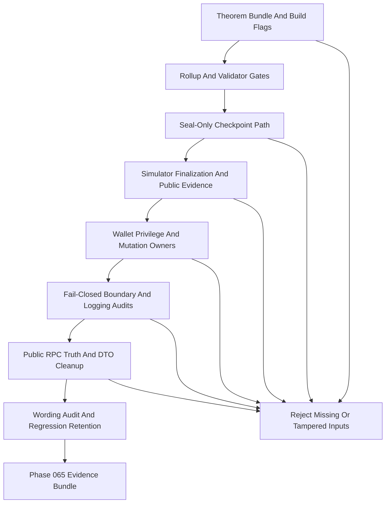

# Phase 065 Test Spec

## Purpose

📌 This document defines the phase-local unit, integration, source-audit, and
release-mode end-to-end coverage required to close Phase 065 truthfully.

📌 It is intended to be directly usable by another engineer or agent without
guessing scenario boundaries, proof obligations, rejection rules, pass oracles,
or where each test and audit artifact must live.

📌 Phase 065 is not browser automation. End-to-end proof here means real
release-mode Rust tests, real project primitives, deterministic local simulator
flows, and executable source-audit scripts that close the named attack surfaces
without inventing remote-backed truth.

## 🔄 Workflow Status

📌 Phase 065 is currently `fallback-ready`, not `verification-backed`.

📌 This classification is mandatory because the phase folder currently contains:

- `.planning/phases/065-Attack-Surface/065-CONTEXT.md`
- `.planning/phases/065-Attack-Surface/065-TODO.md`
- `.planning/phases/065-Attack-Surface/065-01-PLAN.md`
- `.planning/phases/065-Attack-Surface/065-02-PLAN.md`
- `.planning/phases/065-Attack-Surface/065-03-PLAN.md`
- `.planning/phases/065-Attack-Surface/065-04-PLAN.md`
- `.planning/phases/065-Attack-Surface/065-05-PLAN.md`
- `.planning/phases/065-Attack-Surface/065-06-PLAN.md`
- `.planning/phases/065-Attack-Surface/065-07-PLAN.md`
- `.planning/phases/065-Attack-Surface/065-08-PLAN.md`
- `.planning/phases/065-Attack-Surface/065-09-PLAN.md`

📌 The phase folder does not yet contain any of the completion artifacts that
would justify a stronger status:

- no `065-SUMMARY.md`
- no `065-VERIFICATION.md`
- no `065-VALIDATION.md`
- no per-plan `065-0N-SUMMARY.md`

📌 Therefore this document is a truthful implementation contract only. It is
allowed to define exact tests, scripts, and proofs, but it must not claim that
Phase 065 has already been executed or verified.

📌 The live test and audit anchors re-checked while preparing this spec are:

- `crates/z00z_runtime/validators/tests/test_hjmt_publication_contract.rs`
- `crates/z00z_rollup_node/tests/test_rollup_theorem_guard.rs`
- `crates/z00z_simulator/tests/scenario_1/test_checkpoint_acceptance.rs`
- `crates/z00z_storage/tests/test_checkpoint_store.rs`
- `crates/z00z_storage/tests/test_checkpoint_finalization.rs`
- `crates/z00z_storage/tests/test_checkpoint_link_injective.rs`
- `crates/z00z_simulator/tests/scenario_1/test_stage6_checkpoint_storage_bridge.rs`
- `crates/z00z_wallets/tests/test_production_hardening.rs`
- `crates/z00z_wallets/tests/test_live_boundary_claims.rs`
- `crates/z00z_simulator/tests/scenario_1/test_stage6_checkpoint_final_gate.rs`
- `crates/z00z_simulator/tests/scenario_1/test_wallet_integration.rs`
- `crates/z00z_wallets/tests/test_sensitive_rpc_session.rs`
- `crates/z00z_wallets/tests/test_wallet_capability_matrix.rs`
- `crates/z00z_wallets/tests/test_stealth_output.rs`
- `crates/z00z_wallets/tests/test_rpc_route_coverage.rs`
- `crates/z00z_wallets/tests/test_asset_rpc_mutations.rs`
- `crates/z00z_wallets/tests/test_wallet_restore_atomic.rs`
- `crates/z00z_wallets/tests/test_chain_broadcast_retry.rs`
- `crates/z00z_wallets/tests/test_tx_store_integration.rs`
- `crates/z00z_storage/tests/test_live_guardrails.rs`
- `crates/z00z_wallets/tests/test_rpc_logging_acceptance.rs`
- `crates/z00z_wallets/tests/test_rpc_logging_risk_policy.rs`
- `crates/z00z_wallets/tests/test_rpc_truth.rs`
- `crates/z00z_wallets/tests/test_rpc_types_serialization.rs`
- `crates/z00z_wallets/tests/test_stub_behavior.rs`
- `crates/z00z_wallets/tests/test_runtime_validation_result.rs`
- `crates/z00z_storage/tests/test_claim_source_proof.rs`
- `crates/z00z_storage/tests/test_object_reject_codes.rs`
- `crates/z00z_wallets/tests/test_object_quarantine.rs`
- `crates/z00z_wallets/tests/test_claim_resume_core.rs`
- `crates/z00z_simulator/tests/scenario_1/test_claim_resume.rs`
- `crates/z00z_core/tests/test_live_guardrails.rs`

## 🧭 Classification

### ⚙️ TDD And Integration Targets

- `crates/z00z_rollup_node/src/lib.rs` and
  `crates/z00z_rollup_node/src/da.rs` because `WS-01` closes only when the
  accepted path owns one coherent theorem bundle.
- `crates/z00z_runtime/validators/src/verdict.rs`,
  `crates/z00z_runtime/validators/src/checkpoint.rs`, and
  `crates/z00z_runtime/validators/src/engine.rs` because theorem, publication,
  route, and checkpoint coherence must be enforced by one validator-owned
  contract.
- `crates/z00z_storage/src/checkpoint/store.rs` and
  `crates/z00z_storage/src/checkpoint/link.rs` because `WS-02` closes only when
  canonical artifacts are born through `seal_artifact()` and raw lanes stay
  visibly noncanonical.
- `crates/z00z_simulator/src/scenario_1/stage_12/finalize_flow.rs`,
  `crates/z00z_simulator/src/scenario_1/stage_12/mod.rs`, and
  `crates/z00z_simulator/src/scenario_1/runtime_observability.rs` because
  `WS-02` and `WS-04` both depend on stage-level finalization and evidence
  truth.
- `crates/z00z_wallets/Cargo.toml`, `crates/z00z_simulator/Cargo.toml`,
  `crates/z00z_wallets/src/db/mod.rs`, and
  `crates/z00z_wallets/src/wallet/mod.rs` because `WS-03` is primarily a
  release-policy and export-surface gate.
- `crates/z00z_wallets/src/services/wallet_session_runtime_limits.rs`,
  `crates/z00z_wallets/src/rpc/key_rpc_server_admin.rs`,
  `crates/z00z_wallets/src/rpc/wallet_dispatcher_wiring.rs`,
  `crates/z00z_wallets/src/rpc/app_dispatcher_wiring.rs`, and
  `crates/z00z_wallets/src/stealth/output.rs` because `WS-05` closes only when
  privilege becomes type-driven and the raw stealth builder is visibly
  noncanonical.
- `crates/z00z_wallets/src/rpc/asset_rpc_support_state.rs`,
  `crates/z00z_wallets/src/chain/broadcast_impl.rs`,
  `crates/z00z_wallets/src/persistence/tx_storage.rs`,
  `crates/z00z_wallets/src/persistence/tx_storage_impl.rs`, and
  `crates/z00z_wallets/src/services/wallet_actions_backup.rs` because `WS-06`
  closes only when mutation truth and restore truth each have one owner.
- `crates/z00z_storage/src/settlement/store.rs` and
  `crates/z00z_networks/rpc/src/wasm_client.rs` because `WS-07` closes only
  when open/load boundaries are fallible and transport logs are redacted.
- `crates/z00z_wallets/src/services/chain_service.rs`,
  `crates/z00z_wallets/src/rpc/chain_rpc.rs`,
  `crates/z00z_wallets/src/rpc/chain_rpc_impl.rs`,
  `crates/z00z_wallets/src/rpc/chain_types.rs`,
  `crates/z00z_wallets/src/rpc/tx_types.rs`,
  `crates/z00z_wallets/src/rpc/tx_runtime_state.rs`,
  `crates/z00z_wallets/src/rpc/tx_rpc_admission.rs`, and
  `crates/z00z_wallets/src/app/app_kernel.rs` because `WS-08` may close either
  by wiring truthful local behavior or by removing production-looking claims.
- `crates/z00z_core/README.md`, `crates/z00z_core/src/genesis/README.md`,
  `crates/z00z_core/src/assets/mod.rs`,
  `crates/z00z_core/src/assets/registry_catalog.rs`, and
  `crates/z00z_storage/src/settlement/root_types.md` because `WS-09` is a
  wording-truth sweep backed by executable audits, not by prose alone.

### 🧪 E2E Targets

- Rollup theorem verification plus validator acceptance plus simulator
  checkpoint acceptance under release-mode tests.
- Seal-only checkpoint persistence plus link-codec integrity plus stage-12
  finalization under release-mode storage and simulator tests.
- Release-capable feature-matrix rejection through explicit `cargo check`
  failures and source-audit scripts.
- Simulator publication packet truth under release-mode scenario tests.
- Wallet privileged RPC, mutation, backup, restore, and tx-history flows under
  release-mode integration tests.
- Repository-wide meta-gates through executable source-audit scripts and CI
  workflow wiring.
- Public chain scan, tip, receipt, and verification DTO truth through release
  RPC contract tests.
- Final doc-wording truth through one audit script plus live guardrail tests.

### ⏭️ Skip Targets

- Browser automation and UI-driven E2E, because Phase 065 is a multi-crate
  Rust and source-audit closure phase.
- Superseded Phase 065 reports and JSONL catalogs listed in the deletion
  contract, because `065-TODO.md` and the numbered plans are the only live
  authority.
- Vendor code under `crates/z00z_crypto/tari/**`, because it is protected and
  Phase 065 does not close by modifying vendored cryptography.
- Remote network truth, remote DA transport, or third-party availability claims
  that the current tree does not own. Tests may prove local truth or truthful
  demotion only.

## ♻️ Existing Test Anchors To Reuse

📌 Reuse and extend these existing focused seams instead of creating parallel
test files:

- `WS-01` theorem and validator acceptance anchors:
  `crates/z00z_rollup_node/tests/test_rollup_theorem_guard.rs`,
  `crates/z00z_runtime/validators/tests/test_hjmt_publication_contract.rs`,
  `crates/z00z_simulator/tests/scenario_1/test_checkpoint_acceptance.rs`
- `WS-02` checkpoint persistence anchors:
  `crates/z00z_storage/tests/test_checkpoint_store.rs`,
  `crates/z00z_storage/tests/test_checkpoint_finalization.rs`,
  `crates/z00z_storage/tests/test_checkpoint_link_injective.rs`,
  `crates/z00z_simulator/tests/scenario_1/test_stage6_checkpoint_storage_bridge.rs`
- `WS-03` release-hardening anchors:
  `crates/z00z_wallets/tests/test_production_hardening.rs`,
  `crates/z00z_wallets/tests/test_live_boundary_claims.rs`
- `WS-04` simulator truth anchors:
  `crates/z00z_simulator/tests/scenario_1/test_stage6_checkpoint_final_gate.rs`,
  `crates/z00z_simulator/tests/scenario_1/test_wallet_integration.rs`
- `WS-05` capability and route anchors:
  `crates/z00z_wallets/tests/test_sensitive_rpc_session.rs`,
  `crates/z00z_wallets/tests/test_wallet_capability_matrix.rs`,
  `crates/z00z_wallets/tests/test_stealth_output.rs`,
  `crates/z00z_wallets/tests/test_rpc_route_coverage.rs`,
  `crates/z00z_wallets/scripts/audit_rpc_method_wiring.sh`,
  `crates/z00z_wallets/scripts/audit_rpc_method_wiring.py`
- `WS-06` mutation and restore anchors:
  `crates/z00z_wallets/tests/test_asset_rpc_mutations.rs`,
  `crates/z00z_wallets/tests/test_wallet_restore_atomic.rs`,
  `crates/z00z_wallets/tests/test_chain_broadcast_retry.rs`,
  `crates/z00z_wallets/tests/test_tx_store_integration.rs`
- `WS-07` fail-closed and logging anchors:
  `crates/z00z_storage/tests/test_live_guardrails.rs`,
  `crates/z00z_wallets/tests/test_rpc_logging_acceptance.rs`,
  `crates/z00z_wallets/tests/test_rpc_logging_risk_policy.rs`
- `WS-08` public RPC and DTO anchors:
  `crates/z00z_wallets/tests/test_rpc_truth.rs`,
  `crates/z00z_wallets/tests/test_rpc_types_serialization.rs`,
  `crates/z00z_wallets/tests/test_stub_behavior.rs`,
  `crates/z00z_wallets/tests/test_runtime_validation_result.rs`
- Seal-only regression anchors that must stay green while active work lands:
  `crates/z00z_storage/tests/test_claim_source_proof.rs`,
  `crates/z00z_wallets/tests/test_object_quarantine.rs`,
  `crates/z00z_storage/tests/test_object_reject_codes.rs`,
  `crates/z00z_wallets/tests/test_claim_resume_core.rs`,
  `crates/z00z_simulator/tests/scenario_1/test_claim_resume.rs`,
  `crates/z00z_simulator/tests/scenario_1/test_wallet_integration.rs`,
  `crates/z00z_core/tests/test_live_guardrails.rs`

## 🆕 Proposed New Test Files And Audit Scripts

📌 The following missing phase-owned verification artifacts should be created
instead of hidden inside unrelated suites:

- `scripts/audit_release_feature_guards.sh`
- `crates/z00z_networks/rpc/tests/test_wasm_client_redaction.rs`
- `scripts/audit_secret_type_hygiene.sh`
- `scripts/audit_secret_eq_hygiene.sh`
- `scripts/audit_crypto_rng_hygiene.sh`
- `scripts/audit_boundary_panic_hygiene.sh`
- `scripts/audit_log_redaction_hygiene.sh`
- `scripts/audit_phase065_narrowed_wording.sh`

📌 `PLAN-065-G07` also requires `.github/workflows/security-hygiene-guards.yml`
as CI wiring for the new audit scripts. That workflow file is not itself a test
home, but it is a required execution surface for the meta-gate bundle.

## 📍 Test File Placement

| Scenario ID | Test File Path | Extend Or Create | Why This Is The Correct Home |
| --- | --- | --- | --- |
| `065-S01` | `crates/z00z_rollup_node/tests/test_rollup_theorem_guard.rs` | Extend | This is the rollup-owned theorem bundle seam and already holds artifact, exec-input, and link mismatch fixtures. |
| `065-S02` | `crates/z00z_runtime/validators/tests/test_hjmt_publication_contract.rs` | Extend | This is the validator-owned publication, route, and acceptance coherence seam. |
| `065-S03` | `crates/z00z_simulator/tests/scenario_1/test_checkpoint_acceptance.rs` | Extend | This is the cross-crate accepted-path seam that proves rollup, storage, and validator truth together. |
| `065-S04` | `crates/z00z_storage/tests/test_checkpoint_store.rs` | Extend | This is the canonical store authority seam for `seal_artifact()`, raw-lane quarantine, and write-time failures. |
| `065-S05` | `crates/z00z_storage/tests/test_checkpoint_link_injective.rs` | Extend | This is the best seam for link bind, tuple tamper, and load-path injectivity rejection. |
| `065-S06` | `crates/z00z_simulator/tests/scenario_1/test_stage6_checkpoint_storage_bridge.rs` | Extend | This proves stage-12 finalization consumes the seal path instead of the raw lane. |
| `065-S07` | `scripts/audit_release_feature_guards.sh` | Create | The release-matrix closure must fail builds explicitly and belongs in one executable workspace audit script. |
| `065-S08` | `crates/z00z_simulator/tests/scenario_1/test_stage6_checkpoint_final_gate.rs` | Extend | This is the canonical seam for rejecting `DraftOnly` and synthetic publication evidence on the public lane. |
| `065-S09` | `crates/z00z_simulator/tests/scenario_1/test_wallet_integration.rs` | Extend | This already observes public simulator outputs and secret-lane regressions. |
| `065-S10` | `crates/z00z_wallets/tests/test_sensitive_rpc_session.rs` | Extend | This is the handler-level privileged session seam and should own typed-capability rejection tests. |
| `065-S11` | `crates/z00z_wallets/tests/test_wallet_capability_matrix.rs` | Extend | This is the best seam for native versus wasm capability truth and explicit unsupported behavior. |
| `065-S12` | `crates/z00z_wallets/tests/test_stealth_output.rs` | Extend | This already exercises the public stealth-output surface and should prove the raw builder is noncanonical. |
| `065-S13` | `crates/z00z_wallets/tests/test_asset_rpc_mutations.rs` | Extend | This is the direct seam for routing all local mutation RPCs through one executor. |
| `065-S14` | `crates/z00z_wallets/tests/test_wallet_restore_atomic.rs` | Extend | This already contains restore failpoints and is the correct home for crash and retry matrix proof. |
| `065-S15` | `crates/z00z_wallets/tests/test_chain_broadcast_retry.rs` | Extend | This is the focused lifecycle seam for broadcast persistence and repeated or partial failure handling. |
| `065-S16` | `crates/z00z_networks/rpc/tests/test_wasm_client_redaction.rs` | Create | Transport-log redaction is owned by the RPC crate and should not be hidden inside wallet-only tests. |
| `065-S17` | `scripts/audit_boundary_panic_hygiene.sh` | Create | The panic-at-boundary meta-gate is the narrowest executable script that proves fail-closed construction remains enforced. |
| `065-S18` | `crates/z00z_wallets/tests/test_rpc_truth.rs` | Extend | This is the best seam for public chain scan and chain tip truth or truthful demotion. |
| `065-S19` | `crates/z00z_wallets/tests/test_rpc_types_serialization.rs` | Extend | This is the canonical DTO contract seam for placeholder-proof-field cleanup, with `test_stub_behavior.rs` and `test_runtime_validation_result.rs` as secondary anchors. |
| `065-S20` | `scripts/audit_phase065_narrowed_wording.sh` | Create | The final narrowed-claim sweep is repository-wide and belongs in one explicit wording audit script. |

## Required End-To-End Behaviors

| Behavior | Requirement | Primary Path | Pass Signal | Fail Signal |
| --- | --- | --- | --- | --- |
| Validator acceptance is theorem-bound | `PH65-THEOREM` | `verify_settlement_theorem() -> ResolvedBatch -> verdict_for_batch() -> CheckpointFlow::try_from_resolved()` | one accepted path proves one coherent theorem, one publication digest, and one link | any accepted path survives with missing theorem inputs, wrong link, wrong exec id, wrong snapshot id, wrong route digest, or detached proof bytes |
| Canonical checkpoints are seal-only | `PH65-SEAL` | `CheckpointDraft -> seal_artifact() -> CheckpointLink -> stage_12 finalize -> validator load` | canonical final artifact is born only through the seal path and raw-lane artifacts stay rejected | raw artifacts or raw links can be loaded as canonical final truth |
| Release-capable builds reject debug surfaces | `PH65-RELEASE` | release feature matrix plus export-surface audits | forbidden feature combinations fail fast and debug surfaces disappear from release-capable builds | weakened KDF, debug export, or corruption hooks survive a release-capable build path |
| Draft and debug simulator lanes cannot impersonate final evidence | `PH65-SIM` | simulator config plus stage 12 plus runtime observability | `DraftOnly` and synthetic checkpoint ids are rejected on public or release lanes | draft/debug output still looks like final checkpoint or publication truth |
| Privileged wallet actions require typed capability truth | `PH65-CAP` | session verification plus route registration plus stealth-output API | privileged handlers require typed verified capability and unsupported wasm cases fail explicitly | a new handler can use a raw token, or the raw stealth builder still looks canonical |
| Mutation and restore each have one durable owner | `PH65-MUTATE` | asset RPC -> executor -> broadcast -> `TxStorage` -> restore journal | all local mutation RPCs route through one executor and restore crash semantics are explicit | tx ids are invented ad hoc, or restore retry and rollback semantics stay ambiguous |
| Boundary construction and transport logging fail closed | `PH65-BOUNDARY` | fallible store open plus redacted transport logging plus source-audit scripts | no boundary panic survives, transport logs are redacted, and meta-gates fail CI on drift | panics or raw secret-bearing JSON survive boundary or transport layers |
| Public RPC truth is either real local truth or explicitly demoted | `PH65-RPC-TRUTH` | chain service plus chain RPC plus wallet DTO projections | public scan/tip and receipt DTOs either expose truthful local semantics or are demoted from production-looking claims | synthetic scan/tip or placeholder proof fields continue to look authoritative |
| Narrowed historical wording stays retired | `PH65-WORDING` | human-readable docs plus wording audit | no stale doc or example re-promotes retired claims as current truth | old assets bootstrap, nullifier, invalid-signature, memo, or rotate wording returns as current blocker text |
| Seal-only regression coverage stays intact while active work lands | `PH65-REGRESSION` | claim source, quarantine, reject-code, resume, and secret-lane anchors | existing strong negative tests remain green while new work lands | active work silently weakens already-closed boundaries |

## 🔐 Gate Traceability

| Gate ID | Workstream | Proof Scenarios | Primary Anchors |
| --- | --- | --- | --- |
| `G-01` Rollup Settlement Theorem Gate | `WS-01` | `065-S01`, `065-S03` | `test_rollup_theorem_guard.rs`, `test_checkpoint_acceptance.rs` |
| `G-02` Validator Checkpoint And Publication Gate | `WS-01` | `065-S02`, `065-S03` | `test_hjmt_publication_contract.rs`, `test_checkpoint_acceptance.rs` |
| `G-03` Checkpoint Seal Gate | `WS-02` | `065-S04`, `065-S06` | `test_checkpoint_store.rs`, `test_stage6_checkpoint_storage_bridge.rs` |
| `G-04` Checkpoint Link Bind And Codec Gate | `WS-02` | `065-S05` | `test_checkpoint_link_injective.rs`, `test_checkpoint_finalization.rs` |
| `G-05` Privileged Session Gate | `WS-05` | `065-S10`, `065-S11`, `065-S12` | `test_sensitive_rpc_session.rs`, `test_wallet_capability_matrix.rs`, `test_stealth_output.rs` |
| `G-06` Wallet Mutation Submission Gate | `WS-06` | `065-S13`, `065-S15` | `test_asset_rpc_mutations.rs`, `test_chain_broadcast_retry.rs`, `test_tx_store_integration.rs` |
| `G-07` Atomic Restore Gate | `WS-06` | `065-S14` | `test_wallet_restore_atomic.rs` |
| `G-08` Public Chain Scan And Tip RPC Gate | `WS-08` | `065-S18` | `test_rpc_truth.rs` |
| `G-09` Transaction Receipt And Verification DTO Gate | `WS-08` | `065-S19` | `test_rpc_types_serialization.rs`, `test_stub_behavior.rs`, `test_runtime_validation_result.rs` |

## Critical Integration Paths

1. `TxPackage + CheckpointArtifact + CheckpointExecInput + CheckpointLink`
   through rollup theorem verification into validator acceptance.
2. `CheckpointDraft + CheckpointProof + PrepSnapshotId + CheckpointExecInputId`
   through storage sealing into stage-12 finalization and validator reload.
3. Cargo feature flags through wallet and simulator crate exports into the
   release-feature audit script.
4. `Stage6ProofMode`, stage-12 finalization, and runtime observability packet
   emission through the public simulator lane.
5. `SessionToken`, privileged RPC registration, and stealth-output builders
   through native and wasm capability enforcement.
6. Local mutation RPC entrypoints through the canonical executor, broadcast
   persistence, tx storage, and restore journal.
7. Security-boundary constructors and transport logging through wasm RPC and
   repository-wide hygiene scripts.
8. Chain scan, chain tip, receipt, and verification DTO projection through
   chain-service truth and route wiring.
9. Doc wording surfaces through the narrowed-wording audit and existing
   live-guardrail suites.

## Input Fixtures And Preconditions

| Scenario ID | Inputs | Preconditions | Fixture Source |
| --- | --- | --- | --- |
| `065-S01..S03` | `TxPackage`, `CheckpointArtifact`, `CheckpointExecInput`, `CheckpointLink`, published and ordered batch fixtures | rollup and validator fixture builders still produce coherent baseline bundles | existing helpers in `test_rollup_theorem_guard.rs`, `test_hjmt_publication_contract.rs`, and `test_checkpoint_acceptance.rs` |
| `065-S04..S06` | `CheckpointDraft`, attested proof bytes, snapshot rows, exec-input rows, raw artifact wrappers | temp checkpoint store root exists and replay rows can be staged deterministically | existing helpers in `test_checkpoint_store.rs`, `test_checkpoint_finalization.rs`, `test_checkpoint_link_injective.rs`, and `test_stage6_checkpoint_storage_bridge.rs` |
| `065-S07` | release feature combinations, public export needles, cargo package targets | workspace can run release `cargo check` and shell audits | new `scripts/audit_release_feature_guards.sh` plus existing release tests |
| `065-S08..S09` | `Stage6ProofMode` variants, publication packet JSON, stage outputs, wallet-secret artifacts | scenario_1 fixtures can run in release mode and write deterministic output trees | existing scenario_1 harnesses |
| `065-S10..S12` | valid and invalid `SessionToken`s, privileged RPC method list, native and wasm target expectations, raw stealth builder calls | wallet RPC registration harness is available and wasm-capability policy is explicit in code | existing wallet RPC tests and audit script |
| `065-S13..S15` | `wallet_id`, operation label, input assets, output assets, failpoints for `history_commit`, `.wlt` commit, publish, rollback | temp wallet roots and deterministic storage paths can be created per test | existing mutation and restore integration harnesses |
| `065-S16..S17` | bad store-open paths, secret-bearing RPC params and responses, representative source trees, reviewed allowlists | source-audit scripts can run from repo root and CI wiring can invoke them | new audit scripts plus existing logging tests |
| `065-S18..S19` | chain scan params, chain tip states, confirmation receipts, proof-like DTO fields, route and doc strings | current local chain service harness runs without remote assumptions | existing RPC tests plus public DTO serializers |
| `065-S20` | repo docs corpus, retired-claim needles, seal-only regression fixtures | doc sweep can run from repo root and regression anchors are already green before Phase 065 work | new wording audit plus existing regression tests |

## Expected Outputs And Produced Artifacts

| Scenario ID | Expected Output | Persisted Artifact | Observable Signal |
| --- | --- | --- | --- |
| `065-S01..S03` | accepted path requires one theorem bundle and one publication digest | accepted checkpoint and validator verdict only after coherent theorem input | release tests reject all mismatches and absence cases |
| `065-S04..S06` | canonical final artifact plus version-checked link only from `seal_artifact()` | sealed checkpoint artifact, coherent link, and stage-12 final output | raw-lane misuse rejects before load or finalization |
| `065-S07` | explicit failing build verdicts for forbidden feature combinations | audit log or CI artifact from the release-feature script | command exits nonzero on forbidden combinations and zero only on compliant matrix |
| `065-S08..S09` | public-lane outputs distinguish final evidence from draft/debug artifacts | scenario output tree with no production-shaped draft packets or plaintext secret lane | release scenario tests reject draft-only or secret-bearing public artifacts |
| `065-S10..S12` | typed capability acceptance and explicit unsupported errors | audited route list and canonical stealth-output surface | handler omission or raw-builder use fails tests or route audit |
| `065-S13..S15` | one canonical tx-id and lifecycle path plus explicit restore journal semantics | tx history, broadcast lifecycle rows, and restore journal or marker | repeated or partial failures stay deterministic and retry-safe |
| `065-S16..S17` | fallible constructor errors plus redacted transport logs plus green meta-gates | audit-script outputs and CI workflow results | no raw params, raw responses, or boundary panics survive targeted tests |
| `065-S18..S19` | truthful local public RPC semantics or production-looking claims removed | DTO JSON without placeholder proof defaults and docs without stub lies | tests prove chain truth claims are either real or visibly demoted |
| `065-S20` | retired wording stays gone and seal-only regressions remain green | wording-audit output and preserved regression test evidence | audit script stays green and regression tests stay green after Phase 065 changes |

## Cryptographic And Security Invariants To Observe

| Invariant | Why It Matters | Assertion Shape |
| --- | --- | --- |
| One accepted batch has one theorem story | Prevents acceptance from drifting away from the canonical public settlement proof | accepted path must consume one coherent artifact, exec input, link, route digest, and publication digest |
| Link bind authenticates the exact id triple | Prevents checkpoint, snapshot, and exec-input substitution | decode or load must fail if any tuple member changes |
| Canonical proof bytes are not semantically confusable with draft or compatibility bytes | Prevents raw or compatibility artifacts from being mistaken for final truth | field names, type names, and load behavior must diverge explicitly |
| Release-capable builds cannot enable weakened KDF or debug secret export | Prevents production-shaped binaries from shipping noncanonical or secret-leaking surfaces | forbidden feature combinations must fail build or audit |
| Draft-only simulator evidence cannot satisfy final-publication claims | Prevents debug artifacts from impersonating real final evidence | packet verification rejects draft-only status and synthetic checkpoint ids |
| Privilege is type-driven, not convention-driven | Prevents new sensitive RPC methods from silently omitting a guard | signatures or route registration must require typed verified capability |
| Mutation truth comes from one executor and one durable owner | Prevents ad hoc tx-id construction and lifecycle drift between RPC methods | all public mutation RPCs must resolve to one executor and one tx-storage path |
| Restore is crash-aware and retry-explicit | Prevents partial commit ambiguity and unsafe replay after crash windows | failpoints across `history_commit`, `.wlt` commit, publish, and rollback must produce deterministic outcomes |
| Transport logs and boundary errors stay redacted | Prevents operator-visible leakage of secrets, raw params, and storage internals | logger output must include method and risk class only, never raw secret-bearing JSON |
| Public DTOs do not advertise placeholder proof semantics as truth | Prevents wallet APIs from overclaiming proof-bearing behavior that does not exist | default or production DTO projections must omit placeholder fields or mark them unsupported explicitly |

## 🗺️ Mermaid Flow



## 🔧 Clarifying Code Snippets

```rust
let theorem_bundle = checkpoint_bundle(&package, &artifact, &exec_input, &link);
let resolved = resolve_batch_with_theorem(published, ordered, theorem_bundle)?;
let verdict = boundary.verdict_for_batch(resolved)?;
assert!(verdict.reject.is_none(), "coherent theorem bundle must accept");

let missing = resolve_batch_without_theorem(published, ordered)?;
assert!(
    boundary.verdict_for_batch(missing).is_err(),
    "accepted path must be unreachable without theorem-owned inputs"
);
```

```bash
./.github/skills/smart-tests-bootstrap/scripts/bootstrap_tests.sh
bash scripts/audit_release_feature_guards.sh
bash scripts/audit_boundary_panic_hygiene.sh
cargo test --release -p z00z_wallets --test test_wallet_restore_atomic -- --nocapture
```

## Scenario Matrix

| Scenario ID | Type | Goal | Positive Example | Negative Example | Main Assertions |
| --- | --- | --- | --- | --- | --- |
| `065-S01` | Integration | prove the rollup theorem bundle accepts one coherent story | coherent artifact, link, exec input, and tx package succeed | bad link, bad root, bad proof, or missing tx rejects | theorem verifier and accepted path consume the same public inputs |
| `065-S02` | Integration | prove validator publication and route coherence reject drift | published and ordered routes agree and digest binds correctly | route drift, pub drift, or checkpoint drift rejects | validator acceptance checks route and publication with theorem-owned inputs |
| `065-S03` | E2E | prove cross-crate accepted path is impossible without theorem bundle | simulator acceptance succeeds only with coherent theorem inputs | accepted path without theorem bundle is unreachable | release-mode acceptance uses rollup, validator, and storage together |
| `065-S04` | Integration | prove `seal_artifact()` is the only canonical birth lane | sealed artifact finalizes and reloads correctly | raw artifact masquerading as canonical rejects | canonical lane and raw lane stay semantically separate |
| `065-S05` | Integration | prove link bind and write-time evidence checks are strict | coherent link tuple roundtrips | mismatched tuple or missing evidence row rejects | write-time and load-time coherence both hold |
| `065-S06` | E2E | prove stage-12 finalization consumes only sealed artifacts | stage bridge loads sealed artifact and completes | raw-lane artifact or mismatched proof pair rejects | finalization and validator acceptance share the same seal-only contract |
| `065-S07` | Source-Audit | prove release builds cannot enable forbidden feature combinations | compliant build matrix passes | release build with `test-params-fast` or `wallet_debug_tools` fails | forbidden build combinations exit nonzero and exports disappear |
| `065-S08` | Integration | prove draft-only evidence cannot reach final-publication lane | finalized mode emits final-shaped evidence | `DraftOnly` or synthetic checkpoint id is rejected | public-lane packet verification distinguishes draft from final by type |
| `065-S09` | Regression | prove default public simulator lane never emits plaintext secrets | public output tree stays secret-free | debug secret lane or plaintext artifact appears | current public secret guard remains intact |
| `065-S10` | Integration | prove privileged RPC handlers require typed verified capability | guarded privileged method succeeds with verified capability | unguarded or raw-token path fails audit or compile | privilege is signature- or route-registration-driven |
| `065-S11` | Integration | prove target capability matrix is explicit across native and wasm | unsupported wasm action returns typed unsupported error | wasm silently claims support or uses fallback convention | capability truth is explicit and test-enforced |
| `065-S12` | Integration | prove the raw stealth builder is visibly noncanonical | validated builder remains public approval path | raw builder can be used as if it were canonical | API surface marks raw builder unsafe, internal, or validation-free |
| `065-S13` | Integration | prove every local asset mutation RPC routes through one executor | split, stake, swap, and peer mutations share one executor | one RPC formats tx ids or bypasses executor locally | tx-id truth and submission path stay singular |
| `065-S14` | E2E | prove restore crash and retry semantics are deterministic | restore succeeds after controlled retry and clears temp state | `history_commit`, `.wlt` commit, publish, or rollback failure leaves ambiguity | restore journal or marker makes restart behavior explicit |
| `065-S15` | Integration | prove broadcast persistence and tx lifecycle stay coherent | transient retry keeps one lifecycle story | duplicate, timeout, reorg, or reject paths drift | tx history and broadcast state stay synchronized under failures |
| `065-S16` | Integration | prove transport logging stays redacted and constructors fail closed | redacted method summaries and typed errors appear | raw params, raw responses, or panics appear | no secret-bearing JSON or boundary panic survives |
| `065-S17` | Source-Audit | prove repository-wide meta-gates fail on new hygiene regressions | reviewed allowlist stays green | secret type, equality, RNG, panic, or log leak pattern triggers failure | scripts are executable, path-scoped, and CI-ready |
| `065-S18` | E2E | prove public chain scan and tip semantics are truthful or explicitly demoted | local truth is clearly represented or claims are demoted | synthetic scan or chain tip still looks authoritative | public route naming and docs match real semantics |
| `065-S19` | Integration | prove receipt and verification DTOs stop advertising placeholder proof semantics | DTO JSON roundtrips without placeholder proof defaults | `merkle_proof: None` or proof-like placeholders survive as production truth | serialization, stub behavior, and runtime validation stay aligned |
| `065-S20` | Source-Audit And Regression | prove retired wording stays gone and sealed regressions stay green | wording audit passes and claim-source/quarantine/reject-code/resume anchors stay green | stale wording returns or seal-only tests regress | repo stops re-promoting narrowed claims while preserving closed boundaries |

## Canonical Commands

- `./.github/skills/smart-tests-bootstrap/scripts/bootstrap_tests.sh`
- `cargo test --release -p z00z_validators --test test_hjmt_publication_contract -- --nocapture`
- `cargo test --release -p z00z_rollup_node --test test_rollup_theorem_guard -- --nocapture`
- `cargo test --release -p z00z_simulator --test scenario_1 -- --nocapture`
- `cargo test --release -p z00z_storage --test test_checkpoint_store -- --nocapture`
- `cargo test --release -p z00z_storage --test test_checkpoint_finalization -- --nocapture`
- `cargo test --release -p z00z_storage --test test_checkpoint_link_injective -- --nocapture`
- `cargo test --release -p z00z_wallets --test test_production_hardening -- --nocapture`
- `cargo test --release -p z00z_wallets --test test_live_boundary_claims -- --nocapture`
- `cargo test --release -p z00z_wallets --test test_sensitive_rpc_session -- --nocapture`
- `cargo test --release -p z00z_wallets --test test_wallet_capability_matrix -- --nocapture`
- `cargo test --release -p z00z_wallets --test test_stealth_output -- --nocapture`
- `cargo test --release -p z00z_wallets --test test_rpc_route_coverage -- --nocapture`
- `cargo test --release -p z00z_wallets --test test_asset_rpc_mutations -- --nocapture`
- `cargo test --release -p z00z_wallets --test test_wallet_restore_atomic -- --nocapture`
- `cargo test --release -p z00z_wallets --test test_chain_broadcast_retry -- --nocapture`
- `cargo test --release -p z00z_wallets --test test_tx_store_integration -- --nocapture`
- `cargo test --release -p z00z_storage --test test_live_guardrails -- --nocapture`
- `cargo test --release -p z00z_wallets --test test_rpc_logging_acceptance -- --nocapture`
- `cargo test --release -p z00z_wallets --test test_rpc_logging_risk_policy -- --nocapture`
- `cargo test --release -p z00z_networks_rpc -- --nocapture`
- `cargo test --release -p z00z_wallets --test test_rpc_truth -- --nocapture`
- `cargo test --release -p z00z_wallets --test test_rpc_types_serialization -- --nocapture`
- `cargo test --release -p z00z_wallets --test test_stub_behavior -- --nocapture`
- `cargo test --release -p z00z_wallets --test test_runtime_validation_result -- --nocapture`
- `cargo test --release -p z00z_storage --test test_claim_source_proof -- --nocapture`
- `cargo test --release -p z00z_wallets --test test_object_quarantine -- --nocapture`
- `cargo test --release -p z00z_storage --test test_object_reject_codes -- --nocapture`
- `cargo test --release -p z00z_wallets --test test_claim_resume_core -- --nocapture`
- `cargo test --release -p z00z_simulator --test scenario_1 -- claim_resume --nocapture`
- `cargo test --release -p z00z_core --test test_live_guardrails -- --nocapture`
- `bash crates/z00z_wallets/scripts/audit_rpc_method_wiring.sh`
- `bash scripts/audit_release_feature_guards.sh`
- `bash scripts/audit_secret_type_hygiene.sh`
- `bash scripts/audit_secret_eq_hygiene.sh`
- `bash scripts/audit_crypto_rng_hygiene.sh`
- `bash scripts/audit_boundary_panic_hygiene.sh`
- `bash scripts/audit_log_redaction_hygiene.sh`
- `bash scripts/audit_phase065_narrowed_wording.sh`
- `cargo test --release`

## Open Gaps

- Phase 065 remains `fallback-ready` until summary and verification artifacts
  are created from executed work; this spec must not be used as execution proof.
- The actual test files and scripts named above have not been generated in this
  turn; per repository workflow they should be created only after approval of
  this plan packet.
- `WS-08` may close either by implementing truthful local behavior or by
  removing or demoting production-looking claims. Tests must accept honest
  contraction and must not force fake remote-backed semantics.
- `.github/workflows/security-hygiene-guards.yml` must land together with the
  new meta-gate scripts even though it is not itself a standalone test file.
