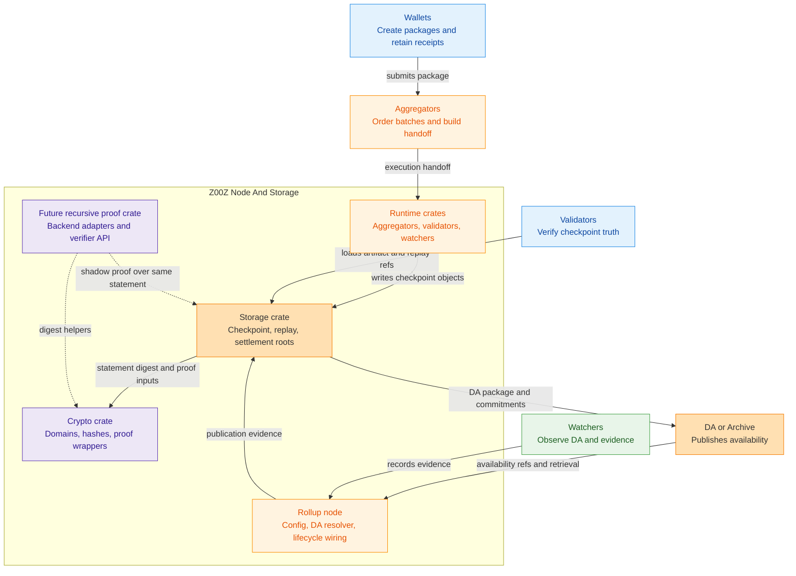
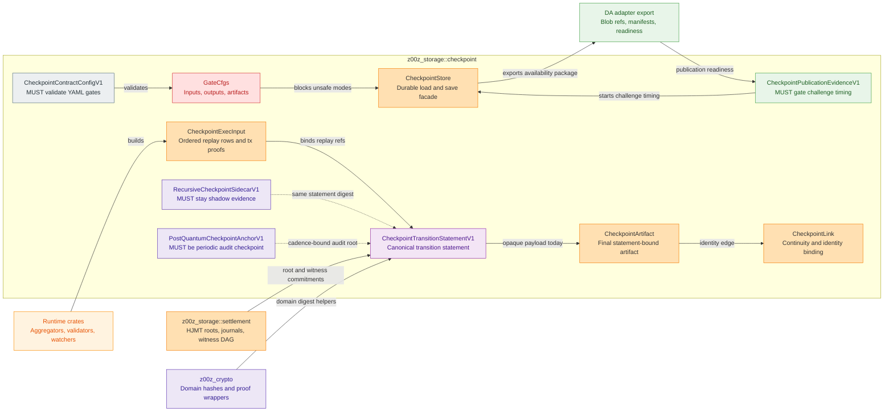
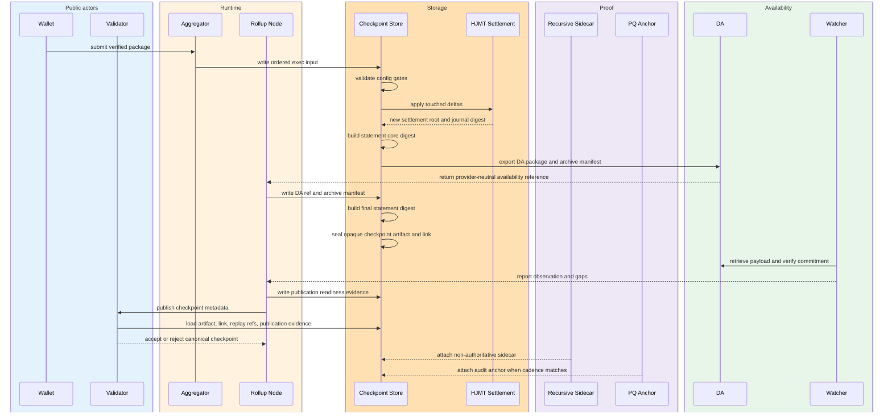
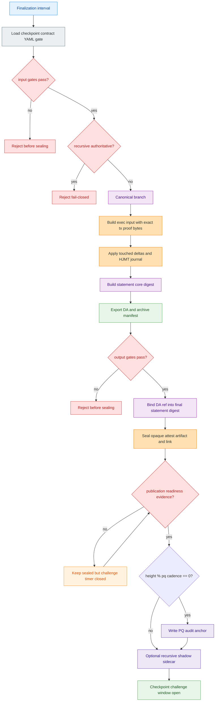
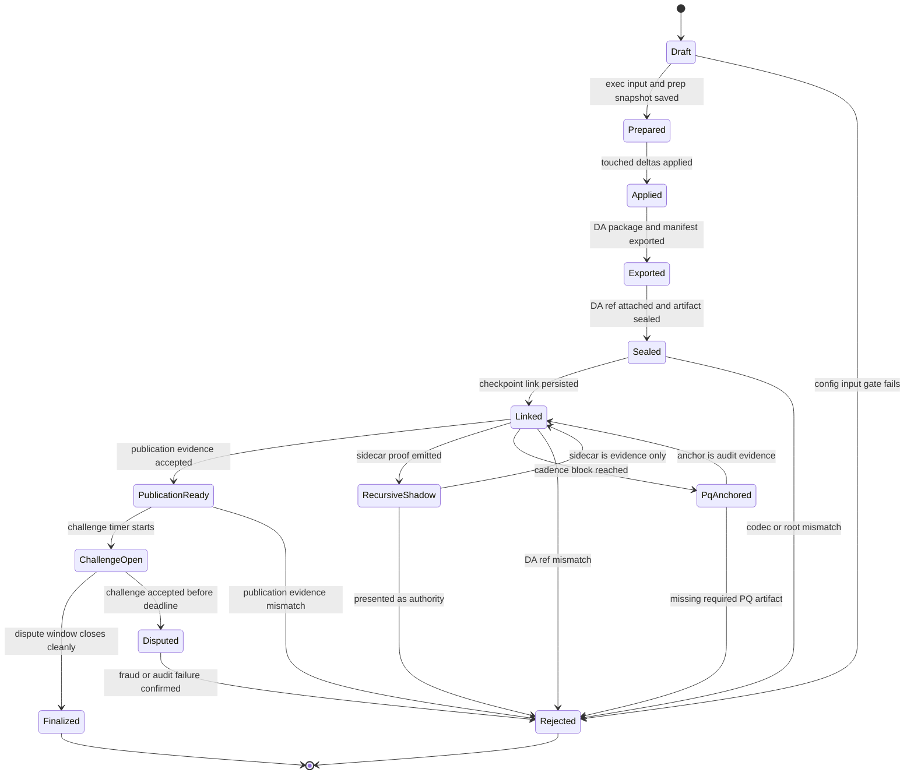
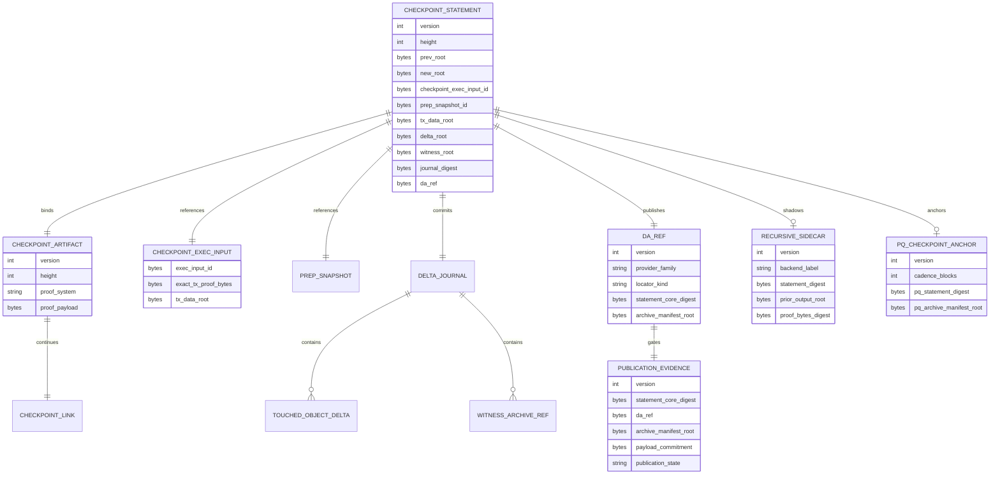

# Z00Z Recursive-Ready Checkpoint Contract And Replay Substrate

[TOC]

Version: 2026-07-03

Status: canonical storage-first, recursive-ready checkpoint contract specification.

Required config gate path: `crates/z00z_storage/src/checkpoint/checkpoint_contract.yaml`

Owner crate: `z00z_storage`

## Key Terms Used In This Paper

This paper is self-contained. It defines the storage contract that Z00Z MUST
implement before live recursive proofs are promoted into checkpoint admission.

| Term | Meaning in this specification |
| --- | --- |
| `Checkpoint` | The storage-owned state transition boundary from a previous root to a new root. |
| `CheckpointTransitionStatementV1` | The canonical public statement shared by the current opaque branch, the recursive sidecar branch, and the future verified branch. |
| `Compact delta storage` | The retained replay, witness, archive, DA, and dispute substrate. It is not the final proof theorem by itself. |
| `Canonical branch` | The current authoritative checkpoint lane. It uses opaque attest semantics and keeps exact per-transaction proof bytes. |
| `Recursive branch` | A non-authoritative shadow lane over the same statement. It starts mock/adapter-based and MUST NOT admit checkpoints. |
| `Future verified branch` | A later authoritative recursive backend after proof type, verifier API, codec, failure model, benchmarks, and rollback rules exist. |
| `DA reference` | A data availability or archive reference proving where checkpoint-related bytes can be retrieved or audited. It does not prove state validity. |
| `DA adapter` | A provider-neutral publication and retrieval boundary used by `z00z_rollup_node` or a storage exporter. Provider SDK types MUST stay behind this boundary. |
| `Publication readiness` | Evidence that the configured DA/archive publication path can retrieve and verify the committed payload. It starts dispute timing; it does not prove state validity. |
| `Archive manifest` | A versioned commitment to retained raw package, proof, witness, delta, and DA export content. |
| `Witness archive` | The retained transaction, proof, witness, delta, and journal data that MUST remain available for replay, fraud, audit, and recovery. |
| `Checkpoint finality status` | A typed lifecycle status for a checkpoint after sealing. It separates sealed, publication-ready, challenge-open, finalized, disputed, and rejected states. |
| `PQ audit anchor` | A periodic post-quantum checkpoint envelope over the statement and archive manifest. It is an audit and migration hook, not a claim that the whole proof stack is already post-quantum. |
| `Mixed-era artifact` | Any artifact whose version, proof system, codec, or statement era differs from the active compatibility set. Unsupported mixed-era artifacts fail closed. |

## Naming And Symbol Conventions

The architecture MUST use checkpoint-first names. Delta/replay terms are
allowed only for substrate objects, not for the top-level contract.

| Concept | Preferred symbol | Rationale |
| --- | --- | --- |
| Document name | `Recursive-Ready-Checkpoint-Contract` | The checkpoint contract is the source of truth; compact deltas are substrate. |
| Config path | `crates/z00z_storage/src/checkpoint/checkpoint_contract.yaml` | The config gates the checkpoint contract, not only compact delta storage. |
| Config type | `CheckpointContractConfigV1` | A storage-owned validator for branch, gate, retention, authority promotion, DA, and size policy. |
| Statement | `CheckpointTransitionStatementV1` | Precise: one state transition statement shared by all proof lanes. |
| Recursive sidecar | `RecursiveCheckpointSidecarV1` | Avoids a generic sidecar name detached from checkpoint semantics. |
| Recursive proof object | `RecursiveCheckpointProofV1` | Names the proof lane and the checkpoint statement it binds. |
| Recursive verifier API | `RecursiveCheckpointVerifierV1` | Names the verifier scope without implying canonical admission. |
| Recursive sidecar codec | `RecursiveCheckpointSidecarCodecV1` | Keeps codec scope non-authoritative and sidecar-specific. |
| Recursive reject reason | `RecursiveCheckpointRejectReasonV1` | Machine-readable failure boundary for recursive sidecars. |
| Recursive measurements | `RecursiveCheckpointMeasurementV1` | Benchmark and observation payload for authority-promotion evidence. |
| Recursive chain evidence | `RecursiveCheckpointChainEvidenceV1` | 3 to 5 step chain evidence over the same statement. |
| DA reference object | `CheckpointDaReferenceV1` | Makes `da_ref` a digest of one versioned object, not a free-form locator string. |
| Publication evidence object | `CheckpointPublicationEvidenceV1` | Records provider-neutral DA/archive readiness evidence without becoming settlement authority. |
| Archive manifest object | `CheckpointArchiveManifestV1` | Freezes archive content commitment independently from local filesystem paths. |
| Archive manifest entry | `CheckpointArchiveEntryV1` | Versioned per-entry commitment for raw packages, proof bytes, witness chunks, deltas, and DA blobs. |
| PQ anchor object | `PostQuantumCheckpointAnchorV1` | Expands the acronym in type names; YAML fields can keep `pq_` prefixes. |

## Invariant Anchors

### ZINV-CDS-001

Compact delta artifacts are mandatory replay and dispute material, but they are
not the final source of checkpoint truth. Checkpoint truth is the accepted
statement-bound state transition.

### ZINV-CDS-002

All proof backends MUST bind the same `CheckpointTransitionStatementV1`. A
recursive backend MUST treat proof bytes and verification code as backend
details, and it MUST NOT introduce a second theorem.

### ZINV-CDS-003

The canonical branch remains authoritative until the future verified branch has
implemented artifact codec support, verifier API support, negative tests,
benchmarks, and rollback policy.

### ZINV-CDS-004

Recursive proofs MUST NOT erase data obligations. Raw transaction packages,
exact transaction proof bytes, witness data, DA blobs, and archive manifests
MUST remain available through the configured dispute and audit windows.

### ZINV-CDS-005

Post-quantum checkpoints are periodic audit envelopes. They reserve durable
fields for later post-quantum migration, but they MUST NOT by themselves prove
full post-quantum recursive security.

## 1. Why This Specification Exists

The wrong architecture would build a delta-only storage universe and later try
to migrate it into recursive proofs. That creates a high-risk migration because
the stored archive shape can fail to bind the exact statement required by a future
recursive backend.

The correct architecture is checkpoint-contract first:

1. Define one canonical checkpoint transition statement.
2. Keep current canonical replay and opaque artifact verification live.
3. Store compact deltas as replay, witness, archive, fraud, and recovery data.
4. Add a recursive sidecar lane that proves or mocks the same statement without
   becoming authoritative.
5. Add periodic PQ audit anchor slots now, while honestly keeping PQ validity as
   a later backend maturity gate.

This document is the single source of truth for this storage contract. It is
self-contained and MUST NOT depend on another compact-delta paper.

## 2. Reader Contract

After reading this document, an engineer SHOULD be able to answer:

| Question | Correct answer source |
| --- | --- |
| What is the canonical checkpoint statement? | Section 5. |
| Which branch is authoritative today? | Section 8. |
| What does compact delta storage retain? | Sections 6 and 10. |
| What gates MUST pass for inputs, outputs, and artifacts? | Section 7 and the YAML config. |
| Where SHOULD code live in the current repository? | Section 11. |
| What MUST be tested before authority promotion? | Section 16. |
| What does the PQ cadence mean? | Section 13. |
| Can recursive sidecars remove transaction proof bytes today? | No. Section 8 and Section 12 reject that. |

## 3. Maturity Boundary

The architecture has three proof lanes. Only one is authoritative now.

| Lane | Present status | Authority | Correct wording |
| --- | --- | --- | --- |
| Canonical opaque branch | Current live path | Authoritative | Current settlement and replay truth. |
| Recursive mock branch | Specified here; config gate and sidecar objects MUST be implemented before authority promotion | Non-authoritative | Shadow evidence over the same statement. |
| Future verified branch | Future work | Not enabled | Backend substitution after proof, codec, API, tests, and benchmarks mature. |

The recursive branch MUST NOT be described as production validity until the future
verified branch criteria in Section 12 are met.

## 4. Current Code Truth

The current repository already supports part of this architecture and also
contains hard limits that the spec MUST respect.

| Current code object | Current truth | Architectural implication |
| --- | --- | --- |
| `z00z_storage::checkpoint::CheckpointArtifact` | Final checkpoint artifact carries version, height, roots, optional claim root, proof system, proof bytes, and statement-bound public input. | The final contract is already artifact-shaped and MUST be extended, not bypassed. |
| `z00z_storage::checkpoint::CheckpointProofSystem` | Includes `OPAQUE_ATTEST` and reserved `VERIFIED`. | A future verified proof class is conceptually present but not live admission. |
| `z00z_storage::checkpoint::codec` | Final artifact codec accepts the current opaque-attest semantics and rejects incompatible proof-system mixing. | Recursive verified artifacts MUST wait for explicit codec support. |
| `z00z_storage::checkpoint::CheckpointExecInput` | Replay input stores exact `tx_proof` bytes for each transaction. | Canonical replay MUST NOT drop per-transaction proof bytes today. |
| `z00z_storage::checkpoint::build` | Builder iterates execution transactions and verifies rows using stored proof bytes. | Recursive compression MUST NOT skip current replay bytes until a verified replacement exists. |
| `z00z_storage::settlement` batch proof surfaces | HJMT batch proofs already support shared witness DAGs, opening tables, reference tables, and deduplication. | Storage optimization can proceed before cryptographic recursion. |
| `z00z_crypto` aggregation constants | Active aggregation factor is one. | Current batch verification is not a stored aggregate proof. |
| Checkpoint-contract YAML gate | No dedicated live config loader is present in the current checkpoint module. | The implementation MUST add a storage-owned typed config validator before this policy can gate runtime behavior. |

## 5. Canonical Statement Contract

`CheckpointTransitionStatementV1` is the single statement that every branch
MUST bind.

```text
CheckpointTransitionStatementV1:
  height
  + prev_root
  + prev_settlement_root
  + checkpoint_exec_input_id
  + prep_snapshot_id
  + ordered tx_data_root
  + delta_root
  + witness_root
  + journal_digest
  + da_ref
  + optional claim_root
  + optional prior_recursive_output_root
  + optional pq_anchor_root
  -> new_root
  + new_settlement_root
```

Statement digest domain:

```text
z00z.checkpoint.transition.v1
```

The digest MUST include schema version, field names, chain/domain context, and
proof-system family. It MUST NOT be an ambiguous positional tuple.

| Field | Required | Producer | Consumer | Failure if wrong |
| --- | --- | --- | --- | --- |
| `height` | Yes | Runtime/storage finalization | Validators, archive, PQ cadence | Reordered or skipped checkpoint. |
| `prev_root` | Yes | Storage checkpoint lane | Validators, recursive prover | Broken root continuity. |
| `new_root` | Yes | Storage checkpoint lane | Validators, wallets, archive | Invalid final root. |
| `prev_settlement_root` | Yes | Settlement storage | Validators | Semantic root mismatch. |
| `new_settlement_root` | Yes | Settlement storage | Validators | Semantic root mismatch. |
| `checkpoint_exec_input_id` | Yes | Checkpoint builder | Validators, replay, archive | Replay substitution. |
| `prep_snapshot_id` | Yes | Checkpoint builder | Replay, fraud/audit | Wrong pre-state witness. |
| `tx_data_root` | Yes | Runtime/storage handoff | Validators, recursive prover | Batch substitution. |
| `delta_root` | Yes | Settlement delta builder | Validators, recursive prover | Delta substitution. |
| `witness_root` | Yes | Witness archive writer | Fraud/audit, recursive prover | Missing or swapped witness material. |
| `journal_digest` | Yes | HJMT journal lane | Replay, recovery | Storage lineage split. |
| `da_ref` | Yes | DA/export writer | Watchers, archive, validators | Availability gap. |
| `claim_root` | Optional | Claim-source path | Claim replay verifier | Claim ambiguity. |
| `prior_recursive_output_root` | Optional | Recursive sidecar writer | Recursive verifier | Broken recursive chain. |
| `pq_anchor_root` | Optional | PQ anchor writer | PQ audit verifier | Reserved for a future statement era; V1 canonical admission keeps it absent and external PQ anchor binding carries cadence evidence. |

### 5.1 Canonical Byte Contract

All V1 checkpoint-contract commitments MUST be derived from canonical binary
bytes. Human-readable JSON, pretty-printed YAML, report paths, and debug output
MUST NOT be authoritative digest inputs.

Canonical byte rules:

- The repository implementation MUST derive checkpoint-contract bytes from the
  storage-owned binary codec path for the corresponding versioned object.
- Every committed object MUST include an explicit version field in its canonical
  bytes.
- Ordered collections MUST preserve semantic source order exactly.
- Unordered collections MUST be sorted by the canonical sort key defined by the
  committed object version before hashing.
- Multi-field digests MUST use length-delimited framing. Raw byte concatenation
  without framing is forbidden.
- Local filesystem paths, temp filenames, report names, hostnames, and operator
  environment details MUST NOT enter authoritative commitment bytes.
- Every new authoritative digest or root introduced by this spec MUST ship with
  golden vectors before the corresponding stage exits implementation.

V1 digest-family rule:

- All new checkpoint-contract digests introduced by this spec MUST use one
  storage-owned 32-byte domain-separated digest helper family.
- The repository implementation SHOULD use the same helper family already used
  by checkpoint ids and storage proof binds, so the checkpoint contract does not
  silently mix unrelated digest rules within one version.
- Changing the digest helper family or framing contract MUST require a new
  versioned object or statement era.

### 5.2 Commitment Derivation Contract

V1 commitment derivation MUST follow this pattern:

```text
item_hash_i = H(item_label_v1, canonical_bytes(item_i))
root_v1 = H(root_label_v1, frame(count) || frame(item_hash_0) || ... || frame(item_hash_n-1))
```

Where:

- `H` is the storage-owned 32-byte domain-separated digest helper family.
- `frame(x)` is a length-delimited byte frame.
- `count` is the exact item count encoded in a stable unsigned integer form.

Required V1 commitment surfaces:

| Statement field | Versioned input object | Ordering rule | Minimum bound content | Reject if wrong |
| --- | --- | --- | --- | --- |
| `tx_data_root` | `CheckpointExecTxRecordV1` derived from ordered `CheckpointExecTx` rows | Exact execution order from `CheckpointExecInput` | Input refs, outputs, exact `tx_proof` bytes, row ordinal | Batch substitution or replay drift |
| `delta_root` | `CheckpointDeltaRecordV1` derived from storage-owned delta journal rows | Exact `DeltaJournal` append order for the checkpoint | Entry kind, stable object identity, source tx ordinal, output ordinal where present, spent or created payload digest | Delta substitution or ordering drift |
| `witness_root` | `CheckpointWitnessChunkV1` derived from witness archive content | Exact witness entry order recorded in the archive manifest | Chunk kind, codec or compression id, content digest, byte lengths, linked replay ids | Missing or swapped witness material |
| `journal_digest` | Existing storage-owned HJMT journal digest | Settlement-owned | Live HJMT lineage digest emitted by settlement storage | Journal lineage split |
| `da_ref` | `CheckpointDaReferenceV1` | Single object | Locator, payload commitment, statement core digest, archive manifest root, publication height | Availability locator drift |
| `pq_anchor_root` | `PostQuantumCheckpointAnchorV1` | Single object | PQ digest fields and manifest root on cadence blocks | PQ cadence mismatch when a future statement era enables inline PQ root binding |

If the live storage path does not yet expose one dedicated versioned object for
delta or witness commitment input, the implementation MUST add an internal
versioned wrapper object solely for commitment, golden-vector, and negative-test
purposes. The checkpoint contract MUST NOT rely on undocumented ad hoc byte
layouts.

### 5.3 Statement Digest Contract

The checkpoint contract MUST use a layered digest model so the publication
objects can bind the checkpoint theorem without creating self-reference cycles.

```text
statement_core_digest_v1 =
  H(
    "checkpoint_transition_statement_core_v1",
    frame(statement_version)
    || frame(statement_domain)
    || frame(proof_system_family)
    || frame(height)
    || frame(prev_root)
    || frame(prev_settlement_root)
    || frame(checkpoint_exec_input_id)
    || frame(prep_snapshot_id)
    || frame(tx_data_root)
    || frame(delta_root)
    || frame(witness_root)
    || frame(journal_digest)
    || frame(optional claim_root)
    || frame(optional prior_recursive_output_root)
    || frame(new_root)
    || frame(new_settlement_root)
  )

statement_digest_v1 =
  H(
    "checkpoint_transition_statement_v1",
    frame(statement_core_digest_v1)
    || frame(da_ref)
    || frame(optional pq_anchor_root)
  )
```

Normative rules:

- `statement_core_digest_v1` MUST bind the state-transition theorem before DA
  publication and PQ anchoring are attached.
- `statement_digest_v1` MUST bind the canonical state-transition theorem plus
  the authoritative DA reference digest.
- Missing optional fields MUST be represented explicitly as absent, not as an
  empty byte string.
- The same `statement_digest_v1` MUST be consumed by the canonical branch,
  recursive sidecar branch, and future verified branch.
- The binary statement digest input order MUST NOT depend on serializer field
  declaration order that can drift silently between languages or versions.
- V1 canonical checkpoint admission MUST keep `pq_anchor_root` absent. The PQ
  anchor remains an external audit object bound to the admitted statement rather
  than an in-place mutation of the already admitted checkpoint artifact.

### 5.4 DA Reference And Archive Manifest Contract

The checkpoint contract MUST treat `da_ref` as the digest of one versioned DA
reference object, not as a raw string or operator-local path.

```yaml
checkpoint_da_reference_v1:
  version: 1
  provider_family: local_archive
  locator_kind: opaque_provider_ref
  locator_value: "..."
  payload_commitment: "0x..."
  statement_core_digest: "0x..."
  archive_manifest_root: "0x..."
  published_height: 0
```

```yaml
checkpoint_archive_manifest_v1:
  version: 1
  statement_core_digest: "0x..."
  checkpoint_exec_input_id: "0x..."
  prep_snapshot_id: "0x..."
  tx_data_root: "0x..."
  delta_root: "0x..."
  witness_root: "0x..."
  journal_digest: "0x..."
  entries:
    - version: 1
      entry_kind: raw_tx_package
      ordinal: 0
      content_digest: "0x..."
      byte_length: 0
      retention_class: archive_required
      encoding_kind: canonical_bin_v1
```

Normative policy:

- The statement field `da_ref` MUST equal the digest of
  `CheckpointDaReferenceV1`.
- `archive_manifest_root` MUST equal the digest of
  `CheckpointArchiveManifestV1`.
- `CheckpointDaReferenceV1` MUST bind `statement_core_digest_v1`, not the final
  `statement_digest_v1`, so the publication object does not recursively depend
  on its own digest.
- `CheckpointDaReferenceV1` and `CheckpointArchiveManifestV1` MUST NOT bind an
  artifact-derived `checkpoint_id` in V1, because the live `checkpoint_id` is
  content-addressed from the final sealed artifact bytes and would create a
  cycle with `statement_digest_v1`.
- `CheckpointArchiveEntryV1` MUST bind content digest, byte length,
  retention class, encoding kind, and ordinal.
- `CheckpointArchiveManifestV1` MUST bind `statement_core_digest`, not the
  final `statement_digest_v1`, so the manifest root can be referenced from
  `CheckpointDaReferenceV1` without creating a self-reference cycle.
- Local storage paths SHOULD exist only as non-authoritative locator hints, and
  they MUST NOT alter `archive_manifest_root`.
- `CheckpointDaReferenceV1` MUST bind both `statement_core_digest` and
  `archive_manifest_root`; a provider locator without those bindings is
  insufficient.
- `payload_commitment` MUST bind the exported DA blob bytes or exported archive
  package bytes exactly as published.
- Provider-specific extension fields MUST live under a versioned extension slot
  and MUST NOT alter the V1 authoritative meaning unless the object version
  changes.
- Provider SDKs, including a future Sovering-SDK or Sovereign-SDK integration,
  MUST enter only through a provider-neutral DA adapter that produces
  `CheckpointDaReferenceV1`, `CheckpointArchiveManifestV1`, publication
  evidence, and retrieval verdicts. SDK-native structs, receipts, namespaces,
  or locator encodings MUST NOT become canonical statement bytes.

`CheckpointPublicationEvidenceV1` records the event that starts the configured
challenge and dispute timers:

```yaml
checkpoint_publication_evidence_v1:
  version: 1
  statement_core_digest: "0x..."
  da_ref: "0x..."
  archive_manifest_root: "0x..."
  payload_commitment: "0x..."
  publication_state: da_publication_ready
  provider_family: local_archive
  readiness_height: 0
  challenge_window_start_height: 0
  observations_root: "0x..."
```

Normative policy:

- `publication_state` MUST be `da_publication_ready` before the dispute or
  challenge window starts.
- `challenge_window_start_height` MUST be derived from publication readiness,
  not from aggregator-local batch creation, local file export, or a bare CID.
- `CheckpointPublicationEvidenceV1` MUST bind `statement_core_digest`,
  `da_ref`, `archive_manifest_root`, and `payload_commitment`.
- Publication evidence MUST NOT decide settlement validity. Validators still
  verify the canonical checkpoint artifact and link.
- A provider locator, CID, namespace, blob hash, or SDK receipt without a
  matching payload commitment and archive manifest binding MUST NOT satisfy
  publication readiness.

## 6. Canonical Evidence Objects

The storage contract has five durable lanes. The DA publication lane is
publication evidence only and exists to gate dispute timing, not settlement
authority.

| Lane | Object | Status | Storage role | Authority |
| --- | --- | --- | --- | --- |
| Canonical checkpoint | `CheckpointArtifact`, `CheckpointLink`, `CheckpointExecInput`, `PrepSnapshot` | Current code plus extensions | Current settlement and replay truth | Authoritative |
| Delta archive | `DeltaJournal`, touched object deltas, witness archive refs, batch proof blobs | Current and incremental | Replay, fraud, audit, recovery | Supporting evidence |
| DA publication | `CheckpointDaReferenceV1`, `CheckpointArchiveManifestV1`, `CheckpointPublicationEvidenceV1` | Required extension | Availability, retrieval, and challenge-window timing | Publication evidence only |
| Recursive sidecar | `RecursiveCheckpointSidecarV1`, proof bytes, verifier verdict, measurement metadata | MUST be implemented before recursive authority promotion | Shadow proof evidence over the same statement | Non-authoritative |
| PQ audit anchor | `PostQuantumCheckpointAnchorV1`, PQ statement digest, PQ archive manifest root | MUST be implemented before cadence enforcement | Long-horizon tamper evidence and migration hook | Audit evidence |

### 6.1 Checkpoint Artifact

The checkpoint artifact is the authoritative canonical output today. It binds
the public input, proof-system discriminator, proof bytes, checkpoint height,
and root transition.

Normative policy:

- It MUST use opaque attest semantics until verified codec support lands.
- It MUST bind the execution input ID and preparation snapshot ID.
- It MUST bind the final statement digest, and that digest MUST already include
  the authoritative `da_ref`.
- It MUST reject missing proof bytes, root mismatch, unsupported version, or
  proof-system mixing.

### 6.2 Checkpoint Link

The link object binds checkpoint identity to lineage. A verifier MUST reject
detached artifacts that look valid in isolation but fail the accepted-chain
continuity rule.

Normative policy:

- `prev_checkpoint_id` MUST match the accepted predecessor.
- `new_root` of the predecessor MUST equal `prev_root` of the next statement.
- Mixed-era links MUST require an explicit compatibility adapter or fail closed.

### 6.3 Execution Input

The execution input stores ordered replay rows and exact upstream transaction
proof bytes.

Normative policy:

- The canonical branch preserves `tx_proof` bytes.
- Empty transaction proof bytes reject.
- Canonical replay MUST NOT remove `tx_proof` bytes before verified backend
  promotion changes canonical replay through a reviewed migration.

### 6.4 Delta Journal And Witness Archive

The delta journal records touched state changes and the witness archive records
data needed for fraud, audit, recovery, and replay.

Normative policy:

- Store touched deltas, not a full state snapshot every interval.
- Keep raw transaction packages and witness material through retention policy.
- Use existing HJMT-side batch proof compression where possible.

### 6.5 Recursive Sidecar

The recursive sidecar MUST be implemented for recursive branch authority
promotion. It MUST NOT be a live admission artifact before verified codec
support lands.

```yaml
recursive_checkpoint_sidecar_v1:
  version: 1
  mode: shadow_mock
  backend_label: recursive_mock_v1
  statement_digest: "0x..."
  public_input_digest: "0x..."
  prior_output_root: "0x..."
  output_root: "0x..."
  proof_bytes_digest: "0x..."
  verifier_verdict: accepted_or_rejected
  chain_length: 5
  measurements:
    prover_ms: 0
    verifier_ms: 0
    proof_bytes: 0
    witness_bytes: 0
```

Normative policy:

- It MUST bind the same statement digest as the canonical artifact.
- It MUST remain non-authoritative.
- It MUST reject wrong statement digest, wrong public input digest, wrong prior
  output binding, wrong backend label, and unsupported version.

### 6.6 PQ Audit Anchor

The PQ audit anchor is a periodic envelope produced at configured cadence.

```yaml
post_quantum_checkpoint_anchor_v1:
  version: 1
  height: 1000
  cadence_blocks: 1000
  statement_digest: "0x..."
  pq_statement_digest: "0x..."
  pq_delta_root: "0x..."
  pq_witness_root: "0x..."
  pq_archive_manifest_root: "0x..."
  pq_signature_or_commitment: "0x..."
```

Normative policy:

- It MUST be produced and required at `height % cadence_blocks == 0` once
  `authority_promotion.stage` is at or after `post_quantum.enforcement_stage`.
- Before `post_quantum.enforcement_stage`, the implementation MUST treat PQ
  cadence as declared-only policy and MUST NOT fail checkpoint readiness solely
  because a cadence-height PQ anchor is absent.
- It MUST NOT replace classical checkpoint verification.
- It MUST NOT allow early pruning of raw or witness data.

### 6.7 Checkpoint Object Write Policy

| Moment | Writer | Objects written | Required reads | Gate | Purpose |
| --- | --- | --- | --- | --- | --- |
| Batch prepared | `z00z_aggregators` or runtime handoff | Ordered transaction batch, route context, tx data commitment | Wallet package inputs and admission policy | Batch limits and proof-mode gate | Create deterministic execution order. |
| Pre-state resolved | `z00z_storage::checkpoint` builder | `CheckpointExecInput`, `PrepSnapshot`, replay IDs | Previous checkpoint root, settlement pre-state, exact `tx_proof` bytes | Input gates | Bind replay material before state mutation is accepted. |
| State transition applied | `z00z_storage::settlement` | Touched deltas, HJMT journal entry, settlement root, witness refs | Execution input, pre-state witness, settlement rows | Delta and journal lineage gates | Derive new settlement root from touched state only. |
| DA package exported | `z00z_rollup_node` or storage exporter | DA blob package, archive manifest, DA ref | Statement core digest, exec input ID, prep snapshot ID, roots, journal digest, retained witness/archive refs | Output gates | Bind replay and dispute bytes before final statement sealing. |
| Checkpoint sealed | `z00z_storage::checkpoint` | `CheckpointArtifact`, final statement digest, proof-system payload | Exec input ID, prep snapshot ID, roots, deltas, witness root, journal digest, `da_ref` | Canonical branch and artifact gates | Produce current authoritative checkpoint artifact. |
| Link persisted | `z00z_storage::checkpoint` store | `CheckpointLink` | Previous accepted checkpoint ID and new artifact ID | Continuity gate | Prevent detached or reordered artifacts. |
| Publication readiness observed | `z00z_rollup_node` and watchers | `CheckpointPublicationEvidenceV1`, retrieval verdict, observation root | DA ref, archive manifest, exported payload, provider observations | Output and retention-start gates | Start dispute timing only after the committed payload is retrievable under provider-neutral rules. |
| Recursive shadow emitted | Future proof adapter | `RecursiveCheckpointSidecarV1`, proof object, verifier verdict, measurements | Same statement digest, prior recursive output root, witness package | Recursive branch and authority-promotion gates | Produce non-authoritative recursive evidence. |
| PQ cadence reached | PQ anchor writer | `PostQuantumCheckpointAnchorV1`, PQ digest fields, PQ commitment/signature | Statement digest, delta root, witness root, archive manifest root, authority-promotion stage | PQ cadence gate | Bind periodic audit envelope for long-horizon migration once live cadence enforcement is active. |

### 6.8 Checkpoint Object Read Policy

| Reader | Objects read | Can decide | MUST NOT decide |
| --- | --- | --- | --- |
| `z00z_validators` | `CheckpointArtifact`, `CheckpointLink`, replay IDs, DA ref, current codec metadata | Whether the canonical opaque checkpoint artifact is acceptable under current rules | Recursive authority promotion or DA availability as validity. |
| `z00z_watchers` | DA refs, archive manifests, publication evidence, watcher observations | Whether publication or availability evidence is missing or inconsistent, and whether publication readiness can start challenge timing | Settlement validity. |
| Archive node | Raw packages, witness archive, delta journal, DA blobs, manifests | Whether requested replay/dispute material is available | Checkpoint truth. |
| Wallet | Receipts, inclusion evidence, owned-output data, checkpoint metadata | Whether local wallet evidence can be shown, recovered, or scanned | Global checkpoint authority. |
| Recursive prover/verifier | Statement digest, proof object, prior output root, witness package, measurements | Whether sidecar evidence is internally valid in shadow mode | Live checkpoint admission before verified authority promotion. |
| PQ audit verifier | PQ anchor, statement digest, archive manifest root, PQ commitment/signature | Whether cadence audit envelope is internally consistent | Full post-quantum recursive validity of all prior proofs. |

### 6.9 Object Authority And Mutation Policy

Each checkpoint-contract object MUST have one canonical writer, one write phase,
and one explicit mutability rule.

| Object | Canonical writer | First write moment | Mutability after write | Authoritative readers | Prune rule |
| --- | --- | --- | --- | --- | --- |
| `CheckpointArtifact` | `z00z_storage::checkpoint` | Checkpoint sealed | Immutable; replacement requires a new artifact ID and link | Validators, archive, wallets | Permanent compact metadata |
| `CheckpointLink` | `z00z_storage::checkpoint` store | Link persisted | Immutable; accepted-chain replacement requires a new successor link | Validators, archive | Permanent compact metadata |
| `CheckpointExecInput` | `z00z_storage::checkpoint` builder | Pre-state resolved | Immutable for accepted checkpoint ID | Replay, validators, archive | Required through dispute and audit policy |
| `PrepSnapshot` | `z00z_storage::checkpoint` builder | Pre-state resolved | Immutable for accepted checkpoint ID | Replay, audit, archive | Required through dispute and audit policy |
| `DeltaJournal` | `z00z_storage::settlement` | State transition applied | Append-only until checkpoint sealing completes; immutable afterward | Replay, audit, archive | Required through dispute and audit policy |
| Witness archive content | `z00z_storage::settlement` plus archive writer | State transition applied and DA package exported | Immutable once committed into `witness_root` and archive manifest | Replay, fraud, audit, recursive sidecar | Required through dispute and audit policy |
| `CheckpointArchiveManifestV1` | `z00z_rollup_node` or storage exporter | DA package exported | Immutable once `archive_manifest_root` is published and consumed by `CheckpointDaReferenceV1` | Watchers, archive, PQ audit verifier | Permanent compact metadata plus referenced archive policy |
| `CheckpointDaReferenceV1` | `z00z_rollup_node` or storage exporter | DA package exported | Immutable once `da_ref` enters the final statement digest | Validators, watchers, archive | Permanent compact metadata |
| `CheckpointPublicationEvidenceV1` | `z00z_rollup_node` plus watcher observations | Publication readiness observed | Immutable per `statement_core_digest` and `da_ref` | Watchers, validators for readiness state, archive | Permanent compact metadata |
| `RecursiveCheckpointSidecarV1` | Recursive proof adapter | Recursive shadow emitted | Immutable per statement digest and chain position | Recursive verifier, archive | Retain at least until authority-promotion evidence is reviewed |
| `PostQuantumCheckpointAnchorV1` | PQ anchor writer | PQ cadence reached at active enforcement stage | Immutable per cadence height | PQ audit verifier, archive | Permanent audit metadata |

The implementation MUST reject any flow that rewrites an accepted object in
place without issuing a new versioned object identity and a new chain-visible
binding object where applicable.

### 6.10 Checkpoint Lifecycle Status Policy

Checkpoint lifecycle status MUST be explicit and machine-readable. A sealed
artifact is not automatically a dispute-final checkpoint.

Allowed V1 statuses:

| Status | Required evidence | MUST NOT imply |
| --- | --- | --- |
| `sealed` | `CheckpointArtifact` exists and binds `statement_digest_v1`. | DA retrieval is ready. |
| `linked` | `CheckpointLink` connects the artifact to the accepted predecessor. | Challenge timing has started. |
| `publication_ready` | `CheckpointPublicationEvidenceV1` binds the DA ref, archive manifest, payload commitment, and readiness height. | State validity beyond the canonical artifact. |
| `challenge_open` | Publication readiness exists and the configured dispute window is active. | Final settlement after the window. |
| `finalized` | Challenge window has closed with no accepted dispute under configured policy. | Permission to prune data before retention policy allows it. |
| `disputed` | A challenge package or fraud/audit claim is open before deadline. | Automatic rollback without policy handling. |
| `rejected` | A required gate, artifact, publication evidence, proof, or dispute check failed. | Partial acceptance by another branch. |

Normative policy:

- The implementation MUST NOT start dispute timing at `sealed` or `linked`.
- The implementation MUST start dispute timing only from `publication_ready`.
- The implementation MUST keep raw, witness, exact tx proof, and archive data
  through the configured retention policy even after `finalized`.
- The recursive sidecar MUST NOT promote a checkpoint from `publication_ready`
  to `finalized`.

## 7. Gates: Inputs, Outputs, And Artifacts

The implementation MUST load and validate the repository config before
checkpoint production or publication. The required gate file path is:

```text
crates/z00z_storage/src/checkpoint/checkpoint_contract.yaml
```

The Rust validator MUST live under the storage checkpoint module. The
recommended public surface is:

```text
z00z_storage::checkpoint::CheckpointContractConfigV1
```

This spec does not claim that this config surface is already live. It defines
the mandatory implementation contract.

### 7.0 Normative YAML Shape

The repository config file MUST use this shape or a strictly versioned
successor:

```yaml
version: 1
profile: checkpoint-contract-recursive-ready-v1
architecture_mode: checkpoint_contract_first

statement:
  version: 1
  domain: z00z.checkpoint.transition.v1
  required_fields:
    - height
    - prev_root
    - new_root
    - prev_settlement_root
    - new_settlement_root
    - checkpoint_exec_input_id
    - prep_snapshot_id
    - tx_data_root
    - delta_root
    - witness_root
    - journal_digest
    - da_ref
  optional_fields:
    - claim_root
    - prior_recursive_output_root
    - pq_anchor_root

branches:
  canonical:
    is_enabled: true
    is_authoritative: true
    proof_system: opaque_attest
    has_exact_tx_proof_bytes: true
    has_checkpoint_link: true
    has_replay_ids: true
  recursive:
    is_enabled: true
    is_authoritative: false
    mode: shadow_mock
    proof_system: recursive_mock_v1
    has_prior_output_binding: true
    min_chain_steps: 3
    target_chain_steps: 5

authority_promotion:
  stage: spec_only
  recursive_authority_allowed: false
  verified_backend_allowed: false
  allowed_next_stages:
    - config_gate

gates:
  inputs:
    has_statement_fields: true
    has_exec_input_id: true
    has_prep_snapshot_id: true
    has_da_ref: true
    has_exact_tx_proof_bytes: true
  outputs:
    has_checkpoint_artifact: true
    has_checkpoint_link: true
    has_da_export: true
    has_archive_manifest: true
  artifacts:
    has_recursive_sidecar_non_authoritative: true
    has_pq_anchor_on_cadence: true
    has_mixed_era_fail_closed: true

da:
  provider_sdk_boundary: adapter_only
  publication_readiness_gate: required
  challenge_window_start: da_publication_ready
  allowed_sync_modes:
    - da_only
    - hybrid_p2p_da_verified
  provider_families:
    - local_archive
    - sovereign_sdk_adapter
    - celestia_adapter

post_quantum:
  is_enabled: true
  cadence_blocks: 1000
  mode: audit_anchor
  enforcement_stage: pq_anchor_writer
  enforce_live_cadence: false
  required_artifacts:
    - pq_statement_digest
    - pq_delta_root
    - pq_witness_root
    - pq_archive_manifest_root
    - pq_signature_or_commitment

retention:
  dispute_window_blocks: 1555200
  challenge_window_start: da_publication_ready
  raw_tx_packages: archive_required
  witness_data: archive_required
  tx_proof_bytes: canonical_until_verified_backend
  compact_metadata: permanent_metadata
  da_blobs: da_required_until_pruned

paths:
  checkpoint_artifacts: artifacts/checkpoints/final
  checkpoint_links: artifacts/checkpoints/links
  exec_inputs: artifacts/checkpoints/exec_input
  prep_snapshots: artifacts/checkpoints/prep_snapshot
  delta_journals: artifacts/checkpoints/delta_journal
  witness_archives: artifacts/checkpoints/witness_archive
  recursive_sidecars: artifacts/checkpoints/recursive_shadow
  pq_checkpoints: artifacts/checkpoints/pq_anchor
  da_exports: artifacts/da/checkpoints

limits:
  max_batch_ops: 1000
  max_batch_bytes: 8388608
  max_witness_bytes: 67108864
  max_recursive_proof_bytes: 1048576
```

### 7.1 Input Gates

| Gate | Config field | Owner | Blocks |
| --- | --- | --- | --- |
| Statement fields present | `gates.inputs.has_statement_fields` | Storage checkpoint builder | Ambiguous statement digest. |
| Execution input ID present | `gates.inputs.has_exec_input_id` | Storage checkpoint builder | Replay substitution. |
| Preparation snapshot ID present | `gates.inputs.has_prep_snapshot_id` | Storage checkpoint builder | Wrong pre-state witness. |
| DA reference present | `gates.inputs.has_da_ref` | DA/export writer and storage | Publication without retrievable bytes. |
| Exact tx proof bytes present | `gates.inputs.has_exact_tx_proof_bytes` | Storage checkpoint replay | Premature removal of canonical replay material. |

### 7.2 Output Gates

| Gate | Config field | Owner | Blocks |
| --- | --- | --- | --- |
| Checkpoint artifact written | `gates.outputs.has_checkpoint_artifact` | Storage checkpoint lane | Missing authoritative artifact. |
| Checkpoint link written | `gates.outputs.has_checkpoint_link` | Storage checkpoint lane | Detached root transition. |
| DA export written | `gates.outputs.has_da_export` | Rollup/storage export lane | Missing publication package. |
| Archive manifest written | `gates.outputs.has_archive_manifest` | Archive/export lane | Unrecoverable dispute package. |
| Publication readiness written | `da.publication_readiness_gate` | Rollup/watchers/export lane | Challenge timing before retrievable committed payload. |

### 7.3 Artifact Gates

| Gate | Config field | Owner | Blocks |
| --- | --- | --- | --- |
| Recursive sidecar is non-authoritative | `gates.artifacts.has_recursive_sidecar_non_authoritative` | Recursive adapter and validators | Mock proof becoming admission authority. |
| PQ anchor emitted on cadence | `gates.artifacts.has_pq_anchor_on_cadence` | PQ anchor writer | Missing periodic audit envelope once live cadence enforcement is active. |
| Mixed-era artifacts fail closed | `gates.artifacts.has_mixed_era_fail_closed` | Codecs and validators | Silent compatibility downgrade. |

### 7.4 Branch Gates

| Gate | Required value |
| --- | --- |
| `branches.canonical.is_enabled` | `true` |
| `branches.canonical.is_authoritative` | `true` |
| `branches.canonical.proof_system` | `opaque_attest` |
| `branches.canonical.has_exact_tx_proof_bytes` | `true` |
| `branches.recursive.is_enabled` | `true` |
| `branches.recursive.is_authoritative` | `false` |
| `branches.recursive.mode` | `shadow_mock` |
| `branches.recursive.proof_system` | `recursive_mock_v1` |
| `branches.recursive.min_chain_steps` | `>= 3` |
| `branches.recursive.target_chain_steps` | `>= min_chain_steps` |

### 7.5 Authority Promotion Gates

| Gate | Required value |
| --- | --- |
| `authority_promotion.stage` | One of `spec_only`, `config_gate`, `canonical_extended_statement`, `recursive_shadow_sidecar`, `pq_anchor_writer`, `verified_backend_candidate`, `verified_backend_enabled`. |
| `authority_promotion.recursive_authority_allowed` | `false` until `verified_backend_enabled`. |
| `authority_promotion.verified_backend_allowed` | `false` until proof object, verifier API, codec, negative tests, benchmarks, and rollback policy exist. |
| `authority_promotion.allowed_next_stages` | MUST enumerate only the legal immediate successor stages for the current stage. It MUST NOT include skipped stages. |

The authority-promotion gate MUST prevent an operator or test harness from
enabling recursive authority just by changing branch labels. Authority
promotion MUST be represented as an explicit stage transition with evidence.

### 7.6 Retention Gates

| Gate | Required value |
| --- | --- |
| `retention.raw_tx_packages` | `archive_required` |
| `retention.witness_data` | `archive_required` |
| `retention.tx_proof_bytes` | `canonical_until_verified_backend` |
| `retention.compact_metadata` | `permanent_metadata` |
| `retention.da_blobs` | `da_required_until_pruned` |
| `retention.challenge_window_start` | `da_publication_ready` |

### 7.7 Path Gates

| Gate | Config field | Required value |
| --- | --- | --- |
| Final artifact path | `paths.checkpoint_artifacts` | Non-empty, normalized, relative, and distinct from every other write path. |
| Link path | `paths.checkpoint_links` | Non-empty, normalized, relative, and distinct from every other write path. |
| Exec input path | `paths.exec_inputs` | Non-empty, normalized, relative, and distinct from every other write path. |
| Preparation snapshot path | `paths.prep_snapshots` | Non-empty, normalized, relative, and distinct from every other write path. |
| Delta journal path | `paths.delta_journals` | Non-empty, normalized, relative, and distinct from every other write path. |
| Witness archive path | `paths.witness_archives` | Non-empty, normalized, relative, and distinct from every other write path. |
| Recursive sidecar path | `paths.recursive_sidecars` | Non-empty, normalized, relative, and MUST NOT alias canonical artifact directories. |
| PQ checkpoint path | `paths.pq_checkpoints` | Non-empty, normalized, relative, and MUST NOT alias canonical artifact directories. |
| DA export path | `paths.da_exports` | Non-empty, normalized, relative, and MUST NOT alias canonical storage object directories. |

Path-gate rules:

- Absolute paths reject in V1.
- `..` traversal rejects in V1.
- Empty path components reject in V1.
- Two authoritative write paths resolving to the same normalized directory reject.
- Runtime MUST validate the full path gate before any write attempt, and it
  SHOULD create missing directories only after that validation succeeds.

### 7.8 Limit Gates

| Gate | Config field | Required value |
| --- | --- | --- |
| Max batch ops | `limits.max_batch_ops` | Greater than zero. |
| Max batch bytes | `limits.max_batch_bytes` | Greater than zero. |
| Max witness bytes | `limits.max_witness_bytes` | Greater than zero and not smaller than `max_batch_bytes`. |
| Max recursive proof bytes | `limits.max_recursive_proof_bytes` | Greater than zero. |

Limit-gate rules:

- Any authoritative object exceeding its configured limit MUST reject before
  publication readiness.
- Limit checks MUST apply to decoded authoritative bytes, not only compressed or
  transport-specific byte counts.
- Overflow in limit arithmetic MUST reject fail-closed.

### 7.9 Post-Quantum Stage Gates

| Gate | Required value |
| --- | --- |
| `post_quantum.enforcement_stage` | `pq_anchor_writer` in V1. |
| `post_quantum.enforce_live_cadence` | `false` while `authority_promotion.stage` is before `post_quantum.enforcement_stage`; `true` once the enforcement stage is active. |

Stage-to-PQ rules:

- If `post_quantum.is_enabled` is true while `authority_promotion.stage` is
  before `pq_anchor_writer`, the config SHOULD declare PQ target policy only as
  a non-live policy and MUST keep `post_quantum.enforce_live_cadence` false.
- If `authority_promotion.stage` is `pq_anchor_writer` or later,
  `post_quantum.enforce_live_cadence` MUST be true.
- The implementation MUST NOT claim live PQ cadence enforcement while the
  authority-promotion stage is below `pq_anchor_writer`.

### 7.10 Authority-Promotion Stage Transition Rules

The legal immediate successor table for V1 is:

| Current stage | Only legal next stage |
| --- | --- |
| `spec_only` | `config_gate` |
| `config_gate` | `canonical_extended_statement` |
| `canonical_extended_statement` | `recursive_shadow_sidecar` |
| `recursive_shadow_sidecar` | `pq_anchor_writer` |
| `pq_anchor_writer` | `verified_backend_candidate` |
| `verified_backend_candidate` | `verified_backend_enabled` |
| `verified_backend_enabled` | none |

Normative policy:

- `authority_promotion.allowed_next_stages` MUST encode only the immediate
  legal successor for the current stage.
- `verified_backend_enabled` MUST use an empty next-stage set.
- A config that includes a skipped stage in `allowed_next_stages` MUST reject.

### 7.11 Gate Ownership And Coverage Matrix

Every gate family MUST map to one primary owner, one blocking phase, and at
least one negative-test surface.

| Gate family | Primary owner | First blocking phase | Minimum negative-test surfaces |
| --- | --- | --- | --- |
| Input gates | `z00z_storage::checkpoint` builder | Pre-state resolved | Unit plus integration |
| Output gates | `z00z_storage::checkpoint` and exporter | Checkpoint sealed and DA package exported | Unit plus integration |
| Artifact gates | Validators, recursive adapter, PQ writer | Artifact decode and publication readiness | Unit plus integration plus local E2E |
| Branch gates | Storage-owned config validator | Startup | Unit plus integration |
| Authority-promotion gates | Storage-owned config validator and recursive verifier lane | Startup and promotion review | Unit plus scenario |
| Retention gates | Archive/export policy owner | Startup and prune workflow | Unit plus local E2E |
| Path gates | Storage-owned config validator | Startup before directory creation | Unit plus integration |
| Limit gates | Storage-owned config validator and artifact writers | Startup and pre-publication | Unit plus integration |
| PQ stage gates | Storage-owned config validator and PQ writer | Startup and cadence-height publication | Unit plus integration plus local E2E |

## 8. Canonical Branch

The canonical branch is the only branch that can admit checkpoints today.

Normative behavior:

1. Load and validate the storage-owned checkpoint contract config gate.
2. Reject startup or checkpoint production if the canonical branch is disabled.
3. Require `CheckpointProofSystem::OPAQUE_ATTEST`.
4. Build `CheckpointExecInput` with exact transaction proof bytes.
5. Build `statement_core_digest` from `checkpoint_exec_input_id`,
   `prep_snapshot_id`, roots, deltas, witness root, and journal digest.
6. Export DA bytes through a provider-neutral adapter, seal
   `CheckpointArchiveManifestV1`, and derive `da_ref`.
7. Bind `da_ref` into the final statement digest and seal `CheckpointArtifact`.
8. Persist `CheckpointLink`.
9. Record publication readiness only after `CheckpointPublicationEvidenceV1`
   proves the configured DA/archive payload is retrievable and committed.
10. Start the challenge or dispute window only after publication readiness.
11. Reject any recursive sidecar presented as authority.

Canonical storage policy:

| Data class | Retention |
| --- | --- |
| Roots, heights, IDs, statement digest, link ID, DA ref, verdicts | Permanent compact metadata. |
| Raw transaction packages, exact tx proof bytes, witness data, touched deltas, journal entries, batch proof blobs | Required archive through dispute and audit policy. |
| PQ anchors and manifest roots | Long-horizon audit metadata. |

## 9. Recursive Branch

The recursive branch is a shadow lane over the same statement.

Normative behavior:

1. Load the same `CheckpointTransitionStatementV1`.
2. Compute the same statement digest domain.
3. Bind `prior_recursive_output_root == prev_root` for chained proofs.
4. Produce a 3 to 5 step mock chain before authority-promotion evidence is considered.
5. Record proof size, prover time, verifier time, memory, witness size, backend
   label, and chain length.
6. Store sidecar evidence under the configured recursive sidecar path.
7. Keep the sidecar non-authoritative.

Recursive sidecar rejection matrix:

| Failure | Response |
| --- | --- |
| Wrong statement digest | Reject sidecar. |
| Wrong public input digest | Reject sidecar. |
| Wrong prior output root | Reject chain. |
| Unsupported backend label | Reject sidecar. |
| Sidecar marked authoritative | Reject config or artifact. |
| Sidecar tries to use `VERIFIED` admission class before codec support | Reject artifact. |
| Missing measurements | Reject authority-promotion evidence. |

### 9.1 Recursive Branch Required Surfaces

The recursive branch MUST define these surfaces before it can be considered
architecturally complete, even while it remains non-authoritative.

| Surface | Required object or API | MUST bind | MUST reject |
| --- | --- | --- | --- |
| Proof object | `RecursiveCheckpointProofV1` | Statement digest, public input digest, backend label, proof bytes digest, output root | Wrong digest, unsupported backend, empty proof bytes. |
| Verifier API | `RecursiveCheckpointVerifierV1` | Proof object, statement, prior output root, verification parameters | Wrong statement, wrong chain link, unsupported version. |
| Sidecar codec | `RecursiveCheckpointSidecarCodecV1` | Version, mode, proof object, verifier verdict, measurements | Unknown fields, oversized proof bytes, mixed-era proof system. |
| Failure model | `RecursiveCheckpointRejectReasonV1` | Typed reject cause and deterministic failure boundary | Untyped string-only rejection as the only machine-readable output. |
| Measurements | `RecursiveCheckpointMeasurementV1` | Prover time, verifier time, proof bytes, witness bytes, memory, chain length | Missing metric, zero-length chain, undocumented backend label. |
| Chain evidence | `RecursiveCheckpointChainEvidenceV1` | 3 to 5 step chain with `prior_output_root == next prev_root` | Broken prior-output binding, missing intermediate statement digest. |

These surfaces MUST NOT replace the canonical branch. They are the minimum
recursive-ready sidecar contract that lets a future verified backend substitute
proof bytes over the same checkpoint statement.

## 10. Delta, Replay, DA, And Archive Substrate

Compact delta storage is the substrate that keeps the system auditable.

It MUST include:

- Ordered transaction data commitment.
- Exact transaction proof bytes while canonical replay requires them.
- Touched object deltas and nullifier/spent context.
- Witness archive root and retrievable witness data.
- HJMT journal digest and lineage data.
- DA reference and archive manifest produced before final statement sealing.
- Replay IDs for execution input and preparation snapshot.
- Checkpoint link identity.
- Publication readiness evidence that starts challenge timing only after DA or
  archive retrieval succeeds under provider-neutral adapter rules.
- External PQ audit anchor objects on cadence blocks once live cadence
  enforcement is active, while inline `pq_anchor_root` stays absent for V1
  canonical admission.

It MUST NOT claim:

- That deltas alone prove the checkpoint theorem.
- That DA publication proves state validity.
- That recursive proof lets every validator delete raw/witness data immediately.
- That periodic PQ anchors make all old classical proofs post-quantum safe.

## 11. Module Placement

| Module or crate | Owns | MUST NOT own |
| --- | --- | --- |
| `z00z_storage::checkpoint` | Statement, final artifact, link, exec input, config gate, future recursive sidecar envelope, future PQ anchor envelope | Runtime admission policy or external consensus. |
| `z00z_storage::settlement` | HJMT roots, touched rows, batch proof blobs, witness DAGs, journal lineage | Recursive backend security claims. |
| `z00z_aggregators` | Batch admission, ordering, route context, execution handoff | Storage root truth. |
| `z00z_validators` | Consumption of storage-owned checkpoint artifacts and verdicts | A duplicate checkpoint theorem or artifact schema. |
| `z00z_watchers` | DA observation, publication evidence, gap alerts | Settlement validity. |
| `z00z_rollup_node` | Node lifecycle, config wiring, DA adapter resolution, publication readiness, operator paths | Checkpoint theorem definition or provider SDK types in canonical statement bytes. |
| `z00z_crypto` | Domain separators, digest helpers, proof wrapper facades | Unreviewed recursive backend truth. |
| Future `z00z_recursive_proofs` | Proof adapter traits, mock backend, verifier API, benchmark harness | Canonical checkpoint theorem or spend verifier replacement. |

A separate recursive proof crate SHOULD be created only after the sidecar
contract is stable. Until then, storage owns the statement and sidecar envelope.

## 11A. Recursive Backend Dependency Authority

📌 Phase 068 is the checkpoint-contract authority, not the backend-install
authority.

- This phase deliberately does not pin Nova, Plonky3, or IPFS/Kubo client
  packages.
- Concrete installation sets, documentation links, and version-lock rules live
  in Phase 069 under `Implementation Dependency And Installation Matrix`.
- Any future `z00z_recursive_proofs` crate MUST import those Phase 069 pins
  without moving theorem ownership out of `z00z_storage::checkpoint`.
- `z00z_rollup_node` MAY own Kubo/IPFS RPC wiring, but MUST NOT leak provider
  SDK or daemon-native types into canonical checkpoint objects.

## 12. Future Verified Branch Authority Promotion

The future verified branch MUST NOT be enabled until all authority-promotion
gates pass.

| Authority-promotion gate | Required evidence |
| --- | --- |
| Stable proof object | Versioned `VerifiedCheckpointProofV1` or equivalent. |
| Stable verifier API | Deterministic verifier facade with typed reject causes. |
| Artifact codec support | Codec accepts verified artifacts with strict version, length, and proof-system checks. |
| Backend adapter | Named backend behind an adapter trait, not hard-coded into checkpoint logic. |
| 3 to 5 step chain | Deterministic chain evidence with prior-output binding. |
| Negative tests | Wrong-root, wrong-delta, wrong-witness, wrong-proof, wrong-link, unsupported-backend, and mixed-era rejection. |
| Benchmarks | Proof size, prover time, verifier time, memory, and witness size. |
| Rollback behavior | Operator procedure for disabling verified backend without changing the statement. |
| Security review | Review of backend assumptions, parameter choices, and attack model. |
| Statement stability | Same `CheckpointTransitionStatementV1`; no new theorem. |

Until these gates pass, `CheckpointProofSystem::VERIFIED` remains a reserved
future class, not an admission path.

## 13. Post-Quantum Checkpoint Policy

Default policy:

```yaml
post_quantum:
  is_enabled: true
  cadence_blocks: 1000
  mode: audit_anchor
  enforcement_stage: pq_anchor_writer
  enforce_live_cadence: false
```

MUST-have artifacts on cadence blocks:

- `pq_statement_digest`
- `pq_delta_root`
- `pq_witness_root`
- `pq_archive_manifest_root`
- `pq_signature_or_commitment`

Meaning:

- The anchor binds the canonical statement and archive manifest into a durable
  audit envelope.
- The anchor reserves stable fields for later PQ migration.
- The anchor helps detect history rewrite attempts against retained artifacts.
- The anchor is not a complete PQ recursive proof backend.
- Before `post_quantum.enforcement_stage` is reached, the policy is declared but
  live cadence enforcement MUST remain off.

Red lines:

- MUST NOT claim classical Pedersen-style binding is post-quantum safe.
- MUST NOT claim discrete-log or pairing-based commitments are PQ evidence.
- MUST NOT claim folding or IVC security without parameters, proofs, vectors,
  implementation, and benchmarks.
- MUST NOT prune raw or witness data before retention policy allows it.

## 14. Architecture Diagrams

### 14.1 C4 Container View



### 14.2 Component View



### 14.3 End-To-End Sequence



### 14.4 Gate Flow



### 14.5 Lifecycle State



### 14.6 Storage Data Model



### 14.7 Verification Requirements

```mermaid
requirementDiagram

requirement stable_statement {
  id: "CDS-REQ-001"
  text: "Every proof lane MUST bind CheckpointTransitionStatementV1"
  risk: High
  verifymethod: Test
}

requirement config_gates {
  id: "CDS-REQ-002"
  text: "Input, output, artifact, branch, authority-promotion, retention, path, limit, and PQ stage gates MUST fail closed"
  risk: High
  verifymethod: Test
}

requirement canonical_authority {
  id: "CDS-REQ-003"
  text: "Canonical opaque branch MUST remain authoritative until verified authority promotion"
  risk: High
  verifymethod: Test
}

requirement recursive_shadow {
  id: "CDS-REQ-004"
  text: "Recursive sidecars MUST remain non-authoritative and bind the same statement"
  risk: High
  verifymethod: Test
}

requirement pq_anchor {
  id: "CDS-REQ-005"
  text: "PQ audit anchors MUST be required at configured cadence once live cadence enforcement is active"
  risk: Medium
  verifymethod: Test
}

requirement publication_readiness {
  id: "CDS-REQ-006"
  text: "Challenge timing MUST start only after DA publication readiness evidence"
  risk: High
  verifymethod: Test
}

element compact_spec {
  type: "specification"
}

element scenario_backlog {
  type: "scenario backlog"
}

element future_tests {
  type: "required test suite"
}

compact_spec - satisfies -> stable_statement
compact_spec - satisfies -> config_gates
compact_spec - satisfies -> canonical_authority
compact_spec - satisfies -> recursive_shadow
compact_spec - satisfies -> pq_anchor
compact_spec - satisfies -> publication_readiness
scenario_backlog - verifies -> stable_statement
future_tests - verifies -> config_gates
future_tests - verifies -> canonical_authority
future_tests - verifies -> recursive_shadow
future_tests - verifies -> pq_anchor
future_tests - verifies -> publication_readiness
```



## 15. Failure Model

| Failure | Required response |
| --- | --- |
| Unsupported config version | Reject startup or test gate. |
| Missing required statement field | Reject config or checkpoint build. |
| Input gate disabled | Reject config fail-closed. |
| Output gate disabled | Reject config fail-closed. |
| Artifact gate disabled | Reject config fail-closed. |
| Authority-promotion stage skips required evidence | Reject config fail-closed. |
| Recursive authority enabled before `verified_backend_enabled` | Reject config fail-closed. |
| Recursive branch marked authoritative | Reject config fail-closed. |
| Missing exact tx proof bytes on canonical branch | Reject checkpoint replay. |
| Missing `prep_snapshot_id` or `checkpoint_exec_input_id` | Reject artifact. |
| Statement digest framing drift | Reject artifact or sidecar. |
| `tx_data_root` recomputation mismatch | Reject artifact or replay. |
| `delta_root` recomputation mismatch | Reject artifact or replay. |
| `witness_root` recomputation mismatch | Reject artifact or archive manifest. |
| `archive_manifest_root` mismatch | Reject DA reference or PQ anchor. |
| Root mismatch between checkpoint root and settlement root | Reject artifact. |
| Opaque proof payload mismatch | Reject artifact. |
| Recursive sidecar has wrong statement digest | Reject sidecar. |
| Recursive prior output root does not equal next previous root | Reject chain. |
| DA ref missing or mismatched | Reject publication readiness. |
| DA reference missing `statement_core_digest` or `archive_manifest_root` binding | Reject DA reference. |
| DA reference or archive manifest binds artifact-derived `checkpoint_id` in V1 | Reject object contract. |
| Archive manifest entry path or locator used as authoritative digest input | Reject manifest contract. |
| Provider SDK type or receipt enters canonical statement bytes | Reject statement or DA reference contract. |
| Publication evidence missing before challenge timer starts | Reject challenge-window start. |
| Publication readiness based only on aggregator-local export, bare CID, or unverified locator | Reject publication readiness. |
| `retention.challenge_window_start` is not `da_publication_ready` | Reject config fail-closed. |
| PQ cadence block missing PQ anchor while live cadence enforcement is active | Reject audit completeness for that cadence. |
| `pq_anchor_root` present on V1 canonical admission artifact | Reject artifact or statement era. |
| PQ live cadence enabled before `pq_anchor_writer` stage | Reject config fail-closed. |
| Raw/witness data pruned before dispute policy | Reject archive health. |
| Absolute or traversing path in checkpoint-contract config | Reject config fail-closed. |
| Colliding write paths in checkpoint-contract config | Reject config fail-closed. |
| Zero or overflowed limit | Reject config fail-closed. |
| Mixed generation artifact lacks compatibility adapter | Reject artifact. |

## 16. Test And Validation Plan

### 16.1 Unit Tests

MUST-have unit tests:

- The storage-owned config validator accepts the repository config.
- Unknown YAML fields reject because the config structs use strict schemas.
- Wrong config version rejects.
- Wrong architecture mode rejects.
- Missing statement fields reject.
- Statement digest framing mismatch against golden vectors rejects.
- `tx_data_root` golden-vector mismatch rejects.
- `delta_root` golden-vector mismatch rejects.
- `witness_root` golden-vector mismatch rejects.
- `CheckpointDaReferenceV1` digest mismatch rejects.
- `CheckpointArchiveManifestV1` root mismatch rejects.
- `CheckpointPublicationEvidenceV1` missing or wrong binding rejects challenge
  window start.
- Provider SDK-native fields in statement digest inputs reject.
- Artifact-derived `checkpoint_id` inside V1 DA reference or archive manifest
  rejects.
- `pq_anchor_root` present on V1 canonical admission rejects.
- Canonical branch disabled or non-authoritative rejects.
- Canonical proof system other than `opaque_attest` rejects.
- Missing exact tx proof bytes rejects.
- Recursive branch marked authoritative rejects.
- Recursive branch without prior-output binding rejects.
- Configured recursive chain length below minimum rejects.
- Authority-promotion stage skipping rejects.
- Wrong `authority_promotion.allowed_next_stages` successor rejects.
- Recursive authority before `verified_backend_enabled` rejects.
- Input gate weakening rejects.
- Output gate weakening rejects.
- Artifact gate weakening rejects.
- Absolute path or `..` traversal rejects.
- Colliding authoritative write paths reject.
- Zero or overflowed limits reject.
- `post_quantum.enforce_live_cadence` before `pq_anchor_writer` rejects.
- `post_quantum.enforce_live_cadence` missing at or after `pq_anchor_writer` rejects.
- PQ disabled or zero cadence rejects.
- Missing PQ artifact at cadence height while live cadence enforcement is active
  rejects.
- Retention weakening for raw tx packages, witnesses, tx proof bytes, compact
  metadata, or DA blobs rejects.
- `retention.challenge_window_start` other than `da_publication_ready` rejects.
- Empty artifact paths reject.
- Zero batch/witness/proof limits reject.
- `has_pq_checkpoint(1000)` is true for default cadence and false for non-cadence heights.

### 16.2 Integration Tests

MUST-have integration tests:

- Repository YAML loads through the storage-owned checkpoint-contract config validator.
- Spec and config contract tests assert this document names the canonical
  statement, YAML gate, input/output/artifact gates, test taxonomy, and scenario
  coverage.
- Canonical binary bytes for statement digest, `tx_data_root`, `delta_root`,
  `witness_root`, `CheckpointDaReferenceV1`, and `CheckpointArchiveManifestV1`
  round-trip through stable golden vectors.
- Current artifact codec still rejects verified proof systems until explicit
  verified codec support is implemented.
- Checkpoint replay preserves exact transaction proof bytes.
- Checkpoint link continuity rejects a detached artifact.
- DA export readiness rejects missing `da_ref` or archive manifest.
- DA reference rejects when locator exists but `statement_core_digest` or
  `archive_manifest_root` binding is wrong.
- Publication evidence rejects if it does not bind `statement_core_digest`,
  `da_ref`, `archive_manifest_root`, and `payload_commitment`.
- Challenge-window start rejects until publication evidence reaches
  `da_publication_ready`.
- Checkpoint sealing rejects if attempted before `da_ref` exists.
- Path and limit gates reject absolute paths, traversing paths, colliding write
  paths, and zero or overflowed limits.
- PQ cadence readiness rejects missing PQ anchor at cadence height once live
  cadence enforcement is active.
- V1 canonical artifacts reject any non-absent `pq_anchor_root`.

### 16.3 End-To-End Tests

MUST-have local E2E tests:

- Canonical checkpoint happy path: package input, execution input, touched
  deltas, DA export, archive manifest, opaque artifact, link, validator verdict.
- Recursive shadow path: same statement digest, mock sidecar, 3 to 5 step chain,
  measurements, and non-authoritative verdict.
- Recursive tamper path: wrong prior output root and wrong statement digest both
  reject.
- DA/export path: `CheckpointDaReferenceV1`, `CheckpointArchiveManifestV1`, and
  exported payload commitment stay mutually bound under positive and tamper
  cases.
- Publication readiness path: a sealed checkpoint remains non-final for dispute
  timing until `CheckpointPublicationEvidenceV1` is written by the adapter and
  watcher flow.
- PQ cadence path: height 1000 writes the required PQ audit envelope while
  height 999 does not, and pre-`pq_anchor_writer` stage MUST NOT claim live
  cadence enforcement.
- Retention path: raw/witness data MUST NOT be pruned before the configured
  window.
- Path and limit path: invalid config paths or limit overflow block startup
  before any artifact is written.
- Mixed-era path: unsupported proof system or artifact version rejects.

### 16.4 Scenario Tests

New scenario coverage is tracked under:

```text
.planning/phases/090-New-Scenarios/080-Recursive-Ready-Checkpoint-Scenarios.md
```

The scenario document MUST stay aligned with this spec and MUST NOT claim live
external DA, live PQ security, or production recursive validity before the
corresponding gates exist.

### 16.5 Gate Coverage Closeout

Implementation readiness MUST NOT be claimed unless every gate family in
Section 7.11 is covered by:

- At least one rejecting unit test.
- At least one integration test on the storage-owned config or artifact path.
- At least one local E2E or scenario path for every gate family that spans more
  than one writer or reader role.
- A negative test that proves the gate fails closed before unsafe authority,
  pruning, export, or write-path behavior occurs.

## 17. Implementation Phasing And Authority Promotion Plan

| Phase | Goal | Exit gate |
| --- | --- | --- |
| 0 | Land spec, YAML gate, typed loader, and config tests | Repo config validates and rejects unsafe branch, authority-promotion, retention, path, limit, and PQ-stage weakening. |
| 1 | Add canonical byte framing, digest helpers, DA reference object, archive manifest object, and extended statement fields | Canonical artifacts bind the extended statement and golden vectors stay stable without changing settlement meaning. |
| 2 | Add recursive sidecar envelope and mock adapter | 3 to 5 step mock chain verifies and rejects tampering. |
| 3 | Add measurement metadata and benchmark harness | Proof size, prover time, verifier time, memory, and witness size recorded. |
| 4 | Add PQ anchor object, cadence writer, and live-enforcement stage gate | Cadence heights create complete PQ audit anchors and the stage gate prevents premature live PQ claims. |
| 5 | Implement verified backend adapter | Verified proof object, codec, verifier API, negative tests, and benchmarks pass. |
| 6 | Promote recursive backend if approved | Canonical statement unchanged and rollback path documented. |

## 18. Extension And Upgrade Readiness

The system is ready for extension at the contract level if the following remain
true:

- The canonical statement MUST NOT change when a backend is swapped.
- New proof backends enter as adapters over the statement.
- New codec support is versioned and fail-closed.
- New DA/archive providers produce references that bind the same statement
  core digest and archive manifest; the final statement digest remains derived
  from those objects.
- New DA/archive provider SDKs MUST stay behind adapter boundaries and MUST
  emit provider-neutral reference, manifest, publication evidence, and verdict
  objects before any checkpoint-contract consumer trusts their output.
- New rollup-node sync modes MUST distinguish fast P2P receipt from DA-verified
  publication readiness.
- PQ primitives fill existing PQ anchor slots instead of inventing an unrelated
  history format.
- Validators consume storage-owned artifacts and MUST NOT duplicate checkpoint
  formulas.
- Scenarios prove current-code behavior separately from future-backend claims.

The system MUST NOT be treated as ready for recursive authority until Sections 12 and 16 are
complete.

## 19. Non-Negotiable Rejections

Designs MUST NOT:

- Make recursive proof authority before verified codec and verifier support.
- Remove raw or witness data before dispute and audit policy allow it.
- Remove exact transaction proof bytes from canonical replay before promotion.
- Treat DA availability as state-transition validity.
- Start dispute or challenge timing before `CheckpointPublicationEvidenceV1`
  reaches `da_publication_ready`.
- Put provider SDK-native receipts, namespaces, locator structs, or node-local
  paths into canonical statement bytes.
- Write full HJMT state every finalization interval as the normal path.
- Treat watcher evidence as settlement authority.
- Replace spend or range-proof verification as part of checkpoint recursion.
- Claim post-quantum security from classical commitments or unproved folding
  sketches.
- Add a second checkpoint theorem for recursive backends.

## 20. Architecture Review Verdict

The design is recursive-ready because the stable statement exists before the
backend, the recursive branch is non-authoritative, prior-output binding is
required for chained proofs, and future proof systems MUST substitute over the
same statement.

The design is storage-first because replay truth, artifact codecs, execution
inputs, links, settlement roots, journal lineage, witness archives, DA refs, and
retention policy remain owned by storage and archive layers.

The design is fail-closed because config validation rejects unsafe branch
authority, disabled gates, weakened retention, missing PQ artifact policy, empty
paths, and invalid limits; live codecs continue rejecting unsupported proof
systems until explicit support lands.

The design is PQ-ready only as an audit-envelope shape. It is not yet a complete
post-quantum proof backend.

## Glossary

| Term | Definition |
| --- | --- |
| Admission | The act of accepting a checkpoint as canonical. |
| Archive manifest | A versioned commitment to retained raw, witness, delta, and DA material. |
| Artifact gate | A policy gate that prevents unsafe sidecars, missing PQ cadence artifacts, or mixed-era compatibility drift. |
| Authority-promotion gate | A policy gate that controls which proof lane is allowed to become authoritative and when. |
| Archive entry | One versioned manifest row that binds content digest, byte length, encoding kind, retention class, and ordinal. |
| Canonical replay | Current exact replay path that preserves transaction proof bytes. |
| Codec | The binary or JSON encoding contract for checkpoint artifacts. |
| DA | Data availability; publication and recovery evidence, not settlement authority. |
| DA adapter | Provider-neutral publication and retrieval facade that hides provider SDK types from checkpoint statement bytes. |
| DA reference object | The versioned object whose digest becomes the statement field `da_ref`. |
| Delta root | Commitment to the touched spent/created/nullifier transition data. |
| Dispute window | Time or block range where raw and witness data MUST remain available for fraud, audit, and replay. |
| Publication evidence | Provider-neutral evidence that the committed DA/archive payload is retrievable and can start configured challenge timing. |
| Input gate | A policy gate checked before checkpoint sealing. |
| Limit gate | A policy gate that rejects oversized or zero-bound artifact policies before runtime writes. |
| Output gate | A policy gate checked before checkpoint publication readiness. |
| Path gate | A policy gate that rejects empty, absolute, traversing, or colliding authoritative write paths. |
| Prior-output binding | Recursive chain rule where the previous recursive output root MUST equal the next statement's old root. |
| Proof lane | A branch that produces proof evidence for the same checkpoint statement. |
| PQ stage gate | A rule that separates declared PQ target policy from live enforced cadence. |
| Statement core digest | The pre-publication digest of the checkpoint state-transition theorem before DA reference and PQ anchor attachment. |
| Statement digest | The final domain-separated digest over `statement_core_digest`, `da_ref`, and optional inline `pq_anchor_root` in future statement eras. |
| Witness root | Commitment to the witness archive needed for replay, fraud, audit, and recovery. |
