# Z00Z Phase 072 Offline Transaction Specification

[TOC]

Version: `2026-07-04`

Status: canonical fusion specification for Phase 072.

Canonical artifact: `.planning/phases/072-Offline-Transaction/072-Offline-Transaction-Spec.md`

Planned config gate path: `config/offline_transaction/offline-transaction-config.yaml`

Authority rule:

- This document MUST be the single source of truth for Phase 072.
- Earlier draft material has been folded into this document and MUST NOT be treated as parallel canonical content.
- If validated live code and this document diverge, the implementation team MUST update this document first or in the same change, then update implementation tasks and tests.
- Section 2 MUST be treated as the in-document fusion coverage ledger; no external audit file is required for implementation authority.

Owner crates:

- `crates/z00z_wallets`
- `crates/z00z_storage`
- `crates/z00z_runtime/validators`
- `crates/z00z_runtime/aggregators`
- `crates/z00z_rollup_node`
- `crates/z00z_simulator`
- `crates/z00z_networks/rpc`
- `crates/z00z_crypto`
- `crates/z00z_utils`

Normative language:

- `MUST`, `MUST NOT`, `SHOULD`, `SHOULD NOT`, and `MAY` are normative markers.
- `MUST` and `MUST NOT` are release gates.
- `SHOULD` and `SHOULD NOT` are expected defaults unless an exception is documented and verified.

## Key Terms Used In This Paper

| Term | Meaning in this specification |
| --- | --- |
| `TxPackage` | The only current canonical portable transaction node, defined by the wallet transaction wire layer. |
| `TxWire` | The digest-bound transaction payload inside `TxPackage`. |
| `OfflineTxBundleV1` | Planned additive multi-node wrapper around existing `TxPackage` nodes. It is not a second transaction family. |
| `Package-local validity` | The result of `verify_full_tx_package(...)`: structural, digest, fee/balance, signature, range-proof, and public-spend correctness for one package. |
| `Import-ready` | Wallet-local state where a package is valid, has wallet-owned outputs, and has status `admitted`, `confirmed`, or `verified`. |
| `Minimal ancestor closure` | The minimal transitive parent-package set required to resolve every child input in a bundle. |
| `Working-window apply` | Storage-owned ordered apply where outputs from earlier bundle nodes become available to later nodes before final checkpoint draft creation. |
| `SettlementTheoremBundle` | Validator-facing consistency contract across transaction packages, `CheckpointExecInput`, `CheckpointArtifact`, and `CheckpointLink`. |
| `HJMT` | Storage-owned settlement tree, proof surfaces, and runtime topology used as the canonical committed-state substrate. |
| `Committed-state HJMT scan` | Proof-first wallet scan lane that validates settlement inclusion before ownership detection. |
| `Detached package scan` | Report-only wallet scan over portable package bytes before checkpoint finality exists. |
| `PaymentRequest` | Privacy-preferred request-bound receive artifact. |
| `ReceiverCard` | Signed direct routing artifact for sender-side stealth output construction. |
| `ReceiverCardRecord` | Published receiver-card trust record with registry, epoch, and revocation semantics. |
| `Request inbox` | Wallet-local advisory metadata surface for request ordering. It is not mutation authority. |
| `Remote scan evidence` | Worker hints, proof hints, chunk hints, and resume hints. They remain evidence-only. |
| `Offline holder` | Any actor that possesses valid package or bundle bytes and can relay or publish them later. |
| `Atomic bundle reject` | V1 rule where any cycle, unresolved input, duplicate spend, competing child, or theorem mismatch rejects the whole bundle. |

## Naming And Symbol Conventions

| Concept | Canonical name | Rationale |
| --- | --- | --- |
| Document | `072-Offline-Transaction-Spec` | Canonical Phase 072 fusion spec. |
| Planned config gate | `config/offline_transaction/offline-transaction-config.yaml` | Phase-level runtime gate for wallet, storage, validators, rollup, and simulator behavior. |
| Canonical single-node payload | `TxPackage` | Already live in the codebase and MUST NOT be forked. |
| Inner payload | `TxWire` | Already digest-bound and checked by the current verifier. |
| Multi-node wrapper | `OfflineTxBundleV1` | Extends `TxPackage`; it does not replace it. |
| Authoritative receive path | `WalletService::recv_range(...)` | The only mutation authority for the receive lane. |
| Advisory request-bound path | `WalletService::recv_range_with_inbox(...)` | Advisory orchestration helper that MUST re-enter authoritative receive. |
| Worker-assisted path | `WalletService::recv_range_with_worker(...)` | Advisory receive helper for evidence import, not authority. |
| Local verifier | `verify_full_tx_package(...)` | The only package-local verifier for one package. |
| Public spend verifier | `verify_tx_public_spend_contract(...)` | Checks statement/auth scope, but does not replace the storage theorem. |
| Storage handoff | `CheckpointExecInput` / `CheckpointArtifact` / `CheckpointLink` | Existing checkpoint substrate. |
| Validator theorem | `SettlementTheoremBundle` | Existing theorem boundary. |
| Committed-state receive proof | `proof-first HJMT scan` | Proof first, ownership second. |

## Invariant Anchors

### ZINV-OTX-001

`TxPackage` MUST remain the only canonical offline-capable transaction node format. Phase 072 MUST NOT introduce a second regular transaction payload family.

### ZINV-OTX-002

Any multi-node offline support MUST be a wrapper around existing `TxPackage` nodes. `OfflineTxBundleV1` MUST NOT redefine `TxPackage` digest, output, receiver-routing, or public-spend semantics.

### ZINV-OTX-003

Wallet verify/report and wallet import/persist MUST remain separate phases. `wallet.tx.verify_transaction_package` and any future bundle verify endpoint MUST NOT mutate wallet-owned asset state.

### ZINV-OTX-004

`z00z_wallets` owns portable offline transaction construction, local verification, owned-output discovery, export, and import gates. `z00z_storage`, `z00z_runtime`, `z00z_rollup_node`, and `z00z_networks/rpc` MUST NOT become wallet ownership authorities.

### ZINV-OTX-005

`z00z_storage` owns HJMT roots, input resolution, working-window apply, checkpoint draft creation, execution input encoding, proof blobs, and checkpoint artifacts. Wallet and rollup code MUST consume these surfaces rather than replacing them.

### ZINV-OTX-006

Bundle admission MUST require a shared base anchor, minimal ancestor closure, deterministic topological ordering, duplicate rejection, conflict rejection, and fail-closed cycle handling.

### ZINV-OTX-007

Transport metadata MAY exist for relay ergonomics, but it MUST remain outside canonical digest semantics for both `TxPackage` and `OfflineTxBundleV1`.

### ZINV-OTX-008

Committed-state HJMT scan MUST validate proof bytes before ownership detection. Missing or invalid proof blobs MUST reject committed-state scan authority.

### ZINV-OTX-009

Offline publication rights SHOULD follow possession of artifact bytes. A valid child package plus its minimal ancestor closure SHOULD be publishable without requiring the original intermediary to remain online.

### ZINV-OTX-010

Phase 072 v1 MUST NOT introduce a standalone `z00z_offline_tx` crate, `offline_chain.rs`, `dag_storage.rs`, `offline_service.rs`, `dag_validator.rs`, or a parallel state engine.

### ZINV-OTX-011

Request-bound inbox metadata, remote worker evidence, and HJMT proof hints MUST remain advisory and MUST re-enter canonical wallet receive authority. They MUST NOT independently claim assets, persist tx-history, or advance the scan cursor.

### ZINV-OTX-012

All cryptographic operations MUST route through `z00z_crypto`, current wallet wrappers, and approved helper crates. Manual DST construction, custom AEAD, custom range-proof machinery, and vendor edits under `crates/z00z_crypto/tari/` are forbidden.

### ZINV-OTX-013

HJMT runtime config and `crates/z00z_storage/src/checkpoint/checkpoint_contract.yaml` are real gates. Route-table digest drift, planner/storage config drift, missing preflight evidence, or checkpoint-contract mismatch MUST fail closed.

## 1. Why This Specification Exists

Phase 072 is wider than "export a package and import it later". The correct architecture question is:

1. how portable confidential outputs are built;
2. how one `TxPackage` is verified and imported;
3. how multiple dependent `TxPackage` values can travel safely as one publishable branch;
4. how a bundle becomes a checkpoint-valid state transition;
5. how request-bound receive, HJMT, rollup publication, and simulator evidence fit into one coherent system.

This fusion specification exists because the earlier draft corpus contained several useful but incomplete viewpoints:

- the final text keeps the strongest runtime-flow, request-bound receive, HJMT, acceptance, and architecture verification material;
- the final text also keeps the strongest stale-correction, digest, output-construction, persistence-model, property/fuzz, and decision-record material;
- historical package and DAG notes are preserved as bounded concepts without carrying forward stale signatures or parallel authority surfaces.

The final goal is to:

- preserve the strongest design from both documents;
- eliminate concept drift;
- record conflict resolution explicitly;
- make this document self-contained enough for implementation without reopening retired drafts.

## 2. Integrated Concept Ledger, Supersession, And Reader Contract

### 2.1 Integrated Concepts Brought Forward

| Concept family | Preservation status in this specification | Preserved material |
| --- | --- | --- |
| Runtime flow and architecture verification | folded as normative Phase 072 flow | C4 pack, config gate, request-bound receive integration, HJMT non-authority, traceability, stage-by-stage verification |
| Stale-correction and contract hardening | folded as normative correction ledger | key corrections, digest contract, output construction, persistence model, property/fuzz, decision record |
| Current package authority | folded as current-state baseline | `TxPackage`, receiver trust split, package-local verifier scope, import gate, lifecycle |
| Execution backlog and seam discipline | folded as implementation guardrail | one verifier, one readiness vocabulary, one import boundary, file-first seam discipline |
| Future DAG/package-graph ideas | folded as bounded bundle semantics | ancestor closure, topological apply, branch packaging, conflict policy, transport metadata outside digest |
| Original DAG drift guardrails | folded as prohibited-drift and bundle rules | package-possession publishability, no fake live bundle type, no standalone DAG authority |
| Request-bound inbox integration | folded as cross-phase compatibility | request priority, advisory inbox, canonical receive re-entry, worker evidence-only rule |
| Module placement and simulator honesty | folded as ownership and verification rules | wallet/storage/runtime/rollup/simulator placement, storage reuse, simulator prototype boundaries |

### 2.2 Key Corrections Against Stale Or Ambiguous Text

| Topic | Stale or ambiguous formulation | Canonical fusion rule |
| --- | --- | --- |
| Import-ready statuses | only `confirmed` and `verified` | `admitted`, `confirmed`, and `verified` MUST be import-ready according to `tx_rpc_support::is_import_ready(status)`. |
| Digest semantics | raw package payload digest | The system MUST use `build_tx_package_digest(...)` and domain `z00z.tx.pkg.digest.v2`. |
| Output helper names | stale helper signatures | The system MUST use the live helper family: `build_card_stealth_output_validated(...)`, `build_tx_stealth_output_validated(...)`, `build_output_bundle(...)`, `build_output_bundle_with_rng(...)`, `bind_output_wire(...)`, `decode_output_pack(...)`, `verify_self_decrypt(...)`. |
| Receiver record path | stale planning path | The live path is `crates/z00z_wallets/src/chain/receiver_card_record.rs`. |
| RPC paths | stale `adapters/rpc/methods/*` paths | The live paths are under `crates/z00z_wallets/src/rpc/*`. |
| Wallet ownership scan | remote workers or runtime can decide ownership | Wallet-local receive and scan MUST remain authority; remote workers MAY only supply evidence. |
| DAG implementation | separate transaction family or standalone service | Package graph support MUST be a wrapper around `TxPackage`, not a separate protocol. |
| Graph dependency crate | `petgraph` as immediate add-now | V1 SHOULD reuse `BTreeMap` and `BTreeSet`; `petgraph` MAY be reconsidered later only after profiling and RFC review. |

### 2.3 Reader Contract

After reading this document, an engineer MUST be able to answer:

| Question | Answer source |
| --- | --- |
| What is the only canonical offline transaction node? | Section 7.2 |
| Where does multi-node logic live? | Sections 6 and 7.5 |
| How does request-bound inbox relate to receive authority? | Sections 7.1.1, 8.1.1, and 9.6 |
| Who owns base-state resolution and working-window apply? | Sections 6.1 and 9.2 |
| Which real config gates must align? | Sections 5 and 9.4 |
| Which tests are release gates? | Section 12 |
| Which security claims are allowed or forbidden? | Section 10 |
| What prior material is superseded? | Section 2 |

## 3. Current Code Truth

The current codebase already contains critical parts of this architecture. This specification MUST respect those facts instead of replacing them with planning abstractions.

| Current code object | Current truth | Architectural implication |
| --- | --- | --- |
| `crates/z00z_wallets/src/tx/tx_wire.rs` | `TxPackage` and `TxWire` are live; `kind = TxPackage`, `package_type = regular_tx`, `tx_type = regular_tx`. | Phase 072 MUST extend the current model rather than replacing it. |
| `crates/z00z_wallets/src/tx/tx_verifier.rs` | `verify_full_tx_package(...)` is already the package-local verifier. | A parallel verifier path MUST NOT appear. |
| `crates/z00z_wallets/src/tx/spend_verification.rs` | `verify_tx_public_spend_contract(...)` checks the public spend envelope. | Public spend verification is real, but it MUST NOT be described as the final settlement theorem. |
| `crates/z00z_wallets/src/rpc/tx_rpc_support.rs` | `is_import_ready(status)` accepts `admitted`, `confirmed`, and `verified`. | The specification MUST use that readiness vocabulary. |
| `crates/z00z_wallets/src/rpc/tx_rpc_server_lifecycle.rs` | Verify/report and owned-output reporting are separated from import. | Reporting MUST remain report-only. |
| `crates/z00z_wallets/src/rpc/tx_rpc_server_finalize.rs` | Import revalidates, checks chain, readiness, owned outputs, duplicate/conflict, and already-spent conditions. | Import MUST remain explicit, idempotent, and fail-closed. |
| `crates/z00z_wallets/src/services/wallet_actions_receive.rs` | `recv_range(...)` is authoritative; `recv_range_with_inbox(...)` and `recv_range_with_worker(...)` are advisory. | Request inbox and worker hints MUST re-enter canonical receive. |
| `crates/z00z_wallets/src/receiver/request_inbox.rs` | Inbox metadata is local advisory state and off-consensus. | Inbox code MUST NOT mutate wallet state by itself. |
| `crates/z00z_storage/src/checkpoint/build.rs` | `InputResolver`, `ResolvedInput`, `TxPkgSum`, `build_cp_draft(...)`, and `apply_batch_checkpoint(...)` already exist. | Bundle apply MUST reuse the storage-owned substrate. |
| `crates/z00z_storage/src/checkpoint/mod.rs` | `CheckpointExecInput`, `CheckpointLink`, `CheckpointArtifact` already live | Bundle output MUST feed current checkpoint DTOs |
| `crates/z00z_runtime/validators/src/verdict.rs` | `SettlementTheoremBundle` and `verify_settlement_theorem` are live. | Validators already own theorem binding. |
| `config/hjmt_runtime/sim_5a7s/*` | Manifest, planner, storage, and aggregator configs already exist. | HJMT config MUST be treated as a real runtime gate. |
| `crates/z00z_simulator/src/scenario_1/stage_11/jmt_wallet_scan.rs` | Committed-state scan is already proof-first. | HJMT committed-state ownership MUST remain a stronger statement than detached package reporting. |
| `crates/z00z_wallets/tests/test_stealth_request.rs` | Tests already confirm inbox metadata-only and re-entry behavior. | Request-bound receive integration MUST rely on this authority split. |

## 4. Architecture Recommendation

Phase 072 architecture MUST be wallet-first for package semantics, storage-first for state truth, validator-first for theorem truth, and rollup-first for publication orchestration.

High-level recommendation:

1. The single-package path is already production-shaped and MUST remain the canonical base.
2. The bundle path MUST be additive wrapper behavior.
3. Request-bound inbox MUST improve privacy and orchestration, but MUST NOT become state authority.
4. HJMT MUST strengthen committed-state evidence, but MUST NOT replace wallet-local receive or import policy.
5. Storage, validators, and rollup MUST consume package truth, but MUST NOT reconstruct wallet ownership logic themselves.

### 4.1 C4 System Context

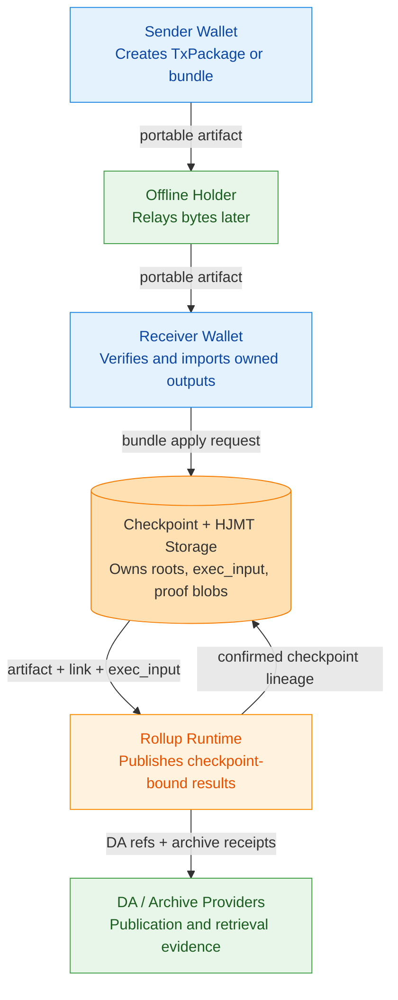

### 4.2 C4 Container View

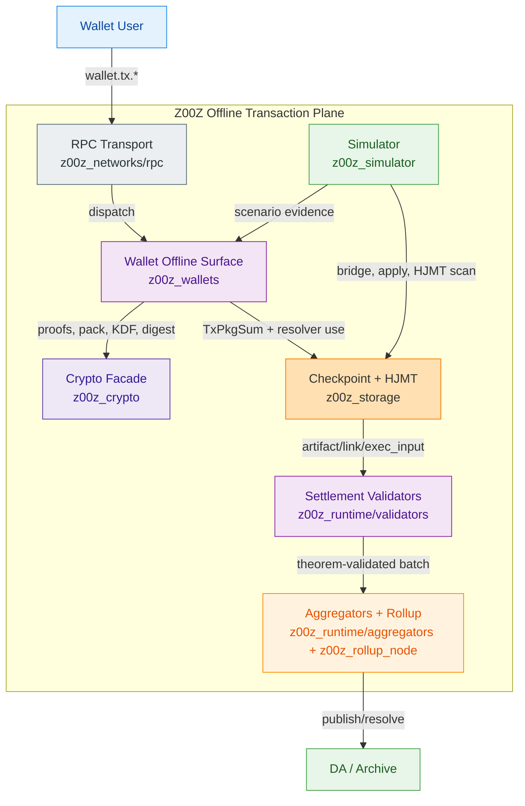

### 4.3 C4 Component View

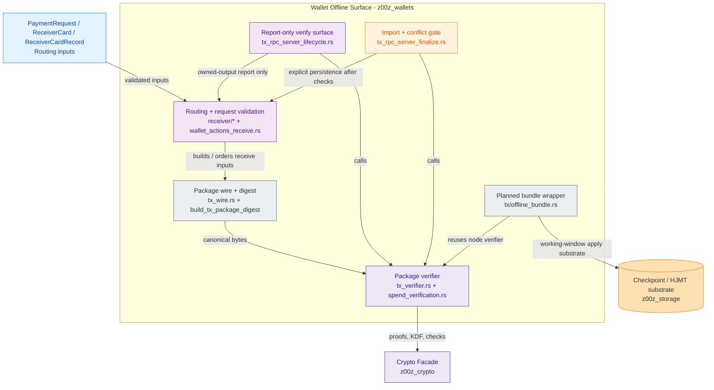

### 4.4 C4 Deployment View

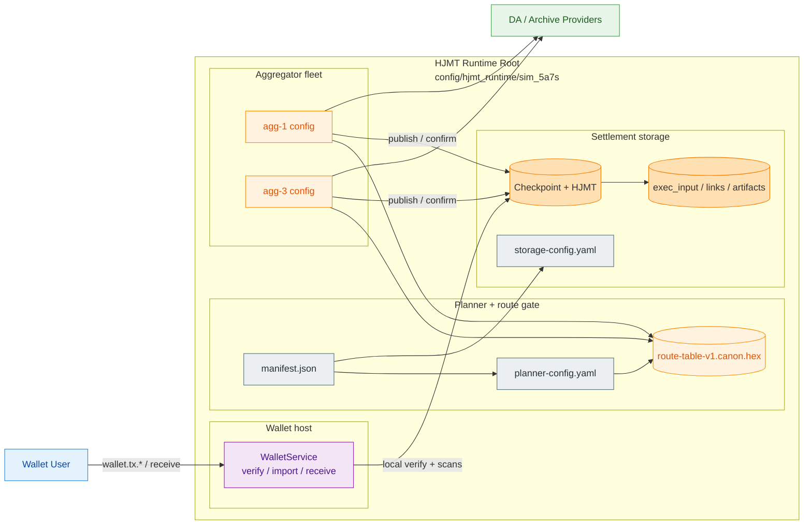

## 5. Normative Configuration Gate

The following YAML is part of the architecture. It is not a decorative example. Until `config/offline_transaction/offline-transaction-config.yaml` is materialized, this block MUST be treated as the normative planning gate.

```yaml
offline_transaction:
  meta:
    id: "offline-transaction"
    version: "1.0.0"
    status: "normative-fusion-gate"
    updated_at: "2026-07-04"
    source_spec: ".planning/phases/072-Offline-Transaction/072-Offline-Transaction-Spec.md"
    planned_gate_path: "config/offline_transaction/offline-transaction-config.yaml"

  authority:
    canonical_single_package_kind: "TxPackage"
    canonical_package_type: "regular_tx"
    canonical_tx_type: "regular_tx"
    digest_builder: "z00z_wallets::tx::build_tx_package_digest"
    digest_domain: "z00z.tx.pkg.digest.v2"
    local_verifier: "z00z_wallets::tx::verify_full_tx_package"
    public_spend_verifier: "z00z_wallets::tx::verify_tx_public_spend_contract"
    authoritative_receive: "WalletService::recv_range"
    advisory_inbox_receive: "WalletService::recv_range_with_inbox"
    worker_receive: "WalletService::recv_range_with_worker"
    theorem_bundle: "z00z_runtime::validators::SettlementTheoremBundle"

  repo_rules:
    use_z00z_utils: true
    config_loader: "z00z_utils::config"
    yaml_codec: "z00z_utils::codec::YamlCodec"
    protected_paths:
      - "crates/z00z_crypto/tari/"
    forbidden_shortcuts:
      - "new standalone offline crate"
      - "new regular transaction family"
      - "raw std::fs config reads"
      - "ad hoc YAML parsing"
      - "custom cryptography"
      - "parallel state engine"

  module_ownership:
    wallets:
      owner_crate: "crates/z00z_wallets"
      owns:
        - "TxPackage build, verify, export, import"
        - "wallet-owned output discovery"
        - "receiver routing and request validation"
        - "request-bound inbox orchestration"
        - "planned OfflineTxBundleV1 wire and report-only APIs"
      must_not_own:
        - "checkpoint semantic roots"
        - "HJMT proof truth"
        - "rollup publication authority"
    storage:
      owner_crate: "crates/z00z_storage"
      owns:
        - "InputResolver and pre-state resolution"
        - "TxPkgSum preparation"
        - "working-window apply"
        - "CheckpointExecInput, CheckpointLink, CheckpointArtifact"
        - "HJMT roots and proof blobs"
      must_not_own:
        - "wallet ownership classification"
        - "request validation policy"
        - "raw transport helper semantics"
    validators:
      owner_crate: "crates/z00z_runtime/validators"
      owns:
        - "SettlementTheoremBundle"
        - "verify_settlement_theorem"
        - "checkpoint-bound theorem consistency"
      must_not_own:
        - "wallet import policy"
        - "DA/archive validity claims"
    aggregators:
      owner_crate: "crates/z00z_runtime/aggregators"
      owns:
        - "route-aware planning"
        - "batch ordering after validator-approved inputs"
        - "publication orchestration inputs"
      must_not_own:
        - "wallet private ownership logic"
        - "custom checkpoint semantics"
    rollup:
      owner_crate: "crates/z00z_rollup_node"
      owns:
        - "HJMT runtime preflight"
        - "DA/archive adapter orchestration"
        - "status and runtime topology"
      must_not_own:
        - "wallet package semantics"
        - "receiver ownership classification"
    simulator:
      owner_crate: "crates/z00z_simulator"
      owns:
        - "deterministic offline bundle scenarios"
        - "bridge and checkpoint fixtures"
        - "HJMT scan examples and tamper evidence"
      must_not_own:
        - "production settlement authority"

  runtime_surfaces:
    canonical_single_package:
      verify_api: "wallet.tx.verify_transaction_package"
      import_api: "wallet.tx.import_transaction"
      export_api: "wallet.tx.export_transaction"
      import_ready_statuses:
        - "admitted"
        - "confirmed"
        - "verified"
    bundle_wrapper:
      enabled: true
      planned_wire: "OfflineTxBundleV1"
      owner_module: "crates/z00z_wallets/src/tx/offline_bundle.rs"
      base_anchor_required: true
      minimal_ancestor_closure_required: true
      stable_topology_order: "dependency_then_digest_lex"
      conflict_policy: "atomic_reject"
      cycle_policy: "fail_closed"
      duplicate_package_policy: "reject"
      over_inclusion_policy: "reject_unrelated_nodes"
      transport_metadata_digest_bound: false
      package_possession_publishable: true
      max_nodes: 128
      max_edges: 512
      max_bundle_bytes: 8388608
    storage_apply:
      input_resolver: "z00z_storage::checkpoint::InputResolver"
      tx_pkg_sum: "z00z_storage::checkpoint::TxPkgSum"
      build_draft: "z00z_storage::checkpoint::build_cp_draft"
      apply_batch: "z00z_storage::checkpoint::apply_batch_checkpoint"
      exec_input: "z00z_storage::checkpoint::CheckpointExecInput"

  package_limits:
    max_package_bytes: 1048576
    max_outputs_per_package: 16
    max_inputs_per_package: 16
    max_owned_outputs_reported: 16
    max_error_codes: 16
    reject_unknown_fields: true
    require_lowercase_hex: true

  lifecycle:
    import_ready_statuses:
      - "admitted"
      - "confirmed"
      - "verified"
    report_only_statuses:
      - "created"
      - "prepared"
      - "submitted"
    terminal_failure_statuses:
      - "failed"
      - "cancelled"
      - "conflicted"
      - "already_spent"

  receiver_routing:
    prefer_payment_request: true
    allow_raw_receiver_card: true
    allow_published_receiver_record: true
    require_card_signature: true
    require_record_registry_binding: true
    reject_revoked_record: true
    reject_stale_record_epoch: true
    raw_card_never_implies_publication_trust: true

  public_spend:
    require_proof_and_auth_together: true
    reject_half_populated_spend: true
    require_prev_root_binding: true
    require_receiver_card_binding: true
    require_statement_integrity: true
    require_duplicate_nullifier_rejection: true
    public_verifier_is_not_storage_authority: true

  package_graph:
    max_nodes: 128
    max_edges: 256
    max_ancestor_depth: 32
    conflict_policy: "atomic_reject"
    topo_order: "deterministic_digest_then_dependency"
    require_single_base_root: true
    dedupe_by_tx_digest: true
    reject_cycles: true
    reject_unresolved_inputs: true
    reject_duplicate_spends: true
    exclude_unrelated_siblings: true
    transport_metadata_in_digest: false

  storage_handoff:
    backend_mode: "hjmt"
    checkpoint_exec_version: 1
    require_checkpoint_exec_input: true
    require_member_witnesses: true
    require_spent_index: true
    reject_physical_root_as_public_root: true
    remote_scan_worker_authority: "evidence_only"
    wallet_scan_authority: "wallet_local"

  hjmt:
    runtime_root: "config/hjmt_runtime/sim_5a7s"
    planner_config: "config/hjmt_runtime/sim_5a7s/planner/planner-config.yaml"
    storage_config: "config/hjmt_runtime/sim_5a7s/storage/storage-config.yaml"
    manifest: "config/hjmt_runtime/sim_5a7s/manifest.json"
    route_table_rel_path: "shard_route_tables/route-table-v1.canon.hex"
    committed_scan_requires_proof_blob: true
    committed_scan_requires_storage_root: true
    evidence_only_remote_worker: true

  crypto:
    domain_separation_required: true
    vendor_crypto_read_only: true
    live_pack_contract: "ZkPack_v1"
    live_pack_aead: "ChaCha20Poly1305"
    key_derivation:
      - "Argon2id"
      - "HKDF-SHA256"
    constant_time_compare_required:
      - "tx_digest_hex"
      - "bundle_digest_hex"
      - "route_table_expected_digest"
      - "artifact_checksums"
    forbid_custom_crypto: true

  transport_privacy:
    request_bound_receive_preferred: true
    raw_receiver_card_compatibility: true
    sensitive_artifacts:
      - "PaymentRequest"
      - "ReceiverCard"
      - "ReceiverCardRecord"
      - "TxPackage"
      - "OfflineTxBundleV1"
      - "checkpoint proof bytes"
      - "HJMT proof blobs"
      - "wallet export files"

  receive_integration:
    request_validation_surface: "receiver::ValidatePaymentRequest"
    advisory_inbox_entrypoint: "WalletService::recv_range_with_inbox"
    authoritative_receive_entrypoint: "WalletService::recv_range"
    request_scan_support: "receiver::ReceiverManager::scan_range_with_requests"
    inbox_metadata_only: true
    inbox_reenters_authoritative_receive: true
    remote_scan_evidence_only: true
    allow_direct_receive_without_inbox: true
    forbid_inbox_owned_asset_persistence: true
    forbid_inbox_scan_cursor_advance: true

  retry_and_fallback:
    thin_transport_fallback: "thick_package"
    missing_snapshot_fallback: "thick_package"
    stale_snapshot_fallback: "thick_package"
    digest_mismatch_fallback: "reject"
    public_spend_error_fallback: "reject"
    package_graph_error_fallback: "reject_bundle"
    remote_scan_unavailable_fallback: "local_scan_only"

  simulation:
    scenario_1_enabled: true
    scenario_11_enabled: true
    release_required_for_range_proofs: true
    wallet_debug_tools_allowed_in_tests_only: true

  observability:
    redact_package_bytes: true
    redact_wallet_secrets: true
    redact_receiver_secret_material: true
    log_error_codes: true
    log_lifecycle: true
    log_package_digest: true
    log_owned_output_count: true
    never_log_asset_secret: true
    never_log_blinding: true

  dependency_posture:
    add_now: []
    reuse_now:
      - "serde"
      - "thiserror"
      - "hex"
      - "sha2"
      - "base64"
      - "tokio"
      - "rayon"
      - "jsonrpsee"
      - "redb"
      - "jmt"
      - "chacha20poly1305"
      - "argon2"
      - "hkdf"
      - "zeroize"
      - "subtle"
      - "merlin"
    may_add_later:
      - "smallvec"
      - "proptest"
      - "criterion"
      - "serial_test"
    avoid_now:
      - "petgraph"
      - "daggy"
      - "second JMT implementation"
      - "second RPC stack"
      - "custom AEAD crate"
```

Config enforcement rules:

- `CFG-001`: The system MUST load the config gate before enabling offline transaction APIs.
- `CFG-002`: The gate MUST be validated at startup and on hot reload.
- `CFG-003`: Missing mandatory fields MUST disable offline package graph behavior.
- `CFG-004`: Unknown fields SHOULD be rejected in strict mode.
- `CFG-005`: All file paths MUST resolve through `z00z_utils` abstractions.
- `CFG-006`: Wallet, storage, validators, rollup, and simulator MUST use the same value vocabulary.
- `CFG-007`: If implementation diverges from this YAML gate, implementation MUST be considered wrong until the gate is updated.
- `CFG-008`: Tests MUST include fixtures for enabled, gated, disabled, malformed, and conflicting settings.

## 6. Module Ownership And Placement

### 6.1 Strong Recommendation

Phase 072 SHOULD live in existing crates and MUST NOT start with a new standalone crate.

| Concern | Canonical home | Rationale |
| --- | --- | --- |
| Portable node contract, local verify/report/import, receiver routing, bundle wire | `crates/z00z_wallets` | Live package semantics and wallet receive/import authority already live here. |
| Base-state resolution, working-window apply, checkpoint draft/output, HJMT proofs | `crates/z00z_storage` | Roots, proofs, and checkpoint DTOs already live here. |
| Theorem and inclusion consistency | `crates/z00z_runtime/validators` | `SettlementTheoremBundle` already lives here. |
| Route-aware planning and publication handoff | `crates/z00z_runtime/aggregators` | Batch and route orchestration belong here. |
| Runtime preflight, DA/archive orchestration, status | `crates/z00z_rollup_node` | HJMT runtime preflight and rollup status live here. |
| Deterministic end-to-end evidence | `crates/z00z_simulator` | Stage 6/7/11/13 already model the offline-to-checkpoint-to-HJMT story. |
| Transport dispatch only | `crates/z00z_networks/rpc` | Transport MUST remain separate from business logic. |

### 6.2 Planned Module Layout

| Planned module | Home | Required role |
| --- | --- | --- |
| `tx/offline_bundle.rs` | `crates/z00z_wallets` | DTOs for `OfflineTxBundleV1`, canonicalization, digest binding, and report-only validation helpers. |
| `tx/offline_bundle_report.rs` | `crates/z00z_wallets` | Bundle verify response assembly, owned-output scan summaries, error-code mapping |
| `checkpoint/bundle_prepare.rs` | `crates/z00z_storage` | Minimal ancestor closure resolution and stable topological apply preparation. |
| `checkpoint/bundle_apply.rs` | `crates/z00z_storage` | Working-window apply over already validated node order, producing current checkpoint DTOs. |
| `validators/bundle_verdict.rs` | `crates/z00z_runtime/validators` | Multi-node theorem checks over current `SettlementTheoremBundle` rules. |
| `aggregators/offline_bundle_route.rs` | `crates/z00z_runtime/aggregators` | Route-aware handoff after validator-approved execution input. |

### 6.3 Explicit Rejections

The following placements and shortcuts are forbidden for v1:

- root-level `crates/z00z_offline_tx`;
- a second verifier path outside `z00z_wallets::tx`;
- a second checkpoint/state engine outside `z00z_storage`;
- wallet ownership logic inside `z00z_rollup_node`;
- HJMT proof truth inside `z00z_networks/rpc`;
- bundle DAG storage as a parallel state tree separate from HJMT/checkpoint surfaces.

## 7. Canonical Data Contracts

### 7.1 Receiver Routing And Privacy

Routing input priority:

| Artifact | Status | Rule |
| --- | --- | --- |
| `PaymentRequest` | privacy-preferred | SHOULD be preferred when present and valid. |
| `ReceiverCardRecord` | canonical published compatibility lane | MUST be used when publication, epoch, registry-entry, or revocation semantics matter. |
| `ReceiverCard` | direct compatibility lane | MAY be used for direct offline relay when the request-bound lane is unavailable. |

`TxPackage` and `OfflineTxBundleV1` MUST NOT embed raw `PaymentRequest`, `ReceiverCard`, or `ReceiverCardRecord` as digest-bound fields. These artifacts remain upstream routing inputs to output construction and authorization.

### 7.1.1 Request-Bound Receive And Inbox Contract

Phase 072 MUST integrate with the privacy-preferred request-bound lane without capturing its authority.

Required rules:

- `PaymentRequest` MUST be validated through the canonical request-validation surface before it influences receive ordering or output interpretation.
- `WalletService::recv_range_with_inbox(...)` MUST remain advisory and MUST re-enter authoritative `WalletService::recv_range(...)`.
- Request inbox records MUST remain metadata-only and MUST NOT become a second wallet mutation authority.
- Request-bound inbox metadata MUST NOT claim assets, create tx-history rows, or advance the scan cursor.
- Remote scan worker chunks, proof hints, and resume hints MUST remain advisory inputs to the same authoritative wallet-local receive lane.
- Offline package verify/import and request-bound range receive MUST remain separate concerns, even when used in the same user journey.

Practical integration rule:

- Use request-bound receive for privacy-preserving owned-output discovery when a valid `PaymentRequest` exists.
- Use `ReceiverCardRecord` or `ReceiverCard` only when the request-bound lane is unavailable or intentionally not used.
- Never promote inbox metadata, worker evidence, or HJMT proof hints into independent receive authority.

### 7.2 Current `TxPackage` Contract

`TxPackage` remains the canonical node contract:

| Field | Rule |
| --- | --- |
| `kind` | MUST equal `TxPackage` |
| `package_type` | MUST equal `regular_tx` |
| `version` | MUST be non-zero and supported |
| `chain_id` | MUST be non-zero and match the wallet/runtime chain |
| `chain_type` | MUST be non-empty |
| `chain_name` | MUST be non-empty |
| `tx` | MUST contain live `TxWire` |
| `tx_digest_hex` | MUST equal `build_tx_package_digest(...)` |
| `status` | MUST be non-empty and MUST drive lifecycle/import readiness |

`TxWire` contract:

- `tx_type` MUST equal `regular_tx`;
- `inputs` MUST contain only reference-only `TxInputWire` values;
- `outputs` MUST contain portable `TxOutputWire` values;
- `fee` MUST match the sum of fee outputs and calculated fee units;
- `nonce` MUST be non-zero at output level;
- `context` MUST remain explicit even when empty;
- `proof.spend` and `auth.spend` are optional containers, but if either one is present, both MUST be present.

`TxInputWire` MUST NOT inline membership witnesses or consumed leaf bytes. Membership remains a checkpoint/pre-state concern.

`TxOutputWire` MUST carry one semantic role:

- `recipient`
- `change`
- `fee`

### 7.3 Digest Contract

`build_tx_package_digest(...)` is the only canonical digest function for regular `TxPackage`.

Digest MUST bind:

- `kind`
- `package_type`
- `version`
- `chain_id`
- `chain_type`
- `chain_name`
- normalized `TxWire`

Live digest normalization rules:

- input `asset_id_hex` canonicalized to lowercase 32-byte hex;
- output `range_proof` removed from digest input;
- output `owner_signature` removed from digest input;
- regular transaction `auth` cleared for digest input;
- spend `statement_hex` and `proof_hex` cleared for digest input;
- canonical spend wire fields normalized before digest input;
- final hash domain MUST be `z00z.tx.pkg.digest.v2`.

Normative rules:

- `DIG-001`: Implementations MUST NOT use any alternate digest scheme for package identity.
- `DIG-002`: Thin wrappers MUST preserve and revalidate the canonical thick package digest.
- `DIG-003`: Graph node identity MUST be the recomputed `tx_digest_hex`, not transport position.
- `DIG-004`: Transport-only metadata MUST NOT enter the canonical digest.
- `DIG-005`: Digest mismatch MUST reject before owned-output reporting, import, package graph apply, or runtime admission.

### 7.4 Output Construction Contract

Sender output construction is a cryptographic construction path, not a serializer shortcut.

Canonical live helper surfaces:

- `z00z_wallets::stealth::build_card_stealth_output_validated(...)`
- `z00z_wallets::stealth::build_tx_stealth_output_validated(...)`
- `z00z_wallets::stealth::build_output_bundle(...)`
- `z00z_wallets::stealth::build_output_bundle_with_rng(...)`
- `z00z_wallets::tx::bind_output_wire(...)`
- `z00z_wallets::tx::decode_output_pack(...)`
- `z00z_wallets::tx::verify_self_decrypt(...)`

Output construction MUST enforce or preserve:

- verified receiver routing;
- request approval when request-bound output is used;
- Diffie-Hellman shared key derivation;
- owner tag derivation;
- encrypted asset pack construction;
- output secret derivation;
- commitment construction;
- range-proof generation;
- tag recomputation;
- self-decryption;
- commitment opening check;
- range-proof verification.

Simulator code MUST reuse or mirror wallet helpers. It MUST NOT create a packageable output lane that skips self-decrypt, commitment, or range-proof checks.

### 7.5 Planned `OfflineTxBundleV1` Contract

`OfflineTxBundleV1` is the only allowed future multi-node wire for regular offline transfer.

```rust
pub struct OfflineTxBundleV1 {
    pub version: u8,
    pub chain_id: u32,
    pub chain_type: String,
    pub chain_name: String,
    pub base_prev_root_hex: String,
    pub packages: Vec<TxPackage>,
    pub edges: Vec<OfflineBundleEdgeV1>,
    pub bundle_digest_hex: String,
    pub transport: Option<OfflineBundleTransportMetaV1>,
}

pub struct OfflineBundleEdgeV1 {
    pub parent_tx_digest_hex: String,
    pub child_tx_digest_hex: String,
    pub consumed_asset_id_hex: String,
    pub consumed_serial_id: u32,
}
```

Contract rules:

- `packages` MUST contain only canonical `TxPackage` nodes;
- `base_prev_root_hex` MUST be a shared anchor for every bundle node;
- `edges` MUST describe only real parent-created outputs consumed by child inputs;
- `bundle_digest_hex` MUST bind only canonical bundle material;
- `transport` MUST NOT enter `bundle_digest_hex`;
- `packages` MUST already represent the minimal ancestor closure for the selected publishable branch.

### 7.6 Planned Bundle Verify Report

Bundle verify SHOULD return:

| Field | Meaning |
| --- | --- |
| `bundle_digest_hex` | Canonical additive bundle digest |
| `is_valid` | Full bundle verdict after package verify, closure, and topology checks |
| `base_prev_root_hex` | Shared anchor root |
| `topology_order` | Stable ordered package digest list |
| `valid_package_count` | Number of individually valid nodes |
| `import_ready_package_digests` | Subset with accepted statuses and owned outputs |
| `owned_outputs` | Wallet-owned outputs grouped by package digest |
| `errors` | Human-readable diagnostics |
| `error_codes` | Machine-readable diagnostics |

### 7.7 Persistence Model

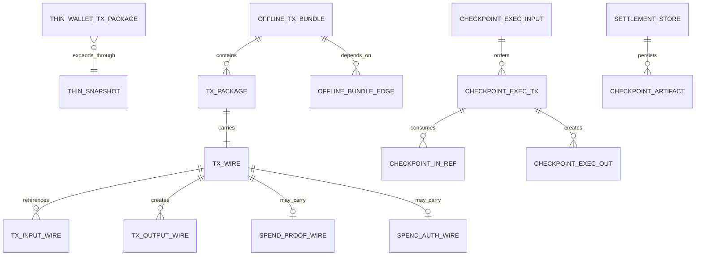

## 8. End-To-End Runtime Flow

### 8.1 Single-Package Flow

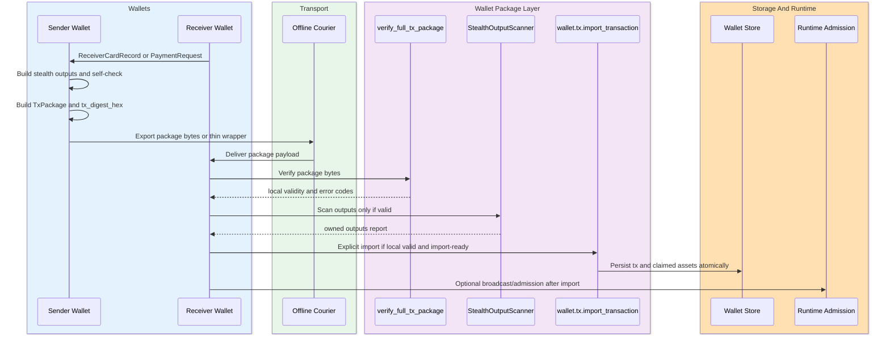

### 8.1.1 Request-Bound Receive Lane

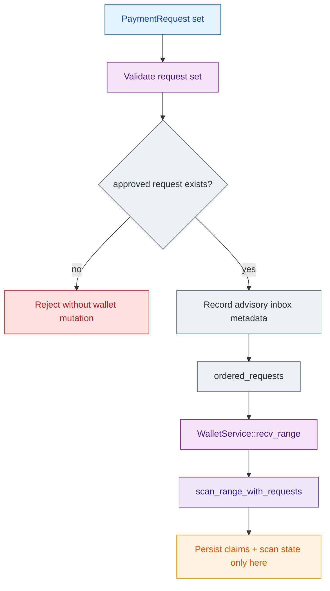

Canonical order:

1. The receiver validates `PaymentRequest`.
2. The advisory inbox MAY record metadata and range hints.
3. Approved requests MAY be ordered through `recv_range_with_inbox(...)`.
4. ordered set MUST re-enter `recv_range(...)`;
5. Wallet mutation MUST happen only through the authoritative receive lane.
6. Exported/imported `TxPackage` artifacts MUST remain separate from inbox metadata.

### 8.2 Bundle Flow

Bundle flow adds only the following responsibilities:

1. collect dependent `TxPackage` nodes;
2. compute minimal ancestor closure;
3. encode edges from parent-created outputs to child inputs;
4. verify every node with the same single-package verifier;
5. reject cross-anchor, cycle, duplicate, and conflict cases;
6. build deterministic topological order;
7. feed the ordered node set into storage-owned working-window apply;
8. emit current checkpoint DTOs rather than a parallel settlement format.

### 8.3 Canonical Bundle Verification Ladder

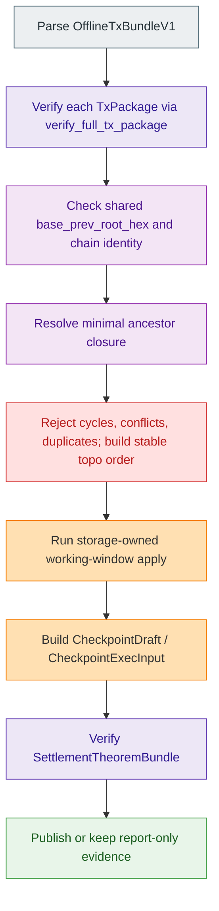

### 8.4 Dynamic Runtime Story

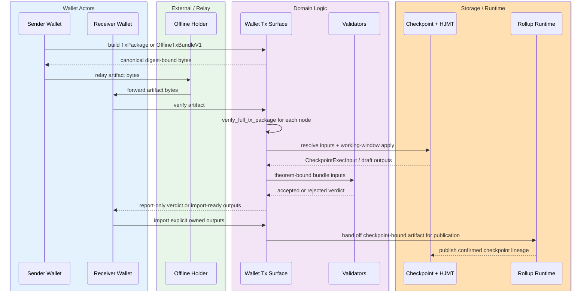

### 8.5 Lifecycle And Import Gate

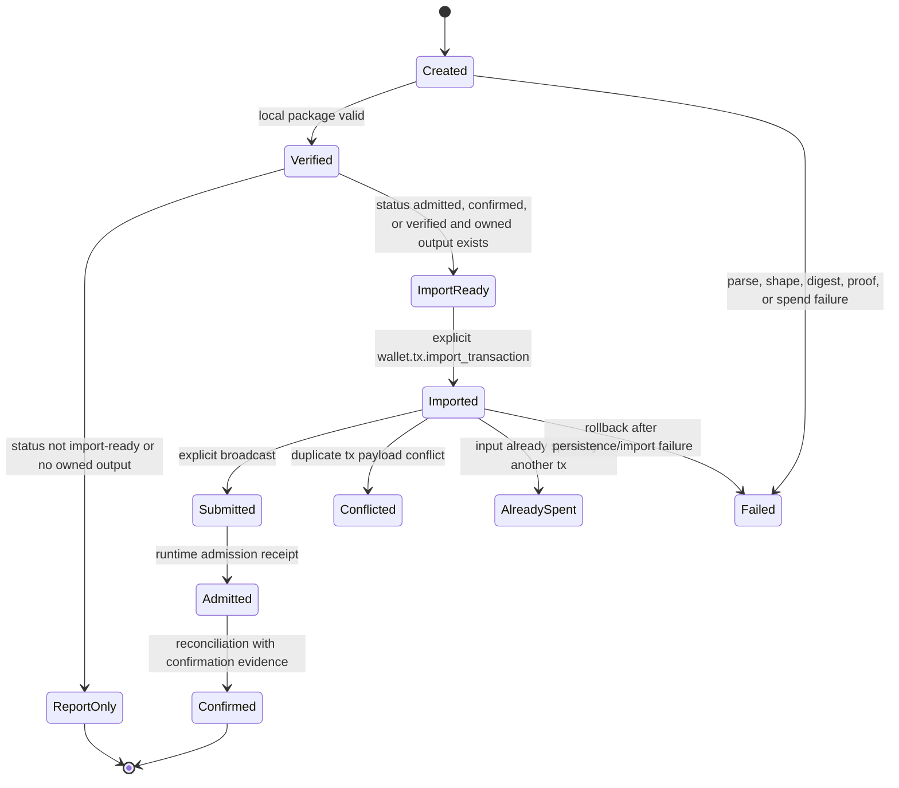

Rules:

- `LIF-001`: Verify MUST NOT persist assets.
- `LIF-002`: Report-only owned output discovery MUST NOT imply import authority.
- `LIF-003`: Import MUST require local validity, matching chain id, accepted import-ready status, and at least one owned output.
- `LIF-004`: Import MUST be idempotent for identical package payloads.
- `LIF-005`: Import MUST reject conflicting payloads with the same tx id.
- `LIF-006`: Already-spent conflicts MUST be machine-readable and MUST NOT duplicate owned assets.
- `LIF-007`: Reconciliation MUST require confirmation evidence.

## 9. Storage, HJMT, And Rollup Integration

### 9.1 Wallet Boundary

Wallet-local verification proves package-local correctness only. It does not prove:

- global spent-state uniqueness;
- checkpoint finality;
- HJMT inclusion by itself.

Therefore:

- `verify_full_tx_package(...)` MUST remain the first gate;
- owned-output scan MUST happen only after local validity;
- import MUST remain explicit;
- checkpoint finality MUST remain external to wallet verify/report.

### 9.2 Storage Working-Window Apply

Bundle apply MUST reuse current storage contracts:

- `InputResolver`
- `ResolvedInput`
- `TxPkgSum`
- `build_cp_draft(...)`
- `apply_batch_checkpoint(...)`
- `CheckpointExecInput`
- `CheckpointLink`
- `CheckpointArtifact`

Required algorithm:

1. start from the shared `base_prev_root_hex`;
2. resolve state-anchored inputs through `InputResolver`;
3. resolve ancestor-provided inputs from earlier ordered nodes in the working window;
4. reject any input that is neither state-anchored nor ancestor-provided;
5. reject double consumption inside the bundle;
6. reject created-output id overlap;
7. produce one deterministic ordered checkpoint draft result.

### 9.3 Theorem Binding

After storage apply, validators MUST bind the result back to package truth through `SettlementTheoremBundle`.

This means:

- theorem verification MUST re-check package theorem assumptions;
- checkpoint proof payload MUST match statement payload;
- execution replay ids MUST match current checkpoint surfaces;
- package inclusion MUST be explicit, not inferred from archive or DA receipts;
- theorem mismatch MUST reject the whole bundle.

### 9.4 Rollup Runtime And HJMT Config

Rollup publication MUST consume the live checkpoint contract and current HJMT runtime configs:

- `crates/z00z_storage/src/checkpoint/checkpoint_contract.yaml`
- `config/hjmt_runtime/sim_5a7s/planner/planner-config.yaml`
- `config/hjmt_runtime/sim_5a7s/storage/storage-config.yaml`
- `config/hjmt_runtime/sim_5a7s/manifest.json`
- `config/hjmt_runtime/sim_5a7s/aggregators/*/aggregator-config.yaml`

Phase 072 MUST treat these as real gates for:

- route digest and placement checks;
- storage backend generation checks;
- proof codec checks;
- handoff readiness checks;
- config digest evidence;
- preflight report evidence.

### 9.5 HJMT Committed-State Scan

Committed-state ownership detection MUST use the proof-first lane:

1. load committed post-tx candidate leaves from settlement storage;
2. load corresponding proof blob;
3. validate `chk_blob_settlement_inclusion(...)`;
4. only then run `receiver_scan_report(...)` and `receiver_scan_leaf(...)`;
5. emit an artifact that distinguishes committed-state scan from detached package scan.

This is a critical boundary: proof-first JMT scan is a stronger claim than detached offline package report and MUST be treated that way.

### 9.6 Request-Bound Receive, Remote Workers, And HJMT Non-Authority

Phase 072 MUST remain aligned with the wallet-first receive model:

- `recv_range_with_inbox(...)` is advisory orchestration, not settlement truth.
- `recv_range(...)` remains the authoritative wallet-local mutation lane.
- `RemoteScanEvidence` and worker proof hints are evidence-only inputs and MUST be locally validated before any mutation.
- HJMT proof inclusion strengthens settlement evidence, but MUST NOT bypass wallet-local request validation, scan logic, or import gates.

### 9.7 Cross-Phase Compatibility With 067-071

Phase 072 MUST compose with the adjacent phase authorities without weakening any of them.

| Phase | Required compatibility rule |
| --- | --- |
| 067 Sharded Consensus | When the Phase 067 quorum-certificate gate is active, Phase 072 publication MUST bind package or bundle digest, route, placement, theorem input, DA publication, and quorum certificate evidence to the same `CommitSubject`. Aggregator quorum, routing, and shard-local ordering evidence MUST NOT become wallet ownership proof, checkpoint validity, recursive proof validity, or final settlement by itself. Secondary aggregators MUST be able to replay the committed subject from canonical package/checkpoint evidence. |
| 068 Checkpoint Contract | Bundle output MUST feed the checkpoint contract through `CheckpointExecInput`, `CheckpointArtifact`, `CheckpointLink`, archive manifest, DA reference, and publication evidence lanes. DA publication readiness MAY start dispute timing, but it MUST NOT decide settlement validity. |
| 069 Recursive Proof | Recursive sidecars and future proof backends MUST bind the same checkpoint statement as the canonical branch. Phase 072 MUST NOT drop raw packages, exact proof bytes, witness data, or replay material merely because recursive compression exists or is planned. |
| 070 Rollup Node | Rollup publication MUST use provider-neutral DA/archive adapters, retrieval evidence, bounded challenge classes, and checkpoint theorem evidence. Provider receipts, CIDs, blob hashes, or external SDK receipts MUST NOT become wallet package validity or settlement validity by themselves. |
| 071 Request-Bound Inbox | Phase 071 remains the canonical authority for `wallet.receiver.inbox`, sanitized durable/helper records, request id hashes, route buckets, redacted exports, and tag16 limits. Phase 072 MAY consume request-bound receive results, but MUST NOT redefine the inbox data model or persist binding-rich request records through transaction packages. |

Cross-phase dataflow is intentionally asymmetric: Phase 072 consumes adjacent authority outputs, but it MUST NOT absorb their authority into wallet package validity.

```mermaid
flowchart LR
  Package[TxPackage or OfflineTxBundleV1\npackage evidence]
  Inbox[071 Request-Bound Inbox\nadvisory receive metadata]
  Wallet[Wallet Receive Authority\nverify, scan, import gate]
  Checkpoint[068 Checkpoint Contract\nexec input, artifact, link]
  Consensus[067 Sharded Consensus\nCommitSubject quorum evidence]
  Recursive[069 Recursive Proof\nsidecar over same statement]
  Rollup[070 Rollup Node\nDA/archive orchestration]
  DA[DA / Archive\nretrieval evidence only]
  Reject[Forbidden authority drift\nno DA validity, no sidecar admission,\nno quorum ownership proof]

  Inbox -->|orders and filters requests only| Wallet
  Package -->|package-local validity| Wallet
  Wallet -->|ordered package/checkpoint evidence| Checkpoint
  Checkpoint -->|theorem-bound subject| Consensus
  Checkpoint -->|same statement| Recursive
  Consensus -->|publication preflight input| Rollup
  Recursive -->|non-authoritative compression evidence| Rollup
  Rollup -->|publish and retrieve| DA
  DA -. MUST NOT decide validity .-> Reject
  Consensus -. MUST NOT own wallet assets .-> Reject
  Recursive -. MUST NOT replace raw evidence .-> Reject
  Inbox -. MUST NOT mutate package state .-> Reject

  style Package fill:#ECEFF1,stroke:#546E7A,stroke-width:1px,color:#263238
  style Inbox fill:#E3F2FD,stroke:#1E88E5,stroke-width:1px,color:#0D47A1
  style Wallet fill:#F3E5F5,stroke:#8E24AA,stroke-width:1px,color:#4A148C
  style Checkpoint fill:#FFE0B2,stroke:#F57C00,stroke-width:1px
  style Consensus fill:#FFF3E0,stroke:#FB8C00,stroke-width:1px,color:#E65100
  style Recursive fill:#EDE7F6,stroke:#5E35B1,stroke-width:1px,color:#311B92
  style Rollup fill:#FFF3E0,stroke:#FB8C00,stroke-width:1px,color:#E65100
  style DA fill:#E8F5E9,stroke:#43A047,stroke-width:1px,color:#1B5E20
  style Reject fill:#FFE0E0,stroke:#D32F2F,stroke-width:1px,color:#B71C1C
```

Cross-phase rejection rules:

- Phase 072 MUST NOT describe aggregator consensus as BFT finality unless Phase 067 explicitly promotes that mode.
- Phase 072 MUST NOT describe DA/archive publication as state validity; validators still verify checkpoint and theorem evidence.
- Phase 072 MUST NOT treat recursive sidecar acceptance as canonical admission before the recursive authority-promotion gates close.
- Phase 072 MUST NOT treat `wallet.receiver.inbox` config as a sub-key owned by the offline transaction config. The offline config may reference or mirror the inbox gate, but Phase 071 owns the inbox policy.

## 10. Security, Cryptography, Privacy, And Historical Risk Analysis

### 10.1 Cryptographic Requirements

- `OTX-SEC-001`: Offline transaction code MUST use domain-separated hashing for every new digest, bundle digest, route checksum, or export checksum.
- `OTX-SEC-002`: All sensitive key, pack, and secret handling MUST route through `z00z_crypto` and current wallet secret wrappers.
- `OTX-SEC-003`: `TxPackage` and `OfflineTxBundleV1` MUST be treated as sensitive transport artifacts and MUST NOT be logged in plaintext.
- `OTX-SEC-004`: New bundle logic MUST NOT introduce custom crypto, custom AEAD, or direct vendor-code edits.
- `OTX-SEC-005`: Digest, checksum, and route-digest comparisons SHOULD use constant-time equality where values affect trust or gating.
- `OTX-SEC-006`: Public spend proof and auth MUST arrive together.
- `OTX-SEC-007`: Local package verification MUST run before owned-output scanning.
- `OTX-SEC-008`: Import MUST require explicit user or API action after verification.
- `OTX-SEC-009`: Package graph publication MUST reject cycles, unresolved inputs, duplicate spends, and sibling over-inclusion.
- `OTX-SEC-010`: HJMT physical roots MUST NOT be exposed as public root authority.

### 10.2 Verification Scope Honesty

- passing `verify_tx_public_spend_contract(...)` MUST NOT be presented as checkpoint finality;
- passing `verify_full_tx_package(...)` MUST NOT be presented as proof of global spent-state uniqueness;
- committed-state HJMT scan MUST NOT be skipped when the caller requires proof of inclusion rather than a report-only ownership hint.

### 10.3 Replay And Conflict Handling

- duplicate package digests in one bundle MUST reject;
- duplicate consumed input refs in one bundle MUST reject;
- competing children spending the same unresolved parent output MUST reject the whole bundle in v1;
- repeated import identical portable package MUST be idempotent;
- changed bytes under the same `tx_id` MUST be conflict;
- already-spent input conflict MUST surface `AlreadySpent` and MUST NOT mutate claimed-asset state.

### 10.4 Privacy Boundary

The system MUST remain honest about privacy:

- request-bound receive is privacy-preferred;
- raw card transport is compatibility-only;
- package portability is not transport anonymity;
- HJMT inclusion proof is not metadata secrecy;
- archive retention is not wallet confidentiality.

### 10.5 Historical Draft Risk Analysis And Fusion Resolution

| Historical draft class | Strengths | Risk if used alone | Fusion resolution |
| --- | --- | --- | --- |
| Runtime-heavy architecture draft | Strong runtime flow, request-bound receive, HJMT, acceptance, and stage-by-stage verification. | Stale corrections, property/fuzz, and persistence model are less explicit. | Those gaps are closed in Sections 2, 7.4, 7.7, 12.4, 12.5, and 14.3. |
| Contract-heavy architecture draft | Strong correction ledger, output construction, persistence, and decision record. | Request-bound receive boundaries, HJMT non-authority, and evidence ledger are weaker; it treats `petgraph` as add-now. | Request-bound and HJMT rules are strengthened here, and `petgraph` is rejected for v1 dependency posture. |
| Historical package/backlog notes | Strong one-package, one-verifier, import-gate, and seam-reuse discipline. | Some signatures and paths are stale. | The concepts are preserved while live paths and helper names are corrected. |
| Historical DAG notes | Strong ancestor-closure, publishability, topological apply, and conflict-rejection ideas. | They can be misread as a second DAG runtime or second transaction family. | The concepts are constrained to `OfflineTxBundleV1` as a wrapper around `TxPackage` and storage-owned checkpoint apply. |

Security conclusion:

- using only the first spec risks under-specifying property/fuzz and stale-path corrections;
- using only the second spec risks weakening wallet authority and expanding dependency surface unnecessarily;
- this fusion document removes both risk classes while keeping wallet, storage, validator, and rollup boundaries strict.

## 11. Fallback, Failure, And Recovery Rules

| Situation | Required behavior |
| --- | --- |
| Invalid package bytes | Reject before owned-output scan |
| Valid package but status not import-ready | Return report-only verdict with `NotImportReady` |
| Valid package but no owned outputs | Return report-only verdict with `NoOwnedOutputs`; import MUST reject |
| Wrong chain | Reject at wallet import boundary |
| Same `tx_id` but different payload | Mark conflicted and reject |
| Already-spent input | Mark `AlreadySpent`, keep state fail-closed, do not import outputs |
| Missing ancestor in bundle | Reject full bundle |
| Cycle in dependency graph | Reject full bundle |
| Unrelated over-included node | Reject full bundle |
| Missing HJMT proof blob for committed scan | Reject committed-state scan and fall back only to detached package report |
| Request inbox disabled or bypassed | Keep direct receive lane available; inbox MUST NOT become hard dependency |
| Remote scan worker evidence unavailable | Keep wallet receive authority local; retry with direct receive or new evidence |
| Thin snapshot missing or stale | Use thick canonical package |
| Thin wrapper digest mismatch | Reject |
| Rollup preflight or route-digest drift | Stop publication; keep wallet state local |
| Archive/DA unavailable | Keep checkpoint truth local; do not claim `da_publication_ready` |

Recovery posture:

- repeated identical import SHOULD be idempotent;
- bundle re-verification SHOULD be deterministic under identical bytes;
- rollup-side restart MUST reuse persisted HJMT/runtime config evidence and MUST fail closed on digest drift;
- simulator scenarios SHOULD regenerate the same result under deterministic profiles.

## 12. Test, Simulation, End-To-End, And Acceptance Strategy

### 12.1 Positive Test Matrix

- `OTX-TEST-001`: `TxPackage` digest framing remains stable across canonical fields and rejects drift.
- `OTX-TEST-002`: `ReceiverCard` and `ReceiverCardRecord` roundtrip and reject malformed, expired, revoked, and stale cases.
- `OTX-TEST-003`: `verify_full_tx_package(...)` accepts a valid single package and reports owned outputs only after validity.
- `OTX-TEST-004`: `wallet.tx.import_transaction` imports owned outputs only for import-ready statuses.
- `OTX-TEST-005`: identical repeated import is idempotent.
- `OTX-TEST-006`: minimal parent-child bundle with shared base anchor passes canonical bundle verify.
- `OTX-TEST-007`: valid ordered bundle yields current checkpoint DTOs through storage-owned apply.
- `OTX-TEST-008`: theorem-bound checkpoint verification succeeds for a valid package or bundle result.
- `OTX-TEST-009`: committed-state HJMT scan validates proof first and then detects ownership.
- `OTX-TEST-010`: rollup runtime preflight succeeds against canonical HJMT runtime fixture config.
- `OTX-TEST-011`: valid request-bound inbox flow re-enters canonical receive lane and mutates wallet state only through that lane.
- `OTX-TEST-012`: advisory worker evidence is accepted only as input to authoritative receive lane.

### 12.2 Negative Test Matrix

- `OTX-NEG-001`: bad `tx_digest_hex` rejects with `InvalidDigest`.
- `OTX-NEG-002`: half-populated spend proof/auth rejects.
- `OTX-NEG-003`: wrong chain rejects at import.
- `OTX-NEG-004`: valid package with no owned outputs rejects at import and stays report-only.
- `OTX-NEG-005`: duplicate or conflicting payload under same `tx_id` rejects with `DuplicateConflict`.
- `OTX-NEG-006`: already-spent input rejects with `AlreadySpent` and no claimed-asset mutation.
- `OTX-NEG-007`: bundle cycle rejects.
- `OTX-NEG-008`: bundle missing ancestor rejects.
- `OTX-NEG-009`: bundle with competing child spends rejects atomically.
- `OTX-NEG-010`: theorem mismatch rejects even if package-local verification passed.
- `OTX-NEG-011`: HJMT scan without proof blob rejects committed-state authority.
- `OTX-NEG-012`: route-table digest or config-digest drift fails rollup preflight.
- `OTX-NEG-013`: rejected, expired, wrong-chain or identity-mismatch request leaves wallet state unchanged.
- `OTX-NEG-014`: advisory proof hints or resume hints MUST NOT claim assets or advance cursor outside authoritative receive lane.

### 12.3 Simulation And E2E Lanes

Simulator lanes that MUST back this spec:

- `stage6_bundle`
- `stage7_apply`
- `stage11_apply` plus `jmt_scan`
- `stage13_hjmt_settlement_examples`

Additional wallet receive evidence lanes:

- request-bound receive tests proving advisory inbox ordering and no-mutation reject paths;
- worker-assisted receive tests proving advisory evidence cannot mutate wallet state by itself.

### 12.4 End-To-End Tests

- `E2E-001`: Config gate enabled, sender builds package, receiver verifies it, reports owned outputs, imports it, and persists exactly one owned asset record.
- `E2E-002`: Config gate disabled, offline transaction APIs fail closed before package parsing.
- `E2E-003`: Valid receiver-card record path proves registry-bound trust, while raw receiver-card path remains compatibility-only.
- `E2E-004`: Request-bound receive path proves `PaymentRequest` priority and then returns to wallet-local `recv_range(...)` for mutation.
- `E2E-005`: Thin transport path resolves thick package, recomputes digest, then follows same verify/report/import path.
- `E2E-006`: Stale thin snapshot path falls back to thick package and never admits snapshot-only evidence.
- `E2E-007`: Parent-child package graph path verifies every node, computes minimal ancestor closure, builds deterministic order, and produces checkpoint execution input.
- `E2E-008`: Conflicting child graph path rejects atomically and does not partially import, checkpoint, or publish any child branch.
- `E2E-009`: Runtime admission path rejects forged `tx_digest_hex` metadata and accepts only recomputed canonical digest.
- `E2E-010`: Storage handoff path rejects HJMT physical-root substitution and accepts only semantic settlement/check roots.
- `E2E-011`: Rollup publication path requires runtime verdict, checkpoint artifact, checkpoint link, and package digest agreement before publication evidence.
- `E2E-012`: Remote scan evidence path proves remote workers can provide hints but cannot mutate wallet state or claim ownership.

### 12.5 Property And Fuzz Tests

- `PROP-001`: `TxPackage` serialize/deserialize round-trips without changing digest.
- `PROP-002`: Canonical hex validation rejects short, long, and non-hex values; uppercase hex MUST either normalize to the same digest or reject by digest mismatch.
- `PROP-003`: Topological ordering is deterministic for equivalent dependency graphs.
- `PROP-004`: Ancestor closure includes all required parents and excludes unrelated siblings.
- `PROP-005`: Import idempotency holds for repeated identical package bytes.
- `FUZZ-001`: Fuzz package parser and verifier with arbitrary bytes.
- `FUZZ-002`: Fuzz thin wrapper resolver against stale, missing, and conflicting snapshots.
- `FUZZ-003`: Fuzz package graph dependency parser for cycles and duplicate edges.

### 12.6 Acceptance Criteria

- `OTX-AC-001`: Given a valid `TxPackage`, verify MUST structurally validate package before any owned-output scan.
- `OTX-AC-002`: Given a valid package with status `prepared`, verify MUST be reportable but MUST NOT be import-ready.
- `OTX-AC-003`: Given a valid admitted package with wallet-owned outputs, import MUST persist outputs and move lifecycle to imported state.
- `OTX-AC-004`: Given same admitted package imported twice, claimed assets and tx-history rows MUST remain unchanged.
- `OTX-AC-005`: Given an already-spent input, import MUST fail with `AlreadySpent` and MUST NOT mutate claimed-asset state.
- `OTX-AC-006`: Given a bundle with valid nodes and exact minimal ancestor closure, bundle verify MUST produce stable topological order.
- `OTX-AC-007`: Given a bundle with cycle, full bundle MUST reject.
- `OTX-AC-008`: Given a bundle missing one required ancestor, full bundle MUST reject.
- `OTX-AC-009`: Given a valid ordered bundle, working-window apply MUST output current checkpoint DTOs, not a parallel settlement format.
- `OTX-AC-010`: Given a committed-state HJMT candidate, when proof bytes are absent or invalid, ownership detection MUST NOT proceed.
- `OTX-AC-011`: Given canonical HJMT runtime fixture config, rollup preflight MUST pass route, placement, proof, lineage, and config-digest checks together or fail closed together.
- `OTX-AC-012`: Given transport-only helper metadata, canonical package or bundle digest MUST NOT change.
- `OTX-AC-013`: Given approved request-bound inbox inputs, inbox ordering MUST remain metadata-only and canonical receive MUST perform mutation.
- `OTX-AC-014`: Given invalid, expired, wrong-chain or identity-mismatch requests, wallet state and claimed assets MUST remain unchanged.
- `OTX-AC-015`: Given advisory worker evidence, evidence MUST be locally validated before any wallet mutation.

### 12.7 Requirement Traceability Diagram

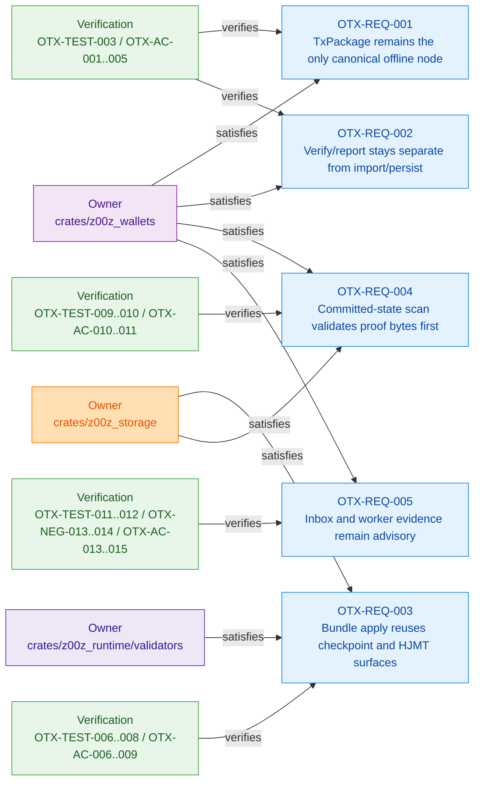

## 13. Dependency Recommendations

### 13.1 Add Now

Add no new core runtime crates for v1 bundle support.

Rationale:

- the existing workspace already contains sufficient crypto, transport, storage, concurrency, and testing foundations;
- topological sort, closure, and conflict detection under `max_nodes = 128` SHOULD use bounded project-owned structures before adding another graph runtime dependency;
- minimizing new runtime crates reduces audit surface and dependency sprawl.

### 13.2 Reuse Now

Implementation SHOULD reuse:

- `serde`, `serde_json`
- `thiserror`
- `tokio`
- `rayon`
- `jmt`, `redb`
- `jsonrpsee`
- `sha2`, `hex`, `base64`, `subtle`, `zeroize`
- `chacha20poly1305`, `argon2`, `hkdf`, `merlin`
- `tari_crypto`, `tari_bulletproofs_plus` through `z00z_crypto`
- `proptest` and `criterion` if already standardized in the workspace test posture

### 13.3 May Add Later

The following additions MAY be discussed later, but only after profiling or a narrow test need:

- `smallvec` for hot-path small bounded vectors;
- `serial_test` for tests mutating global environment;
- `petgraph` only under a separate RFC if bounded in-house graph logic stops being transparently auditable.

### 13.4 Must Not Add For V1

- `petgraph` as immediate default dependency
- `daggy`
- another JMT implementation
- a second RPC stack
- a second AEAD library
- a second range-proof stack

## 14. Architecture Verification, Fusion Coverage, And Decision Record

### 14.1 Stage-By-Stage Architecture Verification

| Stage | Architecture claim | Workspace evidence | Status |
| --- | --- | --- | --- |
| Stage A | `TxPackage` remains the only live canonical transaction node and digest contract | `crates/z00z_wallets/src/tx/tx_wire.rs`, `crates/z00z_wallets/src/tx/tx_verifier.rs` | Verified live |
| Stage B | verify/report and import/persist are separate wallet phases | `crates/z00z_wallets/src/rpc/tx_rpc_server_lifecycle.rs`, `crates/z00z_wallets/src/rpc/tx_rpc_server_finalize.rs` | Verified live |
| Stage C | request-bound inbox and worker evidence are advisory and re-enter authoritative receive lane | `crates/z00z_wallets/src/services/wallet_actions_receive.rs`, `crates/z00z_wallets/src/receiver/request_inbox.rs`, `crates/z00z_wallets/src/chain/scan_engine.rs`, `crates/z00z_wallets/tests/test_stealth_request.rs` | Verified live |
| Stage D | storage owns resolver truth, working-window apply substrate and checkpoint DTOs | `crates/z00z_storage/src/checkpoint/build.rs`, `crates/z00z_storage/src/checkpoint/mod.rs` | Verified live |
| Stage E | validators own checkpoint-bound theorem binding | `crates/z00z_runtime/validators/src/verdict.rs`, `crates/z00z_rollup_node/src/lib.rs` | Verified live |
| Stage F | committed-state HJMT scan is proof-first | `crates/z00z_simulator/src/scenario_1/stage_11/jmt_wallet_scan.rs` | Verified live |
| Stage G | rollup publication consumes real HJMT runtime and checkpoint gates | `crates/z00z_storage/src/checkpoint/checkpoint_contract.yaml`, `config/hjmt_runtime/sim_5a7s/*` | Verified live |
| Stage H | simulator provides bridge/prototype/evidence substrate but is not production authority | `crates/z00z_simulator/src/scenario_1/stage_6/mod.rs`, `stage_9/bundle_lane_impl.rs`, `stage_13/scan.rs` | Verified live |
| Stage I | there is no live standalone offline DAG engine or second runtime transaction family | repo search over `crates/` for prohibited names | Verified exclusion |
| Stage J | dependency posture is reuse-first and already supported by current Cargo surfaces | relevant `Cargo.toml` files | Verified live |

### 14.2 Folded Concept Coverage Map

| Concept input | Preserved concepts now carried here | Where preserved in this spec |
| --- | --- | --- |
| Runtime architecture | C4 pack, request-bound receive, HJMT non-authority, fallback matrix, acceptance, evidence ledger | Sections 4, 5, 7.1.1, 8, 9, 11, 12, 14 |
| Contract hardening | correction ledger, output construction, digest contract, persistence model, property/fuzz, decision record | Sections 2, 5, 7.3, 7.4, 7.7, 12.5, 14.3 |
| Current package and backlog discipline | one-node truth, one verifier, import boundary, lifecycle, seam reuse | Invariants, Sections 6, 7.1-7.4, 8.1, 12, 15 |
| DAG/package-graph concepts | bundle closure, topo apply, drift guardrails, package-possession publishability | Invariants, Sections 6, 7.5, 8.2, 9.2, 16 |
| Request-bound inbox work | advisory inbox, re-entry into canonical receive, worker evidence-only boundary | Invariants, Sections 7.1.1, 8.1.1, 9.6, 10, 12 |

### 14.3 Doublecheck Decision Record

| Decision | Evidence status | Verification result |
| --- | --- | --- |
| Keep `TxPackage` as the only package node | Live-confirmed | Confirmed by live `TxPackage` in `tx_wire.rs` |
| Use digest domain `z00z.tx.pkg.digest.v2` | Live-confirmed | Confirmed by live digest path |
| Accept `admitted` as import-ready | Live-confirmed | Confirmed by `tx_rpc_support::is_import_ready(status)` |
| Keep verify/report separate from import | Live-confirmed | Confirmed by separate lifecycle and finalize RPC surfaces |
| Keep wallet-local scan authority | Live-confirmed substrate | Confirmed by wallet receive/scanner surfaces |
| Use storage checkpoint substrate for graph apply | Live-confirmed substrate, graph feed target-only | Confirmed by `CheckpointExecInput`, `InputResolver`, `TxPkgSum`, `build_cp_draft(...)` |
| Keep HJMT physical roots private | Live-confirmed | Confirmed by settlement/HJMT boundary |
| Avoid standalone offline crate | Architecture decision | Consistent with current crate ownership and design discipline |
| Keep request-bound inbox advisory | Live-confirmed | Confirmed by `recv_range_with_inbox(...)` and test suite |
| Reject `petgraph` as add-now dependency | Fusion conflict resolved | Chosen to minimize dependency surface for bounded graph logic in v1 |

### 14.4 Repository Evidence Anchors

- `crates/z00z_wallets/src/tx/tx_wire.rs`
- `crates/z00z_wallets/src/tx/tx_verifier.rs`
- `crates/z00z_wallets/src/tx/spend_verification.rs`
- `crates/z00z_wallets/src/chain/receiver_card_record.rs`
- `crates/z00z_wallets/src/rpc/tx_rpc_support.rs`
- `crates/z00z_wallets/src/rpc/tx_rpc_server_lifecycle.rs`
- `crates/z00z_wallets/src/rpc/tx_rpc_server_finalize.rs`
- `crates/z00z_wallets/src/services/wallet_actions_receive.rs`
- `crates/z00z_wallets/src/receiver/request_inbox.rs`
- `crates/z00z_wallets/src/chain/scan_engine.rs`
- `crates/z00z_storage/src/checkpoint/mod.rs`
- `crates/z00z_storage/src/checkpoint/build.rs`
- `crates/z00z_runtime/validators/src/verdict.rs`
- `crates/z00z_rollup_node/src/lib.rs`
- `crates/z00z_simulator/src/scenario_1/stage_11/jmt_wallet_scan.rs`
- `config/hjmt_runtime/sim_5a7s/manifest.json`
- `config/hjmt_runtime/sim_5a7s/planner/planner-config.yaml`
- `config/hjmt_runtime/sim_5a7s/storage/storage-config.yaml`
- `crates/z00z_storage/src/checkpoint/checkpoint_contract.yaml`

## 15. Definition Of Done

Phase 072 is complete only when all of the following conditions are true:

- implementation still uses `TxPackage` as the canonical node contract;
- any new bundle wire is a wrapper, not a second transaction family;
- wallet verify/report and import/persist remain separated;
- request-bound inbox remains advisory and re-enters canonical receive;
- storage-owned working-window apply produces current checkpoint DTOs;
- theorem verification passes for valid results and rejects mismatches;
- HJMT committed-state scan stays proof-first;
- rollup preflight consumes canonical HJMT runtime and checkpoint gates;
- simulator Stage 6, Stage 7, Stage 11, and Stage 13 evidence stays green;
- no new standalone offline crate or parallel verifier/state engine was introduced;
- no new runtime dependency was added without explicit spec amendment and review.

## 16. Prohibited Drift

Phase 072 MUST NOT introduce:

- `TxPackage_v1` as a second regular transaction package;
- `BundlePackage_v1` as a supposedly live container without complete code, verifier, storage, and tests;
- `receiver_view` embedded into `TxPackage`;
- inline membership witness bytes inside `TxInputWire`;
- `offline_chain.rs`, `dag_storage.rs`, `offline_service.rs`, or `dag_validator.rs` as authority modules;
- direct wallet secret scanning in runtime, storage, rollup, or remote workers;
- direct `std::fs`, ad hoc `serde_yaml`, raw RNG, or raw time calls in new business logic where `z00z_utils` already provides an abstraction;
- public APIs exposing vendor concrete types when Z00Z wrappers already exist.

## 17. Glossary

| Term | Meaning |
| --- | --- |
| Authoritative receive lane | The only path allowed to mutate wallet receive state; in the current code this is `WalletService::recv_range(...)`. |
| Advisory inbox | Metadata-only request store that helps ordering and UX but does not own state mutation. |
| Ancestor closure | Minimal set of parent nodes without which a child cannot be validated and applied. |
| Bundle over-inclusion | A case where unrelated siblings are included in the publication artifact; v1 MUST reject it. |
| Checkpoint DTOs | `CheckpointExecInput`, `CheckpointLink`, `CheckpointArtifact`, and related storage-owned types. |
| Committed-state scan | Ownership scan against committed settlement state with proof validation first. |
| Detached package report | Ownership hint over package bytes before committed-state proof exists. |
| Digest drift | Mismatch between the recomputed canonical digest and transmitted digest metadata. |
| Import-ready | State in which the package is valid, has an acceptable status, and contains wallet-owned outputs. |
| Package possession publishability | The idea that a valid child plus minimal ancestors MAY be publishable by the holder of those bytes. |
| Request-bound receive | Privacy-preferred receive lane driven by validated `PaymentRequest`. |
| Settlement theorem | Validator-level consistency theorem between packages, execution input, checkpoint artifact, and link. |
| Thin transport | Helper transport format that MUST rehydrate exact thick package bytes before trust-sensitive use. |
| Working-window apply | Deterministic storage-owned apply of ordered bundle nodes before final checkpoint draft creation. |

This document is self-contained for implementation, review, test planning, and architecture audit. Section 2 preserves the one-time source coverage and conflict-resolution record; implementation work SHOULD use this document rather than retired drafts.
