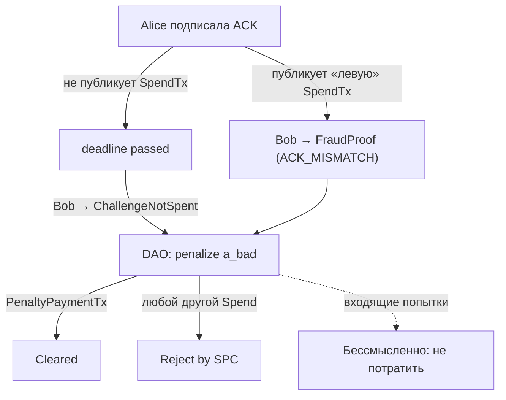
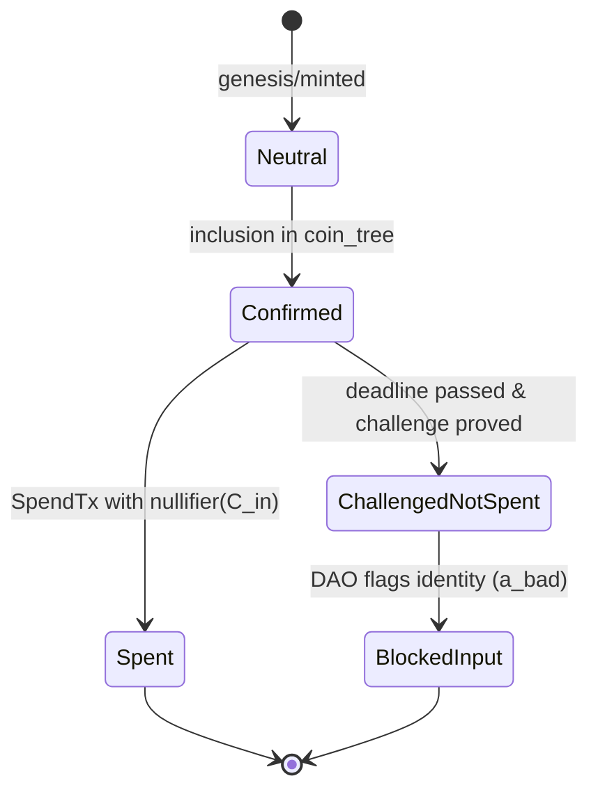
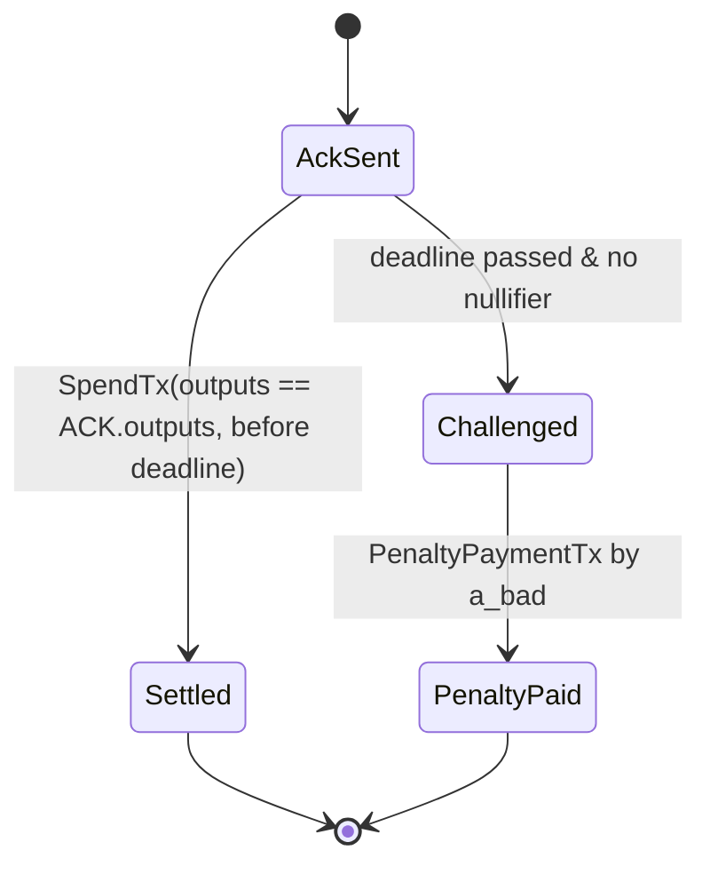
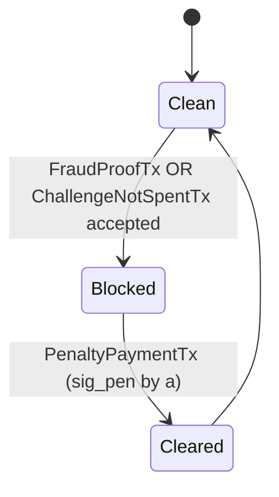

# 💥 Сценарии жульничества

### ❌ Атака №1: *Alice тратит свои `C_in_*`, но в on-chain `SpendTx` вместо выходов Bob’у кладёт всю сумму себе (“сдачу”)*

---

## 1️⃣ Цель атакующего

- Забрать 3.212561 Z00Z себе, проигнорировав обещание Bob’у в ACK.
- Избежать наказания и сохранить возможность тратить дальше.

---

## 2️⃣ Предпосылки и доступ

- Alice владеет входами `C_in_*` (знает `x_in` и свой корневой `a`).
- Off‑chain Bob получил **зашифрованный ACK** (целиком под `pk_bob`) с:
    - `ack_id`, списком `C_out_i`, их `context_id_i`, `enc_r_i`
    - `signature_ack = Sign(sk_alice, Hash("Z00Z_ACK_MULTI" || ...))`
- В блокчейне пока ничего не опубликовано.

---

## 3️⃣ Ход атаки (вариант 1)

1. Alice берёт входы `C_in_*`.
2. Формирует `SpendTx`, **не используя выходы из ACK**, а делает:
    - `C_out_self` (вся сумма ей же),
    - не добавляет `reference_ack_sig`, либо ставит фейковое.
3. Публикует транзакцию в сеть.

---

## 4️⃣ Уязвимость есть?

- ❌ **На уровне консенсуса (если правила “ACK‑binding” включены)** — нет.
    
    Валидаторы проверяют соответствие `SpendTx` ↔ ACK (см. ниже).
    
- ✅ **Теоретически возможно** только если:
    - Протокол **не требует** привязки `SpendTx` к ACK,
    - Нет FraudProof‑механизма.
        
        Тогда Alice может “кинуть” Bob — её SpendTx законна для сети, Bob остаётся ни с чем.
        

Мы сделали протокол так, чтобы это не прошло.

---

## 5️⃣ Где срабатывает защита

### ✅ Вариант A — ончейн‑привязка (жёсткая проверка валидатором)

**Правило:** в `SpendTx` обязательно поле `reference_ack_sig` + `ack_id`.

Валидатор делает:

```rust
let h_ack = Hash("Z00Z_ACK_MULTI" || inputs_ack || outputs_ack || ack_id || pk_bob);
ensure!(verify_sig(pk_alice, h_ack, reference_ack_sig));   // подпись реальна

let h_spend = Hash("Z00Z_SPEND" || all_inputs_spend || all_outputs_spend || ack_id);
ensure!(outputs_spend == outputs_ack);                     // байтовое совпадение наборов

```

Если Alice изменила выходы → `outputs_spend != outputs_ack` → транзакция отклоняется до включения в блок.

---

### ✅ Вариант B — off‑chain receipt + FraudProof (мягкая проверка + наказание)

Если по дизайну мы не “шьём” ACK внутрь `SpendTx`, Bob:

1. Видит в блоке SpendTx без своих выходов.
2. Публикует **FraudProofTx**:
    - `reference_ack_sig` (подпись Alice на ACK),
    - `ack_id`, `outputs_ack`,
    - конфликтующий `SpendTx`/nullifier в блоке.

DAO‑контракт проверяет, что:

- `reference_ack_sig` валидна,
- `outputs_spend` ≠ `outputs_ack`,
- входы те же (одни и те же `nullifier`).

→ Alice заносится в blacklist, все её будущие Spend блокируются до **PenaltyPaymentTx = 2 × FraudAmount**.

---

## 6️⃣ Итог: как блокируем и что остаётся

| Уровень | Механизм | Результат |
| --- | --- | --- |
| **Он‑чейн немедленно** | Обязательная проверка `reference_ack_sig` и совпадения наборов выходов | Транзакция Alice отклоняется, Bob защищён без суда |
| **Он‑чейн пост‑фактум** | FraudProofTx + DAO‑штраф | Если валидаторы пропустили, Bob возвращает ситуацию через штраф Alice |
| **Криптография** | `domain_tag` (“Z00Z_ACK_MULTI”, “Z00Z_SPEND”), `link_tag`, `nullifier` | Нельзя переиспользовать подписи / скрыть личность при фроде |

---

## 7️⃣ Остаточные риски и рекомендации

- **Риск:** Alice вообще не публикует SpendTx (задержка средств).
    
    **Митигируем:** дедлайны в ACK + “ChallengeNotSpent” → штраф аналогично FraudProof.
    
- **Риск:** В протоколе забыли сделать обязательной привязку к ACK.
    
    **Решение:** Включить “ACK‑binding rule” в валидацию блоков.
    

---

## 📐 Мини‑математика (привязка к ACK)

```
# Подпись ACK:
sig_ack = Sign(sk_alice, H("Z00Z_ACK_MULTI" || Inputs_ack || Outputs_ack || ack_id || pk_bob))

# В SpendTx кладём:
reference_ack_sig = sig_ack
ack_id            = тот же

# Валидатор:
H1 = H("Z00Z_ACK_MULTI" || Inputs_ack || Outputs_ack || ack_id || pk_bob)
assert Verify(pk_alice, H1, reference_ack_sig)

# Сверяет Outputs_spend == Outputs_ack (по commitment / context_id / enc_r)

```

---

## 🧩 Псевдо‑Rust: часть проверки валидатора

```rust
fn validate_ack_binding(tx: &SpendTx, ack: &AckPacket) -> Result<()> {
    // 1. Проверяем подпись ACK
    let h_ack = hash_ack(&ack); // Hash("Z00Z_ACK_MULTI" || ... )
    ensure!(verify_sig(&ack.from_pk, &h_ack, &tx.reference_ack_sig));

    // 2. Сравниваем списки выходов (commitment, context_id, enc_r)
    ensure!(tx.outputs == ack.outputs);

    Ok(())
}

```

Если эта функция вернула ошибку — блок‑продюсер не включает SpendTx.

---

### ✅ Вывод

**Атака “Alice клала Bob’у в ACK, но в блокчейне отправила себе”** в нашей архитектуре:

- ❌ На уровне консенсуса — невозможна, если валидаторы требуют ACK‑binding.
- 🔄 Если всё же попала — быстро лечится FraudProofTx + DAO‑штраф.
- 🛡 Любая попытка обойти наказание ломается о `link_tag` + blacklist: будущие Spend Alice блокируются до полной уплаты штрафа.

---

---

### ❌ Атака №2: Alice публикует `SpendTx` с теми же входами, но **другими** `C_outᵢ′` (дробит сумму и уводит всё себе)

---

## 1️⃣ Цель атакующего

- Забрать всю сумму входов (`C_in_*`) себе, изменив набор выходов по сравнению с ACK Bob’у.
- Сделать так, чтобы сеть приняла транзакцию, а Bob ничего не получил.

---

## 2️⃣ Предпосылки

- У Alice есть: `x_in` (ключи входов), `a` (корневой секрет), сам ACK, но она его игнорирует.
- Bob уже получил **зашифрованный агрегированный ACK** с `ack_id`, списком `C_out_i`, `enc_r_i`, подписью `sig_ack`.

---

## 3️⃣ Ход атаки (шаги)

1. Берёт те же входы `C_in_*` → те же `nullifier` (иначе сеть не примет).
2. Генерирует **новые** выходы `C_out_i'` (все на себя: новые `context_id'`, новые `r'`).
3. Публикует `SpendTx` без (или с фейковым) `reference_ack_sig`, либо с тем же `ack_id`, но другими выходами.
4. Надеется, что валидаторы не проверят привязку к ACK.

---

## 4️⃣ Возможна ли атака?

- ❌ **При включённом “ACK‑binding” в консенсусе** — невозможна.
- ✅ Возможна **только если**:
    - Протокол **не заставляет** валидаторов сверять `SpendTx.outputs` с ACK,
    - Нет механизма FraudProof/штрафа.
        
        Тогда сеть посчитает `SpendTx` корректной (суммы сходятся), а Bob останется ни с чем.
        

---

## 5️⃣ Где срабатывает защита

### ✅ Обязательное связывание с ACK (он‑чейн правило)

```rust
// Псевдо‑структура, которую узел проверяет
let h_ack = Hash("Z00Z_ACK_MULTI" || ack.inputs || ack.outputs || ack_id || pk_bob);
ensure!(verify_sig(pk_alice, h_ack, tx.reference_ack_sig));     // подпись Alice на ACK

// хешируем "набор выходов" из SpendTx
let h_out_spend = hash_outputs(&tx.outputs);    // commitments + context_id + enc_r
let h_out_ack   = hash_outputs(&ack.outputs);

ensure!(h_out_spend == h_out_ack);               // ❌ если Alice изменила хоть 1 байт

```

- Сравнение *байт-в-байт* (или хеша) гарантирует, что **ровно те** `C_out_i`, что в ACK, попали в блок.
- Изменить `C_out_i` без изменения `sig_ack` нельзя: `sig_ack` подписывает весь список.

### ✅ Альтернатива: FraudProof (если binding офф‑чейн)

1. Bob видит в блоке чужие `C_out_i'`.
2. Подаёт **FraudProofTx**: `{sig_ack, ack.outputs, tx_bad, ack_id}`.
3. DAO‑контракт:
    - Сверяет подпись `sig_ack`.
    - Вычисляет расхождение `outputs_ack != outputs_spend`.
    - Заносит `a_bad` в blacklist + требует `PenaltyPaymentTx = 2 × FraudAmount`.

---

## 6️⃣ Остаточные проверки

- **Nullifier**: тот же для обоих вариантов ⇒ сеть примет только одну транзакцию (из двух).
    
    Если “плохая” Alice‑tx попала первой, Bob всё равно откатит её FraudProof’ом.
    
- **domain_tag**: подписи и хеши имеют `Z00Z_SPEND` / `Z00Z_ACK_MULTI` → нельзя переиспользовать сигнатуры между протоколами.
- **link_tag**: транзакция Alice всё равно будет связана с тем же `a`. При фроде она улетает в бан.

---

## 7️⃣ Мини‑математика проверки изменения выходов

```
ACK:
  outputs = { (context_id_i, C_out_i, enc_r_i) }  for i=0..3
  sig_ack = Sign(sk_alice, H("Z00Z_ACK_MULTI" || outputs || ack_id || pk_bob))

SpendTx:
  outputs' = { (context_id_i', C_out_i', enc_r_i') }   # Alice подменила
  reference_ack_sig = sig_ack

Валидатор:
  H_ack = H("Z00Z_ACK_MULTI" || outputs || ack_id || pk_bob)
  Verify(pk_alice, H_ack, sig_ack)  => true

  H_spend_set = H(outputs')
  H_ack_set   = H(outputs)

  if H_spend_set != H_ack_set  => reject ❌

```

---

## 8️⃣ Rust‑фрагмент проверки (компактно)

```rust
fn ack_binding_check(tx: &SpendTx, ack_blob: &[u8]) -> Result<()> {
    let ack: AckPacket = decode(ack_blob)?;
    let h_ack = hash_ack(&ack);
    ensure!(verify_sig(&ack.from_pk, &h_ack, &tx.reference_ack_sig));

    let h_out_spend = hash_outputs(&tx.outputs);
    let h_out_ack   = hash_outputs(&ack.outputs);
    ensure!(h_out_spend == h_out_ack);

    Ok(())
}

```

---

## ✅ Вывод

- **Атака “тем же входом, но другими выходами” блокируется на уровне правил сети** (ACK‑binding).
- Если даже прошла из‑за ошибки валидатора, **FraudProofTx** с подписью ACK и DAO‑штрафом гарантирует наказание и блокировку Alice до оплаты.
- Основные якоря защиты:
    - `reference_ack_sig` и `ack_id` в SpendTx,
    - хеш‑сравнение списка выходов,
    - `domain_tag` (защита от ре‑плея подписей),
    - `nullifier` (только 1 Spend на вход),
    - `link_tag` (привязка ко всем будущим Spend и бан при фроде).

---

---

### ❌ Атака №3: *Alice вообще не публикует SpendTx по ACK и позже тратит те же `C_in_*` “как ей надо”*

Разбираем по шаблону.

---

## 1️⃣ Цель атакующего

- Задержать выплату Bob’у: не отправлять on-chain транзакцию с его выходами.
- Подождать, пока ситуация «утихнет», и потом потратить **те же входы** (`C_in_*`) на себя/другого получателя.

---

## 2️⃣ Предпосылки и доступ атакующего

- Alice подписала и отправила Bob’у **зашифрованный ACK** (или обещание), но не раскрыла его в сети.
- Она контролирует входные монеты (`x_in`, `a`).
- Bob хранит у себя `ack_id`, `sig_ack`, список `C_out_i`, сроки (`deadline_height` или `deadline_time`).
- В блокчейне нет `nullifier` для этих входов → монеты ещё «живы».

---

## 3️⃣ Ход атаки (шаги)

1. Alice НЕ публикует SpendTx, хотя обещала.
2. Время идёт, Bob пока не получает on-chain подтверждение.
3. Через некоторое время Alice строит **другую** SpendTx с теми же входами `C_in_*`, но уже без Bob, и пытается отправить её первой.
4. Надеется, что Bob не успеет/не сможет доказать фрод.

---

## 4️⃣ Уязвимость есть?

- ❌ При наличии **ChallengeNotSpent / FraudProof** механизма и дедлайна — нет.
- ✅ Возможна, если:
    - **Нет дедлайна** в ACK,
    - **Нет офчейн/ончейн квитанции** (`sig_ack`),
    - Протокол не предусматривает “not-spent challenge”.

Мы добавили защиту, значит атака блокируется.

---

## 5️⃣ Где срабатывает защита

### ✅ Механизм 1: Дедлайн + ChallengeNotSpentTx

**В ACK есть поле:**

```yaml
deadline_height: H_deadline   # или timestamp_deadline

```

Если до `H_deadline` **не появился** `nullifier` по любому из `C_in_*`, Bob публикует:

```yaml
ChallengeNotSpentTx:
  domain_tag: "Z00Z_CHALLENGE"
  ack_id: <same>
  sig_ack: <signature from Alice>
  inputs_ack: [C_in_*]          # список входов из ACK
  proofs_inclusion: [VerkleProof(context_id_i)]  # доказываем, что монеты существуют
  proofs_absence_nullifier: <Verkle proof> # показываем, что nullifier не виделся
  requested_penalty: fraud_amount * 2

```

**Валидатор / DAO‑контракт** проверяет:

1. `sig_ack` валидна.
2. Входы ещё не потрачены (`nullifier` отсутствует).
3. Срок прошёл (`current_height > H_deadline`).

→ Статус Alice = `blocked`, `penalty_due = 2 × fraud_amount`, все будущие SpendTx с её `a` блокируются.

### ✅ Механизм 2: Предподписанный “двусторонний” SpendTx

Дополнительно можно требовать, чтобы Alice **сразу** дала Bob полный подписанный SpendTx (или adaptor‑signature), чтобы Bob мог сам отправить его в сеть. Тогда простая задержка не работает: Bob просто сам публикует транзакцию.

---

## 6️⃣ Как блокируем / исправляем

| Ситуация | Защита | Результат |
| --- | --- | --- |
| Alice молчит до дедлайна | `ChallengeNotSpentTx` | Блок + штраф DAO = 2×, пока не заплатит — все её траты невалидны |
| Alice публикует «чужую» SpendTx позже | `FraudProofTx` (ACK vs SpendTx) | То же: бан, штраф, отказ сети |
| Alice пытается публиковать раньше Bob’а | Валидаторы видят `reference_ack_sig`? (ACK-binding) или Bob успевает FraudProof | Транзакция отклонена / Alice наказана |

---

## 7️⃣ Остаточный риск и рекомендации

- Нужно обеспечить, чтобы **Bob мог доказать не‑трату**:
    - Применяем `VerkleProof` отсутствия `nullifier` (nullifier‑дерево) или используем «вебереференс» на состояние (root).
- Хорошо иметь **минимальный депозит при выдаче ACK** (или клейме монет), чтобы штраф был чем покрыть.
- Опционально: при создании ACK заказчик может корректировать `deadline` (не слишком короткий, не слишком длинный).

---

## 🔢 Математика (кратко)

```
deadline_height = H_d
current_height  = H_now

# Условие для ChallengeNotSpent:
if H_now > H_d  AND  nullifier(C_in_i) ∉ NullifierSet:
    FraudAmount = Σ v_in  (что обещали Bob’у)
    penalty_due = 2 * FraudAmount

```

Nullifier отсутствует → доказуемо через «non-inclusion proof» в Verkle‑дереве nullifier’ов.

---

## 🧩 Псевдо‑Rust: Bob подаёт ChallengeNotSpentTx

```rust
fn build_challenge_not_spent(
    ack: AckPacket,
    proofs_coin: Vec<VerkleProof>,     // inclusion proofs for C_in_i
    proof_absence_null: VerkleNonProof,// отсутствие nullifier
) -> ChallengeTx {

    let fraud_amount = ack.total_value;   // сумма, обещанная Bob'у
    let penalty_due  = fraud_amount * 2;

    let msg = hash_challenge(&ack, &proofs_coin, &proof_absence_null);
    // подпись Bob'а или просто его pubkey (зависит от протокола)
    let sig_bob = sign_bob(&msg);

    ChallengeTx {
        domain_tag: "Z00Z_CHALLENGE",
        ack_id: ack.ack_id,
        sig_ack: ack.signature,          // подпись Alice
        inputs_ack: ack.inputs.clone(),
        proofs_coin,
        proof_absence_null,
        penalty_due,
        sig_bob,
    }
}

```

**Валидатор DAO‑контракта:**

```rust
fn validate_challenge(tx: &ChallengeTx, state: &mut DaoState) -> Result<()> {
    ensure!(current_height() > ack.deadline_height);
    ensure!(verify_sig_alice(tx.sig_ack, ack_blob));
    ensure!(all_inputs_unspent(&tx.inputs_ack, &tx.proof_absence_null));

    // записываем бан
    state.blacklist.insert(ack.identity_tag, penalty_due);
    Ok(())
}

```

---

## ✅ Короткий итог

- **Атака:** Alice не публикует SpendTx, позже тратит входы по‑другому.
- **Реализация защиты:** дедлайн + ChallengeNotSpentTx (или обязательный ACK‑binding on-chain).
- **Результат:**
    - Если она не заплатила Bob до дедлайна — блок и штраф 2×.
    - Если она попыталась потратить позже — либо сразу отклонение (ACK‑binding), либо FraudProof + блокировка.

---

---

## 🚫 Последствия для Alice:

| Действие | Результат |
| --- | --- |
| Попытка использовать любые монеты | ❌ Заблокировано |
| Попытка получать новые монеты | ❌ Заблокировано (pk_alice → в recheck list) |
| Единственное разрешённое | ✅ Уплата штрафа в DAO от имени `pk_alice` |

---

## 🛡️ Последствия для Bob:

- ✅ Может **доказать попытку обмана**
- ✅ Получает **гарантию, что `C_in_*` не может быть использовано повторно**
- ❌ Временно теряет возможность использовать `C_out_*`, пока спор не решён
- ✅ При удачном `Challenge` может **получить компенсацию из штрафа Alice**

---

---

### ❌ Атака №4: «Мимикрия получателя» (Alice делает вид, что платит Bob’у, но выводы идут на её подставной ключ “Frank”)

---

## 1️⃣ Цель атакующего

- Забрать всю сумму самой себе (или своему альтер‑эго “Frank”),
- При этом убедить Bob’а (или третьих лиц), что выплата выполнена.

---

## 2️⃣ Предпосылки / возможности Alice

- Она знает **pk_bob** (он публичный).
- Она может сгенерировать любой свой ключ `pk_frank = g^x_frank`.
- Она может подписать ACK или подделать «скриншоты», если протокол не требует криптографически связанного ACK‑binding.
- В ончейн‑части валидаторы **не знают**, кто такой Bob — они лишь проверяют криптографические равенства.

---

## 3️⃣ Ход атаки (как она пытается обмануть)

1. Off‑chain показывает Bob’у «якобы ACK» (или вообще ничего не показывает).
2. On‑chain публикует SpendTx, где **все `C_outᵢ` принадлежат ей же** (`pk_frank`, `x_frank`).
3. Говорит Bob’у: “Вот tx_id, смотри, я заплатила.”
4. Надеется, что:
    - Валидаторы не проверяют привязку к настоящему ACK Bob’а,
    - Bob не сможет доказать фрод (нет receipts / sig_ack),
    - Или Bob не сможет распознать, что `context_idᵢ` не его.

---

## 4️⃣ Возможна ли атака?

- ❌ **Если мы соблюдаем нашу архитектуру (ECIES‑зашифрованный ACK + ACK‑binding + FraudProof)** — нет.
- ✅ Возможна в «упрощённом» протоколе без:
    - шифрования ACK целиком под `pk_bob`,
    - подписи Alice на весь список выходов,
    - on‑chain проверки или FraudProof.

---

## 5️⃣ Где именно ломается атака в Z00Z

### ✅ Механизм A — Bob сам проверяет, что выводы «его»

**Мы сделали так:**

1. **ACK полностью шифруется под `pk_bob`**.
    - Alice **физически не может** показать корректный ACK “для Bob” с чужими ключами: Bob его расшифровывает сам.
2. В ACK Bob получает **rᵢ, vᵢ, context_idᵢ**. Он проверяет:
    
    ```
    C_outᵢ == vᵢ·G + rᵢ·H            # совпадает ли commitment?
    context_idᵢ == Hash(ack_id || i)  # та ли позиция?
    
    ```
    
3. Он знает **свои секреты** (seed_bob, x_bob и т. п.) для вычисления spend_keyᵢ.
    - Если выход «на Frank» — Bob не сможет получить корректный `rᵢ` или подобрать spend_keyᵢ. Он поймёт, что монета не его.

### ✅ Механизм B — ACK‑binding у валидаторов

*SpendTx обязан содержать:*

```yaml
ack_id:             <из ACK>
reference_ack_sig:  <sig_ack Alice на outputs_ack>
outputs:            <должны совпасть байт‑в‑байт с outputs_ack>

```

Проверка:

```rust
H_ack = Hash("Z00Z_ACK_MULTI" || inputs_ack || outputs_ack || ack_id || pk_bob)
assert Verify(pk_alice, H_ack, reference_ack_sig)   // подпись верна
assert hash_outputs(tx.outputs) == hash_outputs(outputs_ack) // списки идентичны

```

Если Alice подставила «Frank‑выходы» вместо Bob’а → несоответствие → транзакция отклоняется **до блока**.

### ✅ Механизм C — FraudProof, если (по ошибке) валидаторы пропустили

Bob раскрывает:

- `sig_ack` Alice,
- свой расшифрованный ACK,
- входы (`C_in_*`) и их nullifier из блока,
- сравнение `outputs_ack` vs `outputs_spend`.

**DAO‑контракт**: «расхождение, Alice — мошенник» → **блокирует `a`**, требует `PenaltyPaymentTx = 2 × fraud_amount`.

---

## 6️⃣ Остаточные риски и как их нивелировать

| Риск | Митигируем |
| --- | --- |
| Alice показала Bob’у поддельный ACK (не шифрованный на `pk_bob`) | Требуем: **весь ACK шифруется на pk_bob**, Bob самостоятельно расшифровывает. |
| Alice подделала отдельные `enc_r` | AEAD‑шифр → Bob увидит ошибку MAC при расшифровке. |
| Неправильно реализовали ACK‑binding | Делаем правило консенсуса или FraudProof‑путь обязательным. |
| Bob “проспал” дедлайн | В ACK заложить разумный `deadline_height` и автоматизировать отправку ChallengeNotSpent. |

---

## 7️⃣ Мини‑математика / псевдокод (проверка на стороне Bob)

```rust
// Bob получил зашифрованный ACK (R, nonce, ciphertext)
let S = R * sk_bob;                  // Diffie–Hellman
let K = Hash(b"Z00Z_ECIES" || S.compress().as_bytes());
let ack = aead_decrypt(K, nonce, ciphertext)?;   // если MAC не сходится -> Alice мухлюет

for (i, out) in ack.outputs.iter().enumerate() {
    // проверяем, что Alice не подсунула чужой commitment
    let C_calc = G * Scalar::from(out.value) + H * out.r;
    assert_eq!(C_calc, out.commitment);          // иначе ACK невалиден

    // проверяем контекст
    assert_eq!(out.context_id, Hash(ack.ack_id || i));  // единственный способ
}

```

*Если хотя бы один fails — Bob имеет доказательство мошенничества Alice → FraudProofTx.*

---

## 8️⃣ Почему здесь помогает `link_tag` / бан

Даже если Alice не публиковала ACK и просто «убедила словами» Bob’а, любая её on-chain SpendTx всё равно содержит `link_tag = P_in^a`.

После FraudProof сетевые узлы:

- добавляют `a_bad` в DAO‑blacklist,
- **любой** следующий `link_tag = P_new^a_bad` → мгновенно отклоняется, пока Alice не заплатит штраф.

---

## ✅ Вывод

- **Мимикрия получателя** (подмена Bob на «Frank») ломается в трёх местах:
    1. 🔐 **Шифрованный ACK** — Bob сам проверяет, что выходы построены под него.
    2. 🔗 **ACK‑binding в консенсусе** — валидаторы не примут транзакцию с изменёнными выходами.
    3. 🛡 **FraudProof + DAO‑штраф** — если что‑то прошло, Alice блокируется до уплаты 2× штрафа.

> Итог: Атака невозможна при корректной реализации наших правил.
> 

---

---

### ❌ Атака №5: «Отмыть» забаненную личность — заплатить штраф **чужим ключом** или через «друга»

---

## 1️⃣ Цель атакующего

- Обойти блокировку `identity_tag = a_bad` после слэша.
- Разблокировать себя, **не раскрываясь криптографически** и не платя штраф из-под своего `a_bad`.

---

## 2️⃣ Предпосылки

- В DAO‑записи:
    
    ```yaml
    identity_tag: a_bad
    status: "blocked"
    penalty_due: 2 * fraud_amount
    
    ```
    
- Любой Spend с `link_tag = P_in ^ a_bad` сейчас отклоняется.
- Атака варианты:
    1. ✅ Заплатить штраф монетами, где **нет** `link_tag = P^a_bad` (новый pk или новый a₂).
    2. ✅ Попросить друга «Ивана» заплатить штраф за неё.

---

## 3️⃣ Ход атаки (варианты)

1. **Новый “чистый” ключ**
    - Alice генерит `a₂`, получает где-то монеты, делает `PenaltyPaymentTx` **без** доказательства, что она = `a_bad`.
2. **Сторонний плательщик**
    - Иван строит `PenaltyPaymentTx` из *своих* UTXO, не имея `a_bad`, но указывая `identity_tag = a_bad`, чтобы DAO разморозил Alice.

---

## 4️⃣ Возможна ли атака?

- ❌ **Нет**, если `PenaltyPaymentTx` требует **криптодоказательство владения `a_bad`**.
- ✅ Возможна, если протокол не проверяет связь штрафа с личностью (DAO принимает любые деньги “на глаз”).

---

## 5️⃣ Где срабатывает защита

### ✅ Жёсткое правило для снятия блокировки

> “Статус blocked снимается только если в PenaltyPaymentTx есть доказательство знания того же a_bad.”
> 

Требования к `PenaltyPaymentTx`:

1. **`domain_tag = "Z00Z_PENALTY_CLAIM"`**.
2. **Подпись личностью**:
    
    ```
    sig_pen = Sign_a_bad( Hash("Z00Z_PENALTY_CLAIM" || penalty_due || dao_slot || tx_body) )
    
    ```
    
    или альтернативно — `link_proof` для любого входа: `link_tag = P_in · a_bad`, как в SpendTx.
    
3. **Сумма = penalty_due**.
4. **Входы ≥ penalty_due**; линейность Pedersen выполняется.
5. **Валидатор отмечает запись в DAO: status → cleared**.

> 👉 Друг может пожертвовать Alice монеты, но чтобы разморозить, Alice всё равно должна подписать PenaltyPaymentTx своим a_bad.
> 
> 
> Если она не подписывает — статус остаётся `blocked`, её будущие Spend всё равно отклоняются.
> 

---

## 6️⃣ Математика + комментарии

```
# На входе: a_bad (секрет Alice), penalty_due
# Alice формирует штрафную транзакцию:

msg_pen = Hash("Z00Z_PENALTY_CLAIM" || penalty_due || dao_slot || tx_body)
sig_pen = SchnorrSign(a_bad, msg_pen)     # доказательство знания a_bad

# (опция) Используем LinkTag как в SpendTx:
P_pay = x_pay · G                  # вход Alice
L_pay = a_bad · P_pay
(link_proof)                       # как раньше

```

Валидатор:

```
verify_sig(a_bad_pub?, sig_pen, msg_pen)   # либо verify_link_proof(P_pay, L_pay)
sum_inputs == penalty_due (+ change)

```

`*a_bad_pub` может быть сохранён в DAO‑record после раскрытия. Если хранится только `a_bad` — валидатор достаёт его оттуда.*

---

## 7️⃣ Rust‑псевдокод проверки PenaltyPaymentTx

```rust
fn validate_penalty_payment(tx: &PenaltyPaymentTx, dao: &mut DaoState) -> Result<()> {
    ensure!(tx.domain_tag == "Z00Z_PENALTY_CLAIM");

    let entry = dao.get(&tx.identity_tag)?;
    ensure!(entry.status == "blocked");
    ensure!(tx.penalty_due == entry.penalty_due);

    // 1. Проверка знания a_bad
    let msg = hash_penalty(&tx);
    ensure!(verify_schnorr_a_bad(&entry.pub_a_bad, &tx.sig_pen, &msg)
            || verify_link_proof_any_input(&tx.inputs, &entry.a_bad));

    // 2. Линейность Pedersen / суммы
    ensure!(sum_inputs(&tx.inputs) >= tx.penalty_due);
    ensure!(tx.outputs[0].type == DaoPenalty && tx.outputs[0].value == tx.penalty_due);

    // 3. Обновление состояний
    mark_spent_inputs(&tx.inputs);
    insert_output_dao(&tx.outputs[0]);
    if tx.outputs.len() > 1 { insert_change(&tx.outputs[1]); }

    entry.status = "cleared";
    entry.penalty_paid_txid = tx.tx_id;
    Ok(())
}

```

> verify_schnorr_a_bad — обычная проверка подписи по публичному ключу личности (сохранён в DAO при фроде).
> 
> 
> `verify_link_proof_any_input` — допускаем вариант, где Alice доказывает знание `a_bad` по схеме LinkTag.
> 

---

## 8️⃣ Остаточные риски / нюансы

| Риск | Решение |
| --- | --- |
| Alice попыталась заранее вывести монеты на друга **до бана** | Это не «отмывка ключа», это опережение. Но после фрода все её монеты в блокчейне уже потрачены, новые она из них не создать. |
| Друг “спонсирует” штраф | Нормально: DAO получает деньги, но БАН снимать нельзя без подписи `a_bad`. Добавить правило: `sig_pen` обязателен. |
| Путаем `a_bad` и новый `a₂` | DAO‑контракт проверяет **конкретный** `identity_tag`, тот что в чёрном списке. Новый `a₂` никак не помогает снять `a_bad` со списка. |
| Маленькие ошибки имплементации | Строгое `domain_tag`, полный хеш‑охват, подписываем все поля, делаем юнит‑тесты. |

---

## ✅ Вывод

- **Отмыть личность через другой ключ/друга нельзя**, если:
    - `PenaltyPaymentTx` требует знания `a_bad` (подпись или link_proof),
    - DAO снимает блокировку **только** после такой проверки.
- Друг может только дать деньги, но **разлок** всё равно инициирует Alice своей подписью.
- Вся схема опирается на:
    - `domain_tag = "Z00Z_PENALTY_CLAIM"`,
    - проверку `sig_pen`/`link_proof`,
    - запись в DAO‑чёрном списке.

### ✅ Решение 2:

- `PenaltyPaymentTx` требует, чтобы штраф:
    - был оплачен **только с `pk_alice`**
    - направлен **только в DAO**
- Любые другие переводы отклоняются

---

---

### 🧱 Сценарий: у слэшнутого ключа **нет средств**, чтобы заплатить штраф

Механизм: **Origin‑Locked Slashing** — блокировка привязана к *источнику личности* (`a_bad`) и снимается **только** после уплаты штрафа этим же источником.

---

## ✅ Что происходит по правилам протокола

- ❌ **Любая SpendTx с входом, где `link_tag = P_in · a_bad`, отклоняется.**
- ❌ **PenaltyPaymentTx без доказательства знания `a_bad` не принимается.**
- ❌ **Попытка “друга” заплатить штраф за Alice не разблокирует её ключ.**
- 🚫 **Новые входящие монеты фактически бесполезны**: потратить их без `PenaltyPaymentTx` нельзя (при первой попытке траты всё равно нужен `link_tag` → блок).
- 🔒 **Статус остаётся `blocked`, пока штраф (2×FraudAmount) не оплачен самим `a_bad`.**

---

## 🔐 Математика привязки

1. **Любая трата требует `link_tag`:**
    
    `L = a_bad · P_in`
    
    Доказательство корректности (`c,r`) проверяется:
    
    `P_in^r  ?=  T · L^c`.
    
    Валидатор знает `a_bad` (из DAO‑записи) и может вычислить «ожидаемый» `L_expected = a_bad · P_in`.
    
    Если `L == L_expected` и статус `blocked` → транзакция сразу ❌.
    
2. **PenaltyPaymentTx требует знания `a_bad`:**
    
    `sig_pen = Sign(a_bad, Hash("Z00Z_PENALTY_CLAIM" || penalty_due || …))`
    
    или эквивалентное `link_proof` внутри этой транзакции.
    
    Без `a_bad` подпись не собрать → штраф не принят → статус не снимается.
    

---

## 🔄 Логика валидатора (псевдо‑код)

```rust
// Глобальный DAO-чёрный список
struct DaoEntry { a_bad: Scalar, penalty_due: u64, status: Status }
enum Status { Blocked, Cleared }

// Проверка любой SpendTx
fn validate_spend(tx: &SpendTx, dao: &DaoState) -> Result<()> {
    for input in &tx.inputs {
        // 1. Стандартные проверки (inclusion, sig_eph, link_proof, nullifier ...)
        verify_standard(input)?;

        // 2. Origin-Locked Slashing
        for entry in dao.blacklist.iter().filter(|e| e.status == Blocked) {
            let l_expected = input.p_in * entry.a_bad;   // L_expected = P_in · a_bad
            if input.link_tag == l_expected {
                bail!("identity_blocked_until_penalty_paid"); // ❌
            }
        }
    }
    Ok(())
}

// Проверка PenaltyPaymentTx
fn validate_penalty(tx: &PenaltyPaymentTx, dao: &mut DaoState) -> Result<()> {
    let entry = dao.get(&tx.identity_tag)?;
    ensure!(entry.status == Blocked);
    ensure!(tx.penalty_due == entry.penalty_due);

    // Обязательное доказательство знания a_bad
    ensure!(verify_sig_a_bad(&entry.pub_a_bad, &tx.sig_pen, &hash_penalty(tx))
        || verify_link_proof_any_input(&tx.inputs, entry.a_bad));

    // Проверяем суммы (Pedersen)
    ensure!(sum_inputs(&tx.inputs) >= tx.penalty_due);
    ensure!(tx.outputs[0].type == DaoPenalty && tx.outputs[0].value == tx.penalty_due);

    // Обновляем DAO
    entry.status = Cleared;
    entry.penalty_paid_txid = tx.tx_id.clone();
    Ok(())
}

```

---

## 🧭 Почему «не принимаем входящие»?

Технически сеть **не может запретить другим отправлять монеты** на свежие адреса Alice (они выглядят как любой другой `P`). Но:

- Эти монеты **всё равно зависнут**: при первой попытке траты потребуется `link_tag = a_bad · P_in` → блокировка.
- Поэтому “входящие” для Alice после слэша ≈ **мёртвый груз** (их нельзя вывести), что эквивалентно политике «не принимаются».

> Если нужно строгое правило «запретить входящие», можно ввести соц‑/протокольный слой (смарт‑контракты-маркеты, off‑chain правила платежей), но на уровне базового консенсуса достаточно Origin‑Locked Slashing.
> 

---

## 🧯 Риски и дополнения

| Риск / вопрос | Решение |
| --- | --- |
| Alice заранее вывела деньги на “чистый” `a₂` до слэша | Это вне рамок “недостатка средств” — система штрафует уже после обнаружения фрода; активы, не связанные с a_bad, не заблокируешь. |
| Друг пытается «оплатить за Alice» | Разрешено жертвовать в DAO, но статус Alice не снимается без её `sig_pen`. |
| Alice получает новые монеты, а потом «перекладывает» их через миксер | Любая трата всё равно упрётся в `link_tag = a_bad·P_in`. Без PenaltyPaymentTx — отказ. |
| Что если Alice вообще потеряла `a_bad` | Тогда ключ **перманентно блокирован**. Это и есть смысл Origin‑Locked: потеряла — значит, всё, репутация (и средства под ней) умерли. |

---

### ✅ Итог

- **Origin-Locked Slashing** гарантирует: если у слэшнутой личности нет средств на штраф, она **навсегда теряет возможность тратить** любые связанные монеты.
- Сеть не обязана отслеживать входящие; важно, что **любая попытка потратить** упирается в проверку `link_tag` против DAO‑блоклиста.
- Разблокировка возможна **только** через PenaltyPaymentTx, подписанную тем же `a_bad` и оплачивающую `2 × FraudAmount`.

---

---

### ❌ Атака №6: *Alice дала Bob’у ACK, но не публикует SpendTx; Bob хочет уже платить дальше*

Риск: Bob держит только «обещанную» монету (pending). Если Alice передумает — он ни с чем.

---

## 1️⃣ Цель атакующего

- Alice не выводит монеты on‑chain, чтобы Bob не смог ими распорядиться.
- Позже тратит те же `C_in_*` «как хочет».

## 2️⃣ Предпосылки

- Bob получил **зашифрованный ACK** (полный список `C_outᵢ`, `enc_rᵢ`, `ack_id`, `sig_ack`).
- В блокчейне ещё **нет** `nullifier(C_in_*)` → монеты Alice не потрачены.
- Bob не может тратить без он‑чейн статуса `confirmed`.

## 3️⃣ Ход атаки

1. Alice задерживает публикацию SpendTx.
2. Bob не имеет он‑чейн монеты → не может построить свою SpendTx (нет подтверждённого входа).
3. Alice либо вообще не платит, либо позже тратит входы по‑другому.

## 4️⃣ Уязвимость?

- ❌ При наших правилах — нет «финального» ущерба: либо Bob получает монеты, либо Alice получает бан + штраф.
- ✅ Временной дискомфорт: Bob не может тратить **до подтверждения** (это нормальная модель UTXO).

---

## 5️⃣ Где срабатывает защита

### ✅ Механизм A — **Дедлайн + ChallengeNotSpentTx**

Если к `deadline_height` nullifier не появился → Bob подаёт:

```
ChallengeNotSpentTx:
  domain_tag: "Z00Z_CHALLENGE"
  ack_id, sig_ack
  proofs_inclusion(C_in_i)
  proof_absence_nullifier
  penalty_due = 2 * fraud_amount

```

➡️ DAO блокирует `a_bad`, штрафует Alice, все её будущие SpendTx отклоняются до оплаты.

### ✅ Механизм B — **Alice даёт Bob’у «готовую» SpendTx / adaptor‑sig**

- В ACK‑сессии Alice передаёт Bob’у **полностью подписанный** черновик SpendTx (или adaptor‑подпись, которую Bob может дофинализировать своим секретом).
- Если Alice молчит — **Bob сам** публикует SpendTx.

### ✅ Механизм C — **Security‑deposit при выдаче ACK**

- Alice вносит маленький депозит (например, 1–2% суммы) в DAO-контракт в момент ACK.
- Не публикует SpendTx до дедлайна → депозит автоматически списывается в пользу Bob, плюс блокировка.

### ✅ Механизм D — **“Conditional Forward” для Bob→Charlie**

- Bob может выдать Charlie **условный ваучер**: «получишь монету, если on‑chain появится `tx_id` с `ack_id` = …».
- После включения SpendTx Bob сразу создаёт свою SpendTx на Charlie.
- Пока нет включения — Charlie не принимает риск (договор условный).

---

## 6️⃣ Мини‑математика (дедлайн и штраф)

```
deadline_height = H_d
if height_now > H_d AND nullifier(C_in_*) ∉ NullifierSet:
    fraud_amount = Σ v_ack_to_bob
    penalty_due  = 2 * fraud_amount
    status(a)    = "blocked"

```

`proof_absence_nullifier` — Verkle‑доказательство несуществования ключа в nullifier‑дереве.

---

## 7️⃣ Псевдокод (Rust)

### 🔄 Bob строит ChallengeNotSpentTx

```rust
fn build_challenge_not_spent(
    ack: AckPacket,
    coin_proofs: Vec<VerkleProof>,      // inclusion для C_in_*
    null_absence: VerkleNonProof,       // отсутствие nullifier'ов
) -> ChallengeTx {
    let fraud_amount = ack.total_value;
    let penalty_due  = fraud_amount * 2;

    ChallengeTx {
        domain_tag: "Z00Z_CHALLENGE",
        ack_id: ack.ack_id,
        sig_ack: ack.signature,         // подпись Alice на ACK
        inputs_ack: ack.inputs.clone(),
        proofs_coin: coin_proofs,
        proof_absence_null: null_absence,
        penalty_due,
    }
}

```

### 🛡 Валидатор DAO:

```rust
fn validate_challenge(tx: &ChallengeTx, dao: &mut DaoState) -> Result<()> {
    ensure!(current_height() > get_deadline(tx.ack_id));
    ensure!(verify_sig_alice(tx.sig_ack, hash_ack(tx.ack_id)));    // ACK подлинный
    ensure!(all_inputs_unspent(tx.inputs_ack, tx.proof_absence_null));
    let fraud_amount = calc_fraud_amount(tx);
    dao.blacklist.insert(identity_from_ack(tx.ack_id), 2 * fraud_amount);
    Ok(())
}

```

### 🔐 Adaptor‑подпись (идея)

```rust
// Alice даёт Bob'у partial_sig = r + e * x_in  (без раскрытия r)
// Bob, имея свой секрет, может добить подпись и отправить SpendTx сам.

```

(Реализация зависит от выбранной схемы Schnorr/EdDSA adaptor sig.)

---

## 8️⃣ Итог ✅

| Проблема | Решение | Результат |
| --- | --- | --- |
| Alice не публикует SpendTx | Дедлайн + ChallengeNotSpentTx | Штраф + бан до оплаты |
| Bob не может тратить сразу | Это норма UTXO. Возможен условный ваучер или adaptor‑sig схематически |  |
| Alice пытается «отключить» Bob | ACK‑binding / FraudProof гарантируют компенсацию Bob’у и наказание Alice |  |

> Вывод: пока монета не в блокчейне, Bob не может ею пользоваться — но протокол обеспечивает: либо Alice публикует SpendTx в срок, либо она платит штраф и блокируется (Origin‑Locked Slashing). Таким образом, экономически выгоднее исполнить обещание вовремя.
> 

---

---

### Aтака №7 — «гонка публикаций» (race publish)

### 1. 🎯 Цель атакующего

- ✅ Забрать вход `C_in_*` себе (через `C_frank`) и **не выполнить обещание Bob’у** из ACK.

### 2. ⚙️ Предпосылки

- Alice подписала и отправила Bob’у **зашифрованный ACK**: `outputs_ack = {C_bob, C_change}`, `sig_ack`.
- Bob временно оффлайн (не может сам опубликовать SpendTx или FraudProof мгновенно).
- Валидаторы либо:
    - не делают жёсткий ACK‑binding (мягкий сценарий), либо
    - есть шанс, что блок-продюсер пропустит проверку.

### 3. 🧭 Ход атаки (шаги)

1. Alice формирует **альтернативный выход** `C_frank = v·G + r'·H`.
2. Собирает `SpendTx_bad(C_in_* → C_frank, C_self_change)` без Bob’а.
3. Публикует первой; блок-продюсер включает транзакцию.
4. Bob возвращается, видит, что его выходов нет.

---

## 1. 🧨 Сценарий по шагам

1. **ACK (off‑chain):**
    
    Alice → Bob: зашифрованный ACK с
    
    `outputs_ack = {C_bob, C_change}`, `ack_id`, `sig_ack = Sign(sk_alice, H("Z00Z_ACK_MULTI" || outputs_ack || ack_id || pk_bob))`.
    
2. **Bob оффлайн.**
    
    SpendTx ещё нет в блокчейне.
    
3. **Alice передумала.**
    
    Делает другой выход `C_frank = v·G + r'·H` (на своего “Франка”) и формирует `SpendTx_bad`:
    
    ```
    inputs:  C_in_*
    outputs: C_frank (+ возможно своя сдача)
    
    ```
    
    Публикует **первой**.
    
4. **Валидатор включает `SpendTx_bad`** (если нет жёсткого ACK‑binding на уровне консенсуса).
5. **Bob возвращается онлайн** и видит: его `C_bob` нет в блокчейне.

---

## 2. ❗ Вопрос: сможет ли Bob наказать?

**Да.** Он строит **FraudProofTx (тип ACK_MISMATCH)** и:

- предъявляет `sig_ack` Alice,
- показывает `hash(outputs_ack)` и `hash(outputs_spend_bad)`,
- доказывает, что входы были именно те (`nullifier` совпадает),
- DAO ставит `a_bad` в blacklist, штраф `2 × FraudAmount`, пока не заплатит — все её будущие траты отклоняются.

---

## 3. 🔐 Где именно “схлопывается” Alice

### Вариант A — **ACK‑binding встроен в консенсус**

В SpendTx есть:

```yaml
ack_id:             <same>
reference_ack_sig:  <sig_ack>

```

Валидатор:

```rust
H_ack = Hash("Z00Z_ACK_MULTI" || inputs_ack || outputs_ack || ack_id || pk_bob)
assert Verify(pk_alice, H_ack, reference_ack_sig);          // подпись верна
assert hash(outputs_spend) == hash(outputs_ack);             // наборы совпадают

```

👉 Alice **не может** изменить выходы: любая подмена → немедленный reject блока.

### Вариант B — **ACK‑binding реализован через FraudProof**

- Узлы не сравнивают ACK в момент включения.
- Но у Bob **есть `sig_ack`** и вся структура ACK → он подаёт FraudProofTx.
- DAO проверяет: подпись валидна, наборы расходятся → бан + штраф.

---

## 4. 🧠 Криптографическое ядро доказательства

```
sig_ack = Sign(sk_alice, H("Z00Z_ACK_MULTI" || outputs_ack || ack_id || pk_bob))

# Alice опубликовала outputs_spend (с C_frank)
outputs_spend_hash ≠ outputs_ack_hash

# Никто, кроме Alice, не мог создать sig_ack → это её обязательство.
# Следовательно, доказательство намерения зафиксировано.

```

❌ Подделать `sig_ack` без `sk_alice` невозможно (устойчивость Schnorr/ECDSA).

❌ Подписать два разных набора выходов одной и той же сигнатурой — невозможно (хеш разные).

✅ Совпадение nullifier доказывает, что использованы те же входы `C_in_*` (или их часть).

---

## 5. 🧾 FraudProofTx (Rust‑псевдокод)

```rust
fn build_fraud_proof_ack_mismatch(
    ack: AckPacket,            // Bob’s decrypted ACK
    tx_bad: SpendTx,           // из блокчейна
) -> FraudProofTx {
    let outputs_ack_hash   = hash_outputs(&ack.outputs);
    let outputs_spend_hash = hash_outputs(&tx_bad.outputs);

    FraudProofTx {
        trigger_type: "ACK_MISMATCH".into(),
        data: FraudData {
            ack_id: ack.ack_id,
            sig_ack: ack.signature,
            outputs_ack_hash,
            outputs_spend_hash,
            inputs: ack.inputs.clone(),
            conflicting_txs: vec![tx_bad.tx_id],
        }
    }
}

```

Валидатор/DAO:

```rust
assert!(verify_sig_ack(sig_ack, outputs_ack_hash));
assert!(outputs_ack_hash != outputs_spend_hash);

let a_bad = derive_identity_from_sig(sig_ack);  // или по link_tag в tx_bad
dao.block(a_bad, 2 * fraud_amount);              // penalty_due

```

---

## 6. ⏱ Тайминг и окна споров

Чтобы Bob «успел наказать», нужен **challenge_window** (например, 100 блоков) между включением SpendTx и финализацией/снятием состояния DAO.

Это стандартно:

- Механизм FraudProof работает **пост‑фактум**, но пока окно не закрыто — Alice не может “переиграть” решение.
- Даже если окно маленькое, Bob может использовать *watchtower*.

---

## 7. 🧬 Ноль шансов выйти сухой

| Попытка Alice | Почему не сработает |
| --- | --- |
| Подписать второй ACK «задним числом» | Bob уже имеет свой `sig_ack`; подделать нельзя. |
| Сказать “я не подписывала” | `sig_ack` — криптодоказательство обратное. |
| Платить штраф чужим ключом | PenaltyPaymentTx требует знание `a_bad`. |
| Игнорировать штраф | Origin‑Locked Slashing: все будущие траты отклоняются. |
| Быстро слить выводы Frank’у | Они тоже заблокируются, если Frank тратит через `a_bad` (link_tag). |

---

## 8. 🔧 Что важно предусмотреть в протоколе

- **ACK‑binding on-chain (желательно)**: тогда гонка вообще не актуальна.
- **Или FraudProof окно + watchtowers**: Bob или сервисы подают неопровержимый FPP.
- **Чётко заданный `deadline_height` и `challenge_window`**: фиксирует поведение.
- **DAO‑консенсус по blacklist**: все валидаторы применяют одинаковые правила.

---

## 9. 📌 Мини‑инварианты, выделенные для гонки

```
I1  Если outputs_spend != outputs_ack и sig_ack валидна → fraud.
I2  Любая попытка вывести ту же монету без ACK для Bob (после ACK) = fraud.
I3  Без PenaltyPaymentTx со знанием a_bad статус "blocked" не снимается.

```

---

## 10. ✅ Вывод

> Да, Bob гарантированно может наказать Alice, даже если она первая опубликовала “левую” SpendTx.
> 
> - При жёстком ACK‑binding — транзакция вообще не пройдёт.
> - При мягком — FraudProofTx + DAO‑штраф.
> - `sig_ack` и `nullifier` дают всё, чтобы доказать фрод криптографически.
> - Origin‑Locked Slashing делает обход через другие ключи бесполезным.

Готов разобрать ещё более хитрый вариант (например, частичное совпадение входов, комбинирование нескольких ACK) — кидай.

---

---

### 🛑 Атака №8: «Non‑public `sig_sender_1`»

> Alice дала Bob’у ACK, подпись Alice (sig_ack / sig_sender_1) нигде не опубликована, Bob её потерял → доказать мошенничество нельзя?
> 

---

## 1️⃣ Что за уязвимость?

- **Суть:** доказательство обещания (подпись Alice на ACK) существует **только оффчейн у Bob**.
- Если Bob **теряет** `sig_ack` (или никогда не сохраняет), а Alice публикует “левую” SpendTx (`C_frank`),
    
    то **FraudProofTx (ACK_MISMATCH)** построить нечем → наказать Alice сложно/невозможно.
    

❌ Итог: защита “по подписи на ACK” рассыпается, если подпись недоступна.

---

## 2️⃣ Когда это реально?

- Кошелёк Bob’a не делает резервную копию ACK.
- Нет Watchtower/relay, который хранит `sig_ack`.
- Протокол **не заставляет** Alice выложить `sig_ack` или его хэш ончейн.

---

## 3️⃣ Как закрываем дыру (варианты)

### ✅ Вариант A. **Жёсткий ACK‑binding в консенсусе**

> Валидатор обязан увидеть reference_ack_sig в SpendTx и сверить outputs.
> 
- Alice **не сможет** опубликовать SpendTx без `sig_ack` внутри → атака невозможна.
- Bob даже не нужен для наказания — сеть сама отбракует “левую” SpendTx.
- Минус: больше данных в транзакции.

```rust
// Валидация:
ensure!(tx.reference_ack_sig.is_some());          // must
let h_ack = hash_ack(ack_blob);                   // Hash("Z00Z_ACK_MULTI" || ...)
ensure!(verify_sig(pk_alice, h_ack, tx.reference_ack_sig.unwrap()));
ensure!(hash(tx.outputs) == hash(ack.outputs));   // byte-for-byte

```

---

### ✅ Вариант B. **Ончейн коммитмент на ACK (IntentHash)**

> Alice (или Bob) публикуют хеш ACK в отдельной маленькой транзакции (“intent”).
> 
- Позже FraudProofTx достаточно показать **preimage** хеша (`ack_blob`) без подписи (или с подписью, если хеш включает её).
- Даже если Bob потеряет локальный файл, хеш‑коммитмент ончейн сохраняет “якорь”.

```yaml
AckIntentTx:
  domain_tag: "Z00Z_ACK_INTENT"
  ack_commitment: Hash(ack_blob)  # включает sig_ack
  ack_id: <id>
  signature: Sign(sk_alice, ack_commitment)  # опционально

```

---

### ✅ Вариант C. **Дублирование/хранение доказательства**

- 📦 **Watchtower**: сервис хранит `sig_ack` и при фроде публикует FraudProofTx.
- 🔐 **Мульти-стороние хранение**: `sig_ack` шифруется и дублируется у друзей/серверов.
- 🧩 **Встраивание `sig_ack` в `enc_rᵢ`**: подпись включена в зашифрованные поля каждого выхода, так что потерять её «частично» сложно.

---

### ✅ Вариант D. **Двусторонний квиток (Receipt)**

> Bob отвечает Alice своей подписью на ack_id (“получил”).
> 
- Далее **оба** имеют подпись другого — у любого потеря есть копия у второй стороны (или у арбитров).

```
sig_receipt_bob = Sign(sk_bob, Hash("Z00Z_ACK_RECEIPT" || ack_id || pk_alice))

```

---

### ✅ Вариант E. **Fallback без `sig_ack`: Deposits & Timers**

- Если у Bob **нет подписи**, он всё равно может наказать через **ChallengeNotSpentTx**, если Alice не потратила до дедлайна.
- Если Alice потратила «не туда» и `sig_ack` утерян, но у нас есть **депозит Alice при ACK** — Bob может получить компенсацию, заявив “no‑receipt spend”.
    
    (Но тут нужен механизм фиксации факта ACK хотя бы хешем.)
    

---

## 4️⃣ Что добавить в протокол (рекомендации)

| Мера | Что даёт | Стоимость |
| --- | --- | --- |
| **ACK‑binding консенсусный** | Никакая “Non‑public sig” не нужна | +байты в SpendTx |
| **Hash(ACK) on-chain** | Всегда есть якорь для FraudProof | +одна мини-тx |
| **Watchtowers / автобэкапы** | Bob не потеряет данные | внешние сервисы |
| **Встраивание sig_ack в enc_rᵢ** | Подпись всегда “при монете” | ~сложнее формат |
| **Bob‑receipt** | Двойное квитирование | доп. коммуникация |

---

## 5️⃣ Мини‑математика и код

### Подпись ACK (то, что нельзя терять):

```
sig_ack = Sign(sk_alice,
    Hash("Z00Z_ACK_MULTI" || inputs_ack || outputs_ack || ack_id || pk_bob))

```

### Хеш‑якорь:

```rust
let ack_blob = serialize_ack(&ack);       // всё: inputs, outputs, deadlines, sig_ack
let ack_commitment = Hash(b"Z00Z_ACK" || ack_blob);

AckIntentTx { ack_commitment, ack_id, signature: Sign(sk_alice, ack_commitment) }

```

Теперь FraudProofTx:

```rust
assert!(Hash(b"Z00Z_ACK" || ack_blob) == ack_commitment_onchain);
assert!(verify_sig(pk_alice, hash_ack_from_blob(ack_blob), sig_ack));
assert!(hash(outputs_spend_bad) != hash(outputs_ack_from_blob));

```

---

## 6️⃣ Инвариант S11 (новый)

```
S11 Evidence-Availability
    Если FraudProof требует оффчейн подпись (sig_ack),
    протокол обязан обеспечить:
      - либо её хранение ончейн (commitment / mandatory reference),
      - либо децентрализованное резервирование (watchtowers),
      - либо альтернативный путь наказания (deposit + timers).

```

---

## 7️⃣ Итог

- ❗ Уязвимость «Non‑public sig_sender_1» существует **только** если мы полагаемся на оффчейн подпись и нигде не фиксируем её.
- ✅ Исправление простое: **либо консенсусный ACK‑binding**, либо **он‑чейн хеш ACK**, либо **устойчивое дублирование доказательства**.
- Тогда Bob **всегда** сможет предъявить FraudProof или сеть сама не пропустит подмену.

---

Хочешь — оформлю Hash‑ACK‑Intent как спецификацию транзакции или добавлю в FSM отдельное состояние “AckCommitted”.

---

---

### ❌ Атака №9: «Подмена `context_id`»

> Alice в ACK обещает Bob’у монету с context_id = #42, а в ончейн SpendTx создаёт монету с тем же номиналом, но другим context_id = #43 (и другим r₂). Протокол якобы «видит другую монету» → Bob не может потратить свою.
> 

---

## 1️⃣ Суть проблемы

- **В ACK**:
    
    ```
    C_bob = v·G + r₁·H
    context_id_bob = 42
    sig_ack = Sign(sk_alice, Hash("Z00Z_ACK_MULTI" || outputs_ack || ack_id || pk_bob))
    
    ```
    
- **В SpendTx**:
    
    ```
    C_frank = v·G + r₂·H
    context_id_frank = 43
    
    ```
    
- Если протокол сравнивает только суммы (или только commitments), а `context_id` не «зашит» в binding, Alice может подсунуть другой ключ хранения в Verkle‑дереве.

---

## 2️⃣ Почему это фрод в нашей схеме

Мы **привязываем весь набор выходов** к ACK: **(commitment, context_id, enc_r, type)**.

Если хотя бы один байт отличается — `hash(outputs_spend) != hash(outputs_ack)` → **ACK_MISMATCH**.

> Контекст обязателен в binding!
> 
> 
> Иначе Bob не восстановит spend_keyᵢ (он зависит от `context_idᵢ`), и это эквивалентно невыплате.
> 

---

## 3️⃣ Где ловим атаку

### ✅ Вариант A. Жёсткий ACK‑binding в консенсусе

```rust
// Валидатор на включении SpendTx
let h_ack = Hash("Z00Z_ACK_MULTI" || inputs_ack || outputs_ack || ack_id || pk_bob);
assert!(verify_sig(pk_alice, h_ack, tx.reference_ack_sig));

let h_out_spend = hash_outputs(tx.outputs);   // включает context_id, commitment, enc_r, type
let h_out_ack   = hash_outputs(ack.outputs);

assert!(h_out_spend == h_out_ack);            // ❌ если Alice подменила context_id

```

→ Транзакция Alice отклоняется до блока.

### ✅ Вариант B. FraudProof (если binding офф‑чейн)

Bob подаёт:

```yaml
FraudProofTx (ACK_MISMATCH):
  sig_ack
  ack_id
  outputs_ack_hash
  outputs_spend_hash
  conflicting_tx_id

```

DAO проверяет → блокирует `a_bad`, штраф 2×. Пока штраф не оплачен — **любая** SpendTx Alice отвергается (Origin‑Locked Slashing).

---

## 4️⃣ Формализация правила (новый инвариант)

```
S12 Context-Commitment Binding
    Для каждого выхода в SpendTx, заявленном через ACK:
    pair = (context_id, commitment, enc_r, type)
    Hash(pair_set_spend) == Hash(pair_set_ack)

```

---

## 5️⃣ Мини‑математика

```
ACK:
  out_ack_i = (ctx_i, C_i, enc_r_i, type_i)

SpendTx:
  out_spend_j = (ctx'_j, C'_j, enc_r'_j, type'_j)

Если ∃ i: out_ack_i ≠ out_spend_i ⇒ fraud
(любое поле: ctx, C, enc_r, type)

```

---

## 6️⃣ Rust‑псевдокод сравнения

```rust
fn hash_outputs(outs: &[Output]) -> [u8;32] {
    // Сериализуем ДЕТЕРМИНИРОВАННО: ctx_id || commitment || enc_r || type
    let mut h = Sha3_256::new();
    for o in outs {
        h.update(o.context_id);
        h.update(o.commitment.compress().as_bytes());
        h.update(o.encrypted_blinding.ciphertext);
        h.update(o.kind.as_bytes());
    }
    h.finalize().into()
}

```

---

## 7️⃣ «Шанс выйти сухой»?

| Попытка Alice | Почему не прокатит |
| --- | --- |
| Подменить только `context_id` (оставить тот же `C`) | Hash(outputs) меняется → mismatch. |
| Переподписать ACK задним числом | Bob хранит `sig_ack`; подделать нельзя. |
| Сказать «я не подписывала» | `sig_ack` доказывает обратное. |
| Опередить FraudProof | Она всё равно заблокирована до PenaltyPaymentTx. |

---

## 8️⃣ Рекомендации по протоколу

- 📌 **В hash(outputs)** включать: `context_id`, `commitment`, `enc_r`, `type`, `note`.
- 📌 **Context_id детерминировать**: `context_id = Hash(ack_id || index)` — Alice не может заменить.
- 📌 **Хранить ack_commitment ончейн** (IntentTx), чтобы не потеряли доказательства.
- 📌 **Watchtowers**: копия `sig_ack` + auto‑FraudProof.

---

### ✅ Вывод

> Атака №9 ловится тем же механизмом, что и «подмена выхода»: ACK‑binding.
> 
> 
> Разные `context_id` ⇒ другой `hash(outputs)` ⇒ FraudProof или немедленный reject.
> 
> При правильно реализованной схеме Alice **не может** «сделать вид, что это другая монета» — это криптографически доказуемое расхождение с её собственным ACK.
> 

---

---

### ❌ Атака №9: «Alice клонирует `C_bob` и отдаёт тот же коммитмент Frank’у» — не проходит

Разберём, что именно пытается сделать Alice, и где это ломается.

---

## 1. 🎯 Что делает Alice

- Генерирует для Bob:
    
    ```
    C_bob = v · G + r₁ · H
    context_id_bob = Hash(ack_id || 0)
    enc_r_bob = ECIES(pk_bob, r₁)
    
    ```
    
- В другой (злой) транзакции вставляет **тот же самый commitment** `C_bob` (или «копию») и говорит, что это монета Frank’а.

---

## 2. 🔒 Почему это не сработает

### ✅ 2.1. `context_id` + `coin_id` делают монету уникальной

- У нас **ключ в Verkle‑дереве владения** — `context_id`, а публичный идентификатор — `coin_id = Hash(commitment)`.
- Если **использовать тот же commitment `C_bob`**:
    - `coin_id` совпадёт → обнаруживаем дубликат (можно запретить повторное добавление одного `coin_id`).
    - Даже если она меняет `context_id` (другой ключ ветки), мы проверяем **ACK‑binding**: пары `(context_id, commitment, enc_r, type)` должны совпасть. Подмена любого байта → FraudProof.

### ✅ 2.2. Frank **не сможет потратить** «клон»

Spend‑ключ для Bob рассчитывается так (примерно):

```
spend_key_bob = HMAC(seed_bob, context_id_bob || v || r₁)

```

Frank не знает `seed_bob`, и его `seed_frank` даст другой ключ. Значит «клон» **неизрасходуем**.

> Даже если Frank попытается тратить, он не сможет построить корректный nullifier и sig_eph.
> 

### ✅ 2.3. `enc_r` зашифрован под `pk_bob`

- Alice не может честно вставить `enc_r_bob` для Frank — он не расшифрует.
- Если вставит новый `enc_r_frank`, то **commitment уже другой** (нужен другой `r₂`) — значит `C_bob` не клонирован, а «подменён».

### ✅ 2.4. `ACK-binding` гарантирует «байт‑в‑байт»

- SpendTx обязан включать `reference_ack_sig`, а валидатор сверяет:

```rust
hash(outputs_spend) == hash(outputs_ack)

```

Поля включают `context_id`, `commitment`, `enc_r`, `type`. Клон → несовпадение → ❌ reject, либо FraudProof.

### ✅ 2.5. `coin_id` или «commitment‑set uniqueness» можно сделать правилом

- Доп. правило сети: **в одном состоянии дерева не может существовать два одинаковых commitments** (по `coin_id`).
- Тогда «копия» даже технически не войдёт.

---

## 3. 🧪 Мини‑математика

```
C_bob = v · G + r₁ · H   (известно только Alice и Bob)
coin_id_bob = Hash(C_bob)

Если Alice повторяет C_bob:
  a) тот же coin_id_bob → конфликт в индексе/дереве
  b) другой context_id, но тот же C_bob:
     - hash(outputs_spend) != hash(outputs_ack)  → FraudProof
     - Frank не знает spend_key_bob → не потратит

```

---

## 4. 🧩 Rust‑псевдокод проверки уникальности

```rust
fn insert_output(output: &Output, state: &mut ChainState) -> Result<()> {
    let coin_id = hash_point(&output.commitment);
    ensure!(!state.coin_ids.contains(&coin_id), "duplicate commitment"); // ❌
    state.coin_ids.insert(coin_id);

    state.verkle_coins.insert(output.context_id, output.commitment);
    Ok(())
}

```

---

## 5. 🔁 Что если Alice «клонирует» off‑chain (два ACK)

- Bob и Frank каждый получают свой зашифрованный ACK.
- Оба имеют `sig_ack`. Как только Alice тратит входы в пользу одного, второй подаёт FraudProof (двойное обещание).
- Результат: блок `a_bad`, штраф 2×.

---

## 6. 🧱 Инварианты, которые здесь спасают

- **S3 ACK-Binding** — набор выходов неизменяем.
- **S12 Context-Commitment Binding** — `(context_id, commitment, enc_r)` фиксируется.
- **S1 Nullifier-Uniqueness** — на вход тратится ровно один раз.
- **S7 Origin-Locked Slashing** — любая попытка фрода обнуляет будущие траты Alice.

---

## 7. ✅ Вывод

> «Клон» одного и того же коммитмента невозможен без мгновенного детекта:
> 
> - либо не пройдёт в блок (ACK‑binding / uniqueness по coin_id),
> - либо окажется «мертвым» (Frank не сможет потратить),
> - либо приведёт к FraudProof и штрафу.

Если нужно — могу добавить формальное правило «uniqueness(commitment)» или описать, как хранить `coin_id` в другом дереве индексов.

---

---

### 🛑 Атака №11: **Race condition при параллельных PTB (Pre-Transaction Batches)**

> Суть: два off-chain PTB (PTB_A, PTB_B) собираются параллельно и оба опираются на один и тот же вход/nullifier или пишут в один и тот же путь дерева. Оба успевают прилететь ончейн (в разные батчи/слоты), пока состояние ещё не обновлено → конфликт.
> 

---

## 1. 🧩 Что именно ломается

- ❌ **Один и тот же `nullifier`** фигурирует в двух PTB → оба считают себя валидными (по локальному состоянию), но только один должен пройти.
- ❌ **Одинаковый `context_id` / путь в Verkle** для новых монет (например, `Vault(path=[1,0])`) → «двойная запись» в одну ячейку.
- 🔄 **Разные `state_root_in`** не проверяются или игнорируются → оба PTB применяются к «старому» root.

---

## 2. 📌 Характеристики атаки

| Параметр | Значение |
| --- | --- |
| Тип | гонка публикаций / состояние out-of-sync |
| Триггер | параллельная генерация PTB off-chain без глобальной синхронизации |
| Ключевые объекты | `nullifier`, `context_id`, `coin_id`, `state_root_in` |
| Условие успеха | валидатор принимает оба PTB, не проверив конфликт |
| Последствие | двойная трата / повреждение дерева / расхождение корней |

---

## 3. 🛡 Что нас уже защищает «по умолчанию»

- ✅ **S1 Nullifier-Uniqueness** — второй `nullifier` просто нельзя принять.
- ✅ **context_id детерминирован от `ack_id || index`** → коллизии минимальны (если правильно реализовано).
- ✅ **coin_id = Hash(commitment)** → дублирование commitment можно отбраковать.
- ✅ **Consensus одна линия блоков**: в итоге остаётся один победивший PTB, второй откатывается.

Но! Если батч-исполнение «параллельное» и валидаторы применяют PTB без строгого `state_root_in`, уязвимость реальна.

---

## 4. ✅ Исправления (обязательные правила)

### 4.1 Правило состояния (Optimistic Concurrency Control)

```
Каждый PTB должен включать:
  state_root_in  — корень дерева монет/nullifier до применения PTB
  state_root_out — ожидаемый корень после применения PTB

Валидатор проверяет:
  state_root_in == current_chain_root
  recompute(tx_set) == state_root_out

```

> 🔒 Если кто-то уже применил PTB_A и корень изменился — PTB_B автоматически становится невалидным и должен быть пересобран.
> 

### 4.2 Конфликтный набор (Conflict Set)

```
PTB.conflict_set = {nullifier_i, context_id_i, coin_id_i}

Валидатор проверяет:
  PTB.conflict_set ∩ GlobalConflictSet == ∅
  (глобальный набор собирается по мере применения PTB в рамках блока/эпохи)

```

### 4.3 Очередь «lock-предварительных» заявок (опционально)

- 🔐 Вводим **LockTx/Intent**: кто первый опубликовал «lock(nullifier)» в ончейн-буфер, тот и имеет право включить его в PTB.
- 🔄 Остальные получают NACK и обязаны ребейзиться.

---

## 5. 🧠 Инварианты безопасности (новые)

```
S16 Root-Binding
    PTB обязаны иметь state_root_in, равный текущему корню.
    Любое несовпадение → reject.

S17 Non-Overlapping Conflict Sets
    В рамках одного блока/эпохи конфликтные множества PTB не пересекаются
    по ключам: nullifier, context_id, coin_id.

S18 Deterministic Context Allocation
    context_id = Hash(ack_id || idx) — детерминирован.
    Любая попытка подмены idx → ловится ACK-binding (S14).

```

---

## 6. 🔢 Математика (комментарии в коде)

```
# Перекрёстные PTB
Let PTB_A = (R_in_A, R_out_A, S_A)   # S_A - набор tx / конфликтный набор
Let PTB_B = (R_in_B, R_out_B, S_B)

Valid chain apply order:
  if R_in_A == R_chain and S_A ∩ S_B == ∅:
      apply A → R_chain = R_out_A
  else reject A

  if R_in_B == R_chain (после A) and S_B ∩ S_A == ∅:
      apply B → R_chain = R_out_B
  else reject B

```

---

## 7. 🔧 Rust-псевдокод (с комментариями и эмодзи)

```rust
/// ✅ Валидация одного PTB
fn validate_ptb(ptb: &PTB, chain: &mut ChainState) -> Result<()> {
    // 1) Проверка корня состояния
    ensure!(ptb.state_root_in == chain.current_root, "❌ stale root");

    // 2) Локальный конфликтный набор
    for item in &ptb.conflict_set {
        ensure!(!chain.conflict_index.contains(item), "❌ conflict");
    }

    // 3) Прогоняем все tx в PTB и пересчитываем новый корень
    let new_root = apply_txs_simulate(&ptb.tx_list, chain.current_root)?;

    ensure!(new_root == ptb.state_root_out, "❌ wrong state_root_out");

    // 4) Фиксируем
    chain.current_root = new_root;
    chain.conflict_index.extend(ptb.conflict_set.iter().cloned());

    Ok(())
}

```

```rust
/// 🔄 Сборщик PTB (off-chain агрегатор)
fn build_ptb(pool: TxPool, chain_root: Root) -> PTB {
    let mut conf = HashSet::new();
    let mut txs = Vec::new();

    for tx in pool.iter() {
        let cs = extract_conflict_set(tx);
        if conf.is_disjoint(&cs) {           // ✅ берём только независимые tx
            conf.extend(cs);
            txs.push(tx);
        } else {
            // 🔄 откладываем конфликтные tx в следующий PTB
        }
    }

    let out_root = simulate(txs.clone(), chain_root);
    PTB {
        domain_tag: "Z00Z_PTB".into(),
        state_root_in: chain_root,
        state_root_out: out_root,
        conflict_set: conf,
        tx_list: txs,
        signature: sign_agg(...),            // подпись агрегатора (опционально)
    }
}

```

---

## 8. 🧯 Доп. меры (если хотим ещё надёжнее)

| Мера | Что даёт | Комментарий |
| --- | --- | --- |
| **Commit/Reveal для PTB** | Устраняет «ранних вбросов», фиксирует порядок | 2‑фазный протокол: сначала commitment, затем reveal |
| **Sharding по ключу** | Разделяем дерево на шарды, PTB оперируют разными префиксами | Конфликтов меньше, проще параллелить |
| **CRDT-подобные правила** | Если объекты независимы, мерж без конфликтов | Для nullifier это неприменимо, нужен жёсткий конфликт |
| **ChallengeWindow для PTB** | Позволяет оспорить batch, если агрегатор нарушил правила | Похоже на FraudProof, но для PTB |
| **Mempool-level locks** | Узлы заранее помечают nullifier как «занят» | Требует честных ретрансляторов |

---

## 9. ✅ Итог

- **Race-condition на PTB** решается **строгим биндингом к `state_root_in`** и **проверкой конфликтного множества**.
- Второй PTB, собранный на старом корне, **автоматически не валиден**.
- Даже если оба долетят «одновременно», консенсус применит только тот, чей `state_root_in` совпадает с текущим.
- В нашей схеме существуют и дополнительные сетевые/архитектурные защиты: intent‑locks, commit/reveal, watchtowers.

---

## 10. 🧠 TL;DR

- ❌ **Проблема:** два PTB с одним `nullifier`/`context_id`.
- ✅ **Решение:**
    - включаем `state_root_in/out` в PTB,
    - `conflict_set` и его проверку,
    - отклоняем PTB с устаревшим корнем.
- 🔄 **Механизм:** optimistic concurrency — кто первый применил, того PTB и жив.
- 🛡 **Инварианты S16–S18** добавлены, чтобы формально закрепить защиту.

---

---

### 🛑 Атака №12: DoS через`challenge_invalid(...)`

> Злоумышленник массово шлёт challenge_invalid(ptb_index, reason) без реальных доказательств → валидаторы тратят ресурсы на проверку мусора.
> 

Ниже — **полная защита**: экономические бонды, фильтры на уровне мемпула, дедупликация, rate‑limits, commit/reveal и «чёрные списки» челленджеров.

---

## 1. 🎯 Цель защиты

- ✅ Честный участник **всегда** может оспорить некорректный PTB.
- ❌ Спамер НЕ может обрушить сеть дешёвыми вызовами.
- 🔒 Проверки у валидатора — **O(1)/логарифмические** по размеру доказательства.
- 💰 Каждый фейковый challenge стоит дороже, чем его обработка.

---

## 2. 🔍 Поверхность атаки

| Что делает атакующий | Почему больно |
| --- | --- |
| Шлёт тысячи `challenge_invalid` без доказательств | Валидатор тратит CPU/IO на проверку |
| Посылает повторяющиеся челленджи на один PTB | Дублирует работу |
| Подаёт «чуть-чуть неправильные» доказательства | Валидатор всё равно обязан проверять |
| Создаёт Sybil-аккаунты | Уходит от rate-limit по одному ключу |

---

## 3. 🧱 Защита: 5 слоёв

### 3.1 💰 Экономический слой — **Bond/Stake**

- Каждый `ChallengeTx` вносит **bond** (залог) `bond_ch = B`.
- Если челлендж **проиграл / оказался мусором** → `B` сгорает или уходит в DAO.
- Если челлендж **выиграл** → bond возвращается + вознаграждение из штрафа злоумышленника.

```yaml
ChallengeTx:
  bond_amount: B
  bond_payer: challenger_pk

```

**Как выбрать B:**

- B > максимальная стоимость вычислений проверки.
- Можно динамически увеличивать, если наплыв чалленджей растёт.

---

### 3.2 🧮 Криптографический фильтр — **Proof-first**

- В мемпуле: принимаем **только** challenge с полным набором доказательств (Verkle proof, sig_ack...).
- Минимальные проверки (хеши, сигнатуры) делаются **до** тяжелых.
- Если обязательное поле отсутствует — моментальный reject без нагрузки.

```rust
fn mempool_admission(ch: &ChallengeTx) -> bool {
    has_all_fields(ch) &&
    signature_valid(ch.submitter_sig) &&
    size_ok(ch) &&
    ch.bond_amount >= MIN_BOND
}

```

---

### 3.3 🔁 Дедупликация и rate-limit

- **Dedup key**: `challenge_id = Hash(ptb_id || reason || proof_root)`
    
    → повторные вызовы просто отбрасываются.
    
- **Rate-limit per identity/IP/time**: `N` челленджей за `T` блоков.
    - Identity = `link_tag`/подпись submitter’а.
    - Для Sybil → требуется bond, без bond нельзя (дорого поднимать много акков).

```
S17b RateLimit-Challenge:
  Для каждого submitter_pk: не более K челленджей за W блоков.

```

---

### 3.4 ⏳ Commit/Reveal для тяжёлых кейсов (опционально)

- **Фаза 1 (commit):** отправляем `commit_hash = Hash(proof_blob)` + bond.
- **Фаза 2 (reveal):** через 1–2 блока раскрываем proof_blob.
- Валидатор обрабатывает только **раскрытые** коммиты, bond удерживается между фазами.

Это снижает спам огромными доказательствами: сначала дешёвый хеш, потом только нужные раскрываются.

---

### 3.5 🧨 Slashing за ложный challenge

- Если челлендж проигран → bond сгорает.
- Если submitter систематически спамит → заносим его `identity_tag_ch` в локальный «greylist» (увеличаем bond, сокращаем лимит).
- Для валидаторов с индивидуальной ответственностью: можно применять «чёрный список челленджеров» на уровне мемпула.

---

## 4. 🔐 Новые инварианты

```
S19 Challenge-Bond
    Любой ChallengeTx должен включать bond >= cost_estimate(check).

S20 Challenge-Dedup
    По (ptb_id, reason, proof_root) принимается не более 1 активного челленджа.

S21 Challenge-Validity-Window
    Challenge подаётся не позднее CHALLENGE_WINDOW блоков после PTB.
    (Чтобы не хранить бесконечно все roots и proofs.)

S22 Proof-Completeness
    ChallengeTx без полного proof набора не допускается в блок.

```

---

## 5. 🔢 Математика (идентификаторы и хеши)

```
challenge_id = Hash(
    "Z00Z_CHALLENGE" ||
    ptb_id ||
    reason_code ||
    Hash(proof_blob)      # proof_root
)

bond_slash = B           # фиксированный/динамический

```

`reason_code` — короткая строка: "ACK_MISMATCH", "DS_NULLIFIER", "BAD_ROOT", …

---

## 6. 🧪 Псевдо‑код (Rust) — приём и обработка

```rust
fn accept_challenge(tx: &ChallengeTx, state: &mut ChainState) -> Result<()> {
    // 1. Быстрые фильтры
    ensure!(tx.bond_amount >= state.min_bond, "bond too small");
    ensure!(verify_sig(&tx.submitter_pk, tx.submitter_sig, hash_tx(tx)), "bad sig");
    ensure!(tx.proofs.len() > 0, "no proofs");
    ensure!(tx.size() < MAX_CHALLENGE_SIZE);

    // 2. Дедуп
    let ch_id = hash_challenge_id(tx);
    ensure!(!state.challenges_seen.contains(&ch_id), "duplicate");
    state.challenges_seen.insert(ch_id);

    // 3. Rate-limit
    ensure!(state.rate_counter.can_send(&tx.submitter_pk), "rate limit");

    // 4. Зарезервировать bond (записать в DAO)
    reserve_bond(tx.submitter_pk, tx.bond_amount)?;

    // 5. Поставить в очередь на детальную проверку (в блоке)
    state.challenge_queue.push(tx.clone());
    Ok(())
}

fn process_challenge_in_block(tx: &ChallengeTx, dao: &mut DaoState, chain: &mut ChainState) {
    // полноценная проверка (медленная, но уже оплаченная bond'ом)
    match verify_challenge(tx, chain, dao) {
        Ok(_) => {
            // Fraud доказан
            reward_challenger(tx.submitter_pk, tx.bond_amount, dao.slash_amount(tx.target));
        }
        Err(_) => {
            // Ложный challenge
            burn_bond(tx.submitter_pk, tx.bond_amount);
        }
    }
}

```

---

## 7. 🔄 Что делать с повторными честными челленджами

- Если первый challenge уже **accepted** (в работе) — остальные по этому же `challenge_id` игнорируем.
- Если первый оказался ложным (или недоказанным), а второй приносит **дополнительное доказательство** — у него другой `proof_root`, поэтому id другой → принимаем.

---

## 8. 🧯 Примеры параметров

| Параметр | Пример |
| --- | --- |
| `MIN_BOND` | 10× стоимость верификации proof (в газе) |
| `MAX_CHALLENGE_SIZE` | 64 KB (чтобы не закидывали мегабайтами) |
| `K` челленджей | 2 на 100 блоков на одного `submitter_pk` |
| `CHALLENGE_WINDOW` | 128 блоков после PTB публикации |

---

## 9. ✅ TL;DR

- ❗ Проблема: можно забомбить сеть fake‑challenge’ами.
- 🔒 Решение: **bond + proof-first + dedup + rate-limit + commit/reveal**.
- ✅ Честный челленджер защищён: bond вернётся с наградой.
- ❌ Спамер потеряет bond на каждом мусорном challenge → экономически невыгодно.

---

---

### 🛑 Атака №13: «Агрегатор подменяет получателя в PTB»

**Сценарий:** пользователь формирует PTB/tx и кладёт туда `pk_new = H(PK_user)`. Злой агрегатор перед публикацией меняет на `pk_new = H(PK_attacker)`, остальное оставляет нетронутым. Деньги уходят не туда.

## 1. 🎯 Сценарий пошагово

1. Пользователь формирует `UserTx` и (по наивной схеме) **не подписывает весь `outputs` целиком**.
2. Отправляет её агрегатору для включения в PTB.
3. Агрегатор меняет `pk_new`, `context_id` или `enc_r` на своё.
4. Публикует PTB; валидаторы не замечают, если нет binding-проверки.
5. Пользователь думает, что монета ушла адресату, но она принадлежит атакующему.

---

## 2. ❌ Где уязвимость

- Нет подписи пользователя на **полном теле транзакции** (`tx_body`).
- Нет проверки у валидатора, что `tx_body` неизменён (нет сигнатуры / хеша).
- Нет on-chain фиксации хеша `tx_body` в Verkle (или она не сверяется).

---

## 3. ✅ Как ломается атака в нашей схеме Z00Z

### 🔒 3.1 Подпись пользователя на всём `tx_body`

```
tx_hash   = Hash("Z00Z_USER_TX" || serialize(tx_body))          # включает outputs: context_id, commitment, enc_r, type
sig_user  = Sign(sk_user, tx_hash)

```

Любое изменение байта → подпись невалидна → PTB отклоняется.

### 🔒 3.2 Envelope + Verkle-запись

```yaml
/ptb/<ptb_id>/tx/<tx_hash> = tx_hash   # или сериализованный envelope

```

Валидатор проверяет `sig_user` для каждого `tx_hash`. Агрегатор лишь агрегирует.

### 🔒 3.3 ACK/Spend binding (если это SpendTx)

- В SpendTx лежит `reference_ack_sig` и `hash(outputs_ack)`.
- Подмена любого поля (`context_id`, `enc_r`) → `hash(outputs_spend) != hash(outputs_ack)` → FraudProof / reject.

---

## 4. 🧱 Формальные правила (инварианты)

```
S24 Envelope-Binding
    Каждый user-tx обязан иметь подпись отправителя на хеше полного тела.
    В PTB допустимы только такие tx. Любая подмена → reject.

S25 PTB-Verkle-Binding
    В Verkle по ключу /ptb/<ptb_id>/tx/<tx_hash> лежит именно тот tx_hash, что подписан пользователем.

S26 Aggregator-Slashing
    Если доказано, что агрегатор подменил tx_body или вставил другой tx_hash → его stake сжигается.

S14 Output-Set-Binding (из раньше)
    В hash(outputs) входят context_id, commitment, enc_r, type. Несовпадение с ACK → fraud.

```

---

## 5. 🔢 Мини-математика

```
tx_hash = H("Z00Z_USER_TX" || inputs || outputs || meta)
sig_user = Sign(sk_user, tx_hash)

# В PTB:
user_txs_root = H("Z00Z_PTB_TXS" || concat(tx_hash_1, tx_hash_2, ...))  # или хранится по отдельным Verkle-ключам
sig_agg  = Sign(sk_agg, H("Z00Z_PTB" || state_root_in || state_root_out || user_txs_root))

```

---

## 6. 🧪 Rust-псевдокод

```rust
// --- Пользователь создаёт tx ---
fn build_user_tx(inputs: Vec<Input>, outputs: Vec<Output>, meta: Meta, sk_user: &Scalar) -> UserTxEnvelope {
    let body = TxBody { inputs, outputs, meta };
    let tx_hash = hash(b"Z00Z_USER_TX", &serialize(&body));
    let sig_user = schnorr_sign(sk_user, tx_hash);
    UserTxEnvelope { body, tx_hash, sig_user }
}

// --- Агрегатор: не трогает body! ---
fn build_ptb(envs: Vec<UserTxEnvelope>, chain_root: VerkleRoot, sk_agg: &Scalar) -> PTB {
    // Проверка подписей пользователей
    for e in &envs {
        assert!(verify_sig(e.body.sender_pk, e.tx_hash, e.sig_user));
    }
    let conflict_set = collect_conflicts(&envs);
    let new_root = simulate_apply(&envs, chain_root);

    let header = PTBHeader {
        domain_tag: "Z00Z_PTB".into(),
        state_root_in: chain_root,
        state_root_out: new_root,
        conflict_set_hash: hash_conflicts(&conflict_set),
    };

    let sig_agg = schnorr_sign(sk_agg, hash(b"Z00Z_PTB", &serialize(&header), &concat_tx_hashes(&envs)));
    PTB { header, envs, sig_agg }
}

// --- Валидатор ---
fn validate_ptb(ptb: &PTB, chain: &mut Chain) -> Result<()> {
    ensure!(ptb.header.state_root_in == chain.verkle_root, "stale root");

    for env in &ptb.envs {
        // Подпись юзера
        ensure!(verify_sig(env.body.sender_pk, env.tx_hash, env.sig_user));
        // Конфликты
        check_conflicts(env, &mut chain.conflict_index)?;
    }

    let expected = simulate_apply(&ptb.envs, ptb.header.state_root_in);
    ensure!(expected == ptb.header.state_root_out, "wrong root_out");

    chain.verkle_root = expected;
    Ok(())
}

```

---

## 7. 🔁 ChallengeTamperedPTB (если вдруг подмена прошла)

```yaml
ChallengeTamperedPTB:
  original_envelope: UserTxEnvelope   # tx_body + sig_user
  verkle_proof: VerkleProof(/ptb/<ptb_id>/tx/<tx_hash_wrong> = tx_hash_wrong)
  ptb_id: <id>

```

**Проверка DAO:**

1. `verify_sig_user(original_envelope.sig_user, original_envelope.tx_hash)` → ✅
2. `original_envelope.tx_hash != tx_hash_wrong` → подмена.
3. Slash агрегатора, PTB откатывается / переформируется (в зависимости от консенсуса).

---

## 8. 🧠 TL;DR

- ❗ Проблема: агрегатор тайно меняет адрес получателя.
- 🔒 Решение: **каждый user-tx запакован в “конверт” с подписью на всём теле**, а PTB — лишь набор таких конвертов, записанных в Verkle.
- ✅ Любая подмена ломает подпись → валидатор отклонит. Если всё же проскочило → FraudProof и слэш агрегатора.
- 🔄 Добавляем stake/bond + challenge окно, чтобы экономически обезопаситься.

---

### 🛑 Атака №14: **Отказ публикации / цензура PTB**

*(fallback‑сценарии: агрегатор или валидаторы «молчат» или координируются против включения батчей)*

---

## 1. 📌 Суть проблемы

- **Агрегатор не публикует PTB** (или публикует выборочно / с задержкой).
    - ❗ Пользовательские `UserTxEnvelope` застревают off‑chain.
    - ❗ Ливнес ломается, а Fraud/Challenge не срабатывают (нет факта на цепочке).
- **Валидаторы отказываются включать batch** (координация, цензура).
    - ❗ Даже если агрегатор честен, финализации нет.
    - ❗ Нужно принудить включение или наказать.

---

## 2. ✅ Защитные уровни (слои обороны)

| Слой | Что делаем | Зачем |
| --- | --- | --- |
| 💰 Экономика | Stake агрегатора/валидатора + Slashing за задержку/цензуру | Спам/отказ становится дорогим |
| ⏱ Тайм‑ауты | `publish_deadline`, `force_window` для PTB | После T блоков любой может «форс‑опубликовать» |
| 🧩 Force‑Include | Специальные `ForcePTBTx` / `ForceEnvelopeTx` | Пользователь сам заносит свои данные в Verkle |
| 🔄 Мульти‑агрегаторы | «Кто угодно» может собрать PTB | Нет единой точки отказа |
| 📡 Data Availability | Распространение PTB/tx через p2p / DA‑слой | Есть что докинуть в chain при форс‑вставке |
| 🧾 CensorshipChallenge | Доказательства цензуры валидатором → slashing | Останавливаем координацию валидаторов |

---

## 3. 🔐 Новые протокольные примитивы (всё через **один Verkle‑tree**)

### 3.1 ForcePTBTx — «форсируем» включение готового PTB

```yaml
ForcePTBTx:
  domain_tag: "Z00Z_FORCE_PTB"
  ptb_header: <PTBHeader>                 # state_root_in/out, conflict_set_hash
  user_tx_hashes: [h1, h2, ...]           # список хешей envelope'ов
  verkle_proofs: <DA proofs>              # доказываем, что эти tx были публичны (опц.)
  gas_payer: pk_any                        # платит за вставку
  bond: B_force                            # залог, если злоупотребил → burn

```

- ✅ Любой нод/пользователь может взять PTB (который агрегатор не включил) и **сам** отправить.
- ✅ Валидатор просто проверяет `state_root_in == current_root` и сигнатуры пользователей → применяет.
- ❌ Агрегатор теряет stake (см. ниже).

### 3.2 ForceEnvelopeTx — «минимальный fallback» (на случай массового отказа всех агрегаторов)

```yaml
ForceEnvelopeTx:
  domain_tag: "Z00Z_FORCE_ENV"
  envelope: UserTxEnvelope              # tx_body + sig_user
  conflict_set_hash: Hash(conflict_set)
  state_root_in: VerkleRoot
  proof_conflict_free: <optional>       # список ключей, доказываем отсутствие конфликтов

```

- ✅ Пользователь может **напрямую** включить один envelope в Verkle.
- ✅ Работает, если PTB‑механизм совсем мёртв.
- ❌ Дороже (каждый по отдельности), но это аварийная кнопка.

### 3.3 CensorshipChallengeTx — доказательство цензуры валидатора

```yaml
CensorshipChallengeTx:
  domain_tag: "Z00Z_CENSOR_PROOF"
  missed_ptb_id: <id>
  proposer_id: <validator_pk>
  evidence:
    - commit_seen: Hash(ptb_header)     # был в сети/мемпуле (подписи ретрансляторов)
    - proposer_block: <block_hash_no_ptb>
  bond: B_challenger

```

- ✅ Если валидатор обязан включить PTB (по правилу «first valid wins»), но не включил → его slash.
- ✅ Доказательство может быть простым: ретрансляторы подписывают приём PTB (BLS‑агрегация).

---

## 4. 🔧 Протокольные правила (добавки)

```
S28 Publish-or-Punish (Aggregator)
    Агрегатор, принявший UserTxEnvelope, обязан:
      - либо включить его в PTB до T_pub,
      - либо вернуть/передать право другим. Иначе stake_agg сгорает.

S29 Force-Inclusion Window
    Если T_pub истёк, любой может подать ForcePTBTx / ForceEnvelopeTx.
    Валидатор обязан включить их при условии валидности.

S30 Validator-Inclusion Rule
    Пропоузер обязан включить:
      - либо лучший PTB по публичному правилу (напр. highest fee),
      - либо все ForceTx, если PTB отсутствует.
    Отказ → CensorshipChallengeTx → slash proposer.

S31 DA-Availability
    Все UserTxEnvelope обязаны быть доступны через p2p/DA-подписку (hash-фид).
    Force-публикация использует эти данные, без отдельного доверия агрегатору.

S32 Conflict-Check-Locally
    ForceEnvelopeTx должен доказать отсутствие конфликтов (по VerkleProof non-inclusion
    для nullifier/context_id). Без PTB агрегатор, роли переходит к валидатору.

```

---

## 5. 🧠 Математика (простая логика таймеров)

```
Let now_height = текущая высота
For each envelope e:
  accept_time(e) = when aggregator signed receipt
  publish_deadline(e) = accept_time(e) + Δ_pub

If now_height > publish_deadline(e) && e not in chain:
  anyone may call ForceEnvelopeTx(e)

```

```
AggregatorStakeSlash = k1 * |envelopes_missing| + k2 * delay_blocks
ValidatorSlash       = k3 * |censored_ptb| (при доказанном отказе)

```

---

## 6. 🧪 Псевдокод (Rust‑style)

```rust
// --- Агрегатор выдаёт квитанцию пользователю ---
fn aggregator_accept(env: &UserTxEnvelope, agg: &mut Aggregator) -> Receipt {
    let ack = hash(b"Z00Z_ENV_ACCEPT", env.tx_hash, height_now());
    let sig_agg = schnorr_sign(&agg.sk, ack);
    store_offchain_receipt(env.tx_hash, sig_agg, height_now());
    Receipt { env_hash: env.tx_hash, sig_agg, height: height_now() }
}

// --- Проверка тайм-аута и Force-пути ---
fn maybe_force(env: &UserTxEnvelope, receipt: &Receipt, chain: &Chain) -> Option<ForceEnvelopeTx> {
    let publish_deadline = receipt.height + FORCE_PUB_WINDOW;
    if chain.height() > publish_deadline && !chain.has_env(env.tx_hash) {
        // Собираем non-inclusion proofs для конфликтов:
        let proofs = build_non_inclusion_proofs(env);
        Some(ForceEnvelopeTx {
            domain_tag: "Z00Z_FORCE_ENV".into(),
            envelope: env.clone(),
            state_root_in: chain.current_root,
            proof_conflict_free: proofs,
            bond: MIN_FORCE_BOND,
        })
    } else { None }
}

```

```rust
// --- Валидатор: обязан включить ForceEnvelopeTx ---
fn validate_force_env(tx: &ForceEnvelopeTx, chain: &mut Chain) -> Result<()> {
    ensure!(tx.domain_tag == "Z00Z_FORCE_ENV");
    ensure!(verify_sig_user(tx.envelope.sig_user, tx.envelope.tx_hash));
    ensure!(tx.state_root_in == chain.verkle_root);

    // Проверка конфликтов (по Verkle non-inclusion proofs)
    ensure!(no_conflicts(tx.envelope, &tx.proof_conflict_free, chain));

    // Применяем tx и обновляем root
    let new_root = apply_envelope(&tx.envelope, chain.verkle_root)?;
    chain.verkle_root = new_root;
    Ok(())
}

```

---

## 7. ❗ Что если валидаторы массово координируются?

- **Модель консенсуса**: выбираем PoS/PoA/HotStuff и т.п., где >2/3 честных.
    
    При **массовом отказе** → сеть «мёртва» в любом случае (это вне Z00Z‑уровня).
    
- **Mitigation внутри Z00Z:**
    - Публичные нотарии/ретрансляторы → фиксируют прием PTB.
    - Социальный слой/форки → если валидаторский сет не выполняет правила, происходит «fork choice» в пользу честных.
    - Протокол Z00Z не отменяет базовые свойства L1.

---

## 8. 🧯 Откуда взять данные для Force-пути?

- **p2p DA‑канал**: envelopes/ptb шлются по госсипу.
- **Verkle DA‑расширение**: публикуем только хэши, а данные подтягиваем off‑chain, но доказуемо.
- **Witness marketplace**: сторонние узлы продают/делятся доказательствами (как в zk‑rollups).

---

## 9. ✅ TL;DR

- ❗ Проблема: агрегатор/валидаторы могут «молчать» → ливнес падает.
- ✅ Решение:
    - Тайм‑ауты + ForcePTBTx / ForceEnvelopeTx.
    - Slashing за игнор.
    - Любой может опубликовать PTB/tx после дедлайна.
    - DA-госсип, чтобы данные не потерялись.
    - CensorshipChallenge против валидаторов.
- 🔄 Всё реализовано в одном Verkle‑дереве (ключевые префиксы).
- 🔐 Инварианты S28–S32 фиксируют правила.

---

Готов:

- расписать параметры (`Δ_pub`, `B_force`, коэффициенты штрафов),
- нарисовать FSM «жизнь envelope при отказах»,
- сделать спецификацию ForcePTBTx/ForceEnvelopeTx в YAML/JSON.
    
    Сигнализируй, если нужно углубиться. 💡
    

---

---

## 🎯 Область аудита: UX и управление ключами (key management)

Ты отметил две дыры:

1. **Ошибки использования режимов (Z00Z-Anon vs Z00Z-Corp)**
2. **Нет описанной процедуры восстановления ключей**

Ниже — как закрыть обе, с чёткими индикаторами, протокольными тегами, UX-ограждениями и fallback-процедурами.

---

## 1. Ошибки использования режимов

### ✅ Цели

- Пользователь **не может случайно** подписать транзакцию «не тем режимом».
- Любая подпись криптографически помечена правильным `mode_tag`.
- UI даёт **визуальные и логические стопоры**.

### ❌ Риск

- Alice открыла кошелёк в «Z00Z-Corp» (бухгалтерия компании), но думает, что в личном. Подписала ACK личным платежом → правовой/налоговый факап.

---

### 🔐 Протокольный слой

Добавляем **жёсткий `mode_tag` в каждый подписываемый хеш**:

```
mode_tag ∈ {"Z00Z_USER", "Z00Z_CORP", "Z00Z_TEST"}  # расширяем по надобности

hash_to_sign = Hash(mode_tag || domain_tag || payload_bytes)
signature = Sign(sk_mode, hash_to_sign)

```

❗ Если валидатор/контракт видит несоответствие (например, tx помечена USER, но пытается обратиться к corp-only функциям) — **reject**.

---

### 🖥️ UX-слой (кошелёк)

- ✅ **Цвет/тема/иконки** для режима:
    - USER: зелёный ☘️, CORP: синий 🏢, TEST: жёлтый 🧪.
- ✅ **Двойной чек перед подписью**: «Вы в режиме CORP. Подписать? (hold-to-confirm)».
- ✅ **Sticky banner**: “Mode: CORP (pk_corp …)” всегда вверху.
- ✅ **Whitelist действий**: некоторые кнопки недоступны в «чужом» режиме (серые).
- ✅ **QR/URI-схемы**: `Z00Z://send?mode=USER` — кошелёк переключится автоматически или потребует явного подтверждения.

---

### 🔄 Псевдокод переключения режима

```rust
fn switch_mode(new_mode: Mode) {
    if current_tx_in_progress() {
        warn!("❌ Нельзя менять режим во время подписания");
        return;
    }
    ui.confirm("Переключиться в режим {new_mode}?")?;
    state.mode = new_mode;
    state.active_seed = derive_mode_seed(master_seed, new_mode);
}

fn derive_mode_seed(master_seed: Bytes32, mode: Mode) -> Bytes32 {
    HMAC(master_seed, b"Z00Z_MODE" || mode.as_bytes())
}

```

---

## 2. Восстановление ключей (Key Recovery)

### ❌ Проблема

- Нет описанной процедуры «потерял устройство/seed».
- Риск: пользователь теряет доступ — штрафы/бан навсегда.

### ✅ Подходы (можно комбинировать)

### ✅ 2.1 Social Recovery (Guardian-модель)

- Пользователь выбирает N «хранителей» (друзья, устройства, DAO-бот).
- Хранители держат **шард** восстановления (Shamir (k of N)).
- Запрос на восстановление → тайм-лок + подтверждение минимум k хранителей.

```rust
// k-of-n раскол приватного master_seed
let shares = shamir_split(master_seed, k=3, n=5);
// у каждого хранителя share_i

```

### ✅ 2.2 Time-locked Recovery (само-восстановление)

- Пользователь заранее генерит `recovery_seed`, кладёт его в сейф.
- Через `T_recovery` блоков без активности можно активировать RecoveryTx:

```yaml
RecoveryRequestTx:
  domain_tag: "Z00Z_RECOVERY_REQ"
  pub_recovery: A_rec
  last_seen_block: <height>
  delay: Δ = 10_000 blocks

```

Если никто не возразил → RecoveryFinalizeTx с подписью `sk_rec`.

### ✅ 2.3 Hardware + Cloud Backup

- Хранить зашифрованный seed в облаке (scrypt/argon2 + passphrase).
- Аппаратные ключи (HSM/ledger) + PIN.

### ✅ 2.4 Rotating Identity (on-chain)

- В Z00Z личность = `a`. Делаем **официальную процедуру «смены личности»** при утере, с публичным объявлением + delay.

```yaml
IdentityRotateTx:
  domain_tag: "Z00Z_ID_ROTATE"
  old_identity_tag: a_old
  new_identity_tag: a_new
  proof_of_loss: <social recovery proof / delay>
  delay: 14 days

```

Валидаторы обновляют записи в Blacklist/Whitelist.

---

### 🔐 Протокольные требования к восстановлению

- **Таймер и публичность**: чтобы злоумышленник не мог тихо заменить владельца.
- **Fraud challenge**: любой может оспорить RecoveryTx в challenge-window.
- **Strict Penalty Channel совместим**: если ключ penalized, recovery не снимает штраф.

---

### 🧾 Псевдокод Social Recovery

```rust
struct RecoveryPacket {
    mode_tag: Mode,
    request_id: Hash,
    new_pub: Point,
    timestamp: u64,
}

fn start_recovery(new_pub: Point) -> RecoveryPacket {
    let request_id = Hash(random() || now() || new_pub);
    RecoveryPacket {
        mode_tag: state.mode,
        request_id,
        new_pub,
        timestamp: now(),
    }
}

// хранители подписывают packet
fn guardian_sign(packet: &RecoveryPacket, sk_guard: &Scalar) -> Signature {
    schnorr_sign(sk_guard, Hash("Z00Z_RECOVER" || serialize(packet)))
}

// on-chain finalize
fn finalize_recovery(packet: RecoveryPacket, sigs: Vec<Signature>) -> Result<()> {
    ensure!(sigs.len() >= K);
    ensure!(all_verify_guardians(sigs, packet));
    ensure!(now() > packet.timestamp + RECOVERY_DELAY);
    state.identity_tag = derive_identity_from_pub(packet.new_pub);
    Ok(())
}

```

---

## 3. Consistent vs Conflict — короткая матрица

| Тема | Consistent (что уже ок) | Conflict (что надо дописать) | Фикс |
| --- | --- | --- | --- |
| Режимы (User/Corp) | domain_tag, mode_tag в хеше | UX-индикаторы не описаны, нет fail-safe | Цвет/баннер/hold-to-confirm, whitelist действий |
| Binding в протоколе | Hash(mode_tag |  | …) в подписи |
| Восстановление ключей | Н/Д | Нет процедуры восстановления | Social recovery, time-lock, IdentityRotateTx |
| Совместимость с SPC | SPC блокирует траты | Что делать, если penalized и потерян ключ? | Recovery ≠ ClearPenalty: штраф остаётся, нужен PenaltyPayment |
| Хранение сигнатур (ACK) | AckIntent (hash on-chain) | Если пользователь потеряет ack_blob | Watchtower/backup, повторный запрос по hash(ACK) |

---

## 4. UX чеклист кошелька (коротко)

- ✅ **Mode banner** (цвет+текст+иконка).
- ✅ **“Dry-run preview”**: показать домены/теги подписи перед нажатием.
- ✅ **“Are you sure?” для смены режима**.
- ✅ **Auto-lock** после X минут бездействия.
- ✅ **Backup wizard** (QR, Shamir, cloud).
- ✅ **Recovery tab** (создать recovery packet, управлять хранителями).
- ✅ **SPC indicator**: «Ваш ключ заблокирован, доступна только PenaltyPaymentTx».

---

## 5. Что нужно документировать для аудита

1. **Формат `mode_tag` и правила проверки.**
2. **Точная сериализация `tx_body` для подписи.**
3. **Процедуры: Social Recovery, Time-lock Recovery, IdentityRotateTx.**
4. **UI-guidelines**: цвета, предупреждения, flow переключения режима.
5. **Watchtower API**: где и как хранится ack_hash, sig_ack.
6. **Fail-safe сценарии**: «нет агрегаторов», «penalized + lost key».

---

## ✅ Итог

- Ошибки режима устраняются **комбинацией domain/mode тегов + строгих проверок + явных UI-индикаторов**.
- Восстановление ключей реализуемо через **social/time-lock recovery**, с таймерами и challenge, не нарушая SPC и FPP.
- Добавь эти процессы в официальную спецификацию и UI-гайды — аудит закроет этот блок.

Хочешь — оформлю отдельный документ **“Z00Z Key Management & UX Guidelines”** или дам JSON/YAML схемы для RecoveryTx. 🚀

---

---

## 🐶 Mass Failure Monitoring — «дешёвый watchdog» без ZK/L2/оракулов

### 🎯 Цель

> Быстро и дёшево заметить массовый саботаж агрегаторов/валидаторов и пассивно-агрессивно их принудить к действию (или наказать), опираясь только на:
> 
> - публичные хэши/счётчики в одном Verkle-дереве,
> - подписи (BLS/Schnorr),
> - простые правила и бонды.

---

## 1. Что мониторим (сигналы отказа)

- ❌ **Нет PTB/ForcePTB в течение `Δ_blocks`** (либо резко упал TPS).
- ❌ **Много просроченных ACK/ForceEnvelopeTx** (Alice/Bob жалуются часто).
- ❌ **Повторные отказы одного и того же валидатора включать честные PTB**.
- ❌ **Агрегаторы выдали квитанции (receipts), но не публиковали PTB**.
- ❌ **Высокий процент отклонённых ForceTx без причины**.

---

## 2. Дешёвые примитивы (без zk/oracle)

### ✅ Публичные счётчики в Verkle

```
/metrics/ptb_submitted_total
/metrics/ptb_included_total
/metrics/force_env_total
/metrics/ack_overdue_total
/metrics/validator/<vid>/missed_ptb
/metrics/aggregator/<aid>/missed_env

```

- Обновляются **самими событиями** (включение PTB, триггеры ChallengeNotSpent и т.п.).
- Любой нод может прочитать их и подать WatchdogReportTx.

### ✅ Коллективные подписи (BLS-агрегация)

- Группа «наблюдателей» подписывает факт: «Мы в блоках X..Y не видели PTB».
- Подписи агрегируются в одно поле → дешёвая проверка.

### ✅ Хэш-реестр жалоб

```
/complaints/<block_range_hash> = Hash(list_of_receipts)

```

- Каждый жалобщик (Bob и т.п.) кладёт хэш своей жалобы (дёшево).
- Watchdog при необходимости приносит пруф (preimage) и получает вознаграждение.

---

## 3. On-chain инструменты watchdog’а

### 3.1 HeartbeatTx (пульс сети)

```yaml
HeartbeatTx:
  domain_tag: "Z00Z_HEARTBEAT"
  ptb_included: <u32>       # сколько PTB включено в этом окне
  force_env_used: <u32>
  height_from: <u64>
  height_to: <u64>
  agg_sig: <BLS-agg-sign of watchers>  # ≥ M подписей из списка watchers

```

- Публикуется раз в N блоков.
- Дешёвая проверка “жив ли протокол”.

### 3.2 WatchdogReportTx (массовый сбой)

```yaml
WatchdogReportTx:
  domain_tag: "Z00Z_WATCHDOG"
  window: {from: h1, to: h2}
  claim: "NO_PTB" | "CENSOR_FORCE" | "AGG_SILENCE"
  counters_before: <snap>
  counters_after:  <snap>
  proofs:
    - verkle_proof(metrics/...)
    - receipts_hash? (опционально)
  bond: B_watchdog

```

- Если репорт оправдан → watchdog получает reward (из штрафа виновных).
- Если ложный → bond сгорает (DoS-фильтр ala Атака 12).

### 3.3 EmergencyModeFlag

```yaml
/mode/emergency = bool

```

- Если `true`, автоматически:
    - ✅ Разрешаем ForceEnvelopeTx без агрегаторов.
    - ✅ Снимаем часть газ-ограничений для ForceTx.
    - ❌ Отключаем продвинутые оптимизации (агрегаторы не нужны).
- Сбрасывается голосованием DAO или по таймеру.

---

## 4. Инварианты безопасности (новые)

```
S33 Liveness-Window
    В каждом окне W блоков должен быть ≥ 1 PTB или ≥ K ForceEnvelopeTx.
    Иначе включается EmergencyMode.

S34 Cheap-Metrics-Availability
    Все ключевые метрики (ptb_submitted, ack_overdue, etc.) публикуются в Verkle каждым событием.

S35 Watchdog-Bonded-Reports
    Любой отчёт требует bond ≥ cost(check) и может быть оспорен.
    Ложный → bond burn, честный → награда.

S36 Emergency-Exit
    Если EmergencyMode=true, валидаторы обязаны принимать ForceEnvelopeTx без PTB.
    Отказ → Slashing по CensorshipChallenge.

```

---

## 5. Математика (простые правила)

```
Let W = 200 blocks   # окно мониторинга

ptb_delta = metrics.ptb_included_total[h2] - metrics.ptb_included_total[h1]
force_delta = metrics.force_env_total[h2] - metrics.force_env_total[h1]

if (ptb_delta + force_delta) < MIN_TXS:
    trigger_emergency()

```

```
aggregator_fail_rate = missed_env / accepted_env
if aggregator_fail_rate > τ_agg:
    slash(aggregator)

```

---

## 6. Псевдокод (Rust) — watchdog-логика

```rust
// off-chain watchdog loop
fn watchdog_loop(chain: &ChainClient) {
    loop {
        let h_now = chain.height();
        let h_prev = h_now - WINDOW;

        let m_now  = chain.read_metric("/metrics/ptb_included_total");
        let m_prev = chain.read_metric_at("/metrics/ptb_included_total", h_prev);

        if m_now - m_prev < MIN_PTB {
            // собрали аггр. подписи наблюдателей
            let agg_sig = collect_watcher_sigs(h_prev, h_now);
            let tx = HeartbeatTx {
                domain_tag: "Z00Z_HEARTBEAT".into(),
                ptb_included: m_now - m_prev,
                force_env_used: ...,
                height_from: h_prev,
                height_to: h_now,
                agg_sig,
            };
            chain.submit(tx);
        }

        sleep(WATCHDOG_INTERVAL);
    }
}

// on-chain verification
fn process_watchdog_report(tx: &WatchdogReportTx, dao: &mut Dao) -> Result<()> {
    ensure!(tx.bond >= MIN_BOND);
    // быстрые проверки proof
    ensure!(verify_metrics_proofs(&tx.proofs));
    if claim_valid(tx) {
        reward_watchdog(tx.bond, REWARD_FACTOR);
        apply_emergency_mode_if_needed();
        slash_guilty_parties(tx.claim);
    } else {
        burn_bond(tx.bond);
    }
    Ok(())
}

```

---

## 7. UX для пользователя (чтобы догадался, что «что-то не так»)

- 🔔 Баннер «⚠️ Сеть в EmergencyMode, ваши транзакции будут дороже/медленнее».
- 🔄 Кнопка «Force send» в кошельке при тайм-ауте «агрегатор молчит».
- 📊 Индикаторы: «PTB за последние 200 блоков: 0 (норма ≥1)».

---

## 8. Кейсы применения

| Ситуация | Что делает watchdog | Результат |
| --- | --- | --- |
| Все агрегаторы «ушли» | Heartbeat обнаружит 0 PTB → EmergencyMode → ForceEnvelopeTx | Пользователи могут публиковать сами |
| Валидаторы цензурят ForceTx | WatchdogReport + CensorshipChallenge → slash валидаторов | Экономическая мотивация включать |
| Массовые просроченные ACK | Метрика /metrics/ack_overdue_total растёт → WatchdogReport → Slashing агрегаторов | Принуждение завершить сделки |

---

## 9. TL;DR 🧠

- 🎯 «Дешёвый watchdog» = публичные счётчики + простые правила + бонды.
- ✅ Любой может подать WatchdogReport, но оплатит bond → спама нет.
- 🛡 EmergencyMode даёт аварийный канал (ForceEnvelopeTx) без агрегаторов.
- ❌ Нужны ни zk, ни оракулы: только подписи + VerkleProof.

Готов расширить:

- формулы выбора `MIN_PTB`, `WINDOW`, коэффициенты штрафа;
- FSM «жизнь watchdog’а»;
- YAML-спецификации всех новых Tx (Heartbeat, WatchdogReport).

---

---

## 🕵️‍♂️ Cover Traffic & Delay: псевдо‑рандомный шум против сайд‑чаннелов

**Цель:** скрыть реальный тайминг, объём и повторяемость PTB/UserTx так, чтобы наблюдатель (или злой агрегатор/валидатор) не мог вытащить поведенческие паттерны.

---

### 0. Что именно хотим сломать

- ⏱ **Timing leaks**: по времени появления PTB видно, когда кто-то платит.
- 📦 **Size/volume leaks**: по размеру батча угадывают количество реальных транзакций.
- 🔁 **Pattern leaks**: регулярность платежей (зарплата, донаты).
- 🔗 **Correlation**: ACK → SpendTx задержка выдаёт “кто кому”.

---

## 1. Принципы защиты

| Принцип | Идея | Что даём | Стоимость |
| --- | --- | --- | --- |
| 📅 Фиксированные слоты | PTB выходят по расписанию (каждые N блоков) | Скрываем тайминг | Возможно “холостые” PTB |
| 🔄 Рандомные задержки | Jitter для отправки/публикации | Размазываем корреляции | Рост латентности |
| 🧱 Padding | Доводим PTB до фиксированного размера (байты/tx-count) | Скрываем объём | Холостой трафик |
| 🧪 Dummy Envelopes | Вставляем фальшивые UserTx/Outputs | Запутываем анализ | Газ/хранение (но можно дешево) |
| 🎲 Pseudo-random Schedule | Отправки по Пуассону/геометрии | Нет “ровных” интервалов | Контроль параметров λ |
| 🔐 Domain_tag для шумов | Отделяем dummy от реальных без утечки | Валидаторы знают, наблюдатель — нет | Немного логики |

---

## 2. Модель

### 2.1 Расписание PTB

```
slot_len_blocks = 8           # каждые 8 блоков обязателен PTB
target_ptb_size = 64 KB       # или 128 tx
jitter_blocks ∈ [0; 3]        # случайный сдвиг

```

Если реальных tx меньше — агрегатор **добавляет dummy** до target_ptb_size.

### 2.2 Cover-трафик (интенсивность λ)

```
λ_real  = ожидаемая средняя скорость реальных tx
λ_noise = настраиваемая скорость шумовых env (dummy)
λ_total = λ_real + λ_noise  ~ постоянная

```

Подбираем λ_noise так, чтобы наблюдатель не отличал всплески:

λ_noise растёт, когда λ_real падает (авто‑баланс).

### 2.3 Задержки подписей / ACK

- Alice посылает ACK не сразу, а с random_delay ∈ [d_min, d_max].
- SpendTx публикуется не строго после ACK, а в окне Δrandom.

---

## 3. Формальные инварианты (добавим)

```
S37 Constant-Size-Window
    В каждом тайм-окне W PTB имеют почти одинаковый размер (±ε).

S38 Noise-Rate-Min
    λ_noise >= λ_min всегда; при низкой активности сеть сама генерит dummy.

S39 Domain-Isolation
    Dummy имеет domain_tag = "Z00Z_NOISE" и не влияет на экономику/баланс.

S40 Jitter-Bounds
    Отправка реальных пакетов всегда с задержкой в [J_min; J_max];
    так невозможно угадать точный момент события.

S41 Indistinguishability
    Формат dummy максимально совпадает с real (коммитменты, enc_r),
    но тратятся они не смогут (nullifier=∅, link_tag=∅).

```

---

## 4. Математика

```
# Пуассоновский поток отправок:
P(k событий в интервале T) = e^(-λ_total*T) * (λ_total*T)^k / k!

# Выбор задержки:
delay = geometric(p)  // или uniform(0, J_max)

# Padding по байтам:
ptb_size = real_bytes + noise_bytes
ensure(ptb_size in [target - δ ; target + δ])

```

---

## 5. Псевдокод (Rust-подобный) с комментами

### 5.1 Шедулер клиента (Alice/Bob)

```rust
fn schedule_send(envelope: UserTxEnvelope, params: NoiseParams) {
    // ✅ Добавляем случайную задержку перед отправкой агрегатору
    let delay_blocks = rand_range(params.jitter_min, params.jitter_max);
    wait_blocks(delay_blocks);

    // ✅ Засовываем в "mix pool" (реал+шум) по псевдорандомному алгоритму
    mix_pool_insert(envelope);

    // 🔄 Псевдорандомно выбираем момент отправки в зависимости от λ_total
    if rand() < params.prob_send_this_slot {
        aggregator_submit_batch(pick_batch_from_mix_pool(params.batch_target));
    }
}

```

### 5.2 Агрегатор: сбор PTB с padding

```rust
fn build_ptb_with_cover(pool: &mut MixPool, target_size: usize) -> PTB {
    let mut envs_real = pool.pop_real_until(target_size);
    let used_bytes = bytes(&envs_real);

    if used_bytes < target_size {
        let dummy_needed = target_size - used_bytes;
        let dummy_envs = gen_dummy_envs(dummy_needed);
        envs_real.extend(dummy_envs);
    }

    // Shuffle для равномерности
    rand_shuffle(&mut envs_real);

    // Обычный PTB build (sig_user проверим только у real, dummy имеют спец-тег)
    build_ptb(envs_real)
}

fn gen_dummy_envs(bytes_needed: usize) -> Vec<UserTxEnvelope> {
    let mut v = Vec::new();
    while bytes(&v) < bytes_needed {
        v.push(make_dummy_env());
    }
    v
}

fn make_dummy_env() -> UserTxEnvelope {
    let body = TxBody {
        inputs: vec![],                   // пустые входы (или спец-маркер)
        outputs: vec![dummy_output()],    // commitment на 0 с random r
        meta: Meta { dummy: true, ... },
    };
    let tx_hash = hash(b"Z00Z_USER_TX_NOISE", &serialize(&body));
    let sig_user = NOISE_SIG;            // константа/пустая подпись, валидатор игнорирует
    UserTxEnvelope { body, tx_hash, sig_user }
}

```

> ❗ Реализуйте dummy_output() так, чтобы он выглядел как реальный: Pedersen commitment с v=0, r случайный; enc_r — валидный шифротекст на фиктивный pk_noise.
> 

### 5.3 Валидатор: отличаем dummy по domain_tag

```rust
fn validate_env(env: &UserTxEnvelope) -> Result<()> {
    if env.body.meta.dummy {
        ensure!(env.body.domain_tag == "Z00Z_NOISE");
        // Минимальная проверка: не конфликтует, не меняет state_root сильно.
        return Ok(());
    } else {
        // Полная проверка подписи
        ensure!(verify_sig(env.body.sender_pk, env.tx_hash, env.sig_user));
        // Остальные проверки - nullifier, link_proof...
    }
}

```

---

## 6. Где хранить dummy в Verkle

- `/noise/<id>` → запись dummy, чтобы размер PTB совпадал.
- Эти узлы можно очищать периодически (garbage collect) или метить TTL.

---

## 7. Тюнинг параметров

- `target_ptb_size` (байты/tx) — исходя из средних реальных значений + 30–50%.
- `λ_noise` — выбирается по бюджету газа и нужной приватности.
- `jitter_max` — баланс приватность/латентность (например, 3–5 блоков).
- `dummy_ratio_max` — предел доли шума (например, ≤60%).

---

## 8. Проверки и мониторинг

- Watchdog следит: если агрегатор **не добавляет шум**, когда должен — штраф.
- Метрики: `noise_tx_count`, `avg_ptb_size`, `jitter_hist`.
- Иначе — можно корректировать параметры on-chain (DAO голосование).

---

## 9. TL;DR

- 🎲 **Рандомизация времени** (jitter) + 📦 **padding размеров** + 🧪 **dummy env**
- 🔐 `domain_tag = "Z00Z_NOISE"` — валидатор отличит, наблюдатель нет.
- 🧱 Инварианты S37–S41 фиксируют правила.
- ⚙ Настройка λ_noise и размеров — через DAO, с мониторингом watchdog.

---

Скажи, если нужно:

- расчёт оптимального λ_noise при заданной стоимости газа;
- шаблоны dummy-outputs для Verkle;
- FSM «жизненный цикл dummy env»;
- авто‑адаптивный контроллер (PID) для шума.

---

---

**S1…S41** — это просто мои ярлыки для **Security / State инвариантов** (правил безопасности и переходов состояния) протокола Z00Z.

`S` = *security/state invariant*, цифра = порядковый номер, чтобы быстро ссылаться на правило.

Ниже — полный список, сгруппированный по темам. (Пробелы в нумерации я закрыл — теперь 1→41 подряд.)

---

### 🔐 Базовые крипто‑инварианты

- **S1 — Nullifier-Uniqueness**
    
    Каждый `nullifier` может появиться в Verkle только один раз. Повтор ⇒ фрод.
    
- **S2 — Spend-or-Penalty**
    
    После подписанного ACK вход должен быть либо потрачен корректно, либо инициируется штраф (ChallengeNotSpent).
    
- **S3 — ACK-Binding**
    
    `SpendTx` обязан бит-в-бит совпадать с тем, что Alice подписала в `sig_ack` (outputs, context_id, enc_r, …).
    
- **S4 — Inclusion-Proof-Validity**
    
    Любое доказательство включения (`VerkleProof`) должно валидировать конкретный ключ/значение.
    
- **S5 — Non-Inclusion-Proof-Validity**
    
    Доказательства отсутствия (`non-inclusion`) для nullifier/ключей корректны и сверяются с текущим корнем.
    
- **S6 — LinkTag-Correctness**
    
    `link_tag = a · P_in` должен сопровождаться корректным доказательством (Fiat–Shamir style), иначе tx отвергается.
    
- **S7 — Origin-Locked Slashing**
    
    Заблокированная личность (`a_bad`) не может тратить НИЧЕГО, пока не оплатит штраф.
    
- **S8 — Penalty-Only-by-Offender**
    
    Штраф может оплатить только тот, кто знает `a_bad` (подпись/линк‑доказательство).
    
- **S9 — LinkTag-Non-Reuse (per input)**
    
    Для одного входа публикуется один `link_tag`; попытка повторить/скопировать ⇒ фиксируем фрод.
    
- **S10 — Domain-Tag-Isolation**
    
    Все подписи/хеши содержат `domain_tag`, чтобы их нельзя было переиспользовать в другом контексте.
    
- **S11 — Evidence-Availability**
    
    Всё, что требуется для FraudProof (например, `sig_ack`), должно быть либо ончейн (хеш), либо надёжно доступно (watchtower).
    
- **S12 — Context-Commitment Binding**
    
    `(context_id, commitment, enc_r, type)` — единый атом. Любое расхождение между ACK и Spend ⇒ fraud.
    

---

### 🧾 SPC / FPP (штрафы и блокировки)

- **S13 — Strict-Penalty-Channel (SPC)**
    
    Пока ключ penalized, единственная разрешённая tx — `PenaltyPaymentTx → DAO`.
    
- **S14 — Output-Set-Binding**
    
    Хэш выходов в подписанном ACK/tx включает все критичные поля.
    
- **S15 — Proof-Completeness-for-Fraud**
    
    FraudProof должен приносить полный набор доказательств (не «просто крик»).
    

---

### 🧱 PTB / параллельность / агрегаторы

- **S16 — Root-Binding (Verkle)**
    
    Каждый PTB содержит `state_root_in`, совпадающий с актуальным корнем.
    
- **S17 — Non-Overlapping Conflict Sets**
    
    В одном блоке PTB не могут конфликтовать по ключам (`/nullifier/*`, `/coin/*`, …).
    
- **S18 — Deterministic Context Allocation**
    
    `context_id = Hash(ack_id || idx)` (или аналог) — агрегатор не может «переселить» монету.
    
- **S19 — Challenge-Bond**
    
    Любой challenge требует залог ≥ стоимости проверки (борьба с DoS).
    
- **S20 — Challenge-Dedup**
    
    Один и тот же challenge (ptb_id, reason, proof_root) принимается один раз.
    
- **S21 — Challenge-Validity-Window**
    
    Челленджи подаются только в пределах окна после события.
    
- **S22 — Proof-Completeness (Challenge)**
    
    Без полных пруфов challenge не попадает в блок.
    
- **S23 — (зарезервировано, можно использовать под LinkTag-Traceability при слеше)**
- **S24 — Envelope-Binding**
    
    Пользовательская tx подписана целиком (tx_body). Любая подмена → подпись не совпадёт.
    
- **S25 — PTB-Verkle-Binding**
    
    PTB хранит user_txs (хэши) в Verkle; валидатор сверяет, что внутри не было подмен.
    
- **S26 — Aggregator-Slashing**
    
    Доказанная подмена/цензура агрегатора ⇒ сжигается его stake.
    
- **S27 — UserTx-NonRewrite**
    
    Узлы отвергают PTB без оригинальных подписей юзеров; агрегатор не может «переписать» тело tx.
    

---

### 🆘 Fallback / Force‑inclusion / цензура

- **S28 — Publish-or-Punish (Aggregator)**
    
    Принял envelope — обязан включить до дедлайна или получишь штраф.
    
- **S29 — Force-Inclusion Window**
    
    После дедлайна любой может форс‑вставить PTB/Envelope.
    
- **S30 — Validator-Inclusion Rule**
    
    Пропоузер блока обязан включить валидный PTB/ForceTx по публичным правилам, иначе — slash.
    
- **S31 — DA-Availability**
    
    Данные (envelope, PTB) доступны в p2p/DA-слое; хэши/счётчики — в Verkle.
    
- **S32 — Conflict-Check-Locally (ForceTx)**
    
    При форс‑вставке нужно доказать отсутствие конфликтов (non-inclusion пруфы) без агрегатора.
    

---

### 🐶 Watchdog / массовый отказ

- **S33 — Liveness-Window**
    
    В каждом окне W блоков должен быть PTB или достаточное число ForceTx, иначе EmergencyMode.
    
- **S34 — Cheap-Metrics-Availability**
    
    Метрики (счётчики PTB, ACK overdue) публикуются в Verkle автоматически.
    
- **S35 — Watchdog-Bonded-Reports**
    
    Репорты watchdog’а тоже требуют bond и вознаграждаются/сжигаются.
    
- **S36 — Emergency-Exit Mode**
    
    В режиме emergency валидаторы обязаны принимать ForceEnvelopeTx; отказ = slashing.
    

---

### 🎭 Cover traffic / шум

- **S37 — Constant-Size-Window**
    
    PTB в окне примерно одинаковы по размеру (padding), чтобы не палить объёмы.
    
- **S38 — Noise-Rate-Min**
    
    Минимальный уровень шумовых env поддерживается всегда.
    
- **S39 — Domain-Isolation (Noise)**
    
    Шум имеет свой `domain_tag`, известный валидатору, но не наблюдателю.
    
- **S40 — Jitter-Bounds**
    
    Реальные отправки имеют случайную задержку в заданных границах.
    
- **S41 — Indistinguishability of Noise**
    
    Dummy-транзакции выглядят как реальные (коммитменты/enc_r), но экономически нейтральны.
    

---

Если нужно:

- вынести эти инварианты в отдельный документ;
- сгруппировать по «Cryptography / State / Economic / Liveness / Privacy»;

---

---

# 🔒 Z00Z Strict Penalty Channel (SPC) + Fraud Punishment Protocol (FPP)

*(с подробными пояснениями)*

## 0. Мини-глоссарий (напоминание)

- `identity_tag = a` — корневой секрет личности. В транзакции он проявляется через `link_tag = a · P_in`.
- `nullifier` — одноразовый маркер траты входа: появляется в блокчейне → вход “сгорел”.
- `ACK` — зашифрованное оффчейн-обещание Alice для Bob: список выходов, `sig_ack` и дедлайн.
- `FraudAmount` — сумма, которую Alice обещала и не выполнила / пыталась украсть.
- `penalty_due = 2 * FraudAmount` — штраф, который Alice должна внести, чтобы разблокироваться.
- `DAO/Blacklist` — ончейн-реестр статусов `identity_tag`.

---

## 1. 🎯 Что именно требуем в SPC

> Пока Alice в статусе penalized:
> 
> 1. ❌ Любая Spend/Merge/Split от неё — запрещена.
> 2. ❌ Любые входящие монеты в пользу Alice — бессмысленны (их всё равно нельзя будет потратить).
> 3. ✅ Единственный разрешённый тип транзакции: **PenaltyPaymentTx(a → DAO)** с полной выплатой штрафа.
> 4. ✅ Только эта транзакция снимает блок.

### 🤔 Зачем так жёстко?

- Чтобы **нельзя было “отмазаться” чужими деньгами** или частичными хитрыми платежами.
- Чтобы **не было экономических лазеек**: либо платишь штраф сам своим ключом, либо навсегда изолирован.
- Чтобы валидатору было легко: «вижу link_tag = a_bad → проверяю тип tx».

---

## 2. 🔐 Инвариант S13 (с пояснением)

```
S13 Strict-Penalty-Channel:
  Пока a ∈ Blacklist со статусом "penalized":
    ✅ Разрешено: ровно один тип tx — PenaltyPaymentTx,
       где доказано знание a и вся сумма уходит в DAO.
    ❌ Запрещено: любые другие tx с link_tag = a · P_in.
    ❌ Запрещено: входящие средства (они всё равно не тратятся).

```

**Почему нужно:**

- Без S13 Alice могла бы «обойти» блокировку:
    
    🔄 “Я сейчас переведу часть денег себе на другой ключ и потом заплачу штраф” — нельзя.
    
    🔄 “Пусть друг заплатит за меня” — нельзя: штраф снимается **только** с подписью `a_bad`.
    

---

## 3. 📜 Что хранит DAO/Blacklist (с комментариями)

```yaml
SlashedKeyRegistry:
  a_bad:
    status: "penalized"        # текущий статус
    penalty_due: 2 * FraudAmount  # сколько ещё должна
    reason: "ACK_MISMATCH" | "DOUBLE_SPEND" | "NOT_SPENT"
    block_height_from: <u64>   # когда внесли
    allow_incoming: false      # "не шлите ему"
    allow_spend_only_to: DAO   # только штраф
    pub_a_bad: <Point?>        # публичный ключ личности или эквивалент
    # можно хранить хэш ACK для последующих споров
    ack_commitment?: <Hash(ACK)>

```

> Пояснение: pub_a_bad нужен, чтобы проверять подписи sig_pen. Если вместо подписи используем повторный link_proof, можно хранить сам скаляр a (менее приватно) или обязательное L_expected = a · P.
> 

---

## 4. 🛡 ChallengeInvalidSpend (с объяснениями “зачем каждое поле”)

### Задача: доказать, что **Alice подписала один набор выходов (ACK), а ончейн опубликовала другой**.

```yaml
ChallengeInvalidSpendTx:
  domain_tag: "Z00Z_CHALLENGE_MISMATCH"
  ack_blob: <...>              # полностью: inputs, outputs, deadlines
  sig_ack: <подпись Alice>     # это её обязательство
  bad_tx_id: <id плохой SpendTx>
  outputs_spend_hash: <hash(outputs из плохой SpendTx)>
  # доказательства, что именно эти outputs были в блоке
  inclusion_proofs: [ .. ]     # VerkleProof для inputs (необязательно, но хорошо)
  ref_bad_tx: <путь/копия tx>  # чтобы DAO мог сверить outputs_spend_hash

```

**Почему так:**

- `ack_blob` + `sig_ack` = криптодоказательство намерения Alice.
- `outputs_spend_hash` + `bad_tx_id` = показываем, что в блоке был **другой** набор выходов.
- `inclusion_proofs` / `ref_bad_tx` = чтобы контракт/валидатор не лгал «этого tx не было».

---

## 5. 💣 Fraud Punishment Protocol (FPP) — с пояснениями “почему именно так”

### Три триггера фрода:

1. **DOUBLE_SPEND_NULLIFIER**
    - ❗ один и тот же `nullifier` во второй раз — явный double spend.
    - Без “знания ACK” доказывается просто: сеть видит два конфликта.
2. **ACK_MISMATCH**
    - ❗ выходы на блоке ≠ выходам в подписанном ACK.
    - Нужна подпись Alice и сравнение хешей наборов.
3. **NOT_SPENT_BEFORE_DEADLINE**
    - ❗ Alice не опубликовала SpendTx до дедлайна (Bob сидит с “pending”).
    - Bob делает доказательство отсутствия `nullifier` (non-inclusion proof).

### Результат наказания (ваш SPC + FPP в одном):

```yaml
Punishment:
  blacklist[a_bad]:
    status: "penalized"
    penalty_due: 2 * FraudAmount
    reason: <trigger_type>

  # Компенсация (опционально):
  victims:
    - pk_bob:   value: v_bob
    - pk_frank: value: v_frank
  dao_pool: penalty_due - Σ victims

```

**Почему так:**

- «2×» — чтобы фрод был экономически бесполезен.
- Выплаты жертвам — из штрафа, **не из воздуха** (иначе инфляция).
- Остаток штрафа — DAO (стимул мониторить).

---

## 6. 🧪 Псевдокод SPC-проверки в валидаторе (с комментами)

```rust
fn validate_tx(tx: &Tx, dao: &DaoState) -> Result<()> {
    // 1. Стандартные проверки (nullifier, link_proof, balance...) пропустим здесь.

    // 2. Проверка SPC: есть ли penalized identity среди входов?
    for input in &tx.inputs {
        // Пытаемся сопоставить link_tag с penalized a
        if let Some(a_bad) = dao.identity_by_link(&input.link_tag, &input.p_in) {
            let rec = dao.registry.get(&a_bad).unwrap();
            if rec.status == "penalized" {
                // 🔒 Разрешена только PenaltyPaymentTx
                ensure!(tx.domain_tag == "Z00Z_PENALTY_CLAIM", "only penalty allowed");
                // Вся сумма → DAO
                ensure!(tx.outputs.len() == 1 && tx.outputs[0].recipient == DAO_ADDR);
                // Сумма >= penalty_due
                ensure!(value_of(tx.outputs[0]) >= rec.penalty_due);
                // Доказать знание a_bad (подпись или link_proof)
                ensure!(verify_sig_a_bad(&rec.pub_a_bad, &tx.sig_pen, hash_penalty(tx))
                     || verify_link_proof_any(&tx.inputs, a_bad));
                return Ok(());
            }
        }
    }

    Ok(())
}

```

---

## 7. 🔍 “Почему входящие тоже блокируем?”

- Технически **запретить кому-то отправить монету** на скрытый ключ нельзя — адреса не публичны.
- Но **экономически это бессмысленно**: при первой попытке траты всё упрётся в SPC (link_tag = a_bad · P_in).
- Поэтому wallets/SDK могут помечать такие ключи как «не принимайте», но ядро протокола и так защищено.

---

## 8. 🔧 Про Hash(ACK) on-chain (решение атаки 8)

Если боимся, что Bob потеряет `sig_ack`:

- Вводим мини-тx **AckIntentTx** (Alice или Bob публикует хэш ACK):

```yaml
AckIntentTx:
  domain_tag: "Z00Z_ACK_INTENT"
  ack_commitment: Hash(full_ack_blob)
  ack_id: <id>
  signature_from: Sign(sk_alice, ack_commitment) # или sk_bob, или оба

```

Теперь FraudProofTx просто предъявляет `ack_blob` и проверяет `ack_commitment`.

**Пояснение:** храним ончейн только хэш (дёшево), детали подтягиваем при споре.

---

## 9. 🔢 Мини-математика (комментарии к формулам)

```
# LinkTag доказательство:
v ←$ Fq               # случайный челлендж
T = P_in ^ v          # временная точка
c = Hash("Z00Z_SPEND" || P_in || L || T || tx_id)   # общий вызов
r = v + a · c  mod q   # отклик

Проверка:
P_in^r ?= T · L^c      # убеждаемся, что L = P_in^a, но a не раскрывается

# SPC проверка:
Если identity_tag = a_bad заблокирован:
  Любая новая link_proof с этим a_bad → reject (если tx ≠ PenaltyPayment)

```

**Зачем каждый кусок:**

- `T, c, r` — стандартный Schnorr-подобный доказатель, чтобы Alice не могла подделать L.
- `domain_tag` в хеше — чтобы нельзя было переиспользовать доказательство в другом контексте.

---

## 10. 🧱 Итоговая картинка потоков



---

# ✅ Финальный вывод

- **Требование “только штраф и только от Alice” реализовано через SPC (S13)**.
- **FPP** фиксирует 3 типа обмана и приводит к `penalized + penalty_due`.
- **ChallengeInvalidSpend** закрывает сценарии ACK‑подмен.
- **Hash(ACK) on-chain** или консенсусный ACK‑binding снимает риск “потерянной подписи”.
- Все атаки 7–9 и «Non-public sig» закрыты строгими правилами + криптодоказательствами.

Если нужно — могу:

- ✍️ Сформировать формальный интерфейс смарт-контрактов DAO (Solidity/Move).
- 🧪 Написать unit‑тесты в Rust для всех кейсов.
- 📐 Нарисовать TLA+/Dafny спецификацию инвариантов.

Скажи, что дальше углубляем. 🛠️

---

---

### 🎯 Сценарий: «Наследование, traceability и утечка суммы через структуру/дробление»

Идея атакующего: даже если значения `vᵢ` скрыты в Pedersen‑коммитментах, он пытается **восстановить или угадать суммы** по косвенным признакам: числу выходов, паттернам дробления, связям между транзакциями (“наследование” монет), повторам структур и т.п.

---

## 🔍 Разбор по шагам

### 1. Цель атакующего

- Узнать **сколько** денег ушло Bob’у/Charlie.
- Связать транзакции одного пользователя (traceability) без раскрытия `a`.
- Построить “дерево наследования” монет и вывести суммы из последовательности дроблений.

### 2. Что у него есть

- Публичные данные блока: `C_in`, `C_out_*`, `context_id_*`, `enc_r`, `nullifier`, `link_tag`.
- Нет доступа к `rᵢ` и `vᵢ`, если он не владелец или не взломал кошелёк.
- ACK зашифрован под `pk_bob` → злоумышленник его не видит.
- Он может анализировать **количество выходов**, **тайминг**, **однотипность шаблонов**, совпадение `ack_id` между Tx (если бы кто-то повторно использовал).

### 3. Ход атаки (типичные техники)

1. **Fingerprint дробления**: “3.212561” → 4 странных дробных числа, возможно из одной операции.
2. **Восстановление по линейности**:
    
    Пытается подобрать `v_guess` и проверить `C_out = v_guess·G + r_guess·H`.
    
    Но неизвестен `r_guess`; без знания дискретного лога по H невозможно.
    
3. **Структурный анализ**:
    - Смотрит, что почти всегда 2 выхода (transfer + change) → может угадать, какой из них чей.
    - Если иногда 4 выхода, иногда 7 — ищет корреляции с публичными событиями.
4. **“Наследование”**: строит граф: какой `C_out` стал чьим `C_in` (видно из будущих `nullifier`), пытается связать их цепочкой.

### 4. Реально ли раскрыть суммы / владельцев?

- ❌ **Суммы криптографически защищены**: из `C = v·G + r·H` без `r` (и без знать соотношение G/H) нельзя узнать `v`.
- ❌ **Нельзя угадать v по перебору**: диапазон огромный (64‑бит и выше), а `r` компенсирует любую подстановку.
- ✅ **Структурные утечки возможны**:
    - Число выходов, “типовые” величины (если кто-то договорился фиксировать 0.5 Z00Z), поведение сдачи (если всегда создаётся сдача).
    - Тайминг публикаций (Bob получил ACK → через 1 блок всегда SpendTx).
    - Повторы одинаковых `enc_r` размеров (если формат шифра меняется от размера, чего быть не должно).

---

## 🛡 Где срабатывает защита протокола

| Потенциальная утечка | Что уже защищает | Что добавить как best‑practice |
| --- | --- | --- |
| Коммитмент раскрывает v | Pedersen с независимыми G, H; случайный r | ✅ Достаточно |
| Перебор v | r делает любую проверку бессмысленной | ✅ Достаточно |
| Связь транзакций по `ack_id` | `ack_id` не нужен ончейн (или рандомный соль) | Убирать `ack_id` с ончейна или хэшировать/маскировать |
| Число выходов | Нет прямой защиты | 🔄 Добавить «паддинг» (фиксация K выходов, часть — dummy) |
| Уникальные дробные суммы | Они скрыты | Но избегать заголовков/метаданных с суммами офчейн |
| Наследование по графу `nullifier` | Это неизбежно (UTXO логика) | 🔄 Делать CoinJoin‑подобные “merge/mix” (сливать много входов/получателей) |
| Анализ `enc_r` размера | AEAD даёт постоянный размер тега | ✅ Делать фиксированные длины полей |

---

## 🧠 Мини‑математика: почему нельзя вытащить v

```
C_out = v · G + r · H
Если злоумышленник попробует угадать v':
   r' должен удовлетворять: C_out - v'·G = r'·H
Это эквивалентно нахождению дискр. лога в подгруппе H → невозможно.

Даже если он знает v_sum = Σ v_i (что он НЕ знает), у него нет Σ r_i.

```

---

## 🧩 Псевдо‑Rust: “атака перебора” (покажем тупик)

```rust
fn brute_value(commitment: Point, max_try: u64) -> Option<u64> {
    for v_guess in 0..max_try {
        // хотим найти r_guess: commitment - v_guess*G = r_guess*H
        let left = commitment - G * Scalar::from(v_guess);
        // найти r_guess -> нужно r_guess = discrete_log_H(left)
        if let Some(r_guess) = discrete_log_over_H(left) {    // ← нереалистично
            return Some(v_guess);
        }
    }
    None
}

```

Функция `discrete_log_over_H` нереализуема на практике (криптостойкость EC).

---

## ✅ Рекомендации по минимизации “структурных” утечек

- 🔄 **Фиксированное число выходов** (например, всегда 4): 1 реципиент, 1 сдача, 2 dummy (нулевые или из скрытого пула).
- 🔄 **Рандомизация дробления**: если нужно разбить 3.212561 → сделать 3‑7 частей с равномерным распределением с ограничениями.
- 🔒 **Не публиковать `ack_id` в SpendTx**, если не требуется on‑chain binding. Вместо этого — хэш от `sig_ack` или Merkle‑корень outputs.
- 🔐 **Шифровать все метаданные** одинаковым форматом/размером (AEAD с постоянной длиной).
- 🔀 **Batch/merge трат**: периодически объединять монеты разных пользователей (CoinJoin‑подобные блоки) — валидаторам всё равно, лишь бы суммы сходились.
- 🧮 **Диапазонные доказательства** (RangeProof) — если когда‑то понадобится ограничение суммы (≥0, <2⁶⁴), используем Bulletproofs или Halo2, но они не раскрывают v.
- 📈 **Анализ в кошельке**: локально обрезать “фигурные” суммы и округлять в разумных границах (если публичность может их выдать).

---

## 🧱 Про «наследование (inheritance)»

- Любой UTXO‑граф показывает: **какая монета была потрачена**, но **не показывает**, куда “наследовалась” сумма, потому что дети — тоже скрытые коммитменты.
- Однако **структура** (кол-во потомков, частота движений) может дать эвристику “активности”.
- Смягчение: периодические “слияния/разделения” в пулах, чтобы граф выглядел шумно и многократно переплетённым.

---

## 🧾 Итог

| Свойство | Состояние |
| --- | --- |
| Крипто‑утечка суммы из `C_out` | ❌ Невозможна (Pedersen + случайный r) |
| Структурная утечка (число выходов, паттерны) | ⚠️ Возможна, но **смягчается** протокольными правилами |
| Traceability по `link_tag` | ✅ Только после фрода (по дизайну) |
| Наследование по графу UTXO | ⚠️ Базовая особенность UTXO-модели, можно «зашумлять» батчами и dummy |

**Вывод:** криптографически суммы не раскрываются; риск утечки — в “поведенческих” паттернах. Мы блокируем это набором инженерных практик: фиксированные размеры/кол-во полей, паддинг выходов, CoinJoin‑батчи, скрытие `ack_id` и строгий `domain_tag`.

---

---

### ✅ Можно ли слить несколько монет в одну? — **Да, через `MergeTx`**

Идея: берём **N входов** (`C_in_0 … C_in_{N-1}`) и создаём **1 новый коммитмент** (`C_out_merge`). Всё проверяется тем же набором примитивов: `nullifier`, `link_tag`, `domain_tag`, Pedersen‑сумма.

---

## 🧠 Логика на пальцах

- ❌ В блокчейне **нет “балансов”** — есть только отдельные коммитменты.
- 🔄 Слияние = обычная трата с множеством входов и одним выходом.
- ✅ Валидатору всё равно, сколько выходов — он лишь проверяет:
    
    **Σ C_in == Σ C_out** и уникальность `nullifier` для каждого входа.
    

---

## 🔐 Математика (комментарии в коде)

```
# Пусть есть N монет у Alice:
C_in_i = v_i · G + r_i · H          # i = 0..N-1

# Новая общая монета:
v_total = Σ v_i
r_total = Σ r_i                      # можно оставить так, чтобы ΣC_in == C_out

C_out_merge = v_total · G + r_total · H
# либо (опционально) «перерендомизировать»:
#   выбери ρ ←$ Fq
#   C_out_merge' = C_out_merge + ρ·H
#   и добавь нулевой выход C_zero = 0·G + (−ρ)·H  -> Σ остаётся равной

```

---

## 🧾 Pseudo-code (Rust‑стиль) с комментариями

```rust
// --- входные данные кошелька ---
let inputs = vec![in0, in1, in2];      // C_in_i, x_i, r_i, proofs...
let domain = b"Z00Z_MERGE";             // отдельный тег

// 1) Суммируем commitments
let mut sum_commit = Point::identity();
let mut sum_r = Scalar::zero();
let mut sum_v = 0u64;
for coin in &inputs {
    sum_commit += coin.commitment;     // EC сложение точек
    sum_r      += coin.r;              // знаем свои r_i
    sum_v      += coin.value;          // знаем свои v_i
}

// 2) Строим выход
let context_id_out = hash(seed_protocol || new_index);
let r_out = sum_r;                     // оставим без рендеринга
let C_out = G * Scalar::from(sum_v) + H * r_out;

// 3) На каждый вход: sig_eph, link_tag, link_proof, nullifier
let mut inputs_serialized = Vec::new();
for coin in &inputs {
    let (L, proof_link) = make_link_tag(&a, &coin.x_in, tx_id);
    let sig_eph = schnorr_sign(&coin.x_in, hash(domain || tx_body));
    let nullifier = hash(domain || a || coin.P_in || b"Z00Z_NULLIFIER");
    inputs_serialized.push(Input {
        context_id: coin.context_id,
        commitment: coin.commitment,
        inclusion_proof: coin.verkle_proof.clone(),
        pubkey_in: coin.P_in,
        sig_eph,
        link_tag: L,
        link_proof: proof_link,
        nullifier,
    });
}

// 4) Формируем MergeTx
let tx = MergeTx {
    domain_tag: "Z00Z_MERGE",
    inputs: inputs_serialized,
    outputs: vec![ Output {
        context_id: context_id_out,
        commitment: C_out,
        encrypted_blinding: encrypt_r(&pk_self, r_out), // чтоб потом тратить
        note: "merged coin",
    }],
    metadata: { version:1, fee:0, timestamp:now() },
    signature: schnorr_sign(&x_any_input, hash(domain || full_tx)), // общая подпись
};
broadcast(tx);

```

---

## 🧪 Проверки валидатора для `MergeTx`

❌ bullets with emojis:

- ✅ **Inclusion‑proof** каждого входа в coin‑Verkle: `context_id_i → commitment_i`.
- ✅ **Подпись владения** `sig_eph` по `P_in`.
- ✅ **`link_tag` + `link_proof`** для каждого входа (тот же `a`).
- ✅ **Nullifier‑уникальность**: ни один `nullifier_i` не встречался.
- ✅ **Pedersen‑баланс**: `Σ C_in == Σ C_out`.
- ✅ **Обновление деревьев**:
    - пометить все `context_id_i` как spent;
    - добавить `context_id_out` со статусом confirmed;
    - положить `MergeTx` в tx‑Verkle.

---

## ❗ Важные нюансы

- 🔄 **Linkability:** все входы попали в одну транзакцию → внешне ясно, что “эти монеты слил один владелец”. Для нас это приемлемо: в момент траты так и так виден один spend‑ключ.
- 🧯 **Слияние с чужими монетами** (CoinJoin): возможно, но тогда нужен мульти‑сиг по всем `x_in` и общий `a` (или множественные `a` → отдельные `link_tag`’и).
- 🔐 **Рендеринг (reblind)**: при желании используем “нулевой” коммитмент, чтобы скрыть сумму r_total.
- 🧷 **Domain separation**: используем `"Z00Z_MERGE"` как `domain_tag`, чтобы подписи/хеши нельзя было переиспользовать для обычного SpendTx.

---

## 🧭 Итог

| Вопрос | Ответ |
| --- | --- |
| Можно ли объединять монеты из разных `context_id`? | ✅ Да, это обычная трата с несколькими входами и одним выходом. |
| Что меняется в протоколе? | Только `domain_tag` (`Z00Z_MERGE`) и то, что теперь N входов. Все проверки те же. |
| Как сохранить приватность? | Pedersen‑сумма, скрытые `v`, шифрование `r_out`. Структурные утечки минимизируем батчами/паддингом. |
| Риск? | Внутри одной транзакции становится ясно, что входы принадлежат одному spender’у. Это компромисс UTXO‑модели. |

---

---

## 🔄 “Merge+Split” в Z00Z: слить много монет → сразу раздать на новые куски

> Идея: Alice берёт несколько своих монет (C_in_*), объединяет их в одну сумму и в той же транзакции дробит на новые выходы (C_out_i) — себе, Bob’у, сдача, dummy и т.д.
> 

---

### 🎯 Зачем это нужно

- ✅ Упростить состояние кошелька (меньше UTXO).
- ✅ Спрятать структуру входов/сумм — сразу “перемешать” и раздать.
- ✅ Одним газом/комиссией сделать и Merge, и Split.
- ✅ Сохранить приватность: суммы скрыты Pedersen‑коммитментами, выходы шифруются.

---

## 1. Формат транзакции

```yaml
MergeSplitTx:
  domain_tag: "Z00Z_MERGE_SPLIT"

  inputs:            # N входов (монеты Alice)
    - context_id: <ctx_in_0>
      commitment:  <C_in_0>
      inclusion_proof: <VerkleProof>
      pubkey_in: <P0 = x0·G>
      sig_eph: { c: <..>, r: <..> }
      link_tag: <L0 = P0^a>
      link_proof: { c: <..>, r: <..> }
      nullifier: <Hash("Z00Z_MERGE_SPLIT" || a || P0 || "Z00Z_NULLIFIER")>
    - ...
    - context_id: <ctx_in_{N-1}>
      ...

  outputs:           # M выходов (кому угодно)
    - type: "transfer"
      context_id: <Hash(seed || new_idx_0)>
      commitment: <C_out_0 = v0·G + r0·H>
      encrypted_blinding: { R, nonce, data }   # enc(r0) под pk_recipient
    - type: "change"
      context_id: <Hash(seed || new_idx_1)>
      commitment: <C_out_1 = v1·G + r1·H>
      encrypted_blinding: { ... }
    - type: "dummy"   # опционально: шум для приватности
      context_id: <Hash(seed || new_idx_2)>
      commitment: <C_out_2 = 0·G + r2·H>       # нулевая сумма, чисто для шума
      encrypted_blinding: { ... }
    - ...

  metadata:
    tx_id: <Hash("Z00Z_MERGE_SPLIT" || full_serialized_tx)>
    version: 1
    timestamp: <unix_epoch_ms>
    fee: 0

  signature: <Sign(x_any_input, Hash("Z00Z_MERGE_SPLIT" || inputs || outputs || ...))>

```

---

## 2. Математика (без LaTeX, с комментариями)

```
# Есть N входов:
C_in_i = v_i · G + r_i · H            # i = 0..N-1

# Суммарим:
v_total = Σ v_i
r_total = Σ r_i

# Хотим M выходов:
для каждого j:  v_j, r_j, C_out_j = v_j · G + r_j · H

# Требование сохранения суммы (Pedersen линейность):
Σ C_in_i == Σ C_out_j                 # векторное равенство точек

# Чтобы скрыть r_total, можно перерендомизировать:
ρ ←$ Fq
C_out_0' = C_out_0 + ρ · H
C_out_dummy = 0 · G + (−ρ) · H         # балансируем, чтобы сумма точек не изменилась

```

---

## 3. Rust‑псевдокод (с комментариями и эмодзи)

```rust
// -----------------------------------------------
// 🔧 Подготовка входов
// -----------------------------------------------
let domain = b"Z00Z_MERGE_SPLIT";
let tx_id_placeholder = [0u8; 32]; // вычислим позже

let mut sum_commit = Point::identity();
let mut inputs_tx = Vec::new();

for coin in my_inputs.iter() {
    // ✅ Inclusion proof уже есть в coin.verkle_proof
    // ✅ Подпись владения входом
    let sig_eph = schnorr_sign(&coin.x_in,
        hash(domain, &coin.commitment, &tx_id_placeholder));

    // 🔗 LinkTag = P_in^a
    let (link_tag, link_proof) = make_link_tag(&a, &coin.x_in, &tx_id_placeholder);

    // ❌ double-spend защита
    let nullifier = hash(domain, a.to_bytes(), coin.P_in.compress().as_bytes(), b"Z00Z_NULLIFIER");

    inputs_tx.push(Input {
        context_id:   coin.context_id,
        commitment:   coin.commitment,
        inclusion_proof: coin.verkle_proof.clone(),
        pubkey_in:    coin.P_in,
        sig_eph,
        link_tag,
        link_proof,
        nullifier,
    });

    sum_commit += coin.commitment; // Σ C_in
}

// -----------------------------------------------
// 🔧 Генерация выходов
// -----------------------------------------------
let mut outputs_tx = Vec::new();
let mut sum_out_commit = Point::identity();

// пример: 3 выхода
let splits = vec![
    ("transfer", v_bob,  pk_bob),
    ("change",   v_me,   pk_me),
    ("dummy",    0u64,   pk_me),   // шум
];

for (typ, v_j, pk_recipient) in splits {
    let r_j = Scalar::random(&mut OsRng);
    let C_out_j = G * Scalar::from(v_j) + H * r_j;

    let enc_r = ecies_encrypt(pk_recipient, r_j); // {R, nonce, data}

    outputs_tx.push(Output {
        kind: typ.to_string(),
        context_id: hash(seed_protocol, new_index()), // детерминируем
        commitment: C_out_j,
        encrypted_blinding: enc_r,
    });

    sum_out_commit += C_out_j;
}

// -----------------------------------------------
// 🔁 Проверяем баланс локально (на всякий случай)
assert_eq!(sum_commit, sum_out_commit, "Σ C_in != Σ C_out");

// -----------------------------------------------
// 🖋 Финальная подпись на всю транзакцию
let tx = MergeSplitTx {
    domain_tag: "Z00Z_MERGE_SPLIT".into(),
    inputs:  inputs_tx,
    outputs: outputs_tx,
    metadata: Meta { version:1, fee:0, timestamp: now_ms() },
    signature: Scalar::zero(), // tmp
    tx_id: [0u8;32],           // tmp
};

// сериализуем и хешируем
let ser = serialize(&tx, omit_sig=true, omit_txid=true);
let tx_id = hash_bytes(b"Z00Z_MERGE_SPLIT", &ser);

// подпись одним из x_in (или мультисиг, если нужно)
let sig_tx = schnorr_sign(&my_inputs[0].x_in, hash(domain, &ser, &tx_id));

// заполняем
let final_tx = MergeSplitTx { tx_id, signature: sig_tx, ..tx };

// отправка
broadcast(final_tx);

```

---

## 4. Что проверяет валидатор (check‑лист)

- ✅ **`domain_tag == "Z00Z_MERGE_SPLIT"`** (контекстное разделение).
- ✅ Для **каждого входа**:
    - Inclusion‑proof в coin‑Verkle.
    - `sig_eph`: Schnorr‑подпись знания `x_in`.
    - `link_tag + link_proof`: корректность `L = P_in^a`.
    - Новый `nullifier`, не использованный ранее.
- ✅ **Сумма коммитментов**:
    
    `Σ C_in_i == Σ C_out_j`.
    
- ✅ **Обновление деревьев**:
    - `context_id_in` → `spent`.
    - все `context_id_out` → `confirmed`.
    - `tx_id → tx_body` в tx‑Verkle.
- ✅ **Подпись tx_signature** на всём теле.
- ✅ **BlackList**: если `link_tag` попадает под `a_bad`, отклонить (Origin‑Locked Slashing).

---

## 5. Приватность: Merge + Split = меньше утечек

| Потенциальная утечка | Митигируем в Merge+Split |
| --- | --- |
| Видно, что N входов → 1 выход | Сразу дробим на M выходов разных типов/адресов |
| Сумму вычислить нельзя, но число выходов видно | Добавляем dummy‑выходы, фиксируем количество |
| Связь с получателем | Шифруем `r_j`, нет открытых адресов |
| Повтор `link_tag` | Каждый вход имеет свой P_in → свой L; всё равно нужен `a` для блокировки |

---

## 6. Edge‑кейсы

- 🔄 **CoinJoin‑стиль Merge+Split**: несколько пользователей формируют общую MergeSplitTx → нужно согласовать подписи и `link_tag` отдельных личностей.
- 🧯 **Penalty/BlackList**: если владелец слэшнут, Merge+Split не пройдёт, пока нет PenaltyPaymentTx.
- 🧩 **Reblind выходов**: можно “пересолить” сумму через dummy‑H‑коммитменты, чтобы скрыть накопленное r.

---

### ✅ Итог

- **Merge+Split** — обычный Spend с N входами и M выходами, отдельный `domain_tag`.
- Все базовые примитивы те же: `nullifier`, `link_tag`, Schnorr‑подписи, Pedersen‑баланс.
- Добавляет удобство и улучшает приватность (слил → сразу разбил), при этом лёгок для валидаторов.

Если нужно — могу описать **CoinJoin Merge+Split** или добавить диапазонные доказательства для контроля величин.

---

---

### 🛡️ Решение проблемы сетевой задержки (delay/fork/«передумала Alice»)

Разделим защиту на **3 слоя**:

---

## 1. Протокол (он‑чейн правила)

- ✅ **`deadline_height` в ACK**
    
    Alice обязана опубликовать SpendTx **до H_deadline**.
    
    ```
    if height_now > H_deadline && nullifier(C_in*) отсутствует:
        Bob => ChallengeNotSpentTx  →  блок Alice + штраф = 2×fraud_amount
    
    ```
    
- ✅ **ChallengeNotSpentTx** (если SpendTx не вышел вовремя)
    
    Bob доказывает: входы живы, nullifier нет → DAO вносит `a_bad` в blacklist.
    
- ✅ **ACK-binding** (если SpendTx появился, но с изменёнными выходами)
    
    Валидатор сверяет `reference_ack_sig` и байтовое совпадение `outputs_spend == outputs_ack`.
    
    Любая подмена → отклонение.
    
- ✅ **Origin-Locked Slashing**
    
    Заблокированный `a_bad` не может тратить NИЧЕГО, пока не заплатит штраф **сам**.
    

---

## 2. Сетевой/инфраструктурный уровень

- 🔄 **Мульти‑широковещание**: кошелёк отправителя гонит SpendTx через несколько независимых ретрансляторов/валидаторов.
- 🔄 **Повторная отправка (re-broadcast)**: если `tx_id` не в блоке через X секунд/блоков → автоматическое переотправление.
- 🔎 **Watchtowers / наблюдатели Bob’а**: сервисы, которые:
    1. Мониторят включение `tx_id` или `nullifier(C_in*)`.
    2. Автоматически формируют ChallengeNotSpentTx, если дедлайн прошёл.
- 🧾 **Доказательство публикации (PoP)**: отправитель может бросить «Intent‑hash» в лёгкое дерево (IntentTree) до самой SpendTx. Если SpendTx задержалась — у Bob есть on‑chain доказательство намерения → легче инициировать штраф.
- ⛏️ **Fee‑bump / RBF**: если блок продюсеры игнорируют из‑за низкой комиссии — позволяем повышать комиссию без смены nullifier (через политику mempool).

---

## 3. Уровень кошелька / UX

- 🔐 **Adaptor‑signature / пред‑подписанный SpendTx**
    
    Alice передаёт Bob’у полу‑подписанную SpendTx (или полностью подписанную). Если она «исчезла», Bob сам публикует.
    
- 📦 **Условные ваучеры Bob→Charlie**
    
    Bob может обещать Charlie: «получишь монету, когда появится SpendTx с ack_id = X».
    
    Пока нет блока — Charlie не рискует.
    
- 🧊 **Паддинг и batching** (для приватности)
    
    Даже при задержках не раскрывать структуры сумм: фиксированное число выходов, dummy‑outputs.
    

---

## 🔧 Мини‑псевдокод (Rust) — автоматический мониторинг Bob’а

```rust
async fn watch_ack(ack: AckPacket, client: &NodeApi) {
    let deadline = ack.deadline_height;
    loop {
        let h_now = client.current_height().await?;
        if h_now > deadline {
            if !client.nullifier_seen(&ack.inputs).await? {
                let ch_tx = build_challenge_not_spent(&ack, client).await?;
                client.broadcast(ch_tx).await?;
            }
            break;
        }
        tokio::time::sleep(Duration::from_secs(5)).await;
    }
}

```

---

## 📌 Кратко по причинам и ответам

| Причина задержки | Что делаем | Чем фиксится |
| --- | --- | --- |
| Валидатор перегружен | Повторная отправка, мульти‑ретрансляторы | Network‑layer retry |
| Alice тянет время | Дедлайн + ChallengeNotSpentTx + штраф 2× | Протокол DAO‑штрафа |
| Форк/рассинхрон сети | Ждём k подтверждений / watchtowers пересылают | Консенсусная финализация + re-broadcast |

## 🧠 Ключевая логика:

| Условие | Следствие |
| --- | --- |
| Alice может доставить `ACK` Bob’у | → значит, она может достучаться до валидатора |
| Z00Z-OnionNetwork ,Tor, обеспечивает end-to-end | → публикация `SpendTx` возможна без задержек |
| `SpendTx` = уже подписанная Alice | → только вопрос доставки, не вычислений |

---

### ✅ Итог

- **Задержка ≠ уязвимость**, если:
    1. Есть **тайм-аут и штраф** (ChallengeNotSpentTx),
    2. ACK привязан к SpendTx,
    3. Кошельки автоматически мониторят сеть и переотправляют транзакции.

---

---

## **нет, выдача Bob’у готовой SpendTx сама по себе не ломает анонимность Alice.**

Он и так — контрагент, уже получил ACK, знает, что платёж идёт от неё. В SpendTx нет сумм и приватных ключей, а `link_tag`/`nullifier` не позволяют Bob’у (или кому‑либо ещё) вывести корневой секрет `a` или связать другие траты Alice, пока она не нарушит правила.

Разберём по пунктам:

---

## ❓ Что именно видит Bob в сырой SpendTx

- `context_id_in`, `commitment_in` — публичные идентификаторы входов (всё равно будут в блокчейне).
- `link_tag`, `link_proof` — точка и доказательство корректности, но **без раскрытия `a`**.
- `nullifier` — хеш на базе `a`, но без возможности восстановить `a`.
- `outputs` (его `C_outᵢ`, `enc_rᵢ`) — то, что он и так должен увидеть, чтобы принять монету.
- **Нет сумм `vᵢ`**, нет открытых `rᵢ` (только шифрованные).

👉 Всё это либо уже будет on‑chain, либо Bobу и так нужно видеть для приёма платежа.

---

## 🔐 Анонимность относительно кого?

| Относительно | Нарушается? | Почему |
| --- | --- | --- |
| **Публичной сети** | ❌ | Всё равно транзакция будет опубликована; Bob не узнаёт ничего, чего сеть не увидит через секунду. |
| **Bob’а как контрагента** | ❌ (в рамках модели) | Он уже получил ACK → знает, что платит Alice. Доп. данных о личности (паспорт и т.п.) транзакция не несёт. |
| **Других сторон Alice** | ✅ защищено | Bob не видит других выходов/ACK’ов, кроме тех, что в этой сделке. Суммы скрыты. |

---

## 🧪 Что он НЕ может сделать, имея SpendTx

- **Вычислить сумму входа/выходов.** Pedersen‑коммитмент + случайный `r` делают это невозможным.
- **Восстановить `a` или `x_in`.** `link_tag` и `nullifier` — однонаправленные преобразования + Schnorr‑proof.
- **Переподписать/подменить транзакцию.** Все подписи привязаны к `domain_tag` и `tx_id`; без секретов он не изменит байт.

---

## ⚠️ Что всё же раскрывается Bob’у дополнительно (по сравнению с «просто опубликовать»)

- Время публикации: если он получает SpendTx за минуту до сети, он знает, что Alice ещё не отправила её — может «спешить» сам (но это **фича**, если мы хотим, чтобы он мог опубликовать вместо Alice).
- Количество входов Alice в этой транзакции (структурная информация). Но суммы не видны.
    - Если это нежелательно — можно использовать Merge+Split/паддинг, чтобы Bob видел “обрезанную” структуру, или выдавать ему только часть данных (см. ниже).

---

## ✅ Как минимизировать лишние раскрытия (если хочется ещё жёстче)

- **Adaptor‑signature**: Alice отдаёт Bob’у не полный tx, а адаптор‑подпись. Bob сам добавляет недостающий секрет (или финализирует, когда наступит условие). Он не видит `link_tag`/`nullifier` до финализации.
- **Передавать только `outputs` + `reference_ack_sig`** — Bob сам собирает SpendTx по шаблону.
- **Прокси‑ретранслятор**: Bob просто получает `tx_id` через доверенный ретранслятор, не видя тела (менее удобно, но скрывает структуру).
- **Паддинг входов/выходов**: фиксированное число `inputs/outputs`, dummy‑коммитменты.

---

## 🧷 Итог

- **Для модели «отправитель ↔ получатель» утечки нет**: Bob уже знает, что платёж — от Alice.
- **Криптографические секреты не раскрываются.**
- **Структурные утечки (число входов) — минимальны и допустимы**, при желании смягчаются Merge+Split и dummy‑outputs.
- Если нужно, чтобы даже Bob не видел часть структуры, используем adaptor‑подписи/минимальные пакеты данных и даём ему право публикации без полного SpendTx.

---

---

## 📌 главный вывод:

> 💡 До тех пор, пока EventSpent(C_in) не появился в блокчейне — **никакая off-chain защита не будет 100% надежной**, но архитектура может быть построена так,
> 
> 
> что **любая попытка обмана выявляется и наказывается.**
> 

---

### 💥 **Попытка обмана → самоуничтожение Alice**

| Действие Alice | Последствие |
| --- | --- |
| 📤 Отправила одну и ту же монету двум получателям | 🧨 Обнаружена → `ChallengeInvalidSpend` |
| ✍️ Подписала оба коммитмента | 📜 Доказательство верифицируемо валидаторами |
| 🔓 Протокол распознал `pk_alice` | 🔒 Все её будущие траты автоматически отклоняются |
| 💰 Потеряла монету целиком | 🧨 Ничего не получила — монета уничтожена |
| 🧍‍♂️ Осталась анонимной | ✅ Но исключена из экономики |

**Да, работает — если соблюдены жёсткие ончейн‑правила (deadline, ACK‑binding/FraudProof, Origin‑Locked Slashing) и есть способ зафиксировать `EventSpent(C_in)` через nullifier.**

Тогда любая «игра» Alice вне цепочки либо заканчивается публикацией честной SpendTx, либо автоматически ведёт к бану и штрафу.

---

## ✅ Что должно быть в протоколе, чтобы тезис был истинным

- ✅ **EventSpent = появление `nullifier(C_in)` в блокчейне.**
    
    Это единственный объективный маркер, что монета потрачена.
    
- ✅ **Deadline в ACK + ChallengeNotSpentTx.**
    
    Просрочила публикацию → Bob доказывает не‑трату и включает бан.
    
- ✅ **ACK‑binding или FraudProof.**
    
    Если вышла «поддельная» SpendTx — либо валидатор её отклоняет, либо Bob штрафует Alice.
    
- ✅ **Origin‑Locked Slashing.**
    
    Блокируем *личность* (`a_bad`), а не конкретную монету. Пока штраф не внесён тем же `a_bad`, все будущие траты отклоняются.
    
- ✅ **DAO‑штраф = 2× ущерб.**
    
    Иначе у Alice есть стимул «попробовать» схитрить.
    

---

## 🔍 Твоя таблица — уточнения по каждой строке

| Действие Alice | Что реально происходит | Итог |
| --- | --- | --- |
| 📤 Отправила одну и ту же монету двум получателям (два ACK или два SpendTx) | Первый опубликованный nullifier фиксирует расход. Второй SpendTx с тем же nullifier блокируется мгновенно; второй ACK → FraudProof. | 🧨 `ChallengeInvalidSpend` → бан `a_bad`, штраф 2×. |
| ✍️ Подписала оба коммитмента | `sig_ack` и/или `sig_eph` дают Bob’у криптодоказательство намерения → FraudProofTx проходит. | 📜 Валидаторы/DAO подтверждают фрод. |
| 🔓 Протокол «распознал pk_alice» | Точнее: протокол хранит `a_bad` (или его публичный эквивалент) в blacklist. pk_alice как таковой может не быть раскрыт, но **все новые link_tag = P·a_bad** будут отвергаться. | 🔒 Все будущие SpendTx с этим `a_bad` невалидны. |
| 💰 Потеряла монету целиком | В момент фрода вход уже потрачен (nullifier), а штраф забирает ещё 2× суммы. | 🧨 В худшем случае — «минус три суммы»: вход ушёл, штраф уплачен, плюс бан до оплаты. |
| 🧍‍♂️ Осталась анонимной | Да, если ты не раскрываешь `a_bad` публично. Но она **исключена из экономики** — это «анонимный изгой». | ✅ Анонимность сохранена, но пользы ноль. |

---

## 🧠 Математика (минимум)

**Двухспенд:**

```
nullifier = Hash("Z00Z_SPEND" || a || P_in || "Z00Z_NULLIFIER")

if nullifier ∈ NSet: reject ❌
else NSet.insert(nullifier)

```

**FraudProof (несоответствие ACK ↔ SpendTx):**

```
sig_ack = Sign(sk_alice, H("Z00Z_ACK_MULTI" || outs_ack || ack_id || pk_bob))
outs_spend != outs_ack  ⇒  FraudProofTx(sig_ack, outs_ack, tx_bad)

```

**Non‑spent challenge:**

```
if height_now > deadline && nullifier(C_in) отсутствует:
    penalty_due = 2 * fraud_amount
    blacklist[a] = Blocked(penalty_due)

```

---

## 🧾 Псевдо‑код проверки валидатора (сокращённо)

```rust
// При включении SpendTx
ensure!(check_inclusion(...));
ensure!(verify_sig_eph(...));
ensure!(verify_link_proof(...));
ensure!(check_nullifier_unique(...));
ensure!(sum_in == sum_out);

if ack_binding_required {
    ensure!(verify_sig_ack(tx.reference_ack_sig));
    ensure!(hash_outputs(tx.outputs) == hash_outputs(ack.outputs));
}

// При ChallengeNotSpent
if now > deadline && !seen_nullifier(inputs) {
    dao.blacklist.insert(identity_tag, Penalty{amount:2*f});
}

// При FraudProof
if verify_sig_ack(...) && outputs_spend != outputs_ack {
    dao.blacklist.insert(identity_tag, Penalty{amount:2*f});
}

```

---

## ❗ Где может «протечь» гарантия

- Если **нет чётко определённого дедлайна** — Bob может не успеть наказать.
- Если **нет доступного Bob’у канала к DAO** (он не может подать Challenge/FraudProof) — защита слабее.
- Если **штраф недостаточно велик** — Alice может рисковать «на удачу».
- Если **чёрный список не глобален/консенсусный** — часть сети примет её SpendTx.

---

## ✅ Финальный ответ

> 💡 Да, твой вывод корректен при условии, что все описанные механизмы реально встроены в протокол и исполняются валидаторами.
> 
> 
> До ончейн‑события `EventSpent(C_in)` любые off‑chain обещания не абсолютны, но:
> 
> **любая попытка мухлежа неизбежно оставляет криптодоказательство → штраф и пожизненная блокировка до его оплаты.**
> 

Хочешь — могу оформить формальный «инвариант безопасности» или state‑машину правил.

---

---

Ниже — формальный набор **инвариантов безопасности** и три связанные **машины состояний** (coin/ACK/identity) для Z00Z. Всё без LaTeX, формулы — в code-block’ах.

---

## 1. 🔐 Инварианты безопасности (S1–S10)

```
S1  Nullifier-Uniqueness
    Для любого C_in: nullifier(C_in) появляется в блокчейне не более 1 раза.

S2  Spend-or-Penalty
    Для любого ACK: либо (до deadline) включён SpendTx с outputs_ack,
    либо после deadline включён ChallengeNotSpentTx c penalty_due = 2 * fraud_amount.

S3  ACK-Binding
    Если SpendTx ссылается на ack_id, то hash(outputs_spend) == hash(outputs_ack),
    sig_ack валидна по pk_alice.

S4  Pedersen-Balance
    Σ C_in == Σ C_out для каждой транзакции (векторно в группе).

S5  Domain Separation
    Все подписи/хеши имеют префикс domain_tag.
    Подпись из одного домена невалидна в другом.

S6  LinkTag-Correctness
    Для каждого входа: verify_link_proof(P_in, L, (c,r), tx_id) == true.

S7  Origin-Locked Slashing
    Если identity_tag (a_bad) в статусе "blocked":
      Любая SpendTx с link_tag = P_in · a_bad отклоняется,
      пока не включён PenaltyPaymentTx с доказательством знания a_bad.

S8  Penalty-Only-by-Offender
    PenaltyPaymentTx снимает блок только если sig_pen или link_proof доказывает знание a_bad.

S9  No-Offchain-Finality
    До EventSpent(C_in) (появления nullifier) любые off-chain обещания не считаются финалом.
    Но любая попытка обмана оставляет доказательство → Slashing.

S10 Encryption-Consistency
    Все r_i для получателя зашифрованы через ECIES и имеют фиксированный формат, чтобы размер не выдавал значение.

```

---

## 2. 🧭 Машины состояний

### 2.1 Coin / Input (`C_in`)



**Гарды / действия:**

- `g1`: nullifier not seen
- `g2`: now > deadline_height
- `a1`: insert nullifier, mark spent
- `a2`: DAO.blacklist[a] = {blocked, penalty_due}

---

### 2.2 ACK-сессия (одна «обещанная» выдача Bob’у)



- `Settled` = Bob получил on-chain монеты
- `Challenged` = Bob выиграл ChallengeNotSpentTx
- `PenaltyPaid` = Alice заплатила штраф → статус/черный список снят

---

### 2.3 Identity (`a`)



**Гарды / действия:**

- `g_blacklist`: DAO.entry[a].status == Blocked
- `a_block`: reject any SpendTx with link_tag = P_in · a
- `a_clear`: DAO.entry[a].status = Cleared

---

## 3. ⚙️ Формальные правила (guard/action) в псевдо‑коде

```rust
// === Проверка SpendTx ===
ensure!(unique_nullifier(tx.inputs));                         // S1
ensure!(pedersen_balance(tx.inputs, tx.outputs));             // S4
ensure!(forall input: verify_link_proof(input));              // S6
ensure!(domain_tag == "Z00Z_SPEND");                           // S5
if tx.has_ack_ref {
    ensure!(verify_sig_ack(tx.reference_ack_sig));
    ensure!(hash(tx.outputs) == hash(ack.outputs));           // S3
}
ensure!(not_blacklisted_identity(tx.inputs));                 // S7

// === ChallengeNotSpentTx ===
ensure!(now > ack.deadline_height);                           // S2 guard
ensure!(no_nullifier_for(ack.inputs));
apply_penalty(a_bad, 2 * fraud_amount);                       // S2 action

// === PenaltyPaymentTx ===
ensure!(domain_tag == "Z00Z_PENALTY_CLAIM");
ensure!(proof_of_a_bad(tx));                                  // S8
ensure!(sum_inputs >= penalty_due);                           // S4
dao.clear(a_bad);                                             // S7 action

```

---

## 4. 🧱 Инвариантная диаграмма «Жизненный цикл монеты»

```
Neutral (genesis)
  -> Confirmed (в coin_tree)
     -> Spent (nullifier в блоке)  ||  ChallengedNotSpent (штраф + блок)

```

**Никогда не бывает:**

- `Confirmed` → другая `Confirmed` с тем же входом без Spent (S1).
- `Blocked identity` → валидная SpendTx (S7).

---

## 5. 🔁 Связь инвариантов с машинами состояний

| Инвариант | Где фиксируется |
| --- | --- |
| S1 | Coin FSM (`Confirmed -> Spent` единожды) |
| S2 | ACK FSM (`AckSent -> Settled / Challenged`) |
| S3 | SpendTx rule (`ACK-binding`) |
| S4 | Validator rule (Pedersen) |
| S5 | Hash/Sign wrapper |
| S6 | Input check (`link_proof`) |
| S7 | Identity FSM (`Blocked -> Cleared`) |
| S8 | PenaltyPaymentTx validator |
| S9 | Off-chain model (нет финала до nullifier) |
| S10 | Encryption format for outputs |

---

## 6. 📌 Итог

> Инварианты S1–S10 + три машины состояний (Coin, ACK, Identity) гарантируют:
> 
> 
> **либо честный on-chain расход, либо неизбежный бан и штраф.**
> 
> Ни одна попытка обмана не приведёт к выгоде атакующего, а приватность честных участников не страдает.
> 

Скажи, если нужно:

- Превратить это в формальные TLA+/Dafny спецификации;
- Добавить тайм-ауты/слоты для консенсуса;
- Нарисовать отдельный FSM для nullifier-set или DAO.

---

---

## 💡 **Мораль Z00Z-экономики:**

> 🔐 Ты можешь быть анонимен, но ты не можешь быть безнаказанным.
> 
> 
> 💥 **Попытка обмануть → приводит к гарантированной экономической гибели.**
> 

---

---

## 🔒 Итоговый Fraud Punishment Protocol (FPP) — с пояснениями

> Цель: любая попытка обмана фиксируется ончейн и приводит к блоку личности (a_bad) + штрафу = 2× ущерба, пока злоумышленник сам не выплатит Penalty. Пострадавшие получают компенсацию из штрафа.
> 

---

### 0. 🧾 Мини‑глоссарий

- `identity_tag` = `a` — корневой секрет личности (или его паблик), используемый в `link_tag = a · P_in`.
- `nullifier` — одноразовый маркер траты входа (`C_in`), исключающий повтор.
- `ACK` — зашифрованное Bob’у обещание Alice (выходы, суммы, r).
- `deadline_height` — высота блока, до которой Alice обязана потратить входы по ACK.
- `FraudAmount` — суммарная обещанная, но украденная/не выплаченная сумма.
- `penalty_due` = `2 * FraudAmount`.
- DAO/Blacklist — ончейн контракт и Verkle‑дерево с заблокированными `identity_tag`.

---

## 1. 📦 YAML‑спецификация FPP с комментариями

```yaml
FraudPunishmentProtocol:

  triggers:                           # ⇣ За что стартует наказание
    - DOUBLE_SPEND_NULLIFIER          # ❌ Повторное использование одного nullifier
    - ACK_MISMATCH                    # ❌ SpendTx не соответствует подписанному ACK
    - NOT_SPENT_BEFORE_DEADLINE       # ❌ Alice не потратила входы до дедлайна

  detection:                          # ⇣ Что проверяет валидатор/DAO для каждого типа
    DOUBLE_SPEND_NULLIFIER:
      check: "nullifier already exists in NullifierSet"
      proof:
        nullifier: <bytes>            # тот самый повторившийся nullifier
        tx_ids: [<tx_bad_1>, <tx_bad_2>]  # конфликтующие транзакции
    ACK_MISMATCH:
      check: "hash(outputs_spend) != hash(outputs_ack)"
      proof:
        sig_ack: <sig_alice_on_ack>   # подпись Alice на ACK
        outputs_ack_hash: <hash>      # хеш списков выходов из ACK
        outputs_spend_hash: <hash>    # хеш выходов в плохой SpendTx
        ack_id: <bytes>               # ID ACK-сессии
    NOT_SPENT_BEFORE_DEADLINE:
      check: "height_now > deadline && nullifier_absent"
      proof:
        sig_ack: <sig_alice_on_ack>
        inputs: [context_id...]       # входы, обещанные в ACK
        inclusion_proofs: [<VerkleProof>]    # доказать, что монеты существуют
        non_nullifier_proof: <VerkleNonProof> # доказать, что nullifier не виден
        ack_id: <bytes>

  punishment:                         # ⇣ Что происходит при фроде
    blacklist:
      identity_tag: <a_bad>           # корневой ключ мошенника
      status: "blocked"
      penalty_due: <2 * FraudAmount>
      reason: <trigger_type>
      effective_from: <block_height>  # когда запись активна

    compensation:                     # ⇣ Как компенсируем жертв (опционально)
      victims:
        - pk_bob:   { value: <v_bob> }
        - pk_frank: { value: <v_frank> }
      dao_account:
        receives: <penalty_due - sum(victims)>  # остаток идёт в DAO-пул

  unblocking:                         # ⇣ Как снять блок
    PenaltyPaymentTx:
      must_prove: "knowledge of a_bad"         # подпись или link_proof
      must_pay:  <penalty_due>                 # ровно штраф
      effect: "status -> cleared"              # снятие блокировки

```

---

## 2. 🔍 Объяснения к каждому блоку

- **`triggers`** — три события, которые однозначно означают фрод:
    - ✅ *DOUBLE_SPEND_NULLIFIER:* две SpendTx с одинаковым nullifier ⇒ факт double-spend.
    - ✅ *ACK_MISMATCH:* Alice подписала один набор выходов (ACK), а вывела другой.
    - ✅ *NOT_SPENT_BEFORE_DEADLINE:* не выполнила обещание к дедлайну — Bob доказывает не‑трату.
- **`detection`** — набор проверок/доказательств:
    - Для double‑spend достаточно двух tx и совпавшего nullifier.
    - Для mismatch нужен `sig_ack` (Alice сама подписала ложный набор) и сравнение хешей выходов.
    - Для not‑spent: отсутствие nullifier (Verkle non‑existence proof) + валидная подпись ACK.
- **`punishment`** — не «минт/бёрн», а **блокировка личности** + требование штрафа.
    - Это **Origin‑Locked Slashing**: любые будущие траты с `link_tag = a_bad · P_in` отклоняются.
    - Компенсацию платим из штрафа, когда он будет внесён.
- **`unblocking`** — снять блок может **только сам нарушитель**, доказав знание `a_bad` и заплатив penalty.

---

## 3. 🧮 Математические правила (без LaTeX)

```
# Nullifier повтор:
nullifier = H("Z00Z_SPEND" || a || P_in || "Z00Z_NULLIFIER")
if nullifier ∈ NullifierSet ⇒ reject tx
if второй раз встретился ⇒ fraud_trigger("DOUBLE_SPEND_NULLIFIER")

# ACK-binding:
sig_ack = Sign(sk_alice, H("Z00Z_ACK_MULTI" || inputs_ack || outputs_ack || ack_id || pk_bob))
Если SpendTx содержит reference_ack_sig == sig_ack,
то hash(outputs_spend) == hash(outputs_ack)  ОБЯЗАНЫ совпасть.
Иначе ⇒ fraud_trigger("ACK_MISMATCH")

# Not spent:
if height_now > deadline_height(ack_id) AND
   ∀ C_in ∈ ACK: nullifier(C_in) ∉ NullifierSet
⇒ fraud_trigger("NOT_SPENT_BEFORE_DEADLINE")

```

---

## 4. 🦾 Rust‑псевдокод (валидация FPP)

```rust
fn handle_fraud_proof(fp: FraudProofTx, dao: &mut DaoState) -> Result<()> {
    match fp.trigger_type {
        Trigger::DoubleSpendNullifier => {
            ensure!(nullifier_seen_twice(fp.data.nullifier));
            let a_bad = derive_identity_from_txs(&fp.data.conflicting_txs)?;
            dao.block(a_bad, calc_penalty(fp.data.inputs_value));
        }

        Trigger::AckMismatch => {
            ensure!(verify_sig_ack(fp.data.sig_ack, fp.data.outputs_ack_hash));
            ensure!(fp.data.outputs_ack_hash != fp.data.outputs_spend_hash);
            let a_bad = derive_identity_from_sig(fp.data.sig_ack)?;
            dao.block(a_bad, calc_penalty(fp.data.inputs_value));
        }

        Trigger::NotSpentBeforeDeadline => {
            ensure!(now_height() > get_deadline(fp.data.ack_id));
            ensure!(all_unspent(fp.data.inputs, fp.data.non_nullifier_proof));
            let a_bad = derive_identity_from_sig(fp.data.sig_ack)?;
            dao.block(a_bad, calc_penalty(fp.data.inputs_value));
        }
    }
    Ok(())
}

```

---

## 5. 🔁 Поток: «Alice успела первой» vs FPP

| Сценарий | Что делает протокол | Итог |
| --- | --- | --- |
| Alice публикует альтернативную SpendTx раньше Bob’а | ✅ ACK‑binding: валидаторы сразу отклоняют. Если нет — FraudProofTx. | ❌ Нет выгоды; бан + штраф. |
| Alice не публикует SpendTx вовсе | ✅ Bob → ChallengeNotSpentTx после дедлайна | ❌ Бан + штраф. |
| Alice пытается платить штраф чужим ключом | ✅ PenaltyPaymentTx требует знание `a_bad` | ❌ Не разбанится. |
| Нет денег на штраф | ✅ Origin‑Locked: блок навсегда | ❌ Полная изоляция, анонимная «смерть» ключа. |

---

## 6. 🧱 Инварианты, которые FPP удерживает

- **S1 Nullifier-Uniqueness** — дважды нельзя.
- **S2 Spend-or-Penalty** — ACK либо тратится вовремя, либо штраф.
- **S3 ACK-Binding** — нельзя подменить выходы.
- **S7 Origin-Locked Slashing** — заблокированные не тратят до штрафа.
- **S8 Penalty-Only-by-Offender** — штраф платит только владелец `a_bad`.

---

## 7. ⚠️ Что проверить в реализации

- ✅ Все хеши с явным `domain_tag`.
- ✅ При FraudProof правильно пересчитывать `hash(outputs)` (байт‑к‑байту).
- ✅ Non‑inclusion proof (nullifier) должен быть корректен для текущего корня Verkle.
- ✅ В DAO хранить и `a_bad`, и `penalty_due`, и `status`.
- ✅ Компенсация из штрафа должна исполняться атомарно (чтобы деньги не зависли).

---

### 🧩 Вывод

> Да, логика FPP «самоуничтожает» Alice при любой попытке обмана, даже если она “успела первой”.
> 
> 
> Ключевые элементы:
> 
> - `nullifier` (EventSpent),
> - `ACK-binding` / FraudProof,
> - `Origin-Locked Slashing` + `PenaltyPaymentTx`,
> - жёсткие `domain_tag` и линейные Pedersen‑проверки.

Если нужно — могу:

- оформить FSM FPP отдельно;
- написать property‑tests на Rust;
- перевести YAML в JSON‑схемы/ABI для смарт‑контракта.

---

---

----------------


# 2. Scam Scenarios

Ниже — «выжимка» из файла **«Сценарии жульничества»**: все типы атак, их цель, предпосылки и предложенные в протоколе Z00Z контрмеры. Я опускаю математику и код, оставляя только суть механик и гарантий.

---

## 0. Общие якоря защиты (работают почти во всех сценариях)

- **ACK‑binding**: ончейн‑привязка SpendTx к офчейн‑квитанции (ACK) отправителя: валидатор сверяет подпись Alice на полном наборе выходов и байтовое совпадение списков. Несовпадение → немедленный reject или FraudProof.
- **FraudProofTx**: пост‑фактум доказательство мошенничества (расхождение с ACK, двойной nullifier, неисполнение до дедлайна). DAO блокирует identity и назначает штраф.
- **ChallengeNotSpentTx**: если до дедлайна nullifier не появился — получатель запускает челлендж; отправитель блокируется и штрафуется.
- **Origin‑Locked Slashing**: забаненная личность (a_bad) не может тратить НИЧЕГО, пока сама не оплатит штраф из‑под того же секрета. Любые будущие траты с link_tag = P_in·a_bad отклоняются.
- **PenaltyPaymentTx**: штраф оплачивает только сам нарушитель (нужно знание a_bad или link‑proof), «друг» заплатить за него не может разблокировать ключ.
- **Инварианты:** S1 (уникальность nullifier), S2 (Spend‑or‑Penalty), S3 (ACK‑binding), S7 (Origin‑Locked), S8 (Penalty only by offender), S12 (Context‑Commitment binding), S16–S18 (PTB‑race).

---

## 1. Атака №1: «Обещала Bobʼу, но вывела всё себе»

**Суть:** Alice тратит входы, а в on‑chain SpendTx кладёт все выходы на себя, игнорируя ACK.

**Контрмеры:** обязательный ACK‑binding у валидаторов (reference_ack_sig + ack_id и сравнение списков выходов) или FraudProof + штраф.

---

## 2. Атака №2: «Те же входы, но другие выходы (C_out′)»

**Суть:** входы те же (nullifier совпадает), но Alice меняет состав выходов, дробит и уводит к себе.

**Контрмеры:** то же ACK‑binding (байт‑в‑байт сравнение commitment/context_id/enc_r/type); при обходе — FraudProof и бан.

---

## 3. Атака №3: «Вообще не публикует SpendTx, потом тратит сама»

**Суть:** затягивание публикации, попытка позже использовать те же входы «на себя».

**Контрмеры:** дедлайн в ACK + ChallengeNotSpentTx (доказательство отсутствия nullifier в дереве) → бан и штраф 2×.

---

## 4. Атака №4: «Мимикрия получателя» (подмена Bob на Frank)

**Суть:** ончейн выводы идут на подставной ключ Frank, Alice убеждает Bob «что заплатила».

**Контрмеры:**

- ACK шифруется целиком под pk_bob — Alice не может подсунуть чужие r/commitments, Bob сам расшифровывает и сверяет.
- ACK‑binding в консенсусе или FraudProof.

---

## 5. Атака №5: «Оплатить штраф чужим ключом / через друга»

**Суть:** нарушитель пытается снять блокировку, заплатив штраф не своим a_bad.

**Контрмеры:** PenaltyPaymentTx требует знание именно a_bad (подпись или link‑proof). Статус «blocked» снимается только так.

---

## 6. Атака №6: «Bob хочет тратить дальше, но Alice тянет»

**Суть:** задержка on‑chain подтверждения лишает Bob права тратить. Это не фрод, а временный риск.

**Контрмеры:** дедлайн + ChallengeNotSpentTx, adaptor‑подписи/готовый SpendTx от Alice, депозит при ACK.

---

## 7. Атака №7: «Гонка публикаций» (race publish)

**Суть:** Alice старается первой загнать «левую» SpendTx, пока Bob оффлайн.

**Контрмеры:** жёсткий ACK‑binding (сразу reject) или FraudProof в окне споров; Origin‑Locked Slashing обнуляет выгоду.

---

## 8. Атака №8: «Non‑public sig_sender_1» (утеря подписи ACK)

**Суть:** если подпись Alice на ACK хранится только у Bob и он её потерял, FraudProof невозможен.

**Контрмеры:** либо консенсусный ACK‑binding, либо ончейн‑коммитмент на ACK (hash), либо watchtowers/резервное хранение.

---

## 9. Атака №9: «Подмена context_id»

**Суть:** в ACK одно context_id, в SpendTx — другое (с тем же номиналом). Получатель не сможет восстановить ключ.

**Контрмеры:** в hash(outputs) включается весь набор (context_id, commitment, enc_r, type); любое расхождение = fraud.

---

## 10. «Клон коммитмента» (повтор C_bob для Frank)

**Суть:** Alice пытается продублировать тот же commitment для другого адресата.

**Контрмеры:** уникальность coin_id (Hash(commitment)) и ACK‑binding. Клон либо не включат, либо он «мертв» — Frank не знает spend_key.

---

## 11. Атака №11: Race condition при параллельных PTB (Pre‑Transaction Batches)

**Суть:** два off‑chain батча строятся на одном старом состоянии, конфликтуют по nullifier/context_id.

**Контрмеры:** биндинг PTB к state_root_in/out + явный conflict_set; PTB со старым корнем автоматически невалиден.

---

## 12. Атака №12: DoS через бессмысленные challenge_invalid(...)

**Суть:** спамер засыпает сеть фейковыми челленджами без доказательств, тратя CPU валидаторов.

**Контрмеры:** экономические бонды, rate‑limits, дедупликация челленджей, commit/reveal, чёрные списки «челленджеров».

---

## Итог

- **Любой обман → либо транзакция не пройдёт, либо пост‑фактум бан + штраф.**
    
    Комбинация ACK‑binding, FraudProof, дедлайнов и Origin‑Locked Slashing делает рациональный фрод бессмысленным.
    
- **Ключевая идея:** привязать каждое офчейн‑обещание к ончейн‑действию и дать получателю инструмент наказания (FraudProof/Challenge).
- **Для устойчивости реализации**: строго подписывать все поля с domain_tag, хранить a_bad/penalty_due/status в DAO, корректно считать hash(outputs) и non‑inclusion proofs.

---

---

Вот сводная таблица по всем обсуждённым атакам и защите в Z00Z. Без формул и кода.

| № | Сценарий / атака | Что делает злоумышленник | Цель | Как обнаруживается | Контрмера (ончейн) | Контрмера (оффчейн / доп.) | Итог / наказание |
| --- | --- | --- | --- | --- | --- | --- | --- |
| 1 | «Отправила Bobʼу, а вывела себе» | Alice меняет выходы в SpendTx, игнорируя ACK | Украсть сумму, обещанную Bob | Сравнение tx.outputs с ACK (ACK‑binding) | Валидатор отклоняет tx; FraudProof → бан | Хранение sig_ack у Bob, подача challenge | Slashing ключа Alice, блок до оплаты штрафа |
| 2 | Те же входы, другие C_out′ | Входы те же, но выходы подменены/дроблены | Увести часть/всё | Хеш списков outputs (commitment, context_id, enc_r) не совпадает с ACK | Reject + FraudProof | — | Ban + штраф, nullifier уже погашен |
| 3 | Не публикует SpendTx, тратит позже | Тянет с публикацией, потом тратит сама | Обмануть Bob, оставить его без монеты | Нет nullifier к дедлайну ACK | ChallengeNotSpentTx → блокировка | Bob хранит ACK и дедлайн | Ключ Alice penalized, только штраф в DAO |
| 4 | Мимикрия получателя (Frank = Alice) | Подставляет свой ключ вместо pk_bob | Забрать монету под видом Bob | Encrypted ACK для Bob, несоответствие в outputs | Reject / FraudProof | Шифрование ACK полностью под pk_bob | Ban, компенсация жертве |
| 5 | «Друг заплатит штраф за меня» | Пытается разблокировать ключ чужими средствами | Обойти наказание | PenaltyPaymentTx требует знание a_bad | Strict Penalty Channel: только offender → DAO | — | Блок до личной оплаты; чужие платежи отвергаются |
| 6 | Bob хочет тратить, но Alice тянет | Race: SpendTx ещё не в блоке | Заблокировать Bob | Статус pending слишком долго | Deadline + ChallengeNotSpentTx | Adaptor‑подписи, депозит в ACK | Alice штрафуют; Bob защищён fraud‑proof’ом |
| 7 | Гонка публикаций (race publish) | Alice публикует «левую» SpendTx первой | Обойти ACK | Несовпадение с ACK, двойные черновики | Reject/FraudProof в окне споров | Watchtowers, cheat‑box у Bob | Ban, штраф, выгоды нет |
| 8 | Потерянная sig_sender_1 | Подпись ACK не опубликована/утрачена | Лишить Bob доказательств | Bob не может доказать фрод | Хранить hash(ACK) ончейн / у сторожей | Репликация квитанций, резервное хранение | Без доказательства — риск; с доказательством — слэшинг |
| 9 | Разные context_id в ACK и Spend | Меняет context_id (Hash(seed |  | idx)) | Сделать непригодным ключ Bob | Хеш набора outputs включает context_id | Reject/FraudProof |
| 10 | Клон коммитмента (C_bob → Frank) | Дублирует тот же commitment для другого | Повторно «продать» монету | coin_id = Hash(commitment) совпадает; spend_key у Frank нет | Второй output бесполезен; FraudProof при ACK‑расхождении | — | Ничего не получает, риск слэшинга |
| 11 | Race в PTB (два batch на одном state) | Два PTB с одним nullifier/leaf | Провести конфликт через разные батчи | PTB привязан к state_root_in/out, conflict_set | Авто‑отклонение старого PTB | — | Некорректный PTB не проходит; агрегатор рискует репутацией/штрафом |
| 12 | DoS через spam‑challenge | Массово подают пустые челленджи | Загрузить валидаторов | Нет пруфа → сжигается бонд челленджера | Бонды, rate‑limit, дедупликация | — | Спамер теряет депозит; сеть не страдает |
| 13 | Агрегатор подменяет поле PTB | Меняет pk_new/поле назначения | Перенаправить средства | PTB подписан sender’ом (hash(body)), domain_tag | Reject; FraudProof против агрегатора | Дублирование PTB у клиента | Ban агрегатора / штраф |
| 14 | Массовый отказ агрегаторов/валидаторов | Никто не публикует batch | Заблокировать сеть | Watchdog: метрики, fallback-каналы | Переключение валидаторов, emergency‑mode | Спутник/радио/ручные пруфы | Сеть продолжает работу, атакующие теряют стейк |


---
---


# Стратегии с «забаненными» (frozen) монетами

Отличный вопрос. Здесь мы сталкиваемся с фундаментальной дилеммой любой криптоэкономики:

> ❓Что делать с “запрещёнными” монетами, если владелец не оплатил штраф?
> 
> 
> ❗Как при этом **не нарушить анонимность, но сохранить supply-логику**?
> 

---

# 🧠 Брейнсторм: Стратегии обращения с «забаненными» (frozen) монетами

---

## 0. 📌 Предпосылка

- Монета `Coin` → нарушила правила (double-spend, fraud, etc.)
- DAO наложило штраф на `context_id`
- Если штраф не выплачен за 30 дней → монета считается **непогашенной**
- ⚖️ Нужно решить, что делать:

---

## 🔁 Вариант 1. **Разблокировка после штрафа (в любое время)**

### 📦 Суть:

- Монета остаётся “frozen”
- Владелец может **в любое время** оплатить штраф
- После этого **монета восстанавливается**

### ✅ Плюсы:

- Справедливо: шанс искупить вину
- Supply не искажается

### ❌ Минусы:

- Угроза сохранения “грязных” монет в кошельках
- Могут "всплыть" через годы

### 🧩 Можно добавить комиссию увеличения штрафа со временем (like interest)

---

## 🔥 Вариант 2. **Сжигание навсегда через 30 дней → дефляция**

### 📦 Суть:

- Штраф не выплачен = монета навсегда считается **потерянной**
- `nullifier` её блокирует навсегда
- Никто и никогда не может её потратить

### ✅ Плюсы:

- Простая логика
- Нарастающая дефляция очищает сеть

### ❌ Минусы:

- Уменьшается общий supply
- Может повлиять на экономику

---

## 🧱 Вариант 3. **Восстановление DAO через эмиссию**

### 📦 Суть:

- После 30 дней DAO **имеет право** восполнить supply
- Выпустить **новую монету** с тем же номиналом и **передать в treasury** или **в reward pool**

### ✅ Плюсы:

- Supply остаётся стабильным
- Можно использовать для DAO sustainability

### ❌ Минусы:

- Требует трекинга компенсаций
- Может быть спорно (эмиссия?)

---

## ⚖️ Вариант 4. **Burn and Reallocate (награда репортёру)**

### 📦 Суть:

- Монета сжигается
- Её номинал частично **награда репортёру**, частично — **в DAO treasury**

### ✅ Плюсы:

- Создаёт экономический стимул выявлять мошенников
- Часть возвращается в экономику

### ❌ Минусы:

- Сложность деления
- Потенциально атакуемо (подставные баны)

---

## 🧩 Вариант 5. **Механизм "Grace Period" + DAO prolongation**

### 📦 Суть:

- После 30 дней → статус: “expired”
- Только DAO может продлить или реанимировать
- Принцип “прояви себя” — если ключ потерян → навсегда gone

---

# 🔄 Что выбрать?

| Критерий | Приоритет | Лучшее решение |
| --- | --- | --- |
| 🛡 Анонимность | Высокий | Вариант 2 (burn навсегда) ✅ |
| ⚖️ Экономическая честность | Средний | Вариант 3 (восстановление supply) |
| 📉 Против инфляции | Высокий | Вариант 2 (дефляция) ✅ |
| 🧾 Удобство в UX | Средний | Вариант 1 (можно восстановить) |
| 🧲 Геймификация | Низкий | Вариант 4 (награждение) |

---

## ✅ Рекомендованная комбинированная схема:

```yaml
FrozenCoinPolicy:
  grace_period_days: 30
  after_expiration:
    action: Burn
    mark_context_as: Unspendable
    compensation:
      dao_treasury: 50%
      reporter_reward: 50%
    allow_recovery_after: false

```

---

## ✅ Вывод:

> ✔️ Самое безопасное и железобетонное решение — это автоматическое сжигание монеты после 30 дней,
> 
> 
> с возможностью DAO **реэмиитировать** (в treasury / reward pool) **при необходимости.**
> 

---

Хочешь — напишу:

- `FrozenCoinLifecycle.yaml`
- `SmartContract_PunishAndBurn.move`
- `WalletLogic_FrozenCoinState.rs`

…и рассчитаю, как это повлияет на total supply при 0.1% fraud rate?

Отвечаю строго как **адвокат дьявола**, анализируя **влияние уничтожения монет за fraud (0.1%)** на:

1. 🧱 Total supply
2. 💼 Доверие к DAO
3. 📊 Поведение пользователей
4. ⚖️ Юридическое восприятие

---

## 📉 1. **Как влияет на Total Supply**

### Если:

- Genesis = **10,000,000,000 Z00Z**
- Fraud rate = **0.1%**
- Все штрафы не оплачены → монеты уничтожаются

### → Потери:

```
10,000,000,000 * 0.001 = 10,000,000 Z00Z → уничтожено

```

🧮 Это **0.1% дефляция от общей массы**

🟢 **Микроскопическая** в масштабе сети

🛡 **Никак не влияет на ценовую стабильность**, даже при 10-летнем горизонте

---

## 💼 2. **Как это влияет на доверие к DAO**

### ⚠️ Возможные опасения:

- “А вдруг DAO просто блокирует монеты и крадёт их?”
- “Сожгли мои деньги несправедливо”

### ✅ Что спасает доверие:

| Механизм | Роль |
| --- | --- |
| 🧾 Прозрачные правила | Публично известные grace-period и штрафы |
| 🗳 DAO-голосование или challenge | Пользователь может обжаловать бан |
| 📜 Отложенное сжигание (30 дней) | У владельца есть шанс исправить ситуацию |
| 🔐 Нет перевыпуска себе | DAO не получает контроль над этими монетами |

📌 Главное: **не монеты переходят к DAO**, а **навсегда исчезают**,

или перераспределяются **по заранее известной формуле**.

---

## 📊 3. **Поведение пользователей**

### Плюсы:

- 🔥 **Страх потери = честное поведение**
- 🛡 **Меньше стимулов атаковать сеть**
- 🧠 **Пользователи становятся более аккуратными**

### Минусы:

- ⚠ Может вызвать опасения у новых юзеров
- ❓ “А если DAO ошиблось? Как я докажу невиновность?”

➡ Решается **репутацией DAO** + прозрачной политикой `challenge_invalid()`

---

## ⚖️ 4. **Юридическая перспектива**

- **Сжигание монет ≠ конфискация**, потому что:
    - Не перешли к другому субъекту
    - Не были выведены в фиат
    - DAO **не нажилось**
- Если будет **disclaimer**, что:
    
    > ❝ Fraud → loss of spend rights after 30 days ❞
    > 
    > 
    > → ты юридически **защищён**
    > 

---

## 🧠 Что усиливает доверие:

| Механизм | Эффект |
| --- | --- |
| 🌐 Публичный `event_challenge()` | Демонстрирует объективность |
| 📆 Отчётность DAO | Публикация статистики (e.g. 12 штрафов) |
| 🔐 Согласие в wallet UI | "Я согласен с правилами штрафов" |
| 🪪 Анонимность наказания | Никто не знает, кто был наказан |

---

## ✅ Заключение:

| Вопрос | Ответ |
| --- | --- |
| Повредит ли deflation доверию? | ❌ Нет, если правила чёткие и честные |
| Сильно ли влияет 0.1% fraud? | ❌ Нет, эффект на supply мизерный |
| Что делать для доверия? | ✅ Правила + DAO reports + appeals |
| Как не выглядеть как узурпатор? | ✅ Никогда не захватывай эти монеты |

---

Хочешь — подготовлю:

- `DAO_Reputation_Safeguards.md`
- `FraudBurnPolicy_WhitepaperClause.txt`
- `Fraud_Analytics_Simulation.py`

…и сгенерирую sim-график, как растёт deflation при 0.1%/год за 20 лет?

Вот график, демонстрирующий, как влияет 0.1% ежегодного сжигания мошеннических монет на общее предложение Z00Z за 20 лет:

- 📉 Через 20 лет supply сократится всего примерно на **2%** — до ~9.8 млрд Z00Z.
- ⚖️ Это **мягкая дефляция**, не влияющая критически на экономику.
- 🔒 При этом она **усиливает дисциплину** и доверие к DAO, не разрушая общую стабильность.

Хочешь — добавлю формулу расчёта или экспортирую в PDF для whitepaper?