# Z00Z Roadmap Blueprint

[TOC]

Version: 2026-05-27

## Key Terms Used In This Paper

This roadmap uses a small vocabulary repeatedly because the main technical risk
is not lack of ambition, but confusion between what is already live, what is
still closing, and what is only a reserved future boundary.

- `Live core contract`: a surface that already exists as code, uses typed or
  canonical boundaries, and has repository-backed verification evidence.
- `In-progress subsystem`: a surface with real ownership and dependency
  boundaries, but without full service or operator closure.
- `Reserved boundary`: a crate, namespace, or architecture seam reserved early
  so later implementation lands without renaming or ownership drift.
- `Workstream`: a dependency-shaped lane of work that can span multiple crates
  and execution lanes.
- `Planning record`: a repository-local execution record for one bounded lane,
  including scope, summaries, and verification artifacts.
- `Maturity gate`: the evidence threshold required to reclassify a surface.
- `Authority plane`: the canonical owner of one class of truth, such as
  wallet-owned possession, storage-owned replay, or checkpoint-bound
  settlement.

## 1. Why This Roadmap Exists

This document rewrites the roadmap whitepaper into a more technical, repository-
backed form. It preserves the same architectural scope, but it changes the
primary question from "what is the roadmap narrative?" to "what is already
live, what is still in progress, what is only reserved, what depends on what,
and what evidence upgrades the next layer?"

Z00Z already spans more than one truth surface at once: live Rust crates,
bounded planning records, a protocol whitepaper set, and explicit runtime,
node, and network-facing contracts that are not all at the same maturity
level. A roadmap blueprint is therefore useful because it sits between the
public whitepapers and the plan-local execution records. It does not replace
either of them.

### 1.1 Scope Of This Paper

This roadmap is intentionally repository-backed. It describes the current
workspace as a mixed-maturity system: a real confidential-settlement core, a
live wallet ownership plane with bounded follow-up work, explicit runtime and
node contracts that still need service closure, and several future-facing
boundaries that are already worth naming but not yet worth overstating.

#### What This Paper Covers

This document covers:

- the current maturity baseline of the core crates and architecture seams;
- the dependency order between the major workstreams;
- the active near-term roadmap state as reflected by current planning records;
- the technical gates required to promote a surface from reserved to
  in-progress, or from in-progress to live;
- the downstream extension families that are already architecturally credible
  but must remain future tense.

#### What This Paper Deliberately Excludes

This document does not:

- set token-price narratives, market timing, or launch-date promises;
- replace the bounded execution authority of plan-local planning artifacts;
- flatten optional ecosystem overlays into the same maturity class as the core
  settlement path;
- describe a reserved crate, design specification, or minimal facade as though
  it were already a production subsystem.

#### Corpus Source Map For This Pass

This roadmap now reads the selected whitepaper corpus as a set of authority
inputs, not as one flat backlog. Each paper contributes a different kind of
constraint.

| Corpus input | What it contributes to this roadmap | Roadmap consequence |
| --- | --- | --- |
| Main whitepaper and litepaper | protocol thesis, public claim boundary, current status, and reader-facing compression | keep the roadmap centered on checkpointed settlement, wallet-local possession, and honest maturity claims |
| JMT storage design | asset path, root, proof, deletion, non-existence, and future rights-storage boundaries | keep storage closure in Workstream A and treat broader `RightLeaf` storage as target architecture until evidence lands |
| Multi-DA and checkpoint architecture | DA commitments, checkpoint anchors, ZTS proofs, audit receipts, and meta-anchor non-claims | keep publication resilience in Workstream C/D without moving settlement authority into DA or external witnesses |
| Cross-chain integration and use-case papers | lockers, external assets, trust tiers, private organizational settlement, and core application families | keep external-asset and enterprise lanes in Workstream E rather than core consensus |
| Linked liability and uniqueness papers | spendable-right category boundary, offline accountability, fraud activation, and non-public reputation discipline | add accountability as its own downstream extension lane instead of hiding it inside generic agentic work |
| OnionNet paper | ingress privacy, deterministic active-set design, route ownership, and network non-claims | keep OnionNet in Workstream D as reserved-to-in-progress only after witness, route, replay, and low-load evidence exist |
| Legal architecture, DAO, tokenomics, useful-work, and agentic papers | rule-bound treasury, proof-of-non-control, useful-work payout, agent boundaries, and documentary red lines | keep Workstream F early as a control surface but late as broad governance execution |
| Corpus terminology reference | shared names, abbreviations, authority map, and glossary conventions | require terminology sync as part of documentation and maturity promotion |

The Roadmap also consumes selected local phase records as bounded execution
inputs. These records sharpen the update plan, but they do not form a new
phase-numbered workstream. If some source phase files are later archived, this
table remains a provenance record for imported concepts rather than a live
dependency on those files staying in the working tree.

| Local phase input | Roadmap destination | Import rule |
| --- | --- | --- |
| `049-state-mgmt` | Workstreams A, B, and C | import open state, checkpoint, wallet-scan, and validator/storage authority gaps only |
| `050-storage-scanner` | Workstreams B and C | import the boundary: storage/JMT provides public state, proofs, and chunks; wallet-owned code keeps scan secrets and ownership decisions |
| `051-offline-tx` | Workstreams B, C, and E | import the current one-`TxPackage` delayed-connectivity verify, report, and import model |
| `052-DAG-offline` | Workstream E and long-term milestones | import future package-DAG wrapper rules only, not a second package family |
| `055-privacy-anonimity` | Workstreams B and D | import request-bound receive, package/export privacy, tag16 limits, and future overlay boundaries |
| `060-attack-resistance` | Workstreams A, B, D, E, and F | import threat vocabulary and anti-double-spend limits, not legacy blacklist protocol objects |
| `075-recursive-proofs` | Workstream A and long-term milestones | import proof-backend honesty and spike-first sequencing only |
| `120-rollup-node` | Workstreams C and D | import node process model, mode wiring, status/control plane, DA adapter, and restart behavior |

### 1.2 Core Roadmap Thesis

The core thesis is straightforward: Z00Z already has a real protocol, storage,
wallet, and settlement core, but the surrounding runtime, publication,
operator, and optional ecosystem stack is still unevenly mature. That
unevenness is not a flaw in the roadmap. It is the roadmap.

#### Authority Order

Use the following precedence whenever documents disagree:

1. Live code plus fresh verification evidence.
2. The active workspace roadmap, workspace state record, and phase summaries.
3. This blueprint.
4. The broader whitepaper set.

This blueprint is therefore a synthesis layer, not a second execution
authority. It does not replace plan-level scope control, and it does not
override the code.

#### Evidence Over Aspirational Sequencing

Maturity language in this document follows repository evidence rather than
desire. Present-tense claims should map to code, tests, or repository-backed
artifacts. Future-tense claims should remain future tense even when the
architecture direction is already compelling.

#### Harden The Core Before Widening The Ecosystem

The roadmap order follows the same logic as the main protocol materials. The
wallet-side ownership plane, the storage-owned replay boundary, and the public
settlement theorem are the smallest set of contracts that every later system
depends on. Privacy overlays, locker ecosystems, disclosure lanes, and
useful-work economies become credible only when the lower settlement rail they
inherit is already narrow and evidence-backed.

## 2. Current System Baseline

The repository is neither a blank architecture tree nor a closed rollup stack.
It is a mixed-maturity system with a strong core, a live wallet lane, an
evidence harness, explicit runtime contracts, and reserved future seams.

### 2.1 What Is Already Live

The strongest present-tense claims are concentrated in the protocol, storage,
wallet, simulator, and transport baseline. These surfaces already exist as
code, typed boundaries, and repository-backed verification stories.

#### Live Protocol And Storage Contracts

The present-tense baseline is anchored first in protocol and storage contracts,
then widened by adjacent wallet, simulator, and transport surfaces that already
have code-backed seams.

| Surface or family | Current maturity | What is already real | Immediate caveat |
| --- | --- | --- | --- |
| `z00z_core` | Live core contract | asset definitions, genesis, protocol object vocabulary | continues to need deterministic config and asset-boundary hardening |
| `z00z_crypto` | Live core contract | cryptographic facade, domain separation, proof-facing contracts | must preserve fail-closed behavior under change |
| `z00z_storage` | Live core contract | replay ownership, checkpoints, serialization, claim-nullifier persistence | runtime growth must not weaken artifact or replay discipline |
| `z00z_wallets` | Live core contract with active closure | wallet-local ownership, receive lane, `.wlt` baseline, backup and restore, package creation | follow-up work remains open and must not recreate parallel authority planes |
| `z00z_simulator` | Live evidence harness | cross-crate staged execution and scenario evidence | must remain a harness, not accidental consensus truth |
| `z00z_networks_rpc` | Live transport boundary | request dispatch, pluggable transport, browser-facing transport support | must remain transport-only |

The checkpoint baseline is stronger than the older roadmap story but still
narrow. `CheckpointDraft` and `CheckpointArtifact` carry roots, deltas,
optional `claim_root`, a proof-system discriminator, and proof bytes through a
statement-bound artifact path. That should be described as opaque attestation
and statement binding today, not as a live recursive checkpoint proof, STARK,
FRI, or final proof-backend commitment.

#### Live Wallet Ownership And Simulation Surfaces

The wallet redesign baseline is already live. The shipped core packet remains
closed through `047-08`, bounded post-closeout waves `047-09` and `047-10` are
also closed, and the wallet authority model is no longer merely proposed.
Receiver-native ownership, `.wlt` state ownership, the explicit JSONL
tx-history sidecar, and simulator-backed execution evidence are all part of
the current live baseline.

### 2.2 What Is Mixed Or In Progress

Beyond the live core, the repository also contains a second maturity class:
surfaces that are already real and worth building against, but not yet honest
to describe as fully closed operator-grade subsystems.

#### Runtime And DA Seams Exist Before Full Services

| Surface or family | Current maturity | What is already real | Immediate caveat |
| --- | --- | --- | --- |
| `z00z_aggregators` | In-progress subsystem | admission, ordering, publication-preparation vocabulary | needs real service closure and operator behavior |
| `z00z_validators` | In-progress subsystem | replay-validation contract, reject taxonomy, reconcile-family rules | needs executable replay loops and persistence-backed operation |
| `z00z_watchers` | In-progress subsystem | observation contract, alert taxonomy, evidence model | needs stronger implementation depth and operator tooling |
| `z00z_rollup_node` | In-progress subsystem | mode wiring, status model, DA seam, lifecycle layout | needs provider implementation depth and richer control surfaces |

#### Wallet Follow-Up And History Convergence Remain Open

The current planning state sharpens the roadmap more than the whitepaper alone.

| Current lane | Repository-backed status | Why it matters |
| --- | --- | --- |
| Wallet redesign baseline | the shipped core packet remains closed through `047-08`, and bounded post-closeout waves `047-09` and `047-10` are also closed | confirms the wallet baseline is already live, while keeping the post-closeout follow-up history explicit |
| Active wallet follow-up | `047-11` is the current live post-closeout slice | the next wallet milestone is bounded wallet-storage closure: scan assistance, history convergence, and import discipline, not a fresh wallet redesign |
| Earlier wallet addon lane | Phase `046` remains paused pending rewrite against the `.wlt` redesign direction | old follow-up assumptions must not overrule the current wallet authority model |
| Tx-history and `wallet.asset.*` convergence | near-term wallet-storage closure | this is not part of the shipped baseline claim, but it should close before runtime or node surfaces depend on wallet history as authority |
| Runtime, watcher, node, and DA service closure | still the main system-level gap | this is the next major maturity jump after bounded wallet follow-up work |

This is a roadmap-level reclassification, not a rewrite of Phase `047`
history. In the phase-local closeout language, tx-history migration and
`wallet.asset.*` convergence remain outside the shipped `047` packet. In this
roadmap, the same work becomes near-term W2 closure because runtime and node
consumers should not depend on split wallet-history authority.

Offline-capable package exchange belongs in this mixed class. The current
surface is useful for delayed-connectivity package preparation, local
verification, owned-output discovery, and status-gated import decisions. It
must not be described as final offline cash settlement or as a bypass around
eventual checkpoint publication and replay.

### 2.3 What Is Reserved Or Future-Tense

The weakest maturity class in this roadmap is still meaningful. Reserved
boundaries matter because they freeze ownership and naming early, but they
should remain future tense until implementation and verification catch up.

#### OnionNet, Telemetry, And Extension Crates

| Surface or family | Current maturity | What is already real | Immediate caveat |
| --- | --- | --- | --- |
| OnionNet | Reserved boundary with design specification | future anonymous ingress architecture and runtime sink | still explicitly implementation-blocked |
| `z00z_telemetry` | Reserved boundary with minimal live facade | workspace home for shared logs, metrics, and tracing | too small to count as operator closure |
| `z00z_extensions` | Reserved boundary | reserved namespace for future extension work | no real extension execution path yet |

#### Lockers, Corporate Disclosure, And Optional Coordination Layers

The same future-tense rule also applies to broader ecosystem directions such as
lockers, corporate disclosure, regulated workflows, and useful-work
coordination layers. They are already credible enough to name, but they still
depend on a harder lower stack and should not be narrated as part of the
shipped protocol core.

Recursive checkpoint proofs and package-DAG offline bundles also remain
future-tense. The Roadmap may name them as important directions, but it must not
claim current recursive state-proof chains, constant-size recursive proofs,
future DAG settlement, or shipped transport anonymity. Future inbox helpers
and OnionNet remain reserved or planned privacy boundaries rather than deployed
anonymity guarantees.

## 3. How To Read The Roadmap

This roadmap is organized by dependency and maturity, not by a single public
launch countdown. The repository itself already shows that some parts of Z00Z
justify strong present-tense language while others remain contract-first or
spec-first.

### 3.1 Maturity Labels

The roadmap uses three maturity labels repeatedly. They are not marketing
tiers. They are a disciplined way to describe what the repository actually
shows.

#### Live Core Contract

A live core contract already exists as code, has typed or canonical boundaries,
and has repository-backed evidence that the behavior is real. `Live` does not
mean "perfect" or "finished everywhere." It means the contract itself is
already narrow, defendable, and present tense.

#### In-Progress Subsystem

An in-progress subsystem is real enough to matter and to build against, but its
service closure, operator evidence, or implementation depth is still
incomplete. This prevents a false binary between "shipped" and "imaginary."

#### Reserved Boundary Or Future Extension

A reserved boundary is a namespace, crate, or architecture seam reserved early
so later work lands without renaming or ownership confusion. Early reservation
is good architecture, but it is not yet implementation evidence.

### 3.2 Roadmap Dimensions

The roadmap is read across workstreams, milestones, and graduation gates.

#### Workstreams Instead Of A Pure Calendar

Workstreams are the primary organizing principle because Z00Z is not maturing
in one flat calendar line. Core proof closure, wallet authority, runtime
publication, node composition, and privacy-ingress architecture all depend on
one another differently.

#### Planning Records, Milestones, And Graduation Gates

The planning records remain the execution truth for bounded slices. Milestones
still matter, but they are not enough on their own. Graduation gates connect
the two layers by deciding when repository evidence justifies a maturity
upgrade.

### 3.3 Roadmap Reading Aids

Because the repository is large, the roadmap stays readable through repeated
dependency maps, evidence tables, and appendix crosswalks.

#### Dependency Chains

The roadmap is a dependency chain, not a flat feature list.

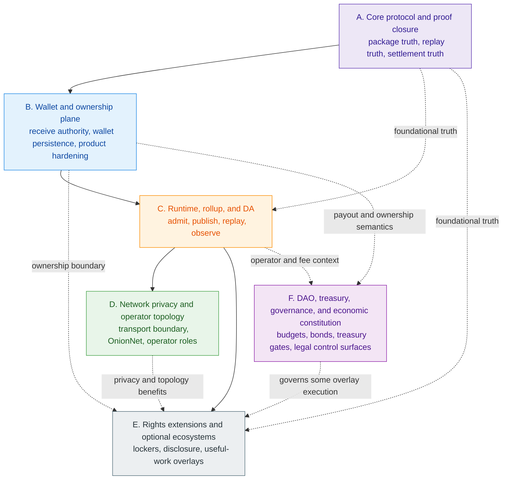

The critical implication is simple:

- Workstream A defines what settlement means.
- Workstream B defines what a wallet privately owns before settlement.
- Workstream C turns those truths into executable publication and replay loops.
- Workstream D improves transport privacy and operator deployment only after the
  publication sink and node roles are stronger.
- Workstream E extends the system outward without redefining core truth.
- Workstream F constrains treasury, governance, and program execution without
  becoming a second consensus engine.

#### Evidence Tables And Appendix Crosswalks

| If you need to know... | Start here | Then read |
| --- | --- | --- |
| what is already live | Section 2 | Workstreams A and B |
| what should mature next | Workstream C | Section 11 |
| how governance and treasury fit | Workstream F | Sections 10 and 13 |
| why optional ecosystems stay downstream | Workstream E | Workstreams A-C |
| what qualifies as a maturity upgrade | Section 12 | Appendix B |

## 4. Workstream A: Core Protocol And Proof Closure

Workstream A owns the smallest set of truths that every later subsystem must
inherit: package validity, replay safety, checkpoint-bound settlement, and
deterministic protocol inputs.

### Workstream A Sub-Lane Matrix

| Sub-lane | Current maturity | What is already real | Next graduation pressure |
| --- | --- | --- | --- |
| Settlement theorem closure | Live core contract with open hardening | wallet package contracts, claim-domain package contracts, settlement re-verification | keep proof semantics narrow and complete remaining trustless/public-proof closure work |
| Storage and replay finalization | Live core contract | storage-owned replay, artifact versioning, nullifier ownership, canonical paths | preserve artifact truth while runtime layers mature above it |
| Protocol configuration and determinism | Live core contract | genesis/config discipline, deterministic object identity, benches and fuzzing culture | keep reproducibility and regression evidence first-class |

### 4.1 Settlement Theorem Closure

#### Wallet Package And Public Spend Verification

The wallet-facing package layer is already real. `TxPackage` and
`ClaimTxPackage` are canonical public package shapes rather than loose transport
ideas. `TxVerifierImpl` and the claim-verifier family already enforce structure,
digest consistency, fee and proof invariants, and claim-specific authorization
before work becomes admissible.

#### Checkpoint Replay, Root Binding, And Rollup Re-Verification

The rollup-facing theorem path is also already real. The live
settlement-verifier path rechecks package digest agreement, checkpoint
statement identity, proof payload binding, execution-input identity, snapshot
and link continuity, previous-root agreement, checkpoint-id derivation, and
transaction inclusion. That is enough to justify a present-tense settlement
claim.

Future proof backends, including recursive checkpoint proofs, must be treated
as backend substitutions over the same canonical statement rather than as a
different settlement theorem. The roadmap must not imply live STARK, FRI,
Nova, Plonky, lattice-recursive verification, or any post-quantum recursive
proof backend until code and tests land a real proof type, verifier API,
artifact format, and benchmark evidence.

The remaining work is not to invent a theorem; it is to finish hardening the
theorem:

- local pre-broadcast checks and canonical settlement checks must remain
  distinct;
- package semantics for public spend flows must remain narrow and hard to
  misuse rather than widening into convenience-first transport;
- settlement meaning must remain checkpoint-bound rather than node-heuristic
  bound;
- root binding, checkpoint replay, and rollup re-verification must remain part
  of the theorem boundary rather than being dissolved into runtime wiring;
- public or trustless proof-closure gaps that still exist in planning must stay
  explicitly open until the repository closes them with evidence.
- the current public spend and checkpoint statement must stay stable before a
  recursive proof backend is selected;
- any future recursive checkpoint statement must define public inputs such as
  previous root, new root, height or epoch, chain or domain separator, delta
  commitment, and proof-system version before implementation;
- recursive proof work should enter as a spike-first lane: one transition,
  then a short recursive chain, artifact embedding, benchmarks, and only then
  production gating.

### 4.2 Storage And Replay Finalization

#### Claim Nullifiers, State Presence, And Artifact Version Gates

Storage is the canonical replay authority. That boundary already appears in the
workspace through `AssetPath`, `AssetLeaf`, `ClaimNullifier`, checkpoint
artifacts, JMT serialization, and version-gated artifact families.

#### Durable Serialization, Reload, And Audit Separation

The roadmap keeps serialization, reload parity, and audit-surface separation in
the same lane because they all protect storage from becoming a fuzzy convenience
cache instead of the replay authority.

The roadmap rule is strict:

- storage MUST remain the owner of replay-critical truth;
- mixed-era artifacts MUST fail closed;
- serialization-version gates and storage-owned audit separation MUST remain
  explicit boundary objects rather than diffuse operational assumptions;
- claim nullifiers, state presence, and artifact version gates MUST remain
  storage-owned validation concerns rather than wallet-side conventions;
- side indexes, audit data, summaries, and convenience metadata MUST NOT become
  a second root of settlement truth;
- reload parity MUST remain part of the contract, not an implementation detail.

This is why storage finalization comes before broader runtime or DA maturity. A
stronger runtime running against weaker artifact truth is not progress.

Phase 049 sharpens this further: local wallet reservation, storage replay,
claim-source roots, and checkpoint proof acceptance must remain separate names.
Wallet reservation is a product safety state; storage spent deltas and claim
nullifiers are replay truth; checkpoint artifacts are statement-bound
settlement evidence. The roadmap should keep `claim_root` distinct from the
state root until honest storage-backed propagation is evidenced, and should
not add a duplicate `claim_source_root_hex` carrier when the artifact and
public-input model already carry the root.

Storage/JMT should also be described as a state, proof, and chunk source rather
than as the owner of wallet secrets or final ownership decisions. A JMT read
adapter or wallet-owned scan worker is allowed if it feeds the canonical wallet
receive lane. A JMT-owned ownership scanner is not, because it would move
wallet authority into storage or runtime infrastructure.

### 4.3 Protocol Configuration And Determinism

#### Genesis, Asset Registry, And Config Schema Discipline

Determinism is part of the protocol contract. Genesis, asset-definition
identity, config loading, compile-time embedding, and reproducible generation
all belong in the core lane because later replay and settlement semantics
inherit them.

#### Benchmarking, Fuzzing, And Formal Regression Surfaces

The repository already reflects this through YAML-backed genesis and asset
definition flows, versioned configuration discipline, criterion benchmarking,
fuzzing packages, and release-style verification culture. The blueprint
therefore treats the following as maturity requirements, not optional polish:

- deterministic protocol inputs;
- asset-registry and config-schema discipline that prevents silent identity or
  generation drift;
- bounded import and generation surfaces;
- regression evidence that survives refactors;
- benches, fuzzing, and docs that continue to exercise the canonical path.

Attack-resistance work belongs here only as regression pressure over existing
contracts. Anti-burn, anti-theft, anti-malleability, anti-DoS, replay, and
deterministic-nullifier checks should strengthen proof, domain-separation,
associated-data, package, and checkpoint-replay surfaces. They should not
import legacy `link_tag`, DAO blacklist, ACK-binding, or `PenaltyPaymentTx`
objects as current consensus mechanics.

## 5. Workstream B: Wallet And Ownership Plane

Workstream B owns wallet-local possession, receiver-derived ownership
recognition, `.wlt` authority boundaries, and the product-hardening work
required to make those rules survivable in real usage.

### Workstream B Sub-Lane Matrix

| Sub-lane | Current maturity | What is already real | Next graduation pressure |
| --- | --- | --- | --- |
| Wallet baseline | Live core contract | receiver-native ownership, `.wlt` redesign baseline, owned-asset authority, explicit history sidecar | keep the baseline stable while follow-up work closes |
| Wallet closure | Live baseline with active bounded follow-up | remote scan or worker-assistance direction is now explicit | finish assistance and convergence work without reopening parallel authority planes |
| Wallet product hardening | In-progress closure inside a live lane | backup, restore, session, TOFU, RPC and integration surfaces already matter | keep security and stable facades ahead of convenience sprawl |

### 5.1 Wallet Baseline Already Landed

#### Receiver-Native Ownership And Scan Authority

The wallet lane is already materially live.

Receiver-native ownership is now the canonical path. Receiver cards, payment
requests, and receiver derivation are part of the public wallet surface, while
`recv_range(...)` plus `StealthOutputScanner` remains the wallet-authoritative
receive lane for recognizing owned outputs.

#### `.wlt`, Owned Assets, And Sidecar Tx History

The `.wlt` redesign also gives the wallet a clearer authority model:

- wallet profile and owned-asset state live in the wallet authority plane;
- scan state remains explicit rather than silently folded into other state;
- exact transaction history remains an explicit JSONL sidecar until the W2
  wallet-storage convergence is executed.

This is intentionally less magical than pretending all state is already unified.
It is also more honest.

### 5.2 Wallet Closure Still Required

#### Tx History Migration And `wallet.asset.*` Convergence

The remaining wallet work is narrower than the original redesign and should
stay narrow.

The open structural follow-up still includes:

- tx-history migration and W2 convergence work around `wallet.asset.*`;
- remote scan or worker assistance that still preserves wallet-local ownership
  authority;
- scan-engine orchestration and runtime scan status around `ScanChunk` and
  wallet-native `ScanStatePayload`;
- explicit unsupported-version receive taxonomy so malformed or unsupported
  packages do not silently collapse into `NotMine`;
- offline package verify, report, and import gates for delayed-connectivity
  transfer;
- multi-target runtime polish for native and WASM consumers;
- compatibility cleanup that removes shadow authority surfaces instead of
  perpetuating them.

#### Remote Scan, Worker Assistance, And Multi-Target Runtime Polish

The main blueprint rules are:

- remote assistance MUST support wallet authority, not replace it;
- worker-fetched evidence MAY provide public chunks, proofs, and resume hints,
  but the wallet MUST still perform local scan evaluation, asset persistence,
  and cursor advancement through the canonical receive lane;
- JMT read adapters and wallet-owned scan workers MAY scale data retrieval, but
  storage, aggregators, and JMT services MUST NOT receive receiver secrets or
  decide final wallet ownership;
- compatibility paths MUST remain visibly compatibility-only;
- no follow-up lane may create a second wallet truth plane beside the owned
  asset baseline.

### 5.3 Wallet Product Hardening

#### Backup, Restore, Session, TOFU, And Payment-Request Discipline

Wallet hardening is not cosmetic. It includes restore discipline, import and
export semantics, session safety, TOFU boundaries, payment-request integrity,
and stable integration facades.

The repository already treats `WalletExportPack`, restore identity, and
`WalletPlusHistory` semantics as security-sensitive surfaces. The roadmap
therefore treats the following as named obligations:

- backup and restore MUST stay fail-closed;
- session and stale-session behavior MUST remain explicit;
- TOFU and payment-request handling MUST stay narrow and testable;
- request-bound receive SHOULD remain the preferred privacy lane when
  available and approved;
- raw `ReceiverCard` material and published `ReceiverCardRecord` material MUST
  stay distinct;
- card-only or plain receive MUST remain compatibility behavior unless a later
  plan proves equivalent privacy;
- exported, forwarded, or helper-handled packages MUST minimize metadata,
  support encrypted handoff, and make redaction policy explicit;
- repeated sender randomness or repeated `R` values MUST remain a
  test-covered privacy failure class;
- stable caller facades for DB, services, receiver management, key handling,
  and verification MUST remain preferable to deep implementation reach-through.

#### UX, RPC, And Integration Surface Stabilization

The wallet is already the strongest user-facing lane in the workspace. That is
why its remaining work must be about authority cleanup and hardening rather
than a fresh architecture restart.

## 6. Workstream C: Runtime, Rollup, And Data Availability

Workstream C converts a strong protocol-plus-wallet core into an executable
rollup path. It already has explicit boundaries for aggregation, replay,
observation, node composition, and provider handoff. What it lacks is full
service closure.

### Runtime Responsibility Map

| Lane | Canonical intake | Canonical output | It explicitly does not own |
| --- | --- | --- | --- |
| Aggregator path | normalized runtime work, including ordinary and claim-domain `WorkItem` inputs | canonical external order, publication candidates, optional `SoftConfirmation` | final checkpoint validity, replay verdicts, or wallet ownership truth |
| Validator path | published artifacts plus checkpoint-facing replay inputs | `Verdict`, reject classification, replay-safe recheck of public artifacts | ordering policy, wallet authority, or operator alerting policy |
| Watcher path | published batches, provider signals, optional validator outcomes | `ObservationSnapshot`, alert families, operator-facing anomaly evidence | settlement validity itself or hidden policy rewrites over validator meaning |
| Node and DA composition | mode config, lifecycle wiring, `DaAdapter` seams, process ownership | running topology, status surfaces, publish and resolve integration points | protocol truth owned by the core, wallet, aggregator, or validator contracts |

#### Runtime Flow

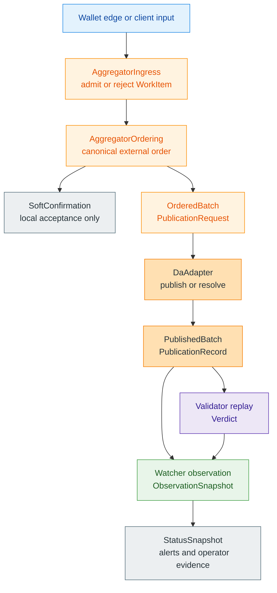

The important roadmap rule is that every later operator or privacy story must
terminate into this path rather than bypass it.

### 6.1 Aggregator Path

#### Admission, Ordering, And Soft Confirmation

The aggregation contract already defines admission, ordering, publication
request construction, publication ledger state, and recovery vocabulary.

What is already real:

- `AggregatorIngress` admits or rejects normalized runtime work;
- `AggregatorOrdering` produces canonical external order;
- `SoftConfirmation` exists as a local-acceptance concept;
- publication-preparation objects such as `OrderedBatch`,
  `PublicationRequest`, `PublicationRecord`, `PublicationState`, and
  `PublishedBatch` already define the runtime side of publication.

The aggregator should continue to consume normalized runtime work derived from
the current `TxPackage` to `WorkItem` direction rather than invent a second
offline package family. Delayed-connectivity packages may become inspectable or
import-ready at the wallet edge, but hard validity still depends on
publication and replay.

#### Batch Assembly, Publication Ledger, And Recovery

What still needs closure:

- durable long-lived service loops;
- stronger recovery behavior;
- operator-ready implementation depth;
- clearer evidence that the publication path is executable beyond a narrow crate
  surface.

The blueprint rule is non-negotiable: soft confirmation is useful, but it is
not hard validity.

Any future DAG bundling should wrap existing packages as nodes, apply bounded
ancestor closure plus explicit conflict and cycle rejection, and then feed
topologically ordered operations into the same checkpoint and replay path.

### 6.2 Validator Path

#### Deterministic Replay And Reject Classification

The validator contract already provides one of the strongest signs that runtime
work is ready for serious implementation closure. Mandatory artifacts, replay
order, and reject classes are already explicit.

That matters because validator maturity is what converts "the runtime says it
published something" into "the system can replay and classify that publication
from public artifacts."

Validator replay must consume storage authority rather than invent a second
truth lane. Public spend containers, when present, must be complete and
position-paired with inputs; half-populated spend material should reject rather
than degrade into best-effort replay.

#### Checkpoint Verification And Family-Specific Reconcile Logic

Validator closure therefore requires:

- deterministic replay loops over published artifacts;
- stable reject classes for missing artifacts, version mismatch, invalid shape,
  invalid authority, proof failure, replay conflict, and state-root mismatch;
- explicit checkpoint reconstruction and family-specific reconcile logic;
- persistence-backed operation that does not depend on hidden aggregator memory.

Replay should keep previous-root binding, input-to-proof pairing,
receiver-card verification, spend-signature checks, associated-data
consistency, output range-proof verification, duplicate rejection, balance
checks, statement integrity, and checkpoint-root reconciliation inside one
deterministic path. Checkpoint proof acceptance must stay shared with storage
semantics: non-empty proof bytes alone are not enough for an attested
checkpoint.

### 6.3 Watcher And Node Path

#### Observation, Alerts, And Evidence Export

The watcher and node-composition lanes complete the runtime picture by
providing observation, lifecycle, status, and provider integration.

What is already real:

- watcher alert families such as publication lag, missing blob,
  censorship-suspect, provider divergence, retry stagnation, invalid batch, and
  validator-incomplete;
- `ObservationSnapshot` and operator-evidence concepts;
- node modes such as `aggregator`, `validator`, `watcher`, `combined`, and
  `api_only`;
- a node-owned DA seam through `DaAdapter`, `DaError`, and node configuration
  contracts.

#### Mode Wiring, DA Adapters, And Full Node Composition

What still needs closure:

- stronger implementation depth and persistence behavior;
- real operator tooling and incident recovery;
- a first real provider implementation behind the existing DA seam;
- richer status and control-plane surfaces.

`z00z_rollup_node` should now be described more explicitly as a composition
root rather than a protocol owner. Combined mode is an operational
convenience, not a semantic shortcut: aggregator and validator loops in one
process must still communicate through the same published-artifact and
replay-verdict boundaries used by split deployments.

| Mode | Primary responsibility | It still must not absorb |
| --- | --- | --- |
| `aggregator` | run admission, ordering, and publication preparation | validator verdict policy, storage replay truth, or wallet ownership decisions |
| `validator` | resolve published artifacts and produce replay verdicts | ordering policy, operator privacy policy, or wallet authority |
| `watcher` | reduce provider, publication, and verdict state into observation and alerts | settlement meaning, checkpoint policy rewrites, or hidden governance rules |
| `combined` | operationally co-locate aggregator, validator, and watcher loops | shortcuts around published-artifact, replay, or status boundaries |
| `api_only` | expose status, control, and query surfaces without the full work loops | consensus authority or provider-specific semantic overrides |

The intended process model is also straightforward:

1. load config and persisted node state;
2. build shared storage, runtime, and transport foundations;
3. select `NodeMode` and wire only the required loops;
4. attach RPC, status, and control surfaces;
5. run publish, resolve, replay, and observation loops with graceful shutdown;
6. recover from persisted state rather than hidden process memory after
   restart.

| Status surface | What it should report |
| --- | --- |
| health | boot state, degraded state, dependency availability, and restart posture |
| aggregator | ingress backlog, ordering progress, publication-attempt state, and retry posture |
| validator | resolve status, replay verdict progress, and missing-artifact or incomplete-state signals |
| watcher | publication lag, provider divergence, missing blob, censorship-suspect, and validator-incomplete alerts |
| storage and DA | persisted checkpoint linkage, provider publication reference, retrieval state, and recoverability |

Failure handling must therefore stay explicit: publish failure, retrieval
failure, RPC degradation, storage restart, and combined-mode service crashes
all need persisted recovery paths and operator-visible status rather than
reconstructed intent. DA provider logic belongs behind the node-owned,
provider-neutral `DaAdapter` seam instead of leaking provider assumptions into
aggregator, validator, or watcher semantics.

## 7. Workstream D: Network Privacy And Operator Topology

Workstream D separates transport, anonymity, and operator deployment concerns.
This matters because the repository already has all three ideas, but they do
not share the same maturity class.

### 7.1 Transport Today Versus Overlay Tomorrow

#### Boundary Comparison

| Surface | Present status | What it owns | What it explicitly does not own |
| --- | --- | --- | --- |
| `z00z_networks_rpc` | Live transport boundary | request dispatch, pluggable transport, test transport, browser-facing transport support | peer identity, anonymity, retry-policy semantics, full network trust policy |
| OnionNet | Reserved boundary with design specification | future anonymous ingress, path privacy, relay strata, edge and exit overlay behavior | generic RPC, full node control plane, final runtime normalization semantics |
| `z00z_rollup_node` composition layer | In-progress subsystem | mode wiring, lifecycle, status, DA seam, process composition | aggregator or validator business rules, wallet ownership decisions, protocol theorem truth |

#### RPC As The Transport Boundary Today

The current RPC surface is deliberately narrow and that narrowness is a
strength. It provides request dispatch and transport abstraction without
quietly absorbing peer identity, authentication, retry policy, or connection
lifecycle semantics.

The roadmap rule is simple:

- RPC MAY widen as a control and query surface;
- RPC MUST remain transport and dispatch infrastructure;
- RPC MUST NOT become the accidental owner of privacy or operator trust policy.

Current privacy weight sits first in state-level unlinkability rather than
transport anonymity. Request-bound receive is the preferred privacy lane for
receiver-side routing when available and approved, while card-only and plain
receive remain compatibility behavior. `tag16` should remain a local prefilter
hint, not an identity stamp, anti-spam credential, or public ownership proof.

#### OnionNet As The Privacy Overlay Tomorrow

OnionNet is more than a vague idea, but less than a deployable subsystem.

Its reserved boundary already captures meaningful ownership domains:

- config and bootstrap;
- node transport identity;
- packet classes and path policy;
- session windows and relay behavior;
- bridge ingress and exit handoff;
- overlay telemetry.

The design direction is also explicit about the intended sink:

- OnionNet is a node-owned, committee-less deterministic active-set anonymous
  ingress fabric;
- it terminates fail-closed into `AggregatorIngress::admit(WorkItem)`;
- runtime ingress decryption, not exit transport unwrap, is the place where
  the canonical envelope is recovered and normalized.

What keeps OnionNet future tense is equally explicit:

- public-registry rules are not frozen;
- beacon and route derivation are not frozen;
- witness distribution and replay/AAD binding are not frozen;
- ingress-recipient confidentiality and ingress-decryptor isolation rules are
  not frozen;
- privacy-floor, low-load contraction, and cover-budget rules are not frozen;
- challenge semantics and low-load privacy behavior are not frozen.

OnionNet therefore remains a serious roadmap item, but not a live network claim.

### 7.2 Operator-Grade Service Topology

#### Single-Process MVP Versus Split Deployment

The node already supports the right short-term operating model: single-process
and combined execution for practical bring-up, plus distinct aggregator,
validator, watcher, and control surfaces for longer-term deployment.

The roadmap sequence inside this workstream is:

1. keep combined mode as an operational convenience, not a semantic shortcut;
2. preserve split artifact and verdict boundaries between services;
3. strengthen shared telemetry, status, and incident-recovery behavior;
4. land a first honest provider implementation behind `DaAdapter`;
5. only then widen into multi-provider and failover choreography.

#### Observability, Telemetry, And Incident Recovery

Shared telemetry, status, and incident-recovery behavior should strengthen
alongside the topology split rather than after it. Combined mode is useful for
bring-up, but operator-grade service posture still requires explicit status,
evidence, and recovery seams across the node roles.

Privacy telemetry should become part of this workstream rather than an
afterthought in wallet UX. The useful model is not a public surveillance
dashboard. It is a wallet and operator discipline that measures privacy quality
before and after a flow: initial anonymity set, boost from batching or routing,
final effective anonymity, route-thinning warnings, and star or collector
patterns that can degrade unlinkability. Those signals should help wallets
delay, reroute, warn, or choose thicker batches without exposing user identity
or transaction meaning.

The roadmap should treat this as a testing and guidance lane. Formal metrics
such as `s_init`, `s_boost`, and `s_final` can be useful names if they remain
internal quality measures rather than marketing claims. The goal is to make
privacy failures visible to the wallet and reviewer before users accidentally
create them.

The same rule should shape node status APIs: report operational facts without
reinterpreting protocol verdicts, and treat missing blobs, publication
stagnation, provider divergence, and validator-incomplete states as first-class
observable recovery conditions.

### 7.3 Publication Resilience

#### Dedicated Celestia Direction And Provider Abstraction

The current DA direction can be named honestly, but only narrowly: Celestia is
the named provider direction, yet no dedicated provider crate exists today.

Publication identity should be emitted only after provider return data binds
checkpoint-facing batch identity to the provider-facing blob reference.
Restart after partial publish or retrieval failure must recover from persisted
state rather than reconstructed operator memory.

#### Multi-Provider And Failover Expansion Path

Publication resilience should therefore follow one real provider path first,
not fragment prematurely into many speculative provider stories.

That is also why multi-provider choreography remains later work: the first
provider path has to prove publish, retrieve, retry, and restart behavior
before failover or provider diversity becomes an honest maturity story.

The companion [Z00Z Multi-DA And Checkpoint Architecture Blueprint](Z00Z-Multi-DA-and-Checkpoint-Architecture.md) now owns the anchor, timestamp, and optional external meta-anchor proof model. This roadmap should only track maturity: first make checkpoint anchors and DA publication reliable, then add timestamp-service proofs, and only later consider external meta-anchor cadence.

## 8. Workstream E: Rights Extensions And Optional Ecosystems

Workstream E is where Z00Z expands beyond private digital cash into broader
rights systems, external-asset control, selective disclosure, and higher-level
coordination overlays. The architecture is already credible. The maturity is
still clearly downstream.

### Extension Matrix

| Extension family | What it already reuses from the live core | What is still missing | Roadmap stance |
| --- | --- | --- | --- |
| External assets and lockers | private-right transfer model, wallet packages, checkpointed settlement over typed objects | canonical locker objects, reserve attestations, foreign-custody verifiers, redemption gateways, trust-tier language | credible, but future tense |
| Selective disclosure and corporate modes | audit wrappers, redaction-capable DTOs, receiver-card publication, storage versus audit separation | auditor-key workflow, standardized disclosure proofs, policy-controlled reveal paths, archive and retention procedures | downstream enterprise lane |
| Linked liability and offline accountability | wallet-local exchange, claim/replay discipline, hidden ownership, and future scoped-right storage | liability-domain proofs, fraud activation, lock registry, exculpability checks, compensation and unlock procedures | downstream safety layer for offline and autonomous rights |
| Agentic and useful-work overlays | private payout path, anti-replay claim logic, bounded reward authorization concepts | review markets, challenge discipline, valuation policy, overlay governance, treasury-control surfaces | optional overlay economy above the protocol line |

### 8.1 External Assets And Locker Systems

#### Internal Rights Over External Custody

The locker thesis fits Z00Z well because custody and ownership transfer do not
have to happen in the same system. Z00Z can privately represent and reassign an
internal right while custody, reserves, and redemption remain in a dedicated
external system.

What makes this credible now:

- the base protocol already knows how to define rights-like asset objects;
- wallets already know how to package transfers privately;
- settlement already knows how to reconcile typed rights without exposing a
  public account ledger.

What keeps lockers future tense:

- no canonical locker objects or locker registries exist in the live core;
- no foreign-custody verifier or reserve-attestation path exists in the live
  core;
- redemption and bridge discipline still need explicit trust-tier language.

#### Bridge Verifiers, Reserve Attestations, And Trust Tiers

The roadmap must therefore keep native rights, issuer-defined rights, and
future locker-backed rights visibly distinct.

### 8.2 Selective Disclosure And Corporate Modes

#### Audit Wrappers And Reveal-State Building Blocks

The repository already contains real building blocks for disclosure-oriented
expansion:

- storage-owned audit wrappers such as `CheckpointAudit`;
- published receiver-card records with epoching and revocation semantics;
- receive DTOs that can expose recovered fields as `Present`, `Redacted`, or
  `Unavailable`;
- RPC logging paths that already redact wallet-sensitive material.

These primitives justify a narrow present-tense claim:

> Z00Z already supports the idea that different observers may see different
> slices of the same transfer reality.

#### Full Corporate, Auditor, And Regulated Workflows

What remains future tense is the full enterprise workflow:

- compliance-profile wallet packaging for regulated or institution-facing
  deployments;
- auditor-key workflow;
- repeatable disclosure-package formats that counterparties, auditors, or
  courts can receive and verify;
- standardized disclosure-proof or audit-receipt formats;
- policy-controlled reveal paths;
- archive packaging, retention, warnings, scheduled-payment context, and
  screening hooks for context-specific operational overlays;
- regulator-facing evidence packages;
- evidence-handoff and archive-custody procedures.

The blueprint rule remains strict: selective disclosure may widen who can see
or attest to a transfer; it must not redefine what makes a transfer valid.
Corporate-auditable and fully public modes therefore remain opt-in overlays
around a privacy-by-default base rather than replacements for it.

### 8.3 Linked Liability And Offline Accountability

#### Fraud Activation Without Public Reputation Drift

Linked liability deserves explicit roadmap treatment because it is the safety
layer that makes offline and autonomous rights more realistic. It should not be
folded silently into generic wallet, agentic, or governance work.

The current corpus gives the lane a clear shape:

- normal-case liability material remains hidden;
- fraud cases activate only through bounded evidence;
- `FraudProof`, `BondRef`, `PenaltyPolicy`, and `LockRegistry` semantics belong
  to the accountability layer rather than the base transfer theorem;
- future rights freeze must remain domain-scoped and must not become a public
  account-freeze primitive;
- exculpability is a first-class requirement, not an afterthought.

Current offline transfer in this roadmap still means delayed-connectivity
package exchange followed by later verification, import, publication, and
replay. It is not final offline cash settlement.

A future DAG or offline layer should wrap existing `TxPackage` nodes with
bounded ancestor closure, a bounded working window, topological apply, and
explicit conflict or cycle rejection rather than redefine the package family.

The roadmap should start this lane with offline payment domains, then extend it
carefully to machine, agent, voucher, and emergency-resource rights only after
the fraud-proof, unlock, and compensation procedures are narrow enough to test.

#### What Keeps It Downstream

Linked liability is not a shortcut around settlement closure. It depends on the
lower layers: wallet-local receipts, replay discipline, storage path locality,
checkpointed reconciliation, and future dispute procedures. It also intersects
Workstream F because slashing, compensation, challenge windows, and arbitration
need policy control. That dependency keeps it in Workstream E until the core
settlement and governance control surfaces are harder to misread.

Optional accountability layers such as hardware tokens, co-signers,
watchtowers, vouchers, channels, or slashing may reduce operational
double-spend risk, but they do not replace consensus nullifier and spent-state
enforcement.

### 8.4 Agentic And Useful-Work Overlays

#### Useful-Work, Attestation, And Reward Layers Above Core

The useful-work and agentic layers are already documented strongly enough to
belong in the roadmap. Their architecture also fits the core:

- external review or attestation produces a bounded authorization;
- Z00Z later pays privately through existing claim and anti-replay logic;
- subjective scoring and challenge handling remain above the protocol line.

The key vocabulary is already meaningful:

- `WorkPackage`;
- `WorkReceipt`;
- `RewardAuthorization`;
- challenge windows;
- private reward claims;
- `ClaimNullifier`-bound anti-replay discipline.

Two objects deserve explicit roadmap status because the docs corpus now treats
them as stable conceptual contracts rather than passing terminology:

- `WorkPackage` is the canonical useful-work submission envelope that binds
  category, artifact or service reference, provenance, time evidence, proof
  references, requested reward, and optional disclosure context;
- `RewardAuthorization` is the bridge object between external evaluation and
  Z00Z payout, carrying the accepted category, reward amount or band, policy
  version, challenge status, approval evidence, expiry semantics, and payout
  constraints in a form narrow enough for mechanical verification.

The roadmap rule is what matters most:

- the protocol MAY carry private payout and anti-double-claim enforcement;
- the protocol MUST NOT become a subjective review machine, governance VM, or
  universal application layer.
- external evaluation MAY stay on a separate coordination layer, including the
  currently documented NEAR-oriented reference direction, so long as Z00Z
  remains the narrow private payout and anti-replay sink rather than the owner
  of social judgment.

The stable conceptual contract is broader than payout alone. Bounded work
categories, declared proof families, multi-lane review, challenge windows, and
slashing-capable dispute surfaces belong to the overlay grammar even before the
final program market shape is fixed.

A later experimental branch may allocate resource quota rights from proven
useful contribution. In that model, a round or branch represents a bounded
strategy for serving real demand, contributors submit useful receipts or bonded
commitments, and the output is not abstract game points but rights over scarce
resources such as blockspace, data availability, compute, relay capacity, or
service access. This belongs here only as a deferred research layer: it must not
replace the core private-settlement thesis, and it should not launch before
anti-manipulation, quota accounting, and useful-work evidence are materially
stronger.

#### Why These Stay Downstream Of Core Settlement

The sequencing rule stays strict because these overlays become more believable
when they terminate into a hardened payout and anti-replay sink instead of
trying to redefine settlement, governance, or review semantics from inside the
base protocol.

## 9. Workstream F: DAO, Treasury, Governance, And Economic Constitution

Workstream F defines the control surfaces around Z00Z. It is not consensus
truth, but it also cannot remain permanently implicit if the larger paper set is
supposed to become implementable.

### Control-Family Matrix

| Control family | What belongs inside the workstream | What must stay outside it | Why the boundary matters |
| --- | --- | --- | --- |
| Governance lanes and proposal logic | proposal classes, voting and delegation rules, timelocks, emergency limits, upgrade classes | transaction validity, wallet ownership truth, replay semantics | prevents political control from becoming a hidden protocol override |
| Treasury constitution and payout rules | compartments, category caps, prohibited uses, per-claim limits, challenge windows, reporting duties | discretionary founder grant desk, hidden payroll, price-promotion engine | keeps economic coordination rule-bound and legible |
| Token economics and activation rules | fee credits, operator bonds, liability collateral, bootstrap reserve, launch capsules, stage labels | mandatory one-token business monoculture, hidden subsidy dependence | gives `Z00Z` a narrow native role without flattening all local economies |
| Useful-work and evaluator surfaces | `WorkPackage`, `RewardAuthorization`, attestation lanes, agent registry, appeals, audit path | AI-owned treasury, silent model hot-swap, unchallengeable evaluator cartel | keeps payout private while preserving contestability |

### 9.1 Governance Boundary And Layer Separation

#### Protocol, Steward, Treasury, And External Coordination Layers

The companion papers are most coherent when they keep four layers separate:

1. the protocol layer, which defines validity, replay safety, checkpoint
   settlement, and wallet-versus-storage truth;
2. the steward layer, which handles continuity, audits, legal defense, and
   bounded communications obligations;
3. the DAO and treasury layer, which governs upgrades, budgets, caps, and
   emergency limits;
4. external coordination layers, which handle program-specific review,
   attestation, or issuer ecosystems.

The roadmap rule is therefore explicit:

- governance MAY set upgrade classes, reporting duties, treasury caps, and
  evaluator rules;
- governance MUST NOT redefine spend validity, wallet ownership, replay truth,
  or checkpoint identity by narrative or soft policy.

If future slashing, bonds, penalty payments, or compensation funds are added,
they belong here as Workstream F policy and cap surfaces rather than as hidden
consensus behavior.

#### Why Governance Must Not Become A Second Consensus Engine

The separation matters because a governance lane that can quietly rewrite
settlement semantics stops being governance and starts becoming concealed
protocol authority under a softer name.

### 9.2 Treasury Constitution And Economic Policy

#### Treasury Compartments, Caps, And Prohibited Uses

Treasury must become constitutionally narrow before it becomes operationally
broad.

The roadmap needs explicit room for:

- published treasury compartments;
- category caps and prohibited uses;
- long-horizon protocol reserves versus narrower steward funding;
- fee credits, operator bonds, liability collateral, bootstrap reserves, and
  launch capsules.

It also needs explicit red lines:

- no discretionary founder grant desk;
- no covert payroll engine;
- no price-promotion machine;
- no vague reserve that quietly becomes a second treasury.

#### Fee Credits, Bonds, Bootstrap Reserve, And Launch Capsules

The positive side of the lane matters too: fee credits, operator bonds,
liability collateral, bootstrap reserves, and launch capsules belong inside a
published economic constitution rather than inside ad hoc treasury folklore.

### 9.3 Reward Programs, Evaluator Markets, And Treasury Execution

#### WorkPackage, RewardAuthorization, And The Private Payout Gate

Future treasury-funded programs should start from the grammar already present in
the useful-work materials, not from ad hoc discretionary execution.

That means:

- evidence review, valuation, and challenge handling remain distinct stages;
- payout reduces to deterministic checks once authorization is valid;
- category fit, caps, expiry, and anti-double-claim enforcement remain explicit
  gates;
- the surface that scores work MUST NOT be the same surface that can
  unilaterally move funds.

#### Agent Registry, Model Governance, And Execution Sandboxing

Agent registries, model hashes, policy versions, review windows, timelocked
upgrades, and per-category spend ceilings therefore belong inside the roadmap
as first-class control surfaces. The same is true for a published model
registry that makes active model identity, pending changes, policy bundle,
benchmark suite, and registry status visible enough for outsiders to detect
silent governance-by-infrastructure.

The same separation should be stated more concretely: evaluation rights,
treasury execution rights, and transfer rights must remain distinct, and any
execution surface that automates payout should remain sandboxed behind explicit
policy versions, review windows, and cap families rather than acting as a
general discretionary control plane. Reasoning hashes, audit logs, and
machine-readable review artifacts may strengthen that surface, but they do not
replace the underlying authorization split.

### 9.4 Legal Control Surface And Reporting Discipline

#### Governance Policy, Treasury Policy, And Founder-Limit Evidence

Part of Workstream F is code or service design. Part of it is policy closure
that must exist before the code can be described honestly.

The required documentary layer includes:

- governance policy;
- treasury policy;
- useful-work or grants policy;
- explicit founder-limit evidence and signer-limit evidence;
- founder allocation and lockup disclosure;
- steward-role statement;
- recurring proof-of-non-control reporting;
- standing reports and public-claim discipline.

#### Standing Reports, Public Claims, And Launch Discipline

The documentary layer remains alive after launch. Public-claim discipline,
recurring non-control evidence, and bounded communications rules are part of
the operating surface, not optional messaging garnish.

### 9.5 Maturity And Sequencing Inside Workstream F

#### Document And Policy Closure Before Broad Economic Activation

The sequencing rule inside Workstream F is:

1. document and policy closure first;
2. bounded deterministic treasury checks second;
3. broader evaluator markets, governance privacy, and contestable higher-order
   coordination later.

Workstream F is necessary early as a control surface, but fully contestable
governance markets are intentionally late.
Launch discipline follows the same order: governance before AI treasury, safe
categories before subjective categories, and steward-firewall clarity before
broad DAO theater. If governance privacy later widens, the leading posture from
the companion papers is still private ballot, public aggregate, and public
delay rather than opaque discretionary voting.

#### Contestable Evaluator Markets And Governance Privacy Later

This is why the roadmap pushes contestable evaluator markets, richer privacy
voting, and more adversarial governance machinery after the first closure wave
of documents, caps, and deterministic treasury checks.

## 10. Prioritization And Tradeoff Analysis

The roadmap order is not self-evident. The repository already supports at least
three plausible priority lenses: core-first, wallet-first, and runtime-first.
The chosen order is conservative because the cost of overclaiming is higher than
the cost of slower outward momentum.

### Tradeoff Summary

| Ordering lens | Main upside | Main downside | Why it is not the top-level order on its own |
| --- | --- | --- | --- |
| Core-first | minimizes overclaim risk and stabilizes the abstractions every later lane inherits | produces less immediate product momentum | necessary first, but not sufficient unless followed by wallet and runtime closure |
| Wallet-first | strengthens the strongest user-facing lane and creates visible user journeys | can outpace publication, replay, and operator truth | attractive, but incomplete by itself |
| Runtime-first | moves the system toward an honest operating rollup posture | depends on already-stable package, replay, and ownership semantics | necessary soon, but not before A and B stay narrow |

### 10.1 Core-First Roadmap

#### Advantages Of Core-First Sequencing

The recommended order is:

1. protect Workstream A so settlement, replay, and deterministic inputs stay
   narrow and defendable;
2. close the remaining bounded Workstream B authority seams so user-facing
   ownership does not fork reality later;
3. convert Workstream C contracts into stronger executable services;
4. harden Workstream D operator topology and privacy ingress only after the
   runtime sink is stronger;
5. widen into Workstream E extension families once the lower rail is harder to
   misstate;
6. advance Workstream F early as a documentary and constitutional lane, but
   delay broad economic activation and complex evaluator markets until the lower
   stack is more mature.

#### Costs And Opportunity Costs

The cost of this approach is slower visible momentum. It deliberately chooses
harder lower-layer closure over faster ecosystem breadth, marketing story, or
premature operator theater.

That is also why recursive checkpoint proofs, DAG offline packaging, and
OnionNet remain important but downstream: they should follow statement
stability, wallet authority closure, and executable runtime closure rather than
lead them.

### 10.2 Wallet-First Or Product-First Roadmap

#### Why It Is Attractive

Wallet-first sequencing remains attractive because it strengthens the most
user-visible and already-landed surface in the repository. It also creates a
cleaner product story faster than core-only hardening.

#### Why It Is Insufficient Alone

Its limit is structural. Wallet momentum on its own can outpace publication,
replay, and operator truth, which would make the product feel more complete
than the underlying operating stack really is.

### 10.3 Runtime-First Or DA-First Roadmap

#### Why It Becomes Necessary Soon

Runtime-first sequencing becomes necessary as soon as the lower proof and
wallet boundaries are stable enough to support it. It is the fastest route from
"credible contracts" to "credible operating system behavior" because it hardens
publication, replay, and operator evidence directly.

#### Why It Should Follow Wallet And Core Baselines

Its limit is dependency depth. Runtime and DA work should not outrun package,
replay, or wallet-authority closure, or the operating stack will start leaning
on truths that the lower layers have not yet finished defending.

The roadmap is therefore staged rather than binary: defend the lower truths,
then lift the operating stack, then widen the ecosystem.

Within that order, rollup-node process-model work can move earlier than
optional ecosystem expansion because it makes existing runtime contracts
executable without redefining settlement.

### 10.4 Concrete Implementation Sequence

#### Codebase-Grounded Execution Rule

The implementation order must follow the actual workspace dependency graph,
not the conceptual importance of each topic. The executable substrate today is
`z00z_utils`, `z00z_crypto`, `z00z_core`, `z00z_storage`, `z00z_wallets`,
`z00z_networks_rpc`, and `z00z_simulator`. The runtime trio and
`z00z_rollup_node` already expose important contracts, but they are still the
next implementation layer rather than the foundation. `onionnet`,
`z00z_telemetry`, and `z00z_extensions` remain reserved or minimal boundaries.

The rule is:

- a crate-level lane may move from design to implementation only after the
  crates it depends on have stable public facades and regression tests;
- runtime services MUST be implemented behind the existing
  `AggregatorService`, `ValidatorService`, `WatcherService`, `NodeRuntime`, and
  `DaAdapter` seams before adding new service families;
- wallet ownership and scan authority MUST remain in `z00z_wallets`; storage
  and JMT/HJMT work may provide roots, proofs, chunks, and read adapters, but
  not wallet-owned receiver secrets or final ownership decisions;
- delayed-connectivity work MUST keep the current `TxPackage` family and may
  wrap it later as a DAG, but MUST NOT introduce a second offline package
  authority;
- governance, rights, and extension work MAY continue as policy design, but
  code execution belongs after the lower stack can publish, replay, recover,
  and report evidence.

#### Current Code Anchors

| Current code anchor | What it proves today | Sequencing consequence |
| --- | --- | --- |
| `z00z_utils`, `z00z_crypto`, `z00z_core` | shared utility, crypto, asset, genesis, domain, and hashing facades exist | keep them first and stable; later crates should consume these APIs instead of bypassing them |
| `z00z_storage` | `AssetStore`, JMT-backed proof blobs, checkpoints, serialization, snapshots, and claim-nullifier state exist | storage/root/proof contracts must stabilize before wallet-runtime handoff or HJMT replacement work |
| `z00z_wallets` | `.wlt`, receiver material, `ScanChunk`, `ScanStatePayload`, `PaymentRequest`, `TxPackage`, RPC methods, and tx-history surfaces exist | close wallet-storage authority before turning packages into runtime workload |
| `z00z_simulator` | staged cross-crate scenario evidence exists | use it as the bridge between wallet/storage closure and runtime service hardening |
| `z00z_runtime/aggregators`, `validators`, `watchers` | service traits and typed records exist | implement real service loops after package/checkpoint evidence is stable |
| `z00z_rollup_node` | `SettlementTheorem`, `NodeRuntime`, `StatusSnapshot`, and `DaAdapter` seams exist | wire node composition and first DA only after runtime services are executable |
| `z00z_networks_rpc` | transport and dispatcher boundary exists | keep RPC as transport; do not let it become hidden consensus, wallet authority, or OnionNet |
| `onionnet`, `z00z_telemetry`, `z00z_extensions` | namespaces are reserved or minimal | use them after node/operator evidence exists, not as early blockers |

#### Execution Waves And Parallel Lanes

| Wave | Codebase focus | Starts after | Must stay sequential | May run in parallel | Exit gate |
| --- | --- | --- | --- | --- | --- |
| W0: repository evidence baseline | workspace manifest, crate facades, tests, docs | immediate start | map active crates -> confirm public facades -> write verification commands for each wave | public-claim sync, maturity-label cleanup, stale planning crosswalks | every later wave has code anchors and an evidence gate |
| W1: foundation and storage substrate | `z00z_utils`, `z00z_crypto`, `z00z_core`, `z00z_storage` | W0 | utility/crypto API stability -> core asset/genesis contract stability -> storage migration boundary and compatibility facade -> storage root/proof/checkpoint stability -> early forest-backend equivalence lane | storage proof benchmarks, serialization checks, fuzz or tamper tests, compatibility-versus-forest equivalence tests, and crash or reload tests that do not change public formats | substrate crates provide stable roots, proof blobs, checkpoints, one stable storage facade, and an early migration lane behind that facade |
| W2: wallet-storage authority closure | `z00z_wallets`, wallet DB, receiver, tx, RPC, storage adapters | W1 | `.wlt` and `ScanStatePayload` discipline -> `ScanChunk`/receive taxonomy -> request-bound receive -> `TxPackage` verify/report/import -> tx-history and `wallet.asset.*` convergence | backup/restore, session, TOFU, RPC logging privacy, wallet-owned remote scan worker or JMT read adapter | wallet receive, import, send, and persistence have one canonical authority path |
| W3: simulator evidence closure | `z00z_simulator`, cross-crate tests, scenario artifacts | W2 | wallet package test case -> storage checkpoint test case -> settlement theorem test case -> tamper and restart evidence | report generation, stage cleanup, scenario matrix expansion | deterministic evidence covers wallet -> storage -> checkpoint -> theorem before runtime service work |
| W4: runtime trio implementation | `z00z_runtime/aggregators`, `validators`, `watchers` | W3 | freeze runtime DTOs -> aggregator service loop -> validator replay/verdict loop -> watcher observation/alert loop | in-memory adapters, reject taxonomy tests, publication and alert tests | runtime traits are backed by executable services and cross-crate tests |
| W5: rollup node and first DA closure | `z00z_rollup_node`, runtime services, storage, DA adapter | W4 | node mode wiring -> local or test DA adapter -> first provider adapter -> publication ledger -> resolve/replay/recovery -> status/RPC control | operator telemetry, failure injection, restart tests | one provider path can publish, resolve, replay, recover, and report status |
| W6: operator privacy and assistance hardening | wallet RPC, logging, watcher signals, telemetry boundary | W2 and W5 | package/export/log privacy policy -> wallet-owned scan assistance -> request/inbox helpers -> privacy-quality status | `tag16` abuse policy, metadata minimization, operator runbooks | assistance improves scale without moving wallet secrets or claiming anonymity |
| W7: advanced state and proof optimization | storage proof-size comparison, advanced proof-envelope evolution, recursive proof spike | W1 storage facade plus W5 runtime evidence | proof-size benchmarks -> optional compatibility-versus-forest comparison -> versioned proof-envelope gate -> one-transition recursive spike -> short-chain artifact embedding | backend comparison benches, proof-size reports, verifier-negative tests | advanced proof work has verifier contracts, version gates, and benchmark evidence without owning the initial storage migration |
| W8: network and provider widening | `onionnet`, watcher provider comparison, multi-provider DA | W5 and W6 | executable OnionNet ingress -> replay or AAD binding -> low-load behavior tests -> provider comparison -> multi-provider failover | transport tests, censorship-watch expansion, deployment topology docs | network/privacy claims remain bounded by executable evidence |
| W9: optional rights, governance, and extensions | `z00z_extensions`, rights objects, governance and payout code when added | W5 plus the specific W7/W8 inputs each feature needs | deterministic control objects -> `RewardAuthorization` and payout gate -> linked-liability/locker/corporate/useful-work lanes | policy documents, legal reporting, sandbox design | optional ecosystems widen without redefining base settlement or wallet authority |

This sequence intentionally pulls `tx-history` and `wallet.asset.*`
convergence back into the wallet-storage closure wave. It does not have to
block every runtime experiment, but it must be resolved before runtime or node
surfaces depend on wallet history as an authoritative source of truth.

Two repeated-looking items are deliberately split by depth rather than copied
by accident. Wallet-owned scan assistance in W2 closes the authority boundary
and minimal adapter shape; W6 hardens the operator-facing privacy, telemetry,
and request-helper story after the node sink exists. Likewise, W5 can begin
with node mode wiring and a local or test DA adapter, but the first real
provider adapter and persisted publication ledger are the mid-term completion
of the same wave rather than a separate early shortcut.

### 10.5 Codebase-Grounded Execution DAG

The overview diagram is intentionally smaller than the isolated wave diagrams.
It shows the real implementation spine that follows the workspace dependency
graph: foundation crates first, wallet and storage closure second, simulator
evidence third, runtime and node execution fourth, and only then advanced
proof, network, governance, and extension lanes.

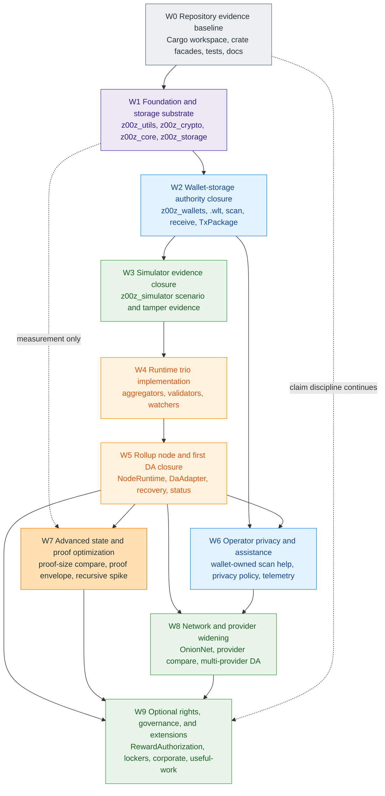

An edge means the downstream wave should wait for the upstream gate. The dotted
edge from W1 to W7 means measurement and benchmarking can start early after W1
has already defined the storage migration boundary and stable facade, while
advanced proof evolution or recursive work still waits until W5 gives it a
real runtime and node consumer.

### 10.6 Isolated Wave Diagrams

The full DAG shows the spine. The isolated diagrams below show each wave as an
implementation slice with explicit input and output arrows. All
diagrams use the same Mermaid Spectrum palette so role color remains stable:
support is gray, core/proof work is violet, storage is orange, wallet and
public API work is blue, runtime is amber, and validation or extension lanes
are green.

#### 10.6.1 W0 Repository Evidence Baseline

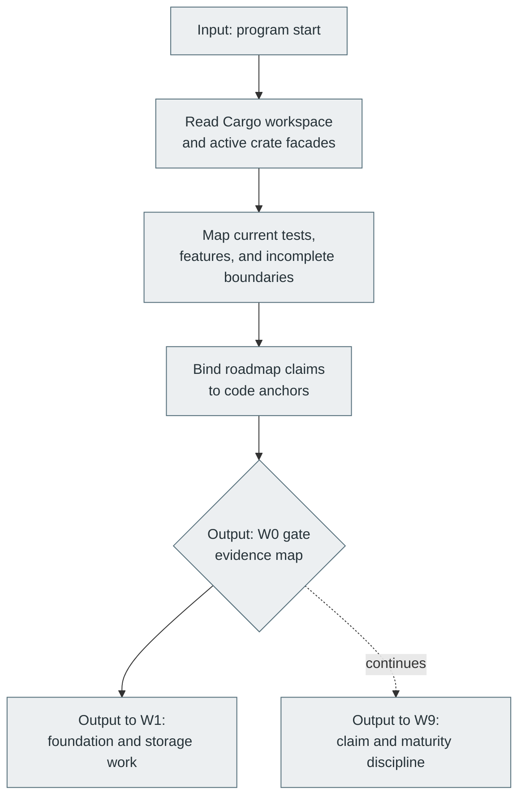

#### 10.6.2 W1 Foundation And Storage Substrate

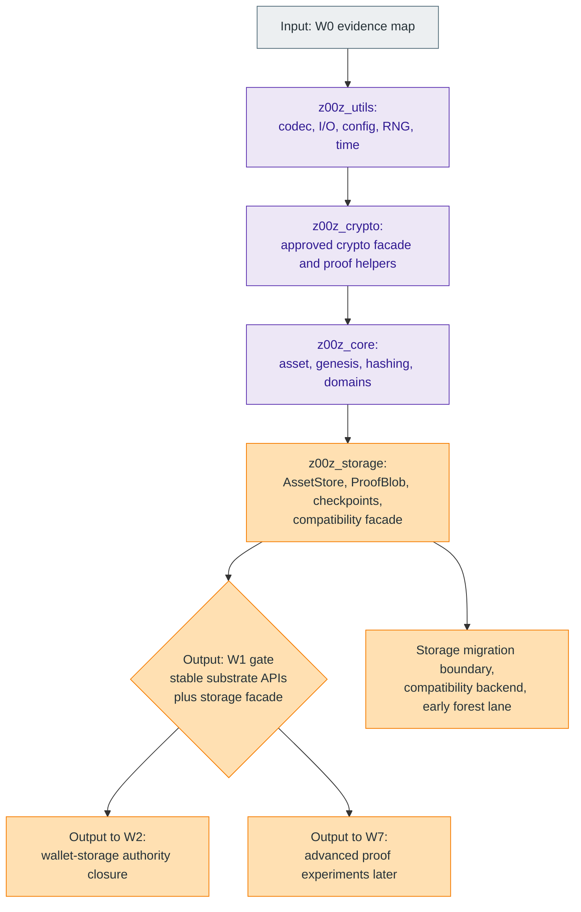

#### 10.6.3 W2 Wallet-Storage Authority Closure

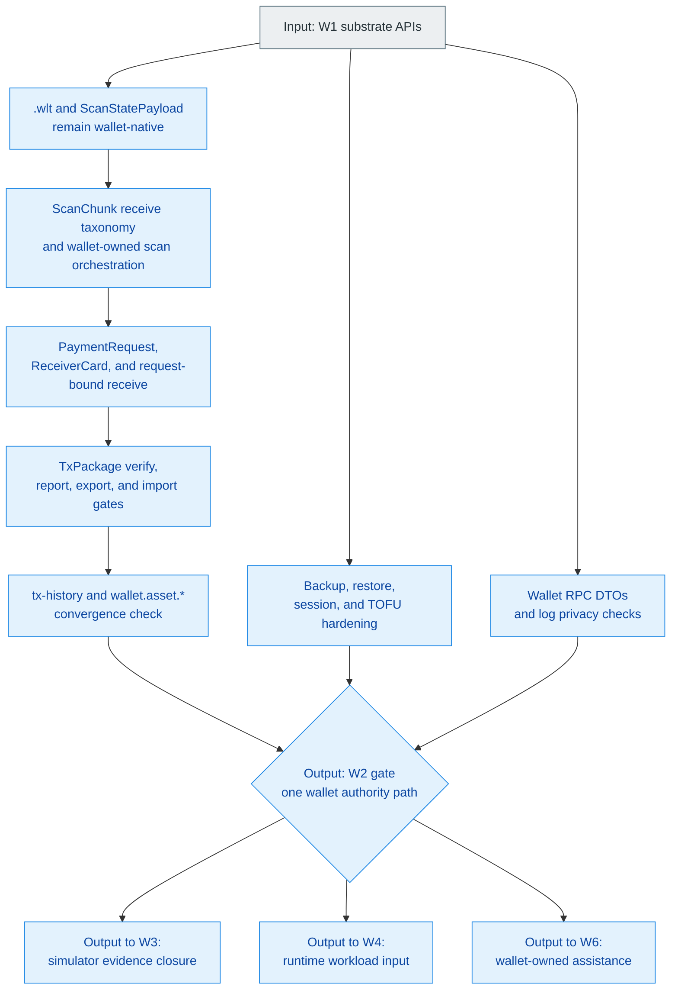

#### 10.6.4 W3 Simulator Evidence Closure

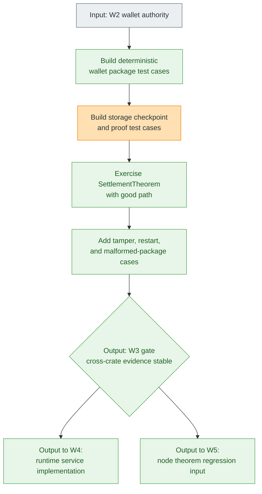

#### 10.6.5 W4 Runtime Trio Implementation

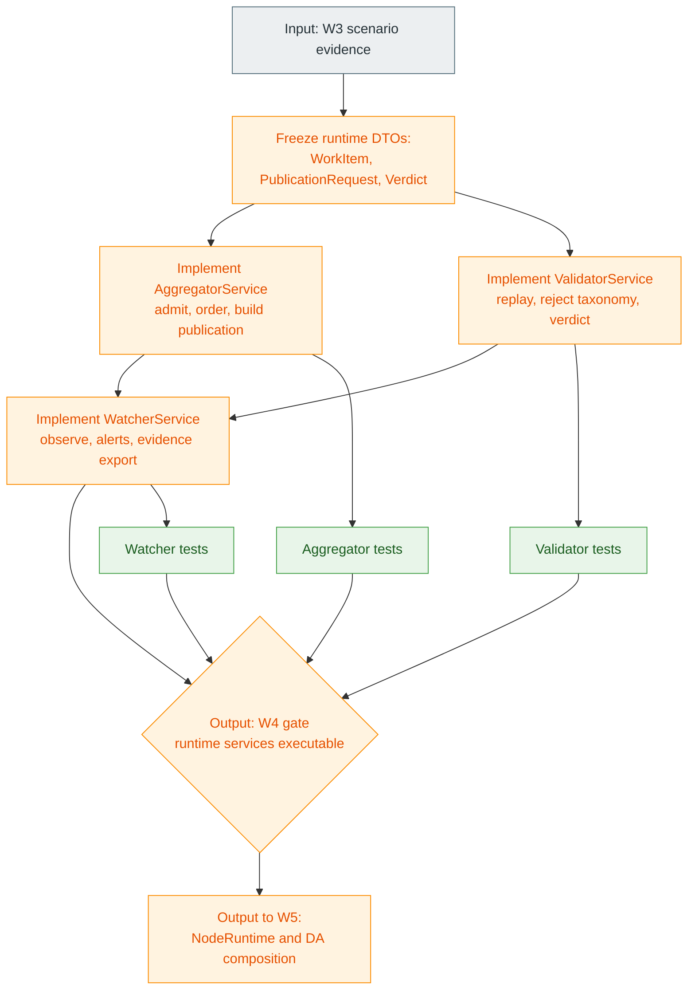

#### 10.6.6 W5 Rollup Node And First DA Closure

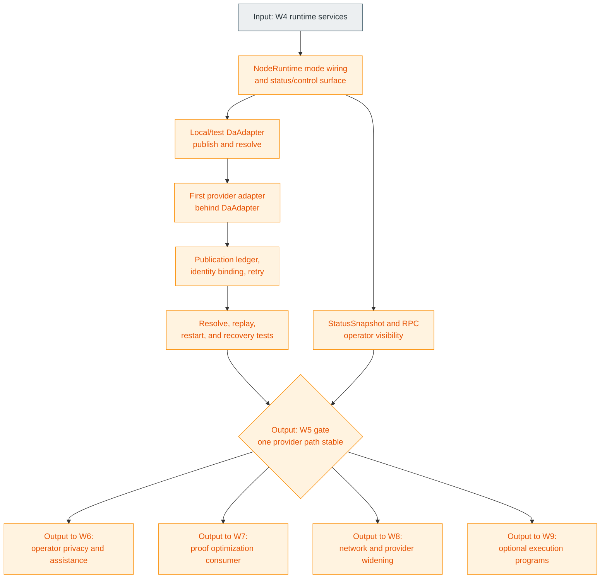

#### 10.6.7 W6 Operator Privacy And Assistance Hardening

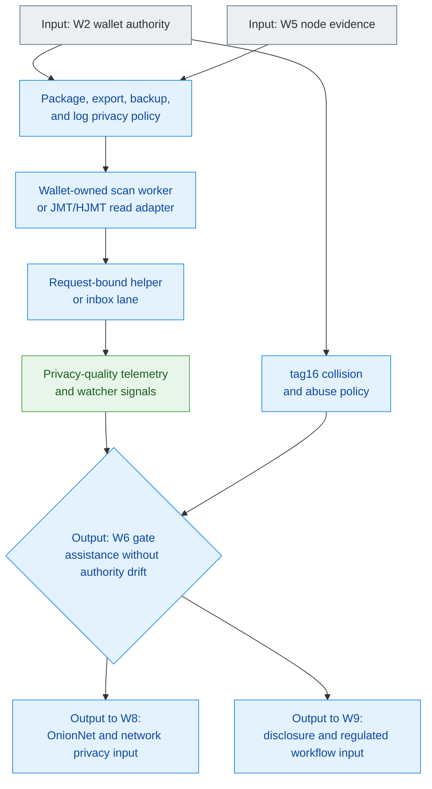

#### 10.6.8 W7 Advanced State And Proof Optimization

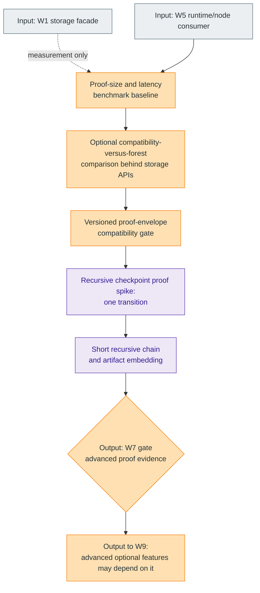

#### 10.6.9 W8 Network And Provider Widening

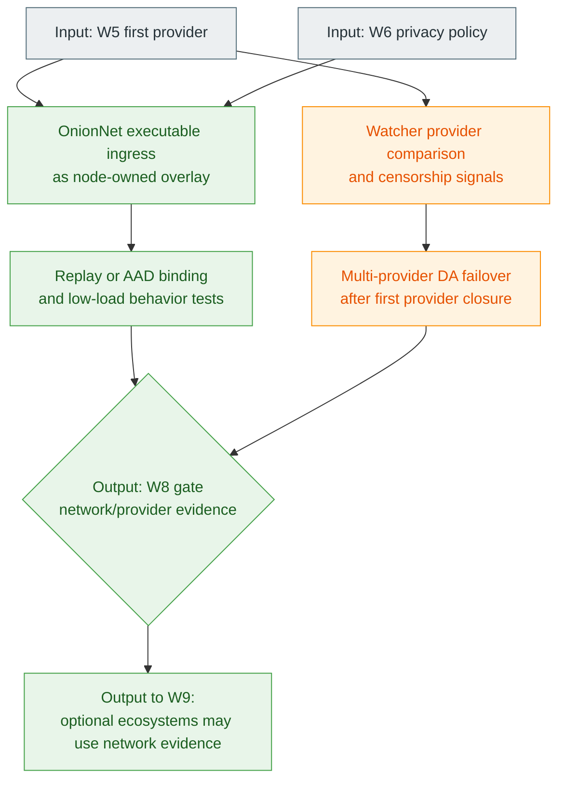

#### 10.6.10 W9 Optional Rights, Governance, And Extensions

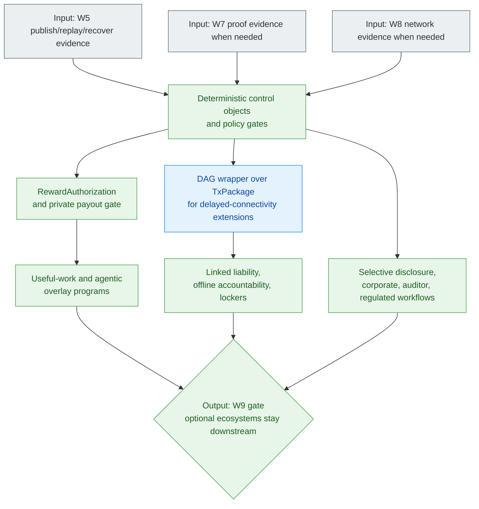

## 11. Milestone Model And Expansion Sequence

The roadmap uses maturity bands rather than public-date promises. These bands
map to current repository evidence more honestly than a cosmetic calendar.

### Maturity-Band Expansion Sequence

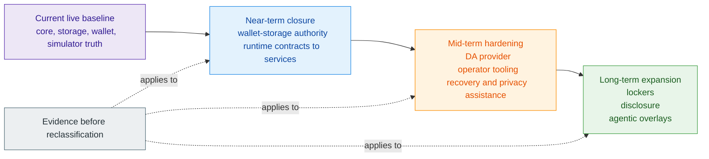

### 11.1 Near-Term Milestones

#### Close The Current Wallet Follow-Up Lane

| Milestone | Current status | Why it comes first |
| --- | --- | --- |
| Close the active wallet follow-up lane | `047-01` through `047-08` remain the shipped core baseline, `047-09` and `047-10` are closed post-closeout slices, and `047-11` is active | this is the narrowest direct continuation of the already-shipped wallet baseline |
| Keep old wallet addon work aligned to the redesign | older Phase `046` remains paused pending rewrite | prevents pre-redesign assumptions from reopening wallet authority drift |
| Convert runtime contracts into executable services | still the main system-level gap | this is the first transition from strong architecture contracts to a more honest operating rollup posture |
| Keep public-claim, role-boundary, and terminology sync current | legal, governance, tokenomics, and terminology papers treat language discipline as an operational control | prevents product copy, treasury language, or companion docs from outrunning maturity claims |

Within that same near-term band, the next concrete closure items are:

| Milestone | Current role | Why it is near-term |
| --- | --- | --- |
| state and checkpoint authority cleanup | claim-root honesty, shared checkpoint-proof semantics, and validator consumption of storage authority | prevents concept drift before runtime service closure |
| wallet scan orchestration and receive taxonomy | `recv_range(...)`, `ScanChunk`, `ScanStatePayload`, and unsupported-version errors | closes the receive-authority lane without inventing scanner services |
| tx-history and `wallet.asset.*` convergence | wallet-local transaction history, asset RPC surfaces, and accepted-status evidence | prevents runtime or node surfaces from treating split wallet history as authoritative |
| offline package verify, report, and import hardening | one `TxPackage` family, accepted-status gate, and raw-card versus record discipline | makes delayed-connectivity transfer honest before future DAG work |
| rollup-node process model and control plane | mode wiring, local or test DA adapter, status APIs, and restart or failure behavior | turns named runtime contracts into executable node posture before the first real provider closure |

Near-term explicitly does not mean "finish every wallet concern forever." It
means close the active bounded wallet follow-up, wallet-history convergence,
and import gates cleanly, then make runtime services more executable.

#### Convert Runtime Contracts Into Executable Services

The same near-term band already contains the first real runtime closure wave:
move aggregation, replay, watcher observation, and node composition from
strongly named contracts toward stronger executable services.

### 11.2 Mid-Term Milestones

#### Dedicated DA, Operator Tooling, And Recovery

| Milestone | Why it belongs in the mid-term band |
| --- | --- |
| first real DA provider implementation | it should follow the existing provider-neutral seam rather than precede it |
| operator tooling, shared telemetry, and recovery discipline | these only make sense once publication and replay services are more real |
| richer operator-facing remote assistance and privacy-ingress lanes | they are valuable only after W2 preserves wallet authority and the runtime and node sink they depend on is stronger |
| stronger publication retrieval and evidence handling | operational honesty matters more than additional narrative breadth |
| checkpoint-anchor, audit-receipt, and disclosure-package standards | they connect publication evidence, legal archive neutrality, and enterprise verification without making consensus a permanent business-record host |

Concrete mid-term hardening targets should include:

| Milestone | Why it belongs in the mid-term band |
| --- | --- |
| first real DA provider and persisted publication ledger | requires node process closure and runtime service depth first |
| request-bound inbox or helper lane | depends on wallet receive authority and runtime sink stability |
| package and export privacy policy | hardens real delayed-connectivity usage before wider offline ecosystems |
| `tag16` collision and abuse policy | protects scanner performance without turning `tag16` into identity |
| operator status, telemetry, and recovery evidence | required before node or operator maturity can be reclassified honestly |

#### Privacy Overlay And Remote Assistance Lanes

The privacy-ingress and remote-assistance stories fit mid-term rather than
near-term because they depend on a stronger publication sink, stronger node
roles, and clearer operational recovery semantics.

### 11.3 Long-Term Milestones

#### External-Asset Rights, Selective Disclosure, And Enterprise Modes

| Milestone family | Why it stays long-term |
| --- | --- |
| lockers and external-asset rights | depends on foreign-custody truth and trust-tier discipline not yet present in the live core |
| selective disclosure and enterprise modes | depends on disclosure-proof, auditor, and operational-policy layers not yet closed |
| linked liability and offline accountability | depends on fraud-proof, lock, unlock, exculpability, and domain-scoped compensation procedures not yet landed |
| useful-work, agentic coordination, and specialized economic zones | reuses the core well, but should not compete with the work required to harden that core first |

Additional long-term families remain important, but they stay late for the same
reason:

| Milestone family | Why it stays long-term |
| --- | --- |
| recursive checkpoint proof backend | requires fixed statement, proof type, artifact embedding, benchmarks, and audit posture |
| DAG offline package closure | requires stable current package import, conflict and cycle rules, and bounded working-window implementation |
| hardware, co-signer, voucher, or slashing accountability | reduces operational risk only after consensus nullifier and spent enforcement remain authoritative |
| OnionNet execution | requires witness distribution, replay or AAD binding, active-set rules, low-load privacy behavior, and runtime sink evidence |

#### Agentic Coordination, Useful-Work, And Specialized Economic Zones

These lanes remain credible and important, but they should widen only after the
lower proof, wallet, runtime, and governance surfaces become harder to misread.

## 12. Evidence Gates And Definition Of Done

Maturity language must follow evidence. That rule already exists in practice
across the repository; this section makes it explicit for roadmap governance.

### 12.1 Verification Gates

#### Verification Baseline

Technical verification for a maturity claim should use the repository's normal
gates for the affected surface.

```bash
cargo fmt
cargo clippy --all-targets --all-features
cargo test --all
cargo doc --no-deps
```

Additional evidence is required where the surface depends on staged or
cross-crate behavior:

- scenario evidence for wallet, storage, simulator, or settlement flows;
- system-level reruns when the change crosses crate boundaries;
- docs and public-surface updates when the public contract changes;
- state and checkpoint cleanup evidence that distinguishes state root,
  claim-root, checkpoint-proof payload, and storage replay authority;
- wallet-history convergence evidence covering tx-history persistence,
  `wallet.asset.*` surfaces, accepted-status records, and absence of a second
  wallet authority plane;
- offline package closure tests covering verify, report, and import behavior,
  half-populated spend data, non-import-ready statuses, and unsupported-version
  taxonomy;
- worker-assistance tests proving remote evidence feeds the canonical wallet
  receive lane without owning receiver secrets or final ownership decisions;
- recursive-proof promotion evidence covering a real proof type, verifier API,
  artifact or public-input contract, benchmark data, and an explicit
  current-stack migration note;
- rollup-node promotion evidence covering bootable modes, status APIs,
  provider-neutral `DaAdapter` behavior, failure or restart tests, and no
  protocol logic inside node wiring.

#### Cargo, Clippy, Tests, Docs, And Scenario Evidence

The verification baseline is intentionally ordinary and auditable: formatting,
linting, tests, docs, and scenario evidence together are more trustworthy than
one heroic benchmark or one isolated happy-path rerun.

#### Planning And Documentation Gates

Code evidence alone is not sufficient for roadmap promotion. The planning
corpus must also stay honest.

Required planning-side evidence includes:

- closure summaries for completed bounded lanes;
- coverage ledgers where the lane is spec-driven;
- synchronized active-state and roadmap updates;
- terminology and authority-map sync when shared nouns or maturity labels
  change;
- explicit recording of deferred work, conditional work, and external blockers.

The roadmap should inherit that honesty rather than smooth it away.

#### Closure Summaries, Coverage Ledgers, And Honesty Checks

Promotion claims stay believable only when closure summaries, coverage ledgers,
and explicit honesty checks remain attached to the technical evidence rather
than being treated as optional paperwork.

### 12.2 Graduation Criteria By Maturity Level

#### From Reserved Boundary To In-Progress Subsystem

| Promotion | Minimum requirement |
| --- | --- |
| Reserved boundary -> In-progress subsystem | real implementation ownership, an explicit contract, meaningful dependency direction, and at least one executable or testable path |
| In-progress subsystem -> Live core contract | fail-closed behavior, stable typed or canonical interfaces, concrete verification evidence, honest documentation, and no shadow authority plane elsewhere |

`Live` does not require every possible feature. It requires a real, narrow, and
defendable contract.

#### From In-Progress Subsystem To Live Core Contract

The second promotion is stricter because it is the point where roadmap language
changes from "real but unfinished" to "present-tense contract" and therefore
must withstand fresh readers, external reviewers, and later ecosystem reuse.

### 12.3 Documentation And Whitepaper Sync

#### Main Whitepaper, Companion Whitepapers, And Planning Corpus Alignment

Document drift is itself a roadmap risk. The role split must remain explicit:

- the main whitepaper explains the protocol thesis;
- the companion papers explain governance, legal, economic, and overlay control
  surfaces;
- this blueprint explains maturity, dependency order, and graduation gates;
- the planning corpus remains the execution truth for bounded slices.

When a surface changes maturity class, that reclassification must be explicit
and attributable to fresh evidence. Silent rewriting is a roadmap failure mode.

#### Change Logging And Explicit Reclassification

The practical rule is simple: when maturity changes, the document should record
what changed, why it changed, and which new evidence justified the stronger
claim.

## 13. Roadmap Governance, Risks, And Non-Goals

### 13.1 Main Risks

#### Overclaim Risk And Reserved-Boundary Inflation

Three risks dominate the roadmap.

| Risk | Why it matters |
| --- | --- |
| Reserved-boundary inflation | serious-looking boundaries can be mistaken for already-landed behavior, especially around OnionNet, node composition, and optional ecosystem papers |
| Duplicate authority drift | wallets, storage, simulator wording, runtime services, or compatibility surfaces can accidentally become competing truth sources |
| Legacy phase import drift | older planning notes contain attractive but stale names, such as `link_tag`, old offline package families, and constant-size recursive-proof claims, that would create false authority planes if copied forward directly |

The roadmap should actively resist all three.

#### Duplicate Authority And Boundary Drift

The second risk matters because Z00Z spans wallet, storage, runtime, node, and
overlay surfaces at once. If two of them silently become co-authorities for the
same truth, the roadmap stops being an accuracy tool and starts becoming cover
for architecture drift.

### 13.2 Explicit Non-Goals For This Document

#### No Price Timeline, Hype Narrative, Or Unsupported Production Claims

This blueprint is not:

- a release announcement;
- a token-price thesis;
- a promise of public launch dates;
- a justification for describing optional overlays as core consensus features;
- a choice of final recursive proof backend, post-quantum proof system, or
  transport-anonymity implementation before repository evidence exists.

The document should remain future tense wherever the repository still requires
future-tense honesty.

#### No Premature Flattening Of Optional Ecosystems Into Core Consensus

That includes refusing to describe lockers, disclosure overlays, useful-work
economies, or privacy ingress as if they were already part of one finished base
consensus machine.

### 13.3 Roadmap Update Discipline

#### Evidence-Backed Revision Rules

Revision is healthy only when it is evidence-backed. The roadmap should move in
response to new closure, new blockers, or changed dependency truth, not because
another narrative sounds more exciting.

#### Reordering Triggers And Decision Thresholds

Reordering the roadmap should require real evidence. Legitimate triggers
include:

- a newly discovered core security blocker;
- closure of a remaining wallet authority seam;
- a first real DA-provider implementation;
- a runtime service breakthrough that materially changes system closure;
- OnionNet graduating from reserved design specification into executable subsystem
  work;
- a new dependency or risk discovered through architecture or verification work.

The decision threshold remains high. The roadmap moves when the dependency graph
or risk profile changes materially, not when a different story merely sounds
more exciting.

## Appendix A. Glossary

### A.1 Maturity Vocabulary

| Term | Meaning In This Blueprint | Representative current example |
| --- | --- | --- |
| `Live core contract` | A typed protocol or wallet contract that already has code-backed present-tense behavior and verification evidence | settlement theorem path, storage replay boundary, wallet owned-asset baseline |
| `In-progress subsystem` | A subsystem whose role boundaries are real but whose operator or service closure is still incomplete | aggregator, validator, watcher, node-composition lanes |
| `Reserved boundary` | A crate, namespace, or architecture seam reserved early so later work lands without renaming or ownership confusion | OnionNet, telemetry, extensions |
| `Workstream` | A dependency-shaped lane of work that can span multiple crates and execution lanes | core proof closure, wallet closure, runtime and DA maturity |
| `Planning record` | A local repository record that captures one bounded implementation lane and its evidence | scope, closure notes, and verification artifacts |
| `Maturity gate` | The evidence threshold required before the roadmap may upgrade a surface to a stronger label | tests, summaries, docs, and honest scope closure together |
| `Authority plane` | The surface treated as canonical for one class of truth | wallet-owned possession, storage-owned replay, checkpoint-bound settlement |

### A.2 Core Object And Service Names

| Name | Role In The Roadmap |
| --- | --- |
| `TxPackage` | canonical wallet-side package for regular spend flows before settlement |
| `ClaimTxPackage` | canonical wallet-side package for claim-domain flows with separate replay context |
| `ClaimNullifier` | storage-owned anti-replay artifact for claim-domain publication |
| `CheckpointExecInput` | public replay input carrying the proposed checkpoint transition |
| `CheckpointArtifact` | final checkpoint-bound public artifact that commits the transition |
| `CheckpointLink` | canonical linkage object between artifact, snapshot, and execution input |
| `SettlementTheorem` | narrow rollup settlement bundle rechecked by the live verifier |
| `OwnedAssetPayload` | wallet-owned authority object for live claimed-asset state |
| `recv_range(...)` | canonical wallet-local receive authority lane |
| `StealthOutputScanner` | wallet-side ownership-detection engine used by the canonical receive lane |
| `ScanChunk` | public scan-evidence chunk consumed by the canonical wallet receive lane |
| `ScanStatePayload` | wallet-native scan cursor and progress state |
| `ReceiverCardRecord` | published receiver-card record kept distinct from raw `ReceiverCard` material |
| `PaymentRequest` | signed request-bound receive surface used to narrow routing and privacy policy |
| `WorkItem` | normalized runtime intake object admitted by the aggregator path |
| `PublicationRequest` | provider-neutral publication handoff object built by the runtime |
| `PublishedBatch` | provider-facing publication result tied back to checkpoint identity |
| `SoftConfirmation` | pre-checkpoint acknowledgement that work entered the publication path |
| `Verdict` | typed validator result over resolved published artifacts |
| `ObservationSnapshot` | reduced watcher view over publication, provider, and verdict state |
| `DaAdapter` | node-owned provider seam for publish and resolve behavior |
| `NodeMode` | role selector for aggregator, validator, watcher, combined, and api-only execution |
| `Recursive checkpoint proof` | future proof-backend family that may later replace current checkpoint proof bytes while preserving the same canonical statement |

## Appendix B. Crate And Workstream Maturity Matrix

### B.1 Crate Matrix

| Crate or family | Current maturity | Main role | Next graduation gate |
| --- | --- | --- | --- |
| `z00z_utils` | Live support crate | shared config, codec, time, logger, and metrics abstractions | continued stable reuse without boundary leaks |
| `z00z_crypto` | Live core contract | cryptographic facade, domain separation, proofs, KDF labels | preserve fail-closed cryptographic surfaces under change |
| `z00z_core` | Live core contract | asset definitions, genesis, protocol object vocabulary | continued deterministic config and asset-boundary hardening |
| `z00z_storage` | Live core contract | replay ownership, checkpoints, serialization, claim-nullifier persistence | keep version and replay discipline while runtime matures |
| `z00z_wallets` | Live core contract with active closure | ownership plane, receive lane, backup and restore, package creation | close current follow-up work without reopening parallel authority |
| `z00z_simulator` | Live evidence harness | cross-crate staged execution and scenario evidence | remain a harness rather than accidental consensus truth |
| `z00z_networks_rpc` | Live transport boundary | request dispatch and transport abstraction | stay narrow and reusable without absorbing network semantics |
| `z00z_aggregators` | In-progress subsystem | admission, ordering, publication preparation, recovery state | real long-lived service closure and operator behavior |
| `z00z_validators` | In-progress subsystem | replay validation, reject taxonomy, reconcile-family rules | stronger executable replay loop and persistence-backed operation |
| `z00z_watchers` | In-progress subsystem | observation, alerts, provider anomaly surfacing, evidence export | richer implementation and operational persistence |
| `z00z_rollup_node` | In-progress subsystem | mode wiring, status, DA seam, process lifecycle | bootable modes, provider-neutral adapter closure, status and control plane, restart discipline, and no node-owned protocol decisions |
| OnionNet | Reserved boundary with design spec | future anonymous ingress overlay and node-owned privacy transport | executable subsystem work beyond a minimal reserved crate plus spec |
| `z00z_telemetry` | Reserved boundary with minimal live facade | shared observability home for logs, metrics, and tracing | richer concrete adapters and broader node integration |
| `z00z_extensions` | Reserved boundary | future extension family namespace | first real extension ownership and executable path |

### B.2 Workstream Dependency Matrix

| Workstream | Must rely on before it can mature honestly | Why |
| --- | --- | --- |
| A. Core protocol and proof closure | none earlier than itself | it defines package, replay, and settlement truth |
| B. Wallet and ownership plane | A | wallet authority must terminate into the real settlement and replay model |
| C. Runtime, rollup, and DA | A and B | runtime needs canonical package, replay, and ownership boundaries |
| D. Network privacy and operator topology | C, plus stable inputs from A and B | overlay and topology work need a real publication sink and honest node roles |
| E. Rights extensions and optional ecosystems | A, B, and C; many parts also benefit from D, and linked-liability or economic overlays also require F | lockers, disclosure, accountability, and overlay economies only make sense over a hardened settlement rail plus honest control surfaces |
| F. DAO, treasury, governance, and economic constitution | A and B for real payout semantics; many execution paths also depend on C; the widest program families also intersect E | keeps treasury, tokenomics, legal, and useful-work control surfaces modular instead of smuggling them into consensus |

## Appendix C. Evidence Crosswalk

### C.1 Historical Closure Waves That Define The Live Baseline

| Historical closure wave | Why it matters for the current baseline |
| --- | --- |
| core asset-definition, registry, genesis, and wire-boundary hardening | established the canonical protocol vocabulary and deterministic input base |
| checkpoint, link, replay, and nullifier-critical storage closure | closed the storage truths that later publication and replay must inherit |
| wallet cryptographic and backup-boundary hardening | narrowed the wallet's cryptographic and restore-sensitive surfaces |
| architecture and facade discipline cleanup | reinforced crate ownership and kept public seams shallow across the workspace |
| receiver-driven output-reception hardening | made the canonical receive lane and receiver-driven output story explicit |
| wallet redesign baseline | landed the `.wlt` redesign, owned-asset authority, and wallet baseline now treated as live |
| wallet compatibility cleanup and rotation hardening follow-up | strengthened compatibility cleanup and durable rotation while preserving the closed baseline |

### C.2 Active And Planned Lanes That Define The Next Roadmap Layers

| Active or planned lane | Current roadmap role |
| --- | --- |
| current wallet follow-up lane | wallet-storage closure covering scan assistance, history convergence, and import gates without changing ownership authority |
| wallet tx-history and `wallet.asset.*` convergence | wallet-storage closure work that should finish before runtime or node surfaces depend on wallet history as authority |
| aggregator and publication-path contract | runtime admission and ordering path |
| validator replay and reject-taxonomy contract | deterministic replay and reject classification path |
| watcher observation, alert, and evidence-export contract | operator observation and anomaly surfacing path |
| OnionNet reserved design specification | future anonymous ingress direction |
| rollup-node composition, DA seam, and mode-wiring contract | executable process composition and provider handoff path |
| linked-liability accountability lane | fraud activation, exculpability, lock, unlock, and compensation semantics for offline and autonomous rights |
| terminology and corpus-sync lane | authority-map, glossary, abbreviation, and maturity-label coherence across companion papers |
| governance, treasury, and economic-constitution lane | policy, caps, reporting, tokenomics controls, and bounded payout governance for future DAO and useful-work execution |
| Phase `049` state-management lane | claim-root honesty, checkpoint-proof semantics, validator and storage authority convergence, and wallet scan or runtime status closure |
| Phase `050` storage-scanner clarification | boundary proof that storage is a state, proof, and chunk source while wallet remains scan authority |
| Phase `051` offline transaction lane | current delayed-connectivity package exchange with one `TxPackage` family and verify, report, and import gates |
| Phase `052` DAG offline lane | future package-DAG wrapper over existing packages with ancestor closure and conflict or cycle rejection |
| Phase `055` privacy and anonymity lane | request-bound receive posture, package or export privacy, `tag16` abuse policy, and OnionNet as a future boundary |
| Phase `060` attack-resistance lane | threat vocabulary and downstream accountability constraints without importing legacy blacklist protocol objects |
| Phase `075` recursive-proofs lane | future proof-backend honesty, spike-first sequencing, and recursive-proof non-claims |
| Phase `120` rollup-node lane | node process model, mode wiring, status or control plane, DA adapter, and failure or restart behavior |

## Appendix D. Open Questions And Reordering Triggers

### D.1 Open Technical Questions

| Question | Why it matters |
| --- | --- |
| What exact W2 exit criteria prove tx-history convergence and `wallet.asset.*` cleanup are closed enough for runtime and node consumers? | affects whether wallet closure remains bounded or reopens a larger authority migration |
| How much runtime logic should live in dedicated service crates versus shared helper crates? | affects how quickly aggregation, validation, observation, and node composition can graduate from contract to operation |
| How deep should the first DA-provider implementation go before multi-provider work begins? | affects whether resilience follows one real provider or fragments too early |
| Which linked-liability evidence objects are required before offline and autonomous rights widen? | affects when fraud activation, compensation, and domain-scoped locks can move from target architecture into implementation |
| What exact evidence and witness-distribution model would let OnionNet leave reserved-spec status? | determines whether the privacy overlay can move forward or remain reserved |
| What level of recovery and observability is the minimum credible operator baseline? | affects when node and watcher maturity claims can be upgraded honestly |

### D.2 Open Product And Governance Questions

| Question | Potential reordering effect |
| --- | --- |
| How much operator maturity should exist before enterprise or disclosure work is prioritized? | could delay or accelerate selective-disclosure investment |
| What trust-tier language should be standardized for native, issuer-defined, and locker-backed assets? | could change how early locker-related work is promoted |
| Which useful-work or agentic reward lanes are safe enough for early design work versus later execution? | could reorder optional ecosystem work inside the long-term band |
| How much of the fee-credit, bond, bootstrap, and treasury constitution must be fixed before broader operator and local-economy activation? | could pull parts of Workstream F forward relative to later runtime or ecosystem work |
| When should DAO voting, model governance, and treasury execution move from policy documents into real modules or services? | could change whether governance stays documentary longer or becomes an earlier engineering lane |
| How much compliance or auditor-facing workflow should live in product layers versus protocol-adjacent standards? | could affect whether corporate-mode work stays purely downstream or starts earlier as interface design |
| What governance process should approve future maturity reclassification for major ecosystem surfaces? | could change how aggressively the roadmap updates reserved or in-progress labels later |

## Appendix E. Research-To-Implementation Backlog

This appendix converts the research review into roadmap work. It is not a
literature summary. Each row names a concrete Z00Z implementation or planning
gate that would extend the current roadmap honestly.

| Source article anchor | New roadmap item | Graduation gate |
| --- | --- | --- |
| [Functional Encryption - Definitions and Challenges, pp. 1, 4, 8-16](<../articles/Functional Encryption - Definitions and Challenges.pdf#page=1>) | Add a `LeakageContract` gate for every future audit key, scoped view credential, enterprise disclosure package, or policy proof. | A feature cannot leave reserved status until it names public leakage, counterparty leakage, auditor leakage, and fraud-case leakage. |
| [A Survey on Anonymity, Confidentiality, and Auditability, pp. 6, 21, 24-30](<../articles/A Survey on Anonymity, Confidentiality, and Auditability.pdf#page=6>) | Add a privacy-axis matrix to feature graduation. | Each privacy-sensitive feature must classify sender graph, receiver graph, amount, network origin, unlinkability, auditability, and misuse reveal as improved, unchanged, weakened, or out of scope. |
| [Transferable E-cash - A Cleaner Model, pp. 3-5, 8-9, 26](<../articles/Transferable E-cash - A Cleaner Model.pdf#page=3>) and [Anonymous Transferable E-Cash, pp. 9-16](<../articles/Anonymous Transferable E-Cash.pdf#page=9>) | Create a linked-liability proof-model slice for `check_conflict` and `verify_liability_guilt`. | The slice graduates only when it specifies accepted, rejected-with-evidence, exculpability, and bounded reveal test vectors. |
| [Auditable, Anonymous Electronic Cash, pp. 1-2, 8, 10, 13](<../articles/Auditable, Anonymous Electronic Cash.pdf#page=1>) | Add a supply-audit registry design spike for issuer-backed or voucher-like rights. | The spike must show how `SupplyAuditRoot`, issuance records, invalidation events, and holder privacy relate without turning audit into transaction tracing. |
| [Fully Anonymous Transferable Ecash, pp. 7-14](<../articles/Fully Anonymous Transferable Ecash.pdf#page=7>) | Add an offline package-bounds and compaction lane. | Offline package export/import must define maximum portable history, compaction triggers, reconciliation behavior, and failure language before broad offline UX is promoted. |
| [Usability of Cryptocurrency Wallets, pp. 3-10](<../articles/Usability of Cryptocurrency Wallets.pdf#page=3>) and [User-Perceived Privacy in Blockchain, pp. 7-15, 26-28](<../articles/User-Perceived Privacy in Blockchain.pdf#page=7>) | Add wallet privacy-UX gates to the wallet workstream. | Send, receive, export, import, and audit flows should have tests or mockups for privacy-undo warnings, fee clarity, delay expectation, stuck-pending recovery, and request or receiver-material reuse. |
| [PCH-based privacy-preserving with reusability, pp. 1-7, 9, 11-14](<../articles/PCH-based privacy-preserving with reusability.pdf#page=1>) | Add a future reusable-deposit/channel spike under optional ecosystem work. | The spike must keep `ReusableDepositCertificate`, `DepositSplitProof`, and `VirtualChannelWallet` outside the live core until balance security, unlinkability, and hub role boundaries are specified. |
| [A Survey on Anonymity, Confidentiality, and Auditability, pp. 21, 28-30](<../articles/A Survey on Anonymity, Confidentiality, and Auditability.pdf#page=21>) | Add cross-layer network privacy testing to OnionNet graduation. | OnionNet cannot graduate on transport wiring alone; it needs timing, sparse-load, helper-route, relay-diversity, cover-budget, and degraded-mode tests or explicit non-claims. |
| [A Survey on Anonymity, Confidentiality, and Auditability, pp. 24-28, 39-40](<../articles/A Survey on Anonymity, Confidentiality, and Auditability.pdf#page=24>) | Add an auditability-without-disclosure design track. | Candidate designs should prefer aggregate proofs, cap proofs, policy-membership proofs, or threshold review over raw transaction export. |
