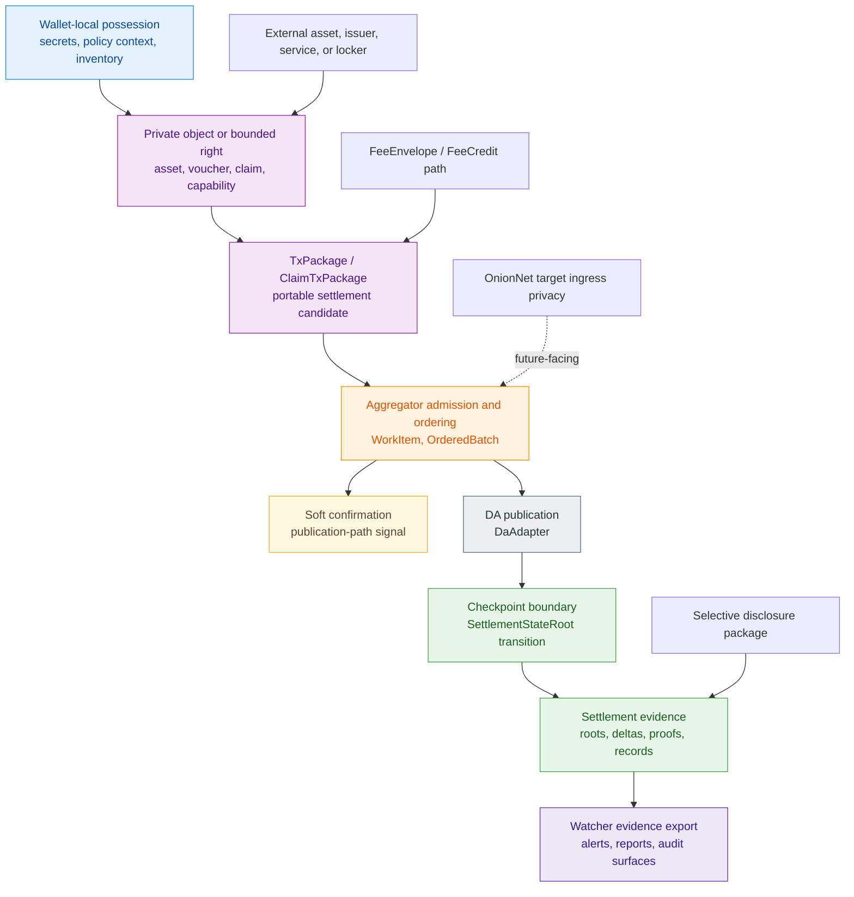
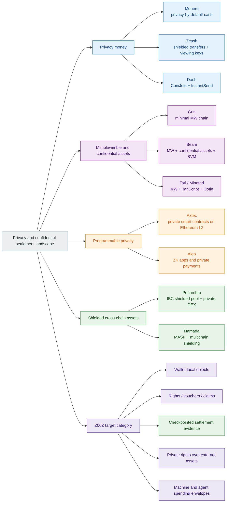
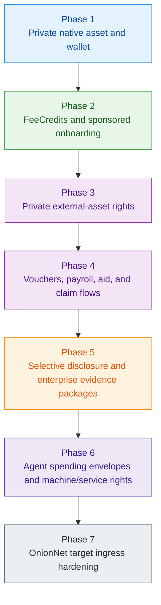

# Z00Z Competitors Research Report

## Source

- Original file: `/home/vadim/Projects/z00z/.wiki/inbox/.processed/Z00Z-Competitors-Research-Report.md`
- Inbox filename: `Z00Z-Competitors-Research-Report.md`

## Imported Content

# Z00Z Competitors Research Report

[TOC]

Version: 2026-06-22

## Key Terms Used In This Report

This report reuses the Z00Z corpus vocabulary rather than inventing a separate market-analysis vocabulary. A fuller shared reference appears in [Z00Z Corpus Terminology And Abbreviations Reference](Z00Z-Corpus-Terminology-Reference.md).

- `AssetLeaf`: The public, checkpointed settlement object that represents one confidential asset right in canonical state.
- `RightLeaf`: The live generalized settlement object for one bounded non-coin right inside the current HJMT settlement family.
- `VoucherLeaf`: The live terminal object for one conditional value claim, distinct from final cash and distinct from authority.
- `SettlementStateRoot`: The live public semantic root for checkpointed settlement state in the current generalized HJMT storage family.
- `Checkpoint`: The validation boundary that commits ordered publication into replay-safe state.
- `Settlement evidence`: The public roots, typed deltas, proofs, and publication artifacts needed to verify a transition.
- `Wallet-local possession`: Ownership material, policy context, and transfer preparation that remain in the wallet before publication.
- `TxPackage`: The wallet-side canonical envelope for ordinary confidential transfer preparation.
- `ClaimTxPackage`: The wallet-side canonical envelope for claim-domain settlement flows.
- `Soft confirmation`: A pre-checkpoint acknowledgement that a package or batch entered the publication path, not final settlement.
- `ReceiverCard`: A receiver-facing routing and approval input package, not a permanent public account address.
- `PaymentRequest`: A wallet-side receive-intent object carrying receiver parameters and handoff context.
- `FeeEnvelope`: The separate processing-support object that defines who pays for publication, relay, or execution and under which limits.
- `External asset right`: A private Z00Z-side right over value, custody, or redemption that may remain anchored outside Z00Z.
- `Selective disclosure`: A scoped viewing or audit mode that reveals only the evidence required for a role or policy purpose.
- `OnionNet`: The target anonymous-ingress fabric for runtime-bound traffic; this report treats it as a future-facing transport privacy layer, not as a current production guarantee.

## 1. Executive Thesis

Z00Z should not be positioned as a direct replacement for Monero, Zcash, Dash, Beam, Grin, or Tari in their current roles as privacy-oriented payment networks. Those projects already occupy known categories: privacy-by-default cash, shielded transfers, CoinJoin-style consumer privacy, Mimblewimble confidential coins, confidential assets, and programmable confidential-asset platforms.

The stronger Z00Z category is different: **private rights and settlement infrastructure**. Z00Z is most defensible when it is framed as a protocol for wallet-local private objects, external asset rights, vouchers, claim objects, service rights, agent budgets, and checkpointed settlement evidence. Its competitive wedge is not only that it hides data. Its wedge is that it changes the unit of economic action from a public account or visible contract call to a private object or bounded right that can be prepared locally and settled later.

### 1.1 Core Verdict

| Question | Verdict |
| --- | --- |
| Can Z00Z credibly claim the Monero niche today? | No. Monero has a live privacy-by-default money network, mature user expectations, real liquidity, and years of operational history. Z00Z does not currently have comparable public-network maturity or measured anonymity-set evidence. |
| Can Z00Z credibly claim the Zcash niche today? | Only partially. Zcash is stronger as a deployed shielded-payments system with viewing-key selective disclosure. Z00Z is stronger as a rights-first settlement architecture if it proves execution, wallet UX, and production privacy metrics. |
| Is Tari a relevant competitor? | Yes. Tari is one of the most important narrative competitors because it bridges consumer mining, Mimblewimble-style confidentiality, TariScript, stealth-address improvements, and a digital-asset layer. |
| Is Beam relevant? | Yes. Beam is a direct confidential-asset and confidential-DeFi comparison because it combines Mimblewimble/Lelantus-style privacy, confidential assets, and a VM/DApp story. |
| Are Aztec and Aleo relevant? | Yes, but as programmable privacy platforms rather than privacy-money peers. They pressure any Z00Z claim that sounds like a private VM. |
| Are Penumbra and Namada relevant? | Yes. They are direct comparisons for multi-asset shielded pools and cross-chain privacy, especially where Z00Z discusses external asset rights. |
| Where is Z00Z strongest? | Offline-first private settlement, private external-asset rights, policy-shaped money, vouchers, selective disclosure, agent spending envelopes, fee credits, and machine/service rights. |
| Where is Z00Z weakest today? | Live-network proof, wallet simplicity, measured anonymity, independent audits, liquidity, bridge/custody risk, and market category clarity. |

### 1.2 Non-Claims

This report does not claim that Z00Z already has:

- a live public mainnet with Monero-scale or Zcash-scale operational history;
- a production anonymity set that has been measured under adversarial observation;
- a universal private smart-contract VM;
- a production-ready OnionNet privacy network;
- completed cross-chain custody, issuer, or locker infrastructure;
- universal offline bearer-cash finality before checkpoint reconciliation;
- a finished legal or regulatory outcome for every deployment model.

The report does claim that the current corpus and codebase support a disciplined strategic thesis: Z00Z should compete as a **private object, rights, and settlement layer**, not as a generic privacy coin.

## 2. Source Basis And Claim Discipline

The report uses four source layers.

| Source layer | Role in this report | Claim discipline |
| --- | --- | --- |
| Z00Z whitepaper corpus | Defines the internal architecture, terms, non-claims, use cases, and legal/economic boundaries | Treated as authoritative for Z00Z intent and vocabulary |
| Current repository code | Confirms which symbols and boundaries exist as implementation surfaces | Used to avoid stale symbols and concept drift |
| Official competitor documentation | Defines competitors in their own terms | Used for comparative claims about external projects |
| Primary regulatory references | Grounds high-level compliance pressure | Used only for broad market-risk framing, not jurisdiction-specific legal advice |

### 2.1 Codebase-Grounded Z00Z Surfaces

The current repository supports the following live or explicit implementation surfaces relevant to competitive positioning.

| Surface | Current meaning | Competitive relevance | Claim boundary |
| --- | --- | --- | --- |
| `AssetLeaf` | Public checkpointed object for confidential asset settlement | Supports the private-object settlement thesis | Does not by itself prove production privacy or network maturity |
| `RightLeaf` | Narrow terminal object for bounded non-coin settlement rights | Supports the rights-first category claim | Must not be widened into a universal private VM claim |
| `VoucherLeaf` | Conditional value object with backing, policy, lifecycle, and validity fields | Supports policy-shaped money and voucher comparisons | Voucher product UX and issuer models remain separate work |
| `FeeEnvelope` | Separate processing-support envelope for settlement transition costs | Supports agent, sponsored publication, and fee-credit narratives | It is not the right itself and should not be described as hidden wallet authority |
| `SettlementStateRoot` | Public semantic settlement-state commitment | Supports checkpointed settlement language | Must not be confused with private backend roots or external DA commitments |
| `TxPackage` | Wallet-side ordinary transfer envelope | Supports wallet-local possession and delayed publication | Package acceptance is not final settlement |
| `ClaimTxPackage` | Wallet-side claim-domain envelope | Supports issuance, redemption, and useful-work claim flows | Claim replay is domain-specific, not a universal nullifier story |
| `ReceiverCard` / `PaymentRequest` | Receiver-native wallet surfaces | Differentiates Z00Z from reusable public-address UX | They still require strict anti-reuse and metadata hygiene |
| `WorkItem` / `OrderedBatch` | Runtime aggregation and ordering surfaces | Supports the staged publication model | Ordering and soft signals are not checkpoint finality |
| `SoftConfirmation` / `PublicationState` | Pre-final publication-path status surfaces | Helps explain operational progress before settlement | Must never be marketed as finality |
| `DaAdapter` | Publication interface for batch data | Supports modular publication architecture | DA does not become settlement authority |
| `EvidenceRecord` / `WatcherService` | Watcher and evidence export surfaces | Supports observability and audit/reporting posture | Watchers observe and export evidence; they do not define validity alone |

### 2.2 Maturity Boundary

Z00Z has a credible architectural surface, but competitive claims must stay maturity-aware. The current code and corpus justify present-tense claims about private settlement objects, wallet envelopes, HJMT settlement vocabulary, aggregation/publication stages, and watcher evidence. They do not justify claims that a full live privacy network, universal private execution platform, or finished cross-chain economy already exists.

This distinction is strategic. Mature privacy competitors win by deployed proof. Z00Z can only win the early narrative by being more precise than competitors, not by over-claiming maturity it has not yet earned.

## 3. Z00Z Competitive Category

Z00Z should be described as a **private rights and checkpointed settlement layer for money, claims, vouchers, external assets, machines, and agents**.

That category is narrower than a universal private VM and broader than a classic privacy coin. The system is not best understood as a public account chain with hidden fields. It is a wallet-local object system whose public layer acts as a settlement notary over replay-safe evidence.

### 3.1 Category Diagram

### 3.2 Category Boundaries

| Category | What it optimizes for | Z00Z relation |
| --- | --- | --- |
| Privacy money L1 | Private payments and fungible money | Z00Z overlaps, but lacks deployed maturity versus Monero, Zcash, Beam, Grin, Dash, and Tari |
| Shielded pool | Confidential transaction pool over one or more assets | Z00Z overlaps, but aims at object/right semantics instead of only shielded transfers |
| Mimblewimble chain | Confidential amounts, aggregation, pruning, compactness | Z00Z borrows the cash-like privacy aspiration but uses checkpointed object settlement, not pure Mimblewimble |
| Private VM / programmable privacy | Private app logic and private/public state composition | Z00Z should not claim this category until proof and execution machinery explicitly widen |
| Shielded cross-chain asset hub | Multi-asset privacy around external assets | Z00Z overlaps strongly, but frames internal movement as private rights over external anchors |
| Private settlement middleware | Wallet-local objects, scoped disclosure, later settlement, external service composition | This is the best Z00Z category |

## 4. Competitive Landscape Map

The privacy market is not one category. Z00Z must be evaluated against multiple competitor families because each one attacks a different part of the same problem.

### 4.1 Landscape Diagram

### 4.2 Competitor Family Summary

| Family | Main competitors | Main advantage over Z00Z today | Main Z00Z counter-position |
| --- | --- | --- | --- |
| Privacy-by-default cash | Monero | Live network, mature default privacy, strong brand | Z00Z is broader than cash: rights, claims, vouchers, external assets, agents |
| Shielded payments | Zcash | zk-SNARK shielded transfers, viewing keys, deployed protocol | Z00Z adds wallet-local object semantics and broader rights settlement |
| Consumer payment privacy | Dash | Simple payment story, InstantSend, CoinJoin UX | Z00Z offers stronger protocol-level privacy ambitions but needs simpler UX |
| Mimblewimble minimalism | Grin | Simplicity, pruning, default privacy | Z00Z offers richer object semantics but with higher complexity |
| Confidential assets and DeFi | Beam | Live confidential assets, Beam VM, privacy-by-default story | Z00Z differentiates on external-asset rights, voucher/right split, checkpoint evidence |
| Consumer mining plus confidential assets | Tari / Minotari | Accessible mining, PoW narrative, TariScript, Ootle asset layer | Z00Z differentiates on private rights over existing assets and agent/offline settlement |
| Private smart contracts | Aztec, Aleo | Strong private-programming narrative and developer focus | Z00Z should avoid VM overclaiming and compete through bounded smart cash |
| Shielded asset hubs | Penumbra, Namada | Multi-asset shielded pools and cross-chain privacy | Z00Z should emphasize rights over external anchors, selective disclosure, and object-local policy |

## 5. Competitor Deep Dives

### 5.1 Zcash

Zcash is the strongest reference point for shielded payments with selective disclosure. Official Zcash documentation describes viewing keys as read-only disclosure keys for shielded address activity, allowing transaction details to be shared with trusted third parties without granting spend authority. The Orchard shielded protocol and Halo 2 lineage give Zcash a deep cryptographic pedigree.

| Dimension | Zcash | Z00Z implication |
| --- | --- | --- |
| Core category | Shielded payments and ZEC monetary network | Do not compete as "Zcash but newer"; compete as private object settlement |
| Privacy mode | Shielded addresses and transparent/shielded flows | Z00Z should avoid optional-privacy leakage by making privacy structural in the wallet-object model |
| Disclosure | Viewing keys and selective disclosure | Z00Z must match or exceed disclosure ergonomics for enterprises and regulated users |
| Programmability | Payment-oriented rather than a broad rights runtime | Z00Z can differentiate through vouchers, rights, claim packages, and external-asset rights |
| Maturity | Deployed protocol with long history | Z00Z must earn comparable proof through testnet, audits, and measured privacy |

**Bottom line:** Zcash is the best comparison when explaining selective disclosure and shielded payments. Z00Z is stronger only if it proves that private rights and wallet-local settlement objects open a broader market than shielded ZEC transfers.

### 5.2 Monero

Monero is the privacy-by-default cash benchmark. Official Monero documentation describes stealth addresses as inherent to Monero privacy and requiring senders to create random one-time addresses for every transaction. Monero RingCT documentation states that Ring Confidential Transactions hide transaction amounts and became mandatory for all transactions after September 2017.

| Dimension | Monero | Z00Z implication |
| --- | --- | --- |
| Core category | Private digital cash | Z00Z should not claim this niche until it has live default privacy and liquidity |
| Privacy mode | Default privacy through stealth addresses, RingCT, ring signatures, and range proofs | Z00Z must not market paper privacy as equivalent to deployed default privacy |
| UX expectation | "Spend private money" is easy to understand | Z00Z must simplify its market message beyond object terminology |
| Compliance fit | Limited native selective disclosure story compared with Zcash-style viewing keys | Z00Z can differentiate through scoped disclosure and evidence packages |
| Maturity | Battle-tested network and brand | Z00Z should compete beside Monero, not against it head-on |

**Bottom line:** Monero is the wrong target for early Z00Z positioning. Z00Z should not say "Monero killer." It should say "private settlement for rights and assets that Monero-style cash does not model."

### 5.3 Dash

Dash is a payment network with CoinJoin privacy and InstantSend. Dash documentation describes CoinJoin as a trustless, non-custodial sequence of transactions that makes tracing transaction history harder, and describes InstantSend as a network feature for near-instant transaction locking.

| Dimension | Dash | Z00Z implication |
| --- | --- | --- |
| Core category | Payment coin with consumer privacy and fast payments | Dash is a weaker privacy comparison but a useful UX comparison |
| Privacy primitive | CoinJoin mixing rounds | Z00Z can claim a deeper privacy architecture only after delivering it |
| Speed/finality UX | InstantSend creates strong retail-payment expectations | Z00Z needs clear distinction between soft confirmation and checkpoint finality |
| Compliance optics | CoinJoin privacy is easier to explain but weaker cryptographically | Z00Z must explain why stronger privacy does not equal managed anonymization |
| Market role | Payments and governance/masternode ecosystem | Z00Z should not spend narrative energy competing with Dash directly |

**Bottom line:** Dash is not the strongest technical privacy competitor. It is a reminder that users understand simple payment flows faster than protocol architecture.

### 5.4 Grin

Grin is the minimal Mimblewimble reference implementation. Grin's official introduction describes Mimblewimble as a blockchain format providing scalability, privacy, and fungibility, with Grin as an open-source implementation focused on privacy by default and compact verification.

| Dimension | Grin | Z00Z implication |
| --- | --- | --- |
| Core category | Minimal privacy and fungibility coin | Grin shows the power of protocol minimalism |
| Privacy model | Mimblewimble confidential transactions and aggregation | Z00Z uses a different object/checkpoint model and must explain why added complexity is worth it |
| Programmability | Intentionally limited | Z00Z can differentiate through rights, vouchers, and external asset semantics |
| UX/commercial reach | Smaller market surface than Monero/Zcash | Z00Z can avoid Grin's narrowness by targeting practical settlement middleware |
| Risk lesson | Simplicity can be a virtue | Z00Z must stage features and avoid product sprawl |

**Bottom line:** Grin is not a complete Z00Z substitute, but it is a warning: privacy protocols benefit from simplicity, and Z00Z must justify every added object class.

### 5.5 Beam

Beam is a direct competitor for confidential assets and confidential DeFi. Official Beam material describes Beam as a Mimblewimble L1 privacy blockchain, emphasizes default privacy, states that Beam supports confidential assets as first-class Layer 1 objects, and describes Beam Shaders and the Beam Virtual Machine for confidential applications.

| Dimension | Beam | Z00Z implication |
| --- | --- | --- |
| Core category | Confidential asset and confidential DeFi chain | Beam is one of the closest product-surface competitors |
| Privacy model | Mimblewimble plus Lelantus-style privacy claims | Z00Z must show why checkpointed rights are better for external-asset workflows |
| Asset model | Native confidential assets | Z00Z can differentiate with private rights over assets that remain outside Z00Z |
| Programmability | Beam VM / shaders / WASM direction | Z00Z should avoid pretending it already has equivalent general programmability |
| UX/commercial story | Wallets, DEX, confidential assets, bridges | Z00Z needs a narrower launch story and clearer object semantics |

**Bottom line:** Beam directly pressures Z00Z's confidential-assets narrative. Z00Z wins only if the market values external-asset rights, vouchers, selective disclosure, and agent/offline settlement more than a confidential DeFi chain narrative.

### 5.6 Tari / Minotari

Tari is one of the most important narrative competitors for Z00Z. Official Tari material positions Tari as a PoW, default-confidential blockchain with accessible consumer mining. Tari RFCs describe a Mimblewimble base layer, TariScript, one-sided payments, stealth addresses, covenants, burn transactions, and the Ootle digital-asset layer.

| Dimension | Tari / Minotari | Z00Z implication |
| --- | --- | --- |
| Core category | Consumer-mined confidential currency plus digital-asset layer | Tari can occupy the "usable privacy + assets" mindshare before Z00Z |
| Privacy model | Mimblewimble with stealth-address improvements for one-sided payments | Z00Z needs stronger language around wallet-local receiver flows and anti-reuse hygiene |
| Programmability | TariScript, covenants, Ootle asset layer | Z00Z should contrast bounded rights and checkpoint evidence with script-driven MW extensions |
| UX | Consumer mining via Tari Universe | Z00Z must translate object-settlement complexity into simple product flows |
| Strategic risk | Tari may become "good enough" privacy plus assets for retail users | Z00Z should target external-asset rights, enterprise settlement, vouchers, and agents first |

**Bottom line:** Tari belongs in every serious Z00Z competitor report. It is closer than Monero to the future narrative of privacy plus programmable assets, but Z00Z can still own a different category if it focuses on private rights over existing assets and offline/agent settlement.

### 5.7 Aztec

Aztec is a programmable privacy competitor. Official Aztec documentation describes it as a privacy-first Ethereum L2 zkRollup for private smart contracts, with private functions, public functions, private state, public state, and L1-L2 messaging. It also states that Aztec is not EVM compatible and uses a privacy-preserving VM.

| Dimension | Aztec | Z00Z implication |
| --- | --- | --- |
| Core category | Private smart contracts on Ethereum L2 | Aztec owns the private-programmability comparison more clearly than Z00Z today |
| State model | Private and public state composition | Z00Z should not overclaim private VM equivalence |
| Developer story | Smart contract developers and Noir/Aztec.nr tooling | Z00Z should target protocol-object workflows before developer-platform messaging |
| Settlement anchor | Ethereum L2 orientation | Z00Z can differentiate through sovereign settlement and externalizable DA |
| Competitive pressure | Makes "private apps" a crowded claim | Z00Z should say "bounded smart cash and rights," not "generic private apps" |

**Bottom line:** Aztec is not a privacy coin competitor. It is the main reason Z00Z must keep its smart-cash boundary precise.

### 5.8 Aleo

Aleo is a zero-knowledge application and payment platform. Official Aleo material positions it around private and compliant payments, default privacy, developer tools, and private applications. It is relevant wherever Z00Z claims programmable privacy or enterprise privacy.

| Dimension | Aleo | Z00Z implication |
| --- | --- | --- |
| Core category | ZK L1 for private applications and payments | Aleo competes with any broad "private app platform" language |
| Developer story | Leo language, developer tooling, private computations | Z00Z should not compete on developer-language breadth until the proof stack warrants it |
| Compliance narrative | "Privacy without compromising compliance" positioning | Z00Z must make selective disclosure and legal architecture concrete |
| Market message | Private payments and apps | Z00Z can differentiate with object settlement, vouchers, and external rights |
| Risk lesson | Private programmability is already a known category | Z00Z should occupy a different, tighter category |

**Bottom line:** Aleo pressures Z00Z from the private-application side. Z00Z should let Aleo own generalized private apps and instead own private rights settlement.

### 5.9 Penumbra

Penumbra is a fully private proof-of-stake network and decentralized exchange for the Cosmos ecosystem. The Penumbra protocol specification describes it as an ecosystem-wide shielded pool for IBC-compatible assets, with private transactions, private delegation, private voting, and ZSwap private DEX mechanics. It also states that Penumbra has no user-account model in the ordinary Cosmos sense.

| Dimension | Penumbra | Z00Z implication |
| --- | --- | --- |
| Core category | Cosmos shielded pool and private DEX | Penumbra is a direct multi-asset privacy competitor |
| Asset model | Any IBC-compatible asset inside a single shielded pool | Z00Z must explain why external-asset rights are more flexible than shielded-pool custody |
| Account model | No ordinary user accounts | This overlaps with Z00Z's no-account posture |
| DeFi story | Private swaps, sealed-bid batch auctions, concentrated liquidity | Z00Z should not lead with DeFi unless product scope supports it |
| Weakness Z00Z can exploit | Entry/exit and ecosystem dependencies remain visible boundaries | Z00Z can emphasize protocol-service separation and scoped disclosure |

**Bottom line:** Penumbra is one of the strongest external-asset privacy references. Z00Z must compare against it honestly, especially for cross-chain privacy.

### 5.10 Namada

Namada is a shielded asset hub centered on a multi-asset shielded pool. Namada documentation describes MASP as a zero-knowledge circuit extending the Zcash Sapling circuit to support arbitrary assets, and describes shielding as a way to seed or retrofit data protection for assets from transparent chains. Namada also warns that users can expose information when transferring into and out of the shielded set via IBC or low-liquidity assets.

| Dimension | Namada | Z00Z implication |
| --- | --- | --- |
| Core category | Multi-asset shielded pool / shielded asset hub | Direct comparison for private external assets |
| Privacy model | MASP across native and non-native assets | Z00Z must show whether rights-over-assets provide better object semantics |
| Cross-chain boundary | IBC shield/unshield flows | Z00Z must be equally honest about bridge, locker, issuer, and exit-edge leakage |
| Incentive model | Rewards for shielded set contribution | Z00Z can compare FeeCredit, bonds, and PoUW economics carefully |
| Risk lesson | Multi-asset privacy still leaks at entry, exit, and low-liquidity edges | Z00Z must build trust-tier and wallet warning UX from the start |

**Bottom line:** Namada is a direct strategic comparison for Z00Z's private external-asset thesis. Z00Z can differentiate only by making private rights, vouchers, claims, and selective disclosure more useful than a shielded pool alone.

## 6. Comparison Matrix

| Project | Primary category | Privacy default | Programmability | External assets | Selective disclosure / audit | Current advantage over Z00Z | Z00Z counter-position |
| --- | --- | --- | --- | --- | --- | --- | --- |
| Z00Z | Private rights and settlement layer | Architectural privacy-first target; live object surfaces but no mature public anonymity set | Bounded smart cash and rights; not a universal private VM | Strong design thesis through private external-asset rights | Scoped disclosure and evidence-package direction | Broader object model and rights settlement | Must prove live privacy, UX, audits, and liquidity |
| Monero | Privacy money | Default privacy | Minimal payment programmability | No primary external-asset layer | Limited native audit disclosure compared with viewing-key systems | Deployed privacy cash maturity | Z00Z should not compete head-on; target rights and external assets |
| Zcash | Shielded payments | Strong shielded mode with transparent/shielded surfaces | Payment-focused | Not primarily multi-asset | Viewing keys | Cryptographic maturity and selective disclosure | Z00Z should broaden disclosure from payments to rights/claims |
| Dash | Fast payments with CoinJoin | Optional CoinJoin-style privacy | Limited | No private external-rights thesis | Conventional payment transparency plus mixing | Simple consumer payment UX | Z00Z can provide deeper privacy but needs better UX |
| Grin | Minimal Mimblewimble coin | Default privacy | Minimal | No | Selective disclosure possible but not broad enterprise audit platform | Simplicity and MW compactness | Z00Z must justify complexity through real use cases |
| Beam | Confidential assets and DeFi | Privacy by default claim | Beam VM / shaders | Confidential and bridged assets | User-controlled disclosure surfaces | Live confidential asset/DeFi stack | Z00Z must differentiate through external rights and vouchers |
| Tari | Consumer-mined confidential chain + assets | Default-confidential narrative | TariScript and Ootle | Digital assets layer | Not the main positioning | Consumer mining and privacy+asset narrative | Z00Z should focus on private rights over existing assets |
| Aztec | Private Ethereum L2 | App-dependent private/public state | Strong private smart contracts | Ethereum-linked | App-specific | Developer platform and private VM narrative | Z00Z should avoid private-VM claims and own bounded rights |
| Aleo | ZK applications and private payments | Default privacy positioning | Strong private application stack | App-dependent | Compliance positioning | Private apps and developer tooling | Z00Z should focus on settlement objects and evidence |
| Penumbra | Cosmos shielded pool and private DEX | Fully private zone model | Protocol-level DEX/staking/governance features | IBC assets | View-key-like disclosure patterns by design area | Cross-chain shielded pool with private DEX | Z00Z must explain rights-over-assets advantage |
| Namada | Multi-asset shielded pool | Shielded-pool model | Protocol-specific shielding and incentives | Native and non-native assets | Asset and account disclosure through MASP tooling | Shielded asset hub narrative | Z00Z differentiates through rights, vouchers, and service composition |

## 7. Where Z00Z Can Win

Z00Z can win only if it avoids the wrong category fight. Its strongest wedge is not "better private coin." It is **private rights settlement for objects that ordinary privacy coins do not model well**.

| Wedge | Why it matters | Competitors least prepared for it |
| --- | --- | --- |
| Private external-asset rights | Users often want private movement of existing stablecoins, claims, or custody-linked assets, not a new coin | Monero, Grin, Dash, Zcash |
| Vouchers and policy-shaped money | Expiry, refund, partial redeem, merchant scope, and conditional value are better as private objects than public contract state | Monero, Zcash, Grin, Dash |
| Rights distinct from value | Authority objects can move without being confused with final cash | Beam, Tari, public smart-contract chains |
| Wallet-local possession before settlement | Offline checks, delayed publication, and local acceptance create cash-like behavior | Public account chains, private VMs, shielded pool systems |
| Selective disclosure as a first-class settlement surface | Enterprises need privacy plus audit, not full public exposure or total opacity | Monero, Grin, Dash |
| Fee envelopes and fee credits | Agents, sponsored wallets, and offline objects need bounded fee paths without full wallet authority | Most privacy coins |
| Agent and machine rights | Autonomous actors need private budget rights, tool credits, compute credits, access rights, and settlement receipts | Privacy coins and many private app platforms |
| Protocol-service separation | External chains, issuers, lockers, DA layers, and wallets can remain outside core settlement truth | Monolithic L1 narratives |

## 8. Where Z00Z Can Lose

The risks are not mainly theoretical. They are execution and category risks.

| Risk | Why it can beat Z00Z | Primary mitigation |
| --- | --- | --- |
| No live measured anonymity set | Privacy markets trust deployed evidence more than architecture | Public testnet, adversarial measurement, traffic analysis reports, independent review |
| Overbroad narrative | "Privacy coin + rights + agents + vouchers + cross-chain + OnionNet" can sound unfocused | Lead with private rights settlement, stage the rest |
| Wallet complexity | Users can mishandle rights, vouchers, payment requests, or trust tiers | Separate wallet surfaces for cash, vouchers, rights, claims, and external asset families |
| Bridge and issuer risk | External asset rights inherit external custody and redemption assumptions | Trust-tier labels, reserve proof integrations, issuer-specific disclosures |
| Soft confirmation confusion | Users may treat pre-checkpoint progress as final settlement | UI and docs must clearly separate admitted, ordered, posted, accepted, and finalized |
| Private VM overclaiming | Aztec and Aleo are stronger if Z00Z sounds like a private app platform | Keep the smart-cash boundary explicit |
| Tari and Beam narrative pressure | They offer more familiar privacy+asset stories | Emphasize external rights, vouchers, and selective disclosure |
| Regulatory optics | "Privacy coin" framing can trigger exchange and banking resistance | Use legal architecture vocabulary: neutral protocol, scoped disclosure, evidence packages |
| Governance and treasury skepticism | Large treasury and tokenomics complexity can look like overhang | Rule-bound treasury, caps, vesting, transparent compartments, no hype-farming narrative |

## 9. Strategic Positioning

The recommended market sentence is:

> Z00Z is a private rights and settlement layer for cash-like objects, external asset rights, vouchers, claims, and agent budgets, with checkpointed public evidence and optional scoped disclosure.

The discouraged market sentence is:

> Z00Z is the next Monero or a better Zcash.

### 9.1 Product Narrative Sequence

### 9.2 Messaging Rules

| Say | Do not say |
| --- | --- |
| Private rights and settlement layer | Monero killer |
| Wallet-local objects plus checkpointed settlement evidence | Magic offline finality |
| Selective disclosure and evidence packages | Compliance solved by privacy |
| External systems hold assets; Z00Z moves private rights | Z00Z eliminates all custody and bridge risk |
| Bounded smart cash and rights | Universal private VM |
| OnionNet target ingress privacy | Full production network anonymity today |
| Soft confirmation before checkpoint finality | Instant final settlement |

## 10. Risk Register And Mitigation Plan

| Risk area | Severity | Why it matters | Concrete mitigation |
| --- | --- | --- | --- |
| Privacy measurement | Critical | Architecture without measurement will not beat mature privacy networks | Publish testnet privacy metrics, anonymity-set methodology, metadata leakage reports |
| Wallet safety | Critical | Rights and vouchers can confuse users if UX flattens object types | Separate inventory views; object-type warnings; anti-reuse defaults; policy preview |
| Checkpoint finality | Critical | Soft confirmations may be misunderstood | State-machine status UI tied to `PublicationState`; no "final" wording before checkpoint |
| External asset trust | Critical | Lockers, issuers, and bridges can fail outside Z00Z | Trust tiers, reserve attestations, issuer disclosures, route-specific risk labels |
| Rights runtime scope | High | Overbroad rights claims invite security failures | Stage `AssetLeaf`, `VoucherLeaf`, `RightLeaf` use cases; avoid universal VM language |
| Fee abstraction | High | Sponsored publication can become opaque if not bounded | Keep `FeeEnvelope` explicit; expose payer, sponsor, budget, expiry, and failure policy |
| OnionNet maturity | High | Transport privacy is easy to overstate | Treat OnionNet as target architecture until contracts, tests, and measurements are frozen |
| Regulatory and exchange access | High | Privacy branding can limit infrastructure relationships | Use neutral protocol and selective-disclosure framing; keep service roles outside core |
| Treasury/governance optics | Medium | Incentive design may look discretionary | Use rule-bound compartments, spend caps, vesting, and public budget reports |
| Competitor mindshare | Medium | Tari, Beam, Aztec, Aleo, Penumbra, and Namada can own adjacent narratives | Keep category sharp: private object and rights settlement |

## 11. Regulatory And Adoption Scenarios

This report is not legal advice. It does, however, need to account for market behavior around privacy infrastructure. FATF materials on virtual assets and VASPs create broad expectations around originator and beneficiary information for regulated transfer businesses. That does not make every self-custodial protocol a VASP, but it does shape how exchanges, custodians, banks, and regulated counterparties evaluate privacy systems.

### 11.1 Favorable Scenario

Z00Z launches as a neutral privacy protocol with strong self-custody boundaries, evidence packages, selective disclosure, and clear protocol-service separation. Early integrations focus on private payroll, contractor payments, voucher distribution, aid rails, private external stable-asset rights, and enterprise settlement. In this scenario, Z00Z is compared less to Monero and more to privacy-preserving settlement middleware.

### 11.2 Constrained Scenario

The protocol works, but centralized exchanges and custodians remain cautious. Z00Z grows through direct self-custody wallets, partner issuers, service integrations, and enterprise pilots rather than through broad exchange-led retail distribution. Liquidity develops more slowly, but the product wedge remains intact.

### 11.3 Hostile Scenario

The market frames Z00Z as a privacy coin with complex bridge and treasury surfaces. Exchanges and banking partners refuse or delay support. The correct response is not to weaken the protocol core into public account transparency. The correct response is to double down on neutral protocol boundaries, optional disclosure-capable wallets, semi-permissioned pilots, external issuer responsibility, and narrow launch surfaces.

## 12. Research Scorecard

Scores are comparative research judgments from 1 to 5, where 5 is strongest.

| Project | Privacy-money maturity | Programmability | External-asset fit | Selective disclosure fit | Z00Z threat level | Notes |
| --- | ---: | ---: | ---: | ---: | ---: | --- |
| Monero | 5 | 1 | 1 | 1 | 4 | Strongest cash competitor, weakest rights comparison |
| Zcash | 4 | 2 | 2 | 5 | 4 | Strong shielded payments and disclosure benchmark |
| Dash | 3 | 1 | 1 | 2 | 2 | UX/payment reminder more than deep privacy peer |
| Grin | 3 | 1 | 1 | 2 | 2 | Minimal MW reference; simplicity pressure |
| Beam | 4 | 4 | 3 | 3 | 4 | Strong confidential-asset and DeFi comparison |
| Tari | 3 | 4 | 3 | 2 | 5 | Highest narrative threat for privacy plus assets |
| Aztec | 2 | 5 | 3 | 3 | 4 | Strong private app/VM competitor |
| Aleo | 3 | 5 | 3 | 4 | 4 | Strong private app and compliance-positioning competitor |
| Penumbra | 4 | 3 | 5 | 3 | 5 | Strongest Cosmos shielded-asset comparison |
| Namada | 4 | 3 | 5 | 3 | 5 | Strongest MASP/shielded asset hub comparison |
| Z00Z target | 2 | 3 | 5 | 5 | n/a | Strong architecture, weaker deployed proof |

## 13. Recommendations

### 13.1 Positioning Recommendations

1. Position Z00Z as private rights and settlement infrastructure, not as a new privacy coin.
2. Treat Tari, Beam, Penumbra, and Namada as the most important near-category competitors, not only Monero and Zcash.
3. Use Monero as the default-privacy cash benchmark and Zcash as the selective-disclosure benchmark.
4. Use Aztec and Aleo as boundaries against private-VM overclaiming.
5. Lead the market story with private external-asset rights, vouchers, selective disclosure, and agent/machine rights only after the native asset and wallet flow are credible.

### 13.2 Product Sequencing Recommendations

| Priority | Deliverable | Why it matters competitively |
| --- | --- | --- |
| 1 | Simple private native asset wallet flow | Proves the base cash-like experience before complex rights |
| 2 | Clear publication-state and checkpoint-finality UX | Prevents soft-confirmation confusion |
| 3 | FeeCredit and `FeeEnvelope` user story | Reduces onboarding friction and prepares agent/service use |
| 4 | First private external-asset right with explicit trust tier | Creates the strongest non-Monero wedge |
| 5 | Voucher MVP with partial redeem, refund, and expiry | Proves policy-shaped money without universal VM claims |
| 6 | Selective disclosure package | Supports enterprise and legal-architecture positioning |
| 7 | Agent spending envelope pilot | Opens the forward-looking machine/agent market after core credibility |

### 13.3 Proof Obligations Before Strong Public Claims

| Claim | Minimum proof required before using it strongly |
| --- | --- |
| "Private by default" | Default wallet behavior, no reusable public account surface, audited metadata leakage analysis |
| "Offline-first" | Local acceptance flow, conflict handling, checkpoint reconciliation, liability policy, user warnings |
| "Cross-chain private assets" | Working locker/issuer path, reserve disclosure, trust tiers, redemption tests |
| "Selective disclosure" | Concrete evidence package, reviewer flow, disclosure minimization tests |
| "Agent spending envelopes" | Bounded fee and action policy, replay handling, audit path, revocation/expiry flow |
| "OnionNet privacy" | Frozen route contracts, replay ledger, witness distribution, adversarial measurement |

## 14. Conclusion

The archived draft's core thesis is correct but needed a stronger corpus-quality form: Z00Z should not try to win by claiming to be the next Monero, Zcash, Dash, Beam, Grin, or Tari. It should win by defining a more precise category that those systems only partially cover: private wallet-local objects, external asset rights, vouchers, claim flows, scoped disclosure, fee envelopes, machine rights, and agent spending envelopes that settle through checkpointed public evidence.

That category is promising, but it is not self-proving. Z00Z must demonstrate live privacy, wallet safety, settlement correctness, auditability, and measured metadata resistance before the market will treat its architecture as more than an elegant design. The right competitive posture is therefore disciplined ambition: **do not overclaim the privacy-coin niche; prove the private-rights settlement niche.**

## Appendix A. External Source Map

The following external sources were used for competitor positioning. Official and primary sources were preferred.

| Project / topic | Source |
| --- | --- |
| Zcash viewing keys and selective disclosure | [Zcash Basics](https://zcash.readthedocs.io/en/master/rtd_pages/basics.html) |
| Zcash Orchard shielded protocol | [ZIP 224: Orchard Shielded Protocol](https://zips.z.cash/zip-0224) |
| Monero stealth addresses | [Monero Moneropedia: Stealth Address](https://www.getmonero.org/resources/moneropedia/stealthaddress.html) |
| Monero RingCT | [Monero Moneropedia: Ring CT](https://www.getmonero.org/resources/moneropedia/ringCT.html) |
| Monero Bulletproofs | [Monero Moneropedia: Bulletproofs](https://web.getmonero.org/resources/moneropedia/bulletproofs.html) |
| Dash CoinJoin and InstantSend | [Dash Documentation: CoinJoin and InstantSend](https://docs.dash.org/en/stable/docs/user/wallets/dashcore/coinjoin-instantsend.html) |
| Grin and Mimblewimble | [Grin Introduction to Mimblewimble and Grin](https://github.com/mimblewimble/grin/blob/master/doc/intro.md) |
| Beam ecosystem, confidential assets, BVM | [Beam Documentation: Ecosystem](https://www.beam.mw/docs/ecosystem/) and [Beam website](https://www.beam.mw/) |
| Tari overview | [Tari RFC-0001: Overview](https://rfc.tari.com/RFC-0001_overview) |
| Tari stealth addresses | [Tari RFC-0203: Stealth Addresses](https://rfc.tari.com/RFC-0203_StealthAddresses) |
| Tari consumer mining and default-confidential positioning | [Tari website](https://tari.com/) |
| Aztec private smart contracts | [Aztec Documentation](https://docs.aztec.network/) |
| Aleo private payments and applications | [Aleo website](https://aleo.org/) and [Aleo Developer Documentation](https://developer.aleo.org/) |
| Penumbra shielded cross-chain protocol | [Penumbra Protocol Specification](https://protocol.penumbra.zone/main/index.html) |
| Namada MASP | [Namada Documentation: The MASP](https://docs.namada.net/users/shielded-accounts) |
| Namada shielding and entry/exit leakage | [Namada Documentation: Shielding](https://docs.namada.net/introduction/privacy) |
| FATF virtual assets and VASP policy context | [FATF Virtual Assets](https://www.fatf-gafi.org/en/topics/virtual-assets.html) and [FATF Updated Guidance for VA/VASPs](https://www.fatf-gafi.org/content/dam/fatf-gafi/guidance/Updated-Guidance-VA-VASP.pdf.coredownload.inline.pdf) |

## Appendix B. Internal Corpus Source Map

| Z00Z source | Why it matters for this report |
| --- | --- |
| [Z00Z Main Whitepaper](Z00Z-Main-Whitepaper.md) | Canonical protocol thesis: wallet-local possession, `AssetLeaf`, `TxPackage`, checkpoints, settlement evidence |
| [Z00Z Litepaper](Z00Z-Litepaper.md) | Short public summary and current maturity boundary |
| [Z00Z Uniqueness Whitepaper](Z00Z-Uniqueness-Whitepaper.md) | Category claim: private rights, private settlement, wallet-local objects |
| [Z00Z Use Cases Whitepaper](Z00Z-UseCases-Whitepaper.md) | Use-case families: offline cash, external assets, policy-shaped money, organizational settlement, aid, agent rights |
| [Z00Z Smart Cash](Z00Z-Smart-Cash-Whitepaper.md) | Boundary against universal private-VM overclaiming |
| [Z00Z Cross-Chain Integration Whitepaper](Z00Z-Cross-Chain-Integration-Whitepaper.md) | External systems hold assets; Z00Z privately moves rights |
| [Assets, Rights, And Vouchers Whitepaper](Z00Z-Assets-Rights-Vauchers-Whitepaper.md) | Clean object split between `Asset`, `Voucher`, and `Right` |
| [Z00Z Agentic Offline Economy Whitepaper](Z00Z-Agentic-Offline-Economy-Whitepaper.md) | Machine and agent right objects, `FeeEnvelope`, spending envelopes |
| [Z00Z OnionNet Whitepaper](Z00Z-OnionNet-Whitepaper.md) | Future-facing anonymous ingress target and non-claims |
| [Z00Z Legal Architecture Whitepaper](Z00Z-Legal-Architecture-Whitepaper.md) | Neutral protocol, technical impossibility, selective disclosure, service-layer boundaries |
| [Z00Z Marketing Strategy](Z00Z-Marketing-Srategy.md) | Public narrative, channel mix, rollout order, and claim-discipline rules for market-facing communication |
| [Z00Z Tokenomics and Incentives Whitepaper](Z00Z-Tokenomics-Incentives-Whitepaper.md) | Fee credits, operator bonds, treasury compartments, bootstrap economics |
| [Z00Z HJMT Design](tech-papers/done/Z00Z-HJMT-Design.md) | `SettlementPath`, `SettlementStateRoot`, `RightLeaf`, `VoucherLeaf`, HJMT storage contract |

## Appendix C. Claim Ledger

| Claim | Status in this report | Reason |
| --- | --- | --- |
| Z00Z has live code surfaces for `RightLeaf`, `VoucherLeaf`, `FeeEnvelope`, `SettlementStateRoot`, aggregation, publication states, DA adapter, and watcher evidence | Present-tense implementation claim | Confirmed by repository code and current corpus terminology |
| Z00Z is a live market competitor to Monero in deployed privacy money | Rejected | Z00Z lacks comparable public mainnet maturity, liquidity, and measured anonymity |
| Z00Z can create a broader category than privacy money | Strategic thesis | Supported by corpus and current object/right implementation surfaces |
| Z00Z already has a universal private VM | Rejected | Smart Cash paper explicitly narrows current claim to bounded smart cash and rights |
| OnionNet already provides production network anonymity | Rejected | OnionNet paper treats it as target architecture; current crate surface remains future-facing |
| External asset privacy eliminates bridge and issuer risk | Rejected | Cross-chain paper separates protocol guarantees from external custody, issuer, and redemption assumptions |
| Selective disclosure is strategically important | Accepted | Supported by Zcash comparison, Z00Z legal architecture, and Z00Z evidence-package direction |
| Tari must be included as a key competitor | Accepted | Tari occupies the privacy plus programmable/digital-asset narrative closest to several Z00Z claims |
