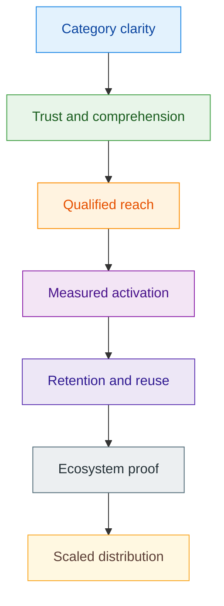
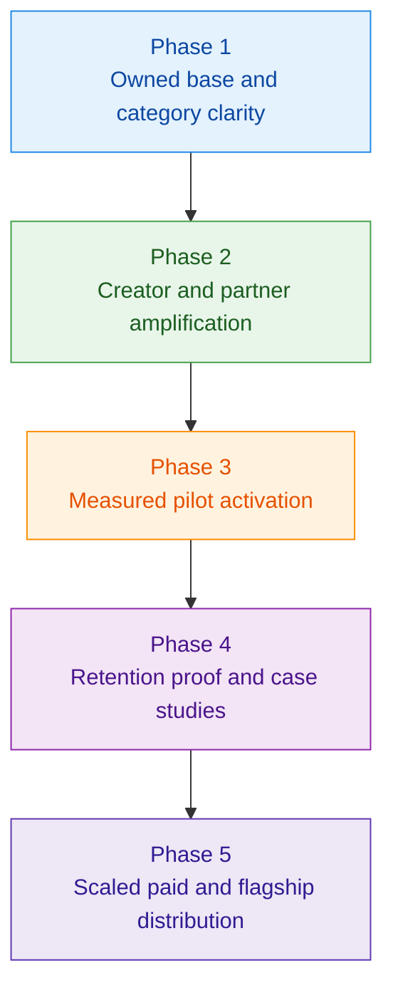

# Z00Z Marketing Strategy

## Source

- Original file: `/home/vadim/Projects/z00z/.wiki/inbox/.processed/Z00Z-Marketing-Srategy.md`
- Inbox filename: `Z00Z-Marketing-Srategy.md`

## Imported Content

# Z00Z Marketing Strategy

[TOC]

Version: 2026-06-22

This paper integrates the relevant market research directly into a public strategy that is consistent with the present Z00Z corpus, the current implementation boundary, and the legal-architecture claim discipline. It is written for steward, communications, ecosystem, partnership, and growth teams. After reading it, a new reader should be able to choose the right public narrative, channel mix, launch sequence, and review rules for Z00Z without drifting into product, legal, or maturity claims the protocol should not make. It is intended to stand on its own without requiring the earlier market-research draft.

## 1. Executive Thesis

Z00Z should not enter the market as "another privacy coin" and should not present itself as a generic "private smart-contract platform." **Its strongest category is a private rights and settlement layer for cash-like objects, external asset rights, vouchers, claims, and agent budgets**. The marketing system must therefore lead with architectural clarity, use-case proof, and boundary discipline rather than with price talk, generic token hype, or operator-style platform claims.

The research basis distilled into this paper supports a simple operational rule. Early Z00Z marketing should be built on owned knowledge surfaces first, creator and partner distribution second, and measurable activation loops third. Broad paid-media scale should come only after the project has a stable narrative, a clean funnel, and evidence that qualified users retain after first contact.

| Question | Recommended answer |
| --- | --- |
| What should Z00Z be marketed as? | A private rights and settlement layer with wallet-local possession and checkpointed public evidence |
| What should Z00Z not be marketed as? | A Monero replacement, a universal private VM, an anonymous stablecoin stack, or an official exchange surface |
| What is the best default launch stack? | Owned channels, creator or partner amplification, and one measurable activation loop |
| What is YouTube for? | Trust, explainers, archival thought leadership, demos, and long-shelf-life education |
| When should paid ads matter? | After the message, funnel, compliance posture, and retention signals are already proven |
| What is the main control rule? | Every public claim must preserve neutral protocol, self-custody, optional disclosure, and independent-issuer boundaries |

### 1.1 Evidence Basis And Scope

This strategy already absorbs the market-research findings that actually change channel and spend decisions. It does not depend on a separate reader knowing the earlier research draft.

| Evidence layer | What the research showed | Why it changes the Z00Z strategy |
| --- | --- | --- |
| Official channel patterns | Serious crypto ecosystems usually converge on one canonical steward, foundation, or issuer-linked education surface | Z00Z should keep one canonical long-form channel and one canonical announcement anchor |
| Channel effectiveness | Different channels win for different objectives rather than one channel winning universally | Z00Z should map channels to category clarity, trust, reach, activation, and retention separately |
| Case-study evidence | Avalanche, Arbitrum, TON, and Notcoin each grew through a different mechanism | Z00Z should choose the growth mechanism by objective, not by fashion |
| Budget economics | Owned media, selective creator seeding, and bounded activation loops usually beat early paid-media overreach | Z00Z should stage spend rather than front-load prestige or ad volume |

This paper intentionally keeps the patterns and drops the asset-by-asset survey inventory. For strategy, the pattern is what matters. If Z00Z later makes comparative public claims about another project's official channels, verification status, or latest activity, those details should be re-checked directly against project-owned surfaces because channel ownership and visibility can drift.

## 2. Strategic Positioning

The recommended category sentence is:

> **Z00Z is a private rights and settlement layer for cash-like objects, external asset rights, vouchers, claims, and agent budgets, with wallet-local possession and checkpointed public evidence.**

This sentence is stronger than broader alternatives because it matches the existing corpus. It preserves the current wallet-local possession model, the checkpoint settlement boundary, the selective-disclosure direction, and the protocol-versus-service split already documented elsewhere.

### 2.1 What The Market Message Must Preserve

| Positioning axis | What Z00Z should say | Why it works |
| --- | --- | --- |
| Core category | Private rights and settlement layer | Matches the current corpus and separates Z00Z from ordinary privacy-coin narratives |
| Wallet model | Self-custodial wallet-local possession | Reinforces that private meaning starts in the wallet rather than in a public account table |
| Settlement model | Checkpointed public evidence and finality | Prevents soft operational progress from being confused with final settlement |
| Privacy model | Privacy by design with scoped disclosure | Strong enough for serious users without overclaiming universal invisibility |
| Cross-chain posture | External systems hold assets; Z00Z privately moves internal rights | Preserves the boundary between protocol privacy and third-party custody or redemption risk |
| Agent posture | Bounded rights and budgets for machines and agents | Gives Z00Z a differentiated future-facing wedge without claiming a universal private VM |

### 2.2 Non-Claims

This strategy should explicitly avoid implying that Z00Z already has:

- a mature public anonymity set comparable to long-running privacy-money networks;
- a universal hidden-state execution platform;
- an official exchange, bridge, marketplace, or anonymous stablecoin stack;
- frictionless cross-chain trust with no locker, issuer, or redemption risk;
- unconditional offline finality before checkpoint reconciliation;
- full production transport anonymity across all network conditions.

## 3. Audience And Outcome Model

Z00Z should optimize first for qualified readers and integrators, not for the broadest possible retail traffic. The protocol is easiest to defend when it is introduced through precise architecture, concrete use cases, and visible boundary discipline.

| Audience | What they need to believe | Best proof surface | Primary call to action |
| --- | --- | --- | --- |
| Builders and integrators | Z00Z is a coherent new settlement category, not marketing fog | Litepaper, main papers, technical demos, architecture explainers | Join design-partner or integration pipeline |
| Privacy-sensitive organizations | Privacy can coexist with scoped audit and operational accountability | Legal and strategy papers, selective-disclosure explanation, use-case memos | Request pilot or structured workshop |
| External issuers, lockers, and service operators | Z00Z does not erase their responsibilities or misstate trust boundaries | Cross-chain and legal corpus, partner briefings | Explore controlled pilot lanes |
| Researchers, analysts, and media | Z00Z is not just another "privacy coin" headline | Competitor framing, category diagrams, corpus map | Reuse the correct category language |
| Early community and contributors | The project has a sharp thesis and visible progress path | Owned channels, videos, AMAs, short explainers | Follow, share, join community, test demos |
| Future enterprise and regulated actors | The protocol does not require operator-style overclaiming | Whitepaper corpus, claim discipline, disclosure model | Continue due diligence without immediate rejection |

The de-prioritized audience is the purely speculative, hype-driven traffic segment that rewards maximalist promises but does not retain once a more precise explanation appears. Z00Z should prefer smaller, higher-signal attention over broader low-trust reach in its early cycles.

## 4. Market Objective Hierarchy

The source research makes clear that crypto marketing works only when channel choice follows objective choice. Z00Z therefore needs an explicit order of objectives.

This order matters because Z00Z has more to lose from category confusion than from under-spending on awareness. A bigger funnel built on the wrong sentence will create harder downstream corrections than a smaller funnel built on the right one.

### 4.1 Objective-To-Channel Fit

The most useful research conclusion is not "which channel is best?" but "best for what?"

| Immediate KPI | Strongest channel family | Why it usually wins | Z00Z discipline |
| --- | --- | --- | --- |
| Category clarity and trust | Owned documents, YouTube, and canonical social surfaces | The project controls message quality, objection handling, and replayable education | Use these before aggressive amplification |
| Fast qualified reach | Creators, partners, AMAs, and co-marketing | Borrowed trust translates architecture faster than generic paid ads | Use only after the core category sentence is stable |
| Wallet actions, demo starts, claims, or other measurable activation | Quests, referrals, pilot programs, credits, and other bounded incentives | Crypto users often respond more to behavior-linked rewards than to pure ad exposure | Measure retention after the reward window, not only peak activity |
| Institutional credibility | Research, PR, flagship events, and analyst-facing materials | These channels improve legitimacy with exchanges, enterprises, and policy-aware readers | Spend only when a real follow-up path exists |

## 5. Channel Strategy

The underlying research points to a stable general rule for crypto: one channel is almost never enough. Different channel families solve different problems. Z00Z should therefore run a layered channel system instead of trying to find one "best" channel.

| Channel family | Best objective | Role in Z00Z strategy | Main risk | Readiness gate |
| --- | --- | --- | --- | --- |
| Owned documents and site surfaces | Category clarity and trust | Canonical source of truth, long-shelf-life explanations, conversion anchor for every other channel | Orphaned docs, inconsistent language, stale claims | Core corpus, short public summary, and public FAQ are aligned |
| YouTube | Trust, education, institutional readability | Long-form explainers, visual walkthroughs, partner demos, archival narrative | Becoming a hype or market-commentary channel | One canonical channel, visible steward ownership, editorial discipline |
| X, Telegram, and Discord | Ongoing attention and community rhythm | Narrative distribution, event routing, discussion, support handoff | Fast drift into ambiguous or overhyped language | Message formulas and moderation rules are explicit |
| Creator and partner distribution | Fast qualified reach | Translate architecture into audience-native language and earn borrowed trust | Misaligned creators, weak disclosure, speculative framing | Approved narrative kit and partner review flow exist |
| PR, research, and events | Credibility and partnership density | Reach analysts, media, exchanges, enterprises, and policy-aware readers | Prestige spend without measurable outcome | Strong narrative, working demo, and follow-up pipeline exist |
| Quests, referrals, and incentives | Measured activation | Convert qualified attention into visible user action and test retention | Sybil abuse, mercenary behavior, false growth | Product action is measurable and retention can be tracked |
| Paid media | Controlled amplification | Scale what already converts and reinforce key launches | Policy friction, weak conversion, expensive learning | Funnel and message are proven before spend is scaled |

### 5.1 Owned Knowledge Surfaces Come First

The whitepaper corpus is the trunk of the marketing system. Public copy, social threads, videos, decks, and partner briefs should all compress the same core narrative rather than inventing parallel stories. If the corpus says "private rights and settlement layer" while the channel copy says "anonymous super-app for stablecoins and trading," the copy is not growth. It is documentary self-sabotage.

The minimum owned base should include:

- one short public overview that a new reader can finish quickly;
- one category explanation that separates Z00Z from privacy coins and private-VM narratives;
- one legal-boundary summary for public claims and service separation;
- one use-case ladder showing why vouchers, external assets, claims, and agent budgets belong to the same architecture;
- one visible place where outside channels can link back to canonical text.

### 5.2 Why YouTube Matters

The source research shows a pattern across serious crypto ecosystems: the more educational, enterprise-facing, or builder-facing the protocol becomes, the more useful a canonical video surface becomes. That does not mean YouTube is the single best growth channel. It means YouTube is usually the best archive for trust-building explanations and reusable narrative assets.

For Z00Z, YouTube should not be treated as a price-promotion lane. It should be the long-form audiovisual layer of the corpus.

| YouTube use | What it should contain | What it should avoid |
| --- | --- | --- |
| Protocol explainers | Clear category framing, diagrams, thesis, maturity boundary | Generic "future of crypto" hype with no Z00Z-specific meaning |
| Use-case walkthroughs | Offline-first cash, vouchers, external-asset rights, scoped disclosure, agent budgets | Overclaiming live production features that remain target architecture |
| Partner and builder demos | Controlled demonstrations and integration stories | Ambiguous "official partner" language where no formal relationship exists |
| Founder or architect interviews | Long-form reasoning, objections, non-claims, tradeoffs | Trading commentary, price narratives, market predictions |
| Event recaps and clips | Talks, panels, design sessions, short derivative clips | Volume-first content with no durable educational value |

### 5.3 Officiality Rule For Video And Social Surfaces

The research also points to another pattern: serious ecosystems usually converge on one canonical channel, either foundation-led, steward-led, or clearly issuer-led. Ambiguous multi-channel "semi-official" sprawl weakens trust.

Z00Z should therefore maintain:

- one clearly canonical long-form video channel;
- one clearly canonical public-doc anchor;
- one clearly canonical announcement surface;
- explicit differentiation between official steward surfaces, independent community surfaces, and third-party commentary.

The safest naming convention is descriptive rather than promotional. The channel should look like a protocol communications surface, not like a trader, exchange, or market-operator brand.

| Ecosystem pattern | Observed tendency | Z00Z implication |
| --- | --- | --- |
| Foundation-led or builder-led ecosystems | Strong canonical channel for explainers, talks, and ecosystem education | Z00Z should follow this path |
| Community-first or meme-first ecosystems | Weaker canonical video ownership, stronger dependence on unofficial voices | Z00Z should avoid this pattern in early category formation |
| Issuer-linked or company-linked assets | Parent company channel often becomes the practical official surface | If Z00Z ever uses this model for a specific surface, the role boundary must stay explicit |

### 5.4 Creator And Partner Distribution

Creator and partner distribution is the best fast-reach layer once the message is stable. It translates architecture for audiences that will not start from a long whitepaper. But Z00Z should be selective. The right creators for Z00Z are those who can explain category differences, use-case design, or legal and technical boundary questions without flattening them into meme-token language.

The ideal mix is:

- a small set of high-trust long-form explainers;
- a broader set of technical and strategic niche voices;
- partner or ecosystem co-marketing where the relationship is real and described accurately;
- replayable artifacts such as clips, diagrams, short writeups, and demo screenshots derived from the same canonical source material.

AMAs, Spaces, and live sessions belong in this layer as trust-conversion tools. They work best after category clarity exists and should be treated as a place to answer objections, not as a substitute for canonical documentation.

### 5.5 Incentive And Activation Channels

The research makes a strong distinction between attention and activation. In crypto, the most measurable short-term growth often comes from quests, airdrops, liquidity programs, or referrals. But those channels also create the largest false-positive risk if they are launched before the product path and retention path are real.

Z00Z should therefore treat incentives as a testing instrument, not as the first story the market hears.

### 5.6 Paid Media

Paid media should be downstream of narrative proof, not upstream of it. Crypto ad policy remains constrained, the approval process is uneven, and generic traffic often performs poorly when the product story is architecture-heavy. Paid media is useful only after Z00Z knows which message, which audience, and which conversion step already work.

| Paid surface | Real operating constraint | Best Z00Z use | Weak use |
| --- | --- | --- | --- |
| YouTube and Google video ads | Crypto approval friction and generic-traffic conversion risk | Controlled awareness campaigns after the explainer stack already converts | Cold acquisition before category clarity exists |
| X paid ads | Certification or licensing constraints and noisy launch environment | Reinforce timed launches, clips, and event traffic for already-qualified audiences | Broad cold prospecting for a still-abstract protocol |
| Telegram Ads | Destination flow remains inside Telegram | Push users into a Telegram-native information or onboarding funnel | Send cold users directly into a complex external dApp or technical site |

## 6. Content Architecture

Marketing output should be derived from the corpus in layers rather than invented ad hoc.

| Content layer | Primary format | Purpose | Shelf life |
| --- | --- | --- | --- |
| Canonical thesis | Whitepapers and companion papers | Define category, boundary, vocabulary, and non-claims | Long |
| Public summary | Lite overview, overview page, short deck | Let a new reader understand Z00Z in one sitting | Long |
| Educational narrative | Long-form videos, interviews, article series | Build trust and category comprehension | Medium to long |
| Use-case proof | Vertical memos, demos, walkthroughs, pilot notes | Show where the architecture matters in practice | Medium |
| Distribution fragments | Clips, quote cards, short posts, partner snippets | Carry the same message into higher-frequency channels | Short to medium |
| Evidence artifacts | KPI updates, pilot metrics, integration notes, claim reviews | Show progress without widening claims | Medium |

### 6.1 Editorial Spine

The editorial spine should repeat a small set of questions instead of creating endless disconnected content.

| Editorial question | Best Z00Z answer format |
| --- | --- |
| What is Z00Z? | Short overview plus category explainer |
| Why is it not just another privacy coin? | Competitor and uniqueness framing |
| What does the protocol protect, and what does it not promise? | Legal-boundary and maturity explainer |
| Where does it matter in practice? | Use-case walkthroughs and demos |
| How do outside assets, services, or issuers fit in? | Cross-system and rights-over-assets explanation |
| Why does selective disclosure matter? | Enterprise and compliance-capable narrative |
| Why do agents and machine budgets belong here? | Agentic economy and bounded-rights narrative |

### 6.2 YouTube Editorial Program

The long-form video program should have a stable cadence and narrow content families.

| Series | Purpose | Frequency |
| --- | --- | --- |
| Z00Z Explained | Core architecture and category framing | Monthly |
| Use-Case Sessions | Walk through one business or ecosystem use case at a time | Monthly |
| Boundary Sessions | Legal, custody, issuer, and non-claim clarification | Every 6-8 weeks |
| Builder Notes | Technical or integration-facing concept compression | Monthly or ad hoc |
| Conversation Layer | Interviews with aligned researchers, partners, or ecosystem builders | Quarterly |

## 7. Activation Strategy

The marketing research underlying this paper supports a strong practical conclusion: activation should follow understanding, not replace it. Z00Z should use controlled activation loops that test whether the right audience performs the right action and stays after the first touch.

| Activation mechanism | Best use | Do not use it as | Success signal |
| --- | --- | --- | --- |
| Design-partner cohort | Validate problem fit with high-signal partners | Mass-audience hype engine | Repeat meetings, scoped pilot proposals, retained partner engagement |
| Guided pilot or demo program | Convert interest into observed use | Vanity signup collection | Completion rate, repeat use, follow-up requests |
| Referral or invite loop | Expand qualified community around a clear use case | Generic growth farming | Invite-to-activation conversion and retained users |
| Quest or task program | Test measurable user actions | Substitute for product clarity | Users perform target actions after rewards decay |
| Rights or claim distribution | Test specific behavior or governance participation | Price-led announcement strategy | Low Sybil rate, retained participation, meaningful follow-up action |
| Fee sponsorship or credit pilot | Reduce first-use friction in bounded contexts | Hidden operator subsidy with unclear limits | Users cross the first-use barrier and later repeat with explicit terms |

### 7.1 Incentive Discipline

If Z00Z uses any incentive-led activation, three rules should hold:

- the target action must already exist and be observable;
- retention after the reward window must be measured explicitly;
- copy must describe the program as a bounded experiment, not as proof of universal adoption.

The strategy should prefer small, legible pilots over giant undifferentiated drops. Even where budget is large, sequencing still matters more than gross spend.

### 7.2 Case-Study Lessons That Actually Transfer

The market examples behind this strategy should not be copied mechanically. Their value is that each one isolates a different growth mechanism.

| Case | What actually drove the result | Why it matters for Z00Z | Main failure mode to avoid |
| --- | --- | --- | --- |
| Avalanche Rush | Large liquidity subsidy changed TVL and attention quickly | Incentives can force rapid measurable behavior when the target action is clearly on-chain | Expensive mercenary participation with weak retention after rewards normalize |
| Arbitrum airdrop | Distribution tied to real usage plus anti-Sybil filtering | Reward meaningful behavior rather than passive audience size | Vanity user counts if distribution rules are loose |
| TON wallet distribution | Product access embedded inside an existing social graph | Distribution architecture can outperform media buying if the user path becomes materially easier | Over-dependence on a third-party platform or weak protocol identity |
| Notcoin viral growth | Simple Telegram-native referral and game loop compressed top-of-funnel cost | A lightweight social mechanic can beat expensive top-of-funnel media when onboarding friction is low | Massive reach with shallow post-campaign utility |

The common lesson is that crypto growth is not one discipline. It is a mix of media, incentives, community design, and product distribution. Z00Z should pick the mechanism that matches the target behavior rather than borrowing the loudest example in the market.

## 8. Budget Ladders

The underlying research suggests that crypto growth spending becomes efficient only after the narrative and conversion surfaces are real. Budget should therefore be staged. These are planning bands, not promises, and they should be read as strategy templates rather than fixed market rates.

| Stage | Illustrative budget band | Recommended mix | Working logic |
| --- | ---: | --- | --- |
| Bootstrap | $15,000-$40,000 over 3 months | 30% owned content and community, 25% creator seeding, 15% channel tests, 15% research and PR, 15% activation pilot | Validate message-market fit before scaling spend |
| Growth | $100,000-$300,000 per quarter | 20% owned surfaces, 25% creators and partners, 15% paid amplification, 15% research and PR, 15% activation programs, 10% events and live sessions | Balance trust, reach, and measurable action |
| Scale | $1,000,000+ per quarter | 15% owned surfaces, 20% creators and partners, 15% paid media, 10% research and PR, 25% incentives or activation loops, 15% flagship events and sponsorships | Scale only after evidence shows the funnel is real |

### 8.1 Default Spending Rule

Even with no hard budget ceiling, Z00Z should not start with the most expensive channels. The stronger rule is:

1. build the owned base;
2. prove category comprehension;
3. prove qualified reach;
4. run one measurable activation loop;
5. scale paid media and flagship visibility only after retention is visible.

### 8.2 Indicative Channel Cost Bands

These are planning bands rather than procurement quotes. They are included here so the strategy remains self-contained when teams discuss sequence and mix.

| Format | Test band | Typical working band | Scale band | Planning note |
| --- | ---: | ---: | ---: | --- |
| Owned social and community operations | $1,500 per month | $8,000 per month | $30,000+ per month | Usually the cheapest base layer and the least replaceable one |
| YouTube paid ads | $500 | $5,000-$20,000 | $100,000+ | Best for awareness once compliance and creative discipline exist |
| X paid ads | $250 | $2,500-$15,000 | $75,000+ | Useful for launches and narrative reinforcement, not for generic cold reach |
| Telegram Ads | $300-$1,500 | $5,000-$20,000 | $50,000+ | Strongest when the funnel stays inside Telegram |
| Influencer and KOL placements | $100-$500 per nano placement | $1,000-$10,000 per mid or macro placement | $20,000-$50,000+ per major placement | Price and quality vary sharply by niche, language, and disclosure standards |
| AMA, Spaces, and livestream sponsorships | $500 | $3,000-$10,000 | $25,000+ | Best when the session answers real objections instead of buying empty attendance |
| PR wire distribution | $800-$1,500 per release | $1,500-$3,500 per release | $5,000-$15,000+ per release | Credibility support layer, rarely a standalone growth engine |
| Content and SEO | $2,500 per month | $5,000-$15,000 per month | $25,000+ per month | Slow to start but durable once the category language is correct |
| Events and sponsorships | $10,000-$25,000 | $50,000-$150,000 | $200,000-$600,000+ | Highest prestige cost and usually the weakest short-term retail CAC |
| Quests, points, or airdrop-style programs | $25,000-$250,000 | $250,000-$5,000,000 | $10,000,000+ | Can create the strongest activation signal and the most dangerous false positives |

### 8.3 Procurement Rule

Live quotes and live policy checks are still required before spend is approved. Geography, language, creator tier, compliance posture, and whether the funnel is retail, institutional, or developer-facing can change pricing materially. The useful planning rule is that early crypto efficiency is often measured better by retained wallet actions, pilot progression, or repeat use than by click volume alone.

## 9. Metrics And Review

The protocol should measure not only reach, but quality of reach. A large audience that leaves with the wrong category impression is a strategic loss, not a gain.

| Objective | Primary metric | False-positive metric to ignore | Review question |
| --- | --- | --- | --- |
| Category clarity | Qualified readers who can restate the thesis correctly | Raw impressions | Did the audience leave with the right sentence? |
| Trust and comprehension | Long-form watch time, document completion, repeat visits | Low-intent clicks | Did the audience stay long enough to understand the tradeoffs? |
| Qualified reach | High-signal subscribers, design-partner leads, partner introductions | Follower count alone | Are we reaching people who can act? |
| Activation | Wallet actions, demo completions, pilot starts, invite conversions | Claim-only signup counts | Did the right user perform the intended action? |
| Retention | 30-, 60-, and 90-day repeat action rate | Peak launch traffic | Did behavior survive first contact? |
| Ecosystem proof | Integrator progression, partner pilots, repeat collaborator engagement | Press volume alone | Is the market beginning to reuse the category seriously? |
| Claim hygiene | Copy-review pass rate and red-line incidents | "Virality" achieved through bad wording | Did growth weaken the boundary discipline? |

### 9.1 Minimum Dashboard

Every monthly review should answer:

- what sentence users are repeating back about Z00Z;
- which audience segment is converting best;
- which channel is sending the highest-quality traffic;
- whether activation leads to retention;
- whether any public artifact widened claims beyond the approved boundary.

## 10. Claim Governance

Public language is part of the control surface of the protocol. The strategy should therefore maintain an explicit message-governance layer.

| Use | Avoid | Reason |
| --- | --- | --- |
| Privacy-preserving settlement protocol | Regulation-proof network | The first is accurate; the second overclaims both law and architecture |
| Self-custodial wallet or reference wallet | Official wallet | The latter implies responsibility the project may not want to assume |
| Independent issuer or external integrator | Official bridge, official DEX, official marketplace | Those phrases imply operation, sponsorship, or curation |
| Scoped disclosure and evidence package | Untraceable or untouchable money | Absolute privacy rhetoric is both inaccurate and strategically dangerous |
| Soft confirmation or publication progress | Instant final settlement | Z00Z must preserve checkpoint finality language |
| Private rights over external assets | Risk-free cross-chain privacy | External issuers, lockers, and redemption paths still carry outside risk |
| Bounded agent spending envelopes | Autonomous hidden wallet with no control risk | Bounded-right authority is not the same as unrestricted delegated custody |

### 10.1 Public Copy Review Gate

Every major public asset should pass five checks before release:

1. Is the category sentence still correct?
2. Does the copy preserve the current maturity boundary?
3. Does it avoid implying operator, exchange, bridge, or issuer responsibility?
4. Does it distinguish soft operational progress from checkpoint finality?
5. Does the call to action match the actual reader segment?

### 10.2 Approved Reusable Formulas

The strategy should normalize a small set of repeated formulas:

- Z00Z is a private rights and settlement layer.
- Ownership meaning begins in the wallet; authoritative settlement begins at the checkpoint boundary.
- Privacy and scoped disclosure can coexist.
- External assets remain the responsibility of their own issuers, lockers, or service operators.
- Z00Z is strongest where private objects and bounded rights matter more than public-account state.

## 11. Phased Rollout Plan

### 11.1 Phase 1: Owned Base And Category Clarity

**Deliverables:**

- a short public-facing summary;
- a stable category sentence;
- canonical FAQ and claim boundary;
- one long-form architecture explainer;
- one canonical YouTube channel and one canonical announcement surface.

### 11.2 Phase 2: Creator And Partner Amplification

**Deliverables:**

- briefing kit for creators and partners;
- two or three high-trust explainer collaborations;
- one partner or ecosystem conversation asset;
- reusable clip library derived from canonical long-form content.

### 11.3 Phase 3: Measured Pilot Activation

**Deliverables:**

- one high-signal pilot or design-partner cohort;
- one bounded activation or referral loop;
- explicit success and failure thresholds;
- retention measurement plan before launch.

### 11.4 Phase 4: Retention Proof And Case Studies

**Deliverables:**

- case studies from real or controlled pilot usage;
- evidence that users or partners return after first contact;
- revised messaging based on what actually converts.

### 11.5 Phase 5: Scaled Distribution

**Deliverables:**

- paid amplification only for already-proven narratives;
- flagship event or research placements with measurable follow-up;
- clear split between awareness spend and activation spend.

## 12. Risk Register

| Risk | Failure mode | Mitigation |
| --- | --- | --- |
| Overclaiming privacy | Market hears absolutes the protocol does not honestly promise | Keep non-claims explicit and review copy against them |
| Wrong category fight | Z00Z is compared only as a privacy coin and loses on maturity | Lead with private rights and settlement language instead |
| Channel drift | Social or creator outputs widen claims beyond the corpus | Use briefing kits, review gates, and canonical phrase sets |
| YouTube drift | Channel becomes commentary or hype media instead of trust media | Keep series-based editorial discipline and steward ownership |
| Mercenary activation | Quests or incentives create numbers with no retention | Measure post-reward behavior and keep pilots bounded |
| Paid-media waste | Spend scales before message and funnel are ready | Delay paid expansion until qualified conversion is proven |
| Officiality confusion | Community surfaces are mistaken for protocol promises | Keep explicit official, partner, and community labels |
| Legal optics | Language implies exchange, issuer, or evasion-service behavior | Reuse legal-boundary formulas and avoid red-line phrases |
| Corpus fragmentation | Great videos or posts point to stale or inconsistent docs | Treat owned documents as the trunk and update them first |

### 12.1 Revalidation Limits

This paper is self-contained for strategy, but some inputs are still time-sensitive:

- official-channel ownership, verification markers, and latest-activity evidence can change and should be re-checked before comparative public claims are published;
- creator pricing, ad approval paths, and event packages change faster than long-lived whitepapers do;
- budget bands are planning instruments, not a substitute for current procurement quotes;
- the right launch order is stable, but exact channel economics are not.

## 13. Working Conclusion

The strongest marketing strategy for Z00Z is not loudness. It is precision plus sequencing. The market does not need ten different stories about what Z00Z might someday become. It needs one category sentence, one trustable public language boundary, one coherent content system, and one measured route from comprehension to retained use.

The research base behind this paper supports a practical default. Start with owned knowledge, use YouTube and long-form education to build trust, borrow reach through selective creators and partners, test activation through bounded programs, and scale paid distribution only after the message and retention path are visibly real. That sequence gives Z00Z the best chance to grow without damaging the architecture story it needs the market to understand.

## Appendix A. Companion Paper Map For Marketing

| Companion paper | How marketing should use it |
| --- | --- |
| Z00Z Litepaper | First-pass public summary and short category compression |
| Z00Z Main Whitepaper | Canonical thesis for wallet-local possession and checkpoint settlement |
| Z00Z Competitors Research Report | Category comparison and market-positioning support |
| Z00Z Uniqueness Whitepaper | Why Z00Z is not just a transparent account chain with privacy features |
| Z00Z Smart Cash | Boundary against universal private-VM overclaiming |
| Z00Z Cross-Chain Integration Whitepaper | Correct language for external assets, lockers, and service boundaries |
| Z00Z Agentic Offline Economy Whitepaper | Correct language for machine rights, agent budgets, and bounded authority |
| Z00Z Legal Architecture Whitepaper | Red-line phrases, safe formulas, and public claim discipline |

## Appendix B. Minimum Launch Surface

| Surface | Minimum standard before scaled distribution |
| --- | --- |
| Public overview | New reader can understand the category in one sitting |
| Long-form explanation | One durable explainer exists in text and video form |
| Announcement surface | One canonical place for official updates exists |
| Community surface | Moderation rules and claim discipline are visible |
| Partner briefing kit | Outside amplifiers receive the right message, not improvisation |
| Activation path | One measurable next step exists for qualified readers |
| Review gate | Public copy has a repeatable pre-release review process |

## Appendix C. One-Page Message Spine

| Layer | Recommended sentence |
| --- | --- |
| Category | Z00Z is a private rights and settlement layer |
| Technical core | Ownership meaning starts in the wallet; final settlement starts at the checkpoint boundary |
| Privacy posture | Privacy is structural, while disclosure is optional and scoped |
| Cross-system posture | External assets remain external; Z00Z privately moves internal rights |
| Product wedge | Z00Z is strongest where cash-like objects, claims, vouchers, and agent budgets need private movement |
| Maturity honesty | Z00Z has a strong architecture thesis and must earn market trust through measured execution rather than overclaiming |

## Appendix D. Comparative taxonomy

| Format | How it works | Main advantages | Main drawbacks | Typical KPIs | What the evidence suggests |
| --- | --- | --- | --- | --- | --- |
| Official X / Twitter | Fast announcement layer; can also host Spaces and KOL interactions | Best for real-time narrative control; crypto audience already there | Hard to break through organically; ad approvals can be restrictive | Impressions, engagement rate, follower growth, clicks, Space attendance | Efficient for maintaining mindshare, but paid crypto promotion is regulated and country-specific on X. citeturn50view0turn50view2 |
| Telegram | Announcement channels, community chat, support, mini-app distribution | Very strong for retention and direct response; native to many crypto communities | Moderation burden; scam and impersonation risk | Views per post, joins, bot starts, retention, support-response time | TON and Notcoin show that Telegram-native distribution can become a true acquisition engine, not just a chat layer. citeturn49view1turn44search5turn46search9turn46search11 |
| Discord | Community, support, governance, role-gated events, dev relations | Better for deeper community than X; good for builders and governance | Can become noisy, over-moderated, or ghost-town inactive | MAU/WAU, active threads, event attendance, support tickets resolved | Most effective for developer and power-user communities, less so for mainstream acquisition. Inference based on community mechanics and project usage patterns. citeturn16search7turn30search20turn34search7 |
| YouTube official channel | Long-form educational and narrative content | Durable evergreen discovery; strongest owned video asset | Requires production discipline; slower feedback loop | Views, watch time, subscribers, CTR to site/app | Foundation-led channels are common among technical ecosystems because YouTube supports education and institutional storytelling well. citeturn19search18turn37search3turn33search12turn41search5 |
| Paid YouTube ads | CPV/CPM video distribution through Google network | Scalable top-of-funnel reach; measurable | Crypto categories face policy constraints/certification; generic traffic can convert poorly | CPM, CPV, completion rate, CPC, CAC | Good for awareness once compliance is solved; often less efficient than creator integrations for complex crypto messaging. citeturn48view0turn51search13turn51search9 |
| X paid ads | Promoted posts and conversations on crypto-native social graph | Useful for launches and short, timely narratives | Certification/licensing requirements; noisy environment | CPM, CPC, follower cost, clickthrough rate | Useful but operationally constrained for many crypto advertisers. citeturn50view0turn51search1 |
| Telegram Ads | Sponsored messages in public channels, links limited to Telegram destinations | Strong reach into crypto-native audiences; bot/channel conversion tracking | Limited creative; cannot link to external websites; channel targeting matters heavily | CPM, joins, bot starts, CPA per subscriber/start | Best used to push users into a Telegram-native funnel, not directly to a website or dApp. citeturn49view1 |
| Influencer / KOL marketing | Pay creators for integrations, explainers, livestreams, or threads | Fastest reach and most relatable translation layer | Fraud, disclosure, misaligned incentives, pump-and-dump optics | Views, engagement, referral traffic, promo-code redemptions, wallet connects | Creator content often beats standard ads on early attention metrics; crypto niches can be pricey but effective when paired with a quality product event. citeturn51search4turn52search10turn52search9 |
| AMAs / Spaces / livestreams | Founders and partners answer questions in real time | High trust for existing audiences; useful for launches and crisis communication | Limited durable reach unless clipped and redistributed | Live listeners, replay views, questions, sentiment, clickthroughs | Best as a trust-conversion layer after awareness has been built elsewhere. Inference supported by channel patterns across foundations and communities. citeturn41search14turn19search15turn33search20 |
| PR and research reports | Press release distribution, media pitching, contributed research | Best for credibility, exchange/institutional signaling, SEO spillover | Often weak as a standalone growth engine | Media pickups, backlinks, share of voice, branded search | Multimedia releases can materially improve engagement, but measurable user growth typically needs a stronger product or incentive hook. citeturn47search15 |
| SEO and content marketing | Publishing explainers, comparisons, docs, and use-case pages | Durable compounding traffic; educates while capturing search demand | Slow to start; requires consistency and expert review | Organic traffic, ranking positions, branded search, assisted conversions | Especially valuable for infrastructure and protocol projects with long consideration cycles. Cost surveys show this is usually a retainer-based channel. citeturn51search3turn51search7 |
| Events and sponsorships | Sponsor conferences, hackathons, demo days, meetups | Best for enterprise BD, investors, developers, press | Expensive, low immediate measurability, high travel/ops cost | Meetings booked, leads, partner deals, media mentions | Strongest for upper-funnel prestige and partnership density, not retail CAC. Consensus and TOKEN2049 package positioning support this. citeturn51search2turn52search2turn52search5 |
| Airdrops / quests / points | Reward wallets for behavior, onboarding, referrals, or use | Best for immediate activation, transactions, and buzz | Sybil risk, mercenary participation, overhang | Eligible wallets, active wallets, tx count, TVL, retention after rewards | One of the most measurably effective crypto-native formats when rules are tight and retention is designed in. citeturn43search1turn45search3turn46search9 |
| Liquidity mining / staking incentives | Token rewards for lending, LPing, staking, or market making | Fast TVL and market-depth growth | Mercenary capital, APR decay, emissions overhang | TVL, depth, spread, active LPs, retention after incentive end | Often best for DeFi protocols; Avalanche Rush is the textbook example. citeturn43search1turn42search6 |
| Grants / bounties / hackathons | Fund builders and community contributors | Best for developer ecosystems and long-run network effects | Slow commercial impact; quality varies | Applications, deployments, activated builders, retained teams | Gitcoin rounds show that grant pools can mobilize many donors and projects, but they are ecosystem-building more than immediate retail marketing. citeturn52search1turn52search15turn52search4 |

## Appendix D. Case studies with measurable outcomes

### Avalanche Rush

In August 2021, the Avalanche Foundation announced **Avalanche Rush**, a **$180 million** liquidity mining program designed to bring Aave and Curve onto Avalanche. Decrypt reported that AVAX rose from roughly **$22 to $50** in the week after launch, while later DeFi analytics summarized by Binance Square / DefiLlama described Avalanche’s TVL market share as rising to a peak of **6.8% within four months**. This is a classic example of a high-cost, high-impact liquidity subsidy: it worked very well for awareness and TVL, but it was also expensive and inherently vulnerable to mercenary capital once rewards normalized.

### Arbitrum airdrop

The Arbitrum Foundation’s first token airdrop was explicitly built around network-usage analysis and anti-Sybil filtering with Nansen. Official distribution rules show per-wallet entitlements and emphasize anti-Sybil protections, while Nansen’s write-up explains that the foundation used activity data to distribute governance to real users. Later reporting summarized Nansen’s findings as showing that activity metrics rose compared with pre-airdrop conditions and continued attracting new users after the drop. This is the strongest example in the set of airdrops doing more than generating headlines: the campaign was meant to reward real network usage, and available post-launch analytics suggest it continued to support actual ecosystem activity rather than purely speculative attention.

### TON distribution through Telegram wallet rails

TON’s big marketing advantage was not a classic ad campaign; it was distribution through Telegram. Reuters described TON’s rally in the context of Telegram’s roughly **900 million-user** base and the deepening linkage between TON and Telegram. TON’s own site emphasizes native access to Telegram’s audience, and later wallet-focused reporting described the Telegram wallet reaching **100 million activations globally in 2024**. That is an important lesson: for crypto, product distribution can itself be marketing. TON reduced user-acquisition friction by placing payments and wallet functionality where the users already were.

### Notcoin and Telegram-native viral growth

Notcoin used a gamified Telegram-native mechanic rather than conventional paid media. Public reporting quoted Telegram CEO Pavel Durov saying Notcoin reached **35 million active users in just a few months**, while other coverage described **30 million users within two months**. One year later, Notcoin’s public Telegram community described itself as an entry point into blockchain for thousands of users and claimed **11.5 million holders**, while the official Telegram bot showed over **500,000 monthly users** and the community channel was above **10 million subscribers** in the retrieved snapshot. This is a textbook case of referral loops, gamification, and social-platform distribution massively lowering top-of-funnel friction.

## Appendix E. Prioritized crypto-currency list and official YouTube status
<!-- markdownlint-disable MD060 -->
| Priority | Asset                                 | Why selected                             | Official YouTube                                             | Channel name and URL                                         | Verification status                                          | Typical content                                              | Last observable activity                                     | Evidence                                                     |
| -------- | ------------------------------------- | ---------------------------------------- | ------------------------------------------------------------ | ------------------------------------------------------------ | ------------------------------------------------------------ | ------------------------------------------------------------ | ------------------------------------------------------------ | ------------------------------------------------------------ |
| High     | Ethereum                              | Market cap, dev, community               | Yes                                                          | Ethereum Foundation — `youtube.com/c/EthereumFoundation`     | Foundation-led channel surfaced; badge not consistently visible in text fetch | Devcon talks, research, ecosystem explainers                 | ~Apr 2026                                                    | citeturn0search3turn6search7                             |
| High     | USDT                                  | Market cap                               | Unclear in retrieved set                                     | Follow-up recommended                                        | Official channel not confidently corroborated from retrieved pages | —                                                            | —                                                            | Retrieved official corroboration incomplete                  |
| High     | BNB                                   | Market cap, community                    | Unclear in retrieved set                                     | Follow-up recommended                                        | Official channel not confidently corroborated from retrieved pages | —                                                            | —                                                            | Retrieved official corroboration incomplete                  |
| High     | USDC                                  | Market cap, issuer scale                 | Yes                                                          | Circle — `youtube.com/c/Circlecryptofinance/videos`          | Official issuer channel for USDC                             | Product demos, payment rails, policy/institutional recaps    | ~May 2026                                                    | citeturn14search0turn28search9                           |
| High     | XRP                                   | Market cap, community                    | Yes                                                          | Ripple on YouTube                                            | Official Ripple content surfaced; channel page not directly retrieved | Utility explainers, leadership interviews, product/use-case content | ~Jun 2026                                                    | citeturn13search15                                        |
| High     | Solana                                | Market cap, dev, community               | Yes                                                          | Solana / Solana Foundation — `youtube.com/@SolanaFndn`       | Foundation-branded channel surfaced                          | Conference talks, podcasts, ecosystem stories                | Channel active; exact latest upload date not visible in retrieved channel snippet | citeturn13search12turn13search20                         |
| High     | TRON                                  | Market cap, community                    | Yes                                                          | TRON DAO — `youtube.com/@TRONDAOofficial/videos`             | DAO-branded official channel surfaced                        | DAO updates, interviews, ecosystem explainers                | Channel active; precise latest upload date not visible in retrieved snippet | citeturn13search21turn13search13                         |
| High     | Hyperliquid                           | Market cap, community                    | Yes                                                          | Hyperliquid — `youtube.com/@HyperliquidX`                    | Appears official by branding; not strongly cross-linked in retrieved docs | Platform intros, exchange explainers                         | Long-gap activity visible; retrieved snippet surfaced legacy uploads | citeturn15search4turn18search0turn18search10            |
| High     | Dogecoin                              | Market cap, community                    | No canonical channel identified                              | —                                                            | Dogecoin’s official site/community pages do not surface a clear canonical YouTube in retrieved text | —                                                            | —                                                            | citeturn17search0turn17search3                           |
| High     | UNUS SED LEO                          | Market cap                               | Yes                                                          | Bitfinex — `youtube.com/@Bitfinexexchange`                   | Official issuer/company channel                              | Exchange updates, token ecosystem content                    | Channel active; exact latest upload date not visible in retrieved snippet | citeturn15search16turn15search2                          |
| High     | Stellar                               | Market cap, development stewardship      | Yes                                                          | Stellar Development Foundation — `youtube.com/c/StellarDevelopmentFoundation` | Corroborated by Stellar community page linking “SDF YouTube” | Quarterly reviews, podcasts, technical talks                 | ~Mar 2026 surfaced in YouTube Music channel metadata         | citeturn16search7turn16search0turn16search15            |
| High     | Monero                                | Market cap, development, community       | No canonical channel identified                              | —                                                            | Official site retrieved; canonical YouTube not surfaced      | —                                                            | —                                                            | citeturn19search0turn19search16                          |
| High     | Chainlink                             | Market cap, dev, institutional footprint | Yes                                                          | Chainlink — `youtube.com/channel/UCnjkrlqaWEBSnKZQ71gdyFA/videos` | Official channel and official site both surfaced             | Product demos, capital-markets content, AI/CCIP talks        | ~Jan 2026                                                    | citeturn19search8turn20search0                           |
| High     | Cardano                               | Market cap, community, dev               | Yes                                                          | Cardano Foundation — `youtube.com/c/CardanoFoundation/videos` | Official foundation channel and foundation site surfaced     | Summit recaps, ecosystem education, public-sector/business cases | ~Mar 2026                                                    | citeturn19search18turn19search31                         |
| High     | TON                                   | Market cap, Telegram distribution        | Yes                                                          | TON — `youtube.com/@TON_official_channel`                    | Official channel surfaced; project and foundation sites surfaced separately | Ecosystem interviews, strategy, decentralization, builders   | Channel active; exact latest upload date not visible in retrieved snippet | citeturn19search23turn19search29turn19search3           |
| High     | Bitcoin Cash                          | Market cap, community                    | No canonical channel identified                              | —                                                            | Official BCH sites retrieved; no canonical official YouTube surfaced | —                                                            | —                                                            | citeturn22search0turn22search13                          |
| High     | Hedera                                | Market cap, enterprise footprint         | Yes                                                          | Hedera — `youtube.com/@HederaHashgraph/videos`               | Official site and channel surfaced                           | Dev tutorials, town halls, ecosystem updates                 | ~Jun 2026 (community Q&A / DevDay surfaced)                  | citeturn41search5turn41search8turn41search10turn41search14 |
| High     | Sui                                   | Market cap, development                  | Yes                                                          | Sui — `youtube.com/@Sui-Network/videos`                      | Official channel surfaced                                    | Explainers, security, builder content, workshop recordings   | Channel active; precise latest upload date not visible in retrieved snippet | citeturn22search2turn22search22                          |
| High     | Avalanche                             | Market cap, dev, community               | Yes                                                          | Avalanche — `youtube.com/Avalancheavax`                      | Official site and channel surfaced                           | Ecosystem news, interviews, builder/event content            | Channel active; precise latest upload date not visible in retrieved snippet | citeturn22search9turn22search3                           |
| High     | Shiba Inu                             | Market cap, community size               | Yes                                                          | Shib / ShibMedia — `youtube.com/channel/UCmnrpgg3FHIuxRqQNNantzQ` | Official-links page retrieved; YouTube channel self-identifies as official | Community video, ecosystem updates                           | Minimal visible activity in retrieved snippet                | citeturn25search4turn25search12                          |
| High     | Litecoin                              | Market cap, payments brand               | Yes                                                          | Litecoin Foundation — `youtube.com/@LitecoinFoundation/videos` | Corroborated by Litecoin Foundation site footer link to YouTube | Summit livestreams, interviews, product launches             | ~Jun 2026                                                    | citeturn27search5turn27search2turn27search13            |
| High     | Polkadot                              | Market cap, dev/community                | Yes                                                          | Polkadot — `youtube.com/@PolkadotNetwork/videos`             | Official site and official channel surfaced                  | Tutorials, conference clips, ecosystem explainers            | Channel active; exact latest upload date not visible in retrieved snippet | citeturn26search12turn26search21                         |
| High     | Uniswap                               | Market cap, DeFi brand                   | Yes                                                          | Uniswap Labs — `youtube.com/@uniswap-labs`                   | Official brand/application and channel surfaced              | Product intros, app features, protocol explainers            | Channel surfaced; exact latest upload date not visible       | citeturn25search19turn25search3turn33search27           |
| High     | Pi                                    | Community size                           | No clear official YouTube corroborated                       | —                                                            | Official site retrieved; YouTube not confidently tied from retrieved pages | —                                                            | —                                                            | citeturn28search10turn29search0                          |
| High     | Aptos                                 | Market cap, active development           | Yes                                                          | Aptos Network — `youtube.com/@aptosnetwork`                  | Official channel explicitly states it is managed by Aptos Foundation; official site links YouTube | Talks, tutorials, developer education                        | Channel active; exact latest upload date not visible         | citeturn28search8turn28search2                           |
| High     | Ondo                                  | Market cap, RWA trend                    | Yes                                                          | Ondo Finance — `youtube.com/@ondofinance`                    | Official site and official channel surfaced                  | Tokenization thought leadership, product explainers          | Channel active; exact latest upload date not visible         | citeturn28search9turn28search3                           |
| High     | Bittensor                             | Market cap, active dev, community        | Yes                                                          | Opentensor Foundation / Bittensor TAO — `youtube.com/@Opentensor` | Foundation-linked channel surfaced                           | Staking, subnet/basics, ecosystem explainers                 | Channel active; exact latest upload date not visible         | citeturn30search17turn30search5turn30search25           |
| High     | Ethereum Classic                      | Market cap, community                    | Yes                                                          | Ethereum Classic Updates — `youtube.com/@ETCupdates`         | ETC Cooperative-branded channel surfaced                     | Research, analysis, tutorials, updates                       | Channel surfaced; exact latest upload date not visible       | citeturn30search6turn30search0                           |
| High     | NEAR                                  | Market cap, dev, AI positioning          | Yes                                                          | NEAR Protocol — `youtube.com/@NEARProtocol/streams`          | Official site and official channel surfaced                  | Town halls, latency/AI/dev content, events                   | ~Apr–Jun 2026 examples surfaced                              | citeturn30search3turn30search19turn30search27           |
| High     | Internet Computer                     | Market cap, active dev                   | Yes                                                          | DFINITY Foundation — `youtube.com/dfinity`                   | Official project site and foundation site surfaced           | Ecosystem, AI/cloud strategy, research                       | Channel active; exact latest upload date not visible         | citeturn30search8turn30search20turn30search4            |
| High     | Cronos                                | Market cap, Crypto.com distribution      | Yes                                                          | Crypto.com — `youtube.com/channel/UCOMprzxakZOqmY23LYIawmg`  | Parent-company channel surfaced; Cronos site emphasizes network backed by Crypto.com | Product/video explainers, exchange and ecosystem features    | ~Sep 2025 visible in retrieved snippet; broader channel clearly active | citeturn32search4turn32search3                           |
| High     | OKB                                   | Market cap, exchange ecosystem           | Yes                                                          | OKX — `youtube.com/c/OKXCryptoExchange`                      | Parent-company channel surfaced for OKB ecosystem            | Exchange stories, product features, brand videos             | Channel active; exact latest upload date not visible         | citeturn31search4turn31search11                          |
| High     | VeChain                               | Market cap, enterprise/community         | Yes                                                          | VeChain — `youtube.com/@vechainofficial`                     | Official site and official channel surfaced                  | Sustainability, enterprise blockchain, workshops             | Channel active; exact latest upload date not visible         | citeturn31search5turn31search1turn31search9             |
| High     | Kaspa                                 | Market cap, community                    | Yes                                                          | Kaspa — `youtube.com/channel/UCsnbLKm_lpCUj63_HPW17og`       | Official site and official channel surfaced                  | Protocol explainers, community content                       | Channel active; exact latest upload date not visible         | citeturn31search2turn31search6                           |
| High     | Aave                                  | Market cap, DeFi leadership              | Yes                                                          | Aave — `youtube.com/c/AaveWow`                               | Official app site and official channel surfaced              | App walkthroughs, roadmap, product launches                  | Channel active; exact latest upload date not visible         | citeturn33search13turn33search3turn33search27           |
| High     | Filecoin                              | Market cap, dev/storage narrative        | Yes                                                          | Filecoin / Filecoin Foundation — `youtube.com/filecoin-project` and `youtube.com/@filecoinfoundation` | Official protocol and foundation channels surfaced           | Ecosystem updates, decentralized storage, policy/community   | ~late 2025 / early 2026 surfaced                             | citeturn33search2turn33search0turn33search10turn33search6 |
| High     | Cosmos                                | Market cap, active development           | Yes                                                          | Interchain Foundation / Cosmos-linked YouTube                | Official Interchain Foundation site explicitly lists YouTube; multiple Cosmos/ICF videos surfaced | Keynotes, IBC, builder education, ecosystem strategy         | Channel active; exact latest upload date not visible in retrieved site text | citeturn35search4turn34search7turn35search12            |
| High     | Arbitrum                              | Market cap, L2 leadership                | Yes                                                          | Arbitrum — `youtube.com/arbitrum` / `youtube.com/@Arbitrum/streams` | Official site, foundation, and channel surfaced              | Ecosystem updates, builder stories, gaming/app interviews    | ~Jun 2026                                                    | citeturn33search12turn33search23turn33search8turn33search20 |
| High     | Optimism                              | Market cap, OP Stack ecosystem           | Yes                                                          | Optimism — `youtube.com/@optimismcollective/videos`          | Official site and channel surfaced                           | OP Stack, appchain/business explainers, ecosystem content    | Channel active; exact latest upload date not visible         | citeturn36search19turn36search0turn36search11           |
| High     | Algorand                              | Market cap, active development           | Yes                                                          | Algorand Foundation — `youtube.com/algorandfoundation`       | Official site and foundation channel surfaced; legacy Algorand Technologies channel points viewers there | Foundation updates, podcast/live shows, builders             | Channel active in 2026; exact latest upload not visible from main channel page | citeturn37search3turn37search0turn37search5turn37search7 |
| High     | Render                                | Market cap, creator community            | Yes                                                          | Render Network — `youtube.com/channel/UC0vr0XJ1CT_H9njYdo4c9JQ` | Official site and channel surfaced                           | Tutorials, DePIN/compute explainers, creative workflows      | Channel active; exact latest upload date not visible         | citeturn36search7turn36search5turn36search17            |
| High     | Jupiter                               | Market cap, Solana community             | Yes                                                          | Jupiter Onchain — `youtube.com/@JupiterOnchain`              | Official app and official channel surfaced                   | Market shows, stablecoin/market commentary, product content  | Channel active; exact latest upload date not visible         | citeturn36search10turn36search2turn36search26           |
| Medium   | Sei                                   | Market cap, active development           | No clear official YouTube corroborated                       | —                                                            | Official site retrieved; crypto YouTube result set was ambiguous with non-crypto SEI brands | —                                                            | —                                                            | citeturn39search1                                         |
| Medium   | Artificial Superintelligence Alliance | Market cap, AI narrative                 | No clear official YouTube corroborated                       | —                                                            | Official ASI Alliance site surfaced, but no official YouTube channel was confidently corroborated in retrieved pages | —                                                            | —                                                            | citeturn38search8turn38search17                          |
| Medium   | Injective                             | Market cap, dev, community               | Yes                                                          | Injective — `youtube.com/channel/UCN99m0dicoMjNmJV9mxioqQ`   | Official site and official channel surfaced                  | Hackathons, finance-app builders, technical explainers       | Channel active; exact latest upload date not visible         | citeturn39search3turn39search2                           |
| Medium   | Theta                                 | Market cap, media/AI niche               | Yes                                                          | Theta Network — `youtube.com/channel/UCTLBcj0nqZR9lrAhHccoPgQ/videos` | Official site and channel surfaced                           | AMAs, cloud/media/AI positioning                             | Latest prominent surfaced AMA from 2025; channel page retrieved | citeturn38search12turn38search22turn38search2turn38search9 |
| Medium   | Polygon                               | Market cap, dev/community                | No official YouTube corroborated in retrieved pages for this run | —                                                            | Official channel not pulled into retrieved set; follow-up recommended | —                                                            | —                                                            | Retrieved official corroboration incomplete                  |
| Medium   | Notcoin                               | Community size, viral distribution       | No official YouTube corroborated                             | —                                                            | Official site and Telegram surfaces retrieved; canonical YouTube not confidently identified | Telegram-native content and contests dominate                | Telegram channel and bot clearly active in 2026              | citeturn46search1turn46search10turn46search11           |
| Medium   | Bitcoin                               | Market cap, community                    | No canonical protocol-level channel identified               | —                                                            | Decentralized protocol; retrieved public results more readily surface company/media channels than one accepted protocol owner | —                                                            | —                                                            | Public corroboration in this run was insufficient for a canonical protocol channel |
<!-- markdownlint-enable MD060 -->
