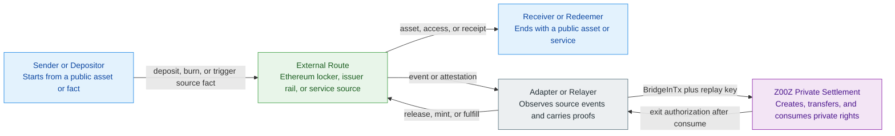
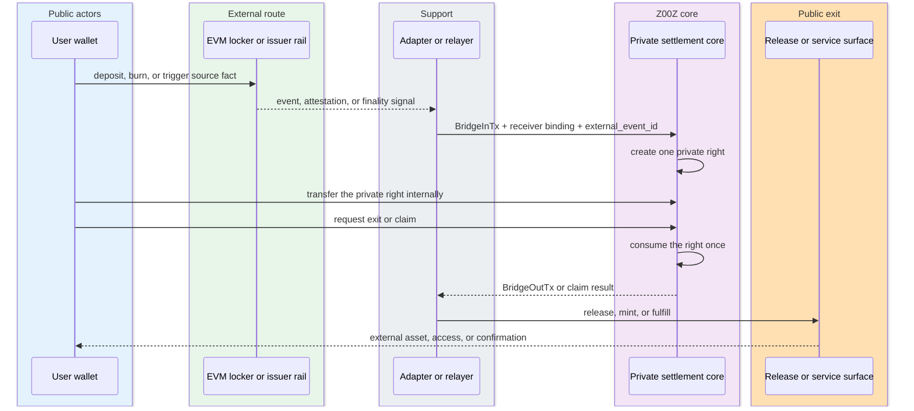
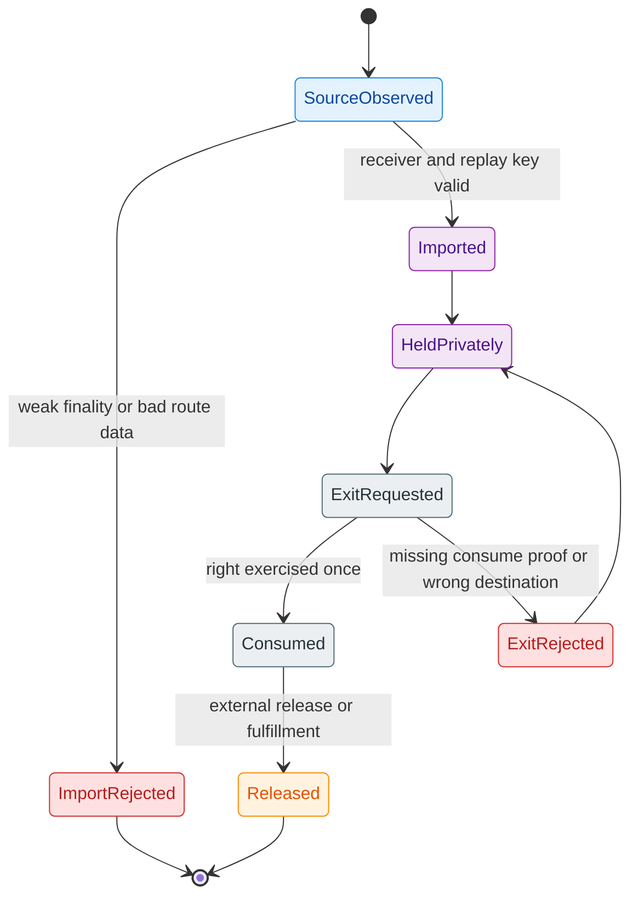

# Cross-Chain Private Rights On Transparent Chains

> The core move is not "hide Ethereum". The core move is "keep custody public,
> but let the ownership right travel privately between entry and exit."

## Core Claim

The corpus does not claim that ETH, USDC, or another external asset becomes
anonymous on its home chain. Instead, it claims that a transparent chain can
anchor a private interval. The external chain keeps the public deposit, burn,
lock, or redemption event. Z00Z carries the internal right that points to that
event and lets that right move privately before a later public exit.

This is why the cross-chain paper keeps separating external custody from
internal settlement meaning. The external chain remains the public host for
assets, liquidity, and redemption rails. Z00Z becomes the private reassignment
layer for the right linked to those external anchors.

## What Actually Moves

The privately transferred object is not an Ethereum account balance and not an
ERC-20 transfer log. It is an internal right with four bounded meanings:

- one asset family identity
- one import route
- one replay-safe source event
- one exit or redemption model

In the paper's vocabulary, the most useful integration nouns are `LockerID`,
`BridgeInTx`, `BridgeOutTx`, and `external_event_id`. The right can represent
control over locked ETH, locked USDC, an issuer-backed import route, or even a
non-token claim such as a work result or merchant entitlement.

## Example 1: EVM Locker Route

The simplest Ethereum-flavored route is a locker pattern:

1. A user deposits ETH, wrapped ETH, or an ERC-20 asset into an EVM locker.
2. The locker emits one public deposit event.
3. An adapter binds the asset family, route identity, finality status, amount,
   receiver binding, and unique event ID.
4. Z00Z creates one private internal right for that route.
5. The right moves privately inside Z00Z through normal package and checkpoint
   mechanics.
6. A later exit consumes that right and only then authorizes external release.

The important point is that the public chain never sees the full intermediate
reassignment graph. It sees public custody at the edge, then later sees public
release at the edge.

## Example 2: Native Issuer Burn-And-Attest Route

Some assets fit a native issuer route better than a generic locker. A
CCTP-style flow changes the source fact:

1. The user burns USDC through the issuer-recognized rail.
2. The issuer or route provides one attested source event.
3. Z00Z imports that attested event as one private internal right.
4. The right circulates privately inside Z00Z.
5. The reverse route later mints or releases supported USDC only after the
   internal right has been consumed once.

Here the external meaning still belongs to the issuer rail. Z00Z only supplies
the private interval between source burn and later release or mint.

## Example 3: Non-Token Claim Right

The same pattern works for imported facts that are not ordinary token deposits.
A useful-work result, merchant receipt, or service attestation can create a
private claim right instead of a bridged balance:

1. An external system accepts a work result or service condition.
2. The route emits one attestation with a unique replay key.
3. Z00Z creates a private claim right for the intended receiver.
4. The claim right can be transferred or redeemed under the route's rules.
5. A later claim consumes the right and authorizes payout, access, or another
   public consequence.

This is why the paper talks about private rights, not only private stablecoins.

## C4 Context: Public Custody Edge Versus Private Transfer Interior

## Dynamic View: Import, Private Circulation, Exit

## Lifecycle View: One-Way Safety Boundary

## What Remains Public

The privacy property lives in the interval between public entry and public exit.
The public chain still sees:

- that a deposit, burn, or eligible source event happened
- that a release, mint, or claim fulfillment later happened
- which route carried that public edge

The public chain does not automatically see:

- every private intermediate holder
- every private reassignment step
- how the right was grouped with other internal payments or claims

## Why The Mechanism Is Coherent

The mechanism stays coherent because responsibilities remain split:

- the external route proves custody, source events, or release execution
- Z00Z proves private transfer correctness and no double-use of the internal
  right
- the adapter proves that one route-specific event was imported or exported
  exactly once

This is narrower than "cross-chain anonymity", but also more defensible. It
does not pretend the external chain stopped being transparent. It only claims
that transparent custody edges can surround a private ownership-transfer
interior.

## Where The Boundary Stops

This architecture does not eliminate correlation risk. The most obvious leak
surfaces are exact amounts, deterministic timing, repeated use of one narrow
route, and immediate public redemption after a private transfer. It also does
not solve custody honesty, reserve integrity, or service-layer fairness by
itself. Those remain external assumptions attached to the route.

## See Also

- [[private-object-settlement|Private Object Settlement]] ([Private Object Settlement](private-object-settlement.md)) — the more general wallet-local pattern that cross-chain rights reuse
- [[rights-assets-and-liabilities|Rights, Assets, And Liabilities]] ([Rights, Assets, And Liabilities](../topics/rights-assets-and-liabilities.md)) — the broader object-family framing around assets, claims, and rights
- [[privacy-and-network-boundary|Privacy And Network Boundary]] ([Privacy And Network Boundary](../topics/privacy-and-network-boundary.md)) — what privacy does and does not cover at public route edges
- [[whitepaper-corpus|Whitepaper Corpus]] ([Whitepaper Corpus](../references/whitepaper-corpus.md)) — corpus map for the papers behind this concept

## Sources

- [Cross-Chain Private Rights Explainer](../../raw/notes/2026-06-27-cross-chain-private-rights-explainer.md) — user-question-driven note verified against the repository cross-chain paper
- [Z00Z Cross-Chain Integration Whitepaper](../../raw/papers/2026-06-26-cross-chain-integration.md) — corpus source for lockers, route identity, and private-right transfer language
- [Z00Z Main Whitepaper](../../raw/papers/2026-06-26-main.md) — wallet-local possession and checkpoint settlement context
