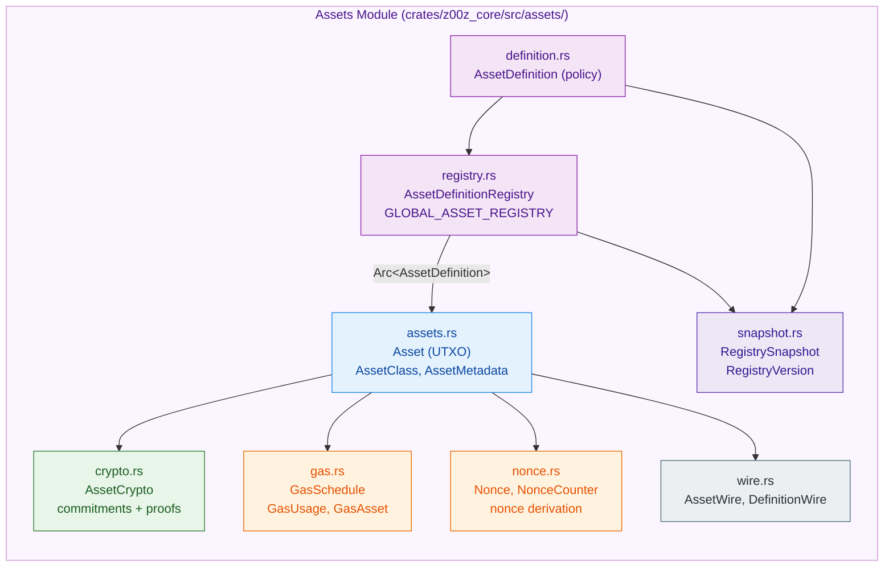
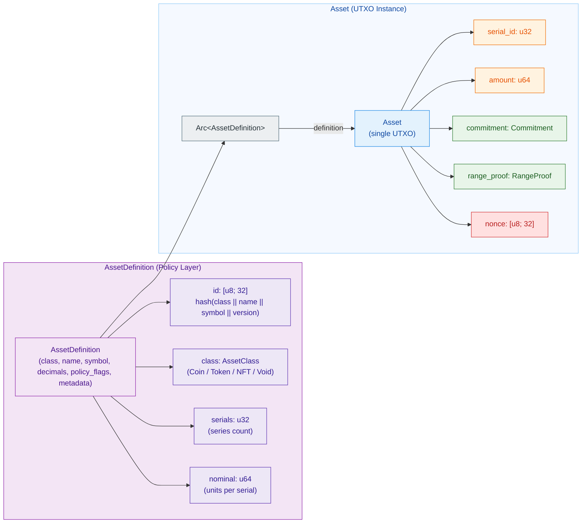
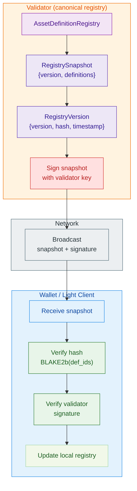
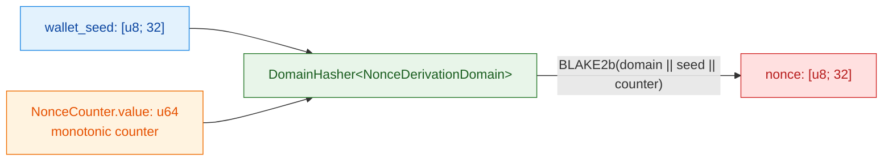

# Assets Module Documentation

## 📋 Overview

The **Assets module** (`crates/z00z_core/src/assets/`) provides the core cryptographic and structural foundations for managing confidential multi-asset outputs in Z00Z. It separates **asset policy** (definitions) from **individual UTXOs** (instances), enabling memory efficiency through Arc sharing and clear architectural separation of concerns.

### Key Responsibilities

- 🔐 **Confidential amount handling** via Pedersen commitments and Bulletproofs+ range proofs
- 📦 **Asset definitions** as immutable, reusable policy documents
- 🗂️ **Registry management** for centralized AssetDefinition access
- ⛽ **Gas/fee calculation** with overflow protection
- 🎲 **Nonce derivation** for UTXO privacy
- 📡 **Wire formats** for network serialization

---

## 🏗️ Module Structure

### Core Types

| File | Purpose | Key Types |
|------|---------|-----------|
| **assets.rs** | Asset UTXO instances | `Asset`, `AssetClass`, `AssetMetadata`, `AssetError` |
| **definition.rs** | Immutable asset policies | `AssetDefinition`, feature flags, metadata schema |
| **registry.rs** | Centralized definition storage | `AssetDefinitionRegistry`, `GLOBAL_ASSET_REGISTRY` |
| **crypto.rs** | Cryptographic operations | `AssetCrypto`, commitments, range proofs, asset hashing |
| **gas.rs** | Fee metering & validation | `GasSchedule`, `GasUsage`, `GasAsset` |
| **nonce.rs** | Nonce generation | `Nonce`, `NonceCounter`, nonce derivation |
| **wire.rs** | Network serialization DTOs | `AssetWire`, `DefinitionWire` |
| **snapshot.rs** | Registry versioning & integrity | `RegistrySnapshot`, `RegistryVersion` |


---

## 🔑 Asset Classes

Four distinct asset types with different semantics:

```rust
pub enum AssetClass {
    Coin,    // Native Z00Z coin (value + gas)
    Token,   // Fungible custom tokens
    Nft,     // Non-fungible outputs (indivisible)
    Void,    // Protocol sinks (burns, fee collection, slashing)
}
```

Each class has a unique domain byte (0x01–0x04) for deterministic asset ID derivation, preventing collisions across classes.

### Class-Specific Rules

| Class | Decimals | Serials | Fungible | Constraints |
|-------|----------|---------|----------|------------|
| **Coin** | 8 | 1+ | ✅ | Fixed supply, all coins are identical |
| **Token** | 0–18 | 1+ | ✅ | Custom supply, issuer-defined |
| **NFT** | 0 | varies | ❌ | Each instance is unique |
| **Void** | 0 | varies | ❌ | Sinks, cannot be spent |

---

## 🔐 Architecture: Asset vs. AssetDefinition

### Separation of Concerns

```
AssetDefinition (Policy Layer)
  ├─ id: [u8; 32]              ← Deterministic hash(class || name || symbol)
  ├─ class: AssetClass         ← Coin, Token, NFT, Void
  ├─ name: String              ← "Z00Z Privacy Coin"
  ├─ symbol: String            ← "Z00Z"
  ├─ decimals: u8              ← 8 for coins
  ├─ serials: u32              ← 50,000 for coins
  ├─ nominal: u64              ← 100,000,000 (1 coin in smallest units)
  ├─ policy_flags: u8          ← bit 0: is_gas, bit 4: is_burnable
  └─ metadata: BTreeMap        ← Custom key-value fields

Asset (UTXO Instance) — N instances per definition
  ├─ definition: Arc<AssetDefinition>  ← Shared reference (8 bytes)
  ├─ serial_id: u32                    ← Which series (0–serials-1)
  ├─ amount: u64                       ← Confidential via commitment
  ├─ commitment: Commitment            ← Pedersen(amount || blinding)
  ├─ range_proof: RangeProof          ← Proof that 0 ≤ amount < 2^64
  ├─ nonce: [u8; 32]                  ← Privacy-preserving identifier
  ├─ pub lock_height: Option<u64>,
  ├─ pub owner_pub: Option<PublicKey>,
  ├─ pub owner_signature: Option<KernelSignature>,
  ├─ pub is_frozen: bool,
  ├─ pub is_slashed: bool,
  └─ pub is_burned: bool,
}

```



### Memory Efficiency

For 10,000 assets with 10 unique definitions (with range_proof):

**Per-Asset Size:**
- Arc<AssetDefinition>: 8 bytes
- Other fields (serial_id, amount, commitment, nonce, etc.): ~217 bytes
- Option<RangeProof> (Some): ~672 bytes
- **Total per asset: ~897 bytes**

**Total for 10,000 assets:**
- Definitions: 10 × 200 = 2,000 bytes
- Assets: 10,000 × 897 = 8,970,000 bytes
- **Total: ~8.97 MB with Arc**

**Without Arc (embedded definitions in each Asset):**
- 10,000 × (200 + 897) = 10,970,000 bytes ≈ 10.5 MB
- **Savings: ~2 MB or ~18% reduction**

*(Note: The 96% reduction mentioned elsewhere applies to extremely skewed distributions where definitions >> assets)*

---

## 📦 Asset Definition Registry

### Global Registry

```rust
use z00z_core::assets::registry::GLOBAL_ASSET_REGISTRY;

// Insert definition
let def = AssetDefinition::new(...)?;
let arc_def = GLOBAL_ASSET_REGISTRY.insert(def)?;

// Retrieve by ID
let retrieved = GLOBAL_ASSET_REGISTRY.get(&asset_id)?;

use z00z_core::config_paths::DEVNET_ASSETS_CONFIG_REL;

// Load a secondary registry catalog
let registry = AssetDefinitionRegistry::load_catalog_from_yaml(
    Path::new(DEVNET_ASSETS_CONFIG_REL),
    Arc::new(NoopLogger),
    Arc::new(NoopMetrics),
    Arc::new(SystemTimeProvider),
)?;
```

### Thread-Safe Design

- **RwLock** for concurrent readers, exclusive writers
- **Arc<AssetDefinition>** for zero-copy sharing across threads
- **Immutability** ensures no data races after definition creation

### Registry Snapshots

Validators send versioned snapshots to wallets:

```rust
pub struct RegistrySnapshot {
    pub version: RegistryVersion,
    pub definitions: Vec<DefinitionWire>,
}

pub struct RegistryVersion {
    pub version: u64,                // Sequential identifier
    pub hash: [u8; 32],             // Blake2b of all def IDs
    pub timestamp: u64,              // Unix seconds
}
```


---

## 🔐 Cryptographic Operations

### Pedersen Commitments

Hide amounts while enabling verification:

```rust
use z00z_core::assets::crypto::AssetCrypto;
use z00z_core::BlindingFactor;

let amount = 1000u64;
let blinding = BlindingFactor::random(&mut OsRng);

// Create commitment: C = amount·H + blinding·G
let commitment = AssetCrypto::create_commitment(amount, &blinding);
```

**Properties:**
- Hiding: Cannot derive amount from commitment
- Binding: Cannot create another amount with same commitment
- Additive: `C(a+b) = C(a) + C(b)` (enables balance verification)

### Bulletproofs+ Range Proofs

Prove amount is in range [0, 2^64) without revealing value:

```rust
// Generate proof
let proof = AssetCrypto::create_range_proof(amount, &blinding)?;

// Verify proof
AssetCrypto::verify_range_proof(&proof, &commitment, 1)?;
```

**Performance:**
- Generation: ~5ms per 64-bit proof
- Verification: ~2.5ms (3x faster with cached service)
- Proof size: ~672 bytes

### Asset ID Derivation

Deterministic, collision-resistant asset IDs:

```rust
let asset_id = AssetCrypto::derive_asset_hash(
    class,           // Coin, Token, NFT, Void
    name,            // "Z00Z Privacy Coin"
    symbol,          // "Z00Z"
    version,         // 1
)?;
```

Uses domain-separated Blake2b with class byte to prevent cross-class collisions.

---

## ⛽ Gas Metering & Fee Validation

### Schedule-Based Approach

```rust
pub struct GasSchedule {
    pub base_tx_cost: u64,           // Fixed per-transaction cost
    pub per_input_cost: u64,         // Per input
    pub per_output_cost: u64,        // Per output
    pub per_range_proof_bit_cost: u64, // Per proof bit
}

let schedule = GasSchedule {
    base_tx_cost: 1000,
    per_input_cost: 500,
    per_output_cost: 750,
    per_range_proof_bit_cost: 10,
};
```

### Fee Calculation

```rust
pub fn calculate_fee(
    tx: &impl GasMetered,
    schedule: &GasSchedule,
    price: &GasPrice,
) -> Result<u64, AssetError> {
    let gas_units = schedule.base_tx_cost
        .checked_add(tx.gas_usage().inputs * schedule.per_input_cost)?
        .checked_add(tx.gas_usage().outputs * schedule.per_output_cost)?
        .checked_add(tx.gas_usage().range_proof_bits * schedule.per_range_proof_bit_cost)?;

    gas_units.checked_mul(price.per_unit())
        .ok_or(AssetError::ArithmeticOverflow("fee calculation".into()))
}
```

### Overflow Protection

All arithmetic uses `checked_*` operations with early returns:

**Protocol Limits:**
- MAX_INPUTS: 10,000
- MAX_OUTPUTS: 10,000
- MAX_PROOF_BITS: 640,000 (10k outputs × 64 bits)

**Attack Prevention:**
- ✅ Reject transactions exceeding limits before arithmetic
- ✅ Detect integer wraparound with checked operations
- ✅ Fail fast with `ArithmeticOverflow` error

---

## 🎲 Nonce Derivation

### Purpose

Provide unique, privacy-preserving identifiers for each UTXO while enabling wallet recovery.

### Design

```rust
pub type Nonce = [u8; 32];

pub struct NonceCounter {
    pub value: u64,        // Monotonic counter
    pub last_updated: u64, // Audit timestamp
}

impl NonceCounter {
    pub fn increment_unsafe(&mut self) -> Result<u64, AssetError> {
        self.value = self.value.checked_add(1)
            .ok_or_else(|| AssetError::ArithmeticOverflow("nonce counter overflow".into()))?;
        self.last_updated = unix_timestamp();
        Ok(self.value)
    }
}

// Free functions for nonce derivation
pub fn derive_nonce_simple(wallet_seed: &[u8; 32], counter: u64) -> Result<Nonce, AssetError> {
    // Nonce = BLAKE2b(NonceDerivationDomain || seed || counter)
    let mut hasher = DomainHasher::<NonceDerivationDomain>::new();
    hasher.update(wallet_seed);
    hasher.update(&counter.to_le_bytes());
    let hash = hasher.finalize();
    let mut nonce = [0u8; 32];
    nonce.copy_from_slice(&hash.as_ref()[..32]);
    Ok(nonce)
}

pub fn derive_nonce(wallet_seed: &[u8; 32], counter: u64, prev_hash: Option<&[u8; 32]>) -> Result<Nonce, AssetError> {
    let mut hasher = DomainHasher::<NonceDerivationDomain>::new();
    hasher.update(wallet_seed);
    hasher.update(&counter.to_le_bytes());
    if let Some(prev) = prev_hash {
        hasher.update(prev);
    }
    let hash = hasher.finalize();
    let mut nonce = [0u8; 32];
    nonce.copy_from_slice(&hash.as_ref()[..32]);
    Ok(nonce)
}
```




### Guarantees

- **Uniqueness:** Each nonce is distinct within a wallet
- **Determinism:** Same seed + counter → same nonce (enables recovery)
- **Privacy:** Nonces are not linked to amounts or commitments

### Wallet Recovery

Upon wallet restore, re-derive all nonces from seed:

```
for counter in 0..max_counter {
    nonce = derive_nonce(seed, counter)
    if blockchain.has_utxo(nonce) {
        recover_asset(nonce)
    }
}
```

---

## 📡 Wire Formats (Network Serialization)

### DefinitionWire

Serializable DTO for AssetDefinition:

```rust
pub struct DefinitionWire {
    pub id: [u8; 32],
    pub class: AssetClass,
    pub name: String,
    pub symbol: String,
    pub decimals: u8,
    pub serials: u32,
    pub nominal: u64,
    pub domain_name: String,
    pub version: u8,
    pub crypto_version: u8,
    pub policy_flags: u8,
    pub metadata: Option<BTreeMap<String, String>>,
}
```

**Usage:** Registry snapshots, configuration files, cross-validator synchronization.

### AssetWire

Complete UTXO DTO with embedded definition:

```rust
pub struct AssetWire {
    pub definition: AssetDefinition,  // Embedded for self-contained serialization
    pub serial_id: u32,
    pub amount: u64,
    pub commitment: Commitment,
    pub range_proof: Option<RangeProof>,  // Optional, None only for testing
    pub nonce: [u8; 32],
    pub lock_height: Option<u64>,
    pub is_burned: bool,
    pub owner_pub: Option<PublicKey>,
    pub owner_signature: Option<KernelSignature>,
    pub is_frozen: bool,
    pub is_slashed: bool,
}
```

**Usage:** Transaction outputs, wallet <→ validator communication.

---

## ⚡ Error Handling

### AssetError Variants

```rust
pub enum AssetError {
    InvalidCommitment(Cow<'static, str>),
    ProofVerificationFailed(Cow<'static, str>),
    InvalidMetadata(Cow<'static, str>),
    BurnNotAllowed(Cow<'static, str>),
    InvalidClass(Cow<'static, str>),
    InvalidDecimals(Cow<'static, str>),
    InvalidAsset(Cow<'static, str>),
    InvalidFee(Cow<'static, str>),
    InvalidFeeAsset(Cow<'static, str>),
    InvalidSignature(Cow<'static, str>),
    InvalidYaml(Cow<'static, str>),
    ArithmeticOverflow(Cow<'static, str>),
    // ... additional variants
}
```

**Pattern:** Use `thiserror::Error` for automatic `Display` impl and conversion chains.

---

## 🧪 Usage Examples

### 1. Creating a Coin Definition

```rust
use z00z_core::assets::{AssetClass, AssetDefinition};

let def = AssetDefinition::new(
    [0u8; 32],              // ID (computed from hash in practice)
    AssetClass::Coin,
    "Z00Z Privacy Coin".into(),
    "Z00Z".into(),
    8,                      // 8 decimals (Satoshi-like)
    50_000,                 // 50,000 genesis series
    100_000_000,            // 1 coin = 100,000,000 smallest units
    "z00z.io".into(),
    1,                      // Protocol version
    1,                      // Crypto version
    0b0001_0001,            // Flags: is_gas (bit 0) + is_burnable (bit 4)
    None,                   // No custom metadata
)?;
```

### 2. Creating an Asset UTXO

```rust
use z00z_core::assets::{Asset, BlindingFactor};
use z00z_core::assets::nonce::derive_nonce_simple;
use rand::rngs::OsRng;
use std::sync::Arc;

let blinding = BlindingFactor::random(&mut OsRng);
let nonce = derive_nonce_simple(&wallet_seed, 0)?;  // Derive from seed + counter

let asset = Asset::new(
    Arc::new(def),
    0,                      // Series ID (0 for genesis coin)
    1000,                   // Amount in smallest units
    &blinding,              // Reference to blinding factor
    nonce,
    &mut OsRng,
)?;

// Commitment and range proof are created automatically in Asset::new()
assert!(asset.commitment().is_some());
assert!(asset.range_proof().is_some());
```

### 3. Validating a Transaction Fee

```rust
use z00z_core::assets::gas::*;

let schedule = GasSchedule {
    base_tx_cost: 1000,
    per_input_cost: 500,
    per_output_cost: 750,
    per_range_proof_bit_cost: 10,
};

let price = GasPrice::new(2);
let fee = calculate_fee(&tx, &schedule, &price)?;

// Validate that transaction declares correct fee
validate_fee(&tx, &schedule, &price, &gas_asset)?;
```

### 4. Loading Registry from Configuration

```rust
use std::sync::Arc;
use z00z_core::assets::registry::AssetDefinitionRegistry;
use z00z_core::config_paths::DEVNET_ASSETS_CONFIG_REL;
use z00z_utils::prelude::{NoopLogger, NoopMetrics, SystemTimeProvider};
use std::path::Path;

// Load a secondary registry catalog
let config_path = Path::new(DEVNET_ASSETS_CONFIG_REL);
let registry = AssetDefinitionRegistry::load_catalog_from_yaml(
    config_path,
    Arc::new(NoopLogger),
    Arc::new(NoopMetrics),
    Arc::new(SystemTimeProvider),
)?;

// Retrieve by ID
let asset_id = [1u8; 32];
if let Some(def) = registry.get(&asset_id)? {
    println!("Asset: {} ({})", def.name, def.symbol);
}
```

---

## 🔒 Security Considerations

### Asset ID Uniqueness

- Derived deterministically from `class || name || symbol || version`
- Domain-separated with class byte to prevent cross-class collisions
- Immutable after definition creation

### Commitment & Proof Integrity

- All commitments computed with `create_commitment()`, never manually
- All range proofs verified before acceptance
- Proof size limit (10 KB) prevents DoS attacks

### Fee Validation

- All arithmetic uses checked operations to prevent overflow
- Minimum fee enforced based on transaction size
- Only native coin (Z00Z) can pay fees (V1 rule)

### Nonce Uniqueness

- Counters are monotonic and never reset
- Derived deterministically from seed for recovery
- Unique per wallet, prevents replay across wallets

### Registry Immutability

- Definitions cannot be modified after creation
- New definition = new ID (prevents policy downgrades)
- Snapshots are versioned with integrity hashes

---

## 📚 Key Concepts

| Concept | Definition |
|---------|-----------|
| **Pedersen Commitment** | Cryptographic binding of amount without revealing it |
| **Range Proof** | Zero-knowledge proof that committed value ∈ [0, 2^64) |
| **Bulletproofs+** | Efficient, compact range proof with logarithmic size |
| **Blinding Factor** | Random scalar that hides the amount in a commitment |
| **Nonce** | Unique, deterministic privacy identifier for each UTXO |
| **Gas Schedule** | Fixed costs for inputs, outputs, and range proof bits |
| **Asset Definition** | Immutable policy document shared via Arc across UTXOs |
| **Registry Snapshot** | Versioned, integrity-checked asset definition bundle |

---

## 🔗 Related Modules

- **`z00z_crypto`** — Low-level cryptographic primitives (commitments, hashing)
- **`z00z_wallets`** — Uses assets module for UTXO management
- **Transaction module** — Consumes AssetWire for transaction outputs

---

## 📖 Configuration Reference

### Registry Catalog YAML Format

```yaml
version: 1
assets:
  - id: [hex32bytes]
    class: Coin
    name: "Z00Z Privacy Coin"
    symbol: "Z00Z"
    decimals: 8
    serials: 50000
    nominal: 100000000
    domain_name: "z00z.io"
    version: 1
    crypto_version: 1
    policy_flags: 0x11      # is_gas | is_burnable
    metadata: {}
```

---

## ✅ Checklist for New Developers

- [ ] Read `AssetDefinition` architecture for memory model
- [ ] Understand `AssetClass` domain bytes and their purpose
- [ ] Review Pedersen commitment & Bulletproofs+ in `crypto.rs`
- [ ] Study gas schedule overflow protection in `gas.rs`
- [ ] Examine nonce derivation in `nonce.rs`
- [ ] Test with `registry::GLOBAL_ASSET_REGISTRY`
- [ ] Validate all arithmetic with checked operations
- [ ] Use wire formats for serialization, never embed AssetDefinition
