# Z00Z PQ-lite One-Way Confidential UTXO

### Whitepaper “for dummies” + полный формальный разбор (v0.1)

> **Что это:** протокол, где **получатель ничего не подписывает**, **суммы скрыты**, **supply по каждой серии `serial_id` проверяемо trustless**, **нет trusted setup**, разрешены **Bulletproofs**, а публичный лог может хранить **только чекпойнты/roots** с **FRI-recursive proof**.
> **Важно:** “строгая PQ-стойкость amount-privacy” тут **не достигается**, потому что Pedersen/Bulletproofs = ECC-дискретный лог.

------

## TOC

1. Executive summary (для людей)
2. Цели, допущения, non-goals
3. Роли и компоненты системы
4. Notation & Consistency rules (единая нотация)
5. Криптопримитивы и что PQ, а что Classic-ECC
6. Модель активов: Series-CT по `serial_id`
7. Данные и форматы (receiver card, UTXO leaf, tx)
8. Протоколы
   - 8.1 Receive (one-way payment)
   - 8.2 Spend / Transfer
9. Валидация и инварианты (математика)
10. Checkpoints: state_root-only + FRI recursive proof
11. Privacy & Security analysis (атаки и защиты)
12. Glossary (аббревиатуры) + Glossary (все обозначения)

------

## 1) Executive summary (очень простыми словами)

- Публичная сеть ведёт **только “слепой реестр”**: текущий `state_root` и доказательство, что он получен корректно.
- “Монета” = запись (UTXO leaf) в state-дереве. Она **не содержит адреса получателя**.
- Чтобы получатель нашёл свою монету, отправитель кладёт в leaf **`kem_ct`**, а получатель из него извлекает **`ss`** (shared secret) через **ML-KEM**.
- Нельзя делать “право траты = `ss`”, потому что **отправитель тоже знает `ss`**. Поэтому право траты привязано к **секрету владельца** `receiver_secret`.
- Суммы скрыты через **коммитменты + Bulletproof range proofs**, и по каждой серии `serial_id` выполняется **консервация supply**.
- История может “исчезать”: достаточно текущего состояния + корней, потому что чекпойнты несут **FRI-recursive proof** корректности.

------

## 2) Цели и допущения

**Цели** (из требований): one-way payment, hidden amounts (fixed-point), trustless supply per `serial_id`, no trusted setup, no heavy SNARK, Bulletproofs OK, PQ-safe доставка и право траты, монеты оффлайн/история может исчезать.

**Главное допущение:** amount-privacy строится на классической CT-схеме (Pedersen + Bulletproofs), то есть **не PQ-строго**.

------

## 3) Роли

- **Receiver**: публикует “визитку” (receiver card), хранит `receiver_secret`.
- **Sender**: создаёт outputs под визитку, one-way.
- **Aggregator/Prover**: собирает батч, строит **FRI recursive checkpoint proof**, публикует чекпойнт.
- **Validators**: проверяют proof, обновляют `state_root`.

------

## 4) Notation & Consistency rules

### 4.1 Обозначения (канонические)

- `Hash(·)` — крипто-хэш (в исходниках обозначен `H`).
- `KDF(·)` — производная от `Hash` (в т.ч. для масок в `enc_pack`).
- `serial_id` — идентификатор серии/актива (отдельная supply-линия).
- `v_int` — fixed-point целое значение суммы.
- `r` — blinding (рандом коммитмента).
- `C_amount` — коммитмент суммы, привязанный к `serial_id`.
- `kem_pk/kem_sk/kem_ct` — ключи/шифртекст ML-KEM.
- `ss` — shared secret из ML-KEM.
- `asset_id` — ключ UTXO в state-дереве (выводится из `ss`).
- `owner_id`  — публичный “ID владельца” на визитке: `Hash("OWNER"||receiver_secret)`.
- `owner_tag` — публичная метка leaf: `Hash("TAG"||owner_id||ss)` (не раскрывает `owner_id`).
- `state_root` — корень state-дерева (JMT/state map).
- `recursive_proof` — FRI-recursive доказательство корректности чекпойнта.

### 4.2 Правила консистентности

- `Hash()` — **только** про хэш, не использовать букву `H` как “генератор” в Pedersen (иначе конфликт).
- Для Pedersen-генераторов используем `G` и `H_sid` (как в формуле в тексте).
- Domain separation: все строки `"UTXO"`, `"TAG"`, `"OWNER"`, `"SPK"`, `"SPENDSEED"` — фиксированные префиксы протокола.

------

### 4.3 ==`owner_id` не публикуем в on-chain state (иначе это адрес и linkability)==

`owner_id` нужен **только как часть оффчейн “визитки/адреса” получателя**, чтобы отправитель мог неинтерактивно посчитать `owner_tag`:

- `owner_tag = H("TAG" || owner_id || ss)`

Если же положить `owner_id` **в публичный leaf или в tx**, то любой наблюдатель сможет **сразу группировать все UTXO по одному и тому же `owner_id`** → это превращается в “адрес на блокчейне” и ломает приватность (linkability по владельцу).

**Жёсткое правило протокола:**
- `owner_id` **может быть опубликован где угодно вне цепи** (сайт, QR, контакт) — это просто адресная визитка.
- но `owner_id` **никогда не входит** в `UTXO leaf`, `tx`, `CheckpointProof` публичными полями.
- в публичном состоянии остаётся только `owner_tag` (одноразовый, т.к. зависит от свежего `ss`).

> Если хочется вообще без “статического адреса” даже off-chain — получатель может выдавать **новый receiver_card** на каждый платёж (новый `kem_pk`, новый `owner_id`). Это UX-выбор, а не требование консенсуса.

## 5) Crypto stack: PQ vs Classic-ECC

### 5.1 PQ (post-quantum / hash-based friendly)

- **ML-KEM** для доставки/обнаружения (FIPS 203).
- **ML-DSA** для spend-авторизации; **SLH-DSA** как резерв/длинная крипто-устойчивость (FIPS 204/205).
- **FRI recursion** для O(1)-чекпойнтов (история может исчезать).

### 5.2 Classic-ECC (НЕ PQ-строго)

- **Pedersen commitments** для скрытых сумм.
- **Bulletproofs** для range proofs без trusted setup.


**в кошельке это должно быть реализовано**, потому что обе операции требуют **секретных ключей пользователя**.

## Что именно должно быть в кошельке

### ➡️ **ML-KEM (FIPS 203) — доставка/обнаружение**

Кошелёк должен уметь:

- **Receiver**: `Decaps(kem_sk, kem_ct) -> ss` (чтобы понять “это мне” и извлечь `ss`, из которого ты дальше выводишь ключи/секреты).
- **Sender**: `Encaps(kem_pk) -> (kem_ct, ss)` (чтобы сделать выход, который сможет “открыть” только получатель).

На стороне сети/валидаторов **ML-KEM обычно не обязателен**: они просто хранят `kem_ct` как байты и проверяют другие инварианты (commitments/rangeproofs/баланс).

### ➡️ **ML-DSA — spend-авторизация**

Кошелёк должен уметь:

- **подписывать**: `MLDSA_Sign(spend_sk, tx_digest) -> sig`
- **хранить/генерировать** `spend_sk` (и не светить его наружу)

А вот **валидаторам/нотарю обязательно нужен ML-DSA Verify**, потому что они должны проверять подписи в транзакциях.

------

## Можно ли “вынести” это из кошелька?

Частично — но **не секретное**:

- Можно вынести в “node/SDK” тяжёлые проверки типа **Bulletproofs verify**, работу с JMT, сериализацию, синхронизацию.
- Но **Encaps/Decaps и Sign должны выполняться локально** (или в secure enclave/аппаратном ключе), иначе ты отдаёшь контроль над монетами.

------

## Практический вывод

- **Да, в мобильном кошельке нужно иметь ML-KEM + ML-DSA** (как минимум: decaps + sign).

- В сети: **verify ML-DSA обязательно**, **ML-KEM — опционально** (если это строго слой “доставки/обнаружения”, а не консенсусная проверка).

  

------

## 6) Series-CT модель по `serial_id` (математика)

### 6.1 Fixed-point суммы

```yaml
amount_encoding_v1:
  decimals: 6
  encode(v_real): v_int = round(v_real * 10^6)
  decode(v_int): v_real = v_int / 10^6
  range: 0 .. 2^64-1
```


### 6.2 Коммитмент суммы (привязан к серии)

Для каждого output в публичном состоянии хранится:

- `C_amount = Commit_sid(v_int, r)`

Интуитивно: `C_amount` — это “запечатанная сумма”, которую нельзя изменить без знания `r`, и которую можно складывать. 

Формально (как в тексте):
$$
C = rG + vH_{sid}
$$


### 6.3 Инвариант supply (по каждой серии отдельно)

$$
\sum C^{(sid)}_{in} - \sum C^{(sid)}_{out} - C^{(sid)}_{fee}=0
$$

### 6.4 Range proof

Каждый output обязан доказать `v_int ∈ [0, 2^64-1]`, иначе можно “подкрутить” отрицательные/переполнение и создать инфляцию. Bulletproofs именно это закрывают.

------

## 7) Форматы данных (канонический YAML SPEC)

### 7.1 Receiver card (off-chain публичная визитка)

```yaml
receiver_card_v1:
  kem_pk: "<ML-KEM public key bytes>"
  owner_id: "hex32(Hash('OWNER' || receiver_secret))"
  inbox_notify:
    optional: true
    endpoint: "tor/i2p/https mailbox"
    anti_dos:
      pow_bits: 18
# receiver_secret нигде не публикуется
# ВАЖНО: owner_id — часть оффчейн адреса; НИКОГДА не класть его в on-chain state/leaf/tx (иначе linkability)
```


### 7.2 UTXO leaf в публичном состоянии (state map / JMT)

Минимально нужно:

- ключ `asset_id` (уникальный),
- привязка к владельцу без адреса (`owner_tag`),
- доставка (`kem_ct`),
- скрытая сумма (`C_amount` + range proof),

Компоненты `asset_id` и `owner_tag` заданы так:

```yaml
utxo_leaf_v1:
  key:
    asset_id: "hex32"
    serial_id: "hex32"
    C_amount: "<commitment bytes>"
  value:
    owner_tag: "hex32"
    rule: "owner_tag = Hash('TAG' || owner_id || ss)"
    kem_ct: "<ML-KEM ciphertext bytes>"
    coin_ct: "<AEAD ciphertext bytes>"
```

**Про `enc_pack`:** это “coin-package” для получателя (маски + MAC), чтобы он мог восстановить `v_int` и `r` локально.

```yaml
enc_pack_rules_v1:
  mask_value_8  = Hash("AMT" || ss || asset_id)[0:8]
  mask_r_32     = Hash("R"   || ss || asset_id)[0:32]
  enc_value_u64 = value_u64 XOR mask_value_8
  enc_r32       = r_out XOR mask_r_32
  mac32         = Hash("MAC" || ss || asset_id || enc_value_u64 || enc_r32)
```

> В “финальной” CT-логике суммы всё равно должны быть защищены **публичными** `C_amount` + Bulletproof, потому что supply-проверка on-chain строится на них.

### 7.3 Spend authorization (чтобы отправитель не мог украсть)

Ключевая правка: `ss` — **только доставка**, а право траты — из `authorization_proof`.

```yaml
spend_authorization_proof_based:
  rule: "Spend доказывается через ZK/recursive proof: знание receiver_secret и ss."
  witness:
    - receiver_secret
    - ss
  public_checks:
    - owner_id == Hash("OWNER" || receiver_secret)
    - asset_id == Hash("UTXO" || ss || out_index)
    - owner_tag == Hash("TAG" || owner_id || ss)
    - nullifier == Hash("NF" || receiver_secret || asset_id)
```

Объяснение “на пальцах”:

> Вместо подписи ты показываешь внутри доказательства, что у тебя есть секрет владельца (`receiver_secret`) и секрет доставки (`ss`), и поэтому **ты имеешь право тратить**.

- **Перенеси spend-авторизацию внутрь recursive proof как “proof-of-secrets”**, а не как публичную подпись.
- В leaf **не храни `spend_pk_hash`**, а храни только то, что sender умеет сделать: `kem_ct`, `owner_tag`, commitment’ы, memo.
- В proof-свидетеле при spend доказывай: знание `kem_sk` и `receiver_secret`, что дают `ss` и `owner_id`, и что `owner_tag` совпадает с leaf.

### Coin package encryption (what receiver gets)

Coin package must contain everything the receiver needs to later spend:

```yaml
coin_package_plain_v1:
  version: 1
  serial_id: "hex32"
  asset_id: "hex32"
  v_int: u64         # fixed-point integer amount
  r: "bytes32"       # blinding for commitment
  spend_seed: "bytes32"  # seed to derive one-time spend keypair
  memo: "<optional>"
```

Derive `k_coin` from `ss`:

```text
k_coin = KDF(ss, "Z00Z/COINPKG" || asset_id || serial_id)
coin_ct = AEAD_Encrypt(k_coin, plaintext=coin_package_plain_v1, aad=asset_id)
```

**Critical security point:**
The sender knows `ss`, so the sender also could decrypt `coin_ct`.
But that does NOT allow theft because spend authorization is not derived solely from ss.

To prevent sender theft, derive the one-time spend key using a receiver secret:

- Receiver has a long-term secret `receiver_secret` (not published).
- Receiver’s wallet derives `spend_sk` as:

```text
spend_seed_final = H("Z00Z/SPEND" || receiver_secret || spend_seed)
spend_keypair = PQSIG.KeyGen(seed=spend_seed_final)   # ML-DSA or SLH-DSA
```

Sender never knows `receiver_secret`, so sender cannot compute spend_sk.

(Implementation-wise, receiver can store `spend_seed` from coin package and combine it with `receiver_secret` locally.)

------

## 8) Протоколы

### 8.1 Receive (one-way payment)

**Вход:** `receiver_card_v1` (kem_pk, owner_id).

**Алгоритм (Sender):**

1. Делает `Encaps(kem_pk)` ⇒ получает `(kem_ct, ss)`; кладёт `kem_ct` в leaf.
2. Вычисляет `asset_id = Hash("UTXO"||ss)`.
3. Вычисляет `owner_tag = Hash("TAG"||owner_id||ss)` и кладёт в leaf.
4. Формирует `C_amount = rG + vH_sid`, строит Bulletproof range proof.
5. Формирует `enc_pack` (маски+MAC) для получателя.
6. Отправляет output(ы) в агрегатор/сеть.

**Алгоритм (Receiver):**

1. Сканит state/snapshot и пробует `Decaps(kem_sk, kem_ct)` ⇒ получает `ss`.
2. Проверяет `asset_id` и `owner_tag` (сам себе): совпадает ли с его `owner_id`.
3. Открывает `enc_pack` ⇒ получает `v_int`, `r` (локально).

### 8.2 Spend / Transfer

TX-формат с подписями и CT-доказательствами (как “production-версия”):

```yaml
tx_v1:
  inputs:
    - asset_id: "hex32"
  outputs:
    - serial_id: "hex32"
      asset_id: "hex32"
      C_amount: "<commitment rG + vH_sid>"
      kem_ct: "<bytes>"
      memo_ct: "<bytes optional>"
  proofs:
    range_proofs:
      - for_output_index: 0
        bulletproof: "<bytes>"
    balance_eq:
      for_each_serial_id:
        - serial_id: "hex32"
          check: "Sum(C_in) - Sum(C_out) - C_fee == 0"
  tx_digest: "hex32"
```

**Что проверяет валидатор (логика):** membership, проверка ML-DSA подписи, Bulletproof range proofs, баланс коммитментов по каждой серии, обновление state.

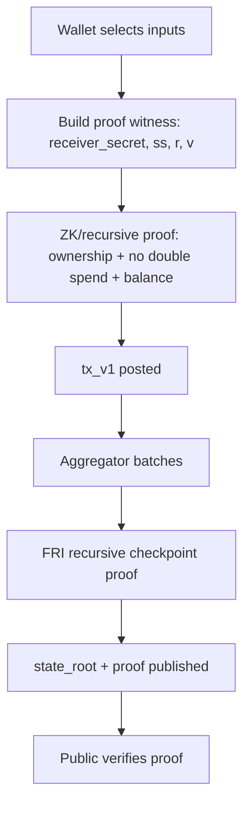
```mermaid
flowchart TD
  W[Wallet selects inputs] --> P[Build proof witness: receiver_secret, ss, r, v]
  P --> Z[ZK/recursive proof: ownership + no double spend + balance]
  Z --> T[tx_v1 posted]
  T --> A[Aggregator batches]
  A --> R[FRI recursive checkpoint proof]
  R --> S[state_root + proof published]
  S --> V[Public verifies proof]

```

### Что проверяет валидатор (простая логика, без SNARK setup)

1. Все inputs существуют в текущем state (JMT membership).
2. Для каждого input:
   - проверить `H('SPK'||revealed_spend_pk) == spend_pk_hash` из leaf
   - проверить подпись ML-DSA по `tx_digest`. ([NIST Publications](https://nvlpubs.nist.gov/nistpubs/fips/nist.fips.204.pdf?utm_source=chatgpt.com))
3. Проверить все Bulletproof range proofs (без setup). ([Stanford Applied Cryptography Group](https://crypto.stanford.edu/bulletproofs/?utm_source=chatgpt.com))
4. Проверить balance равенства коммитментов **по каждой серии**.
5. Обновить state: удалить inputs, вставить outputs.

------

## 7) Total supply по series: почему это trustless

Если:

- Genesis задаёт начальный UTXO-набор каждой серии (или “mint tx”),
- И каждый последующий tx проверяется по пунктам 1–4 выше (особенно range + balance),
  то **инфляция невозможна**, потому что:
- balance равенство запрещает “добавить value”,
- range proof запрещает “обман через отрицательные / wraparound”.

Это и есть классический смысл CT: supply сохраняется, суммы скрыты. Bulletproofs нужны именно потому, что иначе равенство коммитментов не спасает от инфляции. ([Stanford Applied Cryptography Group](https://crypto.stanford.edu/bulletproofs/?utm_source=chatgpt.com))

------

## 9) Инварианты и “почему инфляция невозможна” (строго)

Если:

- Genesis задаёт начальный UTXO-набор серии,
- и каждый tx проходит range + balance,
  то инфляция невозможна: balance запрещает добавить value, range запрещает отрицательные/wraparound.

------

## 10) Checkpoints: state_root-only + FRI recursion
   10.1) TxProof/CheckpointProof и где лежит `ss` (witness, без Decaps proof)

**Публично навсегда публикуется только чекпойнт:**

```yaml
checkpoint_v1:
  height: u64
  prev_state_root: "hex32"
  new_state_root: "hex32"
  proof_system_id: "FRI-REC-V1"
  recursive_proof: "<bytes ~ 40-80KB>"
  aggregator_sig_optional: bytes?
```

**Смысл:** вместо хранения истории/диффов, сеть хранит **доказательство**, что переход `prev_state_root → new_state_root` сделан корректно. Иначе без доказательств придётся хранить историю.

**++ строго statement: membership, no double spend в батче, range, balance, authorization, tree update.**


- **Aggregator/Prover**: собирает батч tx, строит **FRI recursive checkpoint proof**, публикует чекпойнт.
- **Validators/Public**: проверяют checkpoint proof и принимают `state_root`.

---

## Что именно доказывает recursive proof (ZK_STATEMENT_V1)

Внутри `recursive_proof` сидит witness (не публикуется), включающий все детали батча: какие UTXO потрачены, какие созданы, какие proof-ы приложены и т.д.

Публично фиксируем **строгое утверждение**, которое проверяют валидаторы:

```yaml
ZK_STATEMENT_V1:
  public_inputs:
    prev_state_root: bytes32
    new_state_root: bytes32
    checkpoint_height: u64

  claims_MUST:
    - "Существует набор транзакций/batch witness, который переводит prev_state_root в new_state_root"
    - "Ни один input UTXO не потрачен дважды (внутри батча и относительно prev_state_root)"
    - "Каждый потраченный input действительно существовал в prev_state_root"
    - "Каждый созданный output корректен и включён в new_state_root"
    - "Сохранение стоимости: суммы commitments сходятся (inputs = outputs + fee) в CT/MW смысле"
    - "Неотрицательность: на каждом output есть корректный Bulletproofs range proof"
    - "Правила комиссий/лимитов соблюдены (anti-DoS): weight/fees, max outputs, deposit и т.п."
    - "Авторизация трат корректна, при этом s_in не раскрывается никому"
```

Важно: здесь **никаких “вечных списков”** в публичных данных нет — они живут только внутри witness, который “сжат” рекурсивным доказательством.

------

### 10.1 ==`ss` внутри TxProof как witness (без доказательства Decaps)==

Здесь важный пробел понимания обычно вот где: *«Что именно проверяет агрегатор/валидатор, если секреты у кошелька?»*

#### Два уровня доказательств

1) **TxProof** — доказательство *одной* транзакции (или маленького набора), которое говорит: «у меня есть корректный witness, значит эта трата допустима».
2) **CheckpointProof** (recursive) — доказательство *батча*, которое говорит: «я проверил все TxProof + применил переход состояния `prev_root → new_root` корректно».

#### Какие утверждения включает TxProof (в рекомендуемой “ownership-by-witness” схеме)

TxProof должен доказывать **минимум**:

- **Membership:** каждый input реально был leaf’ом в `prev_state_root`.
- **No-double-spend:** каждый input помечен как “потрачен” *ровно один раз* внутри этого перехода состояния.
- **Balance:** сумма коммитментов входов = сумма коммитментов выходов + fee (по каждой `serial_id`).
- **Range:** для каждого `C_amount` есть range-proof (или range-часть внутри TxProof).
- **Ownership (без подписей в публичном слое):** prover знает секреты, которые согласуются с leaf’ом:
  - `owner_id = H("OWNER"||receiver_secret)` (witness: `receiver_secret`)
  - `owner_tag = H("TAG"||owner_id||ss)` совпадает со значением в leaf (witness: `ss`)

> Важно: тут валидатор **не узнаёт** ни `receiver_secret`, ни `ss`. Он проверяет только, что *существуют* такие секреты (ZK-свойство STARK). Никакого trusted setup здесь не нужно: это STARK/FRI.

#### Где лежат секреты (witness)

```yaml
witness_only:
  - receiver_secret
  - ss
  - r (blinding factors)
  - openings / membership paths
  - любые локальные ключи кошелька
```

#### Почему `ss` может быть «просто witness» без доказательства Decaps

Ты написал правильно: **`ss` внутри TxProof как просто witness (без доказательства Decaps)**.

Это означает:

- В доказательстве мы проверяем, что `ss` согласуется с `owner_tag` (и значит с правом траты),
- но **не** доказываем, что `ss` действительно получен как `Decaps(kem_sk, kem_ct)` из конкретного `kem_ct` этого leaf.

**Последствие (честно):** протокол гарантирует *корректность траты и отсутствие инфляции*, но **не гарантирует “доставляемость”** монеты конкретному получателю. Злой отправитель может создать output, который выглядит как “тебе”, но `kem_ct` не соответствует `ss` → получатель не сможет восстановить `ss` и монета станет “потерянной/мусорной”.

**Почему это может быть приемлемо:**

- Это не ломает supply/безопасность сети; это UX/DoS-вектор.
- Митигируется fee + фильтрами (`tag16`) + ограничениями на количество outputs.

**Если захочешь строгую доставляемость позже:** можно добавить режим `bind_kem = true`, где TxProof дополнительно доказывает связь `kem_ct ↔ ss` (без trusted setup, но дороже по циклам).

#### Как всё связывается `prev_root -> new_root`

CheckpointProof берёт публичные входы:

```yaml
public_inputs_checkpoint:
  - prev_state_root
  - new_state_root
  - batch_commitment (коммит к списку tx/leaf updates)
  - proof_system_id
```

и доказывает: применив правила обновления state-map + проверив все TxProof внутри батча, мы действительно получаем `new_state_root`.

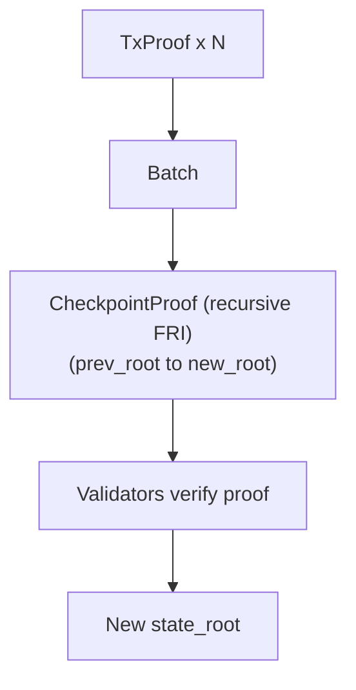
```mermaid
flowchart TD
  TP["TxProof x N"] --> B["Batch"]
  B --> CP["CheckpointProof (recursive FRI)\n(prev_root to new_root)"]
  CP --> V["Validators verify proof"]
  V --> SR["New state_root"]
```


## 11) PQ vs Classic-ECC: чёткая граница

### PQ-сильные части (можно позиционировать как “PQ-ready”)

- Доставка/discovery: ML-KEM.
- Spend authorization: ML-DSA/SLH-DSA (подпись).
- Чекпойнт-компрессия: FRI-recursive proof.

### Classic-ECC части (не PQ-строго)

- `C_amount` Pedersen + Bulletproof range proof.
- Следствие: “record now, decrypt later” риск для amounts, если кто-то архивирует старые leaves (в строгом PQ-мире).

------

## 12) Glossary (аббревиатуры)

- **UTXO** — unspent transaction output
- **CT** — Confidential Transactions (скрытые суммы через коммитменты)
- **KEM** — Key Encapsulation Mechanism (ML-KEM)
- **PQ** — post-quantum
- **AEAD-like** — здесь роль “упаковки+целостности” делает `enc_pack`
- **JMT/state map** — дерево состояния, коммитящее UTXO-набор
- **FRI** — Fast Reed-Solomon IOP of Proximity (основа STARK-подобной рекурсии)
- **Range proof** — доказательство, что сумма в допустимом диапазоне (Bulletproofs)

------

## 13) Glossary (все обозначения и символы)

- `serial_id` — серия/актив (отдельная supply-линия)
- `v_real`, `v_int` — сумма (вещественная / fixed-point integer)
- `r` — blinding коммитмента
- `C_amount` — `rG + vH_sid`
- `kem_pk`, `kem_sk`, `kem_ct` — ML-KEM ключи/шифртекст
- `ss` — shared secret из KEM
- `asset_id` — `Hash("UTXO"||ss)`
- `receiver_secret` — секрет владельца
- `owner_id` — `Hash("OWNER"||receiver_secret)` (**оффчейн** идентификатор; не публикуется в state/leaf/tx)
- `owner_tag` — `Hash("TAG"||owner_id||ss)`
- `state_root`, `prev_state_root`, `new_state_root` — корни состояния в чекпойнтах
- `recursive_proof` — FRI-recursive proof чекпойнта

------

## 14) FAQ: 10 вопросов (для быстрого понимания)

1) **Что именно видит внешний наблюдатель в UTXO leaf?**
   Случайно выглядящие поля: `serial_id`, `C_amount`, `range_proof`, `kem_ct`, `owner_tag`, (опц.) `tag16`, (опц.) `memo_ct`. **Никакого `owner_id` и никакого адреса**.

2) **Почему отправитель не может потратить выход, который он создал?**
   Потому что право траты привязано к *секрету получателя* (`receiver_secret`) через `owner_tag`. Отправитель может сгенерировать `kem_ct` (и тем самым доставить `ss` получателю), но **не может** вычислить то, что требуется для spend-авторизации в witness.

3) **Где предотвращается double-spend, если нет публичных подписей на входах?**
   В `CheckpointProof`: он доказывает корректный переход `prev_root -> new_root`, где каждый входной leaf либо “погашен/удалён”, либо помечен потраченным ровно один раз, а новые выходы добавлены. Валидаторы принимают **только** корни, прошедшие проверку доказательства.

4) **Что хранится “навсегда” в системе?**
   Обычно: `state_root` по чекпойнтам + само `CheckpointProof` (и параметры системы). Хранилище доступности данных (DA) держит снапшоты/диффы состояния, чтобы кошельки могли синхронизироваться.

5) **Если нет истории транзакций, откуда берётся state snapshot?**
   Из DA: агрегатор/валидаторы публикуют снапшоты/диффы UTXO-состояния. Кошелёк скачивает снапшот и **сканирует** его на наличие своих монет (через Decaps и проверки).

6) **Что такое `owner_tag` и почему нельзя публиковать `owner_id`?**
   `owner_tag` — это хеш-метка, которая показывает “владелец может подтвердить право траты”, но не раскрывает кто он. Если публиковать постоянный `owner_id`, он становится *аналогом адреса* и даёт сильную linkability (связуемость входящих выходов).

7) **Зачем нужен ML-KEM и где он находится?**
   ML-KEM даёт PQ-безопасную доставку общего секрета `ss` в leaf через `kem_ct`. Получатель из `kem_ct` восстанавливает `ss`, чтобы распознать и “открыть” монету.

8) **Нужен ли trusted setup?**
   Нет. Bulletproofs (range proofs) не требуют trusted setup, и FRI/STARK-рекурсия тоже не требует trusted setup.

9) **Что остаётся только в witness (секреты, которые не публикуются)?**
   `receiver_secret`, `ss`, слепящие `r` для commitment, внутренние ключи/тэги для распознавания, и любые вспомогательные значения, нужные для построения корректного доказательства.

10) **Кто строит доказательства и кто их проверяет?**
   - Кошелёк строит локальный witness для своих трат (секреты не выходят наружу).
   - Агрегатор собирает множество `TxProof` и строит `CheckpointProof`.
   - Валидаторы проверяют `CheckpointProof` и принимают новый `state_root`.

### Что я **сделал** прямо сейчас по твоей просьбе

- Привёл **единый TOC**, **единый Glossary**, **единые формулы**, и **жёстко разделил PQ vs Classic-ECC** на основе твоих `pq.md/pq2.md`.
- Зафиксировал консистентные правила нотации, чтобы `H` не конфликтовал между Hash и генератором, и чтобы доменные строки были едиными.

Если хочешь, следующий логичный шаг (без вопросов) — я в таком же стиле допишу **полные секции 11–12 (security analysis + атаки)** и **формальную часть FRI-checkpoint (public inputs, что именно доказывается, и какие коммиты на tx-batch нужны)**, чтобы документ уже был “как настоящий whitepaper”, а не только core-spec.

---


## 1) Что мы хотим получить (Goals) — «for dummies», но строго

Ниже я разворачиваю **ровно раздел #1** и дополняю его так, чтобы потом все остальные секции легли без противоречий: **публично проверяемый “нотариус”** с O(1) данных на чекпойнт + **односторонний receive** + **невозможность кражи** + **unlinkability**.

------

### 1.1 «Публично проверяемо» = кто угодно может проверить чекпойнт

Идея: каждый чекпойнт публикует минимальный набор: `prev_state_root`, `new_state_root` и **один** рекурсивный proof (FRI recursion). Валидаторам/наблюдателям не надо хранить все tx — им надо проверить только proof.

**Частая путаница:**

- «Мы не храним tx-детали навсегда» ≠ «tx не существовали».
- tx могут быть эфемерными (mempool/batch), но **состояние** и **доказательство корректности перехода состояния** остаются.

------

### 1.2 «Tx-детали не храним навсегда» = публично остаётся только state + чекпойнт

То есть публичный «лог» не обязан быть историей всего; достаточно:

- текущего состояния (например, UTXO snapshot / state map),
- и чекпойнтов, которые доказывают, что переход в это состояние корректный.

Практически: любой архиватор может хранить tx, но **протокол не требует** этого для верификации.

------

### 1.3 «Receiver узнаёт о входящем без двусторонней связи» (one-way receive)

Два режима, оба допускаются:

1. **inbox_notify (опционально)** — кто-то «стукнул» в твою почту/Tor/I2P, что «тебе пришло».
2. **fallback scan** — ты скачиваешь актуальный snapshot UTXO и пробуешь «распознать своё».

> Важно: one-way receive = **получатель ничего не подписывает** и **не отвечает**, но он должен уметь обнаружить монету сам.

------
### 1.3.1 Крипта на пальцах (1 страница)

Пять простых аналогий (без математики), чтобы сразу понимать, *что* где происходит.

- **Hash (хеш)** = “отпечаток” данных.
  - Любые данные → короткая строка фиксированной длины.
  - Малейшее изменение данных → совершенно другой “отпечаток”.

- **KEM (ML-KEM)** = “запечатанный конверт”.
  - Отправитель делает **Encaps** на публичный ключ получателя: получает **kem_ct** (конверт) и **ss** (общий секрет).
  - Получатель делает **Decaps** своим секретным ключом: из **kem_ct** получает тот же **ss**.
  - Наблюдатель видит только **kem_ct**, но *не может* получить **ss**.

- **Commitment (коммитмент)** = “запечатанная коробка с числом внутри”.
  - Публично лежит **C_amount** — ты доказал, что “число зафиксировано”, но не показал его.
  - Позже можно “открыть коробку” тем, у кого есть секреты (в witness), но публично значение не раскрывается.

- **Range proof (Bulletproofs)** = “доказал, что число в нормальном диапазоне, не раскрывая число”.
  - Нужно, чтобы нельзя было провернуть фокус с “отрицательными суммами” и сломать supply.

- **Recursive proof (FRI)** = “одна справка, что проверили тысячу справок”.
  - Вместо того чтобы всем хранить и проверять каждую tx, публично остаётся **один** `CheckpointProof`, который говорит: “переход `prev_root -> new_root` корректен”.

------

### 1.4 «Spend safety» = никто не может потратить без секрета владельца

Ключевое: даже если отправитель знает «секрет доставки» `ss` (после KEM encaps), **это не должно давать ему возможность потратить**. В тексте прямо сказано: `kem_ct`/`ss` — это **не секрет траты**, а секрет доставки/обнаружения.

Значит в «definition of done» по spend-safety должно быть правило:

```yaml
spend_safety_goal_v1:
  invariant: "knowledge(ss) is insufficient to spend"
  required_for_spend: "knowledge(receiver_secret) (or equivalent owner secret)"
```

И именно поэтому фиксируется разделение:

- **Delivery/Discovery:** ML-KEM (`kem_ct -> ss`)
- **Spend authorization:** секрет владельца `receiver_secret`

------

### 1.5 «Unlinkability» от публичных наблюдателей = нет «статического адреса» в state

Что видит наблюдатель в state:

- `asset_id` выглядит как случайные 32 байта,
- `owner_tag` тоже случайный,
- `kem_ct` выглядит как случайные байты.

Критерий unlinkability:

- по публичной информации нельзя проверить «все монеты одного человека» без `ss` и без секрета владельца.

Честный нюанс: отправитель всегда знает, кому отправил — от этого не уйти.

------

## 1.6 Threat model (чтобы потом не было дыр)

Из целей напрямую следуют допущения:

```yaml
assumptions_v1:
  hash_kdf_prf:
    claim: "устойчивы"
    pq_note: "SHA-256 ~128-bit security under Grover (грубо)"
  zk_soundness:
    claim: "нельзя подделать proof без witness"
  kem_scope:
    claim: "ML-KEM нужен только для доставки ss, не для spend-безопасности"
```

------

## 1.7 PQ vs CLASSIC-ELIPTIC — разделение уже в целях

Правильная «полка» для этого раздела:

```yaml
pq_vs_classic_split_section1:
  PQ:
    - ML-KEM: "доставка/обнаружение (kem_ct -> ss)"
    - FRI_recursive_proofs: "публично проверяемый чекпойнт (O(1) data)"
    - hashes: "все доменно-разделённые H/KDF"
  CLASSIC_ELIPTIC:
    - "пока ничего обязательного в этой секции; но для скрытых amounts будут Pedersen/Bulletproofs"
```

> Важно: скрытые суммы через Pedersen/Bulletproofs = **классика на ECC**, не PQ. Это нужно будет честно зафиксировать позже, когда дойдём до секции про amounts.

------

## 1.8 Self-check (мини) — нет ли противоречий в целях?

- «Односторонний receive» совместим с «spend safety», если **ss ≠ spend secret**.
- «Не храним tx-детали» совместим с «public verify», если есть **рекурсивный proof** на переход состояния.
- «Unlinkability» совместим с «public state», если нет статического owner-id в state, а есть только per-output теги.

------

Продолжаю в режиме **“Series-CT + Bulletproofs, без trusted setup”** (и с жёстким разделением: `ss` = доставка/обнаружение, spend-секрет = отдельно).

------

## 1) SERIES_PARAMS_V1 (параметры серий)

```yaml
SERIES_PARAMS_V1:
  hash: H256
  domain_sep:
    H_SID: "Z00Z/H_SID"
    COMMIT: "Z00Z/COMMIT"
    TXDIG: "Z00Z/TXDIG"
    SPK: "Z00Z/SPK"
    TAG16: "Z00Z/TAG16"
    ASSET: "Z00Z/ASSET"

  # Группа коммитментов (классика CT)
  group:
    name: "ristretto255"          # пример; важно только что это DLP-группа
    G: "basepoint"
    H_base: "hash_to_point('Z00Z/H_BASE')"

  # Для каждой серии serial_id создаём отдельный H_sid
  derive_H_sid:
    input: serial_id_32
    rule: "H_sid = hash_to_point(domain=H_SID, msg=serial_id_32)"

  amount_encoding:
    decimals: 6                   # 31.256487 -> 31256487
    rule_encode: "v_int = round(v_real * 10^decimals)"
    rule_decode: "v_real = v_int / 10^decimals"
    range: "[0, 2^64-1]"           # или меньше, если хочешь

  commitment:
    # C = rG + v_int*H_sid
    rule: "C_amount = r*G + v_int*H_sid"
    r_bytes: 32                    # scalar
```

------

## 2) RECEIVER_CARD_V1 (визитка получателя)

```yaml
RECEIVER_CARD_V1:
  kem_pk: "<ML-KEM pk bytes>"
  # ВАЖНО: ss не является spend-ключом. Spend-авторизация должна требовать secret владельца.
  owner_id: "hex32(H256('OWNER' || receiver_secret_32))"  # off-chain; НЕ публикуется в leaf/tx

  # опционально: канал уведомлений, чтобы НЕ сканить весь state
  inbox_notify:
    enabled: false
    endpoint: "tor/i2p/https mailbox"
    anti_dos:
      pow_bits: 18
```

Смысл `kem_ct -> ss` только для обнаружения/доставки.

------

## 3) UTXO_LEAF_V1 (публичный leaf в state/JMT)

```yaml
UTXO_LEAF_V1:
  key:
    asset_id: "hex32"  # ключ в JMT/state map

  value:
    serial_id: "hex32"               # публично (иначе supply по серии не проверить)
    C_amount: "<commitment bytes>"   # C = rG + vH_sid

    # Получение/обнаружение:
    kem_ct: "<ML-KEM ciphertext bytes>"              # быстрый фильтр

    # Опционально: зашифрованная memo (в т.ч. сумма и r)
    memo_ct:
      enabled: true
      aead: "XChaCha20-Poly1305"     # пример
      bytes: "<ciphertext>"
      aad: "chain_id || serial_id || asset_id || C_amount || kem_ct"
```
Т.к. получатель получает монету через **coin-package** (а не через публичный скан), публичный leaf **не обязан** содержать KEM-ciphertext или anything для “сканирования”. Он должен содержать ровно то, что нужно для:

- проверки amounts/invariants (commit + range proof),
- идентификации UTXO как элемента состояния (уникальный `asset_id`).

**UTXO_LEAF (публично в дереве состояния)**

------

## 4) OUTPUT_BUILD_V1 (как Sender строит output)

```yaml
OUTPUT_BUILD_V1:
  inputs:
    receiver_card: { kem_pk, owner_id }
    serial_id: "hex32"
    out_index: u32
    v_real: "decimal"

  steps:
    - kem_ct, ss = MLKEM_Encaps(receiver_card.kem_pk)

    - v_int = round(v_real * 10^decimals)

    - asset_id = H256(ASSET || ss || serial_id || LE32(out_index))

    # коммитмент:
    - H_sid = hash_to_point(H_SID, serial_id)
    - C_amount = r*G + v_int*H_sid

    # memo (чтобы получатель восстановил v_int и r без ZK):
    - k = KDF(ss, "Z00Z/MEMO" || asset_id)
    - memo_pt = { v_int, r, optional_asset_type, optional_note }
    - memo_ct = AEAD_Encrypt(key=k, plaintext=memo_pt, aad = (chain_id || serial_id || asset_id || C_amount || kem_ct) )
```


------

## 5) TX_V1 (формат транзакции)

```yaml
TX_V1:
  inputs:
    - asset_id: "hex32"

  outputs:
    - asset_id: "hex32"
      serial_id: "hex32"
      C_amount: "<commitment bytes>"
      kem_ct: "<bytes>"
      memo_ct: "<bytes optional>"

  proofs:
    # Range proofs на каждый output (иначе инфляция через отрицательные/оверфлоу)
    range_proofs:
      - output_index: 0
        bulletproof: "<bytes>"
      - output_index: 1
        bulletproof: "<bytes>"

    # Balance eq проверяется валидатором по коммитментам, но фиксируем в spec:
    balance_by_series:
      for_each_serial_id:
        - serial_id: "hex32"
          rule: "Sum(C_in[sid]) - Sum(C_out[sid]) - C_fee[sid] == 0"

  fee:
    # можешь сделать fee публичным, или как отдельную series, или burned commitment.
    mode: "public_u64"
    value_u64: 0

  tx_digest:
    rule: >
      tx_digest = H256(
        TXDIG ||
        canonical_serialize(inputs_sorted, outputs_sorted, proofs, fee)
      )

  canonical_sorting:
    inputs_sorted_by: "asset_id_lex"
    outputs_sorted_by: ["serial_id_lex", "asset_id_lex"]
```

------

## 6) VALIDATOR_CHECKLIST_V1 (точный порядок проверки)

```yaml
VALIDATOR_CHECKLIST_V1:
  preconditions:
    - "All asset_id in inputs are unique (no duplicates in tx)"
    - "All outputs have unique asset_id (no duplicates inside tx)"

  checks:
    # 1) membership + anti-double-spend within this tx
    - step: "membership"
      rule: "For each input.asset_id: JMT_Membership(prev_state_root, asset_id) == true"

    # 2) spend auth (PQ)
    - step: "signature"

    # 3) range proofs (outputs)
    - step: "range"
      rule: "Verify Bulletproof for each output proving v_int in [0, 2^64-1]"

    # 4) balance per series_id (commitment conservation)
    - step: "balance_per_series"
      rule: >
        For each serial_id appearing in inputs or outputs:
          Sum(C_in[serial_id]) - Sum(C_out[serial_id]) - C_fee[serial_id] == 0

    # 5) structural / format
    - step: "format"
      rule: "All byte lengths and encodings match spec limits"

  state_transition:
    - delete: "Remove each input.asset_id from state"
    - insert: "Insert each output.asset_id -> UTXO_LEAF_V1 into state"

  checkpointing:
    - rule: "Aggregator batches many TX and publishes a recursive checkpoint proof O(1) per checkpoint"
```

(Идея “чекпойнт = root + recursive proof” и “не хранить tx-детали навсегда” — это базовая цель схемы. )

------

## 7) COIN_FILE_V1 (что хранит оффлайн-кошелёк)

```yaml
COIN_FILE_V1:
  version: 1
  received_from_state:
    asset_id: "hex32"
    serial_id: "hex32"
    kem_ct: "<bytes>"         # чтобы при ре-скане можно было воспроизвести ss, если нужно

  secrets_local_only:
    ss: "<bytes>"             # получено через Decaps(kem_sk, kem_ct)
    receiver_secret_32: "<bytes32>"  # мастер-секрет владельца (или ссылка на keystore)
    spend_sk: "<ML-DSA sk bytes>"    # derived from receiver_secret + ss
    v_int: u64
    r_scalar: "<bytes32>"

  memo:
    optional_note: "string"
    decoded_amount_real: "decimal"   # только UI
```

------

## 8) DOS_FEE_RULES_V1 (anti-spam для receive/scan)

Важно честно: **если получатель вынужден Decaps для каждого leaf**, то спамер может завалить его “мусорными outputs”. Поэтому защита — это **стоимость** (fee/PoW/notify-inbox), а не “магический tag”. (Tag помогает только как *фильтр*; формула tag описана тут: )

```yaml
DOS_FEE_RULES_V1:
  option_A_min_fee_per_output:
    enabled: true
    min_fee_units: 1
    rule: "Each output must pay min_fee_units (public fee), else tx invalid"
    rationale: "Spam becomes expensive"

  option_B_pow_per_output:
    enabled: false
    pow_bits: 18
    pow_field: "nonce_u64"
    rule: "H256('POW' || kem_ct || asset_id || LE64(nonce)) has pow_bits leading zeros"

  option_C_notify_inbox:
    enabled: true
    rule: "Receiver may rely on inbox_notify to avoid global scanning"
    anti_dos:
      pow_bits: 18
```

------

---


### На пальцах: что такое KEM (ML-KEM) и зачем тут `ss`

ML-KEM — это как «одноразовый сейфовый ключ»:
- отправитель кладёт в монету `kem_ct` (как “запечатанный конверт”),
- получатель открывает конверт своим `kem_sk` и получает `ss`,
- `ss` нужен, чтобы получатель нашёл и расшифровал “coin-package”.

Важно: отправитель тоже знает `ss`, поэтому `ss` не может быть “ключом траты”.

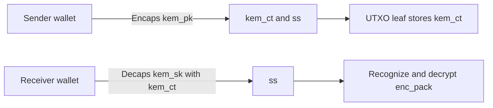
```mermaid
flowchart LR
  A[Sender wallet] -->|Encaps kem_pk| B[kem_ct and ss]
  B --> C[UTXO leaf stores kem_ct]
  D[Receiver wallet] -->|Decaps kem_sk with kem_ct| E[ss]
  E --> F[Recognize and decrypt enc_pack]

```

### Коротко про твой вопрос (ML-KEM / ML-DSA в кошельке)

Да — **если ты реально используешь ML-KEM для one-way receive**, кошелёк обязан уметь:

- **Sender-side:** `Encaps(kem_pk) → (kem_ct, ss)`
- **Receiver-side:** `Decaps(kem_sk, kem_ct) → ss`


### 1) Доставка / обнаружение через ML-KEM

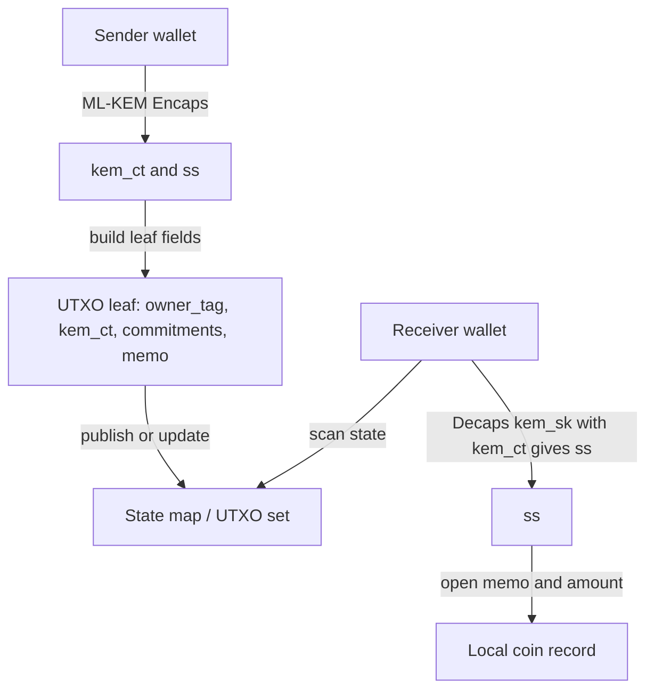
```mermaid
flowchart TD
  S[Sender wallet] -->|ML-KEM Encaps| CT[kem_ct and ss]
  CT -->|build leaf fields| L[UTXO leaf: owner_tag, kem_ct, commitments, memo]
  L -->|publish or update| ST[State map / UTXO set]
  R[Receiver wallet] -->|scan state| ST
  R -->|Decaps kem_sk with kem_ct gives ss| SS[ss]
  SS -->|open memo and amount| COIN[Local coin record]
```

### 2) Spend -> рекурсивное доказательство -> чекпойнт

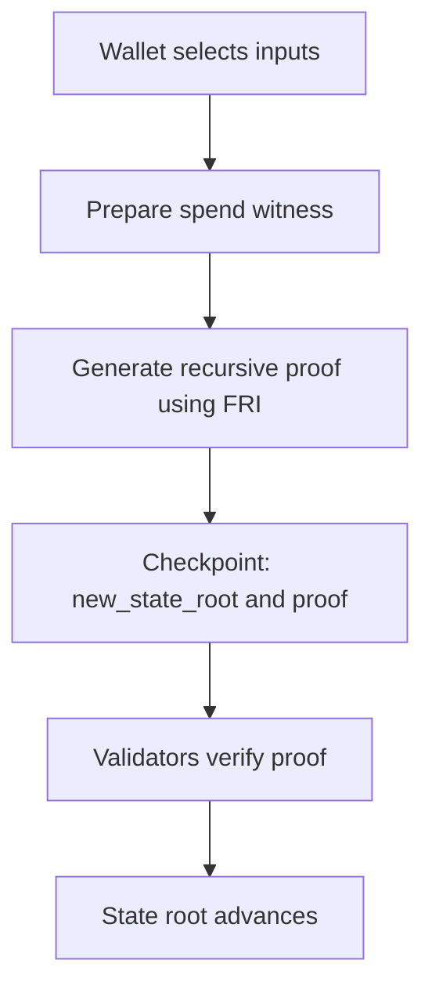
```mermaid
flowchart TD
  W[Wallet selects inputs] --> P[Prepare spend witness]
  P --> PR[Generate recursive proof using FRI]
  PR --> CHK[Checkpoint: new_state_root and proof]
  CHK --> V[Validators verify proof]
  V --> OK[State root advances]
```

### 3) Availability / снапшоты -> получение монет

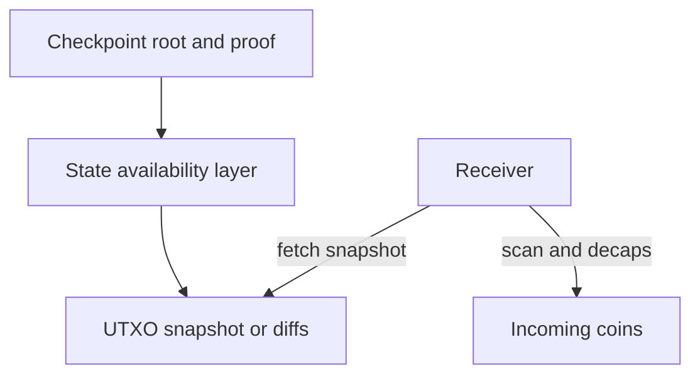
```mermaid
flowchart TD
  CHK[Checkpoint root and proof] --> DA[State availability layer]
  DA --> SNAP[UTXO snapshot or diffs]
  R[Receiver] -->|fetch snapshot| SNAP
  R -->|scan and decaps| IN[Incoming coins]
```


------

## One-way receive procedure (Receiver discovers coins)

Receiver periodically fetches the current UTXO snapshot (or chunked snapshot from a provider) and does:

1. For each leaf, attempt Decaps on kem_ct (or after an inbox notify / optional filter).
2. Derive k_coin and decrypt coin_ct.
3. Verify that decrypted asset_id and serial_id match the leaf.
4. Recompute commitment from (v_int, r) and compare to leaf’s C_amount.
5. Store the local coin file (v_int, r, spend_seed, etc.)

No interaction with the sender is needed. No recipient signatures.

------

## Sequence diagram (Mermaid-safe text)

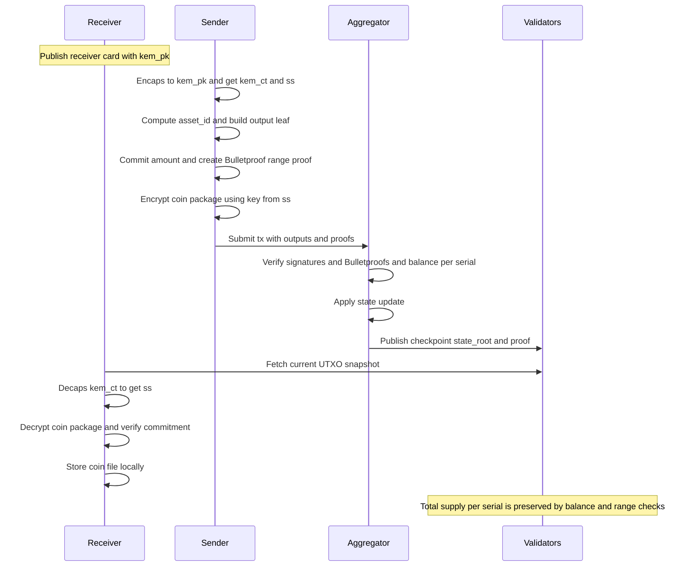
```mermaid
sequenceDiagram
  participant R as Receiver
  participant S as Sender
  participant A as Aggregator
  participant V as Validators

  Note over R: Publish receiver card with kem_pk

  S->>S: Encaps to kem_pk and get kem_ct and ss
  S->>S: Compute asset_id and build output leaf
  S->>S: Commit amount and create Bulletproof range proof
  S->>S: Encrypt coin package using key from ss
  S->>A: Submit tx with outputs and proofs

  A->>A: Verify signatures and Bulletproofs and balance per serial
  A->>A: Apply state update
  A->>V: Publish checkpoint state_root and proof

  R->>V: Fetch current UTXO snapshot
  R->>R: Decaps kem_ct to get ss
  R->>R: Decrypt coin package and verify commitment
  R->>R: Store coin file locally

  Note over V: Total supply per serial is preserved by balance and range checks
```

------

## 


------

## 2) Как эта проблема решается в “PQ + recursion (FRI)” варианте

Ты сам сформулировал правильный итог:

- `s_in` **не раскрывается** (ни публично, ни нотариусу)
- **не нужен reveal / rewind**
- **recursive proof** даёт “навсегда O(1) на чекпойнт” и trustless-проверяемость

И тут ключевой рефрейм:

### Вместо “подпись = право владения”

**Право владения = “я могу построить корректный witness для proof”**, а в witness входят секреты, которые есть только у владельца (и которые не передаются нотариусу).

Это **не SNARK с trusted setup** (ты этого не хочешь) — STARK/FRI обычно называют “transparent” (без trusted setup). ([Hacken](https://hacken.io/discover/zk-snark-vs-zk-stark/?utm_source=chatgpt.com))

------

## 3) Главная глава “для чайников”: **Ownership через секреты монеты + proof-правила**

Ниже — “как должно работать” простыми словами, но строго по шагам.

### 3.1 Что у получателя есть заранее

**Receiver card (публично/оффчейн):**

- `kem_pk` (ML-KEM) — чтобы sender мог сделать Encaps
- (опционально) `owner_id` — НЕ на цепи, а в “визитке/QR”, чтобы sender мог посчитать `owner_tag` (см. ниже)

**У получателя в кошельке (секретно):**

- `receiver_secret` — длинный симметричный секрет (32 байта)

> Важно: `receiver_secret` — это “мастер-секрет владения”, как master-private-key в обычных кошельках.

------

### 3.2 Что делает sender, чтобы создать output (и почему он *может* это сделать)

**Шаг A — доставка / обнаружение (PQ):**

1. Sender делает `(kem_ct, ss) = ML-KEM.Encaps(kem_pk)`
   Стандарт: FIPS 203.
   Типовые размеры зависят от параметров; см. FIPS 203 / OQS. ([NIST Publications](https://nvlpubs.nist.gov/nistpubs/FIPS/NIST.FIPS.203.ipd.pdf?utm_source=chatgpt.com))
2. Sender кладёт `kem_ct` в UTXO leaf (чтобы receiver потом мог Decaps и получить `ss`).

**Шаг B — конфиденциальная сумма (Classic ECC):**

- Sender строит `C_amount` (Pedersen / switch commitment) и Bulletproof range-proof (это **классика**, не PQ).

**Шаг C — “метка владельца” owner_tag (PQ-без DH):**
Чтобы sender мог создать output **не зная `receiver_secret`**, но чтобы тратить мог только владелец, вводится:

- `owner_id = H("OWNER" || receiver_secret)` — **это вычисляет только receiver**, но может опубликовать `owner_id` на визитке (оффчейн).
- `owner_tag = H("TAG" || owner_id || ss || asset_id || serial_id)` — **sender может посчитать**, потому что знает `ss` и (оффчейн) знает `owner_id`.

**Итог:** sender способен сформировать leaf, потому что ему не нужен `receiver_secret`.

------

### 3.3 Что хранится в UTXO leaf

Минимально (то, что ты уже набросал как “путь A”):

```yaml
UTXO_LEAF_V1:
  key:
    asset_id: "hex32"
  value:
    serial_id: "hex32"
    C_amount: "<commitment bytes>"     # classic ECC
    range_proof: "<bytes>"             # classic ECC (Bulletproofs)
    kem_ct: "<bytes>"                  # PQ (ML-KEM)
    owner_tag: "hex32"                 # hash
    memo_ct: "<bytes optional>"        # optional
```

------

### 3.4 Как receiver “находит” монету (без reveal/rewind)

1. Receiver сканирует новые leaves (или получает pointer через inbox).
2. Для leaf он делает `ss = ML-KEM.Decaps(kem_sk, kem_ct)`.
3. Дальше он может:
   - проверить `owner_tag` (зная `receiver_secret` ⇒ `owner_id`)
   - расшифровать `memo_ct` / `coin_ct` (если ты хранишь там метаданные)

------

### 3.5 Как происходит трата **без подписи владельца и без раскрытия `s_in`**

Теперь самое важное (простыми словами):

- В обычном блокчейне “я владелец” доказывается подписью.
- У тебя “я владелец” доказывается тем, что ты **внутри recursive proof** показываешь:
  1. входы действительно были в UTXO-сете,
  2. баланс и range-proof корректны,
  3. и **ты знаешь секрет**, который согласуется с `owner_tag`.

При этом **наружу** ты отдаёшь только:

- `new_state_root`
- `recursive_proof`

А секреты (`receiver_secret`, `ss`, blinding’и и т.д.) остаются **только в witness**.

Это и есть “proof-of-secrets”, но человеческими словами:

> *«Я показал математическую квитанцию, что я знаю нужные секреты, но сами секреты никому не отдал.»*

------

## 4) Где здесь PQ, а где можно оставить classic ECC

### PQ-части

- **ML-KEM** (доставка/обнаружение): FIPS 203
- **Recursive proof на FRI/STARK**: “transparent”, без trusted setup ([Hacken](https://hacken.io/discover/zk-snark-vs-zk-stark/?utm_source=chatgpt.com))
- Хеши/KDF (берёшь 256-бит) — PQ-ok (с запасом под Гровера)

### Classic ECC-части (PQ-lite, “временно нормально”)

- Pedersen/switch commitments
- Bulletproof range proofs

------

## 6) Mermaid: рабочие версии (Mermaid 11.9)

### 6.1 Output creation + receiving (исправлено: без `+` и без `->` в label)

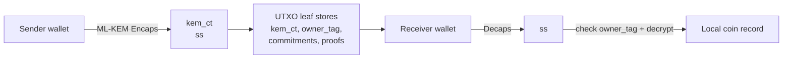
```mermaid
flowchart LR
  S[Sender wallet] -->|ML-KEM Encaps| B[kem_ct<br/>ss]
  B --> L[UTXO leaf stores<br/>kem_ct, owner_tag,<br/>commitments, proofs]
  R[Receiver wallet] -->|Decaps| SS[ss]
  SS -->|check owner_tag + decrypt| C[Local coin record]
  L --> R
```

### 6.2 Spend через recursive proof (FRI/STARK)

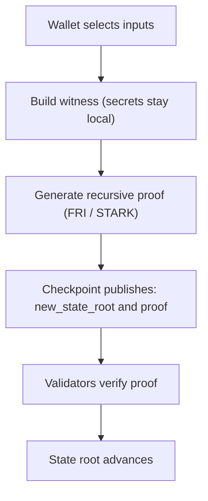
```mermaid
flowchart TD
  W["Wallet selects inputs"] --> P["Build witness (secrets stay local)"]
  P --> PR["Generate recursive proof (FRI / STARK)"]
  PR --> CHK["Checkpoint publishes: new_state_root and proof"]
  CHK --> V["Validators verify proof"]
  V --> OK["State root advances"]

```

------

## 7) Короткий список “ям” (pitfalls), которые нужно явно закрыть в whitepaper

1. **Определить, кто генерирует proof**
   -  для твоего требования: **proof генерирует кошелёк** 
2. **Domain separation**
   - Везде `H("TAG"||...)`, `H("OWNER"||...)`, `KDF("...")` — фиксируй строки доменов в спецификации.
3. **tx_digest / canonical encoding**
   - Даже если “подписи нет”, всё равно нужно определить, что именно коммитится в доказательстве как “текст транзакции”.
4. **Anti-DoS**
   - если receiver должен Decaps на каждый leaf — нужен либо inbox-pointer, либо экономический weight/fee.


---


> pochemu imenno "recursive_proof" chto imenno dolzhno dokazivatdja rekursivnov  “я могу построить корректный witness для proof” ?
> pochemu ne one-time proof ?

Потому что у тебя две **разные задачи**, и “recursive proof” решает именно вторую. One-time proof решает только первую.

------

## 1) Что вообще должен доказывать proof

В твоей модели proof должен убеждать валидаторов в двух вещах:

### A) Переход состояния корректен

- каждый input реально был в прошлом состоянии (membership в UTXO/state root)
- inputs не потрачены дважды
- outputs корректно сформированы (commitments, ML-KEM поля, тэги/хэши и т.д.)
- баланс соблюдён (Σin − Σout − fee = 0 по commitment’ам)
- range proof’ы валидны (нет “отрицательных” сумм)

### B) Авторизация траты (ownership)

- тратящий **знает секрет монеты** (или набор секретов), который по правилам протокола даёт право удалить конкретные inputs и создать конкретные outputs
- при этом **секреты не раскрываются** публично

------

## 2) Почему не “one-time proof”

Если ты делаешь one-time proof **на каждую транзакцию**, то валидатору всё равно придётся:

- проверять **каждый** proof (на каждую tx)
- либо хранить данные для проверки (или доступ к ним)

При высоком TPS это упирается в стоимость верификации и/или в то, что “навсегда” будет расти объём проверяемых артефактов.

------

## 3) Что именно даёт recursion

### Идея простая:

**каждый следующий proof доказывает, что предыдущий proof был проверен**, плюс добавляет новые транзакции/апдейты.

То есть “recursive proof” на чекпойнт доказывает:

- “Я корректно применил batch транзакций к предыдущему state_root”
- “Я проверил все подпруфы внутри (ownership + range + balance + membership)”
- “Получившийся new_state_root соответствует этим апдейтам”

И валидатору нужно проверить **один** короткий объект на чекпойнт (или один proof на N секунд/блоков), а не миллионы отдельных артефактов.

------

## 4) Почему это критично именно тебе

Ты сам обозначил боль:

- **O(1) навсегда на чекпойнт**
- без вечных списков `deleted/inserted`
- и без раскрытия `s_in` ни публично, ни нотариусу

Вот это и делает recursion полезным: она **сжимает** “я проверил много событий” в **один** проверяемый объект.

One-time proof не сжимает историю: он доказывает один факт про одну tx, но не даёт “вечную компактность” и “лёгкую проверку всей цепочки по корням”.

------

## 5) “Я могу построить корректный witness” — это что именно

Формально proof доказывает не фразу, а конкретные предикаты, например:

- `VerifyMembership(prev_root, input_leaf, path_witness) == true`
- `VerifyRangeProof(C_amount, bp) == true`
- `VerifyBalance(ΣCin, ΣCout, fee_commit) == true`
- `OutputDerivationIsValid(kem_ct, owner_tag, coin_id, ...) == true` (по твоим правилам)
- `OwnershipWitnessHolds(secret_material, input_id) == true` (секрет монеты/ключи)

То есть proof говорит: **существует witness** (секреты и внутренние значения), который удовлетворяет всем правилам.

------

## 6) Когда one-time proof всё-таки достаточно

Если тебя устраивает, что:

- данные транзакций/диффов доступны навсегда **или**
- валидаторы проверяют каждую tx напрямую **или**
- у тебя маленький TPS

…тогда recursion не обязательна.

Но как только ты хочешь:

- огромный TPS
- вечное O(1) на чекпойнт
- prune/DA окна
- и компактную верификацию

— recursion становится “естественным” решением.

------


------

## 1) Зачем вообще `recursive_proof`, почему не “one-time proof”

### Если “one-time proof”:

Ты можешь сделать доказательство “вот этот batch корректен” — но тогда:

- либо **каждый checkpoint** должен “тащить” в доказательстве **всю историю с genesis** (доказательство растёт),
- либо валидаторы должны хранить/проверять **много отдельных proof’ов за долгое время** (время/данные растут).

### Зачем recursion:

Рекурсия делает так, что у тебя всегда один объект:

- Был: `Proof(height=N, root=R_N)`
- Добавили batch → получили новый:
  - `Proof(height=N+1, root=R_{N+1})`
- Размер и стоимость верификации **не растут с историей** (это и есть “O(1) chain”).

📌 Это стандартная логика “validity rollup”: **история схлопывается в один короткий proof + текущий state_root**.

------

## 2) Какие EXACTLY утверждения включает `CheckpointProof`

Ниже — минимально достаточный “набор утверждений” (claims), чтобы валидатор мог обновить `prev_root -> new_root`, не видя секретов.

### 2.1 Public inputs `CheckpointProof` (то, что видит валидатор)

```yaml
CheckpointProof_public_inputs:
  checkpoint_height: u64
  prev_root: "hex32"
  new_root: "hex32"

  batch_commitment_root: "hex32"   # Merkle root списка tx (или их хэшей)
  protocol_params_hash: "hex32"    # фиксирует версии крипто-параметров/правил

  fee_total_commitment: "<bytes>"  # если fee приватный (опционально)
  # либо fee_total_plain: u64       # если fee публичный (проще)
```

### 2.2 Claims (что именно доказывается)

```yaml
CheckpointProof_claims:
  - claim: "Batch binding"
    meaning: "Существует список tx_1..tx_m, коммитнутый в batch_commitment_root."

  - claim: "State transition correctness"
    meaning: "Если последовательно применить эффекты tx_1..tx_m к prev_root, получится new_root."

  - claim: "Each tx is valid"
    meaning: "Для каждого tx_i существует валидное TxProof_i по правилам протокола."

  - claim: "No double-spend inside batch"
    meaning: "Один и тот же input asset_id не может быть потрачен дважды в пределах batch."

  - claim: "Fee rules"
    meaning: "Fee корректно удержан (или корректно доказан как commitment), и не создаётся ценность из воздуха."

  - claim: "Serial/domain separation rules"
    meaning: "Правила по serial_id соблюдены (например, нельзя смешивать разные serial_id, если это запрещено)."
```

------

## 3) Как `CheckpointProof` связывается с `prev_root -> new_root`

Модель самая простая и правильная:

1. У тебя есть **дерево/мапа состояния** (UTXO set), корень = `prev_root`.
2. Каждый tx задаёт:
   - какие `asset_id` удалить (inputs)
   - какие `asset_id` добавить (outputs)
3. В доказательстве проверяется membership/non-membership и корректность перехода.

### “Связка” делается так:

- `prev_root` — **в public inputs**
- `new_root` — **в public inputs**
- доказательство утверждает:
  **существует последовательность обновлений дерева**, приводящая `prev_root` к `new_root`.

✅ Валидатору достаточно проверить один proof и записать `new_root`.

------

## 4) Какие секреты остаются ТОЛЬКО в witness (и не уходят в сеть)

Это ключевой список, который отвечает на “кто что знает”:

```yaml
Witness_secrets:
  # Ownership / spend authorization (приватно):
  - receiver_secret          # долгоживущий секрет получателя (или его wallet-seed derivation)
  - ss                       # shared secret из ML-KEM (или derived)

  # Confidential amounts:
  - v_in[]                   # суммы входов
  - r_in[]                   # блайндинги входных commitments
  - v_out[]                  # суммы выходов
  - r_out[]                  # блайндинги выходных commitments

  # Дополнительные приватные derivations:
  - output_coin_secrets[]    # если ты вводишь отдельный coin_secret, а не только ss
  - memo_plaintext           # если memo шифруется
```

Публично в tx/leaf остаются только:

- commitments (`C_amount`)
- `kem_ct`
- `owner_tag` (и/или другие теги)
- `asset_id`, `serial_id`
- proof(ы)

------

## 5) Глава: Ownership without signatures (owner_tag + witness) — “на пальцах”

### 5.1 Интуиция “2 замка”

Монета “закрыта” двумя секретами:

1. **`ss`** — получается из ML-KEM (есть у получателя после decaps; у отправителя тоже есть, поэтому одного ss недостаточно!)
2. **`receiver_secret`** — есть только у получателя

➡️ Потратить можно только если знаешь **оба**.
И это доказывается **внутри proof**, без раскрытия.

### 5.2 Как sender создаёт output и НЕ упирается в receiver_secret

Правильный вариант:

- sender публикует **только то, что он может вычислить**:
  - `kem_ct`
  - `owner_tag = H(TAG || owner_id || ss || ctx)`
  - commitments
- а “право траты” проверяется потом через proof по `receiver_secret` + `ss`.

Где `owner_id` — публичный идентификатор получателя (не раскрывает секрет):

```yaml
ReceiverCard_public:
  kem_pk: "<bytes>"
  owner_id: "hex32"  # owner_id = H("OWNER" || receiver_secret)
```

Sender может использовать `owner_id` (публичный) и `ss` (он его получил при encaps) и собрать `owner_tag`.

### 5.3 Что именно доказывается при spend (без подписей)

Внутри `TxProof` доказывается:

```yaml
Spend_auth_claim:
  - "Я знаю receiver_secret такой, что H('OWNER'||receiver_secret) == owner_id (публичный)."
  - "Я знаю ss такой, что H('TAG'||owner_id||ss||ctx) == owner_tag (из UTXO leaf)."
```

✅ И этого достаточно, чтобы:

- отправитель (у него есть ss) **не мог потратить** без receiver_secret
- посторонний **не мог угадать ss**
- валидатор **не видел секретов**

### 5.4 Рабочая Mermaid-схема “получение”

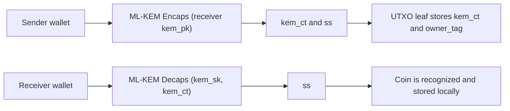
```mermaid
flowchart LR
  S["Sender wallet"] --> K["ML-KEM Encaps (receiver kem_pk)"]
  K --> CT["kem_ct and ss"]
  CT --> L["UTXO leaf stores kem_ct and owner_tag"]
  R["Receiver wallet"] --> D["ML-KEM Decaps (kem_sk, kem_ct)"]
  D --> SS["ss"]
  SS --> COIN["Coin is recognized and stored locally"]
```

------

## 6) Глава: Transaction format v2 (без revealed_spend_pk / spend_sig)

### 6.1 Главное изменение v2

- Вместо этого: **ownership доказывается в TxProof** (witness).

### 6.2 Минимальный TX_V2 (публичная часть)

```yaml
tx_v2:
  inputs:
    - asset_id: "hex32"
      serial_id: u32

  outputs:
    - asset_id: "hex32"
      serial_id: u32
      C_amount: "<commitment bytes>"
      kem_ct: "<bytes>"
      owner_tag: "hex32"
      memo_ct: "<bytes optional>"

  fee:
    # Вариант A (проще): публичная fee
    fee_plain: u64

    # Вариант B (приватнее): fee как commitment
    # fee_commitment: "<bytes>"

  proofs:
    tx_proof: "<STARK/FRI proof bytes>"

  tx_digest: "hex32"
```

### 6.3 Что должен доказывать `TxProof` (точно)

```yaml
TxProof_claims:
  - claim: "Inputs exist in prev_root"
    meaning: "Каждый input asset_id реально есть в UTXO set на prev_root."

  - claim: "Ownership of each input"
    meaning: "Для каждого input leaf prover знает receiver_secret и ss, соответствующие owner_tag."

  - claim: "No double-spend in this tx"
    meaning: "Внутри одной tx один asset_id не повторяется."

  - claim: "Balance"
    meaning: "Sum(v_in) - Sum(v_out) - fee == 0 (с учётом serial_id правил)."

  - claim: "Range constraints"
    meaning: "Каждый v_out (и v_in) в допустимом диапазоне."

  - claim: "State transition effect"
    meaning: "Удаляются inputs и добавляются outputs, получая новый root."
```

📌 Важно про `serial_id`:

- если `serial_id` — это разные “классы/серии”, то **нельзя** просто суммировать всё вместе.
- либо доказывай баланс **по каждой серии отдельно**, либо вводи правило “обмен между сериями” как отдельный механизм.

------

## 7) Mermaid “tx proofs -> batch -> recursive checkpoint proof -> validators” (рабочая)

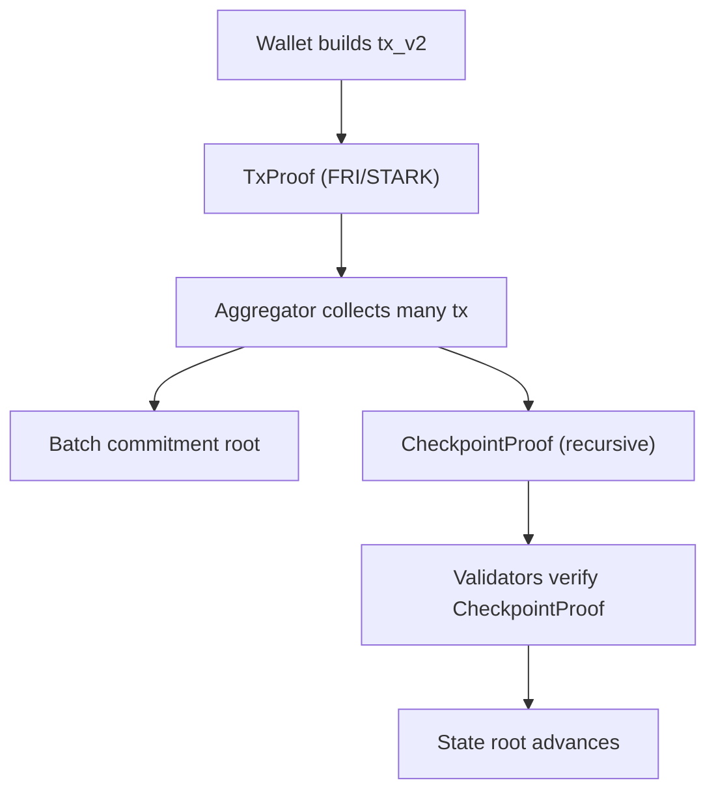
```mermaid
flowchart TD
  U["Wallet builds tx_v2"] --> TP["TxProof (FRI/STARK)"]
  TP --> AG["Aggregator collects many tx"]
  AG --> BR["Batch commitment root"]
  AG --> CP["CheckpointProof (recursive)"]
  CP --> V["Validators verify CheckpointProof"]
  V --> SR["State root advances"]
```

И “привязка корней”:

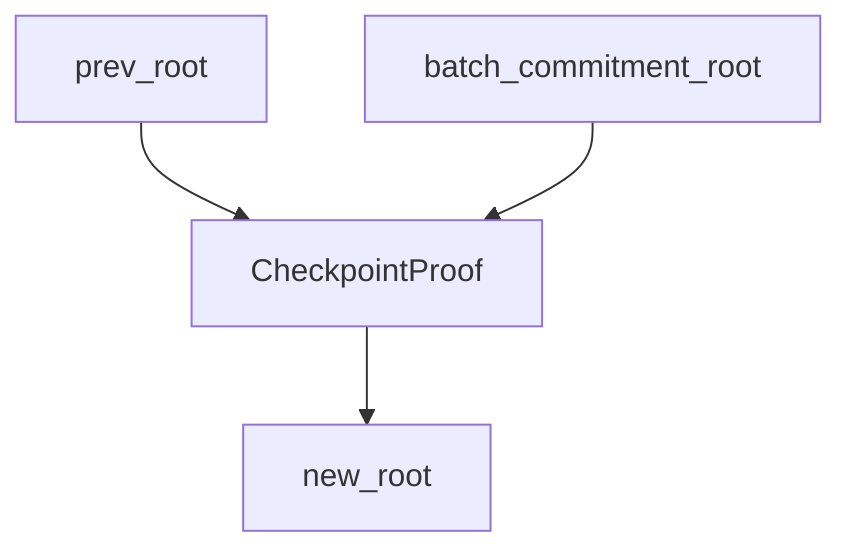
```mermaid
flowchart TD
  PR["prev_root"] --> CP["CheckpointProof"]
  BR["batch_commitment_root"] --> CP
  CP --> NR["new_root"]
```

------

## 8) Глава: Threat model (sender theft / notary theft / DoS)

### 8.1 Sender theft (отправитель пытается украсть output)

Риск: sender знает `ss` (у него он есть после encaps), значит “просто ss” как право траты — нельзя.

✅ Защита (как выше):

- право траты = знание **receiver_secret + ss** (через owner_tag)
- sender не знает receiver_secret → украсть не может

### 8.2 Notary/Aggregator theft (агрегатор ворует входы)

Если ты убираешь подписи, главный страх: “агрегатор увидит tx и переподпишет/украдёт”.

✅ В твоей схеме агрегатор не может:

- он **не знает** `receiver_secret` (и другие witness-секреты)
- а `TxProof` нельзя “пересобрать” без witness

То есть агрегатор максимум может:

- **цензурировать** (не включать tx)
- **DoS’ить** (нагрузка)
- но **не украсть**

### 8.3 DoS (спам proof’ами / перегрузка)

Риски:

- Дорогие проверки proof’ов
- Спам “мусорными” tx

✅ Митигирующие меры:

- fee (даже публичный) + правило “валидный tx должен платить fee”
- rate-limit на уровне агрегатора (не консенсус)
- минимальные prechecks до полной верификации proof

------

## 9) Как агрегатор / валидатор проверяют recursive proofs от кошелька

### 9.1 Что делает кошелёк

- строит `tx_v2` (публичные поля)
- строит witness (секреты)
- генерирует `TxProof`

### 9.2 Что делает агрегатор

- проверяет `TxProof` как “верификатор” (без секретов)
- если ок — кладёт tx в batch
- генерирует `CheckpointProof` (рекурсивно агрегируя TxProof’ы)

### 9.3 Что делает валидатор

- получает `(prev_root, new_root, batch_commitment_root, CheckpointProof)`
- **верифицирует только CheckpointProof**
- если ок → принимает `new_root`


### 10.2 Как исправить (минимально и правильно)

Сделай ровно то, что ты сейчас и хочешь:

**(B) Оставить в leaf только то, что sender может вычислить**

- `kem_ct`
- `owner_tag`
- commitments

**(C) Ownership проверять в `TxProof`** (witness-секреты).

📌 Точное место вставки в документ:

- **после заголовка** `## 10) Checkpoints: state_root-only + FRI recursion`
  вставить новые подпункты:
  - `### 10.x What CheckpointProof proves (exact claims)`
  - `### 10.x Public inputs vs Witness secrets`
  - `### 10.x Verification pipeline (wallet -> aggregator -> validators)`

📌 Точное место замены:

- заменить весь блок `## 8.2 Transaction Format (v1)` на `Transaction format v2` (как выше).

------

## 11) Про библиотеки (коротко, но по делу)

### ML-KEM / ML-DSA (PQ) в кошельке

Если ты реально используешь ML-KEM/ML-DSA как primitives — да, это обычно в кошельке.

Варианты реализаций на Rust:

- **libcrux-kem** (KEM) ([Crates.io](https://crates.io/crates/ml-kem/0.3.0-pre.2?utm_source=chatgpt.com))
- **libcrux-ml-dsa** (ML-DSA) ([Docs.rs](https://docs.rs/fips204_rs?utm_source=chatgpt.com))
- **oqs** crate (биндинги к Open Quantum Safe / liboqs)

Про сами стандарты NIST:

- ML-KEM (FIPS 203) ([GitHub](https://github.com/open-quantum-safe/liboqs-rust?utm_source=chatgpt.com))
- ML-DSA (FIPS 204) ([The Rust Programming Language Forum](https://users.rust-lang.org/t/ann-ml-kem-v0-2-0-pure-rust-implementation-of-the-fips-203-final-post-quantum-kem-construction-formerly-known-as-kyber/116111?utm_source=chatgpt.com))

⚠️ Но: если ты переходишь на “ownership без подписей”, то **ML-DSA уже не обязателен для spend-авторизации**, максимум остаётся как:

- анти-спам подпись “на уровне p2p/мемпула”
- идентификация кошелька для сервисов

### FRI recursion / proving stack

- Идеи STARK/FRI recursion активно используются в индустриальных стэках (пример: “Plonky2 … Plonk + FRI … emphasis on fast recursive techniques”). ([Polygon Docs](https://docs.polygon.technology/innovation-design/plonky/))
- Для чисто STARK-ориентированного направления часто упоминают Winterfell/Miden-линейку. ([NIST Publications](https://nvlpubs.nist.gov/nistpubs/SpecialPublications/NIST.SP.800-227.pdf?utm_source=chatgpt.com))

------


------

# Глава 1 — TxProof: как “я владелец” доказывается математически

## 1) Что такое “владелец” в твоей схеме

Владелец — это тот, кто знает **два секрета**, связанные с leaf:

- `receiver_secret` (долгоживущий секрет кошелька получателя)
- `ss` (shared secret, полученный из ML-KEM: `ss = Decaps(kem_sk, kem_ct)`)

И leaf содержит публично:

- `owner_id` (или производное от него, см. ниже)
- `kem_ct`
- `owner_tag`

### Публично в leaf

```yaml
leaf_public:
  owner_id: H("OWNER" || receiver_secret)        # (или его эквивалент)
  kem_ct: <ML-KEM ciphertext>
  owner_tag: H("TAG" || owner_id || ss || ctx)
```

> `ctx` — контекст (chain_id, asset_id, prev_root, serial_id — что ты выберешь), чтобы нельзя было “переносить” tag между листьями.

------

## 2) Где тут “математика”: две проверки равенства хэшей

“Я владелец” в доказательстве = **существуют такие секреты**, что выполняются два публично проверяемых равенства.

### (A) Привязка к получателю

Доказываем, что ты знаешь `receiver_secret`, дающий правильный `owner_id`:
$$
\exists\ receiver\_secret:\ \ owner\_id = H("OWNER"\ \|\ receiver\_secret)
$$

### (B) Привязка к конкретному выходу

Доказываем, что ты знаешь `ss`, согласованный с `owner_tag`:
$$
\exists\ ss:\ \ owner\_tag = H("TAG"\ \|\ owner\_id\ \|\ ss\ \|\ ctx)
$$
Итого ownership-утверждение в ZK:
$$
\exists\ receiver\_secret, ss:\ 
\begin{cases}
owner\_id = H("OWNER"\|receiver\_secret) \\
owner\_tag = H("TAG"\|owner\_id\|ss\|ctx)
\end{cases}
$$
⚠️ Важно: **это не “подпись”**, а **доказательство знания preimage’ов** для двух хэшей.

------

## 3) Откуда берётся `ss` и почему sender не может украсть

Sender при создании output знает `ss` (из Encaps), но **не знает `receiver_secret`**.

Поэтому он не может выполнить одновременно оба уравнения (A) и (B) внутри `TxProof`.

- `ss` без `receiver_secret` — недостаточно
- `receiver_secret` без `ss` — тоже недостаточно

------

## 4) Но как доказать `ss`, если `ss` получатель узнаёт только при Decaps?

Тут два варианта дизайна (выбери один; оба “проверяемые”):

### ==Вариант 1== (простой для понимания): `ss` = witness, но KEM корректность **не доказываем**

То есть `ss` — просто секрет, который “случайно” подходит под `owner_tag`.

А почему это не позволяет украсть? Потому что `owner_tag` построен так, что без знания `ss` его нельзя подобрать.

Минус: теоретически attacker мог бы пытаться подобрать `ss` под tag, но при 256-битном хэше это нереально.

### Вариант 2 (строгий): доказываем, что `ss` действительно = Decaps(kem_sk, kem_ct)

Это “идеально”, но тогда **нужно тащить ML-KEM внутрь арифметики доказательства**, что обычно тяжело.

На практике почти все системы:

- либо не доказывают KEM внутри ZK (Variant 1),
- либо делают это только на уровне “proof system friendly crypto”.

**Для твоего “for dummies + реально”** — вариант 1 норм, а KEM остаётся “вне доказательства”, как защищённый канал получения ss.

------

## 5) Как доказывается “input был в UTXO”

Это обычная Merkle/JMT-логика.

Leaf лежит в дереве состояния `prev_root`.
 В witness кладётся:

- Merkle-путь `path`
- leaf value

Проверяется:
$$
VerifyMerkle(prev\_root,\ leaf,\ path) = true
$$
Это легко проверяет агрегатор (вне ZK), но если ты хочешь “всё внутри TxProof”, то Merkle-verification делается constraints-ами.

------

## 6) Как доказывается баланс и range

Тут аналогично:

- **Баланс**: доказываешь, что существуют скрытые `v_in, v_out` и блайндинги `r_in, r_out`, согласованные с commitment’ами, и что:

$$
\sum v_{in} - \sum v_{out} - fee = 0
$$

- **Range**: доказываешь, что каждое `v_out` в диапазоне `[0, 2^k)`.

Если ты используешь STARK/FRI, то range constraints — это обычные constraints (битовая декомпозиция/табличные проверки).

------

## 7) Что именно проверяет агрегатор (без секретов)

Агрегатор НЕ “верит словам”, он делает чистую верификацию:

### Он берёт публичные данные tx:

- список `inputs.asset_id`
- ссылки на `leaf` (или сами leaf)
- `owner_id`, `owner_tag`, `kem_ct`, commitments, fee, etc
- `tx_proof`

### И делает проверки:

1. **State membership**

- либо: проверяет Merkle/JMT membership proofs на `prev_root` (вне ZK)
- либо: убеждается, что это уже включено в `tx_proof` (если у тебя так)

1. **Verify(tx_proof, public_inputs) == OK**
   То есть он запускает verifier твоей proof-системы:

- `public_inputs` включают `prev_root`, `new_root` (или tx-delta), `owner_tag` из leaf, commitments, fee, serial_id и т.д.
- если verifier сказал OK — значит **существует witness**, удовлетворяющий всем constraints, включая ownership-уравнения (A)(B).

1. **Sanity checks**

- no duplicate inputs внутри tx
- fee >= min
- размеры лимитов

И всё. Никакой “дополнительной магии” агрегатору не нужно.

------

## Ключевой пробел (то, что тебя смущает): “как агрегатор может быть уверен, что ‘я знаю секрет’ правда?”

Ответ: потому что **TxProof — это доказательство существования witness**, а verifier математически гарантирует:

- если proof верен, то **существует** witness, удовлетворяющий constraints
- значит существуют `receiver_secret` и `ss`, такие что выполняются уравнения (A)(B)
- иначе proof невозможно построить (с вероятностью, пренебрежимо малой для soundness)

------

# Глава 2 — CheckpointProof: как из TxProof делается batch и рекурсия

## 1) Что делает агрегатор на уровне чекпойнта

У него есть набор валидных tx (каждая уже с TxProof).

Он строит:

- `batch_commitment_root` = Merkle root всех `tx_digest`
- применяет tx-дельты к state (логически) и получает `new_root`
- строит `CheckpointProof`, который доказывает:

**“Я взял именно этот batch_commitment_root, все tx в нём валидны (TxProof верны), и переход prev_root->new_root корректен.”**

## 2) Что именно доказывает CheckpointProof (минимальный набор)

$$
VerifyCheckpoint(prev\_root,\ batch\_root,\ new\_root,\ CP\_proof)=true
\Rightarrow
\exists \{TxProof_i, \Delta_i\}
$$

где:

- каждый `TxProof_i` валиден
- `new_root = ApplyAll(prev_root, Δ_1..Δ_m)`
- нет конфликтов (один input потрачен дважды в batch)

## 3) Как это проверяют валидаторы

Валидатор не проверяет все tx, он проверяет 1 штуку:

- `VerifyCheckpointProof(...) == OK`

и принимает `new_root`.

------

## Mermaid (простая, чтобы не падало)

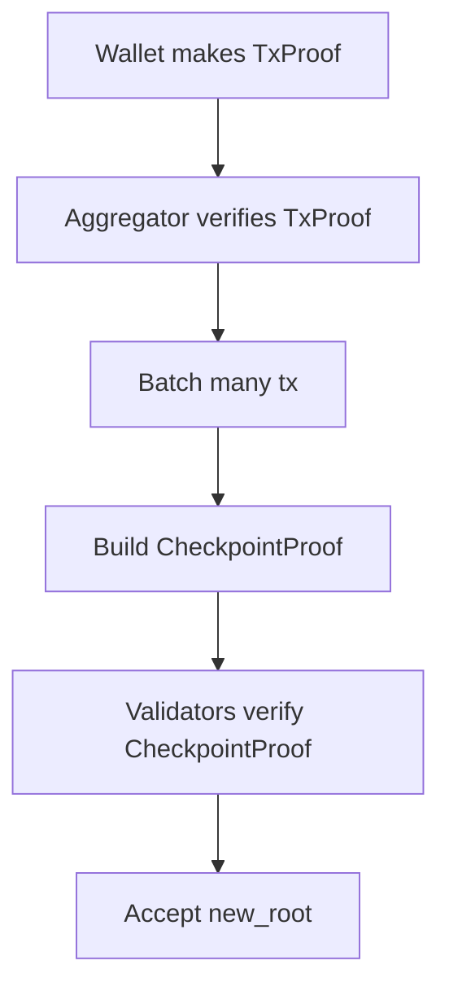
```mermaid
flowchart TD
  A[Wallet makes TxProof] --> B[Aggregator verifies TxProof]
  B --> C[Batch many tx]
  C --> D[Build CheckpointProof]
  D --> E[Validators verify CheckpointProof]
  E --> F[Accept new_root]
```

------

## Самое важное уточнение (чтобы схема была криптографически “чистой”)

Тебе нужно выбрать, **входит ли `owner_id` в публичный leaf**.

### Вариант А: `owner_id` публичный

- sender знает `owner_id`, может построить `owner_tag`
- proof доказывает `H("OWNER"||receiver_secret)=owner_id`
- ==**приватность: `owner_id` не должен быть “адресом”, он должен быть случайным и не связываться с человеком публично**== 

### Вариант Б: `owner_id` не публикуем

Тогда sender не сможет собрать `owner_tag` корректно без дополнительных конструкций. Этот вариант обычно ломает “одноразовый output без интерактива”.

➡️ Для твоего “sender может создать output” нужен **Вариант А**.


==`ss` внутри TxProof **как просто witness** (без доказательства Decaps)==

---


### X.7 Implementation: reusable open-source code (“steal, don’t reinvent”)

**Rust (ML-KEM):**

- `ml-kem` (pure Rust, explicitly FIPS 203) ([Crates](https://crates.io/crates/ml-kem?utm_source=chatgpt.com))
- `mlkem-fips203` (pure Rust, FIPS 203) ([Crates](https://crates.io/crates/mlkem-fips203?utm_source=chatgpt.com))

**Rust (PQ signatures if/when you want them):**

- `ml-dsa` (pure Rust ML-DSA / FIPS 204) ([Crates](https://crates.io/crates/ml-dsa?utm_source=chatgpt.com))
  FIPS 204 signature sizes are **~2.4KB / 3.3KB / 4.6KB** depending on parameter set. ([NIST Publications](https://nvlpubs.nist.gov/nistpubs/fips/nist.fips.204.pdf))

**C (battle-tested library collection):**

- `liboqs` (Open Quantum Safe) ([Open Quantum Safe](https://openquantumsafe.org/liboqs/?utm_source=chatgpt.com))

If you want to paste URLs into your doc, keep them in a code block:

```text
https://nvlpubs.nist.gov/nistpubs/fips/nist.fips.203.pdf
https://crates.io/crates/ml-kem
https://crates.io/crates/mlkem-fips203
https://crates.io/crates/ml-dsa
https://openquantumsafe.org/liboqs/
```

------

### Mermaid diagram (safe syntax)

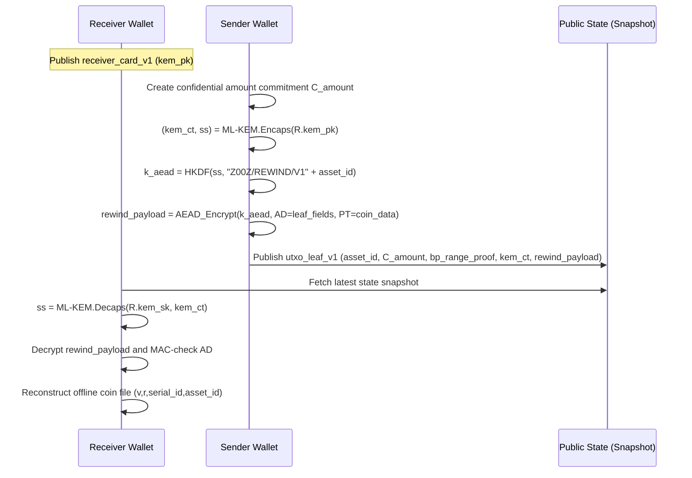
```mermaid
sequenceDiagram
  participant R as Receiver Wallet
  participant S as Sender Wallet
  participant V as Public State (Snapshot)

  Note over R: Publish receiver_card_v1 (kem_pk)
  S->>S: Create confidential amount commitment C_amount
  S->>S: (kem_ct, ss) = ML-KEM.Encaps(R.kem_pk)
  S->>S: k_aead = HKDF(ss, "Z00Z/REWIND/V1" + asset_id)
  S->>S: rewind_payload = AEAD_Encrypt(k_aead, AD=leaf_fields, PT=coin_data)
  S->>V: Publish utxo_leaf_v1 (asset_id, C_amount, bp_range_proof, kem_ct, rewind_payload)
  R->>V: Fetch latest state snapshot
  R->>R: ss = ML-KEM.Decaps(R.kem_sk, kem_ct)
  R->>R: Decrypt rewind_payload and MAC-check AD
  R->>R: Reconstruct offline coin file (v,r,serial_id,asset_id)
```

------

------

## Section Y — One-Time Anonymous Inbox Session (Optional, Strongly Recommended)

This section is **not required** for one-way payments, but it’s the cleanest way to get:

- zero on-chain receiver identifiers,
- cheap discovery,
- and resistance to receiver DoS via “force you to scan everything”.

### Mini-TOC

- Y.1 Goal
- Y.2 One-time inbox offer (invoice/session)
- Y.3 Message formats (YAML)
- Y.4 Anti-DoS rules (fees/TTL/deposits)
- Y.5 Security requirements

------

### TODO checklist

-  Choose transport: Tor/I2P mailbox, store-and-forward relay, etc.
-  Add TTL + garbage collection.
-  Add deposit / rate limits per inbox.
-  Decide invoice authenticity: QR / TOFU / signed offers.
-  Add replay protection (counters/nonces).

------

### Y.1 Goal

Enable **asynchronous, one-time, unlinkable notification**:

- Receiver can be offline.
- Sender can deliver `(serial_id, asset_id)` pointer and optionally a copy of the coin file.
- Uses ML-KEM once to establish a symmetric session key (PQ secrecy). ([NIST Computer Security Resource Center](https://csrc.nist.gov/pubs/fips/203/final?utm_source=chatgpt.com))

------

### Y.2 One-time inbox offer (invoice/session)

Receiver publishes (or shares via QR) a one-time offer:

```yaml
inbox_offer_v1:
  offer_id: "16B random"
  expires_at: 1730000000
  inbox:
    kind: "tor_mailbox"       # or i2p_mailbox, relay, etc
    address: "<string>"
  kem:
    scheme: "ML-KEM-768"
    pk_ephemeral: "<bytes>"
  auth:
    mode: "qr_or_tofu_or_signed"
```

------

### Y.3 Messages

**Session init (Sender → Inbox):**

```yaml
msg_init_v1:
  offer_id: "16B"
  kem_ct: "<bytes>"
  aead:
    alg: "XChaCha20-Poly1305"
    nonce: "<24B>"
    ciphertext: "<bytes>"
  plaintext_example:
    type: "PAYMENT_NOTIFY"
    pointers:
      - serial_id: "SERIAL-XYZ"
        asset_id: "32B"
    note: "optional"
```

**Receipt / follow-up (still symmetric, no more KEM):**

```yaml
msg_receipt_v1:
  offer_id: "16B"
  aead:
    alg: "XChaCha20-Poly1305"
    nonce: "<24B>"
    ciphertext: "<bytes>"
  plaintext_example:
    type: "CHECKPOINT_RECEIPT"
    checkpoint_ref: "<id>"
    pointers:
      - serial_id: "SERIAL-XYZ"
        asset_id: "32B"
```

------

### Y.4 Anti-DoS rules (must exist)

If you run mailboxes/relays, you need **cost** for storage/relay:

```yaml
inbox_dos_rules_v1:
  ttl_hours: 72
  max_msg_bytes: 4096
  rate_limit:
    max_msgs_per_hour: 30
  deposit:
    required: true
    refunded_on_read: true
  proof_of_work:
    enabled: optional
    difficulty: "low"
```

This keeps the inbox from becoming “infinite free storage”.

------

### Y.5 Security requirements

- **REQ-Y1: Anonymity is network-layer.** ML-KEM encrypts content, but Tor/I2P/mailbox hides metadata.
- **REQ-Y2: Offer authenticity matters.** If an attacker swaps the offer, funds go to wrong destination. Practical options:
  - QR from the receiver device (best UX),
  - TOFU (store offer fingerprint per contact),
  - or **signed offers** (signature cost is per invoice, not per tx).
- **REQ-Y3: Replay protection.** Track `offer_id` and message counters.

------

### Mermaid diagram (safe syntax)

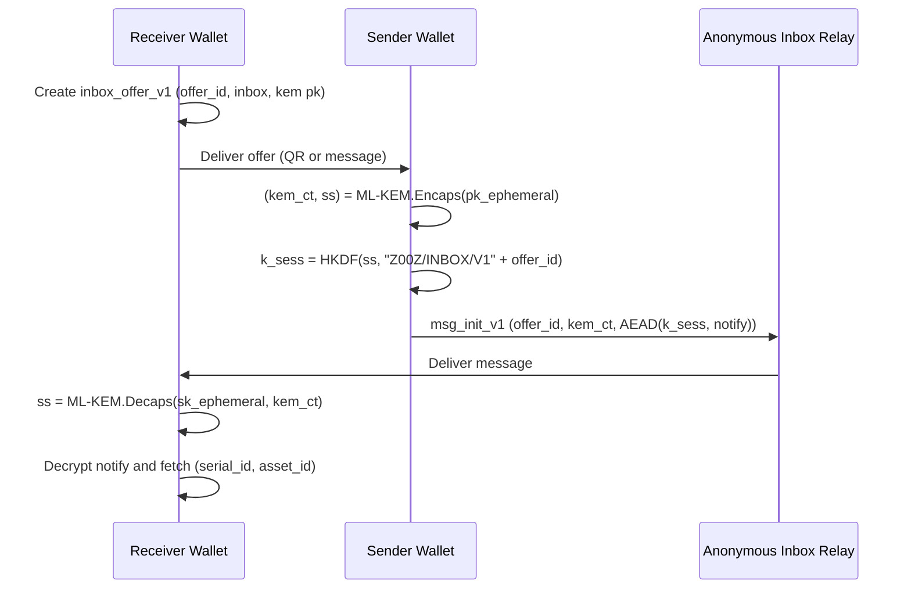
```mermaid
sequenceDiagram
  participant R as Receiver Wallet
  participant S as Sender Wallet
  participant M as Anonymous Inbox Relay

  R->>R: Create inbox_offer_v1 (offer_id, inbox, kem pk)
  R->>S: Deliver offer (QR or message)
  S->>S: (kem_ct, ss) = ML-KEM.Encaps(pk_ephemeral)
  S->>S: k_sess = HKDF(ss, "Z00Z/INBOX/V1" + offer_id)
  S->>M: msg_init_v1 (offer_id, kem_ct, AEAD(k_sess, notify))
  M->>R: Deliver message
  R->>R: ss = ML-KEM.Decaps(sk_ephemeral, kem_ct)
  R->>R: Decrypt notify and fetch (serial_id, asset_id)
```

------

### What in this is “your know-how” vs “standard crypto”

- **Standard / well-known:** ML-KEM (FIPS 203), ML-DSA (FIPS 204), Bulletproofs (no trusted setup), AEAD/HKDF. ([NIST Publications](https://nvlpubs.nist.gov/nistpubs/fips/nist.fips.203.pdf))
- **Your Z00Z-specific know-how / composition:**
  “**Public state = latest snapshot only** + **offline coin files** + **confidential amounts** + **PQ-KEM rewind payload** + **tx expiry**.”
  That combination is the real privacy lever: the public layer carries **minimal receiver metadata**, and anything that could become linkable in the future simply **doesn’t remain available long-term**.

If you paste this into your tutorial, you now have a **consistent story**: ML-KEM is for **delivery/discovery**, Bulletproofs/Pedersen are for **confidential amounts**, and discovery privacy is achieved by choosing one of the three modes (inbox best, scan simplest, rotate bounded linkability).

---

## 5) Важно про “не всё PQ”

Bulletproofs/Pedersen **не PQ** (они опираются на дискретный лог), то есть “PQ amount privacy” в строгом смысле здесь нет; при этом сама логика владения/траты может быть устроена так, чтобы не зависеть от `ss` и не давать отправителю/агрегатору красть.

------

## 6) Mermaid (как это работает) — только PQ-релевантное

### 6.1 Получение монеты (односторонне)

Источник:

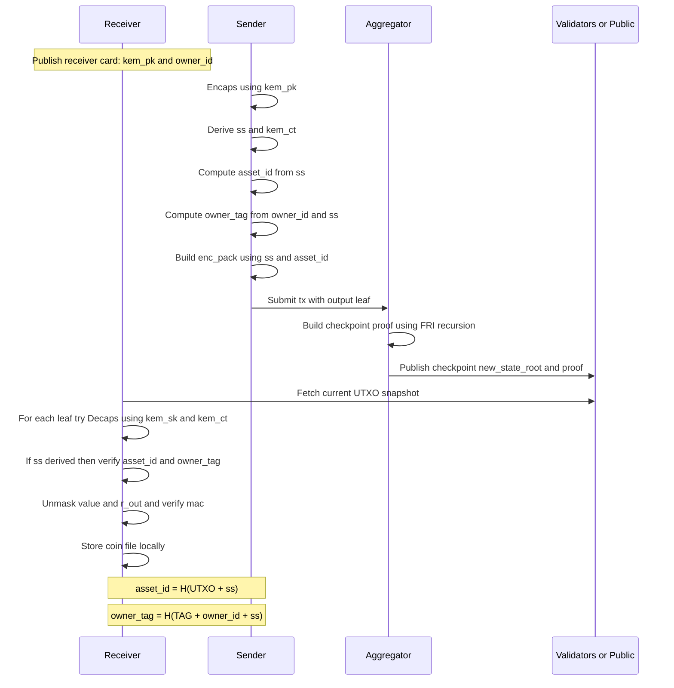
```mermaid
sequenceDiagram
  participant R as Receiver
  participant S as Sender
  participant A as Aggregator
  participant V as Validators or Public

  Note over R: Publish receiver card: kem_pk and owner_id

  S->>S: Encaps using kem_pk
  S->>S: Derive ss and kem_ct
  S->>S: Compute asset_id from ss
  S->>S: Compute owner_tag from owner_id and ss
  S->>S: Build enc_pack using ss and asset_id
  S->>A: Submit tx with output leaf

  A->>A: Build checkpoint proof using FRI recursion
  A->>V: Publish checkpoint new_state_root and proof

  R->>V: Fetch current UTXO snapshot
  R->>R: For each leaf try Decaps using kem_sk and kem_ct
  R->>R: If ss derived then verify asset_id and owner_tag
  R->>R: Unmask value and r_out and verify mac
  R->>R: Store coin file locally

  Note over S,R: asset_id = H(UTXO + ss)
  Note over S,R: owner_tag = H(TAG + owner_id + ss)
```

### 6.2 Трата монеты (без раскрытия `s_in`)

Источник:

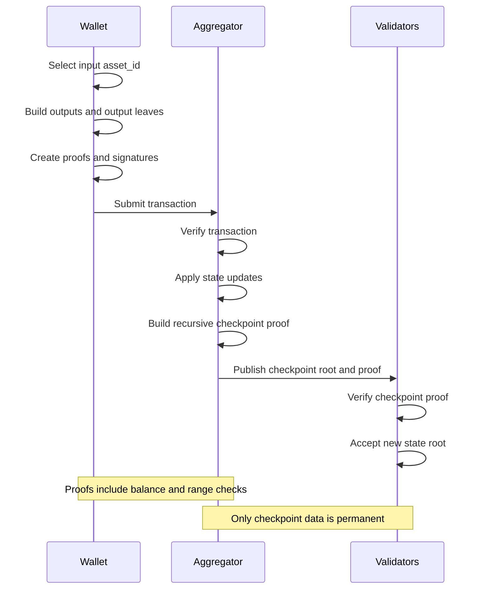
```mermaid
sequenceDiagram
  participant W as Wallet
  participant A as Aggregator
  participant V as Validators

  W->>W: Select input asset_id
  W->>W: Build outputs and output leaves
  W->>W: Create proofs and signatures
  W->>A: Submit transaction

  A->>A: Verify transaction
  A->>A: Apply state updates
  A->>A: Build recursive checkpoint proof
  A->>V: Publish checkpoint root and proof

  V->>V: Verify checkpoint proof
  V->>V: Accept new state root

  Note over W,A: Proofs include balance and range checks
  Note over A,V: Only checkpoint data is permanent
```

---

---


# PQ: минимальный публичный слой + рекурсивные чекпойнт-доказательства

## 0) Жёсткие требования (фиксируем)

- ✅ **Trustless публичная проверяемость**: любой может проверить “инварианты не сломаны / инфляции нет”.
- ✅ **Privacy first-class**: в публичном слое **нет адресов**, нет меток получателя.
- ✅ **Никаких “вечных списков”** (`deleted/inserted`, kernels-история и т.п.), которые растут с TPS.
- ✅ **Без trusted setup**.
- ✅ **Amounts скрыты** (Commitments + Bulletproofs), номиналы не фиксированные.
- ✅ **PQ-элементы там, где реально нужно** (доставка coin-package через ML-KEM, подписи/авторизация — без “ECC как единственной опоры”).
- ✅ **Получатель узнаёт о платеже через one-way доставку coin-package**, а не через публичный скан.

## 4) One-way доставка coin-package (получатель не сканирует публичный слой)

### Receiver “визитка” (публичная, может быть статичная)

```yaml
RECEIVER_CARD_V1:
  kem_scheme: "ML-KEM-512"        # или 768
  kem_pk: bytes
  delivery_endpoints:
    - "tor://..."
    - "i2p://..."
    - "https://mailbox-relay/..."
```

### Coin-package (то, что получает получатель)

Coin-package — это “оффчейн-монета” в твоём смысле: всё, что нужно кошельку, чтобы владеть и потом тратить.

```yaml
COIN_PACKAGE_V1:
  asset_id: bytes32
  value_units: u64
  r_out: bytes32               # blinding/opening для commitment
  spend_secret_s: bytes32      # секрет владения (НЕ раскрывается сети)
  checkpoint_ref:
    height: u64
    new_state_root: bytes32

  # чтобы получатель мог trustless проверить “эта монета реально в состоянии”
  inclusion_proof:
    merkle_proof: bytes        # proof membership asset_id -> leaf under new_state_root
    leaf: UTXO_LEAF_V3

  memo_optional: bytes?
```

**Шифрование доставки (MUST):**

- coin-package **должен** шифроваться на `kem_pk` получателя (ML-KEM → ss → AEAD).
- публичный слой при этом остаётся “немым”: адресов/меток нет.

------

## 5) Трата без раскрытия `s_in` (ни публично, ни нотариусу)

Ключевой сдвиг твоего “последнего понимания”:

- авторизация траты происходит **внутри доказательства**,
- `s_in` остаётся **только в кошельке** и никогда не утекает как материал, который кто-то может скопировать и “вклиниться”.

### TX_WITNESS_V1 (видит только prover внутри кошелька)

```yaml
TX_WITNESS_V1:
  inputs:
    - asset_id: bytes32
      spend_secret_s: bytes32
      value_units: u64
      r_in: bytes32
      inclusion_proof_against_prev_root: bytes

  outputs:
    - asset_id_new: bytes32
      value_units: u64
      r_out: bytes32
      range_proof: bytes

  fee_units: u64
```

Кошелёк (или prover-контур кошелька) доказывает:

- он знает `s_in` для каждого input,
- input действительно был unspent в `prev_state_root`,
- суммы commitments сходятся,
- outputs в диапазоне (range proofs),
- новые `asset_id_new` уникальны и становятся листьями нового корня.

**Публично** при этом **ничего** из `s_in` не видно, и “мемпульной кражи” как класса нет, потому что нет раскрываемого секрета “до финализации”.

## 6) Fees/weight (anti-DoS) остаются обязательными даже при recursion

Recursive proof убирает “вечные списки”, но **не убирает экономику анти-спама**. Тебе всё равно нужно:

- ограничивать размер/verify-стоимость батча,
- делать state-bloat дорогим.

### FEE_RULES_V3 (минимально необходимое)

```yaml
FEE_RULES_V3:
  weight_model:
    # Стоимость верификации: range proofs доминируют
    base_per_tx: u64
    per_input: u64
    per_output: u64
    per_rangeproof_verify: u64
    per_byte_overhead: u64

  limits:
    max_weight_per_checkpoint: u64
    max_outputs_per_tx: u32
    max_outputs_per_checkpoint: u32

  state_bloat_control:
    utxo_storage_deposit_per_output: u64     # refundable при спенде
    min_fee_per_output: u64                  # чтобы “плодить dust” было дорого
```

## 

### ✅ Практичный PQ-recursive путь: FRI recursion (Plonky2 / STARK stack)

- **Plonky2**: рекурсивная система, построенная на **PLONK + FRI**, специально заточена под рекурсию, есть Rust-экосистема. ([Polygon Labs](https://polygon.technology/blog/introducing-plonky2?utm_source=chatgpt.com))
- **STARK** (вообще): часто позиционируется как прозрачная и постквантовая (hash-assumptions). ([StarkWare](https://starkware.co/stark/?utm_source=chatgpt.com))

📌 Для твоего “MUST: PQ-recursive” я бы ставил на **FRI-based recursion** (Plonky2-style или STARK recursion). Это реально соответствует PQ-постуре (зависит от хеша; Гровер просто “режет” запас, поэтому берём 256-бит хеши).

## Почему агрегатор/валидатор не может украсть (в новой схеме)

### Он не видит `s_in` вообще

- `s_in` — witness внутри доказательства.
- наружу выходит только `asset_id_in`.

### Он не может “перенаправить выходы”

Потому что доказательство фиксирует **все выходы** как часть публичного statement:

- `state_root_new` вычисляется *только* из конкретного набора удалений/вставок (внутри доказательства).
- любая подмена outputs → другое `state_root_new` → proof не сходится.

### Он не может украсть “получательские монеты”

Выходы восстанавливаются получателем через `kem_ct`:

- валидатор видит `kem_ct`, но не имеет `kem_sk` → не получает `ss` → не получает `s_out`.

## 5) Как паковать “coin delivery data” 

Раз у нас теперь **баланс проверяется ZK-доказательством**, тебе **не нужны** Bulletproof-rewind и прочее “внутрь rangeproof”. Можно проще и надёжнее:

### 5.1 Что хранить в публичном UTXO leaf

Минимум для восстановления монеты через fallback scan:

```yaml
utxo_leaf_v3:
  key: asset_id_out: bytes32
  value:
    kem_ct: bytes               # ML-KEM ciphertext
    enc_payload: bytes          # AEAD(ss-derived) encrypted coin data
    commit_optional: bytes32?   # опционально: hash-commit если хочешь extra checking
```

### 5.2 Как формировать ключи (MUST)

```yaml
MUST:
  ss = MLKEM_Decaps(kem_sk, kem_ct)    # у получателя
  k_payload = KDF(ss, "Z00Z/PAYLOAD", asset_id_out, chain_id)
  s_out     = KDF(ss, "Z00Z/SOUT",    asset_id_out, chain_id)
  assert asset_id_out == H("Z00Z/ASSET" || s_out)
```

### 5.3 Payload plaintext (MUST/SHOULD)

Тут ты просил чётко:

```yaml
payload_plain_v1:
  MUST:
    - version: u8
    - value_units: u64
    - asset_meta: bytes32?     # если нужна “классификация/серия”; иначе omit
    - memo_hash16: bytes16?    # короткий указатель
  SHOULD:
    - memo: bytes?             # НЕ класть в chain; доставлять отдельно (опционально)
  MUST_NOT:
    - "do not include receiver identity, addresses, tags"
```

`s_out` в payload **не нужен** (он детерминируется из `ss`, и по нему же проверяется `asset_id_out`).

------

## 6) Inbox / DoS / “монеты не пропадают если получатель забыл”

Ты уже правильно сформулировал: **публичный scan не обязателен**. Но ты хочешь, чтобы монеты не пропали → значит нужен **fallback**.

### Режим A (обычный): inbox-notify (дёшево)

- inbox хранит только `(height, asset_id_out)` pointers (маленькие)
- анти-DoS: PoW stamp / rate limit / rotation token

### Режим B (fallback): scan state (никогда не пропадает)

Если получатель “не знал год” — он скачивает **текущий state snapshot** (UTXO set) и пробует decaps по `kem_ct` листьев.

Чтобы это не стало DoS:

- **fee/weight за output** (байты + “state bloat”)
- **storage deposit за UTXO**, возвращаемый при спенде (чтобы спамить UTXO было дорого)

------

## 7) Fee/weight в эпоху recursive proof (очень просто)

Теперь валидатору не нужно проверять миллионы подписей/пруфов — он проверяет **один proof на чекпойнт**.
Значит fee/weight должны защищать:

1. размер state (UTXO bloat)
2. размер данных, которые провайдеру надо обработать для построения proof (агрегаторный DoS)

Минимальный MUST:

```yaml
fee_rules_v3_MUST:
  - "Each new UTXO output pays: fee_bytes + fee_state"
  - "fee_state is a refundable deposit, returned when UTXO is spent"
  - "Hard cap: max_new_utxos_per_checkpoint"
  - "Hard cap: max_total_utxo_bytes_added_per_checkpoint"
```


## 8) FEES/ANTI-DoS: два режима, как ты хочешь

Ты предложил правильно: **скан на ПК — бесплатно**, а если “дай мне UTXO быстрее/удобнее” — **платишь сервису**.

## 8.1 On-chain правила fees (за state-bloat)

Даже если пользователь сканит сам, сеть должна защищаться от раздувания UTXO set.

```yaml
FEE_RULES_V3:
  per_output_storage_deposit:
    amount: "D units"
    refundable: true
    rule: "deposit is returned to spender when UTXO is consumed"
    purpose: "prevents infinite UTXO bloat"

  per_output_fee:
    rule: "fee >= base_out_fee + bytes(enc_payload)*fee_per_byte + bytes(kem_ct)*fee_per_byte"
    caps:
      max_enc_payload_bytes: 256
      max_outputs_per_tx: 16

  checkpoints:
    max_new_utxos_per_checkpoint: 200000   # choose per throughput target
    max_total_utxo_bytes_added: "bounded"
```

## 8.2 “Платный UTXO fetch” (off-chain сервис)

Это не консенсус, это инфраструктура: провайдер просто **раздаёт снапшоты/чанки/стрим ключ-диапазонов**.

```yaml
UTXO_PROVIDER_API_V1:
  endpoints:
    - get_manifest(height) -> manifest
    - get_chunk(chunk_id) -> chunk_bytes
    - stream_range(height, from_asset_id, to_asset_id) -> stream_of_leaves

  payment:
    model: "pay-per-byte + pay-per-request"
    note: "provider never learns which coins are yours; you still Decaps locally"
```

То есть **сервер не “находит твои монеты”**, он просто ускоряет доставку данных. Приватность сохраняется.

------

## 9) Wallet receive + fallback scan (как монеты не пропадают)

## 9.1 Receive (обычно: inbox notify-only)

```yaml
INBOX_NOTIFY_V1:
  MUST:
    - "notify contains only (height, asset_id) or (height, chunk_id + offset)"
    - "mailbox MUST require PoW stamp"
  payload_example:
    height: 12345
    asset_id: "0x..."
```

## 9.2 Fallback scan (если inbox умер или пользователь “забыл”)

1. Скачать `STATE_SNAPSHOT_MANIFEST_V1` для текущего height.
2. Скачать чанки (сам/через провайдера).
3. Для каждого leaf:
   - `ss = Decaps(kem_sk, kem_ct)` (если success)
   - проверить `asset_id == ('UTXO' || ss || serial_id)`
   - проверить `owner_tag == H(TAG||owner_id||ss)`
   - расшифровать `enc_payload`
   - сохранить coin-file.

------

## 10) Unified Mermaid: stack + data flow

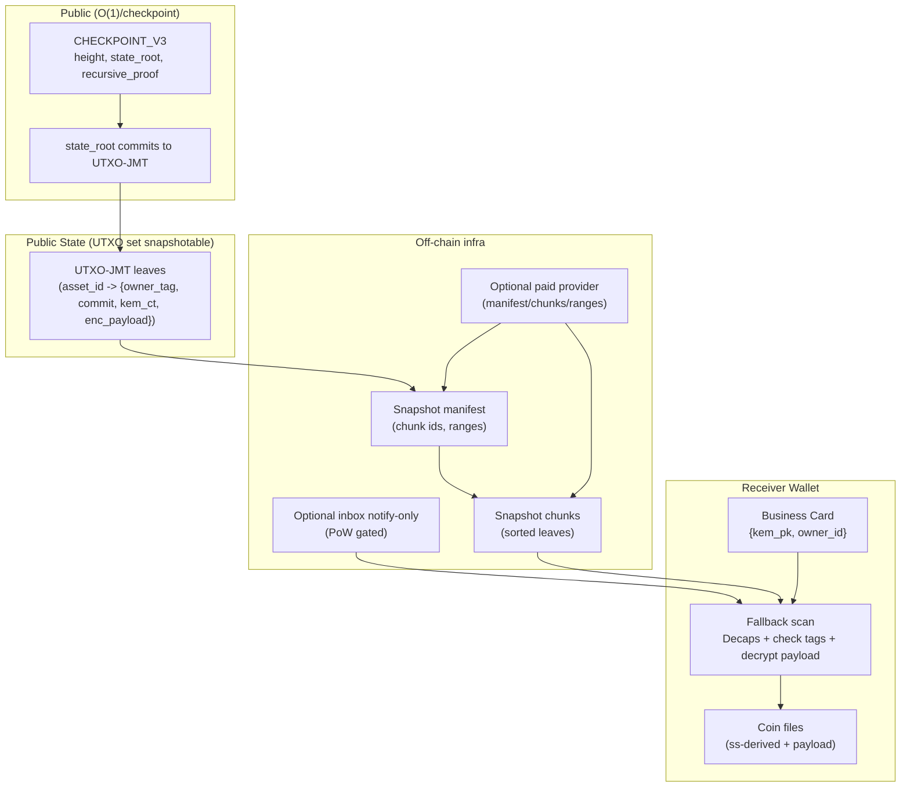
```mermaid
flowchart TB
  subgraph Public["Public (O(1)/checkpoint)"]
    CP["CHECKPOINT_V3\nheight, state_root, recursive_proof"]
    SR["state_root commits to UTXO-JMT"]
  end

  subgraph State["Public State (UTXO set snapshotable)"]
    JMT["UTXO-JMT leaves\n(asset_id -> {owner_tag, commit, kem_ct, enc_payload})"]
  end

  subgraph Offchain["Off-chain infra"]
    MAN["Snapshot manifest\n(chunk ids, ranges)"]
    CH["Snapshot chunks\n(sorted leaves)"]
    API["Optional paid provider\n(manifest/chunks/ranges)"]
    INB["Optional inbox notify-only\n(PoW gated)"]
  end

  subgraph Wallet["Receiver Wallet"]
    CARD["Business Card\n{kem_pk, owner_id}"]
    SCAN["Fallback scan\nDecaps + check tags + decrypt payload"]
    COIN["Coin files\n(ss-derived + payload)"]
  end

  CP --> SR --> JMT
  JMT --> MAN --> CH
  API --> MAN
  API --> CH

  INB --> SCAN
  CH --> SCAN --> COIN
  CARD --> SCAN
```


ZA EXTENDED ANTI-FRAUD PERIOD MOZHNO BRAT DOPOLNITELNIE DENGI
30 DAYS FREE
60 days small fee - 
90 days medum
90+ progressivno

Отлично. Беру твою идею “**пользователь сканит на своём ПК**”, а если хочет “**UTXO only on-demand от валидатора/провайдера**” — **он платит за работу/трафик**.

И да — принимаю, что `s_in` **вообще не раскрывается** (ни публично, ни нотариусу). Ниже даю **SPEC-пакет (YAML)** + **unified Mermaid**.

------


## 0) Критичный security-фикс: чтобы **sender/validator НЕ мог украсть выход**

Если мы делаем non-interactive receive через ML-KEM, то **==shared secret== `ss` известен отправителю** (он его получает при Encaps). Если spend-секрет выводить только из `ss`, отправитель мог бы украсть.

Поэтому вводим “второй фактор”, который **публичен off-chain (на визитке)**, но **не позволяет тратить**:

- У получателя есть секрет `receiver_secret` (wallet master secret).
- На визитке публикуется:
  - `kem_pk` (ML-KEM)
  - `owner_id = H("Z00Z/OWNER" || receiver_secret)` (32 байта)

При создании выхода отправитель делает:

- `ss` из Encaps
- `asset_id = ('UTXO' || ss || serial_id)` ← ключ leaf в JMT (уникальный)
- `owner_tag = H("Z00Z/TAG" || owner_id || ss)` ← **уникален для каждой монеты**, не линкается без `ss`
- Payload шифруется ключом из `ss` **и** `owner_id`

Чтобы потратить, нужно в ZK показать знание `receiver_secret` (чтобы соответствовать `owner_id`) + знание `ss` (чтобы соответствовать `asset_id` и `owner_tag`). Отправитель знает `ss`, но **не может восстановить `receiver_secret` из `owner_id`** (preimage-hard, PQ-friendly при 256-бит хеше).

------

## 1) SPEC: константы и примитивы

```yaml
Z00Z_SPEC_V3:
  hash:
    alg: "SHA-256"        # or BLAKE3-256; MUST be 256-bit output
    security_note: "PQ: assume Grover => choose 256-bit hashes"

  kem:
    alg: "ML-KEM"
    level: "768"          # choose 512/768/1024; 768 is balanced
    note: "Encaps gives (ct, ss). Sender learns ss; receiver derives ss via Decaps."

  aead:
    alg: "XChaCha20-Poly1305"
    key_len: 32
    nonce_len: 24

  domains:
    OWNER: "Z00Z/OWNER"
    UTXO:  "Z00Z/UTXO"
    TAG:   "Z00Z/TAG"
    PAYK:  "Z00Z/PAYLOAD_KEY"
    PAY:   "Z00Z/PAYLOAD"
    MEMO:  "Z00Z/MEMO"
```

------

## 2) SPEC: “визитка” получателя (off-chain, не on-chain)

```yaml
RECEIVER_CARD_V1:
  kem_pk: bytes          # ML-KEM public key
  owner_id: bytes32      # owner_id = H(OWNER || receiver_secret)
  inbox:
    mode: "optional_notify_only"
    endpoint: "tor/i2p/https mailbox"
    anti_dos:
      pow_bits: 18       # sender MUST solve hashcash before mailbox accepts notify
      rate_limit: "server policy"
```

**MUST:**

- `owner_id` MUST быть стабильным для кошелька (иначе старые монеты не потратятся).
- `owner_id` MUST NOT публиковаться on-chain.

---

## 5) SPEC: STATE SNAPSHOT FORMAT (как отдавать UTXO set без истории)

Ты не хочешь вечных диффов. Значит “вечно” хранится только `state_root` + proof, а UTXO set скачивается как **текущий снапшот**.

### 5.1 Manifest (маленький, можно кешировать)

```yaml
STATE_SNAPSHOT_MANIFEST_V1:
  height: u64
  state_root: bytes32
  chunk_size: u32               # e.g. 4096 leaves per chunk
  chunks:
    - chunk_id: bytes32         # H(chunk_bytes)
      key_range:
        from_prefix: "00.."
        to_prefix: "0f.."
      leaves_count: u32
      bytes_len: u32
```

### 5.2 Chunk (контент-адресуемый, раздаётся p2p/сервисом)

```yaml
STATE_SNAPSHOT_CHUNK_V1:
  encoding: "sorted by asset_id"
  leaves:
    - asset_id: bytes32
      owner_tag: bytes32
      commit: bytes33
      kem_ct: bytes
      enc_payload: bytes
```

**MUST:**

- Чанки MUST быть строго отсортированы по `asset_id` (детерминизм).
- Manifest MUST commit’ить все chunk_id (иначе можно подсунуть неполный снапшот).

---


**Принятые допущения (для расчёта):**

- один PFB на чекпойнт
- overhead транзакции ~ **1.2 KiB** (порядок величины)
- gas price = **0.002 utia** (ориентир из Celenium) 

цена TIA ≈ **$0.594** (на сейчас)

### Таблица (только DA-плата за публикацию чекпойнта)

| Размер blob (FRI proof + roots), KiB | Период | Данных в день | ≈ $/day    | ≈ TIA/day |
| ------------------------------------ | ------ | ------------- | ---------- | --------- |
| 25 KiB                               | 2s     | ~1.03 GiB/day | **$14.47** | ==24.35== |
| 25 KiB                               | 5s     | ~0.41 GiB/day | **$5.79**  | 9.74      |
| 25 KiB                               | 10s    | ~0.21 GiB/day | **$2.89**  | 4.87      |
| 50 KiB                               | 2s     | ~2.06 GiB/day | **$24.98** | 42.04     |
| 50 KiB                               | 5s     | ~0.82 GiB/day | **$9.99**  | 16.82     |
| 50 KiB                               | 10s    | ~0.41 GiB/day | **$5.00**  | 8.41      |
| 100 KiB                              | 2s     | ~4.12 GiB/day | **$46.01** | ==77.43== |
| 100 KiB                              | 5s     | ~1.65 GiB/day | **$18.40** | 30.97     |
| 100 KiB                              | 10s    | ~0.82 GiB/day | **$9.20**  | 15.49     |

**Как масштабировать под другой gas price:** стоимость почти линейна по gas price.
 Например, если вместо 0.002 utia будет 0.006 utia — умножай $/day примерно на **3×**.

чекпойнт каждые **2 сек** → 43 KB × 43,200 ≈ **1.86 GB/день**

---


### 5) Что я бы предложил тебе как “правильный” режим для старта (чтобы не попасть в ад по стоимости)

Ты сам уже близко к этому пришёл:

### ✅ Рекомендованный паттерн

- **внутренние блоки**: каждые **2 секунды** (для UX/latency)
- **Celestia DA чекпойнт**: каждые **10–30 секунд** (или реже)
- recursive proof покрывает **пачку внутренних блоков**, и в DA летит **один blob**

Это режет DA-стоимость **почти пропорционально** редкости чекпойнта (и ещё экономит фикс-часть 65k gas, потому что меньше транзакций PFB). 


---

# 6) Mermaid: “для чайников” (как это работает)

## 6.1 Получение монеты (односторонне)

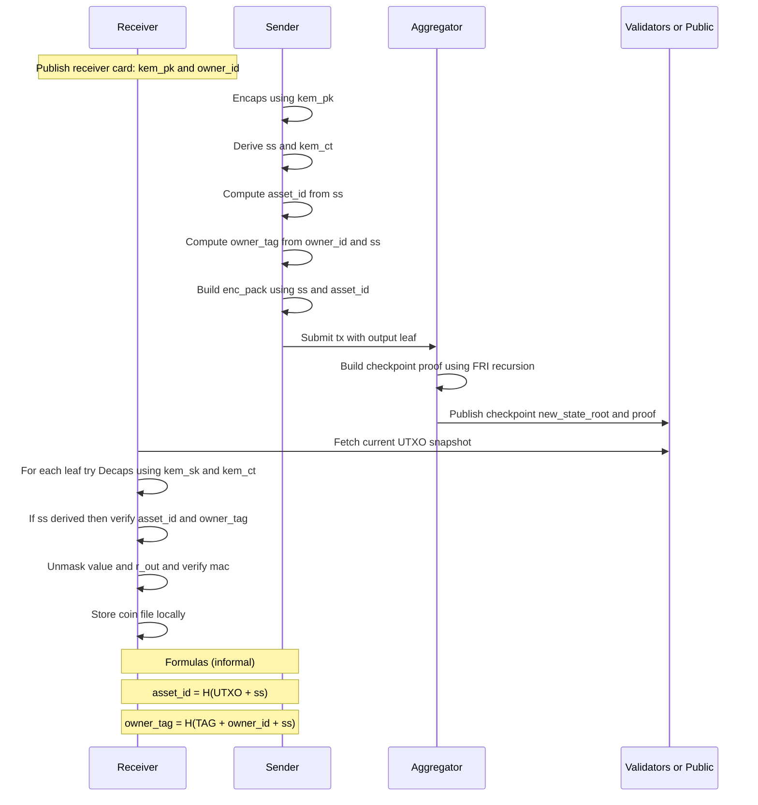
```mermaid
sequenceDiagram
  participant R as Receiver
  participant S as Sender
  participant A as Aggregator
  participant V as Validators or Public

  Note over R: Publish receiver card: kem_pk and owner_id

  S->>S: Encaps using kem_pk
  S->>S: Derive ss and kem_ct
  S->>S: Compute asset_id from ss
  S->>S: Compute owner_tag from owner_id and ss
  S->>S: Build enc_pack using ss and asset_id
  S->>A: Submit tx with output leaf

  A->>A: Build checkpoint proof using FRI recursion
  A->>V: Publish checkpoint new_state_root and proof

  R->>V: Fetch current UTXO snapshot
  R->>R: For each leaf try Decaps using kem_sk and kem_ct
  R->>R: If ss derived then verify asset_id and owner_tag
  R->>R: Unmask value and r_out and verify mac
  R->>R: Store coin file locally

  Note over S,R: Formulas (informal)
  Note over S,R: asset_id = H(UTXO + ss)
  Note over S,R: owner_tag = H(TAG + owner_id + ss)

```

## 6.2 Трата монеты (без раскрытия `s_in`)


```mermaid
sequenceDiagram
  participant W as Wallet
  participant A as Aggregator
  participant V as Validators

  W->>W: Select input asset_id
  W->>W: Build outputs and output leaves
  W->>W: Create proofs and signatures
  W->>A: Submit transaction

  A->>A: Verify transaction
  A->>A: Apply state updates
  A->>A: Build recursive checkpoint proof
  A->>V: Publish checkpoint root and proof

  V->>V: Verify checkpoint proof
  V->>V: Accept new state root

  Note over W,A: Proofs include balance and range checks
  Note over A,V: Only checkpoint data is permanent

```

------

# 

# Mermaid “stack diagram” (как всё составляется)

```mermaid
flowchart TB
  subgraph Wallets
    R[Receiver\nkem_sk + pq_sig_sk] --> RC[Receiver Card\nkem_pk + pq_sig_pk]
    S[Sender Wallet] --> TX[Tx Builder]
  end

  subgraph PublicState
    JMT[JMT / State Snapshot\nUTXO leaves] --> ROOT[state_root]
    CP[Checkpoint\nroot + recursive proof]
  end

  subgraph Validators
    V[Validators] -->|verify recursive proof| CP
    V -->|apply tx batch| JMT
  end

  RC -->|published| S
  TX -->|outputs: kem_ct, tag, C_amount| JMT
  TX -->|inputs + pq signatures + range proofs| V
  CP -->|published forever| PublicState
```

------

# 

## 8) Mermaid: полный поток “send → receive → spend”

```mermaid
sequenceDiagram
  participant R as Receiver
  participant S as Sender
  participant A as Aggregator/Validators
  participant ST as Public State (JMT)

  Note over R: Publish receiver_card {kem_pk, owner_id}

  S->>S: (kem_ct, ss)=ML-KEM.Encaps(R.kem_pk)
  S->>S: asset_id = H("ASSET"||ss||serial_id||out_index)
  S->>S: tag16 = trunc16(H("TAG16"||kem_ct||R.owner_id))
  S->>S: v_int = round(v*10^6)
  S->>S: C_amount = rG + v_int*H_sid
  S->>S: spend_pk_hash = H("SPK"||spend_pk_out)   %% pk hash stored, pk itself not in state
  S->>A: submit tx(outputs..., bulletproof range, balance_eq)

  A->>A: verify sigs + bulletproofs + balance_eq
  A->>ST: update state (delete inputs, insert outputs)

  R->>ST: scan leaves
  R->>R: tag16' = trunc16(H("TAG16"||kem_ct||owner_id))
  R->>R: if match -> ss=Decaps(kem_sk, kem_ct)
  R->>R: derive spend key from receiver_secret + ss
  R->>R: store coin file (serial_id, asset_id, v_int, r, spend_sk)

  Note over R,A: Spend later
  R->>R: build spend tx, sign with ML-DSA spend_sk, add bulletproofs+balance_eq
  R->>A: submit spend tx
  A->>ST: update state
```

------

## 

