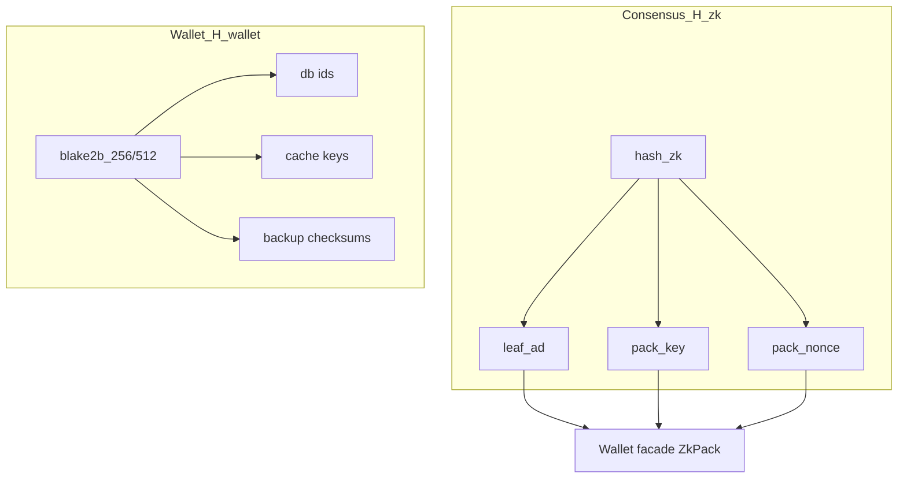

# Production Surface

📌 `claim_stmt_hash`, `ClaimStmt`, and the related claim types are the only production claim contract on the default `z00z_crypto` facade.

📌 `ClaimStmt`, `ClaimAuthoritySig`, `ClaimSourceProof`, `CLAIM_ROOT_VERSION`, and `ClaimProofVer` are the stable claim exports that production wallet and simulator flows should consume.

📌 Authoritative claim-source roots and source proofs are storage-owned. Wallet and simulator code should treat `z00z_storage` as the trusted seam for source membership instead of reconstructing root semantics inside `z00z_crypto`.

📌 The stable default-facade wire contract is `ZkPackEncrypted`, but the blessed production seal or open path is the wallet `ChaCha20-Poly1305` facade in `crates/z00z_wallets/src/core/stealth/facade_zkpack.rs`.

## Compatibility Gates

📌 The custom crypto zkpack seal or open helpers are not part of the default production surface. If they are needed for experiments, enable the `experimental-zkpack` feature and use `z00z_crypto::experimental::zkpack`.

📌 New production code should not add fresh dependencies on the experimental zkpack path.

## Hash Split

📌 Z00Z keeps a strict split between consensus hashes and wallet-internal hashes.

- 📌 `H_zk`: Poseidon2 via `hash_zk::<DomainType>(label, inputs)` for consensus and ZK-critical derivations.
- 📌 `H_wallet`: Blake2b helpers for wallet-local operations only.

## Rules

- 📌 Use `hash_zk::<...>(...)` for `leaf_ad`, `pack_key`, `pack_nonce`, `owner_tag`, and related stealth derivations.
- 📌 Never use Blake2b for `enc_pack` derivation inputs.
- 📌 Never call Poseidon2 directly from wallet database code paths.

## Guard Checks

📌 Run the guard script from the workspace root:

```bash
./scripts/check_hash_stack.sh
```

📌 This validates:

- 📌 No `Blake2` usage in `crates/z00z_crypto/src/zkpack.rs`.
- 📌 No direct `poseidon2_hash` usage in wallet DB, cache, or tx builder paths.

## Diagram


