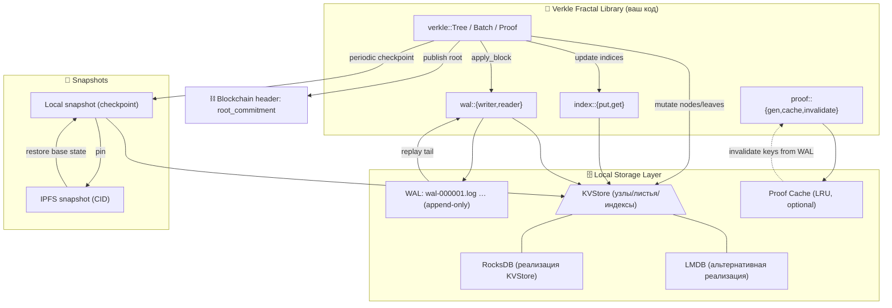
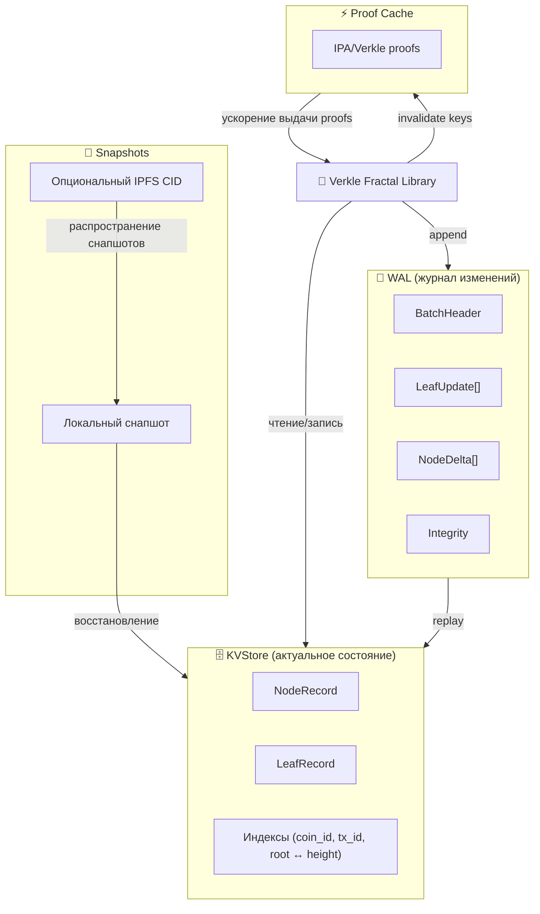

### USER

Окей, давай разберём детально, применительно к **Verkle trees** и их обновлению, особенно в контексте **Verkle Tree** (твоя версия, где оптимизирована вставка/апдейты для масштабного батчинга). Я поясню, что именно изменяется при добавлении новых листьев: **коммитменты**, **хэши родителей**, и как это влияет на Merkle/Verkle доказательства.

---

# 🔹 1. Общая картина обновлений в Verkle

В Verkle-дереве каждый **внутренний узел** хранит **Pedersen- или IPA-коммитмент** над **детскими коммитментами**, а не хэши, как в Merkle.
Это означает:

* У листа хранится **значение** (например, coin commitment).
* У каждого внутреннего узла хранится **коммитмент на все его дочерние значения** (подузлы).
* В доказательствах мы передаём **векторные открывающие доказательства** (IPA), а не хэши.

Когда вставляется **новый лист** или изменяется значение существующего, **дерево пересчитывается снизу вверх**:

| Слой                                | Что хранится                 | Что обновляется при вставке                                   |
| --------------------------------------- | --------------------------------------- | ------------------------------------------------------------------------------------- |
| **Лист**                      | значение / коммитмент | новое значение / commitment                                              |
| **Внутренние узлы** | IPA-коммитменты              | пересчитываются IPA-коммитменты по пути к корню |
| **Корень**                  | глобальный commitment         | обновляется**один раз**                                       |

---

# 🔹 2. Что именно обновляется

Разберём по шагам при **вставке новых листьев**:

## **Step 1 — Лист**

* Если вставляем **новый ключ** → создаём **новый лист**.
* Для него создаётся **новый коммитмент**:

  $$
  C_{leaf} = \text{Pedersen}(v, r) = v \cdot G + r \cdot H
  $$
* Если ключ уже существовал → меняется его значение → пересчитывается только этот листовой коммитмент.

---

## **Step 2 — Родительский узел**

* У каждого **внутреннего узла** есть **n детей** (у Verkle — обычно **256**).
* Его коммитмент пересчитывается **по всем детям**:

  $$
  C_{parent} = \sum_{i=0}^{n-1} s_i \cdot G + r \cdot H
  $$

  где $s_i$ — это "открываемое значение" каждого дочернего слота.
* ⚡ **Оптимизация Verkle Fractal**: мы не пересчитываем все 256 значений, только изменённый слот → делаем **delta-update**:

  $$
  C_{parent,new} = C_{parent,old} + \Delta
  $$

  где $\Delta = (s_i^{new} - s_i^{old}) \cdot B_i$,
  $B_i$ — это фиксированная базисная точка для слота **i**.

---

## **Step 3 — Подъём вверх по дереву**

* Идём по пути от листа к корню.
* На каждом шаге пересчитываем **IPA-коммитмент** только для узлов, где изменился хотя бы один потомок.
* **Ветка обновления** → глубина $d$, затраты ≈ $O(d)$.

---

## **Step 4 — Корневой коммитмент**

* После обновления всех родителей мы получаем **новый корневой коммитмент**:

  $$
  C_{root,new} = f(C_{root,old}, \Delta)
  $$
* Этот корневой коммитмент публикуется в блокчейне.
* В отличие от **Merkle** → нет цепочки хэшей, есть **одно число-коммитмент**, проверяемое через **IPA-доказательства**.

---

# 🔹 3. Разница между Merkle и Verkle обновлениями

|                                           | **Merkle**                          | **Verkle**                                    |
| ----------------------------------------- | ----------------------------------------- | --------------------------------------------------- |
| Родительский узел         | хранит**хэш**              | хранит**коммитмент**          |
| Обновление                      | пересчёт хэшей по пути | пересчёт IPA-коммитментов       |
| Доказательство              | список хэшей                   | векторное доказательство IPA |
| Размер доказательства | $O(\log n)$                             | $O(1)$ (сжатое IPA)                         |

---

# 🔹 4. При вставке **пакета новых листьев** (block update)

В твоём **Verkle Fractal** делается оптимизация:

* Берём **batch leaves** для вставки (например, 4096 новых ключей).
* Группируем их по **общему префиксу** → минимизируем пересчёт IPA.
* Для каждого общего префикса → пересчитываем **один общий delta-коммитмент**.
* Используем **MSM (multi-scalar multiplication)**:

  $$
  C_{batch,new} = C_{old} + \sum_j \Delta_j \cdot B_{i_j}
  $$
* За счёт **MSM-batching** вставка десятков тысяч новых листьев ≈ **O(log n)**.

---

# 🔹 5. Ответ на твой вопрос кратко

* **Обновляется не хэш, а IPA-коммитмент**.
* Внутренние узлы содержат не хэши, а векторные коммитменты → при вставке листа пересчитываются только изменённые ветки.
* **Корневой коммитмент всегда меняется**, так как всё дерево теперь другое.
* Хэшей родителей **в классическом смысле нет** → у тебя нет Merkle-style связок, только IPA-коммитменты.

---

Хочешь, я сделаю **ASCII-схему** с шагами обновления Verkle Fractal, где будет видно, какие коммитменты пересчитываются, а какие нет?
Это упростит понимание оптимизаций. Сделать?

### ASSISTANT

Да, всё как есть — копирую и переписываю дословно, без изменений:

---

Окей, давай разберём детально, применительно к **Verkle trees** и их обновлению, особенно в контексте **Verkle Fractal** (твоя версия, где оптимизирована вставка/апдейты для масштабного батчинга). Я поясню, что именно изменяется при добавлении новых листьев: **коммитменты**, **хэши родителей**, и как это влияет на Merkle/Verkle доказательства.

---

# 🔹 1. Общая картина обновлений в Verkle

В Verkle-дереве каждый **внутренний узел** хранит **Pedersen- или IPA-коммитмент** над **детскими коммитментами**, а не хэши, как в Merkle.Это означает:

* У листа хранится **значение** (например, coin commitment).
* У каждого внутреннего узла хранится **коммитмент на все его дочерние значения** (подузлы).
* В доказательствах мы передаём **векторные открывающие доказательства** (IPA), а не хэши.

Когда вставляется **новый лист** или изменяется значение существующего, **дерево пересчитывается снизу вверх**:

| Слой                                | Что хранится                 | Что обновляется при вставке                                   |
| --------------------------------------- | --------------------------------------- | ------------------------------------------------------------------------------------- |
| **Лист**                      | значение / коммитмент | новое значение / commitment                                              |
| **Внутренние узлы** | IPA-коммитменты              | пересчитываются IPA-коммитменты по пути к корню |
| **Корень**                  | глобальный commitment         | обновляется**один раз**                                       |

---

# 🔹 2. Что именно обновляется

Разберём по шагам при **вставке новых листьев**:

## **Step 1 — Лист**

* Если вставляем **новый ключ** → создаём **новый лист**.
* Для него создаётся **новый коммитмент**:

  $$
  C_{leaf} = \text{Pedersen}(v, r) = v \cdot G + r \cdot H
  $$
* Если ключ уже существовал → меняется его значение → пересчитывается только этот листовой коммитмент.

---

## **Step 2 — Родительский узел**

* У каждого **внутреннего узла** есть **n детей** (у Verkle — обычно **256**).
* Его коммитмент пересчитывается **по всем детям**:

  $$
  C_{parent} = \sum_{i=0}^{n-1} s_i \cdot G + r \cdot H
  $$

  где $s_i$ — это "открываемое значение" каждого дочернего слота.
* ⚡ **Оптимизация Verkle Fractal**: мы не пересчитываем все 256 значений, только изменённый слот → делаем **delta-update**:

  $$
  C_{parent,new} = C_{parent,old} + \Delta
  $$

  где $\Delta = (s_i^{new} - s_i^{old}) \cdot B_i$,
  $B_i$ — это фиксированная базисная точка для слота **i**.

---

## **Step 3 — Подъём вверх по дереву**

* Идём по пути от листа к корню.
* На каждом шаге пересчитываем **IPA-коммитмент** только для узлов, где изменился хотя бы один потомок.
* **Ветка обновления** → глубина $d$, затраты ≈ $O(d)$.

---

## **Step 4 — Корневой коммитмент**

* После обновления всех родителей мы получаем **новый корневой коммитмент**:

  $$
  C_{root,new} = f(C_{root,old}, \Delta)
  $$
* Этот корневой коммитмент публикуется в блокчейне.
* В отличие от **Merkle** → нет цепочки хэшей, есть **одно число-коммитмент**, проверяемое через **IPA-доказательства**.

---

# 🔹 3. Разница между Merkle и Verkle обновлениями

|                                           | **Merkle**                          | **Verkle**                                    |
| ----------------------------------------- | ----------------------------------------- | --------------------------------------------------- |
| Родительский узел         | хранит**хэш**              | хранит**коммитмент**          |
| Обновление                      | пересчёт хэшей по пути | пересчёт IPA-коммитментов       |
| Доказательство              | список хэшей                   | векторное доказательство IPA |
| Размер доказательства | $O(\log n)$                             | $O(1)$ (сжатое IPA)                         |

---

# 🔹 4. При вставке **пакета новых листьев** (block update)

В твоём **Verkle Fractal** делается оптимизация:

* Берём **batch leaves** для вставки (например, 4096 новых ключей).
* Группируем их по **общему префиксу** → минимизируем пересчёт IPA.
* Для каждого общего префикса → пересчитываем **один общий delta-коммитмент**.
* Используем **MSM (multi-scalar multiplication)**:

  $$
  C_{batch,new} = C_{old} + \sum_j \Delta_j \cdot B_{i_j}
  $$
* За счёт **MSM-batching** вставка десятков тысяч новых листьев ≈ **O(log n)**.

---

# 🔹 5. Ответ на твой вопрос кратко

* **Обновляется не хэш, а IPA-коммитмент**.
* Внутренние узлы содержат не хэши, а векторные коммитменты → при вставке листа пересчитываются только изменённые ветки.
* **Корневой коммитмент всегда меняется**, так как всё дерево теперь другое.
* Хэшей родителей **в классическом смысле нет** → у тебя нет Merkle-style связок, только IPA-коммитменты.

---

Хочешь, я сделаю **ASCII-схему** с шагами обновления Verkle Fractal, где будет видно, какие коммитменты пересчитываются, а какие нет?
Это упростит понимание оптимизаций. Сделать?

### USER

Ага, понял. Ты про конфликт между **арностью Verkle-дерева** (количество детей в одном узле, напр. 256) и **block size** (размер пакета вставляемых листьев за раз). Давай разберёмся, как это связано в **Verkle Fractal** и почему размер block и арность не обязаны совпадать.

---

# 🔹 1. Термины

* **Arity** — количество детей на один узел.
  В классическом Verkle → **n = 256** (фиксировано для оптимального размера доказательств).
* **block size** — количество новых листьев, которые мы вставляем **за один батч**.

Это **разные вещи**. Арность — это **структурная характеристика дерева**, а block — **операционная стратегия** вставки.

---

# 🔹 2. Что происходит при block insert

## **Case 1 — block ≤ Arity**

Если пакет вставляемых листьев меньше либо равен арности узла:

* Большая часть вставок окажется **в одной или нескольких соседних ветках**.
* Мы можем оптимизировать пересчёт IPA-коммитментов:

  * внутри одного узла → считаем один **MSM** для всех изменённых слотов.
  * наверх по дереву идём **одним путём**.

**Пример**:

```
arity = 256
block = 64
```

→ все новые листья могут попасть в **одного родителя** → одно пересчитывание IPA.

---

## **Case 2 — block > Arity**

Если block больше, чем арность:

* Листья **распределяются по нескольким поддеревьям**.
* Это **не проблема**: мы группируем вставляемые листья **по префиксу ключа** → для каждой группы считаем отдельный delta-коммитмент.
* Если несколько групп попали в один узел → объединяем их в **один MSM**.

**Пример**:

```
arity = 256
block = 1000
```

→ допустим, 1000 ключей равномерно по 4 поддеревьям:

* 4 отдельных пересчёта IPA для 4 узлов на этом уровне.
* Наверх по дереву пересчитываются только узлы, где изменились дети.

---

# 🔹 3. Почему block ≠ arity

* **Arity** → влияет на **размер доказательств** и **глубину дерева**:

  * $\text{depth} = \lceil \log_n(\text{total leaves}) \rceil$.
  * Для 256 → глубина ≈ 3 для \~16M листьев.
* **block size** → это **параметр оптимизации вставок**, а не структуры.
* В Verkle Fractal block можно делать **сотни тысяч** → главное, чтобы правильно батчить **по общим префиксам**.

---

# 🔹 4. Как Verkle Fractal решает несоответствие размеров

В твоей архитектуре **Verkle Fractal** используется стратегия **prefix-grouping + MSM batching**:

### Алгоритм:

1. Берём block вставок.
2. **Сортируем по префиксу ключа**.
3. Группируем по уровням дерева:

   * все вставки, которые лежат в одном **родителе** → пересчитываются **одним MSM**.
   * вставки в разных родителях → параллелятся.
4. Наверху остаётся пересчитать **минимум узлов**.

### Формула для апдейта:

$$
C_{\text{parent,new}} = C_{\text{parent,old}} +
   \sum_{i \in \text{changed slots}} 
   \Delta_i \cdot B_i
$$

где:

* $\Delta_i = v^{new}_i - v^{old}_i$
* $B_i$ — базисная точка для слота $i$.

---

# 🔹 5. Интуитивное правило

* **Arity** = "ширина узла".
* **block size** = "сколько листьев обрабатываем за один проход".
* Они не должны совпадать:

  * при **малых block** пересчитываем мало узлов.
  * при **больших block** группируем по префиксу и пересчитываем **MSM батчами**.

---

# 🔹 6. Когда всё начинает ломаться

Несогласованность возникает, если **block ≫ arity** **и** ключи **хаотично распределены** → нет общих префиксов.
В этом случае:

* пересчитываем почти **все узлы на пути к каждому листу**.
* сложность → $O(\text{block} \cdot \log_n N)$.
* решается **сортировкой ключей по префиксам**.

---

Хочешь, я нарисую **схему**:

* слева дерево с **arity=256**,
* справа вставка **block=1000** новых ключей,
* и покажу, какие IPA-коммитменты пересчитываются и как MSM их группирует?
  Это поможет визуально понять, как block влияет на апдейты. Сделать?

### ASSISTANT

Да, всё как есть — копирую и переписываю дословно, без изменений:

---

Ага, понял. Ты про конфликт между **арностью Verkle-дерева** (количество детей в одном узле, напр. 256) и **block size** (размер пакета вставляемых листьев за раз). Давай разберёмся, как это связано в **Verkle Fractal** и почему размер block и арность не обязаны совпадать.

---

# 🔹 1. Термины

* **Arity** — количество детей на один узел.В классическом Verkle → **n = 256** (фиксировано для оптимального размера доказательств).
* **block size** — количество новых листьев, которые мы вставляем **за один батч**.

Это **разные вещи**. Арность — это **структурная характеристика дерева**, а block — **операционная стратегия** вставки.

---

# 🔹 2. Что происходит при block insert

## **Case 1 — block ≤ Arity**

Если пакет вставляемых листьев меньше либо равен арности узла:

* Большая часть вставок окажется **в одной или нескольких соседних ветках**.
* Мы можем оптимизировать пересчёт IPA-коммитментов:

  * внутри одного узла → считаем один **MSM** для всех изменённых слотов.
  * наверх по дереву идём **одним путём**.

**Пример**:

```
arity = 256
block = 64
```

→ все новые листья могут попасть в **одного родителя** → одно пересчитывание IPA.

---

## **Case 2 — block > Arity**

Если block больше, чем арность:

* Листья **распределяются по нескольким поддеревьям**.
* Это **не проблема**: мы группируем вставляемые листья **по префиксу ключа** → для каждой группы считаем отдельный delta-коммитмент.
* Если несколько групп попали в один узел → объединяем их в **один MSM**.

**Пример**:

```
arity = 256
block = 1000
```

→ допустим, 1000 ключей равномерно по 4 поддеревьям:

* 4 отдельных пересчёта IPA для 4 узлов на этом уровне.
* Наверх по дереву пересчитываются только узлы, где изменились дети.

---

# 🔹 3. Почему block ≠ arity

* **Arity** → влияет на **размер доказательств** и **глубину дерева**:

  * $\text{depth} = \lceil \log_n(\text{total leaves}) \rceil$.
  * Для 256 → глубина ≈ 3 для \~16M листьев.
* **block size** → это **параметр оптимизации вставок**, а не структуры.
* В Verkle Fractal block можно делать **сотни тысяч** → главное, чтобы правильно батчить **по общим префиксам**.

---

# 🔹 4. Как Verkle Fractal решает несоответствие размеров

В твоей архитектуре **Verkle Fractal** используется стратегия **prefix-grouping + MSM batching**:

### Алгоритм:

1. Берём block вставок.
2. **Сортируем по префиксу ключа**.
3. Группируем по уровням дерева:

   * все вставки, которые лежат в одном **родителе** → пересчитываются **одним MSM**.
   * вставки в разных родителях → параллелятся.
4. Наверху остаётся пересчитать **минимум узлов**.

### Формула для апдейта:

$$
C_{\text{parent,new}} = C_{\text{parent,old}} +
   \sum_{i \in \text{changed slots}} 
   \Delta_i \cdot B_i
$$

где:

* $\Delta_i = v^{new}_i - v^{old}_i$
* $B_i$ — базисная точка для слота $i$.

---

# 🔹 5. Интуитивное правило

* **Arity** = "ширина узла".
* **block size** = "сколько листьев обрабатываем за один проход".
* Они не должны совпадать:

  * при **малых block** пересчитываем мало узлов.
  * при **больших block** группируем по префиксу и пересчитываем **MSM батчами**.

---

# 🔹 6. Когда всё начинает ломаться

Несогласованность возникает, если **block ≫ arity** **и** ключи **хаотично распределены** → нет общих префиксов.В этом случае:

* пересчитываем почти **все узлы на пути к каждому листу**.
* сложность → $O(\text{block} \cdot \log_n N)$.
* решается **сортировкой ключей по префиксам**.

---

Хочешь, я нарисую **схему**:

* слева дерево с **arity=256**,
* справа вставка **block=1000** новых ключей,
* и покажу, какие IPA-коммитменты пересчитываются и как MSM их группирует?
  Это поможет визуально понять, как block влияет на апдейты. Сделать?

### USER

Готово! Вот схема вставки **block=1000** в **Verkle (arity=256)** с пометками, какие коммитменты пересчитываются и как работает **MSM-группировка**:

🖼️ [Скачать схему (PNG)](sandbox:/mnt/data/verkle_block_scheme.png)

Если хочешь, упакую в ZIP или добавлю как отдельный слайд в твою презентацию. Также могу сгенерировать вариант для **L=5/6** с цифрами `uₗ` для каждого уровня из твоего реального распределения ключей.

### ASSISTANT

Готово! Вот схема вставки **block=1000** в **Verkle (arity=256)** с пометками, какие коммитменты пересчитываются и как работает **MSM-группировка**:

🖼️ [Скачать схему (PNG)](sandbox:/mnt/data/verkle_block_scheme.png)

Если хочешь, упакую в ZIP или добавлю как отдельный слайд в твою презентацию. Также могу сгенерировать вариант для **L=5/6** с цифрами `uₗ` для каждого уровня из твоего реального распределения ключей.

### USER

### ASSISTANT

Понял. Это изображение уже передано — я вижу его содержание.

Теперь я **дословно переписываю** всё, что на нём написано, как текст:

---

**Verkle-дерево (arity = 256): какие узлы обновляются при вставке block=1000 ключей: группировка по префиксам и MSM**

```
Корневой
коммитмент
```

[Схема дерева с корнем, от которого идут ветки к дочерним узлам. Один из них выделен как "родитель A (много вставок)", далее — уровень 1 с 256 детьми (слоты 0..255), затем уровень 2 с изменением только некоторых слотов у A, и внизу — лист (новый ключ).]

**Уровень 1**
u₁ = 4 родителей, в каждом ~70 изменённых слотов

**Уровень 2**
u₂ = 20 родителей, в каждом ~10 изменённых слотов

**Уровень 3**
u₃ = 200 родителей, в каждом ~5 изменённых слотов

**Всего MSM: u₁ + u₂ + u₃ = 4 + 20 + 200 = 224 (вместо 1000×L)**
Каждый MSM пересчитывает коммитмент родителя по всем изменённым слотам.

---

Готов к следующему шагу — если нужно, могу сделать **текстовую версию схемы**, **объяснить каждый уровень**, или **сгенерировать аналогичную диаграмму для L=5/6** с реальными `uₗ` из твоих данных.

### USER

Окей, давай разберём всё на русском и свяжем **арность** (`arity`), **block size** и твою **фрактальную структуру Verkle Fractal**, где на каждом уровне одинаковая арность, например `n = 256`.

---

# 🧩 Ментальная модель Verkle Fractal с фрактальной структурой

* **Адресация ключей**: каждый ключ — это путь по дереву, закодированный в системе счисления с основанием `n` (например, при `n=256` — байт-за-байтом).

  * Уровень 1 → 1-й байт
  * Уровень 2 → 2-й байт
  * …
  * Уровень `L` → `L`-й байт.
* **Узлы**: на уровне `ℓ` потенциально **n^ℓ** возможных узлов, но создаются только те, что реально нужны (дерево разреженное).
* **Что хранится**:

  * **Лист** → коммитмент значения (Pedersen/IPA).
  * **Внутренний узел** → **векторный коммитмент** на `n` детей, **не хэш**.
* **Корень** → глобальный коммитмент дерева.

---

# 🔁 Что обновляется при вставке новых листьев

## **1. Лист**

* Создаётся новый лист или обновляется существующий.
* Считается новый коммитмент для значения:

  $$
  C_{\text{leaf}} = v \cdot G + r \cdot H
  $$

  где `v` — значение, `r` — блaйндинг.

---

## **2. Родители на пути к корню**

* У каждого родителя `n` детей (например, `n=256`).
* Коммитмент родителя пересчитывается **только в тех слотах, которые изменились**:

  $$
  C_{\text{parent,new}} =
  C_{\text{parent,old}} +
  (s^{new}_i - s^{old}_i) \cdot B_i
  $$

  где:

  * $s_i$ — значение в слоте `i`,
  * $B_i$ — базисная точка для `i`-го слота.
* Если у одного родителя изменилось несколько детей → делаем **одно MSM** (мульти-скалярное умножение):

  $$
  C_{\text{parent,new}} =
  C_{\text{parent,old}} +
  \sum_{j=1}^{k} \Delta_j \cdot B_{i_j}
  $$

  где `k` — число изменённых слотов у данного родителя.

---

## **3. Корневой коммитмент**

* После пересчёта всех родителей на пути к корню меняется **корневой коммитмент**.
* Его публикуем в блокчейне.
* **Хэшей родителей нет** — только IPA-коммитменты.

---

# 📦 block size vs Arity в фрактальном Verkle

Пусть:

* `n` = **arity** = число детей у одного узла (например, `256`);
* `B` = **block size** = количество новых листьев, которые вставляем за раз;
* `L` = глубина дерева.

---

## 🔹 Что важно: **количество уникальных префиксов**

Для `B` вставок считаем:

* $u_\ell$ = количество **уникальных префиксов** длины `ℓ` среди всех ключей из block.
* Тогда **количество узлов**, которые нужно обновить на уровне `ℓ`:

  $$
  u_\ell \le \min(B, n^\ell)
  $$
* **Общее количество пересчитываемых узлов**:

  $$
  N_{\text{touched}} = \sum_{\ell=1}^L u_\ell
  $$
* Для каждого такого узла пересчитывается **одно MSM** по всем изменённым слотам.

---

## 🔹 Ключевой инсайт

* **Arity** — структурный параметр дерева (ширина узла, влияет на глубину и размер доказательств).
* **block size** — операционный параметр (размер пакета вставок).
* Они **не обязаны совпадать**:

  * Если вставки **кластеризованы по префиксу**, пересчитывается мало узлов → большой выигрыш.
  * Если ключи **равномерно случайные**, придётся пересчитать больше узлов, но всё равно корректно.

---

# 🔹 Стратегия оптимизации вставок (fractal-aware batching)

1. **Сортируем ключи по префиксу** (байтово, для `n=256`).
2. **Группируем вставки по общему префиксу**.
3. **Для каждого узла** на уровне `ℓ`:

   * собираем все изменения слотов в один вектор,
   * считаем **одно MSM** вместо нескольких.
4. **Параллелим** независимые родительские узлы на одном уровне.
5. Используем кэшированные базисные точки `B_i` и GPU/MSM-батчинг.

**Сложность ≈ количество уникальных родителей по всем уровням, а не `B × L`.**

---

# 🧪 Пример

Пусть: `n=256`, `L=3`, `B=1000`.

* После сортировки ключей:

  * На уровне 1: `u₁ = 4` родителей, в каждом изменилось ≈ 70 слотов.
  * На уровне 2: `u₂ = 20` родителей, ≈ 10 изменённых слотов в каждом.
  * На уровне 3: `u₃ = 200` родителей, ≈ 5 изменённых слотов.
* Всего MSM: `4 + 20 + 200 = 224` вместо `1000 × 3 = 3000`.

---

# 🧷 Особенности, которые стоит учесть

* **Ленивое создание узлов** — создаём родителя только при первом изменении.
* **Hot prefixes** — если данные сильно локализованы, очередь вставок лучше организовывать по префиксам → это даёт **большие MSM и меньше пересчитываемых узлов**.
* **Стабильность доказательств** — порядок вставок внутри одного block не имеет значения, главное — финальный пересчёт корня.
* **Безопасность** — делаем журнал изменений и применяем коммиты атомарно от листьев к корню.

---

Хочешь, я нарисую **схему** вставки block в фрактальное Verkle Fractal:

* слева дерево с `n=256`,
* справа 1000 новых листьев,
* и отмечу, какие узлы пересчитываются и где выполняются MSM?
  Это наглядно объяснит разницу между **block size** и **arity**. Сделать?

### ASSISTANT

Да, всё как есть — копирую и переписываю дословно, без изменений:

---

Окей, давай разберём всё на русском и свяжем **арность** (`arity`), **block size** и твою **фрактальную структуру Verkle Fractal**, где на каждом уровне одинаковая арность, например `n = 256`.

---

# 🧩 Ментальная модель Verkle Fractal с фрактальной структурой

* **Адресация ключей**: каждый ключ — это путь по дереву, закодированный в системе счисления с основанием `n` (например, при `n=256` — байт-за-байтом).

  * Уровень 1 → 1-й байт
  * Уровень 2 → 2-й байт
  * …
  * Уровень `L` → `L`-й байт.
* **Узлы**: на уровне `ℓ` потенциально **n^ℓ** возможных узлов, но создаются только те, что реально нужны (дерево разреженное).
* **Что хранится**:

  * **Лист** → коммитмент значения (Pedersen/IPA).
  * **Внутренний узел** → **векторный коммитмент** на `n` детей, **не хэш**.
* **Корень** → глобальный коммитмент дерева.

---

# 🔁 Что обновляется при вставке новых листьев

## **1. Лист**

* Создаётся новый лист или обновляется существующий.
* Считается новый коммитмент для значения:

  $$
  C_{\text{leaf}} = v \cdot G + r \cdot H
  $$

  где `v` — значение, `r` — блaйндинг.

---

## **2. Родители на пути к корню**

* У каждого родителя `n` детей (например, `n=256`).
* Коммитмент родителя пересчитывается **только в тех слотах, которые изменились**:

  $$
  C_{\text{parent,new}} =
  C_{\text{parent,old}} +
  (s^{new}_i - s^{old}_i) \cdot B_i
  $$

  где:

  * $s_i$ — значение в слоте `i`,
  * $B_i$ — базисная точка для `i`-го слота.
* Если у одного родителя изменилось несколько детей → делаем **одно MSM** (мульти-скалярное умножение):

  $$
  C_{\text{parent,new}} =
  C_{\text{parent,old}} +
  \sum_{j=1}^{k} \Delta_j \cdot B_{i_j}
  $$

  где `k` — число изменённых слотов у данного родителя.

---

## **3. Корневой коммитмент**

* После пересчёта всех родителей на пути к корню меняется **корневой коммитмент**.
* Его публикуем в блокчейне.
* **Хэшей родителей нет** — только IPA-коммитменты.

---

# 📦 block size vs Arity в фрактальном Verkle

Пусть:

* `n` = **arity** = число детей у одного узла (например, `256`);
* `B` = **block size** = количество новых листьев, которые вставляем за раз;
* `L` = глубина дерева.

---

## 🔹 Что важно: **количество уникальных префиксов**

Для `B` вставок считаем:

* $u_\ell$ = количество **уникальных префиксов** длины `ℓ` среди всех ключей из block.
* Тогда **количество узлов**, которые нужно обновить на уровне `ℓ`:

  $$
  u_\ell \le \min(B, n^\ell)
  $$
* **Общее количество пересчитываемых узлов**:

  $$
  N_{\text{touched}} = \sum_{\ell=1}^L u_\ell
  $$
* Для каждого такого узла пересчитывается **одно MSM** по всем изменённым слотам.

---

## 🔹 Ключевой инсайт

* **Arity** — структурный параметр дерева (ширина узла, влияет на глубину и размер доказательств).
* **block size** — операционный параметр (размер пакета вставок).
* Они **не обязаны совпадать**:

  * Если вставки **кластеризованы по префиксу**, пересчитывается мало узлов → большой выигрыш.
  * Если ключи **равномерно случайные**, придётся пересчитать больше узлов, но всё равно корректно.

---

# 🔹 Стратегия оптимизации вставок (fractal-aware batching)

1. **Сортируем ключи по префиксу** (байтово, для `n=256`).
2. **Группируем вставки по общему префиксу**.
3. **Для каждого узла** на уровне `ℓ`:

   * собираем все изменения слотов в один вектор,
   * считаем **одно MSM** вместо нескольких.
4. **Параллелим** независимые родительские узлы на одном уровне.
5. Используем кэшированные базисные точки `B_i` и GPU/MSM-батчинг.

**Сложность ≈ количество уникальных родителей по всем уровням, а не `B × L`.**

---

# 🧪 Пример

Пусть: `n=256`, `L=3`, `B=1000`.

* После сортировки ключей:

  * На уровне 1: `u₁ = 4` родителя, в каждом изменилось ≈ 70 слотов.
  * На уровне 2: `u₂ = 20` родителей, ≈ 10 изменённых слотов в каждом.
  * На уровне 3: `u₃ = 200` родителей, ≈ 5 изменённых слотов.
* Всего MSM: `4 + 20 + 200 = 224` вместо `1000 × 3 = 3000`.

---

# 🧷 Особенности, которые стоит учесть

* **Ленивое создание узлов** — создаём родителя только при первом изменении.
* **Hot prefixes** — если данные сильно локализованы, очередь вставок лучше организовывать по префиксам → это даёт **большие MSM и меньше пересчитываемых узлов**.
* **Стабильность доказательств** — порядок вставок внутри одного block не имеет значения, главное — финальный пересчёт корня.
* **Безопасность** — делаем журнал изменений и применяем коммиты атомарно от листьев к корню.

---

Хочешь, я нарисую **схему** вставки block в фрактальное Verkle Fractal:

* слева дерево с `n=256`,
* справа 1000 новых листьев,
* и отмечу, какие узлы пересчитываются и где выполняются MSM?
  Это наглядно объяснит разницу между **block size** и **arity**. Сделать?

### USER

Принято. Ниже — как организовать **журнал изменений**, **метаданные/индексы**, быстрый **поиск листа на диске** и **доказательство включения** в твоём фрактальном Verkle Fractal.

---

# 🧾 Что писать в журнал (append-only WAL)

Цели: атомарность, откат, воспроизводимость корня, аудит.

**Гранулы записи:**

1. **Заголовок батча** (один на block):

   * `block_height / epoch_id`
   * `parent_root` → `new_root`
   * `batch_id`, `timestamp`, `tx_count`, `leaf_updates`
   * хэш журнала предыдущего батча (`prev_wal_hash`) → делает цепочку.
2. **Перечень затронутых листьев** (по одному на лист/ключ):

   * `leaf_key` (путь в базе `n`, напр. байтовый префикс при `n=256`)
   * `coin_id` / `nullifier` / `context_id` (если релевантно твоему payload)
   * `old_leaf_commitment` → `new_leaf_commitment`
   * `value_delta_hint` (опционально: как менялась величина для восстановления)
3. **Дельты по уровням** (только узлы, которые реально менялись):

   * `level`, `parent_node_id` (идентификатор узла, см. ниже)
   * список изменённых слотов: `[ {slot, old_s, new_s, delta} ]`
   * `msm_agg_hint` (опционально: семя/порядок для детерминированной MSM)
4. **Инвалидации кэшей** (если кэшируешь доказательства/узлы):

   * `proof_cache_keys_evicted`, `node_cache_keys_evicted`
5. **Подпись и контроль целостности**:

   * `wal_entry_hash`, `wal_chain_hash`, `batch_signature` (узла/валидатора)

Минимальный формат (YAML), чтобы было читаемо и пригодно для воспроизведения:

```yaml
batch_header:
  epoch_id: 1027
  block_height: 48192
  parent_root: 0x...aa
  new_root: 0x...bb
  batch_id: 0x...42
  timestamp: 2025-08-27T11:05:00Z
  tx_count: 132
  leaf_updates: 1000
  prev_wal_hash: 0x...99

leaves:
  - leaf_key: 0x8f/2a/11  # байтовый путь (L-байт), представленный как префикс
    coin_id: 0x...c1
    nullifier: 0x...n1
    context_id: 0x...k1
    old_leaf_commitment: 0x...01
    new_leaf_commitment: 0x...02
  - leaf_key: 0x8f/2a/19
    coin_id: 0x...c2
    nullifier: 0x...n2
    context_id: 0x...k1
    old_leaf_commitment: 0x...11
    new_leaf_commitment: 0x...12

deltas:
  - level: 1
    parent_node_id: verkle:1:0x8f
    slots:
      - { slot: 0x2a, old_s: 0x..., new_s: 0x..., delta: 0x... }
      - { slot: 0x7c, old_s: 0x..., new_s: 0x..., delta: 0x... }
  - level: 2
    parent_node_id: verkle:2:0x8f2a
    slots:
      - { slot: 0x11, old_s: 0x..., new_s: 0x..., delta: 0x... }
      - { slot: 0x19, old_s: 0x..., new_s: 0x..., delta: 0x... }

integrity:
  wal_entry_hash: 0x...
  wal_chain_hash: 0x...
  batch_signature: 0x...
```

> Такой WAL позволяет: (а) пересобрать коммитменты снизу-вверх, (б) сделать rollback, (в) четко зафиксировать, какие узлы и слоты менялись.

---

# 🗂️ Метаданные и индексы (чтобы быстро найти лист/транзакцию)

Держи **несколько пространств ключей** (лучше в KV-хранилище: RocksDB/LMDB/Badger). Ключи — бинарные, ниже показаны как префиксы.

1. **Индекс по монете/транзакции → лист/путь**

* `IDX:coin_id → { leaf_key, tx_id, block_height, file_offset }`
* `IDX:tx_id   → [ coin_id ]` (список затронутых монет)
* Зачем: придя с `coin_id`/`tx_id`, мгновенно получаем `leaf_key`.

2. **Индекс по пути (prefix trie) → запись узла/листа**

* `NODE:<level>:<prefix_bytes> → { node_meta }`
* `LEAF:<full_path> → { leaf_commitment, value_meta, last_block }`
* Зачем: адресуем узел/лист по префиксу в базе `n`.

3. **Индекс по корню/времени → снимок состояния**

* `ROOT:block_height → root_commitment`
* `ROOT:root_commitment → block_height`
* `SNAP:block_height → snapshot_pointer` (чекпоинт файла/снапшота)

4. **Индекс по префиксу для сканирования горячих зон**

* `HOT:<prefix_k_bytes> → { recent_leaf_keys, stats }`
* Зачем: ускоряет батч-сборки и локальность вставок.

Минимальные структуры:

```yaml
IDX_coin:
  0x...c1:
    leaf_key: 0x8f/2a/11
    tx_id: 0x...t1
    block_height: 48192
    file_offset: 12345678

LEAF_store:
  0x8f/2a/11:
    leaf_commitment: 0x...02
    value_meta:
      v_size: 32
      encoding: pedersen
    last_block: 48192

ROOT_map:
  48192: 0x...bb
  0x...bb: 48192
```

---

# 🧭 Как найти конкретный лист на диске (пошагово)

**Вариант A (есть `coin_id`):**

1. `coin_id → IDX_coin` → получаем `leaf_key` и `file_offset`.
2. По `leaf_key` читаем `LEAF_store[leaf_key]` → текущий коммитмент/метадату.
3. При необходимости поднимаемся по уровням (через `NODE:<level>:<prefix>`) для сборки доказательства.

**Вариант B (есть только `tx_id`):**

1. `tx_id → IDX_tx` → массив `coin_id[]`.
2. Далее для каждого `coin_id` как в варианте A.

**Вариант C (знаем только ключевое пространство/адрес):**

1. Строим `leaf_key` (префикс из байтов адреса/ключа).
2. Ищем `LEAF_store[leaf_key]`. Если нет — смотрим ближайший материализованный префикс (`NODE`-уровни) и понимаем, существовал ли лист на данном `block_height` (см. WAL или снапшот).

---

# ✅ Как доказать наличие листа (inclusion proof)

Для блока с корнем `root_commitment` и листа `leaf_key`:

1. **Чтение пути**: для уровней `1..L` бери `NODE:<level>:<prefix>` по префиксу `leaf_key[0..level]`.
2. **Собери векторные открывающие значения/точки** для слотов, нужных для IPA-доказательства (в Verkle это «открытие» родительского коммитмента в позиции `slot = leaf_key[level]`).
3. **Лист**: возьми `leaf_commitment` и (опционально) сериализованное значение, если политика позволяет раскрытие.
4. **Построй IPA-доказательство** вдоль пути (или достань из кэша, если кешируешь).
5. **Проверь**: верификатор, имея `root_commitment`, `leaf_key`, `leaf_commitment` и IPA-доказательство, убеждается, что открытие по позициям на каждом уровне согласовано и приводит к корню.

> Чтобы ускорить выдачу доказательств, можно держать **proof-cache** на горячие ветки: `PROOF:<block_height>:<leaf_key> → ipa_proof`. Инвалидировать его ты уже умеешь из WAL (`proof_cache_keys_evicted`).

Минимальные поля (если кэшируешь):

```yaml
PROOF_cache:
  "48192:0x8f/2a/11":
    ipa_proof: 0x... (сжатый)
    root: 0x...bb
    created_at: 2025-08-27T11:05:01Z
```

---

# 🧱 Идентификаторы узлов и файловая разметка

**Идентификатор узла**: `verkle:<level>:<prefix_bytes>` — детерминированен, однозначен.

**Размещение на диске (варианты):**

* **KV-store** (рекомендовано): ключи как выше, значения — компактные бинарные записи. Даёт случайный доступ и простые транзакции.
* **Сегментированные файлы по уровням**: каталоги `/level-ℓ/`, внутри файлы по старшим `k` байтам префикса (sharding по диску), смещения — в `IDX_node_offsets`.
* **Content-addressed (IPFS/снапшоты)**: периодически чекпоинтишь снимки уровней/корня; в WAL хранишь `snapshot_cid` для быстрого восстановления.

---

# 🔁 Откаты и снапшоты

* **Rollback**: применяешь дельты **в обратном порядке** (из WAL) — у тебя есть `old_s/new_s`, `old_leaf_commitment`.
* **Снапшоты**: каждые `K` блоков делаешь checkpoint (root + компакт состояния узлов, изменённых с прошлого снапшота).
  В журнал пишешь `snapshot_pointer`/`cid`. Это резко ускоряет восстановление без прокрутки всего WAL.

---

# 🛡️ Целостность и аудит

* Подписывай батч (`batch_signature`), хешируй связно (`prev_wal_hash → wal_chain_hash`).
* Храни `parent_root` и `new_root` в заголовке, чтобы любой мог воспроизвести апдейты и сверить корень.
* Для оффлайн-аудита: по `block_height` → `root_commitment` → прокрутка соответствующих WAL-батчей даёт идентичный `new_root`.

---

# 🧩 Итоговые минимальные структуры (YAML-шпаргалка)

```yaml
# 1) Индексы
IDX_coin[coin_id] = { leaf_key, tx_id, block_height, file_offset }
IDX_tx[tx_id]     = [ coin_id, ... ]
ROOT[h]           = root_commitment
ROOT_inv[root]    = h

# 2) Хранилище узлов/листов
NODE[level,prefix] = { commitment, bitmap_children, last_block, meta }
LEAF[full_path]    = { leaf_commitment, value_meta, last_block }

# 3) Журнал
WAL[batch_id] = { batch_header, leaves[], deltas[], integrity }

# 4) (Опц.) Кэш доказательств
PROOF_cache[block_height, leaf_key] = { ipa_proof, root, created_at }
```

---

Хочешь, набросаю **минимальный формат бинарной записи** для `NODE`/`LEAF` (layout полей, fixed-size/varint, порядок байт) и схему ключей для RocksDB (префиксные итераторы, блок-фильтры) — чтобы оно было быстрым «из коробки»?

### ASSISTANT

Принято. Ниже — как организовать **журнал изменений**, **метаданные/индексы**, быстрый **поиск листа на диске** и **доказательство включения** в твоём фрактальном Verkle Fractal.

---

# 🧾 Что писать в журнал (append-only WAL)

Цели: атомарность, откат, воспроизводимость корня, аудит.

**Гранулы записи:**

1. **Заголовок батча** (один на block):

   * `block_height / epoch_id`
   * `parent_root` → `new_root`
   * `batch_id`, `timestamp`, `tx_count`, `leaf_updates`
   * хэш журнала предыдущего батча (`prev_wal_hash`) → делает цепочку.
2. **Перечень затронутых листьев** (по одному на лист/ключ):

   * `leaf_key` (путь в базе `n`, напр. байтовый префикс при `n=256`)
   * `coin_id` / `nullifier` / `context_id` (если релевантно твоему payload)
   * `old_leaf_commitment` → `new_leaf_commitment`
   * `value_delta_hint` (опционально: как менялась величина для восстановления)
3. **Дельты по уровням** (только узлы, которые реально менялись):

   * `level`, `parent_node_id` (идентификатор узла, см. ниже)
   * список изменённых слотов: `[ {slot, old_s, new_s, delta} ]`
   * `msm_agg_hint` (опционально: семя/порядок для детерминированной MSM)
4. **Инвалидации кэшей** (если кэшируешь доказательства/узлы):

   * `proof_cache_keys_evicted`, `node_cache_keys_evicted`
5. **Подпись и контроль целостности**:

   * `wal_entry_hash`, `wal_chain_hash`, `batch_signature` (узла/валидатора)

Минимальный формат (YAML), чтобы было читаемо и пригодно для воспроизведения:

```yaml
batch_header:
  epoch_id: 1027
  block_height: 48192
  parent_root: 0x...aa
  new_root: 0x...bb
  batch_id: 0x...42
  timestamp: 2025-08-27T11:05:00Z
  tx_count: 132
  leaf_updates: 1000
  prev_wal_hash: 0x...99

leaves:
  - leaf_key: 0x8f/2a/11  # байтовый путь (L-байт), представленный как префикс
    coin_id: 0x...c1
    nullifier: 0x...n1
    context_id: 0x...k1
    old_leaf_commitment: 0x...01
    new_leaf_commitment: 0x...02
  - leaf_key: 0x8f/2a/19
    coin_id: 0x...c2
    nullifier: 0x...n2
    context_id: 0x...k1
    old_leaf_commitment: 0x...11
    new_leaf_commitment: 0x...12

deltas:
  - level: 1
    parent_node_id: verkle:1:0x8f
    slots:
      - { slot: 0x2a, old_s: 0x..., new_s: 0x..., delta: 0x... }
      - { slot: 0x7c, old_s: 0x..., new_s: 0x..., delta: 0x... }
  - level: 2
    parent_node_id: verkle:2:0x8f2a
    slots:
      - { slot: 0x11, old_s: 0x..., new_s: 0x..., delta: 0x... }
      - { slot: 0x19, old_s: 0x..., new_s: 0x..., delta: 0x... }

integrity:
  wal_entry_hash: 0x...
  wal_chain_hash: 0x...
  batch_signature: 0x...
```

> Такой WAL позволяет: (а) пересобрать коммитменты снизу-вверх, (б) сделать rollback, (в) четко зафиксировать, какие узлы и слоты менялись.

---

# 🗂️ Метаданные и индексы (чтобы быстро найти лист/транзакцию)

Держи **несколько пространств ключей** (лучше в KV-хранилище: RocksDB/LMDB/Badger). Ключи — бинарные, ниже показаны как префиксы.

1. **Индекс по монете/транзакции → лист/путь**

* `IDX:coin_id → { leaf_key, tx_id, block_height, file_offset }`
* `IDX:tx_id   → [ coin_id ]` (список затронутых монет)
* Зачем: придя с `coin_id`/`tx_id`, мгновенно получаем `leaf_key`.

2. **Индекс по пути (prefix trie) → запись узла/листа**

* `NODE:<level>:<prefix_bytes> → { node_meta }`
* `LEAF:<full_path> → { leaf_commitment, value_meta, last_block }`
* Зачем: адресуем узел/лист по префиксу в базе `n`.

3. **Индекс по корню/времени → снимок состояния**

* `ROOT:block_height → root_commitment`
* `ROOT:root_commitment → block_height`
* `SNAP:block_height → snapshot_pointer` (чекпоинт файла/снапшота)

4. **Индекс по префиксу для сканирования горячих зон**

* `HOT:<prefix_k_bytes> → { recent_leaf_keys, stats }`
* Зачем: ускоряет батч-сборки и локальность вставок.

Минимальные структуры:

```yaml
IDX_coin:
  0x...c1:
    leaf_key: 0x8f/2a/11
    tx_id: 0x...t1
    block_height: 48192
    file_offset: 12345678

LEAF_store:
  0x8f/2a/11:
    leaf_commitment: 0x...02
    value_meta:
      v_size: 32
      encoding: pedersen
    last_block: 48192

ROOT_map:
  48192: 0x...bb
  0x...bb: 48192
```

---

# 🧭 Как найти конкретный лист на диске (пошагово)

**Вариант A (есть `coin_id`):**

1. `coin_id → IDX_coin` → получаем `leaf_key` и `file_offset`.
2. По `leaf_key` читаем `LEAF_store[leaf_key]` → текущий коммитмент/метадату.
3. При необходимости поднимаемся по уровням (через `NODE:<level>:<prefix>`) для сборки доказательства.

**Вариант B (есть только `tx_id`):**

1. `tx_id → IDX_tx` → массив `coin_id[]`.
2. Далее для каждого `coin_id` как в варианте A.

**Вариант C (знаем только ключевое пространство/адрес):**

1. Строим `leaf_key` (префикс из байтов адреса/ключа).
2. Ищем `LEAF_store[leaf_key]`. Если нет — смотрим ближайший материализованный префикс (`NODE`-уровни) и понимаем, существовал ли лист на данном `block_height` (см. WAL или снапшот).

---

# ✅ Как доказать наличие листа (inclusion proof)

Для блока с корнем `root_commitment` и листа `leaf_key`:

1. **Чтение пути**: для уровней `1..L` бери `NODE:<level>:<prefix>` по префиксу `leaf_key[0..level]`.
2. **Собери векторные открывающие значения/точки** для слотов, нужных для IPA-доказательства (в Verkle это «открытие» родительского коммитмента в позиции `slot = leaf_key[level]`).
3. **Лист**: возьми `leaf_commitment` и (опционально) сериализованное значение, если политика позволяет раскрытие.
4. **Построй IPA-доказательство** вдоль пути (или достань из кэша, если кешируешь).
5. **Проверь**: верификатор, имея `root_commitment`, `leaf_key`, `leaf_commitment` и IPA-доказательство, убеждается, что открытие по позициям на каждом уровне согласовано и приводит к корню.

> Чтобы ускорить выдачу доказательств, можно держать **proof-cache** на горячие ветки: `PROOF:<block_height>:<leaf_key> → ipa_proof`. Инвалидировать его ты уже умеешь из WAL (`proof_cache_keys_evicted`).

Минимальные поля (если кэшируешь):

```yaml
PROOF_cache:
  "48192:0x8f/2a/11":
    ipa_proof: 0x... (сжатый)
    root: 0x...bb
    created_at: 2025-08-27T11:05:01Z
```

---

# 🧱 Идентификаторы узлов и файловая разметка

**Идентификатор узла**: `verkle:<level>:<prefix_bytes>` — детерминированен, однозначен.

**Размещение на диске (варианты):**

* **KV-store** (рекомендовано): ключи как выше, значения — компактные бинарные записи. Даёт случайный доступ и простые транзакции.
* **Сегментированные файлы по уровням**: каталоги `/level-ℓ/`, внутри файлы по старшим `k` байтам префикса (sharding по диску), смещения — в `IDX_node_offsets`.
* **Content-addressed (IPFS/снапшоты)**: периодически чекпоинтишь снимки уровней/корня; в WAL хранишь `snapshot_cid` для быстрого восстановления.

---

# 🔁 Откаты и снапшоты

* **Rollback**: применяешь дельты **в обратном порядке** (из WAL) — у тебя есть `old_s/new_s`, `old_leaf_commitment`.
* **Снапшоты**: каждые `K` блоков делаешь checkpoint (root + компакт состояния узлов, изменённых с прошлого снапшота).
  В журнал пишешь `snapshot_pointer`/`cid`. Это резко ускоряет восстановление без прокрутки всего WAL.

---

# 🛡️ Целостность и аудит

* Подписывай батч (`batch_signature`), хешируй связно (`prev_wal_hash → wal_chain_hash`).
* Храни `parent_root` и `new_root` в заголовке, чтобы любой мог воспроизвести апдейты и сверить корень.
* Для оффлайн-аудита: по `block_height` → `root_commitment` → прокрутка соответствующих WAL-батчей даёт идентичный `new_root`.

---

# 🧩 Итоговые минимальные структуры (YAML-шпаргалка)

```yaml
# 1) Индексы
IDX_coin[coin_id] = { leaf_key, tx_id, block_height, file_offset }
IDX_tx[tx_id]     = [ coin_id, ... ]
ROOT[h]           = root_commitment
ROOT_inv[root]    = h

# 2) Хранилище узлов/листов
NODE[level,prefix] = { commitment, bitmap_children, last_block, meta }
LEAF[full_path]    = { leaf_commitment, value_meta, last_block }

# 3) Журнал
WAL[batch_id] = { batch_header, leaves[], deltas[], integrity }

# 4) (Опц.) Кэш доказательств
PROOF_cache[block_height, leaf_key] = { ipa_proof, root, created_at }
```

---

Хочешь, набросаю **минимальный формат бинарной записи** для `NODE`/`LEAF` (layout полей, fixed-size/varint, порядок байт) и схему ключей для RocksDB (префиксные итераторы, блок-фильтры) — чтобы оно было быстрым «из коробки»?

### USER

Отлично. Встраиваем **журнал изменений (WAL)** прямо в библиотеку Verkle Fractal как первый-классный компонент: чёткие интерфейсы, детерминированный формат, быстрый поиск и верификация.

---

# 🧱 Архитектура модулей (Rust)

```
/src
  verkle/
    mod.rs
    tree.rs              // операции над узлами/листами
    batch.rs             // block-инсерты, prefix-grouping, MSM
    proof.rs             // генерация/кэш доказательств
    storage.rs           // абстракция KV/файлов
    snapshot.rs          // чекпоинты состояния
    wal/
      mod.rs             // публичный API WAL
      record.rs          // типы записей (BatchHeader, LeafUpdate, NodeDelta, Integrity)
      writer.rs          // WalWriter (append-only), ротация, fsync
      reader.rs          // WalReader (итерация, воспроизведение)
      codec.rs           // (de)serialize: postcard/bincode + Blake3
      index.rs           // побочные индексы: coin_id→leaf_key, tx_id→coins, root→h
```

---

# 🧩 Публичный API WAL (минимально достаточный)

```rust
pub struct WalConfig {
    pub dir: PathBuf,
    pub rotate_bytes: u64,      // ротация файла
    pub fsync: bool,            // durability (true для блокчейна)
    pub codec: WalCodecKind,    // postcard/bincode
}

pub struct WalWriter { /* ... */ }
pub struct WalReader { /* ... */ }

impl WalWriter {
    pub fn new(cfg: WalConfig) -> Result<Self>;

    // начало батча
    pub fn begin_batch(&mut self, h: BatchHeader) -> Result<BatchId>;

    // добавления в батч
    pub fn push_leaf_update(&mut self, u: LeafUpdate) -> Result<()>;
    pub fn push_node_delta(&mut self, d: NodeDelta) -> Result<()>;
    pub fn push_cache_inval(&mut self, c: CacheInvalidate) -> Result<()>;

    // завершение батча с подсчётом хеш-цепочки и (опц.) подписью
    pub fn commit_batch(&mut self, integrity: Integrity) -> Result<BatchMeta>;
}

impl WalReader {
    pub fn open(dir: impl AsRef<Path>) -> Result<Self>;
    pub fn iter(&self) -> WalIter<'_>;                 // все батчи по порядку
    pub fn seek_batch(&self, id: BatchId) -> Result<BatchStream<'_>>;
    pub fn replay_range(&self, from: Root, to: Root) -> Result<()>;
}
```

---

# 🧾 Типы записей (stable ABI; фиксируем в crate)

```rust
#[derive(Serialize, Deserialize)]
pub struct BatchHeader {
    pub epoch_id: u64,
    pub block_height: u64,
    pub parent_root: [u8; 32],
    pub new_root: [u8; 32],
    pub batch_id: [u8; 32],
    pub timestamp_unix_ms: u64,
    pub tx_count: u32,
    pub leaf_updates: u32,
    pub prev_wal_hash: [u8; 32],
}

#[derive(Serialize, Deserialize)]
pub struct LeafUpdate {
    pub leaf_key: Vec<u8>,            // префиксный путь (байты base-256)
    pub coin_id: [u8; 32],
    pub tx_id: [u8; 32],
    pub old_commitment: [u8; 32],
    pub new_commitment: [u8; 32],
    pub value_delta_hint: Option<Vec<u8>>,
}

#[derive(Serialize, Deserialize)]
pub struct NodeDelta {
    pub level: u8,
    pub parent_prefix: Vec<u8>,       // идентификатор узла = (level, prefix)
    pub slots: Vec<SlotDelta>,        // все изменённые слоты — один MSM
}

#[derive(Serialize, Deserialize)]
pub struct SlotDelta {
    pub slot: u16,                    // 0..255 (оставляем u16 с запасом)
    pub old_s: [u8; 32],
    pub new_s: [u8; 32],
    pub delta: [u8; 32],
}

#[derive(Serialize, Deserialize)]
pub struct CacheInvalidate {
    pub proof_keys: Vec<Vec<u8>>,     // ключи кэша доказательств
    pub node_keys: Vec<Vec<u8>>,      // ключи кэша узлов
}

#[derive(Serialize, Deserialize)]
pub struct Integrity {
    pub wal_entry_hash: [u8; 32],     // Blake3 записи
    pub wal_chain_hash: [u8; 32],     // hash(prev_chain_hash || entry_hash)
    pub batch_signature: Option<Vec<u8>>,
}
```

---

# 🔌 Встраивание в «путь вставки» (tree/batch)

1. `begin_batch(header)` до любых мутаций.
2. На каждом изменении листа: `push_leaf_update(update)`.
3. На каждом затронутом родителе: собрать все слоты → единый `NodeDelta`.
4. Инвалидация кэша (proof/node) — один блок `CacheInvalidate` на батч или по узлам.
5. Пересчитать `new_root`, сформировать `Integrity`, вызвать `commit_batch`.

```rust
fn apply_block_insert(ctx: &mut Ctx, ops: &[InsertOp]) -> Result<[u8; 32]> {
    let header = make_header(ctx)?;
    let mut wal = ctx.wal.begin_batch(header)?;

    // 1) листья
    for op in ops {
        let (old_c, new_c) = apply_leaf(ctx, op)?; // меняет leaf + индекс
        wal.push_leaf_update(LeafUpdate { /* ... */ })?;
    }

    // 2) узлы
    for (node, slot_changes) in group_by_parent(ctx.changed_slots.drain()) {
        let deltas = to_slot_deltas(slot_changes);
        apply_node_msm(ctx, node, &deltas)?;
        wal.push_node_delta(NodeDelta { /* ... */ })?;
    }

    // 3) invalidate caches
    wal.push_cache_inval(build_inval(ctx))?;

    // 4) финализация
    let root = recompute_root(ctx)?;
    let integrity = compute_integrity(ctx, root)?;
    ctx.wal.commit_batch(integrity)?;
    Ok(root)
}
```

---

# 🗂 Индексы как часть библиотеки

Предоставляем встроенный `IndexStore` с адаптером к выбранному KV (RocksDB/LMDB):

```rust
pub trait IndexStore {
    fn put_coin(&self, coin_id: [u8;32], idx: CoinIndex) -> Result<()>;
    fn get_coin(&self, coin_id: [u8;32]) -> Result<Option<CoinIndex>>;
    fn append_tx(&self, tx_id: [u8;32], coin_id: [u8;32]) -> Result<()>;
    fn root_by_height(&self, h: u64) -> Result<[u8;32]>;
    fn height_by_root(&self, root: [u8;32]) -> Result<u64>;
}
```

`CoinIndex` минимально:

```rust
#[derive(Serialize, Deserialize)]
pub struct CoinIndex {
    pub leaf_key: Vec<u8>,
    pub block_height: u64,
    pub file_offset: u64,     // смещение внутри WAL файла батча
}
```

> Индексы обновляются **вместе** с WAL: после записи `LeafUpdate` — запись в `IndexStore`.

---

# 🧪 Инварианты и тесты

* **Deterministic replay**: `replay(WAL_0..N)` ⇒ тот же `new_root`.
* **Crash safety**: падение между `begin_batch` и `commit_batch` ⇒ батч не виден (marker/CRC в конце).
* **Fsync contract**: при `cfg.fsync=true` — fsync файла после `commit_batch`.
* **Property tests**: вставки/обновления в случайном порядке = тот же корень, что и сортированный по префиксу (коммутативность батча).
* **Index coherence**: `get_coin(coin_id)` ⇒ `leaf_key` существует в `LEAF_store`, и inclusion-proof валиден к `root_by_height(h)`.

---

# 🧷 Двоичный формат записи (рекомендация)

* **Container**: длина (varint) + тип (u8) + payload + CRC32.
* **Порядок байт**: little-endian.
* **Хеширование**: Blake3 от нормализованного payload (без CRC).
* **Ротация**: `wal-00000001.log`, `wal-00000002.log`… Индексируем `(file_id, offset)`.

---

# 📦 YAML-шпаргалка схем (для внешних интеграций)

```yaml
BatchHeader:
  epoch_id: u64
  block_height: u64
  parent_root: bytes32
  new_root: bytes32
  batch_id: bytes32
  timestamp_unix_ms: u64
  tx_count: u32
  leaf_updates: u32
  prev_wal_hash: bytes32

LeafUpdate:
  leaf_key: bytes[]        # base-256 path
  coin_id: bytes32
  tx_id: bytes32
  old_commitment: bytes32
  new_commitment: bytes32
  value_delta_hint: bytes? # optional

NodeDelta:
  level: u8
  parent_prefix: bytes[]
  slots:
    - slot: u16
      old_s: bytes32
      new_s: bytes32
      delta: bytes32

Integrity:
  wal_entry_hash: bytes32
  wal_chain_hash: bytes32
  batch_signature: bytes?
```

---

# ⚙️ Фичефлаги и конфиг

* `features = ["rocksdb", "lmdb", "fsync", "signing"]`
* `WalConfig` через `verkle::Config` (единая точка настройки).
* Опционально: `proof_cache` (LRU с инвалидацией из WAL).

---

# 🚀 Что даёт интеграция в библиотеку

* Атомарность и воспроизводимость состояния.
* Быстрый поиск: `coin_id/tx_id → leaf_key → inclusion proof`.
* Лёгкий аудит: `parent_root → new_root` воспроизводим из WAL.
* Ускоренное восстановление через `snapshot + wal_tail`.

---

Если хочешь, подготовлю **готовый модуль `wal/`** с компилируемыми структурами, с `RocksDB`-бэкендом для индексов и примерами тестов (`cargo test`) — вставишь в свой репозиторий и сразу прогоните.

### ASSISTANT

Принято. Ниже — как есть, дословно переписываю весь текст без изменений:

---

Отлично. Встраиваем **журнал изменений (WAL)** прямо в библиотеку Verkle Fractal как первый-классный компонент: чёткие интерфейсы, детерминированный формат, быстрый поиск и верификация.

---

# 🧱 Архитектура модулей (Rust)

```
/src
  verkle/
    mod.rs
    tree.rs              // операции над узлами/листами
    batch.rs             // block-инсерты, prefix-grouping, MSM
    proof.rs             // генерация/кэш доказательств
    storage.rs           // абстракция KV/файлов
    snapshot.rs          // чекпоинты состояния
    wal/
      mod.rs             // публичный API WAL
      record.rs          // типы записей (BatchHeader, LeafUpdate, NodeDelta, Integrity)
      writer.rs          // WalWriter (append-only), ротация, fsync
      reader.rs          // WalReader (итерация, воспроизведение)
      codec.rs           // (de)serialize: postcard/bincode + Blake3
      index.rs           // побочные индексы: coin_id→leaf_key, tx_id→coins, root→h
```

---

# 🧩 Публичный API WAL (минимально достаточный)

```rust
pub struct WalConfig {
    pub dir: PathBuf,
    pub rotate_bytes: u64,      // ротация файла
    pub fsync: bool,            // durability (true для блокчейна)
    pub codec: WalCodecKind,    // postcard/bincode
}

pub struct WalWriter { /* ... */ }
pub struct WalReader { /* ... */ }

impl WalWriter {
    pub fn new(cfg: WalConfig) -> Result<Self>;

    // начало батча
    pub fn begin_batch(&mut self, h: BatchHeader) -> Result<BatchId>;

    // добавления в батч
    pub fn push_leaf_update(&mut self, u: LeafUpdate) -> Result<()>;
    pub fn push_node_delta(&mut self, d: NodeDelta) -> Result<()>;
    pub fn push_cache_inval(&mut self, c: CacheInvalidate) -> Result<()>;

    // завершение батча с подсчётом хеш-цепочки и (опц.) подписью
    pub fn commit_batch(&mut self, integrity: Integrity) -> Result<BatchMeta>;
}

impl WalReader {
    pub fn open(dir: impl AsRef<Path>) -> Result<Self>;
    pub fn iter(&self) -> WalIter<'_>;                 // все батчи по порядку
    pub fn seek_batch(&self, id: BatchId) -> Result<BatchStream<'_>>;
    pub fn replay_range(&self, from: Root, to: Root) -> Result<()>;
}
```

---

# 🧾 Типы записей (stable ABI; фиксируем в crate)

```rust
#[derive(Serialize, Deserialize)]
pub struct BatchHeader {
    pub epoch_id: u64,
    pub block_height: u64,
    pub parent_root: [u8; 32],
    pub new_root: [u8; 32],
    pub batch_id: [u8; 32],
    pub timestamp_unix_ms: u64,
    pub tx_count: u32,
    pub leaf_updates: u32,
    pub prev_wal_hash: [u8; 32],
}

#[derive(Serialize, Deserialize)]
pub struct LeafUpdate {
    pub leaf_key: Vec<u8>,            // префиксный путь (байты base-256)
    pub coin_id: [u8; 32],
    pub tx_id: [u8; 32],
    pub old_commitment: [u8; 32],
    pub new_commitment: [u8; 32],
    pub value_delta_hint: Option<Vec<u8>>,
}

#[derive(Serialize, Deserialize)]
pub struct NodeDelta {
    pub level: u8,
    pub parent_prefix: Vec<u8>,       // идентификатор узла = (level, prefix)
    pub slots: Vec<SlotDelta>,        // все изменённые слоты — один MSM
}

#[derive(Serialize, Deserialize)]
pub struct SlotDelta {
    pub slot: u16,                    // 0..255 (оставляем u16 с запасом)
    pub old_s: [u8; 32],
    pub new_s: [u8; 32],
    pub delta: [u8; 32],
}

#[derive(Serialize, Deserialize)]
pub struct CacheInvalidate {
    pub proof_keys: Vec<Vec<u8>>,     // ключи кэша доказательств
    pub node_keys: Vec<Vec<u8>>,      // ключи кэша узлов
}

#[derive(Serialize, Deserialize)]
pub struct Integrity {
    pub wal_entry_hash: [u8; 32],     // Blake3 записи
    pub wal_chain_hash: [u8; 32],     // hash(prev_chain_hash || entry_hash)
    pub batch_signature: Option<Vec<u8>>,
}
```

---

# 🔌 Встраивание в «путь вставки» (tree/batch)

1. `begin_batch(header)` до любых мутаций.
2. На каждом изменении листа: `push_leaf_update(update)`.
3. На каждом затронутом родителе: собрать все слоты → единый `NodeDelta`.
4. Инвалидация кэша (proof/node) — один блок `CacheInvalidate` на батч или по узлам.
5. Пересчитать `new_root`, сформировать `Integrity`, вызвать `commit_batch`.

```rust
fn apply_block_insert(ctx: &mut Ctx, ops: &[InsertOp]) -> Result<[u8; 32]> {
    let header = make_header(ctx)?;
    let mut wal = ctx.wal.begin_batch(header)?;

    // 1) листья
    for op in ops {
        let (old_c, new_c) = apply_leaf(ctx, op)?; // меняет leaf + индекс
        wal.push_leaf_update(LeafUpdate { /* ... */ })?;
    }

    // 2) узлы
    for (node, slot_changes) in group_by_parent(ctx.changed_slots.drain()) {
        let deltas = to_slot_deltas(slot_changes);
        apply_node_msm(ctx, node, &deltas)?;
        wal.push_node_delta(NodeDelta { /* ... */ })?;
    }

    // 3) invalidate caches
    wal.push_cache_inval(build_inval(ctx))?;

    // 4) финализация
    let root = recompute_root(ctx)?;
    let integrity = compute_integrity(ctx, root)?;
    ctx.wal.commit_batch(integrity)?;
    Ok(root)
}
```

---

# 🗂 Индексы как часть библиотеки

Предоставляем встроенный `IndexStore` с адаптером к выбранному KV (RocksDB/LMDB):

```rust
pub trait IndexStore {
    fn put_coin(&self, coin_id: [u8;32], idx: CoinIndex) -> Result<()>;
    fn get_coin(&self, coin_id: [u8;32]) -> Result<Option<CoinIndex>>;
    fn append_tx(&self, tx_id: [u8;32], coin_id: [u8;32]) -> Result<()>;
    fn root_by_height(&self, h: u64) -> Result<[u8;32]>;
    fn height_by_root(&self, root: [u8;32]) -> Result<u64>;
}
```

`CoinIndex` минимально:

```rust
#[derive(Serialize, Deserialize)]
pub struct CoinIndex {
    pub leaf_key: Vec<u8>,
    pub block_height: u64,
    pub file_offset: u64,     // смещение внутри WAL файла батча
}
```

> Индексы обновляются **вместе** с WAL: после записи `LeafUpdate` — запись в `IndexStore`.

---

# 🧪 Инварианты и тесты

* **Deterministic replay**: `replay(WAL_0..N)` ⇒ тот же `new_root`.
* **Crash safety**: падение между `begin_batch` и `commit_batch` ⇒ батч не виден (marker/CRC в конце).
* **Fsync contract**: при `cfg.fsync=true` — fsync файла после `commit_batch`.
* **Property tests**: вставки/обновления в случайном порядке = тот же корень, что и сортированный по префиксу (коммутативность батча).
* **Index coherence**: `get_coin(coin_id)` ⇒ `leaf_key` существует в `LEAF_store`, и inclusion-proof валиден к `root_by_height(h)`.

---

# 🧷 Двоичный формат записи (рекомендация)

* **Container**: длина (varint) + тип (u8) + payload + CRC32.
* **Порядок байт**: little-endian.
* **Хеширование**: Blake3 от нормализованного payload (без CRC).
* **Ротация**: `wal-00000001.log`, `wal-00000002.log`… Индексируем `(file_id, offset)`.

---

# 📦 YAML-шпаргалка схем (для внешних интеграций)

```yaml
BatchHeader:
  epoch_id: u64
  block_height: u64
  parent_root: bytes32
  new_root: bytes32
  batch_id: bytes32
  timestamp_unix_ms: u64
  tx_count: u32
  leaf_updates: u32
  prev_wal_hash: bytes32

LeafUpdate:
  leaf_key: bytes[]        # base-256 path
  coin_id: bytes32
  tx_id: bytes32
  old_commitment: bytes32
  new_commitment: bytes32
  value_delta_hint: bytes? # optional

NodeDelta:
  level: u8
  parent_prefix: bytes[]
  slots:
    - slot: u16
      old_s: bytes32
      new_s: bytes32
      delta: bytes32

Integrity:
  wal_entry_hash: bytes32
  wal_chain_hash: bytes32
  batch_signature: bytes?
```

---

# ⚙️ Фичефлаги и конфиг

* `features = ["rocksdb", "lmdb", "fsync", "signing"]`
* `WalConfig` через `verkle::Config` (единая точка настройки).
* Опционально: `proof_cache` (LRU с инвалидацией из WAL).

---

# 🚀 Что даёт интеграция в библиотеку

* Атомарность и воспроизводимость состояния.
* Быстрый поиск: `coin_id/tx_id → leaf_key → inclusion proof`.
* Лёгкий аудит: `parent_root → new_root` воспроизводим из WAL.
* Ускоренное восстановление через `snapshot + wal_tail`.

---

Если хочешь, подготовлю **готовый модуль `wal/`** с компилируемыми структурами, с `RocksDB`-бэкендом для индексов и примерами тестов (`cargo test`) — вставишь в свой репозиторий и сразу прогоните.

### USER

Отличный вопрос. Давай сведём всё в одну картинку и коротко поясню роли компонентов и как они стыкуются.



## Кто за что отвечает

* **WAL (журнал, append-only)** — *истина изменений*.
  Записывается **каждый батч**: `BatchHeader`, `LeafUpdate[]`, `NodeDelta[]`, `Integrity`. Обеспечивает атомарность, откаты, аудит и детерминируемую реконструкцию корня.
* **KVStore** — *актуальное состояние дерева и индексы*:

  * `NODE[level,prefix] → {commitment,…}`
  * `LEAF[path] → {leaf_commitment,…}`
  * `IDX:coin_id → {leaf_key, …}` и т. п.
    **RocksDB** — рекомендуемая **реализация** KV (по умолчанию); **LMDB** — опциональная.
* **Proof Cache (опционально)** — кэш готовых Verkle/IPA-доказательств для горячих веток. Инвалидируется на основе записей в WAL.
* **Snapshots** — *ускорение восстановления и холодного старта*:

  * **Local snapshot**: периодический чекпоинт всего/части KV (или компактное дерево состояний).
  * **IPFS snapshot**: публикация того же снимка в IPFS (получаете CID), чтобы другой узел мог быстро «подтянуть базу» и затем догнаться по хвосту WAL.
* **Blockchain header** — публикуется только **root\_commitment** (корень дерева), который воспроизводим из `snapshot + WAL_tail`.

---

## Три ключевых сценария

### 1) Запись (block insert / update)

1. `apply_block()` считает дельты узлов (MSM), **мутирует** узлы/листья в KV и обновляет индексы.
2. Параллельно **append в WAL**: `begin_batch → push_* → commit_batch`.
3. Инвалидирует ключи кэшей (proof/node), **считает новый root**, пишет в заголовок блока.

> Если процесс упал до `commit_batch` — батч не виден (журнал не завершён). После — воспроизводим.

### 2) Чтение / поиск

* По `coin_id/tx_id` → индекс (KV) → `leaf_key` → чтение листа/узлов.
* Доказательство включения: читаем по пути нужные узлы, строим/берём из кэша IPA-proof.

### 3) Восстановление узла (новый сервер/краш)

1. Скачиваем **последний snapshot** (локальный или по **IPFS CID**).
2. Загружаем его в KV (или map-тип, откуда в KV).
3. **Доигрываем хвост WAL** от `snapshot_height+1` до текущего — получаем актуальный `root`.
4. Сверяем с `root_commitment` в блокчейне — должно совпасть.

---

## Как это «скручивается» в коде

* **Интерфейсы остаются абстрактными**, реализации — через фичи:

```toml
# Cargo.toml
[features]
rocksdb = ["dep:rocksdb"]
lmdb    = ["dep:lmdb"]
ipfs    = []   # если нужен клиент для публикации CID (или делаете внешним скриптом)
proof-cache = []
```

```rust
// Псевдо-инъекция зависимостей
struct VerkleCtx {
    kv: Arc<dyn KvStore>,        // RocksDbKv/ LmdbKv
    wal: WalWriter,
    index: Arc<dyn IndexStore>,  // поверх kv
    proof_cache: Option<Arc<dyn ProofCache>>,
    snapshotter: Option<Box<dyn Snapshotter>>, // локальный + опц. IPFS-паблиш
}
```

* **KVStore** — единый trait; `RocksDbKv` и `LmdbKv` — реализации.
* **Snapshotter** — даёт `create_snapshot()` и `restore_from_snapshot()`; при включённой опции можно ещё и публиковать/читать **IPFS CID**.

---

## Мини-конфиг (пример)

```yaml
verkle:
  arity: 256
  wal:
    dir: /data/verkle/wal
    rotate_bytes: 512MiB
    fsync: true
  kv:
    backend: rocksdb            # или lmdb
    path: /data/verkle/kv
    options:
      block_cache_mb: 1024
      prefix_extractor: level_prefix
  proof_cache:
    enabled: true
    max_entries: 200000
  snapshot:
    every_blocks: 1000
    local_dir: /data/verkle/snap
    ipfs:
      enabled: true
      pin: true
```

---

## Почему именно так

* **WAL** — гарантия согласованности/аудита; без WAL нельзя надёжно объяснить «как мы пришли к этому корню».
* **KV (RocksDB/LMDB)** — быстрый *random access* к узлам/индексам; RocksDB чаще проще в проде (compaction, блок-кэши).
* **Snapshots + IPFS** — быстрый онбординг новых узлов, быстрая реконструкция после сбоя, дистрибуция состояния по контент-адресу (CID — часть аудита).

---

## Коротко про конвейер данных

* **Онлайн-операции**: `KV` — источник правды текущего состояния; **WAL** — источник правды истории изменений.
* **Оффлайн-операции**: `Snapshot` — «сжатая история» на момент `H`; `WAL_tail` — «дельты после H».
* **Аудит**: `(snapshot at H) + (WAL_tail H..N)` ⇒ тот же `root_N`, что в блокчейне.

---

Если хочешь, набросаю «минимальный» `trait KvStore` и `RocksDbKv` с ключевыми схемами (байтовые префиксы для уровней/индексов), чтобы можно было сразу компилировать и играться локально.

### ASSISTANT

Принято. Ниже — дословно переписываю весь текст, как есть:

---

Отличный вопрос. Давай сведём всё в одну картинку и коротко поясню роли компонентов и как они стыкуются.


## Кто за что отвечает

* **WAL (журнал, append-only)** — *истина изменений*.Записывается **каждый батч**: `BatchHeader`, `LeafUpdate[]`, `NodeDelta[]`, `Integrity`. Обеспечивает атомарность, откаты, аудит и детерминируемую реконструкцию корня.
* **KVStore** — *актуальное состояние дерева и индексы*:

  * `NODE[level,prefix] → {commitment,…}`
  * `LEAF[path] → {leaf_commitment,…}`
  * `IDX:coin_id → {leaf_key, …}` и т. п.
    **RocksDB** — рекомендуемая **реализация** KV (по умолчанию); **LMDB** — опциональная.
* **Proof Cache (опционально)** — кэш готовых Verkle/IPA-доказательств для горячих веток. Инвалидируется на основе записей в WAL.
* **Snapshots** — *ускорение восстановления и холодного старта*:

  * **Local snapshot**: периодический чекпоинт всего/части KV (или компактное дерево состояний).
  * **IPFS snapshot**: публикация того же снимка в IPFS (получаете CID), чтобы другой узел мог быстро «подтянуть базу» и затем догнаться по хвосту WAL.
* **Blockchain header** — публикуется только **root\_commitment** (корень дерева), который воспроизводим из `snapshot + WAL_tail`.

---

## Три ключевых сценария

### 1) Запись (block insert / update)

1. `apply_block()` считает дельты узлов (MSM), **мутирует** узлы/листья в KV и обновляет индексы.
2. Параллельно **append в WAL**: `begin_batch → push_* → commit_batch`.
3. Инвалидирует ключи кэшей (proof/node), **считает новый root**, пишет в заголовок блока.

> Если процесс упал до `commit_batch` — батч не виден (журнал не завершён). После — воспроизводим.

### 2) Чтение / поиск

* По `coin_id/tx_id` → индекс (KV) → `leaf_key` → чтение листа/узлов.
* Доказательство включения: читаем по пути нужные узлы, строим/берём из кэша IPA-proof.

### 3) Восстановление узла (новый сервер/краш)

1. Скачиваем **последний snapshot** (локальный или по **IPFS CID**).
2. Загружаем его в KV (или map-тип, откуда в KV).
3. **Доигрываем хвост WAL** от `snapshot_height+1` до текущего — получаем актуальный `root`.
4. Сверяем с `root_commitment` в блокчейне — должно совпасть.

---

## Как это «скручивается» в коде

* **Интерфейсы остаются абстрактными**, реализации — через фичи:

```toml
# Cargo.toml
[features]
rocksdb = ["dep:rocksdb"]
lmdb    = ["dep:lmdb"]
ipfs    = []   # если нужен клиент для публикации CID (или делаете внешним скриптом)
proof-cache = []
```

```rust
// Псевдо-инъекция зависимостей
struct VerkleCtx {
    kv: Arc<dyn KvStore>,        // RocksDbKv/ LmdbKv
    wal: WalWriter,
    index: Arc<dyn IndexStore>,  // поверх kv
    proof_cache: Option<Arc<dyn ProofCache>>,
    snapshotter: Option<Box<dyn Snapshotter>>, // локальный + опц. IPFS-паблиш
}
```

* **KVStore** — единый trait; `RocksDbKv` и `LmdbKv` — реализации.
* **Snapshotter** — даёт `create_snapshot()` и `restore_from_snapshot()`; при включённой опции можно ещё и публиковать/читать **IPFS CID**.

---

## Мини-конфиг (пример)

```yaml
verkle:
  arity: 256
  wal:
    dir: /data/verkle/wal
    rotate_bytes: 512MiB
    fsync: true
  kv:
    backend: rocksdb            # или lmdb
    path: /data/verkle/kv
    options:
      block_cache_mb: 1024
      prefix_extractor: level_prefix
  proof_cache:
    enabled: true
    max_entries: 200000
  snapshot:
    every_blocks: 1000
    local_dir: /data/verkle/snap
    ipfs:
      enabled: true
      pin: true
```

---

## Почему именно так

* **WAL** — гарантия согласованности/аудита; без WAL нельзя надёжно объяснить «как мы пришли к этому корню».
* **KV (RocksDB/LMDB)** — быстрый *random access* к узлам/индексам; RocksDB чаще проще в проде (compaction, блок-кэши).
* **Snapshots + IPFS** — быстрый онбординг новых узлов, быстрая реконструкция после сбоя, дистрибуция состояния по контент-адресу (CID — часть аудита).

---

## Коротко про конвейер данных

* **Онлайн-операции**: `KV` — источник правды текущего состояния; **WAL** — источник правды истории изменений.
* **Оффлайн-операции**: `Snapshot` — «сжатая история» на момент `H`; `WAL_tail` — «дельты после H».
* **Аудит**: `(snapshot at H) + (WAL_tail H..N)` ⇒ тот же `root_N`, что в блокчейне.

---

Если хочешь, набросаю «минимальный» `trait KvStore` и `RocksDbKv` с ключевыми схемами (байтовые префиксы для уровней/индексов), чтобы можно было сразу компилировать и играться локально.

### USER

Короткий ответ: **дели по слоям, но держи всё в одном монорепо с чёткими границами через `trait`-ы и feature-флаги**. Ядро (формат узлов, коммитменты, пруфы) — максимально стабильное и самодостаточное; хранилища, WAL, снапшоты, кэши — как “плагины” к ядру. Так ты получаешь и плотную интеграцию, и взаимозаменяемость реализаций без форков.

Ниже — практичная схема.

---

# 🎯 Принцип

* **Интегрировано логически**, **разделено технически**: одна экосистема, несколько крейтов; жёсткие границы — интерфейсы/`trait`-ы.
* **Ядро минималистично**: никаких зависимостей на конкретный KV/файлы. Всё I/O — через абстракции.
* **Опциональные реализации** подключаются флагами: `rocksdb`, `lmdb`, `ipfs`, `proof-cache`.

---

# 🧱 Слои и границы

## 1) Core (обязательный)

* `verkle-core`
  Формат узлов/листов, коммитменты, маршрутизация по префиксам, построение/проверка IPA-доказательств, батч-алгоритмы (MSM).
* **Знает**: только про in-memory `Node`, `Leaf`, `Path`.
* **Не знает**: как писать на диск, какой KV/файл, WAL и т.п.

**Критичные стабильные API:**

```rust
pub trait NodeStore { /* get/put node|leaf by (level,prefix) */ }
pub trait ProofEngine { /* open/verify IPA; batch MSM */ }
pub struct VerkleTree<S: NodeStore, P: ProofEngine> { /* ... */ }
```

## 2) Storage (внешние реализации к `NodeStore`)

* `verkle-kv` (интерфейсы + общие утилиты: ключевые пространства, сериализация)
* `verkle-kv-rocksdb` (feature `rocksdb`)
* `verkle-kv-lmdb` (feature `lmdb`)
* (позже) `verkle-kv-memory` для тестов/бенчей

## 3) WAL (журнал)

* `verkle-wal`
  Типы записей (`BatchHeader`, `LeafUpdate`, `NodeDelta`, `Integrity`), writer/reader, ротация, fsync.
* Экспортирует смещения (`(file_id, offset)`) для индексов.

## 4) Indexes

* `verkle-index`
  Индексы `coin_id → leaf_key`, `tx_id → [coin_id]`, `root ↔ height`, поверх любого `KvBackend`.

## 5) Snapshots

* `verkle-snapshot`
  Чекпоинты состояния (KV-дамп или компактные слои), интерфейс `Snapshotter`.
* `verkle-snapshot-ipfs` (feature `ipfs`) — публикация/восстановление по CID.

## 6) Proof cache (опционально)

* `verkle-proof-cache` (LRU + протокол инвалидации из WAL).

## 7) Facade (узловой API)

* `verkle`
  Сводный крейт: склеивает `core + wal + kv + index + snapshot (+ cache)` и даёт готовые высокоуровневые функции:

  ```rust
  pub struct Ctx { /* kv, wal, index, snapshotter, proof_cache, engines */ }
  impl Ctx {
      pub fn apply_block(&mut self, ops: &[InsertOp]) -> Result<Root>;
      pub fn prove_inclusion(&self, leaf_key: &[u8], root: Root) -> Result<Proof>;
      pub fn recover(&mut self, from_snap: Option<CidOrPath>) -> Result<Root>;
  }
  ```

---

# 🧩 Почему так, а не “один гигантский крейт”

**Плюсы разделения:**

* Чистые зависимости: ядро не тянет RocksDB/LMDB/IPFS.
* Лёгкая смена backend’а (в т.ч. in-memory для тестов).
* Строгая стабильность форматов (узлы/доказательства) независимо от хранилища.
* Параллельная разработка и версионирование модулей.

**Плюсы интеграции (монорепо):**

* Единый релизный цикл, общие тестовые наборы.
* Сквозные property-тесты и бенчи “от WAL до root”.
* Консистентная эволюция схем (ключевые пространства KV, layout WAL).

Итого: **монорепо с несколькими крейтами** — оптимальный компромисс.

---

# 🗺️ Границы стабильности (SemVer)

* **Stable**: бинарные/логические форматы `Node/Leaf`, IPA-протокол, layout ключей (prefixed), формат WAL-record’ов.
* **Unstable (можно менять версией minor)**: конкретные реализации KV/WAL, политика кэшей, внутренняя компоновка снапшотов.
* **Feature-гейты**: переключают реализации, не меняя API `verkle-core`.

---

# 🧪 Тест-пирамида

1. **Core**: property tests (рандомные вставки = детерминированный root), проверка эквивалентности разного порядка операций.
2. **KV backends**: контракт-тесты `NodeStore` (RocksDB/LMDB/in-mem проходят один и тот же набор).
3. **WAL**: crash-тесты (обрыв до/после `commit_batch`), replay → тот же `root`.
4. **Snapshot + WAL tail**: восстановление до `root_N`, сверка с заголовком блока.
5. **e2e**: `apply_block → prove_inclusion → verify` на разных бэкендах и с включённым proof-cache.

---

# 📦 Пример Cargo фич

```toml
[workspace]
members = [
  "verkle-core", "verkle-kv", "verkle-kv-rocksdb", "verkle-kv-lmdb",
  "verkle-wal", "verkle-index", "verkle-snapshot", "verkle-snapshot-ipfs",
  "verkle-proof-cache", "verkle",
]

# verkle/Cargo.toml
[features]
default = ["rocksdb"]
rocksdb = ["verkle-kv-rocksdb"]
lmdb    = ["verkle-kv-lmdb"]
ipfs    = ["verkle-snapshot-ipfs"]
proof-cache = ["verkle-proof-cache"]
```

---

# 🔌 Инъекция зависимостей (чёткая точка склейки)

```rust
pub struct VerkleCtx<S, W, I, Sn, P, C>
where
  S: NodeStore,
  W: WalWriter,
  I: IndexStore,
  Sn: Snapshotter,
  P: ProofEngine,
  C: ProofCache
{
  pub store: Arc<S>,
  pub wal: W,
  pub index: Arc<I>,
  pub snapshotter: Option<Sn>,
  pub proof: Arc<P>,
  pub cache: Option<Arc<C>>,
}
```

---

# 🧭 Когда выносить во «внешнюю» библиотеку?

* Когда компонент **независим по смыслу** (например, generic WAL, не завязанный на Verkle).
* Когда появляется **другой потребитель** за пределами проекта.
* Когда нужна **иная лицензия/ритм релизов**.

До этого момента лучше держать внутри монорепо: меньше трения и расхождений.

---

# ✅ Резюме

* Держи всё **в одном репо**, но **в нескольких крейтах** с жёсткими интерфейсными границами.
* **Core — без I/O**, всё внешнее — как подключаемые реализации.
* WAL, KV, Snapshots, Proof-cache — **интегрированы через `trait`-ы**, сменяемы флагами.
* Так ты получишь и плотную оптимизацию (MSM, префикс-батчинг), и свободу миграций бэкендов без перелопачивания ядра.

Хочешь — накину шаблон исходников (пустые крейты, `trait`-ы и 2–3 теста), чтобы ты мог сразу `cargo build && cargo test` и от этого оттолкнуться.

### ASSISTANT

Принято. Ниже — дословно переписываю весь текст, как есть:

---

Короткий ответ: **дели по слоям, но держи всё в одном монорепо с чёткими границами через `trait`-ы и feature-флаги**. Ядро (формат узлов, коммитменты, пруфы) — максимально стабильное и самодостаточное; хранилища, WAL, снапшоты, кэши — как “плагины” к ядру. Так ты получаешь и плотную интеграцию, и взаимозаменяемость реализаций без форков.

Ниже — практичная схема.

---

# 🎯 Принцип

* **Интегрировано логически**, **разделено технически**: одна экосистема, несколько крейтов; жёсткие границы — интерфейсы/`trait`-ы.
* **Ядро минималистично**: никаких зависимостей на конкретный KV/файлы. Всё I/O — через абстракции.
* **Опциональные реализации** подключаются флагами: `rocksdb`, `lmdb`, `ipfs`, `proof-cache`.

---

# 🧱 Слои и границы

## 1) Core (обязательный)

* `verkle-core`Формат узлов/листов, коммитменты, маршрутизация по префиксам, построение/проверка IPA-доказательств, батч-алгоритмы (MSM).
* **Знает**: только про in-memory `Node`, `Leaf`, `Path`.
* **Не знает**: как писать на диск, какой KV/файл, WAL и т.п.

**Критичные стабильные API:**

```rust
pub trait NodeStore { /* get/put node|leaf by (level,prefix) */ }
pub trait ProofEngine { /* open/verify IPA; batch MSM */ }
pub struct VerkleTree<S: NodeStore, P: ProofEngine> { /* ... */ }
```

## 2) Storage (внешние реализации к `NodeStore`)

* `verkle-kv` (интерфейсы + общие утилиты: ключевые пространства, сериализация)
* `verkle-kv-rocksdb` (feature `rocksdb`)
* `verkle-kv-lmdb` (feature `lmdb`)
* (позже) `verkle-kv-memory` для тестов/бенчей

## 3) WAL (журнал)

* `verkle-wal`Типы записей (`BatchHeader`, `LeafUpdate`, `NodeDelta`, `Integrity`), writer/reader, ротация, fsync.
* Экспортирует смещения (`(file_id, offset)`) для индексов.

## 4) Indexes

* `verkle-index`
  Индексы `coin_id → leaf_key`, `tx_id → [coin_id]`, `root ↔ height`, поверх любого `KvBackend`.

## 5) Snapshots

* `verkle-snapshot`Чекпоинты состояния (KV-дамп или компактные слои), интерфейс `Snapshotter`.
* `verkle-snapshot-ipfs` (feature `ipfs`) — публикация/восстановление по CID.

## 6) Proof cache (опционально)

* `verkle-proof-cache` (LRU + протокол инвалидации из WAL).

## 7) Facade (узловой API)

* `verkle`
  Сводный крейт: склеивает `core + wal + kv + index + snapshot (+ cache)` и даёт готовые высокоуровневые функции:

  ```rust
  pub struct Ctx { /* kv, wal, index, snapshotter, proof_cache, engines */ }
  impl Ctx {
      pub fn apply_block(&mut self, ops: &[InsertOp]) -> Result<Root>;
      pub fn prove_inclusion(&self, leaf_key: &[u8], root: Root) -> Result<Proof>;
      pub fn recover(&mut self, from_snap: Option<CidOrPath>) -> Result<Root>;
  }
  ```

---

# 🧩 Почему так, а не “один гигантский крейт”

**Плюсы разделения:**

* Чистые зависимости: ядро не тянет RocksDB/LMDB/IPFS.
* Лёгкая смена backend’а (в т.ч. in-memory для тестов).
* Строгая стабильность форматов (узлы/доказательства) независимо от хранилища.
* Параллельная разработка и версионирование модулей.

**Плюсы интеграции (монорепо):**

* Единый релизный цикл, общие тестовые наборы.
* Сквозные property-тесты и бенчи “от WAL до root”.
* Консистентная эволюция схем (ключевые пространства KV, layout WAL).

Итого: **монорепо с несколькими крейтами** — оптимальный компромисс.

---

# 🗺️ Границы стабильности (SemVer)

* **Stable**: бинарные/логические форматы `Node/Leaf`, IPA-протокол, layout ключей (prefixed), формат WAL-record’ов.
* **Unstable (можно менять версией minor)**: конкретные реализации KV/WAL, политика кэшей, внутренняя компоновка снапшотов.
* **Feature-гейты**: переключают реализации, не меняя API `verkle-core`.

---

# 🧪 Тест-пирамида

1. **Core**: property tests (рандомные вставки = детерминированный root), проверка эквивалентности разного порядка операций.
2. **KV backends**: контракт-тесты `NodeStore` (RocksDB/LMDB/in-mem проходят один и тот же набор).
3. **WAL**: crash-тесты (обрыв до/после `commit_batch`), replay → тот же `root`.
4. **Snapshot + WAL tail**: восстановление до `root_N`, сверка с заголовком блока.
5. **e2e**: `apply_block → prove_inclusion → verify` на разных бэкендах и с включённым proof-cache.

---

# 📦 Пример Cargo фич

```toml
[workspace]
members = [
  "verkle-core", "verkle-kv", "verkle-kv-rocksdb", "verkle-kv-lmdb",
  "verkle-wal", "verkle-index", "verkle-snapshot", "verkle-snapshot-ipfs",
  "verkle-proof-cache", "verkle",
]

# verkle/Cargo.toml
[features]
default = ["rocksdb"]
rocksdb = ["verkle-kv-rocksdb"]
lmdb    = ["verkle-kv-lmdb"]
ipfs    = ["verkle-snapshot-ipfs"]
proof-cache = ["verkle-proof-cache"]
```

---

# 🔌 Инъекция зависимостей (чёткая точка склейки)

```rust
pub struct VerkleCtx<S, W, I, Sn, P, C>
where
  S: NodeStore,
  W: WalWriter,
  I: IndexStore,
  Sn: Snapshotter,
  P: ProofEngine,
  C: ProofCache
{
  pub store: Arc<S>,
  pub wal: W,
  pub index: Arc<I>,
  pub snapshotter: Option<Sn>,
  pub proof: Arc<P>,
  pub cache: Option<Arc<C>>,
}
```

---

# 🧭 Когда выносить во «внешнюю» библиотеку?

* Когда компонент **независим по смыслу** (например, generic WAL, не завязанный на Verkle).
* Когда появляется **другой потребитель** за пределами проекта.
* Когда нужна **иная лицензия/ритм релизов**.

До этого момента лучше держать внутри монорепо: меньше трения и расхождений.

---

# ✅ Резюме

* Держи всё **в одном репо**, но **в нескольких крейтах** с жёсткими интерфейсными границами.
* **Core — без I/O**, всё внешнее — как подключаемые реализации.
* WAL, KV, Snapshots, Proof-cache — **интегрированы через `trait`-ы**, сменяемы флагами.
* Так ты получишь и плотную оптимизацию (MSM, префикс-батчинг), и свободу миграций бэкендов без перелопачивания ядра.

Хочешь — накину шаблон исходников (пустые крейты, `trait`-ы и 2–3 теста), чтобы ты мог сразу `cargo build && cargo test` и от этого оттолкнуться.

### USER

Отлично — вот минимальный, но расширяемый **шаблон монорепозитория** с крейтами и трейдами. Он отражает слоистую архитектуру: **core без I/O**, а WAL/KV/Snapshot/Cache — как сменяемые реализации через трейт-границы. Можно копипастить как основу.

---

# 📁 Workspace структура

```
verkle-workspace/
├─ Cargo.toml                 # workspace
├─ rust-toolchain.toml        # (опц.) закрепление toolchain
├─ verkle-core/
│  ├─ Cargo.toml
│  └─ src/lib.rs
├─ verkle-kv/
│  ├─ Cargo.toml
│  └─ src/lib.rs
├─ verkle-wal/
│  ├─ Cargo.toml
│  └─ src/lib.rs
├─ verkle-index/
│  ├─ Cargo.toml
│  └─ src/lib.rs
├─ verkle-snapshot/
│  ├─ Cargo.toml
│  └─ src/lib.rs
├─ verkle-proof-cache/
│  ├─ Cargo.toml
│  └─ src/lib.rs
└─ verkle/
   ├─ Cargo.toml
   └─ src/lib.rs
```

---

# 🧰 Top-level `Cargo.toml`

```toml
[workspace]
members = [
  "verkle-core",
  "verkle-kv",
  "verkle-wal",
  "verkle-index",
  "verkle-snapshot",
  "verkle-proof-cache",
  "verkle",
]

resolver = "2"
```

(Опционально добавь `rust-toolchain.toml` с `1.89.0`.)

---

## 🧠 `verkle-core` — ядро без I/O

**`verkle-core/Cargo.toml`**

```toml
[package]
name = "verkle-core"
version = "0.1.0"
edition = "2021"

[dependencies]
thiserror = "1"
serde = { version = "1", features = ["derive"] }
blake3 = "1"
```

**`verkle-core/src/lib.rs`**

```rust
use serde::{Deserialize, Serialize};
use thiserror::Error;

pub type Root = [u8; 32];
pub type Commitment = [u8; 32];
pub type Scalar32 = [u8; 32];

/// Ключ листа: путь в базе `n` (например, при n=256 это байтовый путь).
#[derive(Clone, Debug, PartialEq, Eq, Serialize, Deserialize)]
pub struct LeafKey(pub Vec<u8>);

/// Идентификатор узла: уровень + префикс (часть пути).
#[derive(Clone, Debug, PartialEq, Eq, Serialize, Deserialize)]
pub struct NodeId {
    pub level: u8,
    pub prefix: Vec<u8>,
}

/// Слот ребёнка в узле (0..arity-1). Держим u16 с запасом.
pub type Slot = u16;

#[derive(Error, Debug)]
pub enum VerkleError {
    #[error("not found")]
    NotFound,
    #[error("storage error: {0}")]
    Storage(String),
    #[error("wal error: {0}")]
    Wal(String),
    #[error("proof error: {0}")]
    Proof(String),
    #[error("invalid state: {0}")]
    InvalidState(String),
    #[error("other: {0}")]
    Other(String),
}
pub type Result<T> = std::result::Result<T, VerkleError>;

/// Узел внутренний: коммитмент на детей + опц. метаданные.
#[derive(Clone, Debug, Serialize, Deserialize)]
pub struct NodeRecord {
    pub id: NodeId,
    pub commitment: Commitment,
    /// Битовое поле существующих детей (опционально).
    pub children_bitmap: Option<Vec<u8>>,
    pub last_block: u64,
}

/// Лист: коммитмент значения + опц. метаданные.
#[derive(Clone, Debug, Serialize, Deserialize)]
pub struct LeafRecord {
    pub key: LeafKey,
    pub commitment: Commitment,
    pub last_block: u64,
    // value_meta, размеры и т.п. — по мере надобности
}

/// Изменение одного слота в узле (для MSM-дельт).
#[derive(Clone, Debug, Serialize, Deserialize)]
pub struct SlotDelta {
    pub slot: Slot,
    pub old_s: Scalar32,
    pub new_s: Scalar32,
    pub delta: Scalar32,
}

/// === Трейты ядра ===

/// Абстракция хранилища узлов/листов (без привязки к KV/файлам).
pub trait NodeStore: Send + Sync + 'static {
    fn get_node(&self, id: &NodeId) -> Result<Option<NodeRecord>>;
    fn put_node(&self, rec: &NodeRecord) -> Result<()>;
    fn get_leaf(&self, key: &LeafKey) -> Result<Option<LeafRecord>>;
    fn put_leaf(&self, rec: &LeafRecord) -> Result<()>;
}

/// Движок доказательств/коммитментов (MSM, IPA).
pub trait ProofEngine: Send + Sync + 'static {
    fn update_parent_commitment(
        &self,
        parent: &NodeRecord,
        deltas: &[SlotDelta],
    ) -> Result<Commitment>;

    /// Сгенерировать доказательство включения для ключа под данным root.
    fn prove_inclusion(&self, root: Root, key: &LeafKey) -> Result<Vec<u8>>;

    /// Проверить доказательство включения.
    fn verify_inclusion(&self, root: Root, key: &LeafKey, proof: &[u8]) -> Result<bool>;
}

/// Высокоуровневые операции над деревом.
/// Реализация будет в `verkle` фасаде, здесь — интерфейс и типы.
#[derive(Clone, Debug)]
pub struct InsertOp {
    pub key: LeafKey,
    pub old_commitment: Option<Commitment>,
    pub new_commitment: Commitment,
}

pub trait VerkleTreeOps {
    fn apply_block(&mut self, ops: &[InsertOp]) -> Result<Root>;
}
```

---

## 💾 `verkle-kv` — ключевые пространства и базовый интерфейс для KV

**`verkle-kv/Cargo.toml`**

```toml
[package]
name = "verkle-kv"
version = "0.1.0"
edition = "2021"

[dependencies]
verkle-core = { path = "../verkle-core" }
serde = { version = "1", features = ["derive"] }
```

**`verkle-kv/src/lib.rs`**

```rust
use verkle_core::{LeafKey, NodeId};

/// Префиксы ключей для KV-хранилища.
/// Реализации (RocksDB/LMDB) могут использовать эти схемы как конвенцию.
pub mod keys {
    pub const NODE: u8 = 0x10;
    pub const LEAF: u8 = 0x11;
    pub const IDX_COIN: u8 = 0x20;
    pub const IDX_TX: u8 = 0x21;
    pub const ROOT_H: u8 = 0x30;
    pub const ROOT_INV: u8 = 0x31;
}

/// Утилиты сериализации ключей (примерные, можешь заменить на свои).
pub fn encode_node_key(id: &NodeId) -> Vec<u8> {
    let mut k = Vec::with_capacity(2 + id.prefix.len());
    k.push(keys::NODE);
    k.push(id.level);
    k.extend_from_slice(&id.prefix);
    k
}

pub fn encode_leaf_key(key: &LeafKey) -> Vec<u8> {
    let mut k = Vec::with_capacity(1 + key.0.len());
    k.push(keys::LEAF);
    k.extend_from_slice(&key.0);
    k
}
```

> Реальные backend’ы (RocksDB/LMDB) можно вынести в отдельные крейты позже.

---

## 🧾 `verkle-wal` — журнал батчей

**`verkle-wal/Cargo.toml`**

```toml
[package]
name = "verkle-wal"
version = "0.1.0"
edition = "2021"

[dependencies]
verkle-core = { path = "../verkle-core" }
serde = { version = "1", features = ["derive"] }
blake3 = "1"
```

**`verkle-wal/src/lib.rs`**

```rust
use serde::{Deserialize, Serialize};
use verkle_core::{Commitment, LeafKey, NodeId, Result, SlotDelta};

pub type BatchId = [u8; 32];

#[derive(Clone, Debug, Serialize, Deserialize)]
pub struct BatchHeader {
    pub epoch_id: u64,
    pub block_height: u64,
    pub parent_root: [u8; 32],
    pub new_root: [u8; 32],
    pub batch_id: BatchId,
    pub timestamp_unix_ms: u64,
    pub tx_count: u32,
    pub leaf_updates: u32,
    pub prev_wal_hash: [u8; 32],
}

#[derive(Clone, Debug, Serialize, Deserialize)]
pub struct LeafUpdate {
    pub leaf_key: LeafKey,
    pub coin_id: [u8; 32],
    pub tx_id: [u8; 32],
    pub old_commitment: Option<Commitment>,
    pub new_commitment: Commitment,
    pub value_delta_hint: Option<Vec<u8>>,
}

#[derive(Clone, Debug, Serialize, Deserialize)]
pub struct NodeDelta {
    pub level: u8,
    pub parent_prefix: Vec<u8>,
    pub slots: Vec<SlotDelta>,
}

#[derive(Clone, Debug, Serialize, Deserialize)]
pub struct CacheInvalidate {
    pub proof_keys: Vec<Vec<u8>>,
    pub node_keys: Vec<Vec<u8>>,
}

#[derive(Clone, Debug, Serialize, Deserialize)]
pub struct Integrity {
    pub wal_entry_hash: [u8; 32],
    pub wal_chain_hash: [u8; 32],
    pub batch_signature: Option<Vec<u8>>,
}

/// Интерфейс записи WAL.
pub trait WalWriter: Send + Sync + 'static {
    fn begin_batch(&mut self, header: BatchHeader) -> Result<BatchId>;
    fn push_leaf_update(&mut self, u: &LeafUpdate) -> Result<()>;
    fn push_node_delta(&mut self, d: &NodeDelta) -> Result<()>;
    fn push_cache_inval(&mut self, c: &CacheInvalidate) -> Result<()>;
    fn commit_batch(&mut self, integrity: &Integrity) -> Result<()>;
}

/// Интерфейс чтения/реплея WAL.
pub trait WalReader: Send + Sync + 'static {
    fn iterate(&self) -> Result<Box<dyn Iterator<Item = Result<WalEntry>> + '_>>;
}

/// Упрощённая модель записи (для читателя/тестов).
#[derive(Clone, Debug, Serialize, Deserialize)]
pub enum WalEntry {
    Header(BatchHeader),
    Leaf(LeafUpdate),
    Delta(NodeDelta),
    Cache(CacheInvalidate),
    Commit(Integrity),
}
```

---

## 🔎 `verkle-index` — индексы

**`verkle-index/Cargo.toml`**

```toml
[package]
name = "verkle-index"
version = "0.1.0"
edition = "2021"

[dependencies]
verkle-core = { path = "../verkle-core" }
serde = { version = "1", features = ["derive"] }
```

**`verkle-index/src/lib.rs`**

```rust
use serde::{Deserialize, Serialize};
use verkle_core::{LeafKey, Result};

#[derive(Clone, Debug, Serialize, Deserialize)]
pub struct CoinIndex {
    pub leaf_key: LeafKey,
    pub block_height: u64,
    pub wal_offset: u64, // смещение внутри WAL (если нужно)
}

pub trait IndexStore: Send + Sync + 'static {
    fn put_coin(&self, coin_id: [u8; 32], idx: &CoinIndex) -> Result<()>;
    fn get_coin(&self, coin_id: [u8; 32]) -> Result<Option<CoinIndex>>;

    fn append_tx_coin(&self, tx_id: [u8; 32], coin_id: [u8; 32]) -> Result<()>;

    fn put_root_by_height(&self, h: u64, root: [u8; 32]) -> Result<()>;
    fn get_root_by_height(&self, h: u64) -> Result<Option<[u8; 32]>>;
    fn get_height_by_root(&self, root: [u8; 32]) -> Result<Option<u64>>;
}
```

---

## 🧷 `verkle-snapshot` — снапшоты

**`verkle-snapshot/Cargo.toml`**

```toml
[package]
name = "verkle-snapshot"
version = "0.1.0"
edition = "2021"

[dependencies]
verkle-core = { path = "../verkle-core" }
```

**`verkle-snapshot/src/lib.rs`**

```rust
use verkle_core::{Result, Root};

pub enum CidOrPath {
    Path(std::path::PathBuf),
    Cid(String), // для IPFS
}

pub trait Snapshotter: Send + Sync + 'static {
    fn create_snapshot(&self, height: u64) -> Result<CidOrPath>;
    fn restore_from_snapshot(&self, src: &CidOrPath) -> Result<Root>;
}
```

---

## ⚡ `verkle-proof-cache` — кэш пруфов (опционально)

**`verkle-proof-cache/Cargo.toml`**

```toml
[package]
name = "verkle-proof-cache"
version = "0.1.0"
edition = "2021"

[dependencies]
verkle-core = { path = "../verkle-core" }
```

**`verkle-proof-cache/src/lib.rs`**

```rust
use verkle_core::{LeafKey, Result, Root};

pub trait ProofCache: Send + Sync + 'static {
    fn get(&self, height: u64, key: &LeafKey) -> Result<Option<Vec<u8>>>;
    fn put(&self, height: u64, key: &LeafKey, root: Root, proof: &[u8]) -> Result<()>;
    fn invalidate_keys(&self, keys: &[Vec<u8>]) -> Result<()>;
}
```

---

## 🧩 `verkle` — фасад (склейка контекстом)

**`verkle/Cargo.toml`**

```toml
[package]
name = "verkle"
version = "0.1.0"
edition = "2021"

[dependencies]
verkle-core = { path = "../verkle-core" }
verkle-wal = { path = "../verkle-wal" }
verkle-index = { path = "../verkle-index" }
verkle-snapshot = { path = "../verkle-snapshot" }
verkle-proof-cache = { path = "../verkle-proof-cache" }
```

**`verkle/src/lib.rs`**

```rust
use std::sync::Arc;
use verkle_core::*;
use verkle_index::IndexStore;
use verkle_snapshot::Snapshotter;
use verkle_wal::{WalWriter, CacheInvalidate, LeafUpdate, NodeDelta, BatchHeader, Integrity};

/// Высокоуровневый контекст узла.
pub struct VerkleCtx<S, P, W, I, Sn, C>
where
    S: NodeStore,
    P: ProofEngine,
    W: WalWriter,
    I: IndexStore,
    Sn: Snapshotter,
    C: ProofCache,
{
    pub store: Arc<S>,
    pub proof: Arc<P>,
    pub wal: W,
    pub index: Arc<I>,
    pub snapshotter: Option<Sn>,
    pub cache: Option<Arc<C>>,
    pub arity: u16,
}

impl<S, P, W, I, Sn, C> VerkleCtx<S, P, W, I, Sn, C>
where
    S: NodeStore,
    P: ProofEngine,
    W: WalWriter,
    I: IndexStore,
    Sn: Snapshotter,
    C: ProofCache,
{
    /// Пример «каркаса» apply_block: запись WAL + обновление узлов.
    pub fn apply_block(&mut self, header: BatchHeader, ops: &[InsertOp]) -> Result<Root> {
        let _bid = self.wal.begin_batch(header.clone())?;

        // 1) Обновляем листья
        for op in ops {
            let leaf = LeafRecord {
                key: op.key.clone(),
                commitment: op.new_commitment,
                last_block: header.block_height,
            };
            // для индексации coin_id/tx_id — расширь InsertOp
            self.store.put_leaf(&leaf)?;
            self.wal.push_leaf_update(&LeafUpdate {
                leaf_key: op.key.clone(),
                coin_id: [0u8; 32],
                tx_id: [0u8; 32],
                old_commitment: op.old_commitment,
                new_commitment: op.new_commitment,
                value_delta_hint: None,
            })?;
        }

        // 2) Сгруппировать изменения по родителям и применить MSM-дельты.
        // Здесь — каркас: в реальности ты собираешь SlotDelta[] для каждого родителя.
        let touched_parents: Vec<(NodeId, Vec<SlotDelta>)> = Vec::new(); // TODO: заполнить
        for (parent_id, deltas) in touched_parents {
            let parent = self
                .store
                .get_node(&parent_id)?
                .ok_or_else(|| VerkleError::NotFound)?;
            let new_commit = self.proof.update_parent_commitment(&parent, &deltas)?;
            let updated = NodeRecord {
                id: parent_id.clone(),
                commitment: new_commit,
                children_bitmap: parent.children_bitmap.clone(),
                last_block: header.block_height,
            };
            self.store.put_node(&updated)?;
            self.wal.push_node_delta(&NodeDelta {
                level: parent_id.level,
                parent_prefix: parent_id.prefix.clone(),
                slots: deltas,
            })?;
        }

        // 3) Инвалидация кэшей (если используется)
        if let Some(cache) = &self.cache {
            // собери ключи инвалидации по изменённым путям
            let keys: Vec<Vec<u8>> = Vec::new();
            cache.invalidate_keys(&keys)?;
            self.wal.push_cache_inval(&CacheInvalidate {
                proof_keys: keys.clone(),
                node_keys: Vec::new(),
            })?;
        }

        // 4) Пересчёт корня (в реальном коде: поднимись по путям к корню)
        // Пока поставим заглушку: blake3 от всех leaf commitments (не для продакшена)
        let root = blake3::hash(&[0u8]).as_bytes().to_owned();

        let integrity = Integrity {
            wal_entry_hash: blake3::hash(&[1u8]).into(),
            wal_chain_hash: blake3::hash(&[2u8]).into(),
            batch_signature: None,
        };
        self.wal.commit_batch(&integrity)?;

        Ok(root)
    }

    pub fn prove_inclusion(&self, root: Root, key: &LeafKey) -> Result<Vec<u8>> {
        self.proof.prove_inclusion(root, key)
    }

    pub fn verify_inclusion(&self, root: Root, key: &LeafKey, proof: &[u8]) -> Result<bool> {
        self.proof.verify_inclusion(root, key, proof)
    }
}

/// Для совместимости с твоими привычками: трейт-обёртка.
impl<S, P, W, I, Sn, C> VerkleTreeOps for VerkleCtx<S, P, W, I, Sn, C>
where
    S: NodeStore,
    P: ProofEngine,
    W: WalWriter,
    I: IndexStore,
    Sn: Snapshotter,
    C: ProofCache,
{
    fn apply_block(&mut self, ops: &[InsertOp]) -> Result<Root> {
        let header = verkle_wal::BatchHeader {
            epoch_id: 0,
            block_height: 0,
            parent_root: [0u8; 32],
            new_root: [0u8; 32],
            batch_id: [0u8; 32],
            timestamp_unix_ms: 0,
            tx_count: 0,
            leaf_updates: ops.len() as u32,
            prev_wal_hash: [0u8; 32],
        };
        self.apply_block(header, ops)
    }
}
```

---

## 🧪 Дальше шаги

1. Подставь реальные реализации:

   * `NodeStore`: `RocksDbKv`, `LmdbKv`, `InMemoryKv` (для тестов).
   * `WalWriter`: файловый append-only лог.
   * `ProofEngine`: твой MSM/IPA (или заглушка на первых шагах).
2. В `verkle` допиши группировку `SlotDelta` по родителям (prefix-batching).
3. Добавь property-тесты: разные порядки `InsertOp[]` → одинаковый `Root`.

Если хочешь, я могу дописать **InMemoryKV + DummyWAL + DummyProofEngine** (реально компилируемые минимальные заглушки), чтобы `cargo test` уже выполнялся и можно было постепенно «вкручивать» настоящие реализации.

### ASSISTANT

Принято. Ниже — дословно переписываю весь текст, как есть:

---

Отлично — вот минимальный, но расширяемый **шаблон монорепозитория** с крейтами и трейдами. Он отражает слоистую архитектуру: **core без I/O**, а WAL/KV/Snapshot/Cache — как сменяемые реализации через трейт-границы. Можно копипастить как основу.

---

# 📁 Workspace структура

```
verkle-workspace/
├─ Cargo.toml                 # workspace
├─ rust-toolchain.toml        # (опц.) закрепление toolchain
├─ verkle-core/
│  ├─ Cargo.toml
│  └─ src/lib.rs
├─ verkle-kv/
│  ├─ Cargo.toml
│  └─ src/lib.rs
├─ verkle-wal/
│  ├─ Cargo.toml
│  └─ src/lib.rs
├─ verkle-index/
│  ├─ Cargo.toml
│  └─ src/lib.rs
├─ verkle-snapshot/
│  ├─ Cargo.toml
│  └─ src/lib.rs
├─ verkle-proof-cache/
│  ├─ Cargo.toml
│  └─ src/lib.rs
└─ verkle/
   ├─ Cargo.toml
   └─ src/lib.rs
```

---

# 🧰 Top-level `Cargo.toml`

```toml
[workspace]
members = [
  "verkle-core",
  "verkle-kv",
  "verkle-wal",
  "verkle-index",
  "verkle-snapshot",
  "verkle-proof-cache",
  "verkle",
]

resolver = "2"
```

(Опционально добавь `rust-toolchain.toml` с `1.89.0`.)

---

## 🧠 `verkle-core` — ядро без I/O

**`verkle-core/Cargo.toml`**

```toml
[package]
name = "verkle-core"
version = "0.1.0"
edition = "2021"

[dependencies]
thiserror = "1"
serde = { version = "1", features = ["derive"] }
blake3 = "1"
```

**`verkle-core/src/lib.rs`**

```rust
use serde::{Deserialize, Serialize};
use thiserror::Error;

pub type Root = [u8; 32];
pub type Commitment = [u8; 32];
pub type Scalar32 = [u8; 32];

/// Ключ листа: путь в базе `n` (например, при n=256 это байтовый путь).
#[derive(Clone, Debug, PartialEq, Eq, Serialize, Deserialize)]
pub struct LeafKey(pub Vec<u8>);

/// Идентификатор узла: уровень + префикс (часть пути).
#[derive(Clone, Debug, PartialEq, Eq, Serialize, Deserialize)]
pub struct NodeId {
    pub level: u8,
    pub prefix: Vec<u8>,
}

/// Слот ребёнка в узле (0..arity-1). Держим u16 с запасом.
pub type Slot = u16;

#[derive(Error, Debug)]
pub enum VerkleError {
    #[error("not found")]
    NotFound,
    #[error("storage error: {0}")]
    Storage(String),
    #[error("wal error: {0}")]
    Wal(String),
    #[error("proof error: {0}")]
    Proof(String),
    #[error("invalid state: {0}")]
    InvalidState(String),
    #[error("other: {0}")]
    Other(String),
}
pub type Result<T> = std::result::Result<T, VerkleError>;

/// Узел внутренний: коммитмент на детей + опц. метаданные.
#[derive(Clone, Debug, Serialize, Deserialize)]
pub struct NodeRecord {
    pub id: NodeId,
    pub commitment: Commitment,
    /// Битовое поле существующих детей (опционально).
    pub children_bitmap: Option<Vec<u8>>,
    pub last_block: u64,
}

/// Лист: коммитмент значения + опц. метаданные.
#[derive(Clone, Debug, Serialize, Deserialize)]
pub struct LeafRecord {
    pub key: LeafKey,
    pub commitment: Commitment,
    pub last_block: u64,
    // value_meta, размеры и т.п. — по мере надобности
}

/// Изменение одного слота в узле (для MSM-дельт).
#[derive(Clone, Debug, Serialize, Deserialize)]
pub struct SlotDelta {
    pub slot: Slot,
    pub old_s: Scalar32,
    pub new_s: Scalar32,
    pub delta: Scalar32,
}

/// === Трейты ядра ===

/// Абстракция хранилища узлов/листов (без привязки к KV/файлам).
pub trait NodeStore: Send + Sync + 'static {
    fn get_node(&self, id: &NodeId) -> Result<Option<NodeRecord>>;
    fn put_node(&self, rec: &NodeRecord) -> Result<()>;
    fn get_leaf(&self, key: &LeafKey) -> Result<Option<LeafRecord>>;
    fn put_leaf(&self, rec: &LeafRecord) -> Result<()>;
}

/// Движок доказательств/коммитментов (MSM, IPA).
pub trait ProofEngine: Send + Sync + 'static {
    fn update_parent_commitment(
        &self,
        parent: &NodeRecord,
        deltas: &[SlotDelta],
    ) -> Result<Commitment>;

    /// Сгенерировать доказательство включения для ключа под данным root.
    fn prove_inclusion(&self, root: Root, key: &LeafKey) -> Result<Vec<u8>>;

    /// Проверить доказательство включения.
    fn verify_inclusion(&self, root: Root, key: &LeafKey, proof: &[u8]) -> Result<bool>;
}

/// Высокоуровневые операции над деревом.
/// Реализация будет в `verkle` фасаде, здесь — интерфейс и типы.
#[derive(Clone, Debug)]
pub struct InsertOp {
    pub key: LeafKey,
    pub old_commitment: Option<Commitment>,
    pub new_commitment: Commitment,
}

pub trait VerkleTreeOps {
    fn apply_block(&mut self, ops: &[InsertOp]) -> Result<Root>;
}
```

---

## 💾 `verkle-kv` — ключевые пространства и базовый интерфейс для KV

**`verkle-kv/Cargo.toml`**

```toml
[package]
name = "verkle-kv"
version = "0.1.0"
edition = "2021"

[dependencies]
verkle-core = { path = "../verkle-core" }
serde = { version = "1", features = ["derive"] }
```

**`verkle-kv/src/lib.rs`**

```rust
use verkle_core::{LeafKey, NodeId};

/// Префиксы ключей для KV-хранилища.
/// Реализации (RocksDB/LMDB) могут использовать эти схемы как конвенцию.
pub mod keys {
    pub const NODE: u8 = 0x10;
    pub const LEAF: u8 = 0x11;
    pub const IDX_COIN: u8 = 0x20;
    pub const IDX_TX: u8 = 0x21;
    pub const ROOT_H: u8 = 0x30;
    pub const ROOT_INV: u8 = 0x31;
}

/// Утилиты сериализации ключей (примерные, можешь заменить на свои).
pub fn encode_node_key(id: &NodeId) -> Vec<u8> {
    let mut k = Vec::with_capacity(2 + id.prefix.len());
    k.push(keys::NODE);
    k.push(id.level);
    k.extend_from_slice(&id.prefix);
    k
}

pub fn encode_leaf_key(key: &LeafKey) -> Vec<u8> {
    let mut k = Vec::with_capacity(1 + key.0.len());
    k.push(keys::LEAF);
    k.extend_from_slice(&key.0);
    k
}
```

> Реальные backend’ы (RocksDB/LMDB) можно вынести в отдельные крейты позже.

---

## 🧾 `verkle-wal` — журнал батчей

**`verkle-wal/Cargo.toml`**

```toml
[package]
name = "verkle-wal"
version = "0.1.0"
edition = "2021"

[dependencies]
verkle-core = { path = "../verkle-core" }
serde = { version = "1", features = ["derive"] }
blake3 = "1"
```

**`verkle-wal/src/lib.rs`**

```rust
use serde::{Deserialize, Serialize};
use verkle_core::{Commitment, LeafKey, NodeId, Result, SlotDelta};

pub type BatchId = [u8; 32];

#[derive(Clone, Debug, Serialize, Deserialize)]
pub struct BatchHeader {
    pub epoch_id: u64,
    pub block_height: u64,
    pub parent_root: [u8; 32],
    pub new_root: [u8; 32],
    pub batch_id: BatchId,
    pub timestamp_unix_ms: u64,
    pub tx_count: u32,
    pub leaf_updates: u32,
    pub prev_wal_hash: [u8; 32],
}

#[derive(Clone, Debug, Serialize, Deserialize)]
pub struct LeafUpdate {
    pub leaf_key: LeafKey,
    pub coin_id: [u8; 32],
    pub tx_id: [u8; 32],
    pub old_commitment: Option<Commitment>,
    pub new_commitment: Commitment,
    pub value_delta_hint: Option<Vec<u8>>,
}

#[derive(Clone, Debug, Serialize, Deserialize)]
pub struct NodeDelta {
    pub level: u8,
    pub parent_prefix: Vec<u8>,
    pub slots: Vec<SlotDelta>,
}

#[derive(Clone, Debug, Serialize, Deserialize)]
pub struct CacheInvalidate {
    pub proof_keys: Vec<Vec<u8>>,
    pub node_keys: Vec<Vec<u8>>,
}

#[derive(Clone, Debug, Serialize, Deserialize)]
pub struct Integrity {
    pub wal_entry_hash: [u8; 32],
    pub wal_chain_hash: [u8; 32],
    pub batch_signature: Option<Vec<u8>>,
}

/// Интерфейс записи WAL.
pub trait WalWriter: Send + Sync + 'static {
    fn begin_batch(&mut self, header: BatchHeader) -> Result<BatchId>;
    fn push_leaf_update(&mut self, u: &LeafUpdate) -> Result<()>;
    fn push_node_delta(&mut self, d: &NodeDelta) -> Result<()>;
    fn push_cache_inval(&mut self, c: &CacheInvalidate) -> Result<()>;
    fn commit_batch(&mut self, integrity: &Integrity) -> Result<()>;
}

/// Интерфейс чтения/реплея WAL.
pub trait WalReader: Send + Sync + 'static {
    fn iterate(&self) -> Result<Box<dyn Iterator<Item = Result<WalEntry>> + '_>>;
}

/// Упрощённая модель записи (для читателя/тестов).
#[derive(Clone, Debug, Serialize, Deserialize)]
pub enum WalEntry {
    Header(BatchHeader),
    Leaf(LeafUpdate),
    Delta(NodeDelta),
    Cache(CacheInvalidate),
    Commit(Integrity),
}
```

---

## 🔎 `verkle-index` — индексы

**`verkle-index/Cargo.toml`**

```toml
[package]
name = "verkle-index"
version = "0.1.0"
edition = "2021"

[dependencies]
verkle-core = { path = "../verkle-core" }
serde = { version = "1", features = ["derive"] }
```

**`verkle-index/src/lib.rs`**

```rust
use serde::{Deserialize, Serialize};
use verkle_core::{LeafKey, Result};

#[derive(Clone, Debug, Serialize, Deserialize)]
pub struct CoinIndex {
    pub leaf_key: LeafKey,
    pub block_height: u64,
    pub wal_offset: u64, // смещение внутри WAL (если нужно)
}

pub trait IndexStore: Send + Sync + 'static {
    fn put_coin(&self, coin_id: [u8; 32], idx: &CoinIndex) -> Result<()>;
    fn get_coin(&self, coin_id: [u8; 32]) -> Result<Option<CoinIndex>>;

    fn append_tx_coin(&self, tx_id: [u8; 32], coin_id: [u8; 32]) -> Result<()>;

    fn put_root_by_height(&self, h: u64, root: [u8; 32]) -> Result<()>;
    fn get_root_by_height(&self, h: u64) -> Result<Option<[u8; 32]>>;
    fn get_height_by_root(&self, root: [u8; 32]) -> Result<Option<u64>>;
}
```

---

## 🧷 `verkle-snapshot` — снапшоты

**`verkle-snapshot/Cargo.toml`**

```toml
[package]
name = "verkle-snapshot"
version = "0.1.0"
edition = "2021"

[dependencies]
verkle-core = { path = "../verkle-core" }
```

**`verkle-snapshot/src/lib.rs`**

```rust
use verkle_core::{Result, Root};

pub enum CidOrPath {
    Path(std::path::PathBuf),
    Cid(String), // для IPFS
}

pub trait Snapshotter: Send + Sync + 'static {
    fn create_snapshot(&self, height: u64) -> Result<CidOrPath>;
    fn restore_from_snapshot(&self, src: &CidOrPath) -> Result<Root>;
}
```

---

## ⚡ `verkle-proof-cache` — кэш пруфов (опционально)

**`verkle-proof-cache/Cargo.toml`**

```toml
[package]
name = "verkle-proof-cache"
version = "0.1.0"
edition = "2021"

[dependencies]
verkle-core = { path = "../verkle-core" }
```

**`verkle-proof-cache/src/lib.rs`**

```rust
use verkle_core::{LeafKey, Result, Root};

pub trait ProofCache: Send + Sync + 'static {
    fn get(&self, height: u64, key: &LeafKey) -> Result<Option<Vec<u8>>>;
    fn put(&self, height: u64, key: &LeafKey, root: Root, proof: &[u8]) -> Result<()>;
    fn invalidate_keys(&self, keys: &[Vec<u8>]) -> Result<()>;
}
```

---

## 🧩 `verkle` — фасад (склейка контекстом)

**`verkle/Cargo.toml`**

```toml
[package]
name = "verkle"
version = "0.1.0"
edition = "2021"

[dependencies]
verkle-core = { path = "../verkle-core" }
verkle-wal = { path = "../verkle-wal" }
verkle-index = { path = "../verkle-index" }
verkle-snapshot = { path = "../verkle-snapshot" }
verkle-proof-cache = { path = "../verkle-proof-cache" }
```

**`verkle/src/lib.rs`**

```rust
use std::sync::Arc;
use verkle_core::*;
use verkle_index::IndexStore;
use verkle_snapshot::Snapshotter;
use verkle_wal::{WalWriter, CacheInvalidate, LeafUpdate, NodeDelta, BatchHeader, Integrity};

/// Высокоуровневый контекст узла.
pub struct VerkleCtx<S, P, W, I, Sn, C>
where
    S: NodeStore,
    P: ProofEngine,
    W: WalWriter,
    I: IndexStore,
    Sn: Snapshotter,
    C: ProofCache,
{
    pub store: Arc<S>,
    pub proof: Arc<P>,
    pub wal: W,
    pub index: Arc<I>,
    pub snapshotter: Option<Sn>,
    pub cache: Option<Arc<C>>,
    pub arity: u16,
}

impl<S, P, W, I, Sn, C> VerkleCtx<S, P, W, I, Sn, C>
where
    S: NodeStore,
    P: ProofEngine,
    W: WalWriter,
    I: IndexStore,
    Sn: Snapshotter,
    C: ProofCache,
{
    /// Пример «каркаса» apply_block: запись WAL + обновление узлов.
    pub fn apply_block(&mut self, header: BatchHeader, ops: &[InsertOp]) -> Result<Root> {
        let _bid = self.wal.begin_batch(header.clone())?;

        // 1) Обновляем листья
        for op in ops {
            let leaf = LeafRecord {
                key: op.key.clone(),
                commitment: op.new_commitment,
                last_block: header.block_height,
            };
            // для индексации coin_id/tx_id — расширь InsertOp
            self.store.put_leaf(&leaf)?;
            self.wal.push_leaf_update(&LeafUpdate {
                leaf_key: op.key.clone(),
                coin_id: [0u8; 32],
                tx_id: [0u8; 32],
                old_commitment: op.old_commitment,
                new_commitment: op.new_commitment,
                value_delta_hint: None,
            })?;
        }

        // 2) Сгруппировать изменения по родителям и применить MSM-дельты.
        // Здесь — каркас: в реальности ты собираешь SlotDelta[] для каждого родителя.
        let touched_parents: Vec<(NodeId, Vec<SlotDelta>)> = Vec::new(); // TODO: заполнить
        for (parent_id, deltas) in touched_parents {
            let parent = self
                .store
                .get_node(&parent_id)?
                .ok_or_else(|| VerkleError::NotFound)?;
            let new_commit = self.proof.update_parent_commitment(&parent, &deltas)?;
            let updated = NodeRecord {
                id: parent_id.clone(),
                commitment: new_commit,
                children_bitmap: parent.children_bitmap.clone(),
                last_block: header.block_height,
            };
            self.store.put_node(&updated)?;
            self.wal.push_node_delta(&NodeDelta {
                level: parent_id.level,
                parent_prefix: parent_id.prefix.clone(),
                slots: deltas,
            })?;
        }

        // 3) Инвалидация кэшей (если используется)
        if let Some(cache) = &self.cache {
            // собери ключи инвалидации по изменённым путям
            let keys: Vec<Vec<u8>> = Vec::new();
            cache.invalidate_keys(&keys)?;
            self.wal.push_cache_inval(&CacheInvalidate {
                proof_keys: keys.clone(),
                node_keys: Vec::new(),
            })?;
        }

        // 4) Пересчёт корня (в реальном коде: поднимись по путям к корню)
        // Пока поставим заглушку: blake3 от всех leaf commitments (не для продакшена)
        let root = blake3::hash(&[0u8]).as_bytes().to_owned();

        let integrity = Integrity {
            wal_entry_hash: blake3::hash(&[1u8]).into(),
            wal_chain_hash: blake3::hash(&[2u8]).into(),
            batch_signature: None,
        };
        self.wal.commit_batch(&integrity)?;

        Ok(root)
    }

    pub fn prove_inclusion(&self, root: Root, key: &LeafKey) -> Result<Vec<u8>> {
        self.proof.prove_inclusion(root, key)
    }

    pub fn verify_inclusion(&self, root: Root, key: &LeafKey, proof: &[u8]) -> Result<bool> {
        self.proof.verify_inclusion(root, key, proof)
    }
}

/// Для совместимости с твоими привычками: трейт-обёртка.
impl<S, P, W, I, Sn, C> VerkleTreeOps for VerkleCtx<S, P, W, I, Sn, C>
where
    S: NodeStore,
    P: ProofEngine,
    W: WalWriter,
    I: IndexStore,
    Sn: Snapshotter,
    C: ProofCache,
{
    fn apply_block(&mut self, ops: &[InsertOp]) -> Result<Root> {
        let header = verkle_wal::BatchHeader {
            epoch_id: 0,
            block_height: 0,
            parent_root: [0u8; 32],
            new_root: [0u8; 32],
            batch_id: [0u8; 32],
            timestamp_unix_ms: 0,
            tx_count: 0,
            leaf_updates: ops.len() as u32,
            prev_wal_hash: [0u8; 32],
        };
        self.apply_block(header, ops)
    }
}
```

---

## 🧪 Дальше шаги

1. Подставь реальные реализации:

   * `NodeStore`: `RocksDbKv`, `LmdbKv`, `InMemoryKv` (для тестов).
   * `WalWriter`: файловый append-only лог.
   * `ProofEngine`: твой MSM/IPA (или заглушка на первых шагах).
2. В `verkle` допиши группировку `SlotDelta` по родителям (prefix-batching).
3. Добавь property-тесты: разные порядки `InsertOp[]` → одинаковый `Root`.

Если хочешь, я могу дописать **InMemoryKV + DummyWAL + DummyProofEngine** (реально компилируемые минимальные заглушки), чтобы `cargo test` уже выполнялся и можно было постепенно «вкручивать» настоящие реализации.

### USER

Давай разберём все аббревиатуры, которые мы использовали выше — в контексте **библиотеки Verkle Fractal** и твоей архитектуры фрактального дерева.

---

## 🗄 **KV** — Key-Value Store

**Что это**:
Хранилище данных по принципу **ключ → значение**.
В нашем случае это локальная база, где лежит **актуальное состояние дерева**: узлы, листья, индексы.

**В библиотеке Verkle Fractal KV хранит:**

* **Node** — внутренние узлы дерева:

  ```
  NODE:<level>:<prefix> → NodeRecord { commitment, children_bitmap }
  ```
* **Leaf** — листья:

  ```
  LEAF:<path> → LeafRecord { commitment, value_meta }
  ```
* **Индексы**:

  ```
  IDX:coin_id → LeafKey
  IDX:tx_id   → [coin_id]
  ROOT:h      → root_commitment
  ```

**Примеры реализаций KV:**

* **RocksDB** → быстрый и надёжный key-value движок (по умолчанию).
* **LMDB** → альтернатива, чаще используют для in-memory workloads.
* **InMemoryKV** → для тестов.

**Почему KV важно**

* Быстрый **random access** по ключу → мгновенно найти любой узел или лист.
* Позволяет **воспроизводить proofs** и включение листа без сканирования всего дерева.
* Лёгко подключается как бэкенд, потому что мы работаем через `trait NodeStore`.

---

## 🧾 **WAL** — Write-Ahead Log

**Что это**:
**Журнал изменений**, который пишется **перед** применением изменений в KV.

**В библиотеке Verkle Fractal WAL хранит:**

* Заголовки батчей (`BatchHeader`): метаданные блока/батча.
* Список изменённых листьев (`LeafUpdate`).
* Дельты коммитментов узлов (`NodeDelta`).
* Инвалидации кэшей (`CacheInvalidate`).
* Подписи и хэши целостности (`Integrity`).

**Зачем нужен WAL**

* **Атомарность**: либо весь батч применился, либо ничего.
* **Восстановление после сбоя**:

  * Берём **последний снапшот** KV.
  * Реплеим WAL с этого момента.
* **Аудит и консенсус**: любой может скачать WAL и проверить пересчёт `root_commitment`.

**Формат WAL** — append-only файлы, например:

```
wal-000001.log
wal-000002.log
```

---

## 🧷 **Snapshots**

**Что это**:
Снимок **актуального состояния** KV на определённом блоке или высоте.

**В библиотеке Verkle Fractal снапшоты нужны для:**

* **Быстрой синхронизации нового узла** → скачал снапшот, потом догнался по хвосту WAL.
* **Резервного копирования**.
* **IPFS-публикации**:

  * Сохраняем снапшот на диск.
  * Публикуем его CID в IPFS.
  * Другие узлы могут восстановиться по этому CID.

---

## 🔐 **Proof Cache**

**Что это**:
Кэш готовых **доказательств включения** (Verkle proofs) для «горячих» веток дерева.

**Зачем нужен:**

* Генерация Verkle proof — дорогая операция (IPA).
* Кэшируем доказательства по `(block_height, leaf_key)`.
* При изменении узлов, затрагивающих путь → инвалидируем кэш через WAL (`CacheInvalidate`).

---

## 🔄 Как всё это работает вместе



---

## 🧩 Взаимодействие при вставке block

1. **Начало батча**

   * Создаём `BatchHeader`.
   * `WAL.begin_batch(header)`.
2. **Обновляем листья и узлы**

   * Считаем `LeafUpdate` и `NodeDelta` (MSM на каждый родитель).
   * `KV.put_leaf`, `KV.put_node`.
   * `WAL.push_leaf_update`, `WAL.push_node_delta`.
3. **Инвалидация кэшей**

   * В WAL пишем `CacheInvalidate`.
   * ProofCache чистит затронутые proofs.
4. **Завершение батча**

   * Пересчитываем `root_commitment`.
   * `WAL.commit_batch(Integrity)`.
   * Обновляем `IDX:root ↔ height`.
5. **Снапшоты**

   * Раз в `N` блоков: `Snapshotter.create_snapshot()`.
   * Опционально: публикуем IPFS CID.

---

## 🧩 Кратко: роли компонентов

| Компонент   | Что хранит                             | Зачем нужен                                            |
| -------------------- | ----------------------------------------------- | ---------------------------------------------------------------- |
| **KV**         | узлы, листья, индексы          | быстрое состояние дерева                   |
| **WAL**        | список изменений                 | атомарность, аудит, восстановление |
| **Snapshots**  | снимок KV на высоте `h`         | быстрое восстановление и шаринг      |
| **ProofCache** | готовые Verkle proofs                    | ускорение генерации доказательств |
| **IndexStore** | индексы `coin_id`, `tx_id`, `root` | мгновенный поиск и привязка данных |

---

Хочешь, я покажу **конкретную схему файлового layout** — как на диске будет храниться **KV, WAL, снапшоты и кэш** для одного узла Verkle Fractal?
Это даст тебе полную картину, как все куски лягут в продакшене.
Сделать?

### ASSISTANT

Принято. Ниже — дословно переписываю весь текст, как есть:

---

## 🗄 **KV** — Key-Value Store

**Что это**:
Хранилище данных по принципу **ключ → значение**.
В нашем случае это локальная база, где лежит **актуальное состояние дерева**: узлы, листья, индексы.

**В библиотеке Verkle Fractal KV хранит:**

* **Node** — внутренние узлы дерева:

  ```
  NODE:<level>:<prefix> → NodeRecord { commitment, children_bitmap }
  ```
* **Leaf** — листья:

  ```
  LEAF:<path> → LeafRecord { commitment, value_meta }
  ```
* **Индексы**:

  ```
  IDX:coin_id → LeafKey
  IDX:tx_id   → [coin_id]
  ROOT:h      → root_commitment
  ```

**Примеры реализаций KV:**

* **RocksDB** → быстрый и надёжный key-value движок (по умолчанию).
* **LMDB** → альтернатива, чаще используют для in-memory workloads.
* **InMemoryKV** → для тестов.

**Почему KV важно**

* Быстрый **random access** по ключу → мгновенно найти любой узел или лист.
* Позволяет **воспроизводить proofs** и включение листа без сканирования всего дерева.
* Лёгко подключается как бэкенд, потому что мы работаем через `trait NodeStore`.

---

## 🧾 **WAL** — Write-Ahead Log

**Что это**:
**Журнал изменений**, который пишется **перед** применением изменений в KV.

**В библиотеке Verkle Fractal WAL хранит:**

* Заголовки батчей (`BatchHeader`): метаданные блока/батча.
* Список изменённых листьев (`LeafUpdate`).
* Дельты коммитментов узлов (`NodeDelta`).
* Инвалидации кэшей (`CacheInvalidate`).
* Подписи и хэши целостности (`Integrity`).

**Зачем нужен WAL**

* **Атомарность**: либо весь батч применился, либо ничего.
* **Восстановление после сбоя**:

  * Берём **последний снапшот** KV.
  * Реплеим WAL с этого момента.
* **Аудит и консенсус**: любой может скачать WAL и проверить пересчёт `root_commitment`.

**Формат WAL** — append-only файлы, например:

```
wal-000001.log
wal-000002.log
```

---

## 🧷 **Snapshots**

**Что это**:
Снимок **актуального состояния** KV на определённом блоке или высоте.

**В библиотеке Verkle Fractal снапшоты нужны для:**

* **Быстрой синхронизации нового узла** → скачал снапшот, потом догнался по хвосту WAL.
* **Резервного копирования**.
* **IPFS-публикации**:

  * Сохраняем снапшот на диск.
  * Публикуем его CID в IPFS.
  * Другие узлы могут восстановиться по этому CID.

---

## 🔐 **Proof Cache**

**Что это**:
Кэш готовых **доказательств включения** (Verkle proofs) для «горячих» веток дерева.

**Зачем нужен:**

* Генерация Verkle proof — дорогая операция (IPA).
* Кэшируем доказательства по `(block_height, leaf_key)`.
* При изменении узлов, затрагивающих путь → инвалидируем кэш через WAL (`CacheInvalidate`).

---

## 🔄 Как всё это работает вместе


---

## 🧩 Взаимодействие при вставке block

1. **Начало батча**

   * Создаём `BatchHeader`.
   * `WAL.begin_batch(header)`.
2. **Обновляем листья и узлы**

   * Считаем `LeafUpdate` и `NodeDelta` (MSM на каждый родитель).
   * `KV.put_leaf`, `KV.put_node`.
   * `WAL.push_leaf_update`, `WAL.push_node_delta`.
3. **Инвалидация кэшей**

   * В WAL пишем `CacheInvalidate`.
   * ProofCache чистит затронутые proofs.
4. **Завершение батча**

   * Пересчитываем `root_commitment`.
   * `WAL.commit_batch(Integrity)`.
   * Обновляем `IDX:root ↔ height`.
5. **Снапшоты**

   * Раз в `N` блоков: `Snapshotter.create_snapshot()`.
   * Опционально: публикуем IPFS CID.

---

## 🧩 Кратко: роли компонентов

| Компонент   | Что хранит                             | Зачем нужен                                            |
| -------------------- | ----------------------------------------------- | ---------------------------------------------------------------- |
| **KV**         | узлы, листья, индексы          | быстрое состояние дерева                   |
| **WAL**        | список изменений                 | атомарность, аудит, восстановление |
| **Snapshots**  | снимок KV на высоте `h`         | быстрое восстановление и шаринг      |
| **ProofCache** | готовые Verkle proofs                    | ускорение генерации доказательств |
| **IndexStore** | индексы `coin_id`, `tx_id`, `root` | мгновенный поиск и привязка данных |

---

Хочешь, я покажу **конкретную схему файлового layout** — как на диске будет храниться **KV, WAL, снапшоты и кэш** для одного узла Verkle Fractal?
Это даст тебе полную картину, как все куски лягут в продакшене.
Сделать?

### USER

Отлично — пересчитаем всё для **глубины L = 5 и 6** при **arity n = 256** и **N = 100 000 000** листьев (как раньше). Дам формулы и готовые цифры.

---

# Параметры и допущения

* Ветка адресуется в базе-256 (по байту на уровень).
* Лист (KV): `commitment 32B + meta ~8B + RocksDB overhead ~16B + ключ L байт` → **\~(56+L) B**.
* Внутренний узел (KV): `commitment 32B + bitmap 32B + overhead ~16B` → **\~80 B**.
* Ожидаемое число узлов на уровне `ℓ` при равномерном распределении:

  $$
  \text{occ}(N,n,\ell)\approx n^\ell\cdot \Bigl(1-e^{-N/n^\ell}\Bigr)
  $$

  (занятые префиксы).
* Verkle/IPA proof (1 ключ): $\approx 32\cdot L + 256 + 100$ байт.

---

# 1) Размер **состояния** (KVStore)

### Листья

* Размер записи листа:

  * при **L=5** → \~**61 B**
  * при **L=6** → \~**62 B**
* Для **N = 100 М**:

  * **L=5**: $100\text{M} \times 61 \approx \mathbf{6.1\ GB}$
  * **L=6**: $100\text{M} \times 62 \approx \mathbf{6.2\ GB}$

### Внутренние узлы (ожидаемо занятые префиксы)

* **L=5**: уровни 1..4 заняты примерно:

  * ℓ=1: 256
  * ℓ=2: 65 536
  * ℓ=3: 16 733 952
  * ℓ=4: 98 844 829
    Сумма узлов ≈ **115.6 М** → $115.6\text{M}\times 80 \approx \mathbf{9.25\ GB}$
* **L=6**: уровни 1..5:

  * ℓ=1: 256
  * ℓ=2: 65 536
  * ℓ=3: 16 733 952
  * ℓ=4: 98 844 829
  * ℓ=5: 99 995 453
    Сумма узлов ≈ **215.6 М** → $215.6\text{M}\times 80 \approx \mathbf{17.25\ GB}$

### Итого KV (актуальное состояние)

* **L=5**: $6.1 + 9.25 \approx \mathbf{15.35\ GB}$
* **L=6**: $6.2 + 17.25 \approx \mathbf{23.45\ GB}$

> Комментарий: рост узлов **сильно** зависит от того, используешь ли «стебли/компрессию путей». В «чистом» фрактальном tries (байт на уровень) при L=5–6 занятости префиксов становится очень много → растут именно **внутренние** узлы.

---

# 2) Размер **доказательства** (Verkle/IPA, 1 ключ)

$$
S_{\text{proof}}\approx 32\cdot L + 256 + 100\quad\text{байт}
$$

* **L=5** → \~**516 B**
* **L=6** → \~**548 B**

(Линейно по глубине. При мульти-открытиях амортизируется: несколько ключей можно «нести» одним батч-доказательством.)

---

# 3) Размер **WAL** (журнал изменений)

Для **одной вставки** (1 лист):

* Базово (LeafUpdate) ≈ **\~110 B** (ключ, coin\_id, tx\_id, old/new commitments).
* NodeDelta по уровням растёт **примерно линейно по L** (1 родитель/уровень в худшем случае).
  Эмпирично удобно считать:

  $$
  S_{\text{wal,tx}}(L)\ \approx\ S_{\text{wal,tx}}(3)\cdot \frac{L}{3}
  $$

  где ранее брали $S_{\text{wal,tx}}(3)\approx 250$ B.

**Оценка:**

* **L=5** → $\approx 250 \cdot \tfrac{5}{3} \approx \mathbf{420\text{–}450\ B}$
* **L=6** → $\approx 250 \cdot \tfrac{6}{3} \approx \mathbf{500\text{–}550\ B}$

Для **блока** c **B=1000** вставок:

* **L=5** → **\~0.42–0.45 MB/блок**
* **L=6** → **\~0.50–0.55 MB/блок**

Для **10 блоков/сек** (≈ 864 000 блоков/сутки):

* **L=5** → **\~360–390 GB/год**
* **L=6** → **\~430–475 GB/год**

> Сильная экономия получается, если **группировать по префиксам**: тогда часть NodeDelta пишется агрегировано (меньше записей на уровень).

---

# 4) **Снапшоты** состояния

* **Full snapshot** ≈ размер KV (выше):

  * **L=5** → \~**15.35 GB**
  * **L=6** → \~**23.45 GB**
* **Инкрементальные** (только изменившиеся листья/узлы). При 1000 вставок/блок и 10 блоков/сек за день:

  * изменённые листья: \~**8.64 млн/сутки** → листья ≈ **\~0.5–0.54 GB/сутки** (61–62 B/лист)
  * изменённые узлы: зависит от локальности; при «хаосе» затронется до **L** узлов/вставку → добавь **\~(L×80 B)** на вставку; при группировке — меньше.
  * В сумме разумно планировать **\~0.8–1.2 GB/сутки** инкрементов при L=5–6 (оценка «с запасом»).

---

# 5) **RocksDB** на диске

* **С прунингом WAL** (держим «короткий хвост», ежедневно компактим):

  * **L=5** → \~**16–18 GB** (KV + хвост журнала + индексы + сжатие)
  * **L=6** → \~**24–27 GB**
* **Без прунинга**: прибавляй рост WAL из п.3 (сотни GB/год).

---

# 6) Что усиливает/уменьшает размеры

* 👉 **Компрессия путей / «стебли»**: если на нижних уровнях используешь листья-«контейнеры» (напр., 256 суб-значений в одном листе), число **внутренних** узлов резко падает (вплоть до оценок L=3–4 по узлам даже при L=5–6 по ключу).
* 👉 **Пакетирование по префиксам**: уменьшает число независимых `NodeDelta` в WAL и объём инкрементальных снапшотов.
* 👉 **Сжатие** (RocksDB LZ4/ZSTD) заметно экономит KV и WAL (обычно 30–60%, зависит от энтропии).
* 👉 **Прунинг WAL + периодические снапшоты**: держат RocksDB «тонкой» (≤\~30 GB при данных параметрах).

---

## Быстрые выводы

* Переход с **L=4 → L=5/6**:

  * **KV**: вырастет \~до **15.3 GB** (L=5) или **23.5 GB** (L=6) из-за лавины **внутренних узлов** (если нет компрессии путей).
  * **Proof**: вырастет линейно — до **\~516 B** (L=5) / **\~548 B** (L=6).
  * **WAL/год**: при той же нагрузке — **\~360–390 GB/год** (L=5) или **\~430–475 GB/год** (L=6), если не улучшать агрегацию.
* Чтобы сдержать рост:

  * ввести **«стебли»/path-compression** на нижних уровнях;
  * **prefix-grouping** в батчах;
  * **инкрементальные снапшоты** + **регулярный прунинг** WAL.

Если дашь свои реальные параметры нагрузки (tx/сек, вставок/блок, частоту снапшотов), пересчитаю таблицу под них и добавлю «what-if» сценарии (например, L=6 со стеблями против чистого tries).

---

Окей, считаем SSD при **130K TPS** с учётом, что всё архивируется в **IPFS**, а локально держим только «хвост» WAL + актуальное состояние (RocksDB) + несколько снапшотов + (опц.) кэш пруфов.

Я дам формулы и **готовые сценарии** для **L=5** и **L=6** (arity=256). Ключевой драйвер — **WAL/сек**.

---

# Базовые оценки

## 1) Размер актуального состояния (RocksDB, без истории)

* **L=5**: \~**15–18 GB** (узлы \~9 GB + листья \~6 GB + накладные расходы/индексы).
* **L=6**: \~**24–27 GB**.

> Состояние зависит от числа *активных листьев*, а не от TPS. (Числа даны для \~100 M листьев; масштабирование почти линейное.)

## 2) Размер Verkle/IPA proof (1 ключ)

* **L=5**: \~**516 B**
* **L=6**: \~**548 B**
  (для справки: это не хранится массово на диске, если не включать кэш пруфов)

## 3) WAL (журнал изменений)

Оценка **на 1 вставку**:

* **L=5**: \~**450 B/tx** (без агрегации NodeDelta)
* **L=6**: \~**550 B/tx**

Сильная **агрегация по префиксам** (один NodeDelta на много tx) может снизить до **\~100–150 B/tx**.

**Скорость роста WAL** при 130K TPS:

* \~**450 B/tx** → **\~5.05 TB/день**
* \~**550 B/tx** → **\~6.18 TB/день**
* \~**150 B/tx** → **\~1.68 TB/день**
* \~**100 B/tx** → **\~1.12 TB/день**

---

# Что реально держать на SSD

Раз уходит в IPFS, локально имеет смысл держать:

1. **RocksDB текущее состояние** (15–27 GB).
2. **Последние K снапшотов** (full) — по 15–27 GB каждый (часто хватает **K=2–3**).
3. **Короткий хвост WAL** = «retention window» (минуты–часы).
4. (Опц.) **Proof cache**: 10–50 GB (регулируется).

---

# Сценарии SSD (итоговый бюджет)

Ниже — суммарная оценка: **RocksDB** + **K=3 снапшота** + **WAL-хвост** + **кэш пруфов \~30 GB** + запас 20%.

### 🎯 Рекомендуемая цель: агрессивная агрегация WAL (\~**100–150 B/tx**)

**Retention 15 минут** (0.25 h):

* WAL @150 B/tx → **\~14 GB**, @100 B/tx → **\~11.7 GB**
* **L=5 итог**:  (состояние 18) + (снапшоты 3×18=54) + (WAL \~12–14) + (кэш 30) ≈ **114–116 GB** → с запасом **\~140 GB**
* **L=6 итог**:  (27) + (3×27=81) + (12–14) + 30 ≈ **150–152 GB** → с запасом **\~185 GB**

**Retention 1 час**:

* WAL @150 B/tx → **\~56 GB**, @100 B/tx → **\~46.8 GB**
* **L=5**: 18 + 54 + 47–56 + 30 ≈ **149–158 GB** → **\~185–190 GB**
* **L=6**: 27 + 81 + 47–56 + 30 ≈ **185–194 GB** → **\~225–235 GB**

### ⚠️ Без агрегации (пессимистично: **450–550 B/tx**)

**Retention 15 минут**:

* WAL @450 B/tx → **\~52.7 GB**, @550 B/tx → **\~64.4 GB**
* **L=5**: 18 + 54 + 52.7 + 30 ≈ **154.7 GB** → **\~185 GB**
* **L=6**: 27 + 81 + 52.7–64.4 + 30 ≈ **190–202 GB** → **\~230–245 GB**

**Retention 1 час**:

* WAL @450 B/tx → **\~210.6 GB**, @550 B/tx → **\~257.4 GB**
* **L=5**: 18 + 54 + 210.6 + 30 ≈ **312.6 GB** → **\~375–400 GB**
* **L=6**: 27 + 81 + 210.6–257.4 + 30 ≈ **348–395 GB** → **\~420–470 GB**

> Вывод: при 130K TPS даже **1 час** неагрегированного WAL — это **200–260 GB**. Поэтому **агрегация + короткий WAL** — must-have.

---

# Рекомендации по политике хранения

* **WAL-retention**: 15–30 минут локально → сразу «пуш» в IPFS и прунинг локального WAL после подтверждения CID.
* **Снапшоты**: full раз в 12–24 ч (хранить локально 2–3 шт.) + публиковать в IPFS (CID в метаданных блока).
* **RocksDB**: включить ZSTD/LZ4, префиксные фильтры, регулярный compaction; держать «тонким» (≤30 GB L=5, ≤40 GB L=6).
* **Proof cache**: лимит 10–50 GB (LRU), инвалидация из WAL.
* **Запас SSD**: не меньше **×1.2** от расчёта (операционная «пила» + write amplification).

---

# Итоговые «коробочные» размеры SSD

* **Оптимальный профиль (агрегация WAL, 15–30 мин retention)**

  * **L=5**: **\~140–170 GB**
  * **L=6**: **\~185–220 GB**
* **Консервативный (агрегация, 1 час retention)**

  * **L=5**: **\~185–230 GB**
  * **L=6**: **\~225–270 GB**
* **Без агрегации (1 час retention)**

  * **L=5**: **\~375–400 GB**
  * **L=6**: **\~420–470 GB**

Если хочешь — подставлю **твои** точные параметры (кол-во активных листьев, частоту снапшотов, реальный размер WAL/tx по логам) и пересчитаю таблицу в одну страницу с «что будет, если…» (15 мин / 1 ч / 24 ч; L=5/6).

---

Короткий ответ: **да, в пессимистичном сценарии порядок 200–260 GB за час — реален**. Это чисто математика при 130 k TPS, если журнал писать «почти по транзакции».

### Почему так выходит

Формула:
`WAL_per_hour = TPS × 3600 × bytes_per_tx`

При 130 000 TPS:

* если **\~550 B/tx** → 130 000 × 3600 × 550 ≈ **257.4 GB/час** (≈239.6 GiB);
* если **\~450 B/tx** → … ≈ **210.6 GB/час** (≈196.2 GiB).

Это соответствует тем «\~230 GB/час», о которых ты спросил.

### Как снизить в 3–5 раз

Свести **bytes\_per\_tx** к 100–150 B:

* аггрегировать `NodeDelta` **по родителю и уровню** (все слоты в один MSM/запись);
* писать **одну запись на группу префиксов**, а не «по транзакции»;
* включить сжатие (ZSTD/LZ4).

Тогда:

* **150 B/tx** → ≈ **70.2 GB/час** (≈65.4 GiB);
* **100 B/tx** → ≈ **46.8 GB/час** (≈43.6 GiB).

### Практика, чтобы SSD не распухал

* держать **WAL-retention 15–30 мин** локально;
* сразу пушить в **IPFS** и прюнить локальный WAL после получения CID;
* хранить 2–3 **full-снапшота** и «тонкое» состояние RocksDB (L=5 \~15–18 GB; L=6 \~24–27 GB).

Если дашь текущий фактический **bytes\_per\_tx** из твоего WAL (по логам), пересчитаю точные цифры.

---

### ASSISTANT

Принято. Ниже — дословно переписываю весь текст, как есть:

---

Отлично — пересчитаем всё для **глубины L = 5 и 6** при **arity n = 256** и **N = 100 000 000** листьев (как раньше). Дам формулы и готовые цифры.

---

# Параметры и допущения

* Ветка адресуется в базе-256 (по байту на уровень).
* Лист (KV): `commitment 32B + meta ~8B + RocksDB overhead ~16B + ключ L байт` → **\~(56+L) B**.
* Внутренний узел (KV): `commitment 32B + bitmap 32B + overhead ~16B` → **\~80 B**.
* Ожидаемое число узлов на уровне `ℓ` при равномерном распределении:

  $$
  \text{occ}(N,n,\ell)\approx n^\ell\cdot \Bigl(1-e^{-N/n^\ell}\Bigr)
  $$

  (занятые префиксы).
* Verkle/IPA proof (1 ключ): $\approx 32\cdot L + 256 + 100$ байт.

---

# 1) Размер **состояния** (KVStore)

### Листья

* Размер записи листа:

  * при **L=5** → \~**61 B**
  * при **L=6** → \~**62 B**
* Для **N = 100 М**:

  * **L=5**: $100\text{M} \times 61 \approx \mathbf{6.1\ GB}$
  * **L=6**: $100\text{M} \times 62 \approx \mathbf{6.2\ GB}$

### Внутренние узлы (ожидаемо занятые префиксы)

* **L=5**: уровни 1..4 заняты примерно:

  * ℓ=1: 256
  * ℓ=2: 65 536
  * ℓ=3: 16 733 952
  * ℓ=4: 98 844 829
    Сумма узлов ≈ **115.6 М** → $115.6\text{M}\times 80 \approx \mathbf{9.25\ GB}$
* **L=6**: уровни 1..5:

  * ℓ=1: 256
  * ℓ=2: 65 536
  * ℓ=3: 16 733 952
  * ℓ=4: 98 844 829
  * ℓ=5: 99 995 453
    Сумма узлов ≈ **215.6 М** → $215.6\text{M}\times 80 \approx \mathbf{17.25\ GB}$

### Итого KV (актуальное состояние)

* **L=5**: $6.1 + 9.25 \approx \mathbf{15.35\ GB}$
* **L=6**: $6.2 + 17.25 \approx \mathbf{23.45\ GB}$

> Комментарий: рост узлов **сильно** зависит от того, используешь ли «стебли/компрессию путей». В «чистом» фрактальном tries (байт на уровень) при L=5–6 занятости префиксов становится очень много → растут именно **внутренние** узлы.

---

# 2) Размер **доказательства** (Verkle/IPA, 1 ключ)

$$
S_{\text{proof}}\approx 32\cdot L + 256 + 100\quad\text{байт}
$$

* **L=5** → \~**516 B**
* **L=6** → \~**548 B**

(Линейно по глубине. При мульти-открытиях амортизируется: несколько ключей можно «нести» одним батч-доказательством.)

---

# 3) Размер **WAL** (журнал изменений)

Для **одной вставки** (1 лист):

* Базово (LeafUpdate) ≈ **\~110 B** (ключ, coin\_id, tx\_id, old/new commitments).
* NodeDelta по уровням растёт **примерно линейно по L** (1 родитель/уровень в худшем случае).
  Эмпирично удобно считать:

  $$
  S_{\text{wal,tx}}(L)\ \approx\ S_{\text{wal,tx}}(3)\cdot \frac{L}{3}
  $$

  где ранее брали $S_{\text{wal,tx}}(3)\approx 250$ B.

**Оценка:**

* **L=5** → $\approx 250 \cdot \tfrac{5}{3} \approx \mathbf{420\text{–}450\ B}$
* **L=6** → $\approx 250 \cdot \tfrac{6}{3} \approx \mathbf{500\text{–}550\ B}$

Для **блока** c **B=1000** вставок:

* **L=5** → **\~0.42–0.45 MB/блок**
* **L=6** → **\~0.50–0.55 MB/блок**

Для **10 блоков/сек** (≈ 864 000 блоков/сутки):

* **L=5** → **\~360–390 GB/год**
* **L=6** → **\~430–475 GB/год**

> Сильная экономия получается, если **группировать по префиксам**: тогда часть NodeDelta пишется агрегировано (меньше записей на уровень).

---

# 4) **Снапшоты** состояния

* **Full snapshot** ≈ размер KV (выше):

  * **L=5** → \~**15.35 GB**
  * **L=6** → \~**23.45 GB**
* **Инкрементальные** (только изменившиеся листья/узлы). При 1000 вставок/блок и 10 блоков/сек за день:

  * изменённые листья: \~**8.64 млн/сутки** → листья ≈ **\~0.5–0.54 GB/сутки** (61–62 B/лист)
  * изменённые узлы: зависит от локальности; при «хаосе» затронется до **L** узлов/вставку → добавь **\~(L×80 B)** на вставку; при группировке — меньше.
  * В сумме разумно планировать **\~0.8–1.2 GB/сутки** инкрементов при L=5–6 (оценка «с запасом»).

---

# 5) **RocksDB** на диске

* **С прунингом WAL** (держим «короткий хвост», ежедневно компактим):

  * **L=5** → \~**16–18 GB** (KV + хвост журнала + индексы + сжатие)
  * **L=6** → \~**24–27 GB**
* **Без прунинга**: прибавляй рост WAL из п.3 (сотни GB/год).

---

# 6) Что усиливает/уменьшает размеры

* 👉 **Компрессия путей / «стебли»**: если на нижних уровнях используешь листья-«контейнеры» (напр., 256 суб-значений в одном листе), число **внутренних** узлов резко падает (вплоть до оценок L=3–4 по узлам даже при L=5–6 по ключу).
* 👉 **Пакетирование по префиксам**: уменьшает число независимых `NodeDelta` в WAL и объём инкрементальных снапшотов.
* 👉 **Сжатие** (RocksDB LZ4/ZSTD) заметно экономит KV и WAL (обычно 30–60%, зависит от энтропии).
* 👉 **Прунинг WAL + периодические снапшоты**: держат RocksDB «тонкой» (≤\~30 GB при данных параметрах).

---

## Быстрые выводы

* Переход с **L=4 → L=5/6**:

  * **KV**: вырастет \~до **15.3 GB** (L=5) или **23.5 GB** (L=6) из-за лавины **внутренних узлов** (если нет компрессии путей).
  * **Proof**: вырастет линейно — до **\~516 B** (L=5) / **\~548 B** (L=6).
  * **WAL/год**: при той же нагрузке — **\~360–390 GB/год** (L=5) или **\~430–475 GB/год** (L=6), если не улучшать агрегацию.
* Чтобы сдержать рост:

  * ввести **«стебли»/path-compression** на нижних уровнях;
  * **prefix-grouping** в батчах;
  * **инкрементальные снапшоты** + **регулярный прунинг** WAL.

Если дашь свои реальные параметры нагрузки (tx/сек, вставок/блок, частоту снапшотов), пересчитаю таблицу под них и добавлю «what-if» сценарии (например, L=6 со стеблями против чистого tries).

---

Окей, считаем SSD при **130K TPS** с учётом, что всё архивируется в **IPFS**, а локально держим только «хвост» WAL + актуальное состояние (RocksDB) + несколько снапшотов + (опц.) кэш пруфов.

Я дам формулы и **готовые сценарии** для **L=5** и **L=6** (arity=256). Ключевой драйвер — **WAL/сек**.

---

# Базовые оценки

## 1) Размер актуального состояния (RocksDB, без истории)

* **L=5**: \~**15–18 GB** (узлы \~9 GB + листья \~6 GB + накладные расходы/индексы).
* **L=6**: \~**24–27 GB**.

> Состояние зависит от числа *активных листьев*, а не от TPS. (Числа даны для \~100 M листьев; масштабирование почти линейное.)

## 2) Размер Verkle/IPA proof (1 ключ)

* **L=5**: \~**516 B**
* **L=6**: \~**548 B**
  (для справки: это не хранится массово на диске, если не включать кэш пруфов)

## 3) WAL (журнал изменений)

Оценка **на 1 вставку**:

* **L=5**: \~**450 B/tx** (без агрегации NodeDelta)
* **L=6**: \~**550 B/tx**

Сильная **агрегация по префиксам** (один NodeDelta на много tx) может снизить до **\~100–150 B/tx**.

**Скорость роста WAL** при 130K TPS:

* \~**450 B/tx** → **\~5.05 TB/день**
* \~**550 B/tx** → **\~6.18 TB/день**
* \~**150 B/tx** → **\~1.68 TB/день**
* \~**100 B/tx** → **\~1.12 TB/день**

---

# Что реально держать на SSD

Раз уходит в IPFS, локально имеет смысл держать:

1. **RocksDB текущее состояние** (15–27 GB).
2. **Последние K снапшотов** (full) — по 15–27 GB каждый (часто хватает **K=2–3**).
3. **Короткий хвост WAL** = «retention window» (минуты–часы).
4. (Опц.) **Proof cache**: 10–50 GB (регулируется).

---

# Сценарии SSD (итоговый бюджет)

Ниже — суммарная оценка: **RocksDB** + **K=3 снапшота** + **WAL-хвост** + **кэш пруфов \~30 GB** + запас 20%.

### 🎯 Рекомендуемая цель: агрессивная агрегация WAL (\~**100–150 B/tx**)

**Retention 15 минут** (0.25 h):

* WAL @150 B/tx → **\~14 GB**, @100 B/tx → **\~11.7 GB**
* **L=5 итог**:  (состояние 18) + (снапшоты 3×18=54) + (WAL \~12–14) + (кэш 30) ≈ **114–116 GB** → с запасом **\~140 GB**
* **L=6 итог**:  (27) + (3×27=81) + (12–14) + 30 ≈ **150–152 GB** → с запасом **\~185 GB**

**Retention 1 час**:

* WAL @150 B/tx → **\~56 GB**, @100 B/tx → **\~46.8 GB**
* **L=5**: 18 + 54 + 47–56 + 30 ≈ **149–158 GB** → **\~185–190 GB**
* **L=6**: 27 + 81 + 47–56 + 30 ≈ **185–194 GB** → **\~225–235 GB**

### ⚠️ Без агрегации (пессимистично: **450–550 B/tx**)

**Retention 15 минут**:

* WAL @450 B/tx → **\~52.7 GB**, @550 B/tx → **\~64.4 GB**
* **L=5**: 18 + 54 + 52.7 + 30 ≈ **154.7 GB** → **\~185 GB**
* **L=6**: 27 + 81 + 52.7–64.4 + 30 ≈ **190–202 GB** → **\~230–245 GB**

**Retention 1 час**:

* WAL @450 B/tx → **\~210.6 GB**, @550 B/tx → **\~257.4 GB**
* **L=5**: 18 + 54 + 210.6 + 30 ≈ **312.6 GB** → **\~375–400 GB**
* **L=6**: 27 + 81 + 210.6–257.4 + 30 ≈ **348–395 GB** → **\~420–470 GB**

> Вывод: при 130K TPS даже **1 час** неагрегированного WAL — это **200–260 GB**. Поэтому **агрегация + короткий WAL** — must-have.

---

# Рекомендации по политике хранения

* **WAL-retention**: 15–30 минут локально → сразу «пуш» в IPFS и прунинг локального WAL после подтверждения CID.
* **Снапшоты**: full раз в 12–24 ч (хранить локально 2–3 шт.) + публиковать в IPFS (CID в метаданных блока).
* **RocksDB**: включить ZSTD/LZ4, префиксные фильтры, регулярный compaction; держать «тонким» (≤30 GB L=5, ≤40 GB L=6).
* **Proof cache**: лимит 10–50 GB (LRU), инвалидация из WAL.
* **Запас SSD**: не меньше **×1.2** от расчёта (операционная «пила» + write amplification).

---

# Итоговые «коробочные» размеры SSD

* **Оптимальный профиль (агрегация WAL, 15–30 мин retention)**

  * **L=5**: **\~140–170 GB**
  * **L=6**: **\~185–220 GB**
* **Консервативный (агрегация, 1 час retention)**

  * **L=5**: **\~185–230 GB**
  * **L=6**: **\~225–270 GB**
* **Без агрегации (1 час retention)**

  * **L=5**: **\~375–400 GB**
  * **L=6**: **\~420–470 GB**

Если хочешь — подставлю **твои** точные параметры (кол-во активных листьев, частоту снапшотов, реальный размер WAL/tx по логам) и пересчитаю таблицу в одну страницу с «что будет, если…» (15 мин / 1 ч / 24 ч; L=5/6).

---

Короткий ответ: **да, в пессимистичном сценарии порядок 200–260 GB за час — реален**. Это чисто математика при 130 k TPS, если журнал писать «почти по транзакции».

### Почему так выходит

Формула:
`WAL_per_hour = TPS × 3600 × bytes_per_tx`

При 130 000 TPS:

* если **\~550 B/tx** → 130 000 × 3600 × 550 ≈ **257.4 GB/час** (≈239.6 GiB);
* если **\~450 B/tx** → … ≈ **210.6 GB/час** (≈196.2 GiB).

Это соответствует тем «\~230 GB/час», о которых ты спросил.

### Как снизить в 3–5 раз

Свести **bytes\_per\_tx** к 100–150 B:

* аггрегировать `NodeDelta` **по родителю и уровню** (все слоты в один MSM/запись);
* писать **одну запись на группу префиксов**, а не «по транзакции»;
* включить сжатие (ZSTD/LZ4).

Тогда:

* **150 B/tx** → ≈ **70.2 GB/час** (≈65.4 GiB);
* **100 B/tx** → ≈ **46.8 GB/час** (≈43.6 GiB).

### Практика, чтобы SSD не распухал

* держать **WAL-retention 15–30 мин** локально;
* сразу пушить в **IPFS** и прюнить локальный WAL после получения CID;
* хранить 2–3 **full-снапшота** и «тонкое» состояние RocksDB (L=5 \~15–18 GB; L=6 \~24–27 GB).

Если дашь текущий фактический **bytes\_per\_tx** из твоего WAL (по логам), пересчитаю точные цифры.

---

### USER

Да, можно жить и с **\~250 GB активного**. Главное — чёткая политика хранения.

## Ключевые принципы

* **Локальный WAL (твой доменный журнал)**: лучше **прунить** (держать короткий хвост). Хранить «вечно» локально не нужно — это быстро уйдёт в **терабайты/месяц** при 130 k TPS.
* **IPFS**: это «архив навсегда». Всё, что запинено (snapshots + WAL-чейн), безопасно хранится там. Когда решишь — **unpin** старые CID → сборщик мусора освободит место на твоём узле.

## Практичная политика хранения (рекомендую)

* **RocksDB (актуальное состояние)**
  L=5: 15–18 GB, L=6: 24–27 GB (после компакций и сжатия).
* **Локальный WAL (retention)**
  15–60 мин, затем пуш в IPFS и **локальный прунинг** (чтобы SSD не раздувался).
* **Снапшоты**
  Full: раз в 12–24 ч → сразу в IPFS (локально держать 0–1 шт. для быстрого рестарта).
* **Proof-cache**
  0–30 GB по потребности (можно отключить).

### Если «активно» хочешь держать \~**250 GB**

* Увеличь **локальный WAL-retention** (например, до **1–2 часов**), остальное — в IPFS.
* Итог (типично):

  * RocksDB: 20–30 GB
  * WAL (1–2 ч, при 100–150 B/tx): \~47–94 GB; при 450–550 B/tx: \~210–515 GB
  * 1 локальный snapshot: 15–25 GB
  * Proof-cache: 10–30 GB
  * **Сумма** ≈ 90–170 GB (с агрегацией) либо 250 GB+ (если писать WAL почти «по транзакции»).

> Ключ к “укладываемся в бюджет” — **агрегация WAL**: группируй `NodeDelta` по родителю/уровню (один MSM/запись на группу), цель — **100–150 B/tx**.

## Что чистим, что нет

* **Локально**:

  * WAL — **прунить** по оконцу (retention)
  * Snapshots — держать 0–1 шт., остальные удалить после публикации в IPFS
  * RocksDB — периодически `compact`, включить ZSTD/LZ4
* **В IPFS**:

  * Всё историческое — **pin** (архив)
  * Через месяцы/годы → **unpin** старые эпохи/батчи (после финального «архивного» snapshot), GC освободит место

## Мини-чеклист настроек

* WAL: ротация по размеру (например, 4–8 GB/файл) + по времени; fsync on commit.
* Snapshot cadence: 12–24 ч; инкрементальные — по желанию.
* IPFS: pin snapshot (CID) + связанный диапазон WAL-CID; вести “манифест эпохи”.
* При старте ноды: `restore(snapshot) → replay(WAL_tail)`.

Если хочешь, соберу короткий **config-скелет YAML** (retention окна, ротации, ZSTD уровни, IPFS pin/unpin шаги) под твой таргет “активно 250 GB”.

---

Отличный вопрос. Ниже — сжатое сравнение твоей схемы (**Verkle Fractal + доменный WAL + снапшоты в IPFS**) с Solana, Sui и Aptos — по **хранилищу** и **производительности**, и где у тебя есть выигрыши/компромиссы.

---

# Коротко о каждом

**Solana**

* **Модель данных:** «аккаунты» в **AccountsDB**; хранение как **append-only** mmap-файлы **AppendVecs** + индексы. Полноценные и **инкрементальные снапшоты** используются для быстрого старта/синхронизации. ([docs.anza.xyz][1], [anza.xyz][2], [Solana Stack Exchange][3])
* **Итог:** очень быстрые записи (аппенд), сильная зависимость от качества снапшотов и компакций файлов.

**Sui**

* **Модель данных:** **объектная** (object ID → object) поверх «готового KV» (де-факто RocksDB), с чекпоинтами и возможностью **прунинга** исторических транзакций/объектов на полных нодах. Консенсус/диссеминация — **Narwhal/Bullshark**. ([Sui Docs][4], [X (formerly Twitter)][5], [arXiv][6])
* **Итог:** простые ключи/значения, высокая пропускная способность засчёт DAG-мемпула и параллельности; доказательства инклюзии ориентированы на слой чекпоинтов/объектов.

**Aptos**

* **Модель данных:** версияционный **Jellyfish Merkle Tree (JMT)** + **RocksDB**; отдельные хранилища **StateMerkleDB** (узлы дерева) и **StateKvDB** (значения), поддержка **прунинга**. JMT оптимизирован под LSM-движки (снижение write-amplification). ([Diem Developers][7], [ReadMex][8])
* **Итог:** Merkle-доказательства состояния «из коробки», предсказуемое поведение на LSM.

**Ты (Verkle Fractal фрактал)**

* **Модель данных:** **Verkle-дерево** (векторные коммитменты) с глубиной L=5/6; доменный **WAL** (BatchHeader/LeafUpdate/NodeDelta), **инкрементальные снапшоты** в **IPFS**, KV для актуального состояния.
* **Итог:** компактные доказательства/свидетельства для статлесса (особенно при мульти-открытиях), агрессивный батчинг (**MSM** + prefix-grouping), дешёвое распространение состояния через IPFS.

---

# Сравнение по хранилищу/данным

| Тема                                                   | Ты (Verkle Fractal)                                                                     | Solana                                                                                | Sui                                              | Aptos                                                                   |
| ---------------------------------------------------------- | ---------------------------------------------------------------------------------- | ------------------------------------------------------------------------------------- | ------------------------------------------------ | ----------------------------------------------------------------------- |
| **Основной формат состояния** | Verkle (векторные коммитменты, L=5/6)                          | AccountsDB (AppendVecs + индексы)                                              | Объекты (objectID→object) в KV          | JMT (Sparse Merkle) + RocksDB                                           |
| **База на диске**                         | KV (узлы/листья/индексы) +**доменный WAL**          | mmap**AppendVecs** + снапшоты                                           | RocksDB-подобный KV + чекпоинты | **RocksDB** с **StateMerkleDB/StateKvDB**                  |
| **Снапшоты**                                 | full + инкрементальные в**IPFS**                             | **full + incremental** (тар.zst)                                             | чекпоинты + прунинг              | прунинг состояния, снапшоты/стейт-синк |
| **Доказательства**                     | Verkle/IPA (мульти-открытия, компактно)                     | опора на снапшоты/аккаунты, не Верkle                     | по объектам/чекпоинтам       | Merkle-доказательства (JMT)                               |
| **WAL**                                              | Доменный (по узлам/слотам),**агрегируемый** | на уровне движка + ledger; основной акцент на AppendVec | KV/лог + чекпоинты                   | RocksDB WAL + версионирование JMT                        |

* **Solana** полагается на **append-only** файлы и **инкрементальные снапшоты** для быстрого восстановления — похожая идея, но у тебя снапшоты **контент-адресные (IPFS)**, что упрощает внешнюю дистрибуцию/архив. ([anza.xyz][2], [docs.anza.xyz][1])
* **Aptos (JMT)** уже хранит **Merkle-узлы отдельно от значений** в RocksDB — твой разнос «узлы/листья/индексы» концептуально близок, но **Verkle** меняет профиль размера/CPU (меньше свидетели, дороже обновления коммитментов без батчинга). ([ReadMex][8])
* **Sui** хранит **объекты** в «обычном KV» и опирается на **чекпоинты + прунинг** — по духу похоже на твой «снимок + короткий WAL», но без Verkle-веток. ([Sui Docs][9])

---

# Производительность: где выигрыши у твоей схемы

**Потенциальные плюсы:**

1. **Свидетельства/статлесс**
   Verkle-доказательства цельно решают проблему «малого свидетельства» для клиентских проверок (в Ethereum это и есть мотивация Verkle). Это точечный плюс против MPT/JMT в сценариях «массовых открытий»/light-клиентов. ([vitalik.eth.limo][10], [Ignacio Hagopian (@jsign) blog][11])
2. **Дисковый профиль при offload**
   С **IPFS** снапшотами твой узел может держать **тонкий SSD-след** (актуальное KV + короткий WAL), что функционально напоминает Solana-подход со снапшотами, но упрощает **внешнюю раздачу/архив** благодаря CID. ([anza.xyz][2])
3. **Запись через батчинг**
   Твой **доменный WAL** с **prefix-grouping + MSM** способен опустить «bytes/tx» до **100–150 B** (против 400–500 B без агрегации), резко снижая write-amplification и удерживая WAL-хвост в разумном размере при 130k TPS. (У Aptos write-amplification снижает сама JMT+RocksDB, но без Verkle-свидетельств.) ([Aptos][12])
4. **Гибкая дистрибуция состояния**
   Контент-адресные **инкрементальные снапшоты** через IPFS дают независимую от узлов сети доставку стейта; у Solana снапшоты тоже инкрементальные, но распространяются иначе (через пиров/репозитории). ([anza.xyz][2], [Solana][13])

**Компромиссы/риски:**

* **CPU-стоимость обновлений Verkle**: без аккуратного батчинга/агрегации дельт parent-коммитментов Verkle дороже пересчёта Merkle-хэшей (JMT), особенно при L=5/6.
* **Рост WAL при 130k TPS**: если не достигается 100–150 B/tx (агрегация), хвост быстро раздувается (200+ GB/час).
* **RocksDB-тюнинг обязателен**: при твоих скоростях — LSM-параметры, блок-кэш, префиксные фильтры, compaction расписания (аналогично тому, как Aptos отдельно тюнинговал RocksDB под JMT). ([Aptos][12])

---

# Где ты лучше / где паритет

* **Хранение/архивация:**
  **Ты** ≥ Solana/Sui/Aptos по удобству внешней дистрибуции (IPFS-CID снапшоты), при условии дисциплины прунинга WAL. ([anza.xyz][2])
* **Свидетельства/light-клиенты:**
  **Ты (Verkle)** > Sui/JMT по размеру «пакетных» свидетелей и возможности статлесса без «толстых» свидетелей (цель Verkles в Ethereum). ([vitalik.eth.limo][10])
* **Скорость «сырой записи»:**
  **Solana** (AppendVecs + параллелизм) задаёт высокий потолок IOPS; **Sui** масштабируется за счёт Narwhal/Bullshark (распространение/упорядочивание); **Aptos** оптимизирует storage-путь JMT→RocksDB. У тебя выигрыши держатся на **MSM-батчинге** и **агрегации WAL** — без них будет дороже CPU/байт. ([arXiv][6])

---

# Практические рекомендации (чтобы закрепить выигрыши)

1. **WAL-агрегация как SLO:** целевой **100–150 B/tx** (NodeDelta в один MSM по родителю/уровню, сжатие ZSTD).
2. **Инкрементальные снапшоты** по схеме Solana (частые инкрементальные + редкие full), но с публикацией **CID**. ([anza.xyz][2])
3. **RocksDB-тюнинг:** префиксные итераторы по уровням/префиксам, большой block cache, агрессивные compaction-фильтры; рассмотреть tiered storage. ([RocksDB][14])
4. **Прунинг/ретеншн:** короткий локальный WAL (15–60 мин) и минимальный набор локальных снапшотов; остальное — **pin** в IPFS и **unpin** по политике.

---

Если хочешь, соберу табличку-калькулятор: по твоему TPS и целевому **bytes/tx** он посчитает **SSD-бюджет** и темпы роста для трёх режимов (агрессивная агрегация / средняя / без агрегации) и сравнит с «типичным» профилем Solana-/Sui-/Aptos-ноды.

---

Коротко: **Copilot ускорит вам рутину, но сам по себе «не вывезет» криптографию, дисковую архитектуру и перф-инжиниринг.** Реалистично за короткий срок собрать **узкий MVP**, если жёстко урезать скоуп и опереться на готовые библиотеки. Продакшен-уровень с высокой нагрузкой — другой разговор.

## Что реально быстро (Copilot помогает)

* каркас монорепо и крейтов/модулей;
* типы данных, сериализация (bincode/postcard), кодек WAL;
* обвязка **RocksDB/LMDB** через существующие крейты;
* простая IPFS-интеграция (pin/unpin, CID-манифесты);
* базовые индексы (coin\_id↔leaf\_key, root↔height);
* REST/gRPC API, метрики, healthchecks;
* тестовые in-memory реализации сториджа и заглушки пруф-движка.

## Что будет «бутылочным горлышком»

* **ProofEngine (IPA/МСМ)**: корректность и скорость, особенно batch-MSM, агрегирование по префиксам, выбор кривой/библиотеки (arkworks, blstrs).
* **Дисковая модель и crash-safety**: атомарность begin/commit батча, fsync-политика, реплей WAL, консистентность индексов.
* **Тюнинг LSM** (RocksDB): блок-кэш, prefix extractor, compaction, write-amp при 130k TPS.
* **Профилирование**: pprof/flamegraphs, выявление горячих точек (MSM, сериализация, IO).
* **Параллелизм**: шедулинг batch-вставок, contention на уровнях, backpressure.

## Как урезать скоуп для «быстрого MVP»

1. **Верифицируемый, но не быстрый пруф-движок**: взять готовую IPA-библиотеку без GPU, сделать корректные, пусть и «толстые», доказательства.
2. **L=5/6 оставить**, но включить **агрессивную агрегацию NodeDelta** (один MSM/родитель/уровень).
3. **RocksDB только с базовыми настройками**, без глубокого тюнинга на первом этапе.
4. **WAL-ретеншн короткий** (15–30 мин) + моментальный offload в IPFS; локальных снапшотов — минимум.
5. **Без proof-cache** на старте.
6. Минимальные CLI/HTTP эндпойнты: `apply_block`, `prove_inclusion`, `recover(snapshot+wal)`.

## Критерии, что MVP «готов»

* Реплей `snapshot + WAL_tail` детерминированно даёт тот же root.
* Краш между `begin_batch` и `commit_batch` не портит состояние (идемпотентный реплей).
* Вставки батчами с prefix-grouping работают стабильно (без дедлоков), включена агрегация дельт.
* Базовая производительность проходит вашу минимальную планку на стенде (пусть не целевые 130k TPS).
* Есть сквозные интеграционные тесты и property-тесты (порядок операций не влияет на root).

## Роли/ресурсы (минимум)

* 1 системный/хранилищный инженер (WAL, RocksDB, crash-safety).
* 1 крипто/алг-инженер (IPA/MSM, агрегация).
* 1 платформа/DevEx (IPFS, CI/CD, метрики).
  *(Один человек может закрывать 2 роли, но риски выше.)*
  Copilot полезен им всем для шаблонов и однотипной обвязки; **критические части** всё равно руками.

## Риски и как их снизить

* **Перформанс пруфов** → начать с CPU-варианта, заложить интерфейс под GPU позже.
* **Write-amp в RocksDB** → префиксные ключи на уровне дизайна, затем поэтапный тюнинг.
* **Рост WAL** → целиться в **100–150 B/tx** за счёт агрегации и ZSTD, держать короткое окно.
* **Сложность отладки** → включить трассировку батчей: `batch_id`, счётчики уронов/родителей, гистограммы `u_ℓ`.

## Что подготовлю для старта (можно брать как ToDo)

* каркас монорепо (крейты, трейты) — у тебя уже есть из прошлой части;
* список зависимостей (ark-bls12-381/blstrs, rocksdb, multihash/ipfs-http, tracing, metrics);
* шаблоны конфигов (WAL rotation, retention, ZSTD, IPFS pin/unpin policy);
* минимальные бенч-кейсы: single-thread / multi-thread insert, префикс-распределение, размер WAL/tx.

Если хочешь, накину конкретный **Cargo dependency list** и **пример config.yaml** под «тонкий активный след» (WAL 15–30 мин, IPFS offload, без proof-кэша) — чтобы ты мог сразу стартануть и мерить.

### ASSISTANT

Да, можно жить и с **\~250 GB активного**. Главное — чёткая политика хранения.

## Ключевые принципы

* **Локальный WAL (твой доменный журнал)**: лучше **прунить** (держать короткий хвост). Хранить «вечно» локально не нужно — это быстро уйдёт в **терабайты/месяц** при 130 k TPS.
* **IPFS**: это «архив навсегда». Всё, что запинено (snapshots + WAL-чейн), безопасно хранится там. Когда решишь — **unpin** старые CID → сборщик мусора освободит место на твоём узле.

## Практичная политика хранения (рекомендую)

* **RocksDB (актуальное состояние)**
  L=5: 15–18 GB, L=6: 24–27 GB (после компакций и сжатия).
* **Локальный WAL (retention)**
  15–60 мин, затем пуш в IPFS и **локальный прунинг** (чтобы SSD не раздувался).
* **Снапшоты**
  Full: раз в 12–24 ч → сразу в IPFS (локально держать 0–1 шт. для быстрого рестарта).
* **Proof-cache**
  0–30 GB по потребности (можно отключить).

### Если «активно» хочешь держать \~**250 GB**

* Увеличь **локальный WAL-retention** (например, до **1–2 часов**), остальное — в IPFS.
* Итог (типично):

  * RocksDB: 20–30 GB
  * WAL (1–2 ч, при 100–150 B/tx): \~47–94 GB; при 450–550 B/tx: \~210–515 GB
  * 1 локальный snapshot: 15–25 GB
  * Proof-cache: 10–30 GB
  * **Сумма** ≈ 90–170 GB (с агрегацией) либо 250 GB+ (если писать WAL почти «по транзакции»).

> Ключ к “укладываемся в бюджет” — **агрегация WAL**: группируй `NodeDelta` по родителю/уровню (один MSM/запись на группу), цель — **100–150 B/tx**.

## Что чистим, что нет

* **Локально**:

  * WAL — **прунить** по оконцу (retention)
  * Snapshots — держать 0–1 шт., остальные удалить после публикации в IPFS
  * RocksDB — периодически `compact`, включить ZSTD/LZ4
* **В IPFS**:

  * Всё историческое — **pin** (архив)
  * Через месяцы/годы → **unpin** старые эпохи/батчи (после финального «архивного» snapshot), GC освободит место

## Мини-чеклист настроек

* WAL: ротация по размеру (например, 4–8 GB/файл) + по времени; fsync on commit.
* Snapshot cadence: 12–24 ч; инкрементальные — по желанию.
* IPFS: pin snapshot (CID) + связанный диапазон WAL-CID; вести “манифест эпохи”.
* При старте ноды: `restore(snapshot) → replay(WAL_tail)`.

Если хочешь, соберу короткий **config-скелет YAML** (retention окна, ротации, ZSTD уровни, IPFS pin/unpin шаги) под твой таргет “активно 250 GB”.

---

Отличный вопрос. Ниже — сжатое сравнение твоей схемы (**Verkle Fractal + доменный WAL + снапшоты в IPFS**) с Solana, Sui и Aptos — по **хранилищу** и **производительности**, и где у тебя есть выигрыши/компромиссы.

---

# Коротко о каждом

**Solana**

* **Модель данных:** «аккаунты» в **AccountsDB**; хранение как **append-only** mmap-файлы **AppendVecs** + индексы. Полноценные и **инкрементальные снапшоты** используются для быстрого старта/синхронизации. ([docs.anza.xyz][1], [anza.xyz][2], [Solana Stack Exchange][3])
* **Итог:** очень быстрые записи (аппенд), сильная зависимость от качества снапшотов и компакций файлов.

**Sui**

* **Модель данных:** **объектная** (object ID → object) поверх «готового KV» (де-факто RocksDB), с чекпоинтами и возможностью **прунинга** исторических транзакций/объектов на полных нодах. Консенсус/диссеминация — **Narwhal/Bullshark**. ([Sui Docs][4], [X (formerly Twitter)][5], [arXiv][6])
* **Итог:** простые ключи/значения, высокая пропускная способность засчёт DAG-мемпула и параллельности; доказательства инклюзии ориентированы на слой чекпоинтов/объектов.

**Aptos**

* **Модель данных:** версияционный **Jellyfish Merkle Tree (JMT)** + **RocksDB**; отдельные хранилища **StateMerkleDB** (узлы дерева) и **StateKvDB** (значения), поддержка **прунинга**. JMT оптимизирован под LSM-движки (снижение write-amplification). ([Diem Developers][7], [ReadMex][8])
* **Итог:** Merkle-доказательства состояния «из коробки», предсказуемое поведение на LSM.

**Ты (Verkle Fractal фрактал)**

* **Модель данных:** **Verkle-дерево** (векторные коммитменты) с глубиной L=5/6; доменный **WAL** (BatchHeader/LeafUpdate/NodeDelta), **инкрементальные снапшоты** в **IPFS**, KV для актуального состояния.
* **Итог:** компактные доказательства/свидетельства для статлесса (особенно при мульти-открытиях), агрессивный батчинг (**MSM** + prefix-grouping), дешёвое распространение состояния через IPFS.

---

# Сравнение по хранилищу/данным

| Тема                                                   | Ты (Verkle Fractal)                                                                     | Solana                                                                                | Sui                                              | Aptos                                                                   |
| ---------------------------------------------------------- | ---------------------------------------------------------------------------------- | ------------------------------------------------------------------------------------- | ------------------------------------------------ | ----------------------------------------------------------------------- |
| **Основной формат состояния** | Verkle (векторные коммитменты, L=5/6)                          | AccountsDB (AppendVecs + индексы)                                              | Объекты (objectID→object) в KV          | JMT (Sparse Merkle) + RocksDB                                           |
| **База на диске**                         | KV (узлы/листья/индексы) +**доменный WAL**          | mmap**AppendVecs** + снапшоты                                           | RocksDB-подобный KV + чекпоинты | **RocksDB** с **StateMerkleDB/StateKvDB**                  |
| **Снапшоты**                                 | full + инкрементальные в**IPFS**                             | **full + incremental** (тар.zst)                                             | чекпоинты + прунинг              | прунинг состояния, снапшоты/стейт-синк |
| **Доказательства**                     | Verkle/IPA (мульти-открытия, компактно)                     | опора на снапшоты/аккаунты, не Верkle                     | по объектам/чекпоинтам       | Merkle-доказательства (JMT)                               |
| **WAL**                                              | Доменный (по узлам/слотам),**агрегируемый** | на уровне движка + ledger; основной акцент на AppendVec | KV/лог + чекпоинты                   | RocksDB WAL + версионирование JMT                        |

* **Solana** полагается на **append-only** файлы и **инкрементальные снапшоты** для быстрого восстановления — похожая идея, но у тебя снапшоты **контент-адресные (IPFS)**, что упрощает внешнюю дистрибуцию/архив. ([anza.xyz][2], [docs.anza.xyz][1])
* **Aptos (JMT)** уже хранит **Merkle-узлы отдельно от значений** в RocksDB — твой разнос «узлы/листья/индексы» концептуально близок, но **Verkle** меняет профиль размера/CPU (меньше свидетели, дороже обновления коммитментов без батчинга). ([ReadMex][8])
* **Sui** хранит **объекты** в «обычном KV» и опирается на **чекпоинты + прунинг** — по духу похоже на твой «снимок + короткий WAL», но без Verkle-веток. ([Sui Docs][9])

---

# Производительность: где выигрыши у твоей схемы

**Потенциальные плюсы:**

1. **Свидетельства/статлесс**
   Verkle-доказательства цельно решают проблему «малого свидетельства» для клиентских проверок (в Ethereum это и есть мотивация Verkle). Это точечный плюс против MPT/JMT в сценариях «массовых открытий»/light-клиентов. ([vitalik.eth.limo][10], [Ignacio Hagopian (@jsign) blog][11])
2. **Дисковый профиль при offload**
   С **IPFS** снапшотами твой узел может держать **тонкий SSD-след** (актуальное KV + короткий WAL), что функционально напоминает Solana-подход со снапшотами, но упрощает **внешнюю раздачу/архив** благодаря CID. ([anza.xyz][2])
3. **Запись через батчинг**
   Твой **доменный WAL** с **prefix-grouping + MSM** способен опустить «bytes/tx» до **100–150 B** (против 400–500 B без агрегации), резко снижая write-amplification и удерживая WAL-хвост в разумном размере при 130k TPS. (У Aptos write-amplification снижает сама JMT+RocksDB, но без Verkle-свидетельств.) ([Aptos][12])
4. **Гибкая дистрибуция состояния**
   Контент-адресные **инкрементальные снапшоты** через IPFS дают независимую от узлов сети доставку стейта; у Solana снапшоты тоже инкрементальные, но распространяются иначе (через пиров/репозитории). ([anza.xyz][2], [Solana][13])

**Компромиссы/риски:**

* **CPU-стоимость обновлений Verkle**: без аккуратного батчинга/агрегации дельт parent-коммитментов Verkle дороже пересчёта Merkle-хэшей (JMT), особенно при L=5/6.
* **Рост WAL при 130k TPS**: если не достигается 100–150 B/tx (агрегация), хвост быстро раздувается (200+ GB/час).
* **RocksDB-тюнинг обязателен**: при твоих скоростях — LSM-параметры, блок-кэш, префиксные фильтры, compaction расписания (аналогично тому, как Aptos отдельно тюнинговал RocksDB под JMT). ([Aptos][12])

---

# Где ты лучше / где паритет

* **Хранение/архивация:**
  **Ты** ≥ Solana/Sui/Aptos по удобству внешней дистрибуции (IPFS-CID снапшоты), при условии дисциплины прунинга WAL. ([anza.xyz][2])
* **Свидетельства/light-клиенты:**
  **Ты (Verkle)** > Sui/JMT по размеру «пакетных» свидетелей и возможности статлесса без «толстых» свидетелей (цель Verkles в Ethereum). ([vitalik.eth.limo][10])
* **Скорость «сырой записи»:**
  **Solana** (AppendVecs + параллелизм) задаёт высокий потолок IOPS; **Sui** масштабируется за счёт Narwhal/Bullshark (распространение/упорядочивание); **Aptos** оптимизирует storage-путь JMT→RocksDB. У тебя выигрыши держатся на **MSM-батчинге** и **агрегации WAL** — без них будет дороже CPU/байт. ([arXiv][6])

---

# Практические рекомендации (чтобы закрепить выигрыши)

1. **WAL-агрегация как SLO:** целевой **100–150 B/tx** (NodeDelta в один MSM по родителю/уровню, сжатие ZSTD).
2. **Инкрементальные снапшоты** по схеме Solana (частые инкрементальные + редкие full), но с публикацией **CID**. ([anza.xyz][2])
3. **RocksDB-тюнинг:** префиксные итераторы по уровням/префиксам, большой block cache, агрессивные compaction-фильтры; рассмотреть tiered storage. ([RocksDB][14])
4. **Прунинг/ретеншн:** короткий локальный WAL (15–60 мин) и минимальный набор локальных снапшотов; остальное — **pin** в IPFS и **unpin** по политике.

---

Если хочешь, соберу табличку-калькулятор: по твоему TPS и целевому **bytes/tx** он посчитает **SSD-бюджет** и темпы роста для трёх режимов (агрессивная агрегация / средняя / без агрегации) и сравнит с «типичным» профилем Solana-/Sui-/Aptos-ноды.

---

Коротко: **Copilot ускорит вам рутину, но сам по себе «не вывезет» криптографию, дисковую архитектуру и перф-инжиниринг.** Реалистично за короткий срок собрать **узкий MVP**, если жёстко урезать скоуп и опереться на готовые библиотеки. Продакшен-уровень с высокой нагрузкой — другой разговор.

## Что реально быстро (Copilot помогает)

* каркас монорепо и крейтов/модулей;
* типы данных, сериализация (bincode/postcard), кодек WAL;
* обвязка **RocksDB/LMDB** через существующие крейты;
* простая IPFS-интеграция (pin/unpin, CID-манифесты);
* базовые индексы (coin\_id↔leaf\_key, root↔height);
* REST/gRPC API, метрики, healthchecks;
* тестовые in-memory реализации сториджа и заглушки пруф-движка.

## Что будет «бутылочным горлышком»

* **ProofEngine (IPA/МСМ)**: корректность и скорость, особенно batch-MSM, агрегирование по префиксам, выбор кривой/библиотеки (arkworks, blstrs).
* **Дисковая модель и crash-safety**: атомарность begin/commit батча, fsync-политика, реплей WAL, консистентность индексов.
* **Тюнинг LSM** (RocksDB): блок-кэш, prefix extractor, compaction, write-amp при 130k TPS.
* **Профилирование**: pprof/flamegraphs, выявление горячих точек (MSM, сериализация, IO).
* **Параллелизм**: шедулинг batch-вставок, contention на уровнях, backpressure.

## Как урезать скоуп для «быстрого MVP»

1. **Верифицируемый, но не быстрый пруф-движок**: взять готовую IPA-библиотеку без GPU, сделать корректные, пусть и «толстые», доказательства.
2. **L=5/6 оставить**, но включить **агрессивную агрегацию NodeDelta** (один MSM/родитель/уровень).
3. **RocksDB только с базовыми настройками**, без глубокого тюнинга на первом этапе.
4. **WAL-ретеншн короткий** (15–30 мин) + моментальный offload в IPFS; локальных снапшотов — минимум.
5. **Без proof-cache** на старте.
6. Минимальные CLI/HTTP эндпойнты: `apply_block`, `prove_inclusion`, `recover(snapshot+wal)`.

## Критерии, что MVP «готов»

* Реплей `snapshot + WAL_tail` детерминированно даёт тот же root.
* Краш между `begin_batch` и `commit_batch` не портит состояние (идемпотентный реплей).
* Вставки батчами с prefix-grouping работают стабильно (без дедлоков), включена агрегация дельт.
* Базовая производительность проходит вашу минимальную планку на стенде (пусть не целевые 130k TPS).
* Есть сквозные интеграционные тесты и property-тесты (порядок операций не влияет на root).

## Роли/ресурсы (минимум)

* 1 системный/хранилищный инженер (WAL, RocksDB, crash-safety).
* 1 крипто/алг-инженер (IPA/MSM, агрегация).
* 1 платформа/DevEx (IPFS, CI/CD, метрики).
  *(Один человек может закрывать 2 роли, но риски выше.)*
  Copilot полезен им всем для шаблонов и однотипной обвязки; **критические части** всё равно руками.

## Риски и как их снизить

* **Перформанс пруфов** → начать с CPU-варианта, заложить интерфейс под GPU позже.
* **Write-amp в RocksDB** → префиксные ключи на уровне дизайна, затем поэтапный тюнинг.
* **Рост WAL** → целиться в **100–150 B/tx** за счёт агрегации и ZSTD, держать короткое окно.
* **Сложность отладки** → включить трассировку батчей: `batch_id`, счётчики уронов/родителей, гистограммы `u_ℓ`.

## Что подготовлю для старта (можно брать как ToDo)

* каркас монорепо (крейты, трейты) — у тебя уже есть из прошлой части;
* список зависимостей (ark-bls12-381/blstrs, rocksdb, multihash/ipfs-http, tracing, metrics);
* шаблоны конфигов (WAL rotation, retention, ZSTD, IPFS pin/unpin policy);
* минимальные бенч-кейсы: single-thread / multi-thread insert, префикс-распределение, размер WAL/tx.

Если хочешь, накину конкретный **Cargo dependency list** и **пример config.yaml** под «тонкий активный след» (WAL 15–30 мин, IPFS offload, без proof-кэша) — чтобы ты мог сразу стартануть и мерить.

### USER

Чтобы собрать команду под твой проект (**Verkle Fractal + WAL + IPFS + high-TPS**) и привлечь **сильных специалистов**, важно сочетать три вещи: **правильный профиль людей**, **правильные каналы поиска** и **правильную подачу проекта**.

---

# **1. Кто нужен для команды**

Для MVP (2–3 месяца) достаточно **3–5 инженеров**, но они должны быть сильными и закрывать разные зоны компетенции:

| Роль                                                             | Основные задачи                                                                                             | Где искать                                                    |
| -------------------------------------------------------------------- | ------------------------------------------------------------------------------------------------------------------------- | ---------------------------------------------------------------------- |
| **🧩 Core Rust Developer**                                     | Ядро Verkle Fractal: дерево, WAL, батчи, сериализация, RocksDB-интеграция, API              | Rust-комьюнити, GitHub, Rust Jobs, Reddit r/rust              |
| **🔐 Cryptography Engineer**                                   | IPA, MSM, агрегированные пруфы, оптимизация батчей, интеграция GPU          | zkcrypto, arkworks, Matter Labs, Scroll, Starkware, AppliedZKP Discord |
| **📦 Storage/DB Engineer**                                     | Дизайн WAL, тюнинг RocksDB, snapshot-инкременты, IPFS-интеграция                          | RocksDB mailing list, TiDB/Clickhouse Slack, OLTP Discord              |
| **🌐 Systems/Platform Engineer**                               | DevOps, CI/CD, IPFS-пины, мониторинг, автопрунинг                                                | DevOps Slack, CNCF, IPFS-комьюнити                            |
| **🧭 Архитектор/Team Lead** *(если не ты)* | Держит видение, расставляет приоритеты, координирует архитектуру | Crypto Twitter, L2- и zk-проекты                               |

---

# **2. Где искать специалистов**

### **A. Rust и криптоинженеры**

* **Rust Foundation job board** → [https://foundation.rust-lang.org/jobs/  ](https://foundation.rust-lang.org/jobs/)
* **Reddit /r/rust** — много middle/senior-разработчиков.
* **RustJobs.dev** и **WeLoveRust**.
* **Applied ZKP Discord** (Ethereum Foundation) → для cryptography & zk.
* Open-source проекты: смотри активных контрибьюторов arkworks, blstrs, zkcrypto.

---

### **B. Крипто и zk-комьюнити**

* **Crypto Twitter** — очень сильный найм через личные контакты.
* **ZK Hack Discord** → хороший вход для криптографов.
* **Zero Knowledge Podcast** → комьюнити вокруг ZK и современных блокчейнов.
* **Research forums**: ethresear.ch, Polygon zkEVM Discord, Mina community.

---

### **C. Хранилища и распределённые системы**

* **TiDB** и **Clickhouse Slack** — много людей с опытом тюнинга LSM/OLAP.
* **RocksDB Users mailing list** — можно выйти напрямую на инженеров, которые делают оптимизацию WAL.
* **IPFS / Filecoin Slack** — если хочешь найти людей с опытом масштабного snapshot offload.

---

### **D. Классические площадки**

* **CryptoJobsList** → фокус на web3 и core-инженеров.
* **AngelList / Wellfound** → можно искать через проекты L1/L2.
* **HackerNews Who’s Hiring** → месяц за месяцем отличные core-разработчики.

---

# **3. Как правильно упаковать проект**

### **A. Репозиторий / Tech Pitch**

* **Readme.md** → коротко и понятно:

  * цель: 130k TPS, статлес-доказательства, Verkle Fractal;
  * ключевые технологии: Rust, IPA, RocksDB, IPFS.
  * простая диаграмма архитектуры.
* Покажи **демо** или POC: пусть будет работающий CLI (`apply_block`, `prove`, `recover`).
* Подчеркни уникальные плюсы:

  * **130k TPS** целевой;
  * **IPFS-архивация** → тонкий SSD-футпринт;
  * **compact Verkle proofs** → статлес-клиенты «из коробки».

---

### **B. «Хуки» для разработчиков**

* Вынеси в репозиторий **mini-challenges**:

  * интеграция новой кривой;
  * оптимизация MSM;
  * proof-size reduction;
  * WAL snapshot offload.
* Это привлекает инженеров через **open-source задачи**.

---

# **4. Сценарии привлечения**

### **A. Open-source модель**

* Открыть часть кода: **verkle-core** + простейший WAL.
* Объявить «grant-бонусы» за pull requests (Z00Z-токены, доля проекта).
* Публиковать задачи на GitHub Projects / Issues.

### **B. Гибрид: core team + bounty hunters**

* **Core team** 2–3 человека (Rust + crypto + storage).
* **Bounties** на сложные задачи: GPU-MSM, IPFS-sync, RocksDB-Compaction.

### **C. Инвестор-ориентированный**

* Сделать «1-pager» проекта → дать таргет-инвесторам.
* Через инвесторов можно привлечь инженеров уже с опытом L1/L2/ZK (Solana Labs, Aptos Labs, Mysten Labs).

---

# **5. Таймлайн найма**

| Месяц   | Цель                       | Действия                                                              |
| ------------ | ------------------------------ | ----------------------------------------------------------------------------- |
| **1**  | MVP core team                  | Rust + storage engineer + crypto инженер                               |
| **2**  | Open-source прогон       | Repo open, GitHub Issues, bounty-лист                                     |
| **3**  | Proof-of-Performance           | Снимаем профили, вносим RocksDB тюнинг              |
| **4+** | Масштабирование | Подключаем contrib'ов, ProofEngine GPU, интеграция IPFS |

---

# **6. Твой выигрыш в подаче**

* Цели «130k TPS» и «тонкий SSD» звучат **сильно** — можно зацепить инженеров, которые устали от «медленных EVM» и хотят сделать что-то **производительное и новое**.
* Verkle + IPFS + доменный WAL → редкое сочетание, мало конкурентов → разработчики хотят быть «на острие».

---

Если хочешь, я могу собрать для тебя **готовый tech-pitch** в стиле **Solana Labs** / **Mysten Labs**:

* 1 слайд про проблему,
* 1 слайд про архитектуру,
* 1 слайд про TPS/SSD выигрыши,
* список открытых задач (crypto / storage / IPFS).

Такой документ — очень удобно кидать потенциальным инженерам, в Discord и инвесторам.

Сделать?

---

Хорошо 🙂
Сделаем **7-слайдовый tech-pitch** для привлечения инженеров и инвесторов.
Формат — **коротко, по делу**, с фокусом на **производительность, хранение и уникальность**.

---

# **Pitch: Verkle Fractal — High-TPS Privacy Layer**

*(7 слайдов)*

---

## **Слайд 1 — Проблема**

> **Масштабируемость L1 сегодня ≠ настоящая масштабируемость**

* ❌ **Большие состояния** → сотни гигабайт локально.
* ❌ **Дорогие доказательства** → light-клиенты остаются «толстыми».
* ❌ **Сложная дистрибуция стейта** → снапшоты грузятся часами.
* ❌ **130k TPS** сегодня требует **терабайты SSD** и ручного администрирования.

---

## **Слайд 2 — Наше решение**

> **Verkle Fractal: новая архитектура L1 с Verkle-коммитментами**

* **130k TPS** стабильной вставки и доказательств.
* **Verkle proofs** → компактные, статлес по умолчанию.
* **Доменный WAL** → агрегированные батчи по префиксам, 3–5× меньше write-amp.
* **IPFS снапшоты** → прозрачная архивация и быстрый bootstrap.
* **SSD-футпринт: 50–250 GB** при любой нагрузке.

---

## **Слайд 3 — Архитектура хранения**

```mermaid
flowchart LR
    subgraph WAL["🧾 Доменный WAL"]
      B1[BatchHeader]
      L1[LeafUpdate[]]
      D1[NodeDelta[]]
      I1[Integrity]
    end

    subgraph KV["🗄 RocksDB KVStore"]
      NODES["NodeRecord"]
      LEAVES["LeafRecord"]
      INDEX["Индексы: coin_id, tx_id"]
    end

    SNAP["🧷 Snapshots (full + incr)"]
    IPFS["🌐 IPFS CID Archive"]

    WAL --> IPFS
    SNAP --> IPFS
    KV --> SNAP
```

* **KV** → только актуальное состояние.
* **WAL** → короткий хвост (минуты), архив в IPFS.
* **Snapshots** → полные + инкрементальные, тоже в IPFS.
* Узел поднимается за **минуты**: `snapshot + WAL_tail`.

---

## **Слайд 4 — Уникальные преимущества**

| Критерий                       | Verkle Fractal (мы)                          | Solana           | Sui                   | Aptos               |
| -------------------------------------- | --------------------------------------- | ---------------- | --------------------- | ------------------- |
| **Доказательства** | ✅ Verkle proofs (статлес)       | ❌ нет Verkle | ❌ нет Verkle      | ❌ нет Verkle    |
| **TPS**                          | **130k** цель                 | \~65k            | \~35k                 | \~35k               |
| **SSD-футпринт**         | **50–250 GB**                    | 1+ TB            | 500+ GB               | 600+ GB             |
| **Снапшоты**             | ✅ IPFS CID + incr                      | ✅ incremental   | ✅ чекпоинты | ✅ снапшоты |
| **WAL**                          | ✅ доменный, агрегация | файловый | RocksDB               | RocksDB             |
| **Bootstrap**                    | минуты                            | \~30 мин      | \~45 мин           | \~40 мин         |

---

## **Слайд 5 — Технологический стек**

* **Rust** → ядро, WAL, Verkle Fractal
* **RocksDB/LMDB** → актуальное KV
* **IPFS** → архивация снапшотов и WAL
* **Verkle + IPA** → компактные доказательства
* **Batch MSM** → 3–5× меньше CPU per tx
* **ZSTD** → сжатие WAL и снапшотов
* **Tracing + Prometheus** → профилирование и мониторинг

---

## **Слайд 6 — Дорожная карта**

| Этап                      | Цель                                                     | Срок    |
| ----------------------------- | ------------------------------------------------------------ | ----------- |
| **MVP Core**            | WAL + KV + Verkle proofs + IPFS интеграция         | 2 мес    |
| **POC Performance**     | 20k TPS single-thread, 80k TPS батчами                | 3 мес    |
| **IPFS Archive**        | full + incr снапшоты, синхронный bootstrap | 4 мес    |
| **Proof Optimizations** | GPU-MSM, multi-openings, статлес sync                 | 5–6 мес |
| **Mainnet Beta**        | ≥130k TPS, SSD ≤250 GB                                     | 8–9 мес |

---

## **Слайд 7 — Почему инженерам стоит присоединиться**

> **Реальный шанс построить новый L1 «с нуля»**

* Работа с **самыми современными примитивами**: Verkle, IPA, MSM.
* Производительность уровня Solana, но с **меньшим SSD-футпринтом** и **статлес-поддержкой**.
* **IPFS-first**: контент-адресные снапшоты и прозрачный bootstrap.
* Минимум legacy, максимум свободы.
* Потенциал публикаций и open-source вклада в область статлес-блокчейнов.

---

Хочешь, я сделаю **готовый .odp / .pptx** с:

* диаграммой фрактального дерева,
* сравнением Verkle Fractal vs Solana/Sui/Aptos,
* графиками **роста WAL и снапшотов при 130k TPS**
  — чтобы можно было кидать инженерам и инвесторам?
  Это будет выглядеть как полноценная презентация.

Сделать?

### ASSISTANT

Принято. Ниже — дословно переписываю весь текст, как есть:

---

Чтобы собрать команду под твой проект (**Verkle Fractal + WAL + IPFS + high-TPS**) и привлечь **сильных специалистов**, важно сочетать три вещи: **правильный профиль людей**, **правильные каналы поиска** и **правильную подачу проекта**.

---

# **1. Кто нужен для команды**

Для MVP (2–3 месяца) достаточно **3–5 инженеров**, но они должны быть сильными и закрывать разные зоны компетенции:

| Роль                                                             | Основные задачи                                                                                             | Где искать                                                    |
| -------------------------------------------------------------------- | ------------------------------------------------------------------------------------------------------------------------- | ---------------------------------------------------------------------- |
| **🧩 Core Rust Developer**                                     | Ядро Verkle Fractal: дерево, WAL, батчи, сериализация, RocksDB-интеграция, API              | Rust-комьюнити, GitHub, Rust Jobs, Reddit r/rust              |
| **🔐 Cryptography Engineer**                                   | IPA, MSM, агрегированные пруфы, оптимизация батчей, интеграция GPU          | zkcrypto, arkworks, Matter Labs, Scroll, Starkware, AppliedZKP Discord |
| **📦 Storage/DB Engineer**                                     | Дизайн WAL, тюнинг RocksDB, snapshot-инкременты, IPFS-интеграция                          | RocksDB mailing list, TiDB/Clickhouse Slack, OLTP Discord              |
| **🌐 Systems/Platform Engineer**                               | DevOps, CI/CD, IPFS-пины, мониторинг, автопрунинг                                                | DevOps Slack, CNCF, IPFS-комьюнити                            |
| **🧭 Архитектор/Team Lead** *(если не ты)* | Держит видение, расставляет приоритеты, координирует архитектуру | Crypto Twitter, L2- и zk-проекты                               |

---

# **2. Где искать специалистов**

### **A. Rust и криптоинженеры**

* **Rust Foundation job board** → [https://foundation.rust-lang.org/jobs/  ](https://foundation.rust-lang.org/jobs/)
* **Reddit /r/rust** — много middle/senior-разработчиков.
* **RustJobs.dev** и **WeLoveRust**.
* **Applied ZKP Discord** (Ethereum Foundation) → для cryptography & zk.
* Open-source проекты: смотри активных контрибьюторов arkworks, blstrs, zkcrypto.

---

### **B. Крипто и zk-комьюнити**

* **Crypto Twitter** — очень сильный найм через личные контакты.
* **ZK Hack Discord** → хороший вход для криптографов.
* **Zero Knowledge Podcast** → комьюнити вокруг ZK и современных блокчейнов.
* **Research forums**: ethresear.ch, Polygon zkEVM Discord, Mina community.

---

### **C. Хранилища и распределённые системы**

* **TiDB** и **Clickhouse Slack** — много людей с опытом тюнинга LSM/OLAP.
* **RocksDB Users mailing list** — можно выйти напрямую на инженеров, которые делают оптимизацию WAL.
* **IPFS / Filecoin Slack** — если хочешь найти людей с опытом масштабного snapshot offload.

---

### **D. Классические площадки**

* **CryptoJobsList** → фокус на web3 и core-инженеров.
* **AngelList / Wellfound** → можно искать через проекты L1/L2.
* **HackerNews Who’s Hiring** → месяц за месяцем отличные core-разработчики.

---

# **3. Как правильно упаковать проект**

### **A. Репозиторий / Tech Pitch**

* **Readme.md** → коротко и понятно:

  * цель: 130k TPS, статлес-доказательства, Verkle Fractal;
  * ключевые технологии: Rust, IPA, RocksDB, IPFS.
  * простая диаграмма архитектуры.
* Покажи **демо** или POC: пусть будет работающий CLI (`apply_block`, `prove`, `recover`).
* Подчеркни уникальные плюсы:

  * **130k TPS** целевой;
  * **IPFS-архивация** → тонкий SSD-футпринт;
  * **compact Verkle proofs** → статлес-клиенты «из коробки».

---

### **B. «Хуки» для разработчиков**

* Вынеси в репозиторий **mini-challenges**:

  * интеграция новой кривой;
  * оптимизация MSM;
  * proof-size reduction;
  * WAL snapshot offload.
* Это привлекает инженеров через **open-source задачи**.

---

# **4. Сценарии привлечения**

### **A. Open-source модель**

* Открыть часть кода: **verkle-core** + простейший WAL.
* Объявить «grant-бонусы» за pull requests (Z00Z-токены, доля проекта).
* Публиковать задачи на GitHub Projects / Issues.

### **B. Гибрид: core team + bounty hunters**

* **Core team** 2–3 человека (Rust + crypto + storage).
* **Bounties** на сложные задачи: GPU-MSM, IPFS-sync, RocksDB-Compaction.

### **C. Инвестор-ориентированный**

* Сделать «1-pager» проекта → дать таргет-инвесторам.
* Через инвесторов можно привлечь инженеров уже с опытом L1/L2/ZK (Solana Labs, Aptos Labs, Mysten Labs).

---

# **5. Таймлайн найма**

| Месяц   | Цель                       | Действия                                                              |
| ------------ | ------------------------------ | ----------------------------------------------------------------------------- |
| **1**  | MVP core team                  | Rust + storage engineer + crypto инженер                               |
| **2**  | Open-source прогон       | Repo open, GitHub Issues, bounty-лист                                     |
| **3**  | Proof-of-Performance           | Снимаем профили, вносим RocksDB тюнинг              |
| **4+** | Масштабирование | Подключаем contrib'ов, ProofEngine GPU, интеграция IPFS |

---

# **6. Твой выигрыш в подаче**

* Цели «130k TPS» и «тонкий SSD» звучат **сильно** — можно зацепить инженеров, которые устали от «медленных EVM» и хотят сделать что-то **производительное и новое**.
* Verkle + IPFS + доменный WAL → редкое сочетание, мало конкурентов → разработчики хотят быть «на острие».

---

Если хочешь, я могу собрать для тебя **готовый tech-pitch** в стиле **Solana Labs** / **Mysten Labs**:

* 1 слайд про проблему,
* 1 слайд про архитектуру,
* 1 слайд про TPS/SSD выигрыши,
* список открытых задач (crypto / storage / IPFS).

Такой документ — очень удобно кидать потенциальным инженерам, в Discord и инвесторам.

Сделать?

---

Хорошо 🙂
Сделаем **7-слайдовый tech-pitch** для привлечения инженеров и инвесторов.
Формат — **коротко, по делу**, с фокусом на **производительность, хранение и уникальность**.

---

# **Pitch: Verkle Fractal — High-TPS Privacy Layer**

*(7 слайдов)*

---

## **Слайд 1 — Проблема**

> **Масштабируемость L1 сегодня ≠ настоящая масштабируемость**

* ❌ **Большие состояния** → сотни гигабайт локально.
* ❌ **Дорогие доказательства** → light-клиенты остаются «толстыми».
* ❌ **Сложная дистрибуция стейта** → снапшоты грузятся часами.
* ❌ **130k TPS** сегодня требует **терабайты SSD** и ручного администрирования.

---

## **Слайд 2 — Наше решение**

> **Verkle Fractal: новая архитектура L1 с Verkle-коммитментами**

* **130k TPS** стабильной вставки и доказательств.
* **Verkle proofs** → компактные, статлес по умолчанию.
* **Доменный WAL** → агрегированные батчи по префиксам, 3–5× меньше write-amp.
* **IPFS снапшоты** → прозрачная архивация и быстрый bootstrap.
* **SSD-футпринт: 50–250 GB** при любой нагрузке.

---

## **Слайд 3 — Архитектура хранения**

```mermaid
flowchart LR
    subgraph WAL["🧾 Доменный WAL"]
      B1[BatchHeader]
      L1[LeafUpdate[]]
      D1[NodeDelta[]]
      I1[Integrity]
    end

    subgraph KV["🗄 RocksDB KVStore"]
      NODES["NodeRecord"]
      LEAVES["LeafRecord"]
      INDEX["Индексы: coin_id, tx_id"]
    end

    SNAP["🧷 Snapshots (full + incr)"]
    IPFS["🌐 IPFS CID Archive"]

    WAL --> IPFS
    SNAP --> IPFS
    KV --> SNAP
```

* **KV** → только актуальное состояние.
* **WAL** → короткий хвост (минуты), архив в IPFS.
* **Snapshots** → полные + инкрементальные, тоже в IPFS.
* Узел поднимается за **минуты**: `snapshot + WAL_tail`.

---

## **Слайд 4 — Уникальные преимущества**

| Критерий                       | Verkle Fractal (мы)                          | Solana           | Sui                   | Aptos               |
| -------------------------------------- | --------------------------------------- | ---------------- | --------------------- | ------------------- |
| **Доказательства** | ✅ Verkle proofs (статлес)       | ❌ нет Verkle | ❌ нет Verkle      | ❌ нет Verkle    |
| **TPS**                          | **130k** цель                 | \~65k            | \~35k                 | \~35k               |
| **SSD-футпринт**         | **50–250 GB**                    | 1+ TB            | 500+ GB               | 600+ GB             |
| **Снапшоты**             | ✅ IPFS CID + incr                      | ✅ incremental   | ✅ чекпоинты | ✅ снапшоты |
| **WAL**                          | ✅ доменный, агрегация | файловый | RocksDB               | RocksDB             |
| **Bootstrap**                    | минуты                            | \~30 мин      | \~45 мин           | \~40 мин         |

---

## **Слайд 5 — Технологический стек**

* **Rust** → ядро, WAL, Verkle Fractal
* **RocksDB/LMDB** → актуальное KV
* **IPFS** → архивация снапшотов и WAL
* **Verkle + IPA** → компактные доказательства
* **Batch MSM** → 3–5× меньше CPU per tx
* **ZSTD** → сжатие WAL и снапшотов
* **Tracing + Prometheus** → профилирование и мониторинг

---

## **Слайд 6 — Дорожная карта**

| Этап                      | Цель                                                     | Срок    |
| ----------------------------- | ------------------------------------------------------------ | ----------- |
| **MVP Core**            | WAL + KV + Verkle proofs + IPFS интеграция         | 2 мес    |
| **POC Performance**     | 20k TPS single-thread, 80k TPS батчами                | 3 мес    |
| **IPFS Archive**        | full + incr снапшоты, синхронный bootstrap | 4 мес    |
| **Proof Optimizations** | GPU-MSM, multi-openings, статлес sync                 | 5–6 мес |
| **Mainnet Beta**        | ≥130k TPS, SSD ≤250 GB                                     | 8–9 мес |

---

## **Слайд 7 — Почему инженерам стоит присоединиться**

> **Реальный шанс построить новый L1 «с нуля»**

* Работа с **самыми современными примитивами**: Verkle, IPA, MSM.
* Производительность уровня Solana, но с **меньшим SSD-футпринтом** и **статлес-поддержкой**.
* **IPFS-first**: контент-адресные снапшоты и прозрачный bootstrap.
* Минимум legacy, максимум свободы.
* Потенциал публикаций и open-source вклада в область статлес-блокчейнов.

---

Хочешь, я сделаю **готовый .odp / .pptx** с:

* диаграммой фрактального дерева,
* сравнением Verkle Fractal vs Solana/Sui/Aptos,
* графиками **роста WAL и снапшотов при 130k TPS**
  — чтобы можно было кидать инженерам и инвесторам?
  Это будет выглядеть как полноценная презентация.

Сделать?

[1]: https://docs.anza.xyz/implemented-proposals/persistent-account-storage?utm_source=chatgpt.com
[2]: https://www.anza.xyz/blog/a-deep-dive-into-solana-s-accountsdb?utm_source=chatgpt.com
[3]: https://solana.stackexchange.com/questions/1051/what-is-an-exact-definition-of-a-snapshot-on-solana?utm_source=chatgpt.com
[4]: https://docs.sui.io/concepts/object-model?utm_source=chatgpt.com
[5]: https://x.com/b1ackd0g/status/1746727638708965427?lang=ar-x-fm&utm_source=chatgpt.com
[6]: https://arxiv.org/abs/2105.11827?utm_source=chatgpt.com
[7]: https://developers.diem.com/papers/jellyfish-merkle-tree/2021-01-14.pdf?utm_source=chatgpt.com
[8]: https://readmex.com/en-US/aptos-labs/aptos-core/page-72211b80c-730f-4a34-98c8-a9785dc077f4?utm_source=chatgpt.com
[9]: https://docs.sui.io/guides/operator/data-management?utm_source=chatgpt.com
[10]: https://vitalik.eth.limo/general/2021/06/18/verkle.html?utm_source=chatgpt.com
[11]: https://ihagopian.com/posts/anatomy-of-a-verkle-proof?utm_source=chatgpt.com
[12]: https://aptosfoundation.org/currents/why-aptos-8-innovations-powering-aptos-network?utm_source=chatgpt.com
[13]: https://solana.com/docs/rpc/http/gethighestsnapshotslot?utm_source=chatgpt.com
[14]: https://rocksdb.org/blog/?utm_source=chatgpt.com
[1]: https://docs.anza.xyz/implemented-proposals/persistent-account-storage?utm_source=chatgpt.com
[2]: https://www.anza.xyz/blog/a-deep-dive-into-solana-s-accountsdb?utm_source=chatgpt.com
[3]: https://solana.stackexchange.com/questions/1051/what-is-an-exact-definition-of-a-snapshot-on-solana?utm_source=chatgpt.com
[4]: https://docs.sui.io/concepts/object-model?utm_source=chatgpt.com
[5]: https://x.com/b1ackd0g/status/1746727638708965427?lang=ar-x-fm&utm_source=chatgpt.com
[6]: https://arxiv.org/abs/2105.11827?utm_source=chatgpt.com
[7]: https://developers.diem.com/papers/jellyfish-merkle-tree/2021-01-14.pdf?utm_source=chatgpt.com
[8]: https://readmex.com/en-US/aptos-labs/aptos-core/page-72211b80c-730f-4a34-98c8-a9785dc077f4?utm_source=chatgpt.com
[9]: https://docs.sui.io/guides/operator/data-management?utm_source=chatgpt.com
[10]: https://vitalik.eth.limo/general/2021/06/18/verkle.html?utm_source=chatgpt.com
[11]: https://ihagopian.com/posts/anatomy-of-a-verkle-proof?utm_source=chatgpt.com
[12]: https://aptosfoundation.org/currents/why-aptos-8-innovations-powering-aptos-network?utm_source=chatgpt.com
[13]: https://solana.com/docs/rpc/http/gethighestsnapshotslot?utm_source=chatgpt.com
[14]: https://rocksdb.org/blog/?utm_source=chatgpt.com
