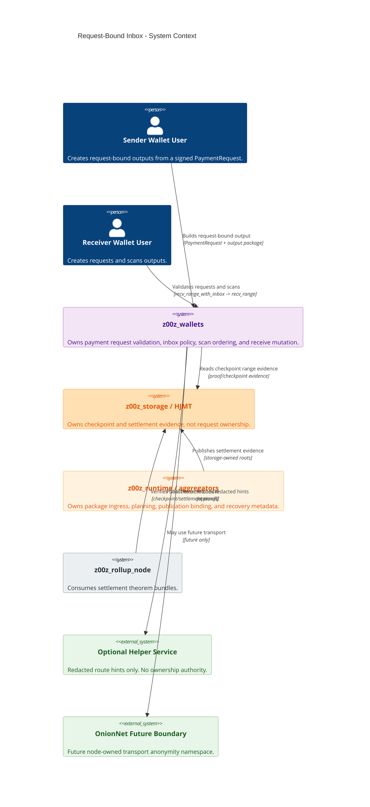
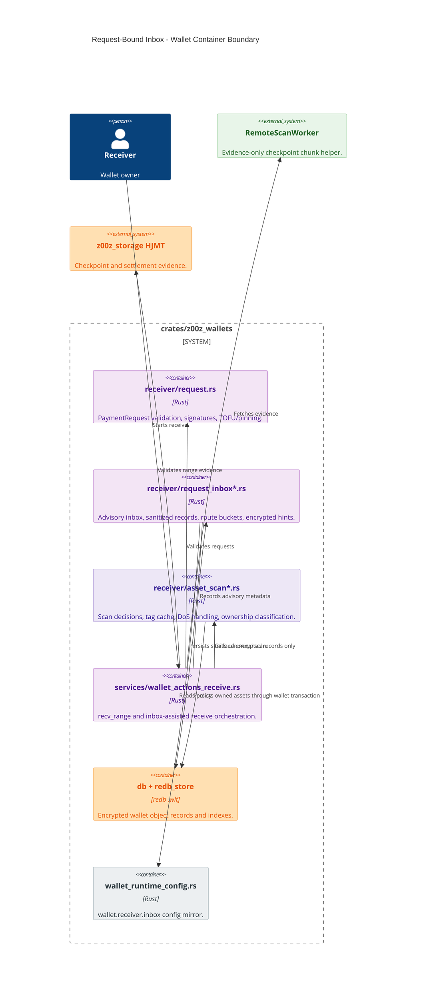
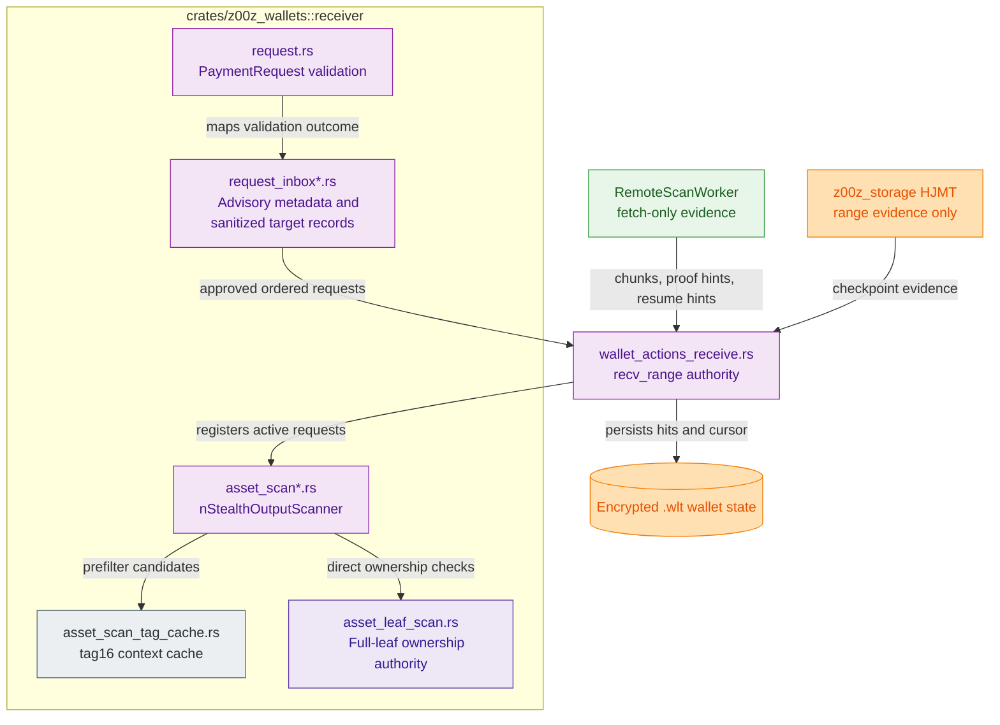
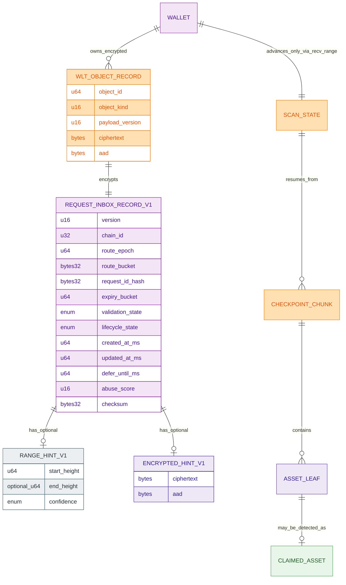
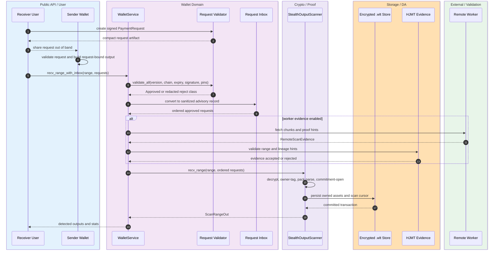
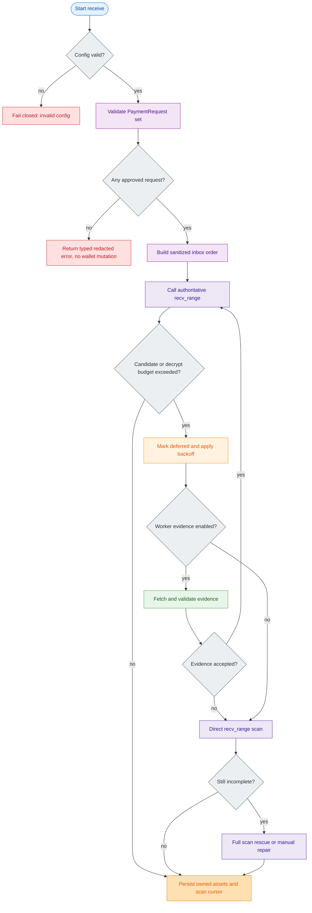
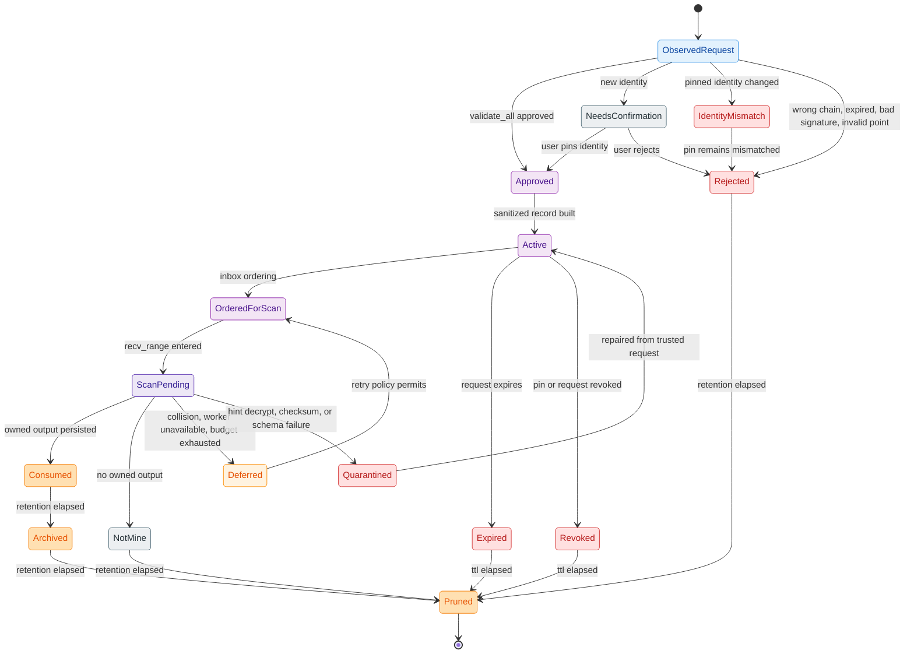

# Z00Z Request-Bound Inbox Contract And Privacy Boundary

[TOC]

Version: 2026-07-04

Status: canonical fused wallet-first Request-Bound Inbox specification.

Required canonical inbox gate path: `.planning/phases/071-Request-Bound-Inbox/Request-Bound-Inbox-Config.yaml`

Owner crate: `z00z_wallets`

Historical fusion inputs absorbed into this paper:

- `.planning/phases/071-Request-Bound-Inbox/Request-Bound-Inbox-Spec.md`
- `.planning/phases/071-Request-Bound-Inbox/Request-Bound-Inbox-Spec-1.md`

Optional audit artifact: `.planning/phases/071-Request-Bound-Inbox/Request-Bound-Inbox-Spec-Fusion.audit.md`

This paper is self-contained for implementation planning. Older specs, older
config drafts, and the audit artifact are provenance or review trace files, not
required source-of-truth companions.

## Key Terms Used In This Paper

This paper is self-contained. It defines the Request-Bound Inbox contract that
Z00Z MUST implement before durable request-inbox persistence, helper exports,
or network helper retrieval are promoted beyond the current wallet-local
advisory helper.

| Term | Meaning in this specification |
| --- | --- |
| `Request-bound receive` | The privacy-preferred receive lane where sender output construction and receiver scanning are bound to a validated `PaymentRequest.req_id`. |
| `Request-Bound Inbox` | Wallet-local advisory helper that reduces scan work by ordering request-bound scan attempts and storing sanitized route/hint metadata. |
| `Legacy inbox record` | The current in-memory `RequestInboxRecord` shape that includes `RequestRecipientBinding { owner_handle, view_pk, identity_pk }`. It is transitional and in-memory only for this feature. |
| `Target inbox record` | `RequestInboxRecordV1`, the sanitized durable/helper record defined here. It can be encrypted into `.wlt` storage and redacted for helper export. |
| `Authoritative receive lane` | `WalletService::recv_range(...)`, the only lane allowed to persist owned assets or advance wallet scan cursor state. |
| `Advisory receive lane` | `WalletService::recv_range_with_inbox(...)`, which validates requests, records advisory metadata, orders approved requests, and then calls `recv_range(...)`. |
| `Remote scan worker` | Evidence-only helper that can fetch chunks, proof hints, and resume hints. It cannot classify ownership or mutate wallet state. |
| `HJMT` | Storage-owned checkpoint and settlement evidence surface. It is not an inbox, registry, request validator, or wallet ownership authority. |
| `tag16` | A 16-bit local scan prefilter. It may reduce scan cost and may collide. It is never an identity token, ownership proof, auth token, or standalone DoS boundary. |
| `owner_handle` | Stable receiver handle derived from receiver secret material. It may appear in current live request validation inputs, but not in target durable/helper records. |
| `view_pk` | Receiver view public key bytes. It may appear in signed payment requests and live validation, but not in target durable/helper records. |
| `identity_pk` | Receiver identity public key bytes used for request signatures and TOFU/pinning checks. It must not be in target durable/helper records. |
| `route_bucket` | Domain-separated helper lookup value derived from request-bound context. It is not a receiver id and must not be inserted into public state. |
| `route_secret` | Future v2 network-helper secret that prevents a leaked request id from becoming the network lookup handle by itself. |
| `request_id_hash` | Wallet-local record key derived from `req_id` and chain id. It is not a public registry key. |
| `ZkPack_v1` | Current wallet pack contract using the live `ChaCha20Poly1305` facade. Field-native/Poseidon2 parity is future work. |
| `TxPackage` | Portable transaction package material. It remains sensitive when exported, forwarded, logged, backed up, or relayed. |
| `OnionNet` | Reserved future node-owned transport anonymity boundary under `crates/z00z_networks/onionnet`. It is not a shipped anonymity layer. |

## Naming And Symbol Conventions

The architecture MUST use wallet-first request-bound names. Inbox terms are
allowed only for advisory helper objects, not consensus, settlement, or rollup
truth.

| Concept | Preferred symbol | Rationale |
| --- | --- | --- |
| Document name | `Request-Bound-Inbox-Spec-Fusion` | The fused document is the canonical planning spec for this feature. |
| Config path | `Request-Bound-Inbox-Config.yaml` | The stricter gate supersedes `Request-Bound-Inbox-Config-1.yaml`. |
| Config type | `RequestInboxConfigV1` | Future wallet runtime type for `wallet.receiver.inbox`. |
| Legacy record | `LegacyRequestInboxRecord` | Names the current binding-rich in-memory shape without making it the target schema. |
| Durable record | `RequestInboxRecordV1` | Sanitized target record with no stable receiver identifiers. |
| Export profile | `RequestInboxExportV1` | Redacted route-hint profile only. |
| Route bucket | `RequestInboxRouteBucketV1` | Helper lookup value, not a wallet id. |
| Request id hash | `RequestInboxRequestIdHashV1` | Local duplicate/replacement key, not raw request id. |
| Hint AAD | `RequestInboxHintAadV1` | Explicit AEAD binding for encrypted hints. |
| Record id | `RequestInboxRecordIdV1` | Wallet-local object identity for `.wlt` persistence. |
| Reject class | `RequestInboxRejectClassV1` | Redacted validation class safe for logs/tests. |
| Abuse status | `RequestInboxAbuseStateV1` | Deferred/backoff/collision accounting without ownership meaning. |

## Invariant Anchors

### ZINV-RBI-001

Request-bound receive is the privacy-preferred receive lane. Card-only and plain
receive remain compatibility paths and MUST NOT be documented, tested, or
marketed as privacy-equivalent to request-bound receive.

### ZINV-RBI-002

Request-Bound Inbox v1 is wallet-owned. It belongs in `z00z_wallets` and MUST
NOT be moved into `z00z_storage`, `z00z_runtime`, `z00z_rollup_node`, OnionNet,
or a new standalone crate for v1.

### ZINV-RBI-003

Inbox is a helper and hint system. It is not an ownership oracle, not a public
address book, not an identity registry, not consensus state, and not a second
receive persistence authority.

### ZINV-RBI-004

`WalletService::recv_range(...)` is the only authoritative receive mutation
lane. Inbox operations may validate, record advisory metadata, order requests,
and call `recv_range(...)`; they MUST NOT directly persist owned assets or
advance scan cursor state.

### ZINV-RBI-005

The current binding-rich `RequestInboxRecord` is legacy/transitional. Target
durable/helper records MUST NOT contain `owner_handle`, `view_pk`,
`identity_pk`, stable receiver ids, raw request ids, amounts, asset ids, sender
identity, plaintext memos, or decrypted pack fields.

### ZINV-RBI-006

`tag16` is only a prefilter. Collisions are expected, attacker-induced false
positives are part of the design envelope, and ownership acceptance still
requires wallet-local decrypt, owner-tag, pack parse, and commitment checks.

### ZINV-RBI-007

Remote scan workers and HJMT evidence are evidence-only for inbox flows. They
may help fetch or bound scan ranges; they MUST NOT validate requests, claim
ownership, or mutate wallet state.

### ZINV-RBI-008

State unlinkability is not transport anonymity. `TxPackage`, compact payment
requests, receiver cards, forwarding bundles, helper hints, backups, exports,
relay handoff bytes, and logs remain sensitive material.

### ZINV-RBI-009

`ZkPack_v1` is the live wallet pack truth until dual-read compatibility,
fixture parity, decrypt parity, commitment-open parity, and associated-data
parity prove a field-native replacement.

### ZINV-RBI-010

The config gate is normative. Future runtime code MUST load, mirror, or
mechanically validate `Request-Bound-Inbox-Config.yaml` under
`wallet.receiver.inbox` before the phase can close.

## 1. Why This Specification Exists

The fused architecture keeps the best parts of both:

1. Keep the current repository truth: a wallet-local advisory `RequestInbox`
   exists today.
2. Reject the unsafe promotion path: the current binding-rich record MUST NOT
   become durable/helper state.
3. Define one target sanitized record and one redacted export profile.
4. Keep all mutation in `recv_range(...)`.
5. Treat HJMT, remote worker, runtime, rollup, and OnionNet as external
   supporting boundaries, never inbox authority.
6. Preserve the strongest test strategy from both drafts.
7. Preserve the strongest diagrams from both drafts while using parser-safe
   Mermaid syntax for the requirement trace.

This document supersedes both input specs for planning purposes. The input
documents should not be used as independent implementation authority after the
fusion audit is accepted.

## 2. Reader Contract

After reading this document, an engineer SHOULD be able to answer:

| Question | Correct answer source |
| --- | --- |
| Which crate owns Request-Bound Inbox v1? | Section 6 and Section 10: `z00z_wallets`. |
| Which receive path mutates wallet state? | Section 7 and Section 9: only `WalletService::recv_range(...)`. |
| Can current `RequestRecipientBinding` be persisted as the inbox record? | No. Section 8 marks it legacy/in-memory only. |
| Can HJMT store helper records or route buckets? | No. Section 11 forbids that. |
| Can remote workers decide ownership? | No. Section 12 keeps them evidence-only. |
| Is `tag16` an ownership proof or anti-spam proof? | No. Section 13 and Section 14 keep it prefilter-only. |
| Which config gates the work? | Section 5: `Request-Bound-Inbox-Config.yaml`. |
| What is sensitive transport material? | Section 15. |
| What tests are mandatory before closeout? | Section 16. |
| Which source-doc conflicts were resolved? | Section 4 and the companion audit artifact. |

## 3. Maturity Boundary

The architecture has current, target, and future lanes. Only the current
wallet-local helper and canonical receive lane are live today.

| Lane | Present status | Authority | Correct wording |
| --- | --- | --- | --- |
| Current advisory inbox | Implemented as in-memory wallet-local helper | Advisory only | Existing metadata/order helper around `recv_range(...)`. |
| Current binding-rich record | Implemented | Legacy/transitional only | Sensitive local process-memory shape; not target durable/helper state. |
| Target sanitized record | Specified here | Wallet-local durable/helper profile | Future `RequestInboxRecordV1` with no stable receiver identifiers. |
| Target config gate | Planning artifact exists | Normative planning gate | Must be mirrored or validated by runtime config before implementation closeout. |
| v1 local route bucket | Specified here | Local helper only | May derive from `req_id`, chain id, and epoch only inside wallet-local trust. |
| v2 network helper | Future | Non-authoritative helper only | Requires `route_secret`; raw `req_id` alone is insufficient for network helper lookup. |
| Field-native pack | Future | No live authority | `ZkPack_v1` remains live until parity is proven. |
| OnionNet transport | Future | Transport only | Reserved namespace; not shipped protocol anonymity and not wallet ownership logic. |

### 4.2 Security And Drift Findings

| Finding ID | Severity | Source | Risk | Fusion resolution |
| --- | --- | --- | --- | --- |
| `F-RBI-001` | HIGH | `Spec-1` privacy/persistence wording | It allows wallet-local sensitive inbox records to remain inside encrypted wallet persistence, which can silently promote `owner_handle`, `view_pk`, and `identity_pk` into durable helper state. | Target durable/helper records are sanitized. Current binding-rich records are legacy, in-memory only for this feature, not durable `.wlt` inbox records. |
| `F-RBI-002` | MEDIUM | Both specs | A route bucket derived only from `req_id` can become a stable lookup surface if a request leaks and the helper is network-visible. | v1 `req_id` route buckets are local-only. Any network helper v2 requires `route_secret`. |
| `F-RBI-003` | MEDIUM | `Spec-1` export profile | `request_id_hash`, validation class, and time buckets can still leak correlation if exported too precisely. | Export profile is redacted, time-bucketed, checksum-bound, and helper-only; validation classes are coarse and never import-ready ownership claims. |
| `F-RBI-004` | MEDIUM | Both specs | `tag16` could be overpromoted into ownership or spam control under collision pressure. | Strict tag-only mode requires complete contexts; collision storms defer/backoff and fall back to direct/full scan. |
| `F-RBI-005` | MEDIUM | Both specs | Remote worker or HJMT proof hints could be mistaken for ownership evidence. | Remote workers and HJMT are evidence-only; wallet-local decrypt/owner-tag/pack/commitment checks remain mandatory. |
| `F-RBI-006` | MEDIUM | Both specs | Logs, backups, debug exports, package handoffs, and request compact strings can leak receiver routing material. | Transport/package hygiene is elevated to an invariant; release plaintext debug exports are rejected. |
| `F-RBI-007` | MEDIUM | `Spec-1` E2E command examples | Recommended release commands use debug features such as `wallet_debug_tools` and `wallet_debug_dump`, which can normalize risky verification habits. | Fusion keeps debug features out of normative test commands; debug modes require explicit local-only justification. |
| `F-RBI-008` | LOW | `Spec-1` dependency table | `governor`, `postcard`, `bytes`, and `blake3` are listed as add-if-needed candidates, inviting dependency creep. | Fusion sets `add_now: []`; new crates require spec amendment and proof they reduce real complexity. |
| `F-RBI-009` | LOW | Both specs | Multiple config files can confuse authority. | Fusion uses `Request-Bound-Inbox-Config.yaml` and treats `Config-1` as non-normative draft input. |

### 4.3 Conflict Register

| Conflict ID | Topic | Source positions | Fusion decision |
| --- | --- | --- | --- |
| `C-RBI-001` | Recipient binding persistence | `Spec.md` forbids durable helper persistence; `Spec-1.md` allows sensitive local records inside encrypted wallet persistence. | Use `Spec.md`: binding-rich record is legacy/in-memory only for this feature; durable/helper profile is sanitized. |
| `C-RBI-002` | Canonical gate | `Spec.md` uses `Request-Bound-Inbox-Config.yaml`; `Spec-1.md` uses `Request-Bound-Inbox-Config-1.yaml`. | Use `Request-Bound-Inbox-Config.yaml`; `Config-1` contributes non-conflicting hints only. |
| `C-RBI-003` | Export schema | `Spec.md` defines route bucket plus encrypted hint; `Spec-1.md` defines request id hash plus validation/time buckets. | Fuse: export may contain route bucket, coarse range/expiry buckets, encrypted hint, checksum; no raw request id or receiver binding. |
| `C-RBI-004` | Dependency posture | `Spec.md` says add no crates now; `Spec-1.md` lists add-if-needed crates. | Use no-new-crate default. Candidate crates become research notes only. |
| `C-RBI-005` | Diagrams | `Spec.md` has formal C4 and sanitized ER; `Spec-1.md` has clearer component/fallback diagrams. | Keep formal C4 plus the clearer component/fallback ideas, revised for sanitized target state. |

No unresolved conflict remains after the fusion decisions above.

## 5. Normative Configuration Gate

`Request-Bound-Inbox-Config.yaml` is part of the architecture, not decoration.
The file lives under the phase directory for planning hygiene, but its scope is
only `wallet.receiver.inbox`; it is not a phase-wide configuration surface.
Runtime implementation MUST expose or validate compatible settings under:

```yaml
wallet:
  receiver:
    inbox: {}
```

Environment override prefix:

```text
Z00Z_WALLET_RECEIVER_INBOX_
```

Implementation rules:

- Use `z00z_utils::config`, `z00z_utils::codec::YamlCodec`, and existing wallet
  runtime config patterns.
- Do not use raw `std::fs` config reads or ad hoc YAML parsing.
- Malformed explicit config fails closed.
- Missing optional keys may use bounded defaults from the gate.
- Release builds must reject plaintext sidecars and insecure debug export modes.

Gate snapshot:

```yaml
inbox:
  mode: "wallet_local_advisory"
  mutation_authority: "recv_range_only"
  current_legacy_shape:
    stores_recipient_binding: true
    allowed_scope: "transitional_in_memory_only"
    durable_persistence_allowed: false
    export_allowed: false
    migration_required: true
  target_record:
    name: "RequestInboxRecordV1"
    storage_profile: "encrypted_wlt_sanitized"
    export_profile: "redacted_route_hint_v1"
scan:
  tag16:
    role: "prefilter_only"
    add_request_authorizes_tag_only_scan: false
remote_scan:
  authority: "evidence_only"
storage_hjmt:
  use_for_inbox_authority: false
transport_privacy:
  plaintext_logging_allowed: false
```

## 6. Current Code Truth

The following repository facts are the current implementation baseline that
this fusion uses.

| Area | Current truth | Evidence |
| --- | --- | --- |
| Request model | `PaymentRequest` carries `owner_handle`, `view_pk`, `identity_pk`, `req_id`, chain id, optional amount, expiry, metadata, and signature. | `crates/z00z_wallets/src/receiver/payment_request_types.rs` |
| Request validation | Request validation enforces version, chain, expiry, key decoding, signature verification, and TOFU/pinning outcome. | `crates/z00z_wallets/src/receiver/request.rs` |
| Current inbox exists | `RequestInbox` has `upsert`, `record_result`, `get`, `list`, `remove`, `len`, `is_empty`, and `ordered_requests`. | `crates/z00z_wallets/src/receiver/request_inbox.rs` |
| Current inbox is sensitive | `RequestRecipientBinding` stores `owner_handle`, `view_pk`, and `identity_pk`. | `crates/z00z_wallets/src/receiver/request_inbox.rs` |
| Current inbox is advisory | Source comments say the helper is advisory and off-consensus. | `crates/z00z_wallets/src/receiver/request_inbox.rs` |
| Authoritative receive | `recv_range(...)` performs receive scanning and state mutation. | `crates/z00z_wallets/src/services/wallet_actions_receive.rs` |
| Inbox receive | `recv_range_with_inbox(...)` validates requests, records outcomes, filters approved requests, orders them, and calls `recv_range(...)`. | `crates/z00z_wallets/src/services/wallet_actions_receive.rs` |
| Invalid request behavior | Existing tests cover wrong chain, expiry, bad signature, pin mismatch, unsupported version, and no wallet mutation. | `crates/z00z_wallets/tests/test_stealth_request.rs` |
| `tag16` boundary | Strict tag-only scanning requires complete contexts; `add_request(...)` alone never authorizes ownership. | `crates/z00z_wallets/src/receiver/asset_scan_tag_cache.rs`, `crates/z00z_wallets/src/receiver/wallet_asset_scanner.rs` |
| Remote worker | Remote scan worker evidence is revalidated locally and cannot own mutation. | `crates/z00z_wallets/src/chain/scan_engine.rs`, `crates/z00z_wallets/src/services/wallet_actions_receive.rs` |
| Wallet storage | Native wallet storage uses encrypted redb `.wlt` object records and AAD-bound payloads. | `crates/z00z_wallets/src/db/mod.rs`, `crates/z00z_wallets/src/redb_store/` |
| Storage/HJMT | Settlement storage owns roots, proofs, checkpoint evidence, and publication snapshots. | `crates/z00z_storage/src/settlement/` |
| Runtime | Aggregators own planning, placement, publication binding, and recovery metadata; they do not own settlement or rollup proof truth. | `crates/z00z_runtime/aggregators/README.md` |
| Rollup | Rollup node verifies proof/theorem helper surfaces; it does not own wallet inbox semantics. | `crates/z00z_rollup_node/` |
| OnionNet | OnionNet is a future transport boundary, not a shipped anonymity layer or wallet ownership authority. | `crates/z00z_networks/onionnet/` |

## 7. Canonical Architecture Contract

### 7.1 System Context



### 7.2 Wallet Container Boundary



### 7.3 Wallet Receiver Component View



## 8. Data Contract

### 8.1 Legacy Current Shape

Current code has this binding-rich local shape:

```rust
pub struct RequestInboxRecord {
    pub request_id: [u8; 32],
    pub chain_id: u32,
    pub recipient: RequestRecipientBinding,
    pub expiry: u64,
    pub range_hint: Option<RequestRangeHint>,
    pub validation: RequestInboxValidation,
    pub created_at: u64,
}

pub struct RequestRecipientBinding {
    pub owner_handle: [u8; 32],
    pub view_pk: [u8; 32],
    pub identity_pk: [u8; 32],
}
```

Fusion rule: this shape is allowed only as transitional in-memory behavior. It
MUST NOT become durable `.wlt` inbox persistence, exported helper state, logged
state, backup plaintext, runtime message data, storage/HJMT state, or rollup
payload.

### 8.2 Target `RequestInboxRecordV1`

Target durable/helper record:

```rust
pub struct RequestInboxRecordV1 {
    pub version: u16,
    pub chain_id: u32,
    pub route_epoch: u64,
    pub route_bucket: [u8; 32],
    pub request_id_hash: [u8; 32],
    pub range_hint: Option<RequestRangeHintV1>,
    pub expiry_bucket: u64,
    pub validation_state: RequestValidationStateV1,
    pub lifecycle_state: RequestLifecycleStateV1,
    pub created_at_ms: u64,
    pub updated_at_ms: u64,
    pub defer_until_ms: Option<u64>,
    pub abuse_score: u16,
    pub encrypted_hint: Option<Vec<u8>>,
    pub checksum: [u8; 32],
}
```

Allowed plaintext fields:

- version,
- chain id,
- route epoch,
- route bucket,
- request id hash,
- range hint,
- expiry bucket,
- validation state,
- lifecycle state,
- created/updated/defer timestamps,
- abuse score,
- encrypted hint ciphertext,
- checksum.

Forbidden plaintext fields:

- `owner_handle`,
- `view_pk`,
- `identity_pk`,
- stable receiver id,
- raw `req_id`,
- amount,
- asset id,
- sender identity,
- plaintext memo,
- decrypted pack fields,
- receiver secrets,
- wallet file paths,
- TOFU or pin material.

### 8.3 Route Bucket

Local v1 compatibility:

```text
route_bucket = H(
  "z00z.wallet.request_inbox.route_bucket.v1",
  req_id || chain_id || route_epoch
)
```

This v1 derivation is local-only. It MUST NOT be used as a network-accessible
lookup surface by itself.

Network-helper v2:

```text
route_bucket = H(
  "z00z.wallet.request_inbox.route_bucket.v1",
  route_secret || chain_id || route_epoch
)
```

v2 network helper mode requires `route_secret`. A network-accessible helper must
not rely only on raw `req_id`, because a leaked request could otherwise become a
stable lookup handle for the request lifetime.

### 8.4 Request Id Hash

```text
request_id_hash = H(
  "z00z.wallet.request_inbox.request_id_hash.v1",
  req_id || chain_id
)
```

`request_id_hash` is a wallet-local duplicate/replacement key. It must not be
used as a public registry key, HJMT key, runtime routing key, rollup payload, or
plaintext export identifier.

### 8.5 Encrypted Hint

Encrypted hints may contain request id, memo hash, payment id hash, scan
priority, and wallet-local notes only when all values are encrypted and AAD-bound.

Hint AAD must bind:

- record version,
- chain id,
- wallet AAD identity,
- object id,
- payload version,
- route bucket,
- route epoch.

Hint decrypt failure must quarantine the record or ignore the hint and fall
back to direct scan. It must not mutate wallet state.

### 8.6 Redacted Export Profile

```rust
pub struct RequestInboxExportV1 {
    pub version: u16,
    pub chain_id: u32,
    pub route_epoch: u64,
    pub route_bucket: [u8; 32],
    pub range_hint: Option<RequestRangeHintV1>,
    pub expiry_bucket: u64,
    pub validation_class: RequestInboxValidationClassV1,
    pub hint_ciphertext: Vec<u8>,
    pub checksum: [u8; 32],
}
```

Export records are helper hints only. They are not import-ready ownership claims
and cannot create owned assets or advance scan cursor state.

### 8.7 Persistence Relationship View



## 9. End-To-End Flow

### 9.1 Request-Bound Inbox Receive Sequence



### 9.2 Fallback Flow



### 9.3 Inbox Record Lifecycle



## 10. Module Ownership

### 10.1 Wallet Receiver Modules

Implementation home:

- `crates/z00z_wallets/src/receiver/request.rs`
- `crates/z00z_wallets/src/receiver/payment_request_types.rs`
- `crates/z00z_wallets/src/receiver/request_inbox.rs`
- `crates/z00z_wallets/src/receiver/asset_scan*`

Future modules:

| Module | Purpose |
| --- | --- |
| `request_inbox_config.rs` | Typed `wallet.receiver.inbox` config. |
| `request_inbox_record.rs` | `RequestInboxRecordV1`, lifecycle states, redacted export DTOs. |
| `request_inbox_crypto.rs` | Route bucket, request id hash, hint AAD, record id, export checksum. |
| `request_inbox_store.rs` | Optional encrypted `.wlt` persistence backend for sanitized records only. |
| `request_inbox_migration.rs` | Legacy current-shape migration and recipient-binding drop/redaction. |
| `request_inbox_abuse.rs` | Collision, rate, defer, and backoff policy if existing scan types are insufficient. |

### 10.2 Wallet Services

`crates/z00z_wallets/src/services/wallet_actions_receive.rs` remains the
integration point.

Required behavior:

- `recv_range(...)` stays authoritative.
- `recv_range_with_inbox(...)` validates, records advisory metadata, orders
  approved requests, and calls `recv_range(...)`.
- No inbox path directly persists owned assets.
- No inbox path directly advances scan cursor.
- Remote-worker receive validates evidence and re-enters wallet-local scan.

### 10.3 Wallet Runtime Config

`wallet.receiver.inbox` must mirror the gate values needed at runtime:

```yaml
wallet:
  receiver:
    inbox:
      enabled: true
      max_records_per_wallet: 4096
      max_records_per_route_bucket: 64
      ttl_seconds_after_expiry: 86400
      route_epoch_seconds: 86400
      tag16:
        max_contexts_per_tag16: 32
      dos:
        max_candidates_per_checkpoint: 4096
        max_decrypt_per_checkpoint: 512
        defer_threshold: 1024
      remote_scan:
        enabled: true
```

### 10.4 Wallet Persistence

Durable Request-Bound Inbox storage belongs in wallet `.wlt` storage, not
storage/HJMT and not runtime.

Persistence rules:

- Persist only sanitized `RequestInboxRecordV1`.
- Encrypt through the existing wallet object encryption path.
- Bind AAD to wallet id, object id, payload version, route bucket, and route epoch.
- Add indexes equivalent to `RequestInboxByRouteBucket`,
  `RequestInboxByExpiry`, `RequestInboxByValidationState`, and
  `RequestInboxByRangeStart`.
- Keep plaintext sidecars disabled outside gated dev fixtures.
- Do not create tx history rows merely because an inbox record exists.
- Do not advance scan cursor from inbox operations alone.

## 11. Storage, HJMT, Runtime, Rollup, And Network Boundaries

### 11.1 Storage And HJMT

Allowed storage/HJMT roles:

- provide checkpoint chunks or terminal leaves for wallet-local scans,
- validate checkpoint roots and proof envelopes,
- support range evidence for remote scan workers,
- anchor cursor expectations through checkpoint height/hash continuity.

Forbidden storage/HJMT roles:

- store request inbox records as public settlement data,
- store route buckets, request id hashes, helper records, or helper ciphertext,
- classify wallet ownership,
- validate TOFU pins,
- expose `owner_handle`, `view_pk`, `identity_pk`, or request compact payloads,
- make `backend_root` public request routing truth.

### 11.2 Runtime Aggregators

Allowed runtime roles:

- digest-rebind `TxPackage` and `ClaimTxPackage`,
- plan verified work items,
- bind publication contracts,
- coordinate shard routing and recovery metadata.

Forbidden runtime roles:

- own request inbox records,
- validate wallet TOFU pins,
- decide receiver ownership,
- replace wallet scan with planner metadata,
- log request artifacts or tx packages in plaintext.

### 11.3 Rollup Node

Allowed rollup roles:

- verify package/checkpoint/link/exec inclusion,
- reject settlement theorem mismatches,
- bind tx package structure to checkpoint evidence.

Forbidden rollup roles:

- interpret request inbox validation,
- persist request records,
- expose recipient material,
- use request metadata as settlement proof.

### 11.4 OnionNet

Allowed future OnionNet roles:

- anonymous or metadata-minimizing relay transport,
- relay handoff policy,
- transport replay control,
- operator privacy topology.

Forbidden OnionNet roles:

- wallet ownership classification,
- request signature validation authority,
- scan cursor mutation,
- HJMT proof authority.

## 12. Security And Cryptography Requirements

### 12.1 Request Validation

- `PaymentRequest.version` must equal the supported version.
- `PaymentRequest.chain_id` must match the persisted wallet chain id.
- Expired requests fail closed.
- `view_pk` and `identity_pk` must decode as strict public keys.
- Request signature verifies over canonical unsigned bytes with
  `z00z.payment.request.v1`.
- TOFU/pinning maps to approved, user-confirmation, identity-mismatch, or
  revoked-pin outcomes.
- Only approved requests may enter automatic receive scanning.

### 12.2 Domain Separation

New helper crypto must use explicit wallet-local domains:

| Purpose | Domain |
| --- | --- |
| Route bucket | `z00z.wallet.request_inbox.route_bucket.v1` |
| Request id hash | `z00z.wallet.request_inbox.request_id_hash.v1` |
| Hint AAD | `z00z.wallet.request_inbox.hint_aad.v1` |
| Record id | `z00z.wallet.request_inbox.record_id.v1` |
| Export checksum | `z00z.wallet.request_inbox.export_checksum.v1` |

These are wallet-local helper domains, not consensus domains. They should live
under `crates/z00z_wallets/src/domains/definitions.rs` unless a future
consensus contract truly needs them. Do not overload `z00z.consensus.tag16.v1`.

### 12.3 Live Pack Boundary

`ZkPack_v1` remains the live wallet pack truth. This spec does not claim
Poseidon2, OWF parity, field-native proof parity, or a completed migration.

Field-native pack migration must:

- freeze current fixtures,
- preserve historical decryptability,
- support dual-read or equivalent compatibility,
- prove decrypt, commitment-open, and associated-data parity,
- avoid changing request-bound receive behavior before parity is accepted.

### 12.4 Sensitive Data Handling

Sensitive fields:

- receiver secret,
- view secret keys,
- `owner_handle`,
- `view_pk` when tied to request/inbox metadata,
- `identity_pk` when tied to request/inbox metadata,
- raw `req_id` outside encrypted wallet context,
- compact payment request strings,
- receiver cards and receiver card records,
- tx package bytes,
- decrypted `AssetPackPlain`,
- `s_out`, blinding, amount, and wallet reveal material.

Logging rules:

- log only stable redacted validation classes,
- never log raw request bytes,
- never log compact request strings,
- never log recipient binding fields,
- never log package bytes,
- never log decrypted pack fields,
- tests must assert protected logs do not contain forbidden substrings or
  serialized sensitive values.

### 12.5 Constant-Time And Zeroization

Use `subtle` or existing z00z abstractions for equality on route buckets,
request hashes, hint checksums, and candidate tags. New secret or sensitive
helper material must use existing `Hidden<T>`/`zeroize` patterns where
applicable.

Debug output must be explicit and redacted. `Debug` impls for route/hint records
must not print full bytes.

### 12.6 Anti-Patterns

- Do not promote `RequestInboxRecord` into consensus state.
- Do not make the current binding-rich record durable.
- Do not expose local-sensitive inbox records over RPC without redaction.
- Do not use HJMT proof hints as proof that an output belongs to a wallet.
- Do not treat remote worker evidence as ownership evidence.
- Do not use `tag16` as an account id, receiver id, address, spam proof, or auth token.
- Do not add transport overlay code inside wallet receiver modules.
- Do not describe card-only or plain receive as privacy-equivalent to request-bound receive.

## 13. Fallback And Recovery Mechanisms

Fallback order is normative:

1. Request-inbox ordered scan.
2. Direct `recv_range(...)` scan with approved requests.
3. Remote scan worker evidence fetch followed by local `recv_range(...)`.
4. Full scan rescue with DoS mitigation.
5. Manual repair scan.

| Failure | Required response |
| --- | --- |
| Malformed config | Fail closed with typed config error; no wallet mutation. |
| No approved request | Return redacted `WalletError::InvalidParams`; no wallet mutation. |
| Wrong chain | Record redacted wrong-chain class; no wallet mutation. |
| Expired request | Record redacted expired class; no wallet mutation. |
| Bad signature | Record redacted signature failure; no wallet mutation. |
| Identity mismatch | Require user confirmation or rejection; no automatic scan. |
| Route bucket collision | Bounded decrypt/direct scan/defer; no ownership from collision. |
| `tag16` collision storm | Defer or fall back within configured budgets. |
| Remote worker transport error | Local direct scan or deferred result according to config; no cursor advance from worker error. |
| Non-contiguous chunks | Reject evidence; keep wallet state unchanged. |
| Stale resume hint | Reject evidence; keep current cursor unchanged. |
| Empty proof hint bytes | Reject evidence; keep wallet state unchanged. |
| HJMT proof/root mismatch | Reject evidence; do not accept wallet ownership from proof hints. |
| Hint decrypt/checksum failure | Quarantine or ignore hint and fall back; no wallet mutation. |

## 14. Package And Transport Privacy

Request-Bound Inbox does not make portable transaction packages safe to expose.

Sensitive artifacts:

- `TxPackage`,
- compact payment requests,
- receiver cards,
- forwarding bundles,
- inbox helper hints,
- backup/export artifacts,
- relay handoff bytes,
- wallet logs.

Rules:

- Local verification does not solve transport anonymity.
- Every path where package or request bytes leave wallet-local trust requires
  encryption or explicit redaction.
- Plaintext debug exports are forbidden in release builds.
- Future transport anonymity work belongs under OnionNet.
- OnionNet must remain transport-only and must not become wallet ownership
  authority.

## 15. Requirements And Traceability

```mermaid
requirementDiagram
  requirement RBI_PRIV_001 {
    id: RBI_PRIV_001
    text: Target records contain no stable receiver identifiers
    risk: high
    verifymethod: test
  }
  requirement RBI_FLOW_001 {
    id: RBI_FLOW_001
    text: Wallet mutation happens only through recv_range
    risk: high
    verifymethod: test
  }
  requirement RBI_SCAN_001 {
    id: RBI_SCAN_001
    text: tag16 remains a prefilter only
    risk: medium
    verifymethod: test
  }
  requirement RBI_WORKER_001 {
    id: RBI_WORKER_001
    text: Remote worker evidence is fetch only
    risk: high
    verifymethod: test
  }
  requirement RBI_HJMT_001 {
    id: RBI_HJMT_001
    text: HJMT is not request inbox authority
    risk: high
    verifymethod: inspection
  }
  requirement RBI_CONF_001 {
    id: RBI_CONF_001
    text: Runtime config mirrors Request Bound Inbox Config YAML
    risk: medium
    verifymethod: test
  }
  element WalletReceive {
    type: module
    docref: wallet_actions_receive_rs
  }
  element InboxRecord {
    type: module
    docref: request_inbox_record_rs
  }
  element Scanner {
    type: module
    docref: asset_scan
  }
  element ConfigGate {
    type: yaml
    docref: Request_Bound_Inbox_Config_yaml
  }
  WalletReceive - satisfies -> RBI_FLOW_001
  InboxRecord - satisfies -> RBI_PRIV_001
  Scanner - satisfies -> RBI_SCAN_001
  WalletReceive - satisfies -> RBI_WORKER_001
  WalletReceive - traces -> RBI_HJMT_001
  ConfigGate - satisfies -> RBI_CONF_001

  style RBI_PRIV_001 fill:#E3F2FD,stroke:#1E88E5,stroke-width:1px,color:#0D47A1
  style RBI_FLOW_001 fill:#E3F2FD,stroke:#1E88E5,stroke-width:1px,color:#0D47A1
  style RBI_SCAN_001 fill:#E3F2FD,stroke:#1E88E5,stroke-width:1px,color:#0D47A1
  style RBI_WORKER_001 fill:#E3F2FD,stroke:#1E88E5,stroke-width:1px,color:#0D47A1
  style RBI_HJMT_001 fill:#E3F2FD,stroke:#1E88E5,stroke-width:1px,color:#0D47A1
  style RBI_CONF_001 fill:#E3F2FD,stroke:#1E88E5,stroke-width:1px,color:#0D47A1
  style WalletReceive fill:#F3E5F5,stroke:#8E24AA,stroke-width:1px,color:#4A148C
  style InboxRecord fill:#F3E5F5,stroke:#8E24AA,stroke-width:1px,color:#4A148C
  style Scanner fill:#EDE7F6,stroke:#5E35B1,stroke-width:1px,color:#311B92
  style ConfigGate fill:#ECEFF1,stroke:#546E7A,stroke-width:1px,color:#263238
```



### 15.1 Functional Requirements

- `RBI-FUNC-001`: The system SHALL validate every supplied payment request before using it for receive scanning.
- `RBI-FUNC-002`: The system SHALL record only redacted validation classes for rejected requests.
- `RBI-FUNC-003`: Only approved requests SHALL enter automatic receive scanning.
- `RBI-FUNC-004`: Request ordering SHALL be deterministic by configured range, epoch, time, and request hash rules.
- `RBI-FUNC-005`: Wallet mutation SHALL happen only through `recv_range(...)`.
- `RBI-FUNC-006`: Inbox insert/list/remove/reject recording SHALL be metadata-only unless followed by canonical receive.
- `RBI-FUNC-007`: Direct `recv_range(...)` fallback SHALL remain available when inbox is disabled, unavailable, or unhealthy.
- `RBI-FUNC-008`: Remote worker fallback SHALL never allow worker mutation.

### 15.2 Privacy Requirements

- `RBI-PRIV-001`: Target durable/helper records SHALL NOT contain `owner_handle`, `view_pk`, `identity_pk`, raw `req_id`, compact request bytes, amounts, asset ids, sender identity, or decrypted pack fields.
- `RBI-PRIV-002`: Current binding-rich inbox records SHALL remain legacy/transitional and SHALL NOT become durable helper records.
- `RBI-PRIV-003`: Card-only and plain receive SHALL remain compatibility paths.
- `RBI-PRIV-004`: `TxPackage`, compact request, receiver-card, forwarding bundle, and backup/export paths SHALL be sensitive transport material.
- `RBI-PRIV-005`: OnionNet SHALL remain a future transport boundary and SHALL NOT be used to claim shipped protocol-enforced anonymity.

### 15.3 Security Requirements

- `RBI-SEC-001`: Request signatures SHALL use the canonical request signing context.
- `RBI-SEC-002`: Wrong chain id, expired timestamp, invalid keys, invalid signatures, revoked pins, and identity mismatch SHALL fail closed.
- `RBI-SEC-003`: `tag16` collisions SHALL NOT produce ownership acceptance.
- `RBI-SEC-004`: Remote proof hints SHALL NOT bypass wallet-local scan validation.
- `RBI-SEC-005`: HJMT proof/root evidence SHALL NOT be accepted as wallet ownership proof.
- `RBI-SEC-006`: New helper crypto SHALL use domain separation and SHALL NOT introduce custom crypto in wallet modules.

### 15.4 Configuration Requirements

- `RBI-CONF-001`: `Request-Bound-Inbox-Config.yaml` SHALL be the normative inbox gate for `wallet.receiver.inbox`, even though the file is stored under the phase planning path.
- `RBI-CONF-002`: Runtime config SHALL expose or validate `wallet.receiver.inbox` keys.
- `RBI-CONF-003`: Runtime config SHALL expose environment overrides under `Z00Z_WALLET_RECEIVER_INBOX_`.
- `RBI-CONF-004`: Malformed explicit config SHALL fail closed.
- `RBI-CONF-005`: Defaults SHALL remain bounded and testable.

## 16. Test Strategy

### 16.1 Existing Tests To Preserve

| Test family | Coverage |
| --- | --- |
| Request validation tests | Wrong chain, expiry, bad signature, malformed keys, TOFU/pinning outcomes. |
| `test_inbox_orders_metadata_only` | Inbox ordering is metadata-only and deterministic. |
| `test_inbox_list_delete_metadata` | Inbox insert/list/remove does not mutate wallet state. |
| `test_valid_case_reenters_lane` | Approved request through inbox re-enters authoritative receive and persists only through canonical path. |
| `test_req_flow` | Request-bound tag behavior separates request ids and rejects unauthorized tag-only scan. |
| `test_fast_reject` | `tag16` prefilter skips high-volume noise while preserving owned outputs. |
| `test_prefilter_collision` | Collisions do not directly imply ownership. |
| `test_dos_resistance` | Collision-heavy scan remains bounded. |
| Remote worker tests | Worker evidence feeds authoritative wallet receive lane and stale/malicious/transport failure paths do not mutate wallet state. |

### 16.2 Required New Unit Tests

- `test_target_record_has_no_recipient_binding`
- `test_legacy_record_migration_drops_binding`
- `test_route_bucket_changes_with_req_id_or_route_secret`
- `test_route_bucket_changes_with_chain_id`
- `test_route_bucket_changes_with_epoch`
- `test_request_id_hash_domain_separated`
- `test_hint_aad_binds_route_bucket`
- `test_record_checksum_binds_fields`
- `test_inbox_order_matches_config`
- `test_inbox_config_defaults_are_bounded`
- `test_inbox_config_rejects_unbounded_records`
- `test_plaintext_sidecar_rejected_in_release`
- `test_inbox_log_summary_redacts`
- `test_tag16_strict_requires_complete_contexts`

### 16.3 Required Integration Tests

- `test_inbox_approved_reenters_recv_range`
- `test_recv_range_with_inbox_disabled_falls_back`
- `test_wlt_inbox_roundtrip_encrypted_sanitized`
- `test_backup_export_redacts_inbox`
- `test_exported_inbox_cannot_import_claim`
- `test_worker_evidence_after_inbox_order`
- `test_worker_evidence_revalidated_locally`
- `test_hjmt_range_mismatch_rejects`
- `test_plain_card_path_not_privacy_equivalent`

### 16.4 Negative Tests

- wrong chain id request,
- expired request,
- unsupported request version,
- malformed compact encoding,
- invalid request size,
- invalid public key bytes,
- bad signature bytes,
- signature verify failure,
- pin revoked,
- identity mismatch,
- no approved requests,
- route bucket collision,
- `tag16` collision storm,
- incomplete tag context set,
- remote worker returned non-contiguous chunks,
- remote worker returned stale resume hint,
- remote worker returned empty proof hint bytes,
- HJMT proof root mismatch,
- exported helper record contains sensitive field,
- logs contain compact request bytes,
- release build enables plaintext debug export.

### 16.5 Simulation Scenarios

| Scenario | Goal | Expected result |
| --- | --- | --- |
| `scenario_rbi_request_happy_path` | Alice creates request, Bob builds request-bound output, Alice scans with inbox. | One owned output accepted through `recv_range(...)`; inbox has approved sanitized metadata. |
| `scenario_rbi_tag16_collision_storm` | Many adversarial leaves share candidate tags. | Scan remains bounded; no false ownership; some work deferred. |
| `scenario_rbi_expired_request_flood` | Many expired requests are submitted with chunks. | No wallet mutation; stable reject classes; expired records pruned. |
| `scenario_rbi_wrong_chain_replay` | Devnet wallet receives request bound to another chain. | Wrong chain reject; no cursor advance. |
| `scenario_rbi_remote_partition` | Remote worker transport fails while inbox has approved requests. | Direct fallback or deferred result according to config; no inconsistent state. |
| `scenario_rbi_stale_checkpoint_hint` | Worker supplies resume hint inconsistent with wallet cursor. | Fail closed and keep current cursor. |
| `scenario_rbi_offline_package_handoff` | Request-bound output is carried in offline `TxPackage`. | Package verifies locally, but transport remains sensitive and no anonymity claim is made. |
| `scenario_rbi_reorg_rescue_scan` | Checkpoint evidence rolls back after inbox hints exist. | Stale hints rejected; full scan rescue may rebuild local scan state. |
| `scenario_rbi_pruned_history` | Checkpoint history is not indefinitely available. | Inbox does not replace archive/witness/replay evidence; rescue depends on retained evidence. |

### 16.6 End-To-End Gates

Recommended focused commands for future implementation:

```bash
cargo test -p z00z_wallets --features test-params-fast --test test_stealth_request
cargo test -p z00z_wallets --features test-params-fast --test test_asset_scanner_prefilter
cargo test -p z00z_wallets --features test-params-fast --test test_remote_scan_worker
cargo test -p z00z_simulator --features test-fast scenario_rbi
```

Debug-only features such as `wallet_debug_tools` or `wallet_debug_dump` MUST NOT
appear in normative closeout commands unless a local-only debugging note explains
why they are safe for that run.

## 17. Dependency Recommendations

Default rule: do not add new crates for v1.

| Need | Recommendation | Status |
| --- | --- | --- |
| Config | `z00z_utils::config` and `YamlCodec` | Existing abstraction. |
| Serialization | `serde` through z00z codec wrappers | Existing workspace dependency. |
| Errors | `thiserror` | Existing workspace dependency. |
| Wallet persistence | existing redb `.wlt` path | Existing wallet backend. |
| AEAD | existing `chacha20poly1305` for `ZkPack_v1` | Live pack truth. |
| Hash/KDF | existing `z00z_crypto` domains, `blake2`, `hkdf`, `sha2` | Avoid custom crypto. |
| Constant-time equality | `subtle` or existing wrappers | Existing dependency. |
| Secret cleanup | `zeroize` and existing `Hidden<T>` patterns | Existing dependency. |
| Async I/O | `tokio` at service/runtime boundaries only | Existing dependency. |
| CPU scan parallelism | `rayon` only where existing scanner design supports it | Existing dependency. |
| Property tests | `proptest` | Existing dev dependency. |
| Benchmarks | `criterion` | Existing dev dependency. |
| Temporary files | `tempfile` | Existing dev dependency. |
| Structured logs | `tracing` through z00z logging wrappers | Existing dependency. |

Rejected for v1:

- new embedded database,
- alternate AEAD for `ZkPack_v1`,
- OPRF/PIR crates,
- network overlay crates inside wallet receiver,
- custom crypto helper crates,
- raw `serde_yaml`/`serde_json` in business logic where z00z abstractions exist,
- `blake3` for cryptographic identity or helper commitments.

## 18. Implementation Phases

### Phase A: Fusion Spec And Gate Freeze

- Land this fusion spec.
- Keep `Request-Bound-Inbox-Config.yaml` as the canonical gate.
- Treat `Spec.md`, `Spec-1.md`, `Config-1.yaml`, and the audit artifact as optional provenance files after fusion acceptance.
- Add source-shape checks for outdated claims if needed.

### Phase B: Runtime Config Gate

- Add typed `wallet.receiver.inbox` config under wallet runtime config.
- Add environment overrides with `Z00Z_WALLET_RECEIVER_INBOX_`.
- Add config bound tests.
- Validate release-mode security settings.

### Phase C: Sanitized Record And Migration

- Add `RequestInboxRecordV1`.
- Add route bucket, request id hash, hint AAD, record id, and export checksum helpers.
- Treat current `RequestInboxRecord` as in-memory legacy.
- Convert validated requests to sanitized target records.
- Add migration tests proving recipient binding is dropped.

### Phase D: Redacted Export Profile

- Add `RequestInboxExportV1`.
- Add redacted debug output.
- Add export redaction tests and log guards.
- Prove exported helper profiles cannot create owned assets or advance cursor.

### Phase E: Optional Encrypted Persistence

- Add wallet redb object kind and indexes if product flow requires persistence.
- Persist sanitized encrypted records only.
- Bind AAD to wallet id, object id, payload version, route bucket, and epoch.
- Add prune, duplicate replacement, and backup/export tests.

### Phase F: Fallback And Abuse Hardening

- Wire configured candidate/decrypt/defer budgets.
- Add route collision and `tag16` storm tests.
- Add deferred processing status.
- Add worker evidence fallback coverage.
- Add full scan rescue behavior.

### Phase G: Remote Worker, HJMT, Simulator, And E2E

- Validate remote worker evidence against range and lineage constraints.
- Reject cursor advancement from invalid evidence.
- Add HJMT mismatch tests.
- Keep HJMT out of request policy.
- Add simulator request-bound inbox scenarios.
- Add offline package handoff privacy checks.
- Add transport/log/export redaction checks.

## 19. Completion Criteria

Request-Bound Inbox implementation is complete only when:

- `Request-Bound-Inbox-Config.yaml` is mirrored into runtime config or mechanically validated,
- `RequestInbox` remains wallet-local and advisory,
- target durable/helper records contain no stable receiver identifiers,
- current binding-rich record shape is marked legacy and not persisted,
- wallet mutation still happens only through `recv_range(...)`,
- invalid request paths do not mutate wallet state,
- `tag16` collision tests prove no ownership oracle,
- remote worker evidence cannot bypass local scan,
- HJMT range evidence cannot become inbox authority,
- package/request/card/helper artifacts are redacted or encrypted on logs and exports,
- card/plain receive stays compatibility-only in docs and tests,
- current `ZkPack_v1` wording remains honest until field-native parity lands,
- dependency additions remain `add_now: []` unless this spec is amended,
- required unit, integration, simulation, and E2E tests pass,
- the fusion audit has 100% section coverage and no unresolved conflicts.

## 20. Evidence Map

Historical fusion inputs at the time this paper was cut:

- `.planning/phases/071-Request-Bound-Inbox/Request-Bound-Inbox-Spec.md`
- `.planning/phases/071-Request-Bound-Inbox/Request-Bound-Inbox-Spec-1.md`

Historical config draft inputs at the time this paper was cut:

- `pre-fusion .planning/phases/071-Request-Bound-Inbox/Request-Bound-Inbox-Config.yaml`
- `.planning/phases/071-Request-Bound-Inbox/Request-Bound-Inbox-Config-1.yaml`

Primary live-code evidence:

- `crates/z00z_wallets/src/receiver/request_inbox.rs`
- `crates/z00z_wallets/src/receiver/request.rs`
- `crates/z00z_wallets/src/receiver/payment_request_types.rs`
- `crates/z00z_wallets/src/services/wallet_actions_receive.rs`
- `crates/z00z_wallets/src/receiver/asset_scan_tag_cache.rs`
- `crates/z00z_wallets/src/receiver/wallet_asset_scanner.rs`
- `crates/z00z_wallets/src/receiver/asset_scan_support.rs`
- `crates/z00z_wallets/src/stealth/output_build.rs`
- `crates/z00z_wallets/src/stealth/tag16.rs`
- `crates/z00z_wallets/src/stealth/zkpack.rs`
- `crates/z00z_wallets/src/redb_store/`
- `crates/z00z_wallets/src/db/mod.rs`
- `crates/z00z_wallets/src/chain/scan_engine.rs`
- `crates/z00z_wallets/tests/test_stealth_request.rs`
- `crates/z00z_wallets/tests/test_asset_scanner_prefilter.rs`
- `crates/z00z_storage/src/settlement/`
- `crates/z00z_runtime/aggregators/README.md`
- `crates/z00z_rollup_node/`
- `crates/z00z_networks/onionnet/`

## 21. Fusion Doublecheck Closeout

| Claim | Status | Evidence |
| --- | --- | --- |
| Request-Bound Inbox v1 belongs in `z00z_wallets`. | Verified by source docs and live module layout. | Current inbox/request/receive code is in `z00z_wallets`. |
| Current binding-rich record must not become target durable/helper state. | Verified as fusion resolution. | Source phase non-negotiables forbid helper persistence of stable receiver identifiers; current code stores such fields. |
| `recv_range(...)` remains mutation authority. | Verified by live service flow. | `recv_range_with_inbox(...)` calls `recv_range(...)`. |
| `tag16` remains prefilter-only. | Verified by live scanner comments/tests and both specs. | Strict tag-only mode requires complete contexts. |
| HJMT and remote workers are evidence-only. | Verified by source docs and module responsibilities. | Storage owns roots/proofs; worker evidence is revalidated locally. |
| No unresolved source conflict remains. | Verified by fusion audit. | All conflicts are listed in Section 4.3 and resolved. |
| This paper plus `Request-Bound-Inbox-Config.yaml` is self-contained for implementation planning. | Verified by fused config transfer and retained acceptance criteria. | Older specs and audit files are provenance only after acceptance. |
