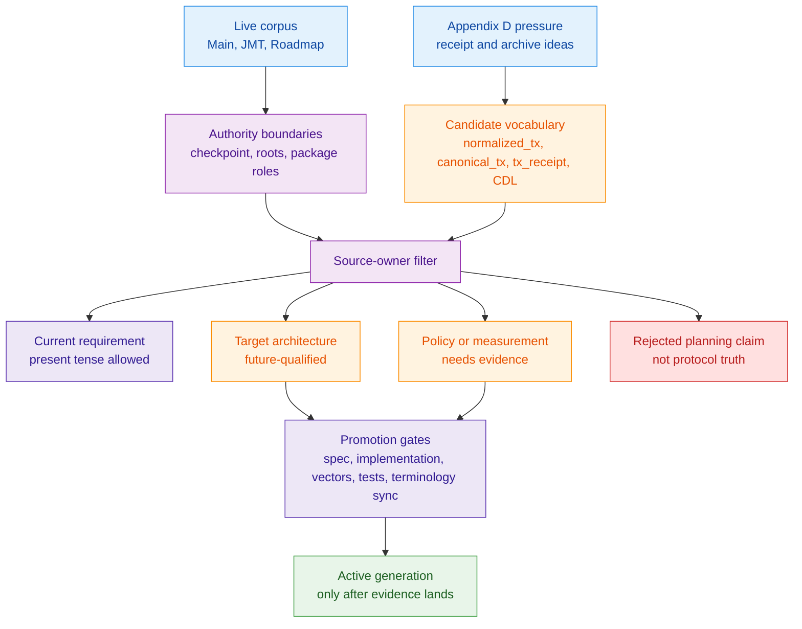
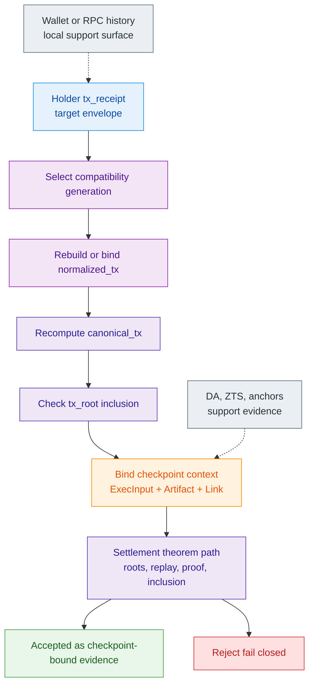
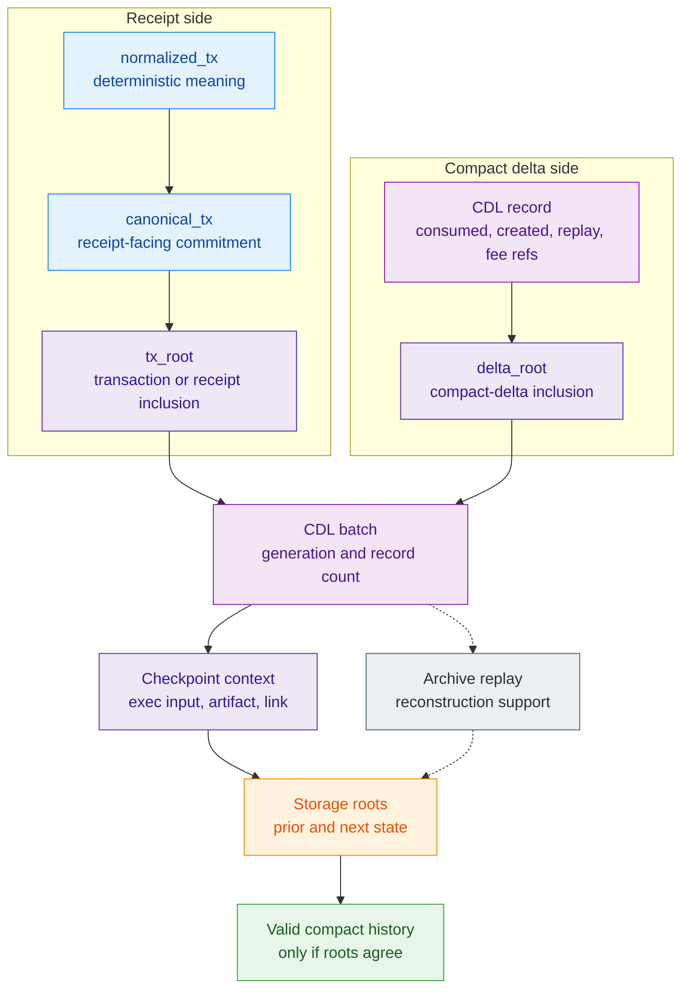
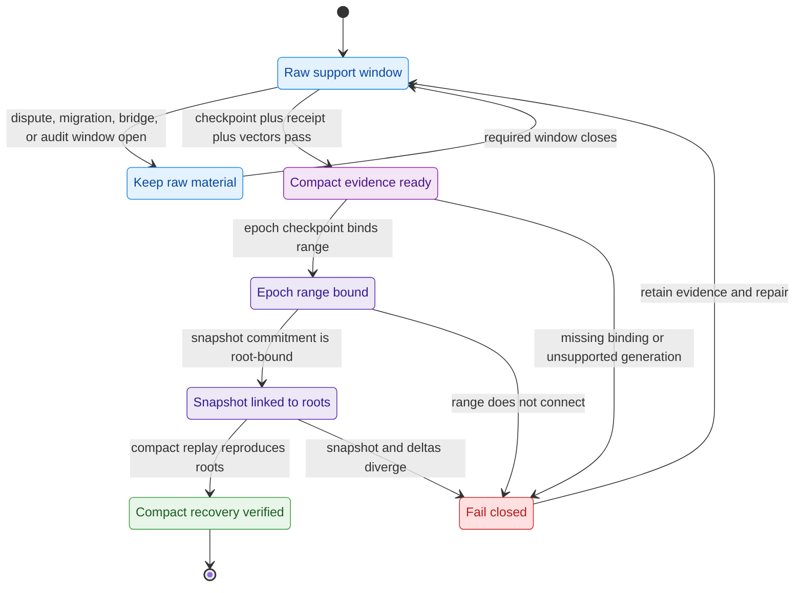
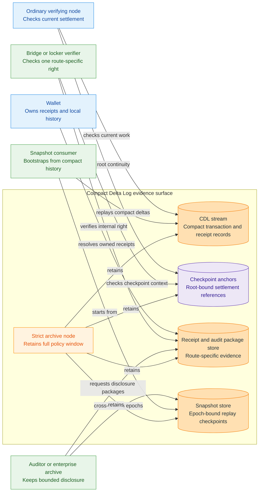
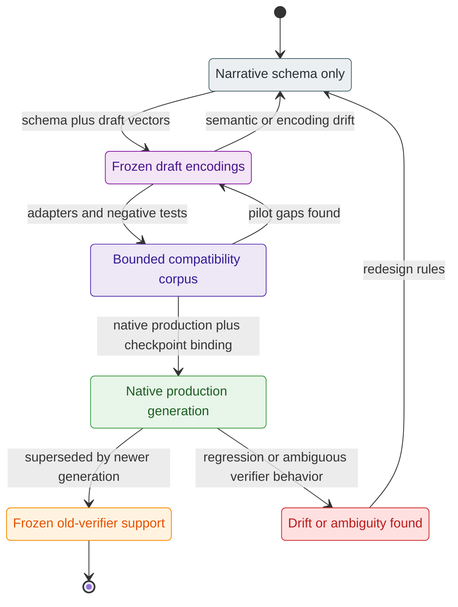

# Z00Z Compact Delta Log And Canonical Receipts

[TOC]

Version: 2026-05-27

## Key Terms Used In This Paper

This paper uses a compact vocabulary because the design depends on separating
public settlement semantics from storage volume, historical retention, and
wallet-facing receipt portability.

- `Compact Delta Log` or `CDL`: The proposed target compact event log for
  replay-safe state transitions after raw transaction structure has been
  normalized.
- `normalized_tx`: The deterministic, versioned transaction representation that
  a future receipt generation would hash across storage generations.
- `canonical_tx`: The target canonical transaction commitment derived from
  `normalized_tx`.
- `tx_receipt`: The target user-facing portable receipt that binds transaction
  meaning, canonical commitment, and inclusion evidence.
- `Epoch checkpoint`: A higher-level checkpoint that bounds recovery,
  parallel sync, and long-horizon storage reconstruction.
- `Compatibility generation`: The version boundary that lets old and new
  receipt or log shapes coexist without ambiguous verification.
- `Receipt proof`: The target inclusion and root-binding evidence needed to show
  that a canonical receipt corresponds to checkpointed protocol history.

## 1. Why This Document Is Needed

Z00Z already has a strong wallet-local settlement model, checkpointed public
evidence, and a storage design that treats semantic roots and public settlement
contracts as first-class protocol boundaries. What the corpus does not yet have
as one self-contained paper is the intermediate archival and receipt model that
connects wallet history, long-horizon verifiability, compact publication, and
future storage migration.

The missing question is precise. If Z00Z wants smaller permanent archives,
portable user receipts, and a future bridge or locker story that does not
depend on replaying raw transaction blobs forever, then the corpus needs one
canonical description of:

1. what the minimal lossless transaction commitment is;
2. what the durable compact log preserves and what it discards;
3. what a user, auditor, locker, or bridge verifier must retain to validate a
   settled transaction later.

### 1.1 Design Thesis

The design thesis of this paper is:

> Z00Z should preserve a deterministic, versioned canonical transaction
> commitment and a compact delta log that remains semantically sufficient for
> settlement verification, receipt portability, and bounded forensic recovery,
> while keeping raw-blob retention, parser complexity, and archive cost under
> explicit policy control.

### 1.2 What This Document Does Not Claim

This paper does not claim that Z00Z can discard all raw transaction material
immediately, or that compact logging removes the need for checkpoints, proof
discipline, or durable data availability. It also does not claim that the
current repository already implements the final canonical receipt pipeline.

The narrower claim is that the corpus needs one stable receipt and compact-log
specification before future storage, wallet, bridge, or archival work can
evolve without concept drift.

### 1.3 Questions This Document Must Answer

The completed paper should answer five concrete questions clearly enough that
wallet, storage, bridge, and archive work can reuse the same contract:

1. What is the minimal deterministic transaction representation that must be
   preserved across storage generations?
2. What fields must a canonical `tx_receipt` carry so a wallet, auditor,
   locker, or bridge verifier can validate settled meaning later?
3. Which transaction artifacts must remain permanent, which may be dropped
   after a bounded retention window, and which can be recomputed from compact
   deltas plus checkpoints?
4. How does the compact delta log bind to checkpoint truth and storage roots
   without becoming a second authority plane?
5. What compatibility and migration rules keep older and newer receipt or
   compact-log generations verifiable without semantic ambiguity?

### 1.4 Maturity Position

This paper should be read as a target specification direction over a live
settlement nucleus, not as a claim that the current repository already ships a
finished receipt, CDL, strict-archive, or bridge-verifier pipeline.

The live core already gives this paper its anchor: wallet package contracts,
claim package contracts, storage-owned replay, checkpoint artifacts, execution
inputs, canonical links, and checkpoint-bound verification. The target work is
the compact evidence layer around that core. `normalized_tx`, `canonical_tx`,
`tx_receipt`, CDL batches, epoch checkpoints, and strict archive roles should
therefore remain target architecture until their encodings, verifier behavior,
compatibility corpus, recovery behavior, and documentation sync pass the gates
defined later in this paper.

This maturity position is part of the design, not a caveat. It keeps the paper
useful without letting it rewrite the corpus by implication. The correct
sequence is: preserve the live settlement theorem first, then add compact
receipts and archive surfaces as explicit verifier contracts.

## 2. Corpus Review And Source Basis

This document is a synthesis layer, not a new source of protocol authority. It
uses the live Z00Z corpus to define settlement meaning, root authority,
publication evidence, maturity labels, and cross-domain verification needs.
Temporary planning notes under `.planning/temp/ideas-docs` are not authority
for this paper. Their useful pressure has been rewritten into the appendices so
the reader does not need to consult that directory, and every retained idea is
filtered through the live corpus boundaries: wallet-local possession remains
wallet-local, storage remains the owner of replay-critical state, checkpoints
remain the settlement boundary, and DA or archival systems remain publication
and recovery surfaces rather than second authority planes.

The reader should treat this section as the anti-drift filter for the rest of
the paper. Any future `normalized_tx`, `canonical_tx`, `tx_receipt`, or CDL record must
fit the source roles below before it can be promoted from idea to corpus
contract.

### 2.1 Live Corpus Sources

- [Z00Z Main Whitepaper](../Z00Z-Main-Whitepaper.md)
- [Z00Z JMT Asset And Right Storage Design](done/Z00Z-HJMT-Design.md)
- [Z00Z Multi-DA And Checkpoint Architecture](Z00Z-Multi-DA-and-Checkpoint-Architecture.md)
- [Z00Z Cross-Chain Integration Whitepaper](../Z00Z-Cross-Chain-Integration-Whitepaper.md)
- [Z00Z Roadmap Blueprint](Z00Z-Roadmap-Blueprint.md)
- [Z00Z Corpus Terminology And Abbreviations Reference](../Z00Z-Corpus-Terminology-Reference.md)

These sources already agree on one core architecture. Z00Z is not a public
account-history chain. It is a wallet-local possession and checkpointed
settlement system whose settlement evidence is intentionally narrow: committed
terminal leaves, canonical paths, typed spent and created deltas, package and
claim envelopes, checkpoint artifacts, execution inputs, and canonical links.
DA commitments, watcher evidence, anchors, disclosure packages, and audit
receipts are adjacent verifier-facing evidence surfaces, but they remain
publication, availability, audit, or recordkeeping evidence rather than
settlement authority.

That agreement determines the receipt problem. A receipt cannot be just a copy
of wallet history, and a compact log cannot become an independent ledger of
truth. The receipt must point back to the checkpointed state-transition
boundary. The log must preserve enough deterministic transition meaning to make
later verification and reconstruction possible without turning raw transaction
history into the protocol's permanent product.

### 2.2 Temporary Planning Inputs And Appendix Transfer

The only non-corpus planning material considered for this paper lives under
`.planning/temp/ideas-docs`. Appendix D absorbs the relevant CDL planning
pressure in self-contained form: compact transition records, receipt-facing
commitments, root-bound recovery, retention windows, archive roles,
compatibility generations, locker and bridge evidence, and migration pressure.
Appendix E then pins the live code and corpus signatures that prevent those
ideas from drifting into false present-tense claims.

This transfer is intentionally selective. Provider-specific assumptions,
MimbleWimble or MWC migration narratives, Celestia or IPFS cost claims,
Sovereign SDK consensus notes, precise byte-count estimates, PoK or zk-PoK
interface sketches, and fixed hash-domain labels are not imported as protocol
truth. They are either rewritten as target requirements, moved to open policy
questions, or rejected as non-authority planning material.

### 2.3 Source Roles

The live corpus defines semantic boundaries, checkpoint rules, storage-root
discipline, maturity labels, and cross-domain implications. Appendix D defines
only candidate receipt, retention, migration, and archive pressure. Imported
ideas are classified as follows.

| Classification | Imported idea | Source boundary |
| --- | --- | --- |
| Current protocol requirement | Settlement authority remains checkpoint-bound; storage-owned leaf presence, deletion, claim replay, and root continuity remain the replay-critical truth. | Main, JMT, and Roadmap sources. |
| Current protocol requirement | Wallet-local possession and package exchange are meaningful before publication, but not final settlement by themselves. | Main and Roadmap sources. |
| Target architecture requirement | A deterministic `normalized_tx`, `canonical_tx`, and `tx_receipt` should be specified before receipts become a stable cross-wallet, audit, or bridge contract. | Appendix D candidate filtered through Main, JMT, Multi-DA, and Roadmap boundaries. |
| Target architecture requirement | A CDL can become a compact archival and reconstruction surface only if it binds to checkpoint and storage roots instead of replacing them. | Appendix D candidate filtered through JMT and Multi-DA boundaries. |
| Migration-only compatibility rule | Older package, receipt, or compact-log generations need explicit compatibility metadata and generation-specific verification rules. | Appendix D candidate filtered through Roadmap maturity and version-gate discipline. |
| Measurement or archive policy note | Raw blob retention windows, strict archive-node roles, and proof-size or byte-budget comparisons are policy and evidence topics, not protocol truth by themselves. | Appendix D candidate filtered through Roadmap and Multi-DA archive-neutrality discipline. |
| Rejected temporary-planning claim | Any claim that the chain can discard all raw material immediately, that CDL is the canonical settlement authority, or that DA/provider evidence proves validity. | Rejected by Main, JMT, Multi-DA, and Roadmap boundaries. |

**Figure 2.1 - Source maturity filter.** Temporary receipt and archive pressure
enters this paper only after the live corpus assigns its authority level.



### 2.4 Critical Questions And Expected Source Owners

This paper assigns each major question to one source owner so archival policy
does not get mistaken for protocol truth.

| Question | Source owner | How this paper uses it |
| --- | --- | --- |
| What does a settled transaction mean? | Main Whitepaper | A transaction is settled only when its package, checkpoint artifact, execution input, canonical link, root continuity, and inclusion relation pass the checkpoint-bound settlement path. |
| What is the canonical state authority? | JMT Design | The live asset-centric root and path-local proof model remain authoritative; a CDL record can support reconstruction or receipts, but it cannot replace storage roots or proof envelopes. |
| What evidence proves publication and availability? | Multi-DA Blueprint | DA commitments, anchors, watcher evidence, ZTS proofs, and meta-anchors are evidence references, not substitutes for settlement validation. |
| What do lockers and bridge verifiers need? | Cross-Chain Whitepaper | External verifiers need a compact way to bind an internal right, checkpoint context, asset-family meaning, and inclusion evidence without requiring full raw transaction history. |
| When can this become a stable contract? | Roadmap Blueprint | Receipt and CDL generations should stay target architecture until version gates, parser rules, compatibility tests, recovery tests, and maturity evidence exist. |
| Which compact-log details are candidates? | Appendix D absorbed planning inputs | `normalized_tx`, `canonical_tx`, receipt payloads, epoch checkpoints, raw-retention policy, and archive reconstruction rules are imported only as candidates that survive the source-owner checks above. |

### 2.5 Drift Guardrails For Future Editors

Future edits to this paper should pass these checks before they are treated as
corpus-aligned:

| Guardrail | Required edit behavior |
| --- | --- |
| Do not promote target vocabulary by repetition | A term such as `canonical_tx`, `tx_receipt`, CDL batch, epoch checkpoint, `RightLeaf`, or `SettlementStateRoot` becomes active only when the implementation and roadmap evidence say so. |
| Do not replace settlement with evidence references | DA commitments, ZTS proofs, checkpoint anchors, watcher evidence, audit receipts, and meta-anchors may help locate or witness evidence, but settlement validity still belongs to checkpoint validation and storage-root continuity. |
| Do not turn receipts into public account history | A receipt is holder-retained or purpose-disclosed evidence, not a mandate that the base protocol publish every private business fact. |
| Do not flatten asset families | Native, issuer-defined, externally backed, and synthetic assets can share private transfer mechanics while retaining different issuer, custody, redemption, and trust assumptions. |
| Do not make bridge evidence prove external promises | A Z00Z receipt can prove the Z00Z-side internal right; reserve solvency, issuer honesty, foreign execution, and service fulfillment remain external evidence topics. |
| Do not make path indexes or backend roots public truth by accident | Storage lookup aids and diagnostic roots remain subordinate unless a future proof contract explicitly promotes them. |
| Do not overgeneralize legacy compatibility | Old material needs generation-specific adapters and explicit source evidence. Unsupported legacy shapes reject rather than being guessed into validity. |
| Do not cite temporary planning byte counts or operational numbers as protocol facts | Byte budgets, retention windows, archive-node counts, and performance claims need fresh measurement or explicit policy backing. |
| Do not describe offline or delayed exchange as final by itself | Wallet-local possession and local acceptance may precede publication, but authoritative settlement remains checkpoint-bound. |
| Do not treat this paper as implementation evidence | This paper can define a target contract. Promotion to active generation still requires code, vectors, tests, recovery evidence, and documentation sync. |

### 2.6 Symbol And Signature Discipline

This paper must not smuggle new code signatures into the corpus by presenting
target vocabulary as if it were already implemented. It therefore separates
three symbol classes.

| Symbol class | Examples | How this paper may use it |
| --- | --- | --- |
| Live code-backed identifiers | `AssetLeaf`, `AssetPath`, `AssetStateRoot`, `TxPackage`, `ClaimTxPackage`, `CheckpointExecInput`, `CheckpointArtifact`, `CheckpointLink`, `SettlementTheorem`, `PaymentRequest`, `ReceiverCard` | Use as present-tense nouns only in the roles already supported by the codebase and live corpus. Do not change their meaning to fit the receipt model. |
| Existing paper-level target identifiers | `RightLeaf`, `SettlementStateRoot`, `LockerID`, `BridgeInTx`, `BridgeOutTx` | Use only with the maturity qualifiers already present in the corpus: target, future, integration noun, or paper-level vocabulary. |
| CDL paper candidates | `Compact Delta Log`, `normalized_tx`, `canonical_tx`, `tx_receipt`, receipt proof, compatibility generation, CDL batch, CDL record, `tx_root`, `delta_root`, `cdl_generation`, `receipt_generation`, epoch checkpoint, legacy adapter | Use only as candidate receipt or compact-log vocabulary until a generation spec, implementation, vectors, tests, and terminology update promote them. |

The current wallet and RPC layers already have confirmation and receipt-shaped
surfaces for wallet history. Those surfaces should not be silently renamed into
the canonical `tx_receipt` proposed here. A future implementation must either
map them through an explicit compatibility rule or keep the canonical receipt
as a separate generation with a clear migration boundary.

All YAML-like structures in this paper are therefore non-normative field-family
sketches. They are not Rust structs, JSON-RPC DTOs, canonical encodings, or
hash signatures. A future implementation spec may reuse a field name only after
checking the existing codebase and freezing the name through the generation
rules, domain registry, golden vectors, and documentation sync.

## 3. Problem Statement And Requirements

Z00Z needs a compact-log and receipt model because long-lived verification
needs something narrower than raw wallet history and stronger than informal
node memory. The design must let a future wallet, auditor, bridge verifier,
strict archive node, or recovery process answer one precise question:

> Does this portable receipt or compact event record correspond to a
> checkpointed Z00Z state transition with the same semantic meaning that the
> live protocol accepted?

The answer must be derivable from deterministic encodings, canonical
commitments, root-bound proof material, and explicit version metadata. It must
not depend on a parser guessing how an old transaction "probably" meant to
behave, and it must not depend on the compact log acting as a second ledger
beside checkpointed storage.

### 3.1 Semantic Requirements

Any compact-log or receipt format must preserve the settlement semantics that
the live corpus already treats as authoritative:

- replay-safe transition meaning: which canonical input references were
  consumed, which output leaves or future terminal objects were created, and
  which package or claim family supplied the authorization boundary;
- deterministic linkage to checkpoint context: chain or domain, checkpoint
  generation, execution-input identity, artifact identity, prior and next state
  roots, and any receipt-root or transaction-root that binds `canonical_tx`;
- asset-family meaning: the `definition_id`, `serial_id`, `asset_id`, claim
  source, content or family identity, and any family-specific policy fields
  needed to avoid merging distinct assets or rights into one ambiguous
  private balance;
- fee and balance meaning: enough fee-role or fee-envelope information to
  distinguish user-visible payment assets, protocol fee outputs, and future
  sponsored or prepaid fee paths;
- receipt portability: a deterministic transaction commitment that a wallet can
  retain and an external verifier can bind to inclusion evidence without
  reconstructing private wallet state;
- future-generation safety: compatibility with the current asset-centric
  `AssetLeaf` generation and a possible mixed asset/right generation without
  pretending that `RightLeaf` or universal rights storage already exists in the
  live core.

The `normalized_tx` role follows from these requirements. It is not a new
business object and not a lossy summary of user intent. It is the deterministic
projection of the accepted settlement meaning into a versioned object that can
be hashed as `canonical_tx`. If a field affects accepted economic meaning,
authorization, replay scope, asset family, fee behavior, or checkpoint binding,
then the spec must either commit it inside `normalized_tx` or explicitly bind
it through surrounding receipt and checkpoint evidence. Silent omission is not
allowed.

### 3.2 Storage And Archive Requirements

The compact-log model separates permanent protocol evidence from temporary or
actor-held material.

Permanent evidence should include the canonical state roots, checkpoint
artifacts, execution-input identities, canonical links, typed spent and created
deltas, receipt or transaction roots when introduced, compatibility-generation
metadata, and enough compact event data to replay the chosen archival contract.
If `canonical_tx` becomes part of the receipt contract, its root binding and inclusion
path must remain available at the same durability level as the receipt
verification mode requires.

Temporary or policy-retained material may include raw transaction blobs, heavy
debug payloads, noncanonical parser inputs, wallet-local history, business
records, provider-specific recovery traces beyond the required evidence
contract, and forensic payloads kept for a bounded dispute window. These may be
retained by wallets, enterprises, archive services, DA providers, or regulated
operators, but the base protocol should not quietly require every ordinary
verifier to store them forever.

Recomputable material should include storage side indexes, local wallet views,
derived history summaries, and any archive snapshots that can be rebuilt from
checkpointed roots plus the canonical CDL stream. The JMT path-index boundary
is the model: operational lookup aids are useful, but they must not become a
second public root of truth unless a future proof contract explicitly promotes
them.

Epoch checkpoints serve a bounded recovery role. They should localize errors,
support parallel sync, provide restart points for archive reconstruction, and
limit how much compact history a verifier must scan to recover a target range.
They do not replace the per-transition settlement relation and do not allow
ambiguous deltas inside the epoch.

Archive roles must remain honest. An ordinary verifying node may depend on
current state, recent evidence, and checkpoint-bound proofs. A strict archive
node may retain the full compact-log stream and optional raw or forensic
payloads under explicit policy. A bridge, locker, auditor, or enterprise
verifier may retain extra receipts and disclosure packages. None of those
roles should be described as the base protocol storing every private business
record forever.

### 3.3 Verification Requirements

The local verification standard is fail-closed and version-explicit.

Canonical encoding must be deterministic across implementations. Field order,
integer width and endian rules, byte-string normalization, hash-domain labels,
optional-field handling, and compatibility-generation IDs must be frozen by
spec before a receipt or CDL generation is treated as stable. A verifier that
cannot reproduce `canonical_tx` byte-for-byte from `normalized_tx` must reject the
receipt.

Parser behavior must be strict. Unknown mandatory fields, unsupported
generations, malformed proof paths, noncanonical encodings, uppercase or
otherwise drifted hex where the generation requires canonical hex, mismatched
counts, duplicate replay identifiers, and detached checkpoint evidence must
reject. The verifier should never repair old data by convention or infer a
missing field from context when that field affects settlement meaning.

Authorization boundaries must stay explicit. Regular spends, claim flows,
bridge imports, bridge exits, future right exercises, and future fee-envelope
flows may not all share one generic receipt interpretation. The receipt must
identify the package or transition family and the proof or authorization mode
that made the transition acceptable in its generation.

Error locality should be preserved as much as practical. A verifier should be
able to distinguish at least: bad canonical transaction commitment, bad
receipt inclusion, bad checkpoint binding, unsupported generation, malformed
compact delta, replay mismatch, asset-family mismatch, and unavailable archive
payload. These categories make wallet recovery, bridge disputes, and archive
repair safer than one generic "invalid receipt" result.

Version drift must be detectable from the receipt alone. A verifier should not
need private wallet state, a legacy parser guess, or an external migration
database merely to discover which rules apply. The receipt should carry enough
generation metadata to choose the correct canonical encoder, hash domain,
inclusion proof shape, checkpoint-binding rule, and compatibility adapter.

## 4. Canonical Receipt Model

The target canonical receipt is the durable object a holder can keep and later
show to a wallet, auditor, archive service, bridge verifier, locker operator,
or other authorized reviewer once a receipt generation exists. It is not
canonical state by itself. It is a portable evidence package that binds a
deterministic transaction commitment to the checkpoint and inclusion evidence
needed to re-verify the accepted settlement meaning.

The receipt model has to support two pressures at once. First, a user needs a
stable artifact that survives wallet migration, archival compaction, and future
storage generations. Second, the base protocol must not turn every receipt
into a public business record or a full wallet-history disclosure. The receipt
therefore has a canonical core and optional disclosure layers. The canonical
core binds `canonical_tx`, settlement generation, inclusion evidence, and checkpoint
context. Disclosure layers may reveal additional wallet-local, enterprise, or
cross-domain material to a specific verifier.

**Figure 4.1 - Receipt verification path.** A receipt becomes meaningful only
when its target commitment and inclusion proof bind back to checkpoint evidence.



### 4.1 Canonical Transaction Commitment

`canonical_tx` is the target receipt-facing commitment over `normalized_tx`. It should
not be described as a replacement for every current package digest until a
future implementation deliberately aligns those surfaces. Its job in this
paper is narrower: give wallets and external verifiers one stable commitment
that can survive compact archive migration and receipt-generation changes.

The candidate relation shape is:

```text
canonical_tx = H(receipt_tx_domain || canonical_encode(normalized_tx))
```

`receipt_tx_domain` is a placeholder name, not a deployed domain label. The
final hash-domain label, encoding rules, and digest width must be frozen by the
compatibility generation that introduces the receipt contract. The temporary
planning inputs absorbed in Appendix D include `Z00Z-TX` as a candidate label,
but this paper does not freeze that label before the final domain registry and
golden vectors exist.

`normalized_tx` should contain the deterministic settlement meaning that a
verifier needs to identify the transaction across storage generations:

| Field family | Belongs in `normalized_tx` | Why |
| --- | --- | --- |
| Domain and generation | chain or network identifier, transaction schema version, receipt compatibility generation, package or transition family | prevents cross-network and cross-generation collisions |
| Consumed references | canonical input references, claim-source references, bridge-import or bridge-exit replay keys where applicable | preserves replay and identity meaning |
| Created objects | output leaf commitments, created asset or future right references, output roles, family identifiers, and terminal-object kinds | preserves what the transition created without requiring a public account graph |
| Asset and right family meaning | definition, serial, content or issuer family, claim scope, and family-specific policy handles needed for conservation and interpretation | prevents distinct asset or right families from collapsing into one private balance |
| Fee meaning | fee output roles, fee asset family, fee envelope reference, sponsor or prepaid-fee reference where the generation supports it | keeps fee abstraction from becoming asset-identity confusion |
| Authorization mode | regular spend, claim, locker import, locker exit, future right exercise, or other supported transition family | tells the verifier which proof and replay rules apply |

Some evidence should stay outside `normalized_tx` and be bound by the receipt
or checkpoint envelope instead:

- raw private witnesses, wallet secrets, decrypted memo material, local labels,
  and business records;
- full raw transaction blobs when the generation treats them as short-horizon
  or actor-retained data;
- DA provider receipts, watcher observations, external meta-anchors, and ZTS
  proofs;
- checkpoint artifacts and execution inputs, unless the generation explicitly
  commits a digest of them as part of the transaction identity.

This split keeps `normalized_tx` focused on deterministic transaction meaning
while letting receipt verification still bind to checkpoint truth through
surrounding proof material.

### 4.2 Receipt Payload

The target `tx_receipt` is a versioned envelope. It is distinct from the
current wallet-history receipt and confirmation surfaces. The exact encoding is
a future specification item, and the sketch below is not a code signature. It
names the field families a future receipt generation must cover or map through
generation-equivalent forms:

```yaml
tx_receipt:
  kind: z00z-tx-receipt
  receipt_version: 1
  compatibility_generation: receipt-gen-id
  chain_id: z00z-mainnet-or-testnet
  transition_family: regular-spend | claim | bridge-in | bridge-out | right-exercise
  normalized_tx:
    # included, referenced, or selectively disclosed according to receipt mode
  canonical_tx: "hex commitment over canonical normalized_tx"
  tx_root:
    root_kind: merkle | mmr | cdl-batch-root
    root_value: "0x..."
    inclusion_path: []
  settlement_context:
    checkpoint_id: "0x..."
    epoch_id: "..."
    execution_input_id: "0x..."
    checkpoint_artifact_digest: "0x..."
    checkpoint_link_id: "0x..."
    prior_state_root: "0x..."
    next_state_root: "0x..."
  publication_context:
    da_commitment_digest: "0x..."
    checkpoint_anchor: "0x..."
  disclosure_context:
    mode: holder-full | verifier-redacted | audit-package
    disclosed_fields: []
```

This shape is intentionally layered. The receipt core is `compatibility
generation + chain_id + transition_family + normalized_tx/canonical_tx + inclusion
evidence + checkpoint context`. Publication and disclosure context are
supporting surfaces. They help auditors, bridges, services, or enterprises
resolve evidence, but they do not decide settlement validity by themselves.

A full holder receipt may carry the complete `normalized_tx` so the holder can
recompute `canonical_tx` without asking an archive. A verifier-redacted receipt may
carry only enough disclosed fields to check a specific claim, but then it must
bind any hidden fields through a disclosure proof, audit package, or other
generation-defined commitment. A receipt that cannot let the verifier
recompute or otherwise bind `canonical_tx` is not a canonical receipt; it is only a
local note.

Wallet-local labels, accounting categories, merchant memos, invoices, operator
comments, and business documents should stay outside the canonical receipt
unless they are deliberately included in an audit or disclosure package. This
preserves the corpus rule that Z00Z can support audit evidence without becoming
the default long-term host for user or enterprise records.

### 4.3 Receipt Verification Modes

The same receipt can be checked at different depths depending on what the
verifier needs to know.

| Mode | Verifier question | Required checks | Non-claim |
| --- | --- | --- | --- |
| Wallet-local verification | Does this receipt match material the wallet can understand and retain? | Parse the generation, rebuild or bind `normalized_tx`, recompute `canonical_tx`, check local ownership or disclosure material where available, and attach wallet-local history without treating it as settlement truth. | Does not prove final settlement unless checkpoint evidence is verified. |
| Checkpoint-coupled verification | Was this transaction included in an accepted Z00Z checkpoint context? | Verify `canonical_tx`, verify its inclusion path to the receipt or transaction root, verify checkpoint artifact, execution-input identity, checkpoint link, prior and next roots, and settlement-theorem-equivalent relation. | A checkpoint anchor alone is only a reference, not the full theorem. |
| Archival verification | Can a strict archive or recovery process reconstruct the transition from compact evidence? | Replay the relevant CDL records, compare created and consumed objects to checkpoint roots, check epoch boundaries, and verify compatibility-generation rules. | Archive reconstruction does not authorize semantic changes to old transactions. |
| Bridge or locker verification | Is the internal Z00Z right validly settled for a cross-domain consequence? | Verify receipt core, asset-family or `LockerID` meaning, checkpoint context, exit or import replay key, and any required external attestation references. | Does not prove external reserve solvency, issuer honesty, or foreign-chain execution by itself. |
| Compatibility-mode verification | Which old rules apply, and can the receipt still be checked unambiguously? | Select the generation adapter from receipt metadata, use the exact canonical encoder and proof shape for that generation, and reject unsupported or ambiguous receipts. | No universal best-effort parser may silently reinterpret old receipt bytes. |

These modes make the receipt useful without overclaiming it. A receipt can be a
wallet portability artifact, an audit artifact, a bridge support artifact, or
an archive reconstruction handle. In every mode, however, final settlement
meaning still points back to the checkpointed state-transition relation.

## 5. Compact Delta Log Model

The Compact Delta Log is the proposed permanent compact event layer that sits
between raw transaction history and checkpointed state. Its purpose is to make
settlement history replayable, receipt-verifiable, and migration-friendly
without requiring every verifier to retain raw transaction blobs forever.

The CDL is not a second ledger. In a generation that adopts it, it should be a
generation-canonical compact mirror of the checkpointed transition stream. If a
CDL batch and the checkpoint artifact it claims to describe disagree, the CDL
batch is invalid for that checkpoint context. The checkpoint and storage roots
remain the settlement authority.

### 5.1 Batch And Record Structure

A CDL generation should define two logical levels: a batch envelope and
transition records inside that batch. The following shapes are non-normative
field-family sketches, not frozen structs or wire formats.

The batch envelope binds the compact records to the checkpoint context:

```yaml
cdl_batch:
  kind: z00z-cdl-batch
  cdl_generation: cdl-gen-id
  chain_id: z00z-mainnet-or-testnet
  epoch_id: "..."
  checkpoint_id: "0x..."
  execution_input_id: "0x..."
  checkpoint_artifact_digest: "0x..."
  checkpoint_link_id: "0x..."
  prior_state_root: "0x..."
  next_state_root: "0x..."
  tx_root: "0x..."
  delta_root: "0x..."
  record_count: 0
  records:
    - cdl_record
```

The transition record binds one canonical transaction commitment to the compact
state deltas needed by archive and receipt verifiers:

```yaml
cdl_record:
  record_version: 1
  transition_family: regular-spend | claim | bridge-in | bridge-out | right-exercise
  canonical_tx: "0x..."
  input_refs:
    - canonical_path_or_generation_ref
  output_refs:
    - canonical_path_or_generation_ref
  created_leaf_commitments:
    - terminal_leaf_hash_or_committed_leaf_payload
  replay_refs:
    - nullifier_or_external_event_id_or_claim_replay_key
  fee_refs:
    - fee_output_or_fee_envelope_ref
  proof_mode: package | claim | bridge-attestation | future-proof-family
  flags:
    - generation-defined-flag
```

The exact binary shape should be frozen only after the canonical receipt
generation is designed. The field families above are the minimum logical
surface:

- `canonical_tx` links the compact record to a portable receipt;
- consumed references identify what state was removed or transformed;
- created references and leaf commitments identify what state was introduced;
- replay references preserve domain-specific anti-replay meaning;
- fee references preserve the distinction between protocol fees, fee outputs,
  sponsor paths, and future fee envelopes;
- checkpoint identifiers bind the record to the public settlement boundary.

A generation that stores only hashes of created leaves can support inclusion
and receipt checks, but it cannot by itself support full state reconstruction
unless the corresponding terminal leaf bytes remain available from snapshots,
archive payloads, or another generation-defined durable source. A generation
that wants CDL-only replay must commit enough terminal object data, or enough
content-addressed availability evidence, to rebuild the same state roots.

**Figure 5.1 - CDL root binding.** The transaction commitment root and compact
delta root are useful only when both bind to the same checkpoint context.



### 5.2 Inclusion, Deletion, And State Transition Meaning

The CDL should represent the same semantic transition that the checkpoint
already accepts:

```text
prior_state_root
  -- consume input_refs
  -- apply replay_refs
  -- create output_refs / created_leaf_commitments
  -> next_state_root
```

For the live asset-centric generation, consumed objects should resolve to
canonical `AssetPath`-level references or generation-defined equivalents that
can be checked against storage-owned deletion semantics. Created objects should
resolve to `AssetLeaf` commitments or complete committed leaf payloads,
depending on whether the generation supports full reconstruction or only
receipt/inclusion verification. If a future mixed asset/right generation lands,
the same shape may widen to terminal `RightLeaf`-style objects, but the record
must still identify terminal-object kind, path semantics, and compatibility
generation.

Deletion should follow the JMT storage rule: a consumed terminal leaf is absent
from the new live state because a valid checkpointed transition removed or
replaced it under its canonical path. The base CDL does not need to introduce a
new permanent tombstone plane. If an audit or forensic generation wants
tombstones, it should mark them as an explicit archive or disclosure surface,
not as an alternate spent-state root.

Inclusion meaning has two layers:

1. `canonical_tx` inclusion in `tx_root` or an equivalent transaction/receipt root
   proves that the canonical transaction commitment was part of the compact
   batch.
2. Delta inclusion in `delta_root` or an equivalent compact-delta root proves
   that the consumed and created references were part of the checkpoint-bound
   compact transition record.

Both layers still need checkpoint binding. A compact record with valid Merkle
or MMR inclusion but no matching checkpoint context is not settled Z00Z
history. Conversely, a checkpoint can remain authoritative even if an archive
service temporarily lacks optional raw blobs or disclosure payloads.

### 5.3 Determinism, Versioning, And Parser Discipline

The CDL binary contract should be stricter than ordinary archival data because
future wallets and verifiers may rely on it after raw transaction material has
expired.

Each generation must freeze:

- canonical field order;
- integer widths, varint rules, and endian rules;
- path and identifier encodings;
- record ordering inside a batch;
- hash domains for `tx_root`, `delta_root`, `canonical_tx`, and any batch digest;
- allowed transition families;
- maximum record size, maximum vector lengths, and any compression policy;
- compatibility rules for old records and receipt generations.

Record ordering should follow checkpoint execution order unless the generation
defines another deterministic order and proves equivalence to the checkpoint
execution input. Compression may be used, but only if the decompressed result
has one canonical byte representation. A verifier must never accept two byte
strings as equivalent compact records merely because they decode to similar
semantic-looking values.

Malformed or ambiguous CDL data must reject. Rejection cases include at least:
unsupported `cdl_generation`, mismatched `chain_id`, mismatched checkpoint
context, malformed or duplicated `canonical_tx`, duplicate replay references in a
generation where they must be unique, invalid path encodings, vector length
mismatches, unknown mandatory flags, decompression overflows, transaction-root
or delta-root mismatch, and any record whose consumed or created references do
not match the checkpoint execution input.

Compatibility rules should be generation-specific. A legacy adapter may map an
older transaction or package shape into `normalized_tx`, but the adapter must
declare exactly which old shapes are supported and which are not. Unsupported
legacy material should fail closed rather than being wrapped in a generic
`legacy_raw` bucket unless the generation explicitly commits that raw payload
and defines its verification semantics.

## 6. Retention, Recovery, And Parallel Sync

Retention policy decides which data survives as protocol evidence, which data
survives as archive service evidence, and which data remains the
responsibility of wallets, enterprises, lockers, or other record-holding
actors. The corpus rule is archive-neutral: Z00Z can expose compact validation
anchors and receipt evidence without becoming the default permanent host for
every raw transaction, invoice, service log, or business document.

The CDL model should therefore define retention by verification role rather
than by one universal "everyone stores everything" rule.

### 6.1 Short-Horizon Raw Retention

Raw transaction blobs and heavy transport payloads may still be necessary for a
bounded period even after a compact receipt and CDL generation exists. They are
useful for:

- debugging parser or implementation mismatches during a generation rollout;
- resolving disputes while wallets, aggregators, DA providers, or bridge
  operators still need the original payload shape;
- migrating legacy packages into `normalized_tx` when no native `canonical_tx` existed
  at the time of creation;
- proving context that the compact receipt intentionally does not disclose;
- enterprise, issuer, or regulated-service recordkeeping above the protocol
  line.

The safe rule is not "delete raw blobs as soon as a checkpoint exists." The
safe rule is conditional:

1. the transaction has reached checkpoint-coupled settlement;
2. `canonical_tx`, receipt inclusion, and compact-delta binding have been validated;
3. the generation's parser and canonical encoder have golden vectors and
   negative tests;
4. any dispute, migration, bridge, or audit window that explicitly requires raw
   material has expired;
5. the actor responsible for non-protocol records has retained whatever
   business, legal, or wallet-local material it needs.

After those conditions hold, ordinary protocol participants should be able to
rely on canonical receipts, checkpoint evidence, DA availability evidence, CDL
records, and snapshots according to their role. Strict archives, enterprises,
or bridge services may still retain raw blobs longer, but that is an explicit
service or policy choice rather than a hidden base-protocol requirement.

### 6.2 Epoch Checkpoints And Recovery Windows

Epoch checkpoints are recovery and sync boundaries over the compact history.
They are not a new settlement authority above the per-transition checkpoint
relation.

A useful epoch checkpoint should bind the following field families. The names
below are placeholders until a receipt and CDL generation freezes a real
encoding:

```yaml
epoch_checkpoint:
  kind: z00z-cdl-epoch-checkpoint
  version: 1
  chain_id: z00z-mainnet-or-testnet
  epoch_id: "..."
  first_checkpoint_id: "0x..."
  last_checkpoint_id: "0x..."
  start_state_root: "0x..."
  end_state_root: "0x..."
  tx_root_range_commitment: "0x..."
  delta_root_range_commitment: "0x..."
  cdl_generation: cdl-gen-id
  receipt_generation: receipt-gen-id
  snapshot_commitment: "0x..."
  da_commitment_digest: "0x..."
```

The exact fields can change when the implementation spec lands, but the
semantics should stay stable. An epoch checkpoint should let a verifier:

- start replay from a known root rather than from genesis;
- split compact-history verification into independent ranges;
- localize corruption or parser drift to a bounded epoch;
- compare an archive snapshot against compact deltas and final state roots;
- decide which receipt and CDL generation rules apply inside the range.

Parallel sync should still be root-bound. Workers may validate different epoch
ranges independently, but the resulting range proofs must link in order from
the prior root to the next root. A range that verifies internally but does not
connect to the expected surrounding roots is not valid history.

Recovery windows should be explicit. Recent windows may keep raw blobs,
provider traces, and richer forensic records. Older windows may retain only CDL
records, receipts, checkpoint anchors, DA commitments, and snapshots. The
transition from recent to old evidence must be policy-controlled and testable,
not an implicit garbage-collection side effect.

**Figure 6.1 - Retention and recovery lifecycle.** Raw retention can shrink
only after checkpoint, receipt, parser, and policy conditions have all passed.



### 6.3 Archive Roles

Different actors need different evidence depths.

| Role | Must retain or resolve | May omit | Boundary rule |
| --- | --- | --- | --- |
| Ordinary verifying node | current state root, relevant checkpoint evidence, recent publication data, and enough proofs to validate current work | full raw history and unrelated wallet receipts | It verifies settlement without becoming a universal archive. |
| Strict archive node | full CDL stream, epoch checkpoints, transaction/receipt roots, snapshots, and any raw-retention payloads promised by its policy | private wallet secrets and business documents it is not authorized to hold | It supports reconstruction and forensics, but still does not redefine settlement truth. |
| Wallet | owned receipts, wallet-local history, secrets, scan state, disclosure choices, and backup material | unrelated global history | It owns possession and user history, not protocol-wide replay truth. |
| Bridge or locker verifier | receipts for the relevant internal right, checkpoint context, import or exit replay keys, asset-family mapping, and required external attestations | unrelated Z00Z history and unrelated user receipts | It verifies the Z00Z-side right; external custody and redemption still need their own evidence. |
| Auditor or enterprise archive | disclosure packages, audit receipts, local business records, and selected checkpoint or ZTS proofs | full private chain history unless required by its own policy | It keeps records for its purpose without turning base consensus into an accounting archive. |
| Snapshot consumer | snapshot commitment, start root, end root, epoch checkpoint, and compact deltas needed to verify the snapshot | raw transaction blobs outside the promised window | It can bootstrap faster only if the snapshot is root-bound and replay-checkable. |

These roles should be visible in the implementation spec. A wallet asking a
strict archive for evidence, a bridge verifier resolving an old receipt, and an
ordinary node replaying current checkpoints are not the same workflow and
should not silently depend on the same retention assumptions.

**Figure 6.2 - CDL evidence role topology.** The same evidence surface supports
multiple roles, but each role resolves a narrower subset of the retention
contract.



## 7. Cross-Chain, Locker, And Audit Implications

Canonical receipts matter beyond local wallet history because Z00Z's most
useful future integrations are verifier-facing. A wallet may only need a
private local history item. A bridge, locker, auditor, enterprise reviewer, or
service operator needs something narrower and more durable: evidence that a
specific Z00Z-side right was created, transferred, consumed, or disclosed under
checkpointed settlement rules.

The receipt and CDL model should make those checks possible without widening
the protocol claim. A receipt can prove Z00Z-side settlement meaning. It can
bind a compact transaction commitment to checkpoint context, asset-family
meaning, replay references, and optional publication evidence. It cannot by
itself prove that an external locker remained solvent, that an issuer's reserve
claim was truthful, that a foreign chain executed a release, or that a business
document contained true facts. Those remain external, service-layer, issuer,
locker, or record-holder responsibilities.

### 7.1 External Verifiers And Lockers

An external verifier should be able to validate the Z00Z side of a route
without replaying full raw transaction history or learning unrelated wallet
state. The receipt therefore needs to expose or bind the exact fields required
for the route's question.

For an import-side or `BridgeInTx`-style flow, the verifier needs:

1. the external source reference, such as a deposit ID, lock event, burn event,
   issuer attestation, or route-specific import key;
2. the intended Z00Z receiver binding or equivalent creation target;
3. the asset-family meaning, including `AssetDefinition`, `content_id`,
   issuer or locker route, trust tier, and redemption assumptions where the
   generation supports those labels;
4. the `canonical_tx` and receipt inclusion proof that bind the normalized import
   meaning to a transaction or receipt root;
5. the checkpoint context proving that the internal right was created under the
   accepted Z00Z state-transition rules.

For an exit-side or `BridgeOutTx`-style flow, the verifier needs:

1. the internal right reference or `LockerID` being consumed;
2. the replay key, exit ID, or release intent that prevents duplicate external
   release;
3. the consumed input reference and any created or burned output reference in
   the CDL record;
4. the checkpoint context proving that the internal right was validly consumed
   under Z00Z rules;
5. the external route evidence needed by the locker, issuer, or foreign system
   before it releases, mints, redeems, or fulfills value outside Z00Z.

The boundary must stay explicit. Z00Z can prove that the internal right was
settled, consumed, or created according to its own checkpointed state rules.
The external route still proves custody, reserve, redemption, foreign finality,
operator status, and release execution through its own evidence. A valid
Z00Z-side receipt is therefore necessary for a bridge or locker decision, but
it is not sufficient to prove the whole external economic outcome.

This is also why asset-family identity belongs in the receipt model. A
route-specific `USDC@Z00Z` right, an issuer-native stable asset, and a
synthetic internal unit may all use the same private settlement mechanics, but
they do not have the same external meaning. Receipts and CDL records should
preserve the route or family distinction rather than letting a verifier collapse
them into a generic private balance.

Publication evidence should remain a support layer. A DA commitment, watcher
record, ZTS proof, checkpoint anchor, or external meta-anchor can help a bridge
or auditor locate and time-bound evidence, but none of those objects replaces
the checkpoint relation that decides Z00Z settlement validity.

### 7.2 Selective Audit And Forensics

The CDL and receipt model should make selective audit easier because the
reviewer can ask a bounded question instead of requesting a full wallet dump or
full raw chain archive. Examples of bounded questions are:

- Was this `canonical_tx` included in the checkpointed history claimed by the holder?
- Did this transaction consume the stated input reference or create the stated
  output commitment?
- Which asset family, route, fee role, or transition family did the receipt
  commit to?
- Which checkpoint, DA commitment, ZTS proof, or external witness can be used
  to locate or time-bound the evidence?
- Does the compact delta replay from the relevant epoch range lead to the
  expected state root?

A selective audit package should therefore be purpose-bound. A future encoding
may use a non-normative shape like:

```yaml
selective_audit_package:
  kind: z00z-selective-audit-package
  package_version: 1
  purpose: bridge-review | enterprise-audit | incident-forensics | tax-record | service-fulfillment
  tx_receipt_ref:
    canonical_tx: "0x..."
    receipt_digest: "0x..."
  disclosed_normalized_fields:
    - field-path
  checkpoint_evidence:
    checkpoint_id: "0x..."
    checkpoint_artifact_digest: "0x..."
    checkpoint_link_id: "0x..."
  publication_evidence:
    da_commitment_digest: "0x..."
    zts_proof_digest: "0x..."
    external_meta_anchor: "0x..."
  external_route_refs:
    - route-specific-reference
  retention_statement:
    raw_available_until: policy-defined-or-none
    holder_records_required: true
```

This package is intentionally not base consensus. It is a disclosure surface
for one reviewer, one dispute, one enterprise policy, or one integration route.
It may reveal more than the canonical receipt, but it should not train the
ecosystem to treat universal receipt archives as the default. Service
providers, auditors, and enterprises should retain only the evidence their role
requires, subject to their own policy and law, while the base protocol keeps
settlement authority narrow.

Forensics should separate internal and external failure classes. A Z00Z
forensic flow can check `canonical_tx`, receipt inclusion, compact-delta membership,
replay references, checkpoint artifacts, root continuity, DA availability, and
epoch-range reconstruction. If those checks pass but a locker failed to
release, an issuer failed to redeem, or a service failed to fulfill access, the
failure belongs to the external route rather than to the Z00Z settlement
theorem. If the compact delta does not match the checkpoint root, the receipt
does not bind to the claimed `canonical_tx`, or the replay reference is duplicated, the
failure belongs inside the Z00Z evidence path and must fail closed.

The model deliberately does not preserve every raw fact forever. Wallet labels,
merchant memos, invoices, human-readable contracts, accounting workpapers,
operator notes, and service logs remain outside the canonical receipt unless
they are explicitly retained by a holder and disclosed through an audit or
record package. Z00Z can make those packages verifiable by anchoring hashes or
binding receipts, but it should not become the default storage layer for the
documents themselves.

## 8. Migration And Compatibility Strategy

Migration is not only a storage problem. It is a verifier problem. A future
wallet, archive node, bridge verifier, or auditor must know exactly which
canonical encoder, hash domain, receipt shape, proof envelope, checkpoint
binding, and compact-log rule applies to the evidence it has received.

For that reason, receipt and CDL migration should be governed by explicit
compatibility generations. A generation is not a marketing version and not a
rough era label. It is the rule selector that lets old and new evidence verify
without semantic guessing.

### 8.1 Compatibility Generation Rules

Every stable receipt or CDL generation should identify:

- the canonical `normalized_tx` schema;
- the hash domain and digest width used for `canonical_tx`;
- the canonical encoder and optional-field rules;
- the transaction or receipt root shape used for inclusion;
- the CDL batch and record schema;
- the checkpoint-binding rule and required checkpoint artifact identities;
- the storage-root family, such as current `AssetStateRoot` or a future
  generation that explicitly introduces a generalized settlement root;
- the supported transition families;
- the legacy adapter, if any, that can map older package shapes into the
  generation's normalized form.

The safest default is that `canonical_tx` is stable inside one compatibility
generation. If the semantic projection, hash domain, canonical encoding, or
mandatory field set changes, the generation must change too. A future design
may choose to preserve byte-identical `canonical_tx` across multiple generations, but
that is a property to prove with golden vectors, not an assumption to inherit
from temporary planning notes.

Older transactions fall into three categories:

| Legacy category | Verification rule | Boundary |
| --- | --- | --- |
| Native receipt-era transaction | The transaction was created under a generation that already committed to `canonical_tx` and a transaction or receipt root. | Verify with that generation's normal encoder and inclusion proof. |
| Pre-receipt transaction with retained raw or package material | A generation-specific adapter may build `normalized_tx`, compute a receipt-facing commitment, and bind it to legacy package or checkpoint evidence. | The receipt must disclose the adapter and source evidence; it must not pretend the old checkpoint natively committed to `canonical_tx` unless it did. |
| Pre-receipt transaction without sufficient source material | The verifier may only check whatever old settlement evidence still exists. | Do not manufacture a canonical receipt from incomplete history. |

This rule deliberately avoids a universal best-effort parser. A legacy adapter
must declare exactly which old package, claim, proof, or checkpoint shapes it
supports. Unsupported shapes reject. A generic `legacy_raw` bucket is
acceptable only if the generation commits the raw bytes, defines how they are
canonicalized, and defines which verifier is responsible for their semantics.

Storage migrations need the same discipline. A migration from the live
asset-centric storage generation to a future forest or asset/right generation
must publish an explicit migration boundary: prior root, next root, storage
generation, proof-envelope generation, snapshot or state-export digest where
used, and compatibility evidence showing that terminal-object meaning was
preserved. Private backend roots, path indexes, or diagnostic migration tables
must not become public semantic roots by accident.

Snapshot-assisted migration should be treated as an evidence boundary, not as a
silent garbage-collection event. A verifier may start from a snapshot only when
the snapshot is bound to the expected root, epoch or checkpoint range, CDL
generation, and follow-on replay rules. If the snapshot and compact deltas do
not reproduce the expected root chain, the migration proof fails.

### 8.2 Migration Gates

The corpus should not treat a receipt or CDL generation as active until the
following gates are satisfied.

| Gate | Required evidence |
| --- | --- |
| Spec freeze | Canonical binary layout, field order, hash domains, schema IDs, optional-field rules, and rejection behavior are documented. |
| Golden vectors | `normalized_tx -> canonical_tx`, receipt inclusion, CDL batch roots, delta roots, checkpoint bindings, and snapshot bindings have reproducible vectors. |
| Negative tests | Malformed encodings, unsupported generations, duplicated replay refs, detached checkpoint evidence, wrong roots, wrong hash domains, and invalid legacy adapters fail closed. |
| Checkpoint-binding tests | `canonical_tx`, `tx_root`, `delta_root`, `CheckpointExecInput`, checkpoint artifact digest, checkpoint link, prior root, and next root agree under the intended theorem path. |
| Compatibility corpus | Representative regular spends, claim flows, fee paths, and any supported legacy packages verify under their exact adapters; unsupported cases reject with explicit errors. |
| Archive and recovery tests | Epoch checkpoints, snapshots, parallel range replay, corruption localization, and missing-payload behavior are tested against the compact-log contract. |
| Wallet export tests | A wallet can create, retain, restore, and selectively disclose receipts without leaking secrets or treating wallet-local labels as settlement truth. |
| Publication evidence tests | DA commitments, watcher evidence, ZTS proofs, checkpoint anchors, and meta-anchors remain support evidence and do not decide settlement validity. |
| Documentation sync | The main whitepaper, storage design, roadmap, terminology reference, and any bridge or audit papers are updated so maturity language and authority planes stay aligned. |

A practical rollout should use explicit maturity states:

1. Draft generation: the schema is narrative only and cannot be relied on for
   interoperable verification.
2. Candidate generation: the schema has frozen draft encodings and golden
   vectors, but may still be limited to fixtures or reference verifiers.
3. Compatibility pilot: wallets, archives, and adapters can produce receipts
   for a bounded corpus, and unsupported legacy material fails closed.
4. Active generation: new receipts and CDL batches are produced natively under
   the generation, with checkpoint binding and recovery tests in the normal
   verification lane.
5. Legacy verification generation: new production has moved on, but old
   receipts remain verifiable through frozen rules and retained evidence.

**Figure 8.1 - Compatibility generation lifecycle.** Generation maturity moves
forward only through evidence gates, and ambiguous behavior moves it backward.



Cutover must be explicit. The generation that starts producing native `canonical_tx`
commitments should name the activation checkpoint or epoch, the previous
generation, the overlap behavior if both receipt shapes are emitted, and the
old-verifier support window. If an old receipt cannot be checked without raw or
policy-retained evidence, the receipt should say so rather than degrading into
an unverifiable historical claim.

## 9. Verification, Fuzzing, And Acceptance Criteria

The receipt and CDL contract is only useful if future verifiers can reject the
same bad evidence and accept the same good evidence. The
implementation-quality bar should therefore be byte-level, root-bound, and
failure-oriented. It is not enough for a verifier to parse a pleasant example.
It must reject malformed encodings, unsupported generations, detached roots,
ambiguous legacy mappings, and publication evidence that tries to act like
settlement authority.

### 9.1 Required Test Classes

The stable generation test suite should include the following classes.

| Test class | Required coverage |
| --- | --- |
| Canonical encoding golden vectors | `normalized_tx` bytes, `canonical_tx`, receipt digest, `tx_root`, `delta_root`, CDL batch digest, epoch checkpoint digest, and snapshot digest where used. |
| Parser negative tests | Unsupported generations, unknown mandatory fields, noncanonical integers, wrong endian encodings, malformed hex or byte strings, duplicate replay refs, count mismatches, overlong vectors, and decompression overflows all reject. |
| Hash-domain tests | The same semantic payload under the wrong hash domain, chain ID, network ID, receipt generation, or CDL generation must not verify. |
| Checkpoint-binding tests | `canonical_tx`, `tx_root`, `delta_root`, `CheckpointExecInput`, checkpoint artifact digest, checkpoint link, prior root, and next root are checked together; tampering with any one boundary rejects. |
| Settlement-family tests | Regular spends, claim flows, fee-output roles, and any supported bridge or right-transition family use distinct proof and replay rules rather than one generic receipt interpretation. |
| Compatibility-corpus tests | Every supported legacy adapter has fixtures that map old evidence into `normalized_tx`; unsupported legacy shapes fail with explicit errors rather than best-effort parsing. |
| Storage transition tests | Inclusion, deletion, non-existence, and replay evidence match the JMT proof-envelope rules for the generation; path indexes and backend roots never become public semantic roots. |
| CDL replay tests | Compact records replay from the prior root to the next root, preserve record ordering, reject duplicate or missing deltas, and detect created-leaf payloads that are unavailable in reconstruction-required modes. |
| Archive and recovery tests | Epoch checkpoints support bounded replay, parallel range verification, snapshot bootstrapping, corruption localization, and missing-payload reporting. |
| Retention-policy tests | Receipts still verify when raw blobs are absent only in modes that promised no raw dependency; receipts that need retained raw or business records must report that dependency. |
| Selective disclosure tests | Redacted receipts and audit packages reveal only the intended fields while still binding hidden fields through generation-defined commitments or disclosure proofs. |
| Cross-domain boundary tests | DA commitments, watcher evidence, ZTS proofs, checkpoint anchors, meta-anchors, bridge attestations, and locker evidence are checked as support evidence only; none can override failed Z00Z settlement verification. |
| Privacy regression tests | Wallet-local labels, memos, decrypted notes, secrets, scan state, and unrelated wallet inventory do not enter canonical receipt or CDL bytes unless explicitly disclosed in a purpose-bound package. |
| Fuzz and mutation tests | Byte flips, field reordering, duplicated records, truncated proofs, alternate encodings, compression bombs, malformed snapshots, and mixed-generation envelopes reject deterministically. |

The test suite should also include round-trip tests for wallet export and
restore. A wallet should be able to retain a receipt, restore it from backup,
recompute or bind `canonical_tx`, and verify the available inclusion and checkpoint
evidence without confusing wallet-local history with settled state.

### 9.2 Acceptance Criteria

The compact-log and canonical-receipt model is ready to become a stable corpus
boundary only when the following criteria are met.

1. The generation has a frozen canonical encoding, hash-domain registry,
   schema ID, rejection taxonomy, and verifier procedure.
2. Golden vectors cover the happy path and the important failure paths for
   receipts, CDL batches, checkpoint bindings, epoch checkpoints, snapshots,
   and any supported legacy adapters.
3. The verifier rejects unsupported generations and malformed evidence
   fail-closed, with error categories precise enough for wallet recovery,
   archive repair, bridge disputes, and audit review.
4. At least one reference verifier can validate receipts and CDL ranges without
   relying on wallet secrets, raw business records, or provider-specific
   behavior outside the declared evidence contract.
5. Storage-root continuity is proven against the generation's public semantic
   root; private backend roots, indexes, snapshots, and diagnostic tables remain
   subordinate evidence.
6. Checkpoint binding is covered by executable scenarios that tamper with
   execution input, artifact identity, checkpoint link, prior root, next root,
   `tx_root`, and `delta_root`.
7. Recovery scenarios show how an archive or node verifies an epoch range,
   imports a snapshot, detects a corrupted CDL record, and reports missing raw
   or terminal-leaf payloads according to policy.
8. Cross-chain and audit fixtures preserve external responsibility boundaries:
   a valid Z00Z receipt does not prove reserve solvency, issuer honesty,
   foreign execution, or truth of a business statement.
9. Documentation updates land in the source corpus at the same time as the
   generation is promoted, including terminology, source-owner boundaries,
   maturity labels, and open policy questions.
10. No current live claim is strengthened merely because this paper describes a
    target architecture. Promotion from target to active requires fresh
    implementation evidence and the roadmap-style maturity gate.

Until those criteria are satisfied, this paper should describe the receipt and
CDL contract as a target specification direction. That is still valuable: it
lets wallet, storage, archive, bridge, and audit work converge on one shape
without pretending the full pipeline already exists.

## 10. Open Questions

This paper defines the shape of the receipt and compact-log contract, but some
policy and implementation choices should remain open until the implementation
spec and evidence gates exist.

| Question | Why it remains open |
| --- | --- |
| What raw-retention windows are required for wallets, strict archives, bridges, lockers, enterprises, and ordinary nodes? | The corpus supports archive neutrality, not one universal storage mandate. |
| Which actors are expected to retain terminal leaf bytes when CDL records store only created-leaf commitments? | Hash-only records can prove inclusion, but reconstruction needs payload availability somewhere. |
| Should `tx_root` use a Merkle tree, MMR, or another accumulator per generation? | Appendix D records Merkle/MMR as temporary planning pressure, but the live corpus has not frozen a receipt-root contract. |
| What digest width and hash-domain labels should `canonical_tx`, `tx_root`, `delta_root`, and epoch checkpoints use? | Domain labels and canonical encodings are protocol upgrade boundaries and need a registry plus golden vectors. |
| Which `normalized_tx` fields are mandatory for regular spends, claims, bridge imports, bridge exits, fee-envelope flows, and future right exercises? | Each transition family has different replay, authorization, fee, and disclosure requirements. |
| How should old pre-receipt transactions be handled when raw or package material is unavailable? | A post-fact commitment cannot honestly prove more than the retained old evidence supports. |
| Should a legacy adapter ever use an opaque raw bucket? | Only if the generation commits the raw bytes and defines verifier semantics; otherwise it becomes a best-effort parser. |
| What is the activation checkpoint or epoch for native `canonical_tx` commitments? | Cutover must be explicit so verifiers know whether `canonical_tx` was natively committed or reconstructed later. |
| What minimum strict-archive role should the ecosystem assume exists? | The base protocol should not become a universal archive, but receipt and recovery workflows still need durable evidence providers. |
| How much snapshot reliance is acceptable for fast sync? | Snapshot-assisted recovery can be useful, but it must be root-bound and explicit rather than silent trust. |
| Which fields are mandatory for bridge or locker receipts? | External routes differ, and route-specific trust, finality, custody, and release evidence cannot be flattened into one generic field set. |
| What should an audit or disclosure package standardize versus leave to product, enterprise, or legal policy? | Z00Z can bind evidence without becoming the recordkeeper for every business document. |
| How should privacy review measure metadata leakage from receipts, audit packages, and route-specific evidence? | Receipts improve portability but can also reveal asset family, route, timing, or purpose if disclosed too broadly. |
| What evidence promotes this target architecture to active generation status? | The roadmap requires maturity claims to follow fresh implementation, test, documentation, and terminology evidence. |

## 11. Conclusion

Z00Z needs a canonical receipt and compact-log model not because the protocol
is becoming an archive system, a public account-history chain, or a bridge
operator. It needs one because wallet portability, checkpoint truth, storage
migration, archive reconstruction, selective audit, and future external
verification all depend on a shared deterministic evidence contract.

The stable direction is therefore narrow. `normalized_tx` gives a versioned
projection of accepted settlement meaning. `canonical_tx` gives a portable commitment
to that meaning. `tx_receipt` gives the holder a durable way to bind the
commitment to inclusion and checkpoint evidence. The CDL gives archives and
recovery tools a compact replay surface. Epoch checkpoints and snapshots bound
recovery without replacing per-transition settlement validation.

The boundaries matter as much as the objects. Checkpoint validation and
checkpoint-bound storage roots remain the settlement authority. DA commitments,
ZTS proofs, anchors, watcher records, and meta-anchors remain publication,
timestamp, observation, or external-witness evidence. Lockers, issuers,
bridges, enterprises, and service layers remain responsible for the external
promises they make. Raw business records and private wallet history remain
actor-held unless deliberately disclosed.

Until the encoding, verifier, compatibility, recovery, and documentation gates
are satisfied, the receipt and CDL model should remain a target specification
direction. Once those gates are satisfied, it can become the compact evidence
surface that lets Z00Z evolve without losing the corpus thesis: private
wallet-local possession, storage-owned replay, and checkpoint-bound settlement
over one hardened core.

## Appendix A. Glossary

| Term | Meaning in this paper |
| --- | --- |
| `Compact Delta Log` or `CDL` | A proposed target compact, checkpoint-bound event stream that preserves enough consumed and created transition meaning for receipts, replay, archive reconstruction, and migration. It is not a second settlement ledger. |
| `normalized_tx` | The deterministic, versioned projection of accepted transaction meaning that is hashed into the receipt-facing transaction commitment. |
| `canonical_tx` | The target canonical transaction commitment over `normalized_tx` inside a future receipt compatibility generation. |
| `tx_receipt` | A target portable holder-retained evidence envelope binding `normalized_tx` or its disclosure commitment, `canonical_tx`, inclusion evidence, and checkpoint context. |
| Receipt proof | Target inclusion and root-binding evidence needed to show that a receipt corresponds to checkpointed Z00Z history. |
| Compatibility generation | The target public rule selector for a receipt, CDL, proof, storage, or migration shape. It determines encoders, hash domains, proof formats, and rejection behavior. |
| CDL batch | A checkpoint-bound group of compact delta records with batch-level roots, record count, checkpoint context, and generation metadata. |
| CDL record | One compact transition record linking `canonical_tx` to consumed references, created references, replay references, fee references, and transition-family metadata. |
| `tx_root` | A candidate transaction or receipt commitment root over `canonical_tx` values for a batch, checkpoint, or epoch, depending on generation. |
| `delta_root` | A candidate compact-delta commitment root over the consumed and created transition records for a batch, checkpoint, or epoch. |
| Epoch checkpoint | A higher-level recovery and sync boundary that binds ranges of checkpoints, compact roots, generation metadata, and optional snapshot evidence. |
| Snapshot | A root-bound state export used for faster recovery or migration. It is valid only if it links to checkpoint, epoch, and compact-delta evidence. |
| Raw transaction blob | The original heavy or transport-specific transaction material. It may be retained by policy, but is not assumed to be permanent base-protocol state. |
| Strict archive node | An archive role that retains the full CDL stream, epoch checkpoints, roots, snapshots, and any raw payloads promised by policy. It supports reconstruction but does not redefine settlement truth. |
| Ordinary verifying node | A node role that verifies current state and relevant checkpoint evidence without necessarily retaining all raw history or all receipts. |
| Selective audit package | A purpose-bound disclosure package that reveals selected receipt, proof, document, or route evidence to one reviewer or policy workflow. |
| Settlement evidence | The checkpoint-bound roots, typed deltas, proofs, replay artifacts, package or claim evidence, execution inputs, artifacts, and links needed to verify a Z00Z state transition. |
| Publication evidence | DA commitments, provider receipts, watcher evidence, recovery records, checkpoint anchors, ZTS proofs, or meta-anchors that help locate, time-bound, or audit publication. Publication evidence does not decide settlement validity. |
| `AssetStateRoot` | The live asset-centric semantic state root used by current checkpoint and storage evidence. |
| `SettlementStateRoot` | A future generalized semantic root name for a mixed asset/right generation, only if that generation becomes canonical. It is not interchangeable with the current `AssetStateRoot`. |
| `AssetLeaf` | The current terminal committed asset object in live canonical state. |
| `RightLeaf` | A target future terminal object for broader rights, only if a mixed asset/right generation lands. |
| `AssetPath` | The canonical storage path identifying one asset leaf through definition, serial, and asset identity. |
| Path index | A storage-internal lookup aid that may help locate full paths, but is not public semantic truth unless a future proof contract explicitly promotes it. |
| `BridgeInTx` | An integration-side transition that materializes a private internal right after an external deposit, lock, burn, or attested source event. |
| `BridgeOutTx` | An integration-side transition that consumes a private internal right and authorizes external release, mint, redemption, or fulfillment. |
| `LockerID` | The internal right or handle representing control over an externally custodied asset without exposing the full public reassignment graph. |
| DA commitment | Provider-facing publication evidence that helps locate or audit batch bytes. It is not transaction validity and not settlement authority. |
| ZTS proof | A timestamp-service inclusion proof for a submitted hash. It proves hash inclusion, not the truth of the underlying statement. |
| External meta-anchor | An optional external witness that pins selected Z00Z roots into another system. It proves witnessing, not foreign validation of Z00Z transitions. |
| Legacy adapter | A generation-specific verifier or mapper that turns supported old evidence into a declared `normalized_tx` shape. It must fail closed on unsupported material. |
| Retention policy | The explicit rule set defining which raw, compact, snapshot, receipt, audit, or business-record material each actor promises to keep and for how long. |

## Appendix B. Source Traceability Matrix

This matrix is the compact audit trail for the paper. It explains which source
family authorizes each major claim and what would count as drift.

| Paper claim | Source basis | Drift check |
| --- | --- | --- |
| Z00Z settlement remains checkpoint-bound. | Main Whitepaper, Roadmap, Terminology Reference | A receipt, CDL batch, DA reference, anchor, or archive record must bind back to checkpoint validation; it must not become an independent validity rule. |
| Wallet-local possession remains distinct from final settlement. | Main Whitepaper, Roadmap, Terminology Reference | A `tx_receipt` may be retained by a wallet before or after publication, but it must not be described as final settlement without checkpoint-bound evidence. |
| Storage-owned replay remains authoritative for state continuity. | Main Whitepaper, JMT Design, Roadmap | CDL records may assist reconstruction, but they must not replace canonical paths, consumed or created deltas, storage roots, proof envelopes, deletion rules, or non-existence checks. |
| `AssetStateRoot` is live and `SettlementStateRoot` is target-only. | JMT Design, Terminology Reference | The generalized root name must not be used as a present-tense implementation claim until a mixed asset/right generation lands with explicit migration and proof rules. |
| `AssetLeaf` is the live terminal object and `RightLeaf` is target-only. | Main Whitepaper, JMT Design, Terminology Reference | A receipt or CDL schema may leave room for future rights, but it must not imply that the current repository already has a generalized right runtime. |
| DA, ZTS, watcher evidence, anchors, and meta-anchors are support evidence. | Multi-DA And Checkpoint Architecture, Terminology Reference | These objects may prove publication, timing, observation, or external witnessing; they must not prove transaction validity or truth of the underlying statement by themselves. |
| Audit receipts and disclosure packages are actor-held evidence. | Multi-DA And Checkpoint Architecture | The base protocol should not be described as storing or certifying every business record, invoice, audit file, or corporate policy artifact. |
| Bridge and locker evidence proves only the Z00Z-side internal right. | Main Whitepaper, Cross-Chain Integration Whitepaper, Terminology Reference | A valid Z00Z receipt must not be described as proof of reserve solvency, issuer honesty, foreign execution, lawful redemption, or service fulfillment. |
| Asset-family meaning must survive compaction. | Main Whitepaper, Cross-Chain Integration Whitepaper, JMT Design | `definition_id`, `serial_id`, `asset_id`, family identity, route context, issuer assumptions, and trust tier cannot be collapsed into one generic private balance. |
| Receipt and CDL generations remain target architecture until gated. | Main Whitepaper, Roadmap, JMT Design | `normalized_tx`, `canonical_tx`, `tx_receipt`, `tx_root`, `delta_root`, CDL batches, and epoch checkpoints become active only with encodings, verifiers, vectors, recovery tests, and terminology sync. |
| Temporary CDL planning inputs contribute candidates, not protocol truth. | Appendix D filtered through the live corpus | Byte counts, immediate raw deletion, universal retention windows, provider-specific assumptions, and single-generation commitment assumptions need fresh measurement or explicit policy before promotion. |

The traceability rule is intentionally conservative. When a future edit cannot
identify its source basis, it should be written as an open question, a target
direction, or a rejected temporary-planning assumption rather than as a
protocol claim.

## Appendix C. Concept Drift Rejection Checklist

Reject, soften, or reclassify any future edit that says or implies one of the
following statements.

| Problematic edit | Required correction |
| --- | --- |
| A DA provider, external chain, timestamp service, or meta-anchor validates Z00Z transactions. | State that these systems provide publication, timing, availability, or witness evidence only; settlement validity remains Z00Z-defined and checkpoint-bound. |
| A receipt proves finality without checkpoint context. | Require checkpoint artifact, execution input, canonical link, root continuity, inclusion evidence, and generation-specific verification. |
| A CDL is the canonical settlement ledger. | Describe CDL as a compact replay, archive, receipt, and recovery surface subordinate to checkpoint and storage truth. |
| Raw transaction material can always be deleted immediately. | Tie deletion to retention policy, verifier dependencies, recovery requirements, archive promises, and raw-dependent legacy modes. |
| The base protocol stores all invoices, business records, legal documents, or corporate audit files. | Move those records to actor-held audit receipts, disclosure packages, or service-layer recordkeeping, with hashes or commitments bound only when needed. |
| `SettlementStateRoot` or `RightLeaf` is live today. | Use `AssetStateRoot` and `AssetLeaf` for the live generation; reserve generalized terms for future mixed asset/right generations. |
| Path indexes, backend roots, snapshots, or diagnostic roots are public semantic truth by default. | Keep them internal, diagnostic, or root-bound support evidence unless a future proof contract explicitly promotes them. |
| Legacy evidence can be guessed into a new `normalized_tx`. | Require explicit compatibility generation metadata, adapters, source evidence, and fail-closed rejection for unsupported old shapes. |
| Bridge receipts prove reserves, redemption, issuer honesty, foreign execution, or service performance. | Limit the receipt claim to the Z00Z-side internal right and list external evidence separately. |
| Different asset families become one generic hidden balance. | Preserve family identity, route context, issuer or custody assumptions, redemption path, and trust-tier disclosure. |
| Offline or delayed-connectivity exchange is already final settlement. | Distinguish local acceptance and wallet-local possession from authoritative checkpoint-bound settlement. |
| Performance, byte-budget, archive-size, or retention numbers are protocol facts without measurement. | Mark them as targets, examples, or policy choices until benchmark and operational evidence exist. |

A safe future addition should therefore answer five questions before it changes
the paper's normative language:

1. Which source owner already supports the claim?
2. Is the claim live, in-progress, target architecture, policy, or open
   question?
3. What verifier, root, checkpoint, or receipt generation enforces it?
4. What evidence would make the claim false?
5. Which terminology entry or roadmap maturity label must be updated with it?

## Appendix D. Absorbed Temporary Planning Inputs

This appendix is the self-contained transfer layer for the temporary CDL
planning material. The temporary files are not required reading and do not
authorize protocol claims. Each retained idea below is rewritten into the
language of the live corpus, then bounded by the current code and document
authority.

| Temporary planning pressure | Rewritten conclusion for this paper | Authority boundary |
| --- | --- | --- |
| Keep a compact event stream after raw transaction structure has been normalized. | A future CDL generation may store checkpoint-bound consumed references, created references, replay references, fee references, and receipt commitments instead of permanent raw transaction blobs. | CDL is a compact archive and replay surface only; checkpoint and storage roots remain settlement authority. |
| Use active and spent sets to reason about replay. | The Z00Z rewrite is storage-owned presence, deletion, claim replay, typed spent and created deltas, and root continuity. | Do not import literal `Set_U` or `Set_S` as live Z00Z API names or new roots. |
| Store raw transaction material only for a bounded support window. | Raw blobs may be short-horizon, actor-held, or policy-retained after canonical receipt and compact-delta evidence is sufficient for the declared verification mode. | No universal deletion window is specified here, and raw-dependent legacy or dispute modes must report their dependency. |
| Preserve compact deltas forever if new nodes must replay without raw transactions. | A strict archive role should retain enough CDL, epoch, root, snapshot, and payload evidence to support the replay promise it advertises. | Ordinary nodes do not become universal archives, and missing reconstruction payloads must fail closed in modes that require them. |
| Use recursive commitments over batch headers and roots. | The corpus-aligned form is checkpoint and epoch root continuity: prior root, next root, execution input, artifact, link, and compact roots must bind together. | This is not zk recursion, not a replacement for checkpoint validation, and not an external DA finality claim. |
| Add a receipt-facing transaction commitment and inclusion proof. | `canonical_tx`, `tx_root`, and `tx_receipt` are useful target vocabulary for a future receipt generation. | Current `TxPackage` digest and checkpoint proof paths are live; the CDL receipt commitment is target-only until a generation spec, vectors, and verifier land. |
| Choose Merkle, MMR, or another accumulator for receipt inclusion. | A future generation should freeze one inclusion structure and its encoding, ordering, and proof rules. | This paper does not promote Merkle, MMR, Utreexo, Verkle, or another accumulator as the live receipt-root contract. |
| Compress references with dense IDs, delta encoding, varints, or batch repacking. | Compression can be an implementation and cost topic once the semantic record is frozen. | Byte-count estimates and throughput claims are not protocol facts without fresh measurement and explicit policy. |
| Make aggregators understand only opaque transaction blobs plus one proof interface. | A stable proof boundary can reduce migration pressure if a future runtime deliberately defines it. | The live runtime currently has typed `TxPackage`, `ClaimTxPackage`, `WorkItem`, checkpoint, and settlement-theorem paths; do not rewrite them into an opaque batch-PoK interface by implication. |
| Discuss PoK, zk-PoK, SNARK, STARK, Bulletproof, or batch proof choices. | Proof-system choice belongs behind versioned proof and generation boundaries. | This paper imports only the need for explicit proof mode, hash-domain discipline, and verifier tests, not a proof-stack selection. |
| Treat lockers as state-level objects that do not need full raw history. | A bridge or locker verifier should check the Z00Z-side right through receipt, checkpoint, asset-family, replay, and current-state evidence. | A Z00Z receipt does not prove reserve solvency, external release, issuer honesty, foreign finality, or service fulfillment. |
| Use snapshot-style migration from one history shape to another. | Compatibility generations, snapshots, epoch boundaries, and legacy adapters should make migration explicit and fail closed. | Do not present MWC-style v1, CDL-style v2, or snapshot-hardfork narratives as live Z00Z history. |
| Rely on a particular DA provider, SDK, IPFS window, or provider consensus model. | Publication and availability providers are support surfaces that may influence engineering and policy. | DA, IPFS, Celestia, Sovereign SDK, PoS, or any external provider stack does not define Z00Z settlement validity in this paper. |
| Use a candidate domain label such as `Z00Z-TX`. | The final receipt commitment domain must come from a frozen domain registry and golden-vector suite. | Candidate labels from planning notes are placeholders only. |

## Appendix E. Code And Corpus Signature Alignment

This appendix records the signatures that constrain the CDL and receipt
language. Code-backed rows may be used in present tense. Target rows require
the maturity qualifiers used in the corpus.

| Surface | Current signature or corpus status | CDL constraint |
| --- | --- | --- |
| `AssetLeaf` | Code-backed public terminal leaf with `asset_id`, `serial_id`, `r_pub`, `owner_tag`, `c_amount`, `enc_pack`, `range_proof`, and `tag16`. | CDL records may refer to created or consumed live asset objects, but must not turn the leaf into a public owner row or plaintext account balance. |
| `AssetStateRoot` | Code-backed storage root newtype over `[u8; 32]`. | This is the live semantic state-root family; generalized settlement roots remain target vocabulary. |
| `AssetPath` | Code-backed path with `definition_id`, `serial_id`, and `asset_id`. | Consumed and created references must preserve canonical path meaning and asset-family identity. |
| `SpentEnt` | Code-backed checkpoint delta entry carrying an `asset_id`. | CDL consumed references must remain subordinate to checkpoint and storage replay semantics. |
| `CreatedEnt` | Code-backed checkpoint delta entry carrying an `asset_id` and `leaf_hash`. | A hash-only created entry can support inclusion checks, while full reconstruction requires terminal object bytes or generation-defined availability evidence. |
| `CheckpointPubIn` | Code-backed public input with `prev_root`, `new_root`, optional `claim_root`, `spent_delta`, and `created_delta`. | CDL batch roots must bind to this public transition context rather than inventing a second transition authority. |
| `CheckpointExecTx` | Code-backed execution row with `input_refs`, `outputs`, and `tx_proof`. | A future `normalized_tx` must not omit proof or replay material that affects accepted settlement meaning. |
| `CheckpointExecInput` | Code-backed execution input with `version`, `prep_snapshot_id`, `prev_root`, and `txs`. | Receipt and CDL verification must bind to execution input identity and prior-root context. |
| `CheckpointArtifact` | Code-backed final artifact with `version`, `height`, `prev_root`, `new_root`, optional `claim_root`, spent and created deltas, optional snapshot and execution IDs, proof system, and proof bytes. | `tx_root` or `delta_root` cannot substitute for artifact identity, statement binding, or proof payload. |
| `CheckpointLink` | Code-backed linkage object with `version`, `checkpoint_id`, `prep_snapshot_id`, `exec_input_id`, `link_bind_ver`, and `link_bind`. | Receipts must bind through the canonical checkpoint link when claiming checkpoint-coupled settlement. |
| `SettlementTheorem` | Code-backed rollup bundle over `TxPackage`, `CheckpointArtifact`, `CheckpointExecInput`, and `CheckpointLink`, verified by `verify_settlement_theorem(...)`. | The live settlement verifier accepts public artifacts and rejects mismatches; CDL is target support evidence around that theorem path. |
| `TxPackage` | Code-backed regular package with `kind`, `package_type`, `version`, `chain_id`, `chain_type`, `chain_name`, `tx`, `tx_digest_hex`, and `status`. | `canonical_tx` is not a silent replacement for the current package digest; any mapping needs a compatibility generation. |
| `ClaimTxPackage` | Code-backed claim package with `kind`, `package_type`, `version`, `chain_id`, `chain_type`, `chain_name`, `tx`, `tx_digest_hex`, and `status`. | Claim-domain replay and receipt rules must stay distinct from ordinary spend rules. |
| `ClaimNullifier` and claim replay storage | Code-backed storage-owned replay surface for claim flows. | CDL replay references must not flatten claim replay into ordinary asset-spend deletion. |
| `CheckpointAudit`, audit receipts, ZTS proofs, DA commitments, and meta-anchors | Corpus and partial code-backed support evidence outside canonical settlement bytes. | They may locate, timestamp, disclose, or audit evidence, but they do not decide Z00Z settlement validity. |
| `RightLeaf`, `SettlementStateRoot`, `BridgeInTx`, `BridgeOutTx`, `LockerID`, `normalized_tx`, `canonical_tx`, `tx_receipt`, `tx_root`, and `delta_root` | Corpus target or CDL-candidate vocabulary, not live universal code-backed state. | Use only with target, future, integration, candidate, or compatibility-generation qualifiers until implementation, vectors, tests, and terminology sync promote them. |
