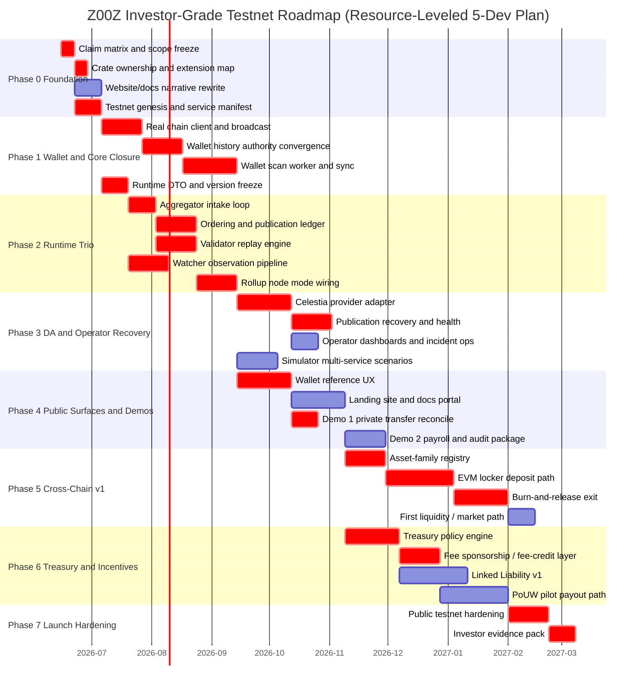

# Z00Z Investor-Grade Testnet Implementation Roadmap

*Date: 2026-06-07*  
*Status: Planned*  
*Scope: investor-grade testnet, not production mainnet*  
*Evidence base: `docs/*Whitepaper*.md`, selected `docs/tech-papers/*.md`, and current workspace code*

## 🎯 Executive Summary

Z00Z already has a credible protocol nucleus: `z00z_core`, `z00z_crypto`, `z00z_storage`, large parts of `z00z_wallets`, the settlement theorem in `crates/z00z_rollup_node/src/lib.rs`, and a reusable simulator harness in `crates/z00z_simulator`. The strongest live story today is private package construction, replay-aware storage, checkpoint artifacts, and theorem-level settlement verification.

The investor-grade testnet gap is not the theorem layer. The gap is the operating stack around it: executable aggregator/validator/watcher services, a real DA provider path, a real wallet chain client and scan loop, a usable website/docs portal, a first cross-chain locker path, and rule-bound treasury/incentive flows. Those are mostly partial, placeholder, or not found in crates today.

The safest roadmap is sequential:

1. freeze architecture and public-claim boundaries;
2. close wallet authority and runtime DTO/version seams;
3. implement the runtime trio and rollup-node composition;
4. land Celestia-first DA and operator recovery;
5. ship website, docs, wallet reference UX, and investor demos;
6. add one EVM-first locker path and one treasury/incentive pilot;
7. harden, rehearse, and launch the public testnet.

With a fixed 5-developer team, the realistic schedule is **38-46 weeks**. The user-provided role split actually names **6 parallel lanes**, so either scope must be staged aggressively or a 6th lane should be added for schedule safety.

## 📦 What Already Exists In Codebase

### ✅ Live core settlement and storage contracts

| Area | Status | Evidence | Notes |
| --- | --- | --- | --- |
| Protocol object vocabulary | Implemented | `crates/z00z_core/src/lib.rs`, `crates/z00z_core/src/assets/*`, `crates/z00z_core/src/genesis/*` | Real asset, genesis, and hashing surfaces already exist. |
| Crypto facade and domain separation | Implemented | `crates/z00z_crypto/src/lib.rs`, `crates/z00z_crypto/src/domains.rs`, `crates/z00z_crypto/src/protocol/*` | Strong base for commitments, range proofs, signatures, ECDH/KDF, and domain-separated hashing. |
| Settlement storage and replay | Implemented / active hardening | `crates/z00z_storage/src/settlement/*`, `crates/z00z_storage/src/checkpoint/*`, `crates/z00z_storage/src/serialization/*` | Real HJMT/settlement/checkpoint vocabulary already exists. |
| Claim nullifier persistence | Implemented | `crates/z00z_storage/src/settlement/store_types.rs`, `store.rs`, `store_query.rs` | A usable anti-replay primitive already exists and should be reused for treasury/reward claims. |
| Fee support primitive | Implemented | `crates/z00z_storage/src/settlement/fee_envelope.rs`, `types_record.rs` | `FeeEnvelope` exists today and should anchor fee sponsorship / fee-credit work instead of inventing a second processing object. |
| Settlement theorem verification | Implemented | `crates/z00z_rollup_node/src/lib.rs` | `SettlementTheorem` and `verify_settlement_theorem(...)` are real and should stay the canonical settlement closure path. |

### ✅ Wallet baseline with meaningful product assets

| Area | Status | Evidence | Notes |
| --- | --- | --- | --- |
| Wallet persistence and `.wlt` baseline | Implemented / active closure | `crates/z00z_wallets/src/db/*`, `crates/z00z_wallets/src/persistence/*`, `crates/z00z_wallets/README.md` | Large surface already exists for profile, assets, sessions, scans, tx state, and backup. |
| Receiver-native ownership and requests | Implemented | `crates/z00z_wallets/src/receiver/*`, `src/key/receiver/*`, `src/receiver/request/*` | This is one of the strongest user-facing lanes already present. |
| Key management and seed flows | Implemented | `crates/z00z_wallets/src/key/*`, `crates/z00z_wallets/src/security/*` | Strong enough for a reference wallet once sync and transport are real. |
| Package creation and verification | Implemented / partial hardening | `crates/z00z_wallets/src/tx/*`, `crates/z00z_wallets/src/core/*`, tests under `crates/z00z_wallets/tests/*` | `TxPackage` exists; remaining work is around chain integration and operational closure. |
| Backup / restore | Implemented / hardening | `crates/z00z_wallets/src/backup/*` | Good investor-grade supporting feature once chain-facing flows are real. |

### 🚧 Runtime, node, and operator seams exist before executable services

| Area | Status | Evidence | Notes |
| --- | --- | --- | --- |
| Aggregator contracts | Scaffold only | `crates/z00z_runtime/aggregators/src/agg_iface.rs`, `agg_types.rs` | Type system is meaningful; service loop is not. |
| Validator contracts | Scaffold only | `crates/z00z_runtime/validators/src/verdicts.rs`, `val_engine.rs` | Reject taxonomy exists; replay engine does not. |
| Watcher contracts | Scaffold only | `crates/z00z_runtime/watchers/src/alerts.rs`, `status_view.rs`, `evidence_export.rs` | Alert vocabulary is useful, but observation loop is not implemented. |
| Rollup composition root | Scaffold only | `crates/z00z_rollup_node/src/lifecycle.rs`, `config.rs`, `status.rs`, `da_adapter.rs` | Node mode/status seams exist; provider logic and control surfaces do not. |
| RPC transport boundary | Implemented transport seam | `crates/z00z_networks/rpc/src/*` | Good reusable transport layer; must remain transport-only. |
| Simulator evidence harness | Implemented | `crates/z00z_simulator/src/*`, `crates/z00z_simulator/tests/*` | Valuable for testnet demo rehearsal and regression evidence. |

### 🚫 Docs-only or not found in crates today

| Surface | Workspace result | Evidence |
| --- | --- | --- |
| `LockerID`, `BridgeInTx`, `BridgeOutTx` | not found in crates | present in `docs/Z00Z-Cross-Chain-Integration-Whitepaper.md`, absent from `crates/*` |
| `RewardAuthorization`, `WorkPackage` | not found in crates | present in `docs/Z00Z-Proof-of-Useful-Work-Whitepaper.md`, absent from `crates/*` |
| `FeeCredit`, `Protocol Treasury`, `Stewardship Endowment`, `Launch Capsule` | not found in crates | present in `docs/Z00Z-Tokenomics-Incentives-Whitepaper.md`, absent from `crates/*` |
| `FraudProof`, `LockRegistry` | not found in crates | present in `docs/Z00Z-Linked-Liability-Whitepaper.md`, absent from `crates/*` |
| Celestia provider implementation | not found in crates | only visible as `z00z_da_celestia` string in `crates/z00z_rollup_node/README.md` plus docs references |

### ⚠️ Dead code, mock-only code, and refactor-required zones

| Path | Classification | Why it matters |
| --- | --- | --- |
| `crates/z00z_wallets/src/app/kernel.rs` | stub-heavy app kernel | Network switching, OnionNet toggles, scan status, wallet listing/export/import are deterministic placeholders. |
| `crates/z00z_wallets/src/network/kernel.rs` | placeholder-only | No real network kernel exists behind the type. |
| `crates/z00z_wallets/src/chain/chain_client.rs` and `chain_client_impl.rs` | mock-only / Phase 1 stub | Wallet cannot be investor-grade until this becomes a real chain client. |
| `crates/z00z_wallets/src/services/chain_service.rs` | in-memory placeholder | Scan jobs and chain tip are process-local placeholders. |
| `crates/z00z_wallets/src/services/storage_service.rs`, `key_service.rs`, `directory_service.rs` | placeholder services | Need either deletion or implementation before claiming service completeness. |
| `crates/z00z_runtime/aggregators/*` | thin scaffold | Types are useful; loops, persistence, and tests are missing. |
| `crates/z00z_runtime/validators/*` | thin scaffold | Reject classes exist; actual replay/verification engine is absent. |
| `crates/z00z_runtime/watchers/*` | thin scaffold | Alert vocabulary exists; no meaningful watch loop or publication watch implementation exists. |
| `crates/z00z_rollup_node/src/empty_file` and runtime `empty_file` fixtures | placeholder residue | Should be deleted or replaced during cleanup waves. |
| `crates/z00z_networks/onionnet/src/lib.rs` | placeholder-only reserved boundary | Important namespace, but not a reason to claim network anonymity. |
| `crates/z00z_telemetry` | minimal facade | Too small today to count as operator telemetry closure. |
| `crates/z00z_extensions` | empty reserved namespace | Good future home for optional ecosystems, but not live functionality. |
| `website/website_2025-09-30/content/Home.md` | unrelated content | Current homepage content is ZuzNet-themed, not Z00Z. It must not ship as investor-facing Z00Z copy. |
| `website/website_2025-09-30/public/configs/navigation.config.yaml` | generic/demo portal nav | Shows template/demo pages, not a Z00Z-ready docs structure. |

## 🚨 Missing Critical Pieces

| Missing piece | Current state | Why it is P1 for investor-grade testnet | Recommended owner |
| --- | --- | --- | --- |
| Executable aggregator service | scaffold only | No realistic publish path exists without it | Runtime / Protocol |
| Executable validator replay engine | scaffold only | No trustable external demo if published batches are not replayed independently | Runtime / Protocol |
| Executable watcher pipeline | scaffold only | Investors will expect operator observability and anomaly evidence | Runtime / Node |
| Real node + DA provider path | scaffold only | Celestia-first publication is part of Z00Z uniqueness and current investment story | Node / DA |
| Real wallet chain client and scan loop | stub only | Wallet cannot be a true client if sync, tip, broadcast, and scan are placeholders | Wallet / Client |
| Reference website + docs portal | generic scaffold only | No investor-grade story without clean public narrative and docs portal | Frontend / Docs |
| Cross-chain locker path | not found in crates | Cross-chain and external-asset rights are a core showcase theme | Cross-chain / DA |
| Treasury and incentive execution | docs-only | Rule-bound treasury is central to tokenomics, DAO, PoUW, and launch credibility | Treasury / Product |
| End-to-end demo scripts | partial simulator only | Fundraising demos must be reproducible and operator-visible | Simulator / Frontend |

## 🧩 Feature Groups

| Feature group | Whitepaper anchors | Code anchors | Current status | Testnet target |
| --- | --- | --- | --- | --- |
| Settlement core and checkpoint theorem | `docs/Z00Z-Main-Whitepaper.md`, `docs/tech-papers/Z00Z-Roadmap-Blueprint.md` | `crates/z00z_rollup_node/src/lib.rs`, `crates/z00z_storage/src/checkpoint/*` | Live core | Harden and keep stable |
| Wallet-held assets and offline package lane | `docs/Z00Z-UseCases-Whitepaper.md`, `docs/Z00Z-Agentic-Offline-Economy-Whitepaper.md`, `docs/Z00Z-Smart-Cash-Whitepaper.md` | `crates/z00z_wallets/src/receiver/*`, `src/tx/*`, `src/db/*` | Strong baseline, chain integration partial | Public wallet + delayed-connectivity demo |
| Aggregator / validator / watcher trio | `docs/tech-papers/Z00Z-Roadmap-Blueprint.md` | `crates/z00z_runtime/*` | Type-rich scaffold | Real services with tests and persistence |
| DA / Celestia publication | `docs/tech-papers/Z00Z-Multi-DA-and-Checkpoint-Architecture.md`, `docs/Z00Z-Cross-Chain-Integration-Whitepaper.md` | `crates/z00z_rollup_node/src/da_adapter.rs` | Provider seam only | Celestia-first v1 provider |
| Cross-chain lockers and private external assets | `docs/Z00Z-Cross-Chain-Integration-Whitepaper.md` | not found in crates | Docs-only | One EVM-first locker route |
| Treasury, incentives, and PoUW | `docs/Z00Z-Tokenomics-Incentives-Whitepaper.md`, `docs/Z00Z-DAO-Whitepaper.md`, `docs/Z00Z-Proof-of-Useful-Work-Whitepaper.md` | `ClaimNullifier` exists; other objects not found | Mostly docs-only | Minimal rule-bound treasury + one reward pilot |
| Selective disclosure / enterprise overlays | `docs/Z00Z-UseCases-Whitepaper.md`, `docs/Z00Z-Legal-Architecture-Whitepaper.md` | audit wrappers in storage and wallet metadata | Primitive-only | One payroll/audit demo, not full enterprise stack |
| Website, docs portal, and showcase demos | `website/z00z_website-6.yaml`, legal whitepaper docs boundary | `website/website_2025-09-30/*` | Generic scaffold | Real Z00Z portal and demo flows |
| Optional network anonymity overlay | `docs/Z00Z-OnionNet-Whitepaper.md` | `crates/z00z_networks/onionnet/*` | Placeholder | Post-testnet or shadow-only |

## 🧱 Recommended Module Placement For Missing Families

| Missing family | Recommended placement | Why this placement fits current architecture |
| --- | --- | --- |
| Celestia provider adapter | first pass in `crates/z00z_rollup_node/src/providers/celestia.rs`; optional later split into `crates/z00z_da_celestia/` | Keeps DA behind the existing `DaAdapter` seam before adding a new crate boundary. |
| Cross-chain asset family registry and locker flows | `crates/z00z_extensions/src/cross_chain/*` plus new external contract directory `contracts/evm/*` if EVM contracts are added | `z00z_extensions` is the least disruptive reserved namespace for non-core ecosystems; EVM contracts do not belong in Rust core crates. |
| Treasury, payouts, and incentive policy | `crates/z00z_extensions/src/treasury/*` and `src/rewards/*` | These are above the settlement theorem and should not bloat `z00z_core` or `z00z_storage`. |
| Linked Liability v1 | `crates/z00z_extensions/src/liability/*` with storage-backed hooks into `ClaimNullifier` and checkpoint evidence | Keeps fraud/accountability overlays downstream of the core theorem while reusing existing replay/storage primitives. |
| Investor demo application glue | `website/website_2025-09-30/content/*`, small API/demo adapters under `crates/z00z_simulator` and wallet reference clients | Demos should reuse the simulator and reference clients rather than create a second hidden product stack. |

## 🗺️ Phase Roadmap

### ⚙️ Phase 0 - Scope Freeze, Claim Hygiene, and Testnet Architecture

Goal: freeze the corpus-to-code boundary before deeper implementation starts.

Exit gate:

- one crate ownership map is approved;
- one testnet architecture note exists for wallet -> aggregator -> DA -> validator -> watcher;
- public language is rewritten from demo/template drift into Z00Z-specific, legally safe copy;
- testnet genesis/configuration and service inventory are explicit.

### 🔐 Phase 1 - Wallet and Core Closure

Goal: make the already-strong wallet/core lane trustworthy enough to feed runtime services.

Exit gate:

- wallet history authority is converged;
- chain client is real enough for tip, block fetch, submit, status, and scan;
- runtime DTOs, batch identities, and publication/version semantics are frozen;
- simulator proves wallet -> storage -> checkpoint -> theorem continuity on current contracts.

### 📡 Phase 2 - Runtime Trio Implementation

Goal: convert aggregator, validator, and watcher from typed contracts into executable services.

Exit gate:

- admitted `WorkItem` -> `OrderedBatch` -> `PublicationRequest` is durable;
- published batches can be resolved and replayed into typed `Verdict`s;
- watcher loop produces `ObservationSnapshot` and persisted `EvidenceRecord`s;
- rollup node can run in `Aggregator`, `Validator`, `Watcher`, and `Combined` modes against a local DA adapter.

### 🛰️ Phase 3 - Celestia-First DA and Operator Recovery

Goal: land the first honest provider stack behind the existing DA seam.

Exit gate:

- one Celestia adapter can publish, resolve, retry, and recover from restart;
- watchers can detect missing blob, retry stagnation, and provider divergence;
- operator status APIs, logs, and incident scripts exist;
- simulator covers restart and publication-failure scenarios.

### 🌐 Phase 4 - Public Client Surfaces and Investor Demos

Goal: make the system demonstrable to non-engineers without hiding reality.

Exit gate:

- reference website/landing/docs portal is live and Z00Z-specific;
- wallet reference client exposes create/import/receive/send/scan/status flows;
- demo flow 1 shows private transfer plus delayed reconcile;
- demo flow 2 shows treasury or payroll-style distribution with selective audit output.

### 🌉 Phase 5 - Cross-Chain v1

Goal: prove the "external assets, private internal rights" thesis with one conservative external route family.

Exit gate:

- one EVM-first locker path exists for deposit -> mint private right -> private transfer -> burn -> release;
- replay keys, external event IDs, and exit conditions are watcher-visible;
- one liquidity/discoverability path exists for `wZ00Z` or equivalent public representation;
- docs clearly separate protocol guarantees from locker/custody assumptions.

### 💰 Phase 6 - Treasury and Incentive v1

Goal: make tokenomics and useful-work claims executable, not just narrative.

Exit gate:

- treasury compartments, caps, and payout rules are codified;
- fee sponsorship / fee-credit behavior is implemented using the existing fee-support primitives;
- one PoUW pilot works end to end through external review plus private payout;
- one narrow Linked Liability v1 path exists for offline payment-family conflict handling or is explicitly deferred with evidence.

### 🚀 Phase 7 - Hardening and Public Testnet Launch

Goal: transform a working stack into a credible public fundraising artifact.

Exit gate:

- launch runbooks, recovery tests, and operator dashboards are complete;
- reproducible demo scripts and investor evidence packs are ready;
- legal/public claims match actual implementation maturity;
- public testnet can be operated without hidden manual intervention on the critical path.

## 🔄 Canonical End-to-End Testnet Flow

The roadmap should converge on one canonical operator-visible flow:

1. user creates or imports a wallet and syncs with a real chain client;
2. wallet receives faucet funds or an imported asset-family balance;
3. sender creates a `TxPackage` and hands off a private transfer package locally or over an ordinary transport;
4. receiver validates locally and marks it pending before checkpoint settlement;
5. aggregator admits the resulting `WorkItem`, orders it, and builds a `PublicationRequest`;
6. Celestia-first DA publishes the batch bytes and returns a provider-facing blob reference;
7. validator resolves published artifacts and replays them into a typed `Verdict`;
8. watcher observes provider signals, publication state, and verdict state and emits evidence;
9. wallet updates local status and exposes final settlement state plus optional scoped audit/export views;
10. optional extension lanes then demonstrate either EVM exit, payroll/voucher audit output, or treasury/reward payout.

This flow is the minimum truth path that the investor demos must not bypass.

## ⚖️ Sequence Trade-Off And Collision Audit

### Sequencing pros/cons

| Ordering lens | Pros | Cons | Audit result |
| --- | --- | --- | --- |
| Core-first | Lowest overclaim risk; preserves theorem/storage integrity | Slower visible product momentum | Keep as base rule. |
| Wallet-first | Fastest user-visible progress | Can outrun runtime and operator truth | Accept only after core and DTO freeze. |
| Runtime-first | Fastest route to honest node operation | Depends on already-stable wallet/package/storage semantics | Start immediately after wallet/core closure. |
| Cross-chain-first | Strong investor headline | Imports custody/finality risk too early | Reject as pre-runtime ordering. |
| Website-first | Good narrative polish | Risks selling unshipped subsystems | Keep parallel only after public claim matrix is frozen. |

### Collision fixes applied

| Collision or doubt | First-version risk | Fix in this revision |
| --- | --- | --- |
| 5-dev staffing vs 6-lane scope | Hidden resource overcommitment | Gantt is now resource-leveled for 5 developers. |
| Website/docs portal and wallet UX on the same human lane | False parallelism in Phase 4 | Wallet reference UX now precedes full portal build in the 5-dev plan. |
| Cross-chain and treasury/incentive work on the same compressed lane | Schedule collision around Phases 5-6 | Treasury policy lane is reassigned to the protocol/core side in the 5-dev allocation; cross-chain stays on the external-integration lane. |
| Aggregator ordering and validator replay on one lane | Runtime bottleneck risk | Validator replay is treated as shared protocol/runtime work, not pure aggregator follow-up. |
| DA provider work and operator tooling on one lane | Hidden Phase 3 overlap | DA/Celestia ownership is split from node/watcher/operator tooling in the 5-dev allocation. |
| Launch hardening starting before treasury showcase completion | Investor demo inconsistency | Launch hardening is now gated after the treasury/incentive pilot path in the resource-leveled gantt. |

## 📋 Detailed Task Table

| ID | Phase | Priority | Task | Existing anchors / new modules | Depends on | Can run parallel with | Owner role | Estimated effort | Risk | Definition of done |
| --- | --- | --- | --- | --- | --- | --- | --- | --- | --- | --- |
| T-001 | 0 | P1 | Freeze corpus-to-code claim matrix and testnet scope | Docs corpus; `docs/tech-papers/Z00Z-Roadmap-Blueprint.md` | none | T-002,T-003,T-004 | Product / Architect | 1 week | Medium | Every investor-facing claim is tagged as live, partial, future, or assumption. |
| T-002 | 0 | P1 | Publish crate ownership map and extension policy | `crates/z00z_storage`, `z00z_wallets`, `z00z_runtime/*`, `z00z_rollup_node`, `z00z_extensions` | T-001 | T-003,T-004 | Protocol / Architect | 1 week | Medium | Each roadmap feature has a target crate or a justified new module. |
| T-003 | 0 | P1 | Rewrite website/docs public language into Z00Z-safe narrative | `website/website_2025-09-30/*`, `website/z00z_website-6.yaml`, legal whitepaper | T-001 | T-002,T-004 | Frontend / Docs | 2 weeks | Medium | Template/ZuzNet/demo copy is removed; Z00Z-specific IA and messaging are approved. |
| T-004 | 0 | P1 | Prepare testnet genesis, asset families, config manifests, and node inventory | `crates/z00z_core/src/genesis/*`, asset config, node config | T-001 | T-002,T-003 | Protocol / Network | 2 weeks | Medium | Testnet chain config, named asset families, service matrix, and deployment env files exist. |
| T-005 | 1 | P1 | Close wallet history authority and `wallet.asset.*` convergence | `crates/z00z_wallets/src/db/*`, `src/persistence/*`, sidecar surfaces | T-004 | T-006,T-007,T-008 | Wallet / Client | 3 weeks | High | One canonical source of wallet asset and history truth exists; no shadow authority planes remain. |
| T-006 | 1 | P1 | Implement real chain client, broadcast path, tip/status fetch, and endpoint failover | `crates/z00z_wallets/src/chain/chain_client.rs`, `chain_client_impl.rs`, `broadcast.rs` | T-004 | T-005,T-007 | Wallet / Client | 3 weeks | High | Wallet can fetch headers/blocks, submit txs, and query tx state against real node endpoints. |
| T-007 | 1 | P1 | Implement wallet scan worker, resumable sync, and scan-state persistence | `crates/z00z_wallets/src/receiver/scan/*`, `services/chain_service.rs`, `persistence/scans/*` | T-004 | T-005,T-006 | Wallet / Client | 4 weeks | High | Scan jobs survive restart, use persisted cursor state, and update wallet ownership locally. |
| T-008 | 1 | P1 | Freeze runtime/publication DTOs, version tags, and test vectors | `crates/z00z_runtime/aggregators/src/agg_types.rs`, validators verdicts, node status/config | T-004 | T-005,T-006,T-007 | Protocol / Runtime | 2 weeks | Medium | Batch, verdict, provider, and status objects have stable schemas and regression fixtures. |
| T-009 | 2 | P1 | Implement aggregator intake loop with durable local rejection ledger | `agg_iface.rs`, `agg_ingress.rs`, `agg_types.rs` | T-008 | T-010,T-011 | Runtime / Aggregator | 3 weeks | High | `WorkItem` admission persists intake IDs, local rejects, and replay-local policy decisions. |
| T-010 | 2 | P1 | Implement ordering, batch assembly, publication ledger, and soft-confirmation flow | `agg_ordering.rs`, `agg_scheduler.rs`, `agg_recovery.rs` | T-009 | T-011,T-012 | Runtime / Aggregator | 4 weeks | High | Admitted work becomes durable ordered batches with recoverable publication state transitions. |
| T-011 | 2 | P1 | Implement validator replay engine and reject taxonomy enforcement | `val_engine.rs`, `verdicts.rs`, `tx_pkg_verify.rs`, `claim_pkg_verify.rs`, `reconcile_rules.rs` | T-008 | T-009,T-012 | Runtime / Validator | 4 weeks | High | Published artifacts replay deterministically into accepted/rejected/incomplete verdicts. |
| T-012 | 2 | P1 | Implement watcher observation loop, alert counts, and evidence export | `watcher_engine.rs`, `alerts.rs`, `da_health.rs`, `evidence_export.rs` | T-008 | T-010,T-011 | Runtime / Watcher | 3 weeks | Medium | Watchers emit persisted alerts and evidence records keyed by batch and provider signal. |
| T-013 | 2 | P1 | Wire rollup node modes, local/test DA adapter, and persisted status surfaces | `crates/z00z_rollup_node/src/*` | T-010,T-011,T-012 | T-014 | Node / Runtime | 3 weeks | High | Node runs split or combined service loops and survives clean restart with state reload. |
| T-014 | 3 | P1 | Build `z00z_da_celestia` provider adapter or equivalent provider module | `DaAdapter` seam; new provider module required (assumption) | T-013 | T-015,T-016 | DA / Celestia | 4 weeks | High | One provider path publishes blobs, records refs, resolves batches, and returns typed failures. |
| T-015 | 3 | P1 | Add publication recovery, restart replay, and provider health checks | `agg_recovery.rs`, node lifecycle/status, watcher provider signals | T-013,T-014 | T-016,T-017 | Node / DA | 3 weeks | High | Partial publish, missing blob, and restart cases recover from persisted state, not operator memory. |
| T-016 | 3 | P1 | Add operator dashboards, alert routing, logs, and incident scripts | `z00z_telemetry`, node status, watcher evidence | T-012,T-013 | T-014,T-015,T-017 | Network / Ops | 2 weeks | Medium | Operators can observe lag, blob health, verdict backlog, retries, and service attachment state. |
| T-017 | 3 | P1 | Extend simulator to multi-service end-to-end scenarios and failure injections | `crates/z00z_simulator/src/*`, scenario tests | T-013 | T-014,T-015,T-016 | Simulator / QA | 3 weeks | Medium | Simulator covers wallet -> aggregator -> DA -> validator -> watcher happy and failure paths. |
| T-018 | 4 | P1 | Build Z00Z landing site and docs portal on the existing Next.js scaffold | `website/website_2025-09-30/*`, `website/z00z_website-6.yaml` | T-003 | T-019,T-020,T-021 | Frontend / Docs | 4 weeks | Medium | Portal has landing, docs nav, validator/watchers/Celestia pages, and no demo-template residue. |
| T-019 | 4 | P1 | Build wallet reference UX for create/import/receive/send/scan/status flows | `crates/z00z_wallets/bin/z00z_wallet_egui.rs`, wallet services, web or native client surfaces | T-005,T-006,T-007 | T-018,T-020 | Wallet / Frontend | 4 weeks | High | Non-engineer can use a reference client to create wallet, fund it, receive, send, and inspect status. |
| T-020 | 4 | P1 | Build Demo 1: private transfer plus delayed checkpoint reconciliation | wallet, simulator, aggregator, validator, watcher | T-017,T-019 | T-018,T-021 | Product / Runtime | 2 weeks | Medium | Demo shows QR/file handoff, local accept, later publish, verdict, and final watcher evidence. |
| T-021 | 4 | P1 | Build Demo 2: payroll/voucher distribution plus selective audit package | wallet, storage audit wrappers, simulator, portal | T-017,T-018,T-019 | T-020 | Product / Frontend | 3 weeks | Medium | Demo shows private distribution and a scoped auditor/investor evidence output. |
| T-022 | 5 | P1 | Add asset-family registry and mapping rules for externally backed units | new cross-chain module required; extend asset registry and wallet labeling | T-004,T-018 | T-023,T-024 | Cross-chain / Protocol | 3 weeks | High | Wallet and node can distinguish internal, issuer-native, and externally backed families cleanly. |
| T-023 | 5 | P1 | Implement EVM locker contracts, deposit observer, and import attestation path | new EVM / locker module required (not found today) | T-022,T-014 | T-024,T-025 | Cross-chain / DA | 5 weeks | High | External deposit can mint a private right with replay-safe event binding and visible risk labels. |
| T-024 | 5 | P1 | Implement burn-and-release exit path with watcher checks and failure handling | locker module, validator/watchers, DA provider | T-023 | T-025 | Cross-chain / Runtime | 4 weeks | High | Private holder can exit to external recipient with typed release conditions and operator evidence. |
| T-025 | 5 | P2 | Add first liquidity / market-access path for `wZ00Z` or equivalent | external contracts and portal docs; assumption outside core repo | T-023 | T-024,T-026 | Cross-chain / Product | 2 weeks | Medium | One public representation exists for discovery/liquidity without being misrepresented as protocol truth. |
| T-026 | 6 | P1 | Implement treasury compartments, budgets, caps, and payout policy engine | new treasury/governance module required; no crate anchors found today | T-001,T-018 | T-027,T-028 | Treasury / Product | 4 weeks | High | Treasury logic exists as typed policy, config, and deterministic checks with audit logs. |
| T-027 | 6 | P1 | Implement fee sponsorship / fee-credit flow on top of `FeeEnvelope` | `crates/z00z_storage/src/settlement/fee_envelope.rs` | T-026 | T-028,T-029 | Protocol / Treasury | 3 weeks | High | Sponsored execution works without introducing a second fee-support object family. |
| T-028 | 6 | P2 | Implement PoUW pilot: `WorkPackage` intake -> external review -> `RewardAuthorization` -> private payout | new rewards module required; only docs exist today | T-026,T-027 | T-025,T-029 | Treasury / Incentives | 5 weeks | High | One objective reward category pays privately and blocks double-claim via replay-safe state. |
| T-029 | 6 | P2 | Implement Linked Liability v1 for offline payment-family conflicts | new liability module required; `FraudProof`/`LockRegistry` not found today | T-020,T-026 | T-028 | Protocol / Risk | 5 weeks | Very High | Conflicting offline payment evidence can activate a bounded liability state or is explicitly deferred by signed scope decision. |
| T-030 | 7 | P1 | Harden public testnet operations, chaos tests, and recovery runbooks | node, DA, runtime, simulator, portal | T-021,T-024,T-026 | T-031 | Network / Ops | 3 weeks | High | Team can restart services, recover state, and re-run demos without hidden manual database edits. |
| T-031 | 7 | P1 | Build investor evidence pack and reproducible showcase scripts | portal, simulator, dashboards, wallet, cross-chain, treasury | T-020,T-021,T-024,T-026 | none | Product / Frontend | 2 weeks | Medium | Rehearsable scripts, screenshots, metrics, and docs support live fundraising demos. |

## 🧪 Critical Path Micro-Tasks

| Parent | Micro-task | Depends on | Done when |
| --- | --- | --- | --- |
| T-006 | Bind wallet RPC config to real node endpoint set | T-004 | Wallet can switch between named endpoints without placeholder responses. |
| T-006 | Implement `get_tip_height`, `get_block`, `get_header`, `submit_transaction`, `get_transaction_status` against real RPC | T-004 | No Phase-1 placeholder response paths remain in the live chain client. |
| T-007 | Persist scan cursor and resume state in wallet storage | T-005,T-006 | Restart resumes from persisted cursor rather than resetting to placeholder state. |
| T-009 | Persist local intake IDs and reject classes | T-008 | Aggregator restart retains local admission history. |
| T-010 | Generate deterministic `BatchId` / idempotency key pairs and durable publication rows | T-009 | Publish retry does not create duplicate batch identities. |
| T-011 | Rebuild public replay inputs from published artifacts and checkpoint data | T-008 | Validator result is derived from public artifacts only. |
| T-012 | Emit `ObservationSnapshot` and `EvidenceRecord` on publish, resolve, and failure events | T-008 | Watchers produce queryable operator evidence, not only logs. |
| T-014 | Publish batch bytes to first Celestia path and persist blob reference | T-013 | Published batch has durable provider reference and typed failure modes. |
| T-015 | Recover from partial publish and missing blob states | T-014 | Operator can restart without manually reconstructing DA state. |
| T-023 | Observe external deposit event and bind it to one import intent | T-022,T-014 | Deposit event cannot be replayed into multiple private rights. |
| T-024 | Burn internal right before external release | T-023 | Exit cannot coexist with still-live internal spend right. |
| T-027 | Encode sponsor or prepaid processing support via `FeeEnvelope` | T-026 | Sponsored execution reuses existing fee-support semantics. |
| T-028 | Map one reviewed useful-work result into a replay-safe reward claim | T-026,T-027 | Same authorization cannot be redeemed twice. |
| T-029 | Detect one bounded offline payment conflict and activate liability handling or an explicit deferred-scope gate | T-020,T-026 | Liability story is either executable in one lane or honestly deferred with signed rationale. |

## 👥 5-Developer Allocation

The requested staffing note says "plan for 5 developers" but then lists **6 roles**. The cleanest execution is a 6-lane plan. If staffing is fixed at 5, use the compressed allocation below and accept schedule pressure in Phases 4-6.

### Recommended 5-developer allocation

| Developer | Primary lane | Secondary lane | Phase concentration |
| --- | --- | --- | --- |
| Dev 1 | Rust protocol/core/storage/treasury policy | Linked Liability v1 and validator theorem support | Phases 0-3, 6 |
| Dev 2 | Wallet/client/reference UX | Website/docs portal after wallet closure | Phases 0-4 |
| Dev 3 | Aggregator services + simulator runtime evidence | Shared validator replay implementation | Phases 1-3 |
| Dev 4 | Watchers + rollup node + operator tooling | Telemetry, recovery, and launch hardening | Phases 2-3, 7 |
| Dev 5 | DA / Celestia + cross-chain integration | Public demos/use-case glue after runtime closure | Phases 3-7 |

### Preferred 6-lane allocation

If budget allows one more lane, use the role model implied by the original request:

| Lane | Why it is better |
| --- | --- |
| Rust protocol/core | Keeps theorem/storage work narrow and stable. |
| Wallet/client | Prevents wallet closure from being delayed by website/docs demands. |
| Validator/aggregator/watchers | Lets the runtime trio mature as one subsystem. |
| Network / node / ops | Keeps operator and deployment closure independent from protocol logic. |
| DA / Celestia / cross-chain | Matches the largest missing uniqueness surface. |
| Frontend / website / docs / demos | Removes a major bottleneck in the investor-facing lane. |

### 5-dev vs 6-lane trade-off

| Staffing model | Pros | Cons | Recommendation |
| --- | --- | --- | --- |
| Fixed 5 developers | Lower burn, fewer coordination edges, simpler ownership map | Longer critical path, less slack in Phases 3-6, more pressure on demos/docs timing | Acceptable if fundraising runway tolerates a roughly 9-month build. |
| 6 lanes as originally implied | Cleaner subsystem ownership, shorter investor-demo path, less hidden multitasking | Higher burn and one more integration surface | Best option if the team wants a stronger chance of landing in the 32-38 week window. |

## 📅 Mermaid Gantt

This dependency-corrected 5-developer sequence lands around **2027-03-08** if work starts on **2026-06-15**.
Where a task has multiple prerequisites in the detailed table, the gantt uses the latest predecessor on the active path once the earlier prerequisites are already complete.

## ⏰ Timeline Estimate

### Base assumption

- team size fixed at 5 developers;
- strong LLM/Codex assistance is available;
- one conservative EVM-first locker route only;
- one Celestia-first provider path only;
- one treasury/incentive pilot only;
- full OnionNet and multi-DA failover are excluded from launch critical path.

### Estimate

| Scenario | Duration | Conditions |
| --- | --- | --- |
| Optimistic | 32-36 weeks | Minimal surprises in runtime trio, Celestia adapter, and EVM locker path; temporary 6th lane added for frontend/docs or cross-chain work. |
| Realistic | 38-46 weeks | Expected path for a true investor-grade testnet with demos, docs, operator tooling, and one external route family. |
| Conservative | 52-60 weeks | If runtime/DA/cross-chain surfaces need deeper refactor, if treasury scope expands, or if 5 developers must absorb all 6 requested lanes without extra help. |

## ⚠️ Critical Risks

| Risk | Why it is critical | Mitigation |
| --- | --- | --- |
| Runtime trio is mostly typed contracts, not services | The public testnet story collapses if the node cannot really publish, replay, and observe | Land runtime loops before website polish or broad ecosystem work. |
| Celestia is directionally named but not implemented | DA uniqueness is central to the narrative, but code is not there yet | Keep Phase 3 narrow: one provider, one publish path, one restart path. |
| Cross-chain lockers import external trust and failure modes | This is the highest-complexity showcase lane after DA | Limit v1 to one EVM family, explicit risk labels, and watcher-visible release conditions. |
| Treasury/PoUW objects are docs-only | Large risk of overbuilding or inventing incompatible semantics | Reuse `ClaimNullifier` and `FeeEnvelope`; keep reward and treasury v1 minimal and typed. |
| Wallet chain/sync is still placeholder-heavy | Investor-facing wallet credibility depends on real sync, not only key management | Make chain client and scan worker Phase 1 critical path. |
| Website scaffold currently contains non-Z00Z copy | Public positioning risk is immediate | Rewrite before fundraising or public testnet announcements. |
| 5-developer plan is under-laned relative to requested scope | Website, wallet, DA, cross-chain, and treasury overlap heavily | Add a 6th lane or explicitly stage later features after Phase 4. |
| Scope creep from OnionNet, recursive proofs, or full enterprise compliance | These are attractive but not launch-critical | Keep them out of the public-testnet critical path. |

## 💼 What Can Be Shown To Investors

The investor-grade testnet should demonstrate **proof-backed uniqueness**, not just "a chain runs."

| Showcase | What it proves | Prerequisites |
| --- | --- | --- |
| Demo A: private wallet transfer with delayed reconciliation | wallet-held assets, local package exchange, later checkpoint settlement | T-005 through T-020 |
| Demo B: operator flow from publish to watcher evidence | aggregator/checkpoint/validator/watcher model is real | T-009 through T-017 |
| Demo C: Celestia-backed publication and recovery | DA layer is externalized without externalizing settlement meaning | T-014 through T-017 |
| Demo D: private payroll or voucher distribution with scoped audit output | enterprise/public-interest use case and selective disclosure wedge | T-018 through T-021 |
| Demo E: EVM deposit -> private Z00Z transfer -> EVM redemption | cross-chain "external assets, private internal rights" thesis | T-022 through T-025 |
| Demo F: rule-bound reward payout | treasury and incentives are mechanized, not narrative-only | T-026 through T-028 |
| Public docs portal | team understands its own architecture and risk boundaries | T-003,T-018,T-031 |

The minimum investor walkthrough should be:

1. create wallet;
2. fund from faucet or imported asset family;
3. hand off a private transfer package locally;
4. publish through aggregator into Celestia-backed batch;
5. validate and observe through validator/watchers;
6. show one scoped audit package;
7. show one external-asset deposit/redeem route;
8. show one treasury-backed reward or voucher flow.

## 💤 What Should Be Postponed After Testnet

| Surface | Why it should wait |
| --- | --- |
| Full OnionNet live anonymity overlay | Current crate is placeholder-only; public claims would outrun executable evidence. |
| Multi-DA failover beyond Celestia-first | One provider path is enough for the first honest testnet story. |
| Recursive checkpoint proofs and deep proof-envelope optimization | Important research lane, but not required for first investor-grade testnet credibility. |
| Full HJMT sharding/root-of-shard-roots migration | Storage tech papers describe real future work, but it is not a prerequisite for first public testnet. |
| Full Linked Liability across many right families | Start with one narrow payment-family pilot or defer explicitly. |
| Subjective PoUW categories (marketing, social, narrative) | Too governance-heavy and easy to politicize for first launch. |
| Mature corporate/regulated wallet families | Keep one audit-capable demo, not a full compliance product suite. |
| PQ migration | Important long-term security program, but not a launch blocker for the current legacy lane. |

## 🔎 Summary Recommendation

The right fundraising testnet is **not** "ship everything in the whitepapers." It is:

- a hardened settlement core;
- a real wallet;
- a real runtime trio;
- a Celestia-first DA path;
- one real cross-chain locker route;
- one rule-bound treasury/incentive pilot;
- one clean website/docs portal;
- three to six reproducible demos that prove Z00Z's actual differentiators.

Anything beyond that should be treated as post-testnet expansion unless the team size increases.
