# Z00Z JMT Asset And Right Storage Design

[TOC]

Version: 2026-06-02

Cross-phase naming authority: [Z00Z-HJMT-Key-Terms.md](../Z00Z-HJMT-Key-Terms.md).
Use the shared glossary to choose canonical object, struct, trait, function,
and fixture-family names across all HJMT phases. If a naming choice diverges,
the shared glossary wins for spelling and reuse discipline.

## Key Terms Used In This Paper

This paper uses a compact storage vocabulary because the design depends on separating public settlement semantics from internal physical indexing. The goal is to keep the asset storage model fast without turning Z00Z back into a public account ledger or an overgeneralized state database.

- `TerminalLeaf`: One live terminal settlement leaf variant for confidential asset rights in canonical Z00Z state.
- `RightLeaf`: The live generalized settlement object for one confidential non-coin right under the Phase 053 settlement contract. It inherits the same storage duties as `TerminalLeaf` while carrying bounded-right semantics for non-coin families.
- `SettlementPath`: The canonical Phase 053 locator for one terminal settlement leaf, composed as `definition_id`, `serial_id`, and `terminal_id`.
- `AssetPath`: Archived compatibility vocabulary for older asset-centric records. It is not the live public path contract.
- `AssetStateRoot`: Archived compatibility vocabulary retained for migration evidence and equivalence checks. It is not the live public settlement commitment.
- `SettlementStateRoot`: The live generalized semantic root over checkpointed terminal settlement leaves, including `TerminalLeaf` and `RightLeaf` families inside the same storage contract.
- `Definition`: The asset-family namespace that preserves issuer, content, policy, redemption, or capability meaning.
- `Serial bucket`: The semantic grouping under one definition that scopes related assets, rights, claims, or capability instances.
- `Fixed bucket`: A deterministic physical shard under one serial bucket, derived from asset identity and a committed bucket policy.
- `Bucketed root-chained JMT forest`: The recommended Z00Z asset storage topology in which semantic parent trees commit child roots, while hot leaf sets are split into deterministic physical buckets.
- `Parent root leaf`: A committed leaf in a parent JMT that binds the root of a child JMT and minimal metadata needed for verification.
- `Path index`: A storage-internal lookup plane that maps terminal identity back to `SettlementPath`; it is operationally useful but not the public semantic root.
- `Forest commit journal`: The atomic commit record that makes multi-tree updates crash-safe and replayable.
- `Proof envelope`: The public or verifier-facing proof package that hides internal backend complexity behind one coherent settlement-path proof.
- `FeeEnvelope`: A separate processing-guarantee primitive that answers who pays for verification, batching, publication, or relay of a right transition; it is not the bounded right itself.
- `Compatibility backend`: An archive-gated single-tree reference backend used for migration, testing, and semantic equivalence checks, not a live runtime lane.

## 1. Why This Document Is Needed

Z00Z needs an asset storage design that is faster than a single shared JMT, but not looser than the protocol semantics described by the broader whitepaper corpus. The storage layer is not an implementation detail that can be optimized independently from the protocol. It is the place where confidential rights, external asset claims, machine capabilities, agent spending envelopes, checkpoint roots, and replay-safe settlement all converge.

The design problem is therefore precise. Z00Z needs a storage topology that can insert and delete many committed settlement leaves efficiently, including bursty machine and agent workloads. Phase 053 treats `TerminalLeaf` and `RightLeaf` as live terminal families under one generalized settlement contract, and the public protocol must expose one narrow and stable semantic settlement commitment: `SettlementStateRoot`. Archived `AssetStateRoot` terminology survives only for compatibility evidence. The internal physical layout may become a forest, but the public protocol must continue to reason in terms of canonical paths, committed leaves, typed proofs, and checkpoint-coupled root continuity.

### 1.1 Design Thesis

The recommended design is a **bucketed root-chained JMT forest**.

At the semantic level, the tree remains easy to explain:

```text
SettlementStateRoot
  -> Definition
    -> Serial bucket
      -> terminal settlement leaf
         = TerminalLeaf for confidential assets
         = RightLeaf for confidential non-coin rights
```

At the physical execution level, each hot serial bucket is split into deterministic fixed buckets:

```text
SettlementStateRoot
  -> Definition JMT
    -> Serial JMT per definition
      -> Bucket JMT per serial
        -> Asset JMT per fixed bucket
          -> terminal settlement leaf
```

This structure synthesizes four requirements that otherwise fight each other:

1. It preserves Z00Z's rights-first state model.
2. It enables real parallel insert/delete across definitions, serials, and hot buckets.
3. It keeps the public API simple because callers still use `SettlementPath`.
4. It avoids dynamic split/merge machinery in the first canonical design.

### 1.2 Phase 053 Live Settlement Terms Versus Archived Asset Terms

Phase 053 deliberately separates the live settlement contract from archived
asset-centric compatibility vocabulary.

| Layer | Phase 053 live term | Archived compatibility term | Boundary rule |
| --- | --- | --- | --- |
| Terminal committed leaf family | `SettlementLeaf` with `TerminalLeaf` and `RightLeaf` variants | asset-only leaf wording | Keep live APIs on settlement-family nouns; archived compatibility notes may mention asset-only wording when discussing migration history. |
| Public semantic root | `SettlementStateRoot` | `AssetStateRoot` | Prefer settlement-root wording because this root commits checkpointed settlement state, not a global rights registry. |
| Canonical path shape | `SettlementPath { definition_id, serial_id, terminal_id }` | `AssetPath { definition_id, serial_id, asset_id }` | Preserve the same three-part semantic hierarchy while keeping live APIs on terminal-language naming. |

This document therefore uses `SettlementStateRoot`, `SettlementPath`, and the
settlement leaf family whenever it describes the live storage contract. It uses
asset-centric nouns only when discussing archived compatibility evidence or
historical pre-Phase-053 behavior.

### 1.3 What This Design Does Not Claim

This paper records the live Phase 053 HJMT forest architecture and the historical
migration path that led to it. The current repository now implements the
journal-backed physical HJMT forest backend on the live durable path. Historical
pre-Phase-053 notes about one shared physical JMT commit boundary remain here
only to explain the bottleneck that Phase 053 removed.

The paper also does not introduce a broader global protocol root.
`SettlementStateRoot` is the live storage-family settlement commitment, not a
universal protocol root. Archived `AssetStateRoot` terminology remains
compatibility-only. Other domains such as network membership, claim
replay registries, bridge facts, or runtime publication may have their own
roots, but this design does not require a new universal root merely to speed up
asset storage.

### 1.4 Phase 053 Operator And Hard-Cutover Notes

Phase 053 turns the generalized settlement contract into the live runtime
surface. That change is operational, not just terminological.

- The live storage mode is HJMT. `Z00Z_SETTLEMENT_BACKEND_MODE` may be left unset or
  set to `hjmt`; archived names such as `compatibility`, `compat`, `forest`,
  and `dual-verify` reject on the live runtime lane.
- `Z00Z_SETTLEMENT_BUCKET_BITS` selects the live fixed-bucket policy used for
  generalized settlement benchmarking and targeted operator tests.
- `Z00Z_STORAGE_SCHED_CPU` and `Z00Z_STORAGE_SCHED_QUEUE` are the live operator
  knobs for bounded scheduler concurrency and queue depth.
- Rights-enabled YAML inputs are now the development authority:
  `crates/z00z_core/configs/devnet_assets_config.yaml`,
  `crates/z00z_core/configs/devnet_genesis_config.yaml`, and
  `crates/z00z_simulator/src/scenario_1/scenario_config.yaml`.
- Old asset-only dev stores are unsupported on the live Phase 053 lane. They
  must be regenerated from the rights-enabled corpus; no live conversion shim
  is provided.
- Exact occupancy counts remain local diagnostics only. Verifier-visible proof
  surfaces must stay on bounded occupancy evidence.

## 2. Corpus Review And Requirements

Before proposing a storage topology, the relevant Z00Z documents were reviewed as a corpus. The corpus points to one consistent conclusion: asset storage must behave like a private rights settlement engine, not like a public balance database and not like a generic key-value store.

### 2.1 Main Protocol Requirements

The main protocol model centers on wallet-local possession, checkpointed
`SettlementLeaf` state with `AssetLeaf` and `RightLeaf` terminal families,
canonical paths, and narrow public settlement evidence. This imposes several
storage requirements:

| Requirement | Storage implication |
| --- | --- |
| Public state is leaf-oriented, not account-oriented | Storage must commit asset leaves and consumed paths, not public user balances. |
| Wallet-local possession remains meaningful before publication | Storage must not require a public account row to define ownership. |
| Checkpoints are the settlement boundary | Storage roots must be stable inputs to checkpoint continuity checks. |
| Public evidence should be narrow | Proofs should reveal only path and inclusion data needed for settlement. |
| Nullifiers are domain-specific, not a universal state replacement | Asset presence and absence must remain authoritative for asset state. |
| The live settlement core must carry both asset and right families | The backend should keep `RightLeaf` inside the live generalized settlement contract without forcing a second semantic hierarchy or a global state root redesign. |

The strongest storage rule from the main protocol is this: **a settlement right
is live because its committed terminal leaf exists under its canonical path,
and it is consumed because a valid checkpointed transition removes or replaces
that path**. In Phase 053 that terminal family includes both `AssetLeaf` and
`RightLeaf`.

### 2.2 Cross-Chain And External-Right Requirements

Cross-chain integration makes the `Definition` level essential. External assets, issuer-native assets, and synthetic internal units may all move privately inside Z00Z, but their economic meaning must remain separate. A stablecoin right, issuer voucher, service claim, and synthetic unit should not collapse into one anonymous bucket of private value.

That requirement makes a definition-scoped tree structure natural. `definition_id` is not merely a performance shard. It is the semantic root of an asset family. It may encode issuer meaning, policy flags, backing model, redemption route, content identity, or external custody interpretation.

The storage design must therefore preserve three facts:

1. `definition_id` separates asset families whose economic meanings differ.
2. `serial_id` is scoped under `definition_id` and must not be treated as globally unique by itself.
3. `asset_id` is the terminal leaf key for a concrete live right.

### 2.3 Machine And Agent Economy Requirements

The machine and agent papers add the strongest performance pressure. Offline machines, tool-using agents, resource rights, access credits, compute credits, and spending envelopes can create bursty workloads. They may produce many local receipts and many right transitions that reconcile later in batches.

That creates a different workload from occasional human payments. The storage backend must tolerate:

- many inserts under one asset family;
- many deletes under one asset family;
- many rights under one serial class;
- many local receipts reconciling in one checkpoint window;
- many small capability leaves with short lifetimes;
- repeated proof generation for selective audit and settlement.

A pure definition-sharded forest helps when the workload is spread across definitions. It does not fully solve a hot definition or hot serial. A bucketed serial layer is needed so one popular service, issuer, agent platform, machine corridor, or resource family does not become a single physical JMT bottleneck.

Those machine and agent papers are also where the corpus widens beyond the
asset-only noun set. Capability credits, bounded access rights, task
escrows, and agent spending envelopes are modeled as live `RightLeaf`-style
terminal objects under the same generalized settlement contract.

### 2.4 RightLeaf As The Generalized Terminal Object

The corpus should not be read as if `RightLeaf` were merely a marketing alias
for `AssetLeaf`. The more precise reading is stronger: `AssetLeaf` is the live
settlement object for confidential asset rights, while `RightLeaf` is the live
generalized terminal object for non-coin rights that still obey the same
storage grammar. In other words, a live `RightLeaf` should be treated
in storage exactly like `AssetLeaf` in the ways that matter most:

- it is checkpointed public settlement state, not just a wallet-local note;
- it lives under a canonical path and participates in typed proofs;
- its presence under that path means the bounded right is live;
- its removal or replacement under checkpoint rules means the right was consumed, expired, transformed, or settled;
- it is not a public account row, universal capability registry, or execution transcript.

What changes is the meaning carried by the terminal object family. The corpus
repeats a stable set of live right families:

| Right family | Representative corpus objects | Storage consequence |
| --- | --- | --- |
| Budget and mandate rights | Agent spending envelope, bounded mandate, task budget, emergency authority slice | The terminal leaf needs typed scope, limit, provider or purpose boundary, and expiry or one-time-use semantics. |
| Capability and work rights | Tool credit, compute credit, API right, data-access right, task escrow | The terminal leaf needs service or action class, quantity or entitlement meaning, and any proof-trigger or redemption condition. |
| Assurance and claim rights | Reward claim, payout claim, reputation bond, liability-bound right | The terminal leaf needs anti-replay discipline, attestation or claim condition, and narrow fraud or freeze hooks where policy requires them. |

This is the same architectural key used for `AssetLeaf`: the terminal object is
publicly committed settlement state, but only in the narrow sense required for
replay-safe verification. `RightLeaf` should therefore remain a typed,
bounded, and checkpoint-facing object rather than becoming a public mirror of
the holder's broader workflow or wallet state.

The corpus also keeps one separation explicit. A spendable right answers the
question "what bounded action or claim exists." A `FeeEnvelope` answers a
different question: who pays, with what asset, under what limit, and under
what publication or processing mode. A live `RightLeaf` may be paired with a
fee credit, embedded fee budget, sponsor reserve, or `FeeEnvelope`, but the
storage design should keep those as separate contract families rather than
silently expanding the right leaf into hidden general wallet authority.

#### 2.4.1 Legal-Defensibility Value Of RightLeaf

`RightLeaf` can strengthen Z00Z's legal and compliance posture, but only if it
is used as a **bounded evidence-bearing rights object** rather than as a vague
catch-all container.

The strongest version of the idea is not "rename `AssetLeaf` to `RightLeaf` and
legal protection appears." The stronger and more defensible version is:

- define the claimed right class explicitly;
- bind the right to a canonical path and checkpointed root history;
- preserve typed provenance, validity conditions, and transition rules;
- keep disclosure narrow so Z00Z can prove the specific right without exposing
  unrelated wallet inventory.

Under that framing, `RightLeaf` can improve defensibility in several ways:

| Potential advantage | Why it can help |
| --- | --- |
| Clearer legal object boundary | A typed right leaf can express whether the settled object is a claim, entitlement, mandate, escrow, capability, or liability-bound right instead of forcing every non-coin object into asset-only wording. |
| Stronger evidence packaging | A path-bound leaf plus proof envelope gives a cleaner evidentiary story: what right existed, under which path, under which root, and when it was consumed or transformed. |
| Better selective disclosure | Disputes, audits, and regulated reporting often need proof about one bounded right, not a full wallet dump. A dedicated `RightLeaf` family fits that disclosure model better than broad account-style state. |
| Better liability and freeze targeting | If some right families need fraud hooks, expiry, challenge windows, or narrow freeze conditions, a typed terminal object is easier to govern than ad hoc metadata hidden inside generic leaves. |
| Better contract evolution | Future business, machine, service, and mandate rights can be added without pretending they are all cash-like assets. That reduces semantic drift between protocol wording and real-world contractual meaning. |

The idea also has real costs and risks:

| Risk or cost | Why it matters |
| --- | --- |
| False sense of legal sufficiency | A typed `RightLeaf` can improve evidence quality, but by itself it does not create enforceability, recognition, or regulatory acceptance in any given jurisdiction. |
| Overloading the terminal leaf | If `RightLeaf` becomes a dumping ground for fees, workflow state, policy prose, or off-chain business semantics, the storage contract becomes harder to audit and harder to prove narrowly. |
| Schema and migration burden | Rights vocabularies change. Once a `RightLeaf` family becomes checkpoint-visible, field drift and transition drift become protocol and proof problems, not just application refactors. |
| Privacy regression risk | More explicit right typing can reveal business meaning if the leaf family, policy class, or liability fields are disclosed too broadly. |
| Governance burden | A legally meaningful rights model needs issuance rules, revocation rules, challenge procedures, expiry semantics, and retention policy. Storage typing alone cannot supply that governance layer. |

The design conclusion is therefore intentionally balanced:

> `RightLeaf` is worth pursuing **only as a narrow, typed settlement object for
> bounded non-coin rights**. It is likely to improve Z00Z's legal
> defensibility because it can make control, provenance, integrity, and
> selective proof disclosure more explicit. However, it should not replace
> legal governance, trust-service policy, or jurisdiction-specific review, and
> it must not become a broad application-state envelope.

That conclusion also preserves the storage discipline in this paper. The
recommended role of `RightLeaf` is:

- keep the same canonical path grammar as `AssetLeaf`;
- keep proof and root behavior path-local and checkpoint-bound;
- add typed right semantics only where they improve provenance, control, or
  challengeability;
- push broad policy text, workflow state, and fee-processing concerns into
  adjacent contracts rather than bloating the terminal leaf.

In practical terms, Z00Z should treat `RightLeaf` as a **legal-architecture
upgrade** only if the project is ready to define at least these contracts
explicitly:

1. right class taxonomy;
2. issuer or authority boundary;
3. control or beneficiary model;
4. issuance and revocation rules;
5. expiry or challenge semantics;
6. proof-disclosure and retention policy.

Without those six items, `RightLeaf` would mostly improve vocabulary. With
them, it can materially improve the clarity and defensibility of Z00Z's
rights-bearing settlement model.

#### 2.4.2 Container-Control Rights As RightLeaf Profiles

The same discipline should extend to container-like control surfaces without
creating a second parallel ontology. A container right should not become a new
primitive family such as `ContainerRight`, `DataRoomRight`, `AccessRight`, or
`LockerRight` when the underlying storage contract is still the same: one
bounded terminal object proves that one holder can exercise one narrowly
defined right against one external subject under one replay-safe settlement
path.

In this paper, a `container` should be read broadly. It can mean a sealed
execution environment, a program-bound service slot, a data room, a protected
document bundle, a model session, a compute sandbox, or another external
control surface that is meaningful to the holder before final checkpoint
settlement. What Z00Z needs to settle is not the full runtime state of that
environment. What it needs to settle is the bounded control right over that
environment.

This is why the recommended architecture is to treat container-control rights
as **`RightLeaf` profiles** rather than as a separate settlement universe.
The path grammar, proof discipline, and checkpoint role remain the same. What
changes is only the right semantics carried by the leaf profile.

| Profile commitment or field | Why it belongs in the profile | What it must not turn into |
| --- | --- | --- |
| `definition_id` | Identifies the right class, issuer vocabulary, and path-local family | A substitute for the whole external service contract |
| `subject_commitment` | Commits to the addressed container, room, bundle, or execution target | A public registry row exposing the service graph |
| `policy_commitment` | Commits to scope, quota, expiry, allowed action class, or one-shot semantics | Full policy prose or an interpreted workflow log |
| `attestation_commitment` | Commits to the evidence class expected at redemption or reconciliation | A claim that the protocol itself already verified all external facts |
| `replay_key_commitment` | Commits to nullifier, serial, or replay boundary material | A global public identity for the holder |
| `metadata_commitment` | Commits to auxiliary business context without widening disclosure | An excuse to pack arbitrary off-chain state into the leaf |

If a profile depends on one issuer, one operator class, or one external
enforcement lane, that domain meaning and claimed trust tier should be
committed explicitly through definition, policy, or attestation material
rather than inferred later from UI text or wallet-local convention.

This profile framing also preserves a second important separation. A
container-control right answers the question "what bounded use or transition is
allowed." It does not answer how publication is paid for, and it does not make
Z00Z the operator of the external container. `FeeEnvelope`, sponsor logic,
prepaid service credit, or another bounded fee path must remain adjacent but
separate. Likewise, the external service, custodian, or attester remains a
distinct trust surface rather than silently becoming part of the settlement
leaf.

The design consequence is intentionally strict: if Z00Z later supports
container-control rights, the canonical storage story should still be that a
typed `RightLeaf` exists under a canonical path, carries a narrow profile of
committed meaning, and is consumed, expired, transformed, or redeemed through
checkpointed transition rules. The protocol should not widen that object into a
hidden execution transcript, a general-purpose container state database, or a
wallet-authority surrogate.

### 2.5 Linked Liability Requirements

Linked Liability adds one more boundary: some rights may carry hidden responsibility commitments, fraud-proof hooks, or domain-scoped locks. Storage should not turn liability into a public account freeze surface, but it must preserve enough path discipline for fraud evidence and future-right freezes to be expressed narrowly.

This argues for path-local and family-local proofs. A fraud case should be able to target a bounded right family or liability lane without requiring the verifier to treat the whole wallet or the whole chain as one public identity surface. Definition, serial, and bucket locality help reduce blast radius for audits, freezes, and future proof systems.

### 2.6 OnionNet And Publication Requirements

The OnionNet paper reinforces a general Z00Z rule: transport, ordering, publication, and settlement must stay separated. Asset storage should not absorb network ingress semantics, route privacy, or runtime ordering. It should accept normalized settlement work from the publication path and expose roots and proofs for verification.

This means the storage topology should have a clean facade:

```text
Wallet or runtime package
  -> validated store operations
    -> asset storage backend
      -> SettlementStateRoot for the live generalized settlement generation
```

The backend may be parallel internally, but the external settlement contract should stay deterministic and auditable.

### 2.7 Roadmap And Maturity Requirements

The roadmap corpus distinguishes the landed live contract from historical
rollout notes. That distinction matters here. Phase 053 has already landed the
forest backend behind the settlement trait boundary, while archived
compatibility evidence remains useful only for equivalence, debugging, and
benchmark interpretation.

The maturity requirements are:

1. keep the live settlement contract vocabulary stable;
2. preserve archive-gated compatibility evidence for semantic equivalence tests;
3. keep the physical forest behind an explicit backend interface;
4. benchmark insert/delete and proof workloads before making public performance claims;
5. avoid protocol-root changes until the internal backend is proven.

### 2.8 Uniqueness And Use-Case Requirements

The uniqueness and use-case corpus frames Z00Z as a private rights and settlement layer. That creates a final design requirement: storage should optimize for rights mobility and selective evidence, not for public account query convenience.

The storage design should therefore make these workflows natural:

- private cash-like asset transfer;
- private ownership over external assets;
- policy-shaped money and claims;
- private organizational settlement and selective disclosure;
- aid, voucher, and community money flows;
- service, machine, and agent rights;
- future spendable capability objects.

The common state pattern is the same in all cases: a wallet-local right becomes a checkpointed public leaf transition through minimal settlement evidence.

## 3. Current Baseline And Migration Boundary

The current storage code already contains much of the right semantic shape. It has strongly typed `DefinitionId`, `SerialId`, `AssetId`, `AssetPath`, and `AssetStateRoot`. Its reference model stores assets as:

```text
DefinitionId -> SerialId -> AssetId -> AssetLeaf
```

It also has logical tree identities for definition, serial, asset, and path-index planes. Historical pre-Phase-053 code namespaced these logical trees into one shared `Sha256Jmt` and committed them through one `put_value_set` plus one `apply_batch` call. Phase 053 replaced that durable path with the journal-backed forest backend described here.

### 3.1 Semantic Strengths Already Present

The historical model gave the Phase 053 forest backend a strong base:

| Existing shape | Why it matters |
| --- | --- |
| `AssetPath { definition_id, serial_id, asset_id }` | The semantic hierarchy is already explicit. |
| `DefinitionRootLeaf` and `SerialRootLeaf` | Parent-root leaves already exist as typed concepts. |
| `AssetStateRoot` | The public exported root is already separate from backend mechanics. |
| `PathIndexRec` | Operational lookup is already separated from public root semantics. |
| `TreeId::{Definition, Serial, Asset, PathIndex}` | Logical forest concepts already exist. |

The target design should not replace these terms. It should make the physical backend match them more directly.

Phase 053 now exposes the generalized settlement vocabulary that earlier phases
treated as target-only: `RightLeaf` is a canonical runtime type, and
`SettlementStateRoot` is the live public commitment. Older asset-centric-only
descriptions are historical notes, not current protocol boundaries.

### 3.2 Physical Bottleneck Removed By Phase 053

The historical backend used logical tree namespaces, but committed through one shared physical JMT. That meant parallel planning could still collapse into a serialized commit wall. The bottleneck was not merely key derivation. It was the single physical commit boundary.

Phase 053 changed that physical shape:

```text
Historical physical behavior:
  many logical tree batches
    -> namespaced keys
      -> one shared JMT commit

Live Phase 053 physical behavior:
  many logical tree batches
    -> separate physical JMTs
      -> parallel child commits
        -> deterministic parent-root commits
           -> one exported SettlementStateRoot in the live generalized
             settlement generation
           -> archived AssetStateRoot evidence only in compatibility notes
```

### 3.3 Compatibility Backend Boundary

Phase 051 used a simple compatibility backend during the migration study. That backend could use a single canonical path-keyed tree or the existing namespaced JMT, but it served only as a reference and migration guardrail. Phase 053 does not keep that backend on the live durable path.

The compatibility backend remained valuable during the migration study because it provided:

- deterministic equivalence checks;
- simpler debugging;
- migration rollback safety;
- proof-shape comparison;
- benchmark baseline measurements.

Phase 051 implemented this boundary through `AssetTreeBackend`,
`CompatibilityBackend`, root-taxonomy guardrails, compatibility proof-envelope
versioning, and a golden semantic corpus. Phase 053 hard-cuts the live durable
path to the physical bucketed forest backend. Compatibility artifacts remain
historical comparison evidence instead of a second storage authority layer.

**Figure 3.1 - System context for the live Phase 053 storage boundary.** The
settlement-first HJMT backend receives normalized settlement work from wallet
and runtime callers, exports `SettlementStateRoot` and `CheckRoot` to checkpoint
consumers, exposes path-local proofs to verifiers, and remains constrained by
the compatibility corpus during migration rather than becoming a second public
storage authority.

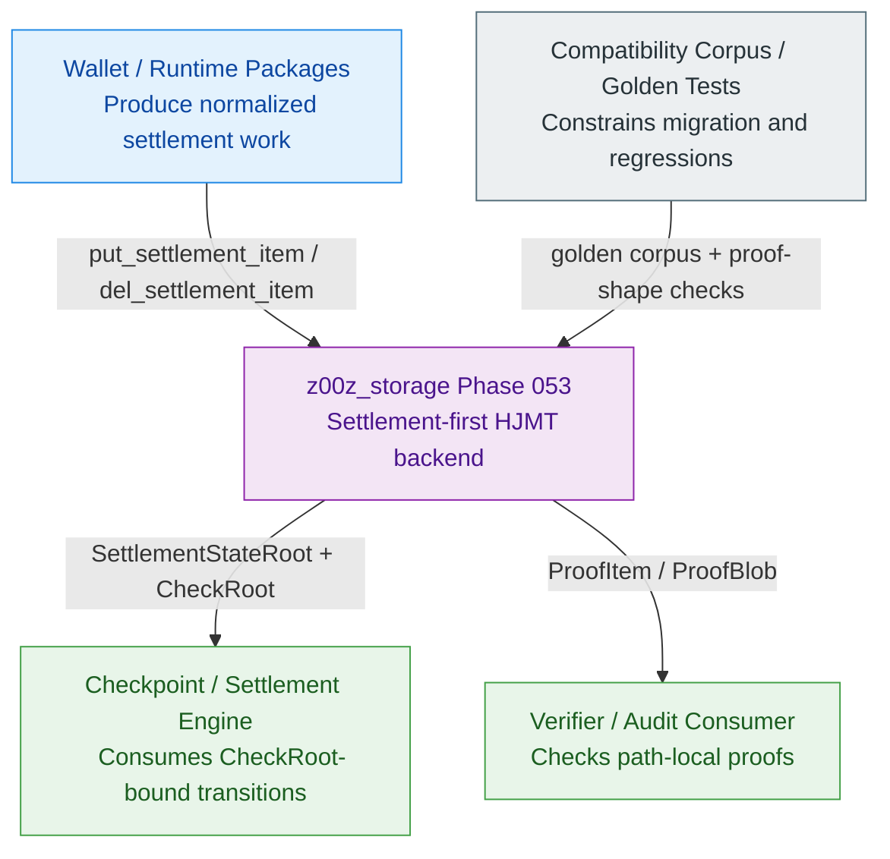

## 4. Recommended Storage Topology

The recommended topology is a **bucketed root-chained JMT forest**. It is root-chained because parent leaves commit child roots. It is bucketed because hot serial groups are split into fixed deterministic physical buckets. It is a forest because each semantic layer may contain many independent physical JMTs.

### 4.1 Topology Overview

```text
SettlementStateRoot
  = live generalized semantic root over DefinitionRootLeaf records
  = exported as the public storage root for Phase 053
  = implemented by a Definition JMT only when that JMT hash,
    domain separation, and leaf encoding are the canonical root contract

Definition JMT
  key   = definition_id
  value = DefinitionRootLeaf

DefinitionRootLeaf
  fields:
    definition_id
    definition_root = root of Serial JMT
    optional target metadata committed by a future definition policy

Serial JMT per definition_id
  key   = serial_id
  value = SerialRootLeaf

SerialRootLeaf
  fields:
    definition_id
    serial_id
    serial_root = root of Bucket JMT in this design
    optional target metadata committed by a future serial policy

Bucket JMT per (definition_id, serial_id)
  key   = bucket_id
  value = BucketRootLeaf

BucketRootLeaf
  fields:
    definition_id
    serial_id
    bucket_id
    asset_jmt_root
    bucket_policy_id

Asset JMT per (definition_id, serial_id, bucket_id)
  key   = terminal_id in the live generalized settlement generation
  value = SettlementLeaf carrying TerminalLeaf or RightLeaf

Path Index
  key   = terminal_id
  value = SettlementPath
  role  = internal lookup only
```

`DefinitionRootLeaf` and `SerialRootLeaf` already exist as current storage
concepts. This topology keeps their root-binding role and interprets their
child root as the next layer in the live forest. `BucketRootLeaf` and bucket
policy metadata are part of the live Phase 053 storage contract.

The most important naming consequence is that the live exported root is
`SettlementStateRoot`. That name is preferred over `RightsStateRoot` because
this root commits checkpointed settlement state only. It does not imply a
universal rights registry, a global application root, or a merger of unrelated
state domains such as membership, publication queues, or audit archives.

`leaf_count` should not be verifier-visible by default because a disclosed bucket proof would otherwise become an occupancy signal. If a future policy commits counts, the privacy review must treat them as public settlement metadata rather than local diagnostics.

**Table 4.1 - Historical baseline and live Phase 053 forest boundary.** The live forest extends the existing semantic model, but it must not blur archived proof/root behavior with the landed physical sharding contract.

| Concern | Historical baseline | Live Phase 053 forest backend | Boundary rule |
| --- | --- | --- | --- |
| Public root | `AssetStateRoot` named the historical compatibility projection. | `SettlementStateRoot` is the live semantic settlement-state commitment. | Do not expose a private backend root as `SettlementStateRoot`, and do not treat `AssetStateRoot` as a live alias or adapter. |
| Parent leaves | `DefinitionRootLeaf` and `SerialRootLeaf` already existed as typed concepts. | Their child roots are now committed through the live forest hierarchy. | Full asset-definition policy is not implicitly committed unless the root contract changes. |
| Bucket layer | No committed bucket layer existed before Phase 053. | Fixed buckets, `BucketRootLeaf`, and committed bucket policy metadata are live durable state. | Bucket identifiers stay verifier-recomputable and storage-owned. |
| Path index | `asset_id -> AssetPath` was the archived compatibility lookup plane. | `terminal_id -> SettlementPath` remains rebuildable from committed leaves. | It is not consensus-visible unless a future proof contract commits it. |
| Proof envelope | Compatibility `ProofBlob` binds semantic context plus historical backend proofs. | Live settlement proofs bind bucket-policy recomputation and terminal-family proofs. | Golden tests must distinguish archived compatibility proofs from live HJMT forest proofs. |
| Commit atomicity | Current persistence uses a single store transaction and in-memory rollback snapshots. | Add a durable HJMT forest commit journal across child and parent roots. | No parent root can be published before child-root digests are durable. |

**Figure 4.1 - Bucketed root-chained JMT forest.** The live public root is
`SettlementStateRoot`, while internal buckets provide physical parallelism for
high-volume settlement families.

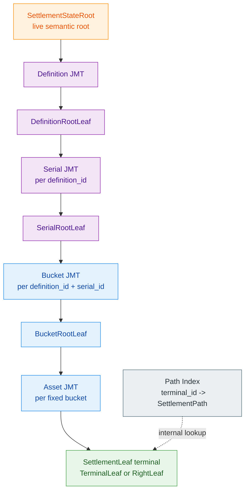

**Figure 4.2 - Live settlement component view.** The public facade hides
physical buckets and REDB row shape, while the HJMT engine owns planning,
forest mutation, proof segments, journal persistence, and cache refresh.

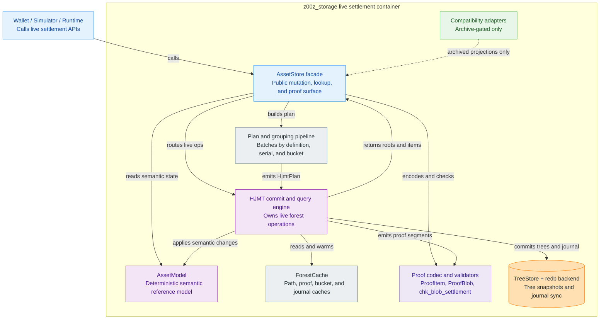

### 4.2 Public Contract

The public contract should stay narrow:

```text
put_settlement_item(item: StoreItem) -> SettlementStateRoot
del_settlement_item(path: SettlementPath) -> SettlementStateRoot
settlement_proof_blob(path: SettlementPath) -> ProofBlob
settlement_root() -> SettlementStateRoot
```

These names describe the live Phase 053 Rust signatures. The generalized
settlement generation exports `SettlementPath`, `SettlementStateRoot`, and
path-local proof surfaces directly; asset-centric names remain historical
migration references only.

**Table 4.2 - Current API surface and target backend boundary.** The forest should hide physical buckets while preserving the caller-facing path contract.

| Responsibility | Historical compatibility surface | Live backend responsibility |
| --- | --- | --- |
| Root query | `root()`, `check_root()`, and checkpoint-facing root APIs. | Return only the exported `SettlementStateRoot`. |
| Item lookup | `get_item`, `lookup`, `find_asset`, and internal path resolution. | Resolve `SettlementPath` without requiring caller-managed buckets. |
| Batch mutation | `apply_ops`, `StoreOp::Put`, `StoreOp::Delete`, `put_item`, and `del_item`. | Group by definition, serial, and derived bucket behind the API while publishing settlement-native surfaces. |
| Proof generation | `proof_item`, `proof_blob`, `proof_scan`, and `chk_blob`. | Produce the live path-local proof family with bucket-policy verification. |
| Internal lookup | Path index records support terminal-first flows. | Keep the index rebuildable and outside public root truth. |

Callers should not need to provide `bucket_id`. The bucket is derived deterministically from the path and bucket policy. This keeps the external API aligned with Z00Z's semantic model while giving the backend freedom to parallelize.

**Figure 4.3 - Live code contract view.** Public callers see generalized
settlement paths, roots, leaves, and proof envelopes. Compatibility-only
`AssetPath` and `AssetStateRoot` projections stay outside this live contract.

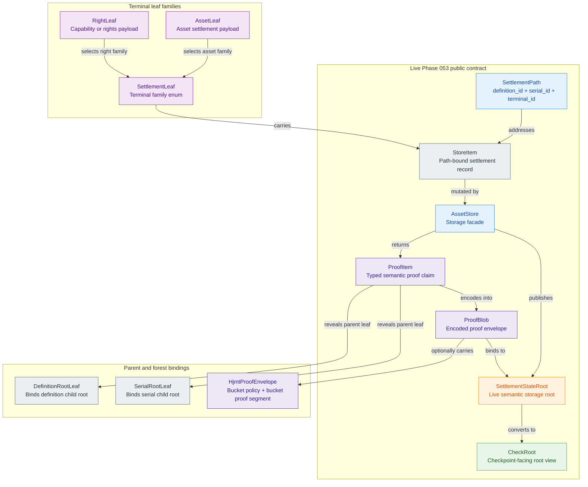

### 4.3 Fixed Bucket Derivation

Buckets should be deterministic and fixed in the first canonical design. Dynamic split and merge can be considered later, but it should not be part of the first root contract.

A safe derivation shape is:

```text
bucket_id = first N bits of H(
  "z00z.storage.asset.bucket.v1" ||
  definition_id ||
  serial_id ||
  asset_id ||
  bucket_policy_id
)
```

The bucket policy defines `N`, the hash domain, canonical byte encoding, and any versioned constraints. The policy must be committed in parent metadata so verifiers can recompute the bucket path. The first canonical implementation must freeze integer endian, `bucket_id` width, and the allowed `bucket_bits` range before the policy becomes root-visible.

**Table 4.3 - Fixed bucket policy fields.** The policy should be small, versioned, and verifier-visible.

| Field | Purpose |
| --- | --- |
| `bucket_policy_id` | Stable identifier for the policy version. |
| `bucket_bits` | Number of hash-prefix bits used to derive the bucket. |
| `bucket_hash_domain` | Domain-separated hash label for bucket derivation. |
| `canonical_encoding` | Byte encoding rule for `definition_id`, `serial_id`, `asset_id`, and policy fields. |
| `bucket_id_width` | Fixed serialized width for verifier recomputation and proof decoding. |
| `max_target_leaf_count` | Operational target used for monitoring, not consensus split. |
| `min_bucket_count` | Lower bound that prevents accidental single-bucket deployment for high-volume definitions. |
| `compatibility_generation` | Migration and proof-shape guard. |

### 4.4 Why Fixed Buckets Instead Of Adaptive Buckets

Adaptive buckets can be faster under extreme skew, but they introduce split and merge lifecycle risk. A dynamic bucket system must prove when a bucket split happened, migrate leaves, update parent roots, preserve historical proofs, and avoid privacy leaks from split timing.

Fixed buckets avoid that risk. They are easier to verify, easier to replay, easier to benchmark, and easier to recover after a crash. They may create empty buckets, but empty buckets are cheaper than unsafe migration complexity.

The design therefore chooses this tradeoff:

```text
Take:
  deterministic hot-bucket parallelism
  stable proof paths
  verifier-visible bucket policy
  low migration complexity

Avoid in the first design:
  split proofs
  merge proofs
  moving leaves between buckets
  dynamic shard lifecycle governance
```

## 5. Proof And Root Model

The proof model must let verifiers check one `SettlementPath` without
understanding backend internals as separate application state. The proof
envelope should expose the semantic chain and include the derived fixed bucket
path. The same chain stays valid for both `AssetLeaf` and `RightLeaf`
terminal objects: only the terminal payload family changes, not the
parent-root logic.

### 5.1 Settlement Proof Shape

A complete live forest inclusion proof is carried by `ProofBlob`, with the
typed semantic claim in `ProofItem` and the bucket segment in the optional
`forest` sub-envelope. The live proof contains:

1. the public `SettlementStateRoot` in `ProofItem`;
2. the `SettlementPath` in `ProofItem`;
3. the committed `DefinitionRootLeaf` and `SerialRootLeaf` plus their proof bytes;
4. the terminal `SettlementLeaf` plus `asset_leaf_hash` and terminal proof bytes;
5. the proof-local `backend_root` plus `root_bind` fields used to bind
    diagnostic branch verification to the semantic root;
6. when the forest segment is present, the journal binding fields
    `journal_checkpoint`, `journal_digest`, and `checkpoint_bind`;
7. when the forest segment is present, the default-commitment guard fields,
    committed `bucket_policy`, `BucketRootLeaf`, and `bucket_proof` bytes.

```text
ProofBlob {
  item = ProofItem {
    settlement_state_root,
    path,
    definition_root_leaf,
    serial_root_leaf,
    terminal_leaf,
  },
  asset_leaf_hash,
  backend_root,
  root_bind_ver,
  root_bind,
  definition_proof,
  serial_proof,
  asset_proof,
  forest = Some(HjmtProofEnvelope {
    journal_checkpoint,
    journal_digest,
    checkpoint_bind,
    default_commitment_version,
    default_commitment,
    default_child_commitment,
    bucket_policy,
    bucket_root_leaf,
    bucket_proof,
  }),
}
```

**Figure 5.1 - Verifier walk across one live `ProofBlob` with a forest sub-envelope.** The proof is
not a lone root scalar. The verifier opens a chained witness from the public
semantic root through definition, serial, bucket, and terminal-leaf proof
segments until the claimed terminal leaf is accepted under the disclosed
`SettlementPath`.

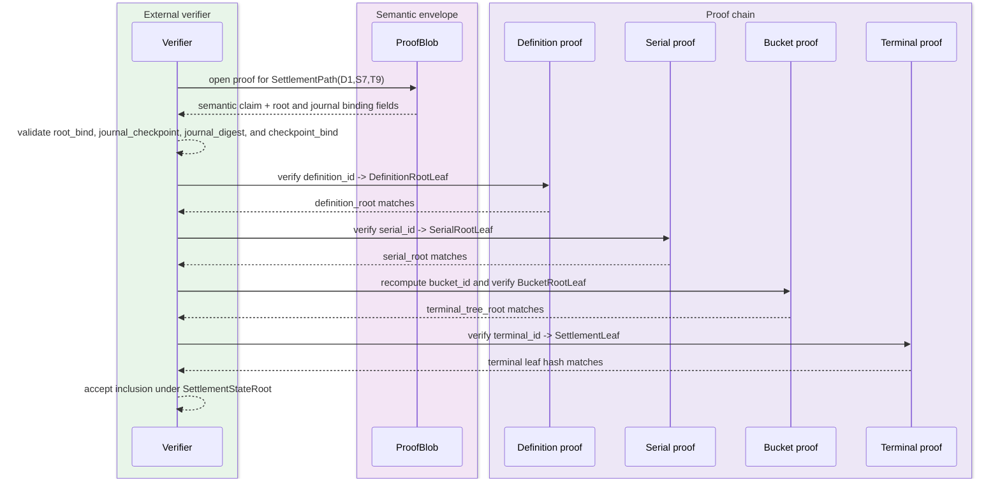

#### 🔍 How To Picture One Inclusion Proof

An HJMT inclusion proof is **not** a lone root scalar. The root is only the
short public commitment. The proof is the witness package that lets a verifier
walk from that root down to one concrete terminal leaf at one concrete
canonical path.

This means the mental model is closer to a **stack of Merkle-style branch
proofs** than to a single Verkle opening:

- In a JMT-style design, parent commitments are hash-based tree roots and the
  witness is made of branch-proof segments for each hop that must be opened.
- In a Verkle-style design, the parent commitment is a vector commitment and
  the witness is a vector-opening proof for the requested child position.

So the answer to "is HJMT proof a vector like a Verkle tree, or a root scalar"
is:

- it is **not** just a root scalar;
- it is **not** a Verkle vector-opening proof either;
- it is a **root plus path-local witness envelope** built from JMT branch
  proofs.

The archived compatibility implementation already followed that shape before
Phase 053 landed the bucket layer. The compatibility witness payload is
`ProofBlob`, which carries:

- the semantic root as `AssetStateRoot`;
- the claimed canonical `AssetPath`;
- the committed parent leaves `DefinitionRootLeaf` and `SerialRootLeaf`;
- the terminal `AssetLeaf`;
- the physical `backend_root` used to verify backend JMT branches;
- a semantic-to-physical binding `root_bind = H(AssetStateRoot ||
  backend_root)`;
- three opaque branch-proof segments:
  `definition_proof`, `serial_proof`, and `asset_proof`.

For one concrete asset path such as:

```text
definition_id = D1
serial_id     = S7
asset_id      = A9
```

the verifier should picture the current compatibility proof as:

```text
AssetStateRoot = R_sem
backend_root   = R_phy

ProofBlob {
  item = ProofItem {
    asset_state_root     = R_sem,
    path                 = (D1, S7, A9),
    definition_root_leaf = (D1, r_def),
    serial_root_leaf     = (D1, S7, r_ser),
    leaf                 = AssetLeaf(A9, ...),
  },
  root_bind        = H(R_sem || R_phy),
  definition_proof = pi_def,
  serial_proof     = pi_ser,
  asset_proof      = pi_asset,
}
```

Verification then means:

1. confirm the semantic claim: the disclosed path, parent leaves, and terminal
   leaf all match each other;
2. confirm the disclosed `AssetLeaf` hashes to the expected terminal leaf hash;
3. confirm `root_bind` really binds the public semantic root to the private
   backend proof root;
4. verify each JMT branch segment against the namespaced backend tree:
   definition branch, serial branch, and terminal asset branch.

In other words, the root alone says "this whole state exists." The proof
envelope says "this exact asset at this exact path exists under that root."

The live HJMT proof keeps the same idea but inserts one more physical layer:

```text
SettlementStateRoot
  -> definition proof
  -> DefinitionRootLeaf.definition_root
  -> serial proof
  -> SerialRootLeaf.serial_root
  -> bucket proof
  -> BucketRootLeaf.asset_jmt_root
  -> terminal proof
  -> SettlementLeaf
```

That is why the target proof is still best understood as a **chain of explicit
branch openings**, not as a single compact vector-commitment witness.

This is the live Phase 053 proof shape. The archived compatibility implementation already binds semantic context to backend JMT branch proofs, but it has no committed bucket layer. The migration delta that Phase 053 closed was the bucket-policy recomputation, `BucketRootLeaf`, and bucket proof segment.

#### 5.1.1 Current Compatibility Envelope vs Live HJMT Envelope

There are two different size questions, and they should not be mixed:

1. the raw semantic bit budget of the disclosed proof fields;
2. the encoded witness size after serializing opaque branch proofs.

The first is stable and can be reasoned about from the model. The second is
variable today because each branch proof is a serialized JMT proof whose byte
length depends on sibling-vector content, empty vs non-empty siblings, and
codec overhead for dynamic vectors.

The current compatibility envelope is:

```text
ProofBlob {
  item: ProofItem {
    asset_state_root,
    path,
    definition_root_leaf,
    serial_root_leaf,
    leaf,
  },
  asset_leaf_hash,
  backend_root,
  root_bind_ver,
  root_bind,
  definition_proof,
  serial_proof,
  asset_proof,
}
```

For the archived asset-centric compatibility envelope, the raw field widths are:

| Field | Raw size |
| --- | --- |
| `AssetStateRoot` | 256 bits |
| `AssetPath` | 544 bits = `definition_id[256] + serial_id[32] + asset_id[256]` |
| `DefinitionRootLeaf` | 512 bits |
| `SerialRootLeaf` | 544 bits |
| `AssetLeaf` | `1784 + 8R` bits, where `R = range_proof` byte length |
| `asset_leaf_hash` | 256 bits |
| `backend_root` | 256 bits |
| `root_bind_ver` | 8 bits |
| `root_bind` | 256 bits |

So the current fixed-width semantic budget, with serialized branch payloads
appended as opaque byte arrays, is:

```text
CurrentHybridBits
  = 4416
  + 8R
  + 8(P_def + P_ser + P_asset)
```

Where:

- `R` is the terminal `range_proof` length in bytes;
- `P_def`, `P_ser`, and `P_asset` are the serialized byte lengths of the three
  current JMT branch proofs.

For the small live test fixture where `range_proof.len() = 4`, the fixed-width
semantic shell before branch-proof bytes is:

```text
4448 bits
```

That number already includes the disclosed semantic root, path, parent leaves,
terminal leaf, terminal leaf hash, backend root, and semantic/backend binding.
It does not include the three opaque branch-proof payloads, and it should not be
treated as the exact `BincodeCodec` wire size.

For the same one-leaf fixture, the measured current `BincodeCodec` encoding is:

```text
definition_proof = 196 bytes
serial_proof     = 197 bytes
asset_proof      = 196 bytes
ProofItem        = 451 bytes
AssetLeaf        = 225 bytes
ProofBlob        = 1140 bytes = 9120 bits
```

The measured encoded shell is smaller than the fixed-width semantic shell in
that fixture because `BincodeCodec` uses bincode's standard variable integer
encoding for small integers while still adding length prefixes for dynamic
vectors. The fixed-width budget is therefore the clearer design budget; the
encoded byte count must be measured for each concrete codec and workload.

The live proof surface above is the landed wire contract. For sizing, the
document also uses a planning shorthand for a future shared-parent aggregate
that would compress repeated parent context across many proofs:

```text
SharedParentHjmtEnvelope {
  settlement_state_root,
  path,
  bucket_policy,
  definition_root_leaf,
  definition_proof,
  serial_root_leaf,
  serial_proof,
  bucket_root_leaf,
  bucket_proof,
  terminal_leaf,
  terminal_leaf_proof,
}
```

If the terminal generation still uses `AssetLeaf`, the planning fixed-width
semantic budget for that shared-parent aggregate, with serialized branch payloads appended as opaque byte
arrays, is:

```text
SharedParentHjmtBits
  = 3640
  + 8R
  + B_policy
  + B_bucket_leaf
  + 8(P_def' + P_ser' + P_bucket + P_term)
```

Where:

- `B_policy` is the serialized bit size of the committed bucket policy fields;
- `B_bucket_leaf` is the serialized bit size of `BucketRootLeaf`;
- `P_def'`, `P_ser'`, `P_bucket`, and `P_term` are the serialized byte lengths
  of the four live forest branch proofs.

The exact live total is still workload-dependent, but the wire contracts are
already frozen in code:

- the canonical width and encoding of `BucketRootLeaf` are live struct widths;
- the proof-visible encoding of `bucket_policy` is a live verifier contract.

So the honest comparison is:

- current compatibility proof carries one extra compatibility shell:
  `backend_root + root_bind_ver + root_bind`;
- current compatibility proof also exposes a standalone `asset_leaf_hash`;
- live HJMT currently keeps that binding shell so storage-owned verifiers can
  bind diagnostic backend roots to the public semantic root;
- live HJMT adds committed bucket-policy bytes, one `BucketRootLeaf`, and one
  extra branch-proof segment.

This means the dominant likely proof-size growth is not the public root itself.
The main delta is the extra bucket layer and its proof segment. Whether the
final encoded witness grows slightly or materially depends on measured branch
proof sizes and real workloads, not on unresolved wire-shape questions.

#### ⚖️ Transaction-Scale Proof Size Example

The following example is an order-of-magnitude planning estimate, not a
consensus parameter. It uses the current synthetic storage fixture where each
terminal `range_proof` is four bytes. Production asset leaves scale with the
actual terminal proof bytes carried in `AssetLeaf`.

Assume one transaction consumes four asset leaves and creates three asset
leaves. Fee handling is treated as a balance delta inside those leaves unless a
separate fee-paying asset input is explicitly disclosed.

For the current compatibility implementation, inclusion evidence is seven
independent `ProofBlob` values:

```text
4 input inclusion proofs  = 5,636 bytes
3 output inclusion proofs = 4,087 bytes
total 7 asset proofs      = 9,723 bytes = 77,784 bits
```

If fee payment is represented by one additional fee-asset input, add roughly:

```text
1,350-1,500 bytes
```

So the same transaction with a separately disclosed fee input is approximately:

```text
11.1 KB
```

For future shared-parent aggregation over live HJMT proofs, the envelope may be
smaller when the seven assets share parent context such as definition, serial,
or bucket paths:

```text
HJMT optimized, shared parent context: 5-6 KB
HJMT unshared or worst-ish envelope:  10-12 KB
```

The planning shorthand therefore suggests:

```text
current compatibility proofs: ~9.7 KB
shared-parent HJMT estimate:  ~5.5 KB
illustrative improvement:     ~40-45% smaller
```

This comparison is useful but not perfectly apples-to-apples across chains.
Bitcoin usually proves transaction inclusion in a block Merkle tree, not asset
state inclusion. Ethereum can prove transaction or receipt inclusion, but asset
state inclusion normally means account and storage trie proofs. Sui object
proofs are closer to Z00Z's asset-leaf model, while NEAR light-client proofs
focus on transaction execution and outcome paths.

**Table 5.1 - Rough inclusion-proof order of magnitude.**

| System / proof family | Typical proof size | How to read it |
| --- | ---: | --- |
| Bitcoin transaction inclusion | `0.45-0.55 KB` | Much smaller, but it proves one txid in a block, not per-asset state. |
| Ethereum transaction or receipt inclusion | `0.8-2 KB` | Smaller, but it is not a multi-asset state proof. |
| Ethereum asset-style state proof for seven storage leaves | `25-70 KB` | Usually larger than Z00Z because account and storage trie proofs are heavy. |
| Sui seven object Merkle paths | `2.5-4.5 KB` | Closer model; often smaller because it is object-path evidence without Z00Z's confidential asset envelope. |
| NEAR transaction execution proof | `1.5-5 KB` | Not the same object model; useful as a light-client outcome-proof reference. |
| Z00Z current compatibility proof for four inputs and three outputs | `~9.7 KB` | Measured from current `ProofBlob` encoding on the small fixture. |
| Z00Z shared-parent HJMT planning estimate for four inputs and three outputs | `~5-6 KB` | Planning shorthand for a future aggregate that shares parent context and removes compatibility binding overhead. |

The conclusion is intentionally mixed:

- Z00Z is much larger than Bitcoin-style tx inclusion because it proves
  confidential asset-state membership, not just that a transaction hash is in a
  block.
- Z00Z is larger than simple Sui object paths because Z00Z carries more
  terminal confidential-asset context.
- Z00Z should be materially smaller than Ethereum asset-state proofs when the
  comparison is seven asset-like leaves rather than one transaction receipt.
- HJMT is mainly worthwhile because it improves batched proof sharing,
  parallelism, hot-serial behavior, and recovery. A single isolated leaf proof
  may not always shrink, but a transaction-scale proof with shared parent
  context should.

Format references for this comparison:

- Ethereum Merkle Patricia Trie and `eth_getProof`:
  <https://ethereum.org/developers/docs/data-structures-and-encoding/patricia-merkle-trie/>
  and <https://eips.ethereum.org/EIPS/eip-1186>
- Bitcoin partial Merkle block format:
  <https://developer.bitcoin.org/reference/p2p_networking.html#merkleblock>
- Sui `MerkleProof` path shape:
  <https://mystenlabs.github.io/sui-rust-sdk/sui_rpc/proto/sui/rpc/v2alpha/struct.MerkleProof.html>
- NEAR light-client proof shape:
  <https://docs.near.org/api-reference/light-client-proof>

If the terminal family later widens beyond `AssetLeaf`, the proof contract
should either canonicalize that family inside the terminal leaf encoding or
bind an explicit terminal-leaf kind. Otherwise a verifier cannot distinguish a
cash-like asset leaf from a capability, mandate, or claim-oriented
`RightLeaf`. That family marker should still remain separate from fee
semantics; processing support belongs to `FeeEnvelope` or an equivalent
fee-credit contract, not to an overloaded leaf-kind field.

**Figure 5.2 - Dynamic proof verification sequence.** A verifier requests one
path-local `ProofBlob`, checks semantic and journal/root binding fields, walks
the parent proof chain, and rejects any proof that relies on the path index as
truth.

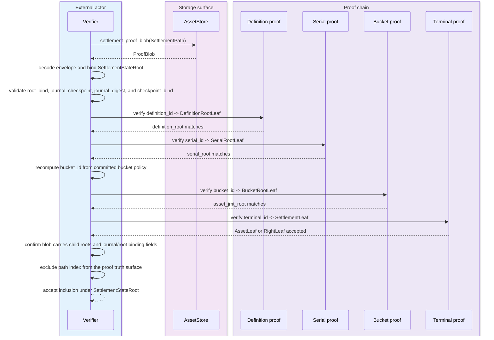

**Table 5.1 - Live forest branch verification roots and semantic bindings.** The live forest keeps branch verification anchored to the committed local parent for each segment, while the proof envelope separately binds the diagnostic `backend_root` to the public `SettlementStateRoot`.

| Segment | Live forest key and value | Branch verification root | Semantic binding |
| --- | --- | --- | --- |
| Definition proof | `definition_id -> DefinitionRootLeaf` | Private `backend_root`. | The envelope binds `backend_root` to `SettlementStateRoot` through `root_bind`. |
| Serial proof | `serial_id -> SerialRootLeaf` | `DefinitionRootLeaf.definition_root`. | The definition proof binds this parent leaf before the serial branch is checked. |
| Bucket proof | `bucket_id -> BucketRootLeaf` | `SerialRootLeaf.serial_root`. | The serial proof binds this parent leaf before the bucket branch is checked. |
| Terminal proof | `terminal_id -> SettlementLeaf`, carrying `TerminalLeaf` or `RightLeaf` payloads as appropriate | `BucketRootLeaf.asset_jmt_root`. | The bucket proof binds this parent leaf before the terminal branch is checked. |
| Root binding | `SettlementStateRoot` plus diagnostic backend root | Explicit `root_bind` check. | This is the only semantic-root binding step; branch proofs stay rooted in their committed local parents. |

### 5.2 Root Taxonomy

The design has several roots with different visibility and safety properties. Keeping them named prevents a physical backend root from becoming a silent public contract.

**Table 5.2 - Root taxonomy and publication rules.**

| Root or root-like value | Layer | Visibility | Role | Safety rule |
| --- | --- | --- | --- | --- |
| `AssetStateRoot` | Archived compatibility evidence | Archive-gated or diagnostic only | Historical equivalence root for migration and corpus checks. | Must not replace `SettlementStateRoot` in live APIs. |
| `SettlementStateRoot` | Semantic state, live generalized settlement generation | Public | Canonical settlement-state commitment over checkpointed terminal leaves. | Use this storage-family root as the public settlement commitment, not as a universal protocol root. |
| `CheckRoot` | Checkpoint evidence | Public when checkpoint evidence is disclosed. | Binds checkpoint artifacts to state transitions. | Must bind to the intended prior and next `SettlementStateRoot`. |
| `backend_root` | Physical implementation | Proof payload or diagnostic only. | Verifies compatibility branches and the definition-level live forest branch inside the proof envelope. | Must never replace `SettlementStateRoot` in public APIs. |
| `DefinitionRootLeaf.definition_root` | Semantic child root | Public inside disclosed proofs. | Commits serial-level state for one definition. | Must include definition identity in the parent proof path. |
| `SerialRootLeaf.serial_root` | Semantic child root | Public inside disclosed proofs. | Commits bucket-level state in the live HJMT forest backend. | Must include serial identity and bucket policy generation. |
| `BucketRootLeaf.asset_jmt_root` | Physical child root | Public inside live HJMT forest proofs. | Commits terminal settlement leaves for one fixed bucket. | Must be recomputable from the committed bucket policy and path. |
| Path index root, if any | Internal lookup | Private unless a future protocol commits it. | Accelerates `terminal_id -> SettlementPath` resolution. | Must remain rebuildable and non-authoritative by default. |

### 5.3 Inclusion, Deletion, And Non-Existence

The live Phase 053 contract ships three proof families:

| Proof family | Meaning |
| --- | --- |
| Inclusion proof | The terminal settlement leaf exists at `definition_id / serial_id / bucket_id / terminal_id`. |
| Deletion proof | A checkpoint transition removed the leaf and updated all parent roots. |
| Non-existence proof | The settlement path is absent under the derived bucket at a specific root. |

Deletion is not a separate tombstone by default. A delete operation removes the
terminal committed leaf, updates the bucket root, updates the serial root,
updates the definition root, and then updates `SettlementStateRoot` in the live
generation. Optional tombstones may be introduced for audit or historical proof
lanes, but they should not be required for the base live-state root.

The live Phase 053 proof contract covers inclusion, deletion, and
non-existence proof envelopes under `SettlementStateRoot`. These proof
families are storage-owned verifier-validating objects and must bind proof
family, leaf family, journal checkpoint, and absence commitments through the
live verifier surface rather than through node-local lookup results.

The first non-existence proof target should be a root-bound empty-slot opening rather than a live-node query. For a queried payload, the prover recomputes the byte-aligned path, proves membership of the ancestry path up to the relevant parent, and then opens the selected child or terminal value to the canonical default commitment for that level. Verification must bind the opening to the exact root, path index, default constant, and versioned transcript. A plain `not found` response from a node is not a proof.

The initial leaf mode should stay direct and conservative. Terminal absence is proven by opening the terminal vector slot to `DEFAULT_VALUE_COMMITMENT`; internal absence is proven by opening the parent vector slot to `DEFAULT_CHILD_COMMITMENT`. Bucket-neighbor proofs can remain a later optimization. This keeps the first non-membership lane close to inclusion proof cost and avoids importing range-style bucket complexity before the direct-value path is sound.

Non-membership proofs also need first-class reporting. The benchmark and e2e surfaces should record prove time, verify time, serialized proof size, and aggregation throughput for representative absent keys. Golden tests must include empty-tree absence, random absent-key proofs after insertions, tampered default values, tampered indexes, present-key rejection, replay consistency, and mixed membership plus non-membership aggregation at the same parent commitment.

### 5.4 Path Index Boundary

The path index is operationally important because wallets, scanners, and import flows often know `terminal_id` before they know the full settlement path. However, it must not become a second public source of truth.

The safe rule is:

```text
PathIndex(terminal_id -> SettlementPath) is an internal lookup cache.
SettlementStateRoot is the live semantic export.
AssetStateRoot is archived compatibility evidence only.
```

If a future protocol version wants the path index to become public evidence, it should do so explicitly with a new proof contract. Until then, path-index correctness is a backend invariant and migration aid, not consensus semantics.

During a live HJMT mutation batch, path-index rows may still be refreshed in the same logical version as the bucketed forest update. That auxiliary write does not change the semantic publication order: `SettlementStateRoot` remains the only live exported root, and the proof envelope stays defined by the semantic and bucket-bound chain in Section 5 rather than by a post-commit path-index witness.

## 6. Insert And Delete Performance Model

The design optimizes for mass insert/delete by turning independent subtrees into independent physical commits. The performance benefit depends on workload shape.

### 6.1 Insert Flow

A bulk insert batch is processed as follows:

1. Validate every live `SettlementPath` and terminal settlement leaf.
2. Group operations by `definition_id`.
3. Inside each definition, group by `serial_id`.
4. Inside each serial, derive `bucket_id` for each terminal path.
5. Create a durable `Prepared` journal entry with the previous root, touched
    child set, and precomputed child and parent digests.
6. Commit each touched asset bucket JMT in parallel.
7. Update touched bucket leaves in the serial bucket JMT.
8. Update touched serial leaves in the definition serial JMT.
9. Update touched definition leaves in the top-level definition JMT.
10. Advance the journal through `ChildrenCommitted` and `ParentsCommitted` as
    child and parent rows become durable.
11. Publish the resulting root as `SettlementStateRoot` only after the journal
    reaches `RootPublished`.

**Figure 6.1 - Bulk insert execution.** The bottom layer is the main parallel surface; parent roots are updated deterministically after child roots are available.

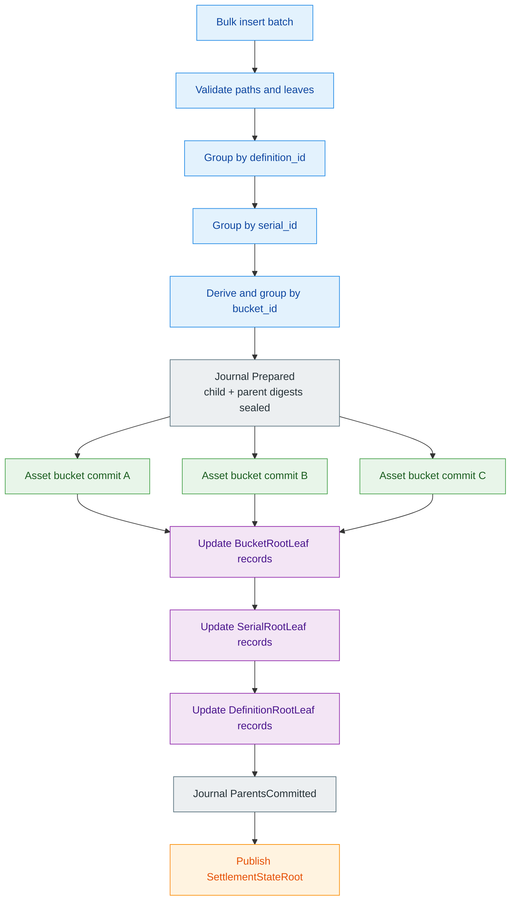

### 6.2 Delete Flow

A bulk delete batch follows the same path in reverse:

1. Resolve or validate full `SettlementPath` for each terminal leaf.
2. Derive the same fixed `bucket_id` used at insertion time.
3. Create a durable `Prepared` journal entry with the previous root, touched
    child set, and precomputed child and parent digests.
4. Delete terminal leaves from touched asset bucket JMTs in parallel.
5. Recompute or update each touched bucket root.
6. Remove empty bucket leaves only if the bucket policy allows sparse parent leaves.
7. Remove empty serial leaves only when all buckets under the serial are empty.
8. Remove empty definition leaves only when all serials under the definition are empty.
9. Advance the journal through `ChildrenCommitted` and `ParentsCommitted` as
    child and parent rows become durable.
10. Publish the resulting `SettlementStateRoot` only after the journal reaches
    `RootPublished`.

**Figure 6.2 - Bulk delete execution.** Deletes are fast when the batch touches many independent buckets, but parent pruning remains deterministic and serialized by semantic dependency.

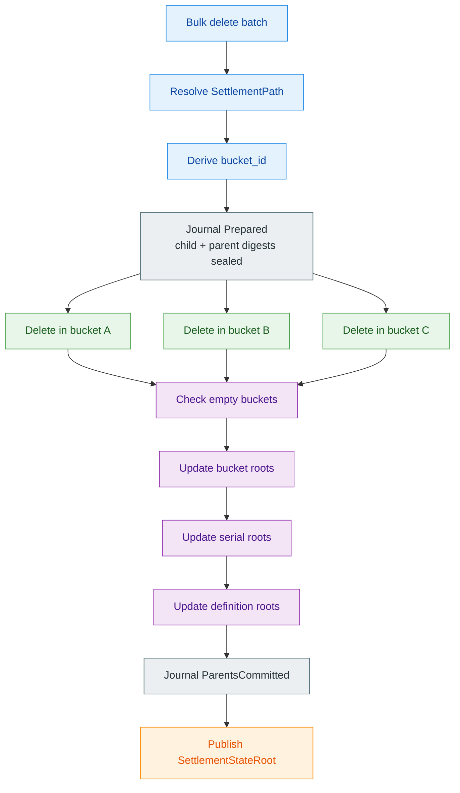

**Figure 6.3 - Dynamic mutation sequence.** Batch mutation flows through the
public facade, planner, live HJMT engine, durable journal, REDB-backed tree
store, and cache refresh boundary before the semantic root is returned.

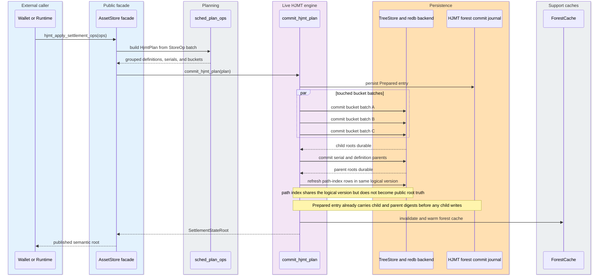

### 6.3 Expected Performance By Workload

| Workload shape | Expected behavior |
| --- | --- |
| Many definitions | Strong parallelism across definition-owned serial forests. |
| One hot definition, many serials | Strong parallelism across serial JMTs. |
| One hot serial, many assets | Strong parallelism across fixed buckets. |
| One hot bucket | Similar to one JMT for that bucket; monitoring may require a wider bucket policy in future generations. |
| Many short-lived machine rights | Strong insert/delete throughput if rights distribute across buckets, whether they remain asset-shaped today or later widen into `RightLeaf`-style terminal records. |
| Many selective proofs | Parallel proof generation across buckets and serials. |
| Sparse ordinary wallet traffic | Slightly more proof overhead, but manageable with facade APIs and caching. |

The critical performance point is that the live physical forest removes the single physical JMT commit wall for bulk settlement changes. This does not claim every operation becomes fully parallel, and it does not describe the current compatibility backend as already having that property. Parent root updates remain dependency-ordered, but they are much smaller than the leaf-heavy bucket commits.

### 6.4 Score Target

The design is intended to maximize all practical criteria without hiding tradeoffs.

| Criterion | Target score | Rationale |
| --- | ---: | --- |
| Z00Z logic fit | 5 | Mirrors asset family, serial group, and terminal asset semantics. |
| Bulk insert/delete performance | 5 | Parallelizes across definitions, serials, and fixed buckets. |
| Public architecture clarity | 5 | Keeps `SettlementStateRoot`, `SettlementPath`, and settlement-family leaf vocabulary as the live public contract while preserving asset-centric terms as archived compatibility notes only. |
| Caller ease of use | 5 | Callers provide normal paths; buckets are internal derivations. |
| Implementation risk | 4 | Multi-tree atomic commit is real complexity, but fixed buckets avoid split/merge risk. |
| Maintenance risk | 4 | More complex than one tree, but simpler than adaptive sharding. |

A literal score of 5 for implementation and maintenance would require one simple physical tree, which would sacrifice performance. This design instead aims for the best reachable point: maximum public simplicity and performance while keeping the implementation risk bounded by avoiding dynamic bucket lifecycle machinery.

## 7. Atomicity, Recovery, And Risk Control

A multi-tree forest is only acceptable if updates are atomic from the perspective of exported roots. The storage backend must never expose a parent root that points to child roots that were not committed durably.

### 7.1 Forest Commit Journal

Every forest update should be recorded through a journal:

```text
HjmtCommitJournalEntry {
  version,
  previous_semantic_state_root,
  next_semantic_state_root,
  touched_definitions,
  touched_serials,
  touched_buckets,
  child_commit_digest,
  parent_commit_digest,
  status,
}
```

The status lifecycle should be:

```text
Prepared -> ChildrenCommitted -> ParentsCommitted -> RootPublished
```

On recovery, the backend must converge to the last safe published root or fail
closed based on journal status. `Prepared` and `ChildrenCommitted` entries are
validated and rolled back. `ParentsCommitted` may publish the pending root only
when child and parent digests match the journal. `RootPublished` without active
metadata is a hard error. Recovery must never publish a repaired-looking root.
In the live generation that semantic root is `SettlementStateRoot`; archived
`AssetStateRoot` material remains migration evidence only.

**Figure 7.1 - Crash-safe forest commit lifecycle.** Parent roots are published
only after all required child roots and journal digests are durable. Recovery
rolls back prepared and child-only states, promotes parent-committed states, and
fails closed when root-published journal state is missing active metadata.

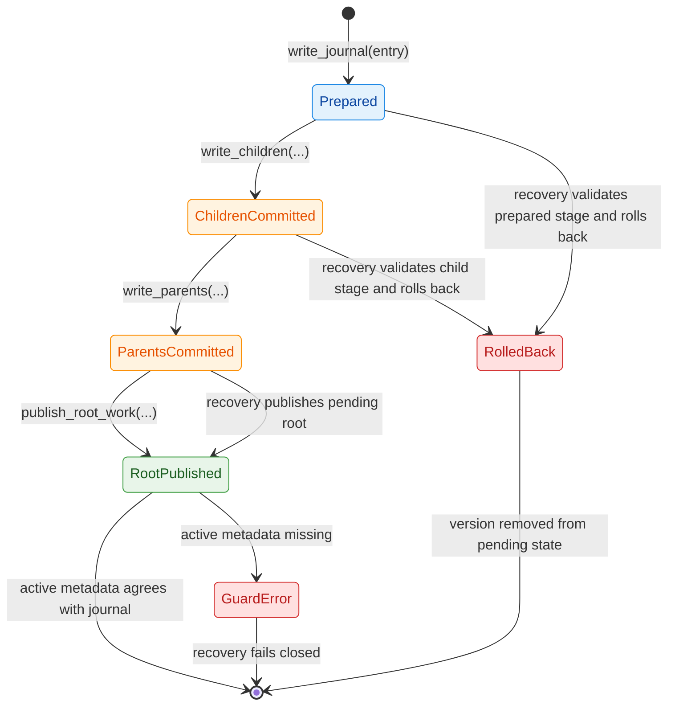

### 7.2 Backend Interface Boundary

The forest should live behind an explicit trait so the rest of the protocol does not become coupled to one physical implementation.

```rust
pub trait SettlementTreeBackend {
  fn settlement_root(&self) -> Result<SettlementStateRoot, AssetStoreError>;
  fn get_settlement_item(
    &self,
    path: &SettlementPath,
  ) -> Result<Option<StoreItem>, AssetStoreError>;
  fn put_settlement_item(
    &mut self,
    item: StoreItem,
  ) -> Result<SettlementStateRoot, AssetStoreError>;
  fn del_settlement_item(
    &mut self,
    path: &SettlementPath,
  ) -> Result<SettlementStateRoot, AssetStoreError>;
  fn settlement_proof_blob(
    &self,
    path: &SettlementPath,
  ) -> Result<ProofBlob, AssetStoreError>;
}
```

The exact Rust signature may differ, but the boundary should preserve these responsibilities: semantic root, item lookup, settlement mutation, and proof generation.
This live Phase 053 boundary already carries generalized settlement families
without changing the semantic hierarchy, journal discipline, or proof-chain
shape.

Production signatures will likely need explicit version or root selection for historical proof verification. The sketch intentionally shows the boundary responsibilities, not the final API surface.

### 7.3 Main Implementation Risks

| Risk | Mitigation |
| --- | --- |
| Multi-tree commit inconsistency | Forest commit journal with child and parent digests. |
| Proof envelope drift | Golden tests comparing compatibility backend and forest backend. |
| Bucket policy mistakes | Fixed versioned policy, committed metadata, and verifier recomputation. |
| Hot bucket remains too hot | Benchmark-driven policy generation before public performance claims. |
| Path index diverges | Treat path index as rebuildable from committed leaves; never as public root truth. |
| Parent pruning bugs | Property tests for empty bucket, empty serial, and empty definition cleanup. |
| Root confusion | Keep `SettlementStateRoot` semantic; keep backend roots private or diagnostic. |

Phase 051 recorded the HJMT forest commit journal and crash-safe recovery model as
future work. Phase 053 lands durable child-before-parent forest publication,
journal replay, and the forest-only live rollout. Compatibility artifacts do
not remain a live reference path.

## 8. Privacy, Semantics, And Public Evidence

The forest layout must improve execution without leaking more than the existing settlement model requires.

### 8.1 Public Visibility

The public verifier may learn that a path belongs to a definition and serial class when a proof is disclosed. That is already part of the semantic path model. The bucket layer should not add business meaning. It is a deterministic physical shard, not a new asset category.

The design should avoid publishing per-bucket activity counters except when they are already implied by public proof or settlement artifacts. Operational metrics can exist locally, but they should not become a public activity feed by default.

Disclosing `bucket_id` and bucket policy can still reveal deterministic partition information. That is weaker than exposing business semantics, but it can leak scale or activity patterns if bucket counts, committed counts, or policy changes are observable. Bucket policy changes therefore require the same privacy review as proof-shape changes.

### 8.2 Selective Disclosure

The proof envelope can support selective disclosure because it is path-local. A wallet, auditor, issuer, bridge, or service provider can receive proof for a narrow settlement path without learning unrelated buckets, serials, definitions, or wallet inventory.

This fits the broader Z00Z corpus:

- external asset rights can prove membership under the relevant asset family;
- machine capabilities can prove one bounded resource right;
- agent envelopes can prove one task-scoped budget right;
- liability cases can target one domain or right family;
- organizational audits can reveal narrow settlement evidence.

### 8.3 Checkpoint Evidence

Checkpoint evidence should bind the prior `SettlementStateRoot`, the batch of
consumed paths, the batch of created leaves, and the resulting
`SettlementStateRoot`. The internal forest may produce additional debug roots,
but the checkpoint-facing root remains the semantic root. Archived
`AssetStateRoot` evidence follows the same checkpoint rule only inside
compatibility corpora.

A clean checkpoint transition can be summarized as:

```text
Checkpoint transition proves in the live settlement generation:
  prior SettlementStateRoot
  + consumed canonical path set
  + created canonical path / terminal leaf set
  + valid proofs or witnesses
  + forest update rules
  = next SettlementStateRoot
```

## 9. Rollout Strategy

This rollout record captures how the repository moved toward the high-performance design and where Phase 053 closed the live cutover.

### 9.1 Rollout Phases

| Historical phase | Goal | Success gate |
| --- | --- | --- |
| Phase 1 | Define backend trait and proof envelope | Existing tests pass through compatibility backend. |
| Phase 2 | Add fixed bucket derivation and policy types | Deterministic bucket tests and verifier recomputation tests pass. |
| Phase 3 | Implement physical forest for asset buckets | Bulk insert/delete benchmarks show leaf-level parallelism. |
| Phase 4 | Add serial and definition parent commits | Parent-root golden tests match semantic reference model. |
| Phase 5 | Add commit journal and recovery tests | Crash/recovery tests prove fail-closed behavior. |
| Phase 6 | Run dual-backend equivalence mode | Compatibility and forest roots match for generated workloads. |
| Phase 7 | Enable forest backend behind configuration | Production-facing APIs remain unchanged. |

Repository status after Phase 051 mapped to Phase 1 of this rollout: the
facade, compatibility backend, root taxonomy, proof-envelope boundary,
downstream guardrails, and compatibility corpus were implemented there. Phase
053 supersedes the staged rollout above by landing the live HJMT forest backend,
journal recovery, and settlement-native publication contract.

### 9.2 Benchmark Plan

Benchmarks should measure the specific workload shapes the design is meant to improve:

| Benchmark | What it proves |
| --- | --- |
| `insert_many_definitions` | Parallelism across definitions. |
| `insert_many_serials` | Parallelism within one definition. |
| `insert_many_hot_serial` | Fixed bucket value under one serial. |
| `delete_many_definitions` | Parent pruning and definition locality. |
| `delete_many_hot_serial` | Hot-bucket delete behavior. |
| `prove_many_assets` | Parallel proof generation. |
| `commit_recovery_replay` | Deterministic bucket-commit equivalence and reload continuity under the exact `BCM-G-001..002` fixture family. |
| `compat_equivalence_random_ops` | Deterministic fixed-seed semantic parity with the reference oracle under the exact `CEQ-G-001..008` conformance family. |

The benchmark harness should separate planning time, child commit time, parent commit time, journal time, and proof time. Otherwise a single aggregate number may hide the real bottleneck.

In the live repository, the last two baseline names are intentionally closed by
exact checked conformance artifacts rather than by a duplicate benchmark
harness: `commit_recovery_replay` maps to
`crates/z00z_storage/tests/fixtures/hjmt_upgrade/bucket_commit_equivalence/`
plus `crates/z00z_storage/tests/test_hjmt_batch_commit.rs`, and
`compat_equivalence_random_ops` maps to
`crates/z00z_storage/tests/fixtures/hjmt_upgrade/compat_equivalence_random_ops/`
plus `crates/z00z_storage/tests/test_hjmt_compat_equivalence.rs`. Measured
report archives remain under `crates/z00z_storage/outputs/settlement/` only.

### 9.3 Acceptance Criteria

The design should not be considered ready until these conditions hold:

- `SettlementStateRoot` follows the same canonical semantic-root algorithm across the live storage backend and any archive-gated compatibility evidence, with an explicit migration adapter and golden corpus where historical `AssetStateRoot` material still exists.
- The live proof envelope verifies inclusion, deletion, and non-existence proofs under the current Phase 053 settlement contract, while membership-only consumers must still fail closed on non-inclusion families.
- Crash tests cannot expose a parent root with missing child roots.
- Path index can be rebuilt from committed forest state.
- Bulk insert/delete improves over the single physical JMT backend for broad and hot-serial workloads.
- Public APIs continue to accept `SettlementPath` and do not require callers to manage buckets.
- Documentation clearly marks backend roots as private implementation details.

## 10. Design Rationale

This section explains why the final topology is preferable to simpler or more aggressive designs.

### 10.1 Why Not One Single JMT

A single JMT is easiest to reason about, easiest to implement, and easiest to prove. It is also the least effective at solving the performance problem that motivated this paper. If all logical trees flatten into one physical commit, bulk insert/delete stays bounded by one serialization wall.

A single JMT remained useful as a Phase 051 compatibility baseline, not as the live high-performance storage architecture.

### 10.2 Why Not A Pure Definition Forest

A pure definition forest gives a useful intermediate performance gain. It is especially good when workload spreads across asset families. However, it does not solve hot definitions or hot serials. Machine and agent economies may produce exactly those hot families.

The recommended design keeps definition sharding, but adds serial and fixed bucket locality so high-volume right families do not collapse into one tree.

### 10.3 Why Not Fully Adaptive Buckets First

Fully adaptive buckets are attractive because they can follow measured skew. They are also risky because they require split proofs, merge policies, migration rules, historical proof compatibility, and extra privacy review.

Fixed buckets provide most of the performance benefit with much less implementation risk. Adaptive policy can remain future architecture after the fixed-bucket design has real workload data.

### 10.4 Why Not A Global Root Registry For This Problem

A global root registry is useful when the protocol intentionally commits many unrelated state domains under one root. That is a broader protocol decision. It is not required to make asset inserts and deletes faster.

This paper therefore keeps the storage design focused: one live generalized
settlement root today, one path-local proof envelope family, and one storage
backend discipline. Other state domains should not be pulled into this design
merely for symmetry.

## 11. Relationship To Z00Z Use Cases

The storage topology is strongest when it is read through concrete Z00Z use cases.

### 11.1 Private Cash

Cash-like transfers benefit from simple caller semantics and stable proofs. Wallets handle `SettlementPath` and settlement leaves through storage-owned APIs; cash-like outputs typically occupy the `TerminalLeaf` variant while the forest stays behind those APIs. Sparse ordinary use pays a slightly larger proof envelope, but receives the same public root contract.

### 11.2 External Asset Rights

External asset rights benefit from definition locality. All rights tied to one external asset family, issuer, locker route, or redemption policy can be grouped under one definition while still being bucketed physically for scale.

### 11.3 Organizational And Selective Audit

Organizations can disclose proofs for selected definitions, serial groups, or settlement paths without revealing unrelated inventory. This matches the selective disclosure model better than a flat account table or broad public contract history.

### 11.4 Machine And Agent Rights

Machines and agents produce the strongest case for fixed buckets. A single
popular provider, resource family, or task platform may create many short-lived
rights under one definition and serial class. Fixed buckets let those rights
insert and delete in parallel without turning bucket management into a live
governance problem. This is also the clearest place where the live `RightLeaf`
terminal object already fits more naturally than forcing every bounded
capability to masquerade forever as an ordinary `TerminalLeaf`. The same use cases
also reinforce the corpus boundary that the right itself and the processing
path are different objects: a live non-coin `RightLeaf` may be paired with
`FeeEnvelope` support, but it should not silently become a general
wallet-authority surrogate.

### 11.5 Linked Liability And Fraud Cases

Fraud and liability flows benefit from scoped paths. A liability-domain proof can target the right family or serial group involved in a conflict without treating the user's entire wallet as one public enforcement object.

### 11.6 Anonymous Ingress And Publication

The design does not depend on OnionNet, but it composes cleanly with it. OnionNet can protect the path by which work reaches runtime ingress, while the asset storage backend only sees validated store operations and produces deterministic roots and proofs.

## 12. Normative Requirement Summary

The following requirements define the live Phase 053 HJMT forest architecture in implementation-ready language.

| ID | Requirement |
| --- | --- |
| JMT-REQ-001 | The system shall expose `SettlementStateRoot` as the public settlement-state commitment for the live Phase 053 generalized settlement generation, while `AssetStateRoot` remains archived compatibility vocabulary only. |
| JMT-REQ-002 | The system shall address terminal settlement leaves by `SettlementPath { definition_id, serial_id, terminal_id }`. Historical `AssetPath` vocabulary is compatibility-only and must not remain the live public contract. |
| JMT-REQ-003 | The system shall derive fixed buckets deterministically from path identity and a committed bucket policy. |
| JMT-REQ-004 | The system shall keep bucket identifiers internal to storage APIs unless a proof verifier needs to recompute them. |
| JMT-REQ-005 | The system shall support batch insert and delete across independent physical bucket JMTs with `SettlementLeaf` as the live terminal family, carrying `TerminalLeaf` and `RightLeaf` variants under one checkpointed settlement contract. |
| JMT-REQ-006 | The system shall commit parent roots only after all required child roots are durable. |
| JMT-REQ-007 | The system shall maintain a HJMT forest commit journal for crash-safe recovery. |
| JMT-REQ-008 | The system shall provide inclusion, deletion, and non-existence proof envelopes in the live Phase 053 verifier surface, and membership-only consumers shall reject non-inclusion families. |
| JMT-REQ-009 | The system shall treat the path index as a rebuildable internal lookup plane unless a future protocol version commits it explicitly. |
| JMT-REQ-010 | The system shall keep compatibility-only root-equivalence evidence archive-gated for migration testing, not as a live runtime backend. |
| JMT-REQ-011 | The system shall fail closed on bucket-policy mismatch, child-root mismatch, journal inconsistency, or proof-envelope mismatch. |
| JMT-REQ-012 | The system shall not expose backend-specific roots as substitutes for `SettlementStateRoot`. |
| JMT-REQ-013 | The system shall treat `RightLeaf` as a live generalized settlement object for non-coin rights under the Phase 053 storage contract, not as a fee container or wallet-authority surrogate. |
| JMT-REQ-014 | The system shall keep `RightLeaf` and `FeeEnvelope` as distinct live contract families, even when one right transition is paired with bounded publication funding. |

Phase 053 supersedes the old Phase 052 future-only status for generalized
settlement terms. For Phase 053 work, `SettlementStateRoot`, `SettlementPath`,
`RightLeaf`, and `FeeEnvelope` are live-scope contracts, while archived
compatibility lanes remain historical-only and must stay archive-gated.

**Figure 12.1 - Readable requirement traceability map.** A Mermaid `requirementDiagram` becomes too dense for fourteen requirements in Mermaid 11.9, so the audit view uses a grouped `flowchart` with explicit line breaks and the Mermaid Spectrum palette.

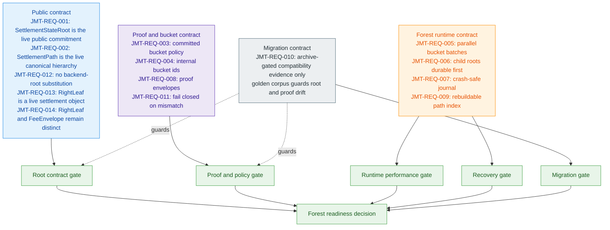

**Figure 12.2 - Verification lane map.** This second view keeps the concrete verification subtype readable without forcing non-standard values into Mermaid's `requirementDiagram` syntax.

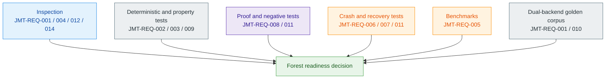

## 13. Testing And Verification Strategy

The test strategy should prove both semantic correctness and performance relevance.

### 13.1 Equivalence Tests

For generated operation sequences, run both backends:

```text
compatibility backend:
  apply ops -> root A

bucketed forest backend:
  apply same ops -> root B

assert:
  root A == root B
```

If the physical forest root representation differs internally, the exported
semantic `SettlementStateRoot` must still match the reference semantic model
for that generation. Archived compatibility material may still encode
`AssetStateRoot`, but migration must compare through an explicit adapter rather
than preserving a second live root contract.

### 13.2 Crash Tests

Crash tests should interrupt each journal status:

| Interruption point | Expected recovery |
| --- | --- |
| Before child commit | Roll back to previous root. |
| After some child commits | Complete or roll back without exposing partial parent roots. |
| After all child commits before parent commit | Complete parent commits or roll back safely. |
| After parent commit before publication | Recover root publication from journal. |
| After publication | Verify child and parent digests agree. |

### 13.3 Proof Tests

Proof tests should cover:

- inclusion under a normal path;
- absence under a derived bucket;
- deletion after parent pruning;
- wrong bucket policy rejection;
- wrong definition rejection;
- wrong serial rejection;
- wrong child root rejection;
- path index rebuild after deletion;
- historical proof verification if historical roots are retained.

### 13.4 Performance Tests

Performance tests should compare:

- one shared physical JMT;
- definition-sharded forest only;
- bucketed root-chained forest;
- varying bucket widths;
- random workloads;
- hot definition workloads;
- hot serial workloads;
- delete-heavy workloads;
- proof-heavy workloads.

## 14. Open Questions

The design intentionally avoids several decisions until measurement or protocol needs justify them.

| Question | Default answer |
| --- | --- |
| Should buckets ever split dynamically? | No for the first canonical design. |
| Should path index be public? | No unless a future proof contract explicitly commits it. |
| Should all definitions share one bucket policy? | No; policy may be definition-scoped, but must be committed and versioned. |
| Should empty buckets remain committed? | Prefer sparse parent leaves unless proof history requires retained empty roots. |
| Should bucket count be user-visible? | Only as verifier policy metadata, not as UX or asset meaning. |
| Should this introduce a global root registry? | No; asset storage should use `SettlementStateRoot` as the live storage-family root, not as a universal protocol root. |
| When should `AssetStateRoot` widen to `SettlementStateRoot`? | Phase 053 already performs that authority shift for the live storage contract; any remaining `AssetStateRoot` material is archived compatibility evidence only. |
| Should `RightLeaf` absorb fee authority? | No; keep processing guarantees in `FeeEnvelope`, fee credit, sponsor reserve, or equivalent bounded fee support. |

## 15. Conclusion

The best asset storage design for Z00Z is not the simplest single JMT and not the most aggressive adaptive shard system. It is a **bucketed root-chained JMT forest**: semantic enough to match Z00Z's rights-first model, physical enough to unlock real bulk insert/delete parallelism, and conservative enough to avoid high-risk dynamic bucket lifecycle machinery.

The design keeps the public contract stable in the live generation:

```text
SettlementPath + SettlementLeaf + SettlementStateRoot + checkpoint evidence
```

The same design also keeps both asset and right terminal families under one live settlement hierarchy:

```text
canonical path hierarchy + TerminalLeaf or RightLeaf + SettlementStateRoot + checkpoint evidence
```

It changes the internal backend:

```text
one shared physical commit wall
  -> deterministic multi-tree forest
  -> fixed buckets for hot serials
  -> journaled atomic root publication
```

That is the right balance for Z00Z. It supports private cash, external asset
rights, policy-shaped claims, machine capabilities, agent spending envelopes,
and selective audit without asking the chain to become a public account ledger
or a generic global state registry. It also gives the rights-layer roadmap a
clean next step: `TerminalLeaf` remains one live terminal family,
`RightLeaf` is the live non-coin family under the same generalized settlement
contract, and the unified semantic root is `SettlementStateRoot`. That
settlement-family widening should still preserve one more corpus rule: the
bounded right and the publication-funding path remain
separate. This provides the highest practical insert/delete performance while
keeping implementation and maintenance risk bounded.

## Appendix A. Glossary

| Term | Meaning |
| --- | --- |
| `Asset JMT` | Live physical JMT that stores terminal settlement records inside one fixed bucket, carrying `TerminalLeaf` or `RightLeaf` payloads as needed. |
| `TerminalLeaf` | One committed confidential asset right in canonical settlement state. |
| `AssetPath` | Archived compatibility alias for the older asset-centric form of the canonical three-part path. |
| `AssetPathProof` | Archived asset-centric sketch name for the settlement proof envelope; retained only when discussing historical compatibility terminology. |
| `AssetStateRoot` | Archived compatibility projection retained for migration evidence and golden-corpus equivalence checks. |
| `FeeEnvelope` | Separate processing-guarantee object that answers who pays for verification, batching, publication, or relay of a right transition. |
| `RightLeaf` | Live generalized settlement object for one confidential non-coin right; it inherits the same terminal storage duties as `TerminalLeaf` while carrying non-coin right semantics. |
| `SettlementStateRoot` | Live generalized semantic root over checkpointed terminal settlement leaves, including `TerminalLeaf` and `RightLeaf` families under one storage contract. |
| `asset_id` | Terminal asset identity used as the leaf key inside the relevant asset JMT. |
| `backend_root` | Private or diagnostic physical backend root carried by compatibility proofs and the live settlement proof envelope; never a substitute for `SettlementStateRoot`. |
| `Bucket JMT` | Live parent JMT under one definition and serial group that maps `bucket_id` to `BucketRootLeaf`. |
| `bucket_bits` | Number of hash-prefix bits used to derive a fixed bucket. |
| `bucket_hash_domain` | Domain-separated hash label used by the bucket derivation policy. |
| `bucket_id` | Deterministic fixed-bucket identifier derived from `SettlementPath` terminal identity and committed bucket policy. |
| `bucket_id_width` | Fixed serialized width for bucket identifiers in proofs and verifier recomputation. |
| `bucket_policy_id` | Stable identifier for the bucket policy version used in bucket derivation and proof verification. |
| `Bucket policy` | Versioned verifier-visible rule set that defines bucket derivation, hash domain, canonical encoding, and compatibility generation. |
| `BucketRootLeaf` | Parent leaf that binds one fixed bucket to one asset JMT root. |
| `Canonical encoding` | Byte-level encoding rule that lets independent verifiers recompute roots, buckets, and proof payloads identically. |
| `CheckRoot` | Checkpoint evidence root that binds checkpoint artifacts to a state transition. |
| `Checkpoint evidence` | Public or selectively disclosed transition evidence that binds prior root, consumed paths, created leaves, witnesses, and next root. |
| `ChildrenCommitted` | Journal status indicating that required child roots are durable but parent roots may not yet be published. |
| `Child root` | Root committed by a parent leaf, such as a serial root, bucket root, or asset JMT root. |
| `Commit digest` | Digest recorded in the HJMT forest commit journal to make child and parent commits replayable and fail-closed. |
| `Compatibility backend` | Archived reference backend used to compare canonical semantic roots and proof envelopes during migration; after Phase 053 it remains archive-gated evidence, not a live runtime lane. |
| `Compatibility generation` | Version marker that separates proof shape, root semantics, and migration expectations across backend generations. |
| `Definition` | Asset-family namespace that separates economic meaning, issuer route, policy family, or right class. |
| `definition_id` | Canonical identifier for one definition namespace in `SettlementPath`. |
| `Definition JMT` | Live top-level JMT that commits `definition_id -> DefinitionRootLeaf` records as part of the semantic parent chain. |
| `DefinitionRootLeaf` | Parent leaf that binds one definition to its serial-tree root. |
| `Deletion proof` | Proof family showing that a checkpoint transition removed a leaf and updated all affected parent roots. |
| `Fail closed` | Safety rule that rejects publication or verification on mismatch instead of repairing silently or exposing partial state. |
| `Fixed bucket` | Deterministic physical shard under one serial group. |
| `Forest backend` | Live multi-tree storage backend that commits child and parent JMT roots behind the stable public API. |
| `HjmtCommitJournalEntry` | Durable journal record for one live forest update, including touched children, digests, roots, and status. |
| `Forest commit journal` | Crash-safe record for multi-tree update publication. |
| `Golden test` | Stable reference test that compares compatibility and live behavior for the same generated or curated workload. |
| `Inclusion proof` | Proof family showing that a leaf exists at the derived canonical path under a specific root. |
| `Journal status` | Durable lifecycle state such as `Prepared`, `ChildrenCommitted`, `ParentsCommitted`, or `RootPublished`. |
| `leaf_count` | Optional bucket occupancy count; it should stay private or diagnostic unless a future policy explicitly commits it. |
| `max_target_leaf_count` | Operational monitoring target for bucket sizing, not an automatic consensus split trigger. |
| `min_bucket_count` | Bucket policy lower bound that prevents accidental single-bucket deployment for high-volume definitions. |
| `Non-existence proof` | Proof family showing that a settlement path is absent under the derived bucket at a specific root. |
| `Parent root` | Root that commits child-root leaves, such as the top definition root or a serial-level bucket root. |
| `ParentsCommitted` | Journal status indicating that parent roots are durable but the semantic root may not yet be published. |
| `Path index` | Internal lookup map from terminal identity to full settlement path. |
| `PathIndexRec` | Current internal path-index record that stores the full canonical settlement path for terminal-first lookup. |
| `Physical root` | Backend-specific root used to verify or operate a physical tree; it is not public protocol truth by default. |
| `Prepared` | Initial durable journal status recorded before child commits are exposed. |
| `ProofBlob` | Current settlement proof payload that binds semantic context to backend JMT branch proofs. Archived compatibility blobs remain historical evidence only. |
| `Proof envelope` | Verifier-facing proof package for one live generalized settlement path. |
| `Proof family` | Category of proof behavior, such as inclusion, deletion, or non-existence. |
| `Root binding` | Explicit binding between semantic root and diagnostic backend root inside a proof payload. |
| `RootPublished` | Journal status in which the next semantic root is safe to expose as `SettlementStateRoot`; archived `AssetStateRoot` values remain compatibility evidence only. |
| `Semantic root` | Canonical protocol root computed from asset-state semantics rather than from an incidental physical backend layout. |
| `Spendable capability object` | Broader future private right object representing bounded service, machine, access, compute, data, mandate, or reward authority rather than only money. |
| `Serial bucket` | Semantic group under one definition that scopes related assets, rights, claims, or capability instances. |
| `serial_id` | Identifier for one serial bucket inside a definition namespace. |
| `Serial JMT` | Live JMT under one definition that maps `serial_id` to `SerialRootLeaf`. |
| `SerialRootLeaf` | Parent leaf that binds one serial group to its bucket-tree root. |
| `Agent spending envelope` | Bounded private mandate that gives an agent task-scoped budget, fee capacity, and action limits without full wallet authority. |
| `Target forest` | Historical planning name for the bucketed root-chained JMT forest that Phase 053 landed as the live backend. |

## Appendix B. Compact Design Summary

```text
Recommended design:
  Bucketed root-chained JMT forest

Historical compatibility view:
  AssetStateRoot
    Definition
      Serial
        AssetLeaf

Live settlement view:
  SettlementStateRoot
    Definition
      Serial
        AssetLeaf or RightLeaf

Processing-support boundary:
  terminal right semantics stay separate from FeeEnvelope or fee-credit support

Physical view:
  Definition JMT
    Serial JMT per definition
      Bucket JMT per serial
        Asset JMT per fixed bucket

Bucket rule:
  deterministic hash prefix from definition_id, serial_id, asset_id, policy_id

Core benefit:
  parallel bulk insert/delete without changing caller-facing SettlementPath semantics

Primary risk:
  multi-tree atomic commit

Primary mitigation:
  HJMT forest commit journal + archived compatibility evidence + proof golden tests
```
