# Z00Z HJMT Upgrade

[TOC]

Version: 2026-06-02

Status: Normative upgrade specification

Base document: [Z00Z-HJMT-Design.md](Z00Z-HJMT-Design.md)

Cross-phase naming authority: [Z00Z-HJMT-Key-Terms.md](../Z00Z-HJMT-Key-Terms.md).
Use the shared glossary for canonical object, struct, trait, function, and
fixture-family names. This specification stays normative for upgrade rules,
but the shared glossary is the source of truth for reusable term selection.

## Key Terms Used In This Paper

| Term | Meaning in this document |
| --- | --- |
| `SettlementStateRoot` | Public semantic root for settlement state. Physical backend roots are not public state authority. |
| `SettlementPath` | Stable proof path identity: definition, serial, and terminal identity. Bucket layout MUST NOT change this identity. |
| `ProofBlob` | Current single-path proof envelope. It remains the compatibility contract for one-path verification. |
| `BatchProofBlob` | Required shared proof envelope for multiple settlement paths under one root and one bounded verifier context. |
| `BucketId` | Policy-derived physical layout identifier used inside HJMT. It can change across bucket policy generations. |
| `ShardId` | Required stable protocol routing and journal domain above buckets. It MUST NOT be derived from mutable bucket layout. |
| `ShardRouteTable` | Required committed route table that maps semantic route hashes to shard IDs for a routing generation. |
| `AggregatorId` | Runtime placement identifier for one aggregator or shard executor. It is operational metadata, not protocol truth. |
| `ShardPlacementTable` | Runtime-only placement map from `ShardId` to current executor, standby set, and lineage state for one routing generation. |
| `ShardGroupId` | Future journal-replication group identifier for one shard group. It is an extension seam, not version 1 protocol truth. |
| `ShardExecutor` | Runtime worker that executes one shard queue and replays the shard journal for one `ShardId`. |
| `StorageBackend` | Backend-agnostic durable KV and transaction seam used by settlement storage. It does not own routing, proof, or wallet semantics. |
| `JournalBackend` | Backend-agnostic journal seam for durable batch and shard execution records. It does not define public truth by itself. |
| `Runtime placement` | Operational assignment of shard execution to runtime actors under already-committed shard ownership. |
| `Root generation` | Versioned interpretation of `SettlementStateRoot`, especially before and after root-of-shard-roots publication. |
| `Evidence packet` | Source, tests, benchmarks, vectors, and recovery reports required before a score claim is accepted. |

## 1. Purpose And Upgrade Boundary

This document extends the base HJMT storage design with concrete upgrades for proof-size efficiency, durable write throughput, verifier throughput, shardability, and implementation safety. The base architecture remains HJMT: a bucketed, root-chained JMT forest whose public root is semantic settlement state, not physical storage layout.

The required engineering outcome is an implementation that can earn 9/10 performance, bytes efficiency, and shardability scores. That score is not a current implementation claim. The implementation MUST attach the benchmark, crash-recovery, proof, and negative-test evidence named in this document before any score claim is accepted.

| Criterion | Current concern | Required implementation |
| --- | --- | --- |
| Bulk write TPS | Scheduler parallelism exists, but root publication still passes through parent recomposition, path-index work, cache work, model history, and RedB journal sync. | Bucket-local and shard-local batch commits measured as durable-root-published TPS. |
| Proof bytes | Current batch proof generation returns ordered independent `ProofBlob` values. | Shared hierarchical multiproof with deduplicated context and witnesses. |
| Verify speed | Parallel proof generation does not produce one shared verifier pass. | One verifier pass over shared context, path table, witness DAG, and openings. |
| Shardability | Current `ShardKey` and `ShardItem` are internal planning helpers. | Stable `ShardId`, per-shard journals, shard queues, and root-of-shard-roots. |
| Correctness | New batch, shard, and transition layers can create cross-context bugs. | Deterministic, bounded, replayable, fail-closed, verifier-owned formats. |

### 1.1 Inherited Base Constraints

The upgrade inherits these constraints from [Z00Z-HJMT-Design.md](Z00Z-HJMT-Design.md):

- HJMT remains the canonical authenticated storage foundation.
- `SettlementStateRoot` remains the public semantic root.
- `SettlementPath` remains the proof path identity.
- Physical backend roots and bucket layout remain hidden behind storage-owned proof envelopes.
- Inclusion, deletion, and non-existence retain distinct proof semantics.
- Parent roots publish only after required child roots and journal records are durable.
- Benchmarks compare designs under equal cache, persistence, and verification settings.
- Verification, recovery, and historical proof compatibility are mandatory gates.

### 1.2 Prohibited Changes

This upgrade does not allow:

- replacing HJMT with SNARKs as the storage engine;
- treating `BucketId` as stable protocol shard identity;
- exposing physical bucket roots as public settlement roots;
- dropping root, policy, journal, epoch, proof-family, leaf-family, or default-commitment bindings from proof envelopes;
- accepting a partially valid batch proof;
- deriving shard routing from node-local load measurements;
- using path indexes, caches, metrics, or model-history rows as consensus truth;
- changing `SettlementPath` semantics without an explicit versioned migration.

SNARKs are outside this HJMT upgrade. They MUST NOT replace native HJMT witness generation, batch verification, shard roots, or recovery evidence in this specification.

### 1.3 Verified Current Baseline

| Area | Repository-backed baseline | Upgrade implication |
| --- | --- | --- |
| Public root | The base design keeps `SettlementStateRoot` as the semantic root. | Keep this root boundary and add generation tags when shard roots arrive. |
| Bucket policy | `BucketPolicy::derive_bucket_id` hashes semantic path fields with `bucket_policy_id`. | `BucketId` is mutable layout, not stable shard identity. |
| Proof envelope | `ProofBlob` binds proof family, leaf family, backend root, bucket policy, bucket proof, journal checkpoint, and default commitments. | Batch proof format MUST preserve all bindings in shared form. |
| Batch proof API | `settlement_proof_blobs` returns `Vec<ProofBlob>`. | Current batch API is independent proof generation, not shared multiproof. |
| Planning shard terms | `ShardKey` is `(definition_id, serial_id)` for planning. | Introduce protocol `ShardId` separately. |
| Scheduler | `ForestScheduler` provides bounded parallel work and deterministic output order. | Scheduler evidence is not durable TPS evidence by itself. |
| Commit path | Terminal and bucket work can run in scheduled jobs, then parent roots, path index, cache, model history, journal sync, and root publication remain visible stages. | Benchmark each stage separately before TPS claims. |
| Adaptive records | Adaptive bucket, split, merge, policy-transition, occupancy, and epoch records exist. | Local adaptive transitions need explicit proof and recovery semantics. |

### 1.4 Core Architecture Decision

Z00Z keeps HJMT as authenticated storage and adds three layers:

1. Shared hierarchical multiproof for proof bytes and verifier throughput.
2. Bucket-local batch commit for durable mutation throughput.
3. Stable shard publication above buckets for real shardability.

Plain JMT is simpler but loses HJMT locality. Sparse Merkle Trees provide fixed depth but do not solve locality or route policy. Authenticated B-trees improve range access but complicate canonical proof semantics. Verkle and KZG state add new cryptographic assumptions before the current HJMT semantics are fully measured. SNARK-first storage still needs a state engine and moves update correctness into circuit complexity too early.

### 1.5 Parallel Shard Reality Check

Parallel shards count as real shardability only when unrelated shards can accept, journal, recover, prove, and publish pending state without waiting on a hot shard except at a configured global publication boundary. Benchmarks MUST separate shard-local commit cost from root-of-shard-roots publication cost.

Without that evidence, the current repository supports bounded parallel work scheduling, not protocol-level shard scaling.

### 1.6 Upgrade Boundary And Evidence Discipline

This is an upgrade boundary document, not a completion report. The scope spans
proof format, commit execution, shard routing, root publication, and adaptive
transitions, so implementation plans derived from it MUST split the work into
measurable slices. A slice is complete only when source, tests, benchmarks, and
recovery evidence support the claim being made.

The current repository still exposes a single live settlement root generation
and uses internal planning shard terms. The implementation MUST add committed
`ShardId`, route-table, per-shard journal, shard-root, and batch-proof code
before enabling or claiming those behaviors. Downstream sections MUST preserve
`SettlementStateRoot` as semantic authority and keep every score claim
evidence-gated.

The upgrade boundary also includes the minimum runtime and storage seams needed
to execute shard-local work safely. Those seams are normative only as boundary
rules. They MUST NOT become a second source of protocol truth next to committed
route generations, shard leaves, and public checkpoints.

### 1.7 Whole-System Structure View

The whole-system structure is intentionally layered:

| Layer | Required role | MUST NOT become |
| --- | --- | --- |
| `z00z_rollup_node` | Orchestration and composition root for attached runtime services and DA adapters. | A new shard-truth or route-authority layer. |
| Runtime aggregator service | Deterministic ingress, batch admission, shard execution, publication handoff, and same-lineage failover. | A self-authorizing owner of public truth. |
| Runtime validators and watchers | Downstream checkpoint acceptance, evidence export, and operational observation. | An alternate routing or planner authority. |
| `z00z_storage` | Semantic truth layer for settlement state plus durable execution and journal primitives. | A hidden runtime-placement owner or wallet-facing backend surface. |

This design MUST NOT introduce a new "super-aggregator" above
`z00z_rollup_node`. Runtime aggregation remains a service layer under node
orchestration. `z00z_storage` remains the semantic truth layer under runtime
orchestration, not a substitute for it.

### 1.7.1 C4 Component View: Whole-System Roles

This component view makes the structural hierarchy explicit. It is scoped to
one node-shaped Z00Z runtime and keeps the orchestration root, runtime
services, and storage truth layer visually separate.

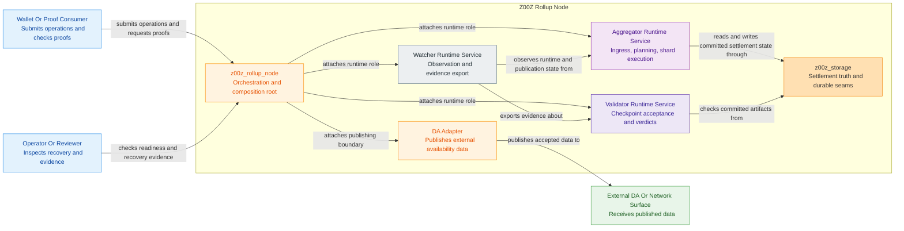

### 1.8 C4 Component Reading Map

This component view is a reading map for the upgrade document. It shows the
major internal contracts inside Z00Z settlement storage and the external
surfaces that consume or validate them.

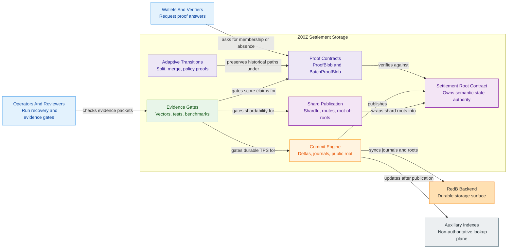

## 2. Upgrade Principles

### 2.1 HJMT Remains The State Core

HJMT remains responsible for live state commitments, inclusion proofs, deletion proofs, non-existence proofs, deterministic replay, crash recovery, and historical proof compatibility. KV stores, caches, indexes, scan helpers, and model-history rows can accelerate operations, but they do not replace HJMT as proof truth.

### 2.2 Optimize Inside The Existing Paradigm

Allowed optimizations are shared witnesses, subtree witnesses, bucket-local delta aggregation, parent-delta aggregation, shard root leaves, and rebuildable indexes. Outer proof wrappers are outside this HJMT upgrade. Rejected optimizations include skipping public verification in benchmarks, dropping proof bindings, accepting non-canonical proof encodings, or storing bulky operational data in committed leaves solely for convenience.

### 2.3 Fail Closed

New proof and root formats fail closed for mismatched shared context, missing openings, out-of-range witness references, witness reuse at the wrong level, duplicate paths with conflicting openings, stale shard roots, stale route generations, stale bucket policies, malformed shard membership, and crash recovery where shard child roots and the global root disagree.

Callers MUST NOT treat a subset of a failed batch proof as accepted truth.

### 2.4 Narrow Versioned Contracts

`ProofBlob` remains the single-path proof envelope. `BatchProofBlob` is added as a separate batch proof envelope. `SettlementStateRoot` remains the public root type, and root and proof envelopes MUST carry a root-generation tag before root-of-shard-roots publication is accepted.

### 2.5 Commitment Boundary

Committed leaves contain only settlement truth needed for proof and replay. Auxiliary data contains lookup, scan, analytics, wallet UX, metrics, publication helper state, queues, and cache rows. Auxiliary data is rebuildable or explicitly non-consensus. If auxiliary bytes are tied to a right, the committed leaf MUST store a digest.

### 2.6 Contract Discipline

Performance work MUST enter through explicit versioned contracts. `ProofBlob`
continues to own the single-path contract. Implementations that enable
`BatchProofBlob`, route-table bindings, shard-root leaves, or root-generation
tags MUST provide code, golden vectors, negative tests, and recovery evidence
in the same implementation slice.

Keeping indexes, caches, metrics, model-history rows, and scan helpers outside
consensus truth requires more equivalence and rebuild tests, but it prevents
proof bloat and accidental public disclosure. A helper plane can become
authoritative only through a versioned proof contract or a digest
committed inside the settlement leaf.

## 3. Upgrade 1: Shared Hierarchical Multiproof

Shared hierarchical multiproof is the main proof-size upgrade. It replaces repeated independent witness material with one shared proof context and one deduplicated witness graph.

### 3.1 Required Format

Version 1 uses one proof family per batch envelope. Inclusion, deletion, and non-existence batches use separate envelopes.

```text
BatchProofBlobV1
  header:
    encoding_version
    transcript_domain
    proof_family
    root_generation
    settlement_state_root
    leaf_family_set
    policy_generation
    bucket_policy_digest
    journal_checkpoint
    batch_limits

  path_table:
    repeated BatchPathEntry

  witness_dag:
    repeated WitnessNode

  opening_table:
    repeated OpeningEntry

  reference_table:
    repeated PathWitnessRef
```

`BatchPathEntry` records the canonical `SettlementPath`, leaf family, terminal role, conditional shard context, and indexes into opening and witness references. `WitnessNode` records level, node domain, child index, and sibling or child hash material. `OpeningEntry` contains one inclusion leaf, deletion fact, or absence opening according to the proof family. `PathWitnessRef` contains the ordered witness-node indexes for one path. The opening index lives only in `BatchPathEntry`.

All indexes are bounds-checked before hashing begins.

The format separates shared context from per-path openings so byte savings come
from witness reuse, not from weakening proof semantics. Header fields are
root-wide. Path table fields are path-specific. Opening fields are proof-family
specific. Witness nodes are reusable only when their declared context matches
the verifier's expected level and domain.

| Field group | Required fields | Verifier purpose |
| --- | --- | --- |
| Header | encoding version, transcript domain, proof family, root generation, public root, policy digest, journal checkpoint, limits. | Binds every path to one public state context and one parser contract. |
| Path entry | sorted `SettlementPath`, terminal family, leaf family, shard id and routing generation when the proof is sharded, opening index, witness reference index. | Prevents reordering, duplicate path ambiguity, and cross-family confusion. |
| Witness node | tree level, node domain, child index, sibling position, hash material, subtree marker when the node represents a subtree. | Reconstructs parent hashes without trusting producer-selected aliases. |
| Opening entry | included canonical leaf bytes, deletion fact, or absence/default commitment data. | Reconstructs terminal commitments according to the proof family. |
| Reference entry | ordered witness indexes for one path. The opening index lives in the path entry. | Connects one path to the shared witness DAG with bounded indexes. |

Version 1 MUST NOT include compression sections beyond the tables above.
Compression that changes parsing behavior MUST require a new encoding version
and a new golden-vector set.

### 3.1.1 Exact Codec Contract For `BatchProofBlobV1`

`BatchProofBlobV1` is a positional binary record. Version 1 MUST NOT use map
encoding, TLV sections, field reordering, duplicate sections, omitted default
fields, text-form digests, or alternate varint forms. One logical proof object
has exactly one accepted byte sequence.

Common primitive rules for version 1:

- `u8`, `u16`, `u32`, and `u64` are fixed-width big-endian scalars;
- `bool` is one byte and MUST be `0x00` or `0x01`;
- `Option<T>` is a one-byte presence tag followed by the value for `0x01`;
  `0x00` carries no payload bytes;
- variable-length byte strings and vectors use `u32` big-endian length
  prefixes;
- digests, roots, and transcript domains are raw 32-byte arrays;
- embedded settlement identifiers such as `SettlementPath`, `DefinitionId`,
  `SerialId`, `TerminalId`, and `SettlementStateRoot` MUST use their canonical
  approved identifier codecs and be embedded verbatim.

Top-level field order is exact:

1. `header`
2. `path_table`
3. `witness_dag`
4. `opening_table`
5. `reference_table`

Header field order is exact:

1. `encoding_version` as `u8`, fixed to `0x01`
2. `transcript_domain` as 32 bytes
3. `proof_family_tag` as `u8`
4. `root_generation_tag` as `u8`
5. `settlement_state_root`
6. `leaf_family_set_len` as `u32`
7. `leaf_family_set` entries sorted ascending by tag and unique
8. `policy_generation` as `u64`
9. `bucket_policy_digest` as 32 bytes
10. `journal_checkpoint` as `Option<u64>`
11. `batch_limits`

Path-entry field order is exact:

1. canonical `SettlementPath`
2. `terminal_family_tag` as `u8`
3. `leaf_family_tag` as `u8`
4. `shard_id` as `Option<u32>`
5. `routing_generation` as `Option<u64>`
6. `opening_index` as `u32`
7. `reference_index` as `u32`

Wire-tag values for version 1 are fixed:

| Tag set | Value mapping |
| --- | --- |
| `proof_family_tag` | `0x01 = inclusion`, `0x02 = deletion`, `0x03 = non_existence` |
| `terminal_family_tag` | `0x01 = asset`, `0x02 = right` |
| `leaf_family_tag` | `0x01 = asset`, `0x02 = right` |
| `root_generation_tag` | `0x00 = root_generation_0`, `0x01 = root_generation_1` |
| `node_domain_tag` | `0x01 = terminal`, `0x02 = bucket`, `0x03 = serial`, `0x04 = definition`, `0x05 = shard`, `0x06 = global` |

Unknown tags, repeated tags where uniqueness is required, alternate field
order, or non-canonical vector order MUST reject before hashing. Producers and
verifiers MUST treat these values as wire constants and MUST NOT derive them
from internal enum discriminants.

In version 1, `terminal_family_tag` and `leaf_family_tag` use the same wire
values because the current settlement terminal family is the current settlement
leaf family (`asset` or `right`). Implementations MUST still treat them as
separate fields because they bind different semantics: terminal addressability
vs leaf payload family.

### 3.1.2 Exact Codec Contract For Nested Batch Tables

Version 1 also fixes the inner table records so two implementations cannot
agree on the outer envelope while disagreeing on witness, opening, or parser
limit bytes.

`BatchProofLimits` field order is exact:

1. `max_path_count` as `u32`
2. `max_witness_node_count` as `u32`
3. `max_opening_count` as `u32`
4. `max_reference_count` as `u32`
5. `max_total_bytes` as `u32`

`WitnessNodeV1` field order is exact:

1. `tree_level` as `u16`
2. `node_domain_tag` as `u8`
3. `child_index` as `u8`
4. `sibling_side_tag` as `u8`
5. `subtree_marker` as `bool`
6. `hash_material_count` as `u32`
7. `hash_material` as repeated 32-byte digests

Version 1 `sibling_side_tag` values are fixed:

| Value | Meaning |
| --- | --- |
| `0x00` | left_sibling |
| `0x01` | right_sibling |

Version 1 `hash_material_count` MUST equal `1` for every witness node because
the accepted witness contract is one sibling digest per fold step. A future
higher-arity or compressed witness format requires a new encoding version.

`OpeningEntryV1` field order is exact:

1. `opening_kind_tag` as `u8`
2. `payload_len` as `u32`
3. `payload` as raw bytes

Version 1 `opening_kind_tag` values are fixed:

| Value | Meaning |
| --- | --- |
| `0x01` | inclusion_leaf |
| `0x02` | deletion_fact |
| `0x03` | absence_opening |

`payload` MUST be the canonical bytes of the exact versioned opening object
selected by `(proof_family_tag, leaf_family_tag, opening_kind_tag)`. The
verifier MUST reject every mismatched combination, including inclusion proofs
carrying deletion payloads, deletion proofs carrying absence payloads, or leaf
families that do not match the path authority.

Version 1 opening payload selection is exact:

| `proof_family_tag` | `opening_kind_tag` | Required payload object |
| --- | --- | --- |
| `inclusion` | `inclusion_leaf` | `InclusionOpeningV1` |
| `non_existence` | `absence_opening` | `NonExistenceOpeningV1` |
| `deletion` | `deletion_fact` | `DeletionFactV1` |

All other combinations MUST reject before hashing. `leaf_family_tag` is bound
by `BatchPathEntryV1` and MUST NOT be restated as an independent payload-local
selector. Any embedded settlement leaf bytes MUST decode to the same family as
the path entry.

`InclusionOpeningV1` field order is exact:

1. `version` as `u8`, fixed to `0x01`
2. `leaf_len` as `u32`
3. `leaf_bytes` as canonical `SettlementLeaf` bytes

`InclusionOpeningV1.leaf_bytes` MUST decode to one canonical `SettlementLeaf`
whose family matches `leaf_family_tag`. The verifier reconstructs the terminal
payload for inclusion proofs directly from these bytes and MUST reject any
alternate inclusion object that carries hashes, aliases, or producer-chosen
leaf summaries instead of canonical leaf bytes.

`NonExistenceOpeningV1` field order is exact:

1. `version` as `u8`, fixed to `0x01`
2. `marker_leaf_len` as `u32`
3. `marker_leaf_bytes` as canonical `SettlementLeaf` bytes
4. `default_commitment_version` as `u8`, fixed to `0x01`
5. `default_commitment` as 32 bytes
6. `default_child_commitment` as 32 bytes

Version 1 non-existence rules are exact:

- `marker_leaf_bytes` MUST equal the canonical bytes of the family-specific
  marker leaf derived from `(leaf_family_tag, SettlementPath)`;
- `default_commitment_version` MUST equal the version used by the live HJMT
  default commitment contract;
- `default_commitment` MUST equal the canonical domain-separated default value
  commitment;
- `default_child_commitment` MUST equal the canonical domain-separated default
  child commitment;
- the path witness chain selected by `reference_index` carries the current
  non-existence branch material, and `NonExistenceOpeningV1` MUST NOT smuggle a
  second undocumented branch-proof byte string outside `witness_dag`.

`PriorProofContextV1` field order is exact:

1. `version` as `u8`, fixed to `0x01`
2. `prior_hjmt_version` as `u64`
3. `prior_settlement_root` as canonical `SettlementStateRoot` bytes
4. `prior_backend_root` as 32 bytes
5. `prior_root_bind_version` as `u8`
6. `prior_root_bind` as 32 bytes
7. `prior_journal_digest` as 32 bytes
8. `prior_checkpoint_bind` as 32 bytes
9. `definition_root_leaf_len` as `u32`
10. `definition_root_leaf_bytes` as canonical bytes
11. `serial_root_leaf_len` as `u32`
12. `serial_root_leaf_bytes` as canonical bytes
13. `bucket_root_leaf_len` as `u32`
14. `bucket_root_leaf_bytes` as canonical bytes
15. `definition_proof_len` as `u32`
16. `definition_proof_bytes` as raw proof bytes
17. `serial_proof_len` as `u32`
18. `serial_proof_bytes` as raw proof bytes
19. `bucket_proof_len` as `u32`
20. `bucket_proof_bytes` as raw proof bytes
21. `prior_terminal_proof_len` as `u32`
22. `prior_terminal_proof_bytes` as raw proof bytes

`PriorProofContextV1` is the batch-format replacement for the live
`HjmtPriorProofEnvelope` semantics. It carries the prior-root bind material,
the prior journal/checkpoint bind material, the three prior upper leaves, and
all four prior existence proof byte strings. Despite the current repository
naming `asset_proof`, the batch format names the last field
`prior_terminal_proof_bytes` because it proves the terminal key under the prior
bucket root for the active leaf family.

`DeletionFactV1` field order is exact:

1. `version` as `u8`, fixed to `0x01`
2. `deleted_leaf_len` as `u32`
3. `deleted_leaf_bytes` as canonical `SettlementLeaf` bytes
4. `default_commitment_version` as `u8`, fixed to `0x01`
5. `default_child_commitment` as 32 bytes
6. `prior_context_len` as `u32`
7. `prior_context_bytes` as canonical `PriorProofContextV1` bytes

Version 1 deletion rules are exact:

- `deleted_leaf_bytes` MUST decode to the canonical deleted leaf and its family
  MUST match `leaf_family_tag`;
- the verifier MUST use `deleted_leaf_bytes` as the payload for prior terminal
  existence verification;
- `default_commitment_version` and `default_child_commitment` bind the current
  deletion branch to the same live default-commitment contract used by HJMT
  proof verification;
- `prior_context_bytes` MUST be canonical `PriorProofContextV1` bytes and MUST
  carry the entire prior existence context;
- current-root non-existence for the deleted path is carried by the normal path
  witness chain and MUST NOT be split between undocumented header fields and
  opaque payload-local conventions.

Header-level and opening-level boundaries are fixed in version 1:

- `BatchProofHeaderV1` carries current-root family, policy, and checkpoint
  context;
- `OpeningEntryV1.payload` carries only the family-specific terminal opening
  facts needed for one path;
- all prior deletion material, including prior root binds, prior checkpoint
  binds, prior upper leaves, and prior proof bytes, lives inside
  `PriorProofContextV1` and nowhere else.

`PathWitnessRefV1` field order is exact:

1. `witness_index_count` as `u32`
2. `witness_indexes` as repeated `u32` values in terminal-to-root fold order

`PathWitnessRefV1` MUST NOT repeat an opening index. The opening index for one
path lives only in `BatchPathEntryV1`. Witness indexes MUST be bounds-checked,
duplicates within one path are forbidden, and the verifier MUST consume them in
the exact order encoded by the producer.

### 3.2 Canonical Ordering

The path table is sorted by:

```text
root_generation
  -> routing_generation if present
  -> shard_id if present
  -> definition_id
  -> serial_id
  -> terminal_family
  -> terminal_id
```

Duplicate `SettlementPath` entries are rejected. Callers that need duplicate answers duplicate the verified result outside the proof envelope.

Canonical ordering is part of the transcript. Two encodings that contain the
same logical paths but use different order are not equivalent proof objects.
This rule makes archived proofs stable, makes test vectors reproducible, and
prevents a malicious producer from hiding duplicate or conflicting openings
behind alternate table order.

The verifier MUST NOT normalize path order or duplicate entries after
parsing. It checks that the producer already emitted the canonical order. This
keeps malleability out of the proof object and keeps the transcript hash tied to
the exact bytes the verifier accepted.

### 3.3 Verification Algorithm

The verifier:

1. Decodes the envelope and rejects unknown mandatory fields.
2. Checks parser and verifier limits from `batch_limits`.
3. Validates path ordering and rejects duplicates.
4. Validates all table indexes.
5. Binds header, paths, openings, witnesses, and references into the transcript.
6. Reconstructs each terminal hash from its opening.
7. Walks referenced witnesses from terminal level to bucket, serial, definition, shard layer when present, and global root.
8. Compares the reconstructed root to `settlement_state_root`.
9. Returns one atomic success or one atomic failure.

Diagnostic errors can identify the first failed path, but they do not authorize partial acceptance.

Verifier pseudocode:

```text
verify_batch_proof(batch):
  parsed = parse_with_limits(batch)
  require supported_version(parsed.header.encoding_version)
  require supported_domain(parsed.header.transcript_domain)
  require one_proof_family(parsed.header.proof_family)
  require canonical_path_order(parsed.path_table)
  require no_duplicate_paths(parsed.path_table)
  require all_indexes_in_bounds(parsed)
  require all_openings_match_family(parsed)
  require all_witness_nodes_match_declared_domains(parsed)

  transcript = bind_header_paths_openings_witnesses(parsed)

  for path in parsed.path_table:
    opening = parsed.opening_table[path.opening_index]
    refs = parsed.reference_table[path.reference_index]
    terminal_hash = hash_opening(path, opening, parsed.header)
    reconstructed = fold_witnesses(path, terminal_hash, refs, parsed.witness_dag)
    require reconstructed == parsed.header.settlement_state_root

  return transcript.success()
```

The loop is written as if each path reconstructs the public root independently,
but an optimized verifier can cache intermediate hash results. Cached verifier
results are an implementation detail and do not change the transcript or
acceptance rules.

### 3.4 Witness Reuse Rules

Witness nodes MUST only be reused when tree level, node domain, root generation, proof family, shard context, bucket policy digest, and child index semantics all match. A definition-level node cannot be reused as a serial-level node even if the bytes match. A bucket node under one policy generation cannot be reused under another.

### 3.5 Acceptance Evidence

The upgrade is accepted only when reports compare one `ProofBlob`, current `Vec<ProofBlob>`, and `BatchProofBlob` for 2, 8, 32, 128, and 1024 paths across clustered, scattered, inclusion, deletion, and non-existence workloads. Reports MUST include serialized bytes, bytes per path, prove time, verify time, and peak memory.

The comparison MUST include three path locality profiles:

| Profile | Shape | Expected result |
| --- | --- | --- |
| Clustered bucket | Many terminal paths share definition, serial, bucket, policy, and journal context. | Largest byte savings and strongest shared-verify win. |
| Clustered definition | Paths share definition and sometimes serial, but span buckets. | Moderate savings from upper witness reuse. |
| Scattered state | Paths span definitions, serials, buckets, and shards. | No correctness regression; byte overhead MUST stay bounded. |

Negative evidence MUST tamper each shared context field independently: root,
root generation, proof family, leaf family, policy digest, journal checkpoint,
route generation, shard id, path order, opening index, witness index, witness
level, witness domain, child index, and default commitment. Any tamper MUST
reject the whole batch.

### 3.6 Verifier Safety Requirements

`BatchProofBlob` is a new envelope and does not change `ProofBlob`. Version 1
keeps one proof family per envelope, rejects duplicate paths, checks every
reference before hashing, and treats verification as one atomic result. This
keeps the first shared format easy to compare against the existing
`Vec<ProofBlob>` baseline.

Witness reuse is valid only under a complete reuse key: tree level, node
domain, root generation, proof family, shard context, bucket policy digest,
route generation when present, and child-index semantics. Reusing witness bytes
without this key can produce a valid-looking root reconstruction for the wrong
path. The benchmark report MUST therefore include negative vectors that tamper
each reuse-key field independently.

### 3.7 Implementation Guidance

The first implementation SHOULD use a builder that consumes already verified single-path proof contexts and then deduplicates only byte-for-byte equivalent witness segments under an explicit reuse key. That approach is slower than a fully native multiproof generator, but it reduces the first correctness risk because every shared node can be traced back to a known-good `ProofBlob` path. A native tree-layer builder MUST preserve the same golden vectors, negative vectors, and verifier acceptance rules.

The verifier owns the final interpretation. Producers can suggest shared nodes, but the verifier recomputes all parent hashes and rejects any shared node whose declared level or domain does not match the path witness reference.

### 3.8 C4 Component View: Batch Proof Contract

This component view shows the shared proof contract without mixing it with
commit execution or shard publication. It is the static counterpart to the
verification algorithm in Section 3.3.

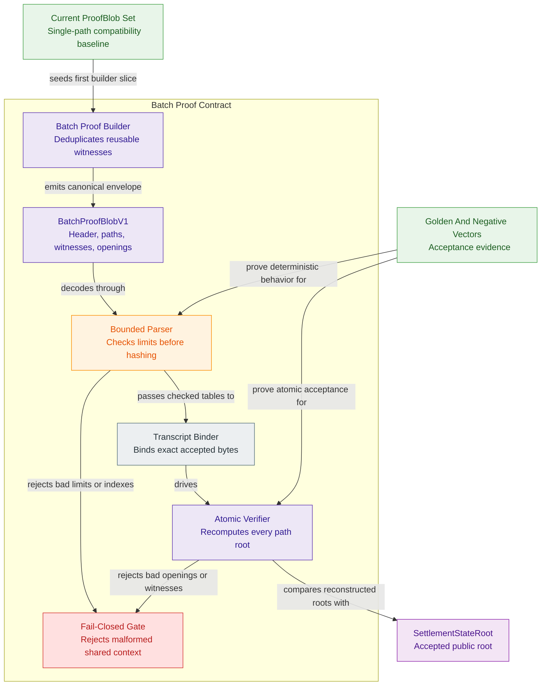

## 4. Upgrade 2: Bucket-Local Batch Commit Engine

The current mutation path already groups work by definition, serial, and policy-derived bucket. This upgrade makes batch deltas explicit so each touched bucket and parent path is recomputed once per canonical batch.

### 4.1 Commit Flow

```text
validate batch
  -> canonicalize operation order
  -> reject duplicate settlement paths
  -> group by stable shard if enabled
  -> group by definition_id
  -> group by serial_id
  -> group by bucket_id
  -> apply bucket-local deltas
  -> recompute touched bucket roots once
  -> recompute touched serial roots once
  -> recompute touched definition roots once
  -> recompute touched shard roots if enabled
  -> publish the public root after required journals are durable
```

Version 1 rejects duplicate `SettlementPath` entries inside a mutation batch. This includes put/delete conflicts and repeated puts. Replacement semantics require a later versioned operation type.

### 4.2 Delta Records

`BucketDelta` records bucket identity, bucket policy generation, pre-bucket root, ordered terminal operations, post-bucket root, operation digest, and proof material for affected leaves. `ParentDelta` records the minimal upward update from bucket root to serial root, definition root, shard root when sharding is enabled, and global root.

Two nodes with the same pre-state, policy, operation set, and canonical ordering MUST produce identical post-roots.

Delta records are not an alternate source of truth. They are replay and recovery
artifacts that let the node prove which child roots were written before a parent
root became visible. The committed tree remains authoritative after recovery.

| Record | Required fields | Recovery use |
| --- | --- | --- |
| `BucketDelta` | root generation, bucket policy digest, definition id, serial id, bucket id, pre-root, post-root, ordered operations digest, touched terminal set digest. | Replays or verifies one bucket-local update without re-reading unrelated buckets. |
| `ParentDelta` | changed bucket roots, pre/post serial root, pre/post definition root, pre/post shard root when sharding is enabled, global pre-root, global post-root. | Verifies upward recomposition after bucket roots are durable. |
| `AuxiliaryDelta` | path-index rows, cache keys, model-history rows, rebuild mode, auxiliary digest. | Rebuilds or invalidates helper data without changing settlement truth. |

The operation digest is computed before tree writes and includes operation type,
canonical path, terminal family, leaf family, leaf hash or deletion fact, and
caller-supplied batch nonce if one exists. It MUST NOT include wall-clock time,
thread order, cache hit status, or scheduler worker identity.

### 4.3 Canonical Operation Semantics

Version 1 rejects every duplicate settlement path in one mutation batch. This
keeps proof generation, deletion facts, and recovery replay simple while the
delta journal is introduced.

| Batch condition | Version 1 behavior | Required rule |
| --- | --- | --- |
| Two puts for the same path | Reject before planning. | Replacement is out of scope for version 1. |
| Put and delete for the same path | Reject before planning. | Replace-or-delete transition semantics are out of scope for version 1. |
| Delete missing path | Use the existing non-existence/deletion proof contract. | Proof family MUST stay explicit. |
| Put into occupied path | Reject before planning. | Replacement is out of scope for version 1. |
| Empty batch | Reject as invalid input. | None needed. |

Rejecting these cases early avoids node-to-node disagreement about last-writer
rules and prevents one batch from requiring both pre-state and post-state proofs
for the same path under one public root transition.

### 4.4 Journal States

| Stage | Durable record | Recovery rule |
| --- | --- | --- |
| `BatchPlanned` | Batch digest, operation count, pre-root, root generation. | Recompute plan and compare digest. |
| `BucketRootsWritten` | Touched bucket IDs and pre/post roots. | Finish parent recomposition or roll back unpublished bucket roots according to journal policy. |
| `ParentRootsWritten` | Serial, definition, and shard deltas when sharding is enabled. | Recompute upward roots and verify child roots. |
| `AuxiliaryUpdated` | Path-index, cache, and model-history digests when enabled. | Rebuild or invalidate auxiliary rows. |
| `PublicRootWritten` | New `SettlementStateRoot` and journal checkpoint. | Treat the root as visible only after this record is durable. |
| `BatchCommitted` | Final marker. | Idempotently finish cache warmup and metrics. |

Crash recovery MUST be tested at every boundary. Recovery can complete or roll back according to journal policy, but it MUST NOT publish a parent root that references a non-durable child root.

### 4.5 Cache And Index Rules

Cache, path index, and model history follow public-root visibility. Pre-commit cache reads use the old root. Bucket-local writes are invisible to proof generation until publication. Path-index rows are refreshed after bucket roots are durable. Cache warmup is non-authoritative and never consensus truth.

### 4.6 Required Metrics

Commit reports include validation, canonicalization, grouping, bucket delta apply, bucket root write, parent recomposition, shard recomposition, public root publication, journal sync, path-index update, cache work, model-history work, durable-root-published TPS, worker-only throughput, and peak memory.

The report MUST separate timing by durability boundary:

| Timing group | Included work | Claim it supports |
| --- | --- | --- |
| Worker-local | validation, grouping, scheduler work, in-memory bucket deltas. | CPU parallelism and planning quality. |
| Tree-durable | bucket root writes, parent recomposition, child-root durability. | Commit-engine correctness and recovery cost. |
| Public-root durable | journal sync and public root publication. | User-facing durable TPS. |
| Auxiliary | path index, cache, model history, warmup, verification. | Operational latency and rebuild cost. |

Only public-root durable timing can support TPS claims visible to wallets,
checkpoints, or external verifiers.

### 4.7 Durability And Publication Requirements

Bucket and parent deltas MUST become journal-visible artifacts only after the
semantic reference model and current HJMT commit path agree on roots for the
same operation set. The first public contract MUST preserve duplicate-path
rejection and keep replacement semantics out of scope.

The public root is visible only after required child roots and journal records
are durable. Publishing `SettlementStateRoot` earlier can create a root that
verifies in memory but cannot recover after restart. Commit reports MUST show
durable-root-published TPS separately from worker-local throughput and MUST
break out path-index, cache, model-history, and RedB sync costs.

### 4.8 Implementation Guidance

The first delta implementation MUST preserve the existing duplicate-path rejection behavior and keep replacement semantics out of scope. The planner MUST output a deterministic operation digest before any tree writes. Recovery tests MUST inject failure after each durable stage and assert that reload either returns the prior public root or completes to the exact planned root.

The benchmark harness MUST record two numbers separately: worker-local mutation throughput and durable-root-published throughput. Only the second number can support user-facing TPS claims.

### 4.9 C4 Dynamic View: Durable Batch Commit

This dynamic view shows the commit sequence at the storage-container level. It
highlights where a worker-local operation becomes a durable public root.

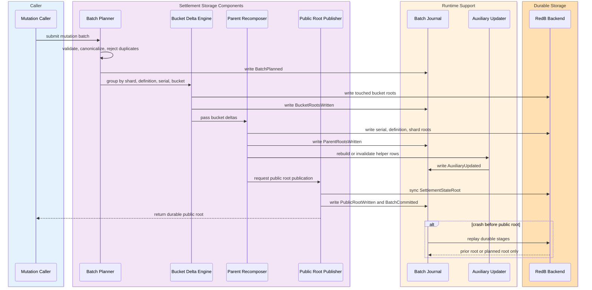

## 5. Upgrade 3: Stable Shard Layer Above Buckets

Buckets are physical layout. Shards are protocol routing and publication domains. This upgrade introduces stable `ShardId` above bucket policy so bucket adaptation does not change proof identity.

### 5.1 Concepts

| Concept | Stability | Role |
| --- | --- | --- |
| `ShardId` | Stable within routing generation and historical context. | Execution partition, journal domain, shard root identity, proof routing domain. |
| `ShardRouteTable` | Versioned and committed by routing generation. | Maps semantic paths to `ShardId`. |
| `BucketId` | Policy-derived layout. | Local load distribution and tree-width control. |
| `BucketPolicy` | Versioned layout rule. | Derives buckets and controls bucket-level proof interpretation. |

The current `ShardKey` and `ShardItem` stay internal planning terms and do not imply protocol shards.

### 5.2 Routing Model

The selected routing model is a committed route table over deterministic route hashes:

```text
route_hash = H(
  "z00z.hjmt.route.v1",
  definition_id,
  serial_id,
  terminal_family,
  terminal_id
)

shard_id = ShardRouteTable[routing_generation].lookup(route_hash)
```

The route table maps hash ranges or explicit semantic ranges to `ShardId` values. The table digest is bound into root and proof context. A one-shard route table preserves current behavior while adding the protocol layer.

`ShardRouteTableV1` is a committed metadata object, not a node-local cache. It
has one canonical encoding and one digest. The digest is included in root
publication and proof headers before multi-shard execution is enabled.

| Field | Purpose |
| --- | --- |
| `routing_generation` | Identifies the route-table generation used to interpret path-to-shard mapping. |
| `route_table_digest` | Commits the canonical table bytes into root and proof context. |
| `shard_set` | Lists active shard IDs in canonical ascending order. |
| `range_rules` | Maps canonical inclusive route-hash ranges to shard IDs. |
| `previous_generation_digest` | Links route-table migration history for historical proof verification. |
| `activation_checkpoint` | States the first checkpoint where the generation is valid. |

Route lookup is deterministic and side-effect free. It MUST NOT depend on live
load, scheduler queue length, cache state, wall-clock time, or peer-local
configuration. Load balancing happens by publishing a later route generation,
not by changing lookup behavior inside one generation.

For the current implementation bridge, generation 0 maps every route hash to
one shard. This does not improve throughput by itself; it proves that proofs,
roots, journals, and route metadata can carry the shard abstraction without
changing settlement semantics.

### 5.2.1 Exact Codec Contract For `ShardRouteTableV1`

`ShardRouteTableV1` is a positional binary record and its digest is computed
from canonical bytes, not from JSON, YAML, debug output, or container-local
serialization order.

Version 1 route-table field order is exact:

1. `routing_generation` as `u64`
2. `shard_set_len` as `u32`
3. `shard_set` as sorted unique `ShardId` values, each encoded as `u32`
4. `range_rule_len` as `u32`
5. `range_rules` in ascending `start_hash` order
6. `previous_generation_digest` as `Option<[u8; 32]>`
7. `activation_checkpoint` as `u64`

Version 1 `range_rules` use one exact record shape:

1. `start_hash` as 32 bytes
2. `end_hash` as 32 bytes
3. `shard_id` as `u32`

`range_rules` are inclusive ranges over the full 32-byte route-hash space.
They MUST be strictly sorted by `start_hash`, MUST NOT overlap, MUST be gap-free
from `0x00..00` through `0xFF..FF`, and MUST reference only shard IDs present in
`shard_set`. Explicit semantic ranges, ownership metadata, and dynamic
weighting fields are outside version 1.

`route_table_digest` is defined exactly as:

```text
H(
  "z00z.hjmt.route-table.v1",
  canonical_bytes(
    routing_generation,
    shard_set,
    range_rules,
    previous_generation_digest,
    activation_checkpoint
  )
)
```

The digest carried by proofs, roots, and migration records MUST equal the
recomputed digest from this canonical byte sequence. If one implementation can
serialize a logically identical route table into different bytes, that
implementation is non-compliant.

### 5.2.2 Protocol Truth Versus Runtime Placement

Shard ownership truth is committed and verifier-visible. Runtime placement is
operational and executor-visible. They MUST stay separate.

| Plane | Canonical objects | Authority |
| --- | --- | --- |
| Protocol truth | `ShardId`, `ShardRouteTableV1`, `route_table_digest`, `ShardRootLeafV1`, `CheckpointPublicationV1`, migration records. | Defines which shard owns one `SettlementPath` and which shard leaves became public truth. |
| Runtime placement | `AggregatorId`, `ShardPlacementTable`, standby-set metadata, executor liveness, replay cursors, and failover-controller state. | Decides which executor currently runs an already-owned shard under one routing generation. |

`ShardPlacementTable` MUST NOT override `ShardRouteTableV1`. Placement MAY move
execution from one machine to another only when the replacement executor
continues the same `ShardId`, the same `routing_generation`, and the same
journal lineage. If shard ownership changes, that change is route migration and
MUST follow Section 5.3.

Runtime placement records MAY be rebuilt, rotated, or reconfigured without
changing verifier-visible truth. Proofs, shard roots, and public checkpoints
MUST bind only committed routing and publication objects, never peer-local
heartbeats or placement gossip.

### 5.3 Shard Split And Migration

Shard split is a routing-generation transition:

1. Publish a new route table for the next generation.
2. Bind the route-table digest into root context.
3. Move affected route ranges into new shard roots.
4. Emit migration records binding old shard root, new shard roots, route ranges, and checkpoint.
5. Keep historical proofs bound to their historical routing generation.

`SettlementPath` does not change during shard split.

Shard split is safe only if both old and new generations remain available for
verification. A verifier MUST be able to check an old proof without consulting
the node's current route table. Migration records therefore keep the old table
digest, new table digest, affected ranges, old shard root, new shard roots, and
checkpoint continuity evidence.

| Migration check | Required evidence |
| --- | --- |
| Route continuity | Every affected route hash maps to exactly one shard before and after migration. |
| Root continuity | The union of moved leaves under new shard roots equals the affected old shard range. |
| Historical proof continuity | Proofs generated under the old routing generation still verify under old metadata. |
| New proof binding | Proofs generated after activation bind the new route-table digest. |
| Recovery safety | A crash between route publication and shard-root publication either finishes migration or keeps the prior public root. |

### 5.4 Per-Shard Journal And Queue Rules

Each shard has an operation queue, journal sequence, local root, shard epoch, routing generation, durability checkpoint, and recovery records. Shard queues can commit independently until the configured global publication boundary. Cross-shard operations are out of scope for this upgrade and MUST be rejected by the planner.

The shard queue owns ordering only inside its shard. Global ordering is provided
by checkpoint publication, not by letting one shard sequence number define the
whole state transition. A shard-local commit can be durable but not externally
provable until its shard root is included in a public `SettlementStateRoot`.

| Shard-local field | Meaning |
| --- | --- |
| `shard_id` | Stable routing domain for the current routing generation. |
| `shard_epoch` | Monotonic local epoch used for shard-local proof and recovery context. |
| `local_sequence` | Shard-local commit sequence, not a global transaction order. |
| `local_pre_root` / `local_post_root` | HJMT root before and after the shard-local batch. |
| `journal_checkpoint` | Durable recovery point for the shard-local journal. |
| `global_publication_state` | Pending, included in public root, or superseded by a later checkpoint. |

Cross-shard operations require first-class receipts and are not part of this
upgrade. The storage layer MUST NOT create an implicit distributed transaction
protocol by locking multiple shard queues and hoping global publication
succeeds.

### 5.4.1 Planner Ownership And Batch Formation

The planner is the runtime-owned deterministic batch-admission component that
sits in front
of shard-local queues and produces the `BatchPlanned` journal record. Version 1
requires the planner to be authoritative for:

- canonicalizing operations and rejecting duplicate settlement paths;
- computing `SettlementPath -> route_hash -> ShardId` with the committed route
  table for the selected routing generation;
- grouping the candidate batch by resulting `ShardId`;
- rejecting the batch unless exactly one shard remains after grouping;
- emitting the canonical operation digest that later journal, delta, proof, and
  recovery checks replay.

The protocol constrains planner output, not process placement. An
implementation may colocate the planner with a storage leader, run it inside an
aggregator ingress path, or isolate it as a coordinator process. Regardless of
placement, one accepted batch is defined by the committed route table,
canonical operation order, and emitted `BatchPlanned` record, not by local
scheduler policy.

The planner decides what enters one shard-local batch. The publication
boundary decides what shard-local results enter one public checkpoint. These
are separate decisions and MUST NOT be collapsed into one undocumented runtime
heuristic.

A storage backend MAY persist planner output, journal state, and replay
artifacts, but it MUST NOT become the semantic owner of batch admission,
route-based shard targeting, or public-checkpoint selection.

A planner MUST NOT use live queue depth, node affinity, peer availability, or
local load heuristics to change shard ownership inside one routing generation.
Those factors can decide which machine executes the already-committed shard
queue, but they MUST NOT change which `ShardId` the batch belongs to.

### 5.4.2 Distributed-Tree Design Tradeoff And Aggregator Failure Domain

Distributing hot state across shard-local trees is the correct design for this
upgrade because it localizes write contention, journal replay, proof size, and
failure blast radius. The public model still exposes one
`SettlementStateRoot`; distribution changes internal execution topology, not
public state authority.

If one aggregator or shard executor fails:

- the last published `SettlementStateRoot` remains the only public authority;
- unpublished shard-local state for the failed shard MUST be recovered from its
  durable shard journal before any new shard leaf can be published;
- batches routed to the failed shard MUST return a retryable shard-unavailable
  error and MUST NOT be silently rerouted under the same routing generation;
- other shards MAY continue local commits and MAY continue public checkpoints
  by carrying the failed shard's last published `ShardRootLeafV1` bytes forward
  unchanged;
- moving traffic away from the failed shard requires a new committed
  route-table generation and the normal migration proof path from Section 5.3.

A hot-standby or replicated executor MAY take over a failed shard, but it MUST
resume under the same `ShardId`, `routing_generation`, and journal lineage or
publish a later route migration. Failover is therefore an execution concern
bounded by committed metadata, not an excuse for ad-hoc route reassignment.

### 5.4.3 Runtime Placement Objects And Lawful Failover

Version 1 requires explicit runtime-placement objects even though they are not
part of protocol truth:

| Runtime object | Required purpose |
| --- | --- |
| `AggregatorId` | Stable runtime identifier for one aggregator or shard executor. |
| `ShardPlacementTable` | Maps one `ShardId` to active executor, standby set, and expected journal lineage for one routing generation. |
| `ShardExecutor` | Runs one shard queue, replays shard-local journal state, and hands publication candidates to the checkpoint boundary. |
| Standby metadata | Identifies lawful takeover candidates for one shard without changing protocol ownership. |

These objects MAY control scheduling, activation, and failover timing, but they
MUST NOT create a second routing authority. Under one committed routing
generation there are only two legal runtime outcomes for a shard:

1. continue execution under the same shard lineage; or
2. stop execution and wait for explicit route migration through Section 5.3.

There is no legal version 1 path where placement metadata silently turns one
`ShardId` into another or lets one executor adopt a new traffic slice without a
later committed route table.

### 5.4.4 C4 Dynamic View: Lawful Failover Versus Silent Reroute

This dynamic view shows the only legal standby takeover path under one routing
generation. It also makes the rejection path explicit when lineage does not
match.

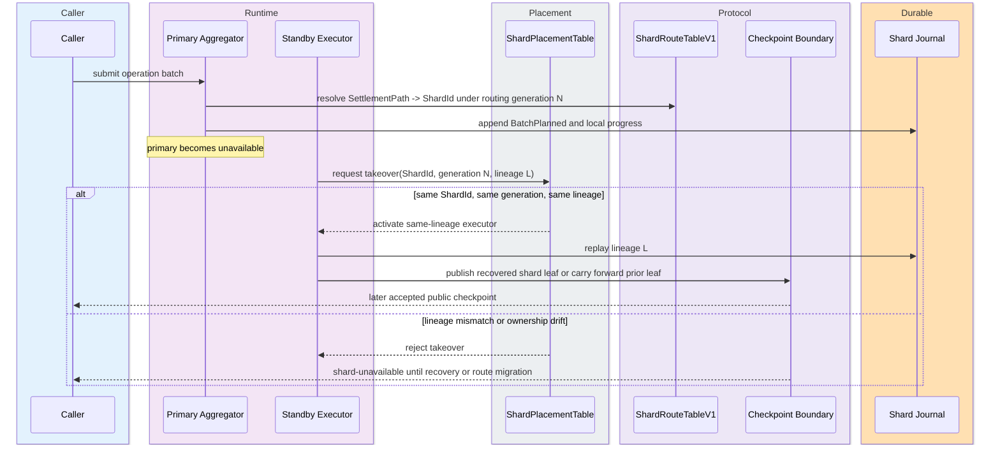

### 5.5 Routing Safety Requirements

The shard layer starts in one-shard compatibility mode. Real route splits are
allowed only after route-table digests, routing generation, shard roots,
per-shard journals, and proof context bindings are tested together. `BucketId`
MUST never become a protocol identity, and the current `ShardKey { definition_id,
serial_id }` planning term MUST remain separate from committed `ShardId`.

Route changes require historical metadata retention. A proof generated under an
older routing generation verifies against that generation, not against the
node's current route table. Any implementation slice that changes route
semantics MUST update route vectors, proof vectors, recovery tests, and the
evidence map in the same change set.

### 5.6 Implementation Guidance

`ShardId` MUST be a new typed identifier and not a wrapper around `BucketId`. Route-table lookup MUST be deterministic, canonical-encoded, and root-bound before multi-shard execution is enabled. The migration path MUST support generation 0 behavior by mapping every route hash to one shard, then add split vectors with old route table digest, new route table digest, old shard root, new shard roots, and checkpoint continuity.

Shard-local queues MUST reject cross-shard operations. This avoids inventing an implicit distributed transaction protocol inside the storage layer.

## 6. Upgrade 4: Root-Of-Shard-Roots Publication

Root-of-shard-roots turns stable shard roots into one public root without exposing bucket layout.

### 6.1 Root Generations

```text
RootGeneration0:
  SettlementStateRoot = current HJMT semantic root

RootGeneration1:
  SettlementStateRoot = Merkle commitment over ShardRootLeaf records
```

`ShardRootLeafV1` contains `shard_id`, `shard_root`, `shard_epoch`, `routing_generation`, `route_table_digest`, `policy_set_digest`, `journal_checkpoint`, local commit sequence, and transition flags.

Generation names in this section describe the upgrade contract. The current code
uses `RootGeneration::SettlementV1` for the live settlement root and stores no
`ShardRootLeaf` list in `HjmtRoots`. Implementation MUST add an explicit
versioned representation before any proof or root can be accepted as
root-of-shard-roots.

| `ShardRootLeafV1` field | Binding requirement |
| --- | --- |
| `shard_id` | MUST match route-table lookup for every path proven under the shard. |
| `shard_root` | Root of the shard-local HJMT state at the published shard epoch. |
| `shard_epoch` | Prevents stale shard-root replay inside one routing generation. |
| `routing_generation` | Selects the route table used for path-to-shard interpretation. |
| `route_table_digest` | Binds the route table bytes to the root and proof. |
| `policy_set_digest` | Binds active bucket policies or policy generation set for the shard. |
| `journal_checkpoint` | Binds shard-root publication to a recoverable durable state. |
| `local_sequence` | Orders shard-local commits within the shard. |
| `transition_flags` | Indicates route split, policy transition, or adaptive transition state. |

### 6.1.1 Exact Codec Contract For `ShardRootLeafV1`

`ShardRootLeafV1` is a positional binary record. Version 1 field order is
exact:

1. `shard_id` as `u32`
2. `shard_root` as 32 bytes
3. `shard_epoch` as `u64`
4. `routing_generation` as `u64`
5. `route_table_digest` as 32 bytes
6. `policy_set_digest` as 32 bytes
7. `journal_checkpoint` as `u64`
8. `local_sequence` as `u64`
9. `transition_flags` as `u32`

`transition_flags` bit assignments are fixed for version 1:

| Bit | Meaning |
| --- | --- |
| `0` | route split or route migration in progress |
| `1` | policy transition in progress |
| `2` | adaptive split or merge in progress |
| `3..31` | reserved and MUST be zero |

The canonical leaf hash is defined exactly as:

```text
H(
  "z00z.hjmt.shard-root-leaf.v1",
  canonical_bytes(
    shard_id,
    shard_root,
    shard_epoch,
    routing_generation,
    route_table_digest,
    policy_set_digest,
    journal_checkpoint,
    local_sequence,
    transition_flags
  )
)
```

Merkle construction for root-of-shard-roots MUST consume shard leaves in strict
ascending `shard_id` order and MUST hash the canonical leaf bytes above. The
public root MUST NOT depend on local insertion order, container order, or
journal replay order.

### 6.1.2 `policy_set_digest` Semantics

`policy_set_digest` is a commitment to the exact active-policy membership set
for one published shard leaf. Version 1 uses one canonical committed object:

```text
PolicySetCommitmentV1
  members:
    repeated PolicySetMemberV1 sorted by
      policy_generation
        -> bucket_policy_digest
        -> activation_checkpoint
```

Each `PolicySetMemberV1` contains:

1. `policy_generation` as `u64`
2. `bucket_policy_digest` as 32 bytes
3. `activation_checkpoint` as `u64`
4. `retirement_checkpoint` as `Option<u64>`

Version 1 policy-set rules are exact:

- the member list MUST be unique on `(policy_generation, bucket_policy_digest,
  activation_checkpoint)`;
- for the same `(policy_generation, bucket_policy_digest)` pair, active
  checkpoint intervals MUST NOT overlap;
- a singleton active policy is represented as a one-member set, not by a
  special one-policy shortcut;
- proof verification uses exact member lookup, not a free-form “allowed by”
  interpretation.

`policy_set_digest` is defined exactly as:

```text
H(
  "z00z.hjmt.policy-set.v1",
  canonical_bytes(sorted PolicySetMemberV1 list)
)
```

The shard leaf binds the set commitment. The proof binds one concrete
`policy_generation` plus one concrete `bucket_policy_digest`. The verifier accepts
only if an exact member exists and the proof checkpoint lies inside that
member's validity interval.

### 6.1.3 Naming Rule For `policy_digest`

Version 1 has only one bucket-policy digest namespace. Any proof-local field,
helper API parameter, or verifier variable named `policy_digest` means the same
32-byte value carried elsewhere as `bucket_policy_digest`.

The exact naming rule is:

```text
policy_digest == bucket_policy_digest
  == digest of canonical bucket-policy bytes for one policy_generation
```

`policy_set_digest` is a different object. It commits the checkpoint-bounded
membership set of acceptable bucket policies for the shard leaf. An
implementation MUST NOT derive a second policy digest from the policy-set bytes,
route metadata, or batch-local context and call that second value
`policy_digest`.

### 6.2 Proof Composition

A generation 1 proof contains:

```text
global shard-root inclusion proof
  + shard-local HJMT proof
  + bucket-local proof segment when required by the shard-local proof
  + terminal opening
```

The verifier first proves `ShardRootLeaf` inclusion under `SettlementStateRoot`, then verifies the shard-local HJMT proof against the leaf's `shard_root`. `routing_generation`, `shard_id`, policy digest, journal checkpoint, proof-family, and leaf-family bindings MUST agree between layers.

Verifier flow for generation 1:

```text
verify_sharded_proof(proof):
  require proof.root_generation == RootGeneration1
  require verify_global_shard_leaf(proof.global_segment)
  shard_leaf = proof.global_segment.opening
  require proof.shard_segment.shard_id == shard_leaf.shard_id
  require proof.shard_segment.routing_generation == shard_leaf.routing_generation
  require proof.shard_segment.route_table_digest == shard_leaf.route_table_digest
  member = lookup_policy_member(
    shard_leaf.policy_set_digest,
    proof.shard_segment.policy_generation,
    proof.shard_segment.bucket_policy_digest,
  )
  require member exists
  require member.activation_checkpoint <= proof.shard_segment.journal_checkpoint
  require member.retirement_checkpoint is none
    or proof.shard_segment.journal_checkpoint < member.retirement_checkpoint
  require proof.shard_segment.journal_checkpoint == shard_leaf.journal_checkpoint
  require verify_shard_local_hjmt(proof.shard_segment, shard_leaf.shard_root)
  return success
```

An optimized verifier can share parsing and hashing with `BatchProofBlob`, but
the global and shard-local layers remain separate acceptance checks. A valid
shard-local proof is not public evidence unless the matching shard leaf is
included under the public settlement root.

### 6.2.1 Worked Example: Two-Layer Public Membership Proof

This section is explanatory. It shows exactly how one public membership proof is
assembled in root generation 1.

Assume the system has already published checkpoint `101` from Section 6.8 and
the public root is:

```text
S_101 = H(Leaf(A, R_A), Leaf(B, R_B'), Leaf(C, R_C))
```

We want to prove that the asset leaf at canonical settlement path `P_5` exists
and is publicly visible. `P_5` resolves to shard B under routing generation 7.
The published shard leaf is:

```text
Leaf_B = ShardRootLeafV1(
  shard_id = B,
  shard_root = R_B',
  shard_epoch = 12,
  routing_generation = 7,
  route_table_digest = RT_7,
  policy_set_digest = PS_B,
  journal_checkpoint = 221,
  local_sequence = 41,
  transition_flags = 0
)
```

The proof statement is therefore:

```text
Under public root S_101,
the shard leaf Leaf_B is included,
and under Leaf_B.shard_root = R_B',
the shard-local HJMT proves that settlement path P_5 opens to the claimed asset leaf.
```

The two proof layers are:

1. one global Merkle inclusion proof from `Leaf_B` to `S_101`;
2. one shard-local HJMT proof from `P_5` and its terminal opening to `R_B'`.

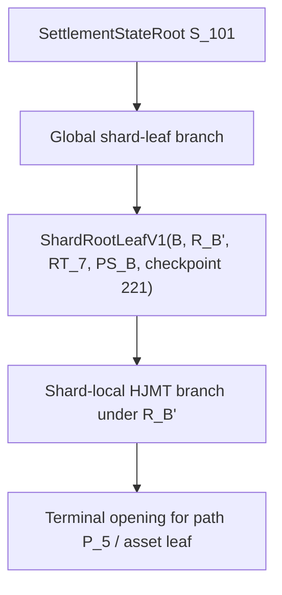

The verifier performs these exact checks:

1. parse the global segment and recompute that `Leaf_B` is included under
   `S_101`;
2. read `shard_id`, `routing_generation`, `route_table_digest`,
   `policy_set_digest`, and `journal_checkpoint` from the opened shard leaf;
3. require the shard-local segment to bind the same `shard_id`,
   `routing_generation`, `bucket_policy_digest`, and `journal_checkpoint`;
4. verify that `(policy_generation, bucket_policy_digest)` is an exact member of
   `PS_B` at checkpoint `221`;
5. verify the shard-local HJMT path from `P_5` to `R_B'` using the terminal
   opening for the claimed asset leaf;
6. accept only if both layers succeed.

The critical property is that the shard-local proof alone is not enough. If
aggregator B already computed a newer local root `R_B''` but `R_B''` has not yet
been published, the shard-local segment may verify against `R_B''`, but the
global segment still opens `Leaf_B.shard_root = R_B'`. The public proof must
therefore fail until a later publication checkpoint includes `R_B''` under a
new public settlement root.

This is exactly how one verifier proves both facts at once:

- the asset leaf exists under the shard-local tree;
- the shard-local tree is the one currently committed by the public
  `SettlementStateRoot`.

### 6.3 Publication Cadence

The first implementation MUST support checkpoint-window publication. Shard-local queues can commit inside the window, but public proofs reference only shard roots that are included in the public `SettlementStateRoot`. Implementations SHOULD also provide synchronous global publication for small deployments and compatibility vectors.

Publication modes:

| Mode | Behavior | Use case |
| --- | --- | --- |
| Synchronous | Every shard-local commit waits for immediate global inclusion. | Small deployments and first compatibility vectors. |
| Checkpoint-window | Shards commit locally, then selected shard roots are included at checkpoint cadence. | Throughput-oriented deployments with explicit finality windows. |
| Emergency freeze | A shard can stop publishing new roots while old public roots remain verifiable. | Recovery from shard-local corruption or route-table dispute. |

### 6.3.1 Canonical Checkpoint Publication Object

Checkpoint-window publication uses one exact committed publication object:

```text
CheckpointPublicationV1
  root_generation_tag
  publication_mode_tag
  publication_checkpoint
  route_table_digest
  prior_public_root
  shard_leaf_count
  shard_leaves sorted by shard_id
```

`CheckpointPublicationV1` is a positional binary record. Version 1 MUST NOT
use map encoding, TLV sections, omitted default fields, alternate varint forms,
text-form roots or digests, or producer-chosen shard-leaf order.

Version 1 field order is exact:

1. `root_generation_tag` as `u8`
2. `publication_mode_tag` as `u8`
3. `publication_checkpoint` as `u64`
4. `route_table_digest` as 32 bytes
5. `prior_public_root` as canonical `SettlementStateRoot` bytes
6. `shard_leaf_count` as `u32`
7. `shard_leaves` as repeated canonical `ShardRootLeafV1` bytes sorted by
   ascending `shard_id`

`root_generation_tag` reuses the wire constants from Section 3.1.1:

| Value | Meaning |
| --- | --- |
| `0x00` | root_generation_0 |
| `0x01` | root_generation_1 |

The canonical publication digest is defined exactly as:

```text
H(
  "z00z.hjmt.checkpoint-publication.v1",
  canonical_bytes(
    root_generation_tag,
    publication_mode_tag,
    publication_checkpoint,
    route_table_digest,
    prior_public_root,
    shard_leaf_count,
    shard_leaves
  )
)
```

Two logically equivalent publication objects with different shard-leaf order,
different byte widths, or different optional encodings are non-compliant. One
logical publication object has exactly one accepted byte sequence and exactly
one accepted digest.

`publication_mode_tag` is fixed for version 1:

| Value | Mode |
| --- | --- |
| `0x00` | synchronous |
| `0x01` | checkpoint_window |
| `0x02` | emergency_freeze |

`prior_public_root` is the settlement root that was externally visible
immediately before this publication object became valid. It MUST NOT use an
all-zero sentinel when a prior visible root exists.

- for the first root-generation-1 publication, `prior_public_root` MUST equal
  the last externally visible root-generation-0 settlement root;
- for genesis or empty initialization, `prior_public_root` MUST equal the
  canonical genesis settlement root for the active generation;
- later publications MUST set `prior_public_root` to the immediately preceding
  visible public root, not to a locally durable unpublished shard root.

`prior_public_root` is not optional in version 1. First-publication semantics
are therefore resolved by choosing the correct prior visible root, not by
omitting the field or by using a producer-local sentinel.

The exact set of shard-local commits admitted into one public checkpoint is the
set represented by `shard_leaves` in `CheckpointPublicationV1`. Every active
shard from the committed route table MUST appear exactly once. A shard that did
not change in the current checkpoint carries forward its previously published
`ShardRootLeafV1` bytes unchanged.

`SettlementStateRoot` for root generation 1 is computed only from the ordered
`ShardRootLeafV1` list in this object. No implementation may choose a subset,
merge duplicate shard leaves, or reorder shard leaves and still claim the same
public checkpoint.

### 6.3.2 Monotonicity Rules

Publication and shard-local monotonicity rules are exact:

- `publication_checkpoint` MUST be strictly increasing within one root
  generation;
- the route-table `activation_checkpoint` used by a publication MUST be less
  than or equal to `publication_checkpoint`;
- for a fixed `(shard_id, routing_generation)` pair, the published tuple
  `(shard_epoch, local_sequence, journal_checkpoint)` MUST be lexicographically
  non-decreasing across successive public checkpoints;
- if a shard leaf changes between two public checkpoints, that tuple MUST be
  lexicographically strictly increasing;
- `journal_checkpoint` for one shard MUST NOT decrease across public
  checkpoints;
- a route-generation change is legal only at a publication checkpoint and only
  when the published shard leaves all bind the new `route_table_digest`;
- older route generations and older policy-set commitments MUST remain
  available for historical proof verification after later publications.

Version 1 does not require `local_sequence` increments to be contiguous across
public checkpoints. A shard may publish local sequence `15` after previously
publishing `10` if sequences `11..14` were durable shard-local commits that were
never individually exposed as public checkpoints.

Checkpoint-window mode MUST report both local durability latency and public
proof latency. A wallet cannot treat a shard-local root as public settlement
state until the root appears in `SettlementStateRoot`.

### 6.3.3 Protection, Failure Containment, And Recovery Layers

The protection of the full construction is layered and explicit:

| Layer | Committed object | What it prevents |
| --- | --- | --- |
| Path and routing | `SettlementPath`, `route_hash`, `ShardRouteTableV1`, `route_table_digest` | Silent reroute, local load-based shard drift, and historical route ambiguity. |
| Shard publication | `ShardRootLeafV1` | Stale shard-root replay, route-generation drift, policy-set drift, and journal-checkpoint mismatch. |
| Proof acceptance | `BatchProofBlobV1` and two-layer verifier flow | Partial acceptance, proof-family mixing, malformed indexes, and root mixing. |
| Public checkpoint | `CheckpointPublicationV1`, `publication_checkpoint`, `prior_public_root` | Reordering, subset publication, duplicate shard leaves, and synthetic public roots. |
| Durability and recovery | `BatchJournalStage`, shard journal checkpoints, carry-forward rule for unchanged leaves | Publishing a root that cannot be replayed after restart or after shard-executor failure. |

Recovery rules are exact:

- after restart, the node MUST expose either the prior visible public root or
  the exact planned later root reconstructed from durable journal state;
- it MUST NOT expose a synthetic mixed root assembled from some new child roots
  and some lost unpublished child roots;
- if one shard executor is unavailable, its last published leaf can be carried
  forward unchanged, but unpublished local progress for that shard remains
  private until recovery completes;
- proof verification against the public root remains valid during recovery
  because the last visible root and its shard leaves remain immutable public
  evidence.

This is where the design is protected at every level: deterministic routing,
root-bound shard leaves, fail-closed proof parsing, canonical checkpoint
objects, and journal-bound recovery.

### 6.3.4 Operational Summary And Source-Of-Truth Rules

The operational split is strict:

- the planner decides shard-local admission only;
- the publication boundary decides public visibility only;
- a shard-local root may already be durable while not yet being part of the
  public `SettlementStateRoot`.

The planner is therefore responsible for canonical operation order,
deterministic route lookup, grouping by `ShardId`, and single-shard rejection.
It MUST NOT decide which shard-local result is already public state. Public
state changes only when `CheckpointPublicationV1` is accepted.

An aggregator does not self-announce authority. If an executor is only a
hot-standby for an existing shard, it MUST continue the same `ShardId`, the
same `routing_generation`, and the same journal lineage. If an executor starts
serving a new traffic slice, that is not failover; it is route migration under
a later committed route-table generation.

Aggregator shutdown or shard-executor loss MUST NOT break public truth. Until
the shard recovers, the system has only two legal outcomes:

- carry the last published `ShardRootLeafV1` bytes forward unchanged; or
- publish an explicit later route migration through the normal route-table and
  checkpoint path.

There is no third legal path in version 1. In particular, the system MUST NOT
silently reroute traffic, synthesize a replacement shard leaf, or expose a
producer-local "best effort" public root.

The strongest recovery property is that the node MUST never expose a partially
assembled public root. After failure it may expose only:

- the prior visible public root; or
- the exact later root reconstructed from durable journal state.

`Aggregator` ownership is not the source of truth. The source of truth is the
committed route generation, the published shard-leaf set, and the accepted
public checkpoint.

Other components therefore learn shard authority only through three committed
boundaries:

- `ShardRouteTableV1`, which assigns semantic ownership from `SettlementPath`
  through `route_hash` into `ShardId` under one committed routing generation;
- `ShardRootLeafV1`, which binds one shard-local root to one shard identity,
  one route-table digest, one policy-set digest, and one journal checkpoint;
- `CheckpointPublicationV1`, which makes one exact shard-leaf set publicly
  visible under one canonical `SettlementStateRoot`.

Runtime placement records such as `AggregatorId`, standby membership, shard
heartbeats, and placement liveness MAY help the node choose where code runs,
but they MUST NOT appear as standalone proof truth or override the committed
route-table assignment.

Machine discovery, peer gossip, executor placement, or scheduler-local process
topology MAY decide where code runs, but they MUST NOT decide public truth.
Protocol rules constrain output, not process placement. The planner may run
inside one aggregator ingress, next to a storage leader, or in a separate
coordinator process, and those deployment choices MUST NOT change shard
ownership, route authority, or verifier-visible state.

Planner and trust boundaries are therefore exact:

- routing determines which `ShardId` logically owns one `SettlementPath`;
- the shard executor only executes work already assigned to that shard;
- the publication boundary decides which shard-local roots become public;
- the verifier trusts only committed digests and the public root, never
  aggregator-local claims.

### 6.4 Compatibility

Root generation is proof-bound. Generation 0 proofs use the current HJMT root model. Generation 1 proofs use global shard-root inclusion plus shard-local HJMT verification. Migration requires golden vectors for final generation 0 root, route table, initial shard roots, initial generation 1 root, checkpoint continuity, and historical proof acceptance.

The repository currently exposes the live settlement generation as `RootGeneration::SettlementV1`. Generation 0 and generation 1 in this section are migration names for the upgrade contract. They require code changes before they can appear as accepted proof or root variants.

Migration vectors required before enabling generation 1:

| Vector | Contents |
| --- | --- |
| Last generation 0 root | Current `SettlementStateRoot`, equivalent semantic root, journal checkpoint, and representative single-path proofs. |
| One-shard route table | Route-table bytes, digest, one shard ID, activation checkpoint, and all-route range. |
| Initial shard leaf | Shard ID, shard root equal to the carried HJMT root semantics, route digest, policy digest, and journal checkpoint. |
| First generation 1 root | Merkle root over the initial shard leaf and proof that old sample paths verify through the new wrapper. |
| Historical proof sample | A generation 0 proof that still verifies after generation 1 is active. |
| Rejection sample | A generation 1 shard-local proof with wrong route digest, stale shard epoch, or missing global segment that fails closed. |

### 6.5 Root Publication Requirements

Root-of-shard-roots keeps one public `SettlementStateRoot`, but it adds a second
verification layer: global shard-root inclusion plus shard-local HJMT proof.
That layer is permitted only after `ShardId` and route-table tests exist. The
first migration MUST be a no-op semantic vector with one route table, one
shard, and one `ShardRootLeaf` before multiple shard roots are enabled.

Every shard-root proof binds route generation, route-table digest, policy
digest, journal checkpoint, proof family, and leaf family across both layers. A
shard root included under one route generation MUST NOT verify with another
route table. Existing root structures do not yet store shard-root leaves, so
the implementation MUST change the storage root model before enabling this
root generation.

### 6.6 Implementation Guidance

The first public root migration MUST be a no-op semantic migration: one route table, one shard, one `ShardRootLeaf`, and a generation-tagged proof that verifies to the same settlement semantics as the prior HJMT root. Additional shard roots MUST NOT be introduced until that compatibility vector is stable.

Historical proof verification MUST load the root-generation metadata from the proof context, not from the node's current configuration.

### 6.7 C4 Component View: Shard Root Publication

This component view connects Sections 5 and 6. It shows how committed routing,
shard-local state, and the global public root compose without exposing bucket
layout as public authority.

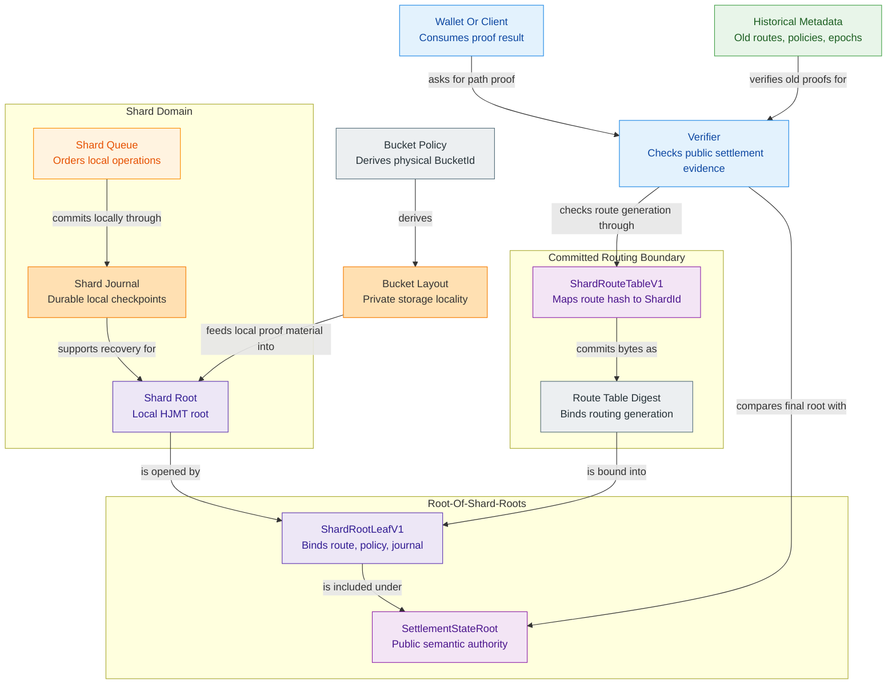

### 6.8 Worked Example: Three Aggregators, Eight Assets, One Shard-Local Batch

This section is explanatory. It does not replace the normative rules in
Sections 5.2, 5.4, 6.1, and 6.3. Its purpose is to show the intended runtime
shape of the design with concrete numbers.

The target design keeps one public semantic root even when hot data is split
across multiple aggregators. What disappears is the requirement that all hot
state live inside one monolithic internal HJMT. Each aggregator owns one
shard-local tree and one shard-local journal, while the public chain-facing
authority remains one `SettlementStateRoot`.

#### 6.8.1 Shard-Local Trees Under One Public Root

Assume the route table currently maps eight assets into three shards:

| Aggregator | Shard | Assets routed into the shard | Shard-local root |
| --- | --- | --- | --- |
| Aggregator A | `ShardId = A` | `asset_1`, `asset_2` | `R_A` |
| Aggregator B | `ShardId = B` | `asset_3`, `asset_4`, `asset_5`, `asset_6` | `R_B` |
| Aggregator C | `ShardId = C` | `asset_7`, `asset_8` | `R_C` |

The resulting publication shape is:

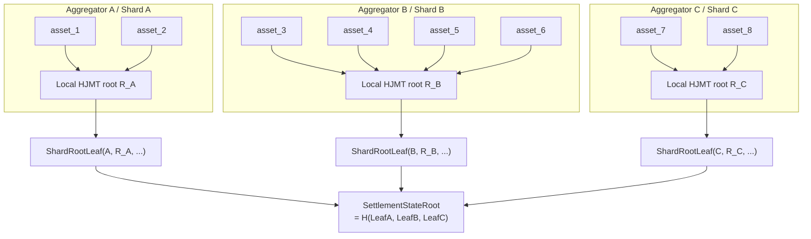

At public checkpoint `100`, the published root is:

```text
R_A   = local root over {asset_1, asset_2}
R_B   = local root over {asset_3, asset_4, asset_5, asset_6}
R_C   = local root over {asset_7, asset_8}

S_100 = H(
  ShardRootLeaf(A, R_A, ...),
  ShardRootLeaf(B, R_B, ...),
  ShardRootLeaf(C, R_C, ...)
)
```

There is therefore still one public state root. The design changes the
internal execution topology, not the existence of one public semantic root.

#### 6.8.2 One Batch Inside Shard B

Now assume one new batch touches only `asset_5` and `asset_6`.

1. The planner computes `SettlementPath -> route_hash -> ShardId` for every
   touched path.
2. Both paths resolve to `ShardId = B`.
3. The planner accepts the batch because it is shard-local.
4. Aggregator B applies the batch to its shard-local HJMT only.
5. The shard-local root changes from `R_B` to `R_B'`.
6. The shard-local journal advances, for example from
   `(journal_checkpoint = 220, local_sequence = 40)` to
   `(journal_checkpoint = 221, local_sequence = 41)`.
7. Until the next global publication boundary, the public root is still
   `S_100`.

The key rule is that local durability and public settlement are not the same
event in checkpoint-window mode.

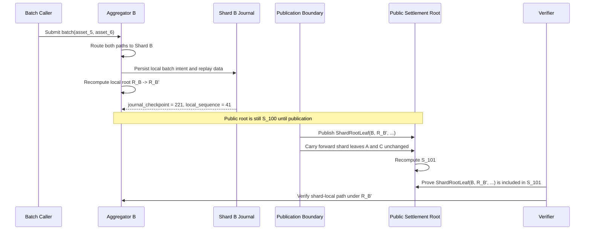

The root transition is therefore:

```text
Before local batch:
  S_100 = H(Leaf(A, R_A), Leaf(B, R_B),  Leaf(C, R_C))

After local batch but before publication:
  local shard state in B is durable as R_B'
  public root is still S_100

After publication:
  S_101 = H(Leaf(A, R_A), Leaf(B, R_B'), Leaf(C, R_C))
```

Aggregators A and C do not need to recompute their shard-local trees for this
example. Their shard leaves are carried forward unchanged into the next public
checkpoint.

#### 6.8.3 Cross-Shard Counterexample

If one batch touched `asset_6` in shard B and `asset_7` in shard C at the same
time, version 1 would not treat that as one legal multi-shard batch.

- the planner would detect that the touched paths map to different shard IDs;
- the planner MUST reject the batch for this upgrade;
- the implementation MUST NOT invent a distributed transaction protocol
  between aggregators as an implicit fallback.

That is why shard-local batching is the expected fast path in this design,
while cross-shard mutation remains an explicitly unsupported case for this
upgrade version.

#### 6.8.4 Worked Lifecycle: Adding Aggregator D

The question "how do others learn about aggregator D's shards?" has two
different answers depending on whether D is only a replacement executor or a
new routing target.

Case 1: Aggregator D joins as hot-standby for an existing shard.

1. The committed route table remains unchanged.
1. D mirrors or replays the same shard journal lineage as the current
    executor.
1. D has no independent public authority and no new shard is introduced at the
    protocol layer.
1. If failover occurs, D MUST resume the same `ShardId`, the same
    `routing_generation`, and the same journal lineage.
1. Other participants do not learn about a "new shard" because no new shard
    exists; only process placement changed.

Case 2: Aggregator D receives a real new traffic slice or a new shard.

1. Operators publish a later `ShardRouteTableV1` generation with a new
    `route_table_digest` and one activation checkpoint.
1. Before that activation checkpoint, D may pre-stage local execution state,
    but it still has no public authority.
1. At the first public checkpoint that uses the new route generation,
    publication binds the new shard-leaf set to that committed route table.
1. Only after that checkpoint do verifiers and other executors observe D-owned
    traffic through committed protocol state.
1. If the migration is not published, the protocol MUST treat D as
    non-authoritative even if it already computed local roots.

The key rule is that other components learn about D through committed routing
generation plus committed checkpoint publication when committed shard ownership
changes, not through machine discovery. In the hot-standby case no new shard
authority is created; only executor placement changes for the already-
committed `ShardId`.
In the common case where only one shard publishes a new local root, unaffected
executors do not need to recompute their trees. Their last published
`ShardRootLeafV1` bytes carry forward unchanged into the next public
checkpoint.

#### 6.8.5 Worked Timeline: Aggregator B Fails Mid-Window

Assume public checkpoint `101` is visible under routing generation `7`.
`Leaf_B_101` is the last published shard leaf for shard B. During the next
checkpoint window, B computes a newer local root `R_B_102` but crashes before
public publication.

1. `t0`: `S_101` is the visible public root. Proofs against `S_101` remain
    valid for all shards.
1. `t1`: B accepts only shard-B batches, journals local progress, and computes
    `R_B_102` locally.
1. `t2`: B fails before `CheckpointPublicationV1` includes
    `ShardRootLeaf(B, R_B_102, ...)`.
1. `t3`: New shard-B batches MUST receive a retryable shard-unavailable
    result. The system MUST NOT silently reroute them inside the same
    `routing_generation`.
1. `t4`: Shards A and C may continue local commits. The next public checkpoint
    may carry forward the last published shard-B leaf byte-for-byte unchanged
    while publishing new A and or C leaves.
1. `t5`: After restart, recovery MUST expose either the prior visible public
    root or the exact later root reconstructed from durable journal state. It
    MUST NOT expose a synthetic mixed root.
1. `t6`: If a standby for B exists and resumes the same `ShardId`, the same
    `routing_generation`, and the same journal lineage, it may replay the
    journal and later publish a new shard-B leaf under the same shard identity.
1. `t7`: If traffic must move away from B permanently, operators must publish
    a later route generation and a later public checkpoint. That is route
    migration, not failover.

If recovery cannot safely publish new shard-B roots, the system may enter
emergency freeze for shard B while older public roots remain verifiable. The
blast radius therefore stays bounded to unpublished shard-B progress rather
than corrupting public settlement truth.

## 7. Upgrade 5: Local Adaptive Transitions

Adaptive bucket and policy records are useful only if transitions are local, bounded, recoverable, and historical-proof-safe.

### 7.1 Transition Families

Supported transition proofs are local bucket split, sibling-bucket merge, and local policy transition for one shard, definition, serial, or bucket group. Transitions happen at shard checkpoint boundaries by default. They do not change `SettlementPath` or stable `ShardId`.

The repository already contains record shapes for adaptive transitions. The
upgrade work is to define verifier semantics, recovery behavior, and benchmark
evidence around those records.

| Current record | Current role | Upgrade semantics to prove |
| --- | --- | --- |
| `AdaptiveBucket` | Metadata for one adaptive bucket and its occupancy evidence. | Bucket metadata is root-bound and policy-epoch-bound. |
| `SplitProof` | Record connecting prior root, next root, bucket roots, policy, occupancy evidence, range commitment, and journal digest. | One old bucket's terminal set equals the union of the new bucket terminal sets. |
| `MergeProof` | Record connecting prior root, next root, sibling bucket roots, merged root, policy, occupancy evidence, range commitment, and journal digest. | Two sibling bucket terminal sets equal the merged bucket terminal set. |
| `PolicyTransitionProof` | Record connecting prior root, next root, prior policy, next policy, terminal set commitment, occupancy evidence, and replay digest. | One bounded terminal set moved under one policy-epoch transition without changing proof identity. |

### 7.2 Split Proof

A split proof binds pre-root, post-root, shard id and route generation when sharding is enabled, old policy digest, new policy digest, old bucket id, new bucket ids, moved ranges, occupancy evidence class, and transition checkpoint. It proves every old-bucket leaf appears in exactly one new bucket and no unrelated leaf is introduced.

The current `SplitProof` fields bind prior and next settlement roots, prior and
next bucket epochs, prior bucket root, left and right bucket roots, bucket
policy id, occupancy evidence, key-range commitment, and journal digest. A
sharded implementation MUST add shard id and route generation. The current
record MUST NOT be described as already carrying those fields.

Verifier obligations:

1. Check prior and next roots use the claimed root generation.
2. Check `next_epoch` advances from `prior_epoch` under policy rules.
3. Check the range commitment covers the old bucket's terminal set.
4. Check left and right bucket roots partition the old terminal set exactly.
5. Check occupancy evidence authorizes split according to the policy.
6. Check journal digest binds a recoverable transition boundary.

### 7.3 Merge Proof

A merge proof binds pre-root, post-root, sibling bucket ids, merged bucket id, old and new policy digests, occupancy evidence class, and transition checkpoint. It proves the merged bucket contains exactly the union of sibling leaves.

The current `MergeProof` binds prior and next roots, prior and next epochs,
left bucket root, right bucket root, merged bucket root, bucket policy id,
left/right/pair occupancy evidence, key-range commitment, and journal digest.
Bucket identity and route context can be reconstructed from the enclosing proof
context today. Making them explicit fields MUST be a versioned record change.

Verifier obligations:

1. Check left and right roots are compatible siblings under the active policy.
2. Check the pair occupancy evidence authorizes merge.
3. Check the merged root contains exactly the union of left and right terminal
    sets.
4. Check no terminal appears twice after merge.
5. Check historical proofs under both old bucket roots remain bound to the
    historical epoch and policy.

### 7.4 Occupancy Privacy

Verifier-visible occupancy evidence uses the current coarse classes:
`Empty`, `MergeLow`, `Steady`, `SplitReady`, and `SetCommit`. These classes are
policy evidence, not exact counts. Exact local counts belong to
`BucketOccupancyMetric` and stay node-local unless a versioned disclosure
policy explicitly permits disclosure.

| Record | Visibility | Rule |
| --- | --- | --- |
| `BucketOccupancyEvidence` | Proof-visible when a transition needs policy evidence. | Carries version, scope, class, and binding digest. |
| `BucketOccupancyMetric` | Local scheduling and operator diagnostics. | Carries exact count and MUST NOT be used as public proof input by default. |
| `OccupancyScope` | Proof-visible if evidence is included. | Limits evidence to bucket, pair, or set scope. |
| `OccupancyClass` | Proof-visible coarse class. | Avoids publishing exact workload shape. |

The binding digest in occupancy evidence MUST bind the evidence to the relevant
root, bucket root, epoch, policy, and transition subject. Without that binding,
the same coarse class could be replayed under another bucket or epoch.

### 7.5 Historical Proof Rule

Historical proofs verify against the root generation, route generation, bucket policy, and epoch that governed the historical root. Later split, merge, or policy transition events do not reinterpret old proofs under current policy.

### 7.6 Transition Safety Requirements

Local transitions MUST prove exact leaf preservation. A split proves that every
old-bucket leaf appears in exactly one new bucket. A merge proves that the new
bucket contains exactly the union of the old sibling buckets. Occupancy evidence
can justify a transition policy, but it cannot replace preservation proof.

Historical proofs always bind the historical root generation, route generation,
bucket policy, and epoch. Current configuration MUST NOT reinterpret old proof
paths. The repository already defines adaptive transition records, but live
transition implementation, recovery behavior, and benchmark evidence MUST be
proven before automatic scheduling is enabled.

### 7.7 Implementation Guidance

Transition code SHOULD first operate on a closed set of terminal leaves captured by a `terminal_set_commitment` or key-range commitment. The proof MUST show that the old set equals the union of new sets for split, or that two old sets equal the new set for merge. Occupancy evidence can justify why a transition was allowed, but it MUST NOT replace leaf preservation proof.

Automatic split or merge scheduling MUST stay disabled until the system has enough telemetry to show that transition churn does not harm proof size, cache behavior, or publication latency.

Initial implementation MUST add verifiers before schedulers. A manual or test
fixture can construct transition records, run the preservation check, and
exercise recovery without enabling production auto-split. This keeps transition
soundness independent from policy-tuning and telemetry quality.

### 7.8 Mermaid State View: Adaptive Transition Lifecycle

This state view shows the legal lifecycle for split, merge, and policy
transition records. It emphasizes that occupancy evidence can select a
transition path, but preservation proof and durable publication decide whether
the transition becomes public state.

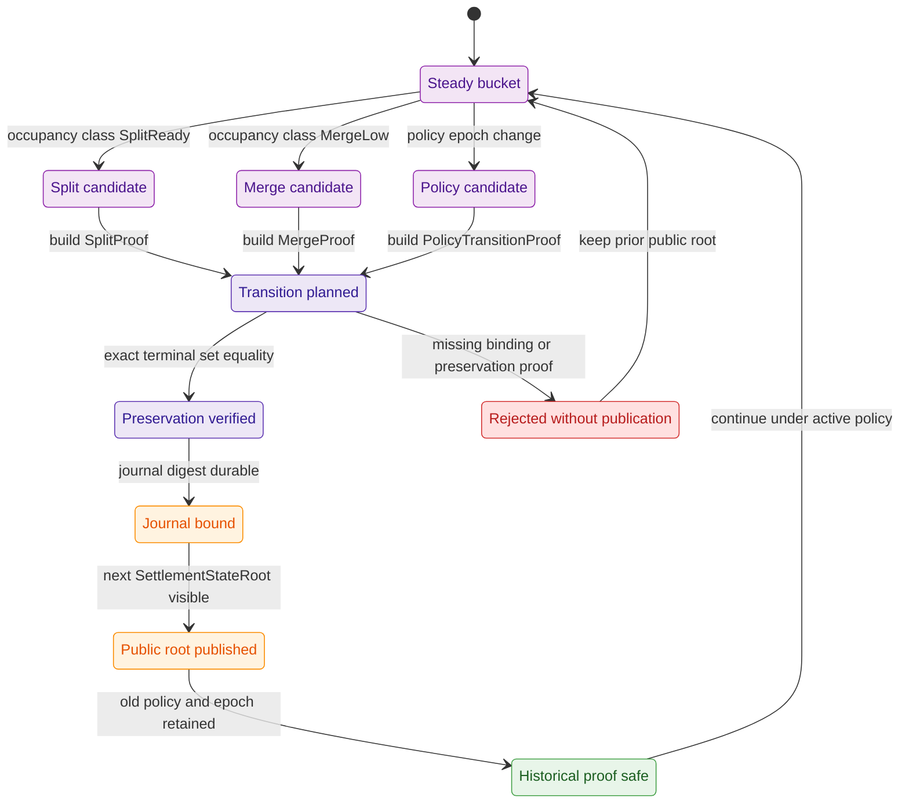

## 8. Upgrade 6: Inside-Tree Versus Outside-Tree Data Boundary

HJMT commits minimal settlement truth. Auxiliary systems accelerate lookup, scanning, analytics, publication, and wallet UX.

| Data class | Inside HJMT | Outside HJMT | Reason |
| --- | --- | --- | --- |
| Terminal settlement leaf hash | Yes | Non-authoritative copy | Inclusion, deletion, and absence truth. |
| Leaf family tag | Yes | Non-authoritative index copy | Prevents cross-family proof confusion. |
| Semantic path or path hash | Yes | Non-authoritative path index | Binds proof to `SettlementPath`. |
| Asset or right state digest | Yes | Full body can be outside | Keeps proofs small while binding external data. |
| Large encrypted payload | Digest only | Yes | Avoids proof and state bloat. |
| Deletion fact | Yes when required | Non-authoritative history row | Needed for deletion proof contracts. |
| Path index | No | Yes | Rebuildable lookup plane. |
| Wallet scan hints | No | Yes | Wallet-local or node-local acceleration. |
| Fee queues | Only bounded committed facts | Yes | Avoids mixing operation queues with settlement truth. |
| Occupancy diagnostics | Coarse class only if proof-required | Yes | Avoids public workload leakage. |
| Metrics and cache rows | No | Yes | Derived observability and acceleration data. |

Proof openings reveal the minimum material needed to reconstruct the committed leaf hash. If an opening references auxiliary data by digest, the proof verifies the digest binding but not auxiliary data availability unless a separate availability contract exists.

The committed leaf family already separates asset leaves from right leaves.
`SettlementLeaf::check_path` binds terminal identity to the settlement path, and
`RightLeaf` stores commitments and policy IDs rather than full operational
payloads. That pattern SHOULD continue: put digest-bearing commitments inside
HJMT and keep bulky or operational material outside unless the protocol needs
the bytes for proof truth.

| Leaf family | Inside-tree commitment | Outside-tree candidate |
| --- | --- | --- |
| Asset leaf | Asset identity, serial binding, and committed asset state needed for settlement proof. | Wallet display data, scans, analytics, and large encrypted bodies by digest. |
| Right leaf | Terminal id, right class, issuer/provider/holder/control/beneficiary commitments, payload commitment, validity windows, policy IDs, and use nonce. | Full payload body, policy text, disclosures, operational queues, and UX metadata. |
| Deletion fact | Root-bound deletion evidence when the proof family requires it. | Historical materialized audit views. |
| Absence/default opening | Default commitment bound to proof family and tree level. | Lookup hints used to find the absence path. |

Data availability is a separate property from membership. If a right references
an external encrypted payload by `payload_commitment`, proof verification can
show that the digest is committed. It does not show that the payload is
retrievable, decryptable, or acceptable for execution unless another protocol
layer supplies that evidence.

### 8.1 Auxiliary Boundary Requirements

Outside-tree data supports availability, search, scan, wallet UX, analytics, and
operations. It does not prove settlement truth unless a committed digest and a
separate availability contract say so. APIs that combine auxiliary data with an
HJMT proof MUST label the proof scope explicitly: membership, digest binding,
availability evidence, or UX hint.

Existence answers MUST come from `SettlementStateRoot` proof verification, not
from path indexes or cache rows. A stale but rebuilt auxiliary index can be
operationally useful while still being non-authoritative. Promotion of an
auxiliary plane into proof truth MUST require a versioned contract and new
negative tests.

### 8.2 Storage Backend Boundary

The storage backend seam is normative but narrow. It exists to provide durable
KV, transaction, and journal primitives for settlement execution. It does not
define protocol truth by itself.

`StorageBackend` and `JournalBackend` therefore own only low-level durable
primitives such as key-value reads and writes, transaction scope, journal
append and replay, and durable recovery cursor persistence.

The storage boundary MUST NOT own:

- route choice or route migration decisions;
- batch admission or planner semantics;
- proof-family meaning or verifier acceptance;
- public-checkpoint selection;
- wallet semantics or wallet-facing authority;
- ownership of protocol-domain types such as `SettlementPath`, `ShardId`, and
  `SettlementStateRoot`.

In particular, the storage seam MUST NOT become the native home of protocol
objects such as `AssetLeaf`, `RightLeaf`, `ShardRouteTableV1`, or
`BatchProofBlobV1`. Those objects may be serialized through storage, but their
meaning stays above the storage backend.

The current evidence-backed backend remains `RedB`. This document treats that
choice as the canonical current implementation, not as a permanent public API
contract. Backend migration claims require the benchmark and conformance gates
from Sections 9 and 12.

### 8.3 Access Rules For Wallet, Aggregator, Settlement, And Storage

Access boundaries are strict:

| Caller | Allowed boundary | Forbidden dependency |
| --- | --- | --- |
| Wallets and proof consumers | Proofs, published roots, checkpoint artifacts, and explicitly versioned query APIs. | Direct dependency on storage-backend internals or journal rows as proof authority. |
| Runtime aggregators | Settlement-facing contracts, planner inputs, journal wrappers, and checkpoint handoff APIs. | Direct dependency on raw `RedB` internals or backend-vendor transaction types. |
| Validators and watchers | Committed artifacts, verdict inputs, evidence exports, and operational status views. | Ad-hoc mutation of shard ownership or direct wallet-style reads from backend internals. |
| Storage layer | Durable execution primitives, proof codecs, canonical persisted forms, and replay helpers. | Runtime-placement ownership or self-authorization of public truth. |

In particular, wallet code MUST NOT bypass proof and checkpoint contracts by
reading storage-backend rows directly. Aggregator code MAY depend on public
storage wrappers or versioned settlement contracts, but it MUST NOT couple
itself to raw `redb::Database`-style internals.

### 8.4 Protocol Types Versus Storage Types

Protocol-domain types remain protocol-owned even when current packaging keeps
them near storage code.

| Type class | Examples | Ownership rule |
| --- | --- | --- |
| Protocol or domain types | `SettlementPath`, `SettlementStateRoot`, `ShardId`, `ShardRouteTableV1`, `ShardRootLeafV1`, proof envelopes, checkpoint publications. | MUST stay authoritative outside storage-only modules. |
| Storage-only types | Row codecs, page keys, table names, recovery cursors, backend transaction wrappers, cache rows. | MUST NOT redefine protocol semantics or become public proof contracts by accident. |

One crate may host both classes during migration, but co-location MUST NOT turn
storage-only modules into owners of protocol meaning. Moving a type between
these classes requires an explicit versioned contract update, not an internal
refactor alone.

### 8.5 Public Export Hygiene For Backend Wrappers

Public exports MAY expose backend wrappers such as `RedbStorage`,
`MemoryStorage`, or equivalent facade types. Public exports MUST NOT expose raw
backend-vendor internals as part of stable runtime or wallet-facing signatures.

The minimum export-hygiene rules are:

- raw backend structs and transaction types remain private or crate-private;
- public wrappers implement the shared storage or journal seam instead of
  leaking vendor-specific method sets;
- backend interchangeability claims are valid only after a shared conformance
  suite passes for every participating backend;
- a storage crate MAY remain internally consolidated as long as these trust
  boundaries stay explicit.

### 8.5.1 C4 Component View: Storage Boundary And Access Rules

This component view keeps the wallet-facing surface, runtime caller surface,
storage wrappers, and raw backend internals separate. It exists to make the
allowed and forbidden access paths easy to scan.

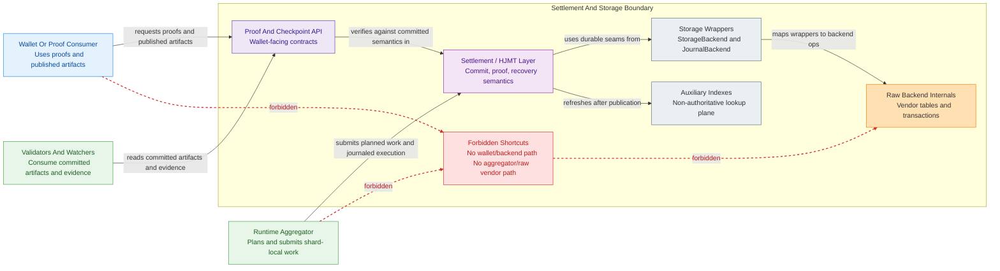

### 8.6 Implementation Guidance

APIs that return auxiliary data with a proof MUST label the proof scope explicitly: membership proof, digest binding, availability evidence, or UX hint. A digest-bound external body SHOULD be verified by recomputing its digest before display or execution, but HJMT membership alone does not prove that the external body is retrievable from the network.

## 9. Scorecard And Measurement Plan

Scores are evidence-gated.

| Criterion | 9/10 meaning |
| --- | --- |
| Bulk write TPS | Durable-root-published TPS improves under broad, hot-serial, hot-bucket, and skewed-shard workloads without weakening recovery. |
| Proof bytes | Batch proof bytes grow sublinearly for clustered workloads while preserving all bindings. |
| Verify speed | Shared-context verification reduces per-leaf overhead compared with independent proofs. |
| Shardability | Stable shards, per-shard journals, independent shard queues, and root-of-shard-roots are implemented and benchmarked. |
| Correctness | Inclusion, deletion, absence, root, journal, epoch, route, and policy invariants hold under positive, negative, crash, migration, and historical tests. |

### 9.1 Benchmark Matrix

| Benchmark | Variants | Report columns |
| --- | --- | --- |
| `hjmt_mutation_tps` | Current HJMT, bucket-local batch, shard-local HJMT. | operations, paths, buckets, shards, cache mode, persistence mode, durable TPS, worker TPS, p50/p95/p99. |
| `hjmt_batch_proof_bytes` | Single proof, `Vec<ProofBlob>`, `BatchProofBlob`, shard proof. | path count, clustering mode, proof family, serialized bytes, bytes per path, peak memory. |
| `hjmt_batch_verify` | Single verify, independent verifies, shared verify, negative rejection. | path count, verify time, per-leaf time, failure type, allocations. |
| `hjmt_shard_scaling` | 1, 2, 4, 8, 16 shard workers. | hot-shard ratio, global cadence, shard TPS, global TPS, blocked time. |
| `hjmt_recovery_matrix` | Crash at bucket, parent, shard, global, auxiliary, and final stages. | crash point, recovery action, recovered root, journal status, proof validity. |
| `hjmt_transition_locality` | Fixed baseline, split, merge, transition. | transition type, proof bytes, prove time, verify time, occupancy class, recovery time. |
| `hjmt_backend_boundary` | Current durable backend, memory backend, and any candidate replacement under equal durability settings. | backend, journal mode, conformance result, durable TPS, recovery result, p50/p95/p99, migration decision. |

### 9.2 Claim Gate

| Claim | Required evidence |
| --- | --- |
| Proof-size 8/10 | `BatchProofBlob` beats `Vec<ProofBlob>` for clustered paths and does not materially regress scattered paths. |
| Proof-size 9/10 | Sublinear byte growth remains visible at 128 and 1024 clustered paths. |
| Shardability 8/10 | Stable `ShardId`, per-shard journals, and shard-local proofs pass deterministic and crash tests. |
| Shardability 9/10 | Balanced and skewed benchmarks show unrelated shards keep committing while one shard is hot. |
| TPS 9/10 | Durable TPS improves after journal sync, cache verification, index update, model-history work, and root publication are included. |
| Backend migration | Shared backend conformance passes and equal-durability benchmarks show the current evidence-backed backend is the bottleneck. |

Each score claim is backed by an evidence packet. The packet is attached to a
specific claim and MUST be reproducible from repository commands or archived
reports.

| Evidence packet field | Required content |
| --- | --- |
| Baseline commit | Repository revision, feature flags, cache mode, persistence mode, and benchmark command. |
| Candidate commit | Repository revision and exact upgrade slice under test. |
| Workload profile | Path count, definition count, serial count, bucket count, shard count, clustering mode, hot-spot ratio. |
| Positive checks | Proofs, roots, commits, recovery, and historical verification that MUST pass. |
| Negative checks | Tamper, stale context, wrong policy, wrong route, wrong root, parser limit, and crash cases that MUST reject. |
| Measurements | Serialized bytes, prove time, verify time, durable TPS, worker TPS, memory, journal sync, root publication. |
| Decision | Unsupported claim, accepted score, or rejected score with reason. |

If one field is missing, the score remains unsupported even if other numbers look
strong.

### 9.3 Score Claim Discipline

The scorecard is a release gate, not a marketing score. A design can reduce
proof bytes while failing durable TPS, or improve worker throughput while
weakening recovery. No single benchmark can support an overall score.

Reports MUST declare cache mode, persistence mode, durability boundary,
workload shape, path clustering, proof family, and negative-check coverage.
Comparing a cached in-memory path against a persisted current-HJMT path
overstates gains. Until repository reports prove upgraded scores, the document
MUST state only required evidence and unsupported claim status.

Backend claims follow the same rule. This specification treats the current
durable backend as canonical until equal-durability benchmarks and shared
conformance tests show that another backend is required for the stated claim.

## 10. Correctness, Security, And Privacy Checklist

- New roots and leaves use versioned domain separation.
- Batch encodings have one canonical order.
- Proof-family and leaf-family tags are verifier-bound.
- `ShardId` remains stable across bucket policy changes.
- Routing generation and route-table digest are root-bound.
- Runtime placement never overrides committed shard ownership.
- Same-lineage failover keeps `ShardId`, `routing_generation`, and journal
  lineage intact.
- Parent roots publish only after child roots and journals are durable.
- Historical proofs bind historical policy, epoch, route generation, and root generation.
- Auxiliary indexes are rebuildable or explicitly non-consensus.
- Batch parsers enforce explicit size limits.
- Witness DAG references cannot point outside the proof object.
- Occupancy evidence uses coarse classes by default.
- Route metadata disclosure is reviewed as a privacy surface.
- Current node configuration is never used to reinterpret a historical proof.
- Backend roots are always paired with semantic root bindings before being logged, compared, or exposed.
- Wallet or runtime code does not treat raw backend rows as proof authority.
- Public backend exports remain wrapper-based rather than vendor-type-based.
- `SettlementStateRoot` and root-of-shard-roots generation are tested as separate root modes before root-of-shard-roots is enabled.

### 10.1 Evidence Mapping Discipline

Every checklist item MUST eventually map to a named test, benchmark, golden
vector, or recovery scenario. Items without evidence remain open risks and MUST
not be described as satisfied by design text alone.

The checklist is intentionally stricter than the current code. It forces tests
for deletion, absence, historical proof verification, route-policy binding,
stale-policy replay, stale-route replay, root-generation confusion, and
auxiliary-index authority leaks instead of accepting happy-path inclusion tests
as sufficient coverage.

Minimum mapping from checklist category to evidence:

| Category | Required evidence |
| --- | --- |
| Root identity | Golden vectors for current root and root-of-shard-roots generation. |
| Proof families | Inclusion, deletion, non-existence, and family-mismatch tests. |
| Batch parser | Size-limit, index-bound, duplicate-path, and malformed-table rejection tests. |
| Shard routing | Route-table digest vectors, route-generation replay rejection, and one-shard compatibility tests. |
| Journal safety | Crash tests at bucket, parent, shard, global, auxiliary, and final markers. |
| Historical proofs | Old proof acceptance under old metadata after route, policy, or root generation changes. |
| Privacy | Occupancy evidence, route metadata, and auxiliary data disclosure review. |

## 11. Implementation Roadmap

1. Add `BatchProofBlob`, parser bounds, canonical encoding, verifier logic, golden vectors, and negative tests while keeping `ProofBlob` unchanged.
2. Implement shared witness construction for clustered paths, then cross-bucket and cross-definition batches.
3. Add duplicate-path rejection, bucket delta aggregation, parent delta aggregation, journal stage records, and recovery tests.
4. Run proof-size, verify, TPS, memory, and recovery benchmarks before shard changes.
5. Introduce `StorageBackend` and `JournalBackend` seams, wrapper-only public exports, private raw backend internals, and a memory-backed conformance harness while keeping current `RedB` behavior authoritative.
6. Run backend-conformance and equal-durability benchmarks before any backend-migration claim.
7. Introduce `ShardId`, `ShardRouteTable`, route-hash vectors, route-table digest binding, and one-shard compatibility mode.
8. Partition queues, journals, recovery, and cache namespaces by shard.
9. Add runtime placement records, same-lineage failover rules, and one-machine multi-aggregator simulation for shard takeover and split-brain rejection.
10. Add root generation tags, `ShardRootLeaf`, global shard-root inclusion proofs, migration vectors, and checkpoint continuity tests.
11. Add local split, merge, and policy-transition proofs.
12. Keep SNARK and recursive proof wrapping out of this HJMT upgrade; native HJMT witnesses, shard roots, and transition proofs remain required.

| Slice | Output artifacts | Exit condition |
| --- | --- | --- |
| Batch proof contract | Format structs, parser, verifier, golden vectors, negative vectors. | `ProofBlob` compatibility stays intact and `BatchProofBlob` rejects malformed shared context. |
| Shared proof generation | Builder, clustered-path witnesses, scattered-path fallback, byte benchmarks. | Clustered batches beat `Vec<ProofBlob>` without scattered correctness regression. |
| Bucket-local commit | Delta records, journal stages, semantic equivalence tests, crash tests. | Current HJMT and delta engine agree on roots for the same operation set. |
| Storage boundary | `StorageBackend`, `JournalBackend`, wrapper exports, conformance tests, memory backend. | Durable semantics stay unchanged and backends pass one shared behavioral suite. |
| Shard identity | `ShardId`, route table, route digest binding, one-shard mode. | One-shard compatibility vectors pass without changing settlement semantics. |
| Shard publication | Per-shard queues, journals, shard roots, global wrapper proofs. | Public proof verifies through shard leaf and shard-local HJMT proof. |
| Runtime failover | Placement records, lawful standby resume, split-brain fencing, multi-aggregator simulation. | Failover resumes only under same lineage and never silently changes shard ownership. |
| Adaptive transitions | Split, merge, policy-transition verifiers and recovery tests. | Transition records prove exact preservation and historical proofs still verify. |

### 11.1 Roadmap Dependency Discipline

The order is deliberately conservative: proof-envelope compatibility first,
then batch commit measurement, then storage-boundary hardening, then shard
identity, then root migration, then adaptive automation. Real shard scaling
MUST pass through shard identity, per-shard journals, lawful failover
simulation, and root-of-shard-roots evidence. The implementation MUST reject
cross-shard operations and MUST NOT add SNARK wrapping as a substitute for
native HJMT witnesses.

Local durable journal evidence comes first. Replicated journal or shard-group
durability is a later extension point and MUST NOT become a required baseline
until local durable execution, backend conformance, and failover simulation are
already evidence-backed.

Each step MUST produce source, tests, vectors, and evidence artifacts before the
next layer assumes it as baseline. Running proof, root, journal, and shard work
in parallel without shared golden vectors risks incompatible formats that all
look plausible in isolation.

### 11.1.1 Mermaid Flow View: Upgrade Dependency Chain

This flow view summarizes the intended execution order for the new storage,
runtime, failover, and publication work. It complements the roadmap table by
making the hard dependency edges explicit.

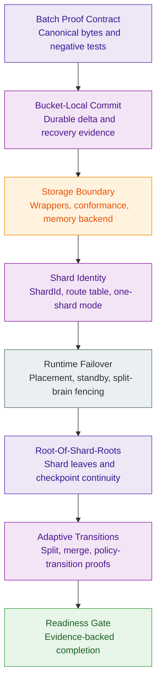

## 12. Test And Benchmark Plan

| Required artifact | What it proves |
| --- | --- |
| `test_hjmt_batch_proof.rs` | Encoded batch proofs are deterministic and verify against known roots. |
| `test_hjmt_batch_proof_negative.rs` | Tampering shared context, witnesses, references, openings, or paths fails closed. |
| `test_hjmt_batch_commit.rs` | Bucket-local batch commits match the semantic reference model. |
| `test_hjmt_batch_recovery.rs` | Interrupted journal stages recover safely. |
| `test_hjmt_storage_boundary.rs` | Wallet, runtime, and storage boundaries reject forbidden direct backend coupling. |
| `test_hjmt_backend_conformance.rs` | Storage and journal backends satisfy the same shared behavioral suite. |
| `test_hjmt_shard_routing.rs` | `SettlementPath` maps to stable `ShardId` values per routing generation. |
| `test_hjmt_failover_same_lineage.rs` | Hot-standby takeover preserves `ShardId`, `routing_generation`, and journal lineage. |
| `test_recovery_failover.rs` | Two executors cannot both publish for one shard lineage under one checkpoint boundary. |
| `test_hjmt_multi_aggregator_sim.rs` | One-machine multi-aggregator execution preserves shard ownership and fail-closed retry behavior. |
| `test_hjmt_root_generation.rs` | Pre-shard and post-shard roots cannot be confused. |
| `test_hjmt_historical_proofs.rs` | Old proofs verify under historical root, policy, epoch, and route generation. |
| `test_hjmt_transition_proofs.rs` | Split, merge, and policy transitions are bounded and root-bound. |
| `test_hjmt_privacy_regression.rs` | Occupancy and route evidence disclose only allowed fields. |

| Benchmark | What it measures |
| --- | --- |
| `hjmt_batch_proof_bytes.rs` | Serialized bytes for independent proofs versus shared batch proofs. |
| `hjmt_batch_verify.rs` | Per-leaf verifier cost under clustered and scattered paths. |
| `hjmt_bucket_delta_commit.rs` | TPS gain from one recomposition per touched bucket. |
| `hjmt_backend_boundary.rs` | Equal-durability backend comparison and migration gate. |
| `hjmt_shard_parallel_commit.rs` | Scaling under independent shard queues. |
| `hjmt_root_of_roots_publish.rs` | Global root composition cost as shard count grows. |
| `hjmt_transition_locality.rs` | Cost of split, merge, and policy-transition proofs. |

### 12.1 Evidence Gaps

The test and benchmark names are required acceptance artifacts, not evidence.
They become evidence only when files, commands, and reports exist. Missing tests
from these tables are open acceptance gaps, not polish.

The suite needs fixtures for old and new root generations, historical bucket
policies, route generations, mixed present and absent path sets, tampered shared
witnesses, interrupted journal stages, and privacy-reviewed occupancy evidence.
Without migration and historical-proof golden vectors, a breaking encoding
change can pass local tests while invalidating old proof contracts.

Fixture matrix:

| Fixture | Used by | MUST contain |
| --- | --- | --- |
| Current HJMT root set | Root and proof compatibility tests. | Settlement root, semantic root, representative asset proof, representative right proof if available. |
| Independent proof batch | Batch proof regression tests. | `Vec<ProofBlob>` for clustered and scattered paths under the same root. |
| Shared proof vector | Batch verifier tests. | Canonical `BatchProofBlob` bytes plus expected accepted root. |
| Tampered shared proof set | Negative parser and verifier tests. | One mutation per header field, path entry, opening, witness node, and reference index. |
| Bucket commit fixture | Batch commit equivalence tests. | Operation batch, old root, expected new root, touched bucket set, expected deltas. |
| Backend conformance fixture | Storage-boundary and conformance tests. | Canonical mutation set, replay sequence, expected root progression, recovery checkpoints, and forbidden-coupling assertions. |
| Route migration fixture | Shard routing tests. | Old route table, new route table, old shard root, new shard roots, activation checkpoint. |
| Failover fixture | Same-lineage failover and split-brain fencing tests. | `ShardId`, `AggregatorId`, routing generation, journal lineage, standby metadata, expected accept or reject outcome. |
| Historical proof fixture | Migration and adaptive transition tests. | Old proof, old policy, old route generation, old root generation, current node configuration. |
| Occupancy fixture | Adaptive transition and privacy tests. | Coarse evidence, local metric, policy decision, and expected disclosure boundary. |

The standalone execution checklist for these fixtures is maintained in
[Z00Z-HJMT-Fixture-Checklist.md](Z00Z-HJMT-Fixture-Checklist.md). That
checklist starts with `ShardRouteTableV1` because route-table bytes are the
first public multi-shard contract that later shard leaves, checkpoint
publications, and failover vectors bind.

Phase 058 closes the formerly open standalone artifact rows with the following
exact owner homes:

- `Shared proof vector`:
  `.planning/phases/058-HJMT-benchmarks/058-SHARED-PROOF-REPORT.md`,
  `batch_proof_v1_positive/manifest.json`, and
  `batch_proof_v1_negative/manifest.json`;
- `Bucket commit fixture`:
  `bucket_commit_equivalence/manifest.json` and
  `crates/z00z_storage/tests/test_hjmt_batch_commit.rs`;
- compatibility matrix:
  [Z00Z-HJMT-Proof-Compatibility-Matrix.md](Z00Z-HJMT-Proof-Compatibility-Matrix.md);
- threat model:
  [Z00Z-HJMT-Threat-Model.md](Z00Z-HJMT-Threat-Model.md);
- acceptance thresholds:
  [Z00Z-HJMT-Acceptance-Thresholds.md](Z00Z-HJMT-Acceptance-Thresholds.md).

## 13. Required Decisions And Fail-Closed Rules

| Topic | Decision |
| --- | --- |
| Mixed proof families | Version 1 MUST forbid mixed proof families in one `BatchProofBlob`. |
| Maximum batch size | Parser limits MUST exist before any public input is accepted. |
| `ShardId` derivation | Implementation MUST use committed route-table lookup over semantic route hash. |
| Hot definition handling | Route table SHOULD split a hot definition by route-hash range when measurement shows one definition dominates a shard. |
| Root generation | Implementation MUST keep `SettlementStateRoot` and add generation tags. |
| Global cadence | Implementation MUST support checkpoint-window publication and SHOULD support synchronous mode for compatibility vectors. |
| Cross-shard operations | Planner MUST reject cross-shard operations in this upgrade. |
| Runtime placement truth | Implementation MUST treat placement records as operational only; committed routing remains shard-ownership authority. |
| Storage backend boundary | Implementation MUST keep storage and journal seams backend-agnostic and MUST NOT expose raw backend internals to wallet or aggregator code. |
| Replicated journal scope | Implementation MUST treat local durable journal as the current baseline and replicated journal as a later extension gate. |
| Outside-tree data | Implementation MUST store large or operational data outside by digest. |
| Historical retention | Implementation MUST retain metadata needed to verify historical proofs. |
| SNARK wrapping | Implementation MUST NOT add SNARK wrapping as part of this HJMT upgrade. |

### 13.1 Fail-Closed Discipline

Mixed proof families, cross-shard operations, oversize batches, SNARK wrapping,
replacement semantics, dynamic route balancing, and ad-hoc placement-driven
shard ownership changes MUST fail closed whenever a caller requests behavior
outside the versioned format boundary.

Any implementation slice that changes one of these rules MUST update this
table, normative requirements, proof or root contracts, tests, and evidence
gates in the same change set. Ad hoc flags MUST NOT enable behavior outside the
versioned format boundary.

Fail-closed behavior:

| Rule | Required behavior |
| --- | --- |
| Mixed proof families | Parser rejects envelopes that combine inclusion, deletion, and absence families. |
| Maximum batch size | Parser uses conservative configured limits and rejects oversized objects. |
| Cross-shard operations | Planner rejects operations spanning multiple shard IDs. |
| Placement-driven reroute | Runtime rejects standby takeover or executor reassignment when shard lineage does not match committed routing and journal state. |
| SNARK wrapping | API reports unsupported outer compression instead of producing unverifiable wrapper bytes. |
| Replacement semantics | Mutation planner rejects duplicate paths. |
| Dynamic route balancing | Route lookup ignores live load and accepts only committed route-table generations. |

## 14. Readiness Definition

The upgrade is ready only when:

- inherited base HJMT invariants remain intact;
- `BatchProofBlob` has deterministic encoding, verifier logic, and negative tests;
- batch proof bytes and verify throughput improve over independent proofs;
- bucket-local batch commits improve durable TPS without weakening recovery;
- `ShardId` and `BucketId` are separated in code, docs, tests, and proof context;
- per-shard journal and root semantics are implemented and recoverable;
- runtime placement and same-lineage failover rules are implemented and
  evidence-backed;
- storage and journal seams are backend-agnostic, conformance-tested, and do
  not leak raw backend internals through public boundaries;
- root-of-shard-roots migration has golden vectors;
- adaptive transitions are local, bounded, historical-proof-safe, and privacy reviewed;
- one-machine multi-aggregator simulation and split-brain fencing evidence
  exist;
- benchmark reports include bytes, prove time, verify time, mutation TPS, memory, and recovery time;
- every 8/10 or 9/10 claim is backed by Section 9 evidence.

### 14.1 Completion Discipline

Readiness requires both implementation and evidence. Adding types, writing
benchmarks, or proving one proof family does not complete the upgrade. A phase
summary MUST say which bullets are satisfied, which are blocked, and which
remain unsatisfied requirements.

This section is the final acceptance checklist for HJMT upgrade phases. It can
be checked incrementally, but downstream documents MUST NOT promote an
unsatisfied slice to baseline until the corresponding readiness bullet has
source, tests, benchmarks, and recovery evidence.

Readiness states:

| State | Meaning | Allowed claim |
| --- | --- | --- |
| Specified contract | The behavior is specified but not implemented. | Requirement only. |
| Prototype | Code exists behind a non-public path or feature flag. | Experimental result only. |
| Verified slice | Source, tests, vectors, and local benchmarks exist for one bounded slice. | Slice-level readiness. |
| Integrated upgrade | Slice composes with root, journal, recovery, and proof contracts. | Upgrade-layer readiness. |
| Release-ready | Evidence packets satisfy Section 9, readiness bullets, and compatibility gates. | Achieved score or release claim. |

The document currently sits in specified-contract state. State changes MUST be
based on evidence changes, not on prose completeness.

## Appendix A. Normative Upgrade Requirements

| ID | Requirement |
| --- | --- |
| HJMT-UP-001 | WHEN multiple settlement paths are proven under one root, THE SYSTEM SHALL provide a canonical shared batch proof envelope. |
| HJMT-UP-002 | WHEN shared proof material is encoded, THE SYSTEM SHALL deduplicate reusable witness nodes without dropping root, policy, journal, epoch, proof-family, or leaf-family bindings. |
| HJMT-UP-003 | WHEN a batch proof is verified, THE SYSTEM SHALL verify one shared context and indexed per-path openings atomically. |
| HJMT-UP-004 | IF any path, opening, witness node, index, family tag, root, epoch, journal checkpoint, route generation, or policy binding is inconsistent, THEN THE SYSTEM SHALL reject the entire batch proof. |
| HJMT-UP-005 | WHEN a mutation batch contains duplicate settlement paths, THE SYSTEM SHALL reject the batch before planning. |
| HJMT-UP-006 | WHEN bucket-local mutations are committed, THE SYSTEM SHALL aggregate bucket deltas before recomputing parent roots. |
| HJMT-UP-007 | WHEN parent roots are published, THE SYSTEM SHALL publish them only after all required child roots and journal records are durable. |
| HJMT-UP-008 | THE SYSTEM SHALL separate stable `ShardId` identity from policy-derived `BucketId` layout. |
| HJMT-UP-009 | WHEN a `SettlementPath` is routed to a shard, THE SYSTEM SHALL use a committed route table and root-bound routing generation. |
| HJMT-UP-010 | WHEN root-of-shard-roots publication is enabled, THE SYSTEM SHALL bind every shard root to shard id, shard epoch, routing generation, policy digest, and journal checkpoint. |
| HJMT-UP-011 | WHEN historical proofs are verified, THE SYSTEM SHALL use the historical root generation, routing generation, bucket policy, epoch, and proof family that governed the original root. |
| HJMT-UP-012 | THE SYSTEM SHALL keep auxiliary indexes rebuildable and non-authoritative unless the active versioned proof contract commits them. |
| HJMT-UP-013 | WHEN adaptive split, merge, or policy transition occurs, THE SYSTEM SHALL provide root-bound local transition evidence and preserve historical proof verification. |
| HJMT-UP-014 | THE SYSTEM SHALL require benchmark evidence before claiming an 8/10 or 9/10 score. |
| HJMT-UP-015 | THE SYSTEM SHALL keep runtime placement separate from protocol shard ownership and SHALL treat `AggregatorId` and placement records as operational metadata only. |
| HJMT-UP-016 | WHEN shard-executor failover occurs, THE SYSTEM SHALL allow takeover only under the same `ShardId`, `routing_generation`, and journal lineage unless a later committed route migration is published. |
| HJMT-UP-017 | THE SYSTEM SHALL keep `StorageBackend` and `JournalBackend` limited to durable execution primitives and SHALL NOT let them own routing, planner, proof, checkpoint, or wallet semantics. |
| HJMT-UP-018 | THE SYSTEM SHALL forbid direct wallet dependence on storage-backend internals and SHALL forbid direct runtime-aggregator dependence on raw backend-vendor internals. |
| HJMT-UP-019 | THE SYSTEM SHALL keep protocol-domain types separate from storage-only types even when current packaging remains in one crate. |
| HJMT-UP-020 | THE SYSTEM SHALL expose only wrapper-based public backend surfaces and SHALL keep raw backend-vendor internals private or crate-private. |
| HJMT-UP-021 | THE SYSTEM SHALL require one shared conformance suite before treating storage or journal backends as interchangeable seams. |
| HJMT-UP-022 | THE SYSTEM SHALL require equal-durability benchmark evidence before claiming that the current durable backend must be replaced or extended for shard-group durability. |

### A.1 Mermaid Requirement Trace View

This requirement view groups the normative requirements by implementation
contract and points each group at the evidence type that verifies it.

```mermaid
requirementDiagram

requirement batch_proof_contract {
  id: "HJMT-UP-001..004"
  text: "Shared batch proofs SHALL preserve proof bindings and fail atomically"
  risk: High
  verifymethod: Test
}

requirement commit_contract {
  id: "HJMT-UP-005..007"
  text: "Batch commits SHALL reject duplicate paths and publish roots after durable children"
  risk: High
  verifymethod: Test
}

requirement shard_contract {
  id: "HJMT-UP-008..011"
  text: "Shard identity and historical proofs SHALL be route-generation bound"
  risk: High
  verifymethod: Test
}

requirement auxiliary_contract {
  id: "HJMT-UP-012"
  text: "Auxiliary indexes SHALL remain rebuildable and non-authoritative"
  risk: Medium
  verifymethod: Inspection
}

requirement transition_contract {
  id: "HJMT-UP-013"
  text: "Adaptive transitions SHALL preserve leaves and historical proofs"
  risk: High
  verifymethod: Test
}

requirement score_contract {
  id: "HJMT-UP-014,022"
  text: "Score and backend migration claims SHALL require reproducible benchmark evidence"
  risk: Medium
  verifymethod: Demonstration
}

requirement runtime_boundary_contract {
  id: "HJMT-UP-015..016"
  text: "Runtime placement SHALL stay operational and failover SHALL preserve shard lineage"
  risk: High
  verifymethod: Test
}

requirement storage_boundary_contract {
  id: "HJMT-UP-017..021"
  text: "Storage and journal seams SHALL stay narrow, wrapper-based, and conformance-tested"
  risk: High
  verifymethod: Inspection
}

element proof_tests {
  type: "batch proof vectors and negative tests"
}

element recovery_tests {
  type: "journal crash recovery tests"
}

element shard_vectors {
  type: "route and root-generation vectors"
}

element privacy_review {
  type: "auxiliary and occupancy privacy review"
}

element benchmark_reports {
  type: "durable TPS and proof byte reports"
}

element failover_sims {
  type: "same-lineage failover and split-brain simulation reports"
}

element backend_conformance {
  type: "shared storage and journal conformance suite"
}

proof_tests - verifies -> batch_proof_contract
recovery_tests - verifies -> commit_contract
shard_vectors - verifies -> shard_contract
privacy_review - verifies -> auxiliary_contract
proof_tests - verifies -> transition_contract
benchmark_reports - verifies -> score_contract
failover_sims - verifies -> runtime_boundary_contract
backend_conformance - verifies -> storage_boundary_contract
```

## Appendix B. Repository Evidence Map

| Claim area | Repository evidence to re-check |
| --- | --- |
| Base HJMT design and public root boundary | `docs/tech-papers/done/Z00Z-HJMT-Design.md` |
| Current project phase state | `.planning/STATE.md` and `.planning/phases/053-HJMT-Backend/*-SUMMARY.md` |
| Node orchestration root and attached runtime services | `crates/z00z_rollup_node/src/lifecycle.rs` |
| Runtime aggregator service boundary | `crates/z00z_runtime/aggregators/src/lib.rs` and `crates/z00z_runtime/aggregators/src/agg_iface.rs` |
| Runtime validator service boundary | `crates/z00z_runtime/validators/src/val_engine.rs` and `crates/z00z_runtime/validators/src/checkpoint_flow.rs` |
| Runtime watcher evidence and observation boundary | `crates/z00z_runtime/watchers/src/watcher_engine.rs`, `crates/z00z_runtime/watchers/src/publication_watch.rs`, and `crates/z00z_runtime/watchers/src/evidence_export.rs` |
| Storage public facade and settlement seam | `crates/z00z_storage/src/lib.rs`, `crates/z00z_storage/src/settlement/mod.rs`, and `crates/z00z_storage/src/settlement/store.rs` |
| Bucket policy and bucket derivation | `crates/z00z_storage/src/settlement/types_identity.rs` |
| Adaptive bucket, split, merge, and transition records | `crates/z00z_storage/src/settlement/types_record.rs` |
| Single proof envelope bindings | `crates/z00z_storage/src/settlement/proof.rs` |
| Independent batch proof generation | `crates/z00z_storage/src/settlement/hjmt/hjmt_proof.rs` |
| Current internal planning shard terms | `crates/z00z_storage/src/settlement/tx_plan/tx_plan_types.rs` |
| Current serial and parallel planning switch | `crates/z00z_storage/src/settlement/tx_plan/tx_plan_batches.rs` |
| Current parallel batch helpers | `crates/z00z_storage/src/settlement/tx_plan/tx_plan_batch.rs` |
| Current bounded HJMT scheduler | `crates/z00z_storage/src/settlement/hjmt/hjmt_scheduler.rs` |
| Current tree-backend facade contract | `crates/z00z_storage/src/settlement/store.rs` (`SettlementTreeBackend`) |
| Current HJMT commit and publication stages | `crates/z00z_storage/src/settlement/hjmt/hjmt_commit.rs` |
| Current durable journal and planner helpers | `crates/z00z_storage/src/settlement/hjmt/hjmt_journal.rs` and `crates/z00z_storage/src/settlement/hjmt/hjmt_plan.rs` |
| Current raw RedB durability surface | `crates/z00z_storage/src/settlement/redb_backend/` |

Claims that protocol shards already exist, shared multiproof is implemented, or TPS reached a score require updated code, tests, and benchmark reports beyond this evidence map.

## Appendix C. Design Artifact Requirements

The implementation plan that follows this paper MUST add these artifacts before
claiming the upgrade is ready for build work:

- a `BatchProofBlob` layout diagram with header, path table, witness DAG,
  opening table, and reference table;
- pseudocode for batch proof verification, including parser limits and atomic
  failure behavior;
- pseudocode for bucket-local batch commit, including journal stage transitions
  and crash recovery entry points;
- a compatibility matrix for `ProofBlob`, `Vec<ProofBlob>`, and
  `BatchProofBlob` verification, now recorded in
  [Z00Z-HJMT-Proof-Compatibility-Matrix.md](Z00Z-HJMT-Proof-Compatibility-Matrix.md);
- root-generation migration vectors for the last pre-shard root, one-shard
  route table, first shard root leaf, and first root-of-shard-roots state;
- a whole-system structure diagram or table that keeps node orchestration,
  runtime aggregation, validators or watchers, and storage truth distinct;
- a storage-boundary diagram that separates protocol truth, runtime placement,
  and backend-vendor internals;
- a shared conformance plan for `StorageBackend` and `JournalBackend`,
  including a memory-backed harness and the current durable backend;
- a one-machine multi-aggregator simulation plan covering lawful standby
  takeover, shard-unavailable retry, and split-brain rejection;
- simulation deployment-shape notes showing that the same evidence may be
  gathered either in one process with multiple runtime tasks or across
  multiple local processes, as long as shard lineage and checkpoint rules stay
  identical;
- local-versus-replicated journal evidence requirements that make it explicit
  that local durable journal is the baseline and replicated journal is a later
  extension gate;
- an informative operational-topology note that preserves the recommended
  RAID10-like deployment shape: shard striping across executors plus
  same-lineage standby capacity per shard, without silent reroute;
- an informative implementation-options note that keeps future consensus, WAL,
  membership, and KV choices subordinate to the storage and journal seams;
- a threat model for batch proof parsing, witness reference abuse, route-table
  replay, stale policy replay, auxiliary-index authority, and transition proof
  misuse, now recorded in
  [Z00Z-HJMT-Threat-Model.md](Z00Z-HJMT-Threat-Model.md);
- benchmark report templates with columns for serialized bytes, prove time,
  verify time, durable TPS, worker TPS, journal sync time, root publication
  time, cache mode, persistence mode, and peak memory;
- acceptance thresholds only after current baseline benchmarks are refreshed
  under the same cache and persistence settings, now recorded in
  [Z00Z-HJMT-Acceptance-Thresholds.md](Z00Z-HJMT-Acceptance-Thresholds.md).

## Appendix D. Implementation Skeletons

These snippets are contract skeletons for planning and review. They are not current
repository code and MUST be adapted to the final module split, codec rules, and
identifier-length rules before implementation.

### D.1 Batch Proof Envelope Skeleton

```rust
pub struct BatchProofBlobV1 {
  pub header: BatchProofHeaderV1,
  pub path_table: Vec<BatchPathEntryV1>,
  pub witness_dag: Vec<WitnessNodeV1>,
  pub opening_table: Vec<OpeningEntryV1>,
  pub reference_table: Vec<PathWitnessRefV1>,
}

pub struct BatchProofHeaderV1 {
  pub encoding_version: u8,
  pub transcript_domain: [u8; 32],
  pub proof_family: HjmtProofFamily,
  pub root_generation: RootGeneration,
  pub settlement_root: SettlementStateRoot,
  pub leaf_family_set: Vec<SettlementLeafFamily>,
  pub policy_generation: u64,
  pub bucket_policy_digest: [u8; 32],
  pub journal_checkpoint: Option<u64>,
  pub batch_limits: BatchProofLimits,
}

pub struct BatchPathEntryV1 {
  pub path: SettlementPath,
  pub terminal_family: TerminalFamilyTagV1,
  pub leaf_family: SettlementLeafFamily,
  pub shard_id: Option<ShardId>,
  pub routing_generation: Option<u64>,
  pub opening_index: u32,
  pub reference_index: u32,
}

pub struct BatchProofLimits {
  pub max_path_count: u32,
  pub max_witness_node_count: u32,
  pub max_opening_count: u32,
  pub max_reference_count: u32,
  pub max_total_bytes: u32,
}

pub struct WitnessNodeV1 {
  pub tree_level: u16,
  pub node_domain: NodeDomainTagV1,
  pub child_index: u8,
  pub sibling_side: SiblingSideTagV1,
  pub subtree_marker: bool,
  pub hash_material: Vec<[u8; 32]>,
}

pub struct OpeningEntryV1 {
  pub opening_kind: OpeningKindTagV1,
  pub payload: Vec<u8>,
}

pub struct InclusionOpeningV1 {
  pub version: u8,
  pub leaf_bytes: Vec<u8>,
}

pub struct NonExistenceOpeningV1 {
  pub version: u8,
  pub marker_leaf_bytes: Vec<u8>,
  pub default_commitment_version: u8,
  pub default_commitment: [u8; 32],
  pub default_child_commitment: [u8; 32],
}

pub struct PriorProofContextV1 {
  pub version: u8,
  pub prior_hjmt_version: u64,
  pub prior_settlement_root: SettlementStateRoot,
  pub prior_backend_root: [u8; 32],
  pub prior_root_bind_version: u8,
  pub prior_root_bind: [u8; 32],
  pub prior_journal_digest: [u8; 32],
  pub prior_checkpoint_bind: [u8; 32],
  pub definition_root_leaf_bytes: Vec<u8>,
  pub serial_root_leaf_bytes: Vec<u8>,
  pub bucket_root_leaf_bytes: Vec<u8>,
  pub definition_proof_bytes: Vec<u8>,
  pub serial_proof_bytes: Vec<u8>,
  pub bucket_proof_bytes: Vec<u8>,
  pub prior_terminal_proof_bytes: Vec<u8>,
}

pub struct DeletionFactV1 {
  pub version: u8,
  pub deleted_leaf_bytes: Vec<u8>,
  pub default_commitment_version: u8,
  pub default_child_commitment: [u8; 32],
  pub prior_context: PriorProofContextV1,
}

pub struct PathWitnessRefV1 {
  pub witness_indexes: Vec<u32>,
}
```

Implementation rules:

- keep `ProofBlob` unchanged and add `BatchProofBlobV1` as a separate envelope;
- parse all table lengths and indexes before hashing;
- reject duplicate paths before opening verification;
- reject mixed proof families in version 1;
- bind exact encoded bytes into the transcript before returning success.

### D.2 Fail-Closed Batch Verifier Skeleton

```rust
pub fn verify_batch_proof(bytes: &[u8], limits: BatchProofLimits) -> Result<BatchProofOk, ProofChkErr> {
  let batch = BatchProofBlobV1::decode_with_limits(bytes, limits)?;

  batch.header.check_supported()?;
  batch.check_table_bounds()?;
  batch.check_canonical_order()?;
  batch.check_no_duplicate_paths()?;
  batch.check_one_proof_family()?;
  batch.check_opening_families()?;
  batch.check_witness_domains()?;

  let transcript = batch.bind_transcript()?;
  for path_entry in &batch.path_table {
    let terminal = batch.hash_opening(path_entry)?;
    let root = batch.fold_witness(path_entry, terminal)?;
    if root != batch.header.settlement_root {
      return Err(ProofChkErr::RootMix);
    }
  }

  Ok(BatchProofOk { transcript })
}
```

Verifier errors SHOULD identify the first failed check for diagnostics, but the
API MUST expose only one accepted-or-rejected batch result. It MUST NOT return a
list of accepted paths from a failed batch.

### D.3 Shard Route And Root Skeleton

```rust
pub struct ShardRouteTableV1 {
  pub routing_generation: u64,
  pub route_table_digest: [u8; 32],
  pub shard_set: Vec<ShardId>,
  pub range_rules: Vec<RouteRangeRuleV1>,
  pub previous_generation_digest: Option<[u8; 32]>,
  pub activation_checkpoint: u64,
}

impl ShardRouteTableV1 {
  pub fn lookup(&self, route_hash: [u8; 32]) -> Result<ShardId, RouteErr> {
    // Deterministic range lookup only. No live load, local config, or cache state.
    self.find_matching_range(route_hash).ok_or(RouteErr::NoRoute)
  }
}

pub struct ShardRootLeafV1 {
  pub shard_id: ShardId,
  pub shard_root: [u8; 32],
  pub shard_epoch: u64,
  pub routing_generation: u64,
  pub route_table_digest: [u8; 32],
  pub policy_set_digest: [u8; 32],
  pub journal_checkpoint: u64,
  pub local_sequence: u64,
  pub transition_flags: u32,
}

pub struct PolicySetMemberV1 {
  pub policy_generation: u64,
  pub bucket_policy_digest: [u8; 32],
  pub activation_checkpoint: u64,
  pub retirement_checkpoint: Option<u64>,
}

pub struct CheckpointPublicationV1 {
  pub root_generation: RootGeneration,
  pub publication_mode: PublicationModeV1,
  pub publication_checkpoint: u64,
  pub route_table_digest: [u8; 32],
  pub prior_public_root: SettlementStateRoot,
  pub shard_leaves: Vec<ShardRootLeafV1>,
}
```

Route lookup MUST be pure and replayable. Route-table updates are new committed
generations, not runtime decisions.

Policy-set membership MUST be exact and checkpoint-bounded:

```rust
pub fn verify_policy_member(
  committed_set: &[PolicySetMemberV1],
  policy_generation: u64,
  bucket_policy_digest: [u8; 32],
  proof_checkpoint: u64,
) -> Result<(), ProofChkErr> {
  let member = committed_set.iter().find(|member| {
    member.policy_generation == policy_generation
      && member.bucket_policy_digest == bucket_policy_digest
      && member.activation_checkpoint <= proof_checkpoint
      && member
        .retirement_checkpoint
        .map_or(true, |retire_at| proof_checkpoint < retire_at)
  });

  member.map(|_| ()).ok_or(ProofChkErr::PolicyMix)
}
```

Publication objects MUST keep shard leaves in canonical `shard_id` order and
MUST carry forward unchanged shard leaves byte-for-byte when a shard does not
publish a new local root at the current public checkpoint.

### D.4 Commit Delta And Journal Skeleton

```rust
pub struct BucketDeltaV1 {
  pub root_generation: RootGeneration,
  pub bucket_policy_digest: [u8; 32],
  pub definition_id: DefinitionId,
  pub serial_id: SerialId,
  pub bucket_id: BucketId,
  pub pre_root: [u8; 32],
  pub post_root: [u8; 32],
  pub operation_digest: [u8; 32],
  pub terminal_set_digest: [u8; 32],
}

pub struct ParentDeltaV1 {
  pub bucket_digests: Vec<[u8; 32]>,
  pub pre_serial_root: [u8; 32],
  pub post_serial_root: [u8; 32],
  pub pre_definition_root: [u8; 32],
  pub post_definition_root: [u8; 32],
  pub pre_global_root: SettlementStateRoot,
  pub post_global_root: SettlementStateRoot,
}

pub enum BatchJournalStageV1 {
  BatchPlanned,
  BucketRootsWritten,
  ParentRootsWritten,
  AuxiliaryUpdated,
  PublicRootWritten,
  BatchCommitted,
}
```

Recovery tests MUST inject a restart after each journal stage and prove that
reload either returns the prior public root or completes to the planned public
root. A recovered root that depends on non-durable child data is invalid.

### D.5 Stable Path And Asset Leaf Proof Skeleton

The verifier proves asset leaf existence by binding one `SettlementPath`, one
asset leaf opening, and one witness chain to the accepted `SettlementStateRoot`.
`BucketId` and storage layout help locate proof material, but they are not the
stable proof identity.

```rust
pub struct VerifiedAssetLeafV1 {
  pub path: SettlementPath,
  pub leaf_family: SettlementLeafFamily,
  pub leaf_hash: [u8; 32],
  pub leaf_bytes: Vec<u8>,
  pub bucket_policy_digest: [u8; 32],
  pub journal_checkpoint: Option<u64>,
}

pub fn verify_asset_leaf_opening(
  batch: &BatchProofBlobV1,
  path_entry: &BatchPathEntryV1,
) -> Result<AssetLeafOk, ProofChkErr> {
  if path_entry.leaf_family != SettlementLeafFamily::Asset {
    return Err(ProofChkErr::LeafFamMix);
  }

  let opening = batch.opening(path_entry.opening_index)?;
  let terminal_hash = batch.hash_asset_opening(path_entry, opening)?;
  let reconstructed_root = batch.fold_witness(path_entry, terminal_hash)?;

  if reconstructed_root != batch.header.settlement_root {
    return Err(ProofChkErr::RootMix);
  }

  Ok(AssetLeafOk {
    path: path_entry.path.clone(),
    leaf_hash: terminal_hash,
  })
}
```

Domain resolution MUST keep protocol routing separate from physical bucket
layout:

```rust
pub struct PathDomainsV1 {
  pub path: SettlementPath,
  pub shard_id: ShardId,
  pub bucket_id: BucketId,
  pub routing_generation: u64,
  pub bucket_policy_digest: [u8; 32],
}

pub fn resolve_path_domains(
  path: SettlementPath,
  route_table: &ShardRouteTableV1,
  bucket_policy: &BucketPolicy,
) -> Result<PathDomainsV1, RouteErr> {
  let route_hash = route_hash_v1(&path);
  let shard_id = route_table.lookup(route_hash)?;
  let bucket_id = bucket_policy.derive_bucket_id(&path);

  Ok(PathDomainsV1 {
    path,
    shard_id,
    bucket_id,
    routing_generation: route_table.routing_generation,
    bucket_policy_digest: bucket_policy.digest(),
  })
}
```

The proof verifier MUST bind `SettlementPath`, `SettlementLeafFamily::Asset`,
root generation, route generation, shard id when present, bucket policy digest,
journal checkpoint, and terminal opening before accepting an asset leaf. A
bucket migration, split, merge, or policy transition MUST NOT reinterpret the
old proof path under the current bucket layout.

### D.6 Runtime Placement And Storage Boundary Skeletons

These skeletons are illustrative boundary sketches. They are not frozen public
API contracts until an implementation slice explicitly promotes them with tests,
vectors, and identifier review. Public names in these sketches MUST stay
explicit, backend-neutral, and short enough to satisfy identifier-length rules.

```rust
pub struct AggregatorId([u8; 16]);

pub struct ShardGroupId([u8; 16]);

pub struct ShardPlacementRecordV1 {
  pub shard_id: ShardId,
  pub routing_generation: u64,
  pub active_aggregator: AggregatorId,
  pub standby_set: Vec<AggregatorId>,
  pub expected_journal_lineage: [u8; 32],
  pub shard_group: Option<ShardGroupId>,
}

pub struct ShardPlacementTableV1 {
  pub records: Vec<ShardPlacementRecordV1>,
}

pub trait StorageBackend {
  type ReadTxn: ReadTxn;
  type WriteTxn: WriteTxn;

  fn begin_read(&self) -> Result<Self::ReadTxn, StoreErr>;
  fn begin_write(&self) -> Result<Self::WriteTxn, StoreErr>;
}

pub trait ReadTxn {
  fn get(&self, key: &[u8]) -> Result<Option<Vec<u8>>, StoreErr>;
}

pub trait WriteTxn: ReadTxn {
  fn put(&mut self, key: &[u8], value: &[u8]) -> Result<(), StoreErr>;
  fn delete(&mut self, key: &[u8]) -> Result<(), StoreErr>;
  fn commit(self) -> Result<(), StoreErr>;
}

pub trait JournalBackend {
  fn append(&mut self, entry: &[u8]) -> Result<(), StoreErr>;
  fn replay_from(&self, cursor: JournalCursor) -> Result<Vec<Vec<u8>>, StoreErr>;
}

pub trait ShardExecutor<B, J>
where
  B: StorageBackend,
  J: JournalBackend,
{
  fn execute_planned_batch(
    &mut self,
    planned: BatchPlanned,
    storage: &mut B::WriteTxn,
    journal: &mut J,
  ) -> Result<ShardExecutionOk, ExecErr>;
}

pub struct AggregatorNode<B, J>
where
  B: StorageBackend,
  J: JournalBackend,
{
  pub aggregator_id: AggregatorId,
  pub placement: ShardPlacementTableV1,
  pub storage: B,
  pub journal: J,
}
```

These examples MUST NOT expose raw backend-vendor types in stable runtime or
wallet-facing signatures. They describe seam shape only: durable primitives,
placement records, and executor handoff under already-committed shard
ownership. Future signatures MUST stay illustrative until a versioned contract
intentionally promotes them.

## Appendix E. Implementation Guidelines

### E.1 Suggested Module Boundaries

| Concern | Suggested location | Notes |
| --- | --- | --- |
| Batch proof envelope | `crates/z00z_storage/src/settlement/proof_batch.rs` | Keep separate from `ProofBlob` until compatibility is proven. |
| Batch proof verifier | `crates/z00z_storage/src/settlement/proof_batch_verify.rs` | Owns parser limits and atomic verification. |
| Batch proof builder | `crates/z00z_storage/src/settlement/hjmt/hjmt_batch_proof.rs` | First version SHOULD deduplicate verified `ProofBlob` contexts. |
| Commit deltas | `crates/z00z_storage/src/settlement/hjmt/hjmt_delta.rs` | Recovery artifact, not proof truth. |
| Shard routing | `crates/z00z_storage/src/settlement/shard_route.rs` | Keep protocol `ShardId` separate from planning `ShardKey`. |
| Shard roots | `crates/z00z_storage/src/settlement/shard_root.rs` | Add only after one-shard route vectors exist. |

These locations are seam sketches, not a mandatory future crate split. Current
packaging MAY remain consolidated as long as runtime ownership, protocol truth,
and backend-vendor privacy boundaries remain explicit.

Illustrative future names such as `z00z-aggregator`, `z00z-hjmt`,
`z00z-settlement`, `z00z-types`, or `z00z-sim` are architecture examples only.
They MUST NOT be treated as adopted workspace structure unless a later
migration plan explicitly promotes them.

The same rule applies to any future split between a storage facade and a
backend implementation. Example labels such as a storage API layer and a RedB
implementation layer remain informative sketches, not adopted workspace names.

Current repository seams remain authoritative for this upgrade:

- `z00z_rollup_node` stays the orchestration root;
- runtime service crates stay responsible for aggregator, validator, and
  watcher behavior;
- `z00z_storage` stays the current storage and settlement facade;
- internal module boundaries MAY tighten without forcing an immediate crate
  split.

The preferred packaging for this upgrade remains one storage crate with
internal backend modules and wrapper exports. Additional storage crates are a
future migration option only if real pressure justifies the split.

Recommended dependency flow remains simple:

```text
Wallet -> Aggregator API / Verifier
Aggregator -> Settlement Engine / HJMT contracts
Settlement Engine -> StorageBackend / JournalBackend wrappers
Storage wrappers -> current durable backend
```

The forbidden shortcut is equally important:

```text
Wallet -X-> raw storage backend
Aggregator -X-> raw backend-vendor types
```

### E.2 First Slice Implementation Order

1. Add batch proof data types and parser limits without changing proof generation.
2. Add verifier negative tests for malformed tables, duplicate paths, and mixed families.
3. Build `BatchProofBlobV1` from existing independent `ProofBlob` values.
4. Add byte-size and verify-time benchmarks against `Vec<ProofBlob>`.
5. Only then move the builder closer to HJMT internals for native witness reuse.

This order keeps the first implementation anchored to known-good single-path
proofs while the shared envelope is being hardened.

### E.3 Test Vector Layout

```text
crates/z00z_storage/tests/fixtures/hjmt_upgrade/
  proof_blob_single/
  proof_blob_batch_independent/
  batch_proof_v1_positive/
  batch_proof_v1_negative/
  root_generation_migration/
  shard_route_tables/
  adaptive_transitions/
  recovery_journal_stages/
```

Each fixture SHOULD include:

- `README.md` describing the scenario and expected result;
- canonical encoded bytes when a proof or root format is under test;
- source paths and operation batches used to build the fixture;
- expected root, proof family, leaf family, policy digest, journal checkpoint,
  and route generation;
- one negative mutation per field that MUST fail closed.

### E.4 Review Checklist For Implementation PRs

- Does the change preserve existing `ProofBlob` decoding and verification?
- Are parser limits enforced before allocation-heavy work?
- Can every new public byte format produce deterministic golden vectors?
- Does every new root or proof field have a domain-separated binding?
- Are `ShardId`, `ShardKey`, and `BucketId` distinct in type and meaning?
- Does crash recovery prove durable child roots before parent publication?
- Are auxiliary indexes rebuilt or invalidated instead of trusted as proof truth?
- Do historical proof tests load historical metadata instead of current config?
- Are benchmark claims tied to durable-root-published measurements?
- Do planner or placement changes preserve runtime ownership instead of
  turning storage modules into semantic owners?
- Do public backend exports remain wrapper-based and free of raw vendor types?
- Does any backend-interchangeability claim come with shared conformance
  evidence?

### E.5 Evidence Needed For Conformance-Safe Execution

The repository now carries the conformance-safe artifact set on exact owner
homes. The active maintenance requirement is to keep the following packet live
and synchronized:

- explicit golden vectors for `BatchProofBlobV1`, `ShardRootLeafV1`,
  `CheckpointPublicationV1`, and `ShardRouteTableV1`;
- the crash and failover matrix for shard-local durable commit, publication
  cut points, and route-migration recovery;
- shared conformance artifacts proving that `StorageBackend` and
  `JournalBackend` implementations preserve the same semantic roots, replay
  behavior, and reject behavior under equal durability settings;
- carry-forward vectors proving that an unchanged shard leaf carries forward
  byte-for-byte into the next checkpoint, shard-leaf reordering changes the
  publication digest and is rejected, and mixed old and new child roots are
  rejected during recovery;
- the standalone proof-compatibility, threat-model, acceptance-threshold, and
  shared-proof closeout artifacts introduced in Phase 058.

Engineering order for byte-level hardening SHOULD follow this dependency chain:

1. the family-specific opening payload contracts in Section 3.1.2 are the
    prerequisite and MUST remain frozen before vector generation starts.
    `BatchProofBlobV1` golden vectors are not stable unless
    `OpeningEntryV1.payload` is already nailed down to one byte-level family
    contract per opening kind;
1. positive and negative golden vectors for `BatchProofBlobV1` and
    `CheckpointPublicationV1` MUST come next. `BatchProofBlobV1` minimum
    coverage is at least one positive vector per proof family plus clustered and
    scattered witness-reuse coverage. `CheckpointPublicationV1` minimum coverage
    is carry-forward of an unchanged shard leaf, changed-one-shard publication,
    and route-generation transition;
1. separate golden vectors for `ShardRootLeafV1` and `ShardRouteTableV1` MUST
    then follow because `CheckpointPublicationV1` depends transitively on their
    exact canonical bytes.

This is the engineering path from "the norm is described" to "the bytes and
reject behavior are nailed down".

Without the route-table vectors, aggregator join and leave behavior can remain
conceptually clear while still being non-deterministic at the byte-contract
level for independent implementations.

Informative implementation recommendations preserved from the design analysis:

- keep the current local durable journal as the baseline implementation while
  version 1 evidence is being built;
- if a separate local WAL becomes necessary, treat it as a `JournalBackend`
  choice such as a current `RedB`-based journal or an ordered WAL
  implementation, not as a new source of protocol truth;
- if replicated journal is needed later, adapt it through `JournalBackend`
  around a future `ShardGroupId` scope rather than baking one vendor choice
  into the protocol;
- if node discovery or liveness tooling is added later, treat membership and
  gossip systems only as runtime-placement inputs, never as proof authority;
- do not write new consensus, membership, or leader-election protocols from
  scratch as part of this HJMT upgrade when a later adapter to an existing
  substrate can satisfy the same seam.

Examples of future substrates such as a replicated-log library, an ordered WAL,
or alternative KV engines remain informative only. They are acceptable later
only if they stay behind the storage and journal seams and pass the benchmark
and conformance gates already required by this document.

Examples considered during design analysis include:

- current `RedB`-backed storage and journal as the present baseline;
- `orderwal`-style ordered WAL options for a future local journal replacement;
- `OpenRaft`-style replicated-log substrates for a future replicated journal at
  `ShardGroupId` scope;
- `memberlist`- or `chitchat`-style discovery inputs for future runtime
  placement and liveness plumbing;
- `Fjall`- or `RocksDB`-style KV engines as future backend candidates only if
  equal-durability benchmarks show the current backend is the bottleneck.

### E.6 Cross-Crate Module Ownership

The upgrade should be grounded in the current repository modules as follows:

| Concern | Concrete module ownership |
| --- | --- |
| Node orchestration root | `crates/z00z_rollup_node/src/lifecycle.rs` owns service composition and node-level attachment of aggregator, validator, watcher, and DA boundaries. |
| Deterministic planner semantics | `crates/z00z_runtime/aggregators/src/agg_ingress.rs`, `agg_scheduler.rs`, and related aggregator service code own canonical batch admission, committed route lookup application, grouping by `ShardId`, and single-shard rejection. Any colocated helper in `crates/z00z_storage/src/settlement/hjmt/hjmt_plan.rs` remains a durable-support module rather than the semantic owner of planner truth. |
| Durable stage model | `crates/z00z_storage/src/settlement/hjmt/hjmt_journal.rs` and `crates/z00z_storage/src/settlement/hjmt/hjmt_commit.rs` own `BatchPlanned`, shard-local journal checkpoints, carry-forward semantics, and recovery barriers. |
| Exact proof codecs and two-layer verifier rules | `crates/z00z_storage/src/settlement/proof.rs` and `crates/z00z_storage/src/settlement/hjmt/hjmt_proof.rs` own the proof envelope contracts, family-specific opening payloads, and public plus shard-local verification flow. |
| Typed identities and canonical persisted forms | `crates/z00z_storage/src/settlement/types_identity.rs`, `crates/z00z_storage/src/settlement/store/store_types.rs`, and `crates/z00z_storage/src/settlement/store/store_codec.rs` own `ShardId`, routing generation, shard-leaf persistence, and checkpoint-publication encoding. |
| Public storage facade and backend seam | `crates/z00z_storage/src/lib.rs`, `crates/z00z_storage/src/settlement/mod.rs`, and `crates/z00z_storage/src/settlement/store.rs` own the public storage-facing facade, wrapper exports, and backend-agnostic durable seam. |
| Raw durable backend internals | `crates/z00z_storage/src/settlement/redb_backend/` owns backend-vendor details and MUST keep them private or crate-private behind wrapper boundaries. |
| Execution orchestration | `crates/z00z_runtime/aggregators/src/agg_ingress.rs`, `crates/z00z_runtime/aggregators/src/agg_scheduler.rs`, and `crates/z00z_runtime/aggregators/src/agg_recovery.rs` own shard-unavailable behavior, same-lineage standby resume, and the prohibition on ad-hoc reroute. |
| Public checkpoint acceptance gate | `crates/z00z_runtime/validators/src/checkpoint_flow.rs` and `crates/z00z_runtime/validators/src/verdicts.rs` own monotonic checkpoint rules, exact shard-set coverage, and route-table-digest binding. |
| Operational observability | `crates/z00z_runtime/watchers/src/publication_watch.rs`, `crates/z00z_runtime/watchers/src/status_view.rs`, and `crates/z00z_runtime/watchers/src/evidence_export.rs` own shard-stall, freeze-mode, route-table-dispute, and recovery-evidence export surfaces. |

This ownership map is prescriptive for the upgrade design. It does not claim
that the current repository already implements the full behavior in those files.

### E.7 Cross-Crate Execution Order

After the byte-contract hardening order in Section E.5 and the batch-proof
first slice in Section E.2 are stable, cross-crate work SHOULD proceed in this
order:

1. `z00z_storage`: lock down canonical bytes and recovery barriers.
2. `z00z_storage`: introduce backend wrappers, keep raw backend internals
    private, and add shared storage or journal conformance fixtures.
3. `z00z_storage`: add route-table, shard-leaf, and checkpoint-publication
    vectors.
4. `z00z_runtime/aggregators`: add planner-runtime ownership, shard-executor
    semantics, lawful failover, and shard-unavailable behavior.
5. Global simulation and evidence layer: add one-machine multi-aggregator
    failover and split-brain fencing.
6. `z00z_runtime/validators`: add fail-closed public-checkpoint acceptance.
7. `z00z_runtime/watchers`: add stall, freeze, and route-dispute detection.
8. Global test and evidence layer: add golden vectors, tamper vectors, crash
    matrix, and historical-verification coverage.

The key self-check is simple: "aggregator ownership" is not a source of truth.
The source of truth is the committed route generation, the published shard-leaf
set, and the accepted public checkpoint. Aggregator join and leave therefore
reduce to either executor failover without `ShardId` change or explicit route
migration. The design MUST NOT permit an undocumented middle state where the
runtime "just knows" that ownership changed.

Informative deployment recommendation:

- prefer a RAID10-like operational topology for future high-availability
  deployment: stripe shards across executors for throughput, and keep
  same-lineage standby capacity per shard for failover;
- do not prefer a pure RAID1-style full mirror as the default scaling shape:
  full mirroring may simplify redundancy, but it wastes write capacity and
  does not provide the intended shard-level throughput distribution;
- do not interpret that recommendation as permission for transparent reroute;
  standby takeover remains lawful only under the same committed shard lineage.

The simulation evidence for these topologies MAY be gathered either:

- in one process with multiple runtime tasks; or
- across multiple local processes with separate storage namespaces.

Those execution shapes are operationally different, but they MUST satisfy the
same shard-lineage, checkpoint, and failover rules.

## Appendix F. Discussion Coverage Matrix

This matrix records the required features raised in the design discussion and
the document sections that carry them into implementation requirements.

| Discussion topic | Required document coverage |
| --- | --- |
| Adaptive bucket layout can change while proof identity stays stable. | Sections 1.2, 1.3, 5, 7, and D.5 keep `SettlementPath` stable and prevent `BucketId` from becoming protocol identity. |
| Asset leaf existence proof and visible proof path. | Sections 3, 8, and D.5 define asset-family openings, path entries, witness folding, and root comparison. |
| Current batch proof API is not a shared multiproof. | Sections 1.3, 3, 9, and 12 require comparison against current `Vec<ProofBlob>` behavior. |
| Shared proof bytes and verifier throughput. | Sections 3, 9, 12, and D.1-D.2 define `BatchProofBlobV1`, witness reuse, verifier limits, and benchmarks. |
| Durable TPS differs from worker-only throughput. | Sections 4 and 9 require journal-stage timing and durable-root-published TPS. |
| Protocol shards differ from current planning `ShardKey`. | Sections 1.3, 5, 6, D.3, and E.1 require stable `ShardId`, committed routing, and separate types. |
| Root-of-shard-roots publication. | Sections 6, 10, 11, 12, and D.3 require shard-root leaves, root generation tags, migration vectors, and rejection samples. |
| Protocol truth stays separate from runtime placement. | Sections 1.7, 5.2.2, 5.4.3, 6.3.4, D.6, and Appendix A keep `ShardPlacementTable` and `AggregatorId` operational only. |
| Planner stays runtime-owned rather than storage-owned. | Sections 5.4.1, 6.3.4, 8.2, E.4, and E.6 keep batch admission and shard targeting in the runtime layer. |
| Storage and journal seams stay narrow and backend-agnostic. | Sections 8.2-8.6, 9, 11, 12, D.6, and Appendix A keep durable primitives separate from proof and routing semantics. |
| Wallet and aggregator stay decoupled from raw backend internals. | Sections 8.3 and 8.5, Section 10, Sections 11-12, Appendix A, and Appendix E require wrapper-only boundaries and forbidden direct coupling. |
| Example symbols and signatures stay illustrative and naming-disciplined. | Sections D.6, E.1, and Appendix A keep sketch APIs non-binding, explicit, and identifier-rule-aware. |
| Whole-system hierarchy and "who is super". | Sections 1.7, 5.2.2, 6.3.4, E.6, and Appendix A keep node orchestration, runtime aggregation, and storage truth distinct. |
| Local adaptive split, merge, and policy-transition proofs. | Section 7 requires exact leaf preservation, occupancy binding, historical proof safety, and verifier-before-scheduler sequencing. |
| Inside-tree versus outside-tree data boundary. | Section 8 requires digest-bearing committed truth and non-authoritative auxiliary indexes. |
| Fail-closed behavior for unsupported behaviors. | Sections 2.3, 3.3, 10, 13, and D.2 require atomic rejection, parser limits, and no partial proof acceptance. |
| No delayed feature language for required work. | Sections 1.6, 11, 13, 14, and Appendix A use `MUST`, `MUST NOT`, `SHOULD`, or explicit unsupported behavior. |
| Implementation readiness and review path. | Appendices C, D, E, and F provide artifacts, skeletons, module boundaries, fixture layout, and discussion traceability. |

### F.1 Traceability For Sharding And Storage Recommendations

| Recommendation cluster | Required document coverage |
| --- | --- |
| Lawful RAID-like failover only under same shard lineage | Sections 5.4.2, 5.4.3, 6.3.3, 6.3.4, 11, 12, E.5, and Appendix A. |
| Runtime placement is not protocol truth | Sections 1.6, 1.7, 5.2.2, 6.3.4, D.6, E.6, and Appendix A. |
| Planner is runtime-owned | Sections 5.4.1, 6.3.4, 8.2, E.4, and E.6. |
| Storage backend and journal backend stay low-level seams | Sections 8.2-8.6, 9.1-9.3, 11, 12, D.6, E.5, and Appendix A. |
| Wallet and runtime stay off raw backend internals | Sections 8.3, 8.5, 10, 12, E.4, E.6, and Appendix A. |
| Protocol-domain types stay separate from storage-only types | Sections 8.4, 10, E.4, E.6, and Appendix A. |
| Backend interchangeability requires shared conformance evidence | Sections 8.5, 9.1-9.3, 11, 12, E.5, and Appendix A. |
| Whole-system hierarchy stays explicit | Sections 1.7, 6.3.4, E.6, and Appendix A. |
