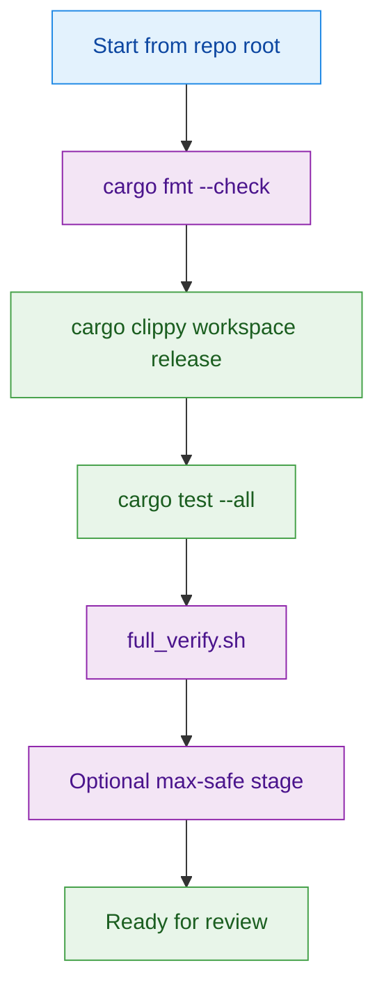
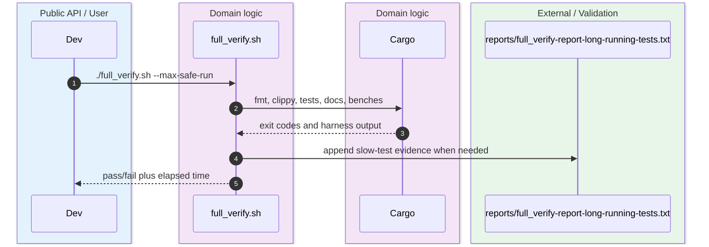
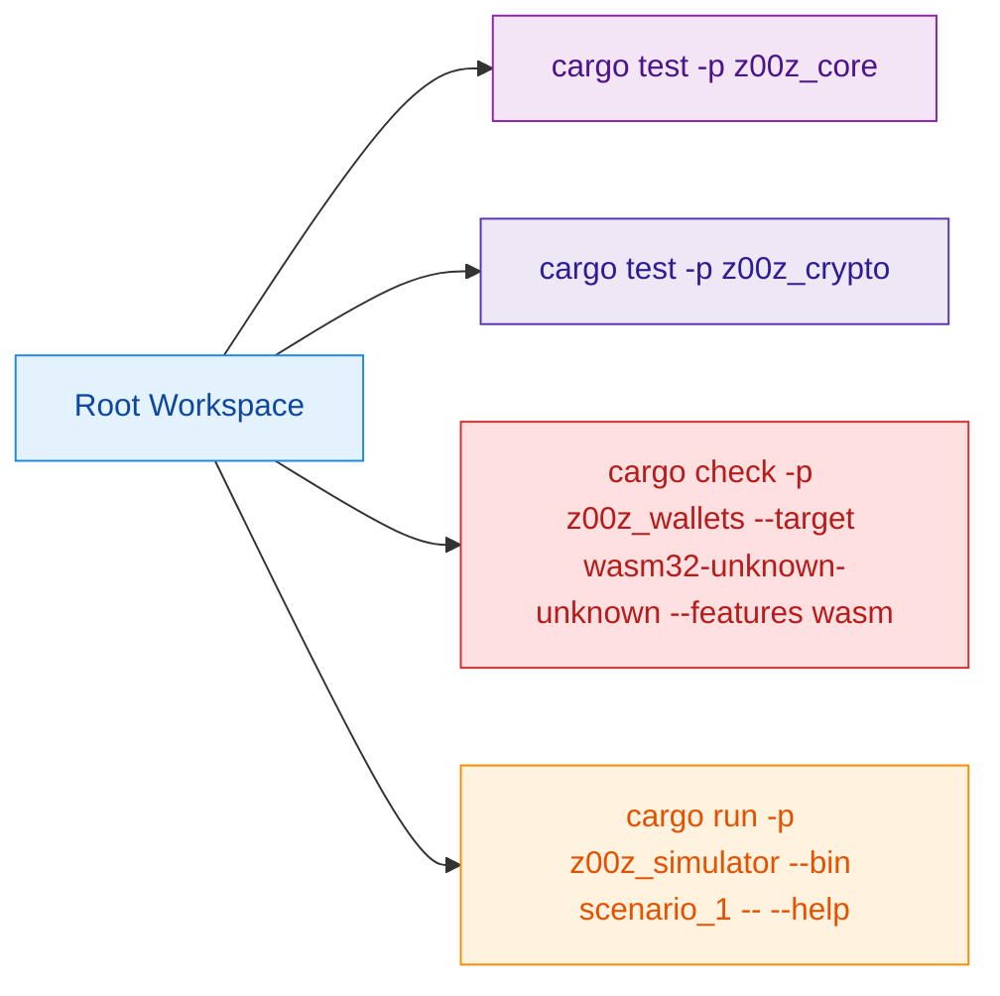

Z00Z already encodes its preferred verification path in repository-local instructions and scripts. The fastest way to avoid drift is to follow those exact commands instead of inventing a custom per-crate workflow. `.github/copilot-instructions.md:141-149` `.github/skills/z00z-full-verify-gate/scripts/full_verify.sh:64-103`

## 🎯 At A Glance

| Component | Responsibility | Key file | Source |
|---|---|---|---|
| Workspace verify gate | Runs fmt, clippy, tests, docs, benches, runnable targets, and optional heavy stages. | `./.github/skills/z00z-full-verify-gate/scripts/full_verify.sh` | `.github/skills/z00z-full-verify-gate/scripts/full_verify.sh:64-103` |
| Crypto package verification | Publishes crate-local check, clippy, and test commands. | `crates/z00z_crypto/README.md` | `crates/z00z_crypto/README.md:28-35` |
| Wallet WASM lane | Documents native and `wasm32` checks for wallet work. | `crates/z00z_wallets/README.md` | `crates/z00z_wallets/README.md:113-149` |
| Simulator entrypoint | Exposes the scenario runner binary. | `crates/z00z_simulator/Cargo.toml` | `crates/z00z_simulator/Cargo.toml:26-36` |

## 🧭 Verify Flow

<!-- Sources: .github/skills/z00z-full-verify-gate/scripts/full_verify.sh:64-103, .github/copilot-instructions.md:141-149 -->

<!-- Sources: .github/skills/z00z-full-verify-gate/scripts/full_verify.sh:9-20, .github/skills/z00z-full-verify-gate/scripts/full_verify.sh:64-103, .github/skills/z00z-full-verify-gate/scripts/full_verify.sh:173-207 -->

<!-- Sources: crates/z00z_core/Cargo.toml:1-34, crates/z00z_crypto/README.md:28-35, crates/z00z_wallets/README.md:113-149, crates/z00z_simulator/Cargo.toml:26-36 -->

## ⚙️ Canonical Commands

| Scope | Command | Why this is canonical | Source |
|---|---|---|---|
| Formatting | `cargo fmt --check` | First stage in the repository verify gate. | `.github/skills/z00z-full-verify-gate/scripts/full_verify.sh:73-76` |
| Lint | `cargo clippy --workspace --release --all-targets --all-features -- -D warnings` | Matches the gate exactly, including all targets and release mode. | `.github/skills/z00z-full-verify-gate/scripts/full_verify.sh:73-76` |
| Workspace tests | `cargo test --all` | Repository-local instructions require all tests to pass before completion. | `.github/copilot-instructions.md:141-149` |
| Release-style gate | `./.github/skills/z00z-full-verify-gate/scripts/full_verify.sh` | Adds docs, benches, runnable targets, and slow-test collection. | `.github/skills/z00z-full-verify-gate/scripts/full_verify.sh:73-83` |
| Max-safe sweep | `./.github/skills/z00z-full-verify-gate/scripts/full_verify.sh --max-safe-run` | Enables the optional max-safe stage that reuses prebuilt artifacts. | `.github/skills/z00z-full-verify-gate/scripts/full_verify.sh:66-72` |

## 🔧 Crate-Specific Shortcuts

| Crate | Useful targeted command | When to use it | Source |
|---|---|---|---|
| `z00z_crypto` | `cargo test --package z00z_crypto --release --features test-params-fast` | Fastest focused pass when touching crypto internals. | `crates/z00z_crypto/README.md:28-35` |
| `z00z_wallets` | `cargo check --target wasm32-unknown-unknown --features wasm -p z00z_wallets` | Validate the wallet WASM lane after wallet changes. | `crates/z00z_wallets/README.md:117-127` |
| `z00z_simulator` | `cargo run --package z00z_simulator --bin scenario_1 -- --help` | Confirm the harness binary resolves and its CLI wiring is intact. | `crates/z00z_simulator/Cargo.toml:26-36` `crates/z00z_simulator/bin/scenario_1.rs:71-73` |
| `z00z_core` | `cargo test --package z00z_core --release --all-features` | Focus on protocol, genesis, and asset changes. | `crates/z00z_core/Cargo.toml:43-69` |

## 🛑 What The Gate Actually Adds

| Gate stage beyond ordinary `cargo test` | Why it matters | Source |
|---|---|---|
| Doc tests and `cargo doc`-style surface checks | Keeps public API documentation from silently drifting. | `.github/skills/z00z-full-verify-gate/scripts/full_verify.sh:76-79` |
| `cargo bench --no-run` | Detects bench compile regressions even when no benchmark is executed. | `.github/skills/z00z-full-verify-gate/scripts/full_verify.sh:78-80` |
| Runnable target sweep | Checks whitelisted bins/examples still launch. | `.github/skills/z00z-full-verify-gate/scripts/full_verify.sh:79-83` |
| Long-test report | Emits a persistent report for suites that exceed the configured threshold. | `.github/skills/z00z-full-verify-gate/scripts/full_verify.sh:9-13` `.github/skills/z00z-full-verify-gate/scripts/full_verify.sh:173-207` |

## 📖 References

- `.github/copilot-instructions.md:141-149`
- `.github/skills/z00z-full-verify-gate/scripts/full_verify.sh:64-103`
- `crates/z00z_crypto/README.md:28-35`
- `crates/z00z_wallets/README.md:113-149`
- `crates/z00z_simulator/Cargo.toml:26-36`

## Related Pages

| Page | Relationship |
|---|---|
| [Workspace Overview](./workspace-overview.md) | Explains why these commands are run from the workspace root. |
| [Workspace Map](./workspace-map.md) | Helps choose the right crate for targeted commands. |
| [Scenario Pipeline](../06-simulator-and-quality/scenario-pipeline.md) | Shows why simulator commands matter in the release packet. |
